# KOAGÜLASYON BOZUKLUKLARI -- GÖRSEL ATLAS

**Hazırlayan:** Prof. Dr. İrfan Yavaşoğlu
**Bölüm:** Hematoloji

---

> **Not:** Bu not, Prof. Dr. İrfan Yavaşoğlu tarafından derste paylaşılan **8 öğretici görselin** yapılandırılmış Türkçe atlasıdır. Her görsel için tanımlama, klinik açıklama ve ilişkili mekanizma verilmiştir. Kanama bozuklukları genel yaklaşımı için [Kanama Bozukluklarına Genel Yaklaşım](kanamaya-genel-yaklasim.md) ve [Kalıtsal Koagülasyon Hastalıkları](kanama-bozukluklari.md) notlarına bakınız.

---

## İÇİNDEKİLER

1. [Görsel 1 -- Hemostaz Mekanizmasının Genel Bakışı](#g1)
2. [Görsel 2 -- Yaygın Peteşi/Purpura (Trombositopeni)](#g2)
3. [Görsel 3 -- Hemartroz (Hemofili)](#g3)
4. [Görsel 4 -- Primer Hemostaz 4 Fazı (Moleküler)](#g4)
5. [Görsel 5 -- Klasik Koagülasyon Kaskadı](#g5)
6. [Görsel 6 -- Peteşi vs Purpura (Etiketli)](#g6)
7. [Görsel 7 -- Peteşi/Purpura/Ekimoz Karşılaştırma Tablosu](#g7)
8. [Görsel 8 -- Entegre Hemostaz ve Fibrinolitik Sistem](#g8)
9. [Özet Klinik Ayrım Kılavuzu](#ozet)

---

<a id="g1"></a>

## GÖRSEL 1 -- HEMOSTAZ MEKANİZMASININ GENEL BAKIŞI

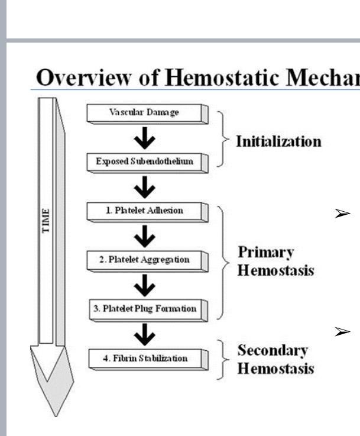

### Görselin Anlatımı

Hemostazın zamana bağlı akış şeması -- yukarıdan aşağı ilerleyen 4 temel adım:

| Faz | Adım | Süre | Mekanizma |
|---|---|---|---|
| **Initialization (Başlangıç)** | 1. Vascular Damage (Damar hasarı) | Saniyeler | Endotel bütünlüğü bozulur |
| **Initialization** | 2. Exposed Subendothelium (Subendotel açığa çıkar) | Saniyeler | Kollajen ve VWF açığa çıkar |
| **Primary Hemostasis (Primer Hemostaz)** | 1. Platelet Adhesion (Trombosit yapışması) | Saniyeler | GPIb-V-IX ↔ VWF ↔ subendotel |
| **Primary Hemostasis** | 2. Platelet Aggregation (Trombosit agregasyonu) | Saniyeler-dakikalar | GPIIb/IIIa ↔ fibrinojen |
| **Primary Hemostasis** | 3. Platelet Plug Formation (Trombosit tıkacı) | Dakikalar | Geçici tıkaç |
| **Secondary Hemostasis (Sekonder Hemostaz)** | 4. Fibrin Stabilization | Dakikalar-saatler | Koagülasyon kaskadı + FXIIIa |

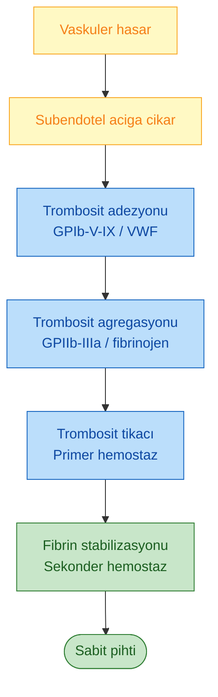

**Klinik önem:** Primer hemostaz defekti (trombositopeni, trombosit fonksiyon bozukluğu, VWD) **erken, mukokutanöz** kanamalara yol açar. Sekonder hemostaz defekti (hemofili, koagülopati) ise **gecikmiş, derin doku/eklem** kanamalarına yol açar.

---

<a id="g2"></a>

## GÖRSEL 2 -- YAYGIN PETEŞİ/PURPURA

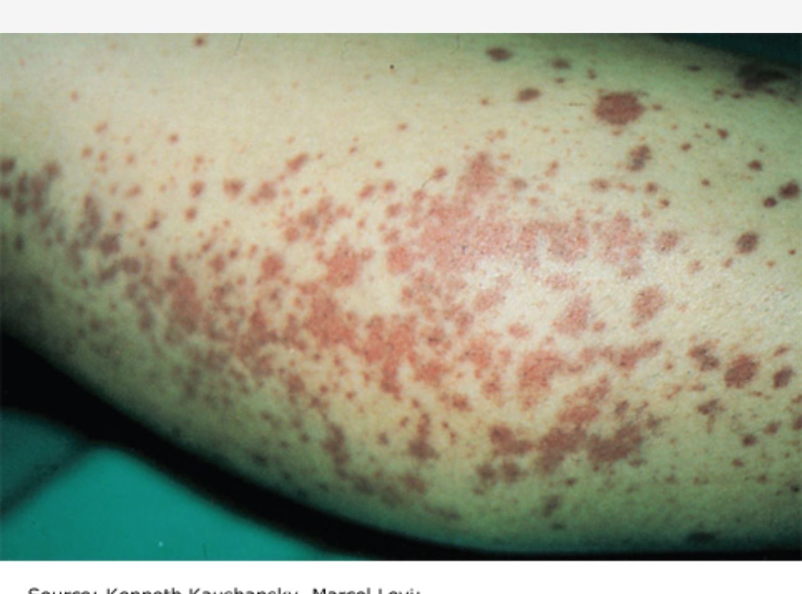

### Görselin Anlatımı

Alt ekstremitede **yaygın mukokutanöz kanama tablosu:**

* **Çok sayıda küçük, nokta şeklinde kırmızı-kahverengi lezyon** (peteşi)
* Yer yer **birleşen, daha büyük morumsu alanlar** (purpura)
* Dağılım: bacağın gravite bağımlı yüzeyi (aşağı kısım) -- tipik hidrostatik artış bölgesi
* **Basmakla solmaz** (damar içi kanama ≠ vazodilatasyon)

### Olası Klinik Tablolar

| Tablo | İpucu |
|---|---|
| **İmmün Trombositopeni (İTP)** | İzole trombositopeni, genç erişkin, ani başlangıç |
| **Trombotik Trombositopenik Purpura (TTP)** | Peteşi + mikroanjiyopatik hemoliz + ateş + nörolojik + böbrek |
| **Hemolitik Üremik Sendrom (HÜS)** | Çocuk, ishal sonrası, böbrek yetmezliği |
| **Dissemine İntravasküler Koagülasyon (DİC)** | Sepsis, malignite, travma; PT/aPTT uzun, fibrinojen ↓ |
| **İlaç/Sepsis/Radyoterapi kaynaklı trombositopeni** | Öykü |
| **Kapiller frajilite (yaşlı, steroid kullanımı)** | Lokal, basınç bölgesi |

> **Önemli:** Bu görüntüyle gelen hastada hemogram + periferik yayma mutlaka istenmeli. Trombosit sayısı **<20 × 10⁹/L** altında spontan peteşi riski artar; **<10 × 10⁹/L** altında ciddi kanama riski.

---

<a id="g3"></a>

## GÖRSEL 3 -- HEMARTROZ (HEMOFİLİ)

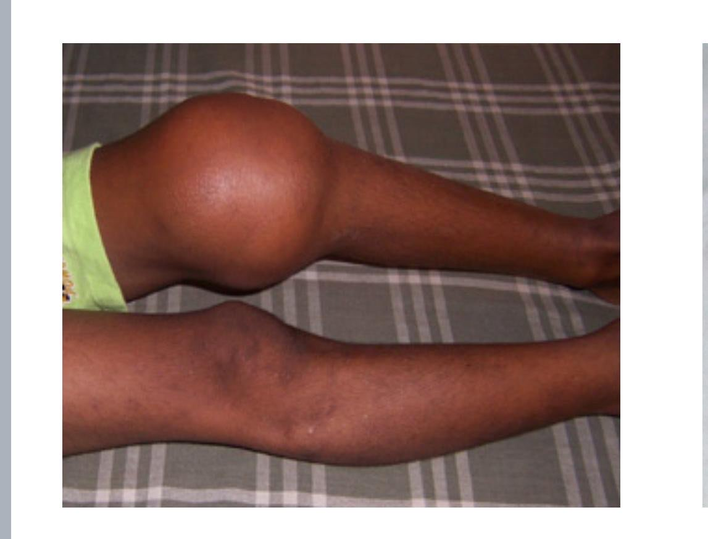

### Görselin Anlatımı

Tek taraflı (sol) **diz ekleminde masif şişlik** -- karşı dizle kıyaslanınca belirgin farklı. **Hemartroz** (eklem içi kanama) klasik görünümü:

* Şiş, gergin, yuvarlak eklem
* Cilt gergin ama purpura/peteşi **yok** (sekonder hemostaz defekti → derin kanama)
* Genellikle **ağrılı, sıcak, hareket kısıtlı**

### Hemartroz -- En Sık Neden: Hemofili

| Hemofili | Faktör | Kalıtım | Özellik |
|---|---|---|---|
| **Hemofili A** | FVIII eksikliği | **X'e bağlı resesif** | En sık (~%80) |
| **Hemofili B (Christmas)** | FIX eksikliği | X'e bağlı resesif | ~%20 |
| **Hemofili C** | FXI eksikliği | OR | Nadir, Aşkenazi Yahudi |

**Hemofili şiddet sınıflaması (FVIII/IX düzeyi):**

| Şiddet | Faktör düzeyi | Klinik |
|---|---|---|
| **Ağır** | <%1 | Spontan hemartroz, kas içi kanama, yaşam boyu kanama |
| **Orta** | %1-5 | Minor travma sonrası kanama |
| **Hafif** | %5-40 | Cerrahi/travma sonrası uzamış kanama |

### Hemofilik Artropati

* Tekrarlayan hemartrozlar → sinovit → kıkırdak destrüksiyonu → **hemofilik artropati** (kronik sakatlık)
* En sık tutulan eklemler: **diz > ayak bileği > dirsek**
* Profilaktik faktör konsantresi tedavisi artropatiyi önler

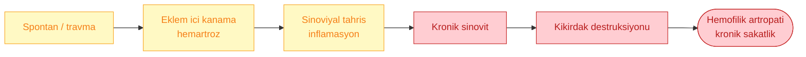

---

<a id="g4"></a>

## GÖRSEL 4 -- PRİMER HEMOSTAZ 4 FAZI (MOLEKÜLER)

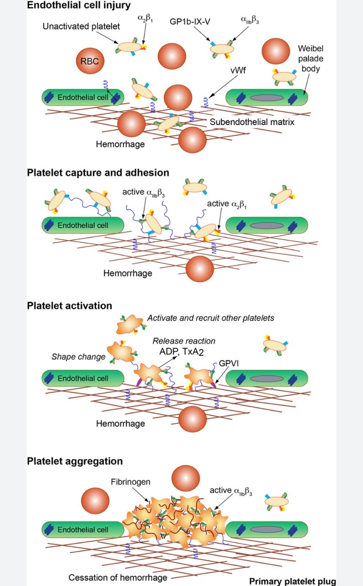

### Görselin Anlatımı

Primer hemostazın **4 moleküler fazı** yukarıdan aşağı:

### Faz 1 -- Endothelial Cell Injury (Endotel Hasarı)

* **Unactivated platelet** reseptörleriyle: **α₂β₁** (kollajen), **GPIb-IX-V** (VWF), **αIIbβ₃** (fibrinojen/aktivasyon sonrası)
* **RBC'ler** (eritrositler) akımda
* **VWF** endotelde Weibel-Palade cisimciklerinden salınır
* **Subendotelyal matriks** (kollajen ağı) hasarla açığa çıkar
* **Hemoraji** başlar

### Faz 2 -- Platelet Capture and Adhesion (Yakalama ve Yapışma)

* VWF, açığa çıkan kollajene bağlanır ve GPIb-IX-V üzerinden trombositi **yakalar**
* **Active α₂β₁** kollajene doğrudan yapışır
* **Active αIIbβ₃** aktive olur (inside-out signaling)

### Faz 3 -- Platelet Activation (Trombosit Aktivasyonu)

* **Shape change** (disk → dendritik/yıldız şekli)
* **Release reaction**: dense granüllerden **ADP, TxA₂** salınır
* **GPVI** reseptörü kollajen üzerinden aktivasyon sinyalini güçlendirir
* **Activate and recruit other platelets** (pozitif geri besleme)

### Faz 4 -- Platelet Aggregation (Trombosit Agregasyonu)

* **Fibrinojen**, iki trombositin **αIIbβ₃**'ı arasında **köprü** oluşturur
* Hücre-hücre agregasyonu → **primary platelet plug**
* **Cessation of hemorrhage** (hemoraji durur)

### Reseptör-Ligand Özet Tablosu

| Reseptör | Trombosit yüzeyinde | Ligand | Fonksiyon | İlgili defekt |
|---|---|---|---|---|
| **GPIb-IX-V** | Yapısal (her zaman var) | **VWF** (subendotele bağlı) | Yakalama (yüksek shear) | **Bernard-Soulier sendromu** |
| **α₂β₁ (GPIa/IIa)** | Yapısal | Kollajen | Direkt yapışma | Nadir, hafif |
| **GPVI** | Yapısal | Kollajen | Aktivasyon sinyali | Nadir |
| **αIIbβ₃ (GPIIb/IIIa)** | Aktivasyon sonrası | **Fibrinojen**, VWF, fibronektin | Agregasyon | **Glanzmann trombastenisi** |
| **P2Y₁₂** | Yapısal | ADP | Aktivasyon amplifikasyonu | Klopidogrel hedefi |
| **TP (TxA₂ reseptörü)** | Yapısal | TxA₂ | Aktivasyon | Aspirin (dolaylı) hedefi |

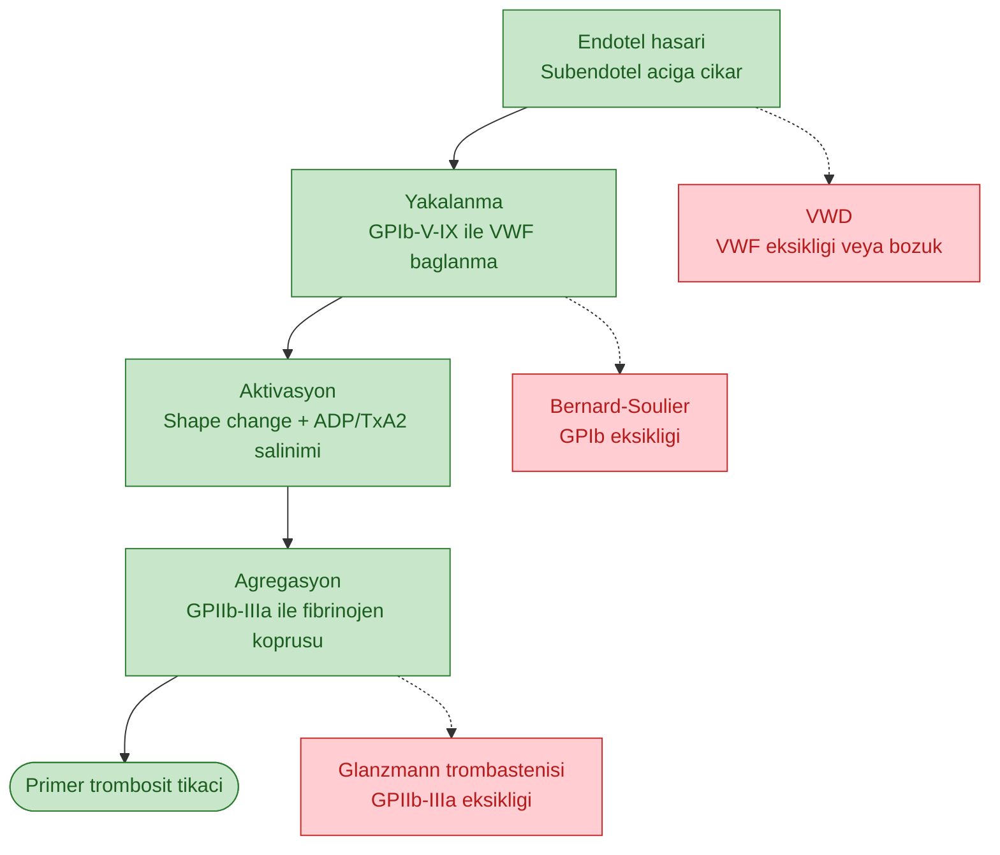

---

<a id="g5"></a>

## GÖRSEL 5 -- KLASİK KOAGÜLASYON KASKADI

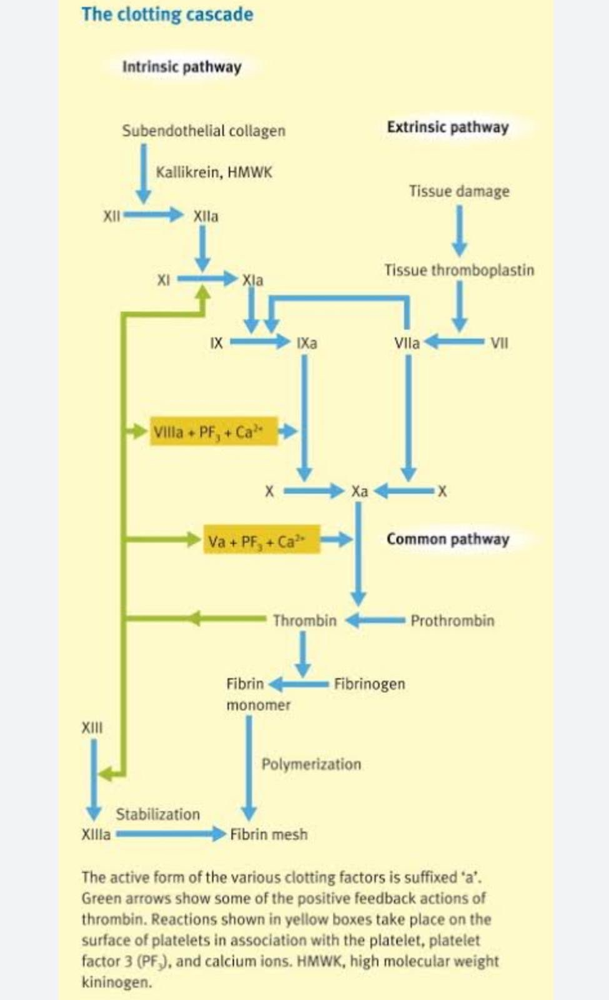

### Görselin Anlatımı

Klasik **intrinsik + ekstrinsik + ortak yol** koagülasyon kaskadı:

### İntrinsik Yol (aPTT ile ölçülür)

```
Subendotel kollajen + Kallikrein + HMWK
         ↓
XII ──────→ XIIa
         ↓
XI  ──────→ XIa
         ↓
IX  ──────→ IXa
         ↓
         + VIIIa + PF3 + Ca²⁺  (tenase kompleksi)
         ↓
X   ──────→ Xa
```

### Ekstrinsik Yol (PT/INR ile ölçülür)

```
Doku hasarı → Tissue thromboplastin (Tissue Factor)
                        ↓
VII ─────────────→ VIIa
                        ↓
X   ─────────────→ Xa
```

### Ortak Yol

```
Xa + Va + PF3 + Ca²⁺  (protrombinaz kompleksi)
         ↓
Protrombin (II) ──→ Thrombin (IIa)
         ↓
Fibrinojen (I) ──→ Fibrin monomer
         ↓
   Polimerizasyon
         ↓
Fibrin mesh (çözünür)
         ↓
   + XIIIa (Ca²⁺)
         ↓
Çapraz bağlı fibrin (stabil pıhtı)
```

### Trombinin Pozitif Feedback Etkileri (yeşil oklar)

Trombin sadece fibrinojeni aktive etmekle kalmaz, kendini amplifiye eder:

* **XI → XIa** (intrinsik amplifikasyon)
* **VIII → VIIIa** (tenase kompleksi)
* **V → Va** (protrombinaz kompleksi)
* **XIII → XIIIa** (fibrin stabilizasyonu)

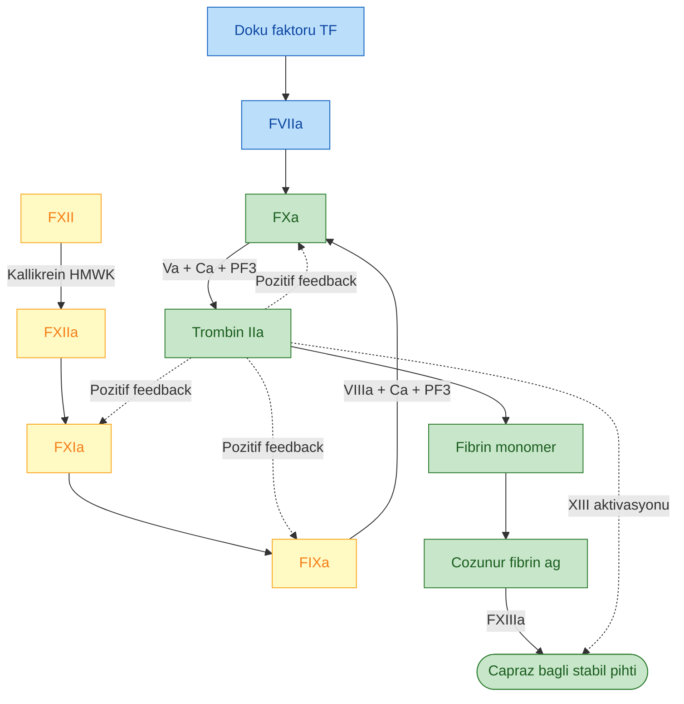

### Faktör Eksikliklerinde Lab Bulguları

| Eksik Faktör | aPTT | PT | Klinik |
|---|---|---|---|
| **Ortak yol (II, V, X, fibrinojen)** | Uzun | Uzun | Orta-ağır kanama |
| **İntrinsik (VIII, IX, XI)** | **Uzun** | Normal | Hemofili A/B/C -- hemartroz |
| **Ekstrinsik (VII)** | Normal | **Uzun** | Kanama değişken |
| **XII, HMWK, prekallikrein** | Uzun | Normal | **Kanama YOK** (in vivo önemsiz) |
| **XIII** | Normal | Normal | Geç kanama (göbek kordonu, yara iyileşmesi) |

---

<a id="g6"></a>

## GÖRSEL 6 -- PETEŞİ vs PURPURA (ETİKETLİ)

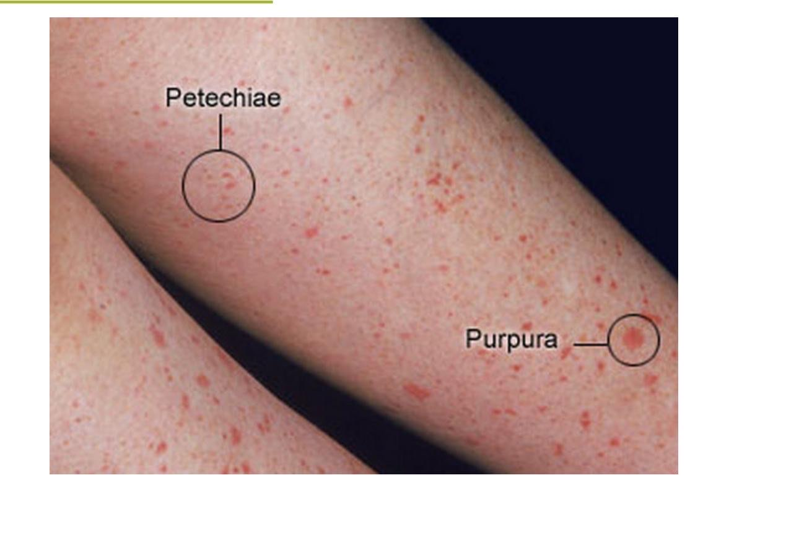

### Görselin Anlatımı

İki kanama morfolojisi yan yana etiketli:

* **Peteşi** (daire 1): Çok sayıda **küçük (1-2 mm)**, nokta benzeri kırmızı lezyon
* **Purpura** (daire 2): Daha büyük (**3 mm - 1 cm**), birleşen morumsu plak

### Ayırt Edici Özellik

**Her ikisi de basmakla SOLMAZ** -- çünkü kan damardan çıkıp dokuya sızmıştır; vazodilatasyon değil.

> Vazodilatasyon kaynaklı **eritem/makül** basmakla solar. Kan sızıntısı (peteşi/purpura/ekimoz) **solmaz.**

---

<a id="g7"></a>

## GÖRSEL 7 -- PETEŞİ/PURPURA/EKİMOZ KARŞILAŞTIRMA TABLOSU

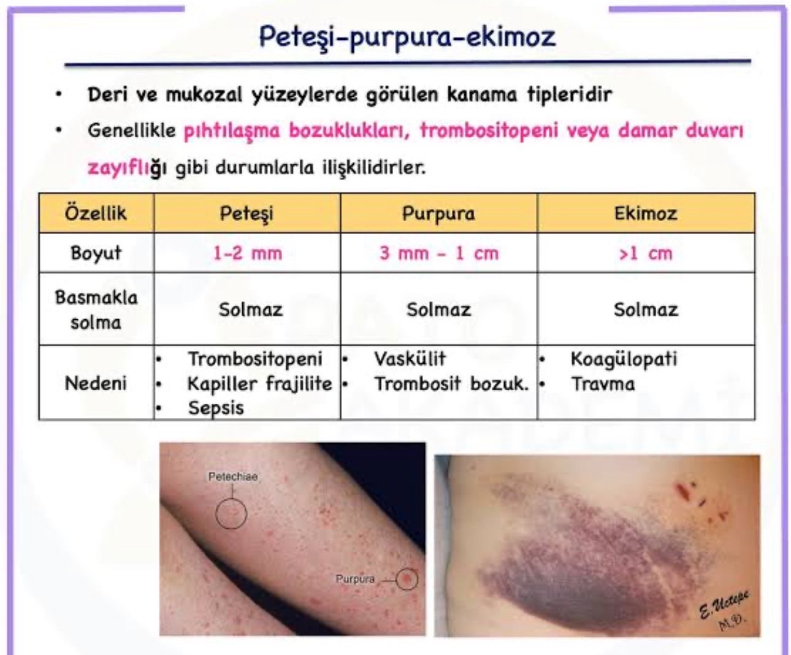

### Görselin Anlatımı (Orijinal Türkçe Tablo)

**Tanım:** Deri ve mukozal yüzeylerde görülen kanama tipleridir. Genellikle **pıhtılaşma bozuklukları, trombositopeni veya damar duvarı zayıflığı** gibi durumlarla ilişkilidirler.

| Özellik | **Peteşi** | **Purpura** | **Ekimoz** |
|---|---|---|---|
| **Boyut** | **1-2 mm** | **3 mm - 1 cm** | **>1 cm** |
| **Basmakla solma** | Solmaz | Solmaz | Solmaz |
| **Nedeni** | Trombositopeni<br>Kapiller frajilite<br>Sepsis | Vaskülit<br>Trombosit fonksiyon bozukluğu | Koagülopati<br>Travma |

### Klinik İpucu Tablosu (Genişletilmiş)

| Lezyon | Boyut | Tipik Neden | Ayrıntılı Diff |
|---|---|---|---|
| **Peteşi** | 1-2 mm | Trombositopeni, kapiller frajilite, sepsis | İTP, TTP, DİC, ilaca bağlı |
| **Purpura** | 3 mm - 1 cm | Vaskülit, trombosit fonksiyon bozukluğu | IgA vaskülit (HSP), senil purpura, steroid, skorbut |
| **Ekimoz** | >1 cm | Koagülopati, travma | Hemofili, warfarin, DOAC, karaciğer yetmezliği, K vit eksikliği |

### Palpasyon İpucu

| Lezyon Tipi | Palpasyon |
|---|---|
| **Düz (non-palpabl) purpura** | Trombositopeni, koagülopati |
| **Kabarık (palpabl) purpura** | **Vaskülit** (lökositoklastik, HSP) |

---

<a id="g8"></a>

## GÖRSEL 8 -- ENTEGRE HEMOSTAZ VE FİBRİNOLİTİK SİSTEM

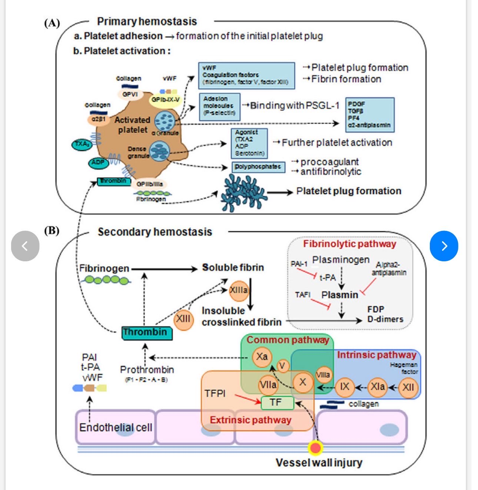

### Görselin Anlatımı

İki büyük panelde entegre sistem:

### (A) Primer Hemostaz

* **Adezyon:** Kollajen ↔ GPVI, α₂β₁; VWF ↔ GPIb-IX-V
* **Aktivasyon agonistleri:** TxA₂, ADP, serotonin (dense granülden); trombin
* **α-granül salınımı:**
  * VWF, koagülasyon faktörleri (fibrinojen, FV, FXIII) → **trombosit tıkacı + fibrin oluşumu**
  * **Adezyon molekülleri** (P-selektin) → PSGL-1 ile bağlanma (lökosit-trombosit etkileşimi)
  * Büyüme faktörleri: **PDGF, TGF-β, PF4, α₂-antiplazmin**
* **Dense granül:** Agonist TxA₂, ADP, serotonin → daha fazla trombosit aktivasyonu
* **Polifosfatlar:** prokoagülan + antifibrinolitik
* **Agregasyon:** GPIIb/IIIa ↔ fibrinojen → **trombosit tıkacı**

### (B) Sekonder Hemostaz + Fibrinoliz

**Vessel wall injury (damar duvarı hasarı):**

* **Ekstrinsik yol** (pembe): Doku faktörü (TF) + VIIa → X → Xa (TFPI bu yolu inhibe eder)
* **İntrinsik yol** (mor): Hageman factor (XII) → XIIa → XIa → IXa → + VIIIa → X → Xa (kollajen ile temasla başlar)
* **Ortak yol** (yeşil): Xa + V → **Protrombin (F1-F2-A-B)** → **Trombin** → Fibrinojen → çözünür fibrin → +XIIIa → **çapraz bağlı fibrin**

**Fibrinolitik yol:**

* **Plazminojen** → **Plazmin** (t-PA ile aktive edilir)
* **Plazmin** fibrin pıhtısını parçalar → **FDP (fibrin yıkım ürünleri)** ve **D-dimer**
* İnhibitörler:
  * **PAI-1** t-PA'yı inhibe eder (fibrinoliz frenler)
  * **α₂-antiplazmin** plazmini inhibe eder
  * **TAFI** (thrombin-activatable fibrinolysis inhibitor) -- trombin ile aktive, plazmini engeller
* Endotel hücresi: **PAI, t-PA, VWF** salgılar

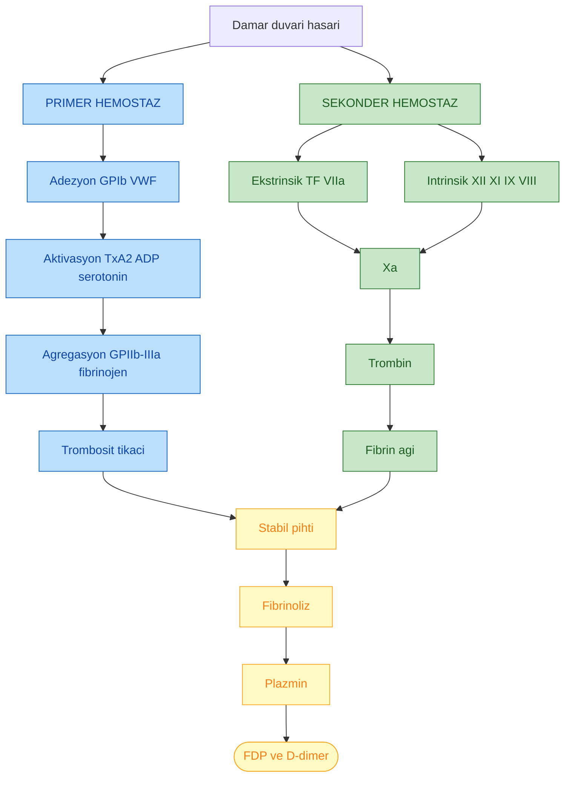

### Antikoagülan Denge (Görselde Gösterilmeyen Ama Önemli)

Pıhtılaşma sistemi **sürekli dengede** tutulur; antikoagülan mekanizmalar:

| Antikoagülan | Hedef | Klinik |
|---|---|---|
| **Antitrombin (ATIII)** | Xa ve trombin | Heparin bu yolla çalışır |
| **Protein C + Protein S** | Va, VIIIa | Warfarin bunları etkiler -- "warfarin-induced skin necrosis" |
| **TFPI** | VIIa-TF kompleksi | Ekstrinsik yolu erken frenler |
| **Trombomodulin** | Trombini protein C aktivasyonuna yönlendirir | Endotel-bağımlı |

---

<a id="ozet"></a>

## ÖZET -- KLİNİK AYRIM KILAVUZU

Görsellerin özet klinik öğretisi:

| Özellik | **Primer Hemostaz Defekti** | **Sekonder Hemostaz Defekti** |
|---|---|---|
| **Lezyon tipi** | Peteşi, purpura, mukokutanöz kanama | Ekimoz, hemartroz, kas içi hematom |
| **Başlangıç** | Yaralanma sonrası **erken** (dakikalar) | **Gecikmiş** (saatler-günler) |
| **Lokalizasyon** | Cilt, mukoza, burun, diş eti, menoraji | Eklem, kas, derin doku, BOS, üriner |
| **Tipik hastalık** | İTP, TTP, VWD, trombosit fonksiyon bozukluğu, ilaç | Hemofili A/B, K vit eksikliği, warfarin, karaciğer yetmezliği, DOAC |
| **Test** | **Trombosit sayısı**, kanama zamanı, PFA-100, VWF paneli | **PT, aPTT**, faktör düzeyleri, mikst test |
| **Görsel ipucu** | Görsel 2, 6, 7 | Görsel 3 |
| **Tedavi** | Trombosit süspansiyonu, steroid, IVIG, VWF/DDAVP | Faktör konsantresi, FFP, K vitamini, antidot |

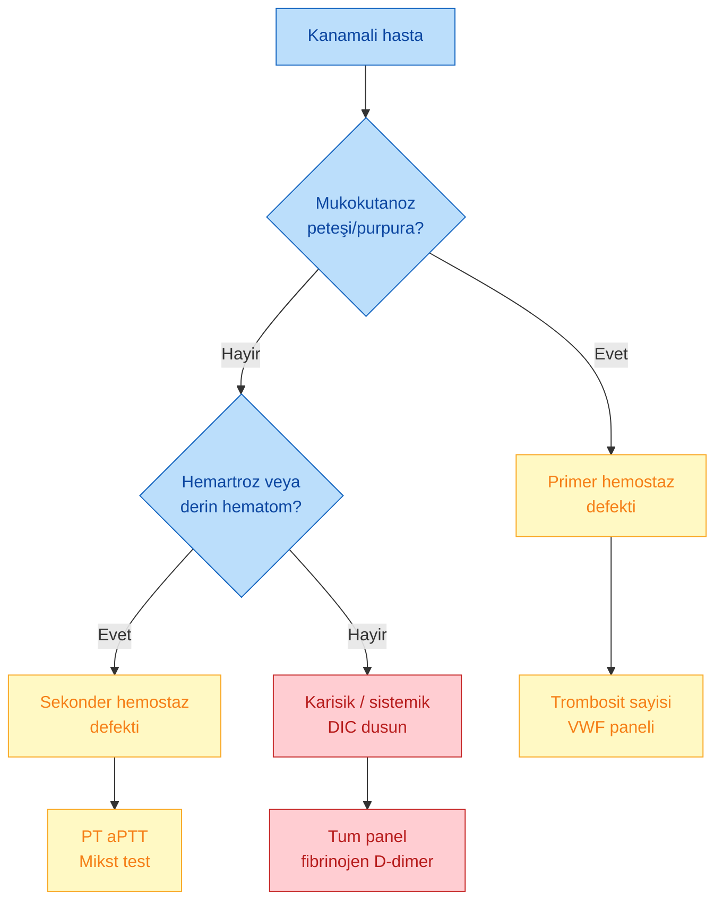

---

> **Öğretici Sonuç:** Bu 8 görsel birlikte, koagülasyon bozukluklarına **görsel temelli, mekanizma-odaklı** bir giriş sunmaktadır. Klinik pratikte **lezyonun morfolojisi (peteşi vs ekimoz)**, **kanama başlangıç zamanı (erken vs gecikmiş)** ve **tutulan bölge (mukokutanöz vs eklem-kas)** üç anahtar ipucudur; laboratuvar bunları doğrular ve spesifik tanıya götürür.

---

**Kaynak görseller:** Prof. Dr. İrfan Yavaşoğlu, "İrfan Hoca Koagülasyon Bozuklukları Resimleri.pdf". Alıntı görseller: Williams Hematology (Kaushansky, Levi), klasik hematoloji atlasları ve Türkçe patolojik morfoloji tabloları.
