# KRONİK LÖSEMİLER

**Hazırlayan:** Doç. Dr. Atakan Turgutkaya
**Bölüm:** Aydın Adnan Menderes Üniversitesi - Erişkin Hematoloji Bilim Dalı

---

## İÇİNDEKİLER

1. [Giriş](#giriş)
2. [Kronik Lenfositik Lösemi (KLL)](#kronik-lenfositik-lösemi-kll)
3. [Kronik Myeloid Lösemi (KML)](#kronik-myeloid-lösemi-kml)

---

## GİRİŞ

Kronik lösemiler, hematopoetik kök hücreden köken alan ve görece olgun hücrelerin klonal proliferasyonu ile karakterize hastalıklardır. İki ana grupta incelenir:

- **Kronik Lenfoid Lösemi (KLL)**
- **Kronik Myeloid Lösemi (KML)**

---

## KRONİK LENFOSİTİK LÖSEMİ (KLL)

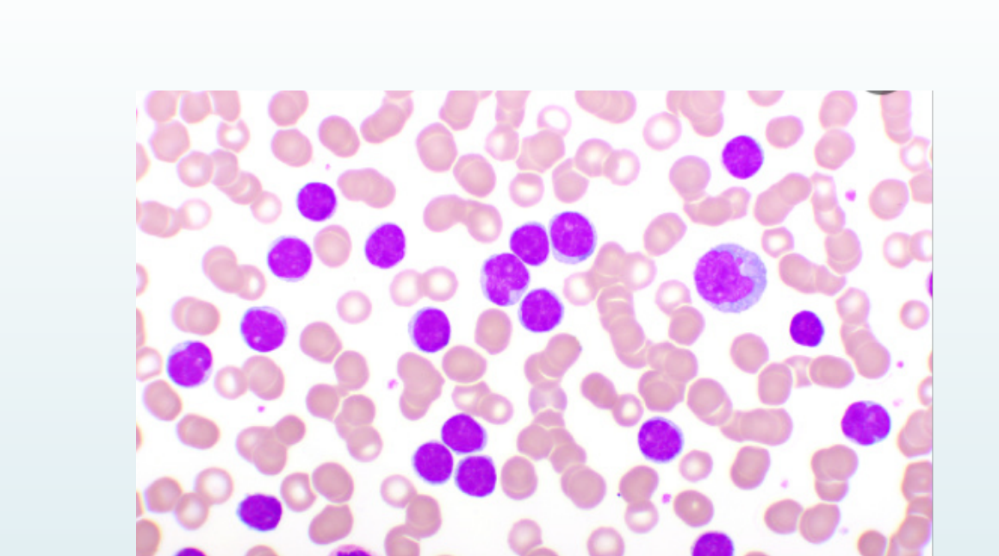

> Periferik yaymada **homojen, küçük, kondanse kromatinli matür lenfositler** baskındır. Az sitoplazma, yuvarlak nükleus. KLL'nin klasik görüntüsü; hücreler birbirine çok benzer (monoklonal proliferasyon). Hassas yaymada **smudge cell (Gumprecht gölgesi)** sıkça görülür.

### Tanım

> KLL, matur B lenfositlerin monoklonal proliferasyonu ile karakterize bir hastalıktır. Tanı için kanda monoklonal B lenfosit sayısının **> 5 × 10⁹/L** olması gerekir.

**Monoklonal B Hücreli Lenfositoz (MBL):**

* Lenfosit sayısı 4-5 × 10⁹/L
* Sitopeni yok
* Nodal, dalak ve karaciğer tutulumu yok
* Yılda %1-2 oranında aşikar KLL'ye dönüşür

**⚠️ ÖNEMLİ:** KLL heterojen seyirlidir. Bazı hastalar hiçbir zaman tedavi gerektirmez, bazıları ise hemen tedaviye ihtiyaç duyar.

### Epidemiyoloji

| Özellik | Değer |
|---|---|
| Ortanca yaş | 71 |
| Yaşa uyarlanmış insidans | 4.5/100.000 (ABD) |
| Kadın/Erkek oranı | 2/1 |
| İyonizan radyasyon ilişkisi | Yok |
| Ailevi yatkınlık | En çok ailevi yatkınlığı olan hematolojik malignite |
| 1. derece akrabada KLL varsa risk | Genel nüfusa göre **8.5 kat** artmış |

**Tarihsel maruziyet:** Vietnam savaşında Agent Orange (portakal gazı, trikloro fenoksi asetik asit) maruziyeti ile ilişki bildirilmiştir.

### Hücre Kökeni

* Tümör hücreleri **matur B lenfositlerdir** (muhtemelen hafıza hücreleri)
* Morfoloji, immunfenotipleme ve gen ekspresyon paterni matur B lenfositleri ile aynıdır

### Reaktif Lenfositoz Ayırıcı Tanısı

KLL tanısı koymadan önce reaktif lenfositoz nedenleri dışlanmalıdır.

| Kategori | Alt grup | Nedenler |
|---|---|---|
| **Enfeksiyonlar** | Viral | Enfeksiyöz mononükleoz (EBV; CMV, diğer herpes virüsleri, HIV, adenovirüsler, toksoplazmoz) · CMV · Mononükleoz sendromu (adenovirus tip 12, herpes virüs-6) · HIV-1 (CMV ile birlikte erken serokonversiyonda; kronik post-splenektomi durumu) · HTLV-1 ilişkili benign T hücreli lenfositoz · Kabakulak, suçiçeği, influenza, hepatit, kızamıkçık, roseola · Enfeksiyöz lenfositoz (coxsackie B2, enterovirüsler -- poliovirüs dahil) |
| | Bakteriyel | Boğmaca (Pertussis) · (Olası) Kedi tırmığı hastalığı, tüberküloz, brusellozis, sifiliz |
| | Protozoal | Toksoplazmoz |
| | Paraziter | Babesiyozis |
| | Riketsiyal | (Olası) Çalı tifüsü (scrub typhus) |
| **Aşırı duyarlılık** | -- | İlaca bağlı · Serum hastalığı |
| **Stres** | -- | Travma sonrası · Splenektomi sonrası · Sigara içicileri |
| **Otoimmun** | -- | Büyük granüler lenfosit lenfositozu (LGL) · Romatoid artrit · Malign timoma |
| **Endokrin** | -- | Hipertiroidizm |

### Klinik Bulgular

* **Genellikle insidental** olarak saptanır
* Tipik bulgu: Lenfosit hakimiyetli lökositoz (veya nadiren normal lökosit sayısına rağmen lenfositoz)
* Lenfositoz tespit edildiğinde sonraki adım: **Periferik kandan akım sitometrisi ile monoklonalite araştırması**

### İmmunfenotipleme

KLL'nin tanısal flow sitometri özellikleri:

| Marker | KLL Bulgusu |
|---|---|
| **CD5** | (+) - T hücre markerı ama B1 alt grubunda da eksprese edilir |
| **CD19** | (+) |
| **CD20** | Dim (zayıf) (+) |
| **CD23** | (+) |
| **FMC-7** | (–) |
| **CD10** | (–) |
| **Hafif zincir kısıtlılığı** | Monoklonal kappa veya lambda restriksiyonu |
| **CD5/CD19 ortak alanı** | **>%20** (tanısal kriter) |

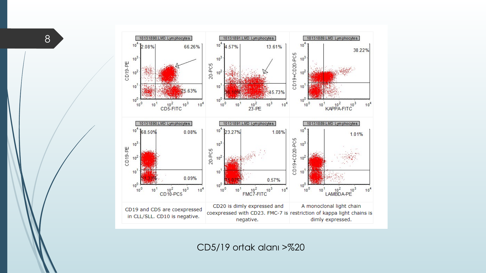

> **Akım sitometri yorumu (görseldeki 6 nokta grafiği):**
>
> * **Sol üst (CD19-PE vs CD5-FITC):** KLL/SLL'de **CD19 ve CD5 birlikte (ko-eksprese)** olarak işaretlidir. Hücrelerin %66'sı her iki marker pozitif (sağ üst kadran). **CD5/CD19 ortak alanı >%20** olması KLL için tanısal eşiktir.
> * **Orta üst (CD20 vs CD23):** CD20 **dim (zayıf)** eksprese, CD23 ile **birlikte** eksprese edilir.
> * **Sağ üst (Kappa-FITC):** Monoklonal hafif zincir kısıtlılığı -- **kappa** hafif zinciri **dim** olarak eksprese (bu hastada kappa restrikte klon).
> * **Sol alt (CD19 vs CD10):** **CD10 negatif** -- foliküler lenfomadan ayırıcıdır.
> * **Orta alt (CD20 vs FMC-7):** **FMC-7 negatif** -- mantle hücreli lenfomadan ayırıcıdır.
> * **Sağ alt (Lambda-PE):** Lambda hafif zinciri esas olarak negatif (kappa restriksiyonu doğrulanır).

#### Ayırıcı tanı flow sitometri özet:

| Hastalık | CD5 | CD23 | CD10 | CD20 | FMC-7 |
|---|---|---|---|---|---|
| **KLL** | + | + | – | dim (+) | – |
| Mantle hücreli lenfoma | + | – | – | mod/parlak (+) | + |
| Marjinal zon lenfoma | –/+ | –/+ | – | mod/parlak (+) | – |
| Foliküler lenfoma | – | – | + | + | – |

### Küçük Lenfositik Lenfoma (SLL)

* KLL ile aynı genetik ve moleküler özellikleri olan hastalıktır
* Bazı hastalarda küçük miktarda klonal proliferasyon olur
* Doku bazlı (LAP/HSM) tutulum ön plandadır, kemik iliği/kan tutulumu sınırlıdır
* SLL; KLL gibi tedavi edilir
* İleri safhalarda kan ve kemik iliği tutulumu da olur

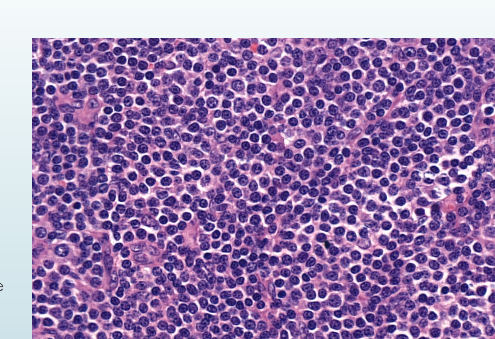

> **Histolojik yorum:** Lenf nodu kesitinde **normal mimari (germinal merkezler) tamamen silinmiş**, yerini **diffüz, monoton, küçük matür lenfosit infiltrasyonu** almıştır. Hücreler küçük, yuvarlak nükleuslu, kondanse (kümeli) kromatinli ve az sitoplazmalıdır -- KLL'deki periferik kan görünümünün doku karşılığı. Görselde yer yer izlenen **soluk alanlar (proliferasyon merkezleri / psödofoliküller)** SLL/KLL'nin **patognomonik** bulgusudur; bu alanlarda biraz daha büyük prolenfositler ve paraimmunoblastlar bulunur. Bu yapı KLL'nin lenf nodundaki karşılığıdır ve aynı klonal hastalığın doku formudur.

### KLL Evreleme Sistemleri

İki ayrı sistem kullanılır: **Modifiye Rai** (ABD) ve **Binet** (Avrupa).

| Risk grubu | Rai | Binet | Klinik |
|---|---|---|---|
| **Düşük** | 0 | A | Israrcı (uzun süreli) lenfositoz · Hb ≥10, Plt ≥100.000 · <3 lenf düğümü bölgesi |
| **Orta** | 1-2 | B | Evre 0 + LAP veya splenomegali/hepatomegali · Hb ≥10, Plt ≥100.000 · ≥3 lenf düğümü bölgesi |
| **Yüksek** | 3-4 | C | Anemi (Hb <11) ve/veya trombositopeni (<100.000) · Alan sayısı önemli değil |

### Tedavi Endikasyonları

> **Lenfositozun kendisi bir tedavi endikasyonu DEĞİLDİR.**

Tedavi başlama kriterleri:

1. **İlerleyici kemik iliği yetersizliği** -- Yeni başlayan veya derinleşen anemi/trombositopeni
2. **Masif splenomegali** -- Sol kosta kenarını en az 6 cm aşan, ilerleyici veya semptomatik
3. **Dirençli otoimmun komplikasyonlar** -- Kortikosteroid veya standart tedaviye yanıtsız OİHA ve/veya İTP
4. **Sistemik semptomlar:**
    * Son 6 ayda %10'dan fazla kilo kaybı, belirgin halsizlik/yorgunluk
    * İnfeksiyon olmaksızın ≥2 hafta süreyle 38°C üzeri ateş
    * İnfeksiyon olmaksızın ≥1 ay süreyle gece terlemesi

### Tedavi Öncesi Değerlendirme

* Öykü ve fizik inceleme (sistemik semptomlar ve PS dahil)
* Tam kan sayımı ve periferik yayma
* Biyokimya: Glukoz, BUN, kreatinin, LDH, ürik asit, ALT, AST, ALP, albumin, bilirubin
* Serum protein elektroforezi ve immunfiksasyon
* Kantitatif immunglobulin düzeyleri
* Retikülosit sayısı ve direkt Coombs testi
* **Viral seroloji:** HBV (HBsAg, anti-HBc), HCV, HIV -- özellikle immunokemoterapi sonrası **Hepatit B reaktivasyon riski** nedeniyle
* Doğurganlık çağındaki kadınlarda gebelik testi
* EKG ve sol ventrikül ejeksiyon fraksiyonu
* Modifiye Rai veya Binet ile evreleme
* **Tedavi endikasyonu konulduğunda FISH ile 17p delesyonu tayini**

### Tedavi Seçenekleri

#### A) Klasik Kemoimmunoterapi
* **RFC** (Rituksimab + Fludarabin + Siklofosfamid)
* **R-Bendamustin** -- 6 kür, 28 günde bir

#### B) Anti-CD20 Monoklonal Antikorlar
* Ofatumumab
* Obinutuzumab

#### C) Bcl-2 İnhibitörü (KLL'de overeksprese antiapoptotik protein)
* **Venetoklaks**

#### D) B Hücre Reseptör (BCR) Sinyalizasyon Yolak İnhibitörleri

| İlaç | Hedef |
|---|---|
| İbrutinib | Bruton tirozin kinaz (BTK) |
| Akalabrutinib | BTK |
| Zanubrutinib | BTK |
| İdelalisib | PI3K |

#### E) İmmunmodülatör İlaçlar
* Lenalidomid

#### F) Allojenik Kemik İliği Nakli
* Genç, fit ve relaps hastalıkta düşünülür

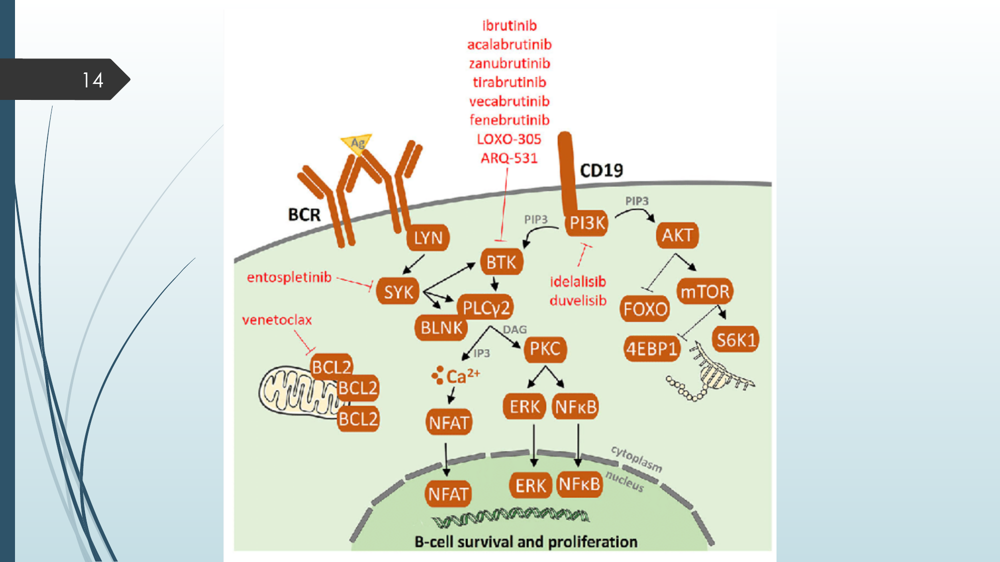

> **Şema yorumu (B hücre sağkalım sinyalizasyonu ve ilaç hedefleri):**
>
> Görselde KLL B hücresinin yüzeyinde **BCR (B hücre reseptörü)** ve yardımcı reseptör **CD19** yer alır. Antijen (Ag) bağlandığında iki ana sinyal kolu çalışır:
>
> **1. BCR → klasik kol:**
> BCR uyarısı **LYN → SYK → BTK** üzerinden ilerler; BTK, **PLCγ2 + BLNK** kompleksini aktive eder ve ikincil habercilere döner:
> * **DAG → PKC → ERK ve NFκB** (nukleusa translokasyon → gen ekspresyonu)
> * **IP3 → Ca²⁺ → NFAT** (nukleusa translokasyon)
>
> **2. CD19 → PI3K kolu:**
> CD19, **PI3K → AKT → mTOR** yolunu aktive eder; **mTOR**, **4EBP1 ve S6K1** üzerinden protein sentezini ve hücre büyümesini destekler. PI3K ayrıca **FOXO**'yu baskılayarak apoptozu inhibe eder.
>
> Tüm bu yolakların ortak çıktısı: 🟢 **B hücresinin sağkalımı ve proliferasyonu**.
>
> **Hedefe yönelik ilaçların etki noktaları (kırmızı):**
>
> | Hedef | İlaç(lar) | Notlar |
> |---|---|---|
> | **BTK** | İbrutinib, Akalabrutinib, Zanubrutinib, Tirabrutinib, Vekabrutinib, Fenebrutinib, LOXO-305, ARQ-531 | BCR sinyalini aşağı akışta kırar; KLL'de en sık kullanılan sınıf |
> | **SYK** | Entospletinib | Daha proksimal blok (BCR↓SYK↓) |
> | **PI3Kδ** | İdelalisib, Duvelisib | CD19/PI3K kolunu hedefler |
> | **BCL2** | Venetoklaks | Mitokondri üzerinden apoptoz indükler (BCL2 antiapoptotik proteinin etkisini bloke eder) |
>
> **🔑 Klinik anlamı:** Bu şema, kemoimmunoterapi sonrası KLL tedavisinin neden bu kadar **hedefe yönelik ilaç ağırlıklı** olduğunu özetler -- BCR-PI3K-BCL2 üçlüsünün her noktasında etkili bir inhibitör mevcuttur ve farklı genetik profillere (del 17p, IGHV durumu, T315I benzeri direnç mutasyonları) göre seçilebilir.

### KLL Tedavi Algoritması

Tedavi kararı **17p delesyonu / TP53 mutasyonu** varlığına ve **IGHV mutasyon** durumuna göre verilir.

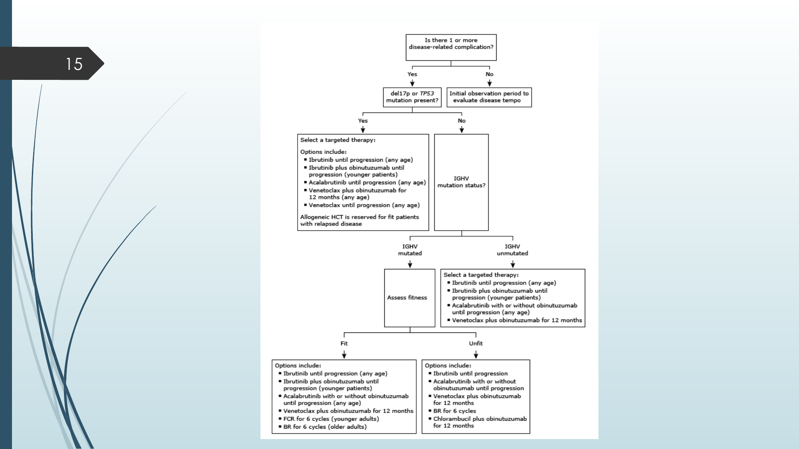

**Algoritma adım adım (Türkçe karşılığı):**

1. **Hastalık ilişkili komplikasyon var mı?**
   * **Hayır →** İlk gözlem dönemi: hastalık seyrini (tempo) değerlendir
   * **Evet →** del(17p) veya TP53 mutasyonu değerlendir

2. **del(17p) veya TP53 mutasyonu (+) ise →** Hedefe yönelik tedavi seç:
   * İbrutinib progresyona kadar (her yaş)
   * İbrutinib + Obinutuzumab progresyona kadar (genç hastalar)
   * Akalabrutinib progresyona kadar (her yaş)
   * Venetoklaks + Obinutuzumab 12 ay (her yaş)
   * Venetoklaks progresyona kadar (her yaş)
   * **Allo-HCT** relaps hastalıkta fit hastalara saklanır

3. **del(17p) yok ise → IGHV mutasyon durumuna bak:**

   **A) IGHV mutasyonsuz (kötü prognoz):**
   * İbrutinib progresyona kadar (her yaş)
   * İbrutinib + Obinutuzumab progresyona kadar (genç)
   * Akalabrutinib ± Obinutuzumab progresyona kadar
   * Venetoklaks + Obinutuzumab 12 ay

   **B) IGHV mutasyonlu (iyi prognoz) → Fitness değerlendir:**

   | Fit hasta | Unfit hasta |
   |---|---|
   | İbrutinib progresyona kadar | İbrutinib progresyona kadar |
   | İbrutinib + Obinutuzumab (genç) | Akalabrutinib ± Obinutuzumab |
   | Akalabrutinib ± Obinutuzumab | Venetoklaks + Obinutuzumab 12 ay |
   | Venetoklaks + Obinutuzumab 12 ay | BR 6 kür |
   | **FCR 6 kür** (genç) | **Klorambusil + Obinutuzumab** 12 ay |
   | **BR 6 kür** (yaşlı) | -- |

### Yanıt Değerlendirme

#### Tam Yanıt (Tedavi bitiminden en az 2 ay sonra)
* Periferik lenfosit <4.000/mm³
* Palpabl LAP yok (≤1.5 cm)
* Splenomegali/hepatomegali yok
* Konstitüsyonel bulgu yok
* Büyüme faktörü desteği olmadan: Nötrofil >1.500, Plt >100.000, Hb >11 g/dL

#### Kısmi Yanıt (en az 2 kriter, en az 2 ay devam)
* Lenfosit sayısında ≥%50 azalma
* LAP boyutunda ≥%50 gerileme
* HSM/SM boyutunda ≥%50 gerileme
* Kan sayımlarından en az birinin normale dönmesi veya %50 artması

#### İlerleyici Hastalık
* Lenfosit sayısında ≥%50 artış
* HSM/SM boyutunda ≥%50 artış
* LAP boyutunda ≥%50 artış
* Yeni lezyon

### KLL'de Destek Tedavisi

KLL'de **ciddi ve ilerleyici immun disregulasyon** mevcuttur. Nedenleri:
* Hipogamaglobulinemi
* Bozulmuş hücresel immunite
* Tedavi ilişkili immunsupresyon

**Profilaksi önerileri:**

| Müdahale | Endikasyon |
|---|---|
| Yıllık influenza aşısı | Tüm hastalar |
| 5 yılda bir pnömokok aşısı | Tüm hastalar |
| **Aylık IVIG 0.3-0.5 g/kg** | Sık tekrarlayan enfeksiyon + IgG <500 mg/dL |
| Asiklovir profilaksisi | Purin analoğu (Fludarabin) alan hastalar -- Herpes |
| TMP/SMX profilaksisi | Purin analoğu alan hastalar -- Pneumocystis jirovecii |
| Hepatit B serolojisi + antiviral profilaksi | Rituksimab alan hastalar -- KT bittikten sonra ≥6 ay daha |

### Richter Transformasyonu

> KLL/SLL seyri sırasında **Diffüz Büyük B Hücreli Lenfomaya** (daha az sıklıkta Hodgkin lenfoma veya T hücreli lenfomaya) dönüşüm.

* %2-9 oranında görülür
* Median dönüşüm süresi: 2-5 yıl
* Sağkalım: **5-8 ay**
* %85'i KLL klonundan, %15'i de novo klondan köken alır
* De novo olanlar daha iyi prognozludur

**Klinik bulgular:**
* Hastalıkta ani hızlanma
* Bir veya birkaç bölgede LAP'da hızlı büyüme (çoğunlukla abdominal)
* Splenomegali, ekstranodal tutulum
* LDH yüksekliği
* Anemi-trombositopenide derinleşme

**Tanı:** PET-BT ve biyopsi

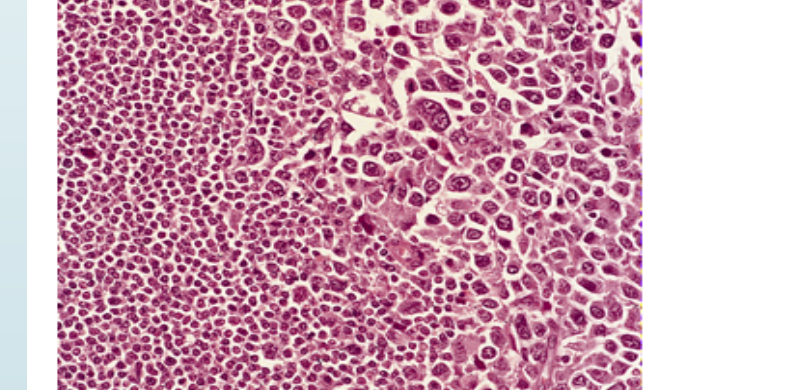

> **Histolojik yorum (Richter transformasyonu):** Görsel KLL'li bir hastanın lenf nodundan alınmıştır. **Sol yarıda** küçük, monoton, kondanse kromatinli lenfositler görülür -- bu mevcut **KLL infiltrasyonunu** temsil eder. **Sağ yarıda** ise belirgin şekilde **daha büyük, açık kromatinli, belirgin nükleollü B hücreleri** izlenir; bu alan **diffüz büyük B hücreli lenfomaya (DBBHL) dönüşümü** gösterir. Aynı lenf nodunda iki hücre populasyonunun yan yana bulunması Richter transformasyonunun **patognomonik histolojik bulgusudur**. Klinik ipucu: KLL'li hastada hızlı LAP büyümesi, B semptomları ve LDH yüksekliği -- biyopsi tanı koydurur.

### KLL Ayırıcı Tanı

#### Mantle Hücreli Lenfoma (lösemik form)

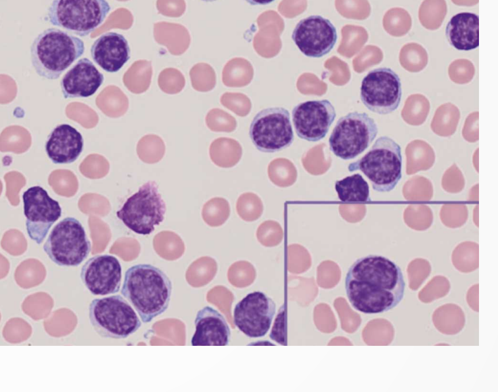

> **Histolojik yorum (MCL):** Periferik yaymada **orta boy lenfositler** izlenir; KLL hücrelerinden biraz daha büyük ve **nükleer kontur düzensiz / çentikli (cleaved)**dir. İnsetteki büyütmede tek hücrenin **çentikli/yarık nükleus** yapısı net görünür -- mantle hücreli lenfomanın klasik morfolojisi.
>
> **Ayırıcı kriterler:** CD5 ve CD20 (+) olabilir (KLL'ye benzer), **CD23 (--)**, **Siklin D1 (+)**, **t(11;14)** translokasyonu (IgH/CCND1) tanısaldır. SOX11 (+).

#### Tüylü Hücreli Lösemi (Hairy Cell Leukemia)

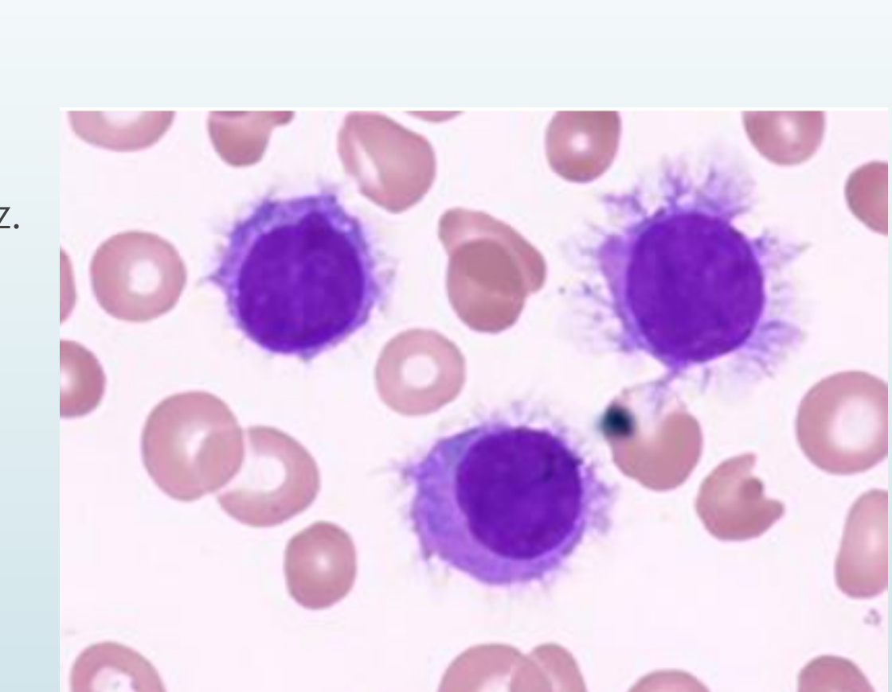

> **Histolojik yorum (Hairy cell):** Görselde **bol, soluk sitoplazma** ve sitoplazma çevresinde **ince, saçımsı uzantılar (hairy projections)** olan lenfoid hücreler net görünür -- bu hastalığın **patognomonik morfolojik bulgusudur**. Yuvarlak/oval nükleus, gevşek kromatin.
>
> **Klinik ayırıcılar:** Belirgin splenomegali olmasına rağmen genellikle **LAP yok**. Lökositoz nadirdir (%10); çoğu hasta sitopeni ile başvurur (TRAP boyası, BRAF V600E mutasyonu tanıda yardımcı).
>
> **Flow:** **CD20 parlak (+)**, **CD25 / CD11c / Anneksin A1 / CD103 (+)**, **CD5 (--)**.

#### Splenik Marjinal Zon Lenfoma (SMZL)

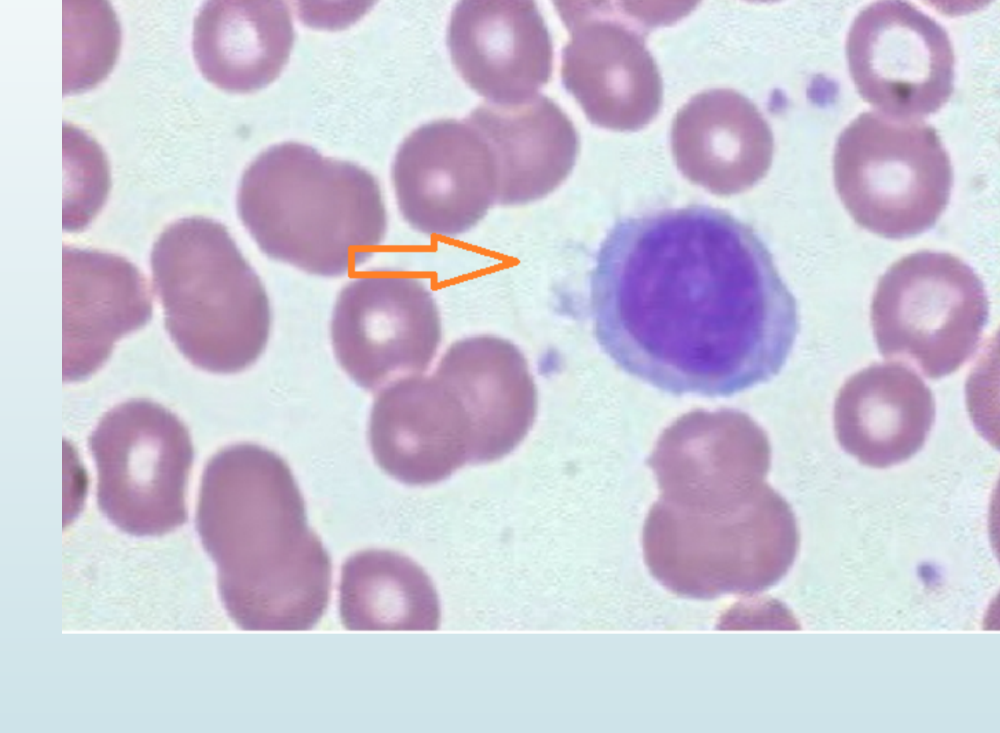

> **Histolojik yorum (SMZL):** Okla işaretli hücre orta boy lenfosittir. Karakteristik bulgu hücrenin **kutuplarında (polar) kısa, kalın villöz sitoplazmik uzantılar** bulunmasıdır -- "bipolar villöz lenfosit". Hairy cell'in ince/uzun saçımsı uzantılarından **daha kalın ve odaklanmış** uzantılarla ayrılır.
>
> **Klinik:** Belirgin splenomegali ve lenfositoz ile başvurur. CD5/CD23 (+) olabilir (KLL'ye benzer karışıklık), **CD20 parlak (+)**.
>
> **Ayırıcı:** Patolojik incelemede KLL'de görülen **proliferasyon merkezleri SMZL'de görülmez**. KLL'nin tipik sitogenetik değişiklikleri (del 17p, del 11q, del 13q, trizomi 12) SMZL'de **bulunmaz**.

#### Prolenfositik Lösemi (B-PLL)

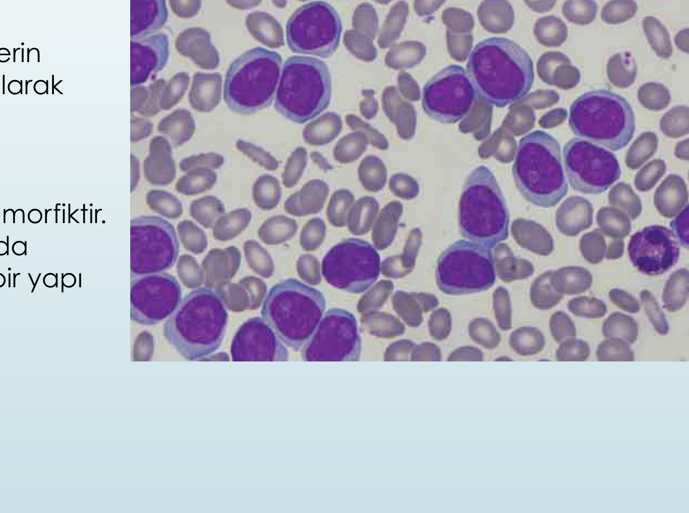

> **Histolojik yorum (B-PLL):** Periferik yaymada **orta-büyük boyutta**, **yuvarlak nükleuslu** ve hücrelerin merkezinde **tek belirgin nükleol** içeren lenfoid hücreler dominanttır. KLL'nin küçük matür lenfositinden belirgin şekilde farklıdır. Hücreler büyük çoğunluğu **monomorfiktir** (tek tip görünüm).
>
> **Tanı kriterleri:** Prolenfositler kan ve kemik iliğindeki hücrelerin **>%55'ini** (tipik olarak >%90) oluşturmalıdır. Hızla yükselen **WBC >100.000/μL**. Periferik LAP genellikle silik.
>
> **Klinik özellik:** Çoğunlukla **de novo**dur. Nadiren KLL'den transforme olur -- bu durumda mature lenfositlerle prolenfositler heterojen yapı oluşturur (prolenfosit >%55).
>
> **Flow:** Olguların **2/3'ü CD5 negatif**.

### KLL Ayırıcı Tanı Özet Tablosu

| Hastalık | Ayırt edici özellikler |
|---|---|
| **Mantle hücreli lenfoma (lösemik form)** | CD5 ve CD20 (+) olabilir, CD23 (--), Siklin D1 (+), t(11;14) |
| **Tüylü hücreli lösemi** | Organomegali olmasına rağmen genellikle LAP yok, lökositoz nadir (%10), CD20 parlak (+), CD25/CD11c/Anneksin/CD103 (+), CD5 (--) |
| **Splenik marjinal zon lenfoma (SMZL)** | Splenomegali ve lenfositoz, CD5/CD23 (+) olabilir, CD20 parlak (+), patolojik proliferasyon merkezi yok, KLL sitogenetik değişiklikleri (del 17p, del 11q, del 13q, trizomi 12) bulunmaz |
| **Prolenfositik lösemi** | Prolenfositler kan/Kİ hücrelerinin >%55'i (tipik >%90), hızla yükselen WBC >100.000, periferik LAP silik, 2/3'ü CD5 negatif |

---

## KRONİK MYELOİD LÖSEMİ (KML)

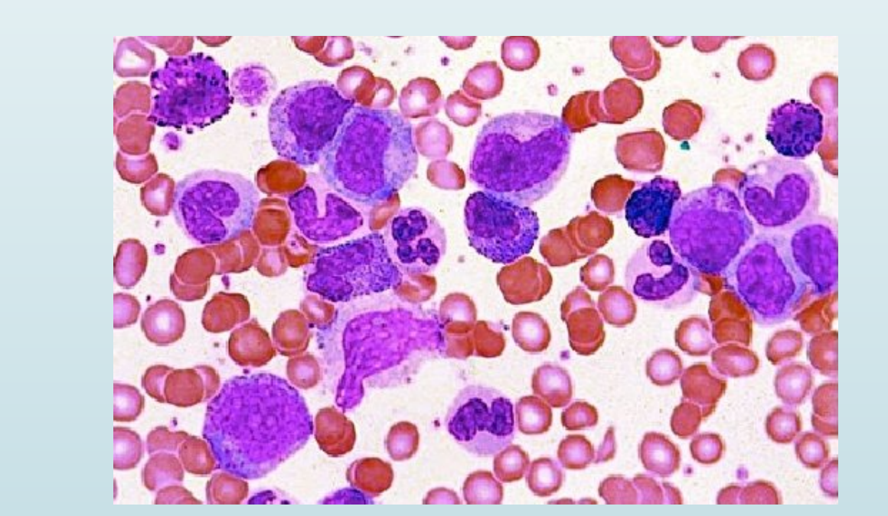

> Periferik yaymada **heterojen myeloid populasyon**: promyelositten olgun nötrofile kadar granülositik serinin tüm matürasyon evreleri görülür. Myelositlerin metamyelositlerden daha sık olması (**lösemik hiatus / myelosit bulge**) KML'nin klasik bulgusudur. Bazofili evrenseldir; eozinofili olguların %75'inde bulunur. Blastlar genellikle <%2'dir (kronik fazda).

### Tanım ve Sınıflandırma

KML, **Myeloproliferatif Neoplazi (MPN)** grubundadır. MPN sınıflaması:

* **Kronik myeloid lösemi (KML), BCR-ABL1+**
* Kronik nötrofilik lösemi (CNL)
* Polisitemia vera (PV)
* Primer myelofibrozis (PMF) -- prefibrotik/erken evre veya overt fibrotik evre
* Esansiyel trombositoz (ET)
* Kronik eozinofilik lösemi (NOS)
* MPN, sınıflanamayan

> MPN'ler hematopoezin klonal hastalıklarıdır ve hematopoetik kök hücre/erken progenitor hücreden köken alırlar. Myeloid hücrelerinin bir veya birkaçının disregüle ama korunmuş olgunlaşması söz konusudur. Akut lösemiye ilerleme potansiyelleri vardır. Hemostaz ve tromboz anormalliklerine sahiptirler.

### Epidemiyoloji

| Özellik | Değer |
|---|---|
| İnsidans | 1-1.5/100.000 |
| Tüm erişkin lösemilerinin oranı | %15 |
| Cinsiyet | Hafif erkek baskınlığı |
| Median yaş | 65 |
| **En önemli risk faktörü** | **Radyasyon** |

* TKİ'lardan sonra hastalığın stabilizasyonu sağlandığı için KML vakaları artmıştır
* Onkojenik virüslerle ilişki gösterilememiştir
* Kore ve Avrupa kohortlarında 6q25.1 ve 17p11.1 lokuslarında genetik varyant ile ilişki gösterilmiştir

### Patogenez

> KML, **kromozom 22'deki BCR geni ile kromozom 9 üzerindeki ABL geninin tirozin kinaz sekanslarının resiprokal translokasyonu** sonucu oluşur. Bu kazanılmış sitogenetik anormallik **t(9;22)(q34;q11)** olarak gösterilir.

**Filadelfiya kromozomu:**
* Uzamış kromozom 9 + kısalmış kromozom 22
* 1960'da Peter Nowell ve David Hungerford tarafından tanımlandı

**Translokasyon ürünü:** **BCR-ABL1 füzyon geni** → süreğen tirozin kinaz aktivitesi → myeloid farklılaşmanın bloke olması

#### BCR-ABL Füzyon Varyantları

| Varyant | Lokasyon | İlişkili Hastalık |
|---|---|---|
| **p210** (Major BCR) | exon 13/14 + a2-11 | KML olgularının çoğu, Ph (+) B-ALL'in 1/3'ü |
| **p190** (minor BCR) | exon 1 + a2-11 | ALL'in 2/3'ü, KML olgularının az bir kısmı (KMML benzeri monositik komponent) |
| **p230** (μ-BCR) | exon 19 + a2-11 | Nötrofilik KML varyantı (KML-N) ve/veya belirgin trombositoz, indolen seyir |

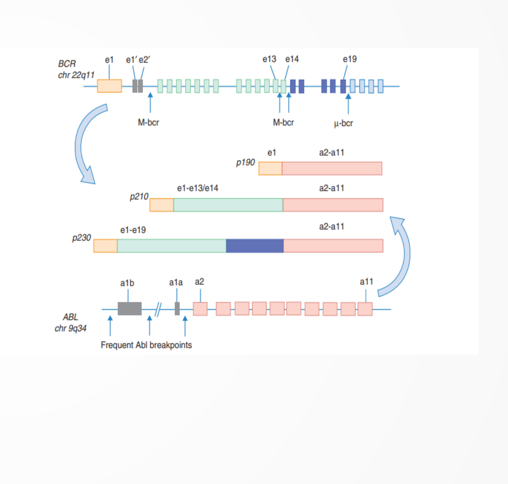

> **Şema yorumu (BCR-ABL füzyonları neden farklılık gösterir?):**
>
> **Üst kısım (kromozom 22q11 - BCR geni):** BCR geninde üç farklı kırılma noktası bölgesi vardır:
> * **m-bcr** (minor) -- e1' ile e2' arasında, BCR'nin başında
> * **M-bcr** (Major) -- e13/e14 arasında, BCR'nin ortasında
> * **μ-bcr** (mikro) -- e19 sonrası, BCR'nin sonunda
>
> **Alt kısım (kromozom 9q34 - ABL geni):** ABL geninde **kırılma noktaları çoğunlukla a1b/a1a/a2 bölgesinde yoğunlaşır** ("Frequent Abl breakpoints"). Bu nedenle ABL'den kopan parça çoğunlukla **a2-a11** ekzonlarını içerir (sabit).
>
> **Üç farklı füzyon → üç farklı protein:**
>
> | Füzyon | BCR kısmı | ABL kısmı | Protein |
> |---|---|---|---|
> | **p190** | e1 (en kısa) | a2-a11 | 190 kDa -- minor BCR |
> | **p210** | e1 + e13/e14 (orta) | a2-a11 | 210 kDa -- **major BCR (KML'nin tipik varyantı)** |
> | **p230** | e1 + e19 (en uzun) | a2-a11 | 230 kDa -- mikro BCR |
>
> **🔑 Klinik anlamı:**
> * **p210** → Klasik kronik faz KML'nin >%95'i bu varyanttır
> * **p190** → Akut lenfoblastik lösemi (Ph+ B-ALL) ile daha sık ilişkilidir; KML'de görüldüğünde monositik komponent ve KMML benzeri seyir (kötü prognoz)
> * **p230** → İleri derecede uzun proteindir; **nötrofilik KML (KML-N)** ve **trombositoz dominant** indolen seyirli formla ilişkili
>
> Kantitatif RT-PCR ile takipte transkript tipinin tanıda belirlenmesi şarttır -- her hasta kendi varyantı üzerinden monitörize edilir.

#### Bcr-Abl Onkoprotein Etkileri

* Artmış tirozin kinaz aktivitesi → MYC, RAS, STAT, JUN, PI3K sinyal yolaklarını aktive eder
* Hücre siklusu, farklılaşma ve apoptozu etkileyerek DNA genetik instabilitesini sağlar
* Hücreleri sitokin bağımsız yapar, DNA hasarı sonrası apoptozdan korur
* Hematopoetik hücrelerin ekstrasellüler matriks proteinlerine adezyonunu arttırır

**Tedavi edilmeyen KML'de kaçınılmaz sonuç:**
* Farklılaşmada daha güçlü blok
* Blast sayısında artış (akut lösemi)
* Yeni sitogenetik anormallikler [double Ph, trizomi 8, i(17q), trizomi 19]

### Klinik ve Laboratuvar Bulgular

* **%90 olgu kronik fazda yakalanır** -- çoğu insidental
* En sık semptomlar: yorgunluk, karında şişlik
* Daha ciddi konstitüsyonel semptomlar (kilo kaybı, kemik ağrısı, ateş, gece terlemesi) çoğunlukla **hızlanmış KML** ile ilişkilidir

#### Tipik Laboratuvar Bulguları

| Parametre | Bulgu |
|---|---|
| WBC (median) | 100.000/μL (12.000-1.000.000) |
| Anemi | Sık |
| Trombosit >600.000 | Olguların %15-30'u |
| Trombositopeni | Kronik fazda **beklenmez** |
| Bazofili | **Universal** |
| Eozinofili | Olguların %75'i |
| Monositoz (>1000) | Sık ancak monosit oranı <%3 |

#### Periferik Yayma Bulguları

* Nötrofilik serinin tüm elemanları görülür (myeloblasttan olgun PNL'ye kadar)
* Blastlar genellikle **<%2**
* **Lösemik hiatus (Myelosit bulge):** Myelositlerin daha matur metamyelositlerden daha sık görülmesi -- **KML'de klasik bulgudur**
* Displazi bulgusu kronik fazda beklenmez

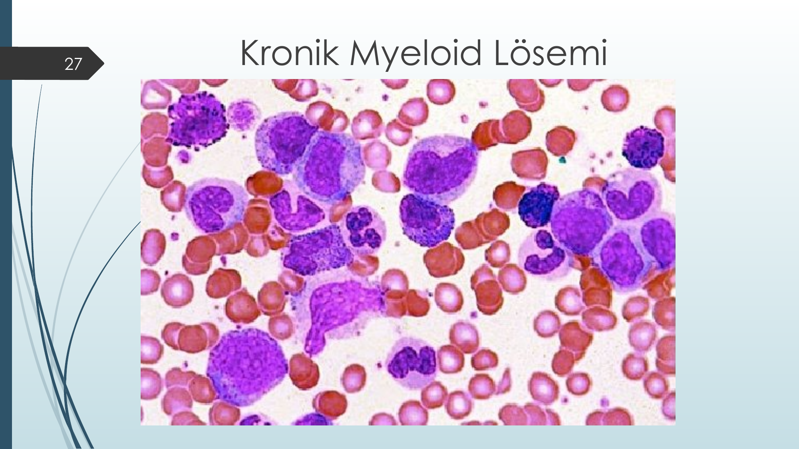

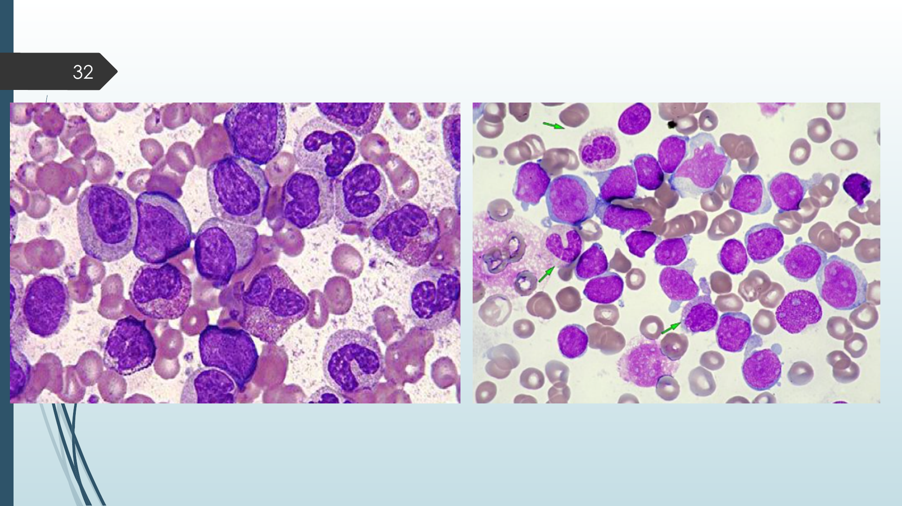

#### Lökosit Alkalen Fosfataz (LAP) Skoru

* LAP enzimi nötrofillerin sekretuar granüllerinde bulunur
* **KML'de LAP skoru DÜŞÜK** -- nötrofiller boyanmaz
* Değerlendirme: Her nötrofil 1-4 arasında boyaya tutunmasına göre puanlandırılır
* **Normal:** Skor >90
* **KML:** Skor <20
* Reaktif lökositoz, lökemoid reaksiyon ve PV'den ayırmada faydalıdır (bunlarda LAP skoru yüksektir)

### Tanı

> **BCR-ABL negatif KML olmaz.** Atipik (Ph negatif) KML ve KNL farklı antitelerdir, farklı genetik özellikleri vardır.

**Tanı yöntemleri:**
1. **Konvansiyonel sitogenetik bantlama** -- t(9;22)(q34;q11.2) Filadelfiya kromozomu gösterimi
2. **FISH** -- BCR-ABL kimerik gen tespiti
3. **Kantitatif RT-PCR** -- Tanı, monitörizasyon ve hastalık yükü ölçümü

### Tedavi

#### Tirozin Kinaz İnhibitörleri (TKİ)

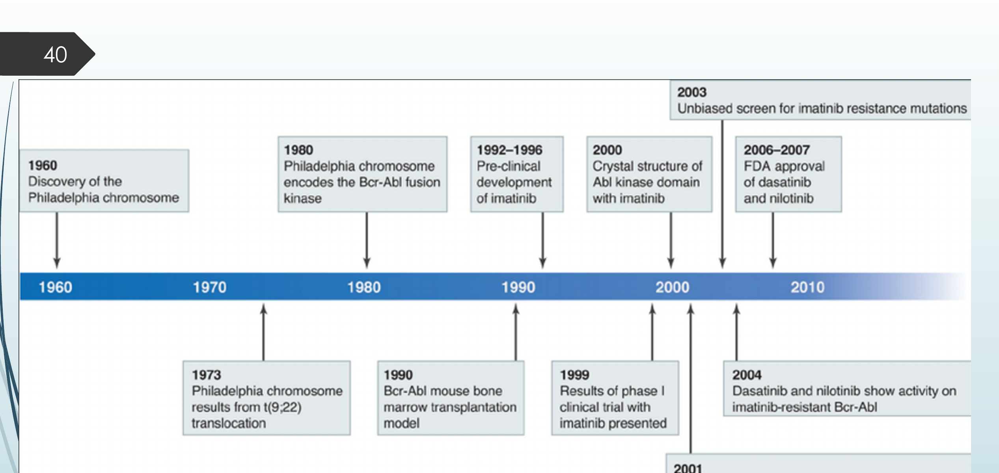

> **Tarihsel zaman çizelgesi (KML → Bcr-Abl → İmatinib → 2./3. nesil TKİ):**
>
> | Yıl | Kilometre Taşı |
> |---|---|
> | **1960** | Filadelfiya kromozomunun keşfi (Nowell ve Hungerford) |
> | **1973** | Filadelfiya kromozomunun **t(9;22) translokasyonundan** kaynaklandığının gösterilmesi |
> | **1980** | Filadelfiya kromozomunun **Bcr-Abl füzyon kinazını** kodladığının gösterilmesi |
> | **1990** | Bcr-Abl'nin fare kemik iliği transplantasyon modelinde lösemi yaptığının kanıtlanması |
> | **1992-1996** | İmatinibin **preklinik geliştirme** süreci |
> | **1999** | İmatinib ile **Faz I klinik çalışma** sonuçlarının sunulması |
> | **2000** | Abl kinaz domain ile imatinibin **kristal yapısının** çözülmesi |
> | **2001** | İmatinibin **FDA onayı** -- KML ve Ph+ ALL tedavisi için. **İlk imatinib direnç olguları** rapor edildi, Abl kinaz domain mutasyonları tanımlandı |
> | **2003** | İmatinib direnç mutasyonlarının **sistematik (unbiased) taranması** |
> | **2004** | **Dasatinib ve Nilotinib**'in imatinib-dirençli Bcr-Abl üzerinde aktivite gösterdiğinin kanıtlanması |
> | **2006-2007** | **Dasatinib ve Nilotinibin FDA onayı** -- 2. nesil TKİ çağı başladı |
>
> **🔑 Anlamı:** Bu çizelge **40 yıllık temel araştırmanın** (kromozom → translokasyon → füzyon protein → kristal yapı) nasıl ilk **rasyonel olarak tasarlanmış kanser ilacına** (imatinib) dönüştüğünü gösterir. KML, **moleküler hedefli kanser tedavisinin "proof of concept"** hastalığıdır. Direnç mutasyonlarının çıkması (2001) ve hemen ardından 2./3. nesil TKİ'lerin geliştirilmesi (2004-2007), modern hedefe yönelik onkolojinin paradigmatik döngüsünü temsil eder.

| Nesil | İlaç |
|---|---|
| **1. Nesil** | İmatinib mesilat |
| **2. Nesil** | Nilotinib, Dasatinib, Bosutinib |
| **3. Nesil** | **Ponatinib** (T315I mutasyonunda etkili) |
| Diğer | Omasetaksin (TKİ değil -- protein sentez inhibitörü; BCR-ABL, MYC, MCL1 sentezini bloke eder) |

#### TKİ Etki Mekanizmaları

* **İmatinib:** ABL, PDGFR ve KIT taşıyan tüm proteinlerin kinaz aktivitelerini inhibe eder. ATP bağlanma bölgesinde kompetitif inhibitör.
* **Dasatinib:** Dual SRC-ABL inhibitörü. Bcr-Abl'yi imatinib'e göre **300 kat** daha potent inhibe eder.
* **Nilotinib:** İmatinib'in modifiye hali, bcr-abl'ye **30 kat** daha güçlü bağlanır. Birçok nokta mutasyonunun üstesinden gelir (T315I hariç).
* **Bosutinib:** Dual SRC-ABL inhibitörü.
* **Ponatinib:** T315I mutasyonunda tek etkili TKİ.

#### TKİ Karşılaştırma Tablosu

| TKİ | Doz | Yiyecek ile | Doz ayarlanması | Major toksisiteler |
|---|---|---|---|---|
| **İmatinib** | 400 mg 1×1 | Yiyecekle | Böbrek/karaciğer | Kİ supresyonu, sıvı retansiyonu/ödem, GİS etkileri, KY, hepatotoksisite |
| **Nilotinib** | 300 mg 2×1 | **Yiyeceksiz** | Karaciğer | Kİ supresyonu, **ateroskleroz ilişkili olaylar**, elektrolit dengesizliği, hepatotoksisite, **Black Box: QT uzaması** |
| **Dasatinib** | 100 mg 1×1 | Yiyecekle/yiyeceksiz | Yok | Kİ supresyonu, **plevral/perikardiyal efüzyonlar, pulmoner arteriyel HT**, QT uzaması, aspirin benzeri etki |
| **Bosutinib** | 400 mg 1×1 | Yiyecekle | Böbrek/karaciğer | Kİ supresyonu, sıvı retansiyonu/ödem, **GİS etkileri** belirgin |
| **Ponatinib** | 45 mg 1×1 | Yiyecekle/yiyeceksiz | Karaciğer | Kİ supresyonu, sıvı retansiyonu/ödem, GİS, KY, HT, pankreatit, aspirin benzeri etki, **Black Box: arteriyel tromboz, hepatik toksisite** |

#### 2./3. Kuşak TKİ Seçim Kriterleri

* Upfront Dasatinib/Nilotinib/Bosutinib kronik faz KML'de FDA onaylıdır
* Upfront 2. nesil TKİ tedavi yanıtını **hızlandırır ve derinleştirir** ama OS'da farklılık yaratmaz
* Tüm 2./3. nesil TKİ'lar imatinib'den pahalıdır
* **TFR (treatment-free remission) hedeflenen** veya imatinib intoleran/dirençli hastalarda mutasyon profiline göre seçilir
* **T315I mutasyonu varsa:** Ponatinib veya Omasetaksin

### Tedavi Yanıtı: Hematolojik, Sitogenetik ve Moleküler

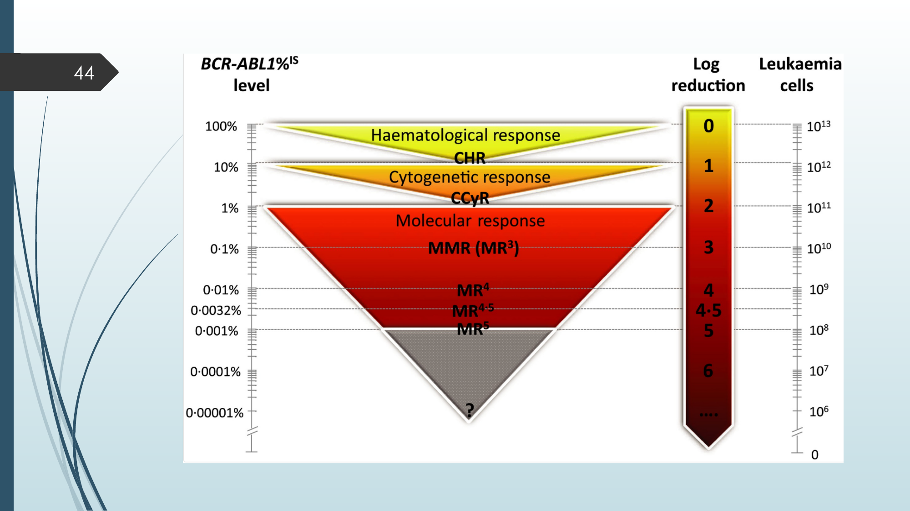

> **Şema yorumu (BCR-ABL yanıt piramidi):**
>
> Görselde ters piramit şeklinde KML'de **tedavi yanıt seviyeleri** gösterilir. Soldaki eksen **BCR-ABL1 (IS) düzeyini** (% olarak), sağdaki eksen ise vücuttaki **lösemi hücre sayısını** verir. Aralarındaki **log azalma** (sağ üstte) iki ölçeği bağlar.
>
> | BCR-ABL1 (IS) düzeyi | Yanıt | Log azalma | Lösemi hücre sayısı (yaklaşık) |
> |---|---|---|---|
> | **100%** | Tedavi öncesi (bazal) | 0 | 10¹³ |
> | **10%** | **Hematolojik yanıt (CHR)** | 1 log | 10¹² |
> | **1%** | **Sitogenetik yanıt (CCyR)** -- tam sitogenetik yanıt | 2 log | 10¹¹ |
> | **0.1%** | **MMR (MR³)** -- Major moleküler yanıt | 3 log | 10¹⁰ |
> | **0.01%** | **MR⁴** -- derin moleküler yanıt | 4 log | 10⁹ |
> | **0.0032%** | **MR⁴·⁵** -- daha derin yanıt (TFR eşiği) | 4.5 log | 10⁸ |
> | **0.001%** | **MR⁵** -- moleküler tespit eşiğinin altı | 5 log | 10⁸ |
> | **<0.0001%** | "?" -- mevcut PCR'la saptanamaz, **eradikasyon belirsiz** | 6+ log | 10⁷ veya altı |
>
> **🔑 Klinik anlamı:**
> * Her **1 log azalma** lösemi hücre sayısını **10 katı azaltır** -- ancak hücre sayısı çok yüksek başladığı için %0 yanıt çok zordur
> * **MMR (MR³, %0.1)** -- tedavi başarısının kabul edilen eşiği; 12. ay hedefi
> * **MR⁴ ve MR⁴·⁵** -- "derin moleküler yanıt" (DMR); **tedaviyi bırakma (TFR)** denemesinin ön koşulu
> * Piramitin alt ucundaki **gri/soluk alan** -- mevcut PCR teknolojisinin saptama sınırının altıdır; bu seviyede de hâlâ minimal kalıntı hastalık olabilir, bu yüzden **TKİ kesildiğinde nüks olabilir** (~%50 hasta)
> * Görsel, neden moleküler izlemin sitogenetik/hematolojik izlemden daha hassas olduğunu özetler -- aynı hasta CHR (sadece kan sayımı normalleşmiş) durumunda iken hâlâ 10¹² lösemi hücresi taşır

#### Hematolojik Yanıt
**Tam (CHR):** Plt <450 × 10⁹/L; WBC <10 × 10⁹/L; differansiyelde immatür granülosit yok ve <%5 bazofil; nonpalpabl dalak

#### Sitogenetik Yanıt
| Yanıt | Ph+ Metafaz |
|---|---|
| Tam (CCyR) | %0 |
| Major | %1-35 |
| Minor | %36-65 |
| Minimal | %66-95 |
| Yok | >%95 |

#### Moleküler Yanıt (BCR-ABL1 IS değeri)

| Yanıt | BCR-ABL1 IS | Log azalma (bazalden) |
|---|---|---|
| **Erken Moleküler Yanıt (EMR)** | ≤%10 (3. ve/veya 6. ay) | -- |
| **MR2** (~CCyR) | <%1 | ≥2 log |
| **Major Moleküler Yanıt (MMR/MR3)** | **≤%0.1** | ≥3 log |
| MR4 (DMR sınırı) | ≤%0.01 | ≥4 log |
| MR4.5 | ≤%0.0032 | ≥4.5 log |

#### Tedavide Köşe Taşları (Hedefler)

| Zaman | Hedef |
|---|---|
| **3. ay** | BCR-ABL1 (IS) ≤%10 ve/veya Ph+ metafaz ≤%35 |
| **6. ay** | BCR-ABL1 (IS) <%1 (MR2) ve/veya %0 Ph+ |
| **12. ay** | BCR-ABL1 (IS) ≤%0.1 (MMR) |

### Tedavi Monitörizasyon Algoritması

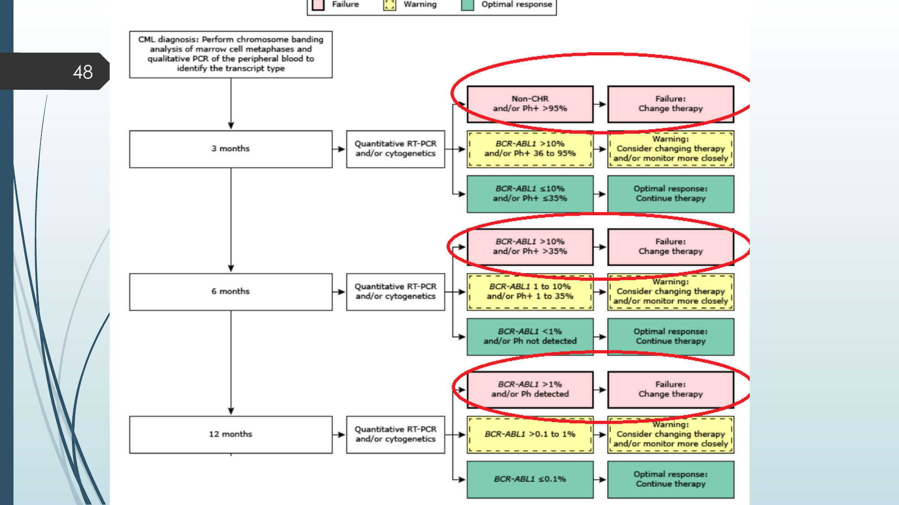

**Tanıda:** Kemik iliği metafazlarında kromozom bantlama analizi + periferik kanda kalitatif PCR ile transkript tipi belirlenir.

| Zaman | Test | Başarısızlık (Failure) | Uyarı (Warning) | Optimal yanıt |
|---|---|---|---|---|
| **3. ay** | Kantitatif RT-PCR (± sitogenetik) | CHR yok ve/veya Ph+ >%95 | BCR-ABL1 >%10 ve/veya Ph+ %36-95 | BCR-ABL1 ≤%10 ve/veya Ph+ ≤%35 |
| **6. ay** | Kantitatif RT-PCR (± sitogenetik) | BCR-ABL1 >%10 ve/veya Ph+ >%35 | BCR-ABL1 %1-10 ve/veya Ph+ %1-35 | BCR-ABL1 <%1 ve/veya Ph+ saptanmamış |
| **12. ay** | Kantitatif RT-PCR ± sitogenetik | BCR-ABL1 >%1 ve/veya Ph+ saptanmış | BCR-ABL1 %0.1-1 | BCR-ABL1 ≤%0.1 (MMR) |

**Yorumlama ve eylem:**

* 🟩 **Optimal yanıt:** Aynı TKİ tedavisine devam
* 🟨 **Uyarı (Warning):** Tedaviyi değiştirmeyi düşün ve daha sık monitörize et (mutasyon analizi, uyumun kontrolü)
* 🟥 **Başarısızlık (Failure):** Tedaviyi değiştir (mutasyon analizine göre 2./3. nesil TKİ'a geçiş; allo-KİT için HLA tipleme başlat)

### İmatinib Direnci

* En sık neden: **bcr-abl geninde nokta mutasyonları** → kinaz aktivitesi ve bcr-abl gen amplifikasyonu imatinib etkisini bloker
* Akselere ve blastik fazda sıktır

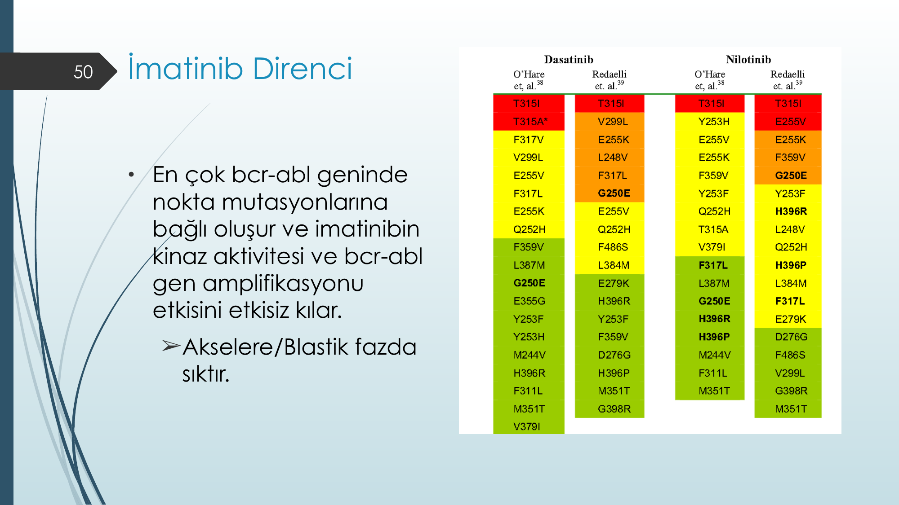

**Önemli mutasyonlar:**
* **T315I:** "Gatekeeper" mutasyon, dasatinib ve nilotinib'e dirençli, **sadece Ponatinib veya Omasetaksin** etkili

### Akselere ve Blastik Faz Kriterleri (WHO)

| Akselere Faz | Blastik Faz |
|---|---|
| Periferik kan/Kİ blast %10-19 | Periferik kan/Kİ blast ≥%20 |
| Periferik kan bazofil ≥%20 | Blastların ekstrameduller proliferasyonu (myeloid sarkom) |
| Sitogenetik evolüsyon/ACA*, kompleks karyotip, 3q26.2 anormalliği | -- |
| Tedaviye yanıt vermeyen Plt >1.000.000/μL | -- |
| Tedaviye yanıtsız dalak büyümesi veya lökositoz artışı | -- |

*Major route anormallikleri: Double Ph, trizomi 8, izokromozom 17q, trizomi 19
**%20-30 blastik kriz lenfoiddir (ALL'ye dönüşür)

### İlerlemiş Faz KML'de Tedavi

**De novo (tanıda akselere/blast faz):**
1. 2. nesil TKİ + indüksiyon kemoterapisi
2. Optimal moleküler yanıt → Devam veya transplantta uygun adayların değerlendirilmesi
3. Yanıt yoksa: TKİ değişimi, transplant düşün

**Kronik fazdan ilerleme (akselere veya blast faz):**
1. **TKİ değişimi** -- seçim kriterleri:
   * BCR-ABL kinaz mutasyon analizi (T315I varsa Ponatinib)
   * Önceki tedaviler (önceden 2. nesil TKİ aldıysa Ponatinib düşün)
   * Hasta komorbiditeleri
2. Blast lineage'a göre indüksiyon kemoterapisi (lenfoid vs myeloid)
3. CP2'de transplant; CP2'ye ulaşılamazsa klinik çalışma

### Allojenik Kemik İliği Nakli

* **Tek kür şansı** -- TKİ'lar lösemik kök hücreyi yok etmez, sadece bcr-abl DNA'yı baskılayarak normal hematopoez ortamı sağlar
* TKİ çağında transplant ilişkili mortalite (TRM) nedeniyle kullanımı azalmıştır
* **Akselere/blast faz KML'de tek çıkış yolu**
* Bazı kronik faz KML hastalarında da seçilmiş olgularda düşünülmelidir

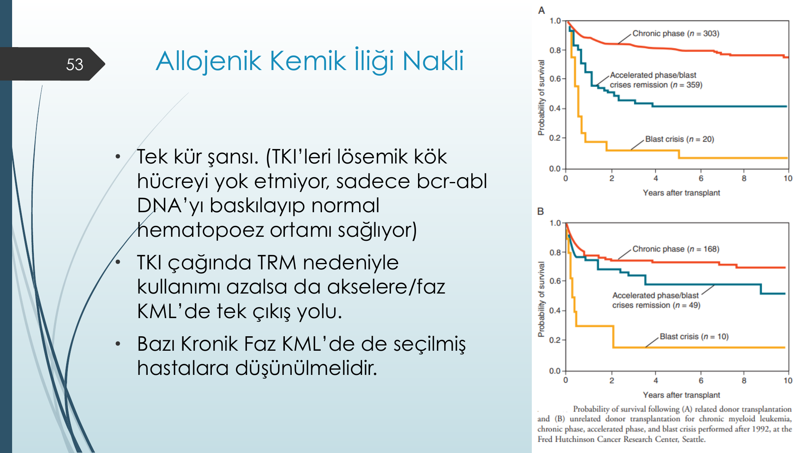

#### Allojenik Nakil Endikasyonları (Kronik faz)

| Klinik durum | TKİ ve KT | HLA tipleme | Acil allo-SCT |
|---|---|---|---|
| İlk imatinib başarısızlığı, yüksek risk | 2. sıra TKİ | Evet | Hayır |
| İlk nilotinib veya dasatinib başarısızlığı | 2. sıra TKİ | Evet | **Evet** |
| 2 TKİ başarısızlığı | 3. sıra TKİ | Evet | **Evet** |
| **T315I mutasyonu** | Ponatinib veya Omasetaksin | Evet | **Evet** |
| Akselere faz (TKİ naive) | TKİ + KT | Evet | **Evet** |
| Blast faz | İndüksiyon KT + TKİ | Evet | **Evet** |

### Tedaviyi Bırakma (TFR) Kriterleri

**Tüm koşullar sağlanmalıdır:**

1. Yaş >18
2. ≥3 yıldır güvenilir TKİ kullanımı
3. 2. nesil TKİ'a direnç öyküsü olmaması
4. En az MR4.5 ölçebilen ve ≤2 hafta içinde sonuç verebilen BCR-ABL1 (IS) testine ulaşım
5. **≥2 yıl süreğen MR4** (BCR-ABL1 ≤%0.01) -- 3 ay aralıklarla en az 4 kez dökümante edilmiş

**Takip:** Tedavi bırakılmış hastalara aylık BCR-ABL1 takibi; %1'i geçerse mutlaka tedavi yeniden başlanmalıdır.

### Gebelerde Tedavi Yönetimi

**⚠️ ÖNEMLİ:**

* TKİ kullanımı gebelerde **sakıncalıdır**
   * 1. trimestrda konjenital malformasyon ve spontan abortus riski
   * 2. ve 3. trimestrda güvenilirliği bilinmiyor
* Erkeklerde de konsepsiyon döneminde kullanılmasının fetal etkileri konusunda bilgi yetersizdir
* **Gebelikte tanı konulan kronik faz KML hastaları:**
   * Lökoferez ve/veya
   * İnterferon (2. trimestrdan itibaren) ile yönetilebilir
   * Gebeliklerini sürdürebilirler
* **İlerlemiş faz KML olan gebelerde** terminasyon düşünülmelidir
* **Emziren hanımlarda** TKİ kullanımı sakıncalıdır

---

## ÖZET -- KLL vs KML

| Özellik | KLL | KML |
|---|---|---|
| Köken | Matur B lenfosit | Pluripotent kök hücre (myeloid) |
| Median yaş | 71 | 65 |
| K/E | 2/1 | E hafif baskın |
| Patognomonik genetik | Yok (en sık del 13q, del 11q, trizomi 12, **del 17p kötü prognoz**) | **t(9;22), Ph kromozomu, BCR-ABL1 füzyonu** |
| Tipik klinik | İnsidental lenfositoz | İnsidental lökositoz, splenomegali |
| LAP skoru | -- | **Düşük** |
| Tipik flow | CD5/CD19/CD23 (+), FMC-7 (–) | -- |
| Standart tedavi | BTK inhibitörü (ibrutinib, akalabrutinib), Venetoklaks ± obinutuzumab | **TKİ** (imatinib, dasatinib, nilotinib, bosutinib) |
| Allo-KİT yeri | Sadece relaps/dirençli | Akselere/blast fazda; T315I dirençlide |
| Kötü prognoz markırı | del(17p), TP53 mut, IGHV unmutated | T315I mutasyonu, blastik kriz |
| Önemli komplikasyon | **Richter transformasyonu** (DBBHL'ye dönüşüm) | **Akselere/blastik faz** progresyonu |
