# LENFOPROLİFERATİF HASTALIKLAR

**Hazırlayan:** Dr. A. Hilal Eroğlu Küçükdiler
**Bölüm:** ADÜ Tıp Fakültesi - Hematoloji
**Tarih:** 2024-2025 Dönem IV

---

## İÇİNDEKİLER

1. [Giriş ve Sınıflama](#giriş-ve-siniflama)
2. [Non-Hodgkin Lenfomalar (NHL)](#non-hodgkin-lenfomalar-nhl)
3. [Burkitt Lenfoma](#burkitt-lenfoma)
4. [Diffüz Büyük B Hücreli Lenfoma (DBBHL)](#diffüz-büyük-b-hücreli-lenfoma-dbbhl)
5. [Foliküler Lenfoma](#foliküler-lenfoma)
6. [Mantle Hücreli Lenfoma](#mantle-hücreli-lenfoma)
7. [Tüylü Hücreli Lösemi (HCL)](#tüylü-hücreli-lösemi-hcl)
8. [Hodgkin Lenfoma (HL)](#hodgkin-lenfoma-hl)
9. [Özet ve Sınav İçin Önemli Noktalar](#özet-ve-sinav-için-önemli-noktalar)

---

## GİRİŞ VE SINIFLAMA

Lenfoproliferatif hastalıklar, **lenfoid hücrelerin kontrolsüz aşırı çoğalması** ile karakterize bir grup malign hematolojik hastalıktır. Bu hastalıklar lenfoid serinin farklı olgunlaşma aşamalarındaki hücrelerden köken alır.

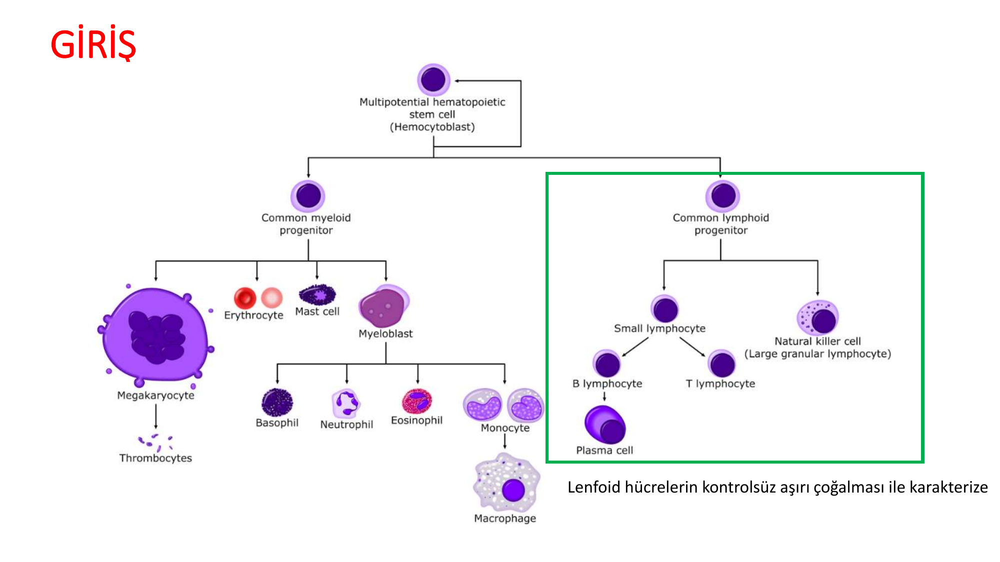

### Lenfoproliferatif Hastalıkların Sınıflaması

* **Akut lenfoblastik lösemi** (B ve T hücreli)
* **Kronik lenfositik lösemi** (B ve T hücreli)
* **Lenfomalar**
  * Hodgkin lenfoma (HL)
  * Non-Hodgkin lenfoma (NHL) — B ve T hücreli
* **Tüylü hücreli lösemi** (HCL — Hairy Cell Leukemia)
* **İri granüllü lenfositik lösemi** (LGL — Large Granular Lymphocytic)
* **Plazma hücreli neoplazm** (Multipl miyelom, Waldenström makroglobulinemisi vb.)

### WHO 2022 Sınıflandırması

WHO 2022 (5. baskı), lenfoid neoplazileri köken aldıkları hücre tipine ve olgunlaşma aşamasına göre kapsamlı biçimde sınıflandırır:

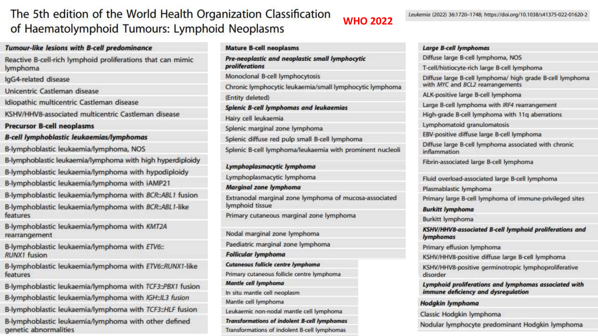

> 💡 **Sınav notu:** Lenfoproliferatif hastalıklar, lenfoid serinin **herhangi bir olgunlaşma aşamasından** köken alabilir. Prekürsör hücrelerden köken alan hastalıklar (ALL) genellikle agresif seyrederken, matür hücrelerden köken alanlar arasında hem agresif (DBBHL, Burkitt) hem de indolent (foliküler, marjinal zon) tipler bulunur.

---

## NON-HODGKİN LENFOMALAR (NHL)

### Genel Bilgiler

NHL, tüm lenfomaların yaklaşık **%90**'ını oluşturur. Hodgkin lenfomadan farklı olarak daha heterojen bir gruptur ve çok sayıda alt tipi vardır.

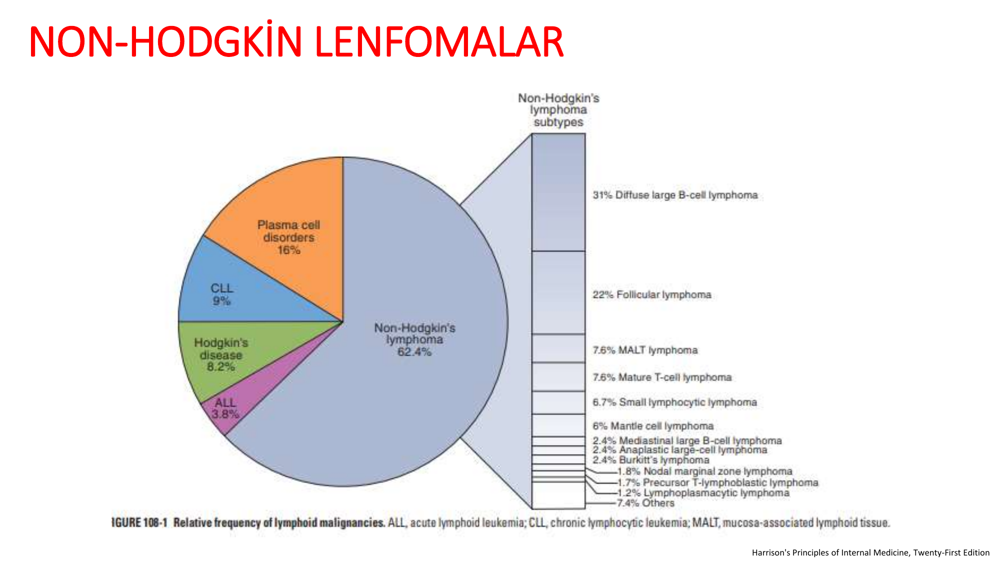

**NHL alt tiplerinin sıklık sıralaması:**

| Alt Tip | Sıklık |
|---|---|
| **Diffüz büyük B hücreli lenfoma (DBBHL)** | **%31** (en sık) |
| **Foliküler lenfoma** | **%22** (2. en sık) |
| MALT lenfoma | %7.6 |
| Matür T hücreli lenfoma | %7.6 |
| Küçük lenfositik lenfoma (KLL/SLL) | %6.7 |
| Mantle hücreli lenfoma | %6 |
| Mediastinal büyük B hücreli lenfoma | %2.4 |
| Anaplastik büyük hücreli lenfoma | %2.4 |
| Burkitt lenfoma | %2.4 |

> 💡 **Sınav notu:** En sık NHL = **DBBHL (%31)**, 2. en sık = **Foliküler lenfoma (%22)**. Bu sıralama sınavlarda sıkça sorulur.

---

### Lenf Nodu Anatomisi

Lenfomaların patolojisini anlamak için lenf nodu yapısını bilmek önemlidir:

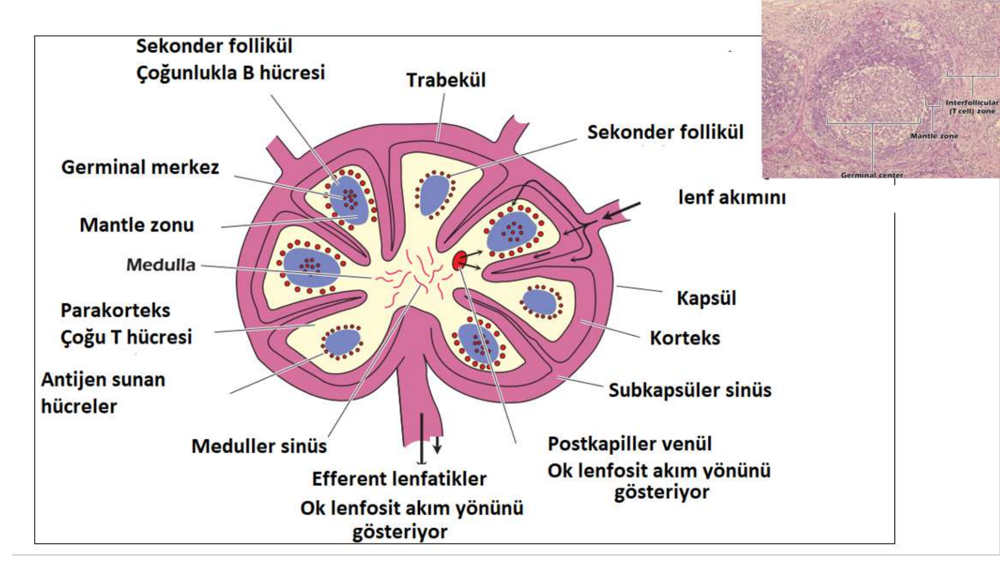

* **Korteks (folliküller)** → Çoğunlukla **B hücreleri** (germinal merkez + mantle zonu)
* **Parakorteks** → Çoğunlukla **T hücreleri**
* **Medulla** → Plazma hücreleri ve makrofajlar
* **Germinal merkez** → B hücre olgunlaşması ve sınıf değişimi (class switching) burada gerçekleşir

> 💡 **Sınav notu:** Foliküler lenfoma → **germinal merkez** kökenli, Mantle hücreli lenfoma → **mantle zonu** kökenli, Marjinal zon lenfoma → **marjinal zon** kökenli. Köken aldıkları bölge isimlerini verir.

---

### NHL Etiyoloji

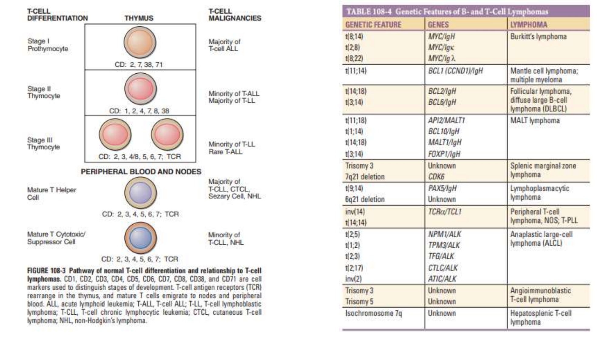

**Enfeksiyöz ajanlar:**

| Enfeksiyöz Ajan | İlişkili Lenfoma |
|---|---|
| **EBV** (Epstein-Barr virüs) | Burkitt lenfoma (endemik form), posttransplant lenfoma, NK/T hücreli lenfoma |
| **HTLV-1** | Erişkin T hücreli lösemi/lenfoma (ATL) |
| **HIV** | DBBHL, Burkitt, primer SSS lenfoması |
| **HCV** (Hepatit C) | Splenik marjinal zon lenfoma, DBBHL |
| **Hepatit B** | DBBHL |
| **H. pylori** | Gastrik MALT lenfoma |
| **HHV-8** | Primer efüzyon lenfoması |

**Diğer risk faktörleri:**
* İmmünsüpresyon (organ nakli, HIV, otoimmün hastalıklar)
* Otoimmün hastalıklar (Sjögren sendromu, Hashimoto tiroiditi, çölyak → MALT lenfoma riski ↑)
* Kimyasal maruziyet (pestisitler, herbisitler)

> 💡 **Sınav notu:** **H. pylori — Gastrik MALT lenfoma** ilişkisi sınavların klasik sorusudur. Erken evre gastrik MALT lenfomada H. pylori eradikasyonu ile **tümör regresyonu** sağlanabilir — bu, enfeksiyon-lenfoma ilişkisinin en iyi kanıtlanmış örneğidir.

---

### B ve T Hücre Diferansiasyonu ve Lenfoma İlişkisi

Her lenfoma alt tipi, B veya T hücre gelişiminin belirli bir aşamasındaki hücreden köken alır:

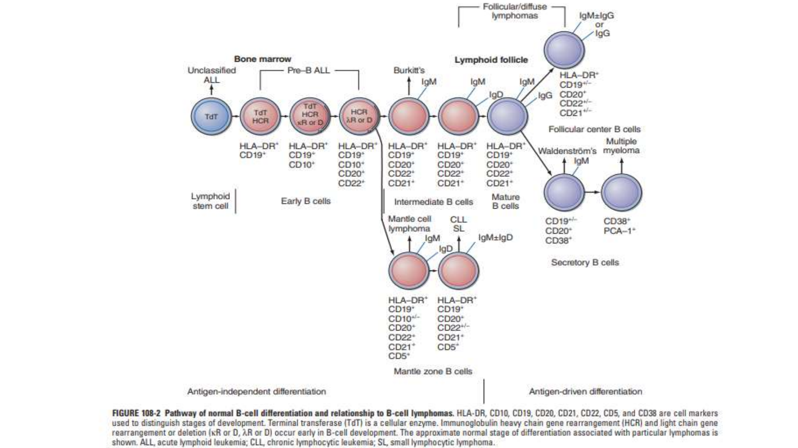

**B Hücre Diferansiasyonu ve İlişkili Lenfomalar:**

| Diferansiasyon Aşaması | Belirteçler | İlişkili Lenfoma |
|---|---|---|
| Lenfoid kök hücre | TdT+, CD19+ | Pre-B ALL |
| Erken B hücre | CD19+, CD20+/- | Pre-B ALL |
| Mantle zon B hücresi | CD19+, CD20+, CD5+, IgM/IgD | **Mantle hücreli lenfoma**, KLL/SLL |
| Germinal merkez B hücresi | CD10+, BCL6+ | **Foliküler lenfoma**, **Burkitt lenfoma** |
| Marjinal zon B hücresi | CD19+, CD20+ | **Marjinal zon lenfoma (MALT)** |
| Matür B hücre | sIg+, CD19+, CD20+ | **DBBHL** |
| Plazma hücresi | CD38+, CD138+ | **Multipl miyelom**, Waldenström |

**T Hücre Diferansiasyonu ve İlişkili Lenfomalar/Genetik Özellikler:**

| Sitogenetik Anomali | Gen | İlişkili Lenfoma |
|---|---|---|
| **t(8;14)** | MYC/IgH | **Burkitt lenfoma** |
| t(2;8) / t(8;22) | MYC/Ig-kappa/lambda | Burkitt lenfoma |
| **t(11;14)** | BCL1 (Siklin D1)/IgH | **Mantle hücreli lenfoma** |
| **t(14;18)** | BCL2/IgH | **Foliküler lenfoma** |
| t(3;14) | BCL6/IgH | DBBHL |
| t(11;18) | API2/MALT1 | MALT lenfoma |
| t(1;14) | BCL10/IgH | MALT lenfoma |

**⚠️ ÖNEMLİ — Sınavlarda En Çok Sorulan Translokasyonlar:**

| Translokasyon | Gen | Lenfoma | Hatırlatıcı |
|---|---|---|---|
| **t(8;14)** | **MYC** | **Burkitt** | "8-14 → Burkitt" |
| **t(11;14)** | **Siklin D1** | **Mantle** | "11-14 → Mantle" |
| **t(14;18)** | **BCL2** | **Foliküler** | "14-18 → Foliküler" |

> 💡 **Sınav notu:** Bu üç translokasyon sınavların en sık sorulan hematoloji konularındandır. Hepsinde **kromozom 14** (IgH lokusunun bulunduğu kromozom) ortaktır. Translokasyon sonucu onkogen, immünglobulin promoterinin kontrolü altına girerek **aşırı eksprese** olur.

---

### NHL Genel Yaklaşım

NHL'li bir hastada değerlendirilmesi gereken temel noktalar:

* **Semptomların süresi ve ilerleme hızı** → Agresif mi, indolent mi?
* **"B" semptomları** → Ateş, gece terlemeleri, açıklanamayan kilo kaybı
* **Lokalize edici semptomlar** → Göğüs, karın veya MSS tutulumunu düşündüren bulgular
* **Komorbidite** → Tedavi seçimini etkiler
* **Fizik muayene** → Tüm periferik lenf nodu bölgeleri, hepatosplenomegali, efüzyon, kitle, cilt tutulumu
* **Ekstranodal tutulum** → Hastalık yönetimini etkiler

---

### Tedavi Öncesi Değerlendirme ve Evreleme

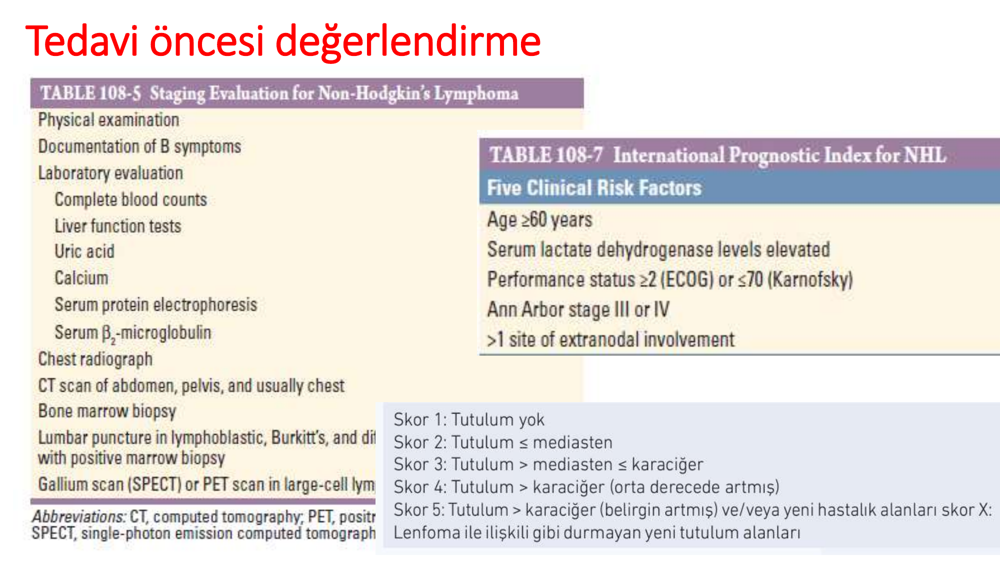

**Tedavi öncesi yapılması gerekenler:**
* Fizik muayene ve B semptomlarının belgelenmesi
* Tam kan sayımı, karaciğer fonksiyon testleri
* LDH, ürik asit, kalsiyum
* Serum protein elektroforezi, beta-2 mikroglobulin
* Akciğer grafisi
* BT (abdomen, pelvis, genellikle toraks)
* **Kemik iliği biyopsisi**
* Lenfoblastik, Burkitt ve büyük hücreli lenfomada **lomber ponksiyon**
* **PET-BT** (FDG-avid lenfomalar: DBBHL, HL, foliküler grade 3 vb.)

### Uluslararası Prognostik İndeks (IPI) — NHL

IPI, agresif NHL'lerde (özellikle DBBHL) prognoz belirlemede kullanılır:

| Risk Faktörü | Kötü Prognoz Kriteri |
|---|---|
| Yaş | ≥60 |
| LDH | Yüksek (normalin üstü) |
| Performans durumu | ECOG ≥2 veya Karnofsky ≤70 |
| Ann Arbor evresi | III veya IV |
| Ekstranodal tutulum | >1 alan |

**IPI Risk Grupları:**

| Puan | Risk Grubu | 5 Yıllık Sağkalım |
|---|---|---|
| 0-1 | Düşük risk | ~%73 |
| 2 | Düşük-orta risk | ~%51 |
| 3 | Orta-yüksek risk | ~%43 |
| 4-5 | Yüksek risk | ~%26 |

> 💡 **Sınav notu:** IPI skorunun 5 parametresi: **Yaş, LDH, ECOG, evre, ekstranodal tutulum**. Her biri 1 puan. Sınavda "IPI skoru yüksek olan hastalarda prognoz nedir?" şeklinde sorulabilir.

---

### NHL Ann-Arbor Evrelemesi

Ann-Arbor evreleme sistemi hem NHL hem HL için kullanılır:

| Evre | Tanım |
|---|---|
| **Evre I** | Bir lenf nodu bölgesi veya lenfoid yapı (dalak, timus, Waldeyer halkası) veya tek ekstralenfatik alan tutulumu (I_E) |
| **Evre II** | Diyaframın **aynı tarafında** iki veya daha fazla lenf nodu bölgesi veya lokalize ekstralenfatik organ/alan tutulumu (II_E) |
| **Evre III** | Diyaframın **her iki tarafında** lenf nodu/bölge tutulumu ± lokalize ekstralenfatik organ (III_E) veya dalak (III_S) veya her ikisi (III_ES) |
| **Evre IV** | Bir veya daha fazla alanda **ekstranodal organ** (karaciğer, kemik, kemik iliği, akciğer) **diffüz veya dissemine** tutulumu |

**Ek tanımlayıcılar:**
* **A** → B semptomları yok
* **B** → B semptomları var (ateş >38°C, çamaşır ıslatacak kadar gece terlemesi, son 6 ayda kilonun %10'undan fazlasını kaybetme)
* **E** → Nodal alana bitişik veya yakın bir ekstranodal bölgenin tutulumu

> 💡 **Sınav notu:** B semptomlarının tanımı sınavlarda sıkça sorulur: **Ateş >38°C + gece terlemesi (hollanması gerekecek kadar) + 6 ayda >%10 kilo kaybı**. Sadece kaşıntı B semptomu sayılmaz!

---

### Matür B Hücreli Lenfomaların Davranışsal Sınıflaması

NHL'lerin tedavi ve prognoz açısından en önemli ayrımı **agresif vs indolent** seyirli olmalarıdır:

| Agresif Seyirli | Ara Grup | Yavaş (İndolent) Seyirli |
|---|---|---|
| **Burkitt lenfoma** | Mantle hücreli lenfoma | **Foliküler lenfoma** |
| **DBBHL** | | Marjinal zon lenfoma |
| | | Tüylü hücreli lösemi |
| | | Lenfoplazmasitik lenfoma |

**⚠️ ÖNEMLİ — Agresif vs İndolent Lenfoma Farkları:**

| Özellik | Agresif | İndolent |
|---|---|---|
| Başlangıç | Hızlı | Yavaş, sinsi |
| Tedavisiz seyir | Haftalar-aylar içinde ölümcül | Yıllar sürebilir |
| Kemoterapiye yanıt | Yüksek | Orta |
| **Kür şansı** | **Var** (DBBHL'de ~%60-65) | **Genellikle yok** (relaps kaçınılmaz) |
| Yaklaşım | Acil tedavi | Asemptomatik ise "izle ve bekle" (watch & wait) |

> 💡 **Sınav notu:** Paradoks: Agresif lenfomalar (DBBHL) tedavi ile **kür edilebilir**, ancak indolent lenfomalar (foliküler) genellikle **kür edilemez** ama yıllarca yaşam mümkündür. Bu paradoks sınavlarda sorulabilir.

---

## BURKITT LENFOMA

### Genel Özellikler

* **E > K**, agresif seyirli lenfoma
* **İkilenme zamanı < 24 saat** → En hızlı çoğalan insan tümörlerinden biri
* Sıklıkla **< 35 yaş**
* Sitogenetik: **t(8;14)** → MYC/IgH → MYC onkogeninin aşırı ekspresyonu

### Üç Klinik Formu

| Form | Özellikler | EBV |
|---|---|---|
| **Endemik (Afrika) form** | Çene veya yüz kemiği tümörü; over, testis, böbrek, meme, kemik iliği ve meninkslere yayılır | **Pozitif** (~%100) |
| **Endemik olmayan (sporadik) form** | Abdominal masif hastalık (asit, böbrek, testis/over tutulumu); kemik iliği ve SSS'ye yayılır | **Negatif** (~%15-20) |
| **İmmün yetmezlikle ilişkili form** | Sıklıkla lenf nodu tutulumu; akut lösemi olarak ortaya çıkabilir (HIV ilişkili) | Değişken |

> 💡 **Sınav notu:** Afrika'da çocuklarda **çene tümörü + EBV pozitifliği** → **Endemik Burkitt lenfoma**. Batı dünyasında genç erkekte **abdominal kitle (özellikle ileoçekal bölge)** → **Sporadik Burkitt lenfoma**.

### Patoloji

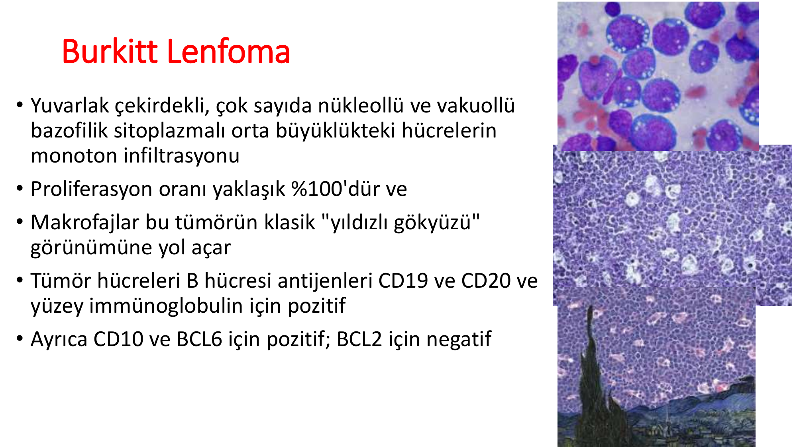

* Yuvarlak çekirdekli, çok sayıda nükleollü ve **vakuollü bazofilik sitoplazmalı** orta büyüklükteki hücrelerin monoton infiltrasyonu
* **Proliferasyon oranı (Ki-67): yaklaşık %100** → Tüm hücreler bölünüyor
* Makrofajlar bu tümörün klasik **"yıldızlı gökyüzü" (starry sky)** görünümüne yol açar
* İmmünfenotip: **CD19+, CD20+**, yüzey immünglobulin (+), **CD10+, BCL6+**, **BCL2 negatif**

**⚠️ ÖNEMLİ — Burkitt'in Ayırıcı Tanısı:**

| Özellik | Burkitt | DBBHL |
|---|---|---|
| Ki-67 | **~%100** | %40-90 |
| BCL2 | **Negatif** | Sıklıkla pozitif |
| Translokasyon | t(8;14) — MYC | Çeşitli |
| Morfoloji | Monoton, orta boy | Pleomorfik, büyük |
| Yıldızlı gökyüzü | **Karakteristik** | Nadir |

> 💡 **Sınav notu:** **"Yıldızlı gökyüzü" görünümü** → Burkitt lenfoma. **Ki-67 ~%100** → Burkitt. **BCL2 negatif** olması DBBHL'den ayırt etmede önemlidir (DBBHL genellikle BCL2+).

### Tedavi

* Kemosensitif — **doz artırmalı R-EPOCH** veya Hyper-CVAD
* **SSS profilaksisi** mutlaka yapılmalıdır (intratekal kemoterapi)
* Tedavi öncesi **tümör lizis sendromu profilaksisi** kritik öneme sahiptir (hidrasyon + rasburikaz)

> 💡 **Sınav notu:** Burkitt lenfoma, hızlı çoğalması nedeniyle **tümör lizis sendromu riski en yüksek** olan lenfomadır. Tedavi başlamadan önce profilaksi (agresif hidrasyon + allopürinol/rasburikaz) şarttır.

---

## DİFFÜZ BÜYÜK B HÜCRELİ LENFOMA (DBBHL)

### Genel Özellikler

* **En sık NHL alt tipi** (%31)
* E > K
* Tanı anı ortanca yaş: **64**
* Birinci derece akrabaları olan kişilerde DBBHL gelişme riski daha yüksek (RR **3.5 kat**)
* İmmünsüprese bireylerde risk artmıştır

### Klinik Bulgular

* **%30-40**'ında evre I veya II hastalık (diğer NHL'lere göre erken evre yakalanma oranı daha yüksek)
* ~**%40**'ında "B" semptomları
* **%50**'sinde LDH yüksek
* ~**%40** oranında **ekstranodal tutulum** — kemik iliği, MSS, GİS, tiroid, karaciğer, cilt
* Yaygın kemik iliği tutulumu veya testis, meme, böbrek, adrenal bez, paranazal sinüs veya epidural boşluk tutulumunda **MSS yayılımı riski artmıştır**

> 💡 **Sınav notu:** DBBHL'de MSS profilaksisi gereken durumları hatırla: **Testis, meme, böbrek, adrenal, paranazal sinüs, epidural** tutulumları ve **yüksek IPI skoru**. Sınavda "hangi durumda MSS profilaksisi gerekir?" şeklinde sorulabilir.

### Patoloji ve Alt Tipler

* Tümör, yüksek proliferatif indekse sahip **büyük, atipik lenfositlerin diffüz proliferasyonundan** oluşur
* İmmünfenotip: **CD19+, CD20+, CD79a+**
* İki ana alt tip (gen ekspresyon profili — Hans algoritması):
  * **Germinal merkez kökenli (GCB):** CD10+ ve/veya BCL6+ → **Daha iyi prognoz**
  * **Aktive B hücresi (ABC) / non-GCB:** MUM1+ → **Daha kötü prognoz**

**Double-Hit Lenfoma:**
* MYC rearanjmanı hastaların **%10**'unda bulunur
* BCL2 veya BCL6 rearanjmanı **%20**'sinde MYC'e eşlik eder → **Double-hit lenfoma**
* Double-hit lenfomalar **çok kötü prognozludur** ve daha yoğun tedavi rejimleri gerektirir

> 💡 **Sınav notu:** **Double-hit lenfoma** = MYC + BCL2 (veya BCL6) rearanjmanının birlikte bulunması. Triple-hit = MYC + BCL2 + BCL6. Standart R-CHOP yetersiz kalır, **doz artırmalı R-EPOCH** tercih edilir.

### Tedavi

* **Kombinasyon kemoterapiler küratiftir** — en önemli özellik!
* Hastaların ~**%60-65**'inde kombine KT ile **kür** elde edilir
* **1/3** hastada nüks/dirençli hastalık görülür
* **Standart tedavi:** **R-CHOP** (Rituksimab + Siklofosfamid, Doksorubisin, Vinkristin, Prednizon)
* Yüksek riskli alt tiplerde: **doz artırmalı R-EPOCH**
* Nüks/dirençli hastalıkta: Kurtarma kemoterapisi → otolog kök hücre nakli, **CAR-T hücre tedavisi**

**R-CHOP Rejimi:**

| İlaç | Mekanizma |
|---|---|
| **R** — Rituksimab | Anti-CD20 monoklonal antikor |
| **C** — Siklofosfamid | Alkilleyici ajan |
| **H** — Hidroksidoksorubisin (Doksorubisin) | Antrasiklin |
| **O** — Oncovin (Vinkristin) | Vinka alkaloid |
| **P** — Prednizon | Kortikosteroid |

> 💡 **Sınav notu:** **R-CHOP**, DBBHL'nin standart birinci basamak tedavisidir ve sınavlarda sıkça sorulur. "R" harfi rituksimabı temsil eder ve anti-CD20 tedavinin eklenmesi ile kür oranları belirgin artmıştır. DBBHL **kürabıl** bir hastalıktır — bu indolent lenfomalardan temel farkıdır.

---

## FOLİKÜLER LENFOMA

### Genel Özellikler

* **2. en sık NHL** (%22)
* İndolent (yavaş seyirli) lenfoma
* Sitogenetik: **t(14;18)** → **BCL2/IgH** → BCL2 antiapoptotik proteinin aşırı ekspresyonu → Hücreler apoptozdan kaçar
* **Ağrısız lenfadenopati** ile prezente olur

### Klinik Bulgular

* Birden fazla bölgede lenfoid tutulum ve **epitroklear nodlar** gibi alışılmadık bölgelerin tutulumu görülebilir
* Çoğu hastada B semptomları ve LDH yüksekliği **yoktur**
* **DBBHL'ye histolojik dönüşüm (transformasyon)** yılda yaklaşık **%3** oranında → B semptomlarının ortaya çıkması ve LDH artışına dikkat!
* PET-BT'de yüksek FDG tutulumu olan bölgede **transformasyon** düşünülmeli
* Sentroblast sayısına göre histolojik olarak **3 grade** (Grade IIIB → DBBHL gibi kabul edilir)

### FLIPI Skoru (Foliküler Lenfoma İçin Prognostik İndeks)

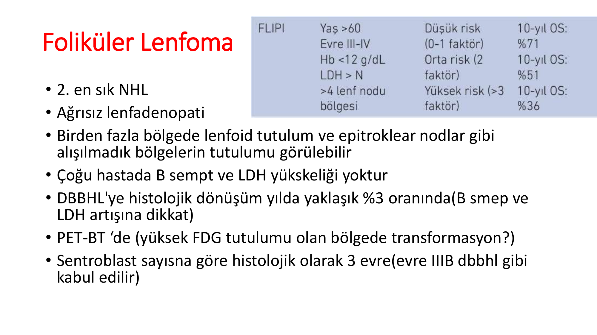

| FLIPI Parametresi | Kötü Prognoz Kriteri |
|---|---|
| Yaş | >60 |
| Ann Arbor evresi | III-IV |
| Hemoglobin | <12 g/dL |
| LDH | >Normal |
| Lenf nodu bölgesi | >4 |

| Puan | Risk Grubu | 10 Yıllık OS |
|---|---|---|
| 0-1 faktör | Düşük risk | **%71** |
| 2 faktör | Orta risk | **%51** |
| >3 faktör | Yüksek risk | **%36** |

### Tedavi Başlama Kriterleri

Foliküler lenfoma indolent olduğu için asemptomatik hastalarda hemen tedavi başlamak gerekmez. Tedavi başlama endikasyonları:

**Modifiye GELF Kriterleri:**
* Her biri ≥3 cm olacak şekilde ≥3 bölgede tutulum
* ≥7 cm nodal veya ekstranodal kitle
* B semptomları
* Semptomatik splenomegali
* Plevral efüzyon veya peritonda asit
* Sitopeniler (lökosit <1.0×10⁹/L ve/veya trombosit <100×10⁹/L)
* Lösemi (>5.0×10⁹/L malign hücre)

### Tedavi

* Kemoterapi ve radyoterapiye **duyarlı**
* Ancak **kürabıl değildir** (nüks kaçınılmaz)
* **R-CHOP** veya **R-Bendamustin**

> 💡 **Sınav notu:** Foliküler lenfoma = **kürabıl değil ama uzun sağkalım**. Asemptomatik erken evre hastalıkta "watch and wait" uygulanabilir. **t(14;18) → BCL2** aşırı ekspresyonu → hücreler ölmez (apoptoz ↓). **DBBHL'ye dönüşüm (%3/yıl)** → Ani B semptomları + LDH ↑ gelişirse şüphelen.

---

## MANTLE HÜCRELİ LENFOMA

### Genel Özellikler

* Lenfomaların **%6**'sı
* Sitogenetik: **t(11;14)** → Kromozom 14 üzerindeki ağır zincir geni ile kromozom 11 üzerindeki bcl-1 geni arasında translokasyon → **Siklin D1 aşırı ekspresyonu**
* Siklin D1, hücre döngüsünün G1→S geçişini kontrol eder → Aşırı ekspresyon kontrolsüz çoğalmaya yol açar
* **Agresif ve indolent arasında** bir davranış gösterir

### Klinik Bulgular

* Medyan yaş: **63**, **E/K: 4/1** (belirgin erkek hakimiyeti)
* Palpabl lenfadenopati
* **%70** başvuru anında **evre IV**
* **GİS tutulumu çok sık** (lenfomatöz polipozis — multipl polipoid lezyonlar)
* İmmünfenotip: B hücre belirteçleri + **CD5 pozitif** (KLL/SLL ile benzer)

> 💡 **Sınav notu:** **CD5+ B hücreli lenfoma** denildiğinde iki tanı düşün: **KLL/SLL** ve **Mantle hücreli lenfoma**. Ayrımda Siklin D1 pozitifliği ve t(11;14) mantle hücreli lenfomayı tanımlar. KLL'de Siklin D1 negatiftir.

### Prognoz ve Tedavi

* 5 yıllık yaşam: Düşük IPI'da **%50**, yüksek IPI'da **%25**
* **MİPİ** (Mantle Cell Lymphoma International Prognostic Index) → Ki-67 indeksi eklenir
* Tedavi seçenekleri:
  * **R-HyperCVAD + yüksek doz metotreksat**
  * R-CHOP, R-DHAP
  * **İbrutinib** (BTK inhibitörü) — nüks/dirençli hastalıkta
  * Lenalidomid
  * Kök hücre nakli

> 💡 **Sınav notu:** Mantle hücreli lenfomada **t(11;14) → Siklin D1**, **CD5+**, **GİS polipozis**, **erkek hakimiyeti** anahtar kelimelerdir. İndolent lenfomaların aksine "watch and wait" uygulanmaz.

---

## TÜYLÜ HÜCRELİ LÖSEMİ (HCL)

### Genel Özellikler

* **E/K: 5/1**, ortalama yaş ~**50**
* Nadir bir B hücreli lenfoproliferatif hastalık
* Klasik triad: **Splenomegali + Pansitopeni + Lenfositoz**

### Tanısal Özellikler

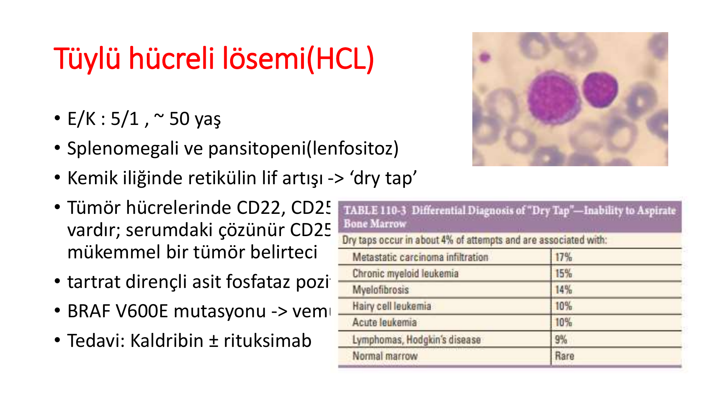

* Periferik yaymada **tüylü (saçaklı) sitoplazma uzantılı** lenfositler
* Kemik iliğinde **retikülin lif artışı** → kemik iliği aspirasyonunda **"dry tap"** (kuru aspirasyon — ilik çekilemez)
* İmmünfenotip: **CD22+, CD25+, CD103+** (güçlü ekspresyon); serumdaki çözünür CD25 seviyesi hastalık aktivitesi için mükemmel bir tümör belirteci
* **Tartrat dirençli asit fosfataz (TRAP) pozitif**
* **BRAF V600E mutasyonu** → Tanısal ve terapötik hedef (vemurafenib)

**"Dry Tap" Ayırıcı Tanısı:**

| Neden | Sıklık |
|---|---|
| Metastatik karsinom infiltrasyonu | %17 |
| Kronik myeloid lösemi | %15 |
| Miyelofibroz | %15 |
| **Tüylü hücreli lösemi** | **%10** |
| Akut lösemi | %10 |

### Tedavi

* **Kladribin (2-CdA)** ± rituksimab → Birinci basamak, tek kür ile uzun süreli remisyon
* BRAF V600E mutasyonu varsa → **Vemurafenib** (BRAF inhibitörü)

> 💡 **Sınav notu:** HCL'nin anahtar kelimeleri: **Tüylü hücreler, splenomegali, pansitopeni, dry tap, TRAP pozitif, CD103+, CD25+, BRAF V600E, kladribin**. "Orta yaşlı erkek, masif splenomegali, pansitopeni, kemik iliği aspirasyonu yapılamıyor (dry tap)" → HCL düşün.

---

## HODGKİN LENFOMA (HL)

### Genel Özellikler

* **Bimodal yaş dağılımı:** 20-40 yaş ve **55 yaş üstü** (iki pik)
* Sıklık: **2-3/100.000**, tüm lenfomaların **%10**'u
* HL'li hastaların çoğu **supradiyafragmatik lenfadenopati** ile başvurur
* Hastaların yaklaşık **1/3**'ünde ateş, gece terlemesi ve kilo kaybı (B semptomları)
* Hastaların **%10-15**'inde **kaşıntı**
* Nadir ancak patognomonik semptom (vakaların **<%5**): **Alkol alımı sonrası hastalık bölgelerinde şiddetli ağrı** (Alkol ağrısı)
* Hastalık en sık **bitişik lenf nodu gruplarını** tutar → Ardışık (contiguous) yayılım gösterir
* Doğrudan invazyon veya hematojen yayılım ile ekstranodal dokuları da etkileyebilir
* En sık tutulan ekstranodal bölgeler: **Dalak, akciğerler, karaciğer ve kemik iliği**

**⚠️ ÖNEMLİ — HL vs NHL Karşılaştırması:**

| Özellik | Hodgkin Lenfoma | Non-Hodgkin Lenfoma |
|---|---|---|
| Sıklık | Lenfomaların %10'u | Lenfomaların %90'ı |
| Yaş dağılımı | Bimodal (20-40 ve >55) | Yaşla artar |
| Yayılım | **Ardışık (contiguous)** — komşu lenf nodu grupları | **Non-contiguous** — atlamalı |
| Ekstranodal tutulum | Daha az | Daha sık |
| B semptomları | %30-35 | Değişken |
| Waldeyer halkası tutulumu | Nadir | Sık (özellikle NHL) |
| Mezenterik lenf nodu | Nadir | Sık |
| Neoplastik hücre | **Reed-Sternberg** | Lenfoma hücresi |
| Kür oranı | **%80-90** (yüksek) | Alt tipe göre değişir |

> 💡 **Sınav notu:** HL, NHL'den farklı olarak **ardışık yayılım** gösterir (bir lenf nodu grubundan komşusuna). Bu nedenle radyoterapi planlamasında tutulan alanın komşu bölgeleri de hedeflenir. **Alkol ile ağrı** HL'ye oldukça özgün bir semptomdur.

### Reed-Sternberg (RS) Hücresi

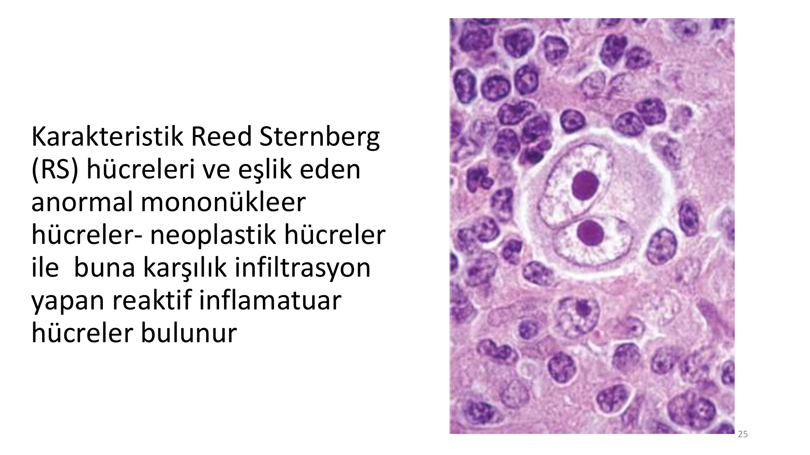

* HL'nin **tanısal hücresidir**
* Karakteristik **Reed-Sternberg (RS) hücreleri** ve eşlik eden anormal mononükleer hücreler (Hodgkin hücreleri) → neoplastik hücreleri oluşturur
* Arka planda **reaktif inflamatuar hücreler** (lenfositler, eozinofiller, nötrofiller, histiyositler, plazma hücreleri) infiltre olur
* RS hücresi: Büyük, binükleer veya multinükleer, her çekirdekte belirgin nükleol → **"Baykuş gözü" (owl-eye) görünümü**
* İmmünfenotip: **CD15+, CD30+**, genellikle CD20 negatif (B hücre kökenli olmasına rağmen)
* Neoplastik hücreler tümörün **<%5**'ini oluşturur, geri kalanı reaktif infiltrattır

> 💡 **Sınav notu:** RS hücresi = **CD15+, CD30+, CD20 genellikle negatif**. "Baykuş gözü görünümü" sınavlarda RS hücresinin tanımıdır. RS hücresi diğer hastalıklarda da görülebilir (EBV enfeksiyonu vb.), bu nedenle tek başına tanı koydurtucu değildir — **uygun arka plan** (reaktif hücre infiltrasyonu) ile birlikte değerlendirilmelidir.

---

### Klasik HL Alt Tipleri

| Alt Tip | Sıklık | Özellikler |
|---|---|---|
| **Nodüler Sklerozan** | **%70** | 15-35 yaş, **mediastinal tutulum sık**, bulky hastalık yapabilir, solunum semptomları |
| **Miks Selüler** | **%20** | Erkeklerde sık, periferik LAP > mediastinal, EBV ilişkili |
| **Lenfositten Zengin** | **%5** | Erken evre periferik LAP, iyi prognoz |
| **Lenfositten Fakir** | **%1** | Ortanca yaş 30, erkek, HIV ilişkili, ileri evre, **en kötü prognoz** |

> 💡 **Sınav notu:** **Nodüler sklerozan** = en sık HL alt tipi (%70), genç kadınlarda mediastinal kitle ile prezente olur. **Miks selüler** = 2. en sık (%20), EBV ile en sık ilişkili alt tip. **Lenfositten fakir** = en kötü prognoz, HIV ile ilişkili.

**Nodüler Lenfosit Predominant HL (NLPHL):**
* Klasik HL'den farklı bir antitedir
* RS hücresi yerine **"popcorn" hücreleri** (LP — lymphocyte predominant) bulunur
* İmmünfenotip: **CD20+, CD15-, CD30-** (klasik HL'nin tam tersi)
* İndolent seyir, iyi prognoz

---

### HL Ann-Arbor Evrelemesi

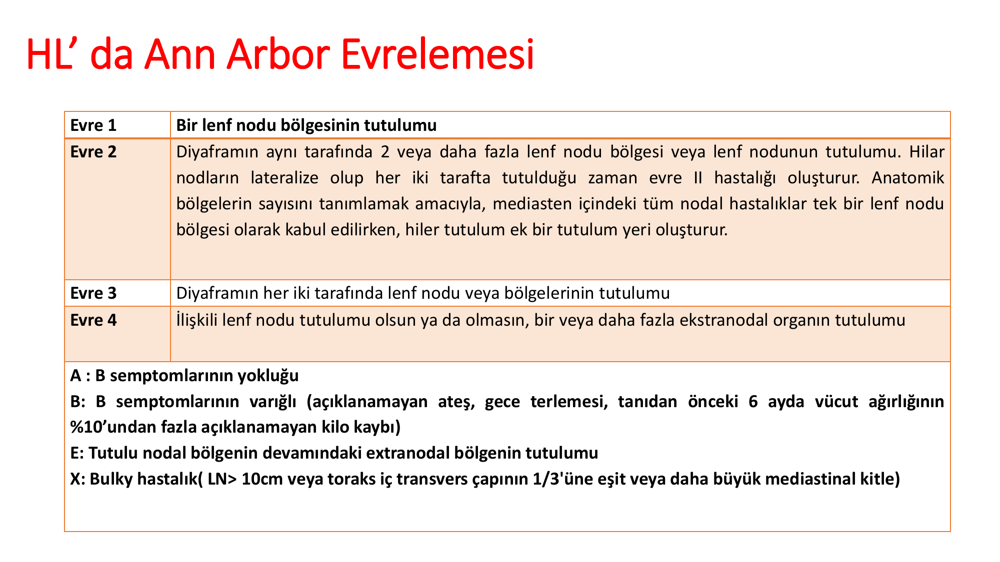

| Evre | Tanım |
|---|---|
| **Evre 1** | Bir lenf nodu bölgesinin tutulumu |
| **Evre 2** | Diyaframın aynı tarafında ≥2 lenf nodu bölgesi/nodu tutulumu |
| **Evre 3** | Diyaframın her iki tarafında lenf nodu/bölge tutulumu |
| **Evre 4** | ≥1 ekstranodal organın tutulumu (lenf nodu tutulumu olsun ya da olmasın) |

**Ek tanımlayıcılar:**
* **A:** B semptomları yok
* **B:** B semptomları var (ateş, gece terlemesi, kilo kaybı)
* **E:** Tutulu nodal bölgenin devamındaki ekstranodal bölge tutulumu
* **X:** Bulky hastalık (LN > 10 cm veya toraks iç transvers çapının 1/3'üne eşit/büyük mediastinal kitle)

---

### HL Risk Faktörleri ve Prognostik Skorlar

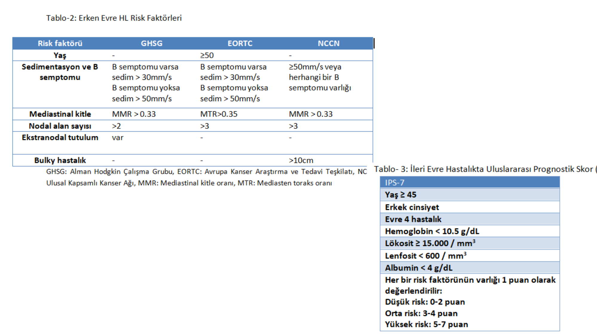

**Erken Evre HL Risk Faktörleri:**

| Risk Faktörü | GHSG | EORTC | NCCN |
|---|---|---|---|
| Yaş | — | ≥50 | — |
| Sedimentasyon/B semptomu | B semptomu varsa ESR >30, yoksa >50 | B semptomu varsa ESR >30, yoksa >50 | ≥50 veya herhangi B semptomu |
| Mediastinal kitle | MMR >0.33 | MTR >0.35 | MMR >0.33 |
| Nodal alan sayısı | >2 | >3 | >3 |
| Ekstranodal tutulum | Var | — | — |
| Bulky hastalık | — | >10 cm | — |

**İleri Evre HL — Uluslararası Prognostik Skor (IPS):**

| Risk Faktörü | Kriter |
|---|---|
| Yaş | ≥45 |
| Cinsiyet | Erkek |
| Evre | Evre 4 hastalık |
| Hemoglobin | <10.5 g/dL |
| Lökosit | ≥15.000/mm³ |
| Lenfosit | <600/mm³ |
| Albumin | <4 g/dL |

* Her bir risk faktörü 1 puan olarak değerlendirilir
* **Düşük risk:** 0-2 puan
* **Orta risk:** 3-4 puan
* **Yüksek risk:** 5-7 puan

---

### HL Tedavisi

**Erken evre (Evre I-II):**
* Tedaviye sıklıkla **ABVD** ile başlanır
* 2 kür sonrası **ara PET-BT** ile yanıt değerlendirmesi
* Yanıta göre tedavi devamı kararı verilir

**İleri evre (Evre III-IV):**
* **ABVD** (Adriamisin/Doksorubisin, Bleomisin, Vinblastin, Dakarbazin)
* **Brentuksimab vedotin + AVD (BV-AVD)** — Anti-CD30 antikor-ilaç konjugatı
* **escBEACOPP** (eskale edilmiş — daha yoğun rejim)
* Yine ara PET-BT ile yanıt durumuna göre devam

**ABVD Rejimi:**

| İlaç | Tam Adı |
|---|---|
| **A** | Adriamisin (Doksorubisin) |
| **B** | Bleomisin |
| **V** | Vinblastin |
| **D** | Dakarbazin |

**Nüks/Dirençli HL:**
* Kurtarma kemoterapisi → **Otolog kök hücre nakli**
* **Brentuksimab vedotin** (anti-CD30)
* **Nivolumab/Pembrolizumab** (PD-1 inhibitörleri — immün kontrol noktası inhibitörleri)

> 💡 **Sınav notu:** HL tedavisinde ABVD standart rejimdir. Bleomisinin en önemli yan etkisi **pulmoner fibrozis**, doksorubisinin en önemli yan etkisi **kardiyotoksisite**dir. HL'nin genel **kür oranı %80-90** ile lenfomaların en iyi prognozlu alt tipidir. Nüks HL'de **PD-1 inhibitörleri** (nivolumab) devrim niteliğinde yanıtlar sağlamıştır.

---

## ÖZET VE SINAV İÇİN ÖNEMLİ NOKTALAR

### NHL — Hızlı Referans Tablosu

| Lenfoma | Translokasyon | Gen | CD Belirteç | Özel Özellik | Tedavi |
|---|---|---|---|---|---|
| **Burkitt** | **t(8;14)** | MYC | CD10+, CD20+, BCL2- | Yıldızlı gökyüzü, Ki-67 ~%100 | R-EPOCH, SSS prof. |
| **DBBHL** | Çeşitli | BCL6, MYC | CD19+, CD20+ | En sık NHL, kürabıl | **R-CHOP** |
| **Foliküler** | **t(14;18)** | BCL2 | CD10+, BCL6+ | İndolent, kürabıl değil | R-CHOP/Bendamustin |
| **Mantle** | **t(11;14)** | Siklin D1 | **CD5+**, CD20+ | GİS polipozis, erkek baskın | R-HyperCVAD, İbrutinib |
| **HCL** | — | BRAF V600E | CD25+, **CD103+** | Dry tap, TRAP+, tüylü hücre | **Kladribin** |
| **MALT** | t(11;18) | API2/MALT1 | CD19+, CD20+ | H. pylori ilişkili (gastrik) | Eradikasyon ± RT |

### HL — Hızlı Referans

| Özellik | Değer |
|---|---|
| En sık alt tip | Nodüler sklerozan (%70) |
| Tanısal hücre | **Reed-Sternberg** (CD15+, CD30+) |
| Patognomonik semptom | Alkol ile ağrı |
| Yayılım paterni | Ardışık (contiguous) |
| Standart tedavi | **ABVD** |
| Kür oranı | **%80-90** |

### Sınavda En Çok Sorulan Konular

**1. Translokasyonlar:**
* t(8;14) → MYC → **Burkitt**
* t(11;14) → Siklin D1 → **Mantle**
* t(14;18) → BCL2 → **Foliküler**

**2. Enfeksiyon-Lenfoma ilişkileri:**
* EBV → Burkitt (endemik), HL, posttransplant
* H. pylori → Gastrik MALT
* HTLV-1 → ATL
* HCV → Splenik marjinal zon, DBBHL
* HHV-8 → Primer efüzyon lenfoması

**3. Spesifik patolojik bulgular:**
* Yıldızlı gökyüzü → **Burkitt**
* Reed-Sternberg (baykuş gözü) → **HL**
* Tüylü hücreler + TRAP+ + Dry tap → **HCL**

**4. CD5+ B hücreli neoplazi:**
* KLL/SLL → CD5+, CD23+, Siklin D1 negatif
* Mantle hücreli lenfoma → CD5+, CD23-, **Siklin D1 pozitif**

**5. Agresif vs İndolent paradoksu:**
* Agresif (DBBHL, Burkitt) → **Kürabıl** ama tedavisiz ölümcül
* İndolent (Foliküler) → **Kürabıl değil** ama yıllar yaşanır

**6. B semptomları:**
* Ateş >38°C + gece terlemesi + >%10 kilo kaybı (6 ayda)
* Kaşıntı B semptomu **sayılmaz**

**7. Evreleme:**
* Ann-Arbor: I-IV arası, A/B, E/X ek tanımlayıcılar
* Diyafram sınırı belirleyici

**8. Tedavi rejimleri:**
* DBBHL → **R-CHOP**
* HL → **ABVD** (veya BV-AVD)
* Burkitt → **doz artırmalı R-EPOCH**
* Foliküler → **R-CHOP/R-Bendamustin** (tedavi endikasyonu varsa)
* HCL → **Kladribin**
* Mantle → **R-HyperCVAD**, ibrutinib

> **⚠️ Altın kurallar:**
> * Ağrısız lenfadenopati → Lenfoma dışla (eksizyon biyopsi!)
> * **İğne aspirasyonu lenfoma tanısı için yeterli değildir** → Eksizyonel/insizyonel biyopsi gerekir
> * B semptomları varlığı → Kötü prognoz göstergesi
> * LDH yüksekliği → Tümör yükü ve agresiflik göstergesi
> * Foliküler lenfomada ani LDH artışı + B semptomları → **DBBHL'ye transformasyon** şüphesi
> * HL ardışık yayılır, NHL atlamalı yayılır
> * Lenfoma tedavisinde **PET-BT** hem evreleme hem yanıt değerlendirmesinde altın standarttır
