# MYELODİSPLASTİK NEOPLAZİLER VE APLASTİK ANEMİ

**Hazırlayan:** Dr. A. Hilal Eroğlu Küçükdiler
**Bölüm:** ADÜ Tıp Fakültesi - Hematoloji
**Tarih:** 2025-2026 Dönem IV

---

## İÇİNDEKİLER

1. [Miyelodisplastik Neoplaziler (MDS)](#miyelodisplastik-neoplaziler-mds)
2. [Aplastik Anemi (AA)](#aplastik-anemi-aa)
3. [MDS vs AA Karşılaştırması](#mds-vs-aa-karşilaştirmasi)
4. [Özet ve Sınav İçin Önemli Noktalar](#özet-ve-sinav-için-önemli-noktalar)

---

## MYELODİSPLASTİK NEOPLAZİLER (MDS)

### Tanım

* **Anormal myeloid diferansiasyon**, kan ve kemik iliğinde **dismorfoloji** ve kanda **sitopeni** ile karakterize **klonal ve heterojen** bir hastalık grubudur
* Kemik iliği yetmezliğine bağlı sitopeniler ve **AML gelişme riskinin yüksek olması** ile karakterize hematolojik bozukluk
* Eski adıyla "prelösemik sendrom" olarak da bilinir

> 💡 **Sınav notu:** MDS'nin temel özelliği **"paradoks"** tır: Kemik iliği **hiperselüler** (hücre çoğalması artmış) olmasına rağmen periferik kanda **sitopeni** vardır. Bu "ineffektif hematopoez" olarak adlandırılır — hücreler üretilir ancak olgunlaşamadan kemik iliğinde ölürler (apoptoz ↑).

---

### Epidemiyoloji

* İnsidans: **4/100.000**
* **E > K**
* Görülme yaşı ortanca **70 yaş** → İleri yaş hastalığıdır
* İnsidans yaşla birlikte katlanarak artar (80 yaş üzerinde belirgin artış)

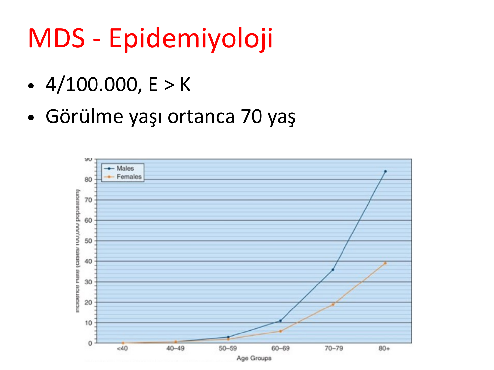

> 💡 **Sınav notu:** MDS **yaşlı hastalığıdır** (medyan yaş 70). Genç bir hastada MDS düşünüyorsanız mutlaka **terapiye ikincil MDS (t-MDS)** veya **konjenital kemik iliği yetmezliği sendromları** (Fanconi anemisi vb.) akla gelmelidir.

---

### Etiyoloji

MDS, yaşlanan bir kemik iliği ortamında hematopoietik kök hücrede **mutasyonların birikmesiyle** gelişir.

**Risk faktörleri:**

* **Yaş** → En önemli risk faktörü (klonal hematopoez — CHIP)
* **Radyasyon ve benzen** gibi çevresel maruziyetler
* **Tedaviye ikincil (t-MDS):**
  * **Radyomimetik alkilleyici ajanlar** (busulfan, nitrosoüre, prokarbazin) → **5-7 yıllık** latent dönem
  * **DNA topoizomeraz inhibitörleri** → **2 yıllık** latent dönem

**⚠️ ÖNEMLİ — Klonal Hematopoez (CHIP):**

Yaşla birlikte kemik iliğinde somatik mutasyonlar birikir. Bireylerin **%10-20**'sinde (>70 yaş) klonal hematopoez saptanabilir. Bu durum MDS'ye ve AML'ye ilerleme riskini artırır. En sık mutasyonlar: **DNMT3A, TET2, ASXL1**.

> 💡 **Sınav notu:** t-MDS etiyolojisi, akut lösemilerdeki t-AML etiyolojisi ile paraleldir: Alkilleyici ajanlar → 5-7 yıl sonra, kromozom 5/7 anomalileri; Topoizomeraz inhibitörleri → 1-3 yıl sonra, 11q23 anomalileri.

---

### Biyoloji (Patofizyoloji)

* **İnefektif eritropoez:** Kemik iliğinde hücre turnoveri artmış ancak periferik kanda pansitopeni mevcut → Hücreler olgunlaşamadan **apoptoza** gider
* **Hücre fonksiyonları bozuk:** Eritroid hücre öncüllerinin **eritropoietine yanıtı düşük**
* **Terminal diferansiasyon defektleri:**
  * Matür granülositlerde **MPO aktivite azalması** → Enfeksiyonlara yatkınlık
  * Trombositlerde **agregasyon defekti** → Kanama eğilimi (trombosit sayısı normal olsa bile)

> 💡 **Sınav notu:** MDS'de enfeksiyon riski sadece nötropeni ile değil, **nötrofil fonksiyon bozukluğu** (MPO ↓) ile de açıklanır. Benzer şekilde kanama riski sadece trombositopeni ile değil, **trombosit fonksiyon defekti** ile de ilişkilidir. Bu kavramlar sınavda sorulabilir.

---

### WHO 2022 Sınıflandırması

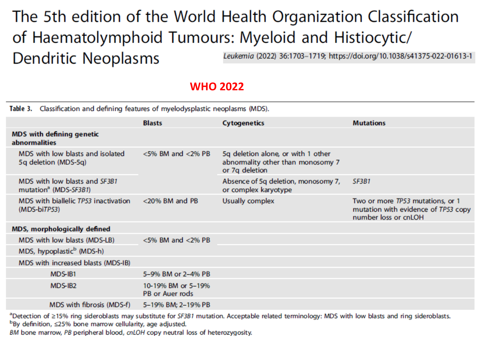

**MDS — Tanımlayıcı Genetik Anomalilere Göre:**

| Alt Tip | Blastlar | Sitogenetik | Mutasyon |
|---|---|---|---|
| **MDS-5q** (izole 5q delesyonu) | <%5 Kİ ve <%2 PK | 5q delesyonu tek başına veya 1 ek anomali (monozomi 7 / 7q delesyonu hariç) | — |
| **MDS-SF3B1** | <%5 Kİ ve <%2 PK | 5q delesyonu yok, monozomi 7 yok, kompleks karyotip yok | **SF3B1** |
| **MDS-biTP53** (bialelik TP53 inaktivasyonu) | <%20 Kİ ve PK | Genellikle kompleks | ≥2 **TP53** mutasyonu veya 1 mutasyon + kanıtlanmış kopya kaybı |

**MDS — Morfolojik Olarak Tanımlanan:**

| Alt Tip | Blastlar |
|---|---|
| **MDS-LB** (düşük blast) | <%5 Kİ ve <%2 PK |
| **MDS-h** (hipoplastik) | <%5 Kİ ve <%2 PK, sellülarite ≤%25 |
| **MDS-IB1** (artmış blast-1) | %5-9 Kİ veya %2-4 PK |
| **MDS-IB2** (artmış blast-2) | %10-19 Kİ veya %5-19 PK veya Auer cisimciği |
| **MDS-f** (fibrozisli) | %5-19 Kİ, %2-19 PK |

> 💡 **Sınav notu:**
> * **MDS-5q** (del(5q)) → **Lenalidomid** ile spesifik tedavi edilir, iyi prognozlu
> * **MDS-SF3B1** → Halka sideroblastlarla ilişkili, iyi prognoz, **luspatarsept** ile tedavi
> * **MDS-biTP53** → En kötü prognozlu MDS alt tipi, tedaviye dirençli
> * Blast oranı **≥%20** olursa → Artık MDS değil, **AML** tanısı konur

---

### Klinik Bulgular

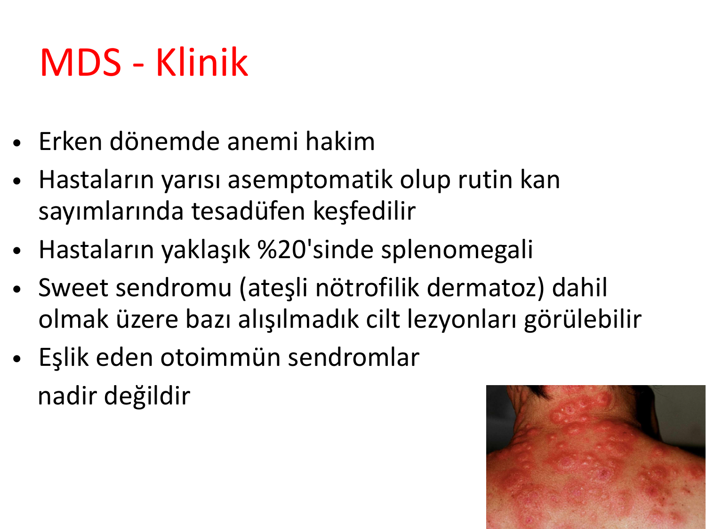

* Erken dönemde **anemi** hakim semptom
* Hastaların **yarısı asemptomatiktir** → Rutin kan sayımlarında tesadüfen keşfedilir
* Hastaların yaklaşık **%20**'sinde **splenomegali**
* **Sweet sendromu** (ateşli nötrofilik dermatoz) dahil bazı alışılmadık **cilt lezyonları** görülebilir
* Eşlik eden **otoimmün sendromlar** nadir değildir (vaskülitler, seronegartif artrit, polimiyalji romatika benzeri tablolar)

**Sitopenilere bağlı semptomlar:**
* **Anemi** → Yorgunluk, solukluk, dispne, çarpıntı
* **Nötropeni** → Tekrarlayan enfeksiyonlar
* **Trombositopeni** → Kanama, kolay morarma

> 💡 **Sınav notu:** "70 yaşında erkek, kronik yorgunluk, makrositer anemi, kemik iliği hiperselüler" → MDS düşün. **Sweet sendromu** (ağrılı, eritemli cilt plakları + ateş + nötrofili) MDS ile ilişkili bir paraneoplastik durumdur — sınavlarda bu birliktelik sorulabilir.

---

### Laboratuvar Bulguları

* **Sitopeni varlığı** — Anemi, lökopeni, trombositopeni (tek, iki veya üç seride)
* **MCV genellikle artmıştır** (makrositoz) → B12/folat eksikliği yoksa MDS düşündürür
* Eşlik edebilecek otoimmün sendromların laboratuvar bulguları olabilir
* **LDH artışı** (ineffektif eritropoeze bağlı)
* **Eritropoetin düzeyi** genellikle artmıştır (yetersiz yanıt)

### Periferik Yayma Bulguları

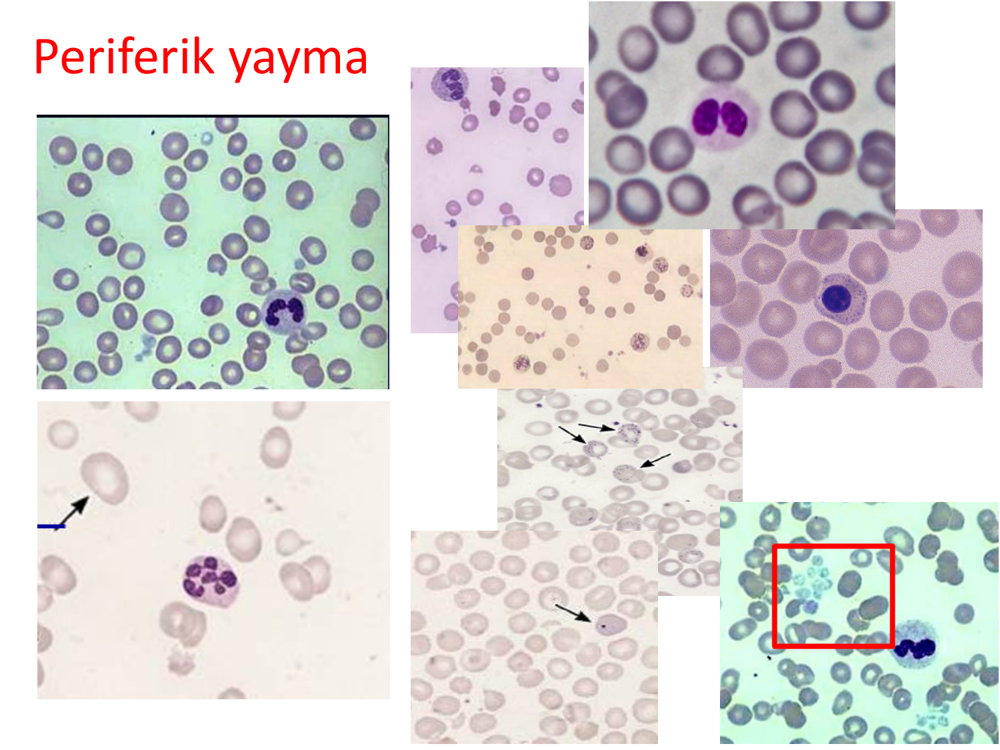

**Eritroid seri displazisi:**
* **Makroovalositler** (oval şekilli büyük eritrositler)
* **Bazofil noktalanma** (bazofilik stippling)
* **Howell-Jolly cisimcikleri**
* **Gözyaşı hücreleri** (dakrosit)

**Granülositik seri displazisi:**
* **Pelger-Huet anomalisi** → Biloblu (gözlük şekilli) nötrofil çekirdeği — normal nötrofillerde 3-5 lob varken MDS'de 2 lob (psödo-Pelger-Huet)
* **Agranüler nötrofiller** → Sitoplazmada granül yokluğu (hipogranüler)

**Megakaryositik seri displazisi:**
* **Mikromegakaryositler** → Anormal küçük megakaryositler
* **Hipoloblu megakaryositler** → Tek loblu çekirdek

> 💡 **Sınav notu:** Periferik yaymada **Pelger-Huet anomalisi** (biloblu nötrofil) + **makrositoz** + sitopeni → MDS'yi güçlü şekilde düşündürür. Gerçek Pelger-Huet anomalisi kalıtsal ve benign iken, MDS'deki **psödo-Pelger-Huet** akkiz ve patolojiktir.

---

### Kemik İliği Bulguları

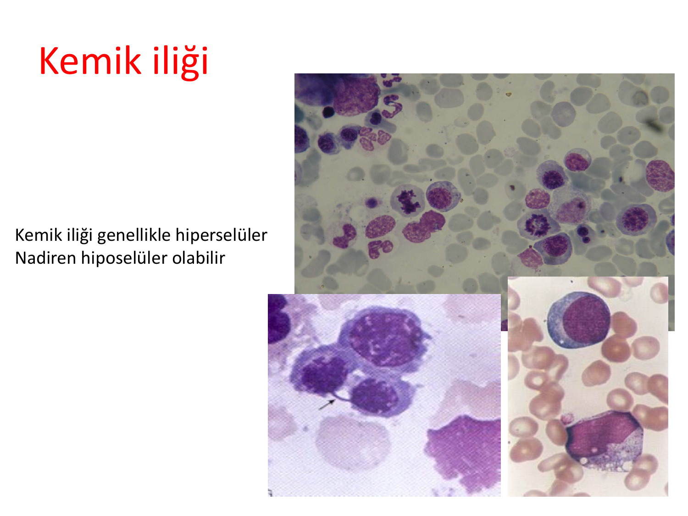

* Kemik iliği **genellikle hiperselülerdir** (paradoks!)
* **Nadiren hiposelüler** olabilir (hipoplastik MDS — aplastik anemi ile ayırıcı tanı gerektirir)
* Displastik değişiklikler: Multinükleer eritroblastlar, halka sideroblastlar, mikromegakaryositler

---

### MDS Tanı Kriterleri

Tanı için gerekli temel kriterler:

* Kan ve kemik iliğinde **1 veya daha fazla hücre serisinde ≥%10 displastik hücre**
* **Eritroid seri:** Multinükleer ve asimetrik nükleus, nükleer köprüleşme, halka sideroblastlar
* **Granülositler:** Agranüler nötrofil, Pelger-Huet anomalisi
* **Megakaryositler:** Mikromegakaryosit, hipoloblu, bi-multiloblu anormal formlar

**⚠️ ÖNEMLİ — MDS Tanısında Dışlanması Gereken Durumlar:**

MDS tanısı bir **dışlama tanısıdır**. Displazi yapan diğer nedenler mutlaka ekarte edilmelidir:

| Hastalık/Neden | Ayırıcı Özellik |
|---|---|
| Megaloblastik anemiler (B12/Folat ↓) | B12 ve folat düzeyi düşük, tedavi ile düzelir |
| Kronik hastalık anemisi | Altta yatan kronik hastalık, ferritin ↑ |
| Kronik böbrek yetmezliği | Kreatinin/BUN ↑, EPO ↓ |
| Sideroblastik anemiler | Kalıtsal formlar genç yaşta |
| Aplastik anemi | Hiposelüler kemik iliği, displazi yok |
| Viral enfeksiyonlar (HIV dahil) | Seroloji pozitif, geçici |
| İlaçlar (antibiyotikler, antiepileptikler, alkol, KT) | İlaç öyküsü, kesilince düzelir |
| Benzen, kurşun maruziyeti | Maruziyet öyküsü |
| Kemik iliği infiltrasyonu | Malignite/depo hastalığı bulguları |
| Hipersplenizm | Splenomegali, sekestrasyon |
| PNH | Akım sitometri ile GPI-bağlı proteinler (CD55, CD59) eksik |
| KMML | Monositoz (>1×10⁹/L), overlap sendrom |

> 💡 **Sınav notu:** MDS tanısı koymadan önce **B12 ve folat eksikliği**, **ilaç etkisi**, **viral enfeksiyonlar** ve **diğer kemik iliği yetmezliği sendromları** mutlaka dışlanmalıdır. Özellikle B12 eksikliği de megaloblastik kemik iliği ve displazi yapar — MDS ile karışabilir!

---

### Risk Sınıflaması (IPSS-R)

MDS'de tedavi kararı ve prognoz belirleme açısından **risk sınıflaması** kritik öneme sahiptir.

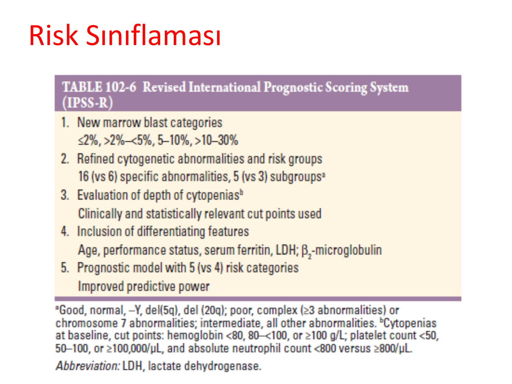

**IPSS-R'de değerlendirilen parametreler:**

1. **Kemik iliği blast kategorileri:** ≤%2, >%2-<%5, %5-10, >%10-30
2. **Sitogenetik anomaliler ve risk grupları:**
   * İyi: Normal, -Y, del(5q), del(20q)
   * Orta: Diğer tüm anomaliler
   * Kötü: Kompleks (≥3 anomali), monozomi 7
3. **Sitopeni derinliği:** Hb, trombosit, mutlak nötrofil sayısı
4. **Ayırt edici özellikler:** Yaş, performans durumu, serum ferritin, LDH, beta-2 mikroglobulin

**IPSS-R Risk Grupları:**

| Risk Grubu | Medyan Sağkalım | AML'ye Dönüşüm Riski |
|---|---|---|
| Çok düşük risk | ~8.8 yıl | Düşük |
| Düşük risk | ~5.3 yıl | Düşük |
| Orta risk | ~3 yıl | Orta |
| Yüksek risk | ~1.6 yıl | Yüksek |
| Çok yüksek risk | ~0.8 yıl | Çok yüksek |

> 💡 **Sınav notu:** MDS'de tedavi planı tamamen **risk grubuna** göre belirlenir. Düşük risk → destek tedavisi, Yüksek risk → agresif tedavi (hipometile edici ajanlar veya AKİT).

---

### MDS'de Gen Mutasyonları ve Prognostik Önemi

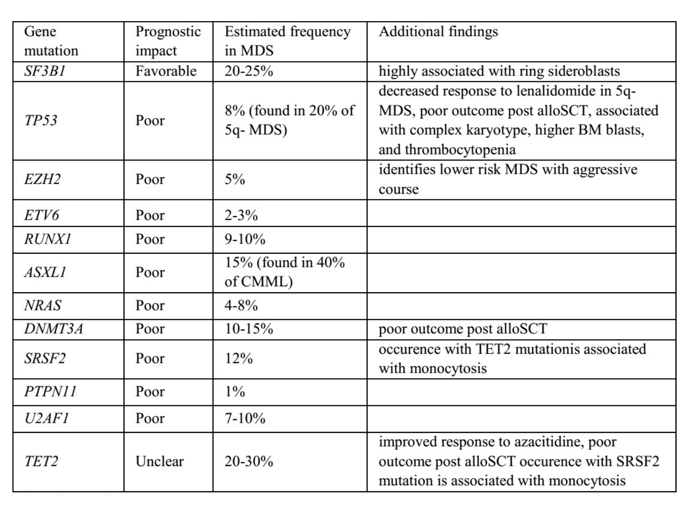

| Gen Mutasyonu | Prognostik Etki | Sıklık | Ek Bulgular |
|---|---|---|---|
| **SF3B1** | ✅ **İyi** | %20-25 | Halka sideroblastlarla güçlü ilişki |
| **TP53** | ❌ **Kötü** | %8 (del(5q) MDS'de %20) | Kompleks karyotip, yüksek blast, allojenik KHN sonrası kötü sonuç |
| **EZH2** | ❌ Kötü | %5 | Düşük riskli MDS'de agresif seyir |
| **ETV6** | ❌ Kötü | %2-3 | — |
| **RUNX1** | ❌ Kötü | %9-10 | — |
| **ASXL1** | ❌ Kötü | %15 (KMML'de %40) | — |
| **NRAS** | ❌ Kötü | %4-8 | — |
| **DNMT3A** | ❌ Kötü | %10-15 | Allojenik KHN sonrası kötü sonuç |
| **SRSF2** | ❌ Kötü | %12 | TET2 ile birlikte monositoz ilişkili |
| **TET2** | Belirsiz | %20-30 | Azasitidine yanıt iyileşebilir |

> 💡 **Sınav notu:** MDS'de **SF3B1 mutasyonu** = iyi prognoz = halka sideroblast ilişkili. **TP53 mutasyonu** = en kötü prognoz. Bu iki mutasyonun prognostik anlamı sınavlarda sorulabilir.

---

### MDS Tedavisi

Risk grubu belirlendikten sonra sitopeni durumuna göre tedavi planlanır:

**Düşük Riskli MDS Tedavisi:**

| Tedavi | Endikasyon/Detay |
|---|---|
| **Eritropoetin stimülan ajanlar** (darbopoetin, epoetin alfa) | Semptomatik anemi, serum EPO <500 mU/mL |
| **G-CSF** | Nötropeni ve tekrarlayan enfeksiyonlar |
| **Anapolon** (oksimetolon) | Anemi, androjenik anabolizan |
| **Danazol** | Trombositopeni |
| **Lenalidomid** | ⭐ **del(5q) MDS'de** spesifik tedavi — %67 transfüzyon bağımsızlığı |
| **Luspatarsept** | ⭐ **SF3B1 mutasyonlu** MDS'de — TGF-beta süperfamily inhibitörü |

**Yüksek Riskli MDS Tedavisi:**

| Tedavi | Detay |
|---|---|
| **Hipometile edici ajanlar** | **Azasitidin**, desitabin — DNA metilasyonunu inhibe ederek tümör süpresör genlerin ekspresyonunu artırır |
| **Yoğun kemoterapi** | 5+2 veya 7+3 (idarubisin + Ara-C) — AML tipi indüksiyon |
| **Allojenik kök hücre nakli (AKİT)** | Tek **küratif** tedavi seçeneği — uygun hasta ve donör varsa |

> 💡 **Sınav notu:**
> * **del(5q) MDS** → **Lenalidomid** (IMiD) → Spesifik ve etkili tedavi
> * **SF3B1 mutasyonlu MDS** → **Luspatarsept**
> * Yüksek riskli MDS → **Azasitidin** (hipometile edici ajan) birinci basamak
> * MDS'nin tek küratif tedavisi → **Allojenik kök hücre nakli**
> * Azasitidin vs desitabin: Azasitidinin sağkalım avantajı randomize çalışmalarla gösterilmiştir

---

## APLASTİK ANEMİ (AA)

### Tanım

* Periferik kanda **pansitopeni** ve kemik iliğinde **hiposellülarite** ile karakterize **kemik iliği yetmezliği**
* **PNH** ve **MDS** ile yakın ilişkisi mevcuttur (klonal evrim → AA'dan MDS veya PNH'ye geçiş olabilir)
* Malign hastalıklarda ilaç kullanımı ile ilişkili ortaya çıkan **iyatrojenik kemik iliği aplazisinden** ayrılmalıdır

> 💡 **Sınav notu:** Aplastik anemi, MDS ve PNH birbiriyle **overlap** gösterebilen kemik iliği yetmezliği sendromlarıdır. AA hastalarının bir kısmında zamanla PNH klonu veya MDS gelişebilir. Bu "AA-MDS-PNH üçgeni" olarak adlandırılır.

---

### Epidemiyoloji

* Avrupa ve İsrail: **2/1.000.000**
* Tayland ve Çin: **5-7/1.000.000** (Uzak Doğu'da daha sık)
* **K = E** (cinsiyet farkı yok)
* **Bimodal dağılım:** 20'li yaşlar ve ileri yaş

---

### Etiyoloji

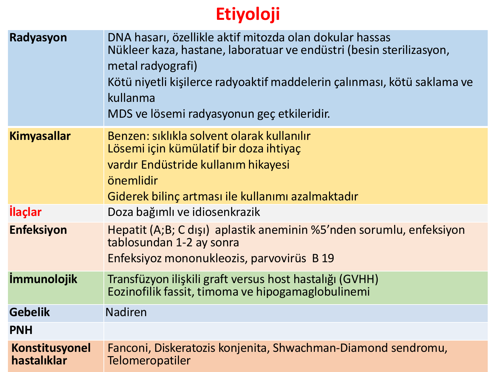

| Etiyolojik Faktör | Detay |
|---|---|
| **Radyasyon** | DNA hasarı, özellikle aktif mitozda olan dokular hassas. Nükleer kaza, hastane/laboratuvar/endüstri maruziyeti. MDS ve lösemi radyasyonun geç etkileridir |
| **Kimyasallar** | **Benzen**: Sıklıkla solvent olarak kullanılır. Lösemi için kümülatif doza ihtiyaç var. Endüstride kullanım öyküsü önemli |
| **İlaçlar** | **Doza bağımlı** (öngörülebilir) ve **idiosenkrazik** (öngörülemez, herhangi bir dozda) |
| **Enfeksiyon** | **Hepatit** (A, B, C dışı — non-A, non-B, non-C hepatit) AA'nın **%5**'inden sorumlu → enfeksiyon tablosundan **1-2 ay sonra** gelişir. **EBV**, **Parvovirüs B19** |
| **İmmünolojik** | Transfüzyon ilişkili GVHH, eozinofilik fassiit, timoma, hipogamaglobulinemi |
| **Gebelik** | Nadiren |
| **PNH** | Klonal evrim ile AA'dan PNH'ye geçiş |
| **Konstitüsyonel** | **Fanconi anemisi**, diskeratozis konjenita, Shwachman-Diamond sendromu, telomeropatiler |

**⚠️ ÖNEMLİ — Posthepatit Aplastik Anemi:**

Hepatitten 1-2 ay sonra gelişen aplastik anemi, genellikle **non-A, non-B, non-C hepatite** bağlıdır. Genç erkeklerde daha sık görülür ve ağır seyredebilir. Hepatit serolojileri genellikle negatiftir.

> 💡 **Sınav notu:** "Genç erkek hasta, 2 ay önce sarılık geçirmiş, şimdi pansitopeni ile başvuruyor, hepatit serolojileri negatif" → **Posthepatit aplastik anemi** düşün. Sınavlarda klasik bir senaryo.

---

### Aplastik Anemi İlişkili İlaçlar

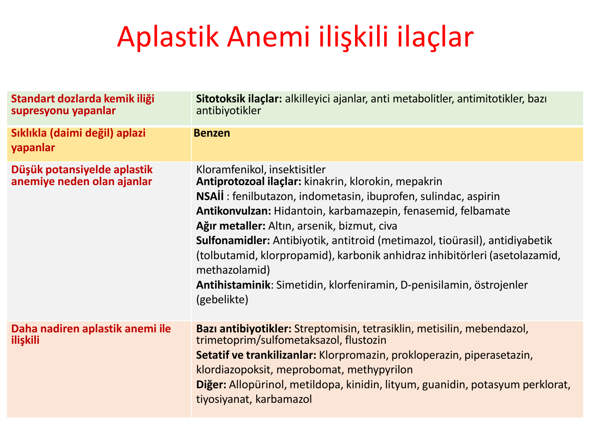

| Kategori | İlaçlar |
|---|---|
| **Standart dozlarda Kİ süpresyonu yapanlar** | Sitotoksik ilaçlar: alkilleyici ajanlar, antimetabolitler, antimitotikler, bazı antibiyotikler |
| **Sıklıkla aplazi yapanlar** | **Benzen** |
| **Düşük potansiyelde AA yapanlar** | **Kloramfenikol**, insektisitler, antiprotozoal ilaçlar (kinakrin, klorokin), **NSAİİ** (fenilbütazon, indometasin), **antikonvülzanlar** (hidantoin, karbamazepin), ağır metaller (altın, arsenik, bizmut, civa), sulfonamidler, antitiroid ilaçlar (metimazol), D-penisilamin |
| **Daha nadiren ilişkili** | Bazı antibiyotikler (streptomisin, tetrasiklin), sedatifler/trankilizanlar (klorpromazin), allopürinol, metildopa |

> 💡 **Sınav notu:** **Kloramfenikol**, aplastik anemi ile en çok ilişkilendirilen antibiyotiktir. Doza bağımsız, **idiosenkrazik** bir reaksiyondur (immünolojik mekanizma). **Fenilbütazon** da klasik bir örnektir. Bu ilaçlar sınavlarda sık sorulur.

---

### AA Sınıflandırması — Akkiz vs Konstitüsyonel

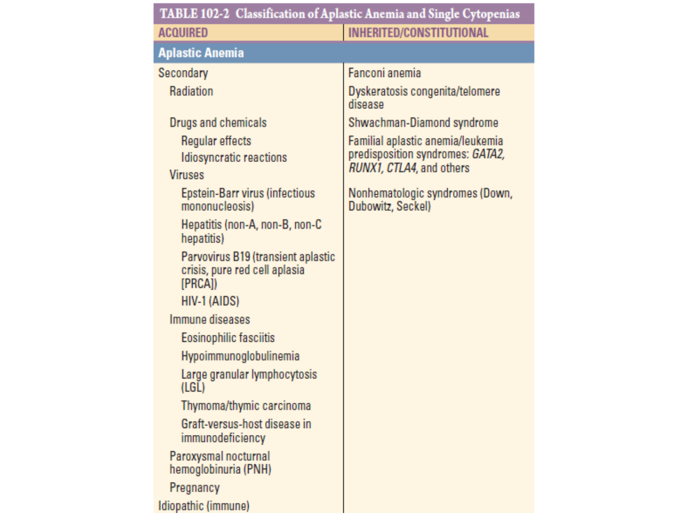

| Akkiz (Edinsel) | Kalıtsal/Konstitüsyonel |
|---|---|
| Radyasyon | **Fanconi anemisi** |
| İlaçlar ve kimyasallar (doza bağımlı/idiosenkrazik) | **Diskeratozis konjenita** (telomer hastalığı) |
| Virüsler (EBV, hepatit, Parvovirüs B19, HIV) | **Shwachman-Diamond sendromu** |
| İmmün hastalıklar (eozinofilik fassiit, timoma) | Telomeropatiler |
| Hipogamaglobulinemi | Nonhematolojik sendromlar (Down, Dubowitz, Seckel) |
| LGL lösemi | — |
| PNH | — |
| Gebelik | — |
| **İdiopatik** (en sık — %60-70) | — |

**⚠️ ÖNEMLİ — Fanconi Anemisi:**

* **Otozomal resesif** kalıtılan en sık konjenital kemik iliği yetmezliği sendromu
* Fizik muayenede: **Cafe-au-lait lekeleri**, kısa boy, başparmak/radius anomalileri, mikrosefali, böbrek anomalileri
* Tanı: **Diepoksibutan (DEB) veya mitomisin C** ile kromozom kırılma testi
* MDS ve AML'ye ilerleme riski artmış
* Tedavi: Allojenik kök hücre nakli

> 💡 **Sınav notu:** "Genç hastada pansitopeni + cafe-au-lait lekeleri + kısa boy + iskelet anomalileri" → **Fanconi anemisi** düşün → DEB testi ile doğrula. "Pansitopeni + tırnak distrofisi + lökoplaki + cilt pigmentasyon bozukluğu" → **Diskeratozis konjenita** (telomer hastalığı).

---

### Klinik Bulgular

* **Ani veya sinsi başlangıçlı** olabilir
* **En erken ve en sık semptom: Kanama**
  * Ekimoz, dişeti kanaması, burun kanaması, yoğun menstrüasyon ve bazen peteşi
  * Trombositopeniye bağlı **masif kanama nadir**, ancak **SSS** veya **göz dibine** ciddi kanamalar olabilir
* **Anemi semptomları sık:** Halsizlik, yorgunluk, nefes darlığı, kulak çınlaması
* **Enfeksiyon:** Nadiren ilk belirti (nötropeni belirgin olana kadar)
* **Kilo kaybı veya diğer sistemik şikayetler** → Aplastik anemi tanısından **uzaklaştırır** (malignite düşündürür)

> 💡 **Sınav notu:** AA'da kilo kaybı, ateş, gece terlemesi gibi **sistemik semptomlar beklenmez**. Bu tür şikayetler varsa MDS, lösemi veya kemik iliği infiltrasyonu yapan diğer maligniteleri düşün.

---

### Fizik Muayene

* **Peteşi ve ekimoz** tipik, retinal kanama olabilir
* Deri ve müköz membranda **solukluk**
* Pelvik ve rektal muayeneden **mümkün olduğunca kaçınılmalıdır** (enfeksiyon ve kanama riski)
* **Lenfadenopati ve splenomegali OLMAZ** → Varsa AA dışında tanı düşün!
* **Cafe-au-lait lekeleri** ve **kısa boy** → Fanconi anemisi lehine
* **Tırnak anormalliği** ve **oral lökoplaki** → Diskeratozis konjenita lehine
* **Saçlarda erken beyazlama** → Telomer kısalığını gösterebilir

**⚠️ ÖNEMLİ:**

> Aplastik anemide **lenfadenopati ve splenomegali bulunmaz**. Bu bulguların varlığı tanıyı sorgulatmalıdır. Aksine MDS'de hastaların %20'sinde splenomegali olabilir — bu AA-MDS ayrımında önemli bir ipucudur.

---

### Laboratuvar Bulguları

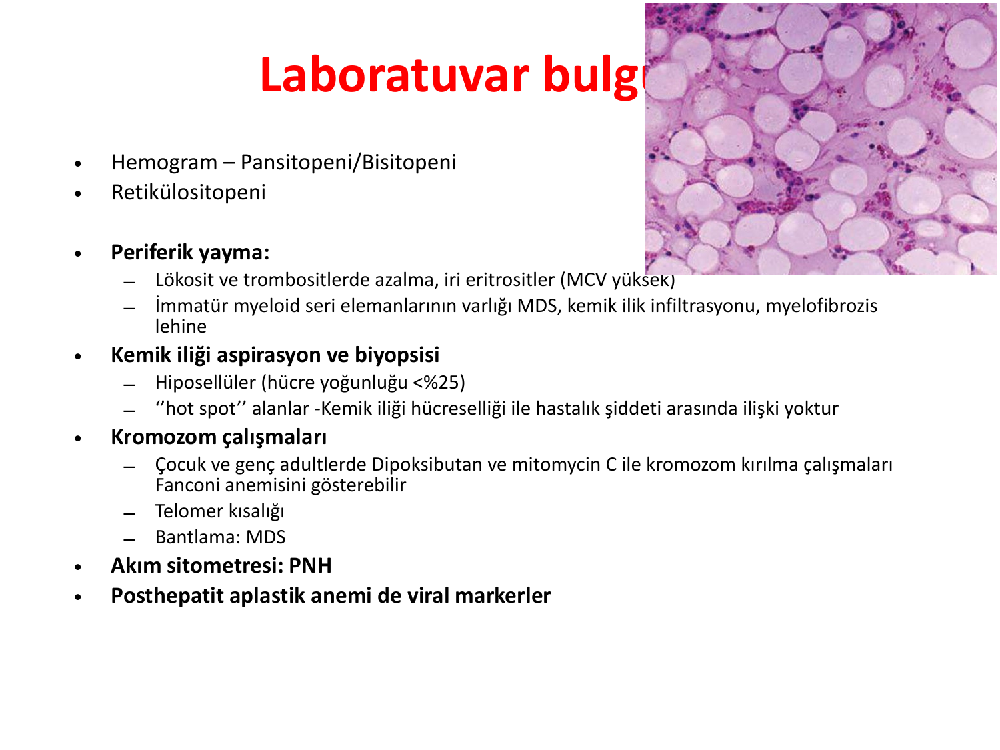

**Hemogram:**
* **Pansitopeni** veya bisitopeni
* **Retikülositopeni** (kemik iliği yetersizliğinin göstergesi — kritik bulgu!)

**Periferik yayma:**
* Lökosit ve trombositlerde azalma
* **İri eritrositler** (MCV yüksek — stres eritropoezi)
* İmmatür myeloid seri elemanlarının varlığı → MDS, kemik iliği infiltrasyonu veya miyelofibroz lehine (AA'dan uzaklaştırır)

**Kemik iliği aspirasyon ve biyopsisi:**
* **Hiposelüler** (hücre yoğunluğu **<%25**)
* **"Hot spot" alanları** olabilir → Kemik iliği hücreselliği ile hastalık şiddeti arasında doğrudan ilişki **yoktur**
* Yağ dokusu baskın (kemik iliği **yağlı** görünümde)
* **Displazi yok**, blast artışı yok

**Ek tetkikler:**
* **Kromozom çalışmaları:** Çocuk ve genç adultlerde DEB/mitomisin C ile kromozom kırılma çalışmaları → Fanconi anemisi tanısı
* **Telomer kısalığı** çalışması → Telomeropatiler
* **Bantlama (sitogenetik):** MDS'yi dışlamak için
* **Akım sitometresi:** **PNH** tarama (CD55, CD59 eksikliği)
* **Viral markerler:** Posthepatit aplastik anemi araştırması

> 💡 **Sınav notu:** AA'nın tanısal triadı = **Pansitopeni + Yağlı (hiposelüler) kemik iliği + Retikülositopeni**. MDS'den farkı: MDS'de kemik iliği **hiperselüler** ve **displazi var**, AA'da kemik iliği **hiposelüler** ve displazi **yok**.

---

### AA Tanı Kriterleri

**Tanı:** Pansitopeni + Yağlı kemik iliği varlığı + Retikülositopeni

* Anormal infiltrat veya kemik iliği fibrozu **yokluğunda** hiposelüler kemik iliği olan pansitopeni
* Tanı koymak için sitopenilerin süresi gerekmez
* Ancak sitopenilerin belirli bir nedeni belirlenirse (sitotoksik kemoterapi, viral enfeksiyon), iyileşmeye izin vermek ve hasarın geri dönüşümlü olup olmadığını belirlemek için kan takibi gerekir

---

### AA Şiddet Sınıflandırması

| Kategori | Kriterler |
|---|---|
| **Ağır aplastik anemi (SAA)** | En az **ikisi** vardır: Nötrofil <**500**/μL, Trombosit <**20.000**/μL, Düzeltilmiş retikülosit <**%1** |
| **Çok ağır aplastik anemi (vSAA)** | SAA kriterlerine ek olarak: Mutlak nötrofil sayısı <**200**/μL |
| **Şiddetli olmayan AA (NSAA)** | Hiposelüler kemik iliği + ağır/çok ağır AA kriterlerini **karşılamayan** sitopeni |

> 💡 **Sınav notu:** SAA kriterleri sınavlarda sıklıkla sorulur: **Nötrofil <500, trombosit <20.000, retikülosit <%1** (en az 2/3 kriter). Çok ağır AA'da **nötrofil <200** → Enfeksiyon riski çok yüksek, acil tedavi gerekir.

---

### AA Tedavisi

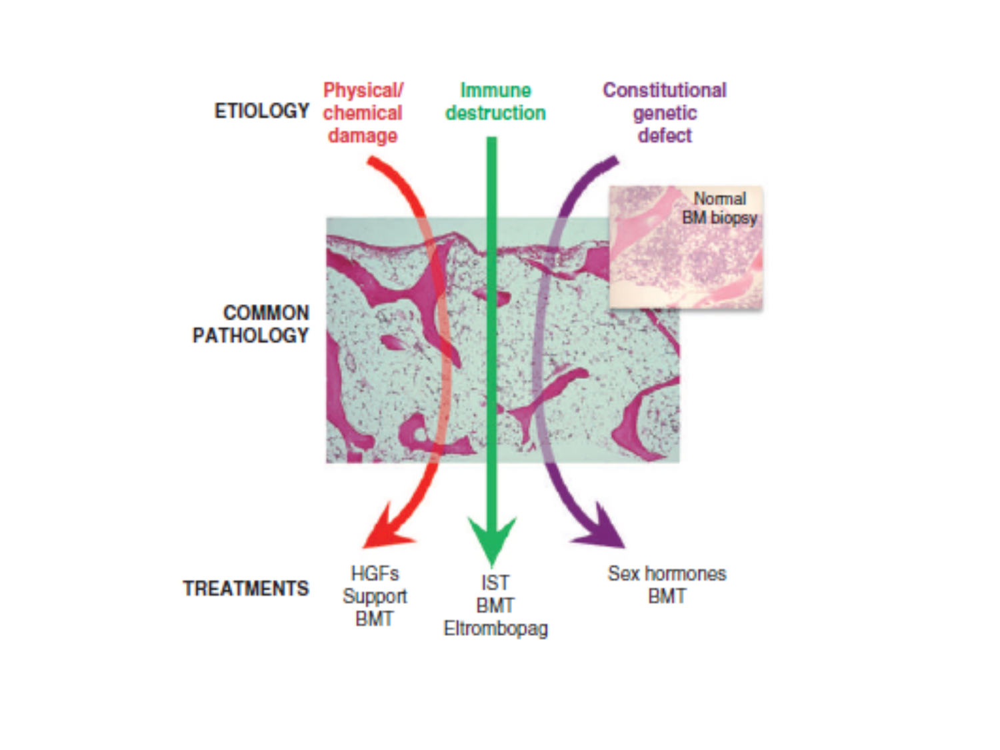

**1. Destek tedavisi:**
* **Eritrosit süspansiyonu** transfüzyonu (semptomatik anemi için)
* **Trombosit süspansiyonu** (akraba dışı donörden): Trombosit <10×10⁹/L olan hastalarda **serebral fatal hemoraji** oluşabilir
* **G-CSF ve EPO** tedavisinin belirgin bir etkisi **yoktur** (MDS'den farklı olarak)

**2. Spesifik tedaviler:**

| Tedavi | Detay |
|---|---|
| **Eltrombopag** 150 mg/gün | TPO mimetik (trombopoetin reseptör agonisti) — trombosit üretimini artırır, ayrıca **kök hücre stimülasyonu** yapar |
| **Anabolizanlar** | Oksimetolon 1-2 mg/kg/gün — androjenik etki, karaciğer toksisitesi riski |
| **İmmünsüpresif tedavi (İST)** | **ATG (antitimosit globulin)** + **Siklosporin** (5 mg/kg) → Otoimmün yıkımı baskılar |
| **Allojenik kök hücre nakli (AKİT)** | **Küratif tedavi** → Genç hastalarda (<40 yaş) HLA-uyumlu kardeş donörü varsa birinci basamak |

**Tedavi algoritması:**

```
                    Aplastik Anemi Tanısı
                           ↓
              ┌────────────┴────────────┐
              ↓                         ↓
        Yaş <40 ve                 Yaş >40 veya
    HLA-uyumlu kardeş var      uygun donör yok
              ↓                         ↓
     Allojenik KHN              ATG + Siklosporin
     (birinci basamak)         ± Eltrombopag
              ↓                         ↓
          Kür (%80-90)          Yanıt varsa devam
                                Yanıtsızsa → AKİT
                                (alternatif donör)
```

> 💡 **Sınav notu:**
> * AA'da **G-CSF ve EPO etkisiz** (MDS'de ESA kullanılır ama AA'da faydasız)
> * **<40 yaş + HLA-uyumlu kardeş** → Birinci basamak **AKİT**
> * **>40 yaş veya donör yok** → Birinci basamak **ATG + Siklosporin** (immünsüpresif tedavi)
> * **Eltrombopag** hem trombosit artırıcı hem kök hücre stimülatörü olarak İST'ye eklenir
> * AA'da en sık ölüm nedeni: **Enfeksiyonlar** ve **kanamalar**

---

## MDS VS AA KARŞILAŞTIRMASI

| Özellik | MDS | Aplastik Anemi |
|---|---|---|
| Yaş | İleri yaş (medyan 70) | Bimodal (genç + ileri yaş) |
| Cinsiyet | E > K | E = K |
| Kemik iliği | **Hiperselüler** (genellikle) | **Hiposelüler** (yağlı) |
| Displazi | **Var** (≥%10 displastik hücre) | **Yok** |
| Blast | Artmış olabilir (%5-19) | Artmamış |
| MCV | Artmış | Artmış |
| Retikülositler | Değişken | **Azalmış** (retikülositopeni) |
| Splenomegali | %20 hastada var | **Yok** |
| AML riski | ⭐ **Yüksek** (hastalığın doğası) | Düşük (ancak klonal evrim mümkün) |
| Tedavi | ESA, hipometile edici ajanlar, lenalidomid, AKİT | ATG + siklosporin, AKİT, eltrombopag |
| Küratif tedavi | AKİT | AKİT |
| ESA/G-CSF yanıtı | **Yanıt verebilir** | Belirgin **etkisi yok** |

> 💡 **Sınav notu:** "Pansitopeni + hiperselüler kemik iliği + displazi" → **MDS**. "Pansitopeni + hiposelüler kemik iliği + displazi yok" → **AA**. Hipoplastik MDS ile AA ayrımı zor olabilir — sitogenetik ve moleküler testler ayırıcı tanıda yardımcıdır.

---

## ÖZET VE SINAV İÇİN ÖNEMLİ NOKTALAR

### MDS Özet

| Özellik | Değer |
|---|---|
| Medyan yaş | 70 |
| Kemik iliği | Hiperselüler (paradoks!) |
| Tanısal displazi eşiği | ≥%10 displastik hücre |
| AML dönüşüm eşiği | Blast ≥%20 |
| del(5q) tedavisi | **Lenalidomid** |
| SF3B1 mutasyonu tedavisi | **Luspatarsept** |
| Yüksek risk tedavisi | **Azasitidin** |
| Küratif tedavi | **AKİT** |

### AA Özet

| Özellik | Değer |
|---|---|
| Tanı triadı | Pansitopeni + hiposelüler Kİ + retikülositopeni |
| En sık semptom | **Kanama** |
| Fizik muayenede olmaması gereken | **LAP ve splenomegali** |
| SAA kriterleri | Nötrofil <500, Plt <20.000, Reti <%1 (en az 2/3) |
| İlk basamak tedavi (<40 yaş) | **AKİT** |
| İlk basamak tedavi (>40 yaş) | **ATG + Siklosporin** |
| En sık ilişkili ilaç | **Kloramfenikol** |

### Sınavda En Çok Sorulan Konular

**1. MDS tanısı:**
* Yaşlı hastada makrositer anemi + sitopeni + hiperselüler kemik iliği + displazi → MDS
* B12/folat eksikliğini dışla!
* Pelger-Huet anomalisi (psödo) → MDS lehine

**2. MDS risk sınıflaması ve tedavi:**
* del(5q) → Lenalidomid
* SF3B1 → Luspatarsept
* Düşük risk → ESA, G-CSF, destek
* Yüksek risk → Azasitidin, AKİT

**3. AA tanısı:**
* Pansitopeni + yağlı kemik iliği + retikülositopeni
* LAP ve splenomegali **yok** → Varsa AA değil
* Kilo kaybı, sistemik şikayetler → AA'dan uzaklaştırır

**4. AA etyolojisi:**
* Kloramfenikol → İdiosenkrazik AA
* Posthepatit AA → Non-A, non-B, non-C hepatit, 1-2 ay sonra
* Fanconi anemisi → Cafe-au-lait, kısa boy, DEB testi

**5. AA şiddet sınıflaması:**
* SAA: Nötrofil <500, Plt <20.000, Reti <%1 (en az 2/3)
* vSAA: + Nötrofil <200

**6. AA tedavisi:**
* <40 yaş + HLA-uyumlu kardeş → AKİT
* >40 yaş → ATG + Siklosporin ± Eltrombopag
* G-CSF ve EPO **etkisiz** (MDS'den farkı!)

**7. AA-MDS ayrımı:**
* MDS = hiperselüler + displazi var
* AA = hiposelüler + displazi yok

**8. Konjenital kemik iliği yetmezliği sendromları:**
* Fanconi → Cafe-au-lait, DEB testi
* Diskeratozis konjenita → Tırnak distrofisi, lökoplaki, cilt pigmentasyonu, telomer kısalığı
* Shwachman-Diamond → Ekzokrin pankreas yetmezliği + nötropeni

> **⚠️ Altın kurallar:**
> * Yaşlı hastada açıklanamayan **makrositer anemi/sitopeni** → MDS'yi dışla
> * MDS tanısı koymadan önce **B12/folat eksikliğini** mutlaka dışla
> * AA'da **LAP ve splenomegali bulunmaz** — varsa tanıyı sorgula
> * AA'da **retikülositopeni** olması şarttır — yoksa tanıyı sorgula
> * Genç hastada pansitopeni → Fanconi anemisini düşün, **DEB testi** iste
> * Posthepatit AA → Hepatit serolojileri genellikle **negatif** (non-ABC)
> * MDS'nin tek küratif tedavisi **AKİT**, AA'nın da tek küratif tedavisi **AKİT**
