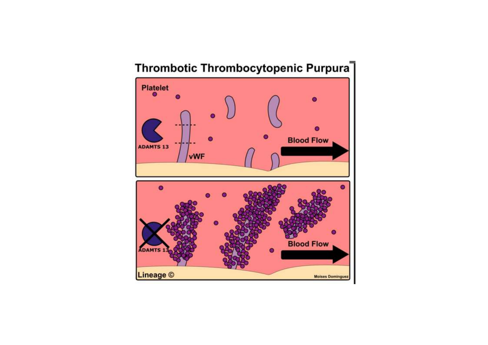
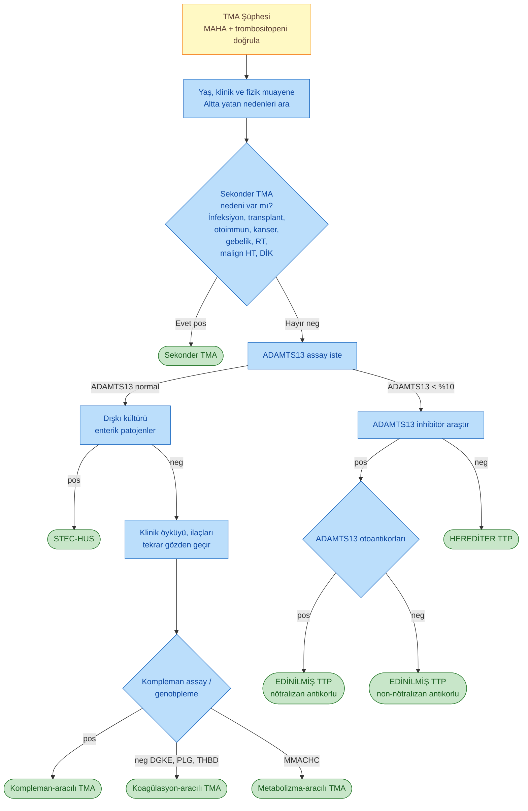
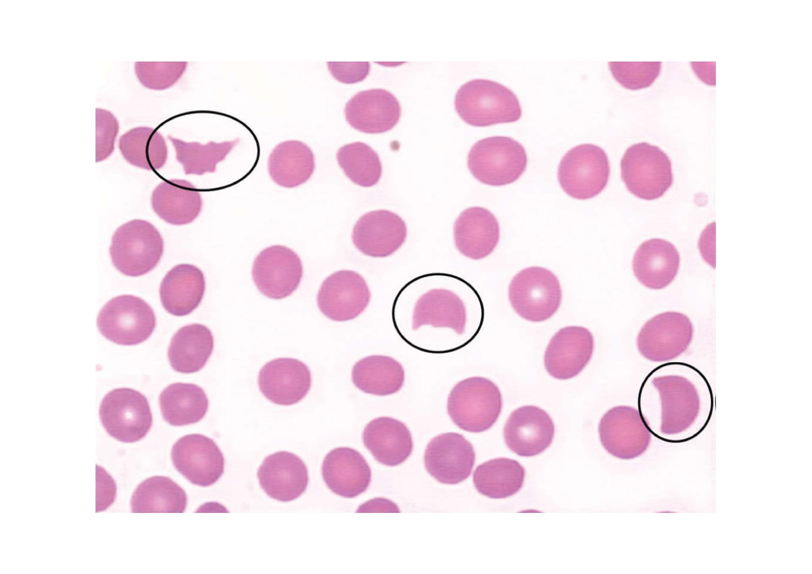
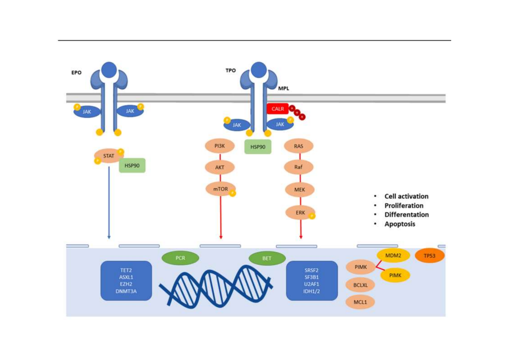
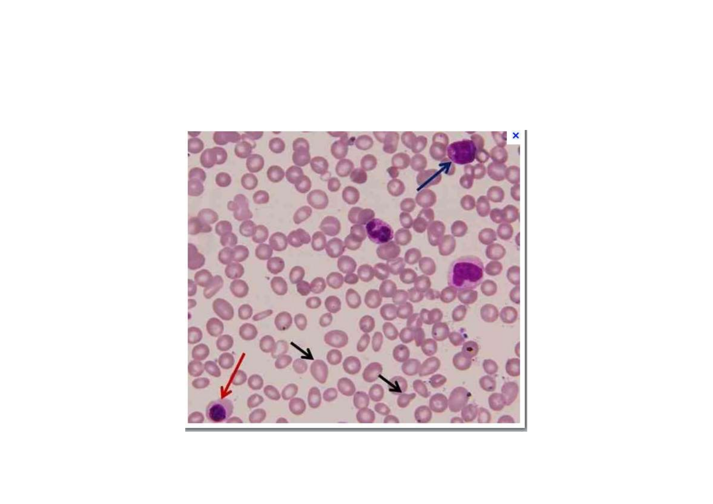
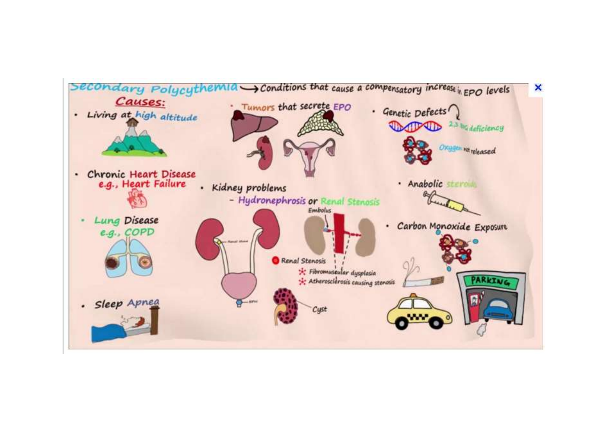

# TMA VE MİYELOPROLİFERATİF NEOPLAZİLER (MPN)

**Hazırlayan:** Prof. Dr. İrfan Yavaşoğlu
**Bölüm:** Aydın Adnan Menderes Üniversitesi -- Erişkin Hematoloji Bilim Dalı

---

## İÇİNDEKİLER

### Bölüm 1: Trombotik Mikroanjiyopati (TMA)
1. [TMA Tanım ve Sınıflandırma](#tma-tanım-ve-sınıflandırma)
2. [TTP Patogenezi (ADAMTS13/vWF)](#ttp-patogenezi-adamts13vwf)
3. [PLASMIC Skoru](#plasmic-skoru)
4. [TMA Ayırıcı Tanı Algoritması](#tma-ayırıcı-tanı-algoritması)
5. [Periferik Yayma -- Şistositler](#periferik-yayma----şistositler)
6. [TMA Nedenleri Detaylı](#tma-nedenleri-detaylı)

### Bölüm 2: Miyeloproliferatif Neoplaziler (MPN)
7. [MPN Sinyal Yolakları](#mpn-sinyal-yolakları)
8. [MPN Şüphesinde NCCN Tanısal Workup](#mpn-şüphesinde-nccn-tanısal-workup)
9. [Primer Miyelofibrozis (PMF) Tanı Kriterleri](#primer-miyelofibrozis-pmf-tanı-kriterleri)
10. [Polisitemia Vera (PV) Tanı Kriterleri](#polisitemia-vera-pv-tanı-kriterleri)
11. [Esansiyel Trombositoz (ET) Tanı Kriterleri](#esansiyel-trombositoz-et-tanı-kriterleri)
12. [Mutasyonların Prognostik Önemi](#mutasyonların-prognostik-önemi)
13. [MPN Risk Stratifikasyonu](#mpn-risk-stratifikasyonu)
14. [Trombositoz Ayırıcı Tanı](#trombositoz-ayırıcı-tanı)
15. [Polisitemi Sınıflaması](#polisitemi-sınıflaması)

---

# BÖLÜM 1: TROMBOTİK MİKROANJİYOPATİ (TMA)

## TMA TANIM VE SINIFLANDIRMA

> **Tanım:** TMA, **mikroanjiyopatik hemolitik anemi (MAHA) trombositopeni + organ disfonksiyonu** üçlüsü ile karakterize, mikrovasküler trombus oluşumuna bağlı bir grup hastalığı kapsayan terimdir.

**Ana TMA Tipleri:**

| Tip                                         | Mekanizma                                                                                                                                                                   | Anahtar bulgular                                                |
| ------------------------------------------- | --------------------------------------------------------------------------------------------------------------------------------------------------------------------------- | --------------------------------------------------------------- |
| **TTP** (Trombotik Trombositopenik Purpura) | **ADAMTS13 eksikliği** (genetik veya edinilmiş antikorlar)                                                                                                                  | Düşük platelet, MAHA, nörolojik bulgular, ateş, böbrek tutulumu |
| **STEC-HUS** (Shiga toksin-aracılı HUS)     | Enteropatojenik bakteriler (Shigella, E. coli O157:H7, O104:H4)                                                                                                             | Diyare öyküsü, çocuklarda sık, akut böbrek yetmezliği           |
| **Kompleman-aracılı TMA** (atipik HUS)      | Kompleman düzenleyici gen mutasyonları veya antikorlar                                                                                                                      | Tekrarlayan TMA, böbrek tutulumu                                |
| **Koagülasyon-aracılı TMA**                 | DGKE, PLG, THBD gen mutasyonları                                                                                                                                            | Genetik, çocuklarda sık                                         |
| **Metabolizma-aracılı TMA**                 | MMACHC gen mutasyonu (metilmalonik asidüri + homosistinüri tip C)                                                                                                           | Pediatrik, metabolik                                            |
| **İlaç-aracılı TMA**                        | İmmunolojik (antikor) veya toksik (kinin, tiklopidin, klopidogrel, interferon, OKS)                                                                                         | İlaç maruziyeti                                                 |
| **Sekonder TMA**                            | Başka hastalıklara ikincil (S. pneumoniae, influenza, transplantasyon, otoimmun, kanser, gebelik, anti-kanser ilaçlar, RT, malign HT, DİK, ciddi B12 eksikliği, pankreatit) | Altta yatan hastalık ile ilişkili                               |

---

## TTP PATOGENEZİ (ADAMTS13/vWF)

> **Şema yorumu (TTP patogenezi -- 2 panel karşılaştırma):**
>
> **Üst panel (Normal):**
> * Damar lümeninde **ADAMTS13** (mavi yıldız enzim) endotelden salınan **vWF (von Willebrand faktör)** multimerlerini **keser/parçalar**
> * Sonuçta vWF küçük fragmanlar halinde dolaşır, **trombosit agregasyonu olmaz**, kan akımı (Blood Flow) normal devam eder
>
> **Alt panel (TTP):**
> * **ADAMTS13 yok / inhibe** (X işaretli)
> * Endotel salımıyla oluşan **ultra-büyük vWF multimerleri** parçalanmadan kalır
> * Trombositler bu büyük vWF iplikçiklerine yapışır → **trombosit-vWF agregatları** mikrodamarlarda birikir
> * **Mikrovasküler tromboz** oluşur, trombositler tüketilir → **trombositopeni** + organ iskemisi
>
> **🔑 Klinik anlam:** ADAMTS13 aktivitesi **<%10** TTP için tanısal eşiktir. Tedavi: **plazmaferez** (eksik ADAMTS13 replase + antikor temizler) + **kortikosteroid** + **rituksimab** + **kaplakizumab** (anti-vWF nanobody).
>
> **Klasik TTP pentadı:** MAHA + Trombositopeni + Nörolojik bulgular + Ateş + Renal disfonksiyon. (Modern olgularda hepsi olmayabilir; **MAHA + trombositopeni** TTP düşündürmek için yeterlidir.)

> Temel tedavi mekanizması: PLAZMAFEREZ (Hemoliz ve trombositopeni düzelene kadar devam)
> 
> Tedaviye rağmen düzelmeyen olgularda: Rituximab, **Kaplakizumab**, Glukokortikoidler
>
> AdamsT13 düzeyi tanı için değil tedaviye yanıtı değerlendirmek için kullanılır.
> Eculizumab: Atipik HUS tedavisinde kullanılır.
---

## PLASMIC SKORU

> **PLASMIC skoru:** TTP olasılığını klinik bulgularla **hızlıca tahmin etmek** için kullanılan, **0-7 puanlık** bir skorlama sistemi (her parametre 1 puan).

| Parametre                                      | 1 puan koşulu                                                                           |
| ---------------------------------------------- | --------------------------------------------------------------------------------------- |
| **P** -- Platelet count                        | <30 × 10⁹/L                                                                             |
| **L** -- Lysis (Hemoliz değişkenleri)          | Retikülosit yüksekliği VEYA saptanamayan haptoglobin VEYA indirekt bilirubin >2.0 mg/dL |
| **A** -- Active cancer                         | **YOK** (aktif kanser yokluğu)                                                          |
| **S** -- Solid-organ veya Stem cell transplant | Öykü **YOK**                                                                            |
| **M** -- MCV                                   | <90 fL                                                                                  |
| **I** -- INR                                   | <1.5                                                                                    |
| **C** -- Creatinine                            | <2.0 mg/dL                                                                              |

**Yorum:**

| Skor             | TTP olasılığı | Yaklaşım                                           |
| ---------------- | ------------- | -------------------------------------------------- |
| **0-4** (düşük)  | <%5 TTP       | Diğer TMA nedenlerini araştır                      |
| **5** (orta)     | %5-25         | ADAMTS13 ölçümü mutlaka yap                        |
| **6-7** (yüksek) | >%80 TTP      | **ADAMTS13 sonucu beklenmeden plazmaferez başla!** |

> **🔑 Klinik kullanım:** Yüksek skor → tedaviye **ampirik plazmaferez** ile başla, ADAMTS13 düzeyi sonradan onaylar. TTP'de gecikme mortalite ile direkt korelasyondadır.

---

## TMA AYIRICI TANI ALGORİTMASI

> **🔑 Algoritma özeti:**
> 1. **MAHA + trombositopeni** doğrula
> 2. Sekonder neden ekarte et
> 3. **ADAMTS13** iste (kritik test)
>    * **Normal** → STEC-HUS, kompleman, koagülasyon veya metabolizma TMA'sını araştır
>    * **<%10** → Antikor varlığına göre **edinilmiş TTP** veya **herediter TTP** ayrımı
> 4. ADAMTS13 sonucu gelene kadar yüksek PLASMIC skorlu hastalarda **plazmaferez başlat**

---

## PERİFERİK YAYMA -- ŞİSTOSİTLER

> **Histolojik yorum (Şistositler):**
>
> Görselde periferik kan yaymasında **3 farklı şistosit tipi** (siyah daire içinde işaretli) izlenir:
>
> * **Sol üst:** **"Helmet cell" (kask hücresi)** -- yarım daire şeklinde fragmanlanmış eritrosit, bir tarafı keskin sınırlı
> * **Orta:** **Triangül / fragment hücre** -- düzensiz köşeli, parçalanmış eritrosit
> * **Sağ alt:** **"Bite cell" benzeri parçalanmış RBC** -- ısırılmış görünümlü eritrosit fragmanı
>
> **Patogenez:** Şistositler, eritrositlerin mikrodamarlardaki **fibrin iplikçikleri arasından mekanik olarak parçalanması** (mikroanjiyopatik hemoliz) sonucu oluşur. Tipik olarak:
> * **TMA spektrumunun (TTP, HUS, DİK, malign HT, vaskülit, mekanik kapak) hepsinde** görülür
> * **Şistosit oranı >%1** (periferik yaymada) MAHA tanısı için anlamlıdır
> * Birlikte: **Düşük haptoglobin, yüksek LDH, indirekt bilirubin yüksekliği, retikülositoz**

---

## TMA NEDENLERİ DETAYLI

| Tip                                                                       | Detay                                                                                                                                                                                                                                                                                                            |
| ------------------------------------------------------------------------- | ---------------------------------------------------------------------------------------------------------------------------------------------------------------------------------------------------------------------------------------------------------------------------------------------------------------- |
| **Trombotik trombositopenik purpura (TTP)** -- ADAMTS13 eksikliği aracılı | **Genetik:** ADAMTS13 aktivitesi <%10 · **Edinilmiş:** ADAMTS13'e karşı antikorlar                                                                                                                                                                                                                               |
| **Shiga toksin-aracılı HUS (STEC-HUS)**                                   | Enteropatojenik mikroorganizmalar (**Shigella dysenteriae** ve **E. coli** bazı serotipleri **O157:H7 ve O104:H4**)                                                                                                                                                                                              |
| **Kompleman-aracılı TMA**                                                 | Kompleman düzenleyici genlerde mutasyonlar VE/VEYA kompleman fonksiyonunu bloke eden antikorlar                                                                                                                                                                                                                  |
| **Koagülasyon-aracılı TMA**                                               | **DGKE, PLG, THBD** genlerini içeren mutasyonlar                                                                                                                                                                                                                                                                 |
| **Metabolizma-aracılı TMA**                                               | **MMACHC** gen mutasyonu (**metilmalonik asidüri ve homosistinüri tip C**)                                                                                                                                                                                                                                       |
| **İlaç-aracılı TMA**                                                      | İmmunolojik yolak (antikorlar) ve/veya toksisite (**kinin, tiklopidin, klopidogrel, interferon, kontraseptifler** vb.)                                                                                                                                                                                           |
| **Sekonder TMA**                                                          | Eşlik eden hastalık veya durum ile başlatılır: **enfeksiyon** (Streptococcus pneumoniae, influenza virüsü), **transplantasyon** (solid organ veya kemik iliği), **otoimmun hastalık, kanser, gebelik, sitotoksik ilaçlar** (anti-kanser, immunsupresif), **RT, malign HT, DİK, ciddi B12 eksikliği, pankreatit** |

---

# BÖLÜM 2: MİYELOPROLİFERATİF NEOPLAZİLER (MPN)

## MPN SİNYAL YOLAKLARI

> **Şema yorumu (MPN'de moleküler yolaklar):**
>
> Görselde MPN'lerin **patojenetik temelini** oluşturan iki ana sitokin reseptör yolağı gösterilmiştir:
>
> **Sol kol -- EPO yolağı (Eritropoiesis):**
> * **EPO** (Eritropoietin) → **EPO-R** (reseptör) → **JAK2** → **STAT5/HSP90** → DNA → eritrosit üretimi
> * **JAK2 V617F mutasyonu** → JAK2 sürekli aktif → EPO bağımsız sinyalleşme → **PV (polisitemia vera) -- eritrosit aşırı üretimi**
>
> **Sağ kol -- TPO yolağı (Megakaryopoiesis):**
> * **TPO** (Trombopoietin) → **MPL** (reseptör, megakaryosit hattı) → **JAK2** + adaptör proteinler → 3 alt kol:
>   1. **PI3K → AKT → mTOR** (büyüme, sağkalım)
>   2. **HSP90 + PIM** (proliferasyon)
>   3. **RAS → RAF → MEK → ERK** (diferansiyasyon, apoptoz regülasyonu)
>
> **Driver mutasyon dağılımı:**
> * **JAK2 V617F:** PV %95, ET %50-60, PMF %50-60
> * **CALR (kalreticulin):** ET %25, PMF %25 -- MPL'yi anormal şekilde aktive eder
> * **MPL W515L/K:** ET %3-5, PMF %5-10 -- MPL reseptöründe kazanım fonksiyonu
> * **"Triple-negative":** Hiçbir driver mutasyon yok (~%10) -- en kötü prognoz
>
> **Hedefe yönelik tedavi noktaları:**
> * **JAK2 inhibitörleri:** Ruksolitinib, Fedratinib, Pacritinib, Momelotinib (ortak yolak)
> * **HSP90 inhibitörleri:** Klinik araştırma
> * **mTOR inhibitörleri (everolimus):** PMF'de denenmektedir
>
> **Sonuç:** Tüm 4 ortak süreç **(hücre aktivasyonu, proliferasyon, diferansiyasyon, apoptoz)** disregüle olur → **klonal myeloid hücre genişlemesi**.

---

## MPN ŞÜPHESİNDE NCCN TANISAL WORKUP

> **NCCN Guidelines Version 1.2024 -- MPN şüphesinde yapılması gereken tanısal değerlendirme:**

### Klinik Değerlendirme

* **Anamnez ve fizik muayene:**
   * **Dalak büyüklüğü** (palpasyon ile)
   * Trombotik/hemorajik olay öyküsü
   * Kardiyovasküler risk faktörleri

### Laboratuvar Tetkikleri

* **Tam kan sayımı (CBC)** + diferansiyel
* **Kapsamlı metabolik panel** + ürik asit + LDH + KCFT
* **Periferik kan yayması incelemesi**
* **BCR::ABL1** için **FISH veya RT-PCR** (KML ekartasyonu) -- pozitifse → KML kılavuzlarına geç

### Kemik İliği

* **Kemik iliği aspirasyonu + demir boyası**
* **Kemik iliği biyopsisi** + **trichrome** ve **retikülin** boyası (fibrozis derecesi)
* **Kemik iliği sitogenetik** (kan, kemik iliği aspire edilemiyorsa) -- karyotip ± FISH

### Moleküler Test (Kan veya Kemik İliği)

| Test                                               | Endikasyon                                   |
| -------------------------------------------------- | -------------------------------------------- |
| **JAK2 V617F mutasyonu**                           | İlk basamak (tüm MPN şüphelilerinde)         |
| **Negatifse:** **CALR ve MPL** mutasyonları        | ET ve MF için                                |
| **Negatifse:** **JAK2 exon 12** mutasyonları       | PV için                                      |
| **Multigene NGS panel** (JAK2, CALR, MPL içermeli) | Alternatif                                   |
| **NGS mutational prognostication**                 | MPN tanısı doğrulandıktan sonra prognoz için |

### Diğer Tetkikler

* **Mast hücre agregatları varsa** → Sistemik Mastositozis kılavuzlarına bak
* **MPN-SAF TSS** (Total Symptom Score) -- semptom yükü değerlendirmesi
* Transfüzyon/ilaç öyküsü dökümantasyonu
* **HLA tipleme** -- allojenik HCT düşünülüyorsa
* **Serum eritropoietin (EPO) düzeyi**
* **Serum demir çalışmaları**
* **Koagülasyon testleri** -- akkiz von Willebrand sendromu (vWS) veya diğer koagulopati değerlendirmesi:
   * **PT, PTT, fibrinojen**
   * **Plazma vWF antijeni (vWFA)**
   * **vWF ristosetin kofaktör (vWF:RCo) aktivitesi**

> **🔑 Anahtar nokta:** EPO düzeyi PV'de **düşük (suprese)**, sekonder polisitemide **yüksek**. Bu ayırıcı tanıda kritiktir.

---

## PRİMER MİYELOFİBROZİS (PMF) TANI KRİTERLERİ

> **ICC ve WHO 2022 kriterleri** PMF için iki evre tanımlar: **erken/prefibrotik (pre-PMF)** ve **overt fibrotik evre**.

### PMF -- Major Kriterler

| Madde                             | Pre-PMF                                                                                                                                                                              | Overt fibrotik PMF                                                                             |
| --------------------------------- | ------------------------------------------------------------------------------------------------------------------------------------------------------------------------------------ | ---------------------------------------------------------------------------------------------- |
| **1. Kemik iliği biyopsisi**      | Megakaryositik proliferasyon ve **atipi**, kemik iliği fibrozis grade **<2**, yaşa göre artmış kemik iliği selülaritesi, granülositik proliferasyon, (genellikle) azalmış eritropoez | Megakaryositik proliferasyon ve atipi + **retikülin ve/veya kollajen fibrozis grade 2 veya 3** |
| **2. Mutasyon / klonalite**       | **JAK2, CALR veya MPL** mutasyonu **VEYA** başka klonal marker varlığı **VEYA** reaktif kemik iliği retikülin fibrozis yokluğu                                                       | Aynı                                                                                           |
| **3. Diğer hastalıkları dışlama** | BCR::ABL1+ KML, PV, ET, MDS veya diğer myeloid neoplazi tanı kriterleri **karşılanmamalı**                                                                                           | Aynı                                                                                           |

### PMF -- Minor Kriterler (en az 1 gerekli)

* **Anemi** (komorbiditeye bağlanamayan)
* **Lökositoz ≥11 × 10⁹/L**
* **Palpe edilebilir splenomegali**
* **LDH yüksekliği** (referans aralığın üstünde)
* **Lökoeritroblastozis** (sadece overt PMF için)

> **🔑 Tanı:** Pre-PMF veya overt PMF tanısı için **3 major kriterin tamamı + en az 1 minor kriter**, **2 ardışık değerlendirmede** doğrulanmalı.
>
> **Megakaryosit morfolojisi (PMF'ye özgü):** Diğer MPN alt tiplerine göre **daha yüksek atipiya derecesi** -- küçük-dev megakaryositler, ciddi maturasyon defektleri (**bulut-benzeri, hipolobüle, hiperkromatik nükleus**), anormal **büyük dens kümeler** (>6 megakaryosit yan yana).

### PMF Kriterleri -- Önemli Açıklamalar (NCCN footnotes)

**Mutasyon testleri (Major kriter 2):**

* **Yüksek sensitiviteli assay** kullanılmalı: **JAK2 V617F** için sensitivite **<%1**, **CALR ve MPL** için **%1-3**
* **Negatif olgularda** non-canonical (atipik) **JAK2 ve MPL** mutasyonları araştırılmalı

**"Başka klonal marker" varlığı (Major kriter 2 alternatifi):**

* Sitogenetik veya sensitif NGS teknikleri ile değerlendirilir
* Myeloid neoplazilerle ilişkili mutasyonlar **klonaliteyi destekler**:
   * **ASXL1, EZH2, IDH1, IDH2, SF3B1, SRSF2, TET2**

**Reaktif retikülin fibrozis (Major kriter 2 alternatifi):**

> Aşağıdaki nedenlere bağlı **grade 1 retikülin fibrozis** dışlanmalıdır:
>
> * Enfeksiyon
> * Otoimmun hastalık veya diğer kronik inflamatuar koşullar
> * **Hairy cell lösemi** veya diğer lenfoid neoplaziler
> * Metastatik malignite
> * Toksik (kronik) miyelopatiler

**PMF + Monositoz (Major kriter 3 ile ilişkili):**

> Monositoz, PMF tanısında veya seyri içinde gelişebilir. **CMML** (kronik miyelomonositik lösemi) ile ayrım için:
>
> * **MPN öyküsü** varlığı CMML'yi dışlar
> * MPN-ilişkili driver mutasyonların **yüksek varyant alel sıklığı** PMF + monositoz tanısını destekler (CMML değil)

**Megakaryosit kümeleri:**

* **"Büyük dens kümeler"** = **≥6 megakaryositin yan yana** dizilmesi (başka KI hücresi olmadan)
* Pre-PMF'in **morfolojik karakteristik bulgusu**

### PMF Kemik İliği Görünümü

> **Histolojik yorum (PMF kemik iliği bulguları):**
>
> Görselde miyelofibroz hastasının kemik iliği aspirasyonunda klasik bulgular izlenir:
>
> * **Mavi ok:** Atipik **megakaryosit** -- büyük, hiperkromatik, bulut benzeri çekirdek (PMF için karakteristik)
> * **Kırmızı ok:** Eritroid prekürsör hücre (lökoeritroblastik tablo bulgusu -- normalde periferik kanda olmaması gereken)
> * **Siyah oklar:** **Dakrosit / gözyaşı eritrositler (teardrop cells)** -- damla şekilli eritrositler; PMF'nin **patognomonik periferik yayma bulgusudur**, fibrotik kemik iliğinden zorla çıkan eritrositlerin deformasyonundan oluşur
> * Genel görünüm: **Lökoeritroblastozis** (immatur eritroid + miyeloid hücrelerin periferik kana çıkması) -- ekstramedüller hematopoezin işareti
>
> **Klinik bağlam:** Bu bulgular **fibrotik kemik iliğinin** ve **dalakta ekstramedüller hematopoezin** sonucudur. Hasta tipik olarak masif splenomegali, anemi, konstitüsyonel semptomlarla başvurur.

---

## POLİSİTEMİA VERA (PV) TANI KRİTERLERİ

### PV Major Kriterler

1. **Yüksek hemoglobin** veya **yüksek hematokrit** veya artmış RBC kütlesi:
   * **Hb >16.5 g/dL erkek, >16.0 g/dL kadın**
   * **Hct >%49 erkek, >%48 kadın**
   * RBC kütlesi: ortalama normal değerin %25 üstü
2. **Kemik iliği biyopsisi:** Yaşa göre hipersellüler, **trilineage proliferasyon (panmyelosis)** -- belirgin eritroid, granülositik ve **pleomorfik, matur megakaryosit (atipi yok)** artışı
3. **JAK2 V617F veya JAK2 exon 12 mutasyonu** varlığı

### PV Minor Kriter

* **Subnormal serum eritropoietin** düzeyi

> **🔑 PV tanısı:** Ya **3 major kriterin tümü** YA DA **ilk 2 major kriter + minor kriter** sağlanmalı.
>
> **Kemik iliği biyopsisi gerekmeyebilir** eğer:
> * Sürekli **mutlak eritrositoz** varlığında: **Hb >18.5 g/dL erkek veya >16.5 g/dL kadın**, **Hct >%55.5 erkek veya >%49.5 kadın**
> * VE **JAK2 V617F veya JAK2 exon 12 mutasyonu pozitif**

**PV Kriterleri -- Önemli Açıklamalar (NCCN footnotes):**

* **WHO 2022 kriterleri WHO 2017 kriterleriyle aynıdır** (Khoury JD et al, Leukemia 2022;36:1703-1719)
* **Tanısal eşikler:** Hb >16.5 g/dL (E) / >16.0 g/dL (K); Hct >%49 (E) / >%48 (K); RBC kütlesi: ortalama normal değerin **%25 üstü**
* **Mutasyon assay sensitivite önerisi:** JAK2 V617F için **<%1**, CALR ve MPL için **%1-3**; negatif olgularda **non-canonical/atipik JAK2** mutasyonları araştır

### Post-PV MF Tanı Kriterleri

**Gerekli kriterler:**
1. Önceden kanıtlanmış PV tanısı
2. Kemik iliği fibrozisi grade 2 veya 3

**Ek kriterler (en az 2 gerekli):**
1. **Anemi** veya sürekli flebotomi/sitoredüktif tedavi gereksinimi kaybı
2. Lökoeritroblastozis
3. Palpabl splenomegalide **bazalden >5 cm artış** veya yeni gelişen palpabl splenomegali
4. Aşağıdaki konstitüsyonel semptomların **2'si veya 3'ü:**
   * 6 ayda **>%10 kilo kaybı**
   * Gece terlemesi
   * Açıklanamayan ateş (>37.5°C)

---

## ESANSİYEL TROMBOSİTOZ (ET) TANI KRİTERLERİ

### ET Major Kriterler

1. **Trombosit sayısı ≥450 × 10⁹/L**
2. **Kemik iliği biyopsisi:** Megakaryositik soyda proliferasyon -- artmış sayıda **büyümüş, matur, hiperlobüle "geyik boynuzu" (staghorn-like) çekirdekli megakaryositler**, nadiren dens kümeler; nötrofil granülopoezi veya eritropoezde belirgin artış/sola kayma yok; belirgin kemik iliği fibrozisi yok
3. BCR::ABL1+ KML, PV, PMF veya diğer myeloid neoplazi kriterlerini karşılamama
4. **JAK2, CALR veya MPL** mutasyonu

### ET Minor Kriter

* **Klonal marker varlığı** veya reaktif trombositoz kanıtı yokluğu

> **🔑 ET tanısı:** **Tüm major kriterler** YA DA **ilk 3 major kriter + minor kriter**

### ET Kriterleri -- Önemli Açıklamalar (NCCN footnotes)

**Megakaryosit kümeleri (Major kriter 2):**

* **"Dense cluster"** = **3 veya daha fazla megakaryositin** başka KI hücresi olmadan yan yana dizilmesi
* Nadir görülen kümelerde ≥6 megakaryosit yan yana olabilir
* **>6 hücreli büyük kümeler + granülositik proliferasyon** → **pre-PMF'in morfolojik habercisi** (ET değil!)

**Kemik iliği fibrozisi (Major kriter 2):**

* **Çok nadiren** ilk tanıda **grade 1 retikülin** artışı görülebilir (ET dışlanmaz)

**Mutasyon testleri (Major kriter 4):**

* **Yüksek sensitiviteli assay**: JAK2 V617F için sensitivite **<%1**, CALR ve MPL için **%1-3**
* Negatif olgularda **non-canonical JAK2 ve MPL** mutasyonları araştır

**Klonal marker (Minor kriter):**

* Sitogenetik veya sensitif NGS teknikleri ile değerlendirilir
* Reaktif trombositoz nedenleri **dışlanmalıdır**:
   * **Demir eksikliği**
   * Kronik enfeksiyon
   * Kronik inflamatuar hastalık
   * İlaç etkileri
   * Neoplazi
   * Splenektomi öyküsü

### Post-ET MF Tanı Kriterleri

**Gerekli:**
1. Önceden ET tanısı
2. Kemik iliği fibrozisi grade 2 veya 3

**Ek kriterler (en az 2 gerekli):**
1. **Anemi** + bazalden **>2 g/dL Hb düşüşü**
2. Lökoeritroblastozis
3. Splenomegalide **>5 cm artış** veya yeni splenomegali
4. **LDH yüksekliği**
5. Konstitüsyonel semptomların 2'si veya 3'ü: >%10 kilo kaybı / gece terlemesi / >37.5°C ateş

---

## MUTASYONLARIN PROGNOSTİK ÖNEMİ

### Driver Mutasyonlar (PMF'de)

| Gen                   | Prognostik anlamı                                                                                                                        |
| --------------------- | ---------------------------------------------------------------------------------------------------------------------------------------- |
| **JAK2 V617F**        | Orta prognoz; CALR tip 1'e göre **artmış tromboz riski**                                                                                 |
| **MPL W515L/K**       | Orta prognoz; CALR tip 1'e göre **artmış tromboz riski**                                                                                 |
| **CALR tip 1**        | **İyileşmiş genel sağkalım (OS)**; JAK2 mutasyonlu ve "triple-negative" PMF'ye göre daha düşük tromboz riski; CALR tip 2'den daha iyi OS |
| **CALR tip 2**        | CALR tip 1'den daha düşük OS                                                                                                             |
| **"Triple-negative"** | En kötü prognoz                                                                                                                          |

### Diğer Somatik Mutasyonlar (Kötü Prognoz)

| Gen        | Prognostik anlamı                                                                                    |
| ---------- | ---------------------------------------------------------------------------------------------------- |
| **ASXL1**  | Kötü OS, kötü lösemi-free sağkalım (LFS), HCT sonrası kötü LFS                                       |
| **EZH2**   | Kötü OS                                                                                              |
| **RAS**    | Kötü OS                                                                                              |
| **IDH1/2** | Kötü LFS, HCT sonrası kötü PFS                                                                       |
| **SRSF2**  | Kötü OS ve LFS                                                                                       |
| **TP53**   | **Lösemik transformasyon riski artmış**                                                              |
| **U2AF1**  | HCT sonrası kötü OS · **U2AF1 Q157**, U2AF1 S34 mutantı veya U2AF1 unmutated MF'ye göre daha kötü OS |
| **DNMT3A** | HCT sonrası kötü OS                                                                                  |
| **CBL**    | HCT sonrası kötü OS                                                                                  |

> **🔑 Klinik kullanım:** Bu mutasyonlar **prognostik skorlama sistemleriyle birlikte** (MIPSS-70, MIPSS-70+ Version 2.0) değerlendirilir.

---

## MPN RİSK STRATİFİKASYONU

### Miyelofibroz (MF) -- Primer veya Post-PV/Post-ET

#### Skorlama Sistemleri

| Sistem                                      | Kullanım                                                         |
| ------------------------------------------- | ---------------------------------------------------------------- |
| **MIPSS-70** veya **MIPSS-70+ Version 2.0** | **Tercih edilen** (moleküler test mevcut ise)                    |
| **DIPSS-Plus**                              | Moleküler test mevcut değilse (ama yakın tarihli karyotip varsa) |
| **DIPSS**                                   | Yakın tarihli karyotip mevcut değilse                            |
| **MYSEC-PM**                                | Sadece **post-PV veya post-ET MF** için                          |

#### MF Risk Sınıflandırması

| Risk grubu             | Skor eşikleri                                                                  |
| ---------------------- | ------------------------------------------------------------------------------ |
| **Düşük risk (MF-1)**  | MIPSS-70: ≤3 · MIPSS-70+ V2.0: ≤3 · DIPSS-Plus: ≤1 · DIPSS: ≤2 · MYSEC-PM: <14 |
| **Yüksek risk (MF-2)** | MIPSS-70: ≥4 · MIPSS-70+ V2.0: ≥4 · DIPSS-Plus: >1 · DIPSS: >2 · MYSEC-PM: ≥14 |
| **MF-3**               | MF-ilişkili anemi                                                              |

### Polisitemia Vera (PV) Risk

| Risk grubu             | Kriterler                                 |
| ---------------------- | ----------------------------------------- |
| **Düşük risk (PV-1)**  | <60 yaş **VE** önceden tromboz öyküsü yok |
| **Yüksek risk (PV-2)** | ≥60 yaş **VEYA** önceden tromboz öyküsü   |

### Esansiyel Trombositoz (ET) -- IPSET-Thrombosis (Revize)

| Risk grubu                | Kriterler                                                       |
| ------------------------- | --------------------------------------------------------------- |
| **Çok düşük risk (ET-1)** | **≤60 yaş**, JAK2 mutasyon yok, önceden tromboz öyküsü yok      |
| **Düşük risk (ET-1)**     | ≤60 yaş, **JAK2 mutasyonu var**, önceden tromboz yok            |
| **Orta risk (ET-1)**      | >60 yaş, JAK2 mutasyon yok, önceden tromboz yok                 |
| **Yüksek risk (ET-2)**    | Herhangi yaşta tromboz öyküsü **VEYA** >60 yaş + JAK2 mutasyonu |

> **🔑 Klinik anlamı:**
> * **PV'de** -- Yaş ve tromboz öyküsü temel; tedavi düşük risk: flebotomi + ASA, yüksek risk: + hidroksiüre
> * **ET'de** -- JAK2 ek bir risk markeri; yüksek riskte sitoredüksiyon (hidroksiüre, anagrelid)
> * **MF'de** -- Yüksek riskte allo-HCT düşün; düşük riskte semptomatik tedavi

---

## TROMBOSİTOZ AYIRICI TANI

### Trombositozun Malign vs Nonmalign Nedenleri

| Malign                                              | Nonmalign                       |
| --------------------------------------------------- | ------------------------------- |
| Akut Lösemi (lenfositik, miyelojen, megakaryositik) | HIV enfeksiyonu                 |
| Kronik Miyelojenik Lösemi (KML)                     | Hiperparatiroidizm              |
| Tüylü Hücreli Lösemi                                | Renal osteodistrofi             |
| Hodgkin Hastalığı                                   | Sistemik Lupus Eritematoz (SLE) |
| **Primer Miyelofibrozis**                           | Tüberküloz                      |
| Lenfoma                                             | Vitamin D eksikliği             |
| Multiple Myelom                                     | Toryum Dioksid maruziyeti       |
| Miyelodisplazi                                      | Gri Trombosit Sendromu          |
| Metastatik karsinom                                 | --                              |
| **Polisitemia Vera**                                | --                              |
| Sistemik Mastositoz                                 | --                              |

### Sekonder (Reaktif) Trombositoz Nedenleri

#### Geçici Süreçler

* Akut kan kaybı
* Trombositopeniden iyileşme ("rebound" trombositoz)
* **Akut enfeksiyon veya inflamasyon**
* Egzersize yanıt

#### Sürekli Süreçler

* **Demir eksikliği** (en sık)
* Hemolitik anemi
* **Aspleni** (örn. splenektomi sonrası)
* **Kanser**
* **Kronik inflamatuar veya enfeksiyöz hastalıklar:**
   * Konnektif doku hastalıkları
   * Temporal arterit
   * **İnflamatuar bağırsak hastalığı**
   * Tüberküloz
   * Kronik pnömoni
* **İlaç reaksiyonları:**
   * Vinkristin
   * **All-trans retinoik asit (ATRA)**
   * Sitokinler
   * Büyüme faktörleri

> **🔑 Klinik ipucu:** Sekonder trombositozda trombosit sayısı genellikle <1.000.000/μL, **trombosit fonksiyonu normal**, **JAK2/CALR/MPL negatif**, altta yatan hastalık tedavisi ile düzelir.

---

## POLİSİTEMİ SINIFLAMASI

### Primer (Otonom)

* **Polisitemia vera (PV)**
* **"Pure" eritrositoz ("eritremi"):**
   1. Familyal
   2. Sporadik

### Sekonder

#### Fizyolojik Olarak Uygun (Azalmış doku oksijenizasyonu)

| Neden                                    | Detay                         |
| ---------------------------------------- | ----------------------------- |
| **Yüksek irtifa**                        | Hipobarik hipoksi             |
| **Kronik akciğer hastalığı**             | KOAH gibi                     |
| **Alveolar hipoventilasyon**             | Pickwickian sendromu, OSAS    |
| **Kardiyovasküler sağ-sol şant**         | Konjenital kalp hastalıkları  |
| **Yüksek O₂ afiniteli Hb varyantı**      | Hb Yakima vb.                 |
| **Karboksihemoglobinemi**                | "Sigara içicisi eritrositozu" |
| **Konjenital azalmış eritrosit 2,3-DPG** | Nadir                         |

> **İlüstrasyon yorumu (Sekonder polisitemi nedenleri):**
>
> Görsel sekonder polisitemiye yol açan **kompansatuvar EPO yükselmesinin** klinik nedenlerini özetler:
>
> | Neden | Mekanizma |
> |---|---|
> | **Yüksek irtifa** | Hipobarik hipoksi → renal EPO ↑ |
> | **Kronik kalp hastalığı** (kalp yetmezliği) | Doku hipoperfüzyonu → EPO ↑ |
> | **Kronik akciğer hastalığı** (KOAH) | Hipoksemi → EPO ↑ |
> | **Uyku apnesi** | İntermittan hipoksi → EPO ↑ |
> | **EPO salgılayan tümörler** | Renal hücreli karsinom, hepatoselüler karsinom, serebellar hemanjioblastom, uterin leiomyom, over kanseri, feokromositom |
> | **Böbrek problemleri** | Hidronefroz, renal arter stenozu, kistler -- yapısal hipoksi |
> | **Anabolik steroidler** | Direk eritroid stimülasyon |
> | **Karbon monoksit maruziyeti** | Karboksihemoglobin → fonksiyonel hipoksi (sigara, fabrika, taksi şoförü)
> | **Genetik defektler** | 2,3-DPG eksikliği, Hb yüksek O₂ afinite varyantları |

#### Fizyolojik Olarak Uygunsuz (Normal doku oksijenizasyonu)

**1. EPO veya diğer eritropoietik madde üreten tümörler:**
* **Renal hücreli karsinom**
* Hepatoselüler karsinom
* **Serebellar hemanjioblastom**
* Uterin leiomyom
* Over karsinomu
* **Feokromositom**

**2. Renal hastalıklar:**
* **Kistler**
* **Hidronefroz**
* Diffüz parankimal hastalık
* **Bartter sendromu**
* **Renal transplantasyon**
* Nefrotik sendrom
* Uzun dönem hemodiyaliz

**3. Adrenal kortikal hipersekresyon**

**4. Eksojen androjenler**

**5. Açıklanamayan ("essential")**

### Relatif Polisitemi

* **Gaisbock sendromu** (spurious veya stres eritrositozu) -- plazma volümünün düşmesine bağlı yalancı yükselme

---

## ÖZET TABLO -- TMA VE MPN ANAHTAR NOKTALAR

| Konu                                   | Anahtar Bilgi                                                                          |
| -------------------------------------- | -------------------------------------------------------------------------------------- |
| **TMA üçlüsü**                         | MAHA + trombositopeni + organ disfonksiyonu                                            |
| **TTP'nin patogenezi**                 | ADAMTS13 eksikliği → vWF multimer parçalanmaması → mikrovasküler tromboz               |
| **TTP tanı eşiği**                     | ADAMTS13 aktivitesi <%10                                                               |
| **TTP tedavisi**                       | Plazmaferez + steroid + rituksimab + kaplakizumab                                      |
| **STEC-HUS etken**                     | E. coli O157:H7, O104:H4 (ve Shigella)                                                 |
| **Şistosit eşiği MAHA için**           | >%1 periferik yaymada                                                                  |
| **PLASMIC skoru**                      | 0-7; **6-7 yüksek (>%80 TTP) → ampirik plazmaferez başla**                             |
| **MPN driver mutasyonu sıralaması**    | JAK2 V617F (PV %95, ET/MF %50-60) → CALR → MPL → triple-negative                       |
| **PV tanı eşiği**                      | Hb >16.5/16.0 (E/K), Hct >49/48, JAK2 mutasyonu, **EPO düşük**                         |
| **ET tanı eşiği**                      | Plt ≥450 × 10⁹/L + KI biyopsisi + driver mutasyon                                      |
| **PMF kemik iliği bulgusu**            | Atipik megakaryositler (bulut benzeri nükleus) + retikülin/kollajen fibrozis grade 2-3 |
| **PMF periferik yayma**                | **Dakrosit (gözyaşı eritrosit)** + lökoeritroblastozis                                 |
| **PMF en kötü prognoz mutasyon**       | Triple-negative > ASXL1 > SRSF2 > TP53                                                 |
| **MF risk skorları**                   | MIPSS-70 / MIPSS-70+ V2.0 (tercih) · DIPSS-Plus (mol. yok)                             |
| **PV yüksek risk**                     | ≥60 yaş VEYA tromboz öyküsü                                                            |
| **ET yüksek risk**                     | Tromboz öyküsü VEYA >60 yaş + JAK2 mutasyonu                                           |
| **PV vs sekonder polisitemi**          | EPO düşük → PV; EPO yüksek → sekonder                                                  |
| **JAK2 inhibitörü örneği**             | Ruksolitinib, Fedratinib, Pacritinib, Momelotinib                                      |
| **Sekonder trombositoz en sık nedeni** | Demir eksikliği, kronik enfeksiyon/inflamasyon                                         |
