# MULTİPLE MYELOM, MAKROGLOBULİNEMİLER VE AMİLOİDOZ

**Hazırlayan:** Doç. Dr. Atakan Turgutkaya
**Bölüm:** Aydın Adnan Menderes Üniversitesi -- Erişkin Hematoloji Bilim Dalı

---

## İÇİNDEKİLER

1. [Plazma Hücre Hastalıkları](#plazma-hücre-hastalıkları)
2. [WHO Sınıflaması](#who-sınıflaması)
3. [Multiple Myelom (MM)](#multiple-myelom-mm)
4. [İmmunoglobulin Yapısı](#immunoglobulin-yapısı)
5. [MM Patogenez](#mm-patogenez)
6. [Klinik Bulgular](#klinik-bulgular)
7. [M Proteini](#m-proteini)
8. [Protein-İmmunfiksasyon Elektroforezi](#protein-immunfiksasyon-elektroforezi)
9. [Monoklonal Gamopati Nedenleri](#monoklonal-gamopati-nedenleri)
10. [Tanı Kriterleri (CRAB-SLIM)](#tanı-kriterleri-crab-slim)
11. [MGUS / SMM / MM Ayrımı](#mgus--smm--mm-ayrımı)
12. [MM Evreleme](#mm-evreleme)
13. [MM Tedavi](#mm-tedavi)
14. [Yeni Tanı MM Yönetim Algoritması](#yeni-tanı-mm-yönetim-algoritması)
15. [Soliter Plazmasitom](#soliter-plazmasitom)
16. [Ekstrameduller Plazmasitom](#ekstrameduller-plazmasitom)
17. [Amiloidoz](#amiloidoz)
18. [AL Amiloidoz](#al-amiloidoz)
19. [Hafif Zincir Birikim Hastalıkları (LCDD)](#hafif-zincir-birikim-hastalıkları-lcdd)
20. [Ağır Zincir Hastalıkları](#ağır-zincir-hastalıkları)
21. [POEMS Sendromu](#poems-sendromu)
22. [Waldenström Makroglobulinemisi (WM)](#waldenström-makroglobulinemisi-wm)

---

## PLAZMA HÜCRE HASTALIKLARI

> **Tanım:** Plazma hücre hastalıkları, **geç B lenfosit serisindeki ortak progenitörlerden** gelişen monoklonal neoplazilerdir.

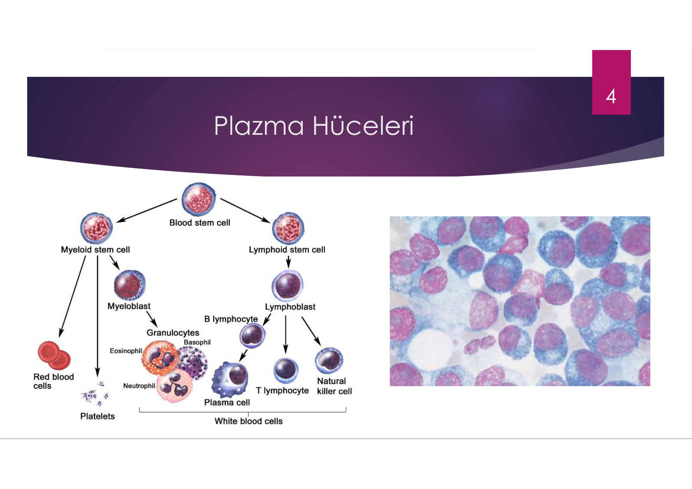

> **Şema yorumu:**
>
> Görselin **sol panelinde** hematopoez şeması: kan kök hücresinin (Blood stem cell) myeloid ve lenfoid alt tiplere ayrılması; lenfoid kök hücre → lenfoblast → B lenfosit → **plazma hücresi** olgunlaşma yolağı.
>
> **Sağ panelde** kemik iliği aspirasyon yaymasından plazma hücre histolojisi: tipik **eksantrik (yuvarlak, yer dışı)** çekirdek, **tekerlek-jantı (cartwheel/clock-face) kromatin paterni**, perinukleer **soluk halo** (Golgi apparatusu) ve geniş bazofilik sitoplazma. Bu morfoloji plazma hücresinin patognomonik bulgusudur.

**Bu grupta yer alan hastalıklar:**

* **Multiple myelom (MM)**
* **Waldenström makroglobulinemisi (WM)**
* **Primer (AL) amiloidoz**
* **Ağır zincir hastalıkları**

Bu hastalıklar şu başlıklarla anılabilir: **monoklonal gamopati, paraproteinemi, plazma hücre diskrazileri, disproteinemi**.

> **Patogenez ortak özelliği:** Normal şartlarda antikor üreten plazma hücrelerine olgunlaşma ve proliferasyon, yüzey IG'nin spesifik olduğu antijen ile stimüle edilirken, **bu hastalıklarda bu sürecin kontrolü kaybolmuştur**.

**Klinik bulgular üç ana grupta:**
1. Neoplastik hücre genişlemesi
2. Hücre ürünlerinin sekresyonu (Ig molekülleri ve subunitleri, lenfokinler)
3. Hastanın tümöre yanıtı

---

## WHO SINIFLAMASI

**2016 WHO -- Olgun B Hücreli Neoplaziler arasında plazma hücre hastalıkları:**

| Hastalık |
|---|
| Kronik lenfositik lösemi / küçük lenfositik lenfoma |
| Monoklonal B hücreli lenfositoz |
| B hücreli prolenfositik lösemi |
| Splenik marjinal zon lenfoma |
| Tüylü hücreli lösemi |
| **Lenfoplazmositik lenfoma** -- Waldenström makroglobulinemisi |
| **Önemi bilinmeyen monoklonal gamopati (MGUS), IgM** |
| **μ ağır zincir hastalığı** |
| **γ ağır zincir hastalığı** |
| **α ağır zincir hastalığı** |
| **Önemi bilinmeyen monoklonal gamopati (MGUS), IgG/A** |
| **Plazma hücre myeloması** |
| **Soliter kemik plazmasitomu** |
| **Ekstraosseöz plazmasitom** |
| **Monoklonal immunoglobulin birikim hastalıkları** |
| Ekstranodal marjinal zon lenfoma (MALT lenfoması) |
| Nodal marjinal zon lenfoma |
| Foliküler lenfoma |

---

## MULTİPLE MYELOM (MM)

> **Tanım:** Tek klondan köken almış **plazma hücrelerinin malign proliferasyonudur**.

Tümörün kendisi, ürettiği maddeler ve hastanın bunlara yanıtı sonucu organ disfonksiyonu ve semptomlar gelişir:

* **Kemik ağrısı**, kemik kırıkları
* **Böbrek yetmezliği**
* Enfeksiyona yatkınlık
* **Anemi**
* **Hiperkalsemi**
* Bazen pıhtılaşma bozuklukları
* Nörolojik semptomlar
* Hipervizkozite semptomları

### Etyoloji ve Epidemiyoloji

| Özellik | Değer |
|---|---|
| Etyoloji | **Bilinmiyor** |
| Risk faktörü | Nükleer maruziyet sonrası sıklık artmış |
| Mesleki risk | Çiftçilik, ağaç, deri, petrol işi |
| **Ortanca yaş** | **69** (40 yaş altı nadir, %2) |
| Tüm malignitelerin oranı | %1.3 (beyazlarda); hematolojik malignitelerin %13'ü |
| **İnsidans** | **5-7 / 100.000** |
| Yıllık ABD vakası | 30.000 yeni tanı, 12.000 ölüm |
| **5 yıllık sağkalım** | **%49-56** (önceden %25-34) -- yeni tedavilerle artmıştır |
| Kür durumu | **Kür edilebilen bir hastalık değildir** |

---

## İMMUNOGLOBULİN YAPISI

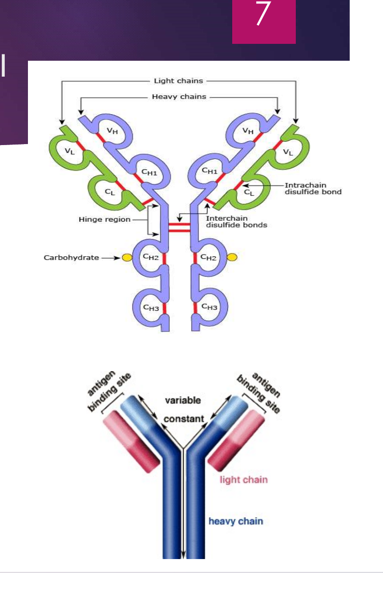

> **Şema yorumu (Ig yapısı):**
>
> Görselde **üst panelde** ayrıntılı IgG molekülünün şematik yapısı görülür:
>
> * **Yeşil bölgeler** = **hafif (light) zincirler** (kappa veya lambda) -- her biri **VL** (variable) ve **CL** (constant) bölgesinden oluşur
> * **Mor bölgeler** = **ağır (heavy) zincirler** -- her biri **VH** (variable) + **CH1, CH2, CH3** (constant) bölgelerinden oluşur
> * **Menteşe bölgesi (hinge region):** İki ağır zincir arasında esnek bağlantı; molekülün antijene uyum sağlamasına olanak verir (IgG, IgA, IgD'de bulunur)
> * **Disülfid bağları:**
>   * **Intrachain** (kırmızı kısa çizgiler): Aynı zincir içinde, immunoglobulin domain yapısını korur
>   * **Interchain** (kırmızı çift çizgiler): Hafif-ağır ve ağır-ağır zincirleri birleştirir
> * **Karbonhidrat (sarı topçuklar):** CH2 bölgesinde N-glikozilasyon bölgeleri
>
> **Alt panelde** basitleştirilmiş Y-şekilli antikor şeması: **kırmızı = hafif zincir (light chain)**, **mavi = ağır zincir (heavy chain)**. Y'nin uçlarında **antijen bağlanma bölgeleri** (variable/değişken bölge), gövdesinde **constant (sabit) bölge** bulunur.
>
> **🔑 MM açısından klinik anlamı:** Monoklonal hastalıklarda tüm Ig moleküllerinin **hem ağır hem hafif zincirleri özdeştir** (V bölgesi dahil). Bu yüzden serum elektroforezinde **sivri (monoklonal) pik** oluşur. Hafif zincir tipi (kappa veya lambda) tek bir tipte üretilir -- **kappa/lambda oranı bozulur** (serbest hafif zincir testi tanı koydurur).

İmmunoglobulin yapısı **2 ağır + 2 hafif zincirden** oluşur.

| Özellik | Detay |
|---|---|
| **Ağır zincir tipleri** | G, A, M, E, D (gamma, alpha, mu, epsilon, delta) |
| **Hafif zincir tipleri** | **kappa** ve **lambda** |
| **Sabit bölge** | Antijeni yok etme mekanizmasını belirler; aynı izotipin tüm antikorlarında özdeştir |
| **Değişken bölge** | Farklı B hücreleri tarafından üretilen antikorlarda farklılık gösterir; **monoklonalse özdeştir** |
| **Hafif zincir özelliği** | Her Ig molekülünde ya **2 kappa** ya da **2 lambda** zinciri bulunur |
| **Kappa/Lambda sıklığı** | Kappa, lambdaya göre **2 kat daha sık** |
| **Menteşe bölgesi** | Esnekliği sağlar; **IgG, IgA, IgD**'de bulunur |

---

## MM PATOGENEZ

### MGUS → MM Geçişi

> **Bütün MM hastaları öncesinde MGUS'a sahiptir.**

* Her yıl **%1 MGUS'lu hasta MM'a progrese olur**

**Progresyon riski daha yüksek:**

* **IgG dışı** monoklonal gamopatiler (IgA vs.)
* **Anormal kappa/lambda serbest hafif zincir oranı**
* **Serum M protein miktarı >15 g/L (1.5 g/dL)**

### Kemik İliği Mikroçevresi Etkileşimi

* MM hücreleri, hücre-yüzey adezyon molekülleri aracılığıyla **kemik iliği stromal hücrelerine ve ekstrasellüler matrikse** bağlanırlar
* Bu durum MM hücre gelişimi, sağkalımı ve kemik iliği mikroçevresine migrasyonuna olanak sağlar
* Bu etkileşimde **IL-6, IGF-1, VEGF ve SDF-1α** gibi sitokinler rol oynar

### Kemik Lezyonları (Litik Lezyonlar)

* Tümör hücrelerinin proliferasyonu sonucu oluşur
* Kemiği destrukte eden **osteoklast aktivasyonu** ve kemik yapımını sağlayan **osteoblastların baskılanması** söz konusudur
* Osteolitik lezyonların oluşumunda myelom hücrelerince üretilen **Dickkopf-1 protein (DKK-1)** etkili olur (osteoblastik aktiviteyi baskılar)

> **⚠️ ÖNEMLİ:** **Osteolitik lezyonlar kemik sintigrafisinde GÖRÜLMEZ** (osteoblast aktivitesi yok). Tarama BT veya **PET-BT** ile yapılır.

---

## KLİNİK BULGULAR

* **En sık semptom: Kemik ağrısı (%70 hasta)**. Lokalize ağrı → patolojik kırık?
* Osteolize bağlı **kalsiyumun kemikten kana mobilizasyonu → Hiperkalsemi**
* **Vertebra kollapsına bağlı spinal kord kompresyonu**
* **Bakteriyel enfeksiyonlara yatkınlık** (en sık pnömoni ve piyelonefrit). %25 hasta rekürren enfeksiyonlarla prezente olur
* **%25 hastada böbrek yetmezliği:** hiperkalsemi, **cast nefropatisi**, amiloid glomerüler birikim, myelom hücreleri ile böbrek infiltrasyonu, hiperürisemi, rekürren enfeksiyonlar, NSAID kullanımı, IV kontrast, bifosfonat
* **Normokrom normositer anemi (%80 hasta)**
* **Tromboz riskinde artış**

### Klinik Özellikler -- Mekanizmaya Göre Sınıflama

| Mekanizma | Klinik bulgular |
|---|---|
| **Kemik destrüksiyonu** | Ağrı, fraktürler, kord kompresyonu, radiküler ağrı |
| **Kemik iliği infiltrasyonu** | **Anemi**, kanama eğilimi |
| **Hiperkalsemi** | Poliüri, polidipsi, bulantı, kusma |
| **Globulin azalması** | Rekürren enfeksiyonlar, pnömoni |
| **Böbrek yetmezliği** | Bulantı, kusma, halsizlik, güçsüzlük |
| **Kryoglobulinler** | Raynaud fenomeni, akrosiyanoz |
| **Amiloidoz** | Periferik nöropati, **bağımlı ödem (dependent edema)**, organomegali |
| **Hipervizkozite** | Nefes darlığı, **TIA**, **DVT**, retina hemorajisi, epistaksis |

---

## M PROTEİNİ

> M proteini (paraprotein, monoklonal protein), plazma hücrelerinin anormal olarak genişlemiş klonundan sekrete edilen **monoklonal immunoglobulindir**.

* M proteini **serum** ve/veya **24 saatlik idrar** (veya nadiren başka vücut sıvıları) **immunfiksasyon elektroforezi** ve **serum hafif zincir ölçümü** ile saptanır

**M proteini şunları içerebilir:**
* **Ağır + hafif zincir** birlikte (örn. IgG lambda)
* **Sadece hafif zincir** (lambda veya kappa) -- örn. hafif zincir MM, LCDD, AL amiloidoz
* **Sadece ağır zincir** -- örn. ağır zincir hastalıklarında IgA gibi

> **Bence Jones proteini:** Ağır zincir eşlik etmeksizin görülen **monoklonal hafif zincirlere** denir. Nadiren serumda, ama kolaylıkla **idrar protein elektroforezinde** saptanırlar.

### MM'da M Protein Tipi Dağılımı

| Tip | Sıklık |
|---|---|
| **IgG** | %70 |
| **IgA** | %20 |
| **Sadece hafif zincir** (kappa veya lambda) | %5-10 |
| IgD, IgE, IgM veya nonsekretuar | %1 |

> Artan Ig tipi dışında **diğer Ig'ler baskılanır** (immunparesi).
>
> **Biklonal veya triklonal Ig üretimi** nadiren görülebilir (genellikle aynı hafif zincir, bazen farklı hafif zincir ile).

---

## PROTEİN-İMMUNFİKSASYON ELEKTROFOREZİ

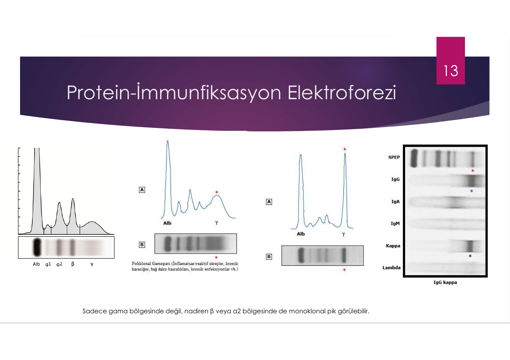

> **Şema yorumu:**
>
> Görselde 4 farklı SPEP/IFE örneği görülür:
>
> * **Sol panel (Normal):** Albümin (Alb) baskın pik; α1, α2, β, γ bantları normal düzeyde, gama bölgesinde geniş difüz pik (poliklonal Ig).
> * **Orta panel (Poliklonal gamopati):** Gama bölgesi belirgin geniş ve yüksektir -- bu inflamatuar/reaktif süreçler, kronik karaciğer/bağ doku hastalıkları, kronik enfeksiyonlarda görülür. **Pik sivri değil, geniş tabanlı.**
> * **Orta-sağ panel (Monoklonal gamopati):** Gama bölgesinde **dar, sivri "M-spike" (monoklonal pik)** -- plazma hücre diskrazisi tanısının elektroforezdeki anahtar bulgusu.
> * **Sağ panel (İmmunfiksasyon, IFE):** Kappa zincirinin IgG bandında özdeş olarak boyanması, **IgG kappa monoklonal proteini** olduğunu doğrular.
>
> **🔑 Klinik kural:** Sivri pik gama bölgesinde sıktır ama nadiren **β veya α2 bölgesinde de monoklonal pik** görülebilir.

---

## MONOKLONAL GAMOPATİ NEDENLERİ

| Grup | Örnek |
|---|---|
| **Plazma hücre hastalıkları** | MM, MGUS, AL amiloidoz, plazmasitom |
| **B hücreli lenfoproliferatif hastalıklar** | NHL, KLL, post-transplant lenfoproliferatif hastalıklar |
| **Bağ doku hastalıkları** | SLE, RA, Sjögren |
| **Enfeksiyonlar** | HCV, HIV/AIDS |
| **Dermatolojik hastalıklar** | Pyoderma gangrenozum, nekrobiotik ksantogranülom, skleroderma |
| **Böbrek hastalıkları** | Bazı glomerülonefritler |
| **Diğer** | Soğuk aglütinin hastalığı, kazanılmış vWH, kryoglobulinemi |

---

## TANI KRİTERLERİ (CRAB-SLIM)

### Myelom Tanımlayıcı Olaylar (MDE)

#### CRAB Belirti ve Bulguları

| Harf | Bulgu | Tanım |
|---|---|---|
| **C** | **Hiperkalsemi** | Serum Ca²⁺ üst limitin en az **1 mg/dL** üzerinde **veya** >11 mg/dL |
| **R** | **Renal yetmezlik** | **Kreatinin klirensi <40 mL/dk** veya serum kreatinin **>2 mg/dL** |
| **A** | **Anemi** | Hemoglobin alt limitin **2 g/dL altında** veya Hb **<10 g/dL** |
| **B** | **Bone (kemik) lezyonları** | Tüm vücut BT/PET-BT'de **5 mm'den büyük** bir veya daha fazla **osteolitik lezyon** (PET'de FDG tutulumu gerekmez) |

#### SLIM Kriterleri (yeni eklenen biyobelirteçler)

| Harf | Kriter |
|---|---|
| **S (Sixty)** | **Kemik iliği klonal plazma hücre oranı ≥%60** |
| **Li (Light chain)** | Etkilenen/etkilenmeyen serum **serbest hafif zincir oranı >100** |
| **M (MR)** | **Tüm vücut MR'de** birden fazla **5 mm veya daha büyük odaksal lezyon** varlığı |

> **🔑 Yeni MM tanımı:** Plazma hücre klonalite kanıtı **+ en az bir CRAB veya SLIM kriterinin** varlığı.

---

## MGUS / SMM / MM AYRIMI

| Kriter | **MGUS (IgG/IgA)** | **SMM (Smoldering)** | **Multiple Myelom** |
|---|---|---|---|
| Serum M proteini | <3 g/dL | ≥3 g/dL | -- |
| İdrar M proteini | <500 mg/24 saat | ≥500 mg/24 saat | -- |
| Kemik iliği klonal PC oranı | <%10 | %10-60 | ≥%10 **veya** biyopsi ile kanıtlanmış ekstrameduller plazmasitom |
| Amiloidoz | Eşlik etmemeli | Eşlik etmemeli | -- |
| **MDE (CRAB veya SLIM)** | **YOK** | **YOK** | **EN AZ BİR (+)** |

> **Klinik takip:**
> * MGUS → her yıl klinik değerlendirme; %1/yıl progresyon
> * SMM → daha sıkı takip; ortalama 2/yıl progresyon
> * MM → tedavi başlanır

---

## MM EVRELEME

### Uluslararası Evreleme Sistemi (ISS)

| Evre | Kriter | Ortanca genel sağkalım |
|---|---|---|
| **I** | Serum β2-mikroglobulin <3.5 mg/L **VE** serum albümin ≥3.5 g/dL | **62 ay** |
| **II** | Evre I ve III kriterlerinin sağlanmaması | **44 ay** |
| **III** | Serum β2-mikroglobulin **≥5.5 mg/L** | **29 ay** |

### Revize Uluslararası Evreleme Sistemi (R-ISS)

| Evre | Kriter | 5 yıllık sağkalım |
|---|---|---|
| **I** | Serum albümin ≥3.5, β2-mikroglobulin <3.5, **yüksek riskli sitogenetik yok** ve **normal LDH** | **%82** |
| **II** | I veya III dışında kalanlar | %60 |
| **III** | β2-mikroglobulin >5.5 **VE** [yüksek riskli sitogenetik **veya** yüksek LDH] | **%40** |

### Risk Stratifikasyonu

| Risk grubu | Sitogenetik bulgular |
|---|---|
| **Yüksek risk** | t(14;16), t(14;20), t(4;14) translokasyonları · **del(17p)** · Ig amplifikasyonu |
| **Standart risk** | t(11;14), t(6;14) · **trizomiler** |

**Diğer kötü prognostik faktörler:**
* Kötü performans skoru
* Artmış dolaşan plazma hücreleri
* **Plazmablastik morfoloji**

---

## MM TEDAVİ

> **⚠️ Sadece semptomatik MM tedavi edilir** (CRAB veya SLIM kriteri olan).

### İlaç Sınıfları

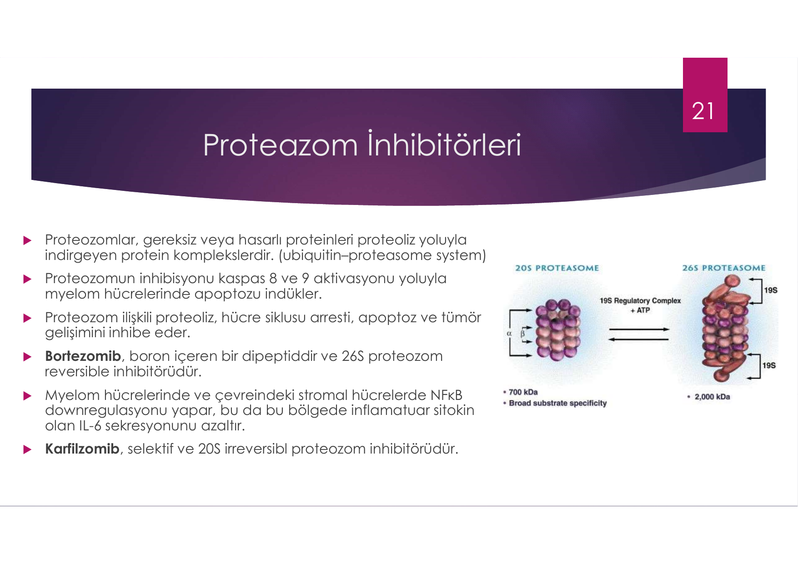

> **Şema yorumu (Proteozom inhibitörleri):**
>
> Görselde **20S** proteozom (sadece çekirdek) ve **26S** proteozom (20S + 19S regülator kompleks, ATP gerektirir) yapıları gösterilir.
>
> * **20S proteozom (~700 kDa):** Geniş substrat spesifitesi
> * **26S proteozom (~2000 kDa):** Ubikuitinlenmiş proteinlerin yıkımı
>
> Proteozomlar gereksiz veya hasarlı proteinleri **proteoliz yoluyla indirgeyen** protein kompleksleridir (ubikuitin-proteozom sistemi). Proteozom inhibisyonu **kaspas 8 ve 9 aktivasyonu** yoluyla myelom hücrelerinde **apoptozu indükler** ve hücre siklusu arresti, tümör gelişimi inhibisyonu yapar.

| Sınıf | İlaçlar | Mekanizma özeti |
|---|---|---|
| **Proteozom inhibitörleri** | **Bortezomib**, Karfilzomib, İksazomib | Bortezomib boron içeren dipeptid, 26S **reversibl** inhibitör; Karfilzomib selektif 20S **irreversibl** inhibitör. NF-κB downregulasyonu → IL-6 azalması |
| **İmmunmodulatörler (IMiD'ler)** | **Talidomid**, **Lenalidomid**, Pomalidomid | T ve NK hücrelerinin sayısını arttırır; T hücre aktivasyonu artar, **Treg supresif etkisi baskılanır** (immunpareziyi giderir). Anti-anjiyojenik, anti-inflamatuar, anti-proliferatif. |
| **Anti-CD38 antikorları** | **Daratumumab**, İsatuksimab | -- |
| **Anti-SLAMF7** | **Elotuzumab** | -- |
| **Anti-BCMA** | Belantamab | -- |
| **Histon deasetilaz inhibitörleri** | Panobinostat | -- |
| **Alkilleyiciler** | Melfalan, Siklofosfamid, Bendamustin | -- |
| **Steroidler** | Deksametazon, Metilprednizolon | -- |

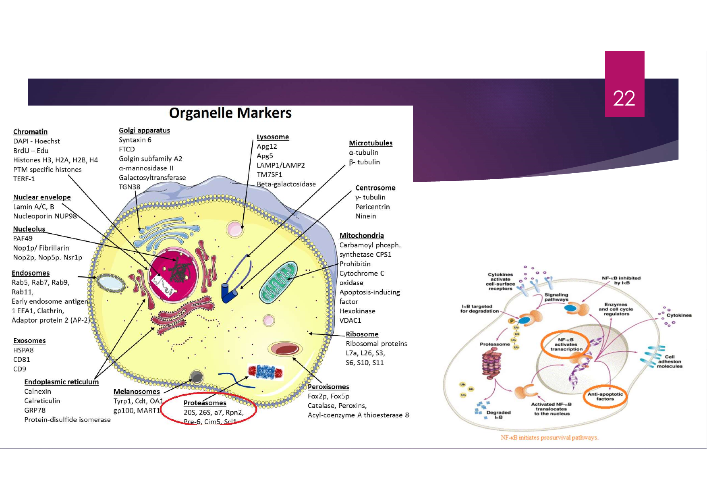

> **Şema yorumu (Hücre organelleri ve markerlar -- proteazomun klinik önemi):**
>
> Görsel, **eukaryot hücrenin tüm major organellerini** ve her birinin **moleküler/immunfloresan markerlarını** gösteren bir referans haritasıdır. Kırmızı daire içine alınmış **proteazomlar**, MM tedavisinin **hedef organelidir** (bortezomib, karfilzomib, iksazomib bu organele etki eder). Bu nedenle MM patolojisini ve tedavisini anlamak için organel düzeyinde bilgi önemlidir.
>
> **Organellere göre marker özeti:**
>
> | Organel | Fonksiyon | Marker proteinler |
> |---|---|---|
> | **Çekirdek (Chromatin)** | Genetik materyal organizasyonu | DAPI/Hoechst (DNA), BrdU/EdU (yeni sentezlenmiş DNA), histonlar (H2A/H2B/H3/H4), TERF-1 (telomer) |
> | **Çekirdek zarı** | Nukleer sınır | Lamin A/C/B, Nucleoporin NUP98 |
> | **Çekirdekçik (Nucleolus)** | Ribozom biogenezi | PAF49, Fibrillarin, Nop1p/Nop2p/Nop5p |
> | **Endoplazmik retikulum (ER)** | Protein sentezi/katlanması | **Calnexin, Calreticulin, GRP78, Protein-disülfid izomeraz** |
> | **Golgi aparatusu** | Protein modifikasyonu/sevkiyatı | Syntaxin 6, FTCD, α-mannosidaz II, Galaktoziltransferaz, TGN38 |
> | **Endozomlar** | Endositik kargo | Rab5/7/9/11, EEA1, Klatrin, AP-2 |
> | **Lizozom** | Protein/atık yıkımı | LAMP1/LAMP2, Apg5/Apg12, β-galaktozidaz |
> | **Mitokondri** | ATP üretimi, apoptoz | **Sitokrom C oksidaz, AIF (apoptosis-inducing factor)**, Heksokinaz, VDAC1, Prohibitin |
> | **Peroksizomlar** | Yağ asidi β-oksidasyonu | Katalaz, Peroksinler, Acyl-CoA tioesteraz 8 |
> | **Ribozom** | Protein sentezi | Ribozomal proteinler (L7a, L26, S3, S6, S10, S11) |
> | **Sitoiskelet (mikrotübüller)** | Hücre şekli/transportu | α-tubulin, β-tubulin |
> | **Sentrozom** | Mitoz iğciği organizasyonu | γ-tubulin, Pericentrin, Ninein |
> | **Eksozomlar** | Hücreler arası sinyal vesikül | HSPA8, CD81, CD9 |
> | **Melanozomlar** | Melanin sentezi | Tyrp1, Cdt, OA1, gp100, MART1 |
> | **🔴 PROTEAZOMLAR** | **Protein yıkımı (UPS)** | **20S, 26S, α7, Rpn2, Pre-6, Cim5** |
>
> **🔑 Proteazomların MM açısından kritik önemi:**
>
> 1. **Plazma hücreleri çok sayıda Ig (paraprotein) sentezlerler** -- bu hücrelerin proteostazı (protein dengesi) çok hassastır.
> 2. **Proteazom inhibisyonu** → hatalı katlanmış proteinler birikir → **endoplazmik retikulum stresi** → kaspas 8 ve 9 aktive olur → **apoptoz**.
> 3. Plazma hücreleri normal hücrelerden **proteazom inhibisyonuna daha duyarlıdır** (yüksek protein üretim yükü nedeniyle) -- bu seçici hassasiyet, MM'de proteazom inhibitörlerinin hedefe yönelik etkinliğinin temelidir.
> 4. **Bortezomib** (boron içeren dipeptid, 26S reversibl inhibitör) ve **Karfilzomib** (selektif 20S irreversibl inhibitör) MM tedavisinin omurgasını oluşturur.
> 5. Proteazom inhibisyonu ayrıca **NF-κB yolağını da bloke eder** (NF-κB'nin inhibitörü IκB proteazom tarafından yıkılır; inhibitör birikince NF-κB sitoplazmada tutulur, nukleusa geçemez ve **prosurvival genler tetiklenmez**).
> 6. **Yan etki profili** organellerle ilişkilidir:
>    * **Periferik nöropati** (Bortezomib) -- mitokondriyal disfonksiyon (sitokrom C oksidaz inhibisyonu) ve TRPV1 reseptör etkisi
>    * **Kardiyak toksisite** (Karfilzomib) -- kardiyomyositlerin proteazom bağımlılığı
>    * **Trombositopeni** -- megakaryositlerin proteazom hassasiyeti

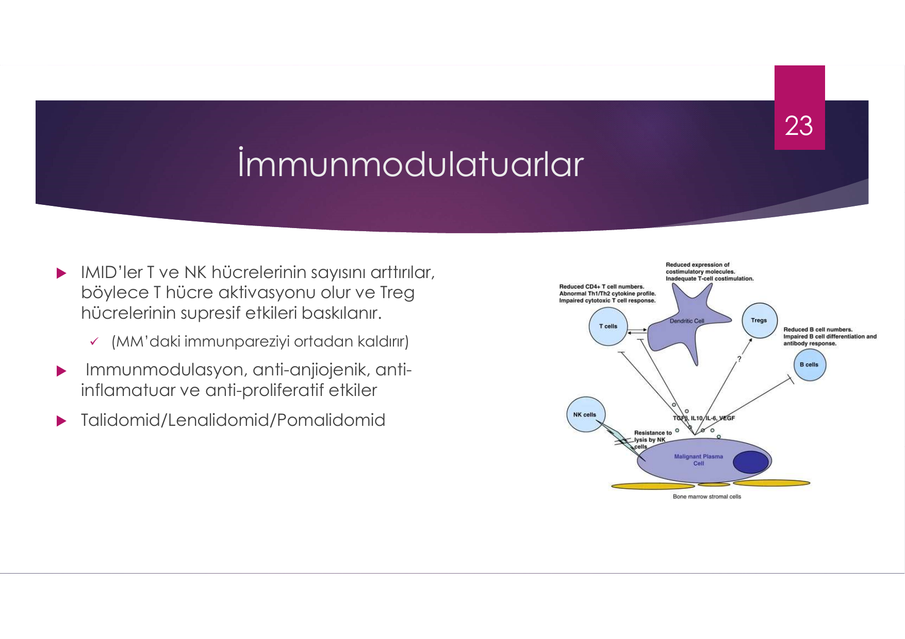

> **Şema yorumu (IMiD'ler):** Talidomid/Lenalidomid/Pomalidomid grubu, plazma hücresinin yanı sıra **mikroçevredeki kemik iliği stromal hücrelerini** (BMSC) etkileyerek:
> * **T ve NK hücre sayı/aktivitesini arttırır**
> * **Treg supresif etkisini azaltır**
> * Anti-anjiyojenik etki ile damar oluşumunu bloker
> * Anti-inflamatuar etki ile mikroçevredeki destekleyici sinyalleri keser
> * Direkt anti-proliferatif etki

---

## YENİ TANI MM YÖNETİM ALGORİTMASI

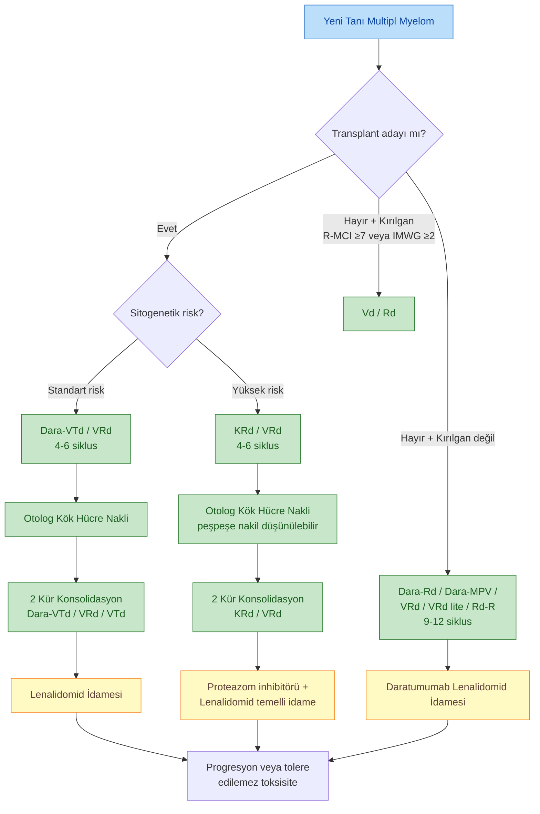

**İlaç kombinasyon kısaltmaları:**

| Kısaltma | Açılım |
|---|---|
| **Dara-Rd** | Daratumumab + Lenalidomid + Deksametazon |
| **Dara-MPV** | Daratumumab + Melfalan + Metilprednizolon + Bortezomib |
| **Dara-VTd** | Daratumumab + Bortezomib + Talidomid + Deksametazon |
| **KRd** | Karfilzomib + Lenalidomid + Deksametazon |
| **VRd** | Velcade (Bortezomib) + Lenalidomid + Deksametazon |
| **Rd** | Lenalidomid + Deksametazon |
| **Vd** | Bortezomib + Deksametazon |

---

## SOLİTER PLAZMASİTOM

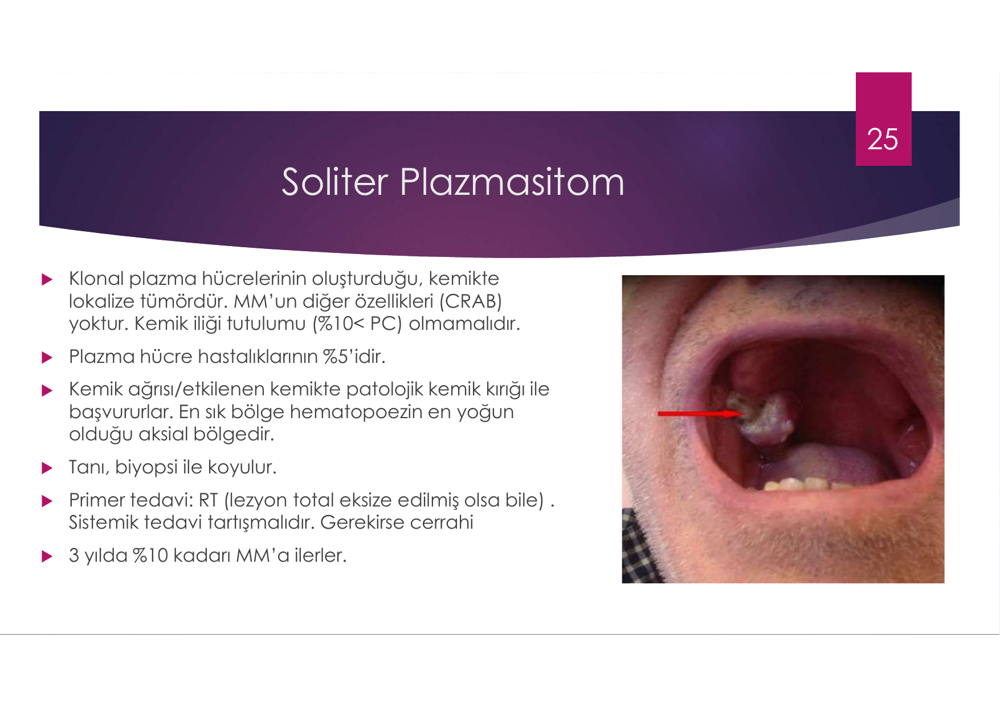

> **Klinik foto yorumu:** Görselde sert damakta (oklar ile işaretlenmiş) **kırmızı-pembe, vasküler görünümlü ve yüzeyden kabarık bir kitle** izlenir -- soliter plazmasitomun başboyun bölgesindeki tipik prezentasyonu. Bu lokasyon ekstraosseöz plazmasitomda da sıktır ama soliter kemik plazmasitomu da maksiller kemik tutulumu gösterebilir. Tanı **biyopsi** ile konur, tedavide **radyoterapi** primer modalite.

* **Klonal plazma hücrelerinin oluşturduğu, kemikte lokalize tümördür**
* **MM'in diğer özellikleri (CRAB) yoktur**
* **Kemik iliği tutulumu (PC <%10)** olmamalı
* Plazma hücre hastalıklarının **%5'idir**
* Kemik ağrısı / etkilenen kemikte **patolojik kemik kırığı** ile başvururlar
* En sık bölge **hematopoezin yoğun olduğu aksiyel bölge**
* **Tanı: biyopsi**
* **Primer tedavi: Radyoterapi** (lezyon total eksize edilmiş olsa bile)
* Sistemik tedavi tartışmalıdır
* Gerekirse cerrahi
* **3 yılda %10 kadarı MM'a ilerler**

---

## EKSTRAMEDULLER PLAZMASİTOM

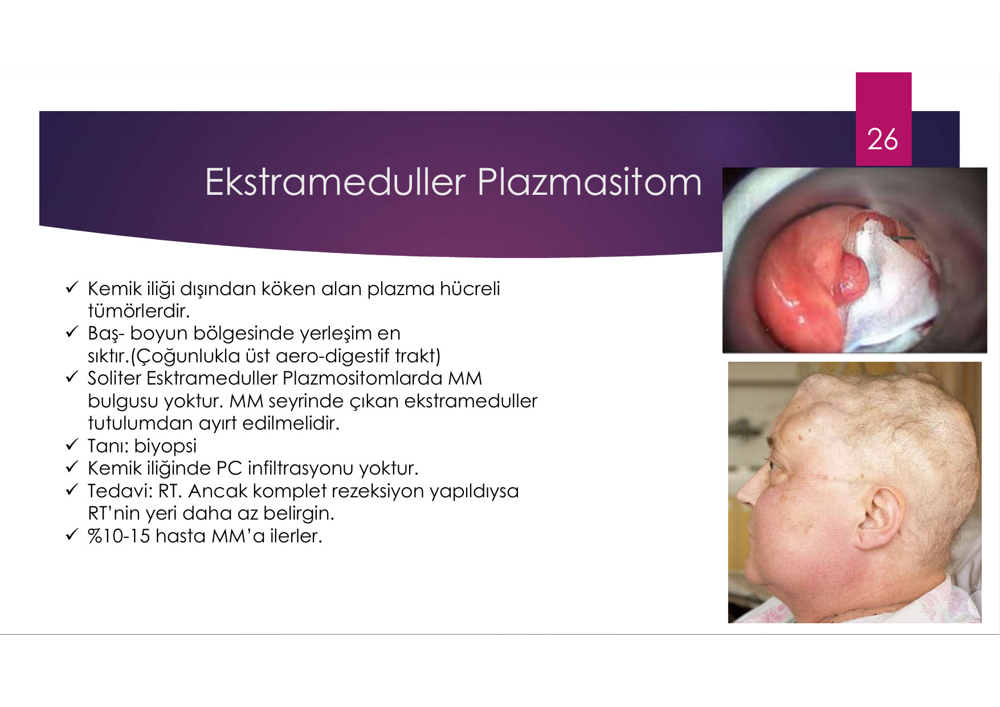

> **Klinik foto yorumu:** Görselde sol panelde **periorbital şişlik ve plazmasitom kitlesi** izlenir; sağ panelde aynı hastanın yandan görüntüsünde **paranazal/yüz bölgesinde belirgin asimetrik kitle** dikkati çeker. Ekstrameduller plazmasitomlar en sık **üst aero-digestif trakt** (nazofarenks, paranazal sinüsler, oral kavite) lokasyonunda görülür.

* **Kemik iliği dışından köken alan plazma hücreli tümörlerdir**
* **Baş-boyun bölgesinde** yerleşim en sık (çoğunlukla üst aero-digestif trakt)
* Soliter ekstrameduller plazmasitomlarda **MM bulgusu yoktur**
* MM seyrinde çıkan ekstrameduller tutulumdan ayırt edilmelidir
* **Tanı: biyopsi**
* Kemik iliğinde plazma hücre infiltrasyonu **yoktur**
* **Tedavi: Radyoterapi**. Komplet rezeksiyon yapıldıysa RT'nin yeri daha az belirgin
* **%10-15 hasta MM'a ilerler**

---

## AMİLOİDOZ

> **Tanım:** **Hatalı protein katlanması** sonucu çözünmeyen fibrillerin **ekstrasellüler dokuda birikmesi**.

### Amiloidoz Tipleri

| Amiloid tipi | Prekürsör protein | Klinik tablo |
|---|---|---|
| **AL** veya AH | Immunoglobulin **hafif** veya ağır zincir | **Primer veya lokalize**; myelom veya makroglobulinemi ilişkili |
| **AA** | SAA | **Sekonder**; ailevi Akdeniz ateşi (FMF), ailevi periyodik ateş sendromları |
| **ATTR** | Transtiretin | **Familyal ve senil** |
| A fibrinojen | Fibrinojen | Familyal renal amiloidoz (Ostertag tipi) |
| **Aβ₂M** | β₂-Mikroglobulin | **Diyaliz ilişkili** (karpal tünel sendromu) |
| **Aβ** | ABPP | **Alzheimer hastalığı** |
| A Apo A-I/A-II | Apolipoprotein A-I/A-II | Proteinüri, kardiyak, nöropati |
| A lizozim | Lizozim | Gİ trakt, KC, renal |
| ALECT2 | Leukocyte chemotactic factor 2 | Renal |

---

## AL AMİLOİDOZ

### Patogenez

* AL amiloidoz hastalarının **%20'sinde eş zamanlı MM** mevcut
* **Tüm AL amiloidoz hastalarında klonal hafif zincir üretimi** vardır
* **Prekürsör protein:** Monoklonal **immunoglobulin hafif zinciri**
* Çoğunlukla plazma hücre klonu, nadiren marjinal zon lenfoma veya lenfoplazmositik (IgM amiloidoz)

### Klinik Bulgular

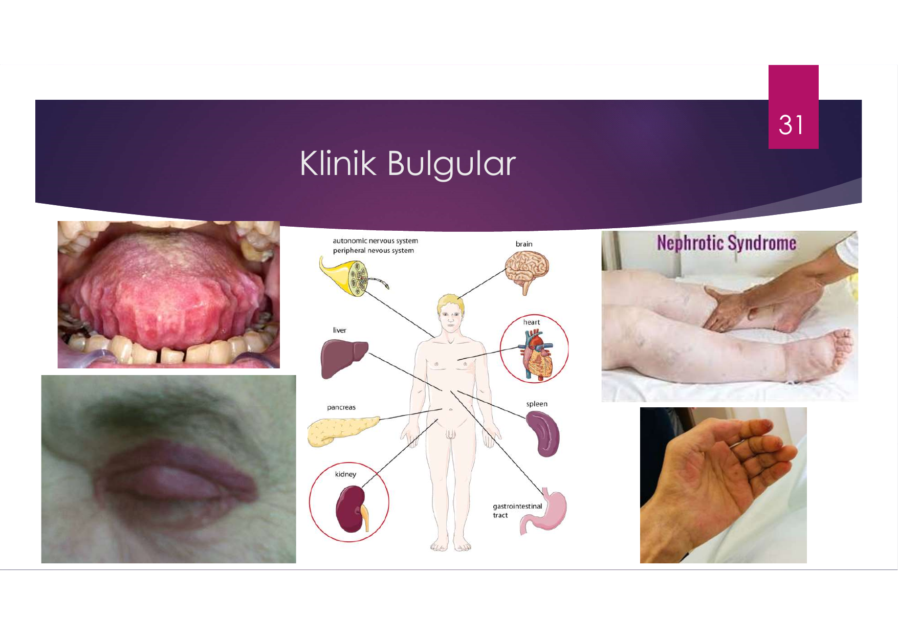

> **Klinik foto yorumu:**
>
> Görselde AL amiloidozun **patognomonik klinik bulguları** birlikte gösterilir:
>
> * **Sol üst:** **Makroglossi** -- amiloid depolanması nedeniyle büyümüş, kenarlarda diş izleri (scalloped) bulunan dil. **AL amiloidozun en spesifik bulgularından biri**.
> * **Sol alt:** **Periorbital purpura ("rakun gözü", panda eyes)** -- kapilerlerin amiloid infiltrasyonu nedeniyle kolay yırtılması; öksürük/zorlanma sonrası ortaya çıkar. **AL amiloidozun spesifik bulgusudur**.
> * **Orta:** Multi-organ tutulum şeması -- otonom/periferik sinir sistemi, beyin, kalp, KC, pankreas, böbrek, GİS.
> * **Sağ üst:** **Nefrotik sendrom** -- amiloid glomerüler birikimi sonucu masif proteinüri ve **bilateral pretibial ödem**.
> * **Sağ alt:** **Akrosiyanoz / parmak ucu siyanozu** -- parmak uçlarında bluish-purple renk değişikliği. AL amiloidozda **kryoglobulinemi**, **hipervizkozite** veya **kardiyak amiloid** nedeniyle periferik hipoperfüzyon sonucu görülebilir (Raynaud benzeri tablo). MM'in klinik özelliklerinden "kryoglobulinler → Raynaud fenomeni, akrosiyanoz" başlığıyla uyumludur.

### Şüphelenilecek Durumlar

* **Non-diyabetik nefrotik düzeyde proteinüri**
* **Restriktif kardiyomyopati** veya başka türlü açıklanamayan KKY
* Bilinen KKY olmaksızın **NT-proBNP düzeyinde artış**
* Açıklanamayan ödem, HSM veya **karpal tünel sendromu**
* Açıklanamayan **yüz ve boyun bölgesinde purpura**
* **Makroglossi**

### AL Amiloidoz Tanı

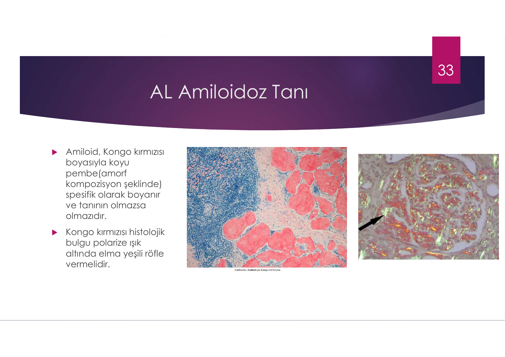

> **Histolojik yorum:**
>
> * **Sol panel:** Renal biyopside **glomerüllere amiloid depolanması** -- **Kongo kırmızısı boyası** ile **koyu pembe / kiremit kırmızısı amorf madde** glomerüler kapillerleri ve mezangial alanı işgal eder.
> * **Sağ panel:** Aynı doku **polarize ışık altında "elma yeşili refle (apple-green birefringence)"** verir -- bu **amiloidozun patognomonik histolojik bulgusudur**, tanının **olmazsa olmazıdır**.

### Biyopsi Yapılabilecek Yerler

| Lokasyon | Pozitiflik oranı |
|---|---|
| **Böbrek veya KC biyopsisi** | %90+ |
| **Abdominal yağ dokusu biyopsisi** | %60-80 |
| Rektal biyopsi | %50-70 |
| Kemik iliği biyopsisi | %50-55 |
| Cilt biyopsisi | %50 |

**Diğer tanı yöntemleri:**
* Mass spektrometri / İmmun-elektron mikroskopisi / İmmunfluoresan mikroskopisi (erişim sınırlı)
* **Monoklonal plazma proteini varlığı (M proteini)** → AL amiloidoz lehine
* İmmunhistokimyasal boyama:
   * **Kappa/Lambda boyanması** → AL amiloidoz lehine
   * **Transtiretin boyanması** → herediter amiloidoz lehine
   * **Amiloid A boyanması** → sekonder (AA) amiloidoz lehine

### AL Amiloidoz Evreleme

#### Kardiyak Evreleme (NT-proBNP'ye göre)
| Evre | Belirteç(ler) | Ortalama yaşam |
|---|---|---|
| I | NT-BNP <332 ng/L · cTnT <0.035 ng/mL (veya cTnI <0.01 ng/mL) | (NR -- ulaşılmamış) |
| II | Bir belirteç (+) | -- |
| **IIIa** | İki belirteç (+) ve NT-BNP <8500 ng/L | **15 ay** |
| **IIIb** | İki belirteç (+) ve NT-BNP >8500 ng/L | **4 ay** |

#### Revize Mayo Klinik Evrelemesi
| Belirteç | Eşik |
|---|---|
| NT-proBNP | >1800 ng/L |
| cTnI | >0.025 ng/mL |
| dFLC (serbest hafif zincir farkı) | >180 mg/L |

| Evre | Kaç belirteç (+) | Ortalama yaşam |
|---|---|---|
| I | Hiçbiri | NR |
| II | 1 | 69 ay |
| III | 2 | 16 ay |
| IV | 3 | 6 ay |

#### Renal Evreleme
| Belirteç | Eşik |
|---|---|
| eGFR | <50 mL/dk/1.73 m² |
| Proteinüri | >5 g/gün |

| Evre | Belirteç (+) | Diyaliz riski |
|---|---|---|
| I | Hiçbiri | 2 yılda %1 |
| II | Herhangi biri | 2 yılda %12 |
| III | İki birden | 2 yılda %48 |

### AL Amiloidoz Tedavi

> AL amiloidoz **klonal bir plazma hücre hastalığı** olduğu için altta yatan **klonun eradikasyonu için kemoterapi** ile tedavi edilir.

**İlk basamak tedavi seçimi şunlara göre yapılır:**
* Risk durumu
* Komorbiditeler
* Organ tutulum ciddiyeti

| Tedavi | Hematolojik tam yanıt oranı |
|---|---|
| **CyBorD** (Siklofosfamid + Bortezomib + Deksametazon) | %23 |
| **Mel-dex** (Melfalan + Deksametazon) | %12 |
| **Yüksek doz Melfalan + OKİT** | %34-48 (ancak hastaların ancak %20'si transplanta uygun) |

> **⚠️ AL amiloidozda aynı rejimlerin MM'da uygulanmasından daha fazla ve ciddi toksisite riski mevcuttur.**

#### OKİT Uygunluğu Kriterleri

* Yaş ≤70
* ECOG performans skoru ≤2
* eGFR >30 mL/dk/1.73 m² (kronik diyalizde olmadığı sürece)
* Troponin T <0.06 ng/mL (veya hsTNT <75 ng/mL)
* NT-proBNP <5000 ng/L
* EF >%45
* NYHA <III
* Ayakta SKB >90 mmHg
* DLCO >%50
* Organ tutulumu <2
* Belirgin plevral effüzyon olmaması
* Oksijen bağımlı olunmaması

> Yeni tanı AL amiloidozlu hastaların **ancak %20-30'u OKİT'e uygun**.
> Ciddi (%25 üzeri) Faktör X eksikliğinde TRM **%50'ye yakın**.

#### Risk Grubuna Göre Tedavi

| Risk grubu | Tedavi seçenekleri |
|---|---|
| **Düşük riskli (OKİT'e uygun, %20)** | Bortezomib bazlı indüksiyon → Melfalan 200 mg/m² + OKİT → Bortezomib bazlı konsolidasyon (VGPR/CR altıysa) |
| **Orta riskli (OKİT'e uygunsuz, kardiyak evre 1-3a, %60)** | **Daratumumab + CyBorD** (1. seçenek). Erişilemiyorsa: CyBorD (özellikle GFR<30); BMDex (Bortezomib + Melfalan + Dex) -- t(11;14) ve 1q kazanımına etkili; MDex/LMDex (Bortezomib kontrendikeyse); Karfilzomib (periferik nöropatisiz, ciddi kardiyak tutulumsuz); **Venetoclax** -- t(11;14) (+) hastalarda |
| **Yüksek riskli (kardiyak evre 3b, NYHA III-IV, ECOG 4, %20)** | Azaltılmış dozlarla başlayıp **arttırma denemesi** veya **sırayla verme** |

#### Tedavi Yanıtı

* **Organ yanıtı**, hematolojik yanıttan **aylar sonra** tespit edilebilir
* Tedavinin etkinliği için **hematolojik yanıta göre** karar verilir:
   * **OKİT sonrası 3. ayda**
   * **Non-transplant tedavilerinden 1-2 ay sonra**

---

## HAFİF ZİNCİR BİRİKİM HASTALIKLARI (LCDD)

> Amiloidoza benzer patogenetik mekanizmaya sahip olsa da:

* Hafif zincir fragmanları **amiloid fibril oluşturmaz**
* **Kongo kırmızısı ile boyanmaz**
* Çoğunlukla **elektroforez yöntemiyle saptanamaz** -- serbest hafif zincir ölçümü ile saptanır
* Çoğunlukla **kappa tipi**
* **Renal, kardiak, hepatik ve pulmoner tutulum**

---

## AĞIR ZİNCİR HASTALIKLARI

> Nadir lenfoplazmositik hastalıklardır.

* Hastalar **hafif zincir eksprese etmez** ve defektif bir ağır zincir sekrete eder
* Üç alt tip: **Gamma, Alfa, Mü** (Delta ve Epsilon tanımlanmamış)

| Tip | Eponyme | Klinik özellik |
|---|---|---|
| **Gamma** | **Franklin Hastalığı** | Çoğunlukla RA gibi otoimmun hastalıklarla ilişkili. LAP, ateş, anemi, HSM. **Waldeyer halkası tutulumuna bağlı palatal ödem!** |
| **Alfa** | **Seligman Hastalığı** | İB lamina propria tutulumu. Kronik diyare, kilo kaybı, malabsorbsiyon |
| **Mü** | -- | Ayırıcı tanı: malign lenfositlerde **vakuolizasyon** |

---

## POEMS SENDROMU

(**Osteosklerotik Myelom**)

**Tanım kriterleri (POEMS akronimi):**

| Harf | Bulgu |
|---|---|
| **P** | **Polinöropati** -- ciddi progresif sensörimotor nöropati |
| **O** | **Organomegali** |
| **E** | **Endokrinopati** (amenore, impotans, jinekomasti, hiperprolaktinemi, tip 2 DM, hipotiroidi, adrenal yetmezlik) |
| **M** | **M proteini** varlığı |
| **S** | **Cilt değişiklikleri** (Skin) -- hiperpigmentasyon, hipertrikoz, cilt kalınlaşması, çomak parmak |

**Diğer bulgular:**
* Patolojide **VEGF, IL-6 yüksekliği**
* **Kemikte sklerotik değişiklikler** (litik değil!)
* HSM, LAP (**Castleman hastalığını taklit eden histoloji** -- her ikisinde de IL-6 aşırı üretimi)
* **Papillödem**, artmış BOS proteini ve basıncı (KİBAS)
* Periferal ödem, asit, **trombositoz**, ateş
* **Guillain-Barré sendromunu taklit edebilir**
* Myelom tedavisi ile bulgular gerileyebilir → **MM'a benzer şekilde tedavi edilir**

---

## WALDENSTRÖM MAKROGLOBULİNEMİSİ (WM)

### Tanım

> **Makroglobulinemi:** **IgM monoklonal proteininin** bazı klonal lenfoproliferatif hastalıklar ve plazma hücreli diskrazilerde aşırı olarak üretilmesini ifade eder.
>
> **Waldenström makroglobulinemisi:** Lenfoplazmositik lenfomanın **kemik iliği tutulumu + IgM monoklonal gamopati** varlığını ifade eder.

* Lenfoplazmositik lenfomaların çoğu WM olup, **<%5'i** IgG, IgA veya nonsekretuvar
* Hastalar lenf nodu/dalak infiltrasyonuna bağlı veya serumdaki M proteininin bulgularına bağlı semptomlarla gelebilir veya **asemptomatik** olabilir
* **WM için standart bir tedavi yoktur** (semptomatikse başlanır)

### Klinik Bulgular

| Bulgu | Sıklık | Mekanizma |
|---|---|---|
| **Hipervizkozite sendromu** | (epistaksis, başağrısı, görme bozukluğu vs.) IgM >6000 mg/dL | IgM intravasküler |
| **Demir eksikliği anemisi** | -- | Tümör tarafından **hepsidin üretimi** |
| **Kryoglobulinemi** | %10 | -- |
| **IgM nöropatisi** | %22 | -- |
| **Amiloidoz** | %10-15 | -- |
| **Soğuk aglütinemi** | %5 | -- |
| **LAP ve HSM** | Tanı anında %20+; relapsta %50-60 | -- |

### MM'dan Farklı Olduğu Noktalar

| Özellik | WM |
|---|---|
| Akım sitometride **CD56 ekspresyonu** | **Yok** |
| Litik lezyon / hiperkalsemi | **Nadir / yok** |
| Böbrek tutulumu | **Nadir / yok** |
| **Mutasyon** | **MYD88 (%90-95)** ve CXCR4 (%40) |
| Kemik iliği infiltrasyonu | Plazma hücre + lenfoid hücreler |
| **Hipervizkozite** | **Daha sık** (IgM intravasküler) |
| LAP / HSM | **Daha sık** |
| IgM myelomu (MM tipi) | **<%1** -- nadirdir |

### Tedavi Endikasyonu

> **Tedavi semptomatikse başlanmalı:**

* **Semptomatik LAP/HSM**
* **Konstitüsyonel semptomlar**, doku infiltrasyonu
* **Hb <10 g/dL**, **Trombosit <100.000/mm³**
* **Hipervizkozite sendromu**
* Amiloid birikimi
* **Semptomatik periferik nöropati** veya **kryoglobulinemi**

### WM Tedavi Algoritması

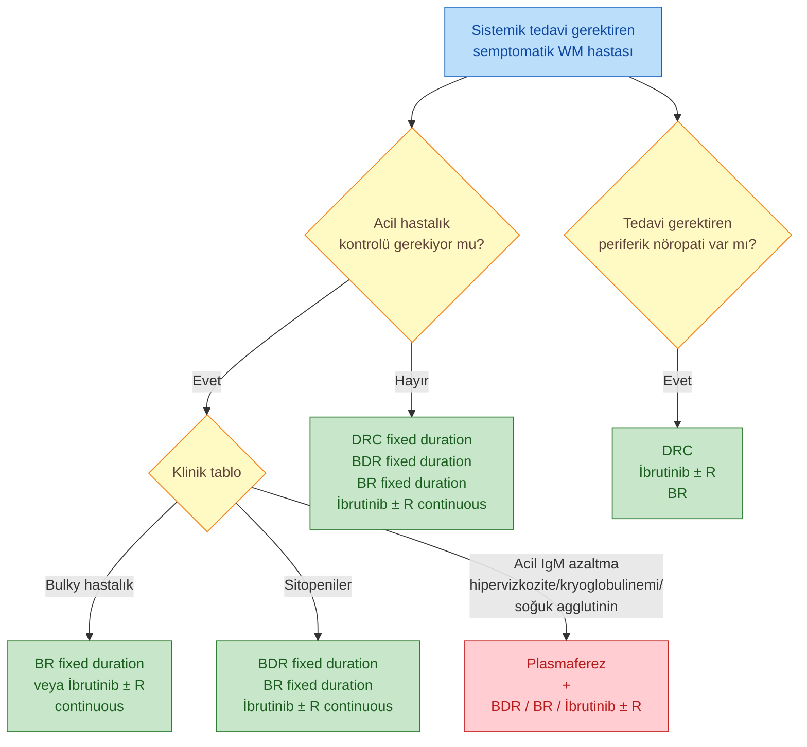

**Kısaltmalar:**
* **BR:** Bendamustin + Rituksimab
* **BDR:** Bortezomib + Deksametazon + Rituksimab
* **DRC:** Deksametazon + Rituksimab + Siklofosfamid
* **Tx:** Tedavi

### Hipervizkozite için Plazma Değişimi (PEX)

**Hipervizkozite semptom/bulguları:**
* Oronazal kanama
* Görme keskinliğinde azalma
* Başağrısı, sersemlik hissi, paresteziler
* **Retinal venlerde genişleme ve alev şekilli kanamalar**, papilödem
* Stupor, koma

> **🔑 IgM intravasküler:** Tek bir PEX işlemi IgM düzeylerini **%30-50** azaltır.
>
> **⚠️ PEX olmadan Rituksimab verilmesi:** **IgM flare** ile tabloyu ağırlaştırır.

---

## ÖZET TABLO -- PLAZMA HÜCRE HASTALIKLARI

| Hastalık | Karakteristik | Tanı | İlk basamak tedavi |
|---|---|---|---|
| **MGUS** | M protein + KI klonal PC <%10 + CRAB yok | SPEP/IFE | Sadece izlem (yıllık değerlendirme) |
| **SMM** | M protein ≥3 g/dL + KI klonal PC %10-60 + CRAB/SLIM yok | SPEP/IFE + KI | Sıkı izlem |
| **MM** | KI klonal PC ≥%10 + ≥1 CRAB veya SLIM | KI biyopsi + sitogenetik | Bortezomib + IMiD + Dex (transplant adayı için) |
| **Soliter plazmasitom** | Tek lokal lezyon + KI klonal PC <%10 + CRAB yok | Lezyon biyopsi | RT |
| **AL amiloidoz** | Klonal PC + amiloid biyopsi (Kongo kırmızısı + apple-green) | Yağ/organ biyopsi + IFE | CyBorD veya Dara-CyBorD |
| **WM** | KI lenfoplazmositik infiltrasyon + IgM monoklonal | KI biyopsi + MYD88 mutasyon | BR / DRC / İbrutinib |
| **POEMS** | Polinöropati + endokrinopati + M protein + cilt + sklerotik kemik | Sklerotik lezyon biyopsi + VEGF | MM benzeri tedavi |

---

## TEMEL ÖĞRENME NOKTALARI

* **MM'in en sık semptomu:** Kemik ağrısı (%70)
* **MM'in CRAB'i:** **C**alcium · **R**enal · **A**nemia · **B**one
* **MM'in SLIM'i:** **S**ixty (≥%60 PC) · **Li**ght chain (>100 oranı) · **M**RI (>1 lezyon)
* **MM'in en sık M protein tipi:** IgG (%70)
* **MM'in en sık böbrek tutulumu nedeni:** Cast nefropatisi
* **MM'de osteolitik lezyon:** Sintigrafide görülmez → **PET-BT/BT**
* **R-ISS Evre III**'ün ana belirteçleri: β2-mikroglobulin >5.5 + yüksek riskli sitogenetik veya yüksek LDH
* **AL amiloidozun patognomonik bulguları:** Makroglossi + periorbital purpura
* **Amiloid tanı altın standart:** Kongo kırmızısı + polarize ışıkta **apple-green birefringence**
* **WM'in MM'dan en önemli farkı:** **MYD88 mutasyonu** + **hipervizkozite** sıklığı + litik lezyon yokluğu
* **WM'de PEX endikasyonu:** Semptomatik hipervizkozite (IgM >6000 mg/dL)
* **POEMS'in mutlaka unutulmaması gereken farkı:** Litik değil **sklerotik** kemik lezyonları + Castleman benzeri histoloji + VEGF/IL-6 yüksekliği
* **Soliter plazmasitom tedavisi:** Radyoterapi (cerrahi yapılsa bile)
