# OLGU SUNUMU -- HEMOGRAM ÜZERİNDEN HEMATOLOJİK HASTALIKLAR

**Hazırlayan:** Prof. Dr. İrfan Yavaşoğlu
**Bölüm:** Aydın Adnan Menderes Üniversitesi Tıp Fakültesi -- İç Hastalıkları AD, Hematoloji BD
**Konu:** 4 olgu üzerinden klinik akıl yürütme: ITP, Otoimmun Hemolitik Anemi, Blastik Faz KML, Aplastik Anemi

---

## İÇİNDEKİLER

1. [Olgu 1 -- Akut Trombositopeni (ITP Şüphesi)](#olgu-1----akut-trombositopeni-itp-şüphesi)
2. [Olgu 2 -- Sıcak Otoimmun Hemolitik Anemi (wAIHA)](#olgu-2----sıcak-otoimmun-hemolitik-anemi-waiha)
3. [Olgu 3 -- Blastik Faz Kronik Miyeloid Lösemi (KML)](#olgu-3----blastik-faz-kronik-miyeloid-lösemi-kml)
4. [Olgu 4 -- Aplastik Anemi (İlaç İlişkili Şüphesi)](#olgu-4----aplastik-anemi-i̇laç-i̇lişkili-şüphesi)
5. [Sentez ve Genel Öğretici Noktalar](#sentez-ve-genel-öğretici-noktalar)

---

## OLGU 1 -- AKUT TROMBOSİTOPENİ (ITP ŞÜPHESİ)

### Anamnez (Başvuru -- 06.01.2026)

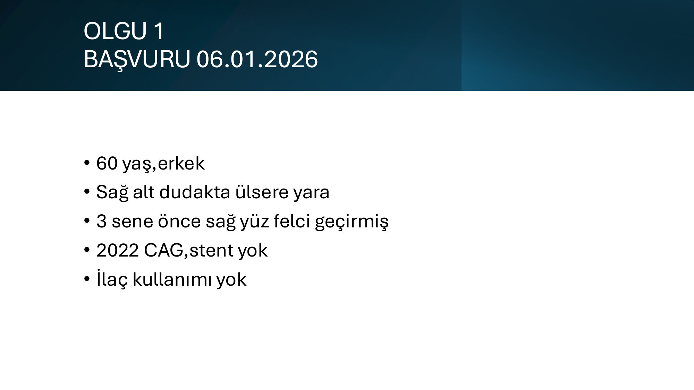

**Hasta profili:**
- **60 yaş, erkek**
- **Şikayet:** Sağ alt dudakta ülsere yara
- **Özgeçmiş:**
  - 3 sene önce **sağ yüz felci** (Bell paralizisi?)
  - 2022 yılında **koroner anjiografi (CAG)**, stent uygulanmamış
- **İlaç kullanımı:** Yok
- **Antikoagulan/antiagregan kullanımı:** Yok

### Başvuru Tetkikleri

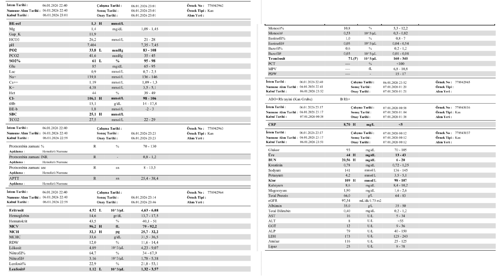

> **Başvuruda dikkat çeken bulgular** (görsel detayından okunduğu kadarıyla):
> * Hemogramda **eritrosit serisi normal** veya hafif düşük (Hb ~13)
> * **Trombosit ÇOK düşük** -- klinikteki yaygın peteşi-purpura ile uyumlu (genellikle <20-30 K/μL bekleriz)
> * Lökositler normal aralıkta
> * Biyokimya parametreleri büyük ölçüde normal sınırlarda

### Klinik Seyir (07.01.2026)

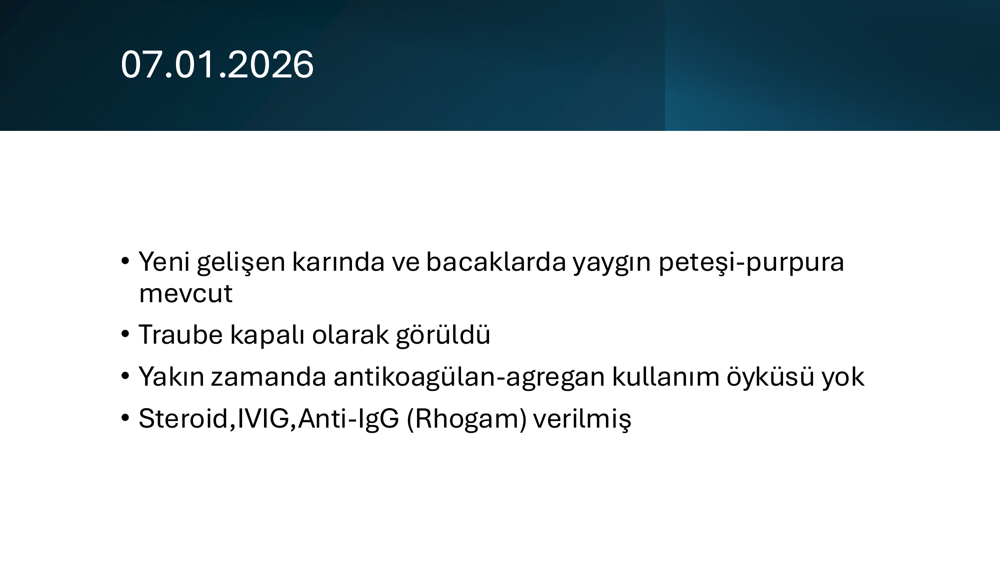

- **Yeni gelişen** karında ve bacaklarda **yaygın peteşi-purpura**
- **Traube kapalı** (splenomegali **yok**)
- Yakın zamanda antikoagulan/agregan kullanımı yok
- **Verilen tedavi:** **Steroid + IVIG + Anti-IgG (Rhogam = Anti-D)**

### Son Durum (27.01.2026)

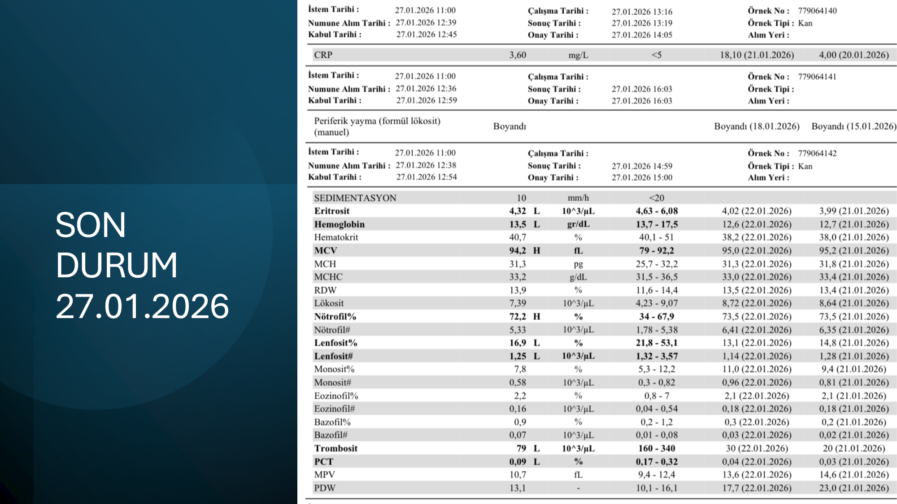

| Parametre | Değer | Referans | Yorum |
|---|---|---|---|
| Eritrosit | 4.32 | 4.63-6.08 | Sınırda düşük |
| **Hemoglobin** | **13.5** g/dL | 13.7-17.5 | ✅ Normal sınırda |
| Hematokrit | 40.7 | 40.1-51 | Normal |
| **MCV** | **94.2** fL | 80-92 | Hafif makrositer (steroid/iyileşme) |
| RDW | 16.84% | 11-14 | ↑ Anizositoz |
| **Lökosit** | **16.94** K/μL | 4-10 | ↑ Lökositoz (steroid etkisi) |
| **Nötrofil%** | **72.2%** | 40-70 | ↑ Nötrofili (steroid) |
| Lenfosit% | 5.33% | 20-40 | ↓ Lenfopeni (steroid) |
| Lenfosit# | 1.25 | 1-4 | Normal sınırda |
| **Trombosit** | **99** K/μL | 150-400 | ↓ Hala trombositopenik ama düzelmiş (başlangıçta muhtemelen <20) |

### Önemli Bulgular ve Yorum

> **🚨 KRİTİK ÖZELLİKLER:**
>
> * **İzole trombositopeni** (eritrosit ve lökosit normal) + **mukokutanöz kanama** (peteşi-purpura, dudak ülseri) → klasik **ITP tablosu**
> * **Splenomegali YOK** (Traube kapalı) → primer ITP destekleyici (sekonder nedenlerde sıklıkla splenomegali olur)
> * Antikoagulan/ilaç yok → ilaç ilişkili trombositopeni dışlanmış
> * Tedavi yanıtı: 21 günde Plt 99'a yükselmiş (başlangıç değerine göre), **kısmi yanıt**
> * SON DURUMda **lökositoz + nötrofili + lenfopeni** → **steroid kullanımının klasik etkisi**
> * Anti-D verilmiş → hasta **Rh pozitif** olmalı (Anti-D sadece RhD+ ITP'de etkili)

### Olası Tanılar (Ön Tanılar)

| Olasılık | Tanı | Destekleyen / Aleyhe |
|---|---|---|
| **Çok güçlü** | **Primer (idiyopatik) ITP** | İzole trombositopeni + mukokutanöz kanama + splenomegali yok + tedaviye yanıt |
| **Düşünülmeli** | **Sekonder ITP** | Yaş 60 (ileri yaş!) -- sekonder nedenler dışlanmalı: HIV, HCV, KLL, lenfoma, SLE |
| Olası | Akut viral enfeksiyon (CMV, EBV, HIV) | Dudak ülseri viral enf. de düşündürür |
| Olası | İlk başvuruda blastik lösemi | İzole trombositopeni AML M7'nin başlangıcı olabilir; dışlanmalı |
| Olası | **Behçet hastalığı** | Tekrarlayan oral aft + trombositopeni birlikteliği nadir ama bildirilmiş |
| Daha az olası | Kemik iliği infiltrasyonu | Hb ve WBC normal, izole trombositopeni; aleyhine |

### İleri İnceleme Önerisi

> **🔑 60 yaş üstü "ITP" hastasında MUTLAKA dışlanması gerekenler:**
>
> 1. **Periferik yayma** -- şistosit (TMA), büyük trombositler (kalıtsal), blast (lösemi), atipik lenfosit (KLL)
> 2. **HIV, HCV, HBV serolojisi**
> 3. **ANA, anti-dsDNA, antifosfolipid antikorlar**
> 4. **DAT (direkt antiglobulin)** -- Evans sendromu dışlanması
> 5. **H. pylori** (eradicasyon trombositi yükseltebilir)
> 6. **TSH, immunoglobulinler (CVID şüphesi)**
> 7. **Periferik kan akım sitometri** (KLL klonu)
> 8. **>60 yaş ICR önerisi:** Kemik iliği aspirasyon + biyopsi (MDS, lösemi, lenfoma dışlanması)

### Uygulanan Tedavinin Açıklaması

| İlaç | Mekanizma | Etki Süresi | Endikasyon |
|---|---|---|---|
| **Kortikosteroid** (prednizolon 1-2 mg/kg veya pulse deksametazon 40 mg × 4 gün) | Antikor üretimini ve makrofaj fagositozunu azaltır | 1-2 hafta | İlk basamak |
| **IVIG** (1 g/kg, 1-2 gün) | Fc reseptör blokajı + anti-idiyotipik antikorlar | 1-4 gün (geçici) | Hızlı yanıt gerekiyorsa (acil cerrahi, ciddi kanama) |
| **Anti-D (Rhogam)** (50-75 μg/kg IV) | Sadece **RhD+** dalağı olan hastada eritrosit kaplamasıyla makrofaj meşguliyeti → trombosit fagositozunu azaltır | 1-3 gün | Splenektomi olmamış RhD+ hastada steroid alternatifi |

---

## OLGU 2 -- SICAK OTOİMMUN HEMOLİTİK ANEMİ (wAIHA)

### Anamnez

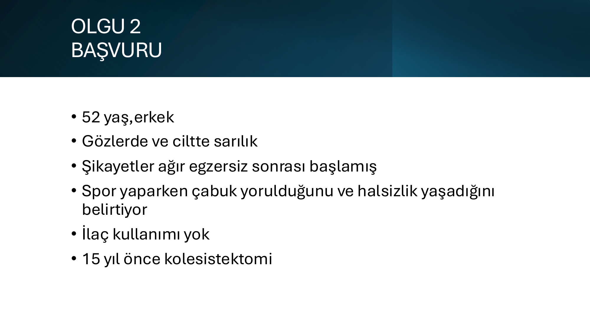

**Hasta profili:**
- **52 yaş, erkek**
- **Şikayet:**
  - Gözlerde ve ciltte **sarılık (ikter)**
  - **Ağır egzersiz sonrası başlangıç**
  - Spor yaparken **çabuk yorulma**, **halsizlik**
- **İlaç kullanımı:** Yok
- **Özgeçmiş:** **15 yıl önce kolesistektomi** (öyküde önemli! kronik hemoliz/safra taşı geçmişi)

### Tetkikler

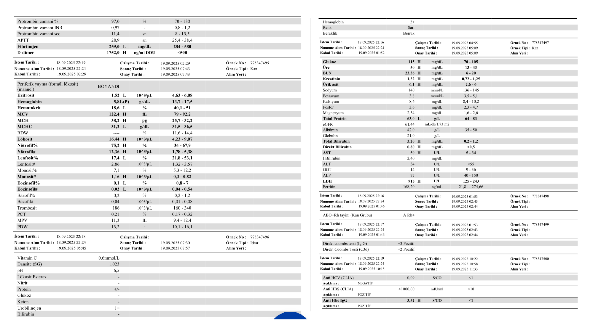

### Klinik ve Laboratuvar Bulgular

#### Periferik Yayma (PY) Bulguları

| Bulgu | Anlamı |
|---|---|
| **Eritrositler makrositer** | İleri retikülositoz (genç eritrositler büyük) veya megaloblastik komponent |
| **%3 polikromazi** | ↑ Retikülosit (kemik iliği yanıtı aktif) |
| **Howell-Jolly cisimciği** | Splenektomi/asplenizm benzeri tablo (dalak fonksiyon kaybı) **veya** eritroid hiperplazide nükleer kalıntılar |
| **Sferosit içinde Cabot halkası** | Sferositoz (otoimmun hemoliz lehine) + Cabot halkası (megaloblastik veya eritroid stres göstergesi) |
| **%3 normoblast** | Kemik iliği aşırı uyarılmış, çekirdekli eritrositler periferiye çıkıyor |
| **Hipersegmente nötrofil (?)** | Megaloblastik komponent şüphesi (B12/folat eksikliği) |

#### Kemik İliği Aspirasyon Biyopsi (KİAB)

| Bulgu | Anlamı |
|---|---|
| **%70 hipersellüler** | Aşırı aktif kemik iliği |
| **Miyeloid/Eritroid (M/E) oranı 4/1** | ⚠️ Normalde 2-4/1; **eritroid serinin görece az olması beklenmez** -- "displazili eritroid yetersiz cevap" düşündürür |
| **Eritroid + megakaryosit displazisi** | MDS komponenti? Yoksa otoimmun stresin sekonder displazisi? Önemli ayırıcı tanı |

#### Fizik Muayene (FM)

- **Splenomegali kot altı 7 cm** (belirgin)
- **Skleralar ve cilt ikterik**
- **Konjunktivalar soluk** (anemi)

#### İmmunohematoloji (OİHA)

- **Direkt Coombs (DAT) IgG +++**
- **C3d ++**

### Tanı: Sıcak Otoimmun Hemolitik Anemi (wAIHA) -- Olası Mikst Komponent

> **🚨 TANI ANAHTARLARI:**
>
> * **DAT IgG+++ ile C3d++** birlikte → **karışık (mikst) AİHA paterni** veya ağır wAIHA
> * **Sferosit + sarılık + splenomegali + retikülositoz + KİAB hipersellüler** → klasik **ekstravasküler hemoliz** tablosu (sıcak AİHA dalakta yıkım yapar)
> * **15 yıl önce kolesistektomi** → uzun süredir devam eden subklinik hemoliz olasılığı (pigment safra taşı)
> * **Egzersiz tetiklemiş ataksı** → kompansatuvar mekanizmaların aşıldığı an
> * Eritroid/megakaryosit displazisi → **MDS koeksistensi** veya stres-displazi ayrımı için yeterli sürede izlem gerekli

### Tedavi

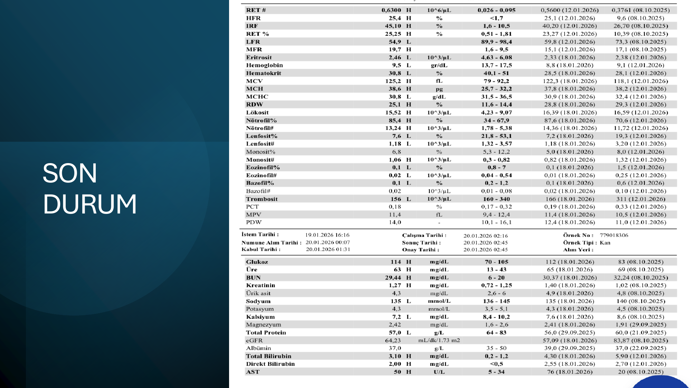

- **Rituksimab + steroid** verilmiş
- Şu an **aktif olarak Rituksimab tedavisi** alıyor

### Tedavi Mantığı

| Tedavi | Mekanizma | wAIHA'da Yer |
|---|---|---|
| **Kortikosteroid** (prednizolon 1 mg/kg/gün) | İmmun supresyon, antikor üretiminde azalma, makrofaj fagositozunu baskı | **Birinci basamak** -- %70-80 yanıt; remisyon ~%30 |
| **Rituksimab** (375 mg/m² × 4 hafta veya 1 g × 2) | **Anti-CD20** -- B hücre deplesyonu → otoantikor üretimini azaltır | **İkinci basamak veya steroid azaltırken** -- yanıt %80'lere ulaşır |
| **Splenektomi** | Antikor üreten dokunun fiziksel uzaklaştırılması + makrofaj fagositoz alanı kaybı | İkinci-üçüncü basamak (rituksimab başarısızsa) |
| **İmmunsüpresif** (azatiyopürin, mikofenolat, siklosporin) | Geniş immun supresyon | Refrakter durumlar |
| **Yeni:** Sutimlimab (anti-C1s) | Klasik kompleman yolu inhibitörü | Soğuk aglütinin hastalığı; mikst tipte de denenebilir |

### Önemli Klinik Pearl

> **🔑 wAIHA'da DAT profili:**
> * **Sadece IgG**: Klasik wAIHA -- ekstravasküler hemoliz, dalakta IgG-Fc reseptörü ile fagositoz
> * **IgG + C3d**: Daha ağır seyirli; kompleman aktivasyonu var → **mikst tip** olabilir
> * **Sadece C3d**: Soğuk aglütinin hastalığı (CAD) düşünülür
> * **Direkt negatif AİHA**: %5-10; "DAT-negative AIHA" -- daha hassas yöntemler (gel column, mikrokolon, flow) gerekli

> **🔑 Sferosit ne zaman herediter, ne zaman edinsel?**
> * **Aile öyküsü, ozmotik frajilite ↑, EMA bağlanma testi negatif** → **Herediter sferositoz**
> * **DAT pozitif, sferositoz akut başlangıçlı** → **Sıcak AİHA** (hocanın olgusunda olduğu gibi)

---

## OLGU 3 -- BLASTİK FAZ KRONİK MİYELOİD LÖSEMİ (KML)

### Anamnez (Başvuru -- 03.12.2025)

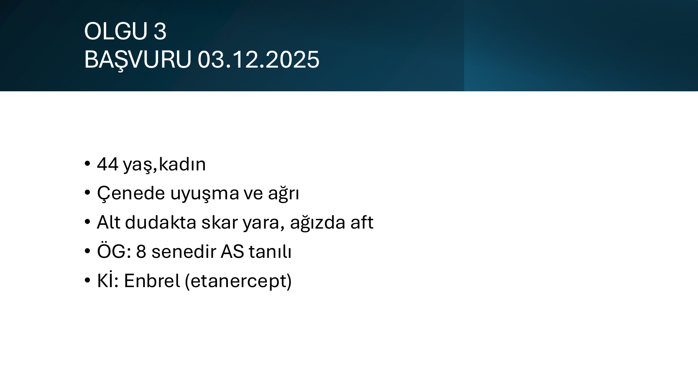

**Hasta profili:**
- **44 yaş, kadın**
- **Şikayet:**
  - **Çenede uyuşma ve ağrı**
  - Alt dudakta **skar yara**
  - Ağızda **aft**
- **Özgeçmiş:** **8 senedir AS (ankilozan spondilit)** tanılı
- **Kronik ilaç:** **Enbrel (etanercept)** -- TNF-α inhibitörü

> **⚠️ Anamnez ipuçları:** Kemik ağrısı (çene), oral lezyonlar, kronik immunsupresyon → kemik iliği patolojisi düşünülmelidir.

### Başvuru Tetkikleri

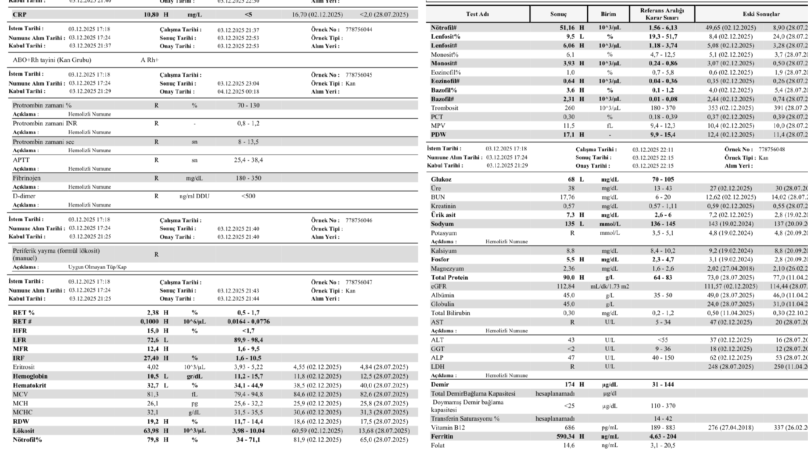

### Tanısal Süreç

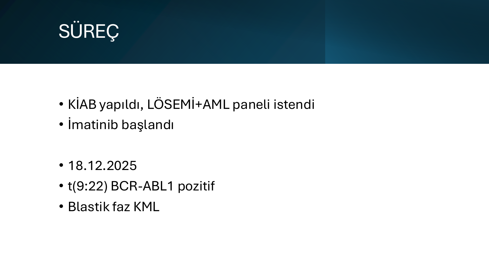

**Süreç:**
1. **KİAB yapıldı** + **Lösemi + AML paneli** istendi
2. **İmatinib (Gleevec) başlandı** -- ampirik (BCR-ABL sonucu beklenmeden, klinik şüphe yüksekti)
3. **18.12.2025**: **t(9;22) BCR-ABL1 pozitif** sonuçlandı
4. **Tanı: Blastik Faz Kronik Miyeloid Lösemi (KML-BC)**

### KML Faz Sınıflaması (Kontekst)

| Faz | Periferik kan veya kemik iliği blast oranı | Klinik | Prognoz |
|---|---|---|---|
| **Kronik faz (KP)** | <%10 blast | Genelde asemptomatik veya hafif sitopeni | İyi (TKİ ile ~normal yaşam beklentisi) |
| **Akselere faz (AP)** | %10-19 blast, periferik bazofili ≥%20, Plt <100K veya >1000K, sitogenetik klonal evrim | Splenomegali artışı, sitopeniler | Kötüleşmiş |
| **Blastik faz (BC)** | **≥%20 blast** veya ekstramedüller blast proliferasyonu | Akut lösemi gibi seyreder; ağır sitopeni, kemik ağrısı, ekstramedüller hastalık | **ÇOK KÖTÜ** (median sürvi 6-12 ay) |

### 18.12.2025 Hemogram (Tanı Anı)

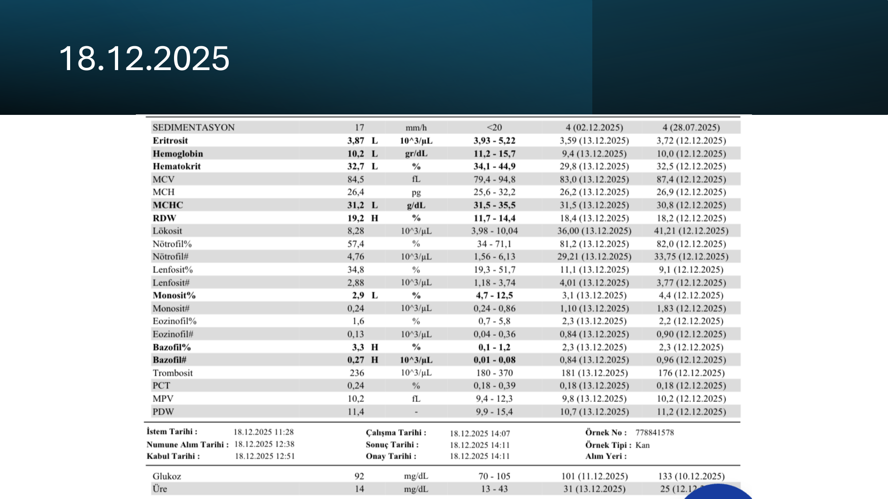

| Parametre | Değer | Yorum |
|---|---|---|
| Eritrosit | 3.87 L | ↓ |
| **Hemoglobin** | **10.2** g/dL | ↓ Orta anemi |
| Hematokrit | 32.7 | ↓ |
| MCV | 84.5 | Normositer |
| MCH | 26.4 | Normal |
| MCHC | 31.2 L | Hafif düşük |
| **RDW** | **19.2%** | ↑ Belirgin anizositoz |
| Lökosit | 8.28 | Normal |
| Nötrofil% | ~67 | Normal |
| Lenfosit% | ~25 | Normal |
| Trombosit | 256 | Normal |

> **⚠️ Hemogramın yanıltıcılığı:** Tanı anında lökosit ve trombosit normal! Bu, klasik kronik faz KML'den farklı -- "**alösemik blastik faz**" veya **kemik iliğinde blast var ama henüz periferiye dökülmemiş** olabilir. **Anizositoz (RDW 19.2)** tek alarm sinyali; ama tek başına yetmez.
>
> **🔑 Klinik öğrenim:** Hemogramı normal görüp gönderme tehlikesi vardır -- klinik şüphe (kemik ağrısı, oral lezyon, immunsupresyon altında) yüksekse **KİAB istemekten kaçınılmamalıdır**.

### 12.01.2026 Hemogram (İlerlemiş Tablo)

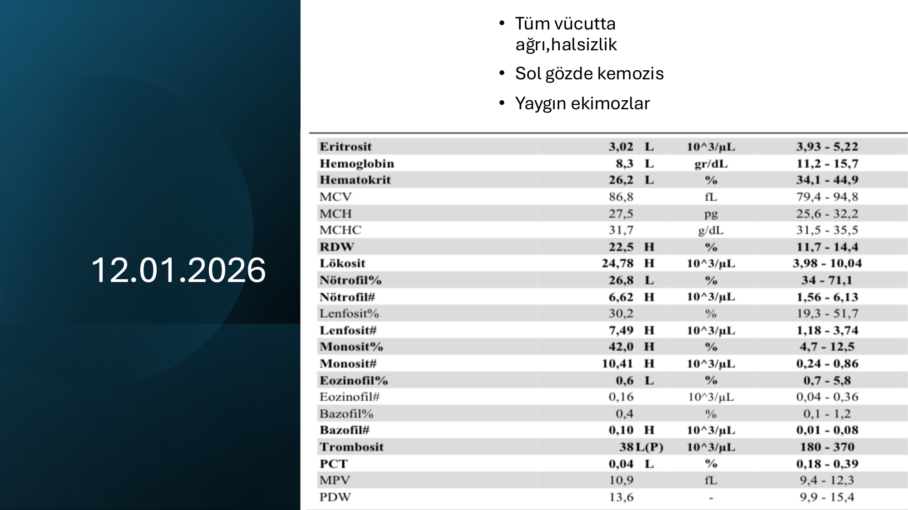

**Klinik:** Tüm vücutta ağrı, halsizlik, **sol gözde kemozis**, **yaygın ekimozlar**

| Parametre | Değer | Yorum |
|---|---|---|
| Eritrosit | 3.02 L | ↓↓ |
| **Hemoglobin** | **8.3** g/dL | ↓↓ Ağır anemi |
| Hematokrit | 26.2 | ↓↓ |
| **RDW** | **22.5%** | ↑↑↑ Çok yüksek anizositoz |
| **Lökosit** | **24.78** K/μL | ↑↑ Belirgin lökositoz |
| Nötrofil# | 26.8 (?) | Yüksek |
| Lenfosit% | 30.2 | -- |
| **Monosit#** | **7.49** K/μL | ↑↑↑ Çok yüksek monositoz |
| **Trombosit** | **38** K/μL | ↓↓↓ Ağır trombositopeni |

> **🚨 İLERLEMİŞ TABLO:**
> * 1 ay içinde **anemi derinleşmiş, lökositoz gelişmiş, ağır trombositopeni** (38) ortaya çıkmış
> * **Yaygın ekimoz** -- trombositopeniye bağlı
> * **Kemozis** -- konjunktival ödem; ekstramedüller blast infiltrasyonu olabilir (KML-BC'de görülür)
> * **Mutlak monositoz 7.49** -- KML blastik fazda (özellikle miyeloid blastik tip) tipik
> * RDW 22.5 -- transfüzyon ve eritroid stresin ortak göstergesi

### Son Durum (22.01.2026)

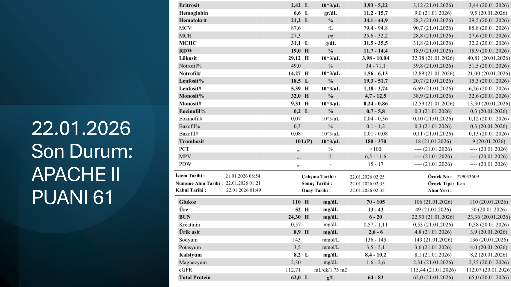

**APACHE II Puanı: 61** -- olağanüstü yüksek; **mortalite tahmini >%85**

| Parametre | Değer | Yorum |
|---|---|---|
| Eritrosit | 2.42 L | ↓↓↓ |
| **Hemoglobin** | **6.6** g/dL | ↓↓↓ **Çok ağır anemi** |
| Hematokrit | 21.2 L | ↓↓↓ |
| MCV | 87.6 | Normositer |
| RDW | 19.0 | ↑ |
| **Lökosit** | **14.27** | ↑ |
| **Trombosit** | **101** (P) | (P) **psödo-trombositopeni** -- sayım hatası şüphesi (sitratlı tüpte tekrar) |

> **🔑 Sonuç:** Tanıdan ~50 gün içinde **çoklu organ yetmezliği + ağır pansitopeni + kritik klinik tablo**. Blastik faz KML imatinib tek başına genellikle yetersizdir; **dasatinib (T315I dışında 2. nesil TKİ) + AML/ALL tipi indüksiyon kemoterapisi + allojeneik kök hücre nakli** standart yaklaşımdır.

### KML Blastik Faz Tedavi Mantığı (Kontekst)

| Adım | Tedavi |
|---|---|
| **1. TKİ değişikliği** | İmatinib → **2./3. nesil TKİ** (dasatinib, nilotinib, ponatinib) -- mutasyon analizine göre |
| **2. İndüksiyon kemoterapisi** | Miyeloid BC: AML benzeri (7+3); Lenfoid BC: ALL benzeri (HyperCVAD ± rituksimab) |
| **3. Allojeneik kök hücre nakli** | Yanıt sonrası **tek küratif tedavi** |
| **Destek** | Trombosit transfüzyonu, eritrosit transfüzyonu, ürik asit kontrolü (TLS), profilaktik antibiyotik |

### Önemli Klinik Pearl

> **🔑 "Periferik yayma normal" güvenilmez:**
> * KML kronik fazda lökositoz beklenir; ama blastik fazda paradoksal olarak başlangıçta lökosit **normal** olabilir
> * **Tek alarm: anizositoz (RDW), klinik şüphe, kemik ağrısı, ekstramedüller bulgular**
>
> **🔑 TNF-α inhibitör altında lösemi:**
> * Etanercept, infliximab gibi TNF inhibitörlerinin **lösemi insidansını artırdığı kesin değil** ama olgu sunumları mevcut
> * Bu hastada AS + Enbrel kullanımı ile blastik KML birlikteliği çağrıştırıcı
> * Yine de KML'in t(9;22) sporadik bir mutasyon hastalığıdır; nedensellik kanıtlı değil

---

## OLGU 4 -- APLASTİK ANEMİ (İLAÇ İLİŞKİLİ ŞÜPHESİ)

### Anamnez (Başvuru -- 08.01.2026)

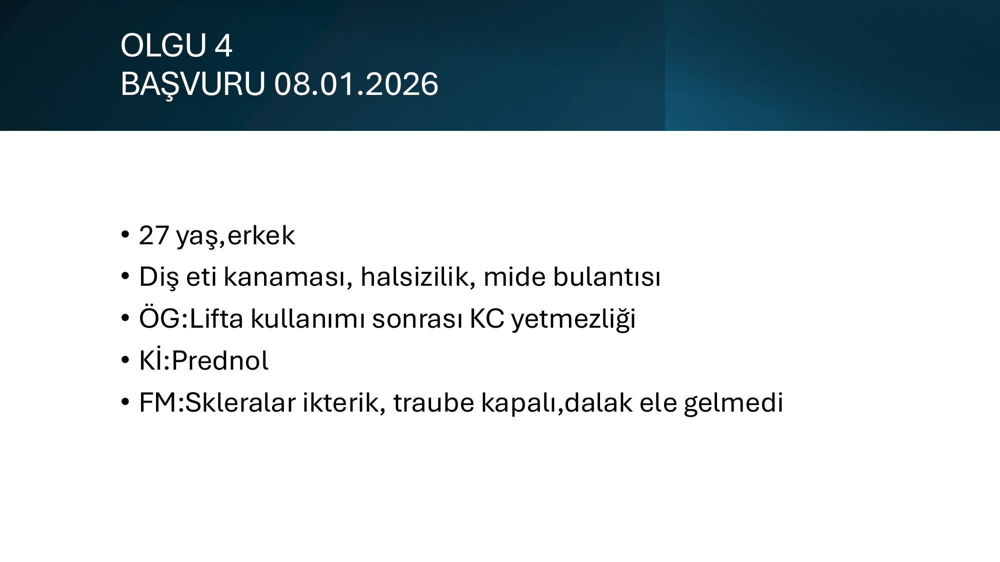

**Hasta profili:**
- **27 yaş, erkek**
- **Şikayet:**
  - **Diş eti kanaması**
  - Halsizlik
  - Mide bulantısı
- **Özgeçmiş:** **Lifta (tadalafil) kullanımı sonrası KARACİĞER YETMEZLİĞİ**
- **Kronik ilaç:** **Prednol** (metilprednizolon)
- **FM:**
  - Skleralar **ikterik**
  - **Traube kapalı**, **dalak ele gelmedi** (splenomegali yok)

> **⚠️ Anamnez kritik:** Genç erişkinde **ilaç ilişkili karaciğer hasarı** ve **trombositopeni klasik bulgu** (diş eti kanaması) → ilaç ilişkili pansitopeni / aplastik anemi düşünülmeli.

### Başvuru Hemogram

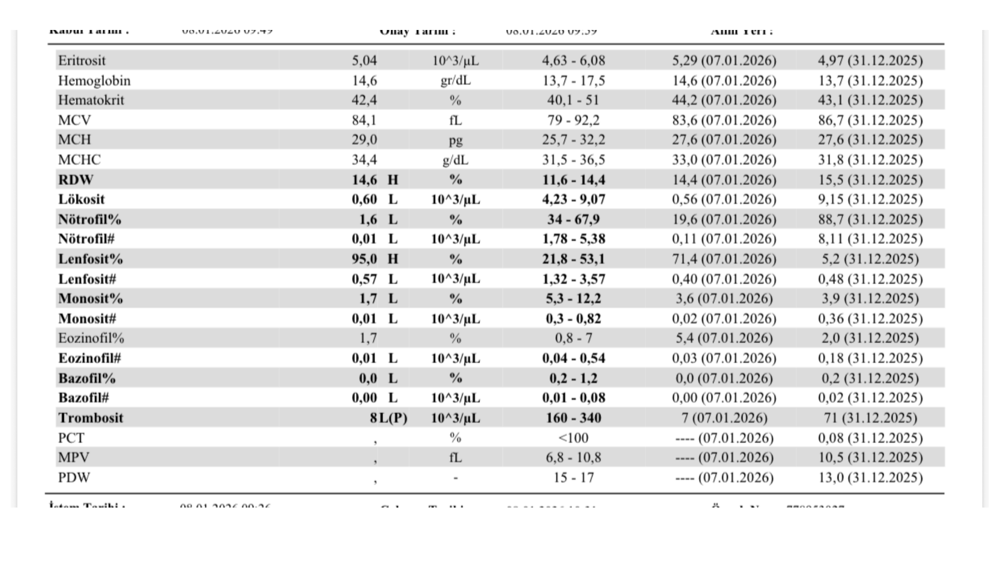

| Parametre | Değer | Referans | Yorum |
|---|---|---|---|
| Eritrosit | 5.04 | 4.63-6.08 | Normal |
| **Hemoglobin** | **14.6** g/dL | 13.7-17.5 | ✅ Normal (henüz) |
| Hematokrit | 42.4 | 40.1-51 | Normal |
| **MCV** | **78.7** L | 80-94 | ↓ Hafif mikrositer |
| MCH | 29.0 | 27-32 | Normal |
| RDW | 14.6 H | 11-14 | ↑ Hafif anizositoz |
| **Lökosit** | **0.60** K/μL | 4-10 | ↓↓↓ **Çok ağır lökopeni** |
| Nötrofil% | 1.6 L | 40-70 | ↓↓↓ |
| **Nötrofil# (ANC)** | **0.01** K/μL | 1.5-7.7 | ↓↓↓↓ **AGRANÜLOSİTOZ** -- olağanüstü düşük |
| Lenfosit% | 95.0 H | 20-40 | ↑ (göreceli) |
| Lenfosit# | 0.57 L | 1-4 | ↓ Mutlak lenfopeni |
| Monosit# | 0.01 L | 0.2-0.8 | ↓↓↓ |
| Eozinofil# | 0.0 L | 0.04-0.4 | ↓↓ |
| **Trombosit** | **81** (P) K/μL | 150-400 | ↓↓ Trombositopeni |

> **🚨 ACİL DURUM:**
> * **ANC = 0.01 K/μL → MUTLAK AGRANÜLOSİTOZ** -- enfeksiyon riski **olağanüstü yüksek**, ölümcül sepsis tehlikesi
> * Eritrosit serisi başlangıçta korunmuş (Hb 14.6) -- bu **akut başlayan miyeloid yetmezlik** lehine; eritrosit yarı ömrü uzun (~120 gün), yeni başlamış kemik iliği yetmezliğinde Hb son düşer
> * Trombositopeni (81) -- diş eti kanamasını açıklar
> * MCV mikrositere kayma → komorbid demir eksikliği ya da kronik hastalık etkisi olabilir

### Kemik İliği Aspirasyon Biyopsi (KİAB)

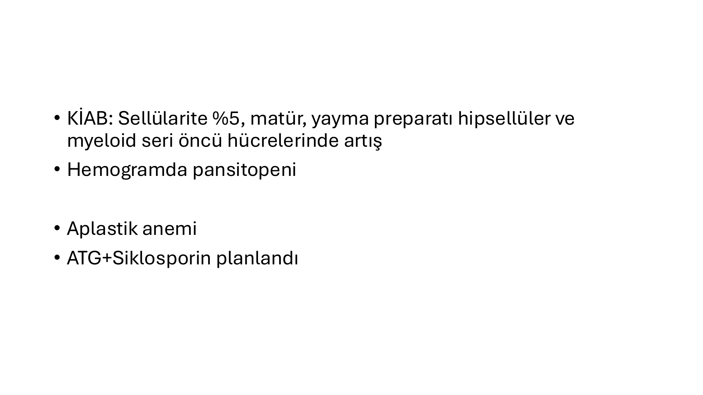

**KİAB:**
- **Sellülarite %5** (normal: %30-70 erişkin) → **HİPOSELLÜLER (aplastik) kemik iliği**
- Matür hücreler hakim
- Yayma preparatı hiposellüler
- Miyeloid seri **öncü hücrelerinde artış**

**Tanı:** **APLASTİK ANEMİ**

**Planlanan tedavi:** **ATG + Siklosporin** (immunsüpresif kombinasyon -- IST)

### Aplastik Anemi -- Sınıflama (Kontekst)

| Şiddet | Kemik iliği sellülaritesi | ANC | Trombosit | Retikülosit |
|---|---|---|---|---|
| **Hafif (NSAA)** | <%30 | ≥0.5 | ≥20 | -- |
| **Ağır (SAA)** | <%25 | <0.5 | <20 | <60 K/μL |
| **Çok ağır (vSAA)** | <%25 | **<0.2** | <20 | <60 K/μL |

> **🔑 Bu hastada:** ANC 0.01 → **çok ağır aplastik anemi (vSAA)** kategorisinde

### Aplastik Anemi -- Etiyoloji

| Kategori | Örnekler |
|---|---|
| **İdiyopatik** | %70-80 olgu (otoimmun mekanizma) |
| **İlaçlar** | Klorampenikol, sülfonamid, antiepileptik (fenitoin, karbamazepin), NSAİ, altın, **kemoterapötikler**, **antitiroid (PTU, MMI)** |
| **Toksinler** | Benzen, böcek ilaçları, radyasyon |
| **Viral** | **Hepatit (HAV, HBV, HCV, HEV)** -- klasik tablo: hepatit sonrası aplastik anemi (özellikle non-A-B-C-D-E "seronegatif hepatit"), parvovirüs B19, EBV, CMV, HIV |
| **Kalıtsal** | Fanconi anemisi, diskeratozis konjenita, Schwachman-Diamond |
| **PNH ile birliktelik** | Aplastik anemi + PNH klonu sık birlikte |
| **Otoimmun** | SLE, eosinofilik fasiit |

> **🔑 Bu olguda en güçlü etiyolojik şüphe:** **Lifta (tadalafil) sonrası karaciğer yetmezliği** öyküsü → **Hepatit-ilişkili (post-hepatit) aplastik anemi**. Klasik olarak akut hepatit atağından **2-3 ay sonra** ortaya çıkar. Tadalafil aslında nadir hepatotoksisite yapar; muhtemelen viral hepatit komorbiditesi olabilir.

### Aplastik Anemi Tedavisi (Kontekst)

| Tedavi | Endikasyon |
|---|---|
| **Allojeneik kök hücre nakli (HSCT)** | <40 yaş + matched donor varsa **birinci basamak** -- küratif |
| **İmmunsüpresif tedavi (IST)** -- ATG + Siklosporin + Eltrombopag | Donor yoksa, >40 yaş, veya nakil hazırlığı sırasında köprü |
| **Eltrombopag (TPO-RA)** | Refrakter olgularda IST'ye eklenir; standart kombinasyona girdi |
| **Destek tedavi** | Nötropenik proflaksi, transfüzyon (CMV-negatif, ışınlanmış), G-CSF (dikkatli) |

### Son Durum (01.02.2026)

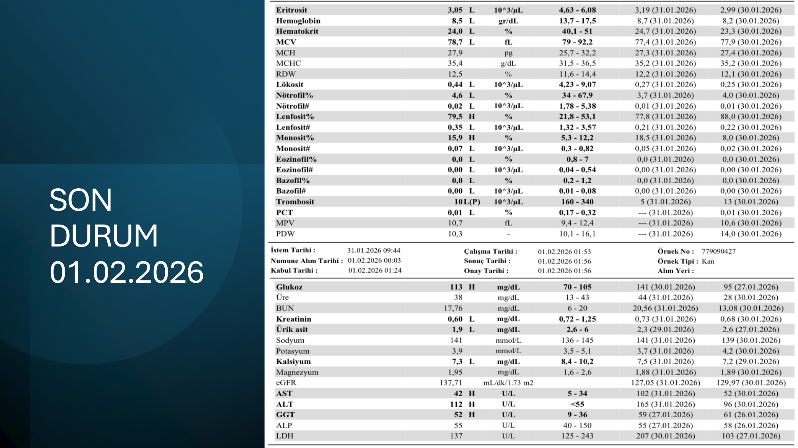

| Parametre | Değer | Referans | Yorum |
|---|---|---|---|
| Eritrosit | 3.05 L | 4.63-6.08 | ↓↓ |
| **Hemoglobin** | **8.5** g/dL | 13.7-17.5 | ↓↓ Belirgin düşüş (14.6 → 8.5 -- transfüzyon ihtiyacı) |
| Hematokrit | 24.0 L | 40.1-51 | ↓↓ |
| MCV | 78.7 L | 80-94 | Mikrositer (sürüyor) |
| RDW | 12.5 | 11-14 | Normal |
| **Lökosit** | **0.44** K/μL | 4-10 | ↓↓↓ Hala kritik düşük |
| Nötrofil# | 0.02 L | 1.5-7.7 | ↓↓↓ Hala agranülositoz |
| Lenfosit# | 0.35 | 1-4 | ↓↓ |
| **Trombosit** | **101** (P) K/μL | 150-400 | ↓ Hafif düzelme |

> **🔑 Klinik seyir:** ATG+Siklosporin tedavisinin yanıt vermesi 3-6 ay sürebilir. Bu hasta tedavinin başlangıç dönemindedir; hâlâ **şiddetli nötropenik** ve enfeksiyon riski altında. **Trombosit hafif düzelmiş** ancak eritrosit serisi yeni etkilenmeye başlamış (Hb 14.6 → 8.5).

---

## SENTEZ VE GENEL ÖĞRETİCİ NOKTALAR

### 4 Olgu Karşılaştırması

| Özellik | Olgu 1 | Olgu 2 | Olgu 3 | Olgu 4 |
|---|---|---|---|---|
| **Yaş/Cinsiyet** | 60 E | 52 E | 44 K | 27 E |
| **Ana şikayet** | Dudak ülseri + peteşi | Sarılık + halsizlik | Çene ağrısı + aft | Diş eti kanaması |
| **Anamnez ipucu** | Yok (idiyopatik) | Eski kolesistektomi | AS + etanercept | Lifta + KC yetmezliği |
| **Hb** | Normal/sınırda | ↓↓ | 10.2 → 6.6 | 14.6 → 8.5 |
| **Lökosit** | Normal | Normal | 8 → 25 → 14 | 0.6 → 0.44 (agranülositoz) |
| **Trombosit** | Çok düşük → 99 | Düşmüş | 256 → 38 → 101 | 81 → 101 |
| **Splenomegali** | Yok | 7 cm var | -- | Yok |
| **PY/KİAB anahtar** | İzole trombositopeni | Sferosit + normoblast + KİAB hipersellüler displazi | Blast (KİAB) | Sellülarite %5 |
| **Tanı** | **Primer ITP** | **Sıcak AİHA (mikst?)** | **Blastik faz KML** | **Çok ağır aplastik anemi** |
| **Kalıcı/genetik bulgu** | -- | DAT IgG+++/C3d++ | t(9;22) BCR-ABL1 | -- |
| **Tedavi** | Steroid + IVIG + Anti-D | Rituksimab + steroid | İmatinib (yetersiz) | ATG + Siklosporin |
| **Prognoz** | İyi | İyi-orta | **Çok kötü** (APACHE II 61) | Belirsiz, IST yanıtına bağlı |

### Bu 4 Olgudan Çıkan Klinik Öğrenimler

> **🔑 1. Hemogram sınıflamasının yanıltıcılığı:**
> Olgu 3'te tanı anında hemogram **neredeyse normal** (lökosit 8.28, Plt 256) -- ama klinik şüphe ve **anizositoz (RDW 19.2)** KİAB'ı zorunlu kıldı. **Hemogram her zaman tanıyı yansıtmaz**.

> **🔑 2. ITP'de yaş kritik:**
> Olgu 1 -- 60 yaş üstü "ITP" → **mutlaka sekonder nedenler dışlanmalıdır**: HIV, HCV, KLL, lenfoma, MDS, otoimmun. Bu yaşta primer ITP daha az olası, **kemik iliği aspirasyon biyopsisi düşünülmeli**.

> **🔑 3. AİHA'da DAT profili tedavi seçer:**
> Olgu 2 -- IgG+++ ve C3d++ → **mikst tip AİHA olasılığı**. Sadece IgG (klasik wAIHA) tedaviye daha iyi yanıt verir; kompleman komponenti (C3d) eklendikçe rituksimab + steroid + bazen splenektomi gerekebilir.

> **🔑 4. Periferik yayma anlık tanı koydurabilir:**
> Olgu 2'deki **sferosit + polikromazi + normoblast + Howell-Jolly + Cabot halkası** → kemik iliğinin sürekli baskı altında çalıştığını ve ekstravasküler hemolizin aktif olduğunu gösteren **tek bakışta hemoliz tanısı**.

> **🔑 5. KML kronik faz değil, blastik faz beklemek:**
> Olgu 3 -- TNF inhibitörü altında, immünsupresif olduğu için **klasik kronik faz KML** beklemediği gibi (yüksek lökositoz, splenomegali yok), doğrudan **blastik fazla başvurmuş**. APACHE II 61 → ölümcül.

> **🔑 6. ANC <0.5 = ACİL:**
> Olgu 4 -- ANC 0.01 (!!) → **ölümcül sepsis riski**. Ateş bekleme, **profilaktik antibiyotik + nötropenik diyet + izolasyon + PCP profilaksisi** başlanmalı. Kan kültürü + ampirik geniş spektrumlu antibiyotik (örn. piperasilin-tazobaktam ± aminoglikozid).

> **🔑 7. Eritrosit serisi son düşer (Akut KI yetmezliği):**
> Olgu 4'te tanı anında Hb 14.6 ama 3 hafta sonra 8.5'a düşmüş. Eritrosit yarı ömrü ~120 gün; akut başlayan kemik iliği yetmezliğinde **anemi geç ortaya çıkar**. Lökosit (yarı ömrü saatler) ve trombosit (yarı ömrü 7-10 gün) erken etkilenir.

> **🔑 8. (P) işareti psödo-trombositopeni şüphesi:**
> Olgu 3 ve 4'te trombosit değerinin yanındaki **(P)** harfi otomatik sayım cihazının "**uyarı flag**" işaretidir → kümeleşme/aglütinasyon şüphesi. **Sitratlı tüpte tekrar sayım** + periferik yayma ile doğrulanmalıdır.

> **🔑 9. KİAB sellülarite raporu önemli:**
> | Sellülarite | Yorumu |
> |---|---|
> | **<%25** | Hiposelüler -- aplastik anemi |
> | **%30-50** | Normal (yaş bağımlı) |
> | **>%70** | Hipersellüler -- lösemi, MDS, AİHA stresi, kronik hemoliz |
>
> Olgu 2'de **%70 hipersellüler** (otoimmun hemoliz stresi); Olgu 4'te **%5** (çok ağır aplazi).

> **🔑 10. M/E (Miyeloid/Eritroid) oranı:**
> Normal: 2-4/1
> Olgu 2'de **4/1** -- üst sınırda; aslında hemoliz olduğu için eritroid hiperplazi (M/E <2/1) bekleriz. Bu bulgu **eritroid displazisi** veya **hipoplazisinin** olabileceğini düşündürür → MDS koeksistensi olasılığı.

### Hemogram Yorumlamada Genel Akıl Yürütme Çerçevesi

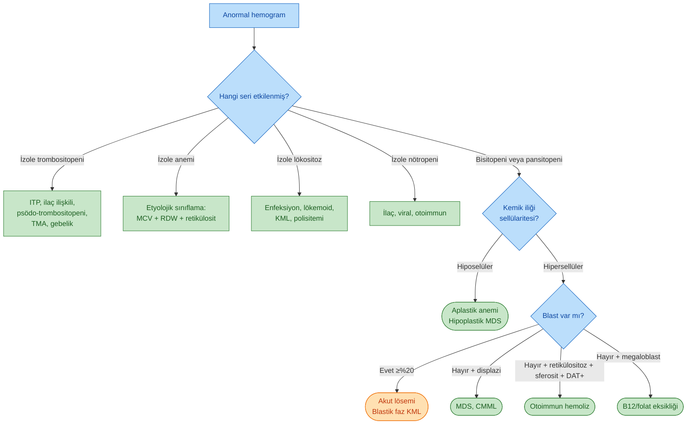

---

## KAYNAK

Prof. Dr. İrfan Yavaşoğlu -- Hemogram Olgu Sunumu (4 olgu), Aydın Adnan Menderes Üniversitesi Tıp Fakültesi, İç Hastalıkları AD - Hematoloji BD.
