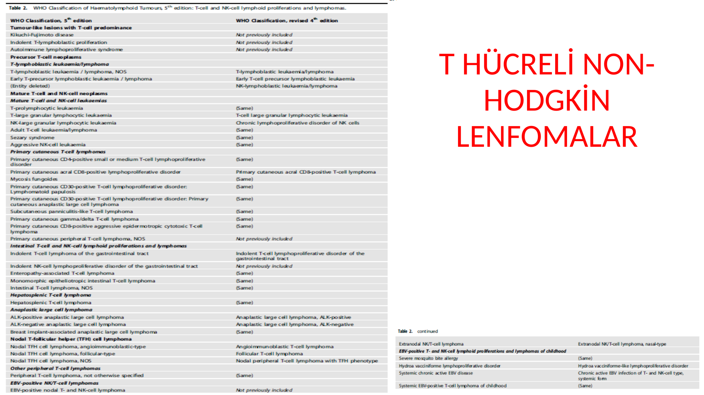
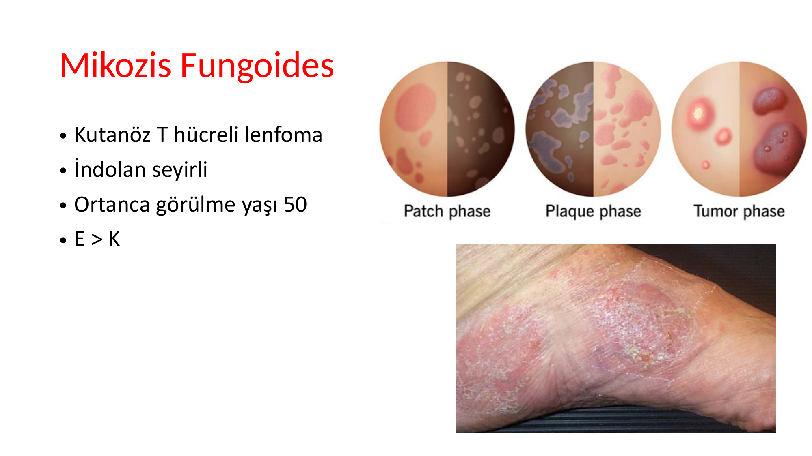
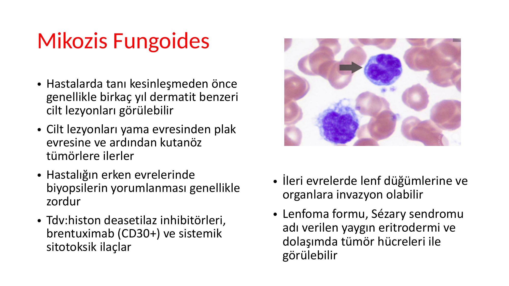

# T HÜCRELİ NON-HODGKİN LENFOMALAR

**Hazırlayan:** Dr. A. Hilal Eroğlu Küçükdiler
**Bölüm:** ADÜ Tıp Fakültesi - Hematoloji
**Tarih:** 2024-2025 Dönem IV

---

## İÇİNDEKİLER

1. [Genel Bilgiler](#genel-bilgiler)
2. [Mikozis Fungoides ve Sézary Sendromu](#mikozis-fungoides-ve-sézary-sendromu)
3. [Periferik T Hücreli Lenfoma, NOS](#periferik-t-hücreli-lenfoma-nos)
4. [Anjioimmünoblastik Lenfoma (AITL)](#anjioimmünoblastik-lenfoma-aitl)
5. [Anaplastik Büyük Hücreli Lenfoma (ALCL)](#anaplastik-büyük-hücreli-lenfoma-alcl)
6. [Yetişkin T Hücreli Lösemi/Lenfoma (ATL)](#yetişkin-t-hücreli-lösemilenfoma-atl)
7. [Ekstranodal NK/T Hücreli Lenfoma, Nazal Tip](#ekstranodal-nkt-hücreli-lenfoma-nazal-tip)
8. [Özet ve Sınav İçin Önemli Noktalar](#özet-ve-sinav-için-önemli-noktalar)

---

## GENEL BİLGİLER

T hücreli NHL'ler, B hücreli NHL'lerden **önemli ölçüde daha nadirdir** (tüm NHL'lerin yaklaşık **%10-15**'i). Biyolojileri hakkındaki bilgi daha az ve tedavi seçenekleri daha az gelişmiştir.

**Genel özellikler:**
* Mikozis fungoides gibi kutanöz lenfomalar ve bazıları spesifik klinik tablo, moleküler veya biyolojik özelliklere göre ayırt edilebilir; ancak çoğu **PTCL-NOS** (periferik T hücreli lenfoma, başka türlü sınıflandırılamayan) kategorisinde yer alır
* Mikozis fungoides gibi bazı T hücreli lenfomalar **indolent** seyir gösterebilir
* ALK(+) Anaplastik büyük hücreli lenfoma gibi bazıları kemoterapi ile tedavi edilebilir
* Ancak **çoğunluğu kötü prognozla** ilişkilidir (B hücreli NHL'lere göre tedavi yanıtı daha düşük)

**⚠️ T hücreli vs B hücreli NHL — Temel Farklar:**

| Özellik | B Hücreli NHL | T Hücreli NHL |
|---|---|---|
| Sıklık | **%85-90** | **%10-15** |
| Prognoz | Genel olarak daha iyi | Genel olarak **daha kötü** |
| Rituksimab yanıtı | Evet (CD20+) | Hayır (CD20-) |
| Tedavi seçenekleri | Daha fazla | Daha sınırlı |
| Kür şansı | Alt tipe göre yüksek olabilir | Genellikle düşük (ALCL ALK+ hariç) |

> 💡 **Sınav notu:** T hücreli NHL'ler genel olarak B hücreli NHL'lere göre **daha kötü prognozludur** ve **rituksimab kullanılamaz** (CD20 negatif). Bu temel farklar sınavlarda sorulabilir.

---

## MİKOZİS FUNGOİDES VE SÉZARY SENDROMU

### Mikozis Fungoides (MF)

* **Kutanöz T hücreli lenfoma** — cilt kökenli en sık lenfoma
* **İndolent seyirli** (yavaş ilerler)
* Ortanca görülme yaşı: **50**
* **E > K**

**Klinik seyir — Karakteristik evre progresyonu:**

| Evre | Özellik | Klinik Görünüm |
|---|---|---|
| **Yama (patch) evresi** | Düz, eritemli, hafif skuamlı lezyonlar | Egzama/dermatite benzer, genellikle güneş görmeyen bölgelerde |
| **Plak evresi** | Kabarık, infiltre, iyi sınırlı plaklar | Deriden kabarık, annüler/serpiginöz |
| **Tümör evresi** | Nodüler, ülsere olabilen kitleler | Derin infiltrasyon, sekonder enfeksiyon riski |

**Önemli klinik bilgiler:**
* Hastalarda tanı kesinleşmeden önce genellikle **birkaç yıl dermatit benzeri cilt lezyonları** görülebilir → Erken evrelerde biyopsilerin yorumlanması zordur
* Cilt lezyonları **yama → plak → kutanöz tümörler** şeklinde ilerler
* İleri evrelerde **lenf düğümlerine ve organlara invazyon** olabilir

### Sézary Sendromu

* Mikozis fungoidesinin **lösemik formu**
* **Yaygın eritrodermi** (tüm vücut cildinin kızarıklığı) + dolaşımda **Sézary hücreleri** (serebriform çekirdekli atipik T lenfositler)
* Klinik triad: **Eritrodermi + generalize lenfadenopati + Sézary hücreleri (periferik kanda)**

### MF/Sézary Tedavisi

| Evre | Tedavi Seçenekleri |
|---|---|
| Erken evre (yama/plak) | Topikal kortikosteroidler, PUVA (psoralen + UVA), topikal nitrogen mustard, topikal retinoidler |
| İleri evre | Histon deasetilaz inhibitörleri (vorinostat, romidepsin), **brentuksimab vedotin** (CD30+), ekstrakorporeal fotoferez, sistemik sitotoksik ilaçlar |

> 💡 **Sınav notu:** Mikozis fungoides sınavların en çok sorulan T hücreli lenfoma konusudur:
> * **Yama → Plak → Tümör** progresyonu patognomoniktir
> * Lösemik formu = **Sézary sendromu** (eritrodermi + Sézary hücreleri)
> * **Sézary hücresi** = serebriform (beyin gibi kıvrımlı) çekirdekli atipik T lenfosit → periferik yaymada görülür
> * Erken evre uzun yıllar indolent seyreder, ancak ileri evrede prognoz kötüleşir
> * "Kronik kaşıntılı egzamatöz döküntü, yıllardır tedaviye dirençli" → MF düşün

---

## PERİFERİK T HÜCRELİ LENFOMA, NOS

* NHL'lerin **%15**'ini oluşturur → T hücreli NHL'ler içinde **en sık** alt tip
* Ortanca başlangıç yaşı: **65**
* Hastaların çoğunda tanı anında **ileri evre** hastalık
* **Kemik iliği, karaciğer, dalak ve cilt tutulumu** yaygın
* **"B" semptomları** ve **kaşıntı** yaygın
* **Reaktif eozinofili** ve **hemofagositik sendrom** (HLH) ile birlikte görülebilir
* Tedavi: **CHOP** veya **CHOEP** (CHOP + etoposid)

**⚠️ ÖNEMLİ — Hemofagositik Sendrom (HLH):**

T hücreli lenfomalarda (özellikle PTCL-NOS ve AITL) tetiklenebilen ciddi bir komplikasyondur. Aşırı sitokin salınımı → makrofaj aktivasyonu → kan hücrelerinin fagositozu. Bulgular: Yüksek ateş, pansitopeni, hepatosplenomegali, hipertrigliseridemi, hiperferritinemi, düşük fibrinojen.

> 💡 **Sınav notu:** T hücreli lenfoma + yüksek ateş + pansitopeni + splenomegali + **çok yüksek ferritin** → **HLH (hemofagositik lenfohistiyositoz)** düşün. Bu tablo acil tedavi gerektirir.

---

## ANJİOİMMÜNOBLASTİK LENFOMA (AITL)

* T hücreli NHL'lerin ~**%20**'sini ve tüm NHL'lerin ~**%4**'ünü oluşturur
* **Folliküler dendritik hücre kökenli** (germinal merkez T helper hücrelerinden)
* Hastaların **%80**'inden fazlasında tanı anında **ileri evre** hastalık
* **Kemik iliği tutulumu** yaygın
* Toplam sağkalım **15-36 ay** (kötü prognoz)

### Klinik Bulgular — Çok Yönlü Prezentasyon

Hastalar çeşitli belirti ve semptomlarla başvurur:
* **Lenfadenopati** (en sık)
* **Hepatosplenomegali**
* **"B" semptomları** (ateş, gece terlemesi, kilo kaybı)
* **Döküntü** (makülopapüler cilt lezyonları)
* **Poliartrit** (otoimmün mekanizma)
* **Hemolitik anemi** (Coombs pozitif otoimmün hemolitik anemi)

### Laboratuvar Bulguları

* **Poliklonal hipergamaglobulinemi** → İmmünolojik disregülasyonun göstergesi (diğer lenfomalarda genellikle monoklonal)
* Yüksek LDH
* **Eozinofili**
* **Pozitif Coombs testi** (otoimmün hemolitik anemi)
* **Fırsatçı enfeksiyonlar** yaygın (immün disregülasyon)

* Tedavi PTCL-NOS ile benzer (CHOP/CHOEP)
* Ortanca yanıt süresi kısa

> 💡 **Sınav notu:** AITL'nin ayırt edici özellikleri sınavlarda sorulur:
> * **Poliklonal hipergamaglobulinemi** → Diğer lenfomalarda olmayan, AITL'ye özgü bulgu
> * **Otoimmün hemolitik anemi** (Coombs +) → Lenfoma + AIHA birlikteliği
> * **Fırsatçı enfeksiyonlar** → İmmün disregülasyon nedeniyle
> * "Yaşlı hasta, lenfadenopati, ateş, döküntü, poliklonal hipergamaglobulinemi, Coombs pozitif" → **AITL** düşün

---

## ANAPLASTİK BÜYÜK HÜCRELİ LENFOMA (ALCL)

* AITL'den sonra **en sık görülen T hücreli lenfoma** (çocuklarda daha sık)
* Tüm hücrelerde **CD30 pozitifliği** karakteristik
* **ALK pozitifliğine** göre iki temel alt gruba ayrılır

### ALK Pozitif vs ALK Negatif ALCL

Vakaların yaklaşık **%40-60**'ında **t(2;5)** bulunur → NPM1 (nükleofosmin-1) geninin bir kısmını **ALK** (anaplastik lenfoma kinaz) geni ile birleştiren translokasyon → Konstitütif tirozin kinaz aktivitesi

| Özellik | ALK Pozitif ALCL | ALK Negatif ALCL |
|---|---|---|
| Ortanca yaş | **34** (genç erişkin) | **58** (ileri yaş) |
| Prognoz | ⭐ **Çok daha iyi** (~%70-80 5 yıllık OS) | ❌ Daha kötü (~%30-40 5 yıllık OS) |
| Translokasyon | **t(2;5)** → NPM1-ALK | Yok |
| Çocuklarda | Daha sık | Nadir |

### Özel Alt Tipler

* **Meme implantı ilişkili ALCL** (BIA-ALCL) — Meme implantı olan hastaların meme dokusunda ortaya çıkan ek, daha yavaş ve olumlu bir alt tip
* **Kutanöz ALCL** — Cilde sınırlı, iyi prognozlu

### Klinik Bulgular

* Kutanöz varyant ve meme implantı ilişkili varyant hariç, çoğu hasta **ekstranodal tutulumlu veya tutulumsuz hızla büyüyen lenfadenopati** ile başvurur
* **"B" semptomları** yaygın

### Tedavi

* **Brentuksimab vedotin + KT kombinasyonu (BV+CHP)** → Birinci basamak standart tedavi
* BV+CHP, CHOP'a göre anlamlı sağkalım avantajı göstermiştir
* Brentuksimab vedotin = anti-**CD30** antikor-ilaç konjugatı

> 💡 **Sınav notu:** ALCL sınavlarda en çok sorulan T hücreli lenfomalardan biridir:
> * **t(2;5) → ALK pozitif** → İyi prognoz, **genç** hasta
> * **CD30 pozitifliği** → Brentuksimab vedotin ile hedeflenebilir (Hodgkin lenfomadaki gibi)
> * ALK pozitif ALCL, T hücreli lenfomalar arasında **en iyi prognoza** sahip alt tiptir
> * **Meme implantı ilişkili ALCL** (BIA-ALCL) güncel ve sınavda sorulabilecek bir konudur
> * "Genç hastada hızlı büyüyen lenfadenopati, biyopside CD30+ büyük anaplastik hücreler, ALK+" → **ALCL**

---

## YETİŞKİN T HÜCRELİ LÖSEMİ/LENFOMA (ATL)

* Genellikle enfekte annelerin **anne sütüyle** bulaşan **HTLV-1** tarafından tetiklenen bir neoplazi
* Enfekte hastaların sadece **%4**'ünde hastalık gelişir
* Teşhis anındaki ortalama yaş: **60**
* Viral enfeksiyon ve viral transformasyon arasındaki süre **uzun** (onlarca yıl)

### Klinik Varyantlar

| Varyant | Sıklık | Sağkalım | Özellikler |
|---|---|---|---|
| **Akut** | **%60** | ~**6 ay** | En sık ve en agresif form |
| **Lenfomatöz** | %20 | ~**10 ay** | Belirgin lenfadenopati |
| **Kronik** | %15 | ~**24 ay** | Daha yavaş seyir |
| **Sinsi (smoldering)** | %5 | Henüz ulaşılmamış | En iyi prognoz |

### Klinik Bulgular

* **Kemik iliği tutulumu**
* **Hiperkalsemi** → ATL'nin en ayırt edici özelliklerinden biri (PTHrP salınımı)
* **Litik kemik lezyonları**
* **Lenfadenopati**
* **Hepatosplenomegali**
* **Cilt lezyonları** (çeşitli morfolojide)
* **Fırsatçı enfeksiyonlar** (özellikle Strongyloides stercoralis, PCP, CMV) → HTLV-1'in CD4+ T hücreleri enfekte etmesi nedeniyle immün yetmezlik

**⚠️ ÖNEMLİ — ATL'de Hiperkalsemi:**

ATL'de hiperkalsemi çok sık ve şiddetli olabilir. Mekanizma: Lösemik hücrelerden **PTHrP** (paratiroid hormon ilişkili peptid) salınımı + **RANKL** üzerinden osteoklast aktivasyonu → Kemik rezorbsiyonu ↑ + renal kalsiyum reabsorbsiyonu ↑.

> 💡 **Sınav notu:** "HTLV-1 pozitif hasta, hiperkalsemi, litik kemik lezyonları, lenfadenopati, cilt lezyonları" → **ATL (akut form)** düşün. HTLV-1 ilişkili iki önemli hastalık: **ATL** (lösemi/lenfoma) ve **HAM/TSP** (HTLV-1 ilişkili miyelopati/tropikal spastik paraparezi). ATL'de **hiperkalsemi** çok belirgin ve sınavlarda sıkça sorulan bir özelliktir.

---

## EKSTRANODAL NK/T HÜCRELİ LENFOMA, NAZAL TİP

* **EBV enfeksiyonu** ile ilişkili (hemen tüm vakalarda EBV pozitif)
* **E > K**
* Tanı anındaki ortanca yaş: **60**
* Özellikle **Asya** ve **Latin Amerika** ülkelerinde daha sık (coğrafi dağılım)

### Klinik Bulgular

* Genellikle **üst solunum ve sindirim sisteminde kitle** ve **obstrüktif semptomlar** ile kendini gösterir
* **Nazal kavite** en sık tutulan bölge → Burun tıkanıklığı, epistaksis, yüzde şişlik
* **"Lethal midline granuloma"** olarak da bilinir → Orta hat yıkımı yapabilir (burun, damak, sinüsler)
* Hastaların **2/3'ünden fazlasında lokalize hastalık** (iyi bir özellik)
* Tanı anında ve tedavinin sonunda **EBV viral yükü** takibi kritik (tedavi yanıtı ve relaps göstergesi)

### Tedavi

* En sık kullanılan tedavi rejimi: **SMILE** (Deksametazon, **Metotreksat**, **İfosfamid**, **L-asparaginaz**, **Etoposid**)
* L-asparaginaz bu lenfomada kritik bir ilaçtır (NK/T hücreli lenfomalar asparagin sentetaz eksikliği gösterir)
* Lokalize hastalıkta **radyoterapi** önemli rol oynar

> 💡 **Sınav notu:** "Nazal kavitede yıkıcı kitle + EBV pozitif + Asya kökenli hasta" → **Ekstranodal NK/T hücreli lenfoma, nazal tip** düşün. Tedavide **L-asparaginaz** içeren rejim (SMILE) kullanılması önemli bir detaydır. EBV viral yükü hastalık aktivitesinin takibinde kullanılır.

---

## ÖZET VE SINAV İÇİN ÖNEMLİ NOKTALAR

### T Hücreli NHL — Hızlı Referans Tablosu

| Lenfoma | Sıklık | Yaş | Ayırt Edici Özellik | İlişkili Ajan | Tedavi |
|---|---|---|---|---|---|
| **Mikozis Fungoides** | Kutanöz en sık | 50 | Yama → Plak → Tümör, Sézary sendromu | — | PUVA, HDAC inh., BV |
| **PTCL-NOS** | T-NHL en sık (%15) | 65 | İleri evre, eozinofili, HLH | — | CHOP/CHOEP |
| **AITL** | T-NHL %20 | İleri yaş | Poliklonal hipergamaglobulinemi, Coombs+, fırsatçı enf. | — | CHOP/CHOEP |
| **ALCL ALK+** | Çocuklarda sık | **34** | ⭐ **t(2;5)**, CD30+, **iyi prognoz** | — | **BV+CHP** |
| **ALCL ALK-** | — | 58 | CD30+, kötü prognoz | — | BV+CHP |
| **ATL** | — | 60 | **Hiperkalsemi**, litik lezyonlar, fırsatçı enf. | **HTLV-1** | KT, antiviraller |
| **NK/T nazal** | Asya'da sık | 60 | Nazal kitle, midline yıkım, **EBV+** | **EBV** | **SMILE** (L-asparaginaz) |

### Sınavda En Çok Sorulan Konular

**1. Mikozis Fungoides:**
* Yama → Plak → Tümör progresyonu
* Sézary sendromu = eritrodermi + Sézary hücreleri (serebriform çekirdek)
* En sık kutanöz lenfoma

**2. ALCL ve ALK durumu:**
* t(2;5) → ALK+ → Genç hasta, **iyi prognoz** (T hücreli NHL'ler arasında en iyi)
* CD30+ → Brentuksimab vedotin ile tedavi
* Meme implantı ilişkili ALCL (BIA-ALCL)

**3. ATL ve HTLV-1:**
* HTLV-1 → Anne sütüyle bulaş → Onlarca yıl latent dönem
* **Hiperkalsemi** + litik kemik lezyonları + fırsatçı enfeksiyonlar
* Akut form en sık (%60), en kötü prognoz (6 ay)

**4. NK/T Hücreli Lenfoma:**
* **EBV ilişkili**, nazal kavite
* Lethal midline granuloma
* Tedavide **L-asparaginaz** (SMILE rejimi)

**5. AITL:**
* **Poliklonal hipergamaglobulinemi** (diğer lenfomalarda yok)
* **Otoimmün hemolitik anemi** (Coombs +)
* Fırsatçı enfeksiyonlar

**6. Enfeksiyon-Lenfoma İlişkileri (T hücreli):**
* **HTLV-1** → ATL
* **EBV** → NK/T hücreli lenfoma (nazal tip)

> **⚠️ Altın kurallar:**
> * T hücreli NHL = B hücreli NHL'den **daha nadir** ve genel olarak **daha kötü prognoz**
> * T hücreli NHL'de **rituksimab kullanılamaz** (CD20 negatif)
> * ALK+ ALCL → T hücreli NHL'ler arasında **istisna** (iyi prognoz)
> * **CD30 pozitifliği** → Brentuksimab vedotin ile tedavi şansı (hem ALCL hem HL'de)
> * Kronik cilt lezyonları + lenfadenopati → **Mikozis fungoides** dışla
> * Hiperkalsemi + lenfoma → **ATL** (HTLV-1) veya **ALCL** düşün
> * Nazal kavite kitlesi + EBV → **NK/T hücreli lenfoma**
