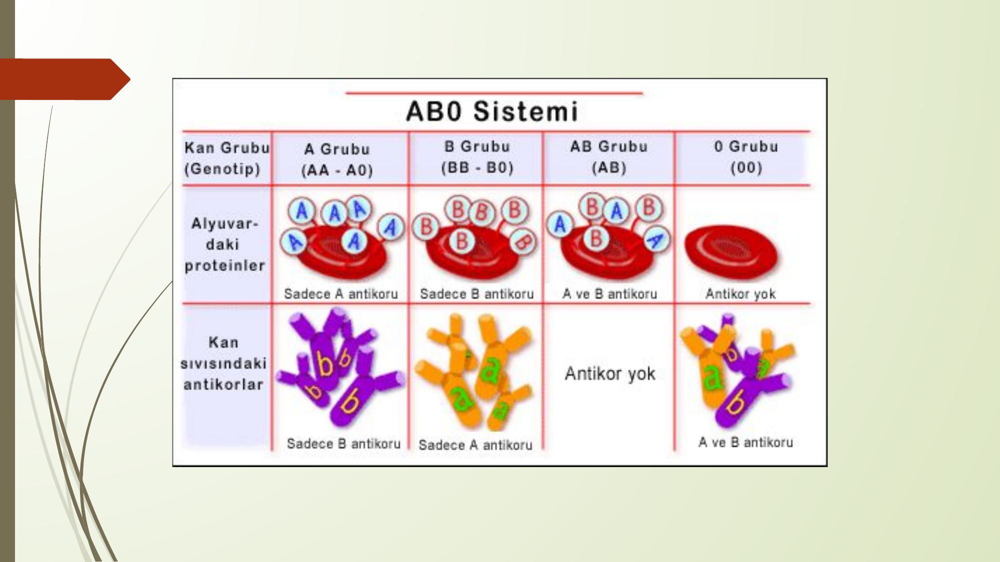
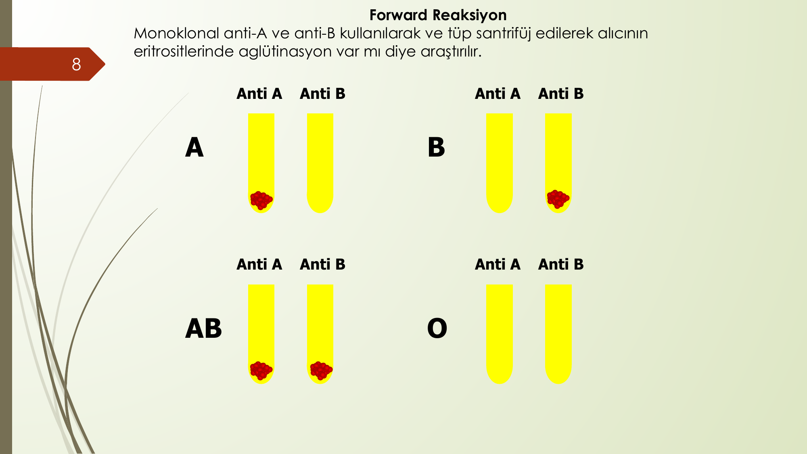
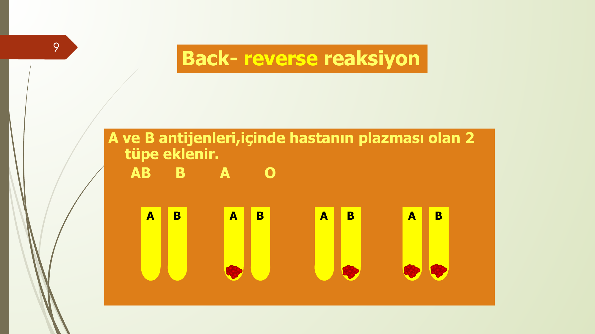
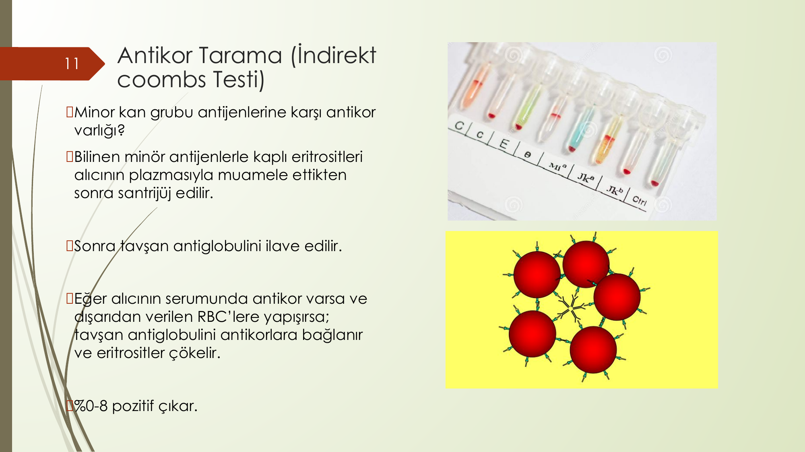
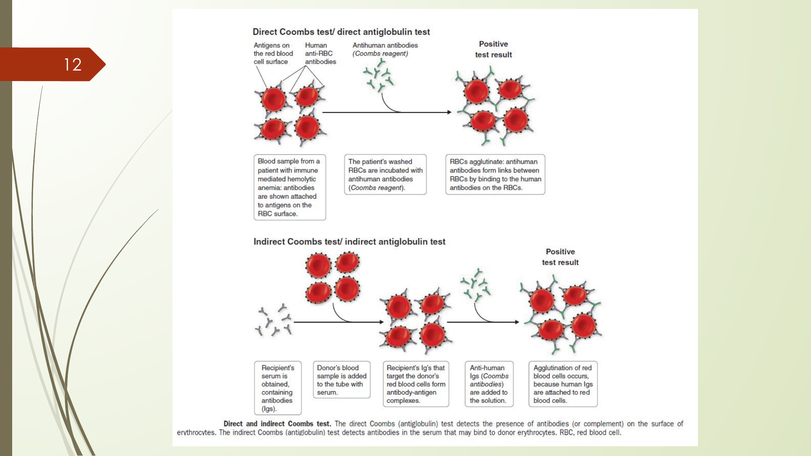
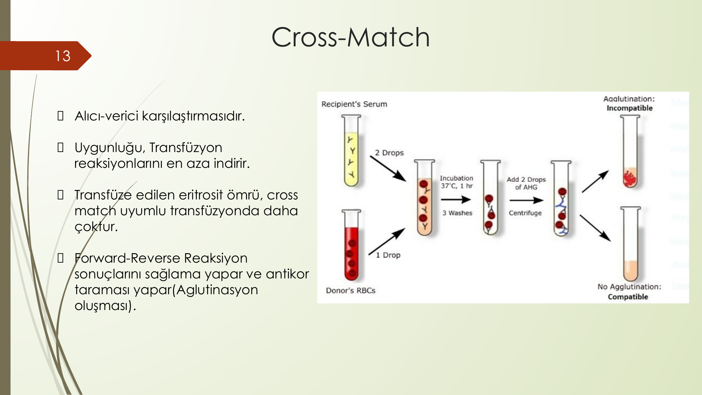
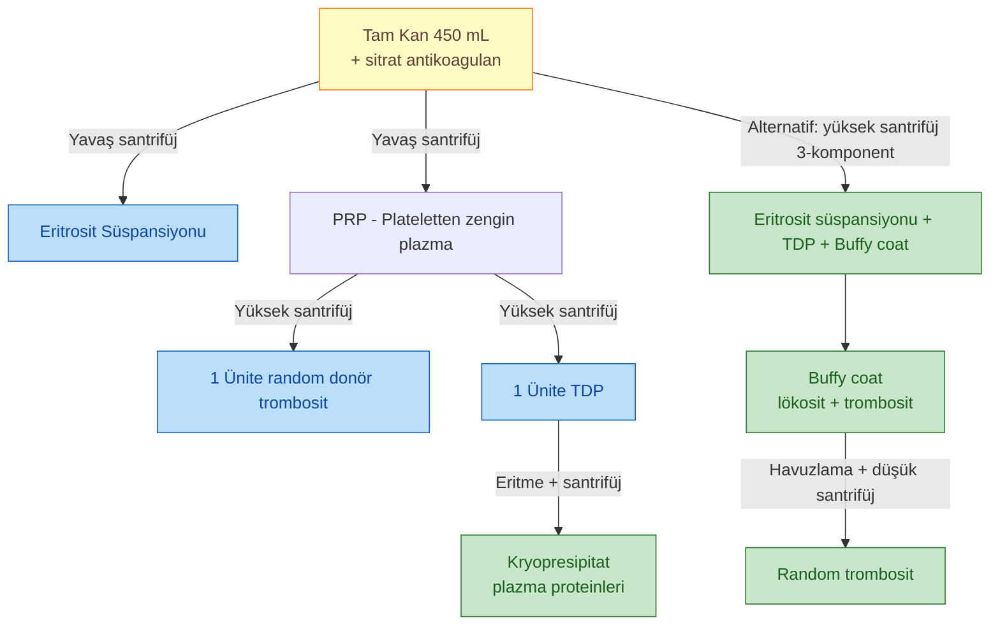
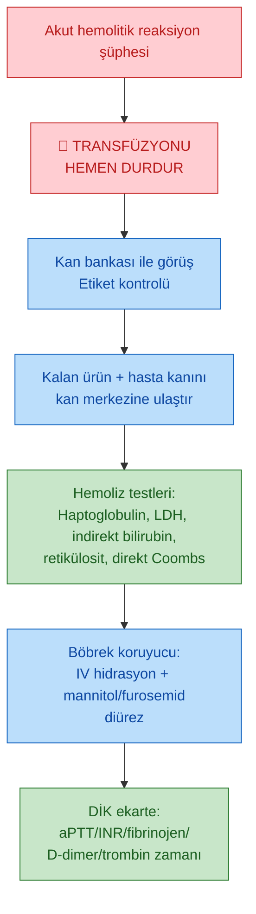
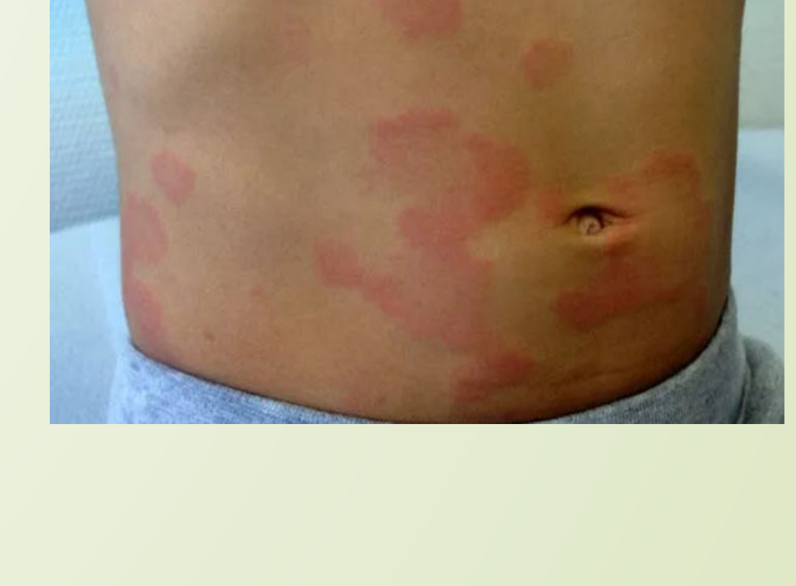
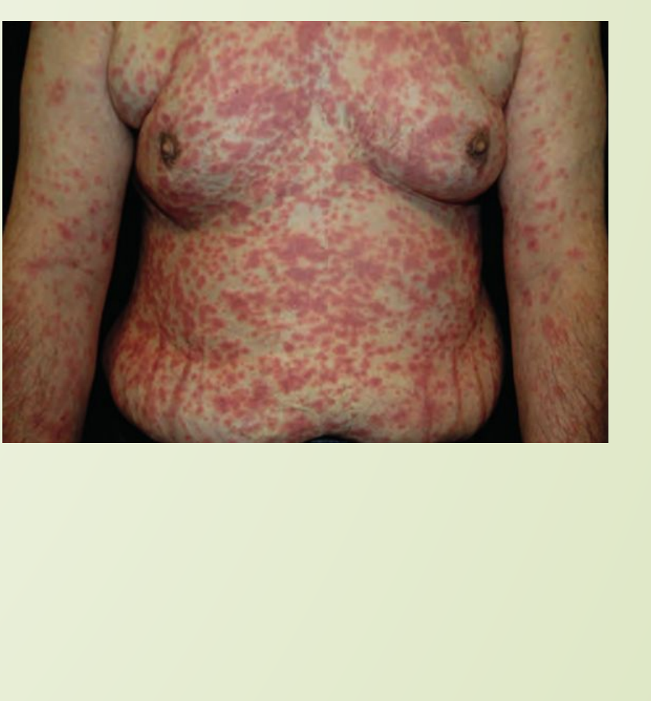

# KAN VE ÜRÜNLERİ TRANSFÜZYON KOMPLİKASYONLARI

**Hazırlayan:** Doç. Dr. Atakan Turgutkaya
**Bölüm:** Aydın Adnan Menderes Üniversitesi -- Erişkin Hematoloji Bilim Dalı

---

## İÇİNDEKİLER

1. [ABO Sistemi](#abo-sistemi)
2. [ABO/RhD Dağılımı](#aborhd-dağılımı)
3. [Türkiye'de ABO/Rh Dağılımı](#türkiyede-aborh-dağılımı)
4. [Klinik Önemli Diğer Kan Grubu Antijenleri](#klinik-önemli-diğer-kan-grubu-antijenleri)
5. [Eritrosit Süspansiyonu Uyumluluk Tablosu](#eritrosit-süspansiyonu-uyumluluk-tablosu)
6. [Transfüzyon Öncesi Testler](#transfüzyon-öncesi-testler)
7. [Kan Ürünleri](#kan-ürünleri)
8. [Eritrosit Süspansiyonu (PRBC)](#eritrosit-süspansiyonu-prbc)
9. [Trombosit Süspansiyonu](#trombosit-süspansiyonu)
10. [TDP (Taze Donmuş Plazma)](#tdp-taze-donmuş-plazma)
11. [Kryopresipitat](#kryopresipitat)
12. [Aferez Trombosit](#aferez-trombosit)
13. [Transfüzyon Reaksiyonları -- Genel Bakış](#transfüzyon-reaksiyonları----genel-bakış)
14. [İmmun Reaksiyonlar](#immun-reaksiyonlar)
15. [Non-İmmun Reaksiyonlar](#non-immun-reaksiyonlar)
16. [Enfeksiyöz Komplikasyonlar](#enfeksiyöz-komplikasyonlar)

---

## ABO SİSTEMİ

> **Şema yorumu:** Görselde 4 ABO kan grubu için **eritrositin yüzeyindeki antijenler** (A, B, ikisi birden veya hiçbiri) ve **kanın plazmasındaki antikorlar** (anti-A, anti-B, ikisi birden veya hiçbiri) gösterilmiştir. **Landsteiner kuralı:** Kişide **eritrositte hangi antijen varsa**, plazmada **karşıt antikor** bulunmaz; antijenin **olmayan tipinin** karşıt antikoru üretilir.

### ABO Kan Grubu Karakteristikleri

| Kan grubu | Genotip | Eritrosit antijenleri | Plazma antikorları |
|---|---|---|---|
| **A** | AA / AO | A | **anti-B** |
| **B** | BB / BO | B | **anti-A** |
| **AB** | AB | A ve B | **antikor yok** (universal alıcı) |
| **0** | OO | **Antijen yok** | **anti-A ve anti-B** (universal verici) |

---

## ABO/RHD DAĞILIMI

### ABD'de Etnik Gruplara Göre ABO ve RhD Fenotip Dağılımı

| Tip | Beyaz (Hispanic değil) | Siyah (Hispanic değil) | Hispanic | Asyalı |
|---|---|---|---|---|
| **O** | 45% | 51% | 57% | 40% |
| O Rh (+) | 37% | 47% | 53% | 39% |
| O Rh (--) | 8% | 4% | 4% | 1% |
| **A** | 40% | 26% | 31% | 28% |
| A Rh (+) | 33% | 24% | 29% | 27% |
| A Rh (--) | 7% | 2% | 2% | 0.5% |
| **B** | 11% | 19% | 10% | 25% |
| B Rh (+) | 9% | 18% | 9% | 25% |
| B Rh (--) | 2% | 1% | 1% | 0.4% |
| **AB** | 4% | 4% | 2% | 7% |
| AB Rh (+) | 3% | 4% | 2% | 7% |
| AB Rh (--) | 1% | 0.3% | 0.2% | 0.1% |

> **Klinik anlamı:** **0 Rh-negatif** evrensel verici (erişim zorluğu) ve **AB Rh-pozitif** evrensel alıcıdır. Etnik dağılım kan bankası stok yönetiminde önemlidir; Asyalı popülasyonlarda B grubu (%25) ve AB sıklığı (%7) yüksektir.

---

## TÜRKİYE'DE ABO/RH DAĞILIMI

Tarihsel epidemiyolojik çalışmalardan derlenmiş veriler:

| Çalışma | Yıl | Bölge | n | A% | B% | AB% | O% | Rh(+) % |
|---|---|---|---|---|---|---|---|---|
| Mizan | 1963 | Türkiye | 75.049 | 43.13 | 16.11 | 7.19 | -- | 86.6 |
| Özgüven ve ark. | 1970 | Türkiye | 6.000 | 47.10 | 16.00 | 7.70 | -- | -- |
| Öktem | 1974 | Diyarbakır | 15.971 | 41.76 | 19.26 | 8.40 | 30.58 | 90.67 |
| Saran | 1975 | Türkiye | 1.421 | 42.00 | 17.00 | 8.00 | 33.00 | 84.00 |
| Saatçioğlu | 1978 | Türkiye | 3.881 | 41.98 | 16.72 | 7.60 | 33.70 | -- |
| Binyıldız | 1979 | Türkiye | 201.317 | 43.33 | 16.12 | 7.54 | 33.01 | 89.61 |
| Şentuna | 1982 | Türkiye | 2.096 | -- | -- | -- | -- | 84.11 |
| Denli | 1987 | Diyarbakır | 964 | 40.10 | 15.10 | 8.60 | 36.20 | 92.01 |
| Ergün ve Aksoy | 1987 | Adana, Kayseri, Trabzon | 41.833 | 43.00 | 15.30 | 5.20 | 36.50 | 88.30 |
| Akbay | 1989 | Türkiye | 9.931 | -- | 16.55 | 7.95 | 33.41 | 89.79 |
| Ergün ve Yardımcı | 1993 | Türkiye | 288.469 | -- | 15.45 | 7.69 | -- | 88.13 |
| Yaprak ve ark. | 1993 | Trakya | 6.777 | 45.95 | 16.54 | 6.46 | 31.05 | 87.66 |
| Akın ve Dostbil | 2003 | Van | 6.982 | 39.99 | 17.09 | 14.66 | 28.26 | 89.49 |

> **Tipik Türkiye dağılımı:** A %42, 0 %33, B %16, AB %7-8 · Rh(+) %88, Rh(--) %12.

---

## KLİNİK ÖNEMLİ DİĞER KAN GRUBU ANTİJENLERİ

| Kan grubu sistemi | Antijen tipi | Antikor sınıfı | Klinik önem |
|---|---|---|---|
| **ABO** | Karbohidrat | IgM | -- |
| **Rh** (D, C/c, E/e) | RBC proteini | **IgG** | **HTR** (hemolitik transfüzyon reaksiyonu), **HDN** (yenidoğanın hemolitik hastalığı) |
| **Lewis** (Le^a, Le^b) | Oligosakkarit | IgM/IgG | Nadir HTR |
| **Kell** (K/k) | RBC proteini | **IgG** | HTR, HDN |
| **Duffy** (Fy^a/Fy^b) | RBC proteini | **IgG** | HTR, HDN |
| **Kidd** (Jk^a/Jk^b) | RBC proteini | **IgG** | **HTR (sıklıkla gecikmiş)**, HDN (hafif) |
| **Lutheran** | Karbohidrat | IgM | Yok |
| **MNS** | RBC proteini | IgM/IgG | Anti-M nadir HDN; anti-S/-s/-U HDN, HTR |

> **🔑 Klinik kural:** **IgG** karakterli antikorlar **plasentayı geçer** → HDN'ye yol açar. Rh, Kell, Duffy, Kidd dikkat. Anti-K ve anti-Kidd antikorları **gecikmiş hemolitik reaksiyonlarda** sık.

---

## ERİTROSİT SÜSPANSİYONU UYUMLULUK TABLOSU

Verici → Alıcı uyumluluk:

| Alıcı \ Verici | O-- | O+ | A-- | A+ | B-- | B+ | AB-- | AB+ |
|---|---|---|---|---|---|---|---|---|
| **O--** | ✅ | -- | -- | -- | -- | -- | -- | -- |
| **O+** | ✅ | ✅ | -- | -- | -- | -- | -- | -- |
| **A--** | ✅ | -- | ✅ | -- | -- | -- | -- | -- |
| **A+** | ✅ | ✅ | ✅ | ✅ | -- | -- | -- | -- |
| **B--** | ✅ | -- | -- | -- | ✅ | -- | -- | -- |
| **B+** | ✅ | ✅ | -- | -- | ✅ | ✅ | -- | -- |
| **AB--** | ✅ | -- | ✅ | -- | ✅ | -- | ✅ | -- |
| **AB+** | ✅ | ✅ | ✅ | ✅ | ✅ | ✅ | ✅ | ✅ |

> **🩸 Universal verici:** O-- (kimseye karşı antijen taşımaz, herkese verilebilir)
> **🩸 Universal alıcı:** AB+ (her antijene tolerans, herkesten alabilir)

---

## TRANSFÜZYON ÖNCESİ TESTLER

### 1. Type and Screen

#### Forward Reaksiyon (Alıcı eritrositlerini tipler)

> **Şema yorumu (Forward reaksiyon):**
>
> Görselde alıcının eritrositleri **monoklonal anti-A ve anti-B** reaktiflerine maruz bırakılmış ve aglütinasyon paterni 4 kan grubu için gösterilmiştir:
>
> | Sonuç | Anti-A tüpü | Anti-B tüpü | Kan grubu |
> |---|---|---|---|
> | Sadece A reaktif aglütine | ✅ aglütinasyon | -- | **A** |
> | Sadece B reaktif aglütine | -- | ✅ aglütinasyon | **B** |
> | Her iki reaktif aglütine | ✅ aglütinasyon | ✅ aglütinasyon | **AB** |
> | Hiçbiri aglütine olmaz | -- | -- | **0** |
>
> **Yöntem:** Tüp santrifüj edilir, hücre çökeltisi gözlemlenir. Aglütinasyon kümeleşmiş eritrositleri gösterir.

#### Reverse Reaksiyon (Back-reaction -- alıcı serumundaki izoaglutininleri tarar)

> **Şema yorumu (Reverse reaksiyon):**
>
> Görselde **alıcının plazması**, ticari **A ve B referans eritrositleri** içeren 2 ayrı tüpe eklenir. Aglütinasyon paterni izoaglutinin (anti-A, anti-B) varlığını gösterir:
>
> | Kan grubu | A tüpü | B tüpü | Çünkü plazmada... |
> |---|---|---|---|
> | **AB** | -- | -- | Antikor yok |
> | **B** | ✅ aglütinasyon | -- | Anti-A var |
> | **A** | -- | ✅ aglütinasyon | Anti-B var |
> | **O** | ✅ aglütinasyon | ✅ aglütinasyon | Hem anti-A hem anti-B var |
>
> **🔑 Önemi:** Reverse reaksiyon, forward reaksiyonun **sağlamasıdır**. ABO tipi ile uyumlu olmalıdır; uyumsuzluk varsa örnek hatası, izoaglutinin yokluğu (yenidoğan, immun yetmezlik), zayıf A/B alt tipi (A2) düşünülmelidir.

### 2. Antikor Tarama (İndirekt Coombs Testi)

> **Şema yorumu (İndirekt Coombs):**
>
> Test minör kan grubu antijenlerine karşı alıcının serumunda **dolaşan antikorların** varlığını araştırır:
>
> 1. Bilinen minör antijenlerle kaplı eritrositler alıcının plazmasıyla **muamele edilir** ve santrifüj edilir
> 2. Sonra **tavşan anti-globulini** (Coombs reagent) eklenir
> 3. Eğer alıcının serumunda antikor varsa ve dışarıdan verilen RBC'lere yapışmışsa → tavşan anti-globulini bu antikorlara bağlanır → **eritrositler çökelir (aglütinasyon)**
>
> **Sıklık:** Olguların **%0-8**'inde pozitiftir (önceden transfüzyon, gebelik öyküsü olanlarda daha sık).

### Direkt vs İndirekt Coombs

> **Şema yorumu:**
>
> **Direkt Coombs (DAT):** Hastanın eritrositlerinin **yüzeyindeki antikorları/komplemanı** saptar. Otoimmun hemolitik anemide pozitif, AHTR'de tanı koydurur.
>
> 1. İmmun aracılı hemolitik anemili hasta kanı alınır (RBC yüzeyinde antikorlar var)
> 2. Hastanın yıkanmış RBC'leri **anti-human antibody (Coombs reagent)** ile inkübe edilir
> 3. Coombs antikorları RBC üzerindeki insan antikorlarına bağlanarak **aglütinasyon** oluşturur
>
> **İndirekt Coombs (IAT):** Hasta serumunda **dolaşan, RBC yüzeyine bağlanabilecek antikorları** saptar. Antikor tarama, cross-match, prenatal antikor takibinde kullanılır.
>
> 1. Hastanın serumu (antikor içeren) alınır
> 2. Donör kanı tüpe eklenir → varsa antikor donör eritrositlerine bağlanır
> 3. Anti-human antibody (Coombs) eklenir
> 4. Aglütinasyon oluşumu pozitiflik gösterir
>
> **🔑 Klinik özet:**
> * **Direkt:** "RBC üzerinde antikor var mı?" (in vivo bağlanmış)
> * **İndirekt:** "Serumda RBC'lere bağlanabilecek antikor var mı?" (in vitro bağlanma)

### 3. Cross-Match

> **Şema yorumu (Cross-match):**
>
> 1. **Alıcı serumu** (üst tüp -- 2 damla) ve **donör RBC'leri** (alt tüp -- 1 damla) karıştırılır
> 2. **37°C'de 1 saat** inkübasyon
> 3. 3 yıkama, **AHG (anti-human globulin)** eklenir, santrifüj
> 4. **Sonuç:**
>    * **Aglütinasyon →** Uyumsuz (incompatible) -- transfüze edilemez
>    * **Aglütinasyon yok →** Uyumlu (compatible) -- transfüze edilebilir
>
> **🔑 Önemi:**
> * Alıcı-verici **doğrudan karşılaştırmasıdır**
> * Uyumluluğu, transfüzyon reaksiyonlarını **en aza indirir**
> * Transfüze edilen eritrosit **ömrü, cross-match uyumlu** transfüzyonda daha uzundur
> * Forward-reverse reaksiyon sonuçlarının **sağlamasıdır** ve ek antikor taraması yapar

---

## KAN ÜRÜNLERİ

> Kan ürünleri genellikle **tam kan olarak (450 mL)** toplanır. Çeşitli antikoagulanlar eklenmiştir (örn. **sitrat**).

### Kan Ürünleri Bileşen Ayrıştırma Şeması

* **Lökosit filtreleme:** Kan ürünlerinin lökosit düzeyleri filtreleme yöntemiyle azaltılabilir (ürün başına <1-5 × 10⁶ lökosit) → **lökosit filtresi**
* **Aferez teknolojisi:** Tek bir donörden çoklu ünite trombosit, plazma veya granülosit toplanabilir (en az 5 random trombosit ünitesine eşdeğer)

### Kan Komponentleri Karşılaştırma

| Komponent | Hacim (mL) | İçerik | Klinik yanıt |
|---|---|---|---|
| **PRBC** (paketlenmiş eritrosit) | 250-300 | Eritrosit + değişken lökosit + az miktar plazma | **Hb 1 g/dL ↑, Hct %3 ↑** |
| **Trombosit** (tam kandan, RD) | 50-70 / RD ünite | 5.5 × 10¹⁰ / RD ünite | **Plt 5.000-10.000/μL ↑ /RD ünite** |
| **Trombosit** (aferez, SDAP) | 200-400 | >2 × 10¹¹ / SDAP | CCI ≥10×10⁹/L (1 saat), ≥7.5×10⁹/L (24 saat) |
| **TDP (FFP)** | 200-250 | Plazma proteinleri (koagülasyon faktörleri, protein C/S, antitrombin) | **Koagülasyon faktörleri %2 ↑** |
| **Kryopresipitat** | 10-15 / ünite, 4-5 ünite havuzu | Soğukta çözünmeyen plazma proteinleri (fibrinojen, faktör VIII, faktör XIII, vWF, fibronektin) | **Plazma fibrinojen 0.3-1 g/L ↑, faktör VIII ↑** |

### Tam Kan

* **Endikasyon:** Oksijen taşıma kapasitesini arttırma + volüm ekspansiyonu
* **İdeal kullanım:** **>%25 total kan kaybı** olan akut hemorajili hastalar
* Eritrosit viabilitesini korumak için **+4°C**'de muhafaza
* **Sınırlamalar:**
   * Trombosit disfonksiyonu (saklamada azalır)
   * Bazı koagülasyon faktörleri saklamada azalır
   * **2,3-DPG zamanla azalır** → eritrosit içindeki O₂ afinitesini arttırır (oksijen serbestleşmesi azalır)

---

## ERİTROSİT SÜSPANSİYONU (PRBC)

* **Endikasyon:** Anemik hastalar
* **+4°C'de 35-42 gün** saklanabilir
* **Net Hb eşik değeri yok** -- hasta bazlı karar (kardiyak hastalık yok + normovolemi varsa **Hb >7 g/dL** yeterli oksijenizasyon sağlar)

### Yan Etkiyi Azaltma Stratejileri

| Hazırlık | Endikasyon |
|---|---|
| **Lökosit filtresi** (universal) | Posttransfüzyon ateş ve ürperme, CMV enfeksiyonu, alloimmunizasyon, immunsupresyon önleme |
| **Yıkanmış RBC süspansiyonu** | Plazma proteinlerine alerjik reaksiyon öyküsü |
| **Exchange RBC transfüzyonu** | Orak hücreli anemi gibi Hbpati'lerde oraklaşmış eritrositlerin donör RBC'leri ile değiştirilmesi |

---

## TROMBOSİT SÜSPANSİYONU

* **Endikasyon:** Trombositopeni durumunda kanama ihtimalini azaltmak / kanayan hastayı durdurmak
* **20-24°C**'de **5-7 gün**, sabit bir hızda hareket ettirilerek muhafaza
* **1 ünite single donör aferezi** → trombosit sayısını 10 dk içinde **30.000 yükseltir**
* **4-6 random trombosit = 1 ünite single donör aferezi** (3-4 × 10¹¹ trombosit)

### Trombosit Süspansiyonu Endikasyonları

| Durum | Eşik |
|---|---|
| **Aktif kanayan hasta** | Plt >50.000 üzerine çıkarılmalı; **SSS kanaması varsa >100.000/mm³** |
| Asemptomatik trombositopeni (ITP değilse) | Plt <10.000/mm³ |
| Ateş, sepsis, eşlik eden koagülopati | Plt <20.000/mm³ |
| **TTP / HİT** | **❌ Sakıncalı!** Altta yatan trombosit aktivasyonu trombozis riskini arttırır |

### ABO ve Rh Uyumsuzluğu

* **ABO uyumsuz trombosit** kabul edilebilir, ancak trombosit sayısını **ABO uyumluya göre daha az yükseltir** (özellikle major uyumsuzluk)
* **Rh uyumsuz** ürün de verilebilir; alloimmunizasyonu önlemek için öncesinde **anti-D immunoglobulin** kullanımı düşünülmelidir

### İnvazif Girişimler için Güvenli Trombosit Sınırları

| Girişim | Güvenli Plt eşiği |
|---|---|
| Birçok cerrahi | **50.000/mm³** |
| **Beyin ve göz içi cerrahi** | **100.000/mm³** |
| Endoskopi (diagnostik) | 20.000 |
| Endoskopi (biyopsi/terapötik) | 50.000 |
| Bronkoskopi (BAL içeren) | 20-30.000 |
| Santral kateter takılması | 20.000 |
| Lomber ponksiyon (hematolojik malignite) | 10-20.000 |
| Lomber ponksiyon (hematolojik malignite yok) | 40-50.000 (ITP'de daha düşük sınırlar) |
| **Epidural anestezi** | **80.000/mm³** |
| Kemik iliği aspirasyon/biyopsi | 20.000 |

---

## TDP (TAZE DONMUŞ PLAZMA)

* İçerir: Stabil **koagülasyon faktörleri** + plazma proteinleri (**fibrinojen, antitrombin, albümin, protein C/S**)
* **Asellülerdir** → intrasellüler enfeksiyon bulaşı (**CMV gibi**) **beklenmez**
* **Genel doz:** 10-15 mL/kg (1 ünite TDP = 250 cc)

### Endikasyonlar

* **Koagülopatilerin düzeltilmesi** (herediter veya akkiz)
* **Warfarin doz aşımının düzeltilmesi**
* **Eksik plazma proteinlerinin yerine konulması**
* **TTP tedavisi** (plazmaferez ile hem eksik **ADAMTS13** replasmanı hem antikor temizlenmesi)
* Bazı otoimmun hastalıklar (**GBS, MG**) -- PEX'den fayda görebilir

### TDP'de ABO Uyumlu Ürün Kullanımı

(NOT: Eritrosit transfüzyonunda alıcı, kendi kan grubu antikorlarını taşımayan donör RBC'leri almalı; TDP'de ise tam tersi -- **plazma transfüzyonunda alıcının eritrositleriyle reaksiyona girmeyecek** plazma seçilir.)

| Alıcı | Alabileceği TDP donörleri |
|---|---|
| **A** | A veya **AB** |
| **B** | B veya **AB** |
| **0** | **0, A, B, AB** (universal alıcı) |
| **AB** | **Sadece AB** (universal verici TDP'de AB!) |

> **🔑 Klinik kural:** TDP'de **AB plazma evrensel vericidir** (antikor içermez); **0 plazma sadece 0 hastalara verilir** (anti-A ve anti-B içerir).

---

## KRYOPRESİPİTAT

* **Fibrinojen, Faktör VIII, vWF kaynağıdır**
* **Volüm yüklenme riski olan hastada TDP yerine** bu faktörleri replase etmede kullanılır
* Her bir ünite kryopresipitat **80 ünite faktör VIII** içerir (Hemofili A)
* **vWH tip 2 (disfonksiyonel) ve tip 3 (mutlak eksik)** hastalarda da kullanılır
* **Genel replasman dozu:** Her 10 kg'ya 1 ünite

---

## AFEREZ TROMBOSİT

* **Aferez teknolojisi** ile tek bir donörden çoklu ünite trombosit süspansiyonu toplanabilir
* En az **5 random trombosit ünitesine yetecek kadar** trombosit elde edilir
* **Plazma ve granülositler** de aferez teknolojisi ile toplanabilir
* Plazma kaynaklı **albümin, IVIG, antitrombin, koagülasyon faktör konsantreleri** çoklu donörden hazırlanmış havuzlanmış plazmadan **enfeksiyöz ajanların eliminasyonu** sonrası elde edilirler

---

## TRANSFÜZYON REAKSİYONLARI -- GENEL BAKIŞ

### Sınıflandırma

| Kategori | Alt tip |
|---|---|
| **İmmun reaksiyonlar** | Akut hemolitik (AHTR) · Gecikmiş hemolitik · Febril non-hemolitik (FNHTR) · Alerjik-anafilaktoid · GVHD · TRALI · Post-transfüzyon purpura · Alloimmunizasyon |
| **Non-immun reaksiyonlar** | Sıvı yüklenmesi (TACO) · Hipotermi · Elektrolit boz. · Demir yüklenmesi · Hipotansif reaksiyon · İmmunmodulasyon |
| **Enfeksiyöz komplikasyonlar** | Virüsler (HBV, HCV, HIV, parvovirus, HTLV, CMV) · Bakteriyel kontaminasyon · Parazitler · Prion hastalıkları (CJD) |

### Risk Sıklıkları

| Reaksiyon | Sıklık (epizot/100.000 ünite) |
|---|---|
| **TACO** (sirkülatuar yük) | 10.9 |
| **FNHTR** (febril non-hemolitik) | **100-1000** (sık olarak az rapor edilir) |
| Alerjik | 100-400 (ürün bağımlı) |
| **TRALI** | 0.4-1 (mitigasyon ile, ürün bağımlı) |
| **Gecikmiş hemolitik** | 40 |
| **Akut hemolitik (AHTR)** | 2.5-7.9 |

#### Enfeksiyöz Riskler (NAT taraması ile)

| Etken | Sıklık |
|---|---|
| Bakteri (septik transfüzyon reaksiyonu) | 0.3-25 / 1.000.000 |
| **Hepatit B** | 1 / 300.000 (NAT ile <1 / 1.000.000) |
| **Hepatit C** | <0.1-1 / 1.000.000 |
| **HIV-1, -2** | 0.1-1 / 1.000.000 |
| **HTLV-I, -II** | 1 / 3.000.000 |
| **Sıtma** | 1 / 4.000.000 |

#### Diğer Komplikasyonlar

| Komplikasyon | Sıklık |
|---|---|
| **RBC alloimmunizasyon** | 1 / 100 |
| **HLA alloimmunizasyon** | 1 / 10 (lökodeplesyon yokluğunda) |
| **GVHD** | Çok nadir (immunsupresif hastalarda kan ürünü ışınlama ile) |

---

## İMMUN REAKSİYONLAR

### Akut Hemolitik Transfüzyon Reaksiyonu (AHTR)

> **🚨 Tıbbi acil!** İmmun aracılı hemoliz; alıcı serumunda donör RBC'lerini hemolize eden antikor varsa gerçekleşir.

**En sık neden:** Yanlış ABO/Rh/Kell/Duffy uyumsuz kan transfüzyonu (izoaglutininler).

**Klinik bulgular:** Hipotansiyon, taşipne, taşikardi, ateş, ürperme, hemoglobinüri, **göğüs ve yan ağrısı**, infüzyon yerinde hassasiyet/ağrı.

**Acil yönetim:**

### Gecikmiş Hemolitik Reaksiyon

* **Tamamıyla önlenebilir değildir**
* Antikor taramasında düşük düzeyli antikor barındırdığı için **negatif** saptanan, **önceden sensitize olmuş** alıcılarda (örn. transfüzyon öyküsü) oluşur
* **Anamnestik yanıt:** Antikor içeren kan ürünü transfüze edildiğinde Direkt Coombs pozitifleşir, **1-2 hafta içinde antikor saptanabilir**, sonrasında RES tarafından yıkılır
* **Spesifik tedavi gerekmez**, ek transfüzyon gerekebilir

### Febril Non-Hemolitik Transfüzyon Reaksiyonu (FNHTR)

> **En sık reaksiyon tipi**

* Vücut sıcaklığında **≥1°C yükselme**, ürperme
* Diğer ateş nedenleri dışlanmalı
* **Patogenez:** Donör lökosit ve HLA antijenlerine karşı antikorlar; **çoklu transfüzyon öyküsü ve multipar kadınlar** daha duyarlı
* Bekletilmiş ürünlerde lökositlerden salınan **kemokin/sitokinler** de rol oynar
* Çoğu hafif geçtiği için anti-HLA antikor araştırması gereksiz
* **Önleme:** Lökodeplesyon-filtreleme (özellikle koleksiyon sırasında) ile sıklık belirgin azalmıştır

### Alerjik Reaksiyonlar

> **Klinik foto yorumu (Ürtiker):** Görselde gövde ön yüzünde ve karın bölgesinde **çok sayıda eritematöz, ödemli, geçici, sınırları net** ürtikeryal plak izlenir. Lezyonlar **kaşıntılı**, kabarık ve genellikle **birkaç saat içinde yer değiştiren** karakterdedir. Bu, transfüzyon sırasında veya hemen sonrasında plazma proteinlerine karşı **hafif alerjik reaksiyonun** klasik klinik bulgusudur. Anafilaksi gibi sistemik bulgu (hipotansiyon, bronkospazm, larinks ödemi) yokluğunda **transfüzyona ara verip antihistaminik** ile yönetilebilir; lezyonlar yatışınca devam edilebilir.

* Kan ürünlerindeki **plazma proteinlerine bağlı ürtikeryal** reaksiyonlar
* **Trombosit ve lökositlerden histamin/serotonin salınımı**
* **Yönetim:**
   * Hafif: Transfüzyona ara verilir → IV/IM antihistaminik → reaksiyon yatışınca devam
   * Önceden öyküsü varsa: **transfüzyon öncesi antihistaminik premedikasyonu**
   * Aşırı duyarlı hastada: **Yıkanmış eritrosit süspansiyonu** (SF ile yıkayarak hücresel komponentler dışındaki içerikler uzaklaştırılır)

### Anafilaktoid Reaksiyon

> **🚨 Tıbbi acil!** Transfüzyonun **ilk saniyeleri/dakikalarında**, ilk birkaç mL ile.

**Klinik bulgular:** Nefes darlığı, öksürük, bulantı-kusma, **hipotansiyon**, bronkospazm, bilinç kaybı, respiratuar arrest, şok.

**Yönetim:**
* Transfüzyon **kesilmeli**
* **Adrenalin 0.5-1 mL (1:1000) s.c.**
* Ciddi olgularda **kortikosteroidler**

> **🔑 Önemli:** **IgA eksikliği** olan bireyler (<%1 olgu) -- **IgA eksik bireylerden yıkanmış transfüzyon** almalı. Çoklu anafilaktoid reaksiyon öyküsünde **IgA eksikliği araştırılmalıdır**.

### GVHD (Graft-versus-Host Hastalığı)

> **Klinik foto yorumu (TA-GVHD):** Görselde gövde, göğüs ve karın bölgesinde **yaygın, konfluen (birleşmeye eğilimli), parlak eritematöz makülopapüler döküntü** izlenir. Lezyonlar boyun-üst gövdeden başlayıp aşağı yayılma eğilimindedir; ileri evrelerde **eksfoliatif dermatit** veya **toksik epidermal nekroliz** benzeri görünüm alabilir. Bu klasik **GVHD cilt tutulum** paterni olup transfüzyondan **8-10 gün sonra** ortaya çıkar; **ateş + diyare + karaciğer fonksiyon test bozukluğu** ile birlikte görülür. **TA-GVHD'de ek olarak kalıcı kemik iliği aplazisi** ve **pansitopeni** gelişir; tedavi son derece zordur ve **3-4 hafta içinde fataldir**. Bu yüzden **risk grubu hastalarda kan ürününün ışınlanması (≥2500 cGy)** ile **tamamen önlenmesi** kritik önemdedir.

> Vericinin **lenfositlerinin** alıcının dokularına saldırması.

**Risk grupları:** İmmunsupresif birey (lenfositleri elimine edilemez) **VEYA** benzer HLA paylaşan akraba içi alıcı (immunsupresif olmasa da)

**Mekanizma:** Donör T hücreleri alıcı HLA antijenlerini yabancı algılar → immun reaksiyon başlatır.

**Klinik:**
* **8-10 gün sonra:** Ateş, **karakteristik cilt erupsiyonu**, diyare, karaciğer fonksiyon testlerinde bozulma
* **TA-GVHD'de ek olarak:** Kalıcı kemik iliği aplazisi → **pansitopeni**
* **3-4 hafta sonrasında fatal**

> **🔑 Önleme:** **Minimum 2500 cGy ile kan ürününün ışınlanması** ile **tamamen önlenebilir**.

#### Işınlama Gerektiren Durumlar

* Konjenital hücresel immun yetmezlikler (**Wiskott-Aldrich, DiGeorge sendromu**)
* **Neonatal exchange transfüzyon**
* **İntra-uterin transfüzyon**
* **Hodgkin lenfoma** (aktif KT'den bağımsız, hayatın herhangi bir döneminde)
* **Otolog ve allojenik kemik iliği nakli** alıcıları
* **Purin analoğu** tedavisi alanlar (fludarabin, kladribin, bendamustin)
* Hematolojik hastalık için **ATG ve alemtuzumab** alanlar
* **Akrabalardan ve HLA uyumlu kişilerden** yapılan transfüzyonlar

### TRALI (Transfusion-Related Acute Lung Injury)

> **🚨 Transfüzyon ilişkili ölümlerden EN FAZLA SORUMLU REAKSİYON**

**Klinik kriterler:** Transfüzyon sırasında veya **6 saatlik dönemde** hipoksi + **bilateral pulmoner infiltratlar** + **non-kardiyojenik pulmoner ödem** gelişimi

**Patogenez:**
* Çoğunlukla alıcının lökositleri ile etkileşen **yüksek titrede anti-HLA antikoru** içeren donör plazmasından kaynaklanır
* Anti-HLA'nın yanında **anti-HNA antikorları** da sorumlu olabilir
* Lökositler pulmoner damarlarda agrege olur → kapiller geçirgenliği arttıran mediatör salınımı

**Tanı:** Donör plazmasında **anti-HLA antikor incelemesi** tanı koydurucu olabilir

**Risk azaltma:**
* Donörler sıklıkla **multipar kadınlardır**
* **Erkek ve nullipar kadınlardan** transfüzyon riski azaltır

### Post-Transfüzyon Purpura

* Trombosit süspansiyonu replasmanından **7-10 gün sonra trombositopeni**
* Alıcı serumunda **trombosit spesifik antikorlar** bulunur (en sık trombosit GP3a reseptörü üzerindeki **HPA-1a antijenine** karşı)
* Hem donör hem alıcı trombositlerine karşı gelişen gecikmiş antikor üretimi
* **⚠️ İlave trombosit replasmanı durumu kötüleştirir, sakıncalıdır**
* **Tedavi:** **IVIG** veya plazma değişimi

### Alloimmunizasyon

* **Ne kadar transfüzyon → o kadar fazla alloimmunizasyon** (artan antijen maruziyeti)
* Sonrasında antijen-negatif cross-match uyumlu kan ürünü bulmakta zorlanma
* **Trombosit replasmanına refrakterlik** gelişebilir
* **Önleme:**
   * Single donör aferezi kullanımı
   * **Lökosit filtresi**
   * Gereksiz transfüzyondan kaçınma
* **HLA uyumlu transfüzyon** böyle durumlarda yapılabilir

---

## NON-İMMUN REAKSİYONLAR

### TACO (Transfusion-Associated Circulatory Overload)

> Sıvı yüklenmesi.

**Klinik bulgular:**
* **Dispne, hipoksi (SpO₂ <%90)**
* Bilateral pulmoner infiltratlar
* **Hipertansiyon** (TRALI'den ayrım: TRALI'de sıklıkla hipotansiyon)
* Pulmoner basınç (P) yükselir

**Yönetim:** Sıvı kısıtlaması + diüretik ile düzelir.

> **🔑 TACO vs TRALI ayrımı:**
> * **TACO:** HT, BNP↑, transfüzyon süresi yavaşlatınca düzelir, diüretik etkili
> * **TRALI:** Hipotansiyon, BNP normal, mekanik ventilasyon gerekebilir, diüretik etkisiz

### Elektrolit Bozukluğu

| Bozukluk | Mekanizma |
|---|---|
| **Hiperkalemi** | Depolama sırasında eritrosit lizisi → K⁺ hücre dışına çıkar |
| **Hipokalsemi** | Antikoagulan olarak kullanılan **sitrat, kalsiyumu bağlar** |

**Hipokalsemi klinik bulguları:**
* Ağız çevresinde hissizlik
* Ekstremitelerde uyuşmalar
* Koagülasyon kaskadıyla etkileşim

> **Kalsiyum replasmanı nadiren gerekir** (sitrat hızlıca bikarbonata çevrilir). Kalsiyum verilecekse **farklı bir damar yolundan** verilmelidir.

### Demir Yüklenmesi (Sekonder Hemosiderozis)

* **Her ünite RBC = 200-250 mg demir**
* Demiri vücuttan uzaklaştıracak fizyolojik mekanizma yoktur
* Demir organlarda birikir → **genellikle 100 üniteden sonra organ disfonksiyonu**

**Yönetim:**
* Gereksiz transfüzyondan kaçınma
* **EPO** kullanımı
* **Demir şelasyonu:**
   * **Deferasiroks** (oral)
   * **Deferoksamin** (parenteral)
   * **Deferipiron** (oral)

### Hipotansif Reaksiyonlar

* **ACE inhibitörü alan hastalarda** geçici hipotansiyon
* Mekanizma: ACE normalde **bradikinini indirger**. ACE inhibitörü alan hastada, kan ürününde bradikinin bulunur ve transfüzyon sonrası ACE inhibisyonu nedeniyle indirgenemez → vasodilatasyon
* **Kendiliğinden düzelir**

### İmmunmodulasyon

* Kan transfüzyonu **immunsupresif etkilidir**
* Çoklu transfüzyon alan **renal nakilli olguların daha az rejeksiyon** gösterdiği gözlenmiştir
* **Kanser hastalarında enfeksiyon riski** artar
* **Mekanizma:** Transfüze edilen lökositler
* **Önleme:** **Lökosit filtresi** kullanımı bu yan etkiyi azaltır

---

## ENFEKSİYÖZ KOMPLİKASYONLAR

### Bakteriyel Kontaminasyon

* TDP ve eritrosit süspansiyonu **soğukta saklandığı için** kontaminasyon ihtimali **düşüktür**
* **Soğuk-toleran bakteriler** eritrosit süspansiyonunu kontamine edebilir:
   * **Yersinia, Pseudomonas, Serratia, Acinetobacter, Escherichia** türleri
* **Trombosit süspansiyonları en riskli** (oda sıcaklığında saklandığı için)
   * En sık **gram-pozitif m.o** (ciltten kontaminasyon)
   * **1/1000-2000 trombosit süspansiyonu** kontamine olduğu tahmin edilir

**Klinik:** Ateş + ürperme → septik şok ve **DİK**'e ilerleyebilir.
* Gram-negatif m.o varsa → **endotoksemi**

**Acil yönetim:**
1. **Transfüzyon hemen kesilmeli**
2. **Geniş spektrumlu antibiyotik** + şok tedavisi
3. Kan ürünü **kültüre ve gram boyamaya gönderilir**
4. Kan merkezi uyarılır

### Viral Enfeksiyonlar

| Virüs | Risk (NAT taraması ile) |
|---|---|
| **HBV** | 1/300.000 (NAT ile <1/1.000.000) |
| **HCV** | <0.1-1/1.000.000 |
| **HIV-1, -2** | 0.1-1/1.000.000 |
| **HTLV-I, -II** | 1/3.000.000 |
| **CMV** | TDP'de beklenmez (asellüler); sellüler ürünlerde lökositler ile bulaşabilir → **lökosit filtresi** |
| Parvovirus B19 | Nadir; aplastik krize yol açabilir |

### Diğer Enfeksiyöz Ajanlar

* Arbovirüsler (West Nile, Dengue, Zika)
* Hepatit A ve E
* **Babesia microti / B. duncani** (babesiyozis)
* **Anaplasma phagocytophilum** (granülositik ehrlişyozis)
* **Trypanosoma cruzi** (Chagas hastalığı)
* **Treponema pallidum** (sifiliz)
* HHV-8

### Prion Hastalıkları

* **Creutzfeldt-Jakob hastalığı** (CJD) -- **çok nadir** ama önemli risk

---

## ÖZET TABLO -- TRANSFÜZYON KRİTİK NOKTALARI

| Konu | Anahtar Bilgi |
|---|---|
| **Universal eritrosit verici** | O-- |
| **Universal eritrosit alıcı** | AB+ |
| **Universal TDP donörü** | **AB** (antikor yok) |
| **Universal TDP alıcı** | **0** (anti-A ve anti-B alabilir) |
| **PRBC depolama** | +4°C, 35-42 gün |
| **Trombosit depolama** | 20-24°C, 5-7 gün, ajitasyonla |
| **Tek RBC ünite Hb yükselişi** | 1 g/dL |
| **Tek aferez trombosit yükselişi** | 30.000/μL |
| **TTP/HİT'te trombosit transfüzyonu** | **Sakıncalı** (tromboz riski) |
| **En sık transfüzyon reaksiyonu** | **FNHTR** |
| **En öldürücü reaksiyon** | **TRALI** |
| **Transfüzyon ilişkili akut hemoliz tedavi anahtarı** | Hemen durdur, IV hidrasyon, diürez, DİK takibi |
| **GVHD önleme** | Kan ürününü ışınlama (≥2500 cGy) |
| **GVHD risk gruplarından biri** | **Hodgkin lenfoma (her zaman)** |
| **Anafilaksi düşündüren özel risk** | **IgA eksikliği** (yıkanmış kan) |
| **Demir yüklenmesi eşiği** | ~100 ünite RBC sonrası |
| **Hipokalsemi nedeni** | Sitrat (kalsiyum bağlar) |
| **Hipotansif reaksiyon ilaç ilişkisi** | **ACE inhibitörü** (bradikinin birikimi) |
| **Trombosit kontaminasyonu en sık** | Gram-pozitif m.o (cilt) -- oda sıcaklığında saklama |
| **Soğuk RBC kontaminasyonu** | Yersinia, Pseudomonas, Serratia, Acinetobacter |
| **HBV transfüzyon riski (NAT)** | <1/1.000.000 |
| **Lökosit filtresinin önlediği** | FNHTR + CMV + alloimmunizasyon + immunmodulasyon |
| **TACO vs TRALI** | TACO = HT + BNP↑ + diüretiğe yanıt; TRALI = hipotansiyon + BNP normal |
| **Post-transfüzyon purpura mekanizması** | HPA-1a antikoru -- IVIG ver, ek trombosit verme! |
