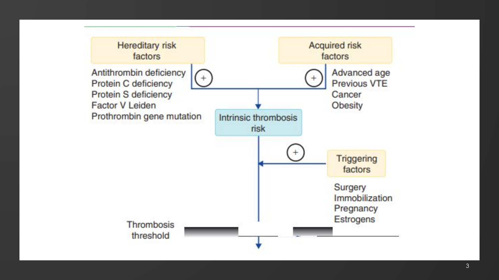
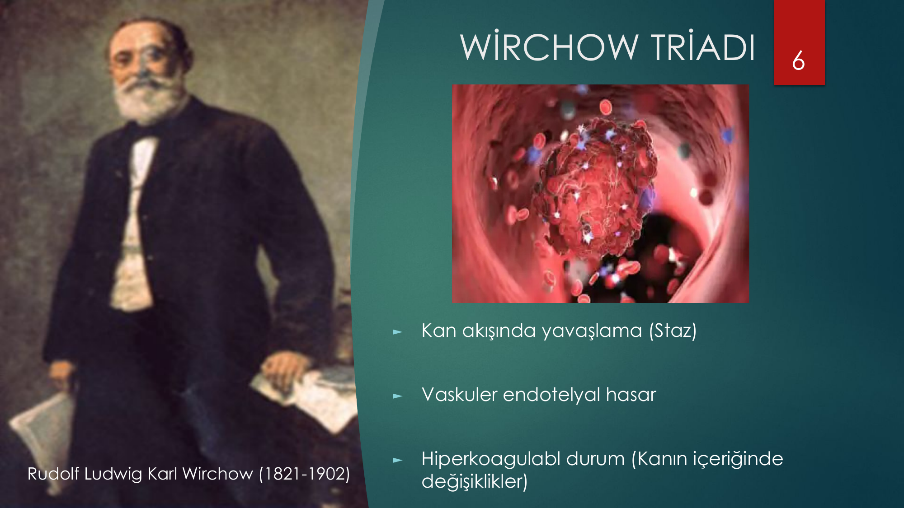
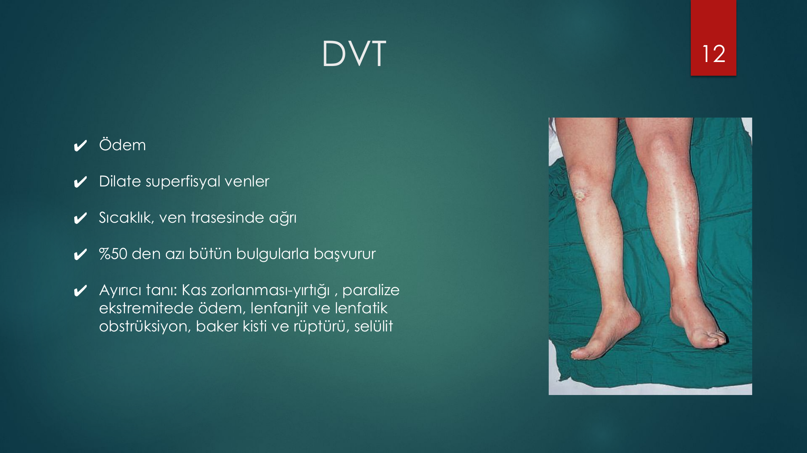
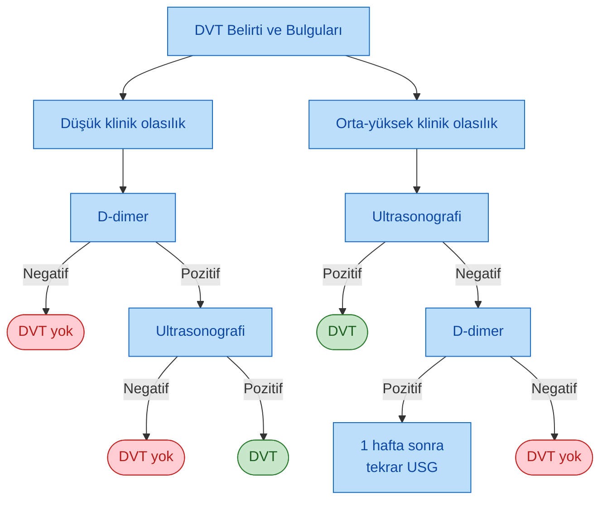
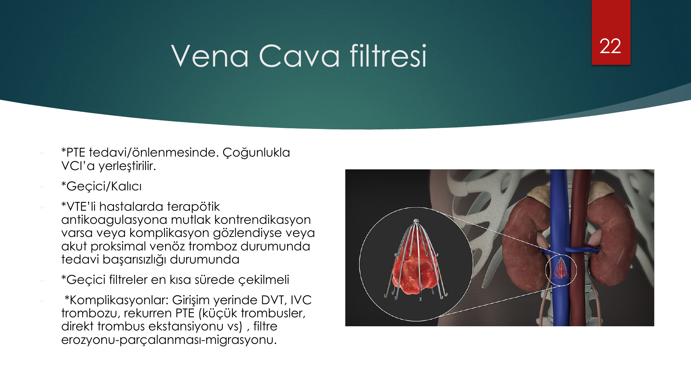
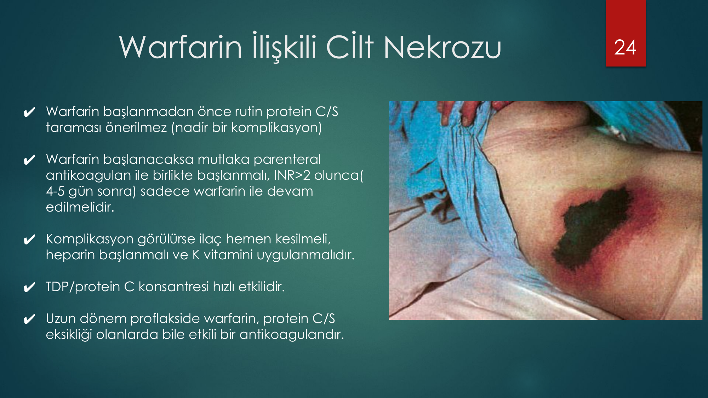

# TROMBOZ VE TEDAVİSİ

**Hazırlayan:** Doç. Dr. Atakan Turgutkaya
**Bölüm:** Aydın Adnan Menderes Üniversitesi -- Erişkin Hematoloji Bilim Dalı

---

## İÇİNDEKİLER

1. [Sınıflandırma](#sınıflandırma)
2. [Etyoloji ve Risk Faktörleri](#etyoloji-ve-risk-faktörleri)
3. [Wirchow Triadı](#wirchow-triadı)
4. [Herediter Trombofili](#herediter-trombofili)
5. [Akkiz Nedenler](#akkiz-nedenler)
6. [Trombofili Tarama Endikasyonları](#trombofili-tarama-endikasyonları)
7. [Laboratuvar Tanı](#laboratuvar-tanı)
8. [Derin Ven Trombozu (DVT)](#derin-ven-trombozu-dvt)
9. [D-dimer Yüksekliği Nedenleri](#d-dimer-yüksekliği-nedenleri)
10. [VTE Tedavisi](#vte-tedavisi)
11. [Kalıtsal Trombofilide Profilaksi](#kalıtsal-trombofilide-profilaksi)
12. [Gebelik ve Tromboz](#gebelik-ve-tromboz)
13. [Vena Cava Filtresi](#vena-cava-filtresi)
14. [Bazı Önemli Klinik Noktalar](#bazı-önemli-klinik-noktalar)
15. [Warfarin İlişkili Cilt Nekrozu](#warfarin-ilişkili-cilt-nekrozu)
16. [Arteriyel Tromboz](#arteriyel-tromboz)

---

## SINIFLANDIRMA

Tromboz, anatomik lokasyona göre iki ana grupta incelenir:

| Tip | Klinik tablolar |
|---|---|
| **Arteriyel tromboz** | Miyokard infarktüsü (MI), tıkayıcı arteriyel SVO, periferik arter hastalığı |
| **Venöz tromboz** | DVT, PTE, sinüs ven trombozu, portal ven trombozu (PVT) |

> **⚠️ ÖNEMLİ:** Venöz tromboz, **patent foramen ovale** üzerinden arteriyel embolizme yol açabilir (**paradoksik emboli**).

**Etyolojik gruplama:**
* Herediter (kalıtsal) yatkınlık
* Akkiz (edinilmiş) nedenler

> Çoğunlukla tromboz oluşumu **kombine faktörler** (birden fazla) sonucudur. Olguların ~%80'inde etyoloji bulunabilir.

---

## ETYOLOJİ VE RİSK FAKTÖRLERİ

> **Şema yorumu (Tromboz eşiği modeli):**
>
> Görselde tromboz oluşumu **toplam risk birikimi** modeliyle açıklanır. Üç farklı risk grubu intrinsik tromboz riskini yükseltir:
>
> * **Herediter risk faktörleri:** Antitrombin eksikliği, Protein C eksikliği, Protein S eksikliği, **Faktör V Leiden**, **Protrombin gen mutasyonu (G20210A)**
> * **Akkiz risk faktörleri:** İleri yaş, geçirilmiş VTE, kanser, obezite
> * **Tetikleyici faktörler:** Cerrahi, immobilizasyon, gebelik, östrojenler
>
> Birikimli risk **tromboz eşiğini** aştığında klinik tromboz ortaya çıkar. Bu model, neden çoğu olgunun **birden fazla** risk faktörü taşıdığını ve neden tek başına genetik mutasyonun (örn. izole FV Leiden taşıyıcılığı) çoğunlukla klinik trombozla sonuçlanmadığını açıklar.

---

## WİRCHOW TRİADI

> **Wirchow Triadı (1856) -- tromboz patogenezinin üç temel ayağı:**
>
> 1. 🩸 **Kan akışında yavaşlama (Staz)**
> 2. 🔴 **Vasküler endotelyal hasar**
> 3. ⚗️ **Hiperkoagulabl durum** (kanın içeriğinde değişiklikler)
>
> Bu üç bileşenin **bir arada** veya **tek başına** baskınlığı tromboz oluşturabilir. Tüm modern risk faktörleri (cerrahi → endotelyal hasar; immobilizasyon → staz; trombofili → hiperkoagulabilite) bu üçlüye yerleştirilebilir.

---

## HEREDİTER TROMBOFİLİ

### Yaygın Trombofiliyalar -- Prevalans ve Bağıl Risk

| Trombofili | Genel popülasyon prevalansı | VTE'li hastalarda prevalans | İlk VTE atak için bağıl risk |
|---|---|---|---|
| **AT eksikliği** | %0.02-0.2 | %1-7 | **16 kat artış** |
| **Protein C eksikliği** | %0.2-0.5 | %3-5 | **7 kat artış** |
| **Protein S eksikliği** | Bilinmiyor | %1 | **5 kat artış** |
| **Faktör V Leiden (heterozigot)** | %2-5 | %12-18 | **4-5 kat artış** |
| **Protrombin G20210A (heterozigot)** | %2 | %5-8 | **3-4 kat artış** |

> **🔑 Klinik anlam:** AT eksikliği en güçlü tromboz risk artışı yapar (16 kat) ama **prevalansı düşüktür**. Faktör V Leiden ise risk artışı görece düşük olsa da (4-5 kat) **toplumda ve VTE hastalarında çok daha sık** rastlanır -- bu yüzden popülasyon düzeyinde en sık trombofili nedenidir.

### İlk VTE Atak için Bağıl Risk -- Faktörler ve Etkileşim

| Durum / Risk faktörü | Bağıl risk | İnsidans (yıllık %) |
|---|---|---|
| Bazal risk | 1 | 0.008 |
| Protrombin G20210A mutasyonu | 2.8 | 0.02 |
| Oral kontraseptifler | 4 | 0.03 |
| Faktör V Leiden mutasyonu (heterozigot) | 7 | 0.06 |
| **Oral kontraseptifler + heterozigot Faktör V Leiden** | **35** | **0.29** |

> **Sinerji vurgusu:** Tek başına OK (4×) veya FVL heterozigot (7×) görece sınırlı risk verir; **birlikte alındığında risk 35 kata çıkar**. Bu, FVL taşıyıcılarına OK reçete edilirken neden dikkatli olunması gerektiğini gösterir.

---

## AKKİZ NEDENLER

* Santral venöz kateter varlığı
* **Malignite**
* Cerrahi (özellikle ortopedik cerrahi)
* Travma
* İmmobilizasyon
* Gebelik
* Oral kontraseptifler
* Hormon replasman tedavisi (HRT)
* **Bazı kanser tedavileri:** tamoksifen, talidomid, lenalidomid, asparaginaz
* Konjestif kalp yetersizliği (KKY)
* Konjenital kalp hastalıkları
* **Antifosfolipid sendromu**
* İleri yaş (≥65)
* Obezite
* Ciddi karaciğer hastalığı
* Myeloproliferatif neoplaziler
* PNH (Paroksismal Noktürnal Hemoglobinüri)
* İnflamatuar bağırsak hastalıkları
* Nefrotik sendrom
* 🚨 **COVID-19**

---

## TROMBOFİLİ TARAMA ENDİKASYONLARI

### Venöz Trombozlu Hastada Mutlaka Anlaşılması Gerekenler

1. **İlk venöz tromboz mu?**
2. **Provoke / Unprovoke?** (Antikoagülasyon süresi açısından kritik)
3. **1. derece yakınlarında 60 yaşından önce venöz tromboz** geçiren bir birey var mı?
4. **Kadın cinsiyette gebelik kaybı?** Olmuşsa kaç kez ve kaç haftalıkken?

### Rutin Kalıtsal Trombofili Taraması Önerilmeyen Durumlar

| Sol sütun | Sağ sütun |
|---|---|
| Majör geçici risk faktörü varlığı | Retinal ven tıkanıkları |
| Aktif kanser | Üst ekstremite trombozları* |
| SLE, Behçet hastalığı | Kateter ile ilişkili trombozlar |
| İltihabi bağırsak hastalığı | PNH, HİT, YDP ile ilişkili trombozlar |
| Miyeloproliferatif hastalıklar | Hastanede yatan hastalar |
| İlk VTE atak yaşı >60 | Arteriyel trombozlar |
| Serebral ven trombozları** | Karın içi ven trombozları** |

\* Torasik outlet sendromu veya kateter ilişkili üst ekstremite trombozları
\** **Serebral ve karın içi ven trombozlarında** herediter trombofili taramasının yeri tartışmalıdır; seçilmiş hastalarda yapılabilir. Karın içi ven trombozunda edinilmiş nedenler (kanser, travma, MPN, IBH, siroz, ilaç) dışlandıktan sonra kalıtsal trombofili taraması yapılmalıdır.

### İlk VTE Sonrası Tarama? (Tartışmalı)

Sonraki trombozlarla kalıtsal trombofili arasındaki ilişki net değildir. Kılavuzlar **majör geçici risk faktörü varlığında** tarama yapılmasını önermez:

* Aktif kanser
* İmmobilizasyon
* OK veya HRT
* Gebelik
* Postoperatif durum

---

## LABORATUVAR TANI

### Kalıtsal Trombofilide Önerilen Testler

| Trombofili | Önerilen Tarama Testi | Tanı koydurucu sonuç | Akut trombozda | Varfarin altında | Heparin altında |
|---|---|---|---|---|---|
| **AT** | Kromojenik fonksiyonel test (heparin kofaktör aktivitesi)* | <%60 | N veya düşük** | Etkilenmez | Etkilenmez (yanıltıcı düşük olabilir) |
| **PC** | Kromojenik fonksiyonel test* | <%60 | N veya düşük** | N veya düşük** | Etkilenmez |
| **PS** | Serbest PS düzeyi ve fonksiyonel test | <%55 | Düşük | N veya düşük** | Etkilenmez |
| **FVL** | PZR (PCR) | Homozigot, heterozigot | Etkilenmez | Etkilenmez | Etkilenmez |
| **PT G20210A** | PZR (PCR) | Homozigot, heterozigot | Etkilenmez | Etkilenmez | Etkilenmez |

\* AT ve PC eksikliğinde fonksiyonel testlerle **tip ayrımı yapılamaz**; antijenik testler kullanılabilir.

\** Edinsel nedenlerle (akut tromboemboli, inflamasyon, cerrahi, travma, neonatal dönem, karaciğer yetersizliği, YDP, NS, TTP, malnütrisyon, L-asparaginaz, HRT, OKS, gebelik, SLE, AFS, varisella, K vitamini eksikliği, sepsis, böbrek yetersizliği, postop dönem) yanıltıcı düşük bulunabilir.

### **⚠️ ÖNEMLİ ZAMANLAMA KURALLARI:**

* **Doğal antikoagülan eksikliği (AT, PC, PS) ölçümleri:** Akut trombotik ataktan **3 ay sonra**, OAK tedavi kesildikten ve PT(INR) normale döndükten sonra (genellikle OAK kesilmesinden **en az 7 gün sonra**) yapılmalıdır.
* **Heparin altında AT ölçümü:** Yanıltıcı şekilde normalden %20-30 düşük çıkabilir → **heparin tedavisi kesildikten en az 5 gün sonra** ölçülmelidir.
* Akut trombozda ve/veya antikoagülan tedavi altında **normal düzey bulunması doğal antikoagülan eksikliğini dışlar**.
* Doğal antikoagülan eksikliği tanısı için **farklı zamanlarda alınmış en az iki kan örneği** gereklidir.
* Tanı doğrulamak için **mutasyon analizi önerilmez** (sadece bilimsel araştırma amaçlı).
* **Genetik mutasyonlar (FVL, PT G20210A)** çevresel etkenlerden etkilenmediği için akut tromboemboli, inflamasyon, gebelik ve antikoagülan tedavi altında **güvenle bakılabilir**.

---

## DERİN VEN TROMBOZU (DVT)

### Klinik Bulgular

> **Klinik foto yorumu:** Görselde sol alt ekstremitede sağ bacağa kıyasla belirgin **asimetrik şişme**, **hiperemi (kızarıklık)** ve **dilate yüzeyel venler** dikkati çeker. Bu görünüm proksimal DVT'nin tipik klinik tablosudur. Hastalık akut bir kompartman sendromu veya selülit ile karışabileceğinden ayırıcı tanı önemlidir.

**DVT'nin klinik özellikleri:**
* Ödem
* Dilate süperfisyal venler
* Sıcaklık, ven trasesinde ağrı

> **⚠️ Önemli:** Hastaların **%50'den azı bütün bulgularla başvurur**. Klinik tek başına yeterli değildir, mutlaka pretest olasılık + objektif test gerekir.

**Ayırıcı tanı:**
* Kas zorlanması / yırtığı
* Paralize ekstremitede ödem
* Lenfanjit ve lenfatik obstrüksiyon
* Baker kisti ve rüptürü
* Selülit

### Wells Skoru (Klinik Risk Skorlaması)

| Klinik özellik | Skor |
|---|---|
| Aktif kanser (tedavi sürüyor, son 6 ay içinde uygulanmış, palyatif tedavi yapılıyor) | +1 |
| Paralizi, parezi veya alt ekstremitelere atel uygulanması | +1 |
| Üç günden uzun süreyle yatağa bağımlılık, son 4 hafta içinde majör cerrahi girişim | +1 |
| Derin ven sistemi üzerinde lokalize hassasiyet | +1 |
| Tüm bacakta şişme | +1 |
| Tuberositas tibia 10 cm altında yapılan ölçümde asemptomatik bacağa kıyasla **3 cm'den fazla artış** | +1 |
| Gode bırakan ödem (semptomatik bacakta daha fazla) | +1 |
| Derin ven trombozu öyküsü | +1 |
| Kollateral yüzeyel venler (non-variköz) | +1 |
| **DVT tanısından daha olası alternatif tanı** | **--2** |

**Risk değerlendirmesi:**

| Skor | Olasılık |
|---|---|
| ≤ 0 | Düşük |
| 1-2 | Orta |
| ≥ 3 | Yüksek |

### DVT Tanı Algoritması

> **Algoritma adım adım (Türkçe karşılığı):**
>
> **1. DVT belirti ve bulguları olan hastada Wells skoru ile klinik olasılık belirle:**
>
> **A) Düşük klinik olasılık →** D-dimer iste:
> * D-dimer **negatif** → DVT yok ✅
> * D-dimer **pozitif** → Ultrasonografi
>   * USG negatif → DVT yok
>   * USG pozitif → DVT tanısı konur
>
> **B) Orta-yüksek klinik olasılık →** Ultrasonografi iste:
> * USG **pozitif** → DVT tanısı konur
> * USG **negatif** → D-dimer iste:
>   * D-dimer pozitif → **1 hafta sonra USG'yi tekrarla**
>   * D-dimer negatif → DVT yok
>
> **🔑 Anahtar nokta:** D-dimer sadece düşük klinik olasılıkta dışlama amaçlı kullanılır (yüksek negatif prediktif değer); orta-yüksek olasılıkta öncelik USG'dir.

---

## D-DİMER YÜKSEKLİĞİ NEDENLERİ

D-dimer fibrin yıkım ürünüdür; **birçok klinik durumda yükselebilir**. DVT tanısında özgül değil, **dışlama** amaçlıdır.

| Durum | Mekanizma |
|---|---|
| **Tromboembolizm (arteriyel)** -- MI, inme, akut ekstremite iskemisi, intrakardiyak trombüs | İntravasküler tromboz ve fibrinoliz |
| **Tromboembolizm (venöz)** -- DVT, pulmoner emboli | İntravasküler tromboz ve fibrinoliz |
| **DİK (DIC)** | Yaygın intravasküler koagülasyon ve fibrinoliz |
| **İnflamasyon** -- COVID-19, ciddi enfeksiyonlar, sepsis | Akut inflamatuar yanıt ve koagülasyon yolak aktivasyonu, mikrovasküler tromboz |
| **Cerrahi / travma** | Doku iskemisi, doku nekrozu |
| **Karaciğer hastalığı** | Fibrin yıkım ürünlerinin azalmış klerensi |
| **Böbrek hastalığı** -- özellikle nefrotik sendrom, renal ven trombozu | Çoklu nedenler |
| **Vasküler hastalıklar** -- vasküler malformasyonlar, orak hücre hastalığı, vazo-oklüzyon | İntravasküler tromboz ve fibrinoliz |
| **Maligniteler** | Vasküler anormallikler, kanser prokoagülanı, mikrovasküler tromboz |
| **Trombolitik tedavi** | Fibrin yıkımı |
| **Gebelik** -- normal gebelik, preeklampsi/eklampsi | Koagülasyon sisteminde fizyolojik değişiklikler, mikrovasküler tromboz |

---

## VTE TEDAVİSİ

> Akut DVT ve PTE'li hastaların **ilk tedavisi**, kalıtsal özellik taşıyan veya taşımayan olgularda **farklılık göstermez**.

### Akut Tedavi Şeması

1. **Parenteral antikoagülan en az 5 gün:**
   * Unfraksiyone heparin (UFH) **veya**
   * **Düşük molekül ağırlıklı heparin (LMWH)** **veya**
   * Fondaparinux

2. **Oral antikoagülasyon (örn. varfarin):**
   * Parenteral heparin/fondaparinux uygulamasının **ilk günü başlat**
   * **Hedef INR: 2-3**

3. **Tedavi süresi:**
   * **Provoke** (geçici risk faktörü ile): **3 ay**
   * **Unprovoke** (idiyopatik): **6 ay**

### YOAK (Yeni Oral Antikoagülanlar) Alternatifi

| YOAK | Hedef |
|---|---|
| **Rivaroksaban** | Faktör Xa |
| **Apiksaban** | Faktör Xa |
| **Edoksaban** | Faktör Xa |
| **Dabigatran** | Faktör IIa (trombin) |

> YOAK'lar hem **akut dönemde** hem **uzun dönem profilakside** alternatif olarak kullanılabilir.
>
> **❌ Kontrendikasyonlar:**
> * Mekanik kapak replasmanı
> * Antifosfolipid antikor sendromu (AFAS)

### Önemli Klinik Noktalar

* **Re-tromboz ihtimali en fazla ilk 1 ayda**
* **Masif tromboz/emboli** durumunda **trombolitik tedavi** düşünülmelidir

---

## KALITSAL TROMBOFİLİDE PROFİLAKSİ

### Genel İlkeler

* **Ömür boyu antikoagülasyon almayanlarda bile**, riskin arttığı durumlarda (cerrahi, immobilizasyon vs.) mutlaka **DVT profilaksisi** verilmelidir
* Primer hiperkoagulabl durum saptanmasından **bağımsız olarak** ≥2 VTE yaşanmışsa **ömür boyu profilaksi** önerilir
* **İlk tromboz provoke ise** (geçici risk faktörü varlığında) ömür boyu profilaksi önerilmez

### VTE Tekrarının Önlenmesi -- Risk Stratifikasyonu

| Risk grubu | Klinik durum | Yaklaşım |
|---|---|---|
| **Yüksek risk** | ≥2 spontan tromboz · Hayatı tehdit eden 1 tromboz öyküsü · Atipik bölgede (mezenter, serebral ven) tromboz öyküsü · AFAS, AT eksikliği veya kombine hiperkoagulabl durumlarda 1 tromboz öyküsü | **Ömür boyu antikoagülasyon** |
| **Orta risk** | Provoke 1 kez trombüs öyküsü | Riskli durumlarda DVT profilaksisi |
| **Asemptomatik** | -- | Antikoagülasyon yok (riskli durumlarda profilaksi) |

### VTE Önlenmesi (Genel) -- DVT Riskini Arttıran Durumlar

* **Cerrahi** (özellikle ortopedik ve nörocerrahi)
* Major travma
* Uzamış yatak istirahati / immobilizasyon, paralizi, parezi
* Önceden VTE öyküsü
* Aktif malignite
* Morbid obezite
* İleri yaş

### Profilaksi Seçenekleri

| Yöntem | Detay |
|---|---|
| **Mekanik profilaksi** | Antiembolik çoraplar, aralıklı pnömatik kompresyon -- farmakolojik profilaksiye ek olarak veya sakıncalıysa tek başına |
| Oral rivaroksaban | 10 mg |
| Oral apiksaban | 2.5 mg 2×1 |
| Varfarin | INR 2.0-3.0 |
| LMWH | s.c. |
| Fondaparinux (anti-Xa) | 2.5 mg/gün s.c. |

---

## GEBELİK VE TROMBOZ

> Gebelik döneminde tromboz **özellikle lohusalık (postpartum) döneminde** görülür.

### Postpartum Tromboz Riski (Profilaksi Almayanlarda)

| Trombofili | Postpartum tromboz riski |
|---|---|
| **AT eksikliği** | %30-60 |
| **Protein C/S eksikliği** | %10-20 |
| **FV Leiden mutasyonu** | %30 |

> **⚠️ İlk 6 hafta postpartumda en yüksek risk dönemidir.**
>
> Tekrarlayan gebelik kaybı primer hiperkoagulabl durumlarda muhtemelen artar; ancak bu ilişki **AFAS'taki kadar net değildir**.

### Gebelik ve Trombofili Yönetimi

| Klinik durum | Antepartum | Postpartum |
|---|---|---|
| Düşük riskli trombofili + önceden VTE öyküsü **VEYA** Yüksek riskli trombofili ama VTE öyküsü yok | **Antikoagülasyon** | **Antikoagülasyon** |
| Düşük riskli trombofili ve VTE öyküsü yok | Seçili olgular hariç antikoagülasyon almaz | C/S yapılmışsa antikoagülasyon |
| Yüksek riskli trombofili ve VTE nedeniyle kronik antikoagülasyonda | **Tedavi dozunda antikoagülasyon** | **Tedavi dozunda antikoagülasyon** |

**Risk grupları:**
* **Düşük risk:** FVL veya protrombin gen heterozigot mutasyonu, protein C/S eksikliği
* **Yüksek risk:** AT eksikliği, FVL veya protrombin gen homozigot mutasyonu, çift heterozigot, protein C/S eksikliği + başka defekt

> **⚠️ İlaç seçimi:**
> * **Varfarin teratojendir** -- gebelikte kullanılmaz
> * **Emzirme döneminde varfarin verilebilir** ama **YOAK'lar değil**

---

## VENA CAVA FİLTRESİ

> **Şema yorumu:** Görselde inferior vena cava (IVC) içine yerleştirilmiş filtre cihazı görünür. Filtre, alt ekstremiteden veya pelvik venlerden kopabilecek büyük trombusları yakalayarak pulmoner artere ulaşmasını önler.

**Endikasyonları:**
* PTE tedavi/önlenmesinde -- çoğunlukla **VCI'ya** yerleştirilir
* **VTE'li hastalarda terapötik antikoagülasyona mutlak kontrendikasyon varsa**
* Antikoagülasyon altında **komplikasyon gözlendiyse**
* **Akut proksimal venöz tromboz** durumunda tedavi başarısızlığı

**Tipler:** Geçici / Kalıcı

> **⚠️ Geçici filtreler en kısa sürede çekilmelidir.**

**Komplikasyonlar:**
* Girişim yerinde DVT
* IVC trombozu
* Rekürren PTE (küçük trombüsler, direkt trombus ekstansiyonu vs.)
* Filtre erozyonu / parçalanması / migrasyonu

---

## BAZI ÖNEMLİ KLİNİK NOKTALAR

> **Unprovoke ve/veya rekürren trombus varsa okkült malignite ihtimali gözden kaçmamalıdır:**

**İlk değerlendirme (okkült malignite taraması):**
* İyi anamnez ve fizik muayene
* Hemogram + biyokimya
* Gaita gizli kan (GGK)
* TİT (Tam idrar tahlili)
* Kadınlarda mamografi
* PA akciğer grafisi (PAAG)
* Diğer testler ilk değerlendirmeye göre istenir

### Klinik İpuçları -- Spesifik Tromboz Tipleri ve Altta Yatan Hastalık

| Klinik bulgu | Düşündürdüğü hastalık |
|---|---|
| **Gezici süperfisyal tromboflebit (Trousseau sendromu)** | Okkült malignite (kuvvetle destekler) |
| **Nonbakteriyel trombotik endokardit** | Okkült malignite |
| **Hepatik ven trombozu (Budd-Chiari sendromu)** | MPN veya **PNH** |
| **Portal ven trombozu** | MPN veya PNH |
| **Yaygın IVC trombozu** | Renal hücreli karsinom |
| **Warfarin ilişkili cilt nekrozu** | Protein C/S eksikliği |
| **Rekürren, spontan ve özellikle ileri trimestr gebelik kayıpları** | AFAS (Antifosfolipid Antikor Sendromu) |

---

## WARFARİN İLİŞKİLİ CİLT NEKROZU

> **Klinik foto yorumu:** Görselde gövde yan duvarında **kömür-siyahı renkli, keskin demarke nekrotik bir cilt lezyonu** izlenir. Yağ doku zengin alanlarda (meme, gluteal bölge, uyluk, abdomen) sıktır. Patogenez: warfarin başlangıçta protein C ve S'yi (kısa yarı ömürleri nedeniyle) hızla baskılar; faktör II/IX/X henüz tükenmediği için **geçici hiperkoagulabl durum** oluşur ve mikrovasküler tromboz/cilt nekrozu meydana gelir. Protein C/S eksikliği olan hastalarda risk artmıştır.

### Önleme ve Tedavi

* **Warfarin başlanmadan önce rutin Protein C/S taraması önerilmez** (komplikasyon nadir)
* **Warfarin başlanacaksa mutlaka parenteral antikoagülan ile birlikte başlanmalı**, INR>2 olduktan sonra (4-5 gün) sadece varfarine geçilmelidir
* **Komplikasyon görülürse:**
   1. İlaç hemen kesilmeli
   2. Heparin başlanmalı
   3. K vitamini uygulanmalı
   4. **TDP veya Protein C konsantresi** hızlı etkilidir
* **Uzun dönem profilakside**, Protein C/S eksikliği olanlarda bile varfarin etkili bir antikoagülandır (sadece başlangıçta dikkatli olunmalı)

---

## ARTERİYEL TROMBOZ

> Aynı zamanda venöz tromboz etyolojisinde de rol alabilen ortak nedenler bulunur.

**Arteriyel tromboz nedenleri:**

* **Ateroskleroz** (en sık)
* Hiperhomosisteinemi
* **PNH*** (Paroksismal Noktürnal Hemoglobinüri)
* **Heparin İlişkili Trombositopeni (HİT)***
* **Antifosfolipid antikor sendromu***
* **MPN*** (Myeloproliferatif Neoplaziler)
* Vaskülit
* İnfektif endokardit, kardiyak trombüsler

\* Aynı zamanda venöz tromboz etyolojisinde de rol alır.

---

## ÖZET TABLO -- TROMBOZ YÖNETİMİ

| Konu | Anahtar Bilgi |
|---|---|
| **Wirchow Triadı** | Staz · Endotelyal hasar · Hiperkoagulabilite |
| **En sık herediter neden** | FV Leiden (heterozigot, %2-5 toplum) |
| **En yüksek risk artışı** | AT eksikliği (16 kat) |
| **Tarama zamanlaması** | Akut tromboz/OAK sonrası 3 ay sonra (mutasyon analizi her zaman yapılabilir) |
| **DVT tanı** | Wells skoru → düşük olasılık D-dimer / orta-yüksek USG |
| **D-dimer NPV** | Düşük olasılıkta dışlama için yüksek; spesifite düşük |
| **VTE tedavi süresi** | Provoke: 3 ay · Unprovoke: 6 ay (2. ataktan sonra ömür boyu) |
| **YOAK kontrendikasyon** | Mekanik kapak, AFAS, gebelik |
| **Postpartum en riskli** | İlk 6 hafta; AT eksikliğinde %30-60 |
| **Varfarin nekrozu** | Protein C/S eksikliği -- mutlaka heparin köprü |
| **Trousseau sendromu** | Gezici tromboflebit → okkült malignite |
| **Budd-Chiari** | MPN veya PNH ara |
