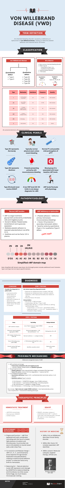
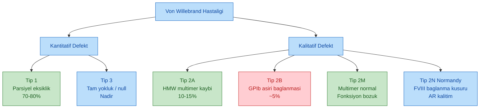
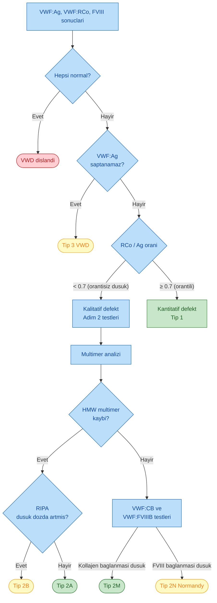
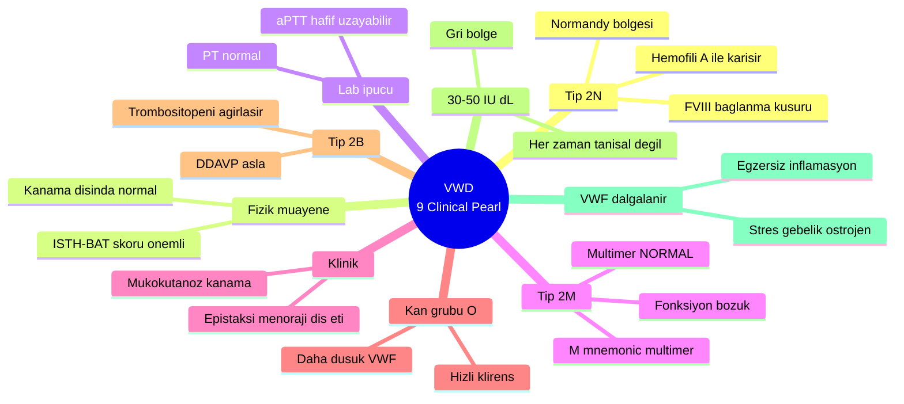
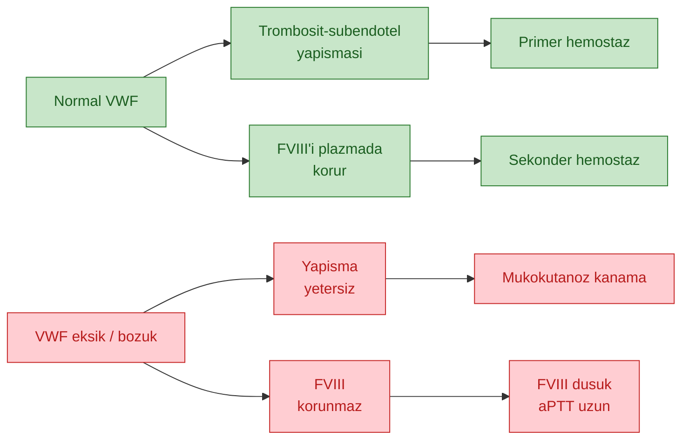
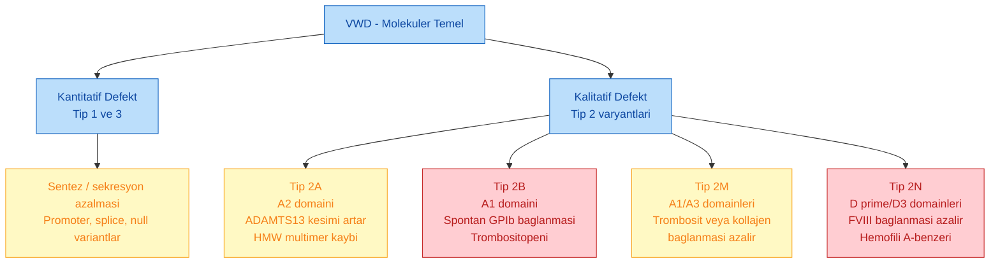
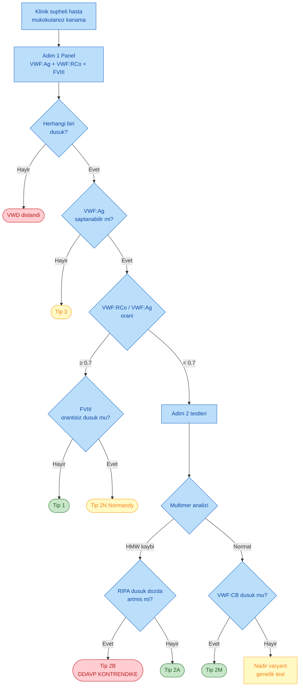
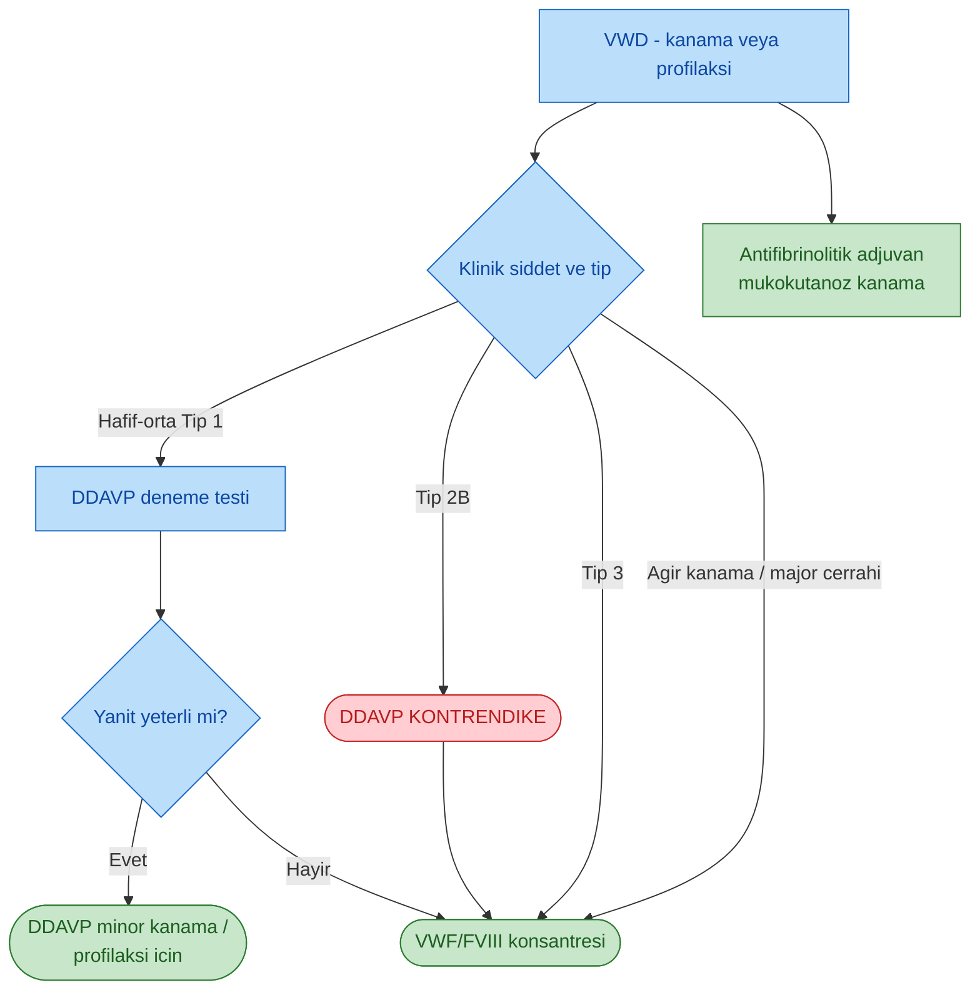
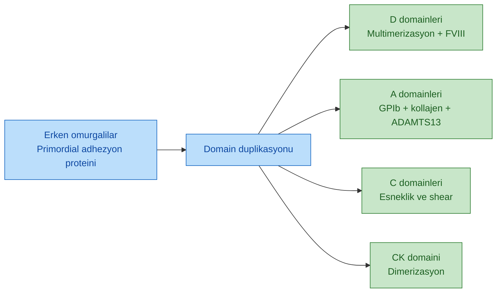
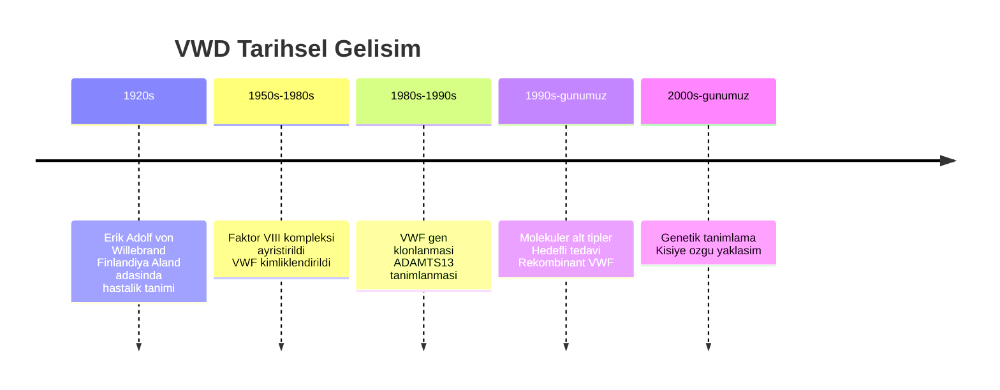

# VON WILLEBRAND HASTALIĞI (VWD) - KAPSAMLI İNCELEME

**Hazırlayan:** Prof. Dr. İrfan Yavaşoğlu
**Bölüm:** Hematoloji

---

## KAYNAK İNFOGRAFİK



*Kaynak infografik -- VWD tanım, sınıflama, patofizyoloji, VWF domain haritası, tanı adımları, tedavi ve tıp tarihi özeti.*

---

## İÇİNDEKİLER

1. [Tanım ve Genel Bakış](#tanim)
2. [Sınıflama - Kantitatif vs Kalitatif Defekt](#siniflama)
3. [VWD Tipleri - Detaylı Karşılaştırma](#tipler)
4. [Sınıflama Algoritması](#siniflama-algoritma)
5. [Klinik İnciler (9 Pearl)](#inciler)
6. [Patofizyoloji - Normal VWF vs Eksiklik](#patofizyoloji)
7. [VWF Domain Haritası](#domain-haritasi)
8. [Proksimal Mekanizmalar (Moleküler/Genetik Temel)](#proximate)
9. [Tanı - Adım 1 (İlk Panel)](#tani-adim1)
10. [Tanı - Adım 2 (Özgül Testler)](#tani-adim2)
11. [Tanı Algoritması (Mermaid)](#tani-algoritma)
12. [Terapötik Prensipler - Hemostatik Tedavi](#tedavi)
13. [DDAVP - Mekanizma ve Kontrendikasyonlar](#ddavp)
14. [Evrimsel Mekanizmalar](#evrim)
15. [Tıp Tarihi Özeti](#tarih)
16. [Hızlı Başvuru Tablosu](#ozet-tablo)

---

<a id="tanim"></a>

## TANIM VE GENEL BAKIŞ

**İnfografik tanımı (orijinal):** "An inherited bleeding disorder caused by a deficiency or dysfunction of **von Willebrand factor**, leading to defective platelet adhesion and reduced factor VIII levels."

**Türkçe:** Von Willebrand faktörünün (VWF) eksikliği veya işlev bozukluğu sonucu **trombosit adezyonunun bozulduğu ve FVIII düzeyinin düştüğü**, kalıtsal bir kanama hastalığıdır.

### At a Glance -- Bir Bakışta

| Özellik | Açıklama |
|---|---|
| **Sıklık** | En sık **kalıtsal kanama hastalığı** (popülasyonda ~%1) |
| **Defekt tipleri** | Kantitatif (Tip 1, 3) veya kalitatif (Tip 2) |
| **Sonuç 1** | Bozulmuş trombosit adezyonu (primer hemostaz ↓) |
| **Sonuç 2** | ↓ FVIII düzeyi (sekonder hemostaz da etkilenir) |
| **Klinik** | Mukokutanöz kanama (epistaksi, diş eti, menoraji, post-op kanama) |

**Görsel mnemonik:** İnfografikte kantitatif defekt **düşük göstergeli hız göstergesi** (miktar azalması), kalitatif defekt ise **kırık/ezilmiş fincan** (fonksiyon bozukluğu) ile gösterilir.

> **VWF iki görev yapar:** (1) subendotele yapışmayı köprüler (GPIb--V--IX üzerinden, yüksek-shear koşullarda kritik), (2) dolaşımdaki FVIII'i proteolizden korur ve plazma yarı ömrünü uzatır. Bu yüzden VWF eksikliğinde **hem primer hem sekonder hemostaz** etkilenir.

---

<a id="siniflama"></a>

## SINIFLAMA -- KANTİTATİF vs KALİTATİF DEFEKT

VWD iki büyük kategori altında toplanır:

| Kategori | Tip | Ana Sorun | Klinik |
|---|---|---|---|
| **Kantitatif Defekt** | Tip 1 | Kısmi VWF eksikliği (parsiyel azalma) | Hafif-orta |
| **Kantitatif Defekt** | Tip 3 | VWF'nin hemen hemen tamamen yokluğu | Ağır |
| **Kalitatif Defekt** | Tip 2A | HMW multimer kaybı, yapıştırıcı fonksiyon ↓ | Hafif-orta |
| **Kalitatif Defekt** | Tip 2B | Trombosit GPIb'ye aşırı afinite → trombositopeni | Hafif-orta |
| **Kalitatif Defekt** | Tip 2M | Trombosit/kollajen bağlanması ↓ (multimer normal) | Hafif-orta |
| **Kalitatif Defekt** | Tip 2N | FVIII bağlanma bölgesi mutasyonu | Hafif-orta (hemofili-benzeri) |



---

<a id="tipler"></a>

## VWD TİPLERİ -- DETAYLI KARŞILAŞTIRMA

| Tip | Mekanizma | Kalıtım | Sıklık | Şiddet | Multimer | RIPA | FVIII |
|---|---|---|---|---|---|---|---|
| **Tip 1** | VWF sentez veya sekresyon ↓ (parsiyel kayıp) | OD | **%70-80** | Hafif-orta | Normal (orantılı ↓) | Normal / ↓ | Hafif ↓ |
| **Tip 2A** | A2 domain mutasyonu → ↑ ADAMTS13 kesimi → HMW multimer kaybı | OD | %10-15 | Hafif-orta | **HMW kaybı** | ↓ (düşük ristosetin) | Normal / ↓ |
| **Tip 2B** | A1 domain mutasyonu → **spontan** GPIb bağlanması → trombositopeni | OD | ~%5 | Hafif-orta | HMW kaybı + plt tüketimi | **Artmış (düşük dozda)** | Normal / ↓ |
| **Tip 2M** | A1/A3 domainleri → ↓ trombosit veya kollajen bağlanması (multimer normal) | OD | **<%5** | Hafif-orta | Normal | ↓ | Normal / ↓ |
| **Tip 2N (Normandy)** | D'/D3 domainleri → ↓ FVIII bağlanması → düşük FVIII (hemofili A-benzeri) | **OR** | Nadir | Hafif-orta, hemofili-benzeri | Normal | Normal | **Belirgin ↓** |
| **Tip 3** | Null sentez -- VWF hemen hemen yok | **OR** | **<%1** | Ağır | Yok | Yok | Çok ↓ (hemofili düzeyi) |

**Kısaltmalar:** OD = otozomal dominant, OR = otozomal resesif, HMW = yüksek molekül ağırlıklı, RIPA = ristosetinle indüklenen trombosit agregasyonu.

---

<a id="siniflama-algoritma"></a>

## LABORATUVAR-BAZLI SINIFLAMA (MERMAİD AKIŞ)



---

<a id="inciler"></a>

## KLİNİK İNCİLER (9 CLINICAL PEARLS)

İnfografikteki 9 incinin orijinal sırası ve detayı:

| # | İnci (Orijinal) | Türkçe Açıklama | Pratik Sonuç |
|---|---|---|---|
| **1** | Type 2N represents **Normandy** | Tip 2N, 1989'da Normandiya bölgesinden tanımlanmış ailelerden isim alır; FVIII bağlanma kusuru. | Hemofili A'yı taklit eder -- **VWF:FVIIIB** testi şart. |
| **2** | Typically normal physical exam unless recent bleeding | Son kanama olmadıkça muayene tipik olarak normaldir. | Anamnez (**ISTH-BAT** skoru) muayeneden değerli. |
| **3** | Normal PT, and possible mild prolongation of aPTT | PT normal; FVIII düştüğünde aPTT hafif uzayabilir. | PT normal + aPTT sınırda uzun → VWD akılda tut. |
| **4** | Type 2M represents **Multimer** (multimer NORMAL) | 2M'nin "M"si multimer için -- burada multimer yapısı **normaldir**, bozulan bağlanma fonksiyonudur. | Multimer normal diye ret etme; **VWF:RCo/VWF:CB** testleri şart. |
| **5** | Presents primarily with mucocutaneous bleeding | En tipik prezentasyon mukokutanöz kanama (epistaksi, diş eti, menoraji). | Kas/eklem kanaması → hemofili düşün; mukokutanöz → VWD. |
| **6** | Blood group **O** is associated with lower baseline vWF levels | O grubunda VWF klirensi hızlıdır -- bazal düzey %25 daha düşük. | ABO'ya göre referans kullan; sınırda değerleri yanlış yorumlama. |
| **7** | Type 2B should **never** receive DDAVP | DDAVP mutant VWF salınımını tetikler → GPIb bağlanması artar → **trombositopeni kötüleşir**. | **Kesin kontrendike.** VWF/FVIII konsantresi tercih. |
| **8** | A low VWF level (30-50 IU/dL) is not always diagnostic for vWD | 30-50 IU/dL "gri bölge" -- fizyolojik/edinsel nedenler de düşürür. | Klinik + aile öyküsü + tekrarlı test ile değerlendir. |
| **9** | vWF levels fluctuate with physiology | Stres, gebelik, östrojen, inflamasyon, egzersiz VWF'yi yükseltir; akut faz reaktanıdır. | **Sakin dönemde test et.** Akut faz/gebelik tanıyı maskeler. |



---

<a id="patofizyoloji"></a>

## PATOFİZYOLOJİ -- NORMAL VWF vs EKSİKLİK

### Normal VWF İşlevi

* **Büyük multimerik glikoprotein** -- endotel hücreleri ve megakaryositlerde sentezlenir.
* **Weibel-Palade cisimcikleri** (endotel) ve **α-granüllerde** (trombosit) depolanır.
* Subendotelyal matrikse trombosit yapışmasını **GPIb--V--IX kompleksi** üzerinden sağlar (yüksek shear-rate koşullarında kritik -- arterioller).
* **Faktör VIII** plazmada VWF'ye bağlı taşınır → VWF onu proteolizden korur (aksi halde FVIII yarı ömrü dakikalarla ölçülür).
* HMW (ultra-large) multimerler ADAMTS13 tarafından kesilerek normal boyutlu multimerlere indirgenir.

### VWF Eksikliği veya Fonksiyon Bozukluğu

* **Trombosit yapışması bozulur** → primer hemostaz yetersiz → **mukokutanöz kanama**.
* **FVIII koruması kaybolur** → FVIII düzeyi düşer → sekonder hemostaz da etkilenir → aPTT uzayabilir.
* Kantitatif (Tip 1, 3) veya kalitatif (Tip 2) patern -- laboratuvar yorumunu değiştirir.



---

<a id="domain-haritasi"></a>

## VWF DOMAIN HARİTASI

Basitleştirilmiş VWF domain yapısı:

```
D'D3 --- A1 --- A2 --- A3 --- D4 --- B1 --- B2 --- B3 --- C1 --- C2 --- CK
```

| Domain | İşlev | İlgili VWD Tipi |
|---|---|---|
| **D'D3** | FVIII bağlanma bölgesi | **Tip 2N** mutasyonları |
| **A1** | GPIb (trombosit) bağlanması | **Tip 2B** (gain-of-function), **Tip 2M** (loss-of-function) |
| **A2** | ADAMTS13 tarafından kesim bölgesi | **Tip 2A** (kolay kesim → multimer kaybı) |
| **A3** | Kollajen bağlanması | **Tip 2M** (kollajen kusuru) |
| **D4 -- B1-B3** | Multimerizasyon ve stabilite | Tip 3'te tüm yapı kayıp |
| **C1-C2** | Esneklik ve shear'a yanıt | Evrimsel mekanik rol |
| **CK** | C-terminal dimerizasyon | Multimerizasyon başlangıcı |

> **Anahtar nokta:** A1 ve A2 komşu domainler olmasına rağmen tamamen zıt fenotiplere yol açar: A1 mutasyonu **spontan** trombosit bağlanmasına (Tip 2B, gain-of-function), A2 mutasyonu ise **aşırı ADAMTS13 proteoliziyle** büyük multimerlerin kaybına (Tip 2A) neden olur.
>
> **İnfografik notu:** "Simplified vWF domain map shown; the full-length protein includes additional D and C domains. **Type 1 ve Type 3 belirli bir domaine eşlenmez**" -- çünkü bu tipler tek bir fonksiyonel bölgenin kaybı değil, tüm proteinin nicel eksikliğidir.

---

<a id="proximate"></a>

## PROKSİMAL MEKANİZMALAR -- MOLEKÜLER/GENETİK TEMEL

İnfografiğin "Proximate Mechanisms / Molecular and genetic basis of vWD" bölümünün detaylı dökümü:

### VWF Sentez ve Depolama

* **Üretim yeri:** Endotel hücreleri ve megakaryositler
* **Depolama:** Endotelde **Weibel-Palade cisimcikleri**, trombositlerde **α-granüller**
* **Salınım:** Shear stress, trombin, histamin, DDAVP ile aktive edilir

### İki Temel İşlev

| İşlev | Mekanizma | Fizyolojik Rol |
|---|---|---|
| **Trombosit adezyonu** | Subendotelyal kollajen ↔ trombosit GPIb (yüksek shear'da) | Primer hemostaz -- arterioller ve mikrodolaşım |
| **FVIII taşıyıcılığı** | FVIII'i plazmada proteolizden korur | Plazma FVIII yarı ömrünü saatlere uzatır |

### VWD'de Moleküler Patoloji



### Anahtar Kavram

> **High-molecular-weight (HMW) multimerler = en hemostatik aktif formdur.** HMW multimerlerin kaybı veya fonksiyon bozukluğu → karakteristik kanama fenotipi. Bu yüzden 2A ve 2B'de (HMW kaybı) klinik daha belirgindir.

---

<a id="tani-adim1"></a>

## TANI -- ADIM 1 (İLK PANEL)

**Ne zaman VWD düşün?**

* **Kişisel veya aile öyküsü**: mukokutanöz kanama (epistaksi, diş eti, menoraji, post-operatif kanama)
* **Laboratuvar bulgusu**: anormal VWF ve/veya FVIII düzeyi veya fonksiyonu
* **aPTT**: hafif uzama olabilir (FVIII düşüklüğüne bağlı); **PT normal**

### İlk Panel Testleri

| Test | Ne Ölçer | Normal Aralık (yaklaşık) |
|---|---|---|
| **VWF:Ag** | VWF protein miktarı (immünoassay) | 50-200 IU/dL |
| **VWF:RCo** (ristosetin kofaktör) | VWF'nin işlev görme kabiliyeti (GPIb bağlanması) | 50-200 IU/dL |
| **FVIII:C** | Faktör VIII aktivitesi | 50-150 IU/dL |

### İlk Panel Yorumu

| Senaryo | Yorum |
|---|---|
| Tümü normal | **VWD dışlanır** |
| VWF:Ag **saptanamaz** | **Tip 3 VWD** |
| VWF:RCo/VWF:Ag orantısız düşük (**< 0.7**) | **Kalitatif defekt** → Adım 2 testlerine geç |
| VWF:RCo/VWF:Ag oranı **≥ 0.5-0.7** (orantılı düşüş) | **Kantitatif defekt (Tip 1)** |
| VWF:RCo/VWF:Ag oranı **< 0.5-0.7** (orantısız düşüş) | **Kalitatif defekt** → Adım 2 testlerine geç |
| FVIII orantısız düşük, VWF normal | **Tip 2N** şüphesi → Adım 2'ye geç |

---

<a id="tani-adim2"></a>

## TANI -- ADIM 2 (ÖZGÜL/ONAYLAYICI TESTLER)

Kalitatif defekt şüphesi, Tip 2 varyantını ayırt etmek için yapılan ikinci basamak testler:

| Test | Temel Bulgu | İşaret Ettiği Alt Tip |
|---|---|---|
| **VWF multimer analizi** | Yüksek molekül ağırlıklı (HMW) multimer kaybı | **Tip 2A** veya **Tip 2B** |
| **Ristosetinle indüklenen trombosit agregasyonu (RIPA)** | Düşük ristosetin dozunda **artmış agregasyon** | **Tip 2B** (2A'dan ayırır) |
| **RIPA** (standart doz) | Normal/düşük agregasyon | Tip 2A ile uyumlu |
| **VWF:CB** (kollajen bağlanma) | Multimer normal + kollajen bağlanması azalmış | **Tip 2M** |
| **VWF:FVIIIB** (FVIII bağlanma) | VWF:Ag / FVIII:C oranı **≤ 0.6** (FVIII düşük, VWF normal/yakın normal) | **Tip 2N (Normandy)** |
| **VWF gen dizilemesi** | Patojenik varyant tespiti | Karmaşık/atipik vakalar; opsiyonel |

---

<a id="tani-algoritma"></a>

## KAPSAMLI TANI ALGORİTMASI



---

<a id="tedavi"></a>

## TERAPÖTİK PRENSİPLER -- HEMOSTATİK TEDAVİ

İnfografikte "**THERAPEUTIC PRINCIPLES**" başlığı altında üç ana kol belirtilmiştir:

**1. VWF/FVIII konsantreleri** -- **2. Desmopressin (DDAVP)** -- **3. Antifibrinolitikler**

**İnfografik DDAVP tanımı (orijinal):** "DDAVP stimulates release of endothelial-stored vWF → useful in many **type 1 and selected type 2 (except 2B)** cases for minor bleeding or prophylaxis."


| Tedavi | Mekanizma | Endikasyon | Önemli Not |
|---|---|---|---|
| **VWF/FVIII konsantreleri** | Eksik proteinin yerine konulması | Tip 3, ağır Tip 1/2, Tip 2B, DDAVP'ye yanıtsız hastalar | Plazma kaynaklı veya rekombinant VWF |
| **DDAVP (desmopressin)** | Endotel Weibel-Palade cisimciklerinden VWF salınımı uyarır | Hafif-orta Tip 1, bazı Tip 2A, Tip 2M | **Tip 2B'de KONTRENDİKE**, Tip 3'te etkisiz |
| **Antifibrinolitikler** (traneksamik asit, EACA) | Pıhtı stabilizasyonu (fibrinolizi inhibe eder) | Mukokutanöz kanama adjuvanı; menoraji; diş çekimi | Pıhtı oluşturmaz -- yalnızca yerleşik pıhtıyı korur |
| **Hormonal tedavi** | Östrojen VWF düzeyini artırır | Menoraji yönetimi (oral kontraseptif) | Tip 3 hariç etkili |
| **Topikal hemostatikler** | Lokal kanama kontrolü | Epistaksi, diş eti | Adjuvan |



---

<a id="ddavp"></a>

## DDAVP -- MEKANİZMA, DOZ VE KONTRENDİKASYONLAR

**Desmopressin (DDAVP, 1-deamino-8-D-arginin vazopressin):**

### Mekanizma

* Endotel hücrelerindeki **V2 reseptörü** üzerinden **Weibel-Palade cisimciklerinden VWF + FVIII salınımını** uyarır.
* **3-6 kat** düzey artışı sağlar; etki 30-60 dakikada başlar, 4-6 saat pik, 12-24 saat sürer.
* Depo tükenmesi (taşiflaksi) -- **48 saatte iki dozdan fazla uygulanmamalı**.

### Endikasyonlar

* **Hafif-orta Tip 1** -- deneme dozuna yanıt iyi.
* **Bazı Tip 2A, Tip 2M** -- yanıt değişken (test dozu şart).
* **Minor kanama, diş çekimi, küçük cerrahi, profilaksi**.

### Kontrendikasyonlar ve Uyarılar

| Durum | Neden |
|---|---|
| **Tip 2B** | Anormal VWF salınımı → trombosit agregasyonu artışı → **trombositopeni** ağırlaşır |
| **Tip 3** | Salınacak VWF deposu yok → etkisiz |
| **< 2 yaş çocuk** | Ciddi hiponatremi riski |
| **Kardiyovasküler hastalık, yaşlı** | Su retansiyonu, hiponatremi, konvülsiyon riski |
| **Açık su alımı** | Doz sonrası 24 saat sıvı kısıtlaması şart |
| **Gebelik** | Güvenlik kısıtlı, dikkatle kullanılır |

### Uygulama

* İV: 0.3 μg/kg (30 dakika infüzyon), intranazal: 150-300 μg, subkutan: 0.3 μg/kg.
* **Test dozu** şarttır -- yanıt hastaya özgüdür; ilk cerrahi öncesi planlı bir dozda VWF:Ag, VWF:RCo ve FVIII ölçülür (bazal, 1 saat, 4 saat).

---

<a id="evrim"></a>

## EVRİMSEL MEKANİZMALAR

İnfografikteki "Evolutionary Mechanisms" bölümünün üç alt başlığı:

### 1. Origins and Function (Köken ve İşlev)

VWF, **erken omurgalılarla birlikte ortaya çıkmıştır** -- kapalı dolaşım sistemi ve trombositlerin evrimleşmesiyle eş zamanlı. **Primordial görevi:** yüksek shear akımı altında trombositleri hasarlı damar duvarına bağlamaktır.

### 2. Co-evolution and Modular Design (Modüler Tasarım)

VWF'nin **D-, A-, C- ve CK-domainleri** evrim boyunca **domain duplikasyonu ve özelleşme** yoluyla aşama aşama eklenmiştir. Sonuç: **"moleküler İsviçre çakısı"** -- hemostaz için çok işlevli yapışkan protein.



### 3. Balancing Act (Denge Eylemi)

Doğal seçilim VWF ekspresyonunu ve **ADAMTS13 tarafından kesimi** birlikte ayarlamıştır:

| Uç | Sonuç |
|---|---|
| **Çok az VWF veya işlev bozukluğu** | Hemoraji -- VWD fenotipi |
| **Çok fazla / kesilmemiş ultralarge VWF** | Mikrovasküler tromboz -- TTP fenotipi |
| **Dengeli** | Sağlıklı hemostaz |

**Shear-dependent aktivasyon:** VWF yalnızca yüksek shear'lı dar damarlarda açılır ve aktiftir -- bu mekanizma durağan koşullarda patolojik tromboz riskini sınırlar.

**ABO kan grubu:** O grubu daha hızlı VWF klirensine sahiptir -- bazal düzey %25 daha düşük.

---

<a id="tarih"></a>

## TIP TARİHİ ÖZETİ



**Erik Adolf von Willebrand (1870-1949):** Finlandiyalı hekim, 1926'da Aland adalarındaki bir ailede kalıtsal, pseudohemofilik bir kanama bozukluğunu tanımladı. Klasik hemofiliden farklı klinik (mukokutanöz baskın, kadın ve erkekte eşit) onu ayrı bir antite olarak düşündürdü.

| Dönem | Olay |
|---|---|
| **1926** | Erik von Willebrand "Finlandiya ailesi"nde kalıtsal pseudohemofiliyi tanımlar |
| **1950'ler** | FVIII aktivitesi ile VWF aktivitesinin farklı moleküllere ait olduğu anlaşılır |
| **1971** | Zimmerman VWF'yi immünolojik olarak tanımlar |
| **1980'ler** | VWF geni klonlanır (12. kromozom) |
| **1990'lar** | Moleküler alt tipleme, ADAMTS13 tanımlanması |
| **2000'ler** | Rekombinant VWF, gen dizileme ile tanı, ISTH-BAT kanama skoru |
| **Günümüz** | Hedefli tedavi, profilaksi protokolleri, gen terapisi araştırmaları |

---

<a id="ozet-tablo"></a>

## HIZLI BAŞVURU TABLOSU

| Özellik | Tip 1 | Tip 2A | Tip 2B | Tip 2M | Tip 2N | Tip 3 |
|---|---|---|---|---|---|---|
| **Kalıtım** | OD | OD | OD | OD | **OR** | **OR** |
| **Sıklık** | %70-80 | %10-15 | ~%5 | Nadir | Nadir | Nadir |
| **VWF:Ag** | ↓ | ↓ | ↓ | ↓ | Normal/hafif ↓ | **Yok/çok ↓** |
| **VWF:RCo** | ↓ | ↓↓ | ↓↓ | ↓↓ | Normal | Yok |
| **FVIII** | Hafif ↓ | Normal/↓ | Normal/↓ | Normal/↓ | **Belirgin ↓** | Çok ↓ |
| **Multimer** | Normal (azalmış) | **HMW kaybı** | HMW kaybı | Normal | Normal | Yok |
| **RIPA (düşük doz)** | Normal | ↓ | **Artmış** | ↓ | Normal | Yok |
| **Trombosit** | Normal | Normal | **↓** | Normal | Normal | Normal |
| **DDAVP** | ✅ | Değişken | **❌ Kontrendike** | Değişken | Sınırlı | ❌ Etkisiz |
| **VWF konsantresi** | Gerekirse | Evet | **Evet (1. seçenek)** | Evet | Evet | **Zorunlu** |
| **Kanama şiddeti** | Hafif-orta | Hafif-orta | Hafif-orta | Hafif-orta | Hafif-orta (hemofili-benzeri) | **Ağır** |
| **Ayırıcı ipucu** | Orantılı azalma | HMW kaybı | Trombositopeni | Multimer normal ama RCo düşük | FVIII orantısız düşük | Tam yokluk |

---

## SON SÖZ

> **VWD, "görünüşte hafif ama atlanırsa yıkıcı" bir hastalıktır.** Büyük bir cerrahi veya obstetrik olay öncesi tanı konamamış VWD, hayatı tehdit eden kanamalara yol açabilir. Mukokutanöz kanama anamnezi olan her hastada -- **"normal olabilecek" aPTT ve trombosit sayısına rağmen** -- VWD ayırıcı tanıda bulunmalıdır.
>
> Tanı koymak, **ne zaman DDAVP verebileceğini, ne zaman verilmeyeceğini** bilmek kadar önemlidir: **Tip 2B'de DDAVP'dan kaçın.** **Tip 3'te konsantre zorunlu.** **Tip 2N'yi hemofili A ile karıştırma.**

---

**Kaynak:** Prof. Dr. İrfan Yavaşoğlu ders materyali, ISTH-BAT kanama skoru kaynakları, ASH 2021 VWD Kılavuzu. İnfografik kaynağı: **The Blood Project** (Hemato2.pdf).
