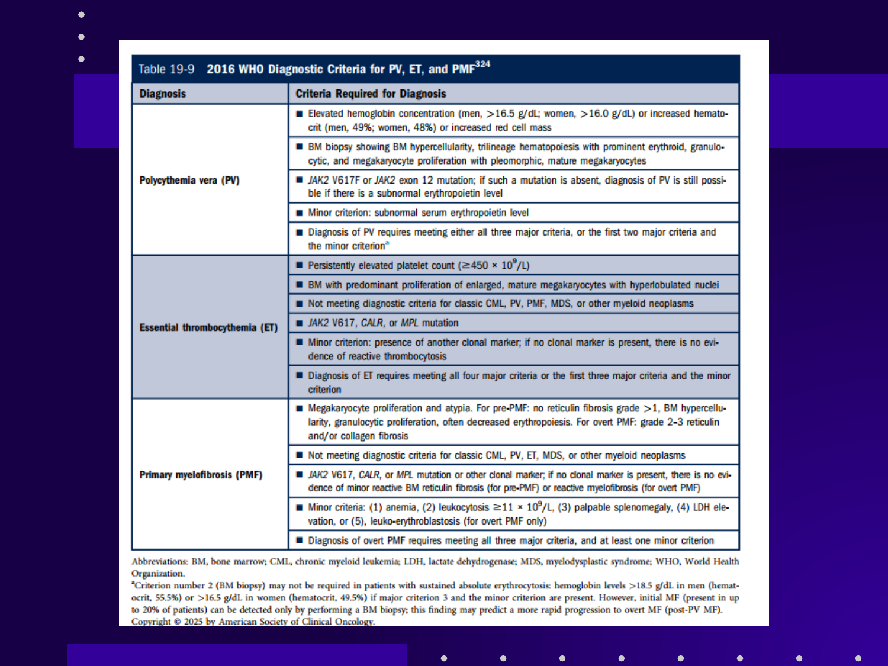
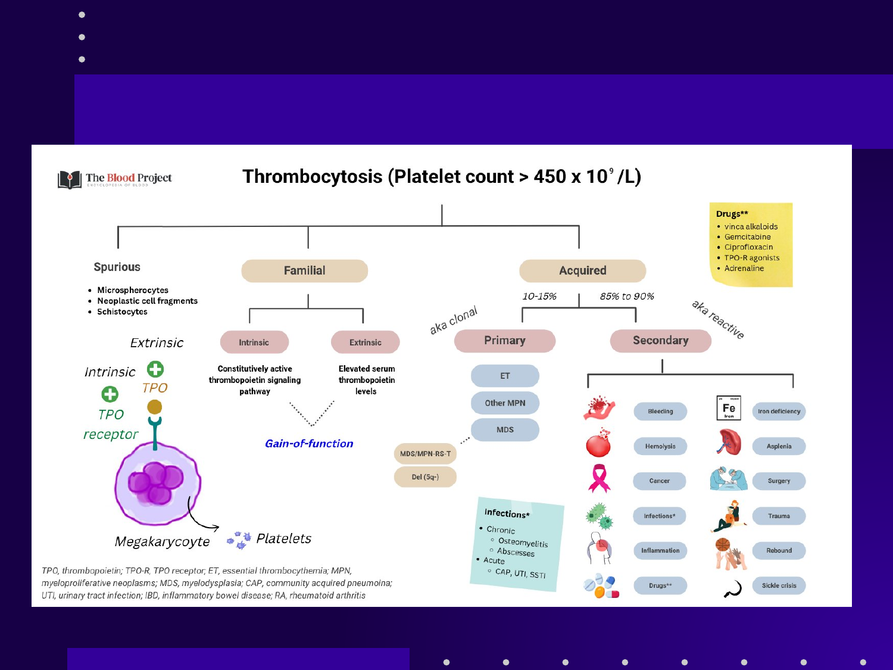
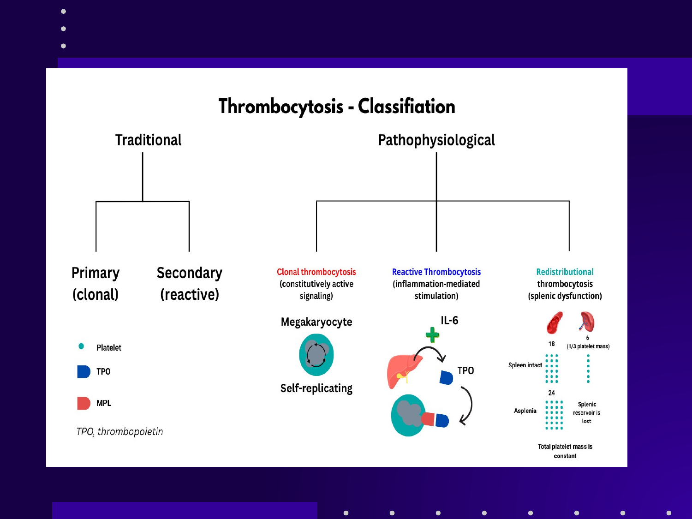
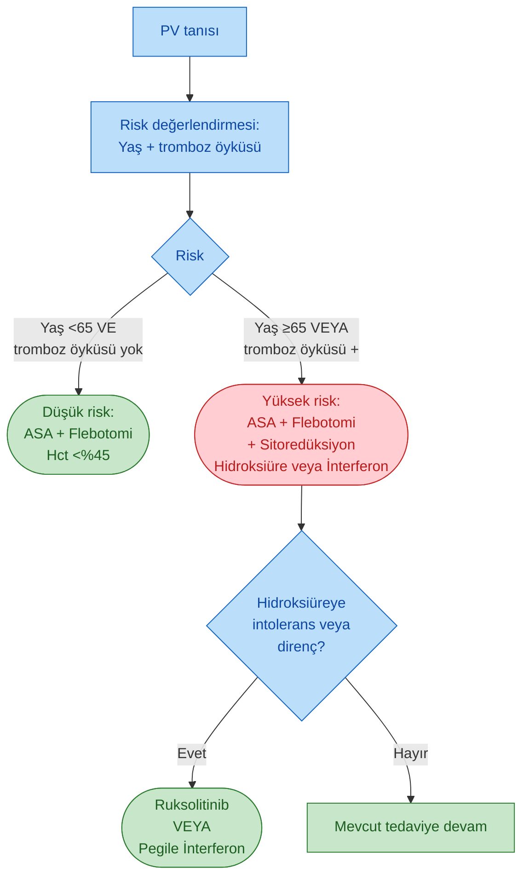
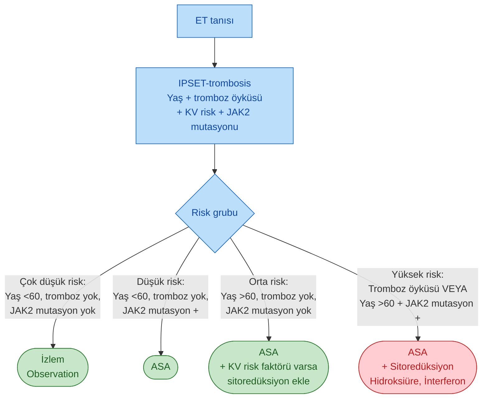
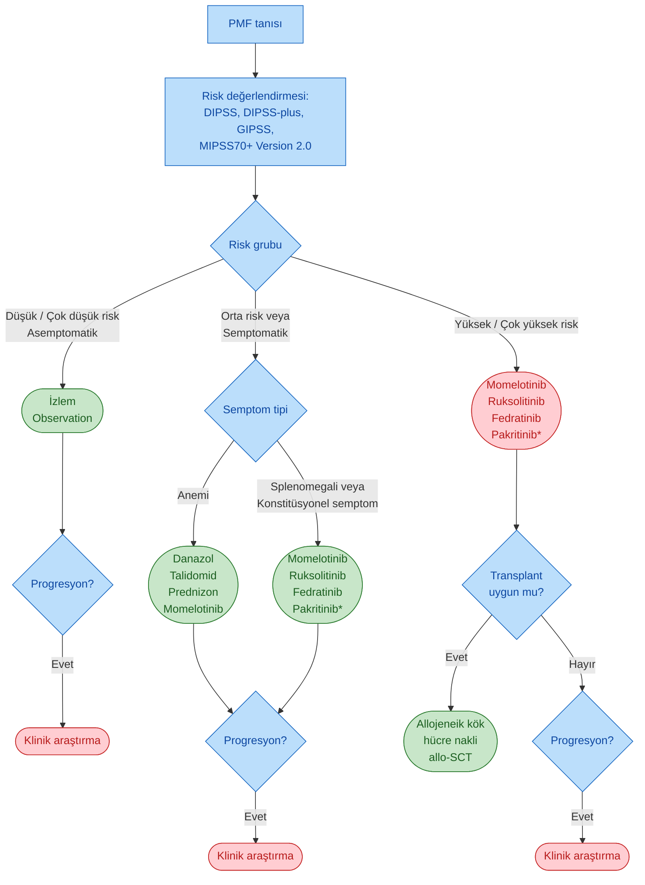
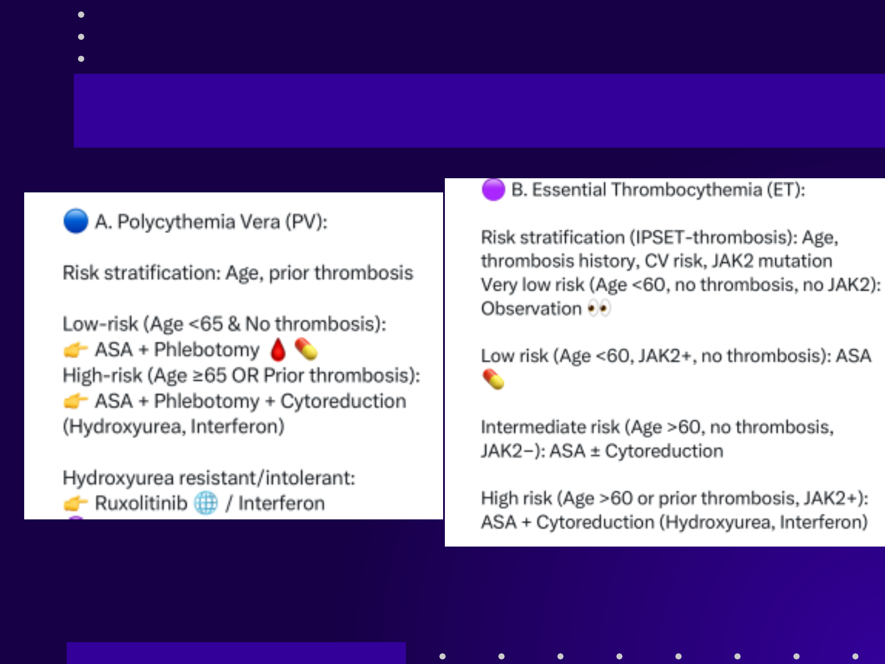
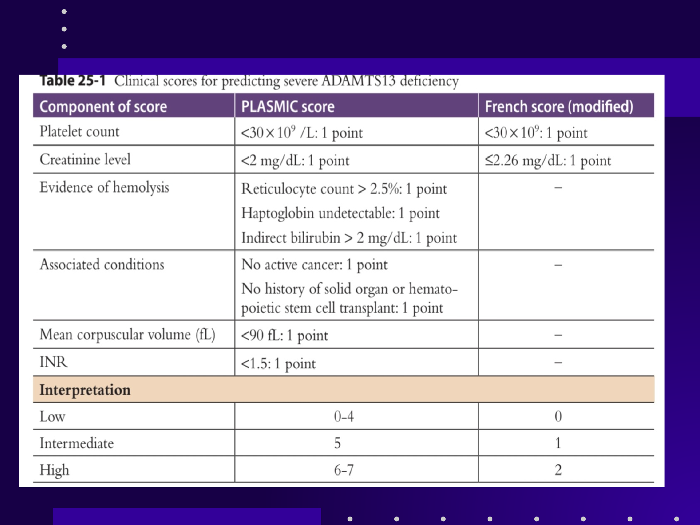
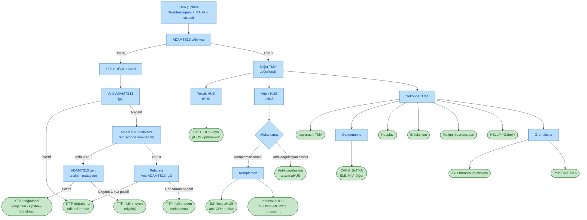

# YAVAŞOĞLU GENEL REFERANS SLAYT SETİ

**Hazırlayan:** Prof. Dr. İrfan Yavaşoğlu
**Bölüm:** Aydın Adnan Menderes Üniversitesi Tıp Fakültesi -- İç Hastalıkları AD, Hematoloji BD
**Konu:** Hematoloji ders sunumlarında kullanılan görsel referans seti -- MPN, ITP, TMA/TTP, DAT, koagülasyon testleri, hiperferritinemi, MM risk sınıflama

---

## İÇİNDEKİLER

1. [Miyeloproliferatif Neoplaziler (MPN)](#miyeloproliferatif-neoplaziler-mpn)
   - [WHO 2016 Tanı Kriterleri (PV, ET, PMF)](#who-2016-tanı-kriterleri-pv-et-pmf)
   - [Trombositoz Nedenleri](#trombositoz-nedenleri)
   - [Trombositoz Sınıflaması](#trombositoz-sınıflaması)
   - [MPN Tedavi Algoritması](#mpn-tedavi-algoritması)
   - [PV ve ET Tedavisi](#pv-ve-et-tedavisi)
   - [PMF Tedavisi](#pmf-tedavisi)
2. [İmmun Trombositopeni (ITP) Tanısı](#i̇mmun-trombositopeni-itp-tanısı)
3. [Trombotik Mikroanjiyopatiler (TMA / TTP)](#trombotik-mikroanjiyopatiler-tma--ttp)
   - [TTP Patogenezi -- ADAMTS13 Eksikliği](#ttp-patogenezi----adamts13-eksikliği)
   - [PLASMIC ve French Skoru](#plasmic-ve-french-skoru)
   - [TMA Ayırıcı Tanı Algoritması](#tma-ayırıcı-tanı-algoritması)
4. [Direkt Antiglobulin Testi (DAT) Yorumu](#direkt-antiglobulin-testi-dat-yorumu)
5. [Koagülasyon Testleri ve Hastalık Yorumu](#koagülasyon-testleri-ve-hastalık-yorumu)
6. [Hiperferritinemi ve Hemokromatozis Yaklaşımı](#hiperferritinemi-ve-hemokromatozis-yaklaşımı)
7. [Multipl Myeloma Risk Sınıflaması](#multipl-myeloma-risk-sınıflaması)
   - [mSMART 4.0 Sınıflaması (Mayo Clinic)](#msmart-40-sınıflaması-mayo-clinic)
   - [HRMM Genomik Sınıflaması (IMS-IMWG Konsensüs)](#hrmm-genomik-sınıflaması-ims-imwg-konsensüs)

---

## MİYELOPROLİFERATİF NEOPLAZİLER (MPN)

### WHO 2016 Tanı Kriterleri (PV, ET, PMF)

#### Polisitemia Vera (PV) -- Tanı Kriterleri

**Majör kriterler:**
1. **Yükselmiş hemoglobin** (erkek **>16.5 g/dL**, kadın **>16.0 g/dL**) **veya** **yükselmiş hematokrit** (erkek **>%49**, kadın **>%48**) veya artmış eritrosit kütlesi
2. **Kemik iliği biyopsisinde:** Hipersellülarite, üç seri (trilineage) hematopoezi -- belirgin **eritroid, granülositik ve megakaryositik proliferasyon**, pleomorfik matür megakaryositler
3. **JAK2 V617F veya JAK2 ekzon 12 mutasyonu**

**Minör kriter:** Subnormal serum eritropoietin düzeyi

> **Tanı:** **3 majör kriter** karşılanır, **veya** **ilk 2 majör kriter + minör kriter**.

#### Esansiyel Trombositoz (ET) -- Tanı Kriterleri

**Majör kriterler:**
1. Sürekli yüksek **trombosit ≥ 450 × 10⁹/L**
2. **Kemik iliğinde** hiperloblule nükleuslu büyük matür megakaryositlerin baskın proliferasyonu
3. **KML, PV, PMF, MDS** veya diğer myeloid neoplazi kriterlerini karşılamamak
4. **JAK2 V617F, CALR veya MPL mutasyonu**

**Minör kriter:** Başka bir klonal marker varlığı; klonal marker yoksa reaktif trombositoz dışlanmalı

#### Primer Miyelofibroz (PMF) -- Tanı Kriterleri

**Majör kriterler:**
1. **Megakaryosit proliferasyonu + atipisi** (küçük-büyük, hiperkromatik, lobüle nükleus, dense kümeleşme); pre-fibrotik PMF'de **retikulin/kollajen fibroz grade 0-1**, overt PMF'de **grade 2-3**
2. **KML, PV, ET, MDS** veya diğer myeloid neoplazi kriterlerini karşılamamak
3. **JAK2, CALR veya MPL mutasyonu** -- yoksa **başka klonal marker** varlığı

**Minör kriterler** (en az 1):
- Anemi (eşlik eden komorbiditeye bağlı değil)
- Lökositoz **WBC ≥ 11 × 10⁹/L**
- Palpabl splenomegali
- LDH > normal
- Lökoeritroblastik tablo (periferik yaymada myeloid + nükleuslu eritrosit)

> **🔑 Klinik özet:**
> * **PV** = JAK2 + eritrosit hakim
> * **ET** = JAK2/CALR/MPL + trombosit hakim, kemik iliğinde yapı korunmuş
> * **PMF** = JAK2/CALR/MPL + fibroz + ekstramedüller hematopoez (splenomegali, lökoeritroblastik tablo)

---

### Trombositoz Nedenleri

#### Görselin Türkçe Karşılığı (Trombositoz: Plt > 450 × 10⁹/L)

##### 1. Spurious (Yalancı/Yapay) Trombositoz

Otomatik sayım cihazının "trombosit" olarak saydığı hatalı partiküller:
- **Mikrosferositler** (küçük eritrositler trombosit gibi sayılır)
- **Neoplastik hücre fragmanları**
- **Şistositler**

##### 2. Familyal (Kalıtsal) Trombositoz

İntrensek ya da ekstrensek mekanizmalarla:
- **İntrensek**: Konstitütif aktif trombopoietin sinyal yolağı (megakaryositte) -- "**gain-of-function**" mutasyonları
- **Ekstrensek**: Yükselmiş **trombopoietin (TPO)** düzeyleri

##### 3. Edinsel (Acquired) Trombositoz

| Tip | Oran | Mekanizma |
|---|---|---|
| **Primer (klonal)** | **%10-15** | Klonal MPN: **ET, diğer MPN (PV, PMF, KML)**, **MDS** (özellikle **MDS/MPN-RS-T** -- ring sideroblast + trombositoz, ve **del(5q) sendromu**) |
| **Sekonder (reaktif)** | **%85-90** | Aşağıda detaylı |

##### Sekonder (Reaktif) Trombositoz Detaylı Nedenleri

| Kategori | Örnekler |
|---|---|
| **Kanama (bleeding)** | Akut kan kaybı sonrası |
| **Hemoliz** | Hemolitik anemi |
| **Demir eksikliği (iron deficiency)** | En sık reaktif neden |
| **Kanser (cancer)** | Solid tümör, lenfoma |
| **Cerrahi (surgery)** | Postop |
| **Travma (trauma)** | Doku hasarı sonrası |
| **İnflamasyon (inflammation)** | RA, IBD (inflamatuar barsak hastalığı), kollajen doku hastalıkları |
| **Enfeksiyon -- Kronik** | **Osteomiyelit, abse** |
| **Enfeksiyon -- Akut** | **CAP** (toplum kökenli pnömoni), **ÜSE** (üriner sistem enf.), **SBI** (ciddi bakteriyel enf.) |

##### Trombositozu Tetikleyen İlaçlar

- **Vinka alkaloidleri** (vinkristin, vinblastin)
- **Gemsitabin**
- **Siprofloksasin**
- **TPO-R agonistleri** (eltrombopag, romiplostim)
- **Adrenalin** (geçici redistribüsyonel)

> **💡 Klinik:** Bilinmeyen nedenli trombositoz hastasında ilk akla gelmesi gerekenler: **demir eksikliği, kronik enfeksiyon, malignite, kanama**, post-splenektomi. Yalnızca bunlar dışlandıktan sonra MPN düşünülmelidir.

---

### Trombositoz Sınıflaması

#### Şemanın Türkçe Karşılığı

İki farklı yaklaşımla trombositoz sınıflandırılabilir:

##### A. Geleneksel Sınıflama
- **Primer (klonal)** -- MPN
- **Sekonder (reaktif)** -- enfeksiyon, inflamasyon vb.

##### B. Patofizyolojik Sınıflama (modern)

| Tip | Mekanizma | Klinik Örnek |
|---|---|---|
| **Klonal trombositoz** | Megakaryositte **konstitütif aktif sinyalizasyon** (kendini replike eden megakaryosit) | ET, PV, PMF, KML |
| **Reaktif trombositoz** | **İnflamasyon aracılı uyarı** -- IL-6 → karaciğerden TPO sentezi → megakaryosit aktivasyonu | Enfeksiyon, kronik inflamasyon, malignite, demir eksikliği |
| **Redistribüsyonel trombositoz** | **Splenik disfonksiyon** -- normalde dalakta tutulan trombositler dolaşıma katılır | Splenektomi, asplenizm |

> **🔑 Önemli ayrıntı (görseldeki sayılar):** Normalde toplam trombosit kütlesinin **~1/3'ü dalakta** rezervde tutulur (görselde "18 vs 6"). Aspleni durumunda **splenik rezervuar kaybolur** ve tüm trombositler dolaşımda görünür → trombosit sayısı yapay olarak yükselir (toplam trombosit kütlesi sabit kalır).

---

### MPN Tedavi Algoritması

#### A. PV Tedavi Algoritması (ASCO 2025 Figure 19-7)

#### B. ET Tedavi Algoritması (IPSET-thrombosis)

#### C. PMF Tedavi Algoritması

> **\* Pakritinib endikasyonu:** Trombosit sayısı **<50 × 10⁹/L** olan PMF hastalarında diğer JAK inhibitörleri yerine **Pakritinib** tercih edilir (trombositopeniyi şiddetlendirmez).

> **🔑 Algoritma kilit noktaları:**
>
> * **PV'de 2 basamaklı yaklaşım:** Tüm hastalara **ASA + flebotomi**; yüksek riskte **sitoredüksiyon** eklenir; HÜ direnci/intoleransında **2. basamak Ruksolitinib veya İnterferon**
> * **ET'de IPSET-trombosis 4 grup:** Çok düşük risk → izlem; Düşük risk → sadece ASA; Orta risk → ASA (KV risk varsa sitoredüksiyon); Yüksek risk → ASA + sitoredüksiyon
> * **PMF'de 3 ana yol:**
>   1. Asemptomatik düşük risk → **izlem** (gözlemle, hastalığı bozma)
>   2. Semptomatik orta risk → **JAK inhibitörleri** (semptom kontrolü) ± anemi tedavisi
>   3. Yüksek risk transplant uygun → **allojeneik kök hücre nakli (tek küratif)**
> * **Tüm 3 hastalıkta progresyon → klinik araştırma** önerilir
> * **Trombositopenik PMF'de tercih:** Pakritinib (Plt <50 × 10⁹/L)
> * **Anemik PMF'de tercih:** Momelotinib (anemiyi düzeltir, JAK1/2 + ACVR1 inhibitörü)

> **Kaynak:** ASCO-SEP 2025, Figure 19-7 (American Society of Clinical Oncology, 2025)

---

### PV ve ET Tedavisi

#### A. Polisitemia Vera (PV) Tedavisi

**Risk stratifikasyonu:** Yaş + önceki tromboz öyküsü

| Risk Grubu | Kriter | Tedavi |
|---|---|---|
| **Düşük risk** | Yaş <65 + tromboz öyküsü yok | **ASA + Flebotomi** (Hct hedefi <%45) |
| **Yüksek risk** | Yaş ≥65 **veya** önceki tromboz | **ASA + Flebotomi + Sitoredüksiyon** (Hidroksüre veya İnterferon) |
| **Hidroksüre dirençli/intoleran** | -- | **Ruksolitinib** veya **Pegile interferon** |

#### B. Esansiyel Trombositoz (ET) Tedavisi

**Risk stratifikasyonu (IPSET-tromboz):** Yaş + tromboz öyküsü + KV risk + JAK2 mutasyonu

| Risk Grubu | Kriter | Tedavi |
|---|---|---|
| **Çok düşük risk** | Yaş <60 + tromboz yok + JAK2 yok | **Sadece izlem** (observasyon) |
| **Düşük risk** | Yaş <60 + JAK2+ + tromboz yok | **ASA** |
| **Orta risk** | Yaş >60 + tromboz yok + JAK2− | **ASA + Sitoredüksiyon** |
| **Yüksek risk** | Yaş >60 **veya** önceki tromboz + JAK2+ | **ASA + Sitoredüksiyon** (Hidroksüre, İnterferon) |

> **🔑 Tedavi temel ilkeleri:**
> * **PV'de flebotomi cornerstone'dur** (köşe taşı); Hct hedefi **<%45** (CYTO-PV çalışması)
> * **ET'de ASA başlangıç tedavisi** -- ancak **JAK2 mutasyonu yoksa ve yaşlı değilse** kontrendike olabilir
> * **PMF'de sitoredüksiyon, ek olarak** SCT (kök hücre nakli) tek küratif seçenek

---

### PMF Tedavisi

#### C. Primer Miyelofibroz (PMF) Tedavisi

**Risk stratifikasyonu:** **DIPSS, DIPSS-plus, GIPSS, MIPSS70+ v2.0**

| Risk Grubu | Tedavi |
|---|---|
| **Düşük / Çok düşük risk (asemptomatik)** | **Observasyon** |
| **Orta risk / Semptomatik** | Splenomegali / konstitüsyonel semptom → **Ruksolitinib, Momelotinib, Fedratinib, Pakritinib** |
| **Yüksek / Çok yüksek risk (transplant uygun)** | **Allojeneik kök hücre nakli (allo-SCT)** |

#### Özel Durumlar

| Durum | Tedavi |
|---|---|
| **Anemi** | Danazol, Talidomid, Prednizon, **Momelotinib** |
| **Trombositopeni (Plt <50 × 10⁹/L)** | **Pakritinib** tercih edilir (diğer JAK inhibitörlerinden farklı olarak trombositopenide güvenli) |
| **Progresyon** | Klinik araştırma |

> **🔑 Sınav notları (görseldeki "Exam Pearls"):**
> * **PV:** Flebotomi cornerstone; Ruksolitinib HÜ direncinde
> * **ET:** Tüm JAK2+ hastalarda **ASA** -- kontrendikasyon olmadıkça
> * **PMF:** SCT tek küratif tedavi; **JAK inhibitörleri sadece semptom kontrolü** (hastalığı düzeltmez)
> * **Pakritinib** trombositopenisi olan PMF hastasında tercih edilir

> **Kaynak:** ASCO-SEP 2025, Myeloproliferative Neoplasms -- Treatment Algorithm Update

---

## İMMUN TROMBOSİTOPENİ (ITP) TANISI

### Şemanın Türkçe Karşılığı

> **🔑 ITP TANISI = DIŞLAMA TANISIDIR**
>
> ITP tanısı genellikle **CBC + periferik yayma + öykü + fizik muayene** ile konur. Direkt tanısal tek bir test yoktur; **diğer trombositopeni nedenlerinin sistematik olarak dışlanması** gereklidir.

#### Tanı Bileşenleri

| Bileşen | Aranan |
|---|---|
| **Öykü (History)** | Kanama belirtileri, ilaç maruziyeti, viral enfeksiyon öyküsü, aile öyküsü, otoimmun hastalık öyküsü |
| **Fizik muayene (Physical)** | Kanama dışında **normal olmalı** -- splenomegali, lenfadenopati, hepatomegali sekonder neden düşündürür |
| **CBC + periferik yayma** | İzole trombositopeni (eritrosit, lökosit, lökosit alt grupları normal) |

#### Ek Testler -- Önerilen (International Consensus Report ASH-ICR önerileri)

- **HIV** *
- **HCV** *
- **H. pylori** -- erişkinde önerilir
- **B12 düzeyi** -- ek değerlendirmede
- **Kemik iliği** -- atipik vakalarda, **>60 yaş**, tedaviye yanıtsız hastada

> *: International Consensus Report ve **ASH-ICR** kılavuzlarına göre önerilir

#### Potansiyel Yararı Olan Testler

- **Antifosfolipid antikorlar**
- **Antitiroid antikorlar + tiroid fonksiyonu**
- **Antinükleer antikor (ANA)**
- **Gebelik testi** -- çocuk doğurma yaşındaki kadınlar
- **Trombosit-ilişkili immunoglobulin** (uncommon yarar)

#### Ayırıcı Tanı

| Düşünülecek tablo | Ayırt edici özellik |
|---|---|
| **Karaciğer hastalığı** | KC enzim/sentez bozukluğu, hipersplenizm |
| **Alkol kötüye kullanımı** | KC, MCV ↑ |
| **Kemik iliği hastalığı** | Diğer sitopeniler, anormal yayma, displazi |
| **Evans sendromu** | Direkt Coombs (+) hemoliz + ITP |
| **Gestasyonel trombositopeni** | Gebelik, hafif-orta, postpartum düzelir |
| **Familyal trombositopeni** | Ailede öykü, MYH9 ilişkili sendromlar, anormal trombosit boyutu |
| **TMA (TTP/HUS)** | Mikroanjiyopatik hemolitik anemi, şistosit, nörolojik/renal bulgular |
| **Psödo-trombositopeni** | EDTA aglütinasyonu -- sitratlı tüpte tekrar sayım normal |

---

## TROMBOTİK MİKROANJİYOPATİLER (TMA / TTP)

### TTP Patogenezi -- ADAMTS13 Eksikliği

#### Şemanın Türkçe Açıklaması (Patogenez Adım Adım)

> **🔑 Mekanizma çok kritik -- TTP'yi anlama anahtarı:**

##### Normal Durum (sol panel)

* **Endotel hücresi** uyarıldığında **VWF multimerleri** salgılar
* Bu VWF damar yüzeyine bağlanır
* **ADAMTS13** (VWF-cleaving protease) plazmada bu multimerleri **küçük parçalara böler** -- böylece trombositler aşırı bağlanamaz

##### TTP'de (sağ panel) -- ADAMTS13 Eksikliği

1. **Anti-ADAMTS13 IgG** otoantikor ADAMTS13'ü inaktive eder (edinsel TTP) **veya** ADAMTS13 geninde kalıtsal mutasyon vardır (Upshaw-Schulman / kongenital TTP)
2. **Ultralarge VWF (UL-VWF) multimerleri** parçalanmaz, endotele bağlı kalır
3. Kan akışındaki **trombositler GPIb-IX reseptörü üzerinden UL-VWF'ye aşırı bağlanır**
4. **Trombosit-zengin trombüsler** mikrodamarlarda oluşur
5. Eritrositler bu trombüsleri geçerken **mekanik olarak parçalanır** → **şistositler**
6. **Doku iskemisi** -- özellikle beyin (nörolojik bulgu), böbrek (renal yetmezlik), miyokard

#### TTP Klasik Pentadı (Klinik Tablo)

| Bulgu | Sıklık |
|---|---|
| **Trombositopeni** | Hemen daima |
| **Mikroanjiyopatik hemolitik anemi (MAHA)** -- şistosit + LDH ↑↑ + haptoglobin ↓ | Hemen daima |
| **Nörolojik bulgular** | %60 (konfüzyon, baş ağrısı, fokal defisit, koma) |
| **Renal yetmezlik** | %50 (genellikle hafif; HUS'a göre belirgin değil) |
| **Ateş** | %25 |

> **⚠️ ÖNEMLİ:** Pentad **tam olmadan da TTP düşünülmeli**. **Trombositopeni + MAHA** tek başına yeterli; tedavi geciktirilmemeli (mortalite tedavisiz **>%90**, plazmaferezle <%20).

---

### PLASMIC ve French Skoru

#### Tablonun Türkçe Karşılığı (Tablo 25-1: Severe ADAMTS13 Eksikliği Tahmini)

| Skor Bileşeni | PLASMIC Skoru | French Skoru (modifiye) |
|---|---|---|
| **Trombosit sayısı** | <30 × 10⁹/L: **1 puan** | <30 × 10⁹/L: **1 puan** |
| **Kreatinin düzeyi** | <2 mg/dL: 1 puan | ≤2.26 mg/dL: 1 puan |
| **Hemoliz kanıtı** | Retikülosit >%2.5: 1 puan Haptoglobin saptanamaz: 1 puan İndirekt bilirubin >2 mg/dL: 1 puan | -- |
| **Eşlik eden hastalık** | Aktif kanser yok: 1 puan Solid organ veya KHN nakli öyküsü yok: 1 puan | -- |
| **MCV (fL)** | <90 fL: 1 puan | -- |
| **INR** | <1.5: 1 puan | -- |
| **TOPLAM PUAN** | **0-7** | **0-2** |

#### Yorumlama

| Risk Düzeyi | PLASMIC | French |
|---|---|---|
| **Düşük** | 0-4 | 0 |
| **Orta** | 5 | 1 |
| **Yüksek** | 6-7 | 2 |

> **🔑 Klinik kullanım:**
> * **PLASMIC ≥6** veya **French ≥1** → TTP olasılığı yüksek; **ADAMTS13 sonucu beklemeden plazmaferez başlanmalı**
> * Bu skorlar **hızlı klinik karar** içindir (ADAMTS13 düzeyi sonucu 24-48 saat alabilir; bu sürede tedavi gecikmemeli)
> * **PLASMIC duyarlılığı:** ~%90; **özgüllüğü:** ~%80

---

### TMA Ayırıcı Tanı Algoritması

#### Algoritmanın Mermaid Karşılığı

> **🔑 Algoritma özeti (Williams Hematology Figure 25-2):**
>
> 1. **Trombositopeni + MAHA + şistosit** → TMA şüphesi
> 2. **ADAMTS13 aktivitesi <%10** → **TTP doğrulandı**
>    * **Anti-ADAMTS13 IgG pozitif** → **iTTP** (edinsel immun, en sık)
>    * **Anti-ADAMTS13 IgG negatif** → ADAMTS13'ü **remisyonda yeniden ölç**:
>      * Hâlâ <%10 → **ADAMTS13 gen analizi**
>        * Mutasyon pozitif → **cTTP doğrulandı** (Upshaw-Schulman)
>        * Mutasyon negatif → **TTP -- bilinmeyen etiyoloji**
>      * >%10 → **Relapsta anti-ADAMTS13 IgG ölçümü**
>        * En az 1 kez pozitif → **iTTP**
>        * Her zaman negatif → **TTP -- bilinmeyen mekanizma**
> 3. **ADAMTS13 aktivitesi >%10** → **TTP değil, diğer TMA grupları:**
>    * **Toksik HUS (tHUS):** Shiga toksin (E. coli O157:H7, Shigella) → STEC-HUS; **pHUS** = pnömokok-aracılı (S. pneumoniae nöraminidaz)
>    * **Atipik HUS (aHUS) -- 2 mekanizma:**
>      * **Kompleman aracılı** → **Kalıtsal** (CFH/CFI/MCP/C3/CFB mutasyonları) veya **Edinilmiş** (anti-CFH antikoru); tedavi: **eculizumab/ravulizumab**
>      * **Antikoagülasyon aracılı** → DGKE, PLG, THBD mutasyonları
>    * **Sekonder TMA:**
>      * **İlaç-aracılı:** kinin, siklosporin, takrolimus, gemsitabin, kalsineurin inh.
>      * **Otoimmunite:** **CAPS** (katastrofik antifosfolipid sendromu), **ScTMA** (skleroderma renal kriz), **SLE**, HIV, diğer
>      * **Neoplazi**, **Enfeksiyon**, **Malign hipertansiyon**
>      * **HELLP / Gebelik** (preeklampsi)
>      * **Greft alıcısı:** Akut humoral rejeksiyon, **post-BMT TMA (TA-TMA)**

---

## DİREKT ANTİGLOBULİN TESTİ (DAT) YORUMU

#### Tablonun Türkçe Karşılığı (Tablo 12-1)

| DAT Reaksiyon Paterni | Ayırıcı Tanı |
|---|---|
| **Sadece IgG (+)** | • **Sıcak antikor otoimmun hemolitik anemi (wAIHA)** • İlaç-immun hemolitik anemi (hapten/ilaç adsorbsiyon tipi veya otoantikor tipi) |
| **Sadece kompleman (C3) (+)** | • Sıcak antikor AİHA -- IgG düzeyi tespit eşiğinin altında • Sıcak-aktif **IgM** otoantikor • **Soğuk aglütinin hastalığı (CAD)** • **Paroksismal soğuk hemoglobinürisi (PCH)** • İlaç-immun hemolitik anemi -- ternary immun kompleks tipi |
| **IgG + kompleman (+)** | • Sıcak antikor AİHA • İlaç-immun hemolitik anemi -- otoantikor tipi (nadir) |

> **🔑 Klinik kullanım kuralları:**
>
> * **Sıcak AİHA = IgG ± C3d** -- en sık DAT paterni; IgG dalakta makrofaj fagositozuna yol açar (ekstravasküler hemoliz)
> * **CAD = sadece C3** -- IgM kompleman aktive eder, kompleman lize olduktan sonra C3d eritrosit yüzeyinde kalır; **soğuk aglütinin titresi** ile doğrulanır
> * **PCH = sadece C3** -- Donath-Landsteiner antikoru; sifiliz, viral enfeksiyon (özellikle çocukta) sonrası
> * **İlaç-immun hemoliz** üç ayrı patern: hapten (penisilin), immun kompleks (kinidin), otoantikor tipi (α-metildopa)

---

## KOAGÜLASYON TESTLERİ VE HASTALIK YORUMU

### Tablonun Türkçe Karşılığı

| Test | Ölçtüğü | Uzar (Hastalık) | Normal Aralık |
|---|---|---|---|
| **PT (Protrombin zamanı)** | **Ekstrensek + ortak yol** (FVII, X, V, II, I) | Warfarin, K vit. eksikliği, KC hst., FVII eksikliği | Hemofili A/B'de NORMAL |
| **INR** | Standardize PT | Warfarin tedavisi, K vit. eks. | -- |
| **aPTT** | **İntrensek + ortak yol** (FXII, XI, IX, VIII, X, V, II, I) | Hemofili A/B, vWH, lupus antikoagulan, heparin | Hemofili'de erken |
| **Trombin zamanı (TT)** | Fibrinojen → fibrin dönüşümü | DIC, KC hst., heparin etkisi, dabigatran, disfibrinojenemi | Trombosit bozukluklarında |
| **Fibrinojen düzeyi** | Direkt fibrinojen ölçümü | Disfibrinojenemi, DIC, KC hst., afibrinojenemi | -- |
| **D-dimer** | Fibrin yıkım ürünü | DIC, PE, DVT, gebelik, malignite | KC fonksiyon defektleri |
| **Kanama zamanı** | Trombosit fonksiyonu + integrite | vWH, ASA, trombosit fonksiyon bozuklukları | -- |
| **Fibrin yıkım ürünleri (FDP)** | Fibrinoliz aktivitesi | DIC, PE, fibrinolitik tedavi (tPA) | -- |

### Yorumlama Kısa Kuralları (Tabloya göre)

| Lab paterni | Olası tanı |
|---|---|
| **Sadece PT uzun** | Erken warfarin, FVII eksikliği |
| **Sadece aPTT uzun** | Heparin, Hemofili A/B, FXI/FXII eksikliği, vWH erken, lupus antikoagulanı, FVIII inhibitör |
| **PT + aPTT uzun** | DIC, KC hastalığı, geç warfarin, K vit. eksikliği ileri, masif transfüzyon |
| **TT + fibrinojen ↓** | DIC, hipofibrinojenemi |
| **D-dimer ↑** | DIC, VTE (DVT/PE), maligniteler, gebelik |
| **Mixing study (1:1 NP karışımı)** | Düzelir → faktör eksikliği; düzelmez → inhibitör |
| **vWH ipucu** | aPTT (+)/TT/Fbg normal + KZ uzun + Ristosetin kofaktör ↓ |

---

## HİPERFERRİTİNEMİ VE HEMOKROMATOZİS YAKLAŞIMI

### Algoritmanın Türkçe Karşılığı

#### Adım 1: Hiperferritinemi Tespit Eşiği

> **Hiperferritinemi:** Serum ferritin **>200 ng/mL (kadın)** veya **>300 ng/mL (erkek)**

#### Adım 2: Yüksek Karaciğer Enzimleri Var mı?

| Yüksek karaciğer enzimleri | İlişkili tablolar |
|---|---|
| Var | Siroz, artrit, diyabet (HH komplikasyonları) |

#### Adım 3: Risk Popülasyonu Değerlendirmesi

**Risk grupları:**
- Avrupa kökenli (özellikle Kuzey Avrupa)
- Aile öyküsü (HH veya açıklanamamış KC hst.)

#### Adım 4: Transferrin Satürasyonu Ölçümü

> **Anahtar test: Transferrin satürasyonu >%45?**

##### A. Transferrin satürasyonu **>%45** → HFE gen mutasyon testi

| HFE Genotipi | Yorumlama |
|---|---|
| **p.C282Y/p.C282Y** (homozigot) | **Klasik herediter hemokromatozis** |
| **p.C282Y/p.H63D** | Compound heterozigot (hafif) |
| **p.C282Y/p.S65C** | Compound heterozigot (hafif) |
| **Diğer** | Non-HFE hemokromatozis (HJV, HAMP, TFR2, SLC40A1) düşün |

##### B. Transferrin satürasyonu **<%45** → Sekonder nedenleri ara

**İnflamatuvar nedenler:**
- **Metabolik sendrom** + obezite + insülin direnci
- **Düzenli alkol tüketimi** (alkol abstinence sonrası 6-12 hafta tekrar bak)
- **Otoimmun hastalık**
- **Aktif kanser**
- **Sistemik enfeksiyon**
- **Metabolik disfonksiyonla ilişkili steatotik karaciğer hastalığı (MASLD)**

#### Adım 5: Karaciğer Değerlendirmesi

**Hereditary hemokromatoziste:**
- **MRI with T2*** (demir kantifikasyonu)
- Yüksek riskte → karaciğer biyopsisi (fibroz değerlendirmesi)

**Sekonder demir yüklenmesinde:**
- Sebepler aranmalı: ileri transfüzyon yükü, ineffektif eritropoez (talasemi, MDS, kongenital diseritropoetik anemi), oral demir aşırı kullanımı, sık IV demir uygulaması, hemoliz, KC hastalığı, **nadir genetik hastalıklar**

> **🔑 Klinik özet:**
> * **Hiperferritinemi ≠ hemokromatozis** -- ilk basamak: **transferrin satürasyonu**
> * **>%45 + HFE C282Y homozigot** = klasik HH
> * **<%45** çoğunlukla sekonder (en sık: MASLD, alkol, inflamasyon)
> * **Tedavi:** HH'de **flebotomi** (haftalık 500 mL kan, ferritin <50 ng/mL hedefi); sekonderse altta yatan neden tedavisi
> * Tedavi edilmezse → **siroz, hepatosellüler karsinoma riski, diyabet, artropati, kardiyomiyopati**

---

## MULTİPL MYELOMA RİSK SINIFLAMASI

### mSMART 4.0 Sınıflaması (Mayo Clinic)

#### Sınıflamanın Türkçe Karşılığı

##### A. Yüksek Risk Multipl Myeloma (HRMM)

**1. Yüksek Riskli Sitogenetik Anomaliler**

| # | Anomali | Açıklama |
|---|---|---|
| 1 | **Del 17p**¹ ve/veya **TP53 mutasyonu** | Tümör baskılayıcı kaybı |
| 2 | **Bi-allelik del 1p** | Her iki kromozom 1p kaybı |
| 3 | **t(4;14), t(14;16) veya t(14;20)** + **Gain/Amp 1q** veya **Del 1p** | Translokasyon + 1q veya 1p anomalisi birleşimi |
| 4 | **Gain/Amp 1q + Del 1p** | İki ayrı 1. kromozom anomalisi |

**2. Diğer Yüksek Risk Bulguları**

| Bulgu | Yorumlama |
|---|---|
| **β2 mikroglobulin (β2M) >5.5 mg/L + normal renal fonksiyon** | İleri tümör yükü |
| **Yüksek plazma hücre S-fazı** | Aktif proliferasyon |
| **Primer plazma hücreli lösemi (pPCL)** | Akut, agresif seyir |
| **Yeni tanı MM + ekstramedüller hastalık** | Kötü prognoz |

**3. Double-Hit Myeloma**

> **Tanım:** Yüksek riskli sitogenetik kriterlerden **2 veya daha fazlasının** birarada bulunması (cancer clonal fraction ≥%20, CD138+ pürifiye hücrelerde NGS analiziyle)

##### B. Standart Risk Multipl Myeloma

Yüksek risk anomalisi **olmayan** MM, izole olarak:

- **Trizomiler** (3, 5, 7, 9, 11, 15, 19, 21 kromozomları)
- **t(11;14)** -- iyi prognostik (CCND1 yeniden düzenlenmesi)
- **t(6;14)** -- iyi prognostik

> **¹** del(17p) eşik değeri: anomalinin pozitif sayılması için **CCF (cancer clonal fraction) ≥%20** -- CD138-pozitif/pürifiye hücrelerde değerlendirilir

> **🔑 Klinik kullanım:**
> * mSMART risk sınıflaması, **tedavi yoğunluğu seçimi** ve **konsolidasyon kararını** etkiler
> * **Yüksek risk MM** → 4'lü indüksiyon (Dara-VRd), erken otolog kök hücre nakli (ASCT), idame tedavi yoğunlaştırılır
> * **Standart risk MM** → 3'lü indüksiyon (VRd), ASCT, daha hafif idame
> * **Kaynak:** mSMART 4.0, Mayo Clinic (revize: Aralık 2024)

---

### HRMM Genomik Sınıflaması (IMS-IMWG Konsensüs)

#### Tablonun Türkçe Karşılığı (TABLO 1: HRMM IMS-IMWG Konsensüs Genomik Sınıflama)

##### HRMM Tanı Kriterleri

| Kriter | Açıklama |
|---|---|
| **del(17p)**ᵃ ve/veya **TP53 mutasyonu**ᵇ | Tümör baskılayıcı kaybı |
| **t(4;14) veya t(14;16) veya t(14;20)** + **1q kazancı** ve/veya **del(1p32)** | IGH translokasyon + 1. kromozom anomalisi birlikteliği |
| **Monoallelik del(1p32)** + **1q kazancı**, veya **biallelik del(1p32)**ᵇ | 1p ve 1q anomalileri |
| **Yüksek β2M (>5.5 mg/dL)** + **normal kreatinin (<1.2 mg/dL)** | Renal yetmezlik dışı yüksek tümör yükü |

##### Kısaltmalar

- **1q+**: Kromozom 1'in uzun kolunda **kazancı (3 kopya)** veya **amplifikasyonu (≥4 kopya)**
- **β2M**: β2 mikroglobulin
- **CCF**: Cancer clonal fraction (kanser klonal fraksiyonu)
- **HRMM**: High-risk multiple myeloma (yüksek riskli multipl myeloma)
- **NGS**: Next-generation sequencing

##### Notlar

- ᵃ **CCF ≥%20**, CD138-pozitif/pürifiye hücrelerde yapılan analizlerde
- ᵇ **NGS-tabanlı yöntem** kullanılarak değerlendirilir

> **🔑 mSMART 4.0 vs IMS-IMWG farkları:**
>
> | Özellik | mSMART 4.0 | IMS-IMWG |
> |---|---|---|
> | Yayın | Mayo Clinic | International Myeloma Society + IMWG |
> | Vurgu | Klinik tedavi karar destek | Genomik biomarker temelli |
> | β2M eşiği | >5.5 mg/L | >5.5 mg/dL |
> | Bi-allelik del(1p32) | Bi-allelik del 1p | Bi-allelik del(1p32) (daha spesifik) |
> | Plazma hücreli lösemi | Var (HRMM dahil) | Ayrı olarak listelenmemiş |
> | Ekstramedüller hastalık | HRMM dahil | Ayrı olarak listelenmemiş |
>
> **Sonuç:** İki sınıflama büyük ölçüde örtüşür; IMS-IMWG **genomik biyomarkerlerin sayısallaştırılmasına** daha çok odaklanır (CCF eşiği ile).

---

## KAYNAK

Prof. Dr. İrfan Yavaşoğlu -- Hematoloji genel referans slayt seti (16 slayt), Aydın Adnan Menderes Üniversitesi Tıp Fakültesi, İç Hastalıkları AD - Hematoloji BD.

**Slaytlardaki kaynaklar:**
- WHO Classification 2016 (PV/ET/PMF tanı)
- ASCO-SEP 2025 (MPN tedavi algoritması)
- The Blood Project (trombositoz)
- ASH-ICR (ITP)
- Williams Hematology Figure 25-1, 25-2 (TTP/TMA)
- Williams Hematology Table 12-1 (DAT)
- Medsays infografi (koagülasyon testleri)
- Mayo Clinic mSMART 4.0 (MM sınıflama)
- IMS-IMWG Konsensüs (HRMM genomik sınıflama)
