# AKUT BÖBREK HASARI (ABH)

**Hazırlayan:** Prof. Dr. Yavuz Yeniçerioğlu
**Bölüm:** Nefroloji Bilim Dalı — İç Hastalıkları Anabilim Dalı
**Kaynak:** Temel Nefroloji (Türk Nefroloji Derneği)

---

## İÇİNDEKİLER

1. [Tanım ve Terminoloji](#tanim-ve-terminoloji)
2. [KDIGO Tanım ve Evreleme](#kdigo-tanim-ve-evreleme)
3. [Epidemiyoloji](#epidemiyoloji)
4. [Etiyolojik Sınıflandırma](#etiyolojik-siniflandirma)
5. [Prerenal ABH](#prerenal-abh)
6. [İntrinsik Renal ABH](#intrinsik-renal-abh)
7. [Postrenal ABH](#postrenal-abh)
8. [ABH Gelişim Risk Faktörleri](#abh-gelisim-risk-faktorleri)
9. [Klinik Bulgular ve Komplikasyonlar](#klinik-bulgular-ve-komplikasyonlar)
10. [Tanısal Yaklaşım](#tanisal-yaklasim)
11. [Kardiyorenal Sendrom](#kardiyorenal-sendrom)
12. [Tedavi](#tedavi)
13. [Diyaliz Endikasyonları](#diyaliz-endikasyonlari)
14. [Prognoz](#prognoz)

---
> **DERSİN EN ÖNEMLİ KISMI BENCE HİPERPOTASEMİ. HOCA HİPERPOTASEMİDEN BAHSETMEDİM AMA SÖZLÜDE BİLMEZSENİZ TEORİK SORULARI GÖREMEZSİNİZ DEDİ.**
## TANIM VE TERMİNOLOJİ

> GFH'de saatler-günler içinde hızlı azalma ile birlikte azotlu madde retansiyonu (BUN, serum kreatininde yükselme) gelişmesidir.

* Eski terminoloji: Akut Böbrek Yetmezliği / Akut Böbrek Yetersizliği
* Güncel terminoloji: **Akut Böbrek Hasarı (ABH)**
* Öncesinde böbrek fonksiyonları normal ise → **ABH**
* Öncesinde kronik böbrek hastalığı (KBH) mevcut ise → **Kronik zeminde ABH**

---

## KDIGO TANIM VE EVRELEME

### Tanım Kriterleri

Aşağıdakilerden **herhangi birinin** varlığında ABH tanısı konur:

| Kriter      | Tanım                                                                                                                          |
| ----------- | ------------------------------------------------------------------------------------------------------------------------------ |
| **Tanım 1** | Serum kreatinin değerinin **48 saat** içinde **≥ 0,3 mg/dL** artması                                                           |
| **Tanım 2** | Serum kreatinin değerinin bazal değerin **≥ 1,5 katına** çıkması (bazal kreatinin: 7 gün içinde bilinen veya varsayılan değer) |
| **Tanım 3** | En az **6 saat** süreyle idrar hacmi **< 0,5 mL/kg/saat**                                                                      |

### Evreleme

| Evre  | Serum Kreatinin                                                                   | İdrar Miktarı                                    |
| ----- | --------------------------------------------------------------------------------- | ------------------------------------------------ |
| **1** | Bazal değerin 1,5-1,9 katına yükselme veya ≥ 0,3 mg/dL artış                      | < 0,5 mL/kg/saat, 6-12 saat                      |
| **2** | Bazal değerin 2-2,9 katına yükselme                                               | < 0,5 mL/kg/saat, > 12 saat                      |
| **3** | Bazal değerin ≥ 3 katına yükselme veya s. kreatinin > 4 mg/dL veya RRT başlanması | < 0,3 mL/kg/saat, > 24 saat veya anüri > 12 saat |

**⚠️ ÖNEMLİ:** Serum kreatinin ve idrar çıkışına göre belirlenen evreler uyumlu olmaz ise, **yüksek olan evre** ABH evresi olarak kabul edilmelidir.

---

## EPİDEMİYOLOJİ

| Ortam                         | Sıklık |
| ----------------------------- | ------ |
| Toplumda                      | < %1   |
| Hastaneye başvuran hastalarda | %2-5   |
| Yatan hastalarda              | %5-7   |
| Yoğun bakım hastalarında      | %15-40 |

### İdrar Çıkışına Göre Sınıflandırma

| Tip                 | İdrar Çıkışı     |
| ------------------- | ---------------- |
| **Nonoligurik ABH** | > 400-500 cc/gün |
| **Oligurik ABH**    | < 400-500 cc/gün |
| **Anurik ABH**      | < 80-100 cc/gün  |

> 400-500 cc/gün idrar: Günlük solüt yükünün, maksimum konsantre idrarla atılabileceği en düşük volüm. Daha az idrar atılımında solüt birikimi kaçınılmazdır.

**Nonoligurik ABH'nin avantajları:**
* Daha düşük tepe serum kreatinin değerleri
* Daha az diyaliz gereksinimi

---

## ETİYOLOJİK SINIFLANDIRMA

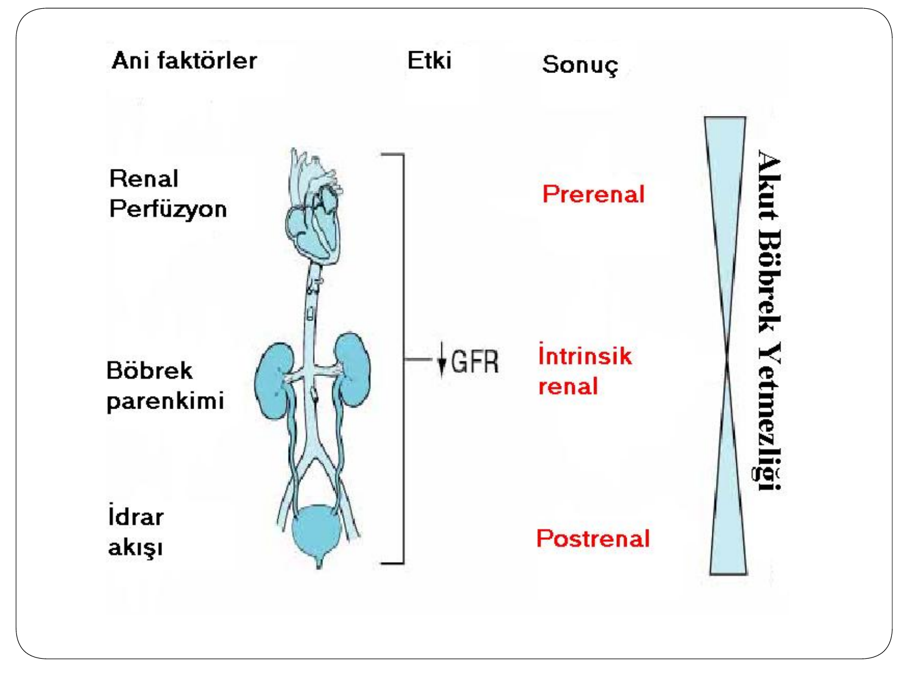

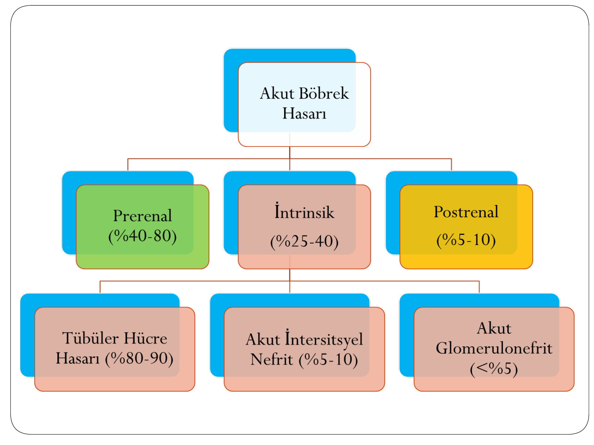

| Tip                 | Etkilenen Alan     | Oran   |
| ------------------- | ------------------ | ------ |
| **Prerenal**        | Renal perfüzyon ↓  | %40-80 |
| **İntrinsik renal** | Böbrek parenkimi   | %25-40 |
| **Postrenal**       | İdrar akışı engeli | %5-10  |

### En Sık ABH Nedenleri

| Neden                         | Sıklık |
| ----------------------------- | ------ |
| Akut tübüler nekroz (ATN)     | %45    |
| Prerenal hastalıklar          | %21    |
| Kronik zeminde ABY            | %13    |
| Üriner obstrüksiyon           | %10    |
| Glomerülonefrit veya vaskülit | %4     |
| Akut interstisyel nefrit      | %2     |
| Atheroemboli                  | %1     |

> Multi organ yetmezlikleri
---

## PRERENAL ABH

Renal hipoperfüzyon → serum kreatininde yükselme ve/veya oligüri-anüri

```
Prerenal ABH
    ↓
Hipoperfüzyonda düzelme var mı?
   ↙              ↘
  Evet             Hayır
   ↓                ↓
Böbrek fxn'de     İntrinsik ABH
hızlı düzelme       (ATN)
```

### Prerenal ABH Nedenleri

| Durum                                         | Volüm        | Örnek                                                                                                                                                                                       |
| --------------------------------------------- | ------------ | ------------------------------------------------------------------------------------------------------------------------------------------------------------------------------------------- |
| İntravasküler volüm eksikliği ve hipotansiyon | Hipovolemik  | Artmış eksternal kayıp (kanama, kusma, ishal, yanık, diüretik vb.); üçüncü boşluğa kayıp (ileus, pankreatit, rabdomiyoliz); yetersiz alım (demans, bilinç değişiklikleri, GIS patolojileri) |
| Azalmış kardiyak output                       | Hipervolemik | Kardiyorenal sendrom, kalp yetmezliği, perikardiyal tamponad, masif pulmoner emboli, kalp kapak lezyonları                                                                                  |
| Renal otoregülasyonda bozulma                 | Övolemik     | İlaçlar (NSAİİ, ACEi, ARB, siklosporin, takrolimus, radyokontrast madde)                                                                                                                    |
| Sistemik vazodilatasyon                       | Övolemik     | Sepsis, septik şok, hepatorenal sendrom, antihipertansif ilaçlar, anestetik ajanlar                                                                                                         |

---

## İNTRİNSİK RENAL ABH

Tüm böbrek parenkim alanlarındaki hasarlanmaya ikincil gelişebilir. En sık neden: **Akut Tübüler Nekroz/Hasar (ATN)**

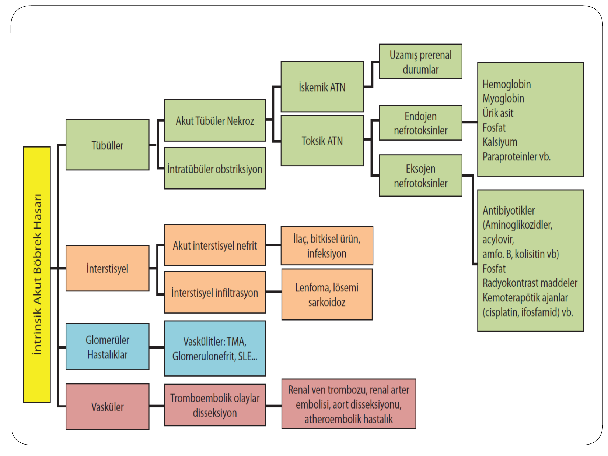

### İntrinsik ABH Alt Tipleri

**Tübüler alan:**
* **İskemik ATN:** Uzamış prerenal durumlar
* **Toksik ATN:** Eksojen ve endojen nefrotoksinler
* **İntratübüler obstrüksiyon:** Kristaller ve proteinler

**İnterstisyel alan:**
* **Akut interstisyel nefrit:** İlaç, bitkisel ürün, enfeksiyon
* **İnterstisyel infiltrasyon:** Lenfoma, lösemi, sarkoidoz

**Glomerüler alan:**
* Vaskülitler, TMA, glomerülonefrit, SLE

**Vasküler alan:**
* Tromboembolik olaylar, disseksiyon, renal ven/arter trombozu, atheroemboli

### ATN Patogenezi

* İskemik/toksik tübül hasarı
* Lümene dökülen tübül hücrelerinin oluşturduğu tıkaçlar ve obstrüksiyon
* İnterstisyuma kaçış (back-leak) ve interstisyel inflamasyon
* Tübüloglomerüler feedback ile afferent vazokonstriksiyon
* GFR'de azalma

### ATN Klinik Evreleri

| Evre                 | Özellikler                                                                                        |
| -------------------- | ------------------------------------------------------------------------------------------------- |
| **Başlangıç evresi** | Renal hasarlanma henüz oluşmamış; saatler-günler sürebilir; bu evrede ATN **önlenebilir**         |
| **İdame evresi**     | Parenkimal hasar yerleşmiş; GFR 5-10 mL/dak'da stabilize olur; çoğu kez 1-2 hafta sürer (1-11 ay) |
| **İyileşme evresi**  | Tübüler rejenerasyon, poliüri, sıvı-elektrolit dengesizlikleri                                    |

### İskemik ATN

* İskemik hasarlanma enerji gereksiniminin en yüksek olduğu **proksimal tübülün S3 segmentinde** ve **Henle kıvrımının kalın çıkan kısmının medüller bölümünde** en belirgindir
* Hücre iskemisi → ATP deplesyonu → aktif Na transportu inhibisyonu → hücre iskeletinin bozulması → serbest radikal oluşumu → hücre hasarı
* İskemi devam ederse → apoptoz ve nekroz gelişir
* İyileşme aşamasında tübüler epitel hücre onarım ve rejenerasyonu gerçekleşir, GFH kademeli olarak yükselir
* Bu aşamada **poliüri, dehidratasyon ve elektrolit dengesizlikleri** gelişebilir

### Toksik ATN

* Nefrotoksik ATN'de morfolojik değişiklikler **proksimal tübülün düz ve kıvrımlı kısımlarında** en belirgindir
* Hücre nekrozu, iskemik ATN'ye göre daha az belirgindir

**Endojen nefrotoksinler:** Hemoglobin, myoglobin, ürik asit, fosfat, kalsiyum, paraproteinler

**Eksojen nefrotoksinler:** Aminoglikozidler, asiklovir, amfoterisin B, kolistin, radyokontrast maddeler, kemoterapötik ajanlar (sisplatin, ifosfamid)

### Akut İnterstisyel Nefrit

* Daha çok ilaç ve bitkisel ürün kullanımına ikincil gelişir
* Tanıda bu ajanların kullanımının **ısrarla sorgulanması** anahtar role sahiptir
* Eşlik edebilen bulgular: Makülopapüler döküntü, eklem ağrıları, ateş, eozinofilüri, eozinofili, serum IgE yüksekliği

### Seçilmiş ABH Klinik Tabloları

| Tablo                              | Temel Özellikler                                                                                                                                                                                                               |
| ---------------------------------- | ------------------------------------------------------------------------------------------------------------------------------------------------------------------------------------------------------------------------------ |
| **Trombotik mikroanjiopati**       | Küçük damar hastalığına bağlı trombozlarla seyreden, intravasküler hemoliz, trombositopeni ve periferik yaymada şistositlerle karakterize ABH (HÜS, TTP, ilaçlar: siklosporin, sisplatin, tiklopidin, gemsitabin, klopidogrel) |
| **Akut fosfat nefropatisi**        | Özellikle KBH'lı hastalarda kolonoskopi hazırlığı amaçlı yüksek doz fosfat içeren laksatif kullanımı sonrası, tübüler fosfat tıkaçlarına bağlı gelişen, **geri dönüşümsüz** olabilen ABH                                       |
| **Atheroembolik böbrek hastalığı** | Yaygın aterosklerozu olan bireylerde genellikle anjiografik girişimler sonrası, kolesterol kristallerinin glomerüler kapillerlerde emboli oluşturması. Eozinofili ve periferik dolaşım bozukluğu eşlik edebilir                |
| **Tümör lizis sendromu**           | Kemoterapi sonrası tümör hücresi yıkımı ile dolaşıma karışan fosfor ve ürik asite bağlı tübüler tıkaçlar. Allopürinol ile sadece fosfor yüksekliği ile seyredebilir                                                            |
| **Radyokontrast nefropati**        | Kontrast kullanımı sonrası 24-48 saatte s. kreatinin yükselmeye başlar, 5-6. günlerde tepe değerine ulaşır, ~10. günde bazale döner                                                                                            |
| **Kolistin nefrotoksisitesi**      | Çoklu ilaç dirençli gram negatif enfeksiyonlar nedeniyle tekrar kullanıma giren antibiyotik. Nefrotoksisite **doz bağımlı** ve genellikle geri dönüşümlü                                                                       |
| **Sisplatin**                      | En sık kullanılan ve nefrotoksik etkisi en fazla bilinen antineoplastik ilaçlardan. Distal ve toplayıcı tübüllerde fokal ATN                                                                                                   |
| **Aminoglikozid**                  | Genellikle tedavinin 5-10. gününde ortaya çıkar, genellikle **nonoligurik** ve geri dönüşümlü                                                                                                                                  |
| **Takrolimus/Siklosporin**         | Akut evrede afferent arteriolde vazokonstriksiyon, toksik tübülopati ve TMA'ya sekonder ABH; uzun sürede kronik böbrek hasarı                                                                                                  |
| **Abdominal kompartman sendromu**  | Batın içi basınç artışına bağlı organ disfonksiyonu. Artmış batın içi basınç → renal ven kompresyonu → venöz drenaj bozulması → ABH                                                                                            |
| **Renal ven trombozu**             | Özellikle nefrotik sendromda hiperkoagülabiliteye bağlı. Ani yan ağrısı ve makroskopik hematüri                                                                                                                                |
| **Renal arter trombozu**           | Özellikle atriyal fibrilasyonu olan hastalarda. Yan ağrısı, yüksek LDH, hafif proteinüri                                                                                                                                       |

> Bunları başka derste detaylı anlatacağız; slaytta dursun diye.
---

## POSTRENAL ABH

Renal pelvisten üretral meatusa kadar **herhangi bir düzeyde** idrar akışının bozulması

```
İdrar üretiminin sürmesine karşın idrar akışı sonlanır
                    ↓
Üriner lümenlerde basınç artar
                    ↓
Artmış basınç renal tübüller üzerinden Bowman aralığına yansır
                    ↓
Filtrasyon basıncında azalma
                    ↓
GFH azalır → ABH
```

### Postrenal ABH Nedenleri

| Düzey            | Nedenler                                                                              |
| ---------------- | ------------------------------------------------------------------------------------- |
| **Renal pelvis** | Üreteropelvik bileşke darlığı, taş, tümör                                             |
| **Üreter**       | Taş, pıhtı, papiller nekroz, kanser, eksternal bası (tümör, retroperitoneal fibrozis) |
| **Mesane boynu** | Taş, pıhtı, kanser, prostat patolojileri, nörojenik mesane                            |
| **Üretra**       | Üretral darlık, posterior üretral valv                                                |

---

## ABH GELİŞİM RİSK FAKTÖRLERİ

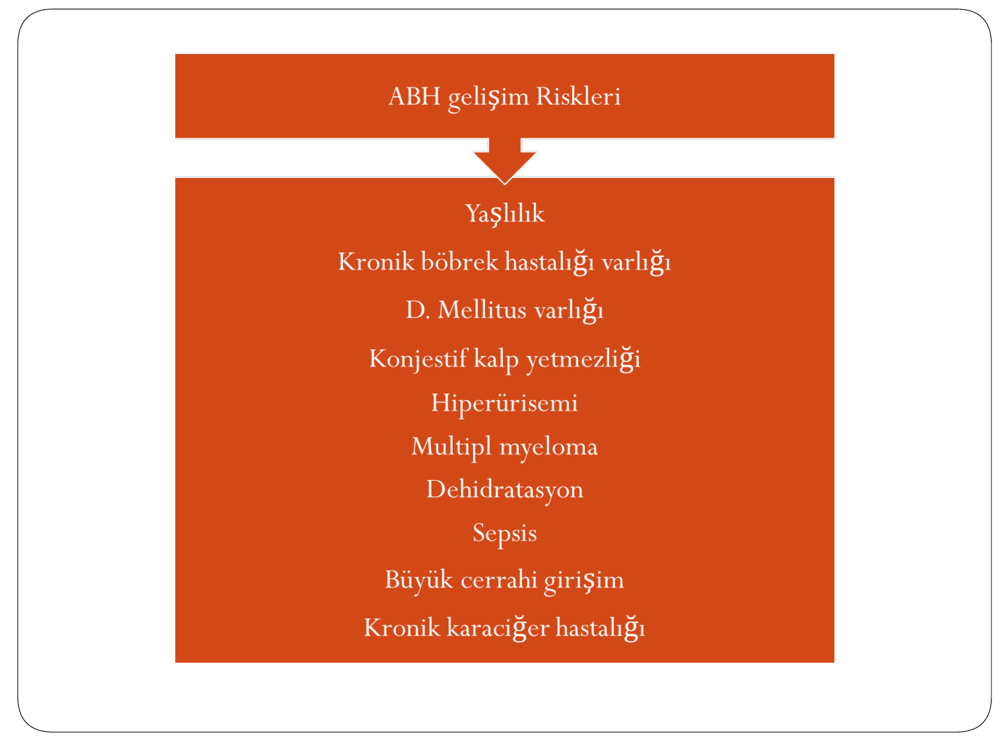

* Yaşlılık
* Kronik böbrek hastalığı varlığı
* Diabetes mellitus
* Konjestif kalp yetmezliği
* Hiperürisemi
* Multipl miyeloma
* Dehidratasyon
* Sepsis
* Büyük cerrahi girişim
* Kronik karaciğer hastalığı

---

## KLİNİK BULGULAR VE KOMPLİKASYONLAR

### Klinik Seyir

* Sinsice başlayabilir, değişken klinik seyir gösterir
* Asemptomatik tablodan multisistem hastalığa kadar geniş spektrum

> İlk soru: hastanın hayatını tehdit eden bir durum var mı? Hiperkalemi, metabolik asidoz, su ve tuz tutulumu, derin anemi.

### ABH'nin Sistemik Etkileri

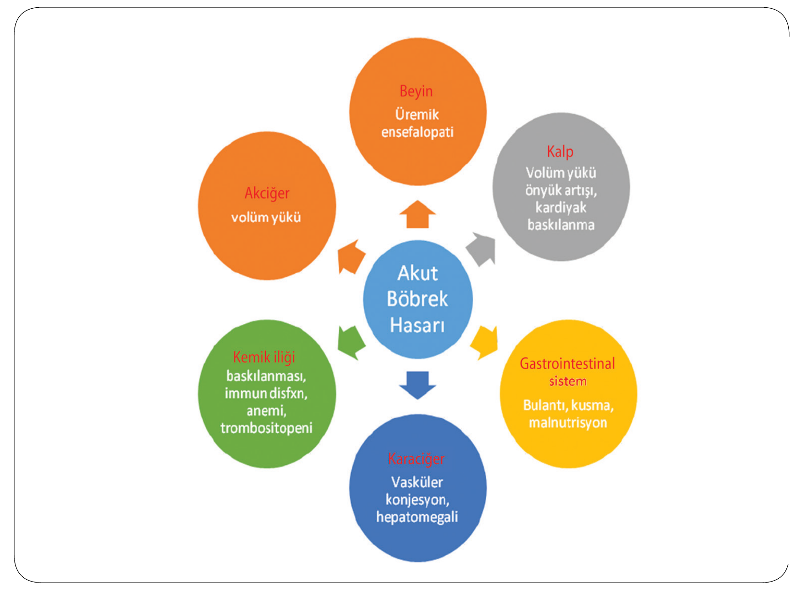

| Sistem               | Etki                                                  |
| -------------------- | ----------------------------------------------------- |
| **Beyin**            | Üremik ensefalopati                                   |
| **Kalp**             | Volüm yükü, önyük artışı, kardiyak baskılanma         |
| **Akciğer**          | Volüm yükü, pulmoner ödem                             |
| **Gastrointestinal** | Bulantı, kusma, malnutrisyon                          |
| **Karaciğer**        | Vasküler konjesyon, hepatomegali                      |
| **Kemik iliği**      | Baskılanma, immün disfonksiyon, anemi, trombositopeni |

### Yaşamı Tehdit Eden Komplikasyonlar

* **Hiperkalemi:** Kas güçsüzlüğü veya paraliz, EKG değişiklikleri
* **Metabolik asidoz:** Kussmaul solunumu, hipotansiyon
* **Su ve tuz tutulumu:** Akciğer ödemi, asit, plevral efüzyon, kalp yetmezliği
* **Derin anemi**

### İleri ABH Olgularında

* Bulantı, kusma, iştahsızlık
* Üremik ensefalopati
* Hepatik ensefalopati
* Trombosit disfonksiyonuna bağlı kanama
* Eşlik eden enfeksiyonlar
* Kardiyak ritm bozuklukları, akciğer ödemi

---

## TANISAL YAKLAŞIM

### ABH'li Hastanın Değerlendirilmesi

1. Acil tedavi gereksinimi varlığının değerlendirilmesi
2. Etiyolojinin saptanması
3. Düzeltilebilir faktör varlığının araştırılması
4. Akut-kronik ayrımı

### Etiyoloji ve Klinik Özellikler

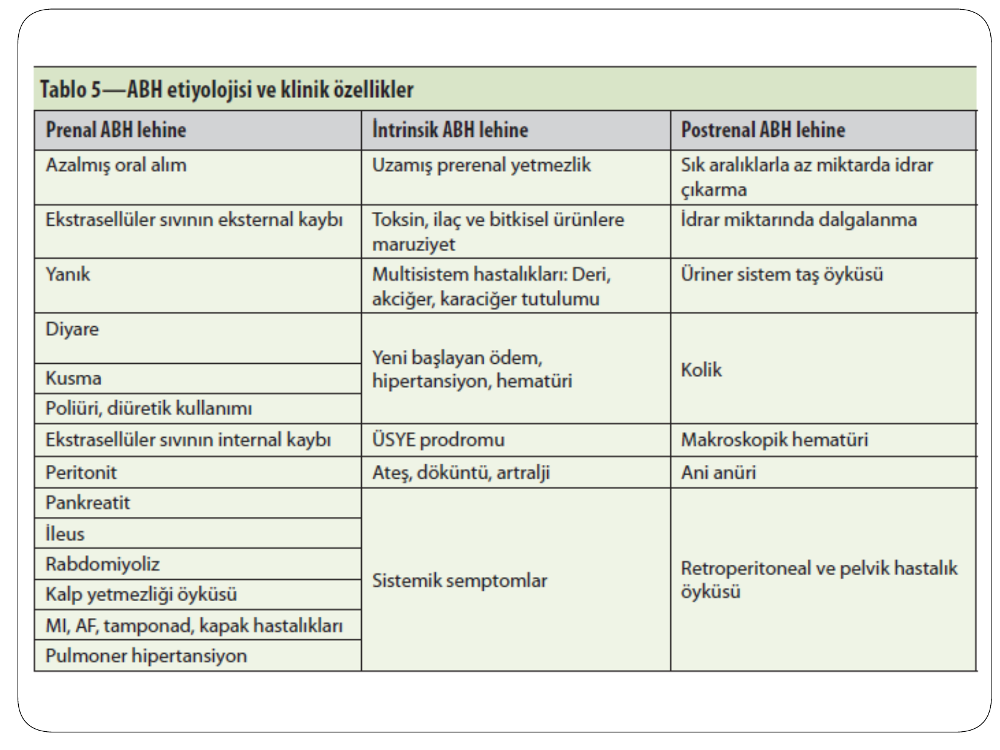

| Prerenal ABH Lehine                                                                | İntrinsik ABH Lehine                                  | Postrenal ABH Lehine                      |
| ---------------------------------------------------------------------------------- | ----------------------------------------------------- | ----------------------------------------- |
| Azalmış oral alım                                                                  | Uzamış prerenal yetmezlik                             | Sık aralıklarla az miktarda idrar çıkarma |
| Ekstrasellüler sıvının eksternal kaybı                                             | Toksin, ilaç ve bitkisel ürünlere maruziyet           | İdrar miktarında dalgalanma               |
| Yanık                                                                              | Multisistem hastalıkları (deri, akciğer, KC tutulumu) | Üriner sistem taş öyküsü                  |
| Diyare, kusma                                                                      | Yeni başlayan ödem, hipertansiyon, hematüri           | Kolik                                     |
| Poliüri, diüretik kullanımı                                                        | ÜSYE prodromu                                         | Makroskopik hematüri                      |
| Ekstrasellüler sıvının internal kaybı (peritonit, pankreatit, ileus, rabdomiyoliz) | Ateş, döküntü, artralji                               | Ani anüri                                 |
| Kalp yetmezliği öyküsü, MI, AF, tamponad                                           | Sistemik semptomlar                                   | Retroperitoneal ve pelvik hastalık öyküsü |

> okudu bu tabloyu geçti.
### Fizik İnceleme Bulguları

* **Kan basıncı** ve ortostatik hipotansiyon
* **Volüm durumu:** Deri ve mukozalar, juguler venöz dolgunluk, bacak ödemi
* **Kardiyovasküler sistem:** Gallop ritmi, kardiyak üfürüm, AF, perikardiyal frotman
* **Akciğerler:** Raller
* **Batın muayenesi:** 3. boşluğa kayıp, kostovertebral açı duyarlılığı, mesanenin palpasyonu
* **Cilt döküntüsü** ve göz dibi muayenesi

### Fizik Muayeneden Tanıya

| Bulgu                                                             | Olası Tanı                      |
| ----------------------------------------------------------------- | ------------------------------- |
| Livedo retikülaris, dijital iskemi, kelebek rash, palpabl purpura | Sistemik vaskülit, septik şok   |
| Makülopapüler rash                                                | Akut interstisyel nefrit        |
| Keratit, üveit                                                    | Otoimmün hastalık               |
| DM retinopati                                                     | Diyabetik nefropati             |
| Hipertansif bulgular                                              | HT nefroskleroz                 |
| İşitme kaybı                                                      | Alport sendromu / aminoglikozid |
| Nazal septumda ülser                                              | Wegener granülomatozu           |
| Atriyal fibrilasyon                                               | Atheroemboli                    |
| Kardiyak üfürüm                                                   | Endokardit                      |
| Akciğerde raller, hemoptizi                                       | Wegener / Goodpasture           |
| Abdomende pulsatil kitle                                          | Atheroemboli (aort anevrizması) |
| Kostovertebral açı hassasiyeti                                    | Taş, papiller nekroz            |
| Ekstremitede iskemi, crush                                        | Rabdomiyoliz                    |

> Bunları da tek tek okumayacağım bakarsınız...
### Laboratuvar İncelemeleri

* Tam biyokimya, serolojik incelemeler
* Ürik asit, CK, LDH, fosfor, kalsiyum (yüksekliği abh)
* Tam kan sayımı, periferik yayma
* **Tam idrar tahlili ve idrar bakısı**
* Spot idrar incelemesi
* Arteriyel kan gazı
* PA akciğer grafisi, EKG, ekokardiyografi
* Radyolojik tetkikler
* Böbrek biyopsisi (endike ise)


### İdrar Mikroskopisi

| Bulgu                           | Anlam                                  |
| ------------------------------- | -------------------------------------- |
| **Kahverengi çamurlu silendir** | Akut tübüler nekroz                    |
| **Hematüri**                    | Glomerül dışı kanama                   |
| **Dismorfik eritrositler**      | Glomerüler hematüri                    |
| **Eritrosit silendiri**         | Glomerül kaynaklı hematüri             |
| **Lökosit**                     | Üriner enfeksiyon, interstisyel nefrit |
| **Lökosit silendiri**           | Renal enfeksiyon                       |
| **Bakteriüri**                  | Üriner enfeksiyon                      |
| **Kristal**                     | Metabolik hastalık, ilaç atılımı       |

### Spot İdrar İncelemesi — Prerenal vs İntrinsik Renal ABH Ayırıcı Tanısı

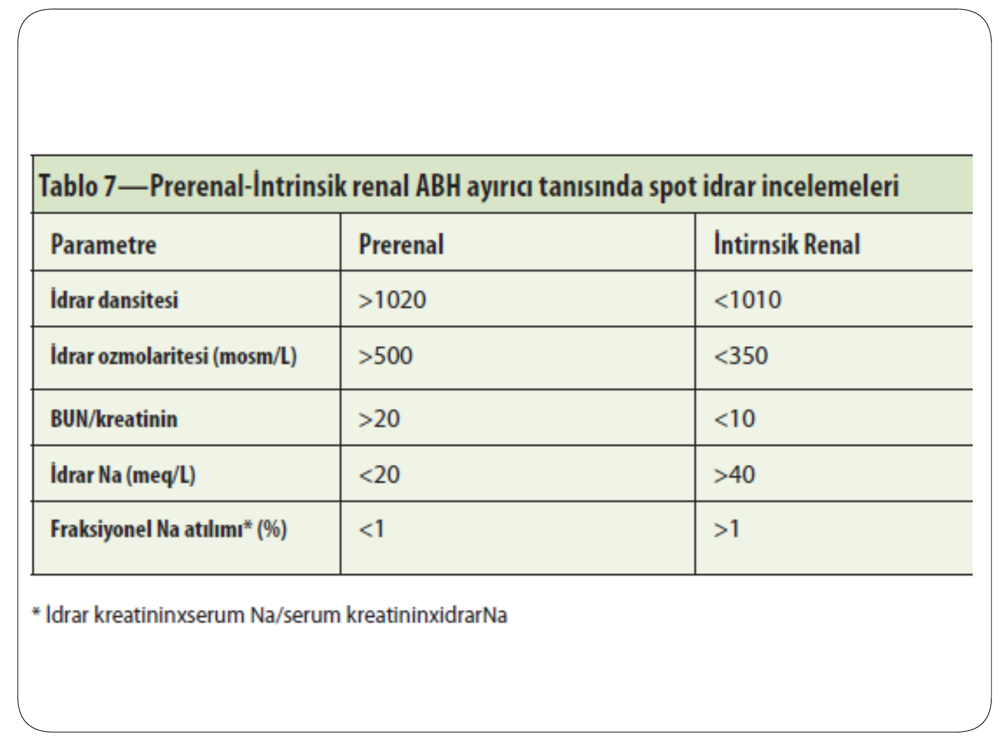

| Parametre                   | Prerenal | İntrinsik Renal |
| --------------------------- | -------- | --------------- |
| İdrar dansitesi             | > 1020   | < 1010          |
| İdrar ozmolaritesi (mosm/L) | > 500    | < 350           |
| BUN/kreatinin               | > 20     | < 10            |
| İdrar Na (mEq/L)            | < 20     | > 40            |
| Fraksiyonel Na atılımı (%)  | < 1      | > 1             |

**⚠️ ÖNEMLİ:** İdrar ve kan örnekleri **intravenöz sıvı ve diüretik tedavisinden önce** alınmalıdır.

> TABİ BURADA GRİ ZON VAR. 1010-1020 dansite, 350-500 mosm/L ozmolalite aralığında.
### Fraksiyonel Sodyum Ekskresyonu (FeNa)

> **FeNa = (UNa / PNa) / (UCr / PCr) × 100**

> **RFI (Renal Failure Index) = UNa / (UCr / PCr) × 100**

**⚠️** Radyokontrast nefropati, rabdomiyoliz, akut GN ve vaskülit durumlarında FeNa < 1 **olabilir** (yanıltıcı sonuç).

### Biyokimyasal ve İmmünolojik Tetkikler

| Bulgu                                  | Olası Tanı                 |
| -------------------------------------- | -------------------------- |
| CPK ↑, ürik asit ↑, P ↑                | Rabdomiyoliz               |
| Ürik asit ↑                            | Akut ürik asit nefropatisi |
| Ürik asit ↑, fosfor ↑                  | Tümör lizis sendromu       |
| LDH ↑, indirekt bilirubin ↑, anemi     | Hemoliz                    |
| Kalsiyum ↑                             | Hiperkalsemi               |
| Anemi, trombositopeni, yüksek ESR      | Kollajen doku hastalığı    |
| Anti-GBM (+)                           | Goodpasture sendromu       |
| ANCA (+)                               | Wegener granülomatozu      |
| C3, C4, ANA                            | SLE                        |
| ASO                                    | Poststreptokokkal GN       |
| Fragmente eritrositler, trombositopeni | Mikroanjiopati (TTP/HÜS)   |

> BUNLARI DA TEK TEK OKUMAYACAĞIM; BAKARSINIZ.
### Ultrasonografi

Her hastada **mutlaka** yapılmalıdır.

| USG Bulgusu                      | Olası Tanı                                                |
| -------------------------------- | --------------------------------------------------------- |
| Küçülmüş böbrekler               | Kronik böbrek yetmezliği                                  |
| Normal boyut, ekojenite artmış   | Akut glomerülonefritler                                   |
| Pelvikalisyel dilatasyon         | Obstrüksiyon                                              |
| Büyük böbrekler                  | Malign hücre infiltrasyonu, renal ven trombozu, amiloidoz |
| Renovasküler Doppler anormalliği | Renal arter embolisi, renal ven trombozu                  |

### Diğer Görüntüleme

* Direkt üriner sistem grafisi (böbrek boyu, taş, gaz)
* Sintigrafi (nefrotoksik değil; perfüzyon, konsantrasyon, ekskresyon, skarlanma)
* Bilgisayarlı tomografi / anjiografi
* Anterograd / retrograd pyelografi

### Böbrek Biyopsisi Endikasyonları

* Nedeni belli olmayan ABH
* Glomerülonefrit, nefrotik sendrom ve vaskülit ile birlikte olan ABH
* Nedeni aydınlatılamayan interstisyel hastalıkla birlikte olan ABH
* Uzamış ABH

### Akut-Kronik Böbrek Yetmezliği Ayrımı — KBH Lehine Bulgular

**Öykü:** Noktüri, poliüri, ödem, hematüri, kaşıntı, nöropati, hipertansiyon ve diyabet varlığı

**Objektif bulgular:** Üremik kemik hastalığı, bilateral küçük böbrekler, konjonktival kalsifikasyonlar

**Daha az duyarlı bulgular:** Hipokalsemi, hiperfosfatemi, anemi

### ABH Tanısal Algoritma

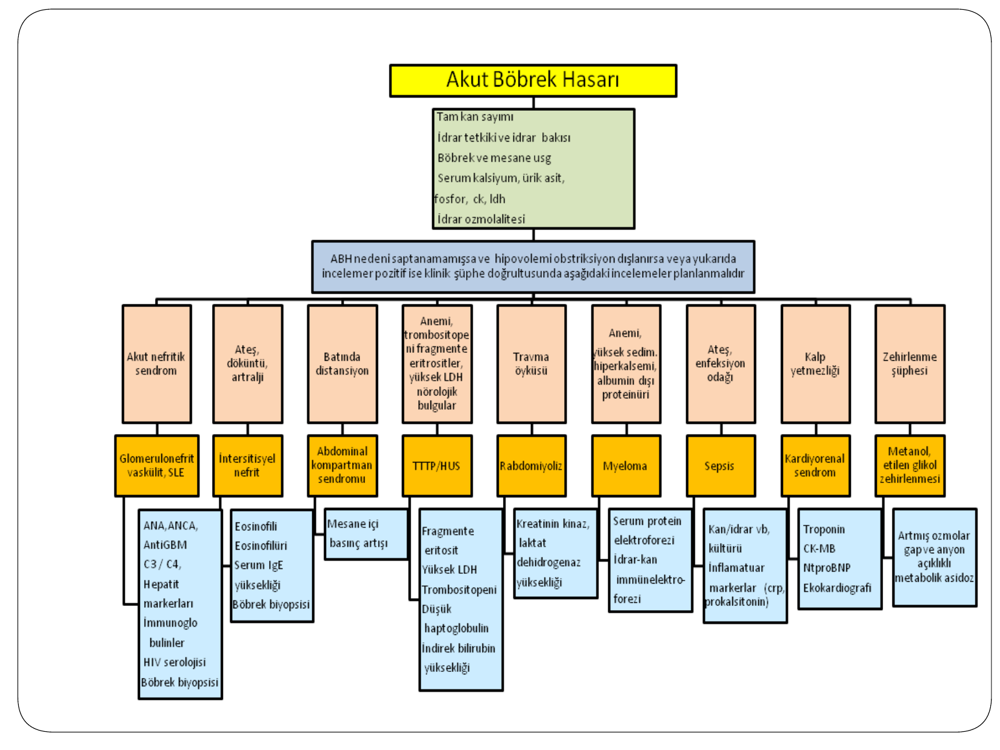

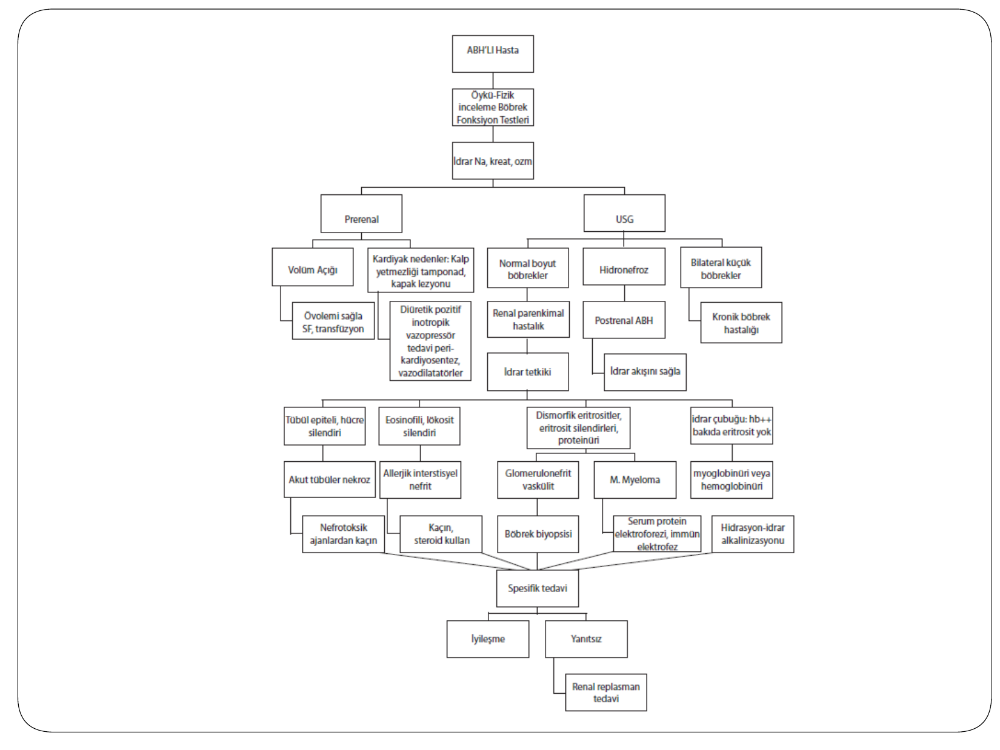

---

## KARDİYORENAL SENDROM

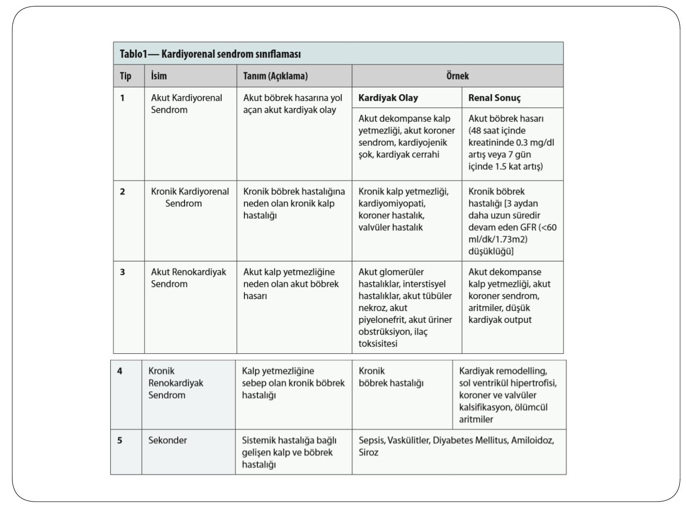

| Tip   | İsim                        | Tanım                                                      | Örnek                                                                                                                                         |
| ----- | --------------------------- | ---------------------------------------------------------- | --------------------------------------------------------------------------------------------------------------------------------------------- |
| **1** | Akut Kardiyorenal Sendrom   | Akut böbrek hasarına yol açan akut kardiyak olay           | Akut dekompanse KY, akut koroner sendrom, kardiyojenik şok → ABH (48 saat içinde kreatininde 0,3 mg/dL artış veya 7 gün içinde 1,5 kat artış) |
| **2** | Kronik Kardiyorenal Sendrom | Kronik böbrek hastalığına neden olan kronik kalp hastalığı | Kronik KY, kardiyomiyopati, koroner hastalık → KBH (3 aydan uzun süredir GFR < 60 mL/dk/1,73m²)                                               |
| **3** | Akut Renokardiyak Sendrom   | Akut kalp yetmezliğine neden olan akut böbrek hasarı       | Akut GN, interstisyel hastalıklar, ATN, piyelonefrit → akut dekompanse KY, aritmiler                                                          |
| **4** | Kronik Renokardiyak Sendrom | Kalp yetmezliğine sebep olan kronik böbrek hastalığı       | KBH → kardiyak remodelling, sol ventrikül hipertrofisi, koroner ve valvüler kalsifikasyon                                                     |
| **5** | Sekonder                    | Sistemik hastalığa bağlı gelişen kalp ve böbrek hastalığı  | Sepsis, vaskülitler, DM, amiloidoz, siroz                                                                                                     |

---

## TEDAVİ

### Koruyucu Önlemler

* Övolemi sağlanması
* Hemodinamik stabilizasyonun sağlanması
* Enfeksiyon tedavisi
* Nefrotoksik ajanlardan kaçınılması
* Nefrotoksik ajanların dikkatli kullanılması (hidrasyon, doz modifikasyonu, düzey takibi, BFT izlemi)

### ABH Gelişme Riski Yüksek Hastalarda Önleyici Yaklaşımlar

| Risk                            | Önleyici Yaklaşım                                                                                      |
| ------------------------------- | ------------------------------------------------------------------------------------------------------ |
| **Tümör lizis sendromu**        | Kemoterapi öncesi hidrasyon, allopürinol                                                               |
| **Nefrotoksik ajan maruziyeti** | Mümkünse kaçınma, ilaç düzeyi izlemi, doz modifikasyonu                                                |
| **Radyokontrast madde**         | Mümkünse kaçın, minimum doz kullan, övolemi sağla, SF infüzyonu, NaHCO₃ ve N-asetilsistein denenebilir |
| **Hemodinamik instabilite**     | Renal hipoperfüzyonu düzelt, sıvı tedavisi, vazopressör, pozitif inotropik tedavi                      |
| **Rabdomiyoliz**                | Hidrasyon, idrar alkalinizasyonu, mannitol ile osmotik diürez                                          |
| **İskemik ATN**                 | Renal hipoperfüzyonu düzelt, ACEi/ARB/NSAİİ'den kaçın                                                  |
| **Akut fosfat nefropatisi**     | Fosfor içeren laksatiflerden kaçın                                                                     |

### ATN'de Tedavi — Günlük Dikkat Edilmesi Gerekenler

* Böbrek yetmezliğini ağırlaştıran faktör var mı? (Hipovolemi gibi)
* Üremik sendrom bulguları var mı? (Asteriksis, konfüzyon, bulantı-kusma, perikardit)
* Metabolik komplikasyonlar yönünden izlem (hiperkalemi, asidoz, hipokalsemi, hiperfosfatemi, hiperürisemi)

### ABH İzlem

* Üremik sendrom ve metabolik komplikasyonlar
* Aldığı-çıkardığı izlemi
* Günlük kilo takibi
* Sıvı-elektrolit dengesi, BFT, kan gazı analizi

### Beslenme

| Parametre                   | Miktar                                        |
| --------------------------- | --------------------------------------------- |
| Tuz                         | 2-3 g/gün                                     |
| Kalori                      | 30-35 kkal/kg/gün, en az 100 g karbonhidrat   |
| Protein                     | 0,8 g/kg/gün (diyaliz (+) ise 1-1,2 g/kg/gün) |
| Fosfor, potasyum, magnezyum | Kısıtlanmalı                                  |

### Prerenal ABH Tedavisi

* Amaç: **Hipoperfüzyonun düzeltilmesi**
* Perfüzyonu bozan ACEi, ARB, NSAİİ gibi ilaçların sonlandırılması
* **Hipovolemik durumlar:** Verilecek sıvı içeriği kaybedilen sıvı ile uyumlu olmalı
  - Şiddetli kanamalarda → eritrosit süspansiyonu
  - Hafif-orta şiddetteki kanamalarda → izotonik NaCl
  - Üriner ve GIS kayıplarda → SF veya hipotonik sıvılar
* **Kardiyopulmoner nedenler:** Hastalar çoğunlukla hipervolemik → sıvı desteğinden kaçın
  - Tuz kısıtlaması, yüksek doz loop diüretik
  - Gerekirse pozitif inotropik ve vazopressör ajanlar
  - Perikardiyal tamponadda → perikardiyosentez
  - Başarı sağlanamaması durumunda → hemodiyaliz ile sıvı uzaklaştırılması

### İntrinsik ABH Tedavisi

* **İskemik ATN:** Hemodinamik stabilizasyon
* **Toksik ATN:** Toksik ajandan kaçınılması
* **Diğer hastalıklar:** Spesifik tedavi (sitotoksik tedavi, plazmaferez, kemoterapi, alkali tedavi vb.)

### Postrenal ABH Tedavisi

Üroloji ve radyoloji iş birliği gerektirir.

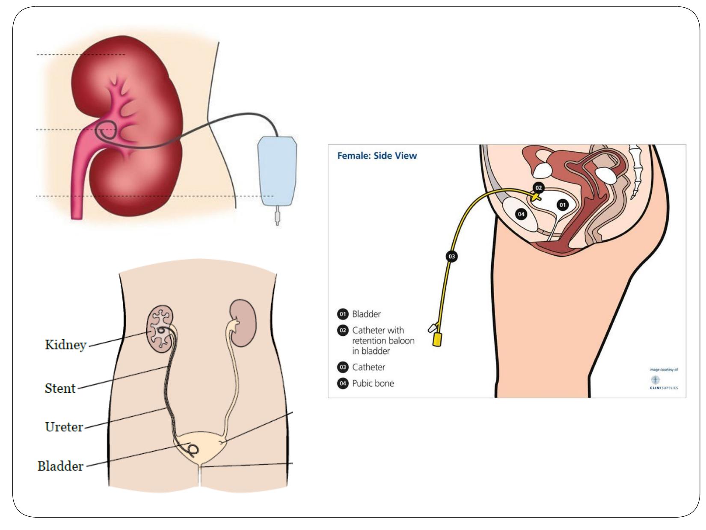

| Obstrüksiyon Düzeyi               | Bulgu                                   | Tedavi                                                          |
| --------------------------------- | --------------------------------------- | --------------------------------------------------------------- |
| **Üretra veya prostat**           | Prostatizm / glob vezikale, hidronefroz | İdrar sondası takılması; takılamazsa suprapubik mesane kateteri |
| **Mesane**                        | Mesane boş, hidronefroz                 | Double-J kateter / perkutan nefrostomi                          |
| **Nörojenik mesane**              | Glob vezikale / hidronefroz             | Aralıklı üretral kateterizasyon                                 |
| **Üreter, üreteropelvik bileşke** | Hidronefroz                             | Double-J kateter / perkutan nefrostomi                          |

**⚠️ ÖNEMLİ:** İdrar akışının ivedilikle sağlanması kalıcı renal hasarlanmayı azaltacaktır. Obstrüksiyonun giderilmesi ile solüt diürezi ve **poliüri** gelişebilir → hipovolemi ve elektrolit dengesizliklerine dikkat!

### Komplikasyonların Tedavisi

| Komplikasyon         | Tedavi                                                                                                                                                                                          |
| -------------------- | ----------------------------------------------------------------------------------------------------------------------------------------------------------------------------------------------- |
| **Hipervolemi**      | Tuz kısıtlaması, diüretik, yeterli yanıt alınamazsa diyaliz                                                                                                                                     |
| **Hiperkalemi**      | Potasyum kısıtlaması, K yükselten ilaç/sıvılardan kaçınılması, kalsiyum glukonat, dekstroz-insülin infüzyonu, beta mimetik ajanlar, kayeksalat, asidoz varsa NaHCO₃, loop diüretikleri, diyaliz |
| **Metabolik asidoz** | Protein kısıtlaması, bikarbonat desteği, diyaliz                                                                                                                                                |
| **Hiponatremi**      | Su-tuz kısıtlaması, hipotonik sıvılardan kaçınılması, loop diüretikleri, diyaliz                                                                                                                |
| **Hiperfosfatemi**   | Diyette fosfor kısıtlaması, fosfor bağlayıcılar, diyaliz                                                                                                                                        |

---

## DİYALİZ ENDİKASYONLARI

* **Üremik semptomlar** (ensefalopati, perikardit, kanama diyatezi)
* **Kontrolsüz hipervolemi**
* **Medikal tedaviye dirençli hiperkalemi** (> 7 mmol/L veya > 5,5-6,5 mmol/L + EKG bulguları)
* **Metabolik asidoz** (tıbbi tedaviye dirençli)
* BUN ve kreatinin için net sınırlar yoktur

### Diyaliz Tipleri

* **Hemodiyaliz**
* Yavaş kan akımlı hemodiyafiltrasyon (CVVHDF)
* **Periton diyalizi**

### ATN'de Farmakolojik Tedavi

Hücre viabilitesini sağlama ve intratübüler obstrüksiyonu önleme amacıyla denenen ajanlar:
* Mannitol, furosemid, dopamin
* Kalsiyum kanal blokerleri, aminoasit infüzyonu
* ANP, prostoglandinler, pentoksifilin, büyüme faktörleri

**⚠️** Yeterli sayıda kontrollü çalışma yoktur, kesin bir fikir birliği yoktur.

---

## PROGNOZ

### ATN İyileşme Dönemi

* Klinik iyileşme **7-21 gün** sonra başlar; nadiren 3-6 ayı bulabilir
* Günde 3-4 L diürez görülür, **10-12 L'ye** kadar ulaşabilir
* Bu dönemde **hipovolemi, hipernatremi ve hipopotasemi** yönünden hasta izlenmelidir

### Mortalite

* ABH'de mortalite **yüksektir**
* Hastanede yatan hastalarda **%50'lere**, yoğun bakım ünitesinde **%70-80'lere** ulaşmaktadır
* ABH varlığı yatan hastalarda başlı başına bir **mortalite risk faktörüdür**
* Serum kreatinin değerinin 0,3 mg/dL artması → **4 kat** artmış mortalite riski
* Serum kreatinin değerinin 2 mg/dL artması → **14 kat** artmış mortalite riski

### Uzun Dönem Sonuçlar

| Sonuç                              | Oran   |
| ---------------------------------- | ------ |
| Diyalize bağımlı kalma             | %10-20 |
| Tam düzelme                        | %30    |
| Diyaliz gerektirmeyen KBH gelişimi | %50-60 |

**⚠️ ÖNEMLİ:** ABH atağı geçirmiş hastalarda, ilerleyen dönemlerde **son dönem böbrek yetmezliği** gelişme riski artmıştır.

---

## SONUÇ

* ABH yüksek morbidite ve mortaliteye sahiptir
* **Önlenmesi tedavisinden daha kolaydır**
* Tablo geliştiğinde altta yatan nedenlerin ivedilikle saptanıp, mümkünse giderilmesi hızlı düzelme sağlayabilir

---

## AKILDA KALMASI GEREKENLER

### KDIGO Tanım — 3 Kriter, Birini Bil Yeter

```
48 saat içinde kreatinin ≥ 0,3 mg/dL artış    → EN HASSAS KRİTER
       VEYA
7 gün içinde kreatinin ≥ 1,5 kat artış
       VEYA
6 saat süreyle idrar < 0,5 mL/kg/saat          → EN ERKEN BULGU
```

**Sınav ipucu:** İdrar çıkışı kreatininden önce bozulur. Kreatinin yükselmeye başladığında GFR zaten %50 düşmüştür.

---

### Prerenal vs İntrinsik — FeNa Tablosu (Ezbere Bil)

|                        | **Prerenal**                | **İntrinsik (ATN)**             |
| ---------------------- | --------------------------- | ------------------------------- |
| **FeNa**               | **< %1**                    | **> %1**                        |
| **İdrar Na**           | < 20                        | > 40                            |
| **İdrar ozmolaritesi** | > 500                       | < 350                           |
| **İdrar dansitesi**    | > 1020                      | < 1010                          |
| **BUN/Kreatinin**      | > 20                        | < 10                            |
| **İdrar mikroskopisi** | Normal veya hyalen silendir | **Kahverengi çamurlu silendir** |

**Hatırla:** Prerenal = böbrek sağlam ama susuz → Na'yı tutar, idrarı konsantre eder. ATN = tübül hasarlı → Na'yı tutamaz, idrarı konsantre edemez.

**⚠️ Tuzak:** FeNa < 1 olup da ATN gibi davranan durumlar → **radyokontrast nefropati, rabdomiyoliz, akut GN, sepsisin erken evresi**. Bunlarda tübül kısmen sağlam olduğu için Na geri emilir.

---

### 3 Tip ABH — Hızlı Ayırıcı Tanı

| Soru                           | Prerenal | İntrinsik | Postrenal |
| ------------------------------ | -------- | --------- | --------- |
| **Hasta dehidrate mi?**        | ✅        | ❌         | ❌         |
| **Nefrotoksik ilaç var mı?**   | ❌        | ✅         | ❌         |
| **USG'de hidronefroz var mı?** | ❌        | ❌         | ✅         |
| **Sıvı verince düzelir mi?**   | ✅        | ❌         | ❌         |
| **Sonda takınca düzelir mi?**  | ❌        | ❌         | ✅         |

**Klinik gerçek:** ABH'li her hastaya **USG yap** — hidronefroz varsa postrenal, yoksa prerenal mi intrinsik mi ayır. Bu kadar basit.

---

### ATN'nin 3 Evresi — Klinik Seyir

```
BAŞLANGIÇ ──────→ İDAME ──────→ İYİLEŞME
(saatler-günler)   (1-2 hafta)    (haftalar)
  ÖNLENEBİLİR!     GFR=5-10       POLİÜRİ!
                    Oligüri        3-12 L/gün
                    Komplikasyonlar Elektrolit bozuklukları
```

**Kritik bilgi:** İyileşme evresinde hasta **poliürik** olur → hipovolemi, hipernatremi, hipopotasemi gelişebilir. Öldüren sadece idame evresi değil, iyileşme evresi de olabilir — sıvı-elektrolit takibi bırakılmamalı.

---

### İdrar Mikroskopisi — Tek Bakışta Tanı

| Ne görüyorsun?                  | Ne düşünüyorsun?                                     |
| ------------------------------- | ---------------------------------------------------- |
| **Kahverengi çamurlu silendir** | ATN                                                  |
| **Eritrosit silendiri**         | Glomerülonefrit                                      |
| **Lökosit silendiri**           | Piyelonefrit / İnterstisyel nefrit                   |
| **Dismorfik eritrositler**      | Glomerüler kaynaklı hematüri                         |
| **Eozinofilüri**                | Akut interstisyel nefrit (ilaç ilişkili)             |
| **Kristaller**                  | İntratübüler obstrüksiyon (ürik asit, oksalat, ilaç) |

**Sınav klasiği:** "İdrarda kahverengi çamurlu silendirler görülüyor" → **ATN**. Bu bulgu ATN için neredeyse patognomoniktir.

---

### Diyaliz Endikasyonları — "AEIOU" ile Hatırla

| Harf  | Endikasyon                                                                               |
| ----- | ---------------------------------------------------------------------------------------- |
| **A** | Asidoz (tedaviye dirençli metabolik asidoz)                                              |
| **E** | Elektrolit bozukluğu (dirençli hiperkalemi: K > 7 veya EKG bulgusu)                      |
| **I** | İntoksikasyon (diyalize edilebilen toksinler: metanol, etilen glikol, salisilat, lityum) |
| **O** | Overload (kontrolsüz hipervolemi, pulmoner ödem)                                         |
| **U** | Üremi (ensefalopati, perikardit, kanama diyatezi)                                        |

---

### Hiperkalemi — ABH'nin En Acil Komplikasyonu

```
K⁺ yükseliyor → EKG değişiklikleri başlıyor → Kardiyak arrest riski

EKG sıralaması:
Sivri T dalgası → PR uzaması → QRS genişlemesi → Sinüzoidal dalga → VF/Asistol
```

**Acil tedavi sıralaması:**
1. **Kalsiyum glukonat IV** → Kalbi korur (miyokard stabilizasyonu), K⁺'u düşürmez
2. **İnsülin + Dekstroz IV** → K⁺'u hücre içine sokar (30 dk'da etki)
3. **Nebülize salbutamol** → K⁺'u hücre içine sokar
4. **NaHCO₃** → Asidoz varsa K⁺'u hücre içine iter
5. **Kayeksalat** → GIS'ten K⁺ atılımı (yavaş etki)
6. **Diyaliz** → Kesin çözüm

---

### Nefrotoksik İlaçlar — Sınavda Sık Sorulan

| İlaç                       | Mekanizma                             | Özellik                                                            |
| -------------------------- | ------------------------------------- | ------------------------------------------------------------------ |
| **Aminoglikozidler**       | Proksimal tübül toksisitesi           | 5-10. günde, **nonoligurik**, geri dönüşümlü                       |
| **Amfoterisin B**          | Tübüler hasar + vazokonstriksiyon     | Distal RTA, hipopotasemi, hipomagnezemi                            |
| **Sisplatin**              | Distal tübül nekrozu                  | **Doz bağımlı**, hidrasyon ile önle                                |
| **Radyokontrast**          | Vazokonstriksiyon + tübüler toksisite | 24-48 st'de başlar, 5-6. günde tepe, ~10. günde düzelir            |
| **NSAİİ**                  | Afferent arteriol vazokonstriksiyonu  | Prerenal ABH yapar, **prostaglandin inhibisyonu**                  |
| **ACEi/ARB**               | Efferent arteriol dilatasyonu         | Prerenal ABH yapar, özellikle **bilateral renal arter stenozu**nda |
| **Siklosporin/Takrolimus** | Afferent vazokonstriksiyon + TMA      | Akut ve kronik nefrotoksisite                                      |

**Altın kural:** ACEi + NSAİİ + Diüretik = **"Triple whammy"** → ABH riski çok yüksek. Özellikle yaşlı, dehidrate ve KBH'lı hastalarda bu kombinasyondan kaçın.

---

### Prerenal ABH Tedavisi — Kim Neyle?

| Durum               | Volüm                | Tedavi                                             |
| ------------------- | -------------------- | -------------------------------------------------- |
| Kanama              | Hipovolemik          | **Eritrosit süspansiyonu** (ciddi) veya SF (hafif) |
| Kusma, ishal        | Hipovolemik          | **SF veya hipotonik sıvı**                         |
| Kalp yetmezliği     | **Hipervolemik**     | **Sıvı VERME!** Diüretik + inotropik               |
| Sepsis              | Övolemik-hipovolemik | **30 mL/kg SF** + vazopressör                      |
| NSAİİ/ACEi ilişkili | Övolemik             | **İlacı kes**, sıvı ver                            |

**⚠️** Prerenal ABH'de hastanın volüm durumunu doğru değerlendir. Hipervolemik hastaya sıvı verirsen akciğer ödemi yaparsın.

---

### Postrenal ABH — Obstrüksiyonu Bul, Aç

| Yaşlı erkek + anüri + glob vezikale | → **Sonda tak** (prostat)         |
| ----------------------------------- | --------------------------------- |
| **Bilateral hidronefroz + taş**     | → **Double-J stent / nefrostomi** |
| **Tek böbrekli hasta + taş**        | → **ACİL girişim**                |

Obstrüksiyon açıldıktan sonra **postobstrüktif diürez** gelişebilir (günde 5-10 L idrar). Bu dönemde agresif sıvı replasmanı yapmazsan hasta dehidrate olur ve tekrar ABH gelişir.

---

### Mortalite — Rakamları Hatırla

| Durum                     | Mortalite                   |
| ------------------------- | --------------------------- |
| Hastanede ABH             | **%50**                     |
| Yoğun bakımda ABH         | **%70-80**                  |
| Kreatinin 0,3 mg/dL artış | **4 kat** artmış mortalite  |
| Kreatinin 2 mg/dL artış   | **14 kat** artmış mortalite |

**Uzun dönem:** ABH atağı geçiren hastaların sadece **%30**'u tam düzelir. %50-60'ında KBH, %10-20'sinde diyaliz bağımlılığı gelişir. ABH "geçici" bir olay değildir — hayat boyu takip gerekir.

---

### Fizik Muayeneden Tanıya — Kısa Yol

| FM Bulgusu                          | Hemen Düşün                                    |
| ----------------------------------- | ---------------------------------------------- |
| Livedo retikülaris + dijital iskemi | **Atheroemboli** (anjiografi sonrası?)         |
| Döküntü + ateş + artralji           | **Akut interstisyel nefrit** (yeni ilaç?)      |
| Hemoptizi + ABH                     | **Goodpasture / Wegener** (pulmorenal sendrom) |
| Purpura + ABH                       | **HÜS/TTP veya vaskülit**                      |
| Glob vezikale                       | **Postrenal** (sonda tak!)                     |
| Bilateral küçük böbrek (USG)        | Bu ABH değil, **KBH**                          |
| Kası ezilmiş, koyu idrar            | **Rabdomiyoliz** → CPK iste, agresif hidrasyon |

---

## KISALTMALAR

| Kısaltma    | Açılımı                                   |
| ----------- | ----------------------------------------- |
| **ABH**     | Akut Böbrek Hasarı                        |
| **ACEi**    | Anjiyotensin Dönüştürücü Enzim İnhibitörü |
| **AF**      | Atriyal Fibrilasyon                       |
| **ANCA**    | Anti-Nötrofil Sitoplazmik Antikor         |
| **ANP**     | Atriyal Natriüretik Peptid                |
| **ARB**     | Anjiyotensin Reseptör Blokeri             |
| **ASO**     | Antistreptolizin O                        |
| **ATN**     | Akut Tübüler Nekroz                       |
| **BFT**     | Böbrek Fonksiyon Testleri                 |
| **BUN**     | Kan Üre Azotu                             |
| **CK/CPK**  | Kreatin Kinaz / Kreatin Fosfokinaz        |
| **CVVHDF**  | Sürekli Venövenöz Hemodiyafiltrasyon      |
| **DM**      | Diabetes Mellitus                         |
| **EKG**     | Elektrokardiyografi                       |
| **ESR**     | Eritrosit Sedimentasyon Hızı              |
| **FeNa**    | Fraksiyonel Sodyum Ekskresyonu            |
| **GFH/GFR** | Glomerüler Filtrasyon Hızı                |
| **GIS**     | Gastrointestinal Sistem                   |
| **GN**      | Glomerülonefrit                           |
| **HÜS**     | Hemolitik Üremik Sendrom                  |
| **KBH**     | Kronik Böbrek Hastalığı                   |
| **KDIGO**   | Kidney Disease: Improving Global Outcomes |
| **LDH**     | Laktat Dehidrojenaz                       |
| **MI**      | Miyokard İnfarktüsü                       |
| **NSAİİ**   | Non-Steroid Antiinflamatuar İlaç          |
| **RFI**     | Renal Failure Index                       |
| **RRT**     | Renal Replasman Tedavisi                  |
| **SF**      | Serum Fizyolojik                          |
| **SLE**     | Sistemik Lupus Eritematozus               |
| **TMA**     | Trombotik Mikroanjiopati                  |
| **TTP**     | Trombotik Trombositopenik Purpura         |
| **USG**     | Ultrasonografi                            |
| **VF**      | Ventriküler Fibrilasyon                   |
