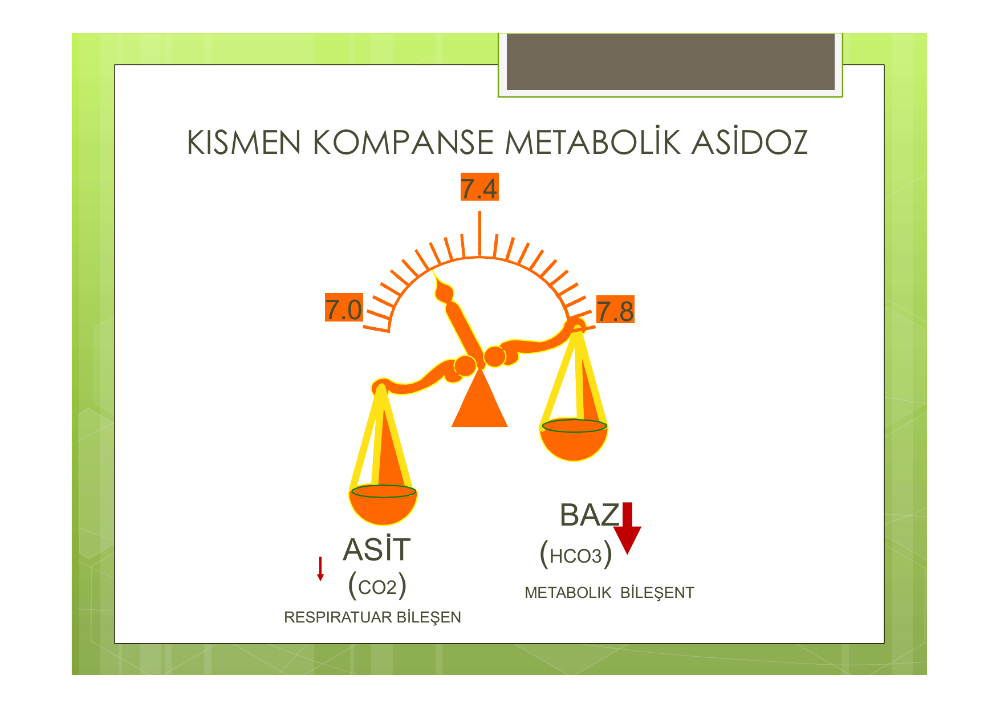
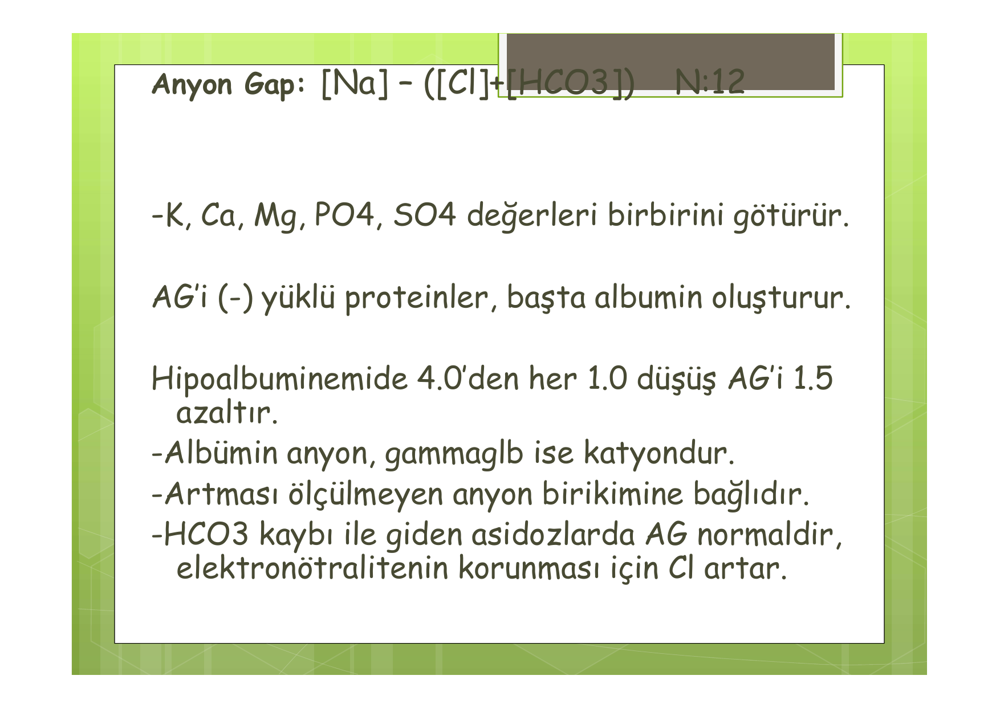
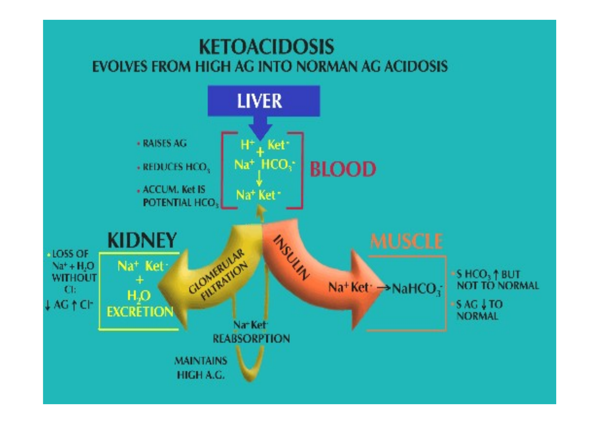
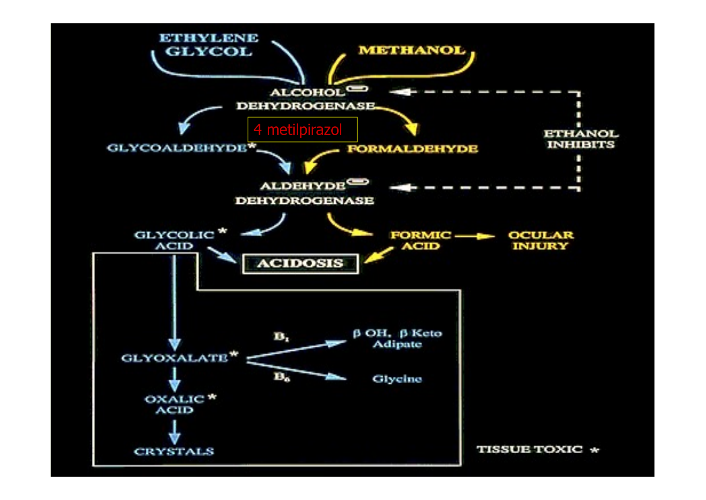

# ASİT BAZ DENGESİ

**Hazırlayan:** Prof. Dr. Yavuz Yeniçerioğlu
**Bölüm:** Nefroloji Bilim Dalı — İç Hastalıkları Anabilim Dalı

---

## İÇİNDEKİLER

1. [Temel Kavramlar](#temel-kavramlar)
2. [Asit Yük ve Tampon Sistemleri](#asit-yuk-ve-tampon-sistemleri)
3. [Renal Asit Atılımı](#renal-asit-atilimi)
4. [Kompensatuar Mekanizmalar](#kompensatuar-mekanizmalar)
5. [Asit Baz Dengesizlikleri — Genel Sınıflama](#asit-baz-dengesizlikleri)
6. [Metabolik Asidoz](#metabolik-asidoz)
7. [Metabolik Alkaloz](#metabolik-alkaloz)
8. [Solunumsal Asidoz](#solunumsal-asidoz)
9. [Solunumsal Alkaloz](#solunumsal-alkaloz)
10. [Karma Bozukluklar ve Olgulara Yaklaşım](#karma-bozukluklar-ve-olgulara-yaklasim)

---

## TEMEL KAVRAMLAR

> **Asit** = Proton (H⁺) vericisi (HA) | **Baz** = Proton kabul eden (A⁻)

| Asit | Baz |
|---|---|
| H₂CO₃ (karbonik asit) | HCO₃⁻ |
| NH₄⁺ (amonyum) | NH₃ |
| HCl | Cl⁻ |
| H₂PO₄⁻ (dibazik fosfat) | HPO₄²⁻ |

### Kan pH Değerleri

* **Normal:** 7,35-7,45
* **Asidoz:** < 7,35
* **Alkaloz:** > 7,45
* **Yaşamla bağdaşmaz:** < 6,8 veya > 7,8

**Ekstraselüler sıvı [H⁺]:** 40 nanoEq/L (pH bunun negatif logaritmasıdır)

### Henderson-Hasselbalch Denklemi

> **pH = 6,1 + log [HCO₃⁻] / 0,03 × [pCO₂]**

0,03 × [pCO₂] = Erimiş durumdaki CO₂ konsantrasyonu

### Tanımlar

* **Asidemi:** pH < 7,35
* **Asidoz:** pH değerini düşürme eğilimi yaratan süreç
* **Alkalemi:** pH > 7,45
* **Alkaloz:** pH değerini yükseltme eğilimi yaratan süreç

### Normal Kan Gazı Değerleri

| Parametre | Arteriyel | Venöz |
|---|---|---|
| **pH** | 7,37-7,43 | 7,32-7,38 |
| **pCO₂** (mmHg) | 36-44 | 42-50 |

**⚠️ ÖNEMLİ:** Arteriyel örnek kullanılır. Venöz örnekte:
* HCO₃⁻ → 1-3 mEq/L **daha düşük**
* pCO₂ → 5-7 mmHg **daha yüksek**
* pH → 0,03-0,05 **daha düşük**

### Doğrulama Formülü

> **[H⁺] (nEq/L) = 24 × pCO₂ / HCO₃⁻**

| pH | 7,0 | 7,1 | 7,2 | 7,3 | 7,4 | 7,5 | 7,6 | 7,7 |
|---|---|---|---|---|---|---|---|---|
| **[H⁺]** | 100 | 79 | 63 | 50 | 40 | 32 | 25 | 20 |

---

## ASİT YÜK VE TAMPON SİSTEMLERİ

### Günlük Asit Yükü

| Tip | Miktar | Kaynak |
|---|---|---|
| **Uçucu (volatile) asitler** | CO₂: 15.000-20.000 mmol/gün | Karbohidrat ve yağ metabolizması |
| **Uçucu olmayan (non-volatile) asitler** | 50-100 mEq/gün | Sülfür içeren aminoasit katabolizması (sülfirik asit), fosfolipid metabolizması (fosforik asit) |

### CO₂ Neden Asittir?

> **Karbonik anhidraz** (eritrosit ve renal tübüler hücrelerde):
> CO₂ + H₂O ↔ H₂CO₃ ↔ **H⁺** + HCO₃⁻

### Tampon Sistemleri

> Tampon: Proton kabul eden ve pH değişimini en aza indiren madde (zayıf asit ve tuzu)

**Tamponun etkinliğini belirleyen faktörler:**
* pH hedefi
* Tamponun konsantrasyonu
* Tamponun pKa değeri
* Bileşenlerinin kontrolü

### Kimyasal Tampon Sistemleri

| Konum | Tampon Sistemi |
|---|---|
| **Hücre dışı** | ProteinH⁺/Proteinat, H₂CO₃/HCO₃⁻, NaH₂PO₄/Na₂HPO₄, organik asitler/tuzları |
| **Kemik** | Karbonat (CO₃²⁻) |
| **Hücre içi** | NaH₂PO₄/Na₂HPO₄, ProteinH⁺/Proteinat, HemoglobinH⁺/Hemoglobinat (eritrositler) |

**⚠️** HCO₃⁻ tampon sistemi **her iki bileşeni de regüle edilebildiğinden** ve çok miktarda bulunduğundan dolayı **en etkin** tampon sistemidir.

### Kompensatuar Mekanizmaların Etkisi — Örnek

80 mEq'lık bir asit yükü eklendiğinde:
* Tamponlanmazsa → ~40 L total vücut sıvısında [H⁺] = 2 mEq/L → pH **3,0** (ölümcül)
* HCO₃⁻ ile tamponlanınca → [HCO₃⁻]: 24 → 22 mEq/L (pH 7,36)
* Solunumsal kompensasyon → pCO₂: 40 → 37 mmHg
* **Son pH değeri: 7,39** ✅

---

## RENAL ASİT ATILIMI

### H⁺ Sekresyonu

* **Proksimal tübül:** Na⁺-H⁺ değişimi ile
* **Henle kulpu**
* **Toplayıcı kanallar:** Aktif H⁺-ATPaz pompası ile

### Renal Bikarbonat Emilimi

| Segment | Emilim Oranı |
|---|---|
| Proksimal tübül | %70-85 |
| Henle kulpu | %10-20 |
| Distal tübül ve toplayıcı kanallar | %4-7 |

Glomerüllerden filtre edilen **4320 mEq/gün** HCO₃⁻'ın %99,9'u geri emilir.

### Titratable Asidite

* Monobazik fosfat (HPO₄²⁻) → salgılanan H⁺ ile birleşir → H₂PO₄⁻
* Her HPO₄²⁻ ile bağlanan H⁺ için **bir HCO₃⁻** dolaşıma geri döner
* Günlük kapasite: **10-40 mEq**

### Amonyum Atılımı

* **En önemli adaptif mekanizma** (üretim ihtiyaca göre arttırılabilir)
* Normal kapasite: 30-40 mEq/gün → **300 mEq/gün**'e kadar artabilir
* Lipid solübl olan NH₃ pasif difüzyonla toplayıcı kanal hücresinden lümene geçer
* Lümende salgılanmış H⁺ ile birleşerek **NH₄⁺** oluşturur
* NH₄⁺ lipid solübl olmadığı için hücreye geri dönemez ve idrarla atılır
* Günlük asit yükünün **%60'ı** bu yolla titre edilir (25-50 mEq)
* Glutaminaz indüksiyonu ile kapasite artabilir

### İdrar pH Sınırı

* Minimum idrar pH = **4,5** ([H⁺] = 40 µmol/L)
* Bu pH'da 100 mEq H⁺ atmak için 2500 L idrar gerekir → bu mümkün olmadığı için H⁺ lümende HPO₄²⁻ ve NH₃ ile tamponlanır

---

## KOMPENSATUAR MEKANİZMALAR

### Asit Retansiyonuna Yanıt Sıralaması

1. **Saniyeler:** HCO₃⁻, hücre içi ve kemik tamponları ile bağlanma
2. **Dakikalar:** Akciğerler devreye girerek pCO₂ modifiye edilir
3. **Günler:** Renal yanıt gelişir (5-6. günde maksimum; en önemli mekanizma amonyum)

### Asidozda Potasyum

* Fazla H⁺'in bir kısmı hücre içine alınır → elektronötralitenin korunması için hücre **K⁺ ve Na⁺** kaybeder
* Metabolik asidozda bu nedenle **total K⁺ miktarı normal de olsa hiperkalemi** görülür

### Primer ve Kompensatuar Değişiklikler

| Bozukluk | Primer Değişiklik | Kompensatuar Değişiklik |
|---|---|---|
| **Metabolik asidoz** | [HCO₃⁻] ↓ | pCO₂ ↓ (× 1,2) |
| **Metabolik alkaloz** | [HCO₃⁻] ↑ | pCO₂ ↑ (× 0,6-0,7) |
| **Respiratuar asidoz** | pCO₂ ↑ | [HCO₃⁻] ↑ (Akut: × 0,1 / Kronik: × 0,35) |
| **Respiratuar alkaloz** | pCO₂ ↓ | [HCO₃⁻] ↓ (Akut: × 0,2 / Kronik: × 0,4) |

---

## ASİT BAZ DENGESİZLİKLERİ

* **Basit bozukluklar:** Temel bozukluk + beklenen adaptif yanıt
* **Karma bozukluklar:** İki temel bozukluk bir arada; beklenen adaptif değişiklikler bilinmeli

---

## METABOLİK ASİDOZ

Temel patoloji: **HCO₃⁻ konsantrasyonunda düşüş**
* Tampon olarak kullanılma sonucu
* Direkt HCO₃⁻ kaybı

### Anyon Gap (AG) Kavramı

> **AG = [Na⁺] − ([Cl⁻] + [HCO₃⁻])** → **Normal: ~12 mEq/L**

* AG'i (-) yüklü proteinler, başta **albümin** oluşturur
* **Hipoalbüminemide:** Albümin 4,0'den her 1,0 g/dL düşüşü AG'i **1,5 azaltır**
* Albümin anyon, gammaglobülin ise katyondur
* AG artması → ölçülmeyen anyon birikimine bağlıdır
* HCO₃⁻ kaybı ile giden asidozlarda AG normaldir, elektronötralitenin korunması için **Cl⁻ artar**

### Metabolik Asidozun AG'e Göre Ayrımı

| Artmış AG Metabolik Asidoz | Normal AG (Hiperkloremik) Metabolik Asidoz |
|---|---|
| Böbrek yetmezliği (fosfat, sülfat, ürat, hippurat) | Renal tübüler asidoz (RTA) |
| Ketoasidoz (diyabetik, alkolik, açlık) | Diyare, üreterosigmoidostomi, ileostomi |
| Laktik asidoz | Bazı KBY tipleri |
| Entoksikasyonlar (aspirin, etilen glikol, metanol) | Karbonik anhidraz inhibitörleri |

### Klinik Bulgular

* Halsizlik, yorgunluk, bulantı, kusma
* Hipotansiyon
* **Kussmaul solunumu**
* Uykuya eğilim

### Asidozun Fizyolojik Etkileri

* Miyokard kontraktilitesi azalır → **pulmoner ödem**
* Periferik vasküler rezistans azalır → **hipotansiyon, doku hipoksisi**
* Ventriküler fibrilasyon eşiği düşer → **aritmiler**
* Ekstraselüler K⁺ düzeyi artar → **hiperkalemi**
* Santral sinir sistemi depresyonu → **şuur bulanıklığı**

### Metabolik Asidoz Nedenleri — Detay

#### Renal Asit Atılımında Azalma

**Böbrek yetmezliği:**
* GFR < 40 mL/dk → asit retansiyonu başlar
* HCO₃⁻ konsantrasyonu düşer (tampon olarak tüketilir)
* Hücrelerde ve kemikte tamponlanma
* Amonyum atılımı yeterince arttırılamaz (nefron sayısında azalma)

#### Renal Tübüler Asidoz (RTA)

**Tip I (Distal) RTA:**
* H⁺ sekresyonunda bozukluk
* Primer (idiyopatik), ailesel (AD, AR)
* Sekonder: Sjögren, romatoid artrit, ifosfamid, siklofosfamid, amfoterisin B, siroz, orak hücreli anemi, obstrüktif üropati, lityum, renal transplantasyon, SLE, hiperkalsiüri, hiperglobülinemi
* Tedavi almayan hastalarda HCO₃⁻ < 10 olabilir
* Düşük sitrat atılımı ve hiperkalsiüri → sık **böbrek taşı**
* **İdrar pH'sı > 5,3** olan normal AG metabolik asidozda düşünülmeli
* K genellikle **düşük**; alkali tedavisi ile hipokalemi düzelir

**Üriner Anyon Gap:**
> **İdrar AG = İdrar (Na⁺ + K⁺) − İdrar Cl⁻**

* İdrardaki amonyum miktarının indirekt göstergesi
* Normalde **negatif** olması gerekir
* Asidoz varlığında **pozitif** ise → **distal RTA'yı** işaret eder

**Tip II (Proksimal) RTA:**
* Proksimal tübülde HCO₃⁻ geri emilimi bozuk
* Başlangıçta HCO₃⁻ kaybı → plazma HCO₃⁻ daha düşük seviyede yeni denge (genellikle 12-20 mEq/L)
* Bu noktada filtre edilen HCO₃⁻'ın tümü emilir ve hasta günlük asit yükünü atabilir
* Tedavi almayan hastada idrar pH'sı **< 5,3**
* K genellikle **düşük**, bikarbonat replasmanı ile hipokalemi **kötüleşir**
* HCO₃⁻'ı yükseltmek için çok yüksek doz gerekir: **10-15 mEq/kg/gün**
* Nedenler:
  - Primer: İdiyopatik, sporadik
  - Ailesel: Sistinozis, tirozinemi, herediter fruktoz intoleransı, galaktozemi, glikojen depo hastalığı tip I, Wilson hastalığı
  - Kazanılmış: Multipl miyelom, ifosfamid, karbonik anhidraz inhibitörleri, amiloidoz, ağır metaller (cıva, kurşun, kadmiyum, bakır), D vitamini eksikliği, böbrek transplantasyonu, paroksismal noktürnal hemoglobinüri

**Tip IV RTA:**
* Distal tübüldeki Na-K-H değiştirici mekanizma etkilenmiş
* Asit ve K⁺ ekskresyonu bozuk → **hiperkalemik, hiperkloremik asidoz**
* Genellikle asidoz hafiftir (HCO₃⁻: ~18 mEq/L)
* **Hiporeninemik hipoaldosteronizm** sonucu oluşur
* 50-70 yaşlarında **diyabet** veya kronik interstisyel böbrek hastalığı, hafif-orta derecede böbrek yetmezliği
* NSAİİ, ACE inhibitörleri, ARB, siklosporin ve heparin durumu kötüleştirir
* Tedavi: Distale gelen Na⁺ arttırılır (oral Na alımı ↑) ve **furosemid** kullanılır

#### Laktik Asidoz

* Normalde pirüvik asit metabolizması sonucu günde 15-20 mmol laktat oluşur
* Laktik asidoz → oluşum arttığında veya metabolizması azaldığında gelişir

**Laktik Asidoz Tanı Kriterleri:**
* HCO₃⁻, pCO₂, pH: hepsi düşük
* **AG artmış** (> 12 mM)
* Keton testi negatif, BUN < 40 mg/dL, intoksikasyon yok
* **Serum laktat > 2 mM**

| Tip A (Klinik olarak hipoksi belirgin) | Tip B (Klinik olarak hipoksi yok) |
|---|---|
| Konjestif kalp yetmezliği, şok, sepsis, nöbetler, ciddi anemi, ciddi hipoksemi | Karaciğer hastalığı, diyabet, malignite, ilaç/toksinler (etanol, metanol, biguanidler), herediter bozukluklar (fruktoz 1,6 difosfataz eksikliği, pirüvat karboksilaz/dehidrojenaz eksikliği) |

**Tedavi:**
* Amaç: Altta yatan patolojinin düzeltilmesi
* **HCO₃⁻ tedavisi tartışmalı:** Sadece geçici HCO₃⁻ artışı, CO₂ oluşumu ile asidozu arttırması, intraselüler asidozu kötüleştirmesi, hipokalsemi ve Na yüklenmesi
* HCO₃⁻ tedavisi sadece **pH < 7,1** olduğunda verilmeli
* Alternatifler: Tromethamine (THAM) — asit tamponlayabilen inert amino alkol, CO₂ oluşumuna neden olmaz (güvenliği tartışmalı)

#### Diabetik Ketoasidoz

* İnsülin eksikliği ve glukagon fazlası → ketoasitlerin (β-hidroksibutirik asit ve asetoasetik asit) fazla yapımı
* Tedavide amaç: **İnsülin eksikliğinin düzeltilmesi**
* HCO₃⁻ tedavisi ancak **pH < 7,15** ise düşünülebilir

#### Entoksikasyonlar

**Etilen glikol entoksikasyonu:**
* Antifrizde bulunur
* Bulgular: Ataksi, nistagmus, epileptik nöbet, papilödem, karın ağrısı, bulantı, kusma, hipokalsemi, ATN
* İdrarda **kalsiyum oksalat kristalleri**
* Tedavi: Alkol infüzyonu (veya fomepizol), kalsiyum, **diyaliz**

**Metanol entoksikasyonu:**
* Alkol dehidrojenaz tarafından formaldehid ve formik aside çevrilir → derin asidoz
* 8-72 saatlik latent periyod sonrası: **Görme bozukluğu**, konfüzyon, letarji, koma, karın ağrısı, bulantı-kusma

**Salisilat entoksikasyonu:**
* Genellikle **40-50 mg/dL** üzeri düzeylerde görülür
* Solunum merkezinin direkt uyarılması → **respiratuar alkaloz**
* Salisilik asit + oksidatif metabolizmanın engellenmesi → laktik asit ve ketoasitler → **AG metabolik asidoz**
* Bulgular: Bulantı, tinnitus, hiperventilasyon, nonkardiyojenik pulmoner ödem, uzamış PT, düşük ürik asit
* **Plazma ve idrar alkalinizasyonu** → asetilsalisilik asidi lipid solübl olmayan forma çevirerek hücresel toksisiteyi azaltır
* HD endikasyonu: Koma, böbrek yetmezliği, hemodinamik instabilite ve **> 90 mg/dL** kan düzeyleri

### Metabolik Asidoz Tedavisi

**Amaç:**
1. Metabolik asidoz nedeninin ortadan kaldırılması
2. Etken ortadan kalkana kadar asidozun etkilerinden korunmak

**Tedavi:**
* Respiratuar komponent varsa düzeltilir
* **Alkali tedavisi** (NaHCO₃) ciddi asidozda (**pH < 7,2**) düşünülmelidir
* Derin ve tedaviye dirençli asidozda **bikarbonatlı diyaliz** solüsyonları ile acil hemodiyaliz

### NaHCO₃ Tedavi Protokolü

> **HCO₃⁻ açığı (mEq) = 0,5 × Ağırlık (kg) × (İstenen HCO₃⁻ − Ölçülen HCO₃⁻)**

* Laktik asidoz ve DKA'da: Şiddetli asidoz olmadıkça (pH < 7,15) bikarbonat önerilmez
* KBY'de asidoz → kemik ve kas yıkımı, osteoporoz, artmış amonyak yapımı → tübülointerstisyel hasar → **hedef HCO₃⁻ > 22 mEq/L**

### AG Metabolik Asidozda İleri Tetkik

Sebebi bilinmeyen AG asidozla gelen hastada:
* İdrar ve serum **keton** düzeyleri
* **Laktik asit**
* **Osmolal gap:**

> **Hesaplanan Osm = 2 × Na⁺ + BUN/2,8 + Glukoz/18**

* Ölçülen − Hesaplanan < 10 olmalı
* **> 20 ise:** Etanol, etilen glikol, metanol zehirlenmesi (mannitol de gap'i arttırabilir)

---

## METABOLİK ALKALOZ

Temel patoloji: **HCO₃⁻ konsantrasyonunun artışı**

### Alkalozun Fizyolojik Etkileri

* Dolaşım depresyonu, azalmış kardiyak output
* Hb-O₂ eğrisinde **sola kayma** → doku hipoksisi
* Artmış doku O₂ tüketimi
* **Hipokalemi**
* Nöromüsküler irritabilite
* Serebral kan akımında azalma
* Bronkokonstriksiyon
* Pulmoner vasküler rezistans azalması

### Klinik Bulgular

1. **Primer hastalığa ait:** Kusma, gastrik drenaj, diüretik tedavi, kas krampları, halsizlik
2. **Fizik muayene:** Nöromusküler irritabilite bulguları, tetani, konvülzyon, hiperaktif refleksler
3. **Belirgin alkalemi (pH > 7,6):** Ciddi kardiyak ritm bozukluğu

### Metabolik Alkaloz Nedenleri

#### 1. Hidrojen Kaybı

**Gastrointestinal:** Kusma veya nazogastrik drenaj

**İdrarla kayıp:**
* Loop veya tiazid grubu diüretikler
* Hiperaldosteronizm
* Posthiperkapnik alkaloz

**Hücre içine geçiş:** Hipokalemi

#### 2. Bikarbonat veya Bikarbonat Prekürsörü Alımı

* Kan transfüzyonu (sitrat → bikarbonat)
* HCO₃⁻ replasmanı
* Süt-alkali sendromu

#### 3. Kontraksiyon Alkalozu

* Ödemli durumların diüretikle tedavisinde bikarbonat içermeyen sıvı kaybı

### Metabolik Alkalozu Sürdüren Mekanizmalar

**İki soru sorulmalıdır:**
1. Alkalozu başlatan olay nedir?
2. Bikarbonat fazlasının atılmasını engelleyen nedir?

* Bikarbonat glomerülden serbestçe süzülür; normalde %90'ı proksimal tübülden geri emilir
* Normal bir kişi buradaki emilimi azaltarak fazla bikarbonatı kolayca atabilmelidir
* **En önemli sürdürücü faktör: Eş zamanlı volüm kontraksiyonu**
* Volümün korunması daha öncelikli → proksimal reabsorpsiyon artışı → fazla bikarbonatın atılımını engeller

### Önemli Mekanizmalar

* **Kusma ve NG drenajda:** Asit kaybı + volüm kaybı + Cl⁻ eksikliği (Cl⁻ eksikliği distal bikarbonat emilimini arttırır)
* **Diüretiklerle:** Volüm kaybı → aldosteron salınımı ↑ → H⁺-ATPaz aktivasyonu → H⁺ salgılanması ↑
* **Primer hiperaldosteronizm ve hipokalemi:** İdrarla H⁺ ve K⁺ atılımı artışına bağlı
* **K⁺ eksikliği:** İntraselüler asidoz → H⁺ sekresyonu ↑ → tübül lümeninden daha fazla HCO₃⁻ geri emilir
* **Posthiperkapnik alkaloz:** Kronik hiperkapnide kompensatuar HCO₃⁻ yükselir; pCO₂ akut düşürülürse HCO₃⁻ yüksek kalır

### Volüm Durumunun Değerlendirilmesi

* FM, CVP yanı sıra **idrar [Na⁺]** kullanılır
* Ancak idrar Na⁺ yanıltıcı olabilir (tübül sıvısında artmış HCO₃⁻ yanında Na⁺ da taşınır)
* **İdrar [Cl⁻]** volüm durumunu **daha iyi** gösterir
* Dikkat: Diüretik kullanımında volüm eksiğine rağmen Cl⁻ de yüksek bulunabilir

### Metabolik Alkaloz Tedavisi

* Tedavi öncelikle **altta yatan patolojiye** yönelik olmalı
* **Volüm kontraksiyonu olan hastalarda:** NaCl veya KCl replasmanı
* **Sürekli kusma:** H₂ reseptör blokerleri düşünülebilir
* **Ödemli hastalarda:** Karbonik anhidraz inhibitörü **asetazolamid**
* **pH > 7,55:** 0,1 N HCl infüzyonu
* **Diyaliz** tedavisi

---

## SOLUNUMSAL ASİDOZ

Temel patoloji: **pCO₂ artışı** (hipoventilasyon)

### Solunumsal Asidoz Nedenleri

* Solunum yolları obstrüksiyonu (bronkospazm, kronik bronşit)
* Solunum merkezinin inhibisyonu (ilaçlar, SSS hastalıkları)
* Pnömotoraks, hemotoraks
* Solunum kaslarının hastalıkları
* Pnömoniler
* Kardiyak arrest veya kardiyojenik şok

### Kompensasyon

| Durum | HCO₃⁻ Artışı |
|---|---|
| **Akut** | ΔpCO₂ × **0,1** |
| **Kronik** | ΔpCO₂ × **0,35** |

---

## SOLUNUMSAL ALKALOZ

Temel patoloji: **pCO₂ azalması** (hiperventilasyon)

### Solunumsal Alkaloz Nedenleri

**SSS bozuklukları:**
* Anksiyete, konversiyon, beyin tümörleri

**Solunum sistemi bozuklukları:**
* Pulmoner emboli, akciğer fibrozu

**Diğer:**
* Salisilat entoksikasyonu

### Kompensasyon

| Durum | HCO₃⁻ Azalması |
|---|---|
| **Akut** | ΔpCO₂ × **0,2** |
| **Kronik** | ΔpCO₂ × **0,4** |

---

## KARMA BOZUKLUKLAR VE OLGULARA YAKLAŞIM

### Asit-Baz Dengesi Bozukluklarında Yaklaşım

1. Elektrolitler ve kan gazı tayini
2. pH değerine göre asidoz/alkaloz ayrımı
3. HCO₃⁻ ve pCO₂ değerlerine göre primer patolojinin saptanması
4. **Beklenen kompensasyon oluşmuş mu?** → Farklıysa ikinci bir patoloji mevcut
5. Metabolik asidozda **AG ve osmolal gap** hesaplanması
6. **Delta AG / Delta HCO₃⁻** karşılaştırılması

### Delta AG / Delta HCO₃⁻ Oranı

* Genellikle **1-2** arasında
* **< 1:** İdrarla keton kaybı, AG + nonAG asidoz birlikteliği (örn: KBY + diyare)
* **> 2:** HCO₃⁻ beklenenden yüksek → ek metabolik alkaloz (örn: kusmaya bağlı)

---

### 📋 OLGU 1: Basit Metabolik Asidoz

**Hasta:** 64 yaşında erkek, son 24 saatte 8 kez sulu diyare ile acile başvuru

| Parametre | Değer |
|---|---|
| pH | 7,23 |
| HCO₃⁻ | 10 mEq/L |
| pCO₂ | 23 mmHg |
| Na⁺ | 135 mEq/L |
| K⁺ | 3,4 mEq/L |
| Cl⁻ | 115 mEq/L |

**Analiz:**
* AG = 135 − (115 + 10) = **10** → Normal AG metabolik asidoz
* ΔHCO₃⁻ = 14 → Beklenen pCO₂ düşüşü = 14 × 1,2 = 17
* Beklenen pCO₂ = 40 − 17 = **23** → Saptanan: 23 ✅
* **Tanı: Basit metabolik asidoz** (diyareye sekonder)

> pCO₂ > 25 olsaydı → ek respiratuar asidoz
> pCO₂ < 20 olsaydı → ek respiratuar alkaloz

---

### 📋 OLGU 2: Karma Bozukluk — DKA + Metabolik Alkaloz

**Hasta:** 25 yaşında kadın, Tip I DM (10 yıl), 2 günlük bulantı-kusma, 2 gündür insülin kullanmamış

| Parametre | Değer |
|---|---|
| pH | 7,4 |
| pCO₂ | 40 mmHg |
| HCO₃⁻ | 23 mEq/L |
| Na⁺ | 136 mEq/L |
| K⁺ | 3,2 mEq/L |
| Cl⁻ | 85 mEq/L |
| KŞ | 270 mg/dL |

**Analiz:**
* AG = 136 − (85 + 23) = **28** → Artmış AG metabolik asidoz
* ΔAG = 16, ΔHCO₃⁻ = 1
* **ΔAG / ΔHCO₃⁻ > 2** → ek metabolik alkaloz mevcut
* Plazmada HCO₃⁻'ı 14 mEq/L düşürmesi gereken miktarda keton mevcut → asidoz öncesi HCO₃⁻ ~37 olmalı
* **Tanı: Kusmaya bağlı metabolik alkaloz + DKA**

---

### 📋 OLGU 3: AG Metabolik Asidoz + Respiratuar Asidoz

**Hasta:** 58 yaşında erkek, akut MI sonrası şok, YBÜ, KB: 80/50 mmHg, kardiyopulmoner arrest sonrası entübe

| Parametre | Değer |
|---|---|
| pH | 7,30 |
| pCO₂ | 32 mmHg |
| Na⁺ | 141 mEq/L |
| K⁺ | 4,5 mEq/L |
| Cl⁻ | 99 mEq/L |
| HCO₃⁻ | 11 mEq/L |

**Analiz:**
* AG = 141 − (99 + 11) = **31** → AG metabolik asidoz
* ΔHCO₃⁻ = 13, beklenen pCO₂ = 40 − (1,2 × 13) = **25**
* Saptanan pCO₂ = 32 → **ek respiratuar asidoz** mevcut
* ΔAG / ΔHCO₃⁻ = 19/13 (~1,5) → 1-2 arasında (ek metabolik alkaloz veya nonAG asidoz yok)
* **Tedavi:** Hipotansiyonun düzeltilmesi; NaHCO₃ endikasyonu yok; pCO₂ düşürülerek pH düzeltilebilir

---

### 📋 OLGU 4: Metabolik Alkaloz (Diüretik İlişkili)

**Hasta:** 72 yaşında kadın, KKY, 1 haftadır yatarak diüretik tedavi, ortostatik hipotansiyon, cilt turgoru azalmış

| Parametre | Değer |
|---|---|
| pH | 7,49 |
| pCO₂ | 48 mmHg |
| HCO₃⁻ | 36 mEq/L |
| Na⁺ | 132 mEq/L |
| K⁺ | 3,4 mEq/L |
| Cl⁻ | 86 mEq/L |
| BUN | 36 mg/dL |
| Kreatinin | 1,4 mg/dL |

**Analiz:**
* ΔHCO₃⁻ = 12, beklenen pCO₂ değişimi = 0,7 × 12 = 8,4
* Beklenen pCO₂ = 48 → Saptanan: 48 ✅
* **Normal kompensasyon mevcut**
* FM bulguları + artmış BUN/kreatinin oranı → **volüm kontraksiyonu**

---

### 📋 OLGU 5: Kronik Respiratuar Asidoz

**Hasta:** 52 yaşında erkek, KOAH, rutin poliklinik kontrolü

| Parametre | Değer |
|---|---|
| pH | 7,34 |
| pCO₂ | 56 mmHg |
| HCO₃⁻ | 30 mEq/L |

**Analiz:**
* ΔpCO₂ = 16
* Beklenen HCO₃⁻ = 24 + (16 × 0,35) = **29,6** → Saptanan: 30 ✅
* **Kronik respiratuar asidoz, tam kompensasyon**

---

### 📋 OLGU 6: Kronik Respiratuar Asidoz + Metabolik Asidoz

**Aynı hasta** 3 günlük diyare ile acile başvuruyor

| Parametre | Değer |
|---|---|
| pH | 7,18 |
| pCO₂ | 56 mmHg |
| HCO₃⁻ | 20 mEq/L |
| Na⁺ | 140 mEq/L |
| K⁺ | 3,3 mEq/L |
| Cl⁻ | 110 mEq/L |

**Analiz:**
* Respiratuar asidoz → beklenen HCO₃⁻ = 30, saptanan = 20 → **ek metabolik asidoz**
* AG = 140 − (110 + 20) = **10** (normal)
* **Tanı: Kronik respiratuar asidoz + nonAG metabolik asidoz** (diyareye sekonder)

---

### 📋 OLGU 7: Akut Respiratuar Asidoz

**Hasta:** 25 yaşında, astım bronşiale, nefes darlığı ile acile başvuru

| Parametre | Değer |
|---|---|
| pH | 7,25 |
| pCO₂ | 56 mmHg |
| HCO₃⁻ | 26 mEq/L |

**Analiz:**
* Akut respiratuar asidoz → beklenen HCO₃⁻ = 24 + (16 × 0,1) = **25,6** → Saptanan: 26 ✅
* Ek asit-baz patolojisi yok

---

### 📋 OLGU 8: Belirsiz Kroniklik — Üç Olası Tanı

**Hasta:** Nefes darlığı ile acilde görülen hasta

| Parametre | Değer |
|---|---|
| pH | 7,27 |
| pCO₂ | 70 mmHg |
| HCO₃⁻ | 31 mEq/L |

**Analiz:**
* Respiratuar asidoz mevcut, ΔpCO₂ = 30
* Akut için beklenen HCO₃⁻ = 24 + (30 × 0,1) = **27**
* Kronik için beklenen HCO₃⁻ = 24 + (30 × 0,35) = **35**
* Saptanan HCO₃⁻ = 31 → **her ikisine de uymuyor**

**Üç olası tanı:**
1. Kronik respiratuar asidoz + ek metabolik asidoz (KOAH'lı hastada diyare)
2. Metabolik alkaloz + akut respiratuar asidoz (teofilin toksisitesine bağlı kusma + astım krizi)
3. Kronik respiratuar asidoz + akut respiratuar asidoz (KOAH'lı hastada pnömoni)

**⚠️ ÖNEMLİ:** Asit-baz patolojisini saptamada laboratuvar bulguları **her zaman öykünün ışığında** değerlendirilmelidir.
