# BÖBREK GENETİK HASTALIKLARI

**Hazırlayan:** Prof. Dr. Hakan Akdam
**Bölüm:** Aydın Adnan Menderes Üniversitesi -- Nefroloji Bilim Dalı

---

## İÇİNDEKİLER

1. [Giriş -- Böbreğin Kistik Hastalıkları](#giriş-böbreğin-kistik-hastalıkları)
2. [Otozomal Dominant Polikistik Böbrek Hastalığı (ODPKBH/ADPKD)](#otozomal-dominant-polikistik-böbrek-hastalığı-odpkbhadpkd)
3. [ADPKD Epidemiyoloji ve Genetik](#adpkd-epidemiyoloji-ve-genetik)
4. [İki Vuruş (Double Hit) Hipotezi](#iki-vuruş-double-hit-hipotezi)
5. [ADPKD Patogenez ve Patoloji](#adpkd-patogenez-ve-patoloji)
6. [ADPKD Tanı](#adpkd-tanı)
7. [ADPKD Renal Bulgular](#adpkd-renal-bulgular)
8. [ADPKD Ekstrarenal Bulgular](#adpkd-ekstrarenal-bulgular)
9. [ADPKD İntrakraniyal Anevrizma](#adpkd-intrakraniyal-anevrizma)
10. [ADPKD Tedavi](#adpkd-tedavi)
11. [Otozomal Resesif Polikistik Böbrek Hastalığı (ORPKBH/ARPKD)](#otozomal-resesif-polikistik-böbrek-hastalığı-orpkbh-arpkd)
12. [Tübero Skleroz Kompleksi (TSC)](#tübero-skleroz-kompleksi-tsc)
13. [Von Hippel-Lindau Hastalığı](#von-hippel-lindau-hastalığı)
14. [Medüller Sünger Böbrek](#medüller-sünger-böbrek)
15. [Böbreğin Edinsel Kistik Hastalığı](#böbreğin-edinsel-kistik-hastalığı)
16. [Basit Renal Kistler](#basit-renal-kistler)
17. [Kistik Böbrek Hastalıkları Özet Karşılaştırma](#kistik-böbrek-hastalıkları-özet-karşılaştırma)
18. [Fabry Hastalığı](#fabry-hastalığı)

---

## GİRİŞ -- BÖBREĞİN KİSTİK HASTALIKLARI

> **Tanım:** Renal kistler **düzgün cidarlı, içi sıvı dolu** renal tübüllerin dışa keselenmesi sonucu oluşur. Birçok hastalık tabakasında görülür.

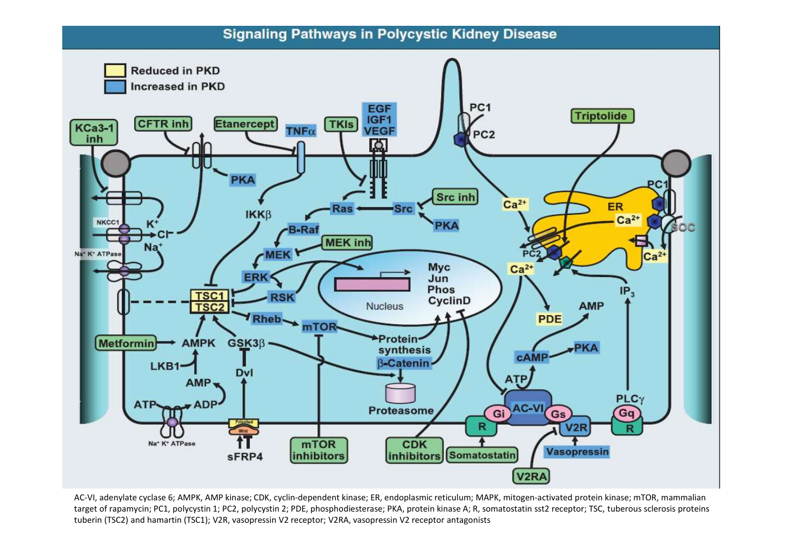

> **Şema yorumu:** Kistik böbrek hastalıkları **kalıtsal ve kazanılmış** olarak ikiye ayrılır. Kalıtsal formlar otozomal dominant (ADPKD, tuberoskleroz, VHL, medüller kistik), otozomal resesif (ARPKD, nefronofitizi), X'e bağlı ve çoklu malformasyon sendromları olarak alt gruplanır. Kazanılmış formlar gelişimsel (multikistik displazi, medüller sünger) ve edinsel (basit kist, kronik böbrek yetmezliğinde edinsel kistik hastalık) olarak ayrılır.

### Ana Sınıflama

| Kategori | Alt Grup | Örnekler |
|---|---|---|
| **Kalıtsal -- OD** | Polikistik + diğer | ADPKD, tübero skleroz, VHL, erişkin medüller kistik |
| **Kalıtsal -- OR** | Polikistik + diğer | ARPKD, juvenil nefronofitizi, çoklu malformasyon sendromları, kromozom bozuklukları |
| **Kalıtsal olmayan -- gelişimsel** | -- | Multikistik displazi, medüller sünger böbrek |
| **Kalıtsal olmayan -- edinsel** | -- | Basit kistler, multiloküler kistik nefroma, hipokalemik kistik hastalık, **edinsel kistik hastalık (KBH'de)** |

---

## OTOZOMAL DOMİNANT POLİKİSTİK BÖBREK HASTALIĞI (ODPKBH/ADPKD)

> **Tanım:** **Multiple bilateral renal kistler** ve diğer organlarda (KC, pankreas, araknoid membran) kistler ile karakterize **multisistem bir genetik hastalık**. İlk kez 1957'de Dalgaard tarafından otozomal dominant geçişli olduğu gösterilmiştir.

### En Sık Kalıtsal Böbrek Hastalığı

* **Orak hücreli anemiden 10 kat**
* **Kistik fibrozdan 15 kat**
* **Huntington hastalığından 20 kat** daha sık

---

## ADPKD EPİDEMİYOLOJİ VE GENETİK

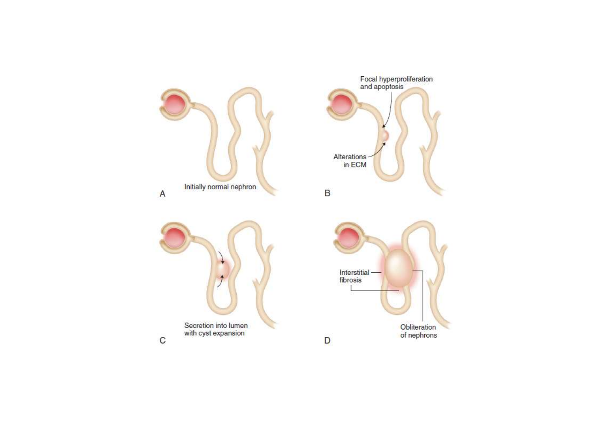

> **Şema yorumu:** ADPKD iki gen (PKD1 ve PKD2) tarafından kodlanan polikistin 1 ve polikistin 2 proteinlerinin fonksiyon bozukluğu sonucu gelişir. Polikistin 1 hücre membran reseptörü, polikistin 2 ise kalsiyum kanalı olarak görev yapar.

### Epidemiyoloji

| Özellik | Değer |
|---|---|
| **Sıklık** | 1/400-1000 canlı doğum |
| **Cinsiyet** | Erkek = Kadın |
| **Etkilenen gen sayısı** | 2 |

### Gen Yapısı

| Gen | Kromozom | Oran | Gen Ürünü | Hastalık seyri |
|---|---|---|---|---|
| **PKD1** | **16p13.3** | **%85** | Polikistin 1 (14 kb, 4303 aa membran reseptörü) | **Daha erken, daha hızlı ilerler** |
| **PKD2** | **4q21** | %15 | Polikistin 2 (Ca²⁺ kanalı/por) | Daha geç |

### Polikistin 1 Fonksiyonu

* **Hücre membranında** yerleşik, **14 kb uzunluğunda, 4303 aa** polipeptid
* Tübül hücrelerinde **fokal adhezyon kompleksi**, hücreler arası bağlantı noktaları, lüminal yüzde **siliyumda** bulunur
* **Birçok protein, karbonhidrat ve lipidi bağlama** yeteneği olan membran reseptörü
* Fosforilasyon ile hücre içi sinyal iletimi
* **Normal epitel diferansiyasyonunu kontrol** eder, epitel hücre büyümesini **baskılar**

### Polikistin 2 Fonksiyonu

* **İyon kanalı veya por** olarak görev yapar
* **Ca²⁺ kanalı**
* Polikistin 1 ile sitoplazmik karboksil uçlarında etkileşim

### Ortak Sinyal Yolu

> **Mekanizma:** Herhangi bir polikistin sentezinde azalma → **tübül hücre içi Ca²⁺ homeostazında değişiklik** → siklik nükleotid (cAMP), tirozin kinaz reseptörü gibi hücre içi sinyalizasyon yolaklarının aktivasyonu → **hücre proliferasyonu, planar polaritenin bozulması, apoptoz artışı, sekretuar fenotip, ekstraselüler matriks remodelingi** → kist oluşumu.

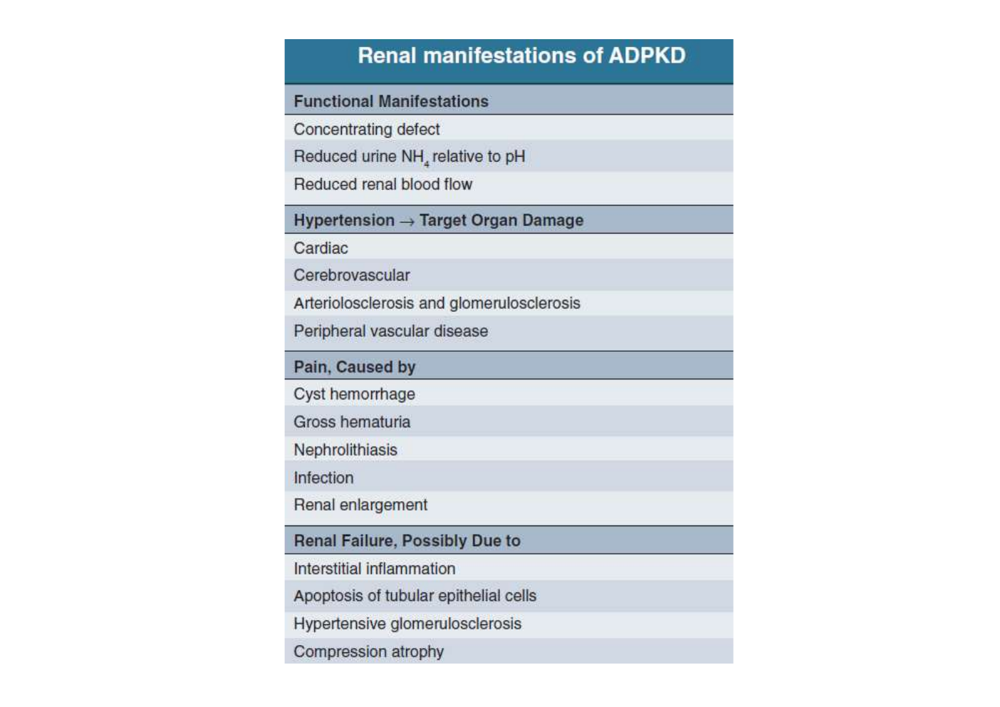

> **Şema yorumu:** Kist patogenezinde V2 reseptör (vazopressin) aracılığı ile cAMP artışı, mTOR aktivasyonu ve somatostatin reseptör (sst2) etkileşimi temel rol oynar. Bu moleküler ipler yeni tedavilerin (tolvaptan -- V2RA, somatostatin analogları, mTOR inh.) hedefidir.

---

## İKİ VURUŞ (DOUBLE HIT) HİPOTEZİ

> **Konsept:** Tüm nefronların **sadece %1-2'sinden** kist gelişir. Tüm hücrelerin patolojik gen taşımasına rağmen az sayıda tübülden kist gelişmesi, patogenezde **ikinci vuruş** hipotezini düşündürür.

### Mekanizma

1. **Birinci vuruş:** Defektif PKD geninin **ebeveynden germline kalıtımla** geçişi
2. **İkinci vuruş:** Tek tek böbrek epitel hücrelerinde diğer alleldeki normal genin **somatik mutasyonla** hasara uğraması
3. **Sonuç:** Her iki gen de patolojik hale geldiğinde normal polikistin sentezi gerçekleşemez, o hücreden kistik gelişim başlar

> **Klinik inci:** ADPKD otozomal dominant geçiş göstermesine rağmen, PKD1 geninin **hücresel düzeyde resesif** özellik gösterdiği söylenebilir. **İkinci vuruşların ortaya çıkma hızı hastalığın seyrini belirler**.

---

## ADPKD PATOGENEZ VE PATOLOJİ

### Kist Gelişimi -- 3 Ana Faktör

Kist gelişimi **intrauterin hayatta başlar**:

| # | Faktör | Açıklama |
|---|---|---|
| 1 | **Tübül hücre hiperplazisi** | Tam diferansiye olmamış hücrelerin aşırı proliferasyonu; hormonlar, büyüme faktörleri rol alır; apoptozis artar |
| 2 | **Tübül hücrelerinden aşırı sekresyon** | Kist sıvısı ultrafiltrattan gelir; **aktif klorür sekresyonu** lümen içine sıvı pompalar; Na⁺-K⁺-ATPaz apikal tarafa yer değiştirir |
| 3 | **Ekstraselüler matriks bozukluğu** | Geç dönemde bazal membran kalınlaşır; fibroblast aşırı proliferasyonu; interstisyel fibrozis |

### Makroskopi

* Her iki böbrek **normalden büyük**, değişik büyüklükte çok sayıda kist
* Böbrekler bazen tüm batını kaplayacak kadar büyür
* Kistler **10 cm'den büyük** olabilir
* Tek epitel tabakası ile çevrili, sıvı genellikle **berrak ve açık renk**
* Bazal membranda ayrışma, duplikasyon, kalınlaşma
* İlerlemiş olgularda **interstisyel fibrozis**

### Kist Sıvısı İçeriği Nefron Segmentini Yansıtır

| Köken | Na, Cl | K, H⁺, Kreatinin, Üre |
|---|---|---|
| **Proksimal tübül** | Seruma benzer | Seruma benzer |
| **Distal nefron** | **Düşük** | **Yüksek** (konsantre) |

### Fenotipik Varyant: PKD1 vs PKD2

| Özellik | PKD1 | PKD2 |
|---|---|---|
| Hastalık başlangıç yaşı | Erken | Geç |
| Hipertansiyon | Erken | Geç |
| **SDBY yaşı** | **54 yaş** | **74 yaş** |
| KC ve damar anomalileri | Var | Var |
| Cinsiyet etkisi | Erkeklerde 1.2-1.3 kat daha hızlı seyir | -- |

---

## ADPKD TANI

### Ravine (Unified) Kriterleri -- Aile Öyküsü Pozitif Olgularda

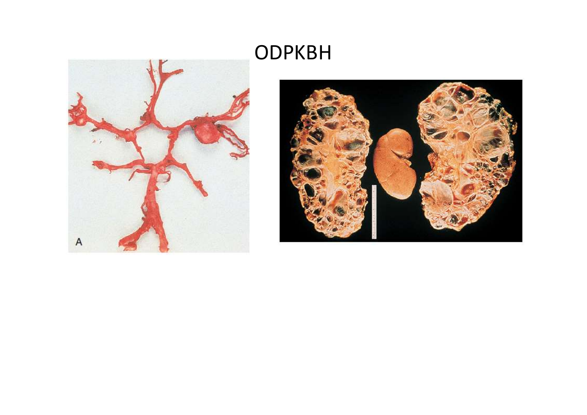

> **Şema yorumu:** Aile öyküsü pozitif bireylerde yaşa göre kist sayı kriterleri: genç yaşlarda daha az kist yeterli, ileri yaşta daha fazla kist aranır çünkü basit kistler yaşla birlikte artar.

| Yaş | Kriter |
|---|---|
| **15-39 yaş** | **≥3 kist** (tek veya iki taraflı) |
| **40-59 yaş** | **≥2 kist her bir böbrekte** |
| **≥60 yaş** | **≥4 kist her bir böbrekte** |

### Görüntüleme

* **Renal USG** -- ucuz ve **non-invazif** (1. seçim)
* BT, MRG -- komplikasyon, volüm ölçümü

### Genetik Test

* **Kesin tanı gerektiğinde** yapılabilir
* **Sınırlamalar:**
  * Linkage (bağlantı) analizi yeterli etkilenen aile bireyi tarama gerektirir (ailelerin %50'sinden azında mümkün)
  * **De novo mutasyonlar** (ailede yok) saptanması zor
  * Mutasyonların çoğu **benzersizdir**, patojenik kanıtı zor
  * DNA dizilemesi ile moleküler test hastaların **%18-85'inde** mümkündür
* **Preimplantasyon genetik tanı:** IVF sonrası embriyo biyopsisi; PKD1'in karmaşık yapısı nedeniyle az olguda yapılmış

---

## ADPKD RENAL BULGULAR

> **Erken yaşlarda asemptomatik.** ADPKD multisistem bir hastalıktır.

### En Sık Başlangıç Semptomları

* **Ağrı**
* **İdrar yolu enfeksiyonu bulguları**
* **Makroskopik hematüri atakları**
* **Tesadüfen saptanan hipertansiyon**

### Böbrek Boyutu

* Artmıştır, her hastada görülür, yaş ile artar
* Yıllık büyüme hızı: ortalama **%5.3**
* **Toplam böbrek volümü 1500 mL**'yi geçtiğinde böbrek fonksiyonu bozulmaya başlar
* Massif boyut artışı → inferior vena kava basısı, digestif semptomlar

### Ağrı

**Genellikle kronik.** Nedenleri:

* Kistlere bağlı büyümüş böbrek kapsülünün gerilmesi
* Etraf organlara bası
* **Kist içine kanama**
* **Kist enfeksiyonları**
* Taş veya pıhtıya bağlı obstrüksiyon
* Nadiren **tümör** (RCC)

### Hematüri -- Kist Hemorajisi

* **Hastaların %40'ında** herhangi bir dönemde
* Başlangıç bulgusu olabilir
* Makroskopik veya mikroskopik, ağrılı veya ağrısız
* Büyük böbrek + hipertansif hastalarda daha sık
* Gross hematüri → kistin toplayıcı sisteme açılması
* Kist rüptürü → retroperitoneal kanama
* Çoğunlukla **2-7 günde** kendini sınırlar

> **⚠️ ÖNEMLİ:** **50 yaş üzeri + 1 hafta süren hematüride malignite ekarte edilmelidir.**

### Üriner Trakt ve Kist Enfeksiyonu

* ADPKD'de sık: sistit, akut piyelonefrit, **kist enfeksiyonu**, perinefritik abse
* Etkenler: **E. coli, Klebsiella, Proteus** ve diğer enterobakteriler
* Enfeksiyon **sıklıkla mesane kaynaklı**
* Tanı: BT ve MRG komplike kist tanısında duyarlı
* **İndiyum işaretli nükleer sintigrafi**
* Ateş + yan ağrısı + idrar/kan kültürü negatif → **USG/BT eşliğinde kist aspirasyonu**

### Nefrolityazis

* **Hastaların %20'sinde**
* **Ürik asit + kalsiyum oksalat** (veya ikisi)
* ADPKD olmayanlara göre **ürik asit taşı daha sık**
* **Üriner staz** (bozulmuş anatomi) taş oluşumuna katkı
* Predispozan faktörler:
  * **Amonyak atılımının azalması**
  * **Düşük idrar pH (asidik)**
  * Düşük üriner sitrat
* Kist duvarı ve parankim kalsifikasyonu tanıyı güçleştirir
* **BT tanıda daha duyarlı**

### Hipertansiyon

* Böbrek yetmezliği gelişmemişlerin **%60'ında**, gelişmişlerin **%80-90'ında**
* KBH ilerlemesine ve KV morbidite-mortaliteye katkı

**Mekanizmalar:**
* **İntrarenal RAAS aktivasyonu**
* Polikistin 1/2 eksikliği → damar düz kas kontraktilitesi artar, endotel vazorelaksasyonu bozulur
* **Endotelyal vazodilatasyon ve NO sentaz aktivitesi azalır**

### SDBY (Son Dönem Böbrek Yetersizliği)

* Kistlerde anlamlı büyüme sonrası böbrek fonksiyonu düşer
* **Yıllık GFH kaybı: %4.4-5.9 mL/dk**
* 50 yaşında %77 böbrek fonksiyonu var
* 73 yaşında %52 böbrek fonksiyonu var

### Böbrek Yetmezliği Risk Faktörleri

| Faktör |
|---|
| Siyah ırk |
| **30 yaş öncesinde ADPKD tanısı** |
| **35 yaş öncesinde HT** |
| **30 yaş öncesinde hematüri** |
| Hiperlipidemi, düşük LDL-K |
| Sickle cell trait |

---

## ADPKD EKSTRARENAL BULGULAR

### Karaciğer Kistleri

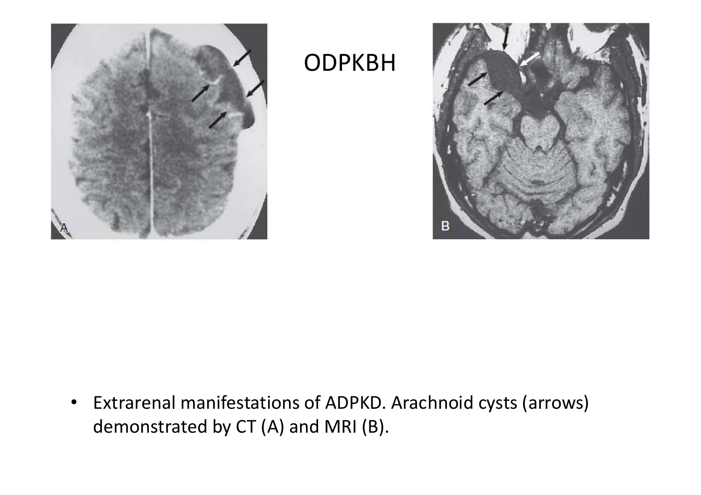

> **Şema yorumu:** ADPKD'de ekstrarenal kistler hastalığın multisistem yönünü vurgular. Karaciğer, pankreas, akciğer, tiroid, over, seminal vezikül, testis, mesane, uterus ve araknoid bölgede kistler görülebilir.

* **En sık ekstrarenal bulgu (%50)**
* **PKD1 ve PKD2'nin her ikisinde** görülür
* Safra kanallarından kaynaklanır
* **Kadınlarda daha sık** (östrojen rol oynar)
* Masif büyüme → bası komplikasyonları (**Budd-Chiari sendromu, asit**)
* İleri olgularda cerrahi drenaj veya karaciğer transplantasyonu

### Diğer Organlar

* Pankreas, dalak, akciğer, tiroid, over, seminal vezikül, testis, mesane, uterus, araknoidal bölgede kistler
* **Kolon divertikülleri** (sık, non-kistik)
* Araknoid kistleri (BT ve MR ile gösterilir)

---

## ADPKD İNTRAKRANİYAL ANEVRİZMA

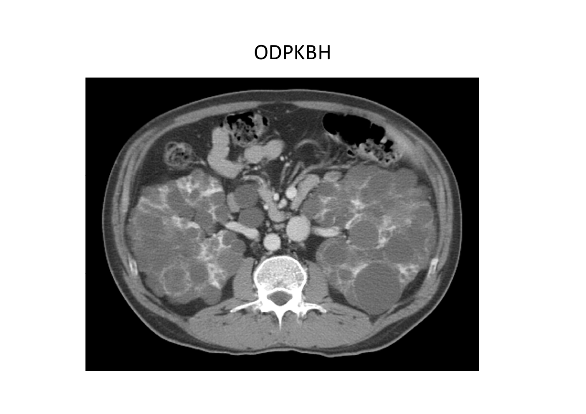

> **Şema yorumu:** ADPKD'de intrakraniyal sakküler anevrizma insidansı normal popülasyonun **5 katıdır**. Aile öyküsü pozitif olanlarda risk daha yüksektir ve taramanın gerekliliği vurgulanır.

### İnsidans

| Grup | Oran |
|---|---|
| **Aile öyküsü pozitif** | %16 |
| Aile öyküsü negatif | %6 |
| Genel popülasyon | ~%1-2 (5 kat daha az) |

### Klinik ve Risk

* **Çoğu asemptomatik**
* Semptom gelirse: fokal bulgular (kranial sinir felci, konvülsiyon, bası)
* **5 mm altı anevrizma yıllık rüptür oranı: %0.5**
* **10 mm üstü anevrizma yıllık rüptür oranı: %4**

### Tarama Endikasyonları (iyi yaşam beklentisi olanlarda)

* Ailede intrakraniyal anevrizma veya subaraknoid kanama öyküsü
* Önceki anevrizmal rüptür
* Elektif cerrahi için hazırlanan hemodinamik instabilite
* **Yüksek riskli meslekler** (örn. havayolu pilotu)
* Yüksek hasta anksiyetesi

### Profilaktik Girişim

* **<1 cm anevrizma:** Rüptür beklenmez, **3-5 yılda bir MR anjiyografi takibi**
* **>1 cm anevrizma:** Profilaktik cerrahi girişim
* **<5 mm:** 6 ayda bir MR anjiyografi takibi
* **Sistemik kan basıncının düşürülmesi** rüptür ihtimalini azaltır

---

## ADPKD TEDAVİ

### Genel Yaklaşım

* **Renal ve ekstrarenal komplikasyonlara yönelik**
* Hastalığın gelişimini önleyen tedaviler **henüz araştırma aşamasında**

### Ağrı Tedavisi

* **Etyoloji saptanmalı**, nedene yönelik tedavi
* NSAİİ uzun süreli kullanımdan kaçın
* **1. seçim: Asetaminofen**
* Narkotik analjezikler akut ağrıda
* Büyük kistlerde cerrahi dekompresyon (yeniden dolar)
* Kist içine **alkol/sklerozan enjeksiyon**
* Kronik ağrı: trisiklik antidepresanlar

### Kist Hemorajisi

* **Kendini sınırlar**, konservatif tedavi (yatak istirahati, analjezik, yeterli sıvı)
* Ciddi kanama (subkapsüler, retroperitoneal) → hospitalizasyon, kan transfüzyonu, segmental arter embolizasyonu

### Üriner Sistem ve Kist Enfeksiyonu

* **Kist içi penetrasyonu iyi** antibiyotik
* **1. seçim: Kinolon, TMP-SMX**
* Üriner kateterden kaçın
* Büyük enfekte kist: parenteral antibiyotik + **perkütan drenaj**
* 1-2 hafta antibiyoterapiye yanıtsız ateş: **perkütan/cerrahi drenaj**
* SDBY'de nefrektomi endike olabilir

### Nefrolityazis

* Standart taş tedavisi
* **Potasyum sitrat** (taş önleme)
* ESWL %82 başarı, perkütan nefrostolitotomi %80 başarı
* Sıvı alımını artır

### Hipertansiyon

* **1. seçim: ACE inhibitörü veya ARB** (RAAS aktivasyonu artmış)
* RAAS inhibisyonu ile kist gelişimi hipotezi (büyüme hormonu etkisi) test edildi, **ADPKD ilerlemesi üzerinde yararlı etki gösterilemedi** (küçük ve kısa çalışmalar)
* Hedef KB bilinmiyor; **<125/75 mmHg** önerilmektedir

### Progresif Böbrek Yetmezliği

* KBH yavaşlatma genel yaklaşımları
* **Sürvi diğer SDBY hastaları ile aynı veya daha iyi**
  * Yüksek endojen eritropoietin → stabil Hb
  * Düşük komorbidite
* **SDBY tedavisi:** HD, PD, transplantasyon
* İleri büyümüş böbrek + transplant güçlüğü → pre-transplant nefrektomi

### İntrakraniyal Anevrizma

* **<1 cm:** Cerrahi gerekmez, MR anjiyografi takibi
* **>1 cm:** Profilaktik cerrahi
* Sistemik KB düşürülmesi

### Gebelik

* ADPKD'li kadınlar gebe kalabilir
* HT, proteinüri veya böbrek yetmezliği olanlarda fetal/maternal komplikasyon yüksek
* **Preeklampsi riski artar**
* Gebe kalmak isteyen hastalarda **çocukta %50 olasılıkla ADPKD gelişme riski** hatırlatılmalı

### Yeni Tedaviler

| İlaç/Yaklaşım | Mekanizma |
|---|---|
| **V2 reseptör antagonisti (Tolvaptan)** | cAMP'nin kist oluşumundaki rolü -- vazopressin V2R bloke edilir; bol su içmek de benzer etki |
| **Somatostatin analogları (oktreotid)** | sst2 reseptörü üzerinden cAMP oluşumunu önler |
| **mTOR inhibitörleri** (sirolimus, everolimus) | Hayvan modellerinde mTOR aktif; küçük retrospektif çalışmalarda transplant sonrası polikistik böbrek/KC volümlerinde azalma |

> **Detay:** Tolvaptan tedavisi için ayrı [Polikistik Böbrek -- Tolvaptan](polikistik-bobrek-tolvaptan.md) notuna bakınız.

---

## OTOZOMAL RESESİF POLİKİSTİK BÖBREK HASTALIĞI (ORPKBH/ARPKD)

> **Tanım:** Böbreğin **kollektör kanallarında fuziform dilatasyon** + **karaciğer fibrozu** ile karakterize otozomal resesif kalıtsal hastalık.

### Epidemiyoloji ve Genetik

| Özellik | Değer |
|---|---|
| **Sıklık** | 1/20.000 doğum |
| **Kalıtım** | **OR** (hem anne hem baba taşıyıcı) |
| **Gen** | **PKHD1** (polikistik kidney and hepatic disease) |
| **Kromozom** | **6p21** (6. kromozomun kısa kolu) |
| **Gen ürünü** | **Fibrokistin / poliduktin kompleksi** |

> **Fibrokistin fonksiyonu:** Renal siliya ve epitel hücrelerinde bulunur; toplayıcı sistem ve bilier traktın farklılaşmasında görev alır.

### Patogenez

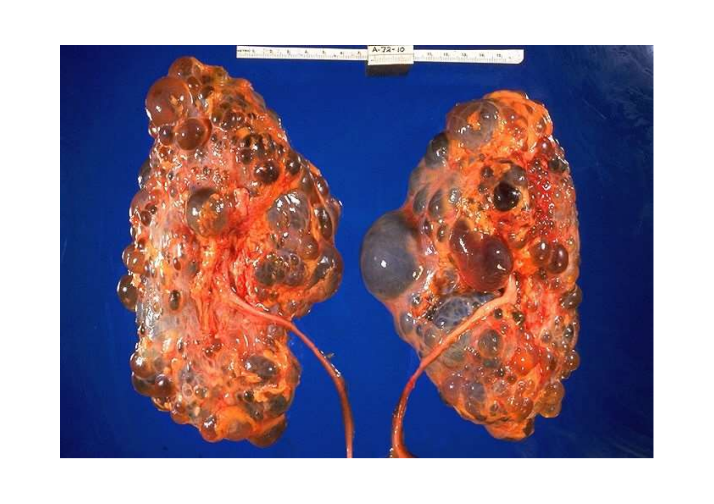

> **Şema yorumu:** ARPKD'de intrauterin dönemde toplayıcı sistem fuziform dilate olur; safra yolları bozukluğu progresif portal fibrozise ilerler. Konjenital hepatik fibrozis tipiktir.

* Tipik olarak **intrauterin başlar**; renal kistik lezyonlar
* Toplayıcı sistemin fuziform dilatasyonu
* Safra yolları bozukluğu → **progresif portal fibrozis**
* KC parankimi **normaldir**; histolojik olarak **konjenital hepatik fibrozis**
* Böbrekler normalden büyük
* ADPKD'deki aynı 3 patojenetik faktör: tübül hiperplazisi, aşırı sekresyon, ECM bozukluğu

### Klinik Bulgular

**Ağır (perinatal) form:**
* Fötal/perinatal dönemde büyümüş böbrekler
* **%20-30 infantil dönemde kayıp**
* Oligohidramniosa bağlı **AC hipoplazisi (Potter görünümü)**
* Solunum sıkıntısı
* **İlk yıl yaşayanların 5 yıllık yaşam şansı: %85-90**
* Yenidoğan dönem sağkalanların **%20-45'i 15-20 yılda SDBY'ye ilerler**

**Geç formlar:**
* Palpabl, büyük böbrekler
* Renal fonksiyon bozukluğu
* **Poliüri**, renal tübüler defekt
* **HT %80**
* Mikroskobik/makroskobik hematüri, proteinüri, steril piyüri
* Adolesan döneme kadar yaşayanlarda **portal HT bulguları daha belirgin** (varis kanaması)
* Her yaşta **kolanjit** görülebilir

> **Klinik özellik:** Hastalığın **erken** ortaya çıktığı fenotiplerde böbrek tutulumu daha ciddi, KC fibrozu hafif. **Geç** fenotiplerde böbrek tutulumu hafif, KC fibrozu daha belirgin.

### Morbidite ve Mortalite Nedenleri

* Şiddetli HT
* Böbrek yetmezliği
* Portal HT

### Tanı

* **İntrauterin veya neonatal USG:** Büyük, **hiperekojen böbrekler**, korteks-medulla ayrımı yok
* **2-5 mm mikrokistler** (yaygın)
* MRG, BT tanıda
* **Genetik test:** PKHD1 mutasyonu saptama oranı %80-87

### Tedavi

| Yaklaşım |
|---|
| **Neonatal ağır:** Uni/bilateral nefrektomi + hemofiltrasyon |
| Perinatal dönem sonrası: KB kontrolü (ACE-İ, ARB, loop diüretik, β-bloker, Ca kanal blokeri) |
| **Pulmoner hipoplazi:** Mekanik ventilasyon |
| Konsantrasyon defekti + poliüri: sıvı desteği |
| SDBY: **Renal veya renal + KC transplantasyonu** |

---

## TÜBERO SKLEROZ KOMPLEKSİ (TSC)

> **Tanım:** Otozomal dominant, tümör süpresör gen sendromu; hamartomlar (böbrek, beyin, kalp, AC, deri) ile karakterize.

### Genetik

| Özellik | Değer |
|---|---|
| **Sıklık** | 1/6000 |
| **Kalıtım** | OD |
| **TSC1** | 9. kromozom -- hamartin |
| **TSC2** | 16. kromozom -- tuberin |

> **TSC2-PKD1 birleşik sendromu:** TSC2 geni PKD1'in hemen yanındadır. Bazı delesyonel mutasyonlar her ikisini birlikte etkiler → **TSC2-PKD1 sendromu** (hem TSC hem ADPKD bulguları).

### Moleküler Mekanizma

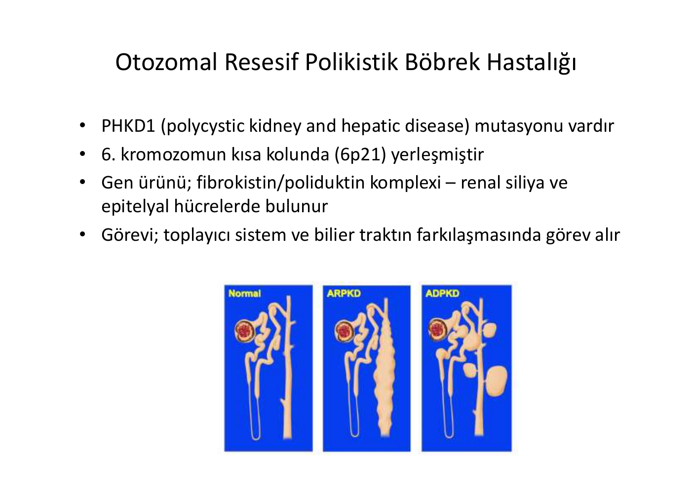

> **Şema yorumu:** Tuberin/hamartin kompleksi **mTOR kinaz aktivitesini inhibe eder**. TSC1/TSC2 mutasyonu → mTOR aktivasyonu → kontrolsüz hücre büyümesi ve tümör oluşumu. **Sirolimus/everolimus (mTOR inhibitörleri)** TSC tedavisinde etkilidir.

* **Tuberin/hamartin kompleksi** mTOR inhibe eder
* mTOR: Hücre besin alımı, hücre siklusu, büyüme, protein yapımı düzenler

### Klinik Bulgular

| Sistem | Bulgular |
|---|---|
| **SSS** | Epilepsi, kasılma, mental retardasyon/otizm |
| **Deri** | Facial anjiomiyolipom (yüzde), hipomelanotik makül, sürüngen derisi paterni, ungual/periungual fibrom |
| **Göz** | Retinal hamartom |
| **AC** | İnterstisyel AC hastalığı, lenfanjiyomiyomatozis |
| **Böbrek** | **%57 tutulum** |
| **Kalp** | Rabdomiyom, **Wolff-Parkinson-White** |

### Böbrek Bulguları

| Bulgu | Sıklık |
|---|---|
| **Anjiomiyolipom** | **%85** |
| Kistler | %45-80 |
| Renal hücreli karsinom | %4 |
| Onkositom | -- |
| FSGS + interstisyel fibrozis | -- |
| Glomerüler mikrohamartomlar | -- |
| Lenfajiyomatöz kistler | -- |

> **Anjiomiyolipom:** Displazik düz kas hücreleri + yağ hücreleri + kan damarlarından oluşan **kendini sınırlayan iyi huylu tümör**. Kadın cinsiyet hormonları patogenezde rol alır -- gebelikte hızlı büyür ve kanama riski artar.

### TSC Tanı Kriterleri

* **Kesin tanı:** 2 major **veya** 1 major + 2 minör
* **Kuvvetle olası:** 1 major + 1 minör
* **Mümkün:** 1 major **veya** ≥2 minör

**Major bulgular:** Yüzde anjiomiyolipom, non-travmatik ungual fibrom, hipomelanotik makül (≥3), sürüngen derisi paterni (bağ dokusu nüvesi), retinal hamartom, kortikal ur, subependimal nodül, subependimal dev hücreli astrositom, kardiyak rabdomiyom (≥1), lenfanjiyomiyomatozis, böbrek anjiomiyolipomu.

**Minör bulgular:** Diş minesinde çukurlar, hamartamatöz rektal polipler, kemik kistleri, beyaz cevherde radiyal çizgiler, gingival fibrom, böbrek dışı hamartom, retinada renksiz yamalar, "konfeti" deri lezyonları, çok sayıda böbrek kistleri.

### Renal Kistler

* **%47-80 hastada**
* Zamanla boyut ve sayı artar
* Nefronun herhangi bir segmentinden gelişir
* Papiller hiperplazi ve adenom yaygın
* Masif renal kist → **şiddetli HT**
* **Yaşamın 2-3. dekadında SDBY**

### Tedavi

* **Anjiomiyolipom (benign):** Genellikle tedavi gerekmez
* Komplikasyonlar: kanama, ağrı, HT → cerrahi veya embolizasyon
* Gebelikte hızlı büyüme → takip sıklaştır
* **mTOR inhibitörleri (sirolimus, everolimus):** Hem TSC hem ADPKD'de etkili

---

## VON HIPPEL-LINDAU HASTALIĞI

> **Tanım:** Otozomal dominant, **neoplastik hastalık**; retinal ve serebellar hemanjioblastom, renal hücreli karsinom, feokromositoma, pankreatik kistlerin görüldüğü multisistem tümör süpresör sendromu.

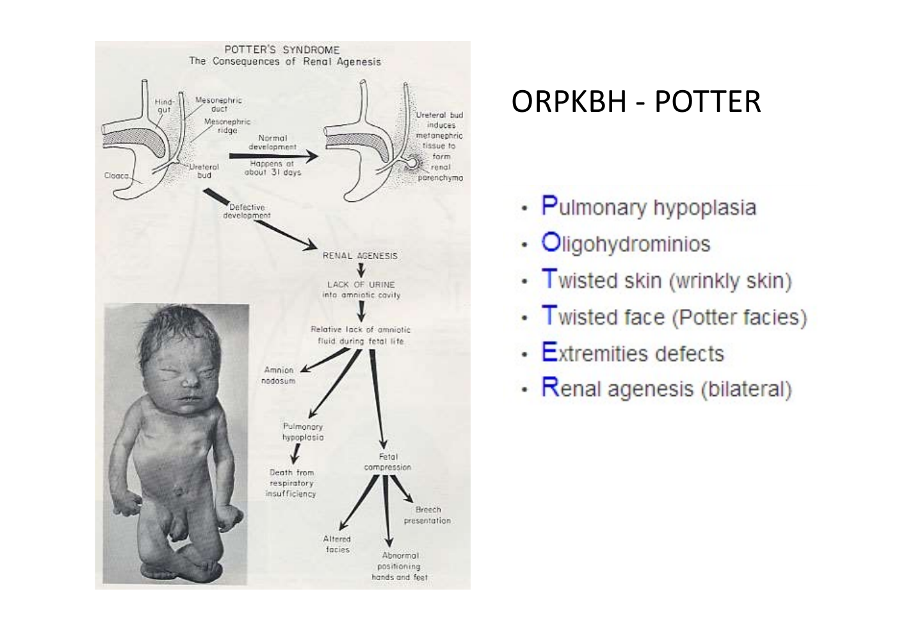

> **Şema yorumu:** VHL'de serebellar hemanjioblastom ve böbrek/pankreas kistleri eş zamanlı görülür. Bu kombinasyon ADPKD'den ayrımda önemlidir.

### Genetik

| Özellik | Değer |
|---|---|
| **Kalıtım** | OD |
| **Cinsiyet** | E = K |
| **Sıklık** | 1/35.000 |
| **Gen** | **VHL** |
| **Kromozom** | **3p25-26** |
| **Protein** | VHL proteini -- **tümör süpresör** |
| **Aile kökenli** | %80 |
| **De novo mutasyon** | %20 |

### Etkilenen Organlar

| Organ | Bulgu |
|---|---|
| **Retina** | Hemanjioblastom (tipik, **en erken bulgu**) |
| **SSS** | **Serebellar hemanjioblastom** |
| **Adrenal** | Feokromositoma |
| **Pankreas** | Kist, adenom, hemanjioblastom, adenokarsinom |
| **Epididim** | Kistadenom |
| **Böbrek** | **RCC + kistler (%40-80)** |

### Klinik Alt Tipler

| Tip | Hemanjioblastom | Feokromositoma | RCC |
|---|---|---|---|
| **Tip 1** | Var (SSS, retina) | **Düşük risk** | Var |
| **Tip 2A** | Var | **Var** | Düşük risk |
| **Tip 2B** | Var | Var | **Sık** |
| **Tip 2C** | Yok | **Sadece feokromositoma** | Çok düşük risk |

### Böbrek Tutulumu

* **RCC gelişme riski çok yüksek**
* **60 yaşında RCC %75 pozitif**
* **Genellikle bilateral ve multifokal**
* **Kistler %40-80** (bilateral)
* Kistlere bağlı böbrek fonksiyon bozukluğu **beklenmez**
* Bilateral-multipl olabileceğinden **ADPKD ile karışabilir**

> **Klinik inci:** Multipl pankreas kistleri → VHL akla getirilmelidir.

### Tanı

Aile öyküsü + **aşağıdakilerden biri**:
* Retinal veya serebral hemanjioblastom
* **RCC**
* **Feokromositoma**

### Tedavi

**SSS ve retinal hemanjioblastomlar:**
* **Serebral:** Cerrahi eksizyon
* **Opere edilemez:** Radyoterapi
* **Retinal:** Kriyokoagülasyon veya fotokoagülasyon

**Renal karsinom:**
* **<3 cm:** Metastaz riski düşük; 6 ayda-yılda bir BT/MRG takibi
* **>3 cm:** **Cerrahi** (böbrek koruyucu tümör rezeksiyonu)

---

## MEDÜLLER SÜNGER BÖBREK

> **Tanım:** Papiller toplayıcı kanalların dilatasyonu ile renal medullanın süngerimsi görünüm aldığı benign konjenital hastalık.

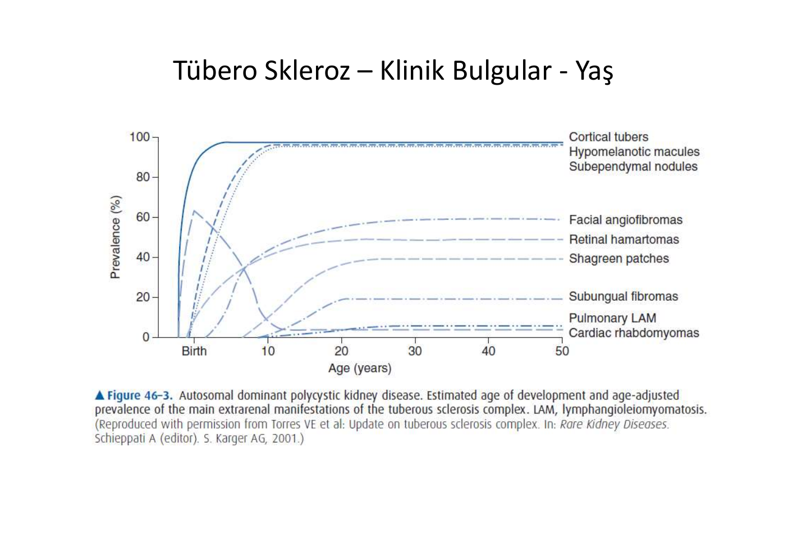

> **Şema yorumu:** Medüller sünger böbrekte patognomonik bulgu papillada çok sayıda küçük kistin oluşturduğu "buket çiçek" (bouquet of flowers) veya "papatya" görünümüdür. İVP'de kontrast biriken papiller kistler tanısaldır.

### Özellikler

| Özellik | Değer |
|---|---|
| **Sıklık** | 1/5000-1/20.000 |
| **Kalıtım** | Çoğunlukla sporadik; bazı ailelerde OD |
| İlişkili sendromlar | **Ehlers-Danlos**, **Marfan**, **Caroli hastalığı** |

### Patoloji

* Kistik değişiklikler **medullada** (özellikle papillanın iç kısmında)
* **Korteks etkilenmez**
* Kollektör tübüllerden kaynaklanan **1-8 mm sferik/oval kistler**
* Kistlerin içinde **kalsifikasyon** gelişir
* Etkilenen piramid ve kaliksler genişlemiş

### Klinik

* GFH azalması, azotemi **olmaz**
* **%50 renal kolik**
* **%35 üriner enfeksiyon**
* %30 hematüri
* **Nefrolityazis:** Kalsiyum oksalat, kalsiyum fosfat taşları
* Tübüler dilatasyon + üriner staz + hiperkalsiüri + hipositratüri → taş

> **Klinik inci:** **Nefrolityaz olgularının %20'sinde medüller sünger böbrek** saptanabilir.

### Tedavi

* **Asemptomatik:** Tedavi gerekmez
* Hiperkalsiüri → **tiyazid diüretik**
* Sıvı alımını artır
* **Böbrek yetmezliği gelişmez** (prognoz iyi)

---

## BÖBREĞİN EDİNSEL KİSTİK HASTALIĞI

> **Tanım:** Kronik böbrek yetmezliği olan hastalarda böbrek kistlerinin gelişmesi.

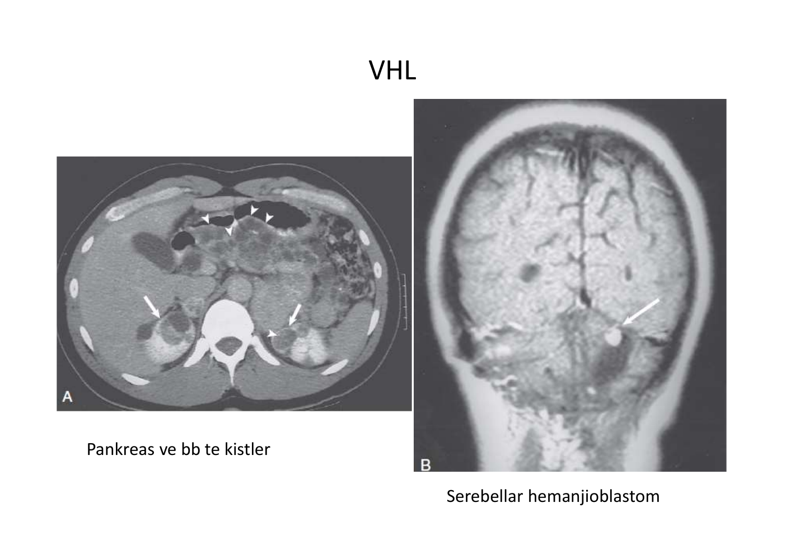

> **Şema yorumu:** Diyaliz süresi uzadıkça edinsel kistik hastalık şiddeti ve prevalansı artar: diyaliz başlangıcında %10-20, 5 yılda %50, 10 yılda %90.

### Özellikler

| Diyaliz Süresi | Prevalans |
|---|---|
| Başlangıç | %10-20 |
| 5. yıl | %50 |
| **10. yıl** | **%90** |

* Çok sayıda, bilateral
* **Tübüllerden gelişir**
* Çoğu 0.5 cm'den küçük; 2-3 cm'e kadar
* **%2-7 hastada böbrek kanseri** (berrak hücreli veya papiller)

### Klinik

* Çoğunlukla asemptomatik
* Bel ağrısı, hematüri (en sık)
* Kanama (kist içi, retroperitoneal)
* Enfeksiyon
* Eritrositoz
* Karsinom gelişimi (erkeklerde sık)

### Tanı

* **USG veya BT**
* **3 yıldan uzun diyaliz:** Yılda 1 USG
* Şüpheli görüntü: BT
* **Kitle saptanırsa bilateral nefrektomi**

---

## BASİT RENAL KİSTLER

> **Tanım:** Böbrek tübüllerinin odaksal dilatasyonundan köken alan benign kistler. Yaşlılarda sık, genellikle tesadüfen saptanır.

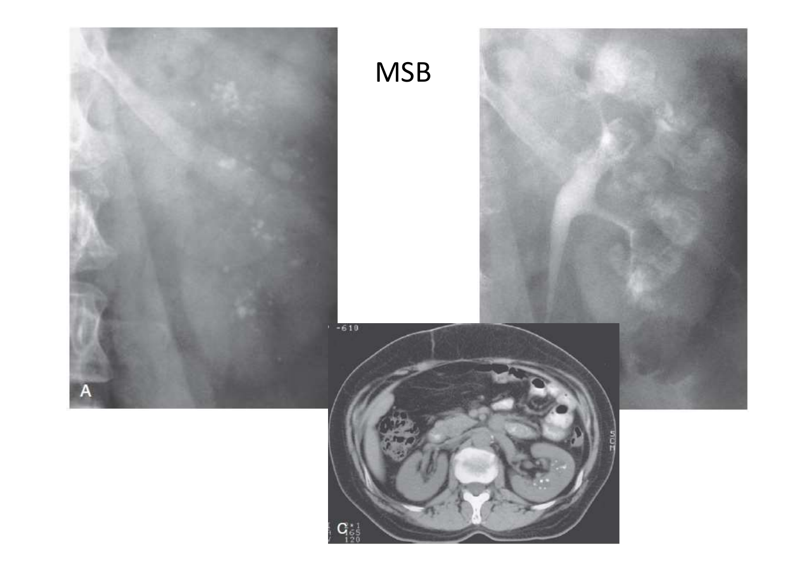

> **Şema yorumu:** Basit renal kist USG'de ince duvarlı, **anekojen, arka akustik güçlendirmeli** sıvı koleksiyonudur. Bosniak sınıflaması komplike kistleri değerlendirmede kullanılır.

### Yaşa Göre Prevalans

| Yaş | Prevalans |
|---|---|
| 30 yaş altı | Nadir |
| **30-49 yaş** | %1.7 |
| **50-70 yaş** | %11.5 |
| **70 yaş üstü** | **%22-30** |

### Özellikler

* Patogenez bilinmiyor
* Olası: tübül obstrüksiyonu, kollektör kanal divertikülü
* Tek taraflı veya bilateral
* **0.5-1 cm** (3-4 cm'e kadar)

### Klinik

* Çoğunlukla **asemptomatik**
* BT/MRG/USG'de tesadüfen
* Yan ağrısı, kist kanaması, hematüri
* **Renin aracılı HT**

### Tedavi

* Sadece komplikasyon varsa müdahale

---

## KİSTİK BÖBREK HASTALIKLARI ÖZET KARŞILAŞTIRMA

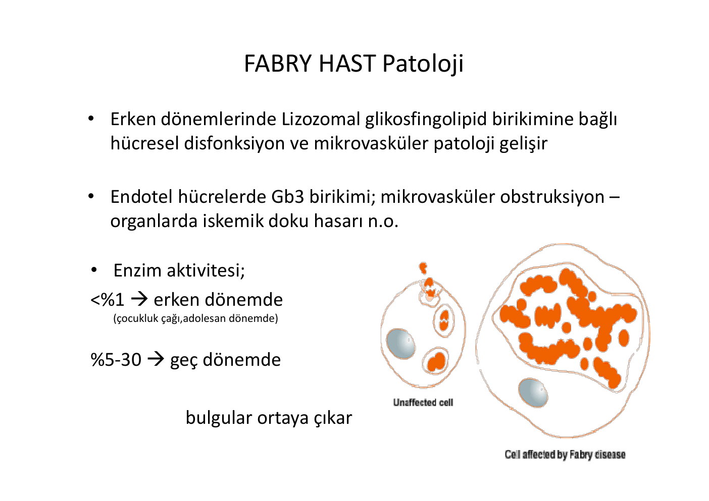

> **Şema yorumu:** Kistik böbrek hastalıkları arasında ayrım tanı yaşı, kist sayısı, ekstrarenal bulgular, aile öyküsü ve genetik test sonuçlarına göre yapılır.

| Özellik | **Basit kist** | **ADPKD** | **MKB (medüller kistik)** | **VHL** | **TSC** | **Kazanılmış kistik** |
|---|---|---|---|---|---|---|
| **Klinik başlangıç (yıl)** | >40 | 30-40 | 20-40 | 30-40 | 10-30 | KBH |
| **Kist** | Tek/multipl | Multipl | Multipl | Az, bilateral | Multipl | Multipl |
| **Kist enfeksiyonu** | Nadir | Sık | Sık | Nadir | Nadir | Nadir |
| **Tümör** | Yok | Nadir | Yok | **RCC bilateral** | **AML/RCC** | Sık |
| **Kan basıncı** | Normal, ↑ | Yüksek | Normal | Normal, ↑ | Normal, ↑ | Normal, ↑ |
| **Böbrek fonksiyonu** | Normal | Normal → bozulmuş | Normal | Normal | Normal → bozulmuş | Bozulmuş, SDBY |
| **Nefrolityazis** | Yok | Sık | Sık | Yok | Yok | Yok |
| **KC kistleri** | Yok | **Nadir** | Yok | Nadir | Yok | Yok |
| **Pankreas kistleri** | Yok | Anevrizma | Yok | **Multipl** | Yok | Yok |
| **SSS tutulumu** | Yok | Yok (anevrizma) | Yok | **Hemanjioblastom** | **Nöbet, MR** | Yok |
| **Deri lezyonu** | Yok | Yok | Yok | Yok | **Evet** | Yok |
| **Hastalık geni** | Yok | **PKD1, PKD2** | **MKS1-MKS6** | **VHL** | **TSC1, TSC2** | Yok |
| **Genetik test** | Yok | Evet | Evet | Evet | Evet | Yok |

---

## FABRY HASTALIĞI

> **Tanım:** **X-linked kalıtsal lizozomal depo hastalığı**; **α-galaktozidaz A** enzim eksikliği sonucu tüm organlarda **sfingolipid globotriaosilseramid (Gb3)** birikimi ile seyreden, yaşam süresini kısaltan multisistem hastalıktır.

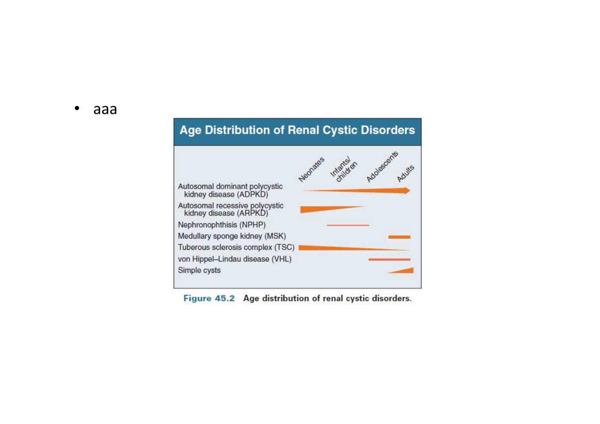

> **Şema yorumu:** Fabry hastalığında α-galaktozidaz A eksikliği nedeniyle tüm endotel hücrelerde Gb3 birikir. Mikrovasküler obstrüksiyon ve iskemik doku hasarı multisistem tutulumdan sorumludur.

### Genetik

| Özellik | Değer |
|---|---|
| **Kalıtım** | **X-linked resesif** |
| **Gen** | **GLA** |
| **Kromozom** | **Xq22** |
| **Mutasyon sayısı** | >400 |

### Patoloji

* Erken dönemde **lizozomal glikosfingolipid birikimi** → hücresel disfonksiyon + **mikrovasküler patoloji**
* Endotel hücrelerde **Gb3 birikimi** → mikrovasküler obstrüksiyon → organlarda iskemik hasar

### Enzim Aktivitesi-Klinik İlişki

| Aktivite | Dönem |
|---|---|
| **<%1** | **Erken** (çocukluk, adolesan) -- klasik ağır form |
| %5-30 | **Geç** -- atipik hafif form |

### Klinik Bulgular

* **Nöropatik ağrı (akroparestezi)** -- el ve ayaklarda yanma, sızı
* **Anjiokeratom** (ciltte küçük kırmızı-mor lezyonlar -- bathing trunk distribution)
* **Hipohidroz/anhidroz** (terleme azlığı)
* **Korneal opasite (cornea verticillata)**
* Renal: **Proteinüri, FSGS-benzeri, progresif böbrek yetmezliği**
* Kardiyak: Hipertrofik KMP, aritmi
* Serebrovasküler: İskemik SVO
* Gastrointestinal: ishal, kusma
* Renal biyopsi EM: **Zebra body** (lamellar inklüzyonlar) -- patognomonik

### Tedavi

| Tedavi | Detay |
|---|---|
| **Non-spesifik** | Ağrı (antikonvülsan -- gabapentin), SVO profilaksi |
| **Enzim Replasman Tedavisi (ERT)** | **1. hat** |
| -- Agalzidaz alfa (insan deri fibroblast kültürü) | **0.2 mg/kg/2 haftada bir IV** |
| -- Agalzidaz beta (rekombinant CHO hücre) | **1 mg/kg/2 haftada bir IV** |
| **Migalastat** | Oral şaperon tedavisi (seçili varyantlarda) |
| **ACE/ARB** | Proteinürik hastalarda |
| **SDBY** | RRT veya **renal transplantasyon** (5 yıllık sağkalım daha iyi) |

### ERT Endikasyonları

* Semptomatik klasik erkek hastalar
* Bulgulu heterozigot kadınlar
* Erken organ tutulumu olan çocuklar

---

## DİĞER KALITSAL BÖBREK HASTALIKLARI (REFERANS)

> Bu PDF ADPKD ağırlıklıdır. Aşağıdaki hastalıklar ayrı kaynaklarda kapsamlı ele alınır:

| Hastalık | Gen | Kalıtım | Özellik |
|---|---|---|---|
| **Alport sendromu** | COL4A3/A4/A5 | X-linked (en sık), OR, OD | Hematüri + sensörinöral sağırlık + anterior lentikonus |
| **Nefronofitizi** | NPHP gen ailesi | OR | Medüller kist, retinopati (Senior-Loken) |
| **ADTKD** | UMOD, MUC1, REN, HNF1B | OD | Tübülointersisyel kronik böbrek hastalığı, gut |
| **Bartter sendromu** | NKCC2, ROMK, CLCNKB, BSND, CASR | OR | Hipokalemi + metabolik alkaloz + hipovolemi |
| **Gitelman sendromu** | SLC12A3 | OR | Hipokalemi + hipomagnezemi + hipokalsiüri |
| **Liddle sendromu** | SCNN1A/B/G | OD | HT + hipokalemi + düşük renin |
| **Nefrojenik DI (X-linked)** | V2R | X-linked | Poliüri; ayrı notta |

---

## KLİNİK VAKA ÖRNEĞİ

**📋 VAKA ÖRNEĞİ 1: ADPKD Ailevi Tarama**

**Hasta:** 28 yaşında kadın, babası 45 yaşında SDBY nedeniyle HD'de. Asemptomatik, KB 130/85 mmHg.

**USG:** Sol böbrekte 2 kist, sağ böbrekte 1 kist. **Total 3 kist.**

**Lab:** Kreatinin 0.9 mg/dL, UACR normal.

**Tanı:** **Ravine kriterleri:** 15-39 yaş + aile öyküsü + ≥3 kist → **ADPKD tanısı**.

**Yönetim:** Yaşam tarzı, **KB hedefi <125/75** (ACE inh başlanıyor), yüksek su alımı, tuzlu/kafeinli gıdalardan kaçınma, **Mayo sınıflamasıyla progresyon riski belirleniyor**, hızlı progresyon (1C-1E) ise tolvaptan değerlendirilecek.

**Aile:** 2 çocuğu için 18 yaşında USG planlandı. Genetik danışmanlık sunuldu.

**📋 VAKA ÖRNEĞİ 2: VHL ile RCC**

**Hasta:** 35 yaşında erkek, ani görme kaybı nedeniyle başvurdu. Retinal hemanjioblastom tespit edildi.

**Görüntüleme:** Serebellar hemanjioblastom, **her iki böbrekte 2 ve 3 cm'lik solid kitleler**, pankreasta multipl kistler.

**Genetik test:** **VHL mutasyonu pozitif**.

**Tanı:** **VHL Tip 2B** -- hemanjioblastom + bilateral RCC.

**Tedavi:** Serebellar lezyon için cerrahi; bilateral RCC için **böbrek koruyucu tümör rezeksiyonu**. 6 ayda bir BT takip. Feokromositoma taraması (katekolamin).

**📋 VAKA ÖRNEĞİ 3: TSC ile Anjiomiyolipom**

**Hasta:** 22 yaşında kadın, gebelikte ani yan ağrısı + hematüri. Fizik muayene: yüzde anjiomiyolipom, hipomelanotik maküller. Çocukluğunda epilepsi öyküsü.

**BT:** **Sağ böbrekte 8 cm anjiomiyolipom**, rüptüre olmuş, retroperitoneal hematom.

**Tanı:** **Tübero Skleroz Kompleksi** (kesin -- 2 major: facial anjiomiyolipom + böbrek AML).

**Acil tedavi:** **Selektif arter embolizasyonu** (kanama kontrolü, böbrek korunur).

**Kronik tedavi:** **Everolimus (mTOR inhibitörü)** başlandı. 6 ayda bir BT.

**Öğretici Not:** Gebelikte anjiomiyolipom hızlı büyür ve kanama riski artar. TSC + ADPKD birlikte (TSC2-PKD1 sendromu) düşünülmelidir.

---

**Kaynak:** Prof. Dr. Hakan Akdam ders notu, ADÜ Tıp Fakültesi Nefroloji Bilim Dalı. Ek referans: KDIGO kistik hastalık kılavuzu, Ravine D (Lancet 1994), Chapman AB (Kidney Int 2015), TEMPO 3:4 (NEJM 2012), Orphanet Journal of Rare Diseases (Fabry).
