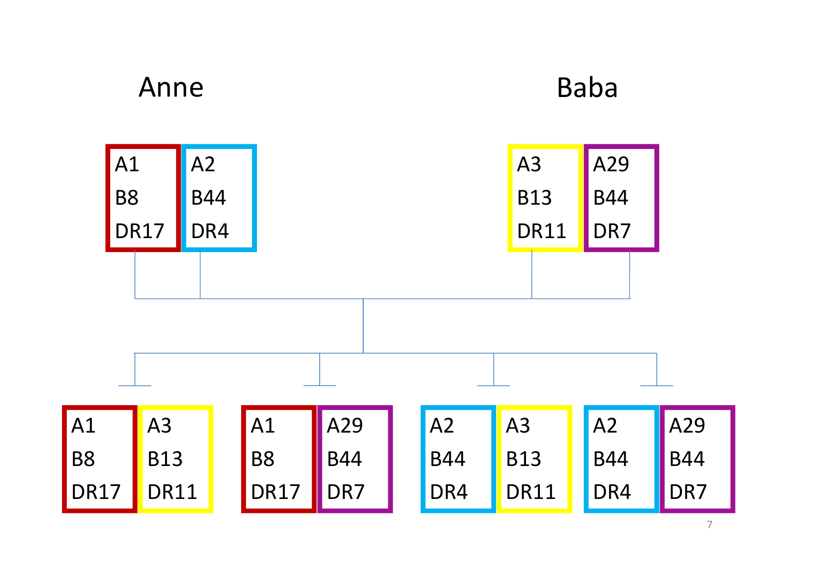
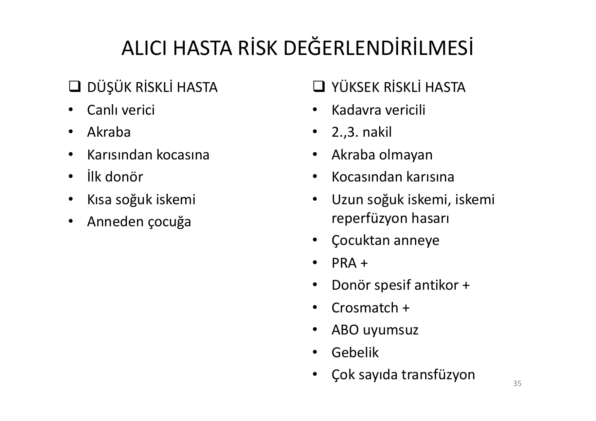
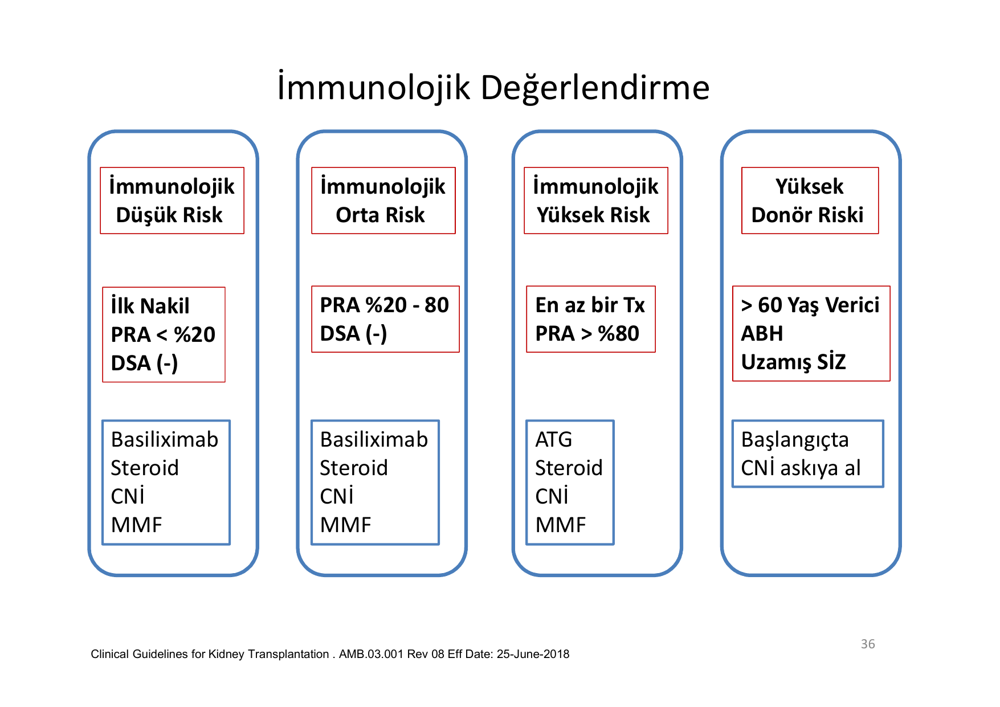
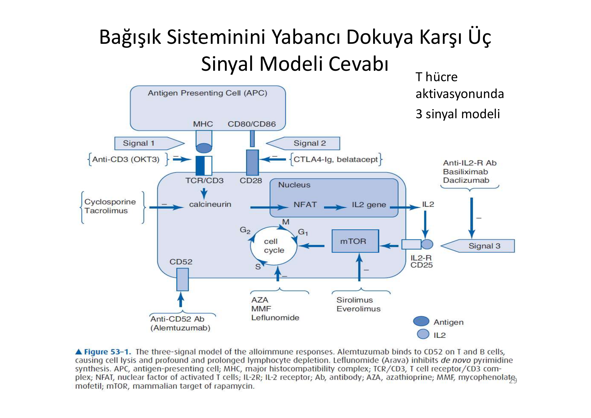
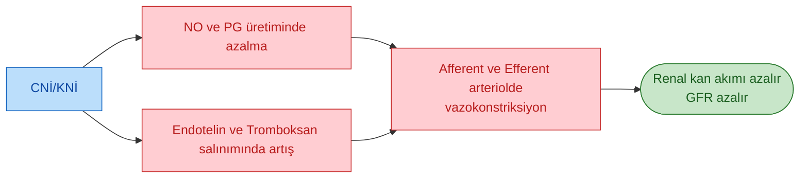
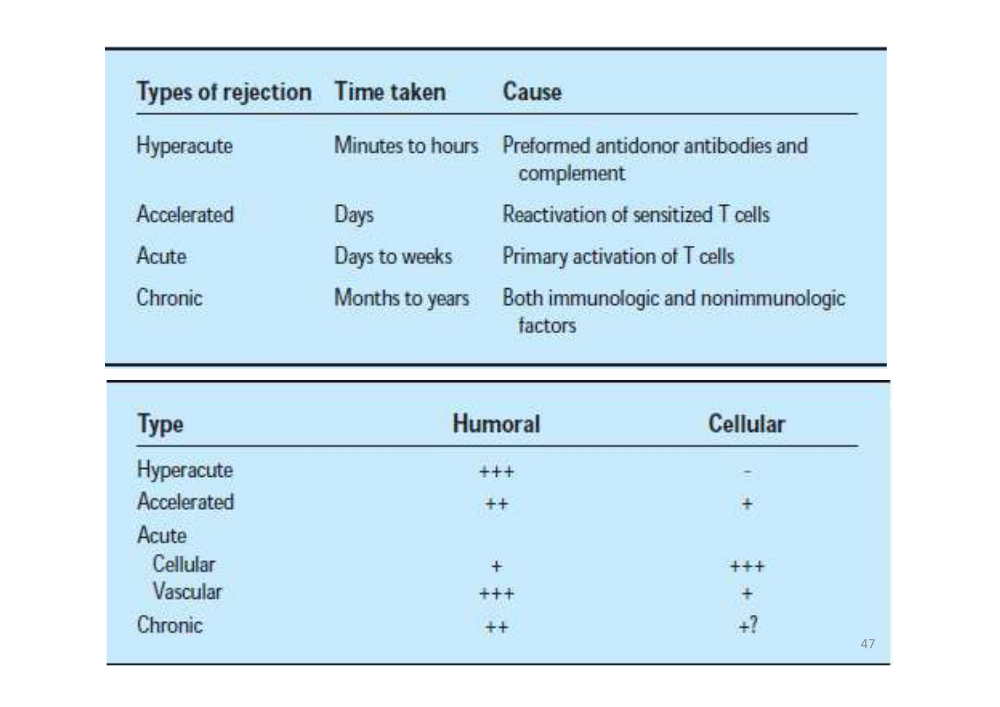
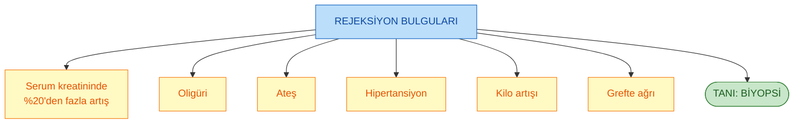
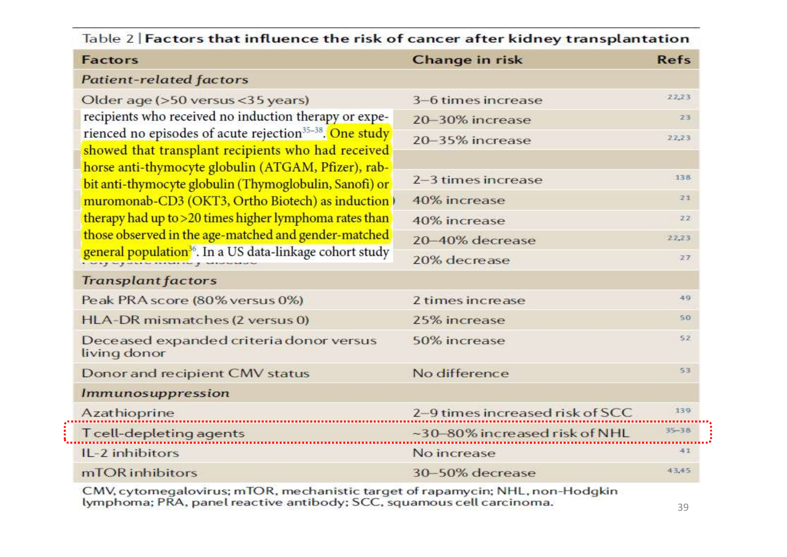
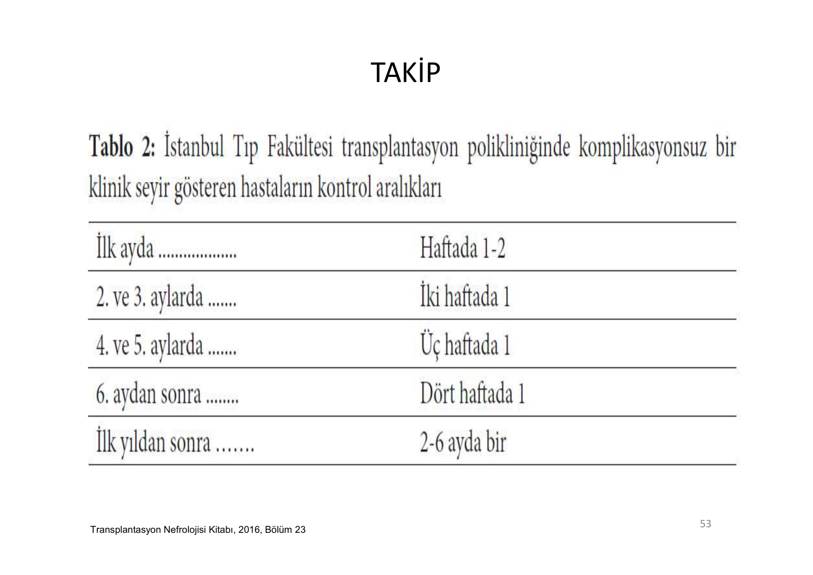
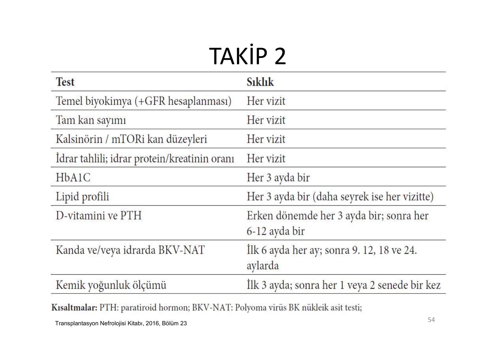

# BÖBREK TRANSPLANTASYONU

**Hazırlayan:** Prof. Dr. Hakan Akdam
**Bölüm:** Aydın Adnan Menderes Üniversitesi -- Nefroloji Bilim Dalı

---

## İÇİNDEKİLER

1. [Tanım ve Genel Bakış](#tanım-ve-genel-bakış)
2. [Tarihçe](#tarihçe)
3. [Endikasyonlar ve Pre-emptif Transplant](#endikasyonlar-ve-pre-emptif-transplant)
4. [Verici (Donör) Tipleri](#verici-donör-tipleri)
5. [Canlı Verici Değerlendirmesi](#canlı-verici-değerlendirmesi)
6. [Alıcı Değerlendirmesi](#alıcı-değerlendirmesi)
7. [Alıcıda Kontrendikasyonlar](#alıcıda-kontrendikasyonlar)
8. [İmmünolojik Değerlendirme](#immünolojik-değerlendirme)
9. [HLA Uyumu ve Mismatch](#hla-uyumu-ve-mismatch)
10. [Cross-match Testi](#cross-match-testi)
11. [PRA ve DSA](#pra-ve-dsa)
12. [ABO Kan Grubu Uyumu](#abo-kan-grubu-uyumu)
13. [Alıcı Risk Sınıflaması](#alıcı-risk-sınıflaması)
14. [Donör Nefrektomi ve Organ Koruma](#donör-nefrektomi-ve-organ-koruma)
15. [İmmünsüpresif Tedavi](#immünsüpresif-tedavi)
16. [İndüksiyon Ajanları](#indüksiyon-ajanları)
17. [İdame Tedavisi](#idame-tedavisi)
18. [Kalsinörin İnhibitörleri](#kalsinörin-i̇nhibitörleri)
19. [Antimetabolit ve mTOR İnhibitörleri](#antimetabolit-ve-mtor-i̇nhibitörleri)
20. [Rejeksiyon Tipleri](#rejeksiyon-tipleri)
21. [Hiperakut Rejeksiyon](#hiperakut-rejeksiyon)
22. [Akselere Akut Rejeksiyon](#akselere-akut-rejeksiyon)
23. [Akut Rejeksiyon](#akut-rejeksiyon)
24. [Rejeksiyon Tedavisi](#rejeksiyon-tedavisi)
25. [Gecikmiş Greft Fonksiyonu](#gecikmiş-greft-fonksiyonu-dgf)
26. [Erken Cerrahi Komplikasyonlar](#erken-cerrahi-komplikasyonlar)
27. [Kronik Allogreft Nefropati](#kronik-allogreft-nefropati-kan)
28. [Enfeksiyöz Komplikasyonlar](#enfeksiyöz-komplikasyonlar)
29. [CMV Enfeksiyonu](#cmv-enfeksiyonu)
30. [Polyomavirüs (BK) Nefropatisi](#polyomavirüs-bk-nefropatisi)
31. [Post-transplant Malignite](#post-transplant-malignite)
32. [Post-transplant DM (NODAT)](#post-transplant-dm-nodat)
33. [Takip Protokolü](#takip-protokolü)
34. [Vaka Örnekleri](#vaka-örnekleri)

---

## TANIM VE GENEL BAKIŞ

> **Tanım:** Son Dönem Böbrek Yetmezliği (SDBY) olan hastaya **canlı** veya **kadavra** vericiden alınan böbreğin cerrahi yöntemlerle nakledilmesi ve akabinde **uzun süreli immünsüpresif tedavi** yi içeren bir tedavi modelidir.

**İki ana verici tipi:**

* **Kadavra verici** (beyin ölümü gerçekleşmiş)
* **Canlı verici** (akraba, eş veya etik kurul onaylı)

> **Neden transplant?** SDBY hastalarında böbrek nakli, diyaliz ile kıyaslandığında **uzun dönem sağkalım**, **yaşam kalitesi** ve **maliyet etkinliği** açısından üstündür. Nakil, hastayı diyalize bağımlılıktan kurtarır ve üremiye bağlı organ disfonksiyonlarını geri döndürür.

---

## TARİHÇE

| Yıl | Olay |
|---|---|
| **1954** | **Joseph Murray** -- Boston'da **monozigot (tek yumurta) ikizler** arasında ilk başarılı böbrek nakli (Nobel 1990) |
| 1960'lar | Azatioprin + kortikosteroid ile kadavra nakilleri başladı |
| 1983 | **Siklosporin** klinik kullanıma girdi -- transplantasyon devrimi |
| 1990'lar | Takrolimus, MMF, mTOR inhibitörleri |
| 2000'ler | ATG, basiliksimab, belatacept, desensitizasyon protokolleri |

---

## ENDİKASYONLAR VE PRE-EMPTİF TRANSPLANT

> **Ana endikasyon:** Son dönem böbrek yetmezliği (SDBY).

### Pre-emptif Böbrek Nakli

> **Tanım:** **Son dönem böbrek yetmezliği gelişmeden** veya henüz gelişmişken **diyalize başlanmadan** ilk renal replasman tedavisi olarak böbrek transplantasyonunun seçilmesidir.

* **Ne kadar erken nakil yapılırsa sonuçlar o kadar iyi**
* Hastanın **diyalizde geçen yaşam süresi ne kadar uzunsa** transplantasyonun sonuçları o kadar olumsuz etkilenir
* eGFR **<20 mL/dk/1.73 m²** altına indiğinde pre-emptif transplant için liste/hazırlık başlatılabilir

**Pre-emptif transplantın avantajları:**

1. Diyaliz komplikasyonlarından (kateter enfeksiyonu, AV fistül sorunları, peritonit) kaçınma
2. Üremi kaynaklı organ hasarı (KV, nörolojik, kemik) daha az
3. Daha iyi greft ve hasta sağkalımı
4. Psikososyal ve ekonomik kazanç

---

## VERİCİ (DONÖR) TİPLERİ

### Canlı Verici

**Planlı olarak yapılır.** Türkiye'de yasal çerçeve (Organ ve Doku Nakli Hizmetleri Yönetmeliği, 01.02.2012 -- Resmi Gazete 28191):

> **MADDE 16 (1):** Canlıdan organ nakli; alıcının **en az iki yıldan beri fiilen birlikte yaşadığı eşi** ile **dördüncü dereceye kadar (dördüncü derece dâhil) kan ve kayın hısımlarından** yapılabilir.
>
> **(2):** Akraba dışı canlıdan organ nakli, naklin yapılacağı ilde oluşturulacak **Etik Komisyonun** verici ile alıcı arasında yönetmeliğe aykırı bir husus bulunmadığını ve etik açıdan organ bağışının uygunluğunu onaylaması ile gerçekleştirilir.

**Canlı vericinin avantajları:**

* **Kadavra greftlerine göre daha iyi sonuçlar** (hem kısa hem uzun dönem)
* Uyumlu erken işlev ve kolay yönetim
* Transplantasyon için uzun bekleme süresini ortadan kaldırır (pre-emptif imkanı)
* Daha **az agresif immünsüpresif rejimler** uygulanabilir
* Vericiye duygusal kazanç sağlar
* Dünya çapında böbrek transplant oranını arttırır

### Kadavra Verici

> **Tanım:** **Beyin ölümü** gerçekleşmiş vericiden alınan organların kan grubu ve doku uyumu olan alıcıya nakledilmesidir.

**Yasal düzenleme:** Organ ve Doku Alınması, Saklanması, Aşılanması ve Nakli Hakkında Kanun (03.06.1979 -- Resmi Gazete 16655) beyin ölümü tanımını içerir.

---

## CANLI VERİCİ DEĞERLENDİRMESİ

### Öykü

* **HT, DM** varlığı
* Enfeksiyon, kanser öyküsü
* Vasküler hastalık
* **Renal kalkül, gut**
* Aile öyküsü (kalıtsal böbrek hastalıkları)
* İlaç kullanımı, sigara
* Psikiyatrik durum
* **Bağış isteğinin samimiyeti**, alıcı ile ilişkisi

### Fizik Muayene

Kan basıncı, boy/kilo/BMI, eklem/deri bulguları, lenf nodu, kitle, vasküler hastalık, kalp-akciğer, abdomen.

### Laboratuvar

| Kategori | İnceleme |
|---|---|
| **İdrar** | TİT (kan, protein), idrar mikroskopisi, idrar kültürü, **24 saatlik idrar** (kreatinin klirensi, protein atılımı) |
| **Kan** | Üre, kreatinin, elektrolitler, KCFT, CBC, AKŞ/OGTT, lipid profili, ürik asit, Ca, P |
| **Seroloji** | HBV, HCV, HIV, CMV, EBV, sifiliz, **TBC taraması** |
| **EKG, PAAC** | Rutin |
| **Yaşa göre** | Kadınlarda pap smear/mamografi; erkeklerde PSA (≥50 yaş); ek kardiyak tetkik (endikasyon varsa) |

### Renal Anatomi Değerlendirmesi

* **BT anjiyografi** (standart)
* MRG anjiyografi
* Kateter anjiyografi
* Renal RDUS
* Sintigrafi (split function)

### Canlı Verici Kesin Kontrendikasyonlar

| Hematolojik / Genel | Böbrek |
|---|---|
| Tromboz/emboli öyküsü | **Böbrek taşı** |
| Antikoagülan kullanımı | Böbrekte morfolojik anomali |
| **Psikiyatrik kontrendikasyon** | **GFR <80 mL/dk/1.73 m²** (sintigrafik <70, gençlerde daha yüksek olmalı) |
| Koroner arter hastalığı | **Proteinüri >300 mg/gün**, albüminüri >30 mg/gün |
| Semptomatik kalp kapak hastalığı | |
| Periferik vasküler hastalık | **HIV, HBV, HCV** enfeksiyonu |
| **Cross-match pozitifliği** | **Hipertansiyon**, DM |
| Akli dengesizlik, hamilelik | **Malignite** öyküsü, orta-ağır akciğer hastalığı |

---

## ALICI DEĞERLENDİRMESİ

### Öykü

> **Temel soru:** Alıcı adayında nakle engel teşkil edebilecek bir durum var mı?

* **Enfeksiyonlar**, kanser, GİS bozuklukları, viral hepatit, MI, klaudikasyo
* **Diyaliz süresi ve komplikasyonları**
* **Orijinal böbrek hastalığının cinsi** (→ tekrarlama oranı kritik: FSGS, MPGN, IgA, aHUS)
* Önceki immünsüpresif tedavi
* **Daha önce nakil olmuş ise** → graft kaybının nedeni ve zamanı
* **Uyum** (diyet, ilaç, sigara, alkol, bağımlılık)
* Aile öyküsü (böbrek, DM, KV, kanser)

### Laboratuvar ve Tetkikler

* **Seroloji:** HIV, HBV, HCV, CMV, EBV, HSV (TBC için PPD/IGRA dahil)
* Rutin: KCFT, Ca, P, PT/INR/APTT, TİT, idrar kültürü
* **İmmünolojik testler:** Kan grubu, HLA doku tipi, HLA antikorları, **cross-match**
* EKG, PAAC, Batın USG, **kardiyak değerlendirme**
* **Ürolojik değerlendirme** (mesane/işeme bozukluğu, rekürren ÜSİ varsa)
* Kadınlarda pap smear, ≥40 yaş mamografi
* ≥50 yaş kolonoskopi
* Erkeklerde ≥50 yaş PSA

### Aşılama

Transplantasyon öncesi tüm aşılar tamamlanmalı (nakil sonrası **canlı aşılar kontrendike**):

* Grip (yıllık), pnömokok (PCV13 + PPSV23), Hepatit B (anti-HBs >100 hedefi), Hepatit A, HPV, Tdap, **MMR ve VZV nakil öncesi** (canlı -- sonra verilemez), meningokok, COVID.

---

## ALICIDA KONTRENDİKASYONLAR

### Kesin Kontrendikasyonlar

| Kategori | Durum |
|---|---|
| **Malignite** | Aktif malignite |
| **Enfeksiyon** | Aktif enfeksiyon, aktif TBC |
| Metabolik | **Primer hiperoksalüri** (kombine karaciğer-böbrek nakli gerekir) |
| Organ yetmezliği | Ciddi, iyileşmeyen böbrek dışı hastalık (kalp, akciğer, karaciğer) |
| Prognoz | Yaşam beklentisi **<2 yıl** |
| KC | Karaciğer sirozu (KC + böbrek kombine olmadığında) |
| Psikiyatrik | Kontrol altına alınmayan psikiyatrik hastalık, aktif madde bağımlılığı |
| KV | Yeni geçirilmiş miyokard enfarktüsü |

### Göreceli (Nisbi) Kontrendikasyonlar

* Aktif peptik ülser hastalığı
* Tedaviye uyumsuzluk
* Aktif hepatit B enfeksiyonu
* Ölümcül şişmanlık (morbid obezite)

### Özel (Spesifik) Durumlar

* **ABO kan grubu uyuşmazlığı** (desensitizasyon ile aşılabilir)
* **Pozitif T hücre cross-match** (desensitizasyon gerekir)

---

## İMMÜNOLOJİK DEĞERLENDİRME

**Nakil öncesi verici ve alıcı karşılaştırması:**

1. **ABO kan grubu** (kurallar kan transfüzyonundaki gibi -- Rh sisteminin önemi yok)
2. **HLA A -- B -- DR fenotipleri** belirlenir
3. **Hiperakut rejeksiyondan kaçınmak için transplant öncesi cross-match MUTLAKA yapılmalıdır**
4. **Kadavra nakillerinde en az HLA mismatch gözetilmelidir**

**Temel immünolojik testler:**

* Kan grubu
* Doku grubu (HLA tiplemesi)
* **PRA** (Panel Reaktif Antikor)
* **DSA** (Donör Spesifik Antikor)
* **Cross-match** (CDC-XM, Flow-XM)

---

## HLA UYUMU VE MISMATCH

> **Şema yorumu (HLA kalıtımı):**
>
> Görselde bir ailede HLA-A, HLA-B ve HLA-DR lokuslarının kalıtımı gösteriliyor:
>
> * **Anne haplotipleri:** Kırmızı (A1-B8-DR17) ve Mavi (A2-B44-DR4)
> * **Baba haplotipleri:** Sarı (A3-B13-DR11) ve Mor (A29-B44-DR7)
>
> Her çocuk, anneden **bir haplotip** ve babadan **bir haplotip** alır. Bu durumda **4 farklı kombinasyon** oluşur:
>
> 1. Kırmızı + Sarı (A1-B8-DR17 + A3-B13-DR11)
> 2. Kırmızı + Mor (A1-B8-DR17 + A29-B44-DR7)
> 3. Mavi + Sarı (A2-B44-DR4 + A3-B13-DR11)
> 4. Mavi + Mor (A2-B44-DR4 + A29-B44-DR7)
>
> **Klinik anlamı:** İki kardeş arasında **%25 tam uyum (HLA-identik)**, %50 yarı uyum (bir haplotip ortak), %25 tam uyumsuzluk şansı vardır. Anne veya babadan çocuğa nakilde **her zaman en az bir haplotip uyumludur**.

**HLA sistemi temel bilgiler:**

| Sınıf | Lokuslar | Eksprese edildiği hücre |
|---|---|---|
| **Sınıf I** | HLA-A, HLA-B, HLA-C | Tüm çekirdekli hücreler |
| **Sınıf II** | HLA-DR, HLA-DQ, HLA-DP | APC (dendritik hücre, B lenfosit, makrofaj) |

**Klasik eşleştirme:** HLA-A, -B, -DR → **6 antijen, 0-6 mismatch** olabilir.

* **0 mismatch** → en iyi sonuç (özellikle kadavra nakillerinde)
* HLA identik kardeş nakli → en yüksek greft sağkalımı

---

## CROSS-MATCH TESTİ

> **Tanım:** Böbrek nakli öncesi **kesinlikle yapılması gerekli** olan kan testidir. Alıcının serumundaki vericinin antijenlerine karşı oluşmuş antikorların olup olmadığının belirlenmesidir.

> **⚠️ NAKİLDEN ÖNCE CROSS-MATCH NEGATİF OLMALIDIR.**

**Yöntemler:**

| Kategori | Test |
|---|---|
| **Hücre temelli** | 1. **CDC-LCM** (Complement-Dependent Cytotoxicity -- Lenfosit Cross-Match)   2. **FC-LCM** (Flow Cytometry LCM) |
| **Solid faz immunassay** | 1. Flow sitometri   2. ELISA   3. **LUMİNEX** (MFI ile) |

**Virtüel cross-match:** Alıcının DSA profili + vericinin HLA tipi bilgisayarda karşılaştırılır; hızlı karar (özellikle kadavra organlarında) imkanı sağlar.

---

## PRA VE DSA

### Panel Reaktif Antikor (PRA)

> **Tanım:** Organ nakli adaylarının **popülasyonda yaygın olan HLA allellerine karşı antikorlarının** olup olmadığının belirlenmesidir. Duyarlılaşmanın (sensitizasyon) ölçüsüdür.

**Özellikler:**

* Sonuçlar **% olarak** verilir (test edilen allellerin yüzde kaçına karşı antikor olduğu)
* Hem **sınıf I hem sınıf II** HLA antijenlerine karşı antikor varlığı belirlenir
* **Yöntemler:**
  * Serolojik (klasik): Komplemanlı LCM
  * Solid faz: Flow sitometri, **Luminex**
* **PRA ≥%80 → Yüksek sensitizasyon (aşırı duyarlılaşma)**

**PRA pozitifliğine yol açan durumlar:**

1. **Gebelik** (fetal HLA'ya duyarlılaşma)
2. **Eski nakil** (önceki grefte karşı antikor)
3. **Kan transfüzyonu**

### Donör Spesifik Antikor (DSA)

> **Tanım:** Alıcının serumunda, **spesifik olarak vericinin antijenlerine karşı** daha önce oluşmuş anti-HLA antikorlarının varlığını gösterir.

* **Hiperakut ve akut antikor aracılı rejeksiyonu öngörmede** kritik
* **MFI (Mean Fluorescence Intensity) >2000 anlamlı**
* MFI yüksek DSA pozitif hastalarda desensitizasyon (plazmaferez + IVIG ± rituksimab) gerekir

---

## ABO KAN GRUBU UYUMU

* Alıcı ve verici arasında ABO kan grubu sisteminde uyum olmalıdır
* **Uyum kuralları kan transfüzyonundaki gibidir** (O verici evrensel; AB alıcı evrensel)
* **Rh sisteminin ise bir önemi yoktur** (böbrekte Rh antijeni eksprese edilmez)

**ABO uyumsuz transplant (ABO-i):**

Desensitizasyon protokolü ile mümkündür:

1. **Plazmaferez** (anti-A/anti-B titre düşürme)
2. **Rituksimab** (B hücre deplesyonu)
3. **IVIG**
4. Nakil sonrası antikor titre takibi

---

## ALICI RİSK SINIFLAMASI

> **Şema yorumu (Alıcı risk grupları):**

| DÜŞÜK RİSKLİ HASTA | YÜKSEK RİSKLİ HASTA |
|---|---|
| Canlı verici | Kadavra vericili |
| Akraba | 2., 3. nakil (retransplant) |
| Karısından kocasına | Akraba olmayan |
| **İlk donör (ilk nakil)** | Kocasından karısına |
| **Kısa soğuk iskemi** | Uzun soğuk iskemi, iskemi-reperfüzyon hasarı |
| Anneden çocuğa | Çocuktan anneye |
|  | **PRA (+)** |
|  | **Donör spesifik antikor (+)** |
|  | **Cross-match (+)** |
|  | **ABO uyumsuz** |
|  | Gebelik öyküsü |
|  | Çok sayıda transfüzyon |

### İmmünolojik Risk Sınıflaması ve İndüksiyon Seçimi

> **Şema yorumu (İmmünolojik risk ve indüksiyon):**

| Grup | Kriterler | İndüksiyon + İdame |
|---|---|---|
| **İmmünolojik Düşük Risk** | İlk nakil, PRA <%20, DSA (-) | **Basiliksimab** + Steroid + CNİ + MMF |
| **İmmünolojik Orta Risk** | PRA %20-80, DSA (-) | **Basiliksimab** + Steroid + CNİ + MMF |
| **İmmünolojik Yüksek Risk** | En az bir Tx öyküsü, PRA >%80 | **ATG** + Steroid + CNİ + MMF |
| **Yüksek Donör Riski** | >60 yaş verici, ABH, uzamış soğuk iskemi | Başlangıçta CNİ'yi askıya al (gecikmiş CNİ başlangıcı) |

### Kardiyovasküler Risk

**Tüm aday hastalar KAH açısından yüksek risklidir**, ancak özellikle yüksek riskli alt gruplar:

* **Uzamış diyaliz süresi >5 yıl**
* 1. derece akrabada KAH öyküsü
* Sigara öyküsü
* **Dislipidemi** (HDL <0.9 mmol/L, LDL >3.4 mmol/L)
* **BMI >30**
* **Hipertansiyon**
* **Diabetes mellitus** (en önemli)

---

## DONÖR NEFREKTOMİ VE ORGAN KORUMA

### Donör Nefrektomi

Hazırlanmış böbreğin idrar çıkışından emin olunduktan sonra:

1. **Renal arter ve ven klempe edilerek kesilir** -- sıcak iskeminin başlaması (**<30 dk**)
2. Böbrek arterine kanül (angio-cut) konularak soğuk heparinize elektrolitli solüsyonlarla (Ringer) **perfüze edilir** -- soğuk iskeminin başlaması (**<48 saat**)
3. **Soğuk iskemi süresi olabildiğince kısa tutulmalıdır**

> **Organ koruma ilkeleri:** Metabolik hızı azaltmak, **adenozin trifosfat (ATP) depolarını muhafaza etmek** ve perfüzyon evresinde **oksijen serbest radikal oluşumunu engellemek** amacıyla geliştirilen **hipotermik tekniklere** dayanır.

### Böbrek Perfüzyon Sıvıları

| Ringer Solüsyonu | Euro-Collins Solüsyonu |
|---|---|
| Potasyum klorür 0.860 g | Glukoz (%3.57, 2000 mL) + Elektrolit (40 mL) |
| Kalsiyum klorür 0.033 g | Potasyum dihidrojen fosfat 2.05 g |
| Sodyum klorür 0.030 g | Kalsiyum klorür 1.12 g |
|  | Potasyum monohidrojen fosfat 7.40 g |
|  | Potasyum klorür 1.12 g |
|  | Sodyum bikarbonat 0.84 g |

### Donör Nefrektomi Teknikleri

| Açık Donör Nefrektomi | Laparoskopik Donör Nefrektomi |
|---|---|
| Mortalite %0.03-0.06 | **Minimal invaziv yöntem** |
| Yara enfeksiyonu, herni, pnömotoraks | Postop **daha az ağrı** |
| Hospitalizasyon 4-5 gün | **Daha kısa hospitalizasyon** |
| İnsizyon izi | Günümüzde tercih edilen yöntem |

---

## İMMÜNSÜPRESİF TEDAVİ

> **Üç aşamalı yaklaşım:** **İndüksiyon + İdame + Rejeksiyon tedavisi**

> **Şema yorumu (3 Sinyal Modeli):**
>
> Görselde T lenfosit aktivasyonunda üç sinyal ve bunları bloke eden immünsüpresif ajanlar gösterilmektedir:
>
> * **Sinyal 1:** Antigen presenting cell (APC) üzerindeki **MHC** + alloantijen → **TCR/CD3** aracılığı ile T hücreye sunulur. Bu yolu **Muromonab (OKT3)** bloke eder. Sonrasında **kalsinörin** aktive olur, **NFAT** çekirdeğe taşınır ve **IL-2 gen ekspresyonu** başlar. Bu yolu **siklosporin ve takrolimus (CNİ)** engeller.
> * **Sinyal 2 (ko-stimülasyon):** APC üzerindeki **CD80/CD86** ile T hücredeki **CD28** etkileşimi. Bu yolu **CTLA4-Ig (belatacept)** engeller.
> * **Sinyal 3:** Salgılanan **IL-2** → **IL-2R (CD25)** üzerinden otokrin stimülasyon → **mTOR** aktivasyonu → G1→S hücre siklusu ilerlemesi. IL-2R'yi **anti-IL2R antibody (basiliksimab, daklizumab)** bloke eder; mTOR'u **sirolimus ve everolimus** inhibe eder.
> * **Antimetabolit etkisi:** Hücre siklusunda pürin sentezini **azatioprin, MMF, leflunomid** baskılar.
> * **Lenfosit deplesyonu:** CD52'ye bağlanan **alemtuzumab** tüm lenfoid hücreleri yok eder.

---

## İNDÜKSİYON AJANLARI

### Poliklonal Anti-Timosit Globulin (ATG)

* **ATGAM** = atlardan elde edilir
* **Thymoglobulin** = tavşanlardan elde edilir
* **CD3, CD4, CD8** gibi T hücre yüzey markerlarına karşı antikor içerir
* **T hücre deplesyonu** yapar
* **Premedikasyon yapılmalı** (steroid, antihistaminik, parasetamol)
* Tedavi dozu **serum CD3 sayımı ile** ayarlanır (hedef CD3 <30 hücre/µL)
* İndüksiyon dozu **6-9 mg/kg** total (güvenilir)
* Yan etkiler: Sitokin salınım sendromu, lökopeni, trombositopeni, serum hastalığı

### Basiliksimab

* **Anti-CD25 antikoru** -- T lenfositlerdeki **IL-2 reseptörünün alfa zincirini** hedef alır
* Aktif T lenfositler üzerindeki CD25 reseptörüne spesifik yüksek afinite ile bağlanır
* **IL-2'nin T hücre proliferasyon sinyal görevini engeller**
* Rekombinant **monoklonal antikor**
* Yarı ömrü uzun
* **İlk doz reaksiyonu ve miyelosupresyon yapmaz** (ATG'den farklı)
* **Doz: 0. ve 4. günde 20 mg IV**
* Düşük-orta risk hastalarda tercih edilir

### Alemtuzumab

* **Anti-CD52** monoklonal antikor
* Tüm lenfositlerde (T, B, NK) belirgin deplesyon
* Yüksek risk ve steroid-sakınımlı rejimlerde kullanılır

### Rituksimab

* **Anti-CD20** -- B hücre deplesyonu
* **ABO uyumsuz** transplant ve **pozitif cross-match** desensitizasyonunda kullanılır
* Akut ABMR tedavisinde plazmaferez+IVIG ile kombine

---

## İDAME TEDAVİSİ

> **Klasik üçlü rejim:** **Steroid + CNİ + MMF**

### İndüksiyon ve İlk Gün Protokolü (Örnek)

1. **Metilprednizolon 500 mg ampul 2x1** (preop + postop), sonrasında azaltılarak:
   * 1. gün 250 mg → 2. gün 100 mg → 90, 80, 70, 60, 60, 50, 40 mg IV
   * İdame: **prednisolon tb 30 mg/gün**

2. **ATG 100 mg + 500 cc SF 1x1 / 5 saatte / santral damar yolu**
   * Canlı nakilde: 0. ve 1. gün, sonra kes
   * Kadavra nakilde: 0, 1, 3, 5... günaşırı dozda (lökosit/plt takibine göre), hedef CD3 <30

3. **CNİ** (idrar çıkışı başlayınca ve kreatinin <2 mg/dL altına inince):
   * **Siklosporin 5 mg/kg** veya
   * **Takrolimus 0.15 mg/kg**

4. **Antiproliferatif:**
   * **Mikofenolat mofetil 500 mg 2x2** veya
   * **Mikofenolat sodyum 360 mg 2x2**

### Steroid Şeması (İlerleyen Dönem)

> **Kortikosteroid dozlarının azaltılma şekli:**
>
> * **Postop 1, 2, 3, 4, 5. günlerde** sırasıyla **250, 160, 80, 40, 20 mg IV**
> * Postop **6-30. günlerde 20 mg PO**
> * Postop 2. ay ilk 15 gün **15 mg PO**
> * Postop 2. ay son 15 gün **10 mg PO**
> * Postop **3. aydan itibaren ömür boyu 5 mg PO**

### İdame Hedef İlaç Düzeyleri

| İlaç | İlk 3 ay | 3-12 ay | +12 ay |
|---|---|---|---|
| **Siklosporin (CsA)** 6-10 mg/kg C0 düzeyi | 200-350 ng/mL | 100-200 | 80-150 |
| CsA -- C2 düzeyi | 1200-2000 | 800-1200 | 500-800 |
| **Takrolimus** 0.1-0.3 mg/gün | 8-12 ng/mL | 5-10 | 4-8 |
| **Sirolimus (Rapamune)** 2-6 mg/gün, 1x1 | Tac ile: 5-10 ng/mL Tek: 15-25 | 4-8 | 4-8 |
| **Everolimus (Certican)** 2x0.75 mg | 6-10 ng/mL | 3-8 | 3-8 |

> **💡 Kombinasyon:** Sirolimus + MMF kullanılıyorsa MMF hedef düzeyi 12+ ng/mL'dir.

---

## KALSİNÖRİN İNHİBİTÖRLERİ

> **Mekanizma:** T hücre nükleer faktör (NFAT) inhibisyonu → IL-2 gen transkripsiyonu baskılanır.

### Karşılaştırma

| Özellik | Siklosporin | Takrolimus |
|---|---|---|
| **Kaynak** | *Tolypocladium inflatum Gams* -- hidrofobik siklik endekapeptid | Aktinomisetlerden -- makrolid lakton |
| Hipertansiyon | (++) | (+) daha az |
| Nefrotoksisite | (+) | (+) |
| Hiperlipidemi | (+) | -- |
| **Gingival hiperplazi** | **(++) klasik** | (+) daha az |
| **Hirsutizm (kıllanma)** | (+) | (+) artış |
| Hiperürisemi, hiperkalemi, hipomagnezemi | (+) | (+) (daha az) |
| **Post-transplant DM** | (+) | **(++) daha sık** |
| **Nörotoksisite** (tremor, nöbet) | (+) | **(++) daha sık** |
| GİS rahatsızlığı (diyare, bulantı) | (+) | (++) daha sık |
| Alopesi | -- | (++) daha sık |
| Trombotik mikroanjiopati | (+) | (+) |

### CNİ'nin Renal Hemodinamik Etkisi

> **⚠️ ÖNEMLİ:** CNİ nefrotoksisitesi hem **akut** (doza bağlı, geri dönüşümlü, hemodinamik) hem **kronik** (irreversibl, interstisyel fibroz + tübüler atrofi + arteriyolar hyalinozis) olabilir. Kronik nefrotoksisite **kronik allogreft nefropatisinin** önemli komponentidir.

---

## ANTİMETABOLİT VE mTOR İNHİBİTÖRLERİ

### Antimetabolit Ajanlar

| Özellik | Azatioprin | Mikofenolat Mofetil (MMF) / Mikofenolat Sodyum |
|---|---|---|
| **Mekanizma** | Pürin nükleotid sentezini inhibe eder; RNA metabolizması ve sentezini engeller | Pürin sentezinde hız sınırlayıcı enzim olan **inozin monofosfat dehidrogenaz (IMPDH)** inhibitörü |
| Hücre seçiciliği | Geniş etkili (tüm hızlı bölünen hücreler) | **B ve T lenfositin göreceli seçici çoğalmasını önler** (lenfosit IMPDH-II izoformuna bağımlı) |
| Tarihsel yer | Siklosporin keşfine kadar steroid ile birlikte genişçe kullanıldı | **Günümüzde standart antiproliferatif** |
| **Gebelik** | **Nakilli hamilelerde alternatif** (MMF kontrendike) | **Gebelikte KONTRENDİKE** -- gebelikten **3 ay önce kesilmelidir** (teratojenik) |
| Yan etkiler | Lökopeni, hepatotoksisite, pankreatit | Lökopeni, trombositopeni, **ishal** (en sık), CMV reaktivasyonu |

### mTOR İnhibitörleri -- Sirolimus ve Everolimus

* **Rapamisin (mTOR) hedef inhibitörleri**
* T hücre siklusunda G1→S geçişini engeller (sinyal 3 bloku)
* **Yan etkiler:**
  * **Hipertrigliseridemi, hiperlipidemi**
  * **Yara iyileşmesinde gecikme** (postop erken dönemde kullanılmaz)
  * **Ağız (aftöz) ülserleri**
  * Erkeklerde infertilite
  * Trombositopeni
  * **Üreter darlığı** (anastomozda)
  * Pnömonit
  * Proteinüri

**Avantaj:** CNİ'ye alternatif (CNİ nefrotoksisitesi olanlarda) ve **deri dışı malignite riskinde azalma** (antineoplastik özellik).

### Belatacept

* **CTLA4-Ig** -- ko-stimülasyon (sinyal 2) blokajı
* CD80/CD86 ile CD28 etkileşimini engeller
* CNİ'ye alternatif (CNİ toksisitesinden kaçınma)
* **EBV seronegatif alıcılarda kontrendike** (PTLD riski)

---

## REJEKSİYON TİPLERİ

> **Şema yorumu (Rejeksiyon sınıflaması):**

| Rejeksiyon Tipi | Zamanlama | Neden | Humoral | Sellüler |
|---|---|---|---|---|
| **Hiperakut** | Dakikalar-saatler | Preformed anti-donör antikorlar ve kompleman | +++ | -- |
| **Akselere (Accelerated)** | Günler | Duyarlılaşmış T hücre reaktivasyonu | ++ | + |
| **Akut (sellüler -- TCMR)** | Günler-haftalar | T hücrelerinin primer aktivasyonu | + | **+++** |
| **Akut (vasküler/humoral -- ABMR)** | Günler-haftalar | DSA aracılı endotelyal hasar | **+++** | + |
| **Kronik (CAN, kronik ABMR)** | Aylar-yıllar | Hem immünolojik hem non-immünolojik faktörler | ++ | +? |

### Erken Dönem Medikal Komplikasyonlar

* **Hiperakut rejeksiyon**
* **Akselere akut rejeksiyon**
* **Akut rejeksiyon** (humoral / hücresel)
* Non-fonksiyone böbrek
* **Gecikmiş greft fonksiyonu (DGF)**

---

## HİPERAKUT REJEKSİYON

* **Damar anastomozuna takiben hemen görülür** (nakil sonrası dakikalar-saatler)
* **Patogenez:** Kompleman sistemini aktifleştiren **preformed** antikorlar:
  * Anti-HLA antikorlar
  * Anti-A, Anti-B antikorlar (kan grubu uyumsuz nakilde)
  * Anti-endotelial antikorlar
* Bu antikorlar nakilli böbrek endoteline bağlanır → **kompleman aktivasyonu → tromboz → trombotik mikroanjiyopati**
* **Makroskopik:** Böbrek perfüzyonunu takiben böbrekte **morarma, siyanoz**
* **Tedavisi yok** → **greft nefrektomisi** gerekir
* ABO kan grubu uyumsuz nakillerde de görülebilir
* **Cross-match ile günümüzde hiperakut rejeksiyon hemen hemen ortadan kalkmıştır**

---

## AKSELERE AKUT REJEKSİYON

* Nakilden **24 saat -- 7 gün** içinde görülür
* **Humoral ve hücresel** mekanizmalar birlikte
* **Önceki duyarlılıklara gecikmiş cevabı** temsil eder (memory response)
* Tedavi: Pulse steroid + plazmaferez + IVIG + ATG (şiddetine göre)

---

## AKUT REJEKSİYON

* Nakil alıcılarının **%30-50**'inde görülür
* Genellikle **ilk 6 ay** içinde
* Yine de herhangi bir zamanda da görülebilir (2-3 yıl sonra bile)

### İki Ana Tipi

| Özellik | Akut Humoral (ABMR) | Akut Sellüler (TCMR) |
|---|---|---|
| Aracı | **DSA pozitif** (antikor aracılı) | T hücre aracılı |
| Histoloji | **Kapillerit, glomerülit, trombotik mikroanjiyopati** | Tübülit, interstisyel infiltrat |
| Marker | **C4d (+)** (peritübüler kapillerde) | Banff tubulitis skoru |
| Banff | ABMR kriterleri (DSA + C4d + histoloji) | Banff IA-IIB |

### Klinik Tanı

**Akut kreatinin yükselmesi:**

* Bazale göre **%20-30 kreatinin yükselmesi**, veya
* Bazale göre **0.3 mg/dL kreatinin artışı**

### Rejeksiyon Bulguları

> **⚠️ Altın standart tanı:** **Greft biyopsisi** (perkütan USG eşliğinde). Banff sınıflamasına göre değerlendirilir.

---

## REJEKSİYON TEDAVİSİ

### Akut Hücresel Rejeksiyon (TCMR) Tedavisi

| Ajan | Doz |
|---|---|
| **Pulse steroid** | **Metilprednizolon 250-500 mg/gün × 3-5 gün IV** |
| **ATG** (steroid dirençli) | **1.5-2 mg/kg/gün × 7-14 gün** |

### Akut Humoral Rejeksiyon (ABMR) Tedavisi

| Ajan | Detay |
|---|---|
| **Pulse steroid** | 250-500 mg/gün × 3-5 gün |
| **Plazmaferez** | **5-7 seans** (DSA uzaklaştırma) |
| **IVIG** | Yüksek doz (2 g/kg total) |
| **Rituksimab** | Anti-CD20 -- B hücre deplesyonu |
| Eculizumab (seçilmiş) | Kompleman C5 inhibitörü |
| Bortezomib (seçilmiş) | Plazma hücre hedefli |

---

## GECİKMİŞ GREFT FONKSİYONU (DGF)

> **Tanım:** Nakil sonrası ilk haftada hastanın **diyalize alınma ihtiyacının devam etmesi**.

* **%10-50** oranında görülür
* Prerenal, renal, postrenal nedenlere bağlı olabilir

### Nedenler

| PRE-RENAL | RENAL | POST-RENAL |
|---|---|---|
| İntravasküler hacim azalması | **ATN** (en sık sebep, %20-25) | Obstrüksiyon |
| Nefrotoksik ilaçlar (**CNİ, ACE-İ, ARB, NSAİİ**) | Akut rejeksiyon | **İdrar sızıntısı** |
| **CNİ:** afferent arteriolar vazokonstriksiyon | Trombotik mikroanjiyopati | Lenfosel |
| Damar komplikasyonları (arteryel/venöz tromboz) | **Primer böbrek glomerüler hastalığın tekrarı** | Kan pıhtısı |
| Renal arter stenozu |  | Nörojenik mesane, üreter kıvrılması, üreter darlığı |

### ATN (Akut Tübüler Nekroz)

* **Sıklıkla kadavra nakillerde**
* Renal transplantların **%10-30**'unda
* **Günler-haftalar içinde düzelme**
* Kadaverik böbrek sıklıkla **iskemi-reperfüzyon hasarından etkilenir**
* Böbrek reperfüze olduğunda **serbest O₂ radikalleri → hücre membranında lipid peroksidasyon**
* **14 gün içinde düzelme yoksa rejeksiyonu düşündüren bulgular varsa biyopsi gerekir**

---

## ERKEN CERRAHİ KOMPLİKASYONLAR

> **Şema yorumu (Erken cerrahi komplikasyonlar özet tablo):**

### Kanama -- Hematom

* **%1-3**, **24-48 saatte**
* Greft etrafında şişme, hipotansiyon, Hb düşme
* Tanı: **USG -- BT**

### Renal Arter Trombozu

* **%1'den az**, **ilk 24 saatte**
* **Anüri-oligüri**
* Tanı: **Doppler USG -- BT**
* Tedavi: Çoğunda greft nefrektomisi kaçınılmaz
* Korunma: Titiz cerrahi teknik, riskli vakalarda antikoagülasyon

### Renal Ven Trombozu

* **%4-5**, **ilk hafta**
* Greftte **şişme, ağrı, hassasiyet**, oligüri-anüri, **makroskopik hematüri**
* Tanı: **Doppler USG**
* Tedavi: Perkütan kimyasal / mekanik tromboliz

### Üreter Darlığı

* **%3-8**, erken-geç dönem
* Sebepler: **Distal üreter iskemisi**, üreter hematomu, distal 1/3 kesim
* Tedavi: **Antegrade PYG, perkütan nefrostomi, cerrahi**

### İdrar Kaçağı

* **%1-8**, **ilk 3 ay**
* Distal üreter veya üreteroneosistostomi bölgesi
* Greft çevresinde şişme ve ağrı, **USG'de iyi sınırlı, septasyon göstermeyen anekoik sıvı**

### Lenfosel

* **%1-20**, **ilk 1-2 ay**
* **İliak damar etrafındaki lenfatiklerin zarar görmesi** veya uygunsuz ligasyonu
* **<3 cm spontan düzelir**
* Tedavi: İİA aspirasyonu, **peritoneal fenestrasyon**

---

## KRONİK ALLOGREFT NEFROPATİ (KAN)

> **Tanım:** Post-transplant **6.-12. aydan sonra** gelişen, **ilerleyici greft disfonksiyonu**dur.

**Klinik özellikler:**

* **Progresif kreatinin yüksekliği**
* **Hipertansiyon**
* **Proteinüri**
* **İnterstisyel fibrozis ve tübüler atrofi (IF/TA)**

> **⚠️ Fonksiyonel greft ile ölümlerden sonra en sık greft kayıp nedeni KAN'dır.**

### KAN'ın Bileşenleri

**KAN = Kronik Rejeksiyon + CNİ Toksisitesi + HT Vaskülopati + Kronik İnfeksiyon/Reflü**

* **KAN** = Kronik Allogreft Nefropati (fonksiyonel tanım)
* **KAH** = Kronik Allogreft Hasarı (patolojik karşılık)

### Nedenler

**Prerenal (akut)**
* Transplant renal arter stenozu

**İntrarenal**
* **Kronik allogreft hasarı**
* **CNİ toksisitesi**
* Akut rejeksiyon
* **Kronik rejeksiyon** (sellüler ve/veya antikor aracılı)
* Trombotik mikroanjiyopati
* **Polyoma virüs nefropatisi**
* **Primer renal hastalığın nüksü**
* **De novo glomerüler hastalık**

**Postrenal**
* İdrar yolu obstrüksiyonu

### Biyopside Tanısal Parametreler

| Patoloji | Histolojik Bulgu |
|---|---|
| **Antikor aracılı rejeksiyon** | Vaskülit, **C4d (+)** |
| **Post-transplant lenfoproliferatif hastalık (PTLD)** | Nodüler infiltrasyon, plazma hücreleri, **CD20 (+)** |
| **Polyoma (BK) nefropatisi** | **İntranükleer inklüzyonlar, anti-SV40 (+)**, kan BK PCR (+) |
| **CMV** | Endotel ve tübül hücrelerinde **sitoplazmik inklüzyon**, anti-CMV (+) |
| **Akut piyelonefrit** | **Nötrofilik tübülit** |
| **Akut interstisyel nefrit** | **Eozinofilik tübülit** |

---

## ENFEKSİYÖZ KOMPLİKASYONLAR

### Zamana Göre Sınıflama

| Dönem | Baskın Enfeksiyonlar |
|---|---|
| **İlk 1 ay** | **Bakteriyel** (hastane kökenli, cerrahi ilişkili); **en sık İYE**, kateter enfeksiyonu, yara enfeksiyonu, pnömoni |
| **1-6 ay** | **Fırsatçı enfeksiyonlar:** CMV (en sık), HSV, VZV, HBV, HCV reaktivasyonu; **Pneumocystis jirovecii**, **Aspergillus**, **Candida**, **TBC** (ülkemizde önemli), Nocardia, Toksoplazma |
| **>6 ay** | Böbrek fonksiyonu iyi ve düşük immünsüpresyonda olan hastalarda risk **genel populasyona benzer**; yoğun immünsüpresyonda fırsatçı enfeksiyonlar devam eder |

### Aşılama

> **⚠️ CANLI AŞILAR TRANSPLANTSONRASI KONTRENDİKEDİR** (MMR, VZV, oral polio, sarı humma, intranazal influenza, rotavirüs, BCG).

**Güvenli (inaktif) aşılar:** Grip (yıllık IM), pnömokok, hepatit B, Tdap, HPV, COVID-19.

---

## CMV ENFEKSİYONU

**Post-transplant en sık viral enfeksiyon.** İki patern:

* **Birincil enfeksiyon** (primer)
* **Reaktivasyon**

**Takip ve tedavi:**

* **CMV viral yük (PCR)** takibi ile tedavi planlanabilir
* Tedavi: **Gansiklovir (IV)**, **Valgansiklovir (oral)**

### CMV Profilaksi Protokolü (Donör/Alıcı IgG durumuna göre)

| CMV IgG (D/A) | Valgansiklovir | Süre |
|---|---|---|
| **D (+) / A (-)** -- en yüksek risk | **1 × 900 mg** | **3-6 ay** |
| D (+) / A (+) | 1 × 900 mg | 3 ay |
| D (-) / A (-) | Asiklovir | 3 ay |
| D (-) / A (+) | Pre-emptif yaklaşım (viral yük takibi) | -- |

*Referans: Infectious Diseases in Renal Transplantation, 2017*

---

## POLYOMAVİRÜS (BK) NEFROPATİSİ

* **Polyoma BK ve JC tiplerinin reaktivasyonu**
* **Çift sarmallı DNA virüsleri**, üreteral epitele afinitesi mevcut
* **BK nefropatisine** neden olabilir, sıklığı **%2-8**
* Böbrek tübül ve glomerüler epitel hücrelerinde **BK virüs inklüzyonlarının** gösterilmesi ile tanı
* Histolojik bulgular: **İnterstisyel fibrozis, tübüllerde dejeneratif değişiklikler**
* **İdrar sitolojisinde DECOY hücreleri** (klasik tarama bulgusu)
* Kan BK-PCR nükleik asit testi takibi
* **Tedavi:**
  * **İmmünsüpresif tedavinin azaltılması** (ana yaklaşım)
  * **Antiproliferatifin kesilmesi** (MMF/azatioprin)
  * CNİ düzeyinin düşürülmesi
  * Spesifik antiviral yok (leflunomid, sidofovir tartışmalı)

---

## POST-TRANSPLANT MALİGNİTE

> **Genel topluma göre belirgin risk artışı** -- immünsüpresyona bağlı.

### Kanser Tipine Göre Risk Artışı

| Kanser | Genel Topluma Göre Artış |
|---|---|
| **Melanom dışı deri kanseri** (skuamöz > bazal) | **10-100 kat** |
| **Kaposi sarkomu** | **20 kat** |
| **Non-Hodgkin lenfoma (PTLD dahil)** | **20 kat** |
| **Renal hücreli karsinom** | **15 kat** |
| Melanom, lösemi, hepatobilier, servikal, vulvovajinal | 5 kat |
| Testis, mesane | 3 kat |
| Kolon, akciğer, prostat, mide, pankreas, meme | 2 kat |

### Malignite Risk Faktörleri

**Hasta kaynaklı faktörler:**

| Faktör | Risk Artışı |
|---|---|
| Yaş (>50 yıl vs <35) | 3-6 kat |
| İndüksiyon tedavisi almış alıcı | 20-30% artış |
| Alıcının SCC için önceki radyasyon/PUVA maruziyeti | 20-35% artış |
| Anti-timosit globulin (ATGAM, Pfizer) | 2-3 kat artış |
| Muromonab-CD3 (OKT3) | 40% artış |
| Tavşan anti-timosit globulin (Thymoglobulin) | 40% artış |
| Yaş ve cinsiyet eşleştirilmiş genel popülasyon | 20-40% azalma |

**Transplant kaynaklı faktörler:**
* Peak PRA skoru (≥%80 vs %0) -- 2 kat
* HLA-DR uyumsuzluk (2 vs 0) -- 25% artış
* Genişletilmiş kriter donör vs yaşayan donör -- 50% artış
* **Donör ve alıcı CMV uyuşmazlığı** -- farksız

**İmmünsüpresyon faktörleri:**
* Azatioprin -- 2-9 kat **skuamöz hücreli karsinom (SCC)** artışı
* **T hücre deplesyonu yapan ajanlar** -- **~30-80% NHL risk artışı**
* IL-2 inhibitörleri -- fark yok
* **mTOR inhibitörleri** -- **30-50% AZALMA** (antineoplastik)

> **💡 Anahtar önlem:** Yıllık tam cilt muayenesi, kadın hastalarda servikal tarama, >50 yaş kolonoskopi, PTLD düşünüldüğünde EBV PCR.

---

## POST-TRANSPLANT DM (NODAT)

> **NODAT = New-Onset Diabetes After Transplantation**

### İnsidans

| Dönem | Oran |
|---|---|
| Pre-transplant DM | %6 |
| İlk 3 ay (CNİ kullananlarda) | **en yüksek** |
| **İlk 6 ayda** | **%20.5** |
| İlk yılda (erişkin) | %10-30 |
| İlk yıldan sonra | %6/yıl |

### Transplantasyonla İlişkili Risk Faktörleri

**İmmünsüpresif tedavi:**
* **Kortikosteroid**
* **Kalsinörin inhibitörleri (CNİ)** -- özellikle **takrolimus > siklosporin**
* **mTOR inhibitörleri** (sirolimus, everolimus)

**Patogenez:**
* **Metabolik sendrom** (obezite, dislipidemi)
* **İnsülin direnci** (mTORi, steroid)
* **İnsülin klirensinin artması** (steroid)
* **İnsülin sekresyonunun azalması** (CNİ, mTORi)

**Donör tipi:**
* **Kadavra donörde daha sık**

### Korunma ve Yönetim

1. Pre-transplant glisemik tarama (OGTT dahil)
2. İmmünsüpresyon modifikasyonu (mümkünse takrolimus düzeyinin düşürülmesi, steroid dozu)
3. Yaşam tarzı (kilo kontrolü, diyet, egzersiz)
4. Farmakolojik: **İnsülin (ilk 3 ayda en güvenli)**, metformin (GFR uygunsa), DPP-4 inhibitörleri, SGLT2 inhibitörleri (dikkatli)

---

## TAKİP PROTOKOLÜ

### Komplikasyonsuz Klinik Seyirde Kontrol Aralıkları

> **Şema yorumu (Takip sıklığı):**

| Dönem | Kontrol Aralığı |
|---|---|
| **İlk ayda** | Haftada 1-2 kez |
| 2-3. aylarda | İki haftada 1 |
| 4-5. aylarda | Üç haftada 1 |
| 6. aydan sonra | Dört haftada 1 |
| **1 yıldan sonra** | **2-6 ayda bir** |

### İzlem Tetkikleri ve Sıklıkları

> **Şema yorumu (Takip 2 -- Test sıklıkları):**

| Test | Sıklık |
|---|---|
| Temel biyokimya (+ **GFR hesaplanması**) | Her vizit |
| Tam kan sayımı | Her vizit |
| **Kalsinörin / mTORi kan düzeyleri** | Her vizit |
| İdrar tahlili, idrar **protein/kreatinin oranı** | Her vizit |
| **HbA1c** | Her 3 ayda bir |
| Lipid profili | Her 3 ayda bir (daha seyrek ise her vizitte) |
| **D vitamini ve PTH** | Erken dönemde her 3 ayda bir; sonra 6-12 ayda bir |
| **Kanda ve/veya idrarda BKV-NAT** (Polyoma BK nükleik asit testi) | İlk 6 ayda her ay; sonra **9., 12., 18., 24. ayda** |
| Kemik yoğunluğu ölçümü | İlk 3 ay; sonra her 1-2 yılda bir |

### Erken Dönem Takip Alt Başlıkları

* **İmmünsüpresif** (indüksiyon → idame)
* **Sıvı-elektrolit tedavisi**
* **Komplikasyon takibi** (medikal + cerrahi)
* **Profilaksi** (CMV, PJP, antifungal)

---

## POST-TRANSPLANT REKÜRENS -- ORİJİNAL HASTALIĞA DİKKAT

| Hastalık | Rekürens Oranı | Not |
|---|---|---|
| **FSGS (primer)** | **%30-40** | Erken rekürens → plazmaferez/rituksimab |
| **MPGN Tip II (DDD)** | **%80-90** | En sık rekürren GN |
| **IgA nefropatisi** | **%30** | Sıklıkla sessiz |
| **Membranöz nefropati (idiyopatik)** | %30-40 | Anti-PLA2R takibi |
| **aHUS** | %50-90 (genotipe göre) | Eculizumab profilaksisi |
| ANCA vaskülit | %15-20 | Remisyonda nakil |
| Anti-GBM | %1-10 | Anti-GBM negatifleşince nakil |
| Diyabetik nefropati | %100 histolojik, değişken klinik | -- |
| Lupus nefriti | Düşük | Sessiz remisyonda yapılmalı |

---

## VAKA ÖRNEKLERİ

**📋 VAKA ÖRNEĞİ 1:** **Pre-emptif Canlı Akraba Nakli**

**Hasta:** 42 yaşında erkek, diyabetik nefropati zemininde eGFR 18 mL/dk/1.73 m², proteinüri 2 g/gün.

**Donör:** Kardeşi (37 yaş), sağlıklı, HLA 1 mismatch (haplo-identik), ABO uyumlu, cross-match negatif.

**Hazırlık:** Kardiyak değerlendirme (anjiyografi temiz), seroloji tamam, tüm aşılar güncel (MMR/VZV nakil öncesi tamamlandı), eGFR 18'e inince listeye alındı.

**Plan:** Pre-emptif canlı donör nakli (diyalize girmeden).

**İndüksiyon:** Basiliksimab 20 mg (0 ve 4. gün) + metilprednizolon 500 mg preop.
**İdame:** Takrolimus (hedef C0 8-12 ng/mL ilk 3 ay) + MMF 2 g/gün + prednisolon (5 mg/gün idame).
**Profilaksi:** Valgansiklovir 900 mg/gün × 3 ay, TMP-SMX PJP profilaksisi.

**Öğretici Notlar:**
1. Pre-emptif transplant en iyi uzun dönem sonuçları verir.
2. HLA-haploidentik akraba donör (1 haplotip uyumlu) -- aile içi nakillerde tipiktir.
3. Düşük immünolojik risk → basiliksimab yeterli.

---

**📋 VAKA ÖRNEĞİ 2:** **Akut Antikor Aracılı Rejeksiyon (ABMR)**

**Hasta:** 35 yaşında kadın, 2. transplant, kadavra donör, PRA %65, DSA MFI 3500.

**Klinik:** Post-op 7. günde kreatinin 1.2 → 2.8 mg/dL'ye yükseliyor, oligüri, greftte hassasiyet.

**Tanı:** Greft biyopsisi → **peritübüler kapiller C4d (+), glomerülit, kapillerit**. Banff kriterlerine göre **akut ABMR**.

**Tedavi:**
* Pulse **metilprednizolon 500 mg × 3 gün**
* **Plazmaferez × 5 seans** (günaşırı)
* **IVIG 100 mg/kg** her plazmaferez sonrası (toplam 2 g/kg)
* **Rituksimab 375 mg/m²** × 1 doz

**Sonuç:** 2 hafta sonra kreatinin 1.4 mg/dL'ye geriledi, DSA MFI 1800'e düştü.

**Öğretici Notlar:**
1. Retransplant + yüksek PRA + DSA → ABMR riski yüksek.
2. **C4d pozitifliği** ABMR için klasik histolojik marker.
3. ABMR tedavisi **plazmaferez + IVIG + rituksimab** üçlüsüne dayanır.

---

**📋 VAKA ÖRNEĞİ 3:** **BK Virüs Nefropatisi**

**Hasta:** 50 yaşında erkek, canlı akraba nakli sonrası 6. ay, kreatinin 1.3 → 2.1 mg/dL'ye yükseliyor.

**Tetkikler:**
* İdrar sitolojisinde **DECOY hücreleri (+)**
* **Kan BK-PCR:** 4.5 × 10⁴ kopya/mL (eşik >10⁴)
* Biyopsi: **İntranükleer inklüzyonlar, anti-SV40 (+)**, interstisyel fibrozis başlangıcı

**Tedavi:**
* **MMF dozu %50 azaltıldı** (2 g → 1 g)
* **Takrolimus düzeyi 8 → 5 ng/mL'ye indirildi**
* Aylık BK-PCR takibi

**Sonuç:** 3 ay sonra BK-PCR 10² kopya altına indi, kreatinin 1.6 mg/dL'de sabitlendi.

**Öğretici Notlar:**
1. BK-PCR ve DECOY hücreleri tarama/tanı için kritik.
2. Tedavi temeli **immünsüpresyonun azaltılmasıdır**.
3. Rejeksiyon ve BK nefropatisi ayrımı zor olabilir (her ikisi de tübülit yapar); histolojik anti-SV40 boyaması kritik.

---

**📋 VAKA ÖRNEĞİ 4:** **NODAT (Post-transplant Yeni Başlangıçlı DM)**

**Hasta:** 58 yaşında kadın, 4 ay önce kadavra nakli. Pre-transplant AKŞ 95 mg/dL (normal).

**Klinik:** Poliüri, polidipsi, 6 kg kilo artışı.

**Tetkikler:** AKŞ 240 mg/dL, HbA1c %8.2, OGTT 2. saat 280 mg/dL → **NODAT tanısı**.

**İlaç rejimi:** Takrolimus (C0 10 ng/mL), MMF, prednisolon 10 mg/gün.

**Yönetim:**
* Takrolimus düzeyi 6-8 ng/mL'ye düşürüldü
* Prednisolon 5 mg/gün'e azaltıldı
* Diyet ve egzersiz danışmanlığı
* **Bazal insülin** başlandı (postrenal risk nedeni ile SGLT2i tercih edilmedi)

**Öğretici Notlar:**
1. **Takrolimus NODAT için en önemli ilaç risk faktörüdür.**
2. İlk 6 ayda NODAT pikleri görülür.
3. Kadavra donör, yaş >45, obezite, aile öyküsü klasik risk faktörleridir.

---

## ÖZET -- KRİTİK NOKTALAR

> **🔑 En önemli bilgiler:**
>
> 1. **İlk başarılı böbrek nakli: 1954, Murray, monozigot ikizler.**
> 2. **Pre-emptif transplant** (diyalize girmeden) en iyi sonuçları verir.
> 3. **Cross-match mutlaka negatif olmalı** → hiperakut rejeksiyondan koruma.
> 4. **PRA:** duyarlılaşma göstergesi; **gebelik, eski nakil, transfüzyon** ile artar.
> 5. **ABO uyumu gerekli, Rh önemsiz.**
> 6. **Kesin kontrendikasyonlar:** Aktif malignite, aktif enfeksiyon, aktif TBC, yaşam beklentisi <2 yıl, kontrolsüz psikiyatri.
> 7. **Klasik idame:** **Steroid + Takrolimus + MMF** üçlüsü.
> 8. **Basiliksimab** düşük-orta risk, **ATG** yüksek risk indüksiyon.
> 9. **Takrolimus:** en sık CNİ; DM ve nörotoksisite siklosporinden fazla; gingival hiperplazi-hirsutizm siklosporinden az.
> 10. **Hiperakut rejeksiyon:** Preformed antikor → tedavi yok, **nefrektomi**.
> 11. **Akut TCMR tedavisi:** Pulse steroid → dirençli ise ATG.
> 12. **Akut ABMR tedavisi:** Plazmaferez + IVIG + Rituksimab.
> 13. **DGF'nin en sık nedeni ATN**, kadavra nakillerde tipiktir.
> 14. **Kronik allogreft nefropati (KAN)** = kronik rejeksiyon + CNİ toksisitesi + HT + enfeksiyon.
> 15. **CMV** post-transplant en sık viral enfeksiyon; **D+/A-** en riskli grup.
> 16. **BK nefropati** tedavisi = immünsüpresyonu azaltma.
> 17. **Canlı aşılar post-transplant KONTRENDİKE** (MMR, VZV, OPV).
> 18. **En sık malignite artışı: deri kanseri (10-100 kat), Kaposi, lenfoma.**
> 19. **NODAT:** %20 ilk 6 ayda; takrolimus en büyük suçlu.
> 20. **En sık rekürren GN: MPGN Tip II (%90)**, sonra FSGS (%30-40).

---

*Ders notu: Prof. Dr. Hakan Akdam -- ADÜ Nefroloji Bilim Dalı -- Transplantasyon Nefrolojisi Kitabı, 2016 kaynak alınmıştır.*
