# DİYABETİK NEFROPATİ

**Hazırlayan:** Prof. Dr. Yavuz Yeniçerioğlu
**Bölüm:** Aydın Adnan Menderes Üniversitesi Tıp Fakültesi -- İç Hastalıkları / Nefroloji Bilim Dalı

---

## İÇİNDEKİLER

1. [Tanım ve Terminoloji](#tanım-ve-terminoloji)
2. [Epidemiyoloji](#epidemiyoloji)
3. [Risk Faktörleri](#risk-faktörleri)
4. [Doğal Seyir -- Tip 1 ve Tip 2 DM Farkları](#doğal-seyir----tip-1-ve-tip-2-dm-farkları)
5. [Mogensen Sınıflaması -- 5 Evre](#mogensen-sınıflaması----5-evre)
6. [Albüminüri Kategorileri ve Tarama](#albüminüri-kategorileri-ve-tarama)
7. [Patogenez](#patogenez)
8. [Patoloji -- Histopatolojik Bulgular](#patoloji----histopatolojik-bulgular)
9. [Tanı ve Ayırıcı Tanı -- Biyopsi Endikasyonları](#tanı-ve-ayırıcı-tanı----biyopsi-endikasyonları)
10. [DM'li Hastada Diğer Renal Hastalıklar](#dmli-hastada-diğer-renal-hastalıklar)
11. [Tedavi -- Genel İlkeler](#tedavi----genel-ilkeler)
12. [Glisemik Kontrol](#glisemik-kontrol)
13. [Kan Basıncı Kontrolü ve RAS Blokajı](#kan-basıncı-kontrolü-ve-ras-blokajı)
14. [Yeni Renoprotektif Ajanlar -- SGLT2i, GLP-1 RA, Finerenon](#yeni-renoprotektif-ajanlar----sglt2i-glp-1-ra-finerenon)
15. [Proteinüri Azaltılması](#proteinüri-azaltılması)
16. [Diyet ve Yaşam Tarzı](#diyet-ve-yaşam-tarzı)
17. [SDBY ve Renal Replasman Tedavisi](#sdby-ve-renal-replasman-tedavisi)
18. [Komplikasyonlar](#komplikasyonlar)
19. [Vaka Örnekleri](#vaka-örnekleri)
20. [Özet ve Anahtar Mesajlar](#özet-ve-anahtar-mesajlar)

---

## TANIM VE TERMİNOLOJİ

> **Tanım (Klasik):** Diyabetik nefropati, diabetes mellitusun (DM) **mikrovasküler komplikasyonu** olup; kalıcı albüminüri (>300 mg/gün, 3-6 ay arayla en az 2 kez gösterilmiş) ve renal fonksiyonlarda değişen derecelerde ilerleyici bozulma ile karakterizedir.

> **Modern Terminoloji -- Diyabetik Böbrek Hastalığı (DKD -- Diabetic Kidney Disease):** Günümüzde klasik "diyabetik nefropati" tanımı yetersiz bulunmuş; çünkü hastaların önemli bir kısmı **albüminürisiz (non-proteinürik)** olarak GFH azalması ile gelir. DKD terimi bu heterojen spektrumu kapsar.

**Tanımı oluşturan 3 bileşen:**

1. **Kalıcı albüminüri** (>300 mg/gün veya UACR >300 mg/g) -- klasik bulgu
2. **eGFR'de azalma** (<60 mL/dk/1.73 m²) -- albüminüri olmadan da olabilir
3. **Diyabetik retinopati varlığı** -- nefropati tanısını güçlü şekilde destekler

**Neden önemli?** DM günümüzde **kronik böbrek hastalığının ve son dönem böbrek yetmezliğinin (SDBY) 1 numaralı nedenidir**.

---

## EPİDEMİYOLOJİ

### Diyabet -- Yüzyılın Epidemisi

* **1980-1990:** DM prevalansı Türkiye'de yaklaşık %2.5
* **2002 (TURDEP):** %7.2
* Günümüzde %14'ün üzerine çıkmış durumdadır.

### Diyaliz Popülasyonunda DM Sıklığı

**Türkiye (TND 2003):**

| Etiyoloji | Oran |
|---|---|
| **Diabetes mellitus** | **%22** |
| Bilinmeyen | %22 |
| Hipertansiyon | %18 |
| Kronik glomerülonefrit | %17 |
| Ürolojik | %6 |
| Kistik böbrek hastalığı | %5 |
| Kronik tübülointerstisyel nefrit | %5 |
| Diğer | %5 |

**ABD (USRDS):** SDBY nedenleri arasında DM **%50**, hipertansiyon %27, glomerülonefrit %13.

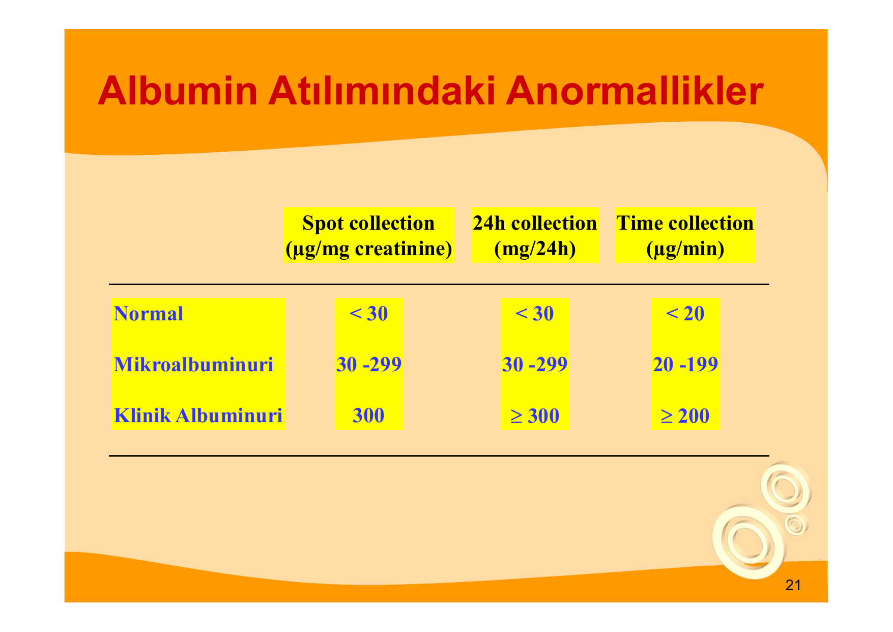

> **Veri yorumu:** Diyabetik hastaların yaşam süresi uzadıkça SDBY'ye ulaşma oranı artar. Türkiye'de diyaliz nedenlerinin yaklaşık 1/4'ü DM kaynaklıdır.

### DM Tip 1 vs Tip 2 -- Risk Profili

| Parametre | Tip 1 DM | Tip 2 DM |
|---|---|---|
| Diyabetik nefropati gelişim oranı | %20-40 | %10-20 |
| SDBY'li diyabetiklerin payı | %20 | **%80** |
| DM Tip 2'de nefropati sıklık kat artışı | -- | **10 kat daha sık** (popülasyonda 10x fazla) |
| GFH azalma hızı (tedavisiz) | 7-14 mL/dk/yıl | 2-5 mL/dk/yıl |
| Tanıda nefropati olasılığı | Nadir | Sık (hastalık uzun süredir olabileceğinden) |

**Genel:** DM varlığı SDBY riskini **12 kat** artırır.

---

## RİSK FAKTÖRLERİ

**Değiştirilemeyen:**

* **Genetik yatkınlık**
  * Aile öyküsü (Pima yerlileri: nefropati sıklığı aile öyküsü olmayanda %14, bir ebeveynde DNP varsa %23, iki ebeveynde varsa %46)
  * ACE gen polimorfizmi (DD genotipi)
  * Aldoz redüktaz geni (homozigot Z-2 alleli, odds oranı 5.25)
  * Na-Lityum counter-transport
* **Irk** -- siyah ırk, Pima yerlileri, Meksikalılar
* **Cinsiyet** -- erkek
* **Tanı yaşı**, **DM süresi**

**Değiştirilebilir:**

* **Glisemik kontrol** (HbA1c)
* **Kan basıncı**
* **Hiperlipemi**
* **Sigara**
* **Obezite**
* **Artmış GFH (hiperfiltrasyon)** -- GFH>125 mL/dk olan Tip 1 DM'de 8 yılda nefropati gelişme oranı %50; GFH<125 mL/dk olanlarda %5
* **Diyet (tuz, protein)**
* **Plazma prorenin aktivitesi**
* **Oral kontraseptif kullanımı?**

---

## DOĞAL SEYİR -- TİP 1 VE TİP 2 DM FARKLARI

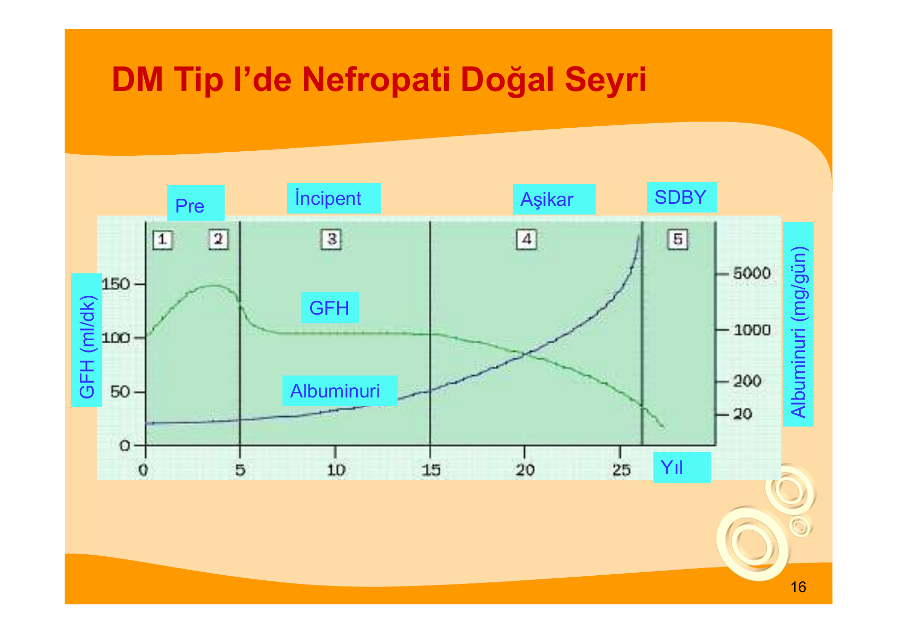

> **Şema yorumu:** Eksendeki mavi eğri (GFH) başlangıçta hiperfiltrasyon nedeniyle yüksektir; aşikar proteinüri başladığında dik bir düşüşe geçer. Kırmızı eğri (albüminüri) zamanla eksponansiyel artış gösterir. Dört evre şöyle sıralanır: **Pre → İnsipient → Aşikar → SDBY**.

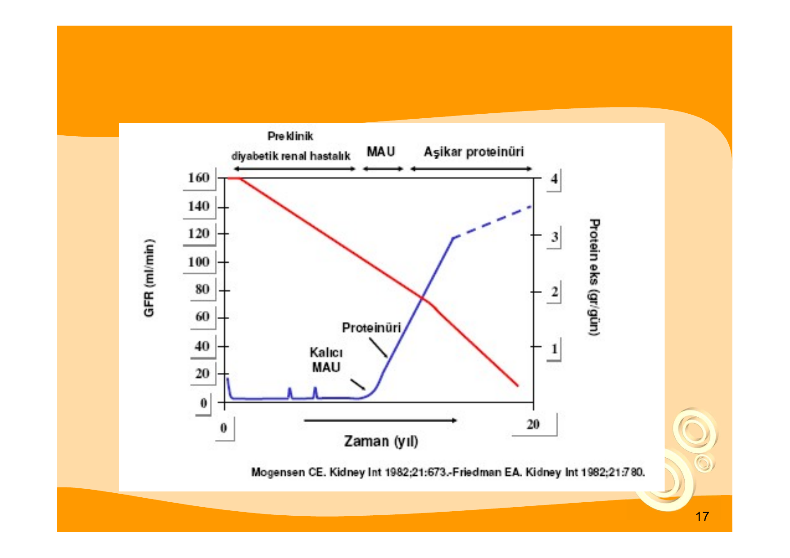

> **Şema yorumu:** Kalıcı mikroalbüminüri (MAU) ortaya çıktıktan sonra, aşikar proteinüriye (>300 mg/gün) geçiş 5-10 yıl sürer. Bu dönemden itibaren **proteinüri ile GFR arasında ters korelasyon** kurulur -- proteinüri ne kadar yüksekse GFR o kadar hızlı düşer.

### Tip 1 DM

Klasik Mogensen 5 evre sırası gözlenir (aşağıda detaylı anlatılmıştır).

### Tip 2 DM

* **Tanı anında hiperfiltrasyon %30-40** oranında zaten mevcuttur.
* Renal plazma akımı sabittir, **filtrasyon fraksiyonu artmıştır** (glomerüler hipertansiyon).
* GFH azalma hızı 1-20 mL/dk/yıl arasında değişkendir.
* **Tanı konduğunda hastalığın uzun süredir olabileceği için nefropati görülebilir.**

---

## MOGENSEN SINIFLAMASI -- 5 EVRE

### Evre 1 -- Hiperfiltrasyon / Hipertrofi Evresi

**Zamanlama:** DM başlangıcından itibaren ilk 5-10 yıl.

**Bulgular:**

* **Renal plazma akımında %9-14 artış**
* **GFH'de %20-40 artış**
* Üriner albümin atılımında artış
* **Böbrek hipertrofisi** (renal boyut artar)
* Glikozüri ve poliüri
* Hiperglisemiye bağlı ozmotik yük ve toksisite

**Reversibilite:** İnsülin tedavisi ile hiperfiltrasyon ve artmış albümin atılımı gerileyebilir.

---

### Evre 2 -- Sessiz Evre

* **Mikroalbüminüri yok**
* GFH normale yaklaşır (hiperfiltrasyon geriler)
* **Erken histolojik değişiklikler başlar:**
  * Bazal membran (GBM) kalınlaşması
  * Mezangial matrikste genişleme

---

### Evre 3 -- İnkipient (Başlangıç) Nefropati / Mikroalbüminüri Evresi

**Zamanlama:** DM başlangıcından 6-15 yıl sonra.

| Parametre | Değer |
|---|---|
| Albüminüri | **20-200 µg/dk veya 30-300 mg/gün (mikroalbüminüri)** |
| GFR | Normal-düşük |
| Kan basıncı | Hipertansiyon başlangıcı |
| Histoloji | Bazal membran kalınlaşması |
| Kardiyovasküler risk | Artmış |
| Aşikar nefropatiye ilerleme | 5 yılda %20 |

**GFR azalma hızı:**

* Mikroalbüminüri (+): **1.1 mL/dk/yıl**
* Mikroalbüminüri (-): 0.8 mL/dk/yıl

---

### Evre 4 -- Aşikar (Overt) Klinik Nefropati

**Zamanlama:** DM başlangıcından 10-20 yıl sonra.

**Bulgular:**

* **Kalıcı proteinüri >300-500 mg/24 saat**
* Yılda %15-40 oranında proteinüri artışı
* %10 oranında nefrotik düzey proteinüri
* **GFH'de progresif azalma** (nefrotik düzey proteinüri varsa 10 mL/dk/yıl)
* **Mikroskopik hematüri %66**
* Hipertansiyon, ödem
* **7-10 yılda SDBY'ye ilerleme**

**Sıvı-elektrolit bozuklukları:**

* Pozitif sodyum dengesi → ödem, kan basıncı yüksekliği, pulmoner ödem, plevral efüzyon
* **Kan basıncı kontrolü güçleşir** (çoklu ilaç + diüretik gerekir)
* Lipid profili bozulur
* **Hiporeninemik hipoaldosteronizm (Tip 4 RTA)** → erken evrelerde bile **hiperkalemi ve metabolik asidoz**

---

### Evre 5 -- İleri Böbrek Yetmezliği / SDBY

**Zamanlama:** DM başlangıcından 15-25 yıl sonra.

* **GFR <25 mL/dk, azotemi**
* Nefrotik düzey proteinüri sonrasında 5 yıl içinde SDBY
* Hipertansiyon, ödem
* **İnsülin ihtiyacı azalır** (insülinin %30-40'ı böbrekte yıkıldığı için hipoglisemi riski artar)
* Diyaliz tedavisi GFR 15 mL/dk düzeyinde başlatılmalıdır (geleneksel öğreti; DM'de daha erken de başlanabilir).

---

### Evrelerin Özet Tablosu

| Evre | Süre (yıl) | GFH | Albüminüri | KB | Histoloji |
|---|---|---|---|---|---|
| 1 -- Hiperfiltrasyon | 0-5 | ↑↑ (%20-40) | Geçici artış | Normal | Hipertrofi |
| 2 -- Sessiz | 2-10 | Normal | Yok | Normal | BM kalınlaşması, mezangial genişleme |
| 3 -- İnsipient | 6-15 | Normal-↓ | **30-300 mg/gün** | Yükselmeye başlar | BM kalınlaşması ileri |
| 4 -- Aşikar | 10-20 | **↓↓** | **>300 mg/gün** | HT sık | Nodüler skleroz (KW) |
| 5 -- SDBY | 15-25 | <25 | Masif | HT ciddi | Global skleroz |

---

## ALBÜMİNÜRİ KATEGORİLERİ VE TARAMA

### Albüminüri Kesim Değerleri

| Kategori | Spot UACR (µg/mg kreatinin) | 24 saatlik (mg/24 sa) | Zamanlı (µg/dk) |
|---|---|---|---|
| Normal | <30 | <30 | <20 |
| **Mikroalbüminüri** | 30-299 | 30-299 | 20-199 |
| **Klinik (makro) albüminüri** | ≥300 | ≥300 | ≥200 |

### Mikroalbüminüri Tarama Pratiği

**Kullanılan yöntemler:**

* **24 saatlik idrarda albümin miktarı** (altın standart)
* **Sabah idrarında albümin/kreatinin oranı (UACR)** -- pratikte en çok kullanılan
* Mikroalbüminüri stikleri (Micral test)

**Tanı kriteri:** Son 3 ay içinde **3 örneğin 2'sinde** pozitiflik.

**Geçici (yalancı) mikroalbüminüri yapan durumlar:**

* Ağır egzersiz
* Yüksek oral protein alımı
* Sıvı yüklenmesi
* İdrar yolu enfeksiyonu
* Kalp yetmezliği
* Hipertansif atak
* Gebelik
* Ateş, akut hastalık

### Tarama Sıklığı (KDIGO/ADA)

| Hasta Grubu | Tarama Başlangıcı | Sıklık |
|---|---|---|
| **Tip 1 DM** | Tanıdan **5 yıl** sonra (veya 12 yaşından büyük, pubertede) | Yıllık |
| **Tip 2 DM** | **Tanı anından itibaren** | Yıllık |

### Mikroalbüminüri Prevalansı

| Durum | Tip 1 DM | Tip 2 DM |
|---|---|---|
| Prevalans | %20 | %15-60 |
| Tanı anında pozitiflik | -- | %5-20 |
| 5 yılda aşikar nefropatiye ilerleme (normoalbüminüriden) | %0.5 | -- |
| 5 yılda aşikar nefropatiye ilerleme (mikroalbüminüriden) | %29 | -- |

### Tarama Algoritması

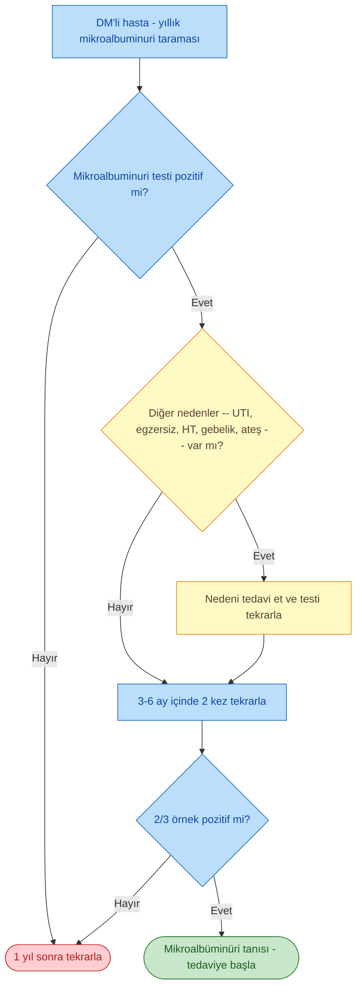

---

## PATOGENEZ

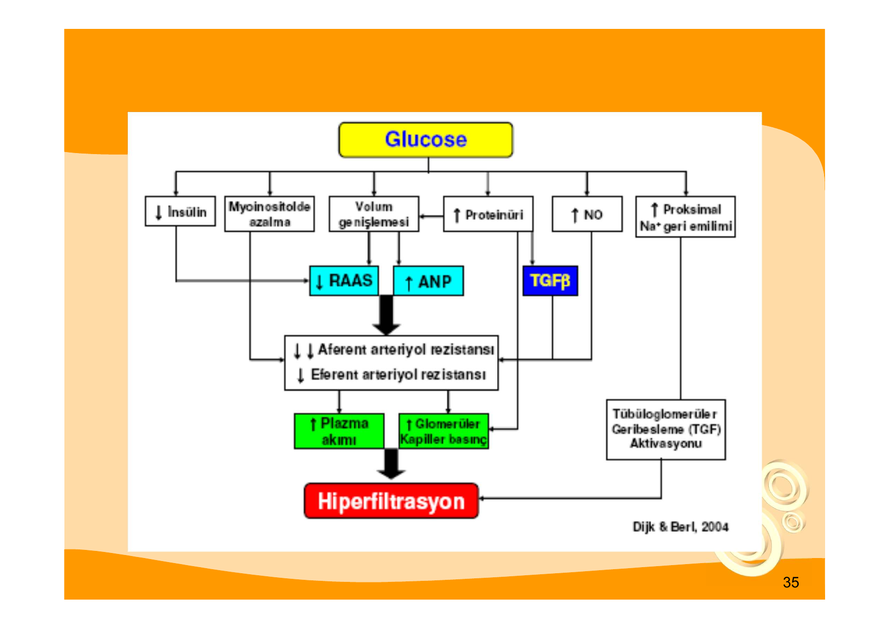

> **Şema yorumu:** Kronik glukoz fazlalığı tek başına değil; **genetik yatkınlık, hemodinamik değişiklikler (hiperfiltrasyon) ve metabolik/humoral bozukluklar** birlikte SDBY'ye yol açar.

### Ana Patogenetik Yollar

**1. Hemodinamik Bozukluklar (Hiperfiltrasyon Teorisi -- Brenner):**

* Hiperglisemi → ozmotik diürez, volüm genişlemesi
* **Afferent arteriyol dilatasyonu > Efferent arteriyol dilatasyonu** (afferent daha çok gevşer)
* Glomerüler kapiller basınç artışı (glomerüler HT)
* Artmış plazma akımı ve filtrasyon fraksiyonu
* Sonuçta **hiperfiltrasyon** → uzun vadede nefron hasarı

**2. Metabolik Bozukluklar:**

* **İleri glikasyon son ürünleri (AGE)** oluşumu:
  * Bazal membran kollajeninin nonenzimatik glikolizasyonu
  * Tip IV kollajen yıkımında azalma (birikim)
  * Bazal membran yük (şarj) değişikliği (anyonik bariyer kaybı)
  * AGE reseptör aktivasyonu → makrofaj uyarımı, IL-1, TNF
  * Anormal kollajen ve oksijen radikalleri
* **Poliol (sorbitol) yolu:** Glukoz → aldoz redüktaz → **sorbitol birikimi** → hücre içi ozmotik stres
* **Diaçilgliserol -- Protein Kinaz C (PKC) yolu** aktivasyonu
* **Oksidatif stres** (ROS) artışı
* **Hekzozamin yolu** aktivasyonu

**3. Humoral / Büyüme Faktörleri:**

* **TGF-β (transforming growth factor beta)** artışı -- matriks üretimi
* **PDGF, IGF-1 anormallikleri**
* İnsülin eksikliği, glukagon artışı
* Tromboksan, endotelin regülasyon bozukluğu
* **Artmış intrarenal anjiotensin II**

**4. Genetik Yatkınlık:** Yukarıda risk faktörlerinde anlatıldı.

### Hiperfiltrasyon Mekanizmaları

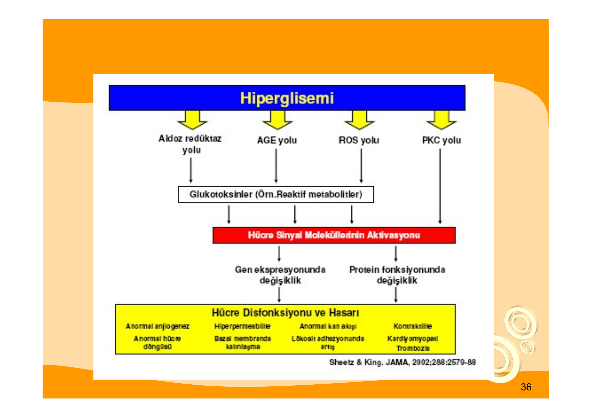

> **Şema yorumu:** Hiperglisemi birçok yoldan aferent arteriyol rezistansını düşürür (RAAS baskılanır, ANP artar, TGF-β artar) ve aynı zamanda efferent rezistansı göreceli olarak yüksek tutar. Net etki: **glomerüler kapiller basınç artar**, plazma akımı artar ve hiperfiltrasyon oluşur. Tübüloglomerüler geri besleme (TGF) mekanizması da proksimal Na geri emilimi artışı ile bozulur.

### Hücresel Hasar Mekanizmaları

> **Şema yorumu:** Dört paralel yol (aldoz redüktaz / AGE / ROS / PKC) hücre sinyal moleküllerini aktive eder; sonuçta gen ekspresyonu ve protein fonksiyonunda değişiklik olur. Bu da **anormal hücre döngüsü, hiperpermeabilite, anormal kan akımı, bazal membran kalınlaşması, anormal kan akımı ve lökosit adhezyonu, karışıklık/kasılma, tromboz** gibi sonuçlar doğurur.

### Diyabetik Nefropatide RAAS Paradoksu

**Anjiotensin II Reseptörleri:**

| Reseptör | Etki |
|---|---|
| **AT1** | Vasküler rezistans ↑, renal kan akımı ↓, ekstrasellüler matriks yapımı ↑ |
| **AT2** | İntrarenal NO ↑, natriürez, hücre büyümesi ve matriks inhibisyonu |

**Paradoks:** Hiperglisemi intrarenal RAAS'yi uyarır ve **lokal AngII** üretimi artar. Negatif feedback ile sistemik renin salınımı baskılanır. Bu yüzden diyabetik nefropatide:

* **Sistemik RAAS baskılıdır**
* Lokal RAAS aktive
* **Tip 4 RTA** (hiporeninemik hipoaldosteronizm) → hiperkalemi + metabolik asidoz

> **⚠️ ÖNEMLİ:** DM hastasında açıklanamayan hiperkalemi ve hafif non-anion-gap metabolik asidoz varsa Tip 4 RTA akla gelmelidir.

---

## PATOLOJİ -- HİSTOPATOLOJİK BULGULAR

**Diyabetik nefropatinin klasik bulguları (erken → geç sıra):**

1. **GBM (glomerüler bazal membran) kalınlaşması** -- en erken bulgu (elektron mikroskopisi ile görülür)
2. **Mezangial matriks artışı (diffüz mezangial ekspansiyon)** -- GFR kaybı ile korele
3. **Podosit kaybı** (podositopati)
4. **Nodüler glomerüloskleroz -- Kimmelstiel-Wilson nodülleri** (diyabete **patognomonik**)
5. **Diffüz glomerüloskleroz**
6. **Afferent ve efferent arteriyoler hyalinozis** -- **her iki arteriyolün birlikte tutulumu diyabete özgüdür** (hipertansiyonda sadece afferent tutulur)
7. **Tübüler atrofi ve interstisyel fibroz** (geç dönem)

### Normal Glomerül

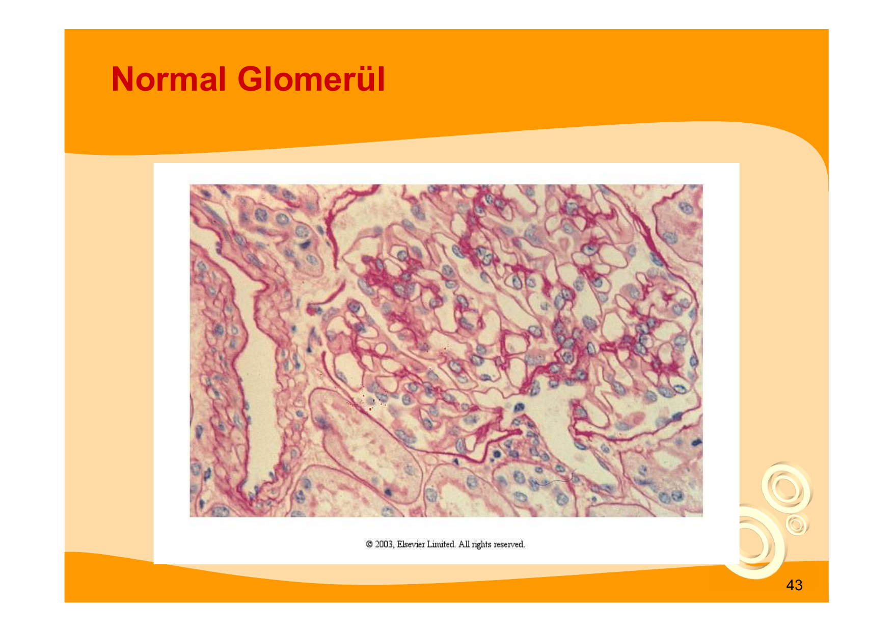

> **Histolojik yorum (temkinli):** Sağlıklı glomerülde mezangial matriks incedir; kapiller lümenler açıktır. Tübüller arası mesafe dardır.

### Yaygın Mezangial Genişleme

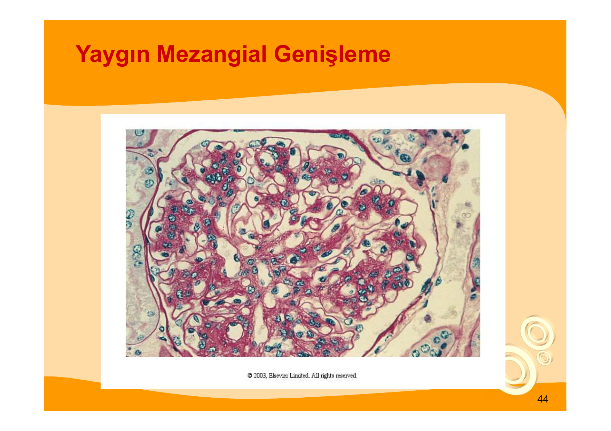

> **Histolojik yorum:** Mezangial hücre ve matriks artışı kapiller lümenleri daraltır. Bu değişiklik, filtrasyon yüzeyinin azalması ile GFR düşüşüne katkıda bulunur.

### Kimmelstiel-Wilson Nodülü -- Patognomonik Bulgu

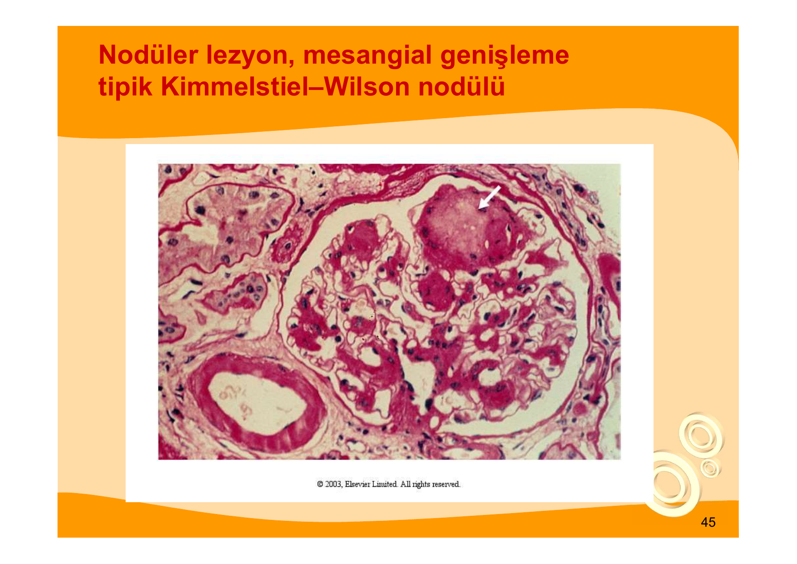

> **Histolojik yorum:** **Kimmelstiel-Wilson (KW) nodülleri**, glomerülün periferinde, iyi sınırlı, yuvarlak, PAS-pozitif, asellüler matriks nodülleridir. Diyabete özgü (patognomonik) kabul edilirler. Biyopside görülmesi, etiyolojik olarak diyabetik nefropati tanısını güçlü şekilde destekler.

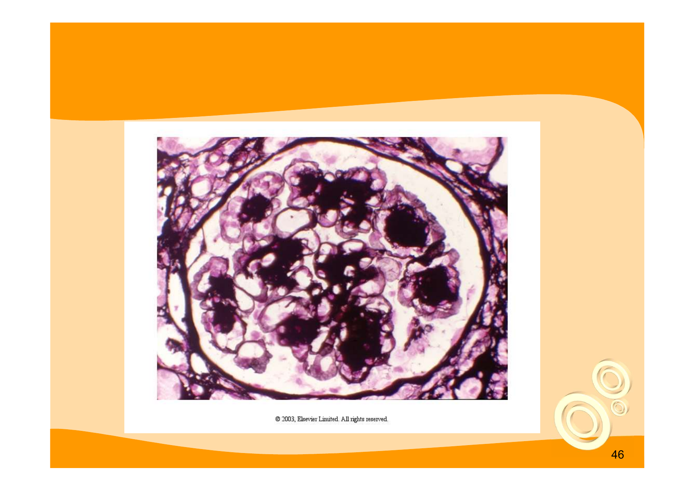

> **Histolojik yorum:** Multipl, büyük, koyu boyanan KW nodülleri ileri evre diyabetik nefropatiyi gösterir. Glomerül büyük ölçüde fonksiyon kaybetmiştir.

### Elektron Mikroskopi

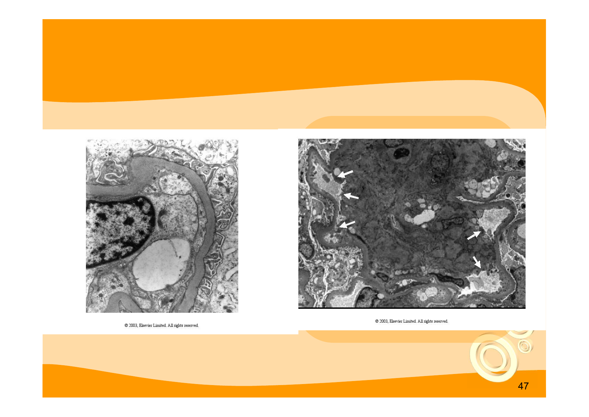

> **Mikroskopik yorum:** Sol -- normal GBM ince bir çizgi gibi görünür. Sağ -- diyabetik nefropatide GBM belirgin şekilde kalınlaşmıştır; podosit ayak çıkıntılarında kısmi silinme (effacement) görülür. GBM kalınlaşması **en erken morfolojik bulgudur**.

### Patoloji Bulguları Özet Tablosu

| Bulgu | Zamanlama | Klinik Karşılık | Spesifiklik |
|---|---|---|---|
| GBM kalınlaşması | Erken (evre 2) | Mikroalbüminüriden önce başlar | Duyarlı, özgül değil |
| Mezangial ekspansiyon | Orta | GFR kaybı ile korele | Duyarlı, özgül değil |
| **Kimmelstiel-Wilson nodülü** | Geç | Aşikar proteinüri | **Patognomonik** |
| Afferent + efferent hyalinozis | Geç | -- | Diyabete özgü |
| Podosit kaybı | Orta-geç | Proteinüri | -- |
| Tübüler atrofi, interstisyel fibroz | Geç | GFR kaybı | Nonspesifik |

---

## TANI VE AYIRICI TANI -- BİYOPSİ ENDİKASYONLARI

### Tip 1 DM'de Tanı Kriterleri

1. En az **5 yıllık DM süresi**
2. **Diyabetik retinopati varlığı**
3. Diğer böbrek hastalıklarının dışlanması

Bu üç kriter birlikte varsa DNP olasılığı yüksektir; biyopsi genellikle gereksizdir.

### Tip 2 DM'de Tanı

* İlk tanı konulduğunda bile nefropati görülebilir (hastalık uzun süredir sessiz seyredebildiğinden).
* **Retinopati-nefropati birlikteliği Tip 2'de yalnızca %63** (Tip 1'de %85-99).
* Bu yüzden Tip 2'de retinopati yokluğu nefropatiyi dışlamaz ancak atipik seyir varsa alternatif tanıları araştırmak gerekir.

### Ayırıcı Tanı Algoritması

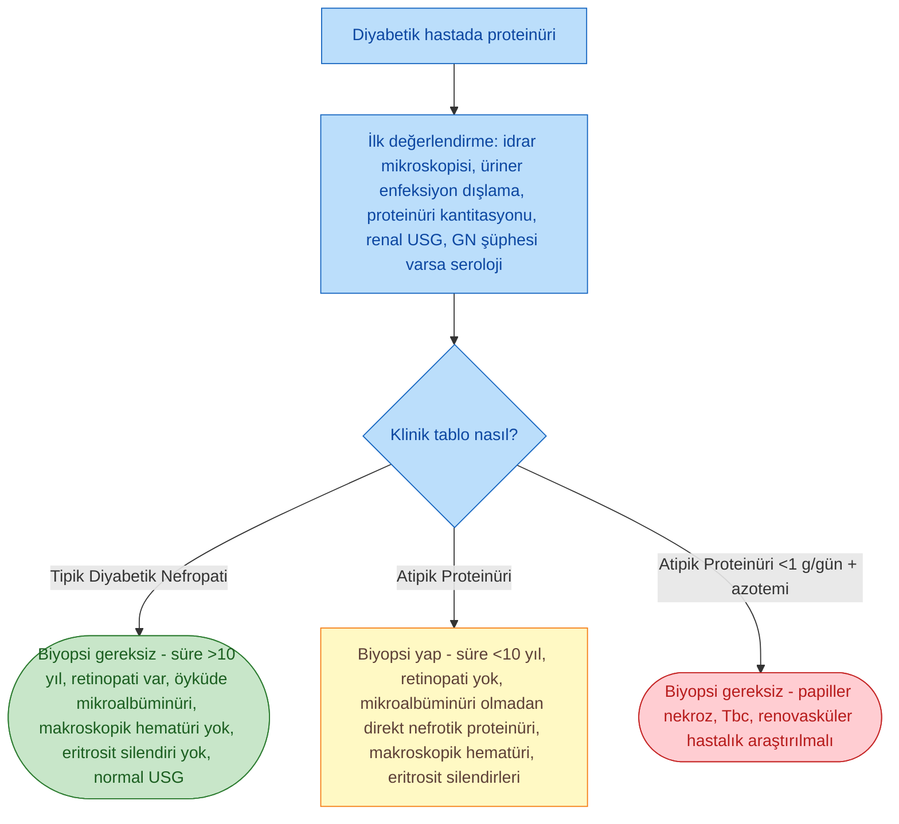

### Biyopsi Endikasyonları (Nondiyabetik Böbrek Hastalığı Şüphesi -- NDBH)

**Aşağıdaki ipuçları varsa biyopsi düşün:**

* **DM süresi <5-10 yıl** ile orantısız proteinüri/azotemi
* **Diyabetik retinopati yokluğu** (özellikle Tip 1'de)
* Mikroalbüminüri aşamasından geçmeden **direkt nefrotik proteinüri**
* **Makroskopik hematüri** veya aktif üriner sediment (dismorfik eritrositler, eritrosit silendirleri)
* **Hızlı GFR düşüşü** (>15 mL/dk/yıl)
* Anormal seroloji (ANA, ANCA, anti-GBM, kriyoglobulin, hepatit paneli)
* Böbreklerin normal/büyük olmadığı durum (ancak diyabetik nefropatide de başlangıçta böbrekler büyüktür, bu kural göreceli)
* Açıklanamayan sistemik semptomlar

> **📝 Öğrenci için pratik cümle:** "Diyabetli bir hastada **aktif sediment, hızlı GFR düşüşü veya retinopati yokluğu** varsa biyopsi isteyin."

---

## DM'LİŞ HASTADA DİĞER RENAL HASTALIKLAR

DM'li hastada her proteinüri "diyabetik nefropati" değildir. Aşağıdakiler de görülebilir:

* **Glomerülonefrit** (özellikle **membranöz nefropati**)
* **Renovasküler hastalık** (renal arter stenozu -- aterosklerozla sık)
* **Nörojenik mesane** (otonom nöropatiye bağlı)
* **Üriner enfeksiyon / akut pyelonefrit / genitoüriner tbc**
* **Kontrast nefropati** (kontrastlı incelemelere yatkınlık)
* **Papiller nekroz** (DM + analjezik kullanımı ile tetiklenir)
* **İskemik nefropati**

---

## TEDAVİ -- GENEL İLKELER

**Diyabetik nefropatide tedavinin 2 temel amacı:**

1. **Progresyonu yavaşlatmak** (veya mümkünse geri döndürmek)
2. **Kardiyovasküler mortaliteyi azaltmak**

### Progresyon Risk Faktörleri

* **Hiperglisemi**
* **Hipertansiyon**
* **Proteinüri**
* **DNP dışı ek faktörler:** Hiperlipemi, sigara, obezite, yüksek proteinli diyet

### Erken ve Aşikar Evrede Tedavi Prensipleri

**Erken evre (mikroalbüminüri):**

* Sıkı glisemik kontrol → hiperfiltrasyon düzelebilir, mikroalbüminüri **reversibl** olabilir
* **KB kontrolü**
* **ACE inh veya ARB** (proteinüri azaltır)
* Nefrotoksik ajanlardan kaçınma (kontrast, aminoglikozid, NSAİİ)

**Aşikar nefropati:**

* Yukarıdaki tedavilere devam
* İlave renoprotektif ajanlar (SGLT2i, GLP-1 RA, finerenon)
* **Nefrotoksik ilaçlardan kesin kaçınmak** (radyokontrast, aminoglikozid, NSAİİ)

---

## GLİSEMİK KONTROL

### Hedefler

| Hasta Grubu | HbA1c Hedefi |
|---|---|
| Genç, komplikasyonsuz, uzun yaşam beklentisi | **<%7** |
| Komorbid, yaşlı, hipoglisemi riskli | **%7-8** (bireyselleştir) |
| KDIGO 2022 | **%6.5-8.0** (bireyselleştirme) |
| Önerilen (Yeniçerioğlu ders hedefi) | HbA1c %6.5 civarı |

### Kanıtlar

**DCCT (Tip 1 DM):**

* Sıkı glisemik kontrol (insülin) ile **mikroalbüminüride ve makroalbüminüride azalma**
* EDIC (DCCT uzatması) -- sıkı kontrolün **uzun vadeli kalıcı etkisi** ("metabolik hafıza")

**UKPDS (Tip 2 DM):**

* HbA1c <7 → azalmış mikrovasküler komplikasyon riski
* Azalmış DNP progresyon riski

**Ek etkinlik:**

* Mikroalbüminüride gecikme, stabilizasyon, düzelme
* Böbrek + pankreas transplantı ile nefropati nüksünün engellenmesi
* Hiperfiltrasyon ve hipertrofide gerileme
* Histolojik düzelme

### İlaç Seçimi ve Böbrek Yetmezliği

| İlaç | Diyabetik Nefropatide Kullanım |
|---|---|
| **İnsülin** | En güvenli seçenek; GFR düştükçe yarı ömrü uzar (doz azaltımı + hipoglisemi riski) |
| **Metformin** | Glukoz ve lipid kontrolünde etkin; eGFR <30 mL/dk'da **laktik asidoz riski nedeniyle kontrendike** |
| **Sulfonilüreler** | GFR düşüşünde uzamış hipoglisemi riski -- dikkat |
| **Tiazolidinedionlar (pioglitazon)** | Tip 2'de albüminüri azaltır; ancak sıvı retansiyonu, kalp yetmezliği riski |
| **DPP-4 inhibitörleri** | Linagliptin böbrek doz ayarlaması gerektirmez |
| **SGLT2 inhibitörleri** | **Renoprotektif** (aşağıda) |
| **GLP-1 agonistleri** | **Renoprotektif** (aşağıda) |

> **⚠️ ÖNEMLİ:** GFR düştükçe **insülin ihtiyacı azalır** (insülinin %30-40'ı böbrekte yıkılır). Hipoglisemi riski artar.

---

## KAN BASINCI KONTROLÜ VE RAS BLOKAJI

### Kan Basıncı Hedefleri

| Durum | Hedef (mmHg) |
|---|---|
| DM, proteinürisiz | <130/80 |
| DM + proteinüri (KDIGO) | **<125/75 ya da <130/80** |
| Yeniçerioğlu ders önerisi | **<120/80** (bireyselleştir) |

### İlaç Seçimi

**Birinci basamak:**

* **ACE inhibitörü (ACEi)** veya **Anjiotensin reseptör blokeri (ARB)**
  * Eşit etkinlik (UKPDS, RENAAL, IDNT gibi çalışmalar)
  * **Afferent + efferent arteriyolü gevşeterek** glomerüler basıncı azaltır (özellikle efferent üzerinde etkili → Brenner koruması)
  * Proteinüri azaltır
  * DNP progresyonunu yavaşlatır

> **⚠️ İzlem kuralı:** ACEi/ARB başladıktan sonra **serum kreatininde %30'a kadar yükselme** iyi prognoz göstergesi olarak kabul edilir (**hiperfiltrasyonun düzeldiğini** gösterir). %30'u aşan artış veya potasyum >5.5 mEq/L varsa doz azaltın / kesin.

* Hiperkalemi durumunda:
  * Doz azaltımı
  * **Loop diüretik (furosemid)** eklenmesi
  * **Potasyum bağlayıcı** (patiromer, sodyum polistiren sülfonat/kayexelate)

> **❌ Kontrendikasyon:** ACEi + ARB **kombinasyonu renoprotektif amaç için önerilmez** (ONTARGET çalışması -- renal olay ve hiperkalemi artışı).

**Kombinasyon:**

* Non-dihidropiridin KKB (diltiazem, verapamil) -- proteinüri azaltıcı etki
* Tiazid veya loop diüretik
* Beta blokerler (UKPDS'de ACEi kadar etkili)
* **Finerenon** (aşağıda)

### Kan Basıncı Kontrolünün Önemi

> **Klinik perle:** "SKB'de her 10 mmHg azalma, mikroalbüminüri ve renal olay riskini anlamlı oranda düşürür." UKPDS verilerinden: KB <140/80 hedefi mikroalbüminüri riskini azaltır.

---

## YENİ RENOPROTEKTİF AJANLAR -- SGLT2i, GLP-1 RA, FİNERENON

### 1. SGLT2 İnhibitörleri -- "Flozinler"

**Ajanlar:** Empagliflozin, dapagliflozin, canagliflozin, ertugliflozin.

**Renoprotektif mekanizma:**

* Proksimal tübülde **glukoz + Na geri emilimi** blokajı
* **Makula densaya ulaşan Na artar** → tübüloglomerüler geri besleme (TGF) aktivasyonu
* **Afferent arteriyol konstriksiyonu** → glomerüler basınç düşer → hiperfiltrasyon azalır
* Proteinüride akut düşüş (ilk haftalarda eGFR'de 3-5 mL/dk'lık geri dönüşlü düşüş = "initial dip")
* Uzun vadede GFR düşüş hızında belirgin yavaşlama

**Anahtar çalışmalar:**

| Çalışma | Ajan | Popülasyon | Sonuç |
|---|---|---|---|
| **CREDENCE** | Kanagliflozin | Tip 2 DM + DKD (UACR 300-5000) | **Primer renal endpoint %30 risk azaltımı** |
| **DAPA-CKD** | Dapagliflozin | KBH (diyabetli / diyabetsiz) | KBH progresyonu, renal ölüm azaldı |
| **EMPA-KIDNEY** | Empagliflozin | KBH (daha geniş popülasyon) | Primer KBH progresyon endpoint'inde belirgin azalma |
| **EMPA-REG OUTCOME** | Empagliflozin | Tip 2 DM + KV hastalık | KV ölüm ve nefropati progresyonu azaldı |

**Uyarılar:**

* Öglisemik diyabetik ketoasidoz riski
* Ürogenital enfeksiyon, mikotik enfeksiyon
* Volüm azalması, hipotansiyon (özellikle diüretik + ACEi/ARB alıyorsa)

### 2. GLP-1 Reseptör Agonistleri

**Ajanlar:** Liraglutid, semaglutid, dulaglutid.

**Renoprotektif etki:** Albüminüride azalma, kardiyovasküler koruma.

**Anahtar çalışmalar:**

* **LEADER** (liraglutid) -- Tip 2 DM'de makroalbüminüri gelişimi azaldı
* **SUSTAIN-6** (semaglutid) -- yeni veya kötüleşen nefropatide azalma
* **FLOW** (semaglutid, 2024) -- Tip 2 DM + KBH'da primer renal endpoint'te belirgin azalma

### 3. Nonsteroidal MRA -- Finerenon

**Mekanizma:** Nonsteroidal selektif mineralokortikoid reseptör antagonisti. Kalp ve böbrekte **inflamasyon ve fibrozis**i azaltır; spironolaktondan farklı olarak **seks hormon yan etkileri minimaldir**.

**Anahtar çalışmalar:**

| Çalışma | Popülasyon | Sonuç |
|---|---|---|
| **FIDELIO-DKD** | Tip 2 DM + DKD (UACR 30-5000, eGFR 25-75) | Primer renal endpoint %18 risk azaltımı |
| **FIGARO-DKD** | Tip 2 DM + DKD (daha geniş KV popülasyon) | KV endpoint'te anlamlı azalma |
| **FIDELITY** (havuz analiz) | -- | Birleşik renal + KV korunma |

**Uyarılar:** Hiperkalemi riski (izlem gerekli), eGFR <25'te başlanmaz.

### Kombinasyon Stratejisi -- "Pillar Tedavi"

Günümüzde Tip 2 DM + DKD'da önerilen **çoklu pillar yaklaşımı:**

1. RAS blokajı (ACEi veya ARB)
2. **SGLT2 inhibitörü**
3. **GLP-1 RA** (kilo / KV risk varsa)
4. **Finerenon** (albüminüri persiste ediyorsa)
5. İyi glisemik kontrol

> **⭐ ÖNEMLİ:** SGLT2i + finerenon + RAS blokajı kombinasyonu, modern DKD tedavisinin **temel taşlarıdır**. Her üçü de bağımsız renoprotektif etki gösterir.

---

## PROTEİNÜRİ AZALTILMASI

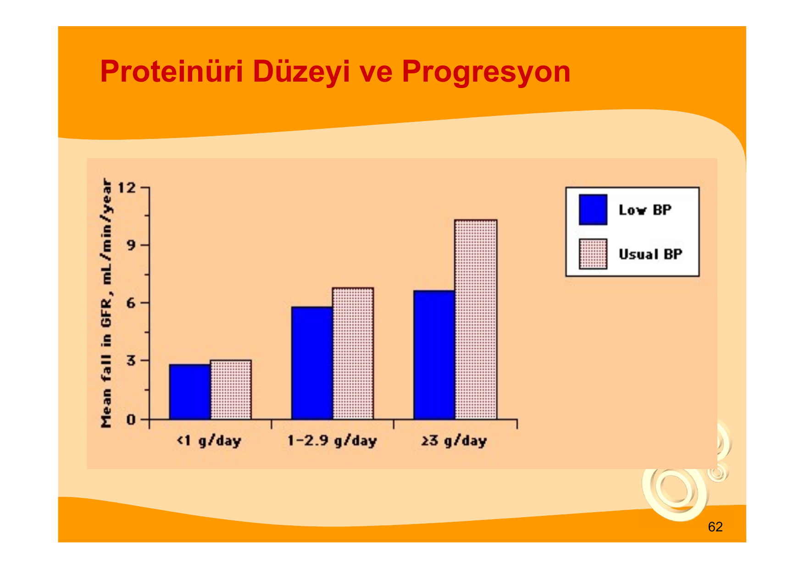

> **Şema yorumu:** Proteinüri <1 g/gün hasta grubunda GFR kaybı ortalama 3 mL/dk/yıl civarındayken, proteinüri ≥3 g/gün olan grupta 10 mL/dk/yıl'a yaklaşır. Düşük KB (koyu çubuk) her kategoride koruyucu etki gösterir.

**Kurallar:**

* **Normal sınırda bile yüksek değerler** (örn. >10 mg/gün) progresyon riski taşır.
* **Makroalbüminüri en güçlü tek prediktör**dür.
* Proteinüriyi azaltan her müdahale (ACEi/ARB, SGLT2i, finerenon, düşük tuzlu diyet) renoprotektif etki gösterir.

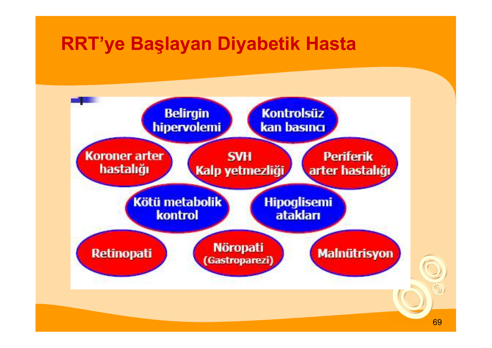

> **Şema yorumu:** ACEi (lisinopril) ve non-dihidropiridin KKB (verapamil) proteinüriyi benzer şekilde azaltır; **kombinasyon** (lisinopril + verapamil) daha etkilidir. Tiazid + guanfasin kombinasyonu daha az etkili kalmıştır -- yani **RAS blokajı + nondihidropiridin KKB sinerjistik** çalışır.

---

## DİYET VE YAŞAM TARZI

### Protein Kısıtlaması

| Evre | Önerilen Protein Alımı (KDIGO) |
|---|---|
| KBH G1-G2 (GFR ≥60) | 0.8-1.0 g/kg/gün |
| KBH G3-G5 (diyalize girmeyen) | **0.8 g/kg/gün** |
| Diyalizli hasta | 1.0-1.2 g/kg/gün (artırılır) |

> **Klinik kanıt (Walker, NEJM 1991):** Tip 1 DM'li hastalarda protein kısıtlaması GFR düşüş hızını anlamlı şekilde yavaşlattı.

### Tuz Kısıtlaması

* **Na <2 g/gün (<90 mmol/gün = <5 g NaCl/gün)**
* RAS blokajının proteinüri üzerindeki etkisi düşük tuzlu diyette daha belirgindir.

### Lipid Kontrolü

* **LDL <100 mg/dL** (diyabetik hasta)
* **LDL <70 mg/dL** (kardiyovasküler hastalık varsa)
* **Statin** tedavisi (atorvastatin, rosuvastatin) standarttır.

### Yaşam Tarzı

* **Sigara bırakma** -- DNP progresyonunu hızlandırır.
* **Kilo verme** -- insülin direncini azaltır.
* **Düzenli egzersiz**
* **Nefrotoksinlerden kaçınma** -- NSAİİ, aminoglikozid, kontrast ajanlar.

---

## SDBY VE RENAL REPLASMAN TEDAVİSİ

> **Şema yorumu:** DM → SDBY'de tedavi iki ana daldan ibarettir: **diyaliz** (hemodiyaliz -- HD veya periton diyalizi -- PD) ve **transplantasyon** (yalnız böbrek veya böbrek + pankreas). Tip 1 DM'de uygun adaylarda **pankreas-böbrek eş zamanlı transplantı** altın standarttır.

### Diyaliz Başlama Kriterleri

* GFR ~15 mL/dk (geleneksel)
* Aşağıdaki durumlar olsa erken başlanabilir:
  * **Üremik semptomlar** (bulantı, kusma, kaşıntı, perikardit, ensefalopati)
  * **İlaçla dirençli hipertansiyon ve pulmoner ödem**
  * **İnatçı hiperkalemi / metabolik asidoz**
  * **Malnütrisyon**
  * Kötü glisemik kontrol

### Diyaliz Tipinin Seçimi

| Parametre | Hemodiyaliz (HD) | Periton Diyalizi (PD) |
|---|---|---|
| Fistül için uygun damar | DM'de problematik | Gerekmez |
| Glisemik kontrol | KŞ dalgalanması | **Dekstrozlu solüsyonlar KŞ yükseltir** |
| KV stabilite | Hipotansiyon sık | Daha stabil |
| Peritonit riski | -- | Mevcut |
| Evde uygulama | (Nadiren) | Evet |

> **⚠️ Pratik not:** Diyabetiklerde diyaliz başlanırken seçim **sosyal faktörler, damar yatağı durumu ve komorbiditelere** göre bireyselleştirilir. DM hastalarında **yüksek morbidite ve mortalite** nedeniyle:
>
> * Zamanında diyalize başlanmalı
> * Yeterli diyaliz + beslenme sağlanmalı
> * Hiperglisemi, HT, hiperlipidemi etkin kontrol edilmeli
> * KV hastalık açısından yakın izlem gerekir

### Transplantasyon

* **Tip 1 DM + SDBY:** Böbrek + pankreas eş zamanlı transplant (SPK) **altın standart** -- hem üremi hem DM düzelir.
* **Tip 2 DM:** İzole böbrek transplantı (pankreas genellikle endike değil).
* Transplante böbrekte diyabetik nefropati **nüksebilir** → glisemik kontrol hayati.

### RRT'ye Başlayan Diyabetik Hastada Komorbidite Yükü

> **Şema yorumu:** RRT'ye başlayan diyabetik hastalar, sadece böbrek değil aynı zamanda multiple sistem tutulumu ile gelirler: kardiyovasküler (CAD, LVH, kalp yetmezliği), makro/mikrovasküler (periferik arter hastalığı, retinopati), otonomik (gastroparezi → hipoglisemi), metabolik (malnütrisyon). Bu nedenle **multidisipliner yaklaşım** şarttır.

---

## KOMPLİKASYONLAR

### Erken Evre (Evre 3-4)

* **Hipertansiyon** -- RAS aktivasyonu + volüm
* **Mikroalbüminüri/proteinüri**
* **Tip 4 RTA** (hiporeninemik hipoaldosteronizm) → hiperkalemi + non-anion-gap metabolik asidoz
* **Kardiyovasküler hastalık riski artışı** (mikroalbüminüri bile bağımsız prediktör)

### Geç Evre (Evre 5)

* **Hipervolemi, pulmoner ödem, plevral efüzyon**
* Dirençli hipertansiyon
* **Hiperkalemi** (RAS blokajı ile daha da artar -- izlem gerekir)
* **Metabolik asidoz**
* **Anemi** (eritropoetin eksikliği + DM'ye özgü erken anemi)
* **KBH-Mineral Kemik Bozukluğu (hiperfosfatemi, hipokalsemi, sekonder hiperparatiroidi)**
* **Malnütrisyon** (protein-enerji kaybı)
* **Hipoglisemi** (GFR <30'da insülin klirensi azalır, ilaçla tedavide dikkat)
* **Gastroparezi** (otonom nöropatiye bağlı, yemek sonrası KŞ oynaması)
* **Kardiyovasküler ölüm -- SDBY'li diyabetiklerde en sık ölüm nedeni**

---

## YENİ VE GELECEK YAKLAŞIMLAR

**Araştırma/klinik kullanım aşamasında:**

* **Aldoz redüktaz inhibitörleri** (sorbinol) -- bazı deneysel ve klinik çalışmalarda yararlı
* **AGE oluşum inhibitörleri** (aminoguanidin, pimaguinidin) -- çapraz bağ yıkıcıları
* **AGE reseptör blokajı**
* **Protein Kinaz C (PKC) inhibitörleri**
* **Anti-TGF-β antikorları**
* **Endotelin reseptör antagonistleri** -- sparsentan (ayrıca dual ET-A + AT1 blokeri), atrasentan
* **Aldosteron sentaz inhibitörleri** (faz 3 çalışmaları devam ediyor)
* **HIF-PHI** (roxadustat, daprodustat) -- anemi tedavisinde
* **Glikolize albumine karşı antikor** tedavisi

---

## VAKA ÖRNEKLERİ

**📋 VAKA ÖRNEĞİ 1: Tipik Tip 1 DM Nefropatisi**

**Hasta:** 32 yaşında erkek, 18 yıldır Tip 1 DM takipli.
**Öykü:** HbA1c %9.5, kötü glisemik kontrol, son 2 yıldır HT. Son muayenede bacak ödemi.
**Fizik Muayene:** TA 160/95 mmHg, pretibial 2+ ödem.
**Laboratuvar:** Kreatinin 1.9 mg/dL (eGFR 42 mL/dk), UACR 1850 mg/g, proteinüri 2.3 g/gün. Göz dibi: proliferatif diyabetik retinopati.
**Tanı:** Diyabetik nefropati -- Evre 4 (aşikar nefropati).
**Tedavi:** ACEi (ramipril), kan basıncı hedefi <130/80, SGLT2i (empagliflozin), LDL <70 için atorvastatin, tuz kısıtlaması, protein 0.8 g/kg/gün.
**İzlem:** 3 ay sonra kreatinin %20 artmış (1.9 → 2.3), K 5.1 mEq/L → iyi yanıt, ilaca devam.

**Öğretici Notlar:**

1. 18 yıllık Tip 1 DM + retinopati + tipik seyir → biyopsiye gerek yok.
2. ACEi başlangıcında kreatinin %30'a kadar artış kabul edilebilir ve iyi prognoz göstergesi.
3. SGLT2i eklenmesi renoprotektif kombinasyona "ikinci pillar" katkı sağlar.

---

**📋 VAKA ÖRNEĞİ 2: Atipik Seyir -- Biyopsi Gerekiyor**

**Hasta:** 58 yaşında kadın, 3 yıl önce Tip 2 DM tanısı almış, HbA1c %7.1.
**Öykü:** Son 2 ayda hızla gelişen bacak ödemi, makroskopik hematüri atakları.
**Fizik Muayene:** TA 145/85 mmHg, anasarka.
**Laboratuvar:** Kreatinin 2.4 mg/dL (eGFR 24 mL/dk, 6 ay önce 75 mL/dk), proteinüri 7.8 g/gün, UACR 6200 mg/g. İdrar: dismorfik eritrositler (+), eritrosit silendirleri (+). ANA (+), anti-ds-DNA (+).
**Göz dibi:** Retinopati **yok**.
**Ayırıcı değerlendirme:** 3 yıllık DM süresi ile orantısız hızlı böbrek fonksiyon kaybı, retinopati yokluğu, aktif sediment, pozitif seroloji → **nondiyabetik böbrek hastalığı (NDBH)** şüphesi.
**Karar:** Renal biyopsi yapıldı → Lupus nefriti (Sınıf IV).
**Tedavi:** İndüksiyon: yüksek doz steroid + siklofosfamid / mikofenolat + RAS blokajı + hidroksiklorokin.

**Öğretici Notlar:**

1. **Kısa DM süresi + retinopati yokluğu + hızlı GFR düşüşü + aktif sediment** → biyopsi mutlak endikasyon.
2. DM hastası olmak diğer böbrek hastalıklarından koruma sağlamaz.
3. Biyopsi, tanıyı tamamen değiştirerek tedavi yolunu belirledi.

---

**📋 VAKA ÖRNEĞİ 3: Tip 4 RTA**

**Hasta:** 65 yaşında erkek, 15 yıllık Tip 2 DM, diyabetik nefropati (eGFR 35 mL/dk).
**Laboratuvar:** K 6.2 mEq/L, HCO3 18 mEq/L, anyon açığı 12 (normal), idrar pH 5.2, renin ve aldosteron düşük.
**Tanı:** Hiporeninemik hipoaldosteronizm (Tip 4 RTA) -- diyabetik nefropatinin erken komplikasyonu.
**Tedavi:** Tuzlu diyet kısıtlaması gevşetildi, loop diüretik (furosemid) eklendi, potasyum bağlayıcı (patiromer), NSAİİ ve beta bloker gözden geçirildi (durdu), fludrokortizon düşünüldü.

**Öğretici Notlar:**

1. DM'li hastada **açıklanamayan hiperkalemi + non-anion-gap asidoz** → Tip 4 RTA araştır.
2. ACEi/ARB hiperkalemiyi kötüleştirebilir; kesmeden önce mutlaka doz ayarı ve bağlayıcı deneyin.

---

## ÖZEL POPÜLASYONLAR

### Tip 1 DM

* Klasik Mogensen 5 evre gözlenir
* Retinopati-nefropati birlikteliği %85-99
* **Pankreas + böbrek transplantı** tedavide altın standart

### Tip 2 DM

* Tanı anında %30-40 hiperfiltrasyon
* Retinopati-nefropati birlikteliği %63 (düşük; **albüminürisiz DKD** sıktır)
* GFR düşüşü değişken (1-20 mL/dk/yıl)
* Multiple komorbidite sık (HT, obezite, dislipidemi)

### Gestasyonel DM ve Gebelik

* Önceden DNP varsa gebelikte proteinüri ve HT kötüleşir
* Retinopati ilerleyebilir
* Pre-eklampsi riski artar
* **ACEi/ARB kontrendike** (teratojenik) -- metildopa, labetalol, nifedipin tercih edilir
* Sıkı glisemik kontrol (hedef açlık 95, pp 140 mg/dL altı)

---

## ÖZET VE ANAHTAR MESAJLAR

> **⭐ 15 Altın Mesaj:**
>
> 1. Diyabetik nefropati, DM'nin **mikrovasküler komplikasyonu**dur ve SDBY'nin **1 numaralı nedenidir**.
> 2. Tip 2 DM Tip 1'den **10 kat daha sık** nefropati yapar; SDBY'li diyabetiklerin **%80'i Tip 2**'dir.
> 3. **Mogensen 5 evre:** Hiperfiltrasyon → Sessiz → İnsipient (mikroalbüminüri) → Aşikar (makroalbüminüri) → SDBY.
> 4. **Mikroalbüminüri: 30-299 mg/gün veya UACR 30-299 mg/g.** Tip 1'de 5 yıl sonra, Tip 2'de tanıdan itibaren **yıllık tarama** yapılmalı.
> 5. **Kimmelstiel-Wilson nodüler glomerülosklerozu diyabete patognomoniktir.**
> 6. En erken histolojik bulgu **GBM kalınlaşması**; mezangial ekspansiyon GFR kaybı ile korele.
> 7. **Afferent + efferent arteriyol birlikte hyalinozis** diyabete özgüdür.
> 8. **Biyopsi endikasyonları:** kısa DM süresi, retinopati yokluğu, hızlı GFR kaybı, aktif sediment, anormal seroloji.
> 9. **RAS blokajı** (ACEi veya ARB) DNP tedavisinin temel taşıdır -- kreatininde %30'a kadar artış beklenir ve iyi prognozdur.
> 10. **SGLT2 inhibitörleri (empagliflozin, dapagliflozin, canagliflozin)** CREDENCE, DAPA-CKD, EMPA-KIDNEY çalışmalarıyla kanıtlanmış renoprotektif etki gösterir.
> 11. **GLP-1 RA (liraglutid, semaglutid)** -- LEADER, SUSTAIN-6, FLOW çalışmalarında albüminüri ve renal endpoint iyileşmesi.
> 12. **Finerenon (nonsteroidal MRA)** FIDELIO-DKD ve FIGARO-DKD ile DKD'nin yeni pillar tedavisi oldu.
> 13. Kan basıncı hedefi <130/80 mmHg; proteinüri varsa <125/75. Tuz <2 g/gün, protein 0.8 g/kg/gün.
> 14. **ACEi + ARB kombinasyonu** hiperkalemi ve AKI riski nedeniyle **önerilmez**.
> 15. SDBY'de HD / PD / transplant seçilir; Tip 1'de **böbrek + pankreas** altın standarttır. Diyabetik diyaliz hastasında **kardiyovasküler mortalite** en büyük tehdit.

---

**Anahtar kanıt çalışmaları (özet):**

| Çalışma | Ajan / Müdahale | Sonuç |
|---|---|---|
| DCCT / EDIC | Sıkı glisemik kontrol (insülin) | Tip 1 DM'de mikro-makroalbüminüri azalması, uzun vadeli metabolik hafıza |
| UKPDS | Sıkı glisemik ve KB kontrolü | Tip 2 DM'de mikrovasküler komplikasyon azalması |
| RENAAL / IDNT | ARB (losartan, irbesartan) | Tip 2 DM'de GFR düşüş hızı ve proteinüri azalması |
| **CREDENCE** | Kanagliflozin | Tip 2 DM + DKD -- renal endpoint %30 azaldı |
| **DAPA-CKD** | Dapagliflozin | KBH (DM +/-) -- progresyon azaldı |
| **EMPA-KIDNEY** | Empagliflozin | Geniş KBH popülasyonunda progresyon azalması |
| **LEADER** | Liraglutid | Tip 2 DM -- makroalbüminüri gelişimi azaldı |
| **FLOW** | Semaglutid | Tip 2 DM + KBH -- primer renal endpoint azaldı |
| **FIDELIO-DKD** | Finerenon | Tip 2 DM + DKD -- renal endpoint azaldı |
| **FIGARO-DKD** | Finerenon | Tip 2 DM + DKD -- KV endpoint azaldı |

---

*Bu ders notu Prof. Dr. Yavuz Yeniçerioğlu'nun "Diyabetik Nefropati" sunumu temel alınarak, güncel KDIGO 2022 kılavuzları ve yeni pillar tedavi (SGLT2i / GLP-1 RA / finerenon) kanıtları ile zenginleştirilerek hazırlanmıştır.*
