# ELEKTROLİT BOZUKLUKLARI VE TEDAVİSİ

**Hazırlayan:** Prof. Dr. Hakan Akdam
**Bölüm:** Aydın Adnan Menderes Üniversitesi -- Nefroloji Bilim Dalı

---

## İÇİNDEKİLER

1. [Ozmolalite ve Temel Kavramlar](#ozmolalite-ve-temel-kavramlar)
2. [Sodyum](#sodyum)
3. [Hiponatremi](#hiponatremi)
4. [Hipernatremi](#hipernatremi)
5. [Potasyum](#potasyum)
6. [Hipokalemi](#hipokalemi)
7. [Hiperkalemi](#hiperkalemi)
8. [Kalsiyum Dengesi](#kalsiyum-dengesi)
9. [Hipokalsemi](#hipokalsemi)
10. [Hiperkalsemi](#hiperkalsemi)
11. [Fosfor Dengesi](#fosfor-dengesi)
12. [Hipofosfatemi ve Hiperfosfatemi](#hipofosfatemi-ve-hiperfosfatemi)
13. [Magnezyum](#magnezyum)

---

## OZMOLALİTE VE TEMEL KAVRAMLAR

> **Tanım:** **Ozmolalite**, sıvı fazın litresinde osmotik etki yapan maddelerin miliosmol olarak değeridir. Plazma ozmolalitesi normalde **280-295 mOsm/kg H₂O** aralığındadır.

### Formüller

| Parametre | Formül |
|---|---|
| **Plazma ozmolalitesi** | **2[Na⁺] + [BUN]/2.8 + [Glukoz]/18** |
| **Efektif plazma ozmolalitesi (tonisite)** | **2[Na⁺] + [Glukoz]/18** |
| Plazma Na konsantrasyonu | PNa = (Na + K) / TVS |

### Ozmolalitenin Korunması -- 2 Mekanizma

1. **Susuzluk hissi**
2. **ADH (antidiüretik hormon, vazopressin) salınımı**

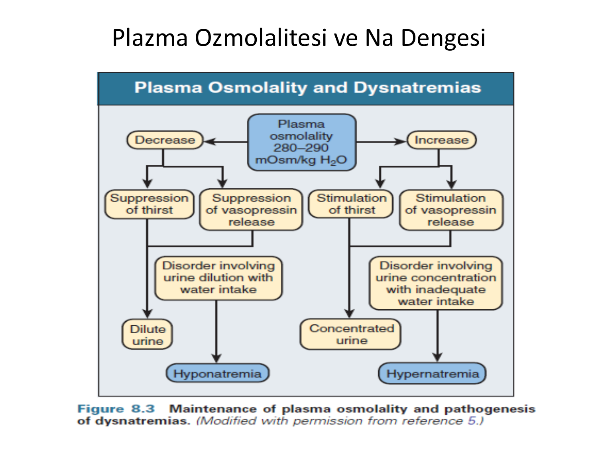

> **Şema yorumu:** Plazma ozmolalitesindeki %1-2'lik artış hipotalamik osmoreseptörleri uyarır; ADH salınımı artar ve böbrekten su geri emilimi sağlanır. Aynı zamanda susuzluk merkezi aktive edilerek su alımı artar. Bu iki mekanizma birlikte plazma ozmolalitesini dar bir aralıkta tutar.

---

## SODYUM

> **Tanım:** **Hücre dışı sıvının temel katyonu**; ekstraselüler ozmolaliteyi ve volümü belirler.

### Temel Değerler

| Parametre | Değer |
|---|---|
| **Plazma Na** | **135-145 mEq/L** |
| Toplam vücut Na | 60 mEq/kg |
| HDS temel katyon | Na⁺ |

### Plazma Na Konsantrasyonunu Belirleyen Faktörler

**Formül türevi:**
* Plazma ozmolalitesi = 2 × PNa
* Plazma ozmolalitesi = Toplam vücut solütleri / Toplam vücut suyu (TVS)
* Plazma ozmolalitesi = [(2 × Na) + (2 × K)] / TVS
* **PNa = (Na + K) / TVS**

> **Klinik sonuç:** Plazma Na konsantrasyonu total Na, K ve TVS'nin oranına bağlıdır. Hiponatremi genellikle **su metabolizması bozukluğudur**, total vücut Na'sı artmış veya normal olabilir.

---

## HİPONATREMİ

> **Tanım:** Plazma Na < 135 mEq/L. **Su metabolizması bozukluğudur**; total vücut Na genellikle artmış veya normaldir. Na ile volüm arasındaki denge bozulmuştur.

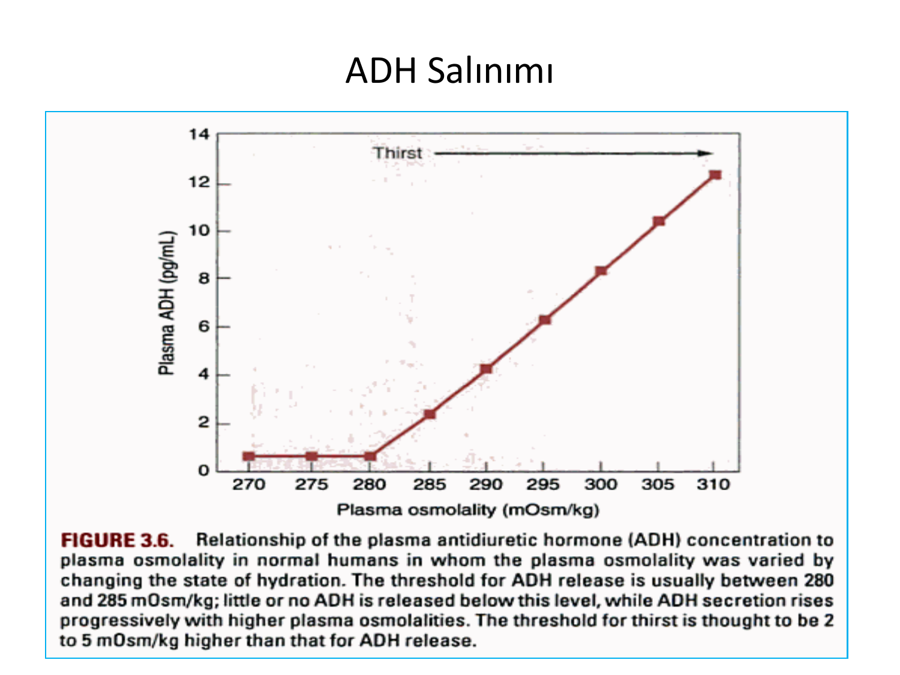

> **Şema yorumu:** Hiponatremi beyin hücrelerine su girişine ve beyin ödemine yol açar. Kronik hiponatremide beyin adaptasyonu gelişir; **hızlı düzeltme osmotik demiyelinizasyon (santral pontin miyelinoliz)** riskine yol açar. Bu nedenle düzeltme hızı dikkatle sınırlanmalıdır.

### Düzeltme Hızı (Kritik!)

| Parametre | Sınır |
|---|---|
| **Saatlik** | **0.5-1 mEq/L** (semptomatikte 1-2 mEq/L) |
| **24 saatte** | **6-8 mEq/L'yi geçmemeli** (UpToDate önerisi: **4-6 mEq/L/24 saat**) |
| **Akut semptomatik tanım** | 48 saat içinde gelişen |
| **Güvenli düzey** | Na >125 mEq/L |
| **Takip sıklığı** | **2-3 saatte bir Na** |

> **⚠️ ÖNEMLİ:** Hızlı düzeltme **santral pontin miyelinoliz**'e yol açabilir; nörolojik sekel (quadriparezi, disfaji, dizartri) kalıcıdır. Hedef daima yavaş, kontrollü düzeltmedir.

### Volüm Durumuna Göre Sınıflama

| Tip | Özellik | Örnek |
|---|---|---|
| **Hipovolemik** | Toplam vücut su ↓, Na ↓↓ | Diüretik, GI kayıp, 3. boşluk, mineralokortikoid eksikliği, serebral tuz kaybı |
| **Övolemik** | Toplam su ↑, Na ≈normal | **SIADH**, hipotiroidi, glukokortikoid eksikliği, ilaç (SSRI, TZD, antiepileptik) |
| **Hipervolemik** | Toplam su ↑↑, Na ↑ | KKY, siroz, nefrotik sendrom, KBH |
| **Psödohiponatremi** | Ölçüm artefaktı | Hiperlipidemi, hiperprotein |
| **Translokasyonel** | Hiperozmolar | Hiperglisemi, mannitol (her 100 mg/dL glukoz ↑ → Na 1.6-2.4 ↓) |

### Tedavi Prensibi

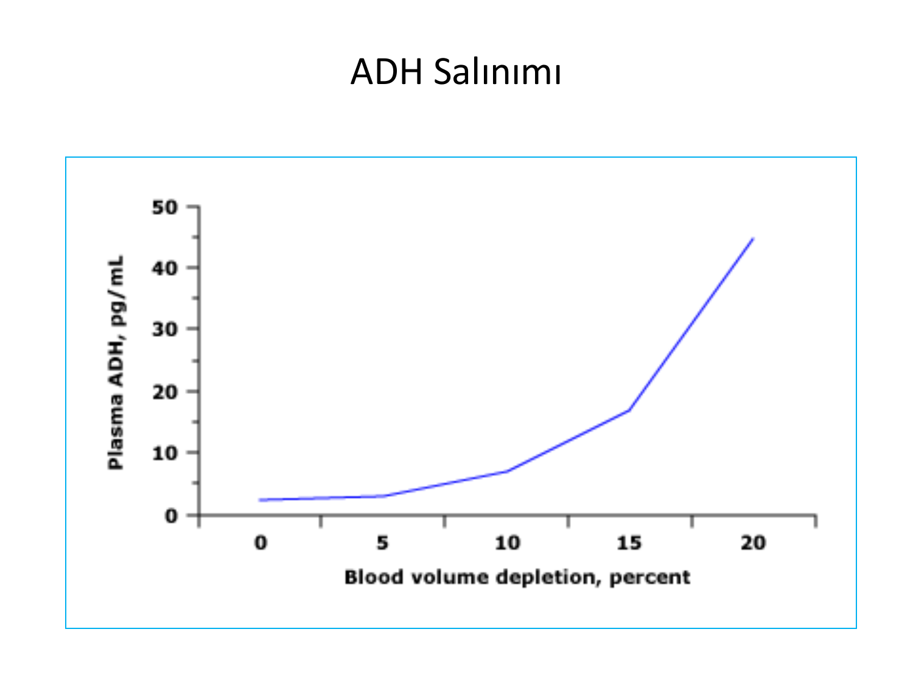

> **Şema yorumu:** Hiponatremi yönetiminde volüm durumu (hipo/öv/hipervolemik) belirleyicidir. Hipovolemikte SF ile Na yerine konulurken, hiper/övolemikte serbest su atılımı (kısıtlama, furosemid) sağlanır.

### Hipervolemik ve Övolemik Hiponatremi

**Amaç:** Serbest su atılımının sağlanması → **TVS ↓**

| Yaklaşım | Detay |
|---|---|
| **Su kısıtlaması** | 800 mL/gün |
| **Furosemid** | Serbest su atılımı; hipotonik idrar oluşturur |
| **Hipertonik Na solüsyonu** | Semptomatik akut hiponatremi (%3 NaCl 100-150 mL bolus) |
| **ADH reseptör antagonistleri (vaptanlar)** | Tolvaptan, konivaptan, stavaptan, lixivaptan -- toplayıcı tübül V2 reseptörlerini bloke eder ("akuaretik") |

> **İzlem için gerekli:** (1) İdrar Na, (2) İdrar ozmolalitesi.

### Hipovolemik Hiponatremi

**Amaç:** Na açığının yerine konması.

* **İlk seçenek: Serum fizyolojik (%0.9 NaCl)**
* Sıvı açığı kapatılınca ADH salınımı baskılanır
* Furosemid **kontrendike** (hacmi daha da azaltır)

### Akut Semptomatik Hiponatremi

* **Hedef saatte 1-2 mEq/L yükseltme**
* %3 hipertonik salin 100-150 mL IV bolus (gerekirse tekrarla)
* Konvülsiyon, koma, bilinç değişikliği: hipertonik salin öncelikli

### Kronik Hiponatremi

* Hedef: **24 saatte 8 mEq/L'yi geçmemeli**
* Etyolojiye yönelik tedavi (SIADH için sıvı kısıtlama vb.)

---

## HİPERNATREMİ

> **Tanım:** Plazma Na >150 mEq/L. **Nadir**. Sodyuma oranla suyun daha fazla kaybı ile ortaya çıkar. **Hiperozmolar** bir durumdur.

### Özellikler

* Susuzluk hissi normalde hipernatremiyi önler
* Genellikle **suya ulaşamayan kişilerde** görülür (bilinç kapalı hasta, bebek, yaşlı)
* Renal veya ekstrarenal su kaybı

### Nedenler

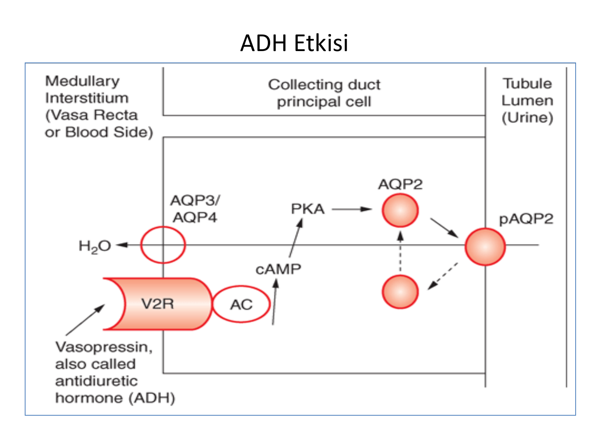

> **Şema yorumu:** Hipernatreminin ana nedenleri su kaybı (diabetes insipidus, ishal, ter, solunum), su alımında azalma (susuzluk merkezi bozukluğu, bilinç kaybı) ve daha nadiren Na yüklemesidir (hipertonik sıvı, iyatrojenik).

* **Renal su kaybı:** Santral DI, nefrojenik DI, ozmotik diürez (glukozüri, mannitol)
* **Ekstrarenal su kaybı:** İshal (ozmotik), kusma, terleme, solunumsal
* **Azalmış su alımı:** Yaşlı, nörolojik bozuklukta susuzluk algılaması
* **Na yükleme:** Hipertonik NaCl IV, deniz suyu yutma, hipertonik NaHCO₃

### Sıvı Açığı Hesabı

**Formül:** `Serum Na × Vücut ağırlığı × 0.6 = Hedef Na × Hedef TVS`

**Örnek:** 70 kg hasta, Na 160 mEq/L, hedef Na 140:
* Mevcut TVS = 70 × 0.6 = 42 L
* 160 × 70 × 0.6 = 140 × Hedef TVS
* **Hedef TVS = 48 L**
* **Sıvı açığı = 48 - 42 = 6 L**

### Tedavi -- Dikkat Edilmesi Gerekenler

| Kural | Detay |
|---|---|
| **Stabil, semptomsuz hastada** | Oral veya NG tüp ile su (etkili ve emniyetli) |
| **Hedef düzeltme hızı** | **10 mEq/24 saat** (beyin ödemi riski için daha hızlı değil) |
| **Sıra** | Önce SF ile sıvı açığı, sonra %0.45 NaCl |
| **%5 Dextroz** | **Verilmez** -- hızlı Na düşüşü yapar |
| **Takip** | Başlangıçta 6 saatte bir, sonra 8-12 saatte bir |

---

## POTASYUM

> **Tanım:** İntraselüler sıvının **en önemli katyonu** (%90'ı hücre içinde). Plazma değeri **3.5-5.5 mEq/L**.

### Temel Değerler

| Parametre | Değer |
|---|---|
| **Plazma K** | 3.5-5.5 mEq/L |
| **Atılım** | %85-90 idrar, %10-15 gaita |
| **Günlük filtrat** | 810 mEq K |
| **Atılım yeri** | Kortikal toplayıcı tübül ve dış medüller toplayıcı tübüldeki **esas hücreler** |

### Vücuttaki K Dağılımı (70 kg hasta)

| Kompartman | Sıvı | K | Toplam K |
|---|---|---|---|
| Hücre içi | 28 L | 155 mEq/L | **4340 mEq** |
| Hücre dışı | 14 L | 4 mEq/L | 56 mEq |
| -- İnterstisyel | 11.5 L | 4 mEq/L | -- |
| -- Plazma | 3.5 L | 4 mEq/L | 14 mEq |
| **Toplam** | 42 L | -- | **4396 mEq** |

> **Klinik önem:** K'un %99'u hücre içinde olduğundan **küçük intrasellüler-ekstrasellüler shift** bile plazma K'unu dramatik değiştirir. Verilen K'lı sıvı öncelikle arteriyel ve venöz sistemde dağılır.

---

## HİPOKALEMİ

> **Tanım:** Plazma K <3.5 mEq/L. **Kardiyak disritmilere zemin hazırlar, ani ölüme neden olabilir.** Hastaların çoğu K <3 mEq/L'nin altına düşene kadar asemptomatiktir.

### Nedenler

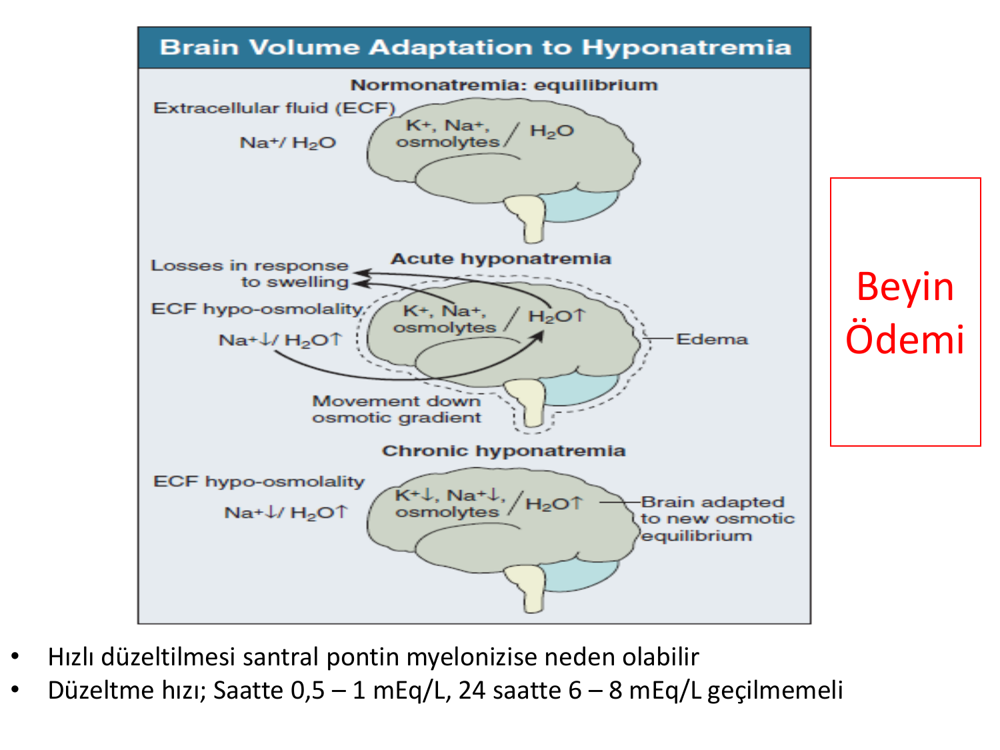

> **Şema yorumu:** Hipokalemi EKG'de T dalgasında düzleşme, U dalgası oluşumu, ST depresyonu ve QT uzaması ile gider. Kas güçsüzlüğü, kramp, konstipasyon ve aritmiler klinik bulgulardır.

| Mekanizma | Klinik Durum |
|---|---|
| **1. Emilim yetersizliği** | Yetersiz alım, malabsorbsiyon, diyare, lavman |
| **2. Yer değiştirme (shift)** | Alkaloz, insülin, **β-agonist**, hipotermi |
| **3. Böbrekten kayıp** | **Hiperaldosteronizm, diüretik (loop/tiyazid)**, kusma, tübüler bozukluklar (Bartter, Gitelman, RTA) |

### Klinik Bulgular

* **Kas güçsüzlüğü, kramp, paralizi**
* **Aritmi** (PVC, VT, VF)
* **EKG:** U dalgası, T düzleşme, ST depresyonu, QT uzaması
* Konstipasyon (ileus)
* Poliüri (renal konsantrasyon defekti)
* Rabdomiyoliz (ağır)
* Metabolik alkaloz

### Tedavi -- Temel İlke: K Eksikliğini Tamamlamak

**Acil endikasyon olmadıkça replasman ORAL yapılmalıdır.**

> **⚠️ ÖLÜMCÜL UYARI:** **Potasyumun direkt IV verilmesinin hastanın ölümüne yol açabileceği asla akıldan çıkarılmamalıdır** -- konsantrasyon ve hız kesinlikle sınırlanmalıdır.

### Doz Hesaplaması

| Plazma K Düşüşü | Toplam K Eksikliği |
|---|---|
| **1 mEq/L ↓** | **200-400 mEq** toplam eksiklik |
| **<3 mEq/L** | **~600 mEq eksiklik** |

### K Preparatları

| Preparat | K İçeriği |
|---|---|
| KCl %7.5 (1 amp) | **10 mEq** |
| KCl %22.5 (1 amp) | **30 mEq** |
| Kalinor (efervesan) | **40 mEq** |

### IV Replasman Kuralları

| Parametre | Maks Değer |
|---|---|
| **Periferik ven konsantrasyonu** | **40 mEq/L** |
| **Santral ven konsantrasyonu** | **60 mEq/L** |
| **Verilen hız** | **Saatte 20 mEq/L'yi geçmemeli** |
| **Günlük toplam** | **160-200 mEq'dan fazla değil** |

* Periferik venden yüksek konsantrasyon: **tromboflebit** riski
* **Magnezyum replasmanı** şart (refrakter hipokalemi için)
* Mg eksik ise K replasmanı etkisiz kalır

---

## HİPERKALEMİ

> **Tanım:** Plazma K >5.5 mEq/L. **Hayatı tehdit edici boyutlara ulaşabilir**; kardiyak ölüm görülebilir.

> **Fizyoloji inci:** **Hiperkalemi kalbi diyastolde durdurur**, hiperkalsemi sistolde durdurur. Bu nedenle tedavi hızı ve ciddiyeti çok yüksektir.

### Şiddet Sınıflaması

| Şiddet | Serum K (mmol/L) |
|---|---|
| **Hafif** | **5.5-5.9** |
| **Orta** | **6.0-6.4** |
| **Şiddetli** | **≥6.5** |

### Nedenler

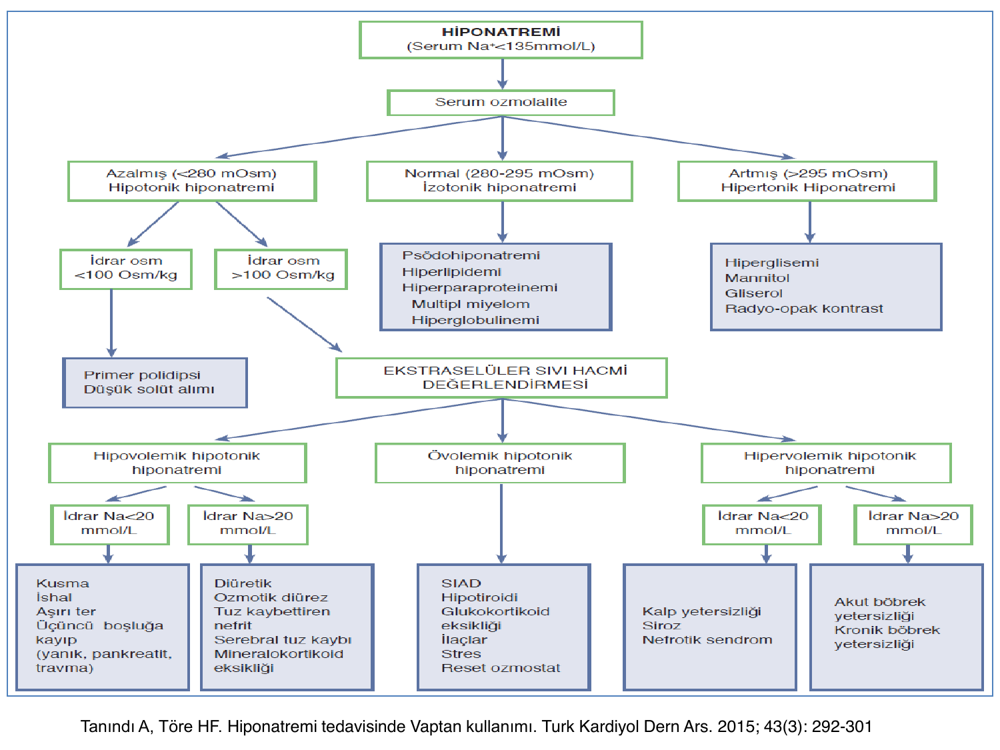

> **EKG yorumu:** Hiperkalemide **sivri T dalgaları** ilk bulgudur. İlerledikçe PR uzaması, P dalgasının düzleşmesi ve kaybolması, QRS genişlemesi ve nihayet **"sinüs dalgası" (sine wave)** paterni ve ventriküler fibrilasyon gelişir.

**1. Artmış potasyum alımı:**
* Akut fazla oral/IV alım

**2. Hücre içine girişinde azalma / hücreden salınımda artma:**
* A. **Metabolik asidoz**
* B. **İnsülin yetersizliği, hiperglisemi**
* C. β-adrenerjik blokaj
* D. **Crush sendromu, tümör lizis sendromu, intravasküler hemoliz**

**3. İdrarda potasyum atılımının azalması:**
* A. Su ve sodyumun distal tübüle ulaşımında azalma (**böbrek yetmezliği, kalp yetmezliği, siroz**)
* B. **Hipoaldosteronizm** (adrenal yetmezlik, Tip IV RTA)

### Acil Medikal Tedavi Endikasyonu

* **K >6-6.5 mEq/L**
* **EKG değişikliği + hiperkalemi**

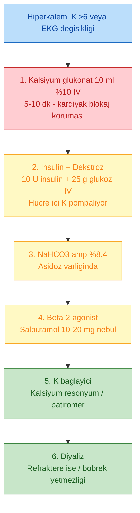

### Detaylı Tedavi

**1. Kalsiyum Glukonat (kardiyak membran stabilizasyonu):**

| Parametre | Detay |
|---|---|
| **Uygulama** | 10 mL %10 kalsiyum glukonat IV **5-10 dk** (veya 10 mL %10 Ca klorür IV) |
| **Etki başlangıç** | **3 dakika** |
| **Etki süresi** | **30-60 dakika** |
| Monitörizasyon | EKG şart |
| Tekrar | Hiperkalemik değişiklikler devam ederse 5-10 dakika sonra tekrarlanabilir |
| Uyarılar | **NaHCO₃ ile beraber uygulanmaz** (çöker); ekstravazasyonda doku nekrozu |

**2. İnsülin + Dextroz (hücre içine kaydırma):**

| Parametre | Detay |
|---|---|
| **Uygulama** | 10 Ü kristalize insülin + 25 g glukoz (125 mL %20 dextroz + 10 Ü insülin, **30 dk IV inf**) |
| **Etki başlangıç** | **15-30 dk** |
| **Etki süresi** | **4-6 saat** |
| Uyarı | **Hatalı insülin ölçümü ölümcül olabilir (hipoglisemi)** |
| Takip | 6 saat boyunca kan şekeri izlemi şart |

**3. Salbutamol (β₂-agonist):**

| Parametre | Detay |
|---|---|
| **Uygulama** | **10-20 mg nebülize** salbutamol (yüz maskesi ile) |
| **Etki başlangıç** | 15-30 dk |
| **Etki süresi** | 4-6 saat |
| İskemik kalp hast. | 10 mg ver, taşikardiye uyanık ol |
| Yan etki | Tremor, taşikardi |
| Uyarı | **%40 hastada K düşürmez, tekli tedavi olarak kullanma** |

**4. Kalsiyum Rezonyum (Polistren Sülfonat):**

| Parametre | Detay |
|---|---|
| **Oral** | 15 g × 3-4/gün |
| **Rektal** | 30 g + 150 mL su, lavman en az 9 saat bekletilmeli |
| **Etki başlangıç** | Yavaş, 4 saatten uzun |
| Acil tedavide önerilmez | Etki yavaş |
| Kontrendikasyon | **İleus**, bağırsak hastalığında dikkat |

**Yeni K bağlayıcılar:**
* **Patiromer** (non-polimer)
* **Sodium zirkonyum siklosilikat (Lokelma)** -- daha hızlı etkili

**5. Hemodiyaliz:**
* **Medikal tedaviye yanıt yoksa**
* Böbrek yetmezliği + hiperkalemi
* En hızlı ve kesin yöntem

---

## KALSİYUM DENGESİ

### Temel Kavramlar

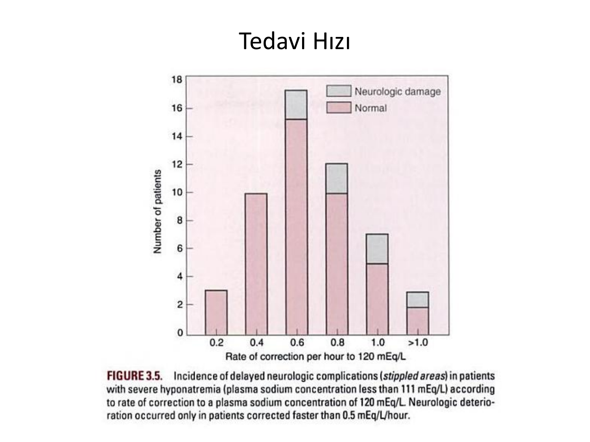

> **Şema yorumu:** Kalsiyum dengesi PTH, **1,25(OH)₂ D** ve kalsitonin tarafından düzenlenir. Hedef organlar: kemik (rezorpsiyon/birikim), böbrek (geri emilim), bağırsak (emilim).

### Önemli Formüller

| Formül |
|---|
| **İyonize Ca (mg/dL) = Total serum Ca - (0.8 × serum albumin)** |
| **Düzeltilmiş Ca (mg/dL) = Total serum Ca + 0.8 × (4 - serum albumin)** |

### Asit-Baz Etkisi

* **Asidozda iyonize kalsiyum artar**
* **Alkalozda iyonize kalsiyum azalır** (tetaniden sorumlu)

### Albümin Etkisi

* Albümindeki **1 g/dL düşüklük için serum Ca 0.8 mg/dL düşük** ölçülür
* Hipoalbüminemide düzeltilmiş Ca kullan

---

## HİPOKALSEMİ

> **Tanım:** Gerçek hipokalsemi **iyonize kalsiyum düzeyi düştüğünde** görülür. Referans aralığı: **4.2-5 mg/dL**. Hemodiyaliz hastalarında sık.

### Nedenler

| Neden | Örnek |
|---|---|
| **Hipoparatiroidi** | Edinsel (cerrahi), konjenital (**DiGeorge**), otoimmün (**polyglandüler tip 1 -- hipoparatiroidi + kronik mukokutanöz kandidiazis + primer adrenal yetmezlik**) |
| **Paratiroidektomi sonrası "aç kemik sendromu"** | Özellikle PHPT cerrahisi sonrası |
| **Hipomagnezemi** | Mg eksikliği PTH salınımını bozar |
| **D vit metabolik defektler** | Nutrisyonel, malabsorbsiyon, KC hastalığı, böbrek yetmezliği |
| **Tümör lizis sendromu** | Hiperfosfatemi-sekonder |
| **Rabdomiyoliz** | Kas içinde Ca çöker |
| **Akut pankreatit** | Yağ sabunlaşması ile |
| **Sepsis** | Multifaktöriyel |

### Klinik

* **Parestezi** (perioral, akral), karpopedal spazm
* **Chvostek belirtisi** (fasial sinir üzerine vurma → yüz kasları seğirmesi)
* **Trousseau belirtisi** (kan basıncı manşeti 3 dk şişirme → karpopedal spazm)
* **Tetani**, laringospazm, konvülsiyon
* Subkapsüler katarakt, bazal ganglion kalsifikasyonu (kronik)
* EKG: **QT uzaması**, aritmi

### Tedavi

**Akut Semptomatik:**

| Parametre | Detay |
|---|---|
| **Ca glukonat %10** | 10-20 mL (93-186 mg elementer Ca) IV **10 dk** |
| **İdame IV infüzyon** | Ca glukonat %10 58-77 mL + %5 Dx **2 mg/kg/saat** |
| **Hedef serum Ca** | **7-9 mg/dL** |
| **Takip** | 4-6 saatte bir |

**Kronik:**
* Oral kalsiyum tuzları
* **D vitamini replasmanı** (kolekalsiferol, kalsitriol, alfakalsidol)
* **Mg düzelt** (refrakter hipokalsemi için şart)

**Özel durumlar:**
* Diyaliz hastalarında: **3-3.5 mEq/L Ca içeren diyaliz solüsyonu** gerekebilir

### Akut Protokol (PDF'e göre)

* %10 Ca glukonat 10-20 mL IV, 10 dk
* 4-6 saatte 15 mg/kg Ca infüzyonu
* Ardından 0.5-1 mg/kg/saat idame
* Ca glukonat %10 10 mL amp **94 mg elementer kalsiyum** içerir

---

## HİPERKALSEMİ

> **Tanım:** Serum Ca >11 mg/dL. Genellikle Ca veya D vit tedavisine bağlı iyatrojenik; hemodiyaliz hastalarında sık.

### En Sık Nedenler (%90)

* **Primer hiperparatiroidi**
* **Maligniteye bağlı**

> **Hastanede yatan hastalarda hiperkalseminin en sık nedeni malignitedir.**

### Hiperparatiroidi Alt Grupları

| Neden | Sıklık |
|---|---|
| **Paratiroid adenom** | **%90** |
| Paratiroid hiperplazisi | %10 |
| Paratiroid karsinom | %1 |

**Familyal sendromlar:**
* **MEN Tip 1:** Hipofiz adenom + pankreas adacık hücre tümörü + **paratiroid adenom**
* **MEN Tip 2:** **Tiroid medüller karsinom** + **feokromositoma** + paratiroid adenom

### Detaylı Etyoloji

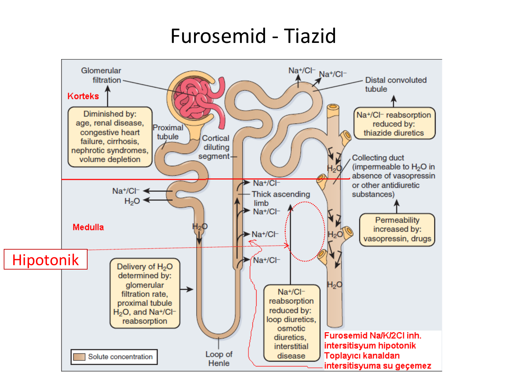

> **Şema yorumu:** Hiperkalsemi ayırıcı tanısında PTH düzeyi anahtardır. **PTH yüksek/uygunsuz normal** → primer/sekonder/tersiyer hiperparatiroidi, FHH. **PTH baskılı** → malignite, D vit, granülomatöz, ilaç ilişkili.

**I. Paratiroid ile ilişkili:**
* A. Primer hiperparatiroidizm (soliter adenom, MEN)
* B. Lityum tedavisi
* C. Ailevi hipokalsiürik hiperkalsemi (FHH -- CaSR mutasyonu)

**II. Malignite ile ilişkili:**
* A. Humoral (PTHrP salgılayan solid tümör -- akciğer skuamöz, böbrek)
* B. Metastatik solid tümör (meme)
* C. Hematolojik (**multipl myelom**, lösemi, lenfoma)

**III. D vitamini ile ilişkili:**
* A. D vit intoksikasyonu
* B. 1,25(OH)₂D aşırı üretim: **sarkoidoz ve diğer granülomatöz hastalıklar**

**IV. Artmış kemik döngüsü:**
* A. Hipertiroidizm
* B. İmmobilizasyon
* C. **Tiyazidler** (Ca retansiyonu)
* D. Vitamin A intoksikasyonu

**V. Böbrek yetmezliği:**
* A. Ağır sekonder hiperparatiroidizm
* B. Alüminyum intoksikasyonu
* C. Süt-alkali sendromu

### Klinik Bulgular

* **"Stones (taşlar), bones (kemik ağrısı), abdominal groans (karın ağrıları), psychic moans (psikiyatrik bulgular)"**
* Poliüri, polidipsi (nefrojenik DI paterni)
* Konstipasyon, iştahsızlık, bulantı-kusma
* Konfüzyon, letarji, koma
* **EKG: QT kısalması**
* Pankreatit (Ca >12)
* Nefrolityazis, nefrokalsinozis

### Akut Tedavi

| İlaç | Doz |
|---|---|
| **Normal saline** | 2-4 L/gün başlangıç (agresif hidrasyon) |
| **Furosemid** | 20-160 mg IV her 8 saatte, **volüm ekspansiyonu sonrası** |
| **Kalsitonin (salmon)** | **4 IU/kg SC her 12 saatte** |
| **Etidronat disodyum** | 7.5 mg/kg IV >4 saat/gün × 3-7 gün; veya 30 mg/kg >24 saat tek doz |
| **Pamidronat** | **60-90 mg IV >4 saat** |
| **Zoledronik asit** | 4 mg IV 15 dk (en potent) |
| **Plikamisin** | 25 μg/kg IV >4 saat/gün × 3-4 gün |
| **Kortikosteroidler** | 200-300 mg hidrokortizon IV/gün × 3-5 gün (D vit, malignite) |
| **Galyum nitrat** | 100-200 mg/m² × 5 gün |
| **Denosumab** | 120 mg SC (bifosfonat yanıtsız) |
| **Hemodiyaliz** | Refrakter, böbrek yetmezliğinde |

### Tedavi Seçeneklerinin Karşılaştırması

| Tedavi | Etki Başlangıç | Etki Süresi | Avantaj | Dezavantaj |
|---|---|---|---|---|
| **Salin (6 L/gün)** | Saatler | İnfüzyon süresince | Rehidrate, hızlı | Hacim yüklenmesi, elektrolit bozukluğu |
| **Zorlu diürez** (salin + furosemid 4-12 saatte) | Saatler | Tedavi boyunca | Hızlı | Dehidratasyon için monitörizasyon |
| **Bifosfonat** (pamidronat 30-90 mg IV 4 saat; zoledronat 4 mg 0.5 saat) | 1-2 gün | **10-14 gün** | Yüksek etkinlik, uzun etki | %20 ateş, hipofosfatemi, hipokalsemi, hipomagnezemi |
| **Kalsitonin** (2-8 Ü/kg IV/IM/SC 6-12 saatte) | Saatler | 2-3 gün | Hızlı | Sınırlı etki, **taşiflaksi** |
| **Glukokortikoidler** (prednizon 10-25 mg PO 4×/gün) | Günler | Günler-haftalar | **Myelom, lenfoma, meme Ca, sarkoidoz, vit D intoks** | Steroid yan etkileri |
| **Hemodiyaliz** | Saatler | Kullanım süresince + 2 gün | **Böbrek yetmezliğinde faydalı**, hemen etki | Zor işlem |

### Diyaliz Hastasında Hiperkalsemi

* Ca ve D vit preparatları geçici kesilir
* **Diyaliz solüsyonu Ca içeriği 2-2.5 mEq/L'ye düşürülür**
* Ca tuzu ve D vit daha emniyetli sürdürülür

---

## FOSFOR DENGESİ

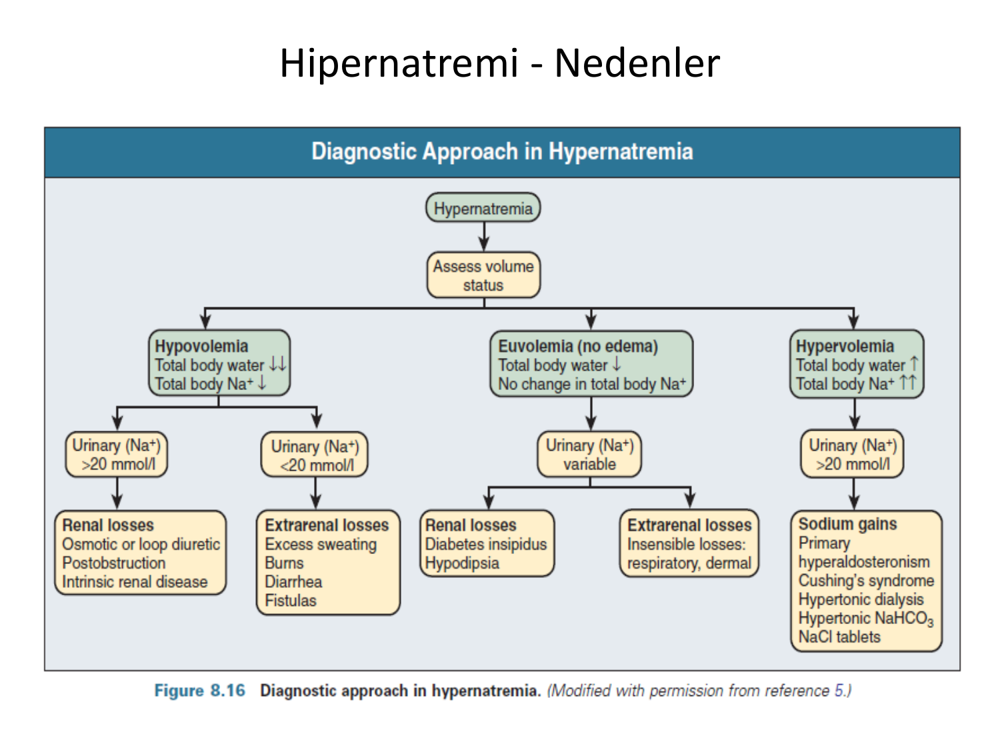

> **Şema yorumu:** Fosfor dengesi emilim (bağırsak, D vit bağımlı), dağılım (intra/ekstraselüler) ve atılım (böbrek, PTH-bağımlı) ile düzenlenir.

---

## HİPOFOSFATEMİ VE HİPERFOSFATEMİ

### Hiperfosfatemi

> **Tanım:** **Erişkinde >5 mg/dL, çocukta >7 mg/dL**.

**3 patofizyolojik mekanizma:**

| Mekanizma | Örnekler |
|---|---|
| **1. Aşırı fosfat alımı** (GFR normalde nadir) | Artmış alım + bozulmuş renal atılım; **vit D intoksikasyonu, fosfat içeren lavman, laksatif** |
| **2. Azalmış atılım (böbrek yetmezliği)** | **Hiperfosfateminin %90'ından sorumlu**; GFR <30 mL/dk |
| **3. İntrasellüler → ekstrasellüler geçiş** | **Rabdomiyoliz, tümör lizis sendromu** |

### Hiperfosfatemi Tedavisi

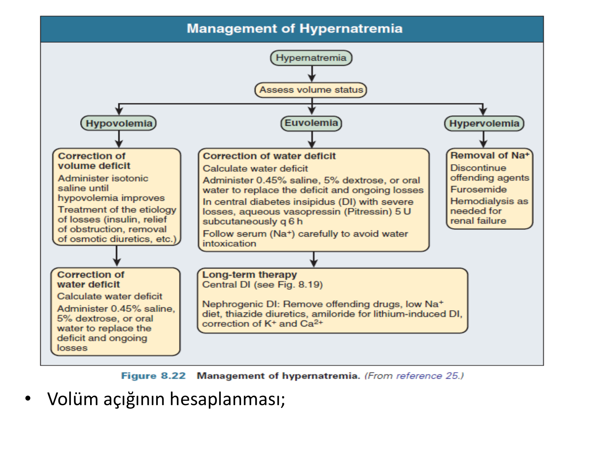

> **Şema yorumu:** Kronik hiperfosfatemi tedavisinin temeli diyet kısıtlaması ve fosfor bağlayıcılardır. Ca bazlı bağlayıcılar vasküler kalsifikasyon riski nedeniyle yerini sevelamer/lantanum gibi Ca-içermeyen ajanlara bırakmıştır.

**Yaklaşımlar:**

1. **Diyette fosfor alımının azaltılması**
2. **Bağırsaktan fosfor emiliminin azaltılması (fosfor bağlayıcı ilaçlar):**
   * **Ca asetat**
   * **Ca karbonat**
   * Magnezyum hidroksit
   * Alüminyum hidroksit (eskiden; kemik toksisitesi)
   * **Sevelamer** (Ca-içermez)
   * **Lantanum karbonat**
   * **Demir bazlı** (sükroferrik oksihidroksid, ferrik sitrat)

### Hipofosfatemi

> **Tanım:** <2.5 mg/dL.

| Şiddet | Değer |
|---|---|
| **Hafif** | 2-2.5 mg/dL |
| **Orta** | 1-2 mg/dL |
| **Ciddi** | <1 mg/dL |

### Hipofosfatemi Nedenleri

| Mekanizma | Örnekler |
|---|---|
| **İntestinal emilim azalması** | **Diyare, fosfat bağlayıcı, malnütrisyon, alkolizm** |
| **Renal atılım artması** | **Primer hiperparatiroidi, Fanconi sendromu, ozmotik diürez, D vit eksikliği** |
| **Ekstrasellüler → intrasellüler geçiş** | **Respiratuar alkaloz, aç-kemik sendromu, refeeding sendromu, DKA tedavisi, insulin** |

### Hipofosfatemi Klinik

* Kas güçsüzlüğü (diyafram -- solunum yetmezliği)
* **Rabdomiyoliz**
* **Hemoliz**
* Aritmi
* Kemik ağrıları (osteomalasi)
* Parestezi
* Konvülsiyon (<1 mg/dL)

### Hipofosfatemi Tedavisi

* Ciddi eksiklik veya semptomatik olgularda
* **En güvenilir yol oral**
* 1000 mg fosfor desteği genellikle yeterli
* **Fleet Fosfo-Soda:** 5 mL/gün × 2-3 gün (149 mg fosfat/mL)
* Şiddetli (<1 mg/dL, semptomatik): IV K-fosfat veya Na-fosfat (0.08-0.16 mmol/kg 6 saat)

---

## MAGNEZYUM

> **Ek bilgi (PDF'de ayrı bölüm yok ama klinik önemi fazla):**

### Temel Değerler

* Normal plazma Mg: **1.8-2.4 mg/dL** (0.7-1.1 mmol/L)
* Vücuttaki 2. en fazla intrasellüler katyon (K'dan sonra)

### Hipomagnezemi

**Nedenler:**
* GI kayıp (diyare, PPI)
* Renal kayıp (loop diüretik, alkol, tiyazid, sisplatin, aminoglikozid, amfoterisin, sitokin)
* Refeeding sendromu, alkolizm
* Gitelman/Bartter sendromları

**Klinik:**
* **Tetani, konvülsiyon** (hipokalsemi paterni)
* **Aritmi** (torsades de pointes)
* **Refrakter hipokalemi ve hipokalsemi** (Mg düzeltilmeden K ve Ca düzeltilemez)

**Tedavi:**
* **Oral:** Mg oksit 400-800 mg/gün (ishal yapar)
* **IV:** MgSO₄ 1-2 g IV 5-10 dk (acil); kronik eksiklikte 4-8 g/gün IV infüzyon

### Hipermagnezemi

**Nedenler:**
* **Böbrek yetmezliği** (en sık)
* Mg içeren laksatif/antasit
* **Gebelikte preeklampsi tedavisi** (MgSO₄ intoksikasyonu)

**Klinik:**
* Hiporefleksi, kas güçsüzlüğü, solunum yetmezliği
* Bradiaritmi, hipotansiyon, kardiyak arrest

**Tedavi:**
* **Ca glukonat IV** (kardiyak membran stabilizasyonu)
* Loop diüretik + salin
* **Hemodiyaliz** (böbrek yetmezliğinde)

---

## KLİNİK VAKA ÖRNEKLERİ

**📋 VAKA ÖRNEĞİ 1: Akut Hiperkalemi -- Acil Yönetim**

**Hasta:** 68 yaşında erkek, KBH evre 4 + DM Tip 2. ACE inhibitörü ve spironolakton alıyor. Halsizlik, çarpıntı ile acile başvurdu.

**Lab:** K 7.8 mEq/L, Kreatinin 4.5, pH 7.28 (metabolik asidoz).

**EKG:** Sivri T dalgaları, QRS 140 msn (genişlemiş), PR 240 msn.

**Tedavi (sıralı):**
1. **Ca glukonat %10 10 mL IV 5 dk** (kardiyak membran koruması) -- 5 dk sonra EKG normalleşmeye başladı
2. **İnsülin 10 Ü + %20 dextroz 125 mL IV 30 dk** (K intrasellüler kaydırma)
3. **NaHCO₃ 50 mEq IV** (asidoz düzeltme)
4. **Salbutamol 10 mg nebül**
5. **ACE inh ve spironolakton kesildi**
6. K 30 dk sonra 6.2'ye düştü; 1 saat sonra 5.4. Acil hemodiyaliz gereksiz.

**Öğretici Not:** EKG değişikliği + K >6 mEq/L'de **ilk adım Ca glukonat**'tır. İnsülin/salbutamol K'u hücre içine kaydırır ama vücuttan uzaklaştırmaz; kesin tedavi diyaliz veya K bağlayıcı.

**📋 VAKA ÖRNEĞİ 2: SIADH'a Bağlı Hiponatremi**

**Hasta:** 70 yaşında kadın, SCLC tedavisi görüyor. Konfüzyon ve halsizlik.

**Lab:** Na 118 mEq/L, plazma ozm 250, idrar ozm 450, idrar Na 65 mEq/L. TSH, kortizol normal. Kreatinin normal, övolemik.

**Tanı:** **SIADH** (Schwartz-Bartter kriterleri karşılıyor).

**Tedavi:**
* Na 118 + konfüzyon (semptomatik) → **%3 hipertonik salin 100 mL IV 10 dk** (hızlı 2 mEq/L yükseltme)
* 4 saat sonra Na 122, konfüzyon düzeldi → hipertonik salin kesildi
* **Sıvı kısıtlaması 800 mL/gün**
* **Tolvaptan 15 mg/gün PO** (V2 reseptör antagonisti, akuaretik)
* **Hedef: 24 saatte 6-8 mEq/L'yi geçmemek** (osmotik demiyelinizasyon önlemi)

**Öğretici Not:** Na düzeltme hızı **saatte 0.5-1 mEq/L, günde 8 mEq/L'yi geçmemeli**. Semptomatik akut hiponatremi hipertonik salinle saatte 1-2 mEq/L yükseltme istisnası.

**📋 VAKA ÖRNEĞİ 3: Malign Hiperkalsemi -- Meme Ca Metastazı**

**Hasta:** 58 yaşında kadın, meme Ca kemik metastazı; halsizlik, bulantı, poliüri, letarji.

**Lab:** Ca 14.5 mg/dL (düzeltilmiş), albümin 3.2, kreatinin 1.4, PTH **baskılı** (0.8 pg/mL), PTHrP **yüksek**.

**Tanı:** **Malign hiperkalsemi (humoral -- PTHrP mekanizması)**.

**Tedavi:**
1. **IV SF 300 mL/saat × 8 saat** → 150 mL/saat idame
2. 4. saat sonrası volum durumu OK → **Furosemid 40 mg IV** başlandı
3. **Zoledronat 4 mg IV 15 dk** (2. gün: Ca 12, 3. gün: Ca 10)
4. **Kalsitonin 4 IU/kg SC 12 saatte bir × 48 saat** (ilk 48 saat köprü; sonra taşiflaksi)
5. Ca 10.5'e indikten sonra kalsitonin kesildi

**Öğretici Not:** Hiperkalsemide **hidrasyon + bifosfonat** temel kombinasyon. Kalsitonin hızlı ama taşiflaksili. PTH baskılı ise PTHrP ve D vit metaboliti ölçülmeli.

---

**Kaynak:** Prof. Dr. Hakan Akdam ders notu, ADÜ Tıp Fakültesi Nefroloji Bilim Dalı. Ek referans: KDIGO CKD-MBD kılavuzu, Renal Association Clinical Practice Guidelines -- Treatment of Acute Hyperkalaemia (Temmuz 2020), Tanındı A, Töre HF. Hiponatremi tedavisinde Vaptan kullanımı. Turk Kardiyol Dern Ars 2015; 43(3): 292-301.
