# EZİLME SENDROMU VE BÖBREK YETMEZLİĞİ

**Hazırlayan:** Prof. Dr. Yavuz Yeniçerioğlu
**Bölüm:** Aydın Adnan Menderes Üniversitesi -- Nefroloji Bilim Dalı

> Bu notta Prof. Dr. Mehmet Şükrü Sever'in sunularından alıntılar yapılmıştır.

---

## İÇİNDEKİLER

1. [Giriş -- Depremler ve Renal Felaket](#giriş----depremler-ve-renal-felaket)
2. [Terminoloji](#terminoloji)
3. [İnsidans ve Epidemiyoloji](#i̇nsidans-ve-epidemiyoloji)
4. [Etiyopatogenez](#etiyopatogenez)
5. [Rabdomiyoliz Nedenleri](#rabdomiyoliz-nedenleri)
6. [Patogenez -- Ezilme Sendromu ve ABY](#patogenez----ezilme-sendromu-ve-aby)
7. [Klinik Bulgular](#klinik-bulgular)
8. [Klinik Seyir ve Komplikasyonlar](#klinik-seyir-ve-komplikasyonlar)
9. [Laboratuvar Bulguları](#laboratuvar-bulguları)
10. [Hiperpotasemi -- Ölüm İlişkisi](#hiperpotasemi----ölüm-i̇lişkisi)
11. [Tedavi -- Sahada Profilaksi](#tedavi----sahada-profilaksi)
12. [Tedavi -- Başvuru ve Hastane Yönetimi](#tedavi----başvuru-ve-hastane-yönetimi)
13. [Fasyotomi](#fasyotomi)
14. [Hiperpotasemi Tedavisi](#hiperpotasemi-tedavisi)
15. [Diyaliz Tedavileri](#diyaliz-tedavileri)
16. [Prognoz](#prognoz)
17. [Marmara Felaketinden Çıkarılan Dersler](#marmara-felaketinden-çıkarılan-dersler)
18. [Lojistik ve Deprem Hazırlığı](#lojistik-ve-deprem-hazırlığı)

---

## GİRİŞ -- DEPREMLER VE RENAL FELAKET

> **Özet:** Depremlerde, travmanın doğrudan etkisinden sonra **en sık ölüm nedeni ezilme sendromudur** (Ukai T. *Ren Fail* 1997). Ezilme sendromu, travmanın yol açtığı rabdomiyolizin ardından gelişen **renal felaket** tablosudur.

### Marmara Depremi -- 17 Ağustos 1999

* Saat: **03:17**
* Richter ölçeğine göre: **7,4 şiddetinde**
* Süre: **45 saniye**

**Bilanço:**

* **133.683 binada çökme**
* **43.593 yaralanma**
* **17.480 ölüm**

**Marmara Depremi -- Ezilme Sendromu istatistikleri:**

| Parametre | Sayı / Oran |
|---|---|
| Yaralı sayısı | 43.593 |
| Ezilme sendromu | 639 (%1,5) |
| Hastane başvurusu | 9.843 |
| Hastaneye yatış | 5.302 |
| Akut renal problem | %12 |
| Diyaliz tedavisi | %8,9 |
| Hemodiyaliz gereksinimi | 477 hasta |

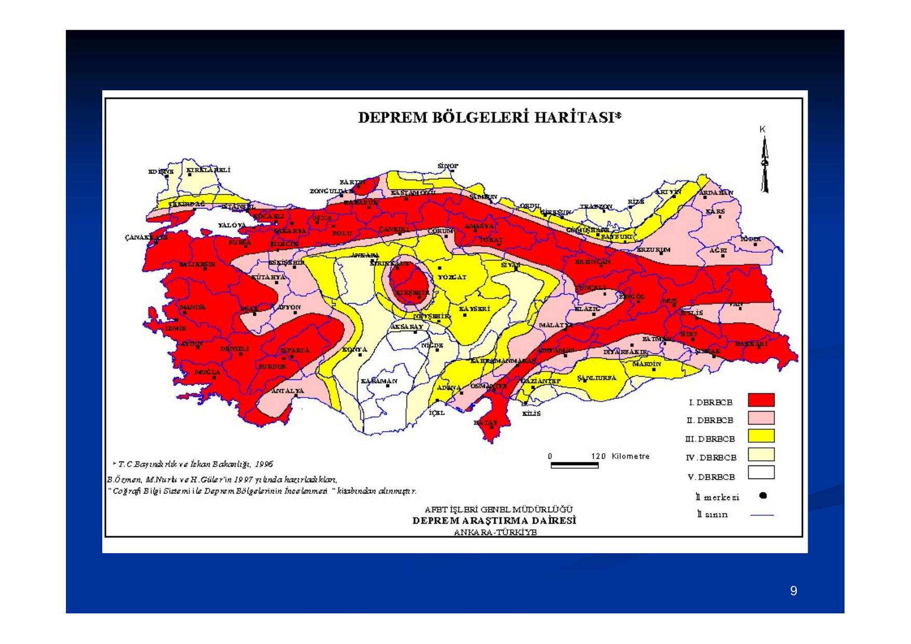

> **Şema yorumu:**
>
> Türkiye'nin deprem bölgeleri haritasıdır. Kırmızı bölgeler **I. derece deprem kuşağı** (en yüksek risk), turuncu **II. derece**, sarı **III. derece**, açık yeşil **IV. derece**, beyaz **V. derece** (en düşük risk) olarak sınıflanır. Kuzey Anadolu Fay Hattı (Marmara, Düzce, Bolu, Erzincan) ve Doğu Anadolu Fay Hattı (Kahramanmaraş, Hatay, Adıyaman) çoğu yüksek dereceli bölgeyi oluşturur. Ege kıyısı ve İç Anadolu geçiş bölgeleri de önemli risk taşır. Türkiye coğrafyasının büyük bölümünün deprem riski altında olması, **felaket tıbbı** ve özellikle **ezilme sendromu yönetimi** konusunda ülke çapında hazırlıklı olunmasını zorunlu kılar.

---

## TERMİNOLOJİ

### Crush (Ezilme, Sıkışma)

> **Tanım -- Ezilme Sendromu:** Travmanın yol açtığı **rabdomiyoliz** sonucunda gelişen, pek çok belirti ve bulguyu içeren klinik tablodur.

**Ezilme sendromu -- iki temel komponent:**

| Cerrahi Komponent (Travmaya lokal) | Medikal Komponent (Sistemik) |
|---|---|
| Travmanın lokal bulguları | Hipovolemik şok |
| Kompartman sendromu | Akut böbrek yetersizliği |
| | Hiperpotasemi |
| | Kalp yetersizliği |
| | Solunum yetersizliği |
| | İnfeksiyonlar |

### Rabdomiyoliz

> **Tanım -- Rabdomiyoliz:** Çizgili kasların hasara uğraması, erimesi ve içeriğinin dolaşıma çıkmasıdır.

**Neden kaslar?**

* Kaslar vücudumuzun **en büyük organıdır** (vücut ağırlığının yaklaşık **%40**'ı).
* Korunmasızdır; **travmaya çok açıktır**.

**Hasarlı kasdan dolaşıma salınan maddeler:**

* **Miyoglobin** (nefrotoksik)
* **Potasyum** (fatal aritmi riski)
* Laktik asit
* Tromboplastin (DİC tetikleyicisi)
* Kreatin kinaz (CK)
* Nükleik asitler (ürik asit kaynağı)
* Fosfat
* Kreatinin

**Bu salınımların sonucu:** EZİLME SENDROMU

---

### Kompartman Sendromu

> **Tanım -- Kompartman Sendromu:** Fasyaların oluşturduğu **nonkompliyan (genişleyemeyen) hacımda** basıncın patolojik düzeye yükselmesi.

**Fizyopatoloji:**

* Normal kompartman basıncı: **0-15 mmHg**
* Kas ödemi ortaya çıkarsa **kompartman içi basınç artar**
* **Hasar ve nekroz** gelişir
* **Kompartman sendromu = Kas tamponadı**

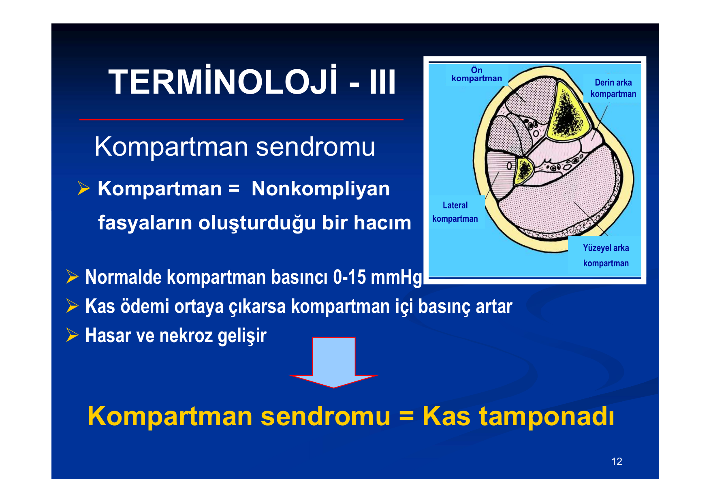

> **Şema yorumu:**
>
> Bacak transvers kesitinde dört kompartman gösterilmiştir:
> * **Ön kompartman** (anterior) -- tibia öndeki fasya aralığı; tibialis anterior, extensor hallucis longus, extensor digitorum longus ve peroneus tertius kaslarını içerir; derin peroneal sinir ve anterior tibial damarlar burada seyreder.
> * **Lateral kompartman** -- peroneus longus ve brevis kasları; yüzeyel peroneal sinir bu kompartmandadır.
> * **Yüzeyel arka kompartman** -- gastrocnemius, soleus, plantaris kasları.
> * **Derin arka kompartman** -- tibialis posterior, flexor digitorum longus, flexor hallucis longus; tibial sinir ve posterior tibial damarlar burada seyreder.
>
> **Ezilme travmasında** özellikle ön ve derin arka kompartmanlarda basınç artışı sık görülür; non-kompliyan fasya nedeniyle doku basıncı hızla **arteriyel perfüzyon basıncını aşabilir** ve kas/sinir iskemisine yol açar.

---

### Fasyotomi

> **Tanım -- Fasyotomi:** Kompartman içi basıncını normale getirmek amacıyla yapılan **dekompresyon ameliyatıdır**.

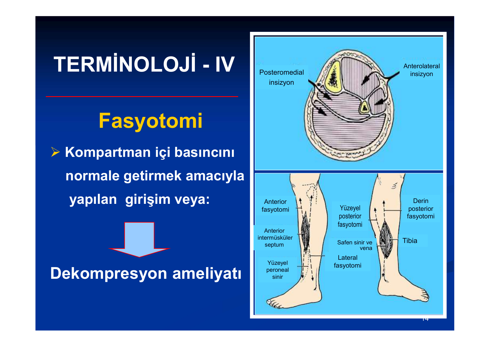

> **Şema yorumu:**
>
> Klasik iki-insizyonlu bacak fasyotomisi:
> * **Anterolateral insizyon** -- ön kompartman ile lateral kompartmanı birlikte açar; yüzeyel peroneal sinir hasarına dikkat edilmelidir.
> * **Posteromedial insizyon** -- yüzeyel arka kompartman ile derin arka kompartmanı açar; safen sinir ve safen ven (vena saphena magna) korunmalıdır.
>
> Şekilde ayrıca **anterior intermüsküler septum**, **tibia** referansı ve derin-yüzeyel posterior fasyotomi hattı gösterilmektedir. **Mannitol doku ödemini azaltarak basıncı düşürebilir** ve erken evrede fasyotomi gereksinimini azaltabilir.

---

## İNSİDANS VE EPİDEMİYOLOJİ

### Depremde Ezilme Sendromu Oranları

* Depremler sırasında **ölü/yaralı oranı: 1/3**
* Travmaların tümünde rabdomiyoliz **gelişmez!**
* Rabdomiyolizlerin tümünde ezilme sendromu **gelişmez!** (%30-50)
* Ezilme sendromlarının tümünde ABY **gelişmez!**

> **Genel kural:** Tüm travmaların **%2-%5**'inde ezilme sendromu gelişir. Marmara Depremi: **%1,5** (639/43.593).

### 8-Katlı Binanın Ani Çökmesi

| Durum | Oran |
|---|---|
| Ani ölüm | **%80** |
| Minör travma | %10 |
| Major travma | %10 |

* Majör travmalıların **7/10**'unda **ezilme sendromu** gelişir (Ron et al. *Arch Intern Med* 1984).

### Ezilme Sendromu -- Risk Faktörleri

* **Orta yaş** grubunda daha sık
* **Deprem merkez üssünde** daha sık
* **Enkaz altında kalış süresi** belirleyici:
  * Ortalama: **11,7 saat** (0,5-135 saat)

**Enkaz altında kalma süresi -- klinik tablolarla ilişki:**

| Parametre | Kalma süresiyle ilişki |
|---|---|
| Amputasyon, fasyotomi | **Doğru orantılı** |
| Oligüri süresi, diyaliz gereksinimi | **Ters orantılı** |

> **Not:** Enkaz altında **uzun kalan** hastalarda cerrahi sorunlar (amputasyon/fasyotomi) öne çıkarken, oligüri/diyaliz gereksinimi kısa kalanlara göre **daha az** görülür -- çünkü uzun süreli baskı altındakiler çoğunlukla olay yerinde kaybedilir veya ağır yaralılar hastaneye ulaşamaz.

---

## ETİYOPATOGENEZ

**Temel iki basamak:**

1. Değişik faktörlerin **rabdomiyolize** yol açması
2. Rabdomiyolize bağlı **ezilme sendromu ve ABY** gelişmesi

---

## RABDOMİYOLİZ NEDENLERİ

### Fiziksel Nedenler

| Kategori | Örnekler |
|---|---|
| **Travma veya basınca maruz kalma** | Trafik/iş kazaları, doğal afetler, işkence/dayak, aynı pozisyonda uzun süre kalma |
| **Kasların aşırı uyarılması** | Ağır egzersiz, epilepsi, tetanoz, delirium tremens, status asthmaticus |
| **Elektrik akımı** | Yüksek voltajlı elektrik hasarı, yıldırım çarpması, kardiyoversiyon |
| **Kasların hipoperfüzyon ve iskemisi** | Tromboz, emboli, damar klemplenmesi, şok |
| **Hipertermi** | Aşırı egzersiz, yüksek çevre ısısı, malign nöroleptik sendrom, malign hipertermi |

### Fiziksel Olmayan Nedenler

| Kategori | Örnekler |
|---|---|
| **Metabolik miyopatiler** | McArdle hastalığı, mitokondrial enzim defektleri, karnitin palmitoil transferaz eksikliği, fosfofruktokinaz eksikliği |
| **İnfeksiyonlar** | Piyomiyozit, sepsis (metastatik), toksik şok sendromu, *Legionella*, *Streptococcus*, *Staphylococcus*, *C. perfringens*, *F. tularensis*, *Salmonella*, *P. falciparum*, influenza, HIV, herpes, coxakivirus |
| **Elektrolit bozuklukları** | Hipopotasemi, hipokalsemi, hipofosfatemi, hiponatremi, hipernatremi |
| **Toksinler** | Yılan/böcek zehirleri, balık zehirleri |
| **İlaçlar** | Alkol, amfetamin, amfoterisin, antimalaryal ilaçlar, karbonmonoksit, MSS depresanları, kokain, kolşisin, steroidler, diüretikler, siklosporin, ekstazi, fibratlar, statinler, eroin, INH, laksatifler, meyan kökü, narkotikler, fensiklidin, zidovudin |
| **Endokrin bozukluklar** | Hipotiroidi, diyabetik koma, DİC |

---

## PATOGENEZ -- EZİLME SENDROMU VE ABY

### I. Travmanın Rabdomiyolize Yol Açması

**Mekanizmalar:**

* Basınca bağlı **gerilme miyopatisi (baromyopati)**
* **Dolaşım bozukluğu** (iskemi-reperfüzyon)

> **Kritik olay:** Sitozolik **kalsiyum düzeyinin artması** → Hücre içi proteolitik enzimlerin aktivasyonu → **RABDOMİYOLİZ**
>
> (Better et al. *Miner Electrolyte Metab* 1990; Zager. *Kidney Int* 1996)

### II. Rabdomiyolizin ABY'ye Yol Açması

**A. Böbrek perfüzyonunun bozulması**

* Kaslarda **aşırı sıvı birikimi (10-18 L)** -- kompartman sendromu → **üçüncü boşluk kaçağı**
* Vazokonstrüktör sitokinlerin etkisi

**B. Miyoglobinin tubuluslar üzerine doğrudan toksik etkisi**

**C. İntratubuler obstrüksiyon** (miyoglobin silendirleri)

**D. Diğer faktörler**

* Demir iyonu
* Hiperfosfatemi
* Hiperürisemi
* **Dissemine intravasküler koagülasyon (DİC)**
* Serbest radikaller
* İnfeksiyonlar
* Nefrotoksik ilaçlar

(Better and Stein *NEJM* 1990; Zager *Kidney Int* 1996; Vanholder et al. *JASN* 2000)

---

### Patogenez Şeması -- Kompartman/Ezilme Sendromu Zinciri

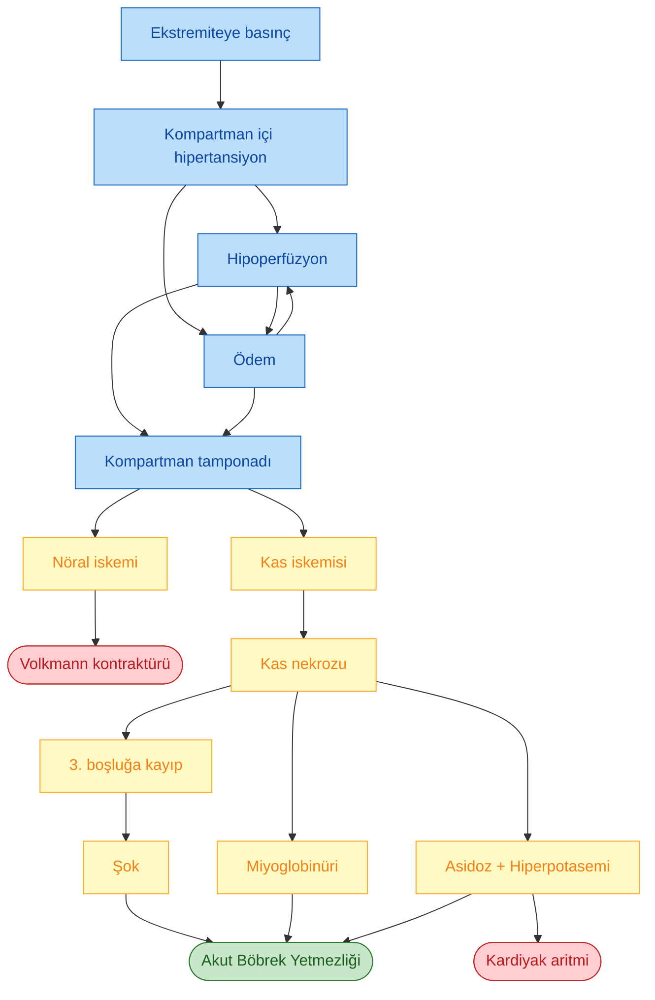

> **Şema yorumu:**
>
> Ekstremiteye uygulanan basınç önce **kompartman içi hipertansiyona**, ardından **hipoperfüzyon + ödem** kısır döngüsüne ve **kompartman tamponadına** yol açar (**Kompartman Sendromu** komponenti). Bundan sonra gelişen **kas nekrozu**, üçüncü boşluğa sıvı kaybı, miyoglobinüri, asidoz ve hiperpotasemi **Ezilme Sendromu** komponentini oluşturur. Sonuç olarak **Akut Böbrek Yetmezliği (ABY)** ve **kardiyak aritmiler** ortaya çıkar. Nöral iskeminin geç sekeli **Volkmann kontraktürüdür**.

---

## KLİNİK BULGULAR

### Medikal vs Cerrahi Bulgular

| Medikal (Ezilme sendromu ve komponentleri) | Cerrahi (Travma ile ilgili) |
|---|---|
| Hipovolemik şok | Kompartman sendromu |
| Akut böbrek yetersizliği | Toraks travması |
| Hiperpotasemi | Karın travması |
| Kalp yetersizliği | Diğer travmalar (kafatası, vertebral kolon, pelvis) |
| Solunum yetersizliği | |
| İnfeksiyonlar | |

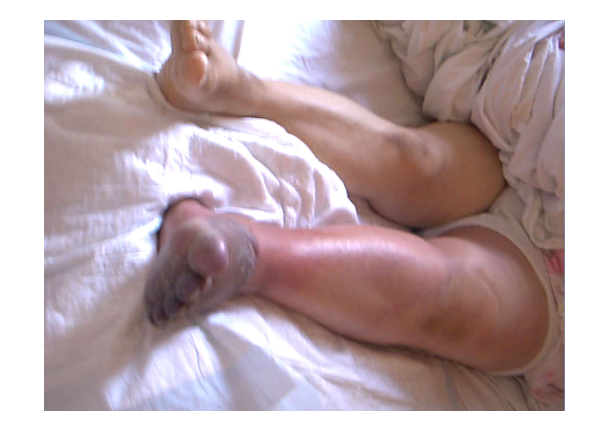

> **Şema yorumu:**
>
> Ezilme travması sonrası ekstremite klinik görünümü. Olası bulgular: **yaygın ekstremite ödemi**, **renk değişikliği** (soluk/morumsu/gergin cilt), bül veya deri bütünlüğü kaybı, **distal nabızların alınamaması veya zayıflaması**, **doku gerginliği** (palpasyonda tahta sertliğinde doku) ve **pasif gerilmeye aşırı ağrı** (kompartman sendromu için klasik bulgu). Bu görünümde hasta fasyotomi endikasyonu açısından acilen değerlendirilmelidir (doku basıncı ölçümü, nabız kontrolü). **Not:** Klinik fotoğraf yorumu genel kuralları yansıtır; bireysel olguda tanı doku basıncı ölçümü ve klinik bağlam ile konur.

---

## KLİNİK SEYİR VE KOMPLİKASYONLAR

**Böbrek idrar seyri:**

* **Oligüri süresi:** 10,8 ± 7,2 gün
* **Poliüri süresi:** 12,1 ± 7,0 gün

### Marmara Depremi -- Medikal Komplikasyonlar (639 ezilme sendromu hastasında, Sever et al. *NDT* 2002)

| Komplikasyon | Sayı |
|---|---|
| İnfeksiyonlar | 253 |
| Pulmoner | 98 |
| Kardiyovasküler | 94 |
| Hematolojik | 58 |
| Nöropsikiyatrik | 50 |
| Gastrointestinal | 22 |
| Diğer | 15 |
| **TOPLAM** | **590** |

### Mortalite Nedenleri -- 97/639 Olgu (%15)

| Mortalite Nedeni | Sayı |
|---|---|
| Sepsis | 30 |
| DİC + Sepsis | 8 |
| ARDS | 12 |
| Kardiyak (toplam) | 17 |
| -- Arrest | 9 |
| -- KKY | 3 |
| -- Şok | 2 |
| -- AMI | 1 |
| -- Aritmi | 1 |
| -- Hemoperikard | 1 |
| GİS kanaması | 2 |
| Kafa içi kanama | 2 |
| Aspirasyon pnömonisi | 1 |
| Hipovolemik şok | 1 |
| Peroperatif | 1 |
| Hidrosefali | 1 |
| Bilinmeyen | 22 |
| **TOPLAM** | **97** |

---

## LABORATUVAR BULGULARI

### Genel Özet

| İdrar Bulguları | Kan Bulguları |
|---|---|
| Miyoglobinüri (idrar kırmızı-kahverengi) | Kas enzimlerinin yüksekliği (**CK**, AST, LDH) |
| Diğer | Azotlu madde retansiyonu (üre, kreatinin) |
| | Metabolik asidoz |
| | **Hiperfosfatemi, hiperürisemi** |
| | **Hipokalsemi** |
| | Hipoalbüminemi |
| | Kan sayımı anormallikleri |
| | **Hiperpotasemi** |

---

### Serum Potasyum

**Temel fizyolojik bilgiler:**

* K**⁺** hücre içi esas katyon
* Aksiyon potansiyellerinin düzenlenmesi
* Vücut ağırlığının **%40**'ı kas → yaklaşık **30 kg**
* Vücut potasyumunun **%75**'i kas içindedir
* **150 gr kas hasarı → serum K düzeyinde 1 mEq/L artış**

**Hiperpotasemi nedenleri:**

1. Kasdan salınım
2. Renal atılım bozukluğu (ABY)

---

### Kaslardan Salınan Maddeler

#### Serum Miyoglobin

* Yarılanma ömrü: **1-3 saat**
* Plazma renk değişimi (miyoglobineminin gözlemlenmesi) için **7 kg kas yıkımı** olmalı → bu düzey **FATAL**.

#### Serum Kreatin Kinaz (CK/CPK)

* ADP + kreatin fosfat → **ATP + kreatin**
* **Normal serum düzeyi: < 260 U/L**
* İzoenzimler: **CK-MM** (iskelet), CK-MB (kalp), CK-BB (beyin)
* Böbrek yetmezliğinde değeri çok değişmez.
* **Rabdomiyoliz tanısı için üst sınır:** 500 -- 1000 -- 3000 U/L (kaynağa göre)
* Tepe değerine **12-24 saatte** ulaşır.
* Yarılanma ömrü: **48 saat**.

**Marmara depremi verileri:**

* CK ortalama: **58.000 U/L** (aralık: 77 -- 459.800 U/L).

**Prognostik önem:**

* CK **mortalite prediktörü değildir**.
* Serum potasyum değeri **fasyotomi gereksinimi ile korele**.

---

### Metabolik Asidoz

**Mekanizmalar:**

* **Yüksek anyon açıklı** metabolik asidoz
* Nekrotik dokudan **sülfürik, fosforik asit** salınımı
* **Laktik asidoz** -- kas ve/veya genel perfüzyon bozukluğu
* Nükleik asitlerin dolaşıma karışıp **ürik aside** çevrilmesi
* Bikarbonatın kas içine girmesi
* Böbrek yetmezliğine bağlı asit atılımının bozulması

### Serum Fosfor

* Genelde **yükselir** (olgularda **20 mg/dL** bildirilmiştir).
* **CaPO₄ tuzları** oluşturarak dokuda çöker → **hipokalsemi**.
* Kreatinin, ürik asit, oligüri süresi, diyaliz gereksinimi ile **pozitif korele**.
* Bazı çalışmalarda **mortalite prediktörü**.

### Serum Kalsiyum

* **Hipokalsemi** -- tetani, konvülsiyon.
* Mekanizmalar:
  * Hiperfosfatemi ile direkt çökme
  * Hücre içine giriş
  * Hasarlı dokuda CaPO₄ çökmesi
* **İyileşme evresinde** hiperkalsemi gelişebilir (depolanan Ca'nın mobilizasyonu).

### Serum Albumin

* Sıklıkla düşük (ortalama **2,6 g/dL**)
* **Kötü prognostik işaret**

### Diğer Laboratuvar Parametreleri

* **Ürik asit** -- yükselebilir
* **AST** ortalama: **859 IU/L**
* **LDH** ortalama: **2762 IU/L**
* **Görüntüleme:** Travma etkilerinin irdelenmesi ve ABY'nin diğer nedenlerinin dışlanması için kullanılır.

### Böbrek Yetmezliği Bulguları

* **Serum kreatinin ortalama: 3,98 mg/dL**
* **Ölüm prediktörü değil**
* Böbrek yetmezliğinin derecesine göre **beklenenden daha yüksek** seyreder (kas kaynaklı kreatinin salınımı).

---

## HİPERPOTASEMİ -- ÖLÜM İLİŞKİSİ

### Depremlerde Hiperpotasemi -- Ölüm Zinciri

> "Depremlerde ölümlerin çoğu doğrudan travmaya bağlıdır. Öte yandan, enkaz altından sağ çıkarılanların **önemli bir bölümü hiperpotasemi ile kaybedilir**."
>
> (Collins, *Crit Care Med* 1991; Better, *Kidney Int* 1993; Noji, *Ren Fail* 1992; Sever et al. *Clin Nephrol* 2003)

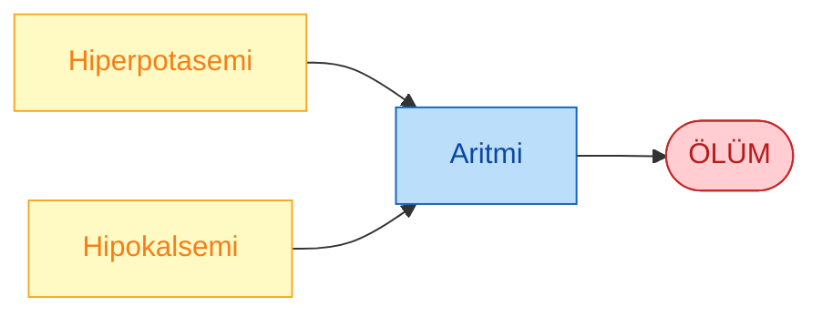

### Başvuruda Serum Potasyumu -- Marmara Verileri

* Ortalama başvuru K**⁺**: **5,3 mEq/L** (aralık 2,4 -- 13,3).
* Ölen vs sağ kalan başvuru K: **5,9 vs 5,2 mEq/L**.
* **97 ölümden 70**'inde başvuru **K > 7 mEq/L** (70/97).
* İlk haftadan sonra başvuran 40 hastada:
  * 8 hastada K > 6,5 mEq/L
  * 4 hastada K > 7,5 mEq/L
  * 3 hastada K > 8 mEq/L

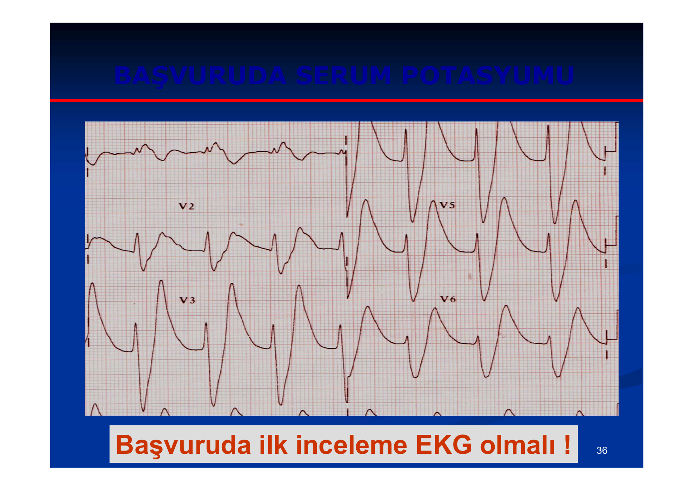

> **Şema yorumu:**
>
> Hiperpotasemide klasik EKG bulguları progresif olarak gelişir:
> 1. **Sivri, dar tabanlı T dalgaları** (K ≈ 5,5-6,5 mEq/L)
> 2. **PR uzaması**, P dalgasında silinme (K ≈ 6,5-7,5 mEq/L)
> 3. **QRS genişlemesi** (K > 7,5 mEq/L)
> 4. **Sine-wave paterni** -- QRS ve T'nin birleşerek sinüs dalgası benzeri geniş kompleksler oluşturması (K > 8-9 mEq/L, ölümcül)
> 5. Terminal **ventriküler fibrilasyon / asistol**.
>
> Görseldeki V₂, V₃, V₅, V₆ derivasyonlarında çok yüksek sivri T dalgaları ve QRS genişlemesi dikkat çekmektedir. **Kritik klinik kural:** "Başvuruda ilk inceleme EKG olmalıdır" -- EKG sahada bile hızla uygulanabilir, kan testinin sonucunu beklemeden empirik antihiperkalemik tedavi başlatılabilir.

---

### Cinsiyet -- Hiperpotasemi İlişkisi

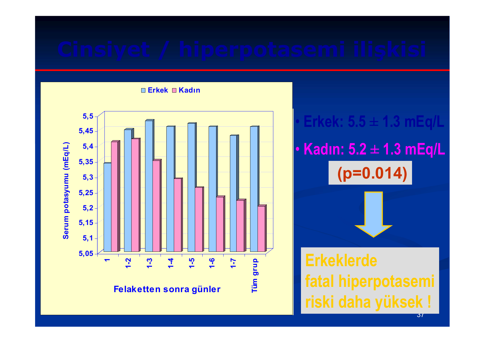

> **Şema yorumu:**
>
> Bar grafikte Marmara Depremi ezilme sendromu hastalarında **felaketten sonraki 7 gün** boyunca günlük serum potasyum ortalamaları cinsiyete göre gösterilmektedir.
> * **Erkek:** 5,5 ± 1,3 mEq/L (mavi)
> * **Kadın:** 5,2 ± 1,3 mEq/L (pembe)
> * İstatistiksel anlamlılık: **p = 0,014**
>
> **Klinik sonuç:** Erkek hastalarda daha fazla kas kütlesi bulunması nedeniyle **fatal hiperpotasemi riski kadınlara göre belirgin olarak yüksektir**. Bu nedenle empirik antihiperkalemik tedavi kararında özellikle **ağır travmatize erkek hastalarda** eşik düşürülmelidir.

**Pratik uyarılar:** Özellikle **ağır travmatize erkek hastalarda**:

* Serum K**⁺** aynı gün içinde **3-4 kez tekrarlanmalı**.
* **Diyete çok özen gösterilmeli** (düşük potasyumlu diyet).
* Hiperpotasemi riskine yol açan **ilaçlar kısıtlanmalı** (RAAS blokerleri, K-tutucu diüretikler, NSAİİ).

(Sever et al. *Clin Nephrol* 2003)

---

## TEDAVİ -- SAHADA PROFİLAKSİ

> **Temel ilke:** Tedavi **ÇOK ERKEN** başlamalı -- mümkünse **enkazdan çıkarılmadan ÖNCE**.

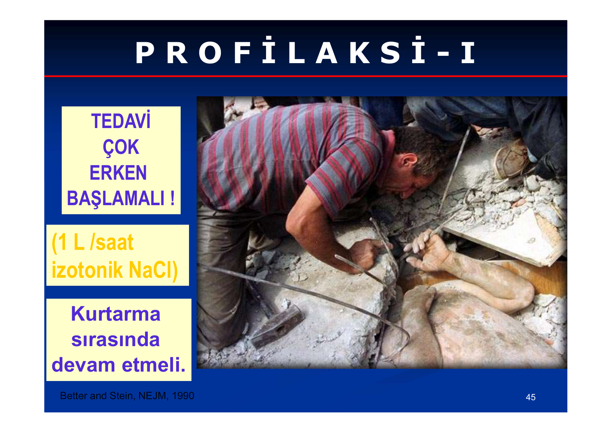

> **Şema yorumu:**
>
> Kurtarma sırasında sağlık ekibi, enkaz altındaki hastaya **damar yolu açarak izotonik NaCl (%0,9 NaCl) infüzyonu başlatmaktadır**. **Kurtuluş ölümü (rescue death)** riskini azaltmanın en etkili yolu, **hasta henüz baskı altındayken** sıvı resüsitasyonuna başlamaktır -- çünkü ekstremite serbest kaldığı anda kasdaki birikmiş potasyum, miyoglobin ve asidik metabolitler aniden sistemik dolaşıma karışır ve kardiyak arrest tetiklenebilir.

### Profilaksi İlkeleri (Better and Stein, *NEJM* 1990)

**1. Enkazdan kurtarma öncesi:**

* **İzotonik NaCl: 1 L/saat IV** başlanır.
* Sıvı tedavisi **kurtarma sırasında devam etmelidir**.

**2. Hasta çıkarıldıktan sonra:**

* İdrar kontrol edilir (fizik bakı ve **Foley** kateteri).
* Hipovolemi varsa en uygun sıvı uygulanır; idrar izlenir.
* **İdrar hâlâ yoksa**: çıkardığı sıvı + **1000-1500 mL sıvı** verilir.

> **⚠️ KRİTİK KURAL:** Potasyum içeren solüsyonlar **ASLA empirik kullanılmaz!**
>
> Marmara Depreminde başvuruda pek çok hasta (**35/352 ≈ %10**) potasyumlu sıvılar almaktaydı. **Empirik potasyumlu solüsyon uygulaması mutlak bir tıbbi hatadır -- ölüme davetiyedir!**
>
> **Yasaklı empirik sıvılar:** Kadalex, Isolyte, Isolyte-M (bunlar K içerir).

**3. Sağlık kuruluşuna gidene kadar -- Mannitol-Alkali Solüsyonu:**

| İçerik | Miktar |
|---|---|
| %0,45 NaCl / %5 Dekstroz | 1000 cc |
| NaHCO₃ ampul | 4 ampul |
| %20 Mannitol | 50 mL |

**Uyarılar:**

* **İdrar yanıtı alınan** hastalara günde **8-12 litre sıvı** verilir.
* **Hiç idrar çıkaramayan hastalara mannitol VERİLMEZ.**
* Verilen sıvı miktarının izleminde **CVP (santral venöz basınç) rehber olmalıdır**.

---

### Sahada Triyaj

* Yaşama şansı olmayanlarla zaman kaybedilmez.
* **Görünürde hafif yaralı olanlara da dikkat edilir** -- çok hafif yaralanmalarda bile ezilme sendromu gelişebilir.
* Gönderilen hastalar idrarlarının **miktarını ve rengini kontrol etmelidir** (kırmızı-kahverengi idrar → miyoglobinüri uyarısı).

---

### Kurtuluş Ölümü (Rescue Death)

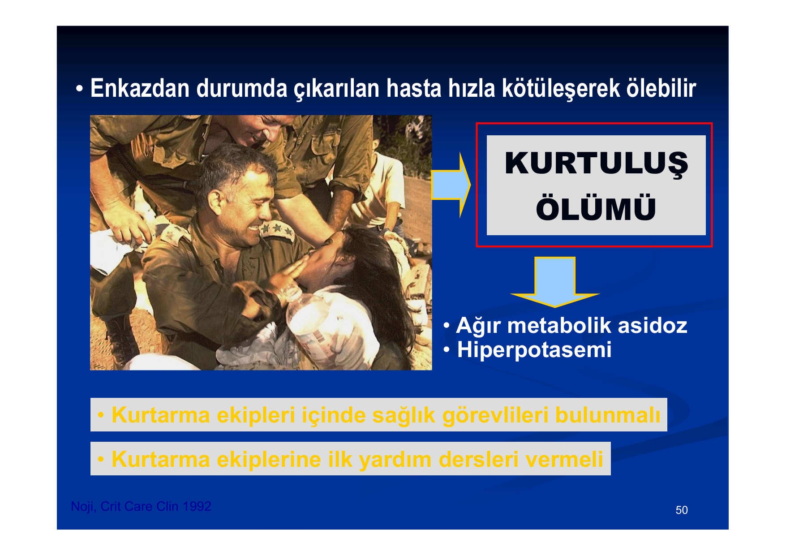

> **Şema yorumu:**
>
> "Kurtuluş ölümü" terimi, enkazdan çıkarılan hastanın **saatler içinde aniden kaybedilmesi** durumunu tanımlar. Mekanizma: Uzun süre baskı altında kalan ekstremite serbest kaldığında, iskemik kasta biriken **potasyum, laktik asit, miyoglobin ve nükleik asit yıkım ürünleri** aniden sistemik dolaşıma karışır. Sonuç: **ağır metabolik asidoz + şiddetli hiperpotasemi + hipovolemik şok** birleşimiyle kardiyak arrest.
>
> **Önlem:** Kurtarma ekipleri içinde sağlık görevlileri bulunmalı; kurtarma ekiplerine ilk yardım dersleri verilmeli ve **enkaz altındayken IV sıvı** başlatılmalıdır.
>
> (Noji, *Crit Care Clin* 1992)

---

## TEDAVİ -- BAŞVURU VE HASTANE YÖNETİMİ

### Cerrahi Tedaviler

* Travmaya yönelik tedaviler: yaraların, kırıkların bakımı, **amputasyonlar**.
* Eksploratif girişimler: **laparotomi, endoskopi**.
* Profilaktik girişimler: **fasyotomi**.

### Medikal Tedaviler

* **Sıvı tedavisi** (agresif)
* İnfeksiyonların tedavisi
* Transfüzyon tedavileri (kan ve kan ürünleri)
* Renal replasman tedavileri
* **Tetanoz profilaksisi**
* Diğer: ağrı tedavisi

### Diğer Medikal Tedaviler -- Marmara Serisi

| Tedavi | Hasta sayısı |
|---|---|
| Antibiyotikler | 347 |
| Heparin | 82 |
| Diüretikler | 36 |
| Diğer | 89 |

> **Tartışmalı noktalar:**
>
> * Geniş spektrumlu **antibiyotik endikasyonları** net değildir (profilaktik değil, endikasyona göre).
> * **Dopamin** uygulamalarının etkinliği kanıtlanmamıştır.

---

### Diğer Profilaktik Yaklaşımlar (Tartışmalı)

| Yaklaşım | Amaç |
|---|---|
| Plazmaferez, hemofiltrasyon | **Miyoglobin eliminasyonu** |
| **Allopurinol** | Ürik asit oluşumunun azaltılması |
| Furosemid | İdrar akışının artırılması (yükün dışlanması) |
| Nefrotoksik ajanlardan kaçınılması | ABY önlenmesi |
| İnfeksiyon profilaksisi | Sepsisin önlenmesi |
| Pentoksifilin, glutatyon, dopamin, aminosteroidler, desferoksamin, dantrolen, vitaminler, antioksidanlar | Çeşitli (kanıt düzeyi düşük) |

---

## FASYOTOMİ

### Fasyotomi Endikasyonları

* **Distal nabızların alınamaması**
* Ekstremitede **yaygın perfüzyon bozukluğu**
* **Doku basıncının 40 mmHg veya üzerinde** olması
* **Diyastolik kan basıncı -- doku basıncı farkının 30 mmHg'dan az** olması (delta-P < 30 mmHg)

> **Mannitol** doku ödemini azaltarak basıncı düşürebilir; bu nedenle fasyotomi kararı öncesi denenebilir.

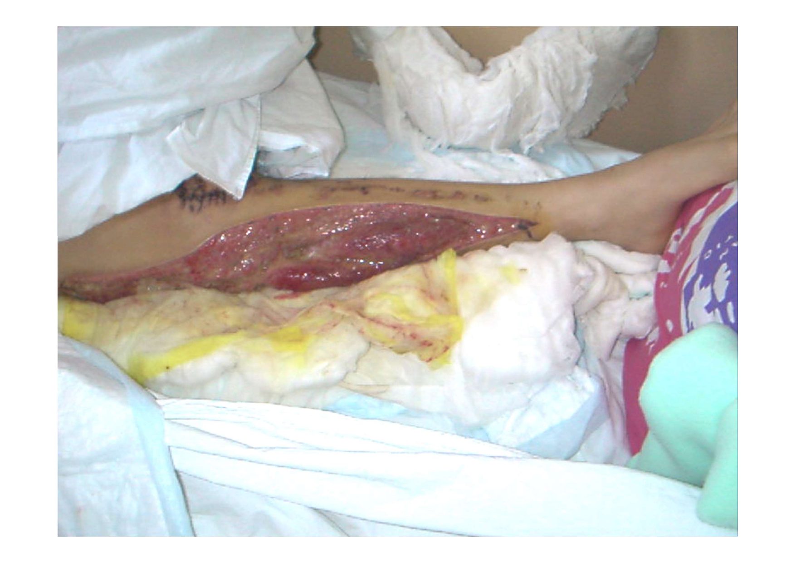

> **Şema yorumu:**
>
> Fasyotomi sonrası ekstremite görünümü. Tipik bulgular: **açık fasya altından çıkan ödematöz kas** (kompartman içi basınçtan kurtulmuş dokunun genişlemesi), **açık yarada eksüda** (serofibrinöz/sarımsı), yer yer canlılığı bozulmuş (donuk, kontraksiyon yanıtı olmayan) kas bölgeleri. Cerrahi debridman ve **seri pansuman** ile nekrotik dokular uzaklaştırılır; sekonder kapatma veya **greftleme** gerektirebilir.

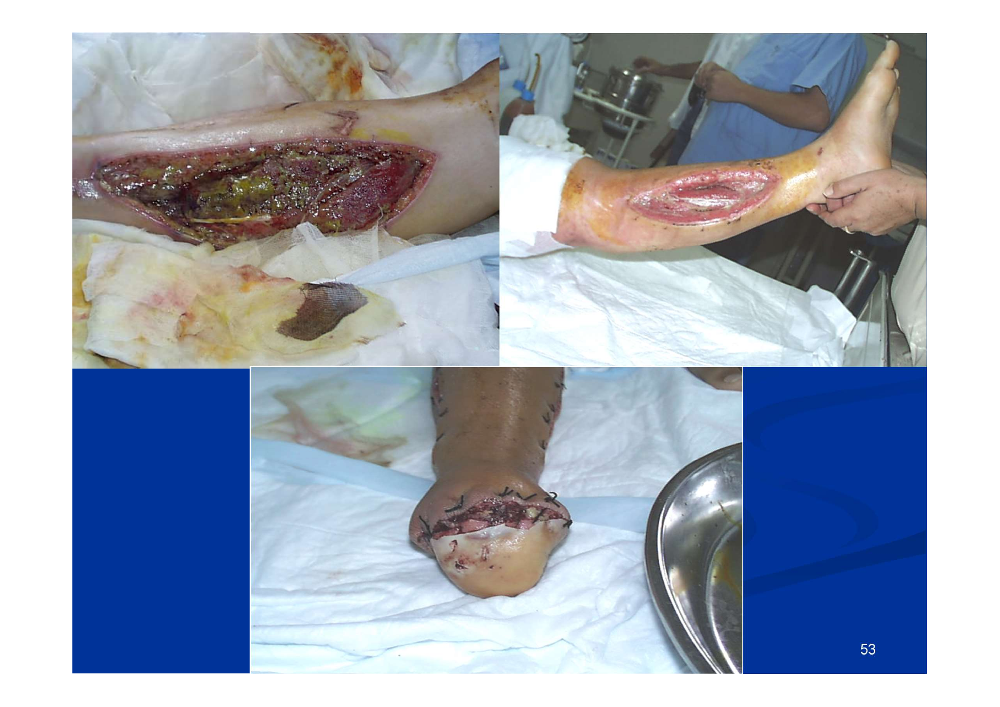

> **Şema yorumu:**
>
> Sol üst: açık fasyotomi yarası -- sarımsı eksüda ve yapay görünümlü (iskemik/nekrotik) kas dokusu; gerektiğinde debridman planlanır. Sağ üst: iyileşme fazında granülasyon dokusu gelişmiş, temiz görünümlü yara -- sekonder kapatma veya greft öncesi hazırlık evresi. Alt orta: sütür ile kapatılmış yara -- geç evre kapatma sonrası görünüm. Fasyotomi **sepsis için major bir risk faktörüdür**; endikasyon dışı uygulanmamalıdır (bkz. aşağıdaki Marmara Dersleri).

> **⚠️ KRİTİK UYARI:** **Fasyotomi sepsis için majör risk faktörüdür; mutlak endikasyonlar olmadıkça yapılmamalıdır.**

---

## HİPERPOTASEMİ TEDAVİSİ

### Genel Yaklaşım (K > 6,5 mEq/L veya EKG bulgusu)

| Ajan | Mekanizma | Doz | Etki Başlama / Süre |
|---|---|---|---|
| **Ca glukonat** | Membran stabilizasyonu | **10-30 mL %10'luk solüsyon, 10 dk IV** | Hemen başlar, ~1 saat sürer |
| **İnsülin + Dekstroz** | K'yı hücre içine sokar | **%20-30 Dx 500 cc 2 saatte; 3-5 U insülin/gr Dx** | 1 saatte K 0,5-1,5 mEq/L azalır |
| **NaHCO₃** | Asidoz düzeltilir, H⁻K değişimi | **50 mEq IV, 5 dk içinde; doz tekrarlanabilir** | 30-60 dk'da başlar |
| **β₂-mimetikler (albuterol/salbutamol)** | Na-K ATPase aktivitesinin artışı | **10-20 mg/10 dk nebülizör** | 90 dk'da K 0,5-1,5 mEq/L düşer |
| **Kayeksalate (SPS rezin)** | GIS'ten K atılımı | Oral: **40 g** / Enema: **50-100 g** | Saatler |
| **Diyaliz tedavisi** | K'nın vücuttan uzaklaştırılması | HD / CRRT | Hemen-saatler |

**⚠️ Özel Durumlar:**

* **Ca glukonat**, **dijitalize hastalarda kontrendikedir** (digoksin toksisitesini artırır).
* **β₂-mimetikler** koroner arter hastalığında (KAH) dikkatli kullanılmalıdır (taşikardi).
* İnsülin verildikten sonra **kan şekeri izlenmelidir** (hipoglisemi riski).

### Hiperpotasemi Yönetim Algoritması

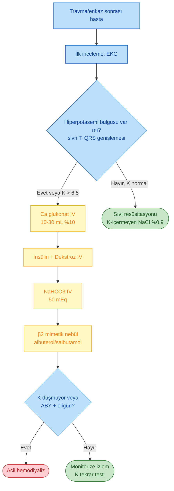

---

### Sahada Empirik Antihiperkalemik Tedavi

Marmara Depreminde pek çok hasta hiperpotasemiden kaybedildi → **empirik antihiperkalemik tedavi endikasyonu vardır**. Ancak başvuru sırasında bazı hastalar **hipopotasemikti** → bu yüzden:

> **Empirik tedavi özel risk gruplarına uygulanmalıdır:**
>
> * Ağır kas travması olanlar
> * Erkek felaketzedeler
>
> (Sever et al. *Clin Nephrol* 2003)

---

## DİYALİZ TEDAVİLERİ

### Marmara Serisi -- Diyaliz Modaliteleri (477 hasta)

| Modalite | Hasta sayısı | Seans | Özellikler |
|---|---|---|---|
| **Hemodiyaliz (HD)** | 437/477 | **5137 seans** | Yüksek etkinlikli; eğitimli ekip ve korunmuş altyapı gerektirir |
| **Yavaş akımlı tedaviler** (SLED/CRRT) | 34/477 | -- | Etkin, uzun süreli; **antikoagülasyon gerektirir** |
| **Periton diyalizi (PD)** | 4/477 | -- | Uygulaması kolay; altyapı gerektirmez; **etkinliği düşük** (hiperkalemik hasta için yetersiz) |

> **Genel tercih:** Hiperkatabolik ezilme sendromu hastasında **hemodiyaliz** ilk seçenektir. Hemodinamik instabilite varsa **CRRT/SLED** düşünülür. Periton diyalizi altyapı yokluğunda geçici çözümdür ancak ağır hiperkaleminin acil tedavisinde yetersizdir.

---

## PROGNOZ

### Artmış Mortalite ile İlişkili Faktörler

* Göğüs, karın travması
* **Oligüri**
* Hipotansiyon
* Ateş
* Trombositopeni
* **Hipokalsemi**
* Hipoalbüminemi
* **Hiperpotasemi**

### Deprem Bazlı Mortalite Verileri

| Deprem | Mortalite |
|---|---|
| Kobe depremi -- ezilme sendromu | %13,4 |
| Marmara Depremi -- ezilme sendromu | %8 |
| Marmara -- ABY ile komplike ezilme sendromu | **%15,2** |
| Marmara -- Diyaliz(-) | %9,3 |
| Marmara -- Diyaliz(+) | %17,2 |

> **Önemli bilgi:** Ezilme sendromuna bağlı böbrek yetmezliğinde **tam iyileşme kuraldır** -- yaşayan hastalarda genellikle kronik böbrek hastalığına ilerleme olmaz.

---

## MARMARA FELAKETİNDEN ÇIKARILAN DERSLER

### I. Öncelikler

1. **İtinalı kurtarma faaliyetleri** felaketin üzerinden **en az 5 gün** geçene kadar sürdürülmelidir.
2. **Hafif yaralılar bile** akut böbrek yetersizliği riskine karşı **yakın gözlem altında tutulmalıdır**.
3. **Empirik antihiperkalemik tedaviye** (özellikle erkeklerde) **sahada başlanmalıdır**. Hastane başvurusunda ilk laboratuvar **EKG** olmalıdır.

### II. Operasyonel İlkeler

1. Başvuru ve takipte **SVB (santral venöz basınç) ölçümleri** sıvı tedavisinin en güvenilir rehberidir.
2. **Fasyotomi sepsis için majör risk faktörüdür**; mutlak endikasyonlar olmadıkça yapılmamalıdır.
3. Aciliyet açısından karar verilemiyorsa, **öncelikle en yakından gelen hastaya** bakılmalıdır.
4. Deprem tehdidi altındaki bölgelerde tıbbi personele sürekli şekilde **"felaket tıbbı eğitimi"** verilmelidir.

---

## LOJİSTİK VE DEPREM HAZIRLIĞI

### Deprem Öncesi Yapılacaklar

* **Zemin ve bina etütleri**
* **Eğitim**: halk, ilk yardım ekipleri, sağlık personeli
* **Kurtarma ekipleri** oluşturulması ve organizasyonu

### Kurtarma Faaliyetleri

* Sağlık görevlilerinin kurtarma ekiplerinde bulunması
* Enkazda IV yol açabilecek donanım (triage ekibi)

### Tıbbi Hizmetler ve Hasta Nakli

* **Aciliyet sıralaması ve yönlendirme** (triage)
* **Ekip koordinasyonu**
* Bölgesel diyaliz kapasitesinin organizasyonu

### Felaket Yardımları Koordinasyonu

* Ulusal ve uluslararası koordinasyon
* Özel (sivil toplum) ve kamu iş birliği

### Diğer

* **Barınma**
* **Sanitasyon** (enfeksiyon kontrolü)
* **Aşılama** (tetanoz, Hepatit B)

---

## SONUÇ

Ezilme sendromu, doğal afetler ve travmaların önemli bir mortalite ve morbidite nedenidir. **Rabdomiyoliz, hiperpotasemi, akut böbrek yetmezliği ve kompartman sendromu** tablonun dört temel komponentidir. Tedavide en kritik basamak **çok erken (enkazdan çıkarılmadan önce) başlayan sıvı resüsitasyonu** ve **empirik antihiperkalemik yaklaşımdır**. Kurtuluş ölümü riskini azaltmak için **sahada** EKG, IV izotonik NaCl ve hiperpotasemi tedavisi uygulanabilmelidir. Hastane aşamasında sıvı tedavisi (CVP rehberliğinde), mannitol-alkali solüsyonu, gerekirse **hemodiyaliz** ve seçilmiş hastalarda **fasyotomi** tedavinin temellerini oluşturur. **Marmara Depremi deneyimi**, Türkiye gibi yüksek sismik riskli bir ülkede felaket tıbbı eğitiminin sürekli ve sistemli olmasının zorunluluğunu göstermiştir.
