# GEBELİK VE BÖBREK

**Hazırlayan:** Prof. Dr. Yavuz Yeniçerioğlu
**Bölüm:** Aydın Adnan Menderes Üniversitesi -- Nefroloji Bilim Dalı

---

## İÇİNDEKİLER

1. [Giriş](#giriş)
2. [Gebelikte Renal Fizyoloji](#gebelikte-renal-fizyoloji)
3. [Gebelikte Proteinüri ve Glukozüri](#gebelikte-proteinüri-ve-glukozüri)
4. [Normalden Patolojiye: Kırmızı Bayraklar](#normalden-patolojiye-kırmızı-bayraklar)
5. [Gebelikte Hipertansif Bozukluklar -- Sınıflama](#gebelikte-hipertansif-bozukluklar----sınıflama)
6. [Kronik Hipertansiyon](#kronik-hipertansiyon)
7. [Gestasyonel Hipertansiyon](#gestasyonel-hipertansiyon)
8. [Preeklampsi / Eklampsi](#preeklampsi--eklampsi)
9. [Kronik HT Üzerine Eklenmiş Preeklampsi](#kronik-ht-üzerine-eklenmiş-preeklampsi)
10. [HELLP Sendromu](#hellp-sendromu)
11. [Preeklampsinin Önlenmesi](#preeklampsinin-önlenmesi)
12. [Gebelikte Antihipertansif Tedavi](#gebelikte-antihipertansif-tedavi)
13. [Şiddetli Hipertansiyonda Acil Yönetim](#şiddetli-hipertansiyonda-acil-yönetim)
14. [Eklampsi ve MgSO4](#eklampsi-ve-mgso4)
15. [Gebelikte Akut Böbrek Hasarı (gABH)](#gebelikte-akut-böbrek-hasarı-gabh)
16. [Trombotik Mikroanjiyopatiler (TTP, CM-TMA, HELLP, AFLP)](#trombotik-mikroanjiyopatiler-ttp-cm-tma-hellp-aflp)
17. [Gebelikte İdrar Yolu Enfeksiyonu](#gebelikte-idrar-yolu-enfeksiyonu)
18. [Kronik Böbrek Hastalığı ve Gebelik](#kronik-böbrek-hastalığı-ve-gebelik)
19. [Diyaliz Hastası Gebelik](#diyaliz-hastası-gebelik)
20. [Böbrek Transplantlı Hastada Gebelik](#böbrek-transplantlı-hastada-gebelik)
21. [Özel Durumlar: Lupus Nefriti, Diyabetik Nefropati](#özel-durumlar-lupus-nefriti-diyabetik-nefropati)
22. [Uzun Dönem Sonuçlar ve Postpartum Takip](#uzun-dönem-sonuçlar-ve-postpartum-takip)
23. [Vaka Örnekleri](#vaka-örnekleri)
24. [Özet ve Son Sözler](#özet-ve-son-sözler)
25. [Kaynaklar](#kaynaklar)

---

## Giriş

Gebelik; kardiyovasküler, hematolojik, immünolojik ve renal sistemlerde belirgin adaptif değişikliklerin ortaya çıktığı fizyolojik bir durumdur. Bu değişiklikleri tanımak, gerçek bir patolojiyi gözden kaçırmamak için hayati öneme sahiptir. Ayrıca gebelikte ortaya çıkan hipertansif bozukluklar, obstetrik kanamadan sonra dünya genelinde anne ölümlerinin ikinci en sık nedenidir.

Bu ders notunun temel eksenleri:

* Gebelikte oluşan fizyolojik değişiklikler
* Gebelikte proteinüri
* Gebelikte hipertansif tablolar (4 kategori)
* Gebelikte akut böbrek hasarı (gABH)
* Kronik böbrek hastalığı (KBH) olan hastada gebelik
* Diyaliz, transplant ve özel durumlar

> **Klinik ilke:** Gebelikte görülen değişiklikleri "normal fizyoloji" ve "patoloji" ekseninde ayırmak, gereksiz müdahaleden kaçınırken ciddi tabloları zamanında yakalamanın anahtarıdır.

---

## Gebelikte Renal Fizyoloji

### Hemodinamik Değişiklikler

Gebeliğin 16. haftasından itibaren:

* **Maternal arteriyel vasküler tonus azalır**
* **Periferik vasküler direnç azalır**
* **Kan basıncında düşüş** gözlenir (özellikle ortalama arter basıncı 16-20. haftalarda en düşük seviyeye iner)
* Artan kan hacmini karşılamak için bu değişiklikler gerçekleşir

Bu düşüş, altta yatan **kronik hipertansiyon tanısını maskeleyebilir**.

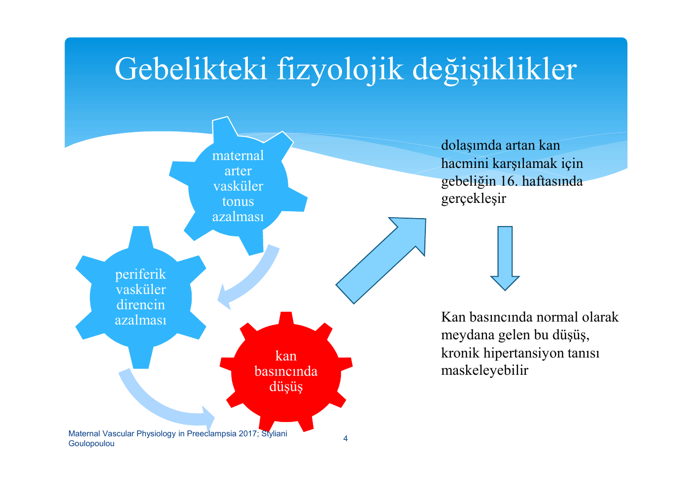

> **Şema yorumu:** Maternal vasküler tonus azalması ile periferik vasküler direnç düşer; bunun sonucunda kan basıncı azalır. Bu tablo 16. haftada dolaşımdaki artan kan hacmini karşılamak üzere gelişir.

### Kardiyak ve Plazma Değişiklikleri

Gebelik boyunca gözlenen başlıca yüzdesel değişiklikler (gebe olmayana göre):

| Parametre | Değişim | Açıklama |
|---|---|---|
| Kardiyak output | %30-50 artış | Erken 2. trimesterde pik |
| Plazma volümü | %40-50 artış | Fizyolojik anemiye yol açar |
| GFR | %40-50 artış | 2. trimesterde pik |
| Sistemik vasküler direnç | Belirgin azalış | Relaksin, NO aracılı |
| Üre | Azalır | Dilüsyon + klirens artışı |
| Kreatinin | Azalır (~0.5 mg/dL) | >0.8 mg/dL patolojik ipucu |
| Plazma proteini / albümin | Azalır | Dilüsyon |
| Plazma osmolalitesi | ~10 mOsm/kg azalır | Reset osmostat |
| Na | Yaklaşık 5 mEq azalır | Reset osmostat, hCG etkisi |
| Ürik asit | %25 azalır (en düşük 24. hf) | 24. hf sonrası yükselmeye başlar |

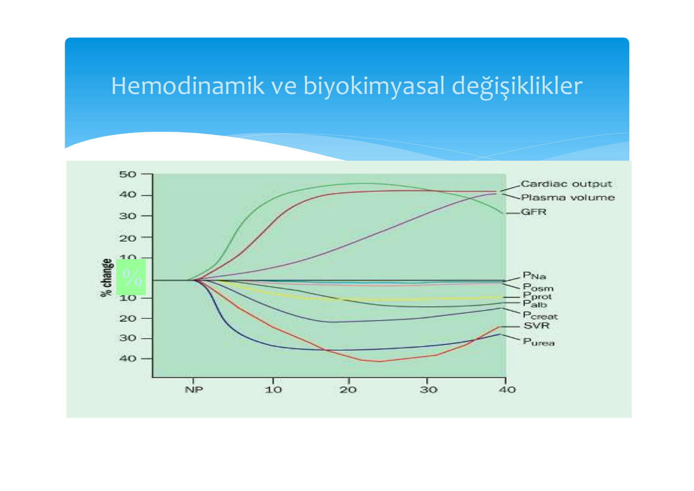

> **Şema yorumu:** Kardiyak output, plazma volümü ve GFR belirgin şekilde yükselirken; plazma sodyumu (PNa), osmolalitesi (Posm), protein (Pprot), albümin (Palb), kreatinin (Pcreat), sistemik vasküler rezistans (SVR) ve üre (Purea) düşer. Değişimler gebeliğin 16. haftasında en belirgindir ve gebelik sonuna kadar sürer.

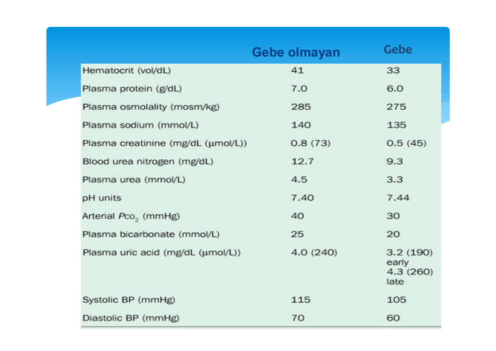

> **Tablo yorumu:** Gebelikte hematokrit, plazma proteini, osmolalite, BUN, kreatinin ve ürik asit düşer; kan basıncı ortalama 105/60 mmHg'ye iner. Ürik asit erken dönemde 3.2 mg/dL'ye kadar azalır, geç dönemde 4.3 mg/dL civarına yükselir.

### Renal Hemodinami

* Renal plazma akışı (ERPF) ve GFR, gebeliğin 16. haftasında belirgin artar, 26-36. haftalarda plato yapar, doğuma yakın hafif düşer
* Serum kreatinin tipik olarak ~0.5 mg/dL seviyesine iner
* **Gebelikte kreatinin >0.8 mg/dL (>71 µmol/L)** ileri tetkik gerektirir

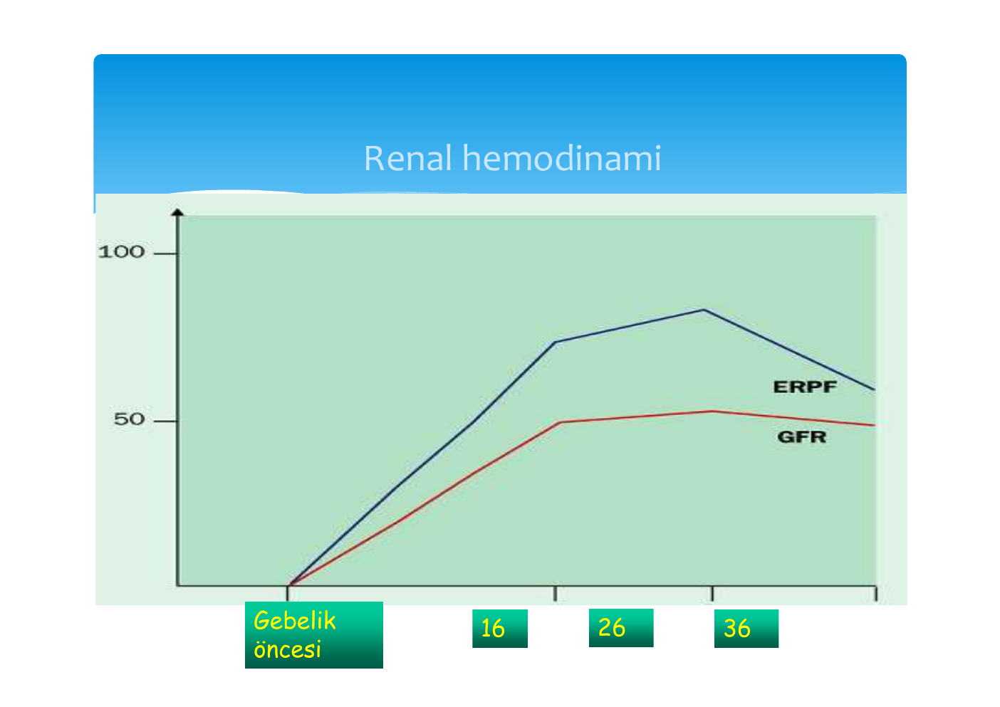

> **Şema yorumu:** Hem ERPF hem de GFR gebelik öncesine göre %40-60 oranında artar, 26-36. haftalar arasında plato çizer ve doğuma yakın kısmen geriler.

### Renal Vazodilatasyonun Hormonal Motoru

Renal vazodilatasyonun arkasında karmaşık bir hormonal kaskad vardır:

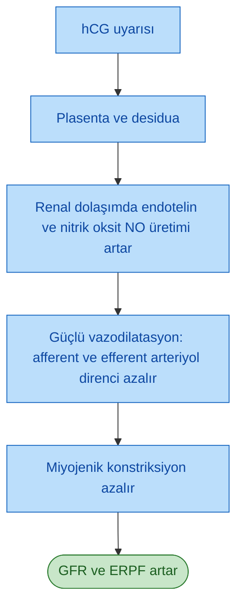

Plasenta tarafından salgılanan **relaksin** hormonu ve artan nitrik oksit üretimi; afferent ve efferent arteriyollerde dilatasyon yapar ve GFR artışının ana mekanizmasıdır.

### Yapısal Değişiklikler (Fizyolojik Hidronefroz)

* Böbrek boyu 1-1.5 cm artar
* Renal pelvis 60 mL'ye kadar genişler (normal: 10 mL)
* Üreter uzar, genişler, kıvrımlı hal alır
* Toplayıcı sistemde 200 mL'ye kadar idrar birikebilir
* Hidronefroz **sağ > sol** (uterusun sağa rotasyonu, infundibulopelvik ligament ve ovariyan ven basısı)
* 2. ayda başlar, **ikinci trimester ortalarında maksimum**
* Mekanizma: progesteronun üreter düz kasında gevşetici etkisi + mekanik bası

> **Önemli:** Fizyolojik hidronefroz **yan ağrısı eşlik etmediği sürece** normaldir. Ağrı varsa taş gibi obstrüktif patoloji araştırılmalıdır.

### Tübüler Fonksiyon Değişiklikleri

* Ürik asit tübüler emilimi azalır, plazma ürik asidi %25 düşer, 24. hafta sonrası yükselmeye başlar
* **Akut serum ürat yükselmesi preeklampsinin erken bulgularındandır**
* Gebelik boyunca 2 g/güne dek aminoasit atılımı olabilir
* Glukozüri; glomerüler filtrasyonun tübüler reabsorpsiyonu aşmasıyla fizyolojik olabilir (intermitan, doğumdan 1 hafta sonra normale döner)

### Proteinüri

* Gebelikte **200-300 mg/gün proteinüri normal** kabul edilir
* Üst sınır: **300 mg/24 saat**
* Bu eşiğin üzeri primer renal patoloji veya preeklampsi habercisidir
* İkiz gebeliklerde eşik daha yüksek olabilir

### Elektrolit ve Asit-Baz

* GFR artışı ile filtre edilen Na %50 artar
* Tübüler reabsorpsiyonda kompansatuar artış; net 900-1000 mEq Na retansiyonu
* Serum Na ~5 mEq azalır -- "reset osmostat" (hCG ile koreledir, düzeltilmesine gerek yok)
* Renin, anjiyotensin I ve II artar, aldosteron artar; ancak normal gebe, artmış anjiyotensin II'nin vazokonstriktör etkisine **dirençlidir**
* Hafif **respiratuar alkaloz** (progesteron aracılı hiperventilasyon): pH 7.44, PaCO2 ~30 mmHg, HCO3 ~20 mmol/L
* Plazma osmolalitesi 10 mOsm/kg azalır; hCG aracılı reset osmostat
* Vazopressinaz ADH yıkımını artırır; ancak ADH salınımı da arttığı için poliüri nadirdir

### Özet -- Sağlıklı Gebelik vs Preeklampsi

| Parametre | Sağlıklı Gebelik | Preeklampsi |
|---|---|---|
| RAAS aktivasyonu | Artar; KB yükselmez | Plazma renin aktivitesi baskılanır |
| Vazodilatasyon | Sistemik, NO aracılı | Vazokonstriksiyon baskın |
| Vazokonstriktörlere yanıt | Azalmış (direnç) | Abartılı yanıt |
| Plazma hacmi | Belirgin artış, fizyolojik anemi | Vazokonstriksiyon + aşırı dolu dolaşım |
| Ortalama arter basıncı | 16-20. hf'da en düşük | Yükselmiş |
| GFR | Artar | Sağlıklı gebeliğe göre %30 daha düşük |
| Ek bulgular | -- | Hiperkoagülabilite, dislipidemi, insülin direnci |

---

## Gebelikte Proteinüri ve Glukozüri

* **Normal proteinüri üst sınırı: 300 mg/gün**
* Glukozüri gebelerin yaklaşık %50'sinde görülebilir; **tek başına diyabet tanısı için güvenilir değildir** ama kan şekeri takibi için işarettir
* Persistan glukozüri -> gestasyonel diyabet veya tip 1/2 DM açısından değerlendirilmeli
* Glukozüri üriner enfeksiyon riskini artırır (idrardaki glukoz + aminoasit = bakteriyel üreme ortamı)

---

## Normalden Patolojiye: Kırmızı Bayraklar

Gebelikteki fizyolojik değişiklikleri bilmek, gerçek bir sorunu gözden kaçırmamak için çok önemlidir. Aşağıdaki bulgular ileri tetkik gerektirir:

| Bulgu | Eşik / İfade | Yorum |
|---|---|---|
| Kreatinin | >0.8 mg/dL (>71 µmol/L) | Gebelikte normal ~0.5 mg/dL, ≥0.8 patolojiye işaret |
| Proteinüri | >300 mg/gün (24 saatlik idrar) | İkiz gebelikte eşik biraz daha yüksek olabilir |
| Glukozüri | -- | Tek başına tanısal değil; %50 hastada görülür, kan şekeri takip işareti |
| Hiponatremi | <130 mEq/L | Reset osmostat ile uyumsuz; değerlendir |
| Hidronefroz | Yan ağrısı eşlik ediyorsa | Patolojik obstrüksiyon (taş vb.) araştırılmalı |

---

## Gebelikte Hipertansif Bozukluklar -- Sınıflama

> **Tanım (gebelikte HT):** En az 6 saat arayla iki ölçümde **kan basıncının ≥140/90 mmHg** olması; veya gebelik öncesi/ilk trimester KB'ye göre sistolikte 25-30 mmHg, diyastolikte 15 mmHg artış.

Tanıda kritik eşik: **20. gebelik haftası**

* **<20. hafta:** Kronik hipertansiyon
* **≥20. hafta:** Preeklampsi / eklampsi, gestasyonel HT veya kronik HT üzerine eklenmiş preeklampsi

### Dört Klinik Tablo (ACOG / ISSHP)

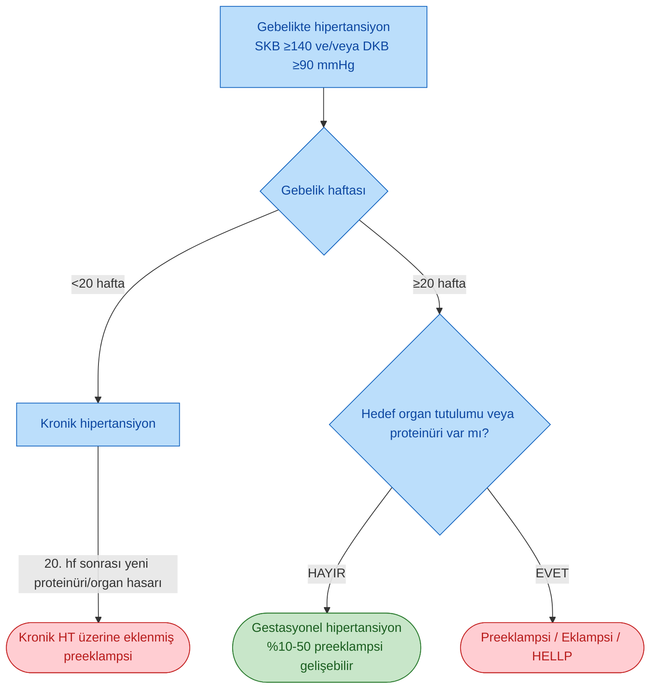

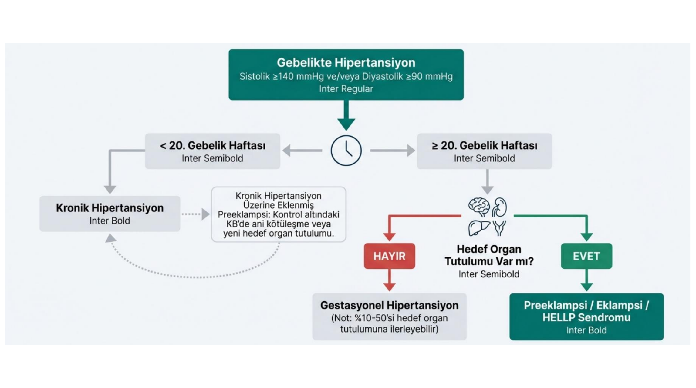

> **Şema yorumu:** Gebelikte SKB ≥140 ve/veya DKB ≥90 mmHg saptanınca 20. gebelik haftası bir milat olarak alınır. 20. haftadan önceki HT kronik HT, 20. haftadan sonra yeni başlayanlar gestasyonel HT (hedef organ tutulumu yoksa) veya preeklampsi/eklampsi/HELLP (hedef organ tutulumu varsa) olarak değerlendirilir. Kronik HT hastasında ani kötüleşme, yeni proteinüri veya yeni organ hasarı "kronik HT üzerine eklenmiş preeklampsi" olarak sınıflanır.

### Sıklıklar ve Prognoz

| Sınıf | Tahmini sıklık | Tanım |
|---|---|---|
| Kronik HT | Gebeliklerin %1-5 | Gebelikten önce veya 20. hf öncesi veya doğum sonrası 42. günden sonra da sürmesi |
| Gestasyonel HT | Gebeliklerin %6-7 | 20. hf sonrası gelişen, preeklampsi özellikleri olmayan, genellikle 42 gün içinde düzelen HT |
| Preeklampsi / eklampsi | Gebeliklerin %5-7 | 20. hf sonrası HT + proteinüri (>300 mg/24 saat; spot Pr/Kr ≥0.3) veya hedef organ hasarı |
| Kronik HT üzerine eklenmiş preeklampsi | Kronik HT'li gebelerde %20-25 | Kronik HT'de 20. hf sonrası preeklampsi özelliklerinin başlaması |

### Komplikasyonlar (HT gebeliğinde)

| Sonuç | Nullipar | Kronik HT | Kronik HT + PE |
|---|---|---|---|
| Perinatal ölüm | %1.2 | %2.9 | %10.8 |
| İntrauterin gelişme geriliği (IUGR) | %6.3 | %10.5 | %35 |
| Prematürite | %15 | %14.5 | %60 |

---

## Kronik Hipertansiyon

> **Tanım:** Gebelikten önce veya gebeliğin 20. haftasından önce var olan ve doğumdan sonra da devam eden kan basıncı yüksekliği (SKB ≥140 ve/veya DKB ≥90 mmHg).

### Şiddet

| Evre | SKB | DKB |
|---|---|---|
| Hafif-orta | 140-159 | 90-109 |
| Şiddetli | ≥160 | ≥110 |

* Prevalans: %5 (bunların %10'u sekonder HT)
* Risk faktörleri: obezite, ileri maternal yaş
* Birçok kadın gebelik boyunca tedavisiz normotansif kalabilir

### Komplikasyonlar

* Preeklampsi (%20-40; şiddetli HT'de %78'e kadar)
* Böbrek yetmezliği
* İnme
* Solunum yetmezliği
* Ölüm
* Kronik HT perinatal ölüm ve prematürite için bağımsız risk faktörüdür

---

## Gestasyonel Hipertansiyon

> **Tanım:** Proteinüri veya diğer preeklampsi belirtileri olmaksızın **20. gebelik haftasından sonra** ortaya çıkan ve postpartum (genellikle 12. hafta sonrası) normale dönen SKB ≥140 ve/veya DKB ≥90 mmHg.

* Prevalans %6-7
* Nullipar kadınlarda %6-17, multipar kadınlarda %2-4
* Postpartum 12. haftayı geçerse "kronik hipertansiyon" olarak yeniden sınıflanır
* **Preeklampsiye ilerleme riski, tanının konduğu gebelik yaşıyla ters orantılıdır:** 34. haftadan önce tanı alanlarda %36-42, 34. hafta sonrasında %7-20

### Risk Faktörleri

* Genç nullipar veya 35 yaş üstü gebe
* Polihidroamnios, çoğul gebelik
* Aşırı doğurganlık (özellikle 4. gebelik sonrası)
* Malnütrisyon / düşük sosyoekonomik düzey
* Molar gebelik
* Diyabet

### Komplikasyonlar

* Renal disfonksiyon, proteinüri, oligüri (preeklampsiye ilerleme)
* Fetal büyüme geriliği, fetal hipoksi, intrauterin ölüm
* Serebral/retinal ödem, serebral korteks irritabilitesi
* İntraselüler Na artışı, K azalması -- reflekslerde artış
* **Serebral hemoraji** (en büyük ölüm nedenlerinden biri)

---

## Preeklampsi / Eklampsi

> **Tanım (ACOG 2022):** Önceden normotansif bir kadında **20. gebelik haftasından sonra** en az 4 saat arayla iki kez ölçülen **KB ≥140/90 mmHg** veya tek seferde **≥160/110 mmHg** + proteinüri **veya** yeni başlayan hedef organ hasarı.

### Tanı Kriterleri (ACOG 2022)

**Kan Basıncı**

* ≥140/90 mmHg -- 4 saat arayla iki ölçüm
* **VEYA** ≥160/110 mmHg -- dakikalar içinde doğrulanabilir, tedaviye derhal başlanır

**VE aşağıdakilerden biri**

**Proteinüri:**

* ≥300 mg/24 saatlik idrar
* **VEYA** Protein/kreatinin oranı ≥0.3
* **VEYA** İdrar çubuğu (dipstick) ≥2+

**Proteinüri olmasa dahi**, yeni başlangıçlı hipertansiyon ile birlikte aşağıdaki yeni başlangıçlı bulgulardan **herhangi biri:**

1. **Trombositopeni:** Trombosit <100.000/µL
2. **Böbrek yetmezliği:** Serum kreatinin >1.1 mg/dL veya altta yatan başka böbrek hastalığı olmaksızın kreatininin iki katına çıkması
3. **Karaciğer fonksiyon bozukluğu:** Transaminazların normalin iki katına yükselmesi
4. **Pulmoner ödem**
5. **Yeni başlangıçlı serebral veya görsel semptomlar:** İlaçlara yanıtsız baş ağrısı, görme bozuklukları

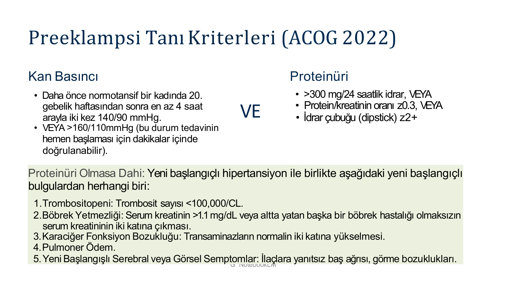

> **Şema yorumu:** Tanı için yeni başlangıçlı HT (≥140/90 veya ≥160/110) + proteinüri (≥300 mg/gün, Pr/Kr ≥0.3 veya dipstick ≥2+) gerekir. Proteinüri yoksa yeni başlayan trombositopeni, böbrek yetmezliği, karaciğer bozukluğu, pulmoner ödem veya serebral/görsel semptomlardan biri yeterlidir.

### Şiddetli Preeklampsi Kriterleri

| Kategori | Kriter |
|---|---|
| Kan basıncı | SKB ≥160 ve/veya DKB ≥110 mmHg |
| Proteinüri | >2-5 g/24 saat (eski kriter; yeni kılavuzda zorunlu değil) |
| Renal | Oligüri, kreatinin >1.1 mg/dL |
| Hematolojik | Trombosit <100.000/mm³, hemoliz bulguları |
| Hepatik | AST/ALT normalin ≥2 katı (>50 IU/L), LDH yüksekliği, epigastrik ağrı |
| Nörolojik | Serebral/görsel semptomlar, ilaçlara yanıtsız baş ağrısı |
| Pulmoner | Pulmoner ödem, siyanoz |
| Fetal | Rahim içi gelişme geriliği |

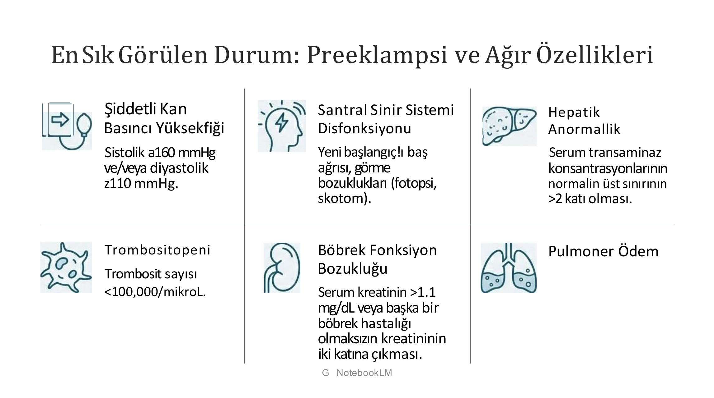

> **Şema yorumu:** Ağır preeklampside altı alanda (kan basıncı ≥160/110, SSS bulguları, karaciğer enzim yüksekliği >2x, trombosit <100.000, kreatinin >1.1 veya iki katına çıkma, pulmoner ödem) tablo tanımlanır.

### Risk Faktörleri

| Risk Kategorisi | Özellikler |
|---|---|
| **Yüksek** | Önceki preeklampsi, çoğul gebelik, kronik HT, tip 1/2 DM, kronik böbrek hastalığı, otoimmün hastalık (SLE, APS) |
| **Orta** | BKI >30 kg/m², ailede preeklampsi öyküsü (1. derece akraba), sosyodemografik (düşük sosyoekonomik düzey), yaş >35, önceki olumsuz gebelik sonucu, >10 yıl aralıklı gebelik |
| **Düşük** | Komplike olmayan önceki normal zamanlı doğum |

### Patogenez -- Anormal Plasentasyon

Preeklampsinin temelinde, plasental kan akışını sağlamak için gerekli olan **spiral arterlerin yeniden modellenmesindeki başarısızlık** yatar. Bu durum plasental hipoperfüzyon ve iskemiye yol açar.

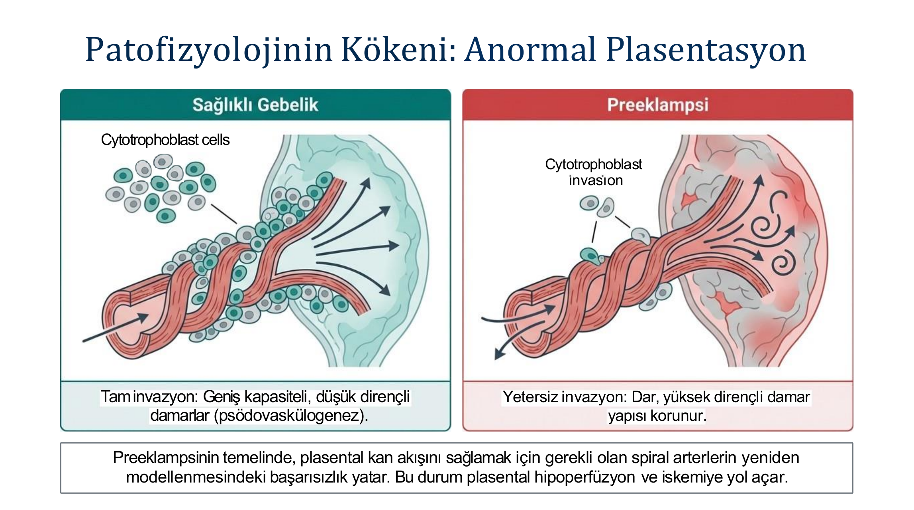

> **Şema yorumu:** Sağlıklı gebelikte sitotrofoblast hücreleri spiral arterlere tam invazyon yapar; sonuçta geniş kapasiteli, düşük dirençli damarlar (psödovaskülogenez) oluşur. Preeklampside ise invazyon yetersizdir; dar ve yüksek dirençli damar yapısı korunur, plasental hipoperfüzyon ve iskemi gelişir.

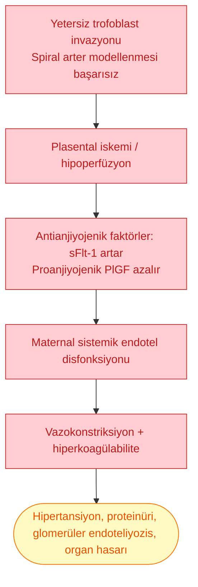

### Patolojik Bulgu: Glomerüler Endoteliyozis

* Proliferasyon olmadan **endokapiller hücrelerin hipertrofisi**ne bağlı glomerüllerde difüz genişleme
* Glomerüler perfüzyon ve filtrasyon azalır
* **Tüm renal lezyonlar geri dönüşümlüdür** -- doğumdan ~6 hafta sonra tamamen normalleşir

### Preeklampside Laboratuvar

* Serum ürik asit >4.5 mg/dL
* Kreatinin >1.1 mg/dL
* 24 saatlik idrarda kalsiyum atılımı azalır
* Proteinüri (Pr/Kr >0.3) ve hyalin silendirler
* Renin ve aldosteron düzeyleri azalmış (sağlıklı gebelikten farklı)
* AST >50 IU/L
* Hb, Hct, trombositte azalma
* Fibrin yıkım ürünleri artar

### Anjiyojenik Biyobelirteçler (sFlt-1 / PlGF)

Preeklampside anti-anjiyojenik faktörler (sFlt-1) artar, pro-anjiyojenik faktörler (PlGF) azalır. Bu anormallikler klinik belirtilerden önce ortaya çıkar ve hastalığın şiddetiyle ilişkilidir.

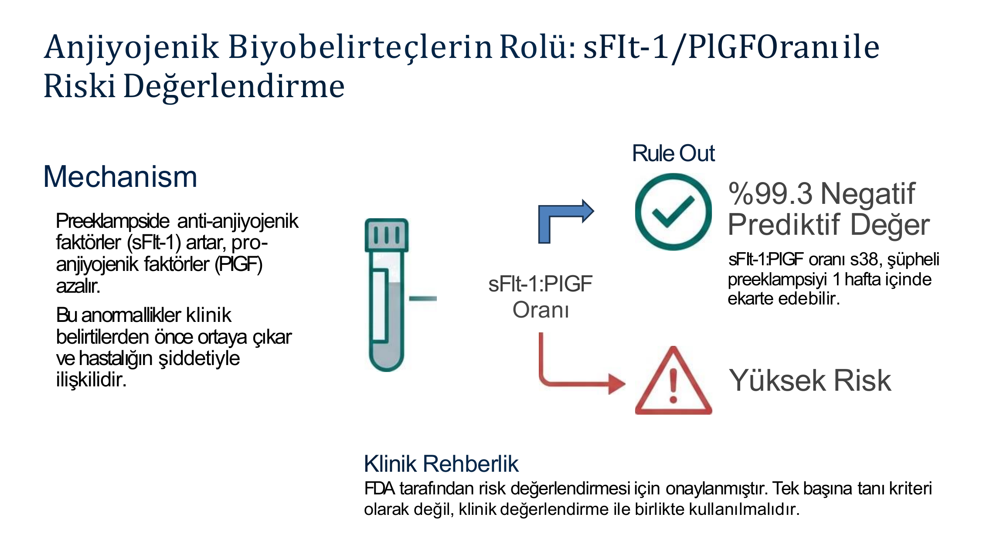

> **Şema yorumu:** sFlt-1/PlGF oranı ≤38 ise şüpheli preeklampsi 1 hafta içinde %99.3 doğrulukla ekarte edilebilir. Oran yüksekse risk yüksektir. FDA bu testi risk değerlendirmesi için onaylamıştır; tek başına tanı kriteri olarak değil, klinik değerlendirme ile birlikte kullanılmalıdır. 34. hafta öncesinde 85, sonrasında 110'dan yüksek değerler PE/HELLP tanısını güçlü destekler.

### Risk Artıran Faktörler -- Özet

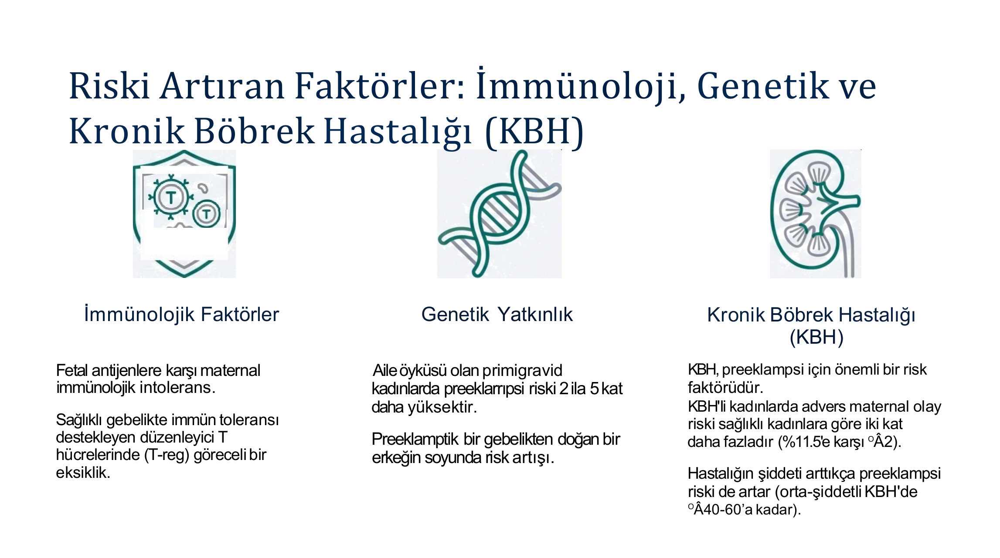

> **Şema yorumu:** Fetal antijenlere karşı maternal immünolojik intolerans, T-reg hücre göreceli eksikliği, aile öyküsü olan primigravidlerde 2-5 kat artan risk; ve özellikle KBH varlığında advers maternal olay riski 2 kat (%11.5'e karşı %2) artar. KBH şiddeti arttıkça preeklampsi riski %40-60'a kadar çıkabilir.

### Tedavi

**Ana prensipler**

* Kesin tedavi = **doğum / gebeliğin sonlandırılması**
* Erken tanı, sıkı KB izlemi, yakın medikal takip
* Hasta hastaneye yatırılmalı; anne ve fetus yakından izlenmeli

**Tedavi eşikleri (preeklampside)**

* **Akut tedavi:** KB >170/110 mmHg
* **Kronik tedavi:** KB >160/90 mmHg
* Hedef: intrakraniyal kanamayı önlemek, DKB 80-100 mmHg

**Genel yönetim**

* Tuz kısıtlaması YAPILMAZ (damar içi hacmi azaltır)
* Diüretik ve sedatifler KULLANILMAZ
* Baş ağrısı, görme bozukluğu, epigastrik ağrı gibi uyarıcı bulgular için hasta eğitimi
* 24-27. gebelik haftalarında fetal sağkalım için beklemeci tedavi desteklenebilir
* KCFT anormalliği, trombositopeni, fetal distres -> beklememek gerekir

### Tedavinin Hassas Dengesi

| Anne Riski (maternal) | Fetal Risk |
|---|---|
| Kontrolsüz HT: inme, kalp yetmezliği, böbrek hasarı, eklampsi | Agresif KB düşüşü uteroplasental dolaşımı bozarak fetal perfüzyonu tehlikeye atabilir |
| Pulmoner ödem | Tüm antihipertansifler plasentayı geçer |

Tedavinin amacı anneyi korurken fetüse zarar vermemektir.

---

## Kronik HT Üzerine Eklenmiş Preeklampsi

Kronik HT'li gebede aşağıdaki kriterlerden biri ile tanı konur:

**Kronik HT ve 20. hf öncesi proteinürisi OLMAYAN gebede:**

* 20. hf sonrası başlayan proteinüri (>0.3 g/24 saat)

**Kronik HT ve 20. hf öncesi proteinürisi OLAN gebede:**

* Proteinüride ani artış
* Kontrol altındaki TA'da ani artış
* Trombositopeni (<100.000/mm³)
* AST/ALT artışı

> **Dikkat:** Kronik HT'li hastada preeklampsi tanısı zor -- KB zaten yüksek ve proteinüri olabilir. KB aniden yükseliyorsa, tedaviye direnç gelişiyorsa, proteinüri artıyorsa veya yeni preeklampsi klinik bulguları çıkıyorsa mutlaka düşün.

---

## HELLP Sendromu

> **Tanım:** **H**emolysis (mikroanjiyopatik hemolitik anemi) + **E**levated **L**iver enzymes + **L**ow **P**latelets

### Laboratuvar

* Mikroanjiyopatik hemolitik anemi
* LDH >600 IU/L
* AST (SGOT) >72 IU/L
* Trombositopeni <100.000 × 10³/mm³
* Eklenebilir: DIK, ABH, serebrovasküler olay, görme bozuklukları, pulmoner ödem

### Klinik

* Çoğunlukla **27-36. haftalarda**
* Olguların **%30'u postpartum ilk 6 günde** gelişir
* **Epigastrik ve/veya sağ üst kadran ağrısı, hipokondriyal ağrı, bulantı-kusma** + hemoliz bulguları olan hipertansif gebede HELLP düşünülmelidir
* Sonraki gebeliklerde rekürrens %19-27

### Prognoz

| Parametre | Oran |
|---|---|
| İnsidans | %0.1-0.6 (gebeliklerde); preeklampside %12 |
| Anne mortalitesi | %1-3 |
| Perinatal mortalite | %35 |

---

## Preeklampsinin Önlenmesi

| Strateji | Kanıt | Dozaj / Açıklama |
|---|---|---|
| **Düşük doz aspirin** | Yüksek riskli gebelerde %10-15 risk azalması (bazı çalışmalarda %60+) | **80-150 mg/gün (tipik 81-162 mg)**, **16. gebelik haftasından ÖNCE başla**, 12-36. hafta arası sürdür |
| **Kalsiyum takviyesi** | Düşük kalsiyum alımı olanlarda RR 0.49 | 1.5-2 g/gün |
| **Yaşam tarzı / kilo yönetimi** | RR 0.74 | Gebelik öncesi sağlıklı kilonun korunması, gestasyonel kilo optimizasyonu |
| Antioksidanlar (Vit C, Vit E) | Etkisiz | Önerilmez |
| Balık yağı, vitamin takviyeleri | Etkisiz | Herhangi bir koruyucu role sahip değil |
| Diyetle kilo kaybı (obezlerde) | Zararlı olabilir | Düşük doğum ağırlıklı bebeklere ve yavaş büyümeye yol açabilir; önerilmez |

> **⚠️ Aspirin zamanlama kritik:** 16. gebelik haftasından ÖNCE başlanmalıdır. Daha geç başlanırsa etkinlik belirgin azalır.

---

## Gebelikte Antihipertansif Tedavi

### Güvenli İlaçlar (İlk Tercih)

| İlaç | Gebelik Kategorisi | Mekanizma | Doz | Yan Etki |
|---|---|---|---|---|
| **Labetalol** | C | Non-selektif beta bloker | 100-2400 mg/gün, 2-3'e bölünmüş; IV 20 mg bolus, gerekirse artan dozlar | Bronkospazm (astım!), hipotansiyon, fetal bradikardi |
| **Nifedipin** (uzun salınımlı) | C | Kalsiyum kanal blokeri | 30-120 mg/gün | Baş ağrısı, periferik ödem, flushing; **sublingual kullanım yasak** |
| **Metildopa** | B | Alfa-2 agonist (santral) | 250-3000 mg/gün, 2'ye bölünmüş | KCFT yükselmesi, sedasyon, depresyon (postpartum dikkat), hemolitik anemi |
| **Hidralazin** | C | Periferal vazodilatör | 50-300 mg/gün; IV 5-10 mg bolus | Hipotansiyon, fetal trombositopeni, lupus benzeri sendrom |
| **Hidroklorotiyazid** | C | Diüretik | 12.5-25 mg/gün | Volüm azalması, hipokalemi -- preeklampside önerilmez |

> **Türk HT Uzlaşı Raporu 2019:** Nifedipin ve labetalol etkileri en iyi bilinen ilaçlardır. Atenolol dışındaki beta-blokerler güvenlidir. Beta-bloker ve KKB, preeklampsiyi önlemede metildopa'dan daha etkindir.

### KESİNLİKLE KONTRENDİKE İlaçlar

> **⚠️ ÖNEMLİ:**
>
> * **ACE inhibitörleri (ACEi)** -- fetal renal anomaliler, oligohidroamnios, kraniyal malformasyon
> * **Anjiyotensin reseptör blokerleri (ARB)** -- aynı fetal toksisite
> * **Direkt renin inhibitörleri** (aliskiren)
> * **Atenolol** -- intrauterin büyüme geriliği ve plasenta ağırlığında azalma
> * **Spironolakton / Eplerenon** -- anti-androjenik etkiler, hacim deplesyonu
> * **Tiyazid diüretikler (rutin)** -- preeklampside plazma volümü zaten azalmış
> * **Sodyum nitroprusid (IV)** -- fetal siyanür zehirlenmesi
> * **Statinler** -- rutin gebelikte önerilmez (KBH+gebelikte bireysel değerlendirme)

### Tedavi Eşikleri ve Hedef

**Hafif-orta HT (140-159 / 90-109 mmHg)**

* ESC 2018: SKB >150 mmHg veya DKB >95 mmHg ise tedavi et
* Proteinüri ile birlikte gestasyonel HT, kronik HT üzerine eklenmiş gebelik HT, klinik belirti vermeyen organ hasarı varsa eşik düşür: **SKB 140 / DKB 90 mmHg**
* Türk HT Uzlaşı 2019: SKB ≥150 ve/veya DKB ≥95 mmHg ise tedavi

**Hedef KB**

* Serebrovasküler/kardiyovasküler olaylardan korunmak için **135-155 / 85-90 mmHg** hedeflenir
* Bazı kılavuzlarda hedef **<140/90 mmHg**
* **Daha sıkı kontrol**: şiddetli HT ve preeklampsi riskinde azalma (olumsuz perinatal sonuçta fark yok)

---

## Şiddetli Hipertansiyonda Acil Yönetim

> **🚨 ACİL:** KB ≥160/110 mmHg şiddetli hipertansiyon. Maternal inme riskini azaltmak için tanıyı takiben **30-60 dakika içinde** IV tedaviye başla.

### Akut Yönetim Algoritması

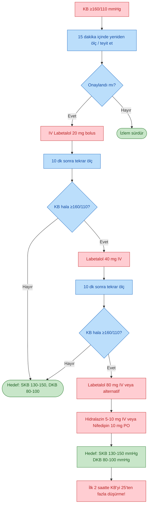

**İlaç seçimleri (IV)**

| İlaç | Başlangıç dozu | Not |
|---|---|---|
| Labetalol | 20 mg IV, artan dozlar (40, 80 mg) | **İlk tercih**; kümülatif doz 800 mg/g'ı aşmamalı |
| Hidralazin | 5-10 mg IV, 20 dk arayla tekrarlanır | Alternatif; daha fazla perinatal yan etki, ilk tercih değil |
| Nifedipin | 10 mg PO, 20 dk arayla tekrar | Oral alternatif |
| Nikardipin | IV infüzyon | Alternatif |
| Urapidil | IV | Dirençli durumlarda |
| **Nitrogliserin** | 5 µg/dk IV (3-5 dk'da max 100 µg/dk) | **Preeklampsi + pulmoner ödem**'de |
| **Sodyum nitroprusid** | -- | **KONTRENDİKE** (fetal siyanür zehirlenmesi) |

**Hedef**

* SKB 130-150 mmHg, DKB 80-100 mmHg
* **İlk 2 saatte KB'yi 25 mmHg'dan fazla düşürmekten kaçın**
* Annedeki akut hipertansif komplikasyonları önlemek için <160/105 mmHg

---

## Eklampsi ve MgSO4

> **Tanım:** Preeklampsili bir gebede **konvülziyonların ortaya çıkması**.

* Preeklampsi + konvülziyon = eklampsi
* Şiddetli preeklampside **eklampsi profilaksisi** için MgSO4 önerilir

### MgSO4 Kullanımı

| Parametre | Dozaj |
|---|---|
| **Yükleme** | 4-6 g IV 15-20 dk'da |
| **İdame** | 1-2 g/saat IV infüzyon |
| Süre | Doğum sonrası en az 24 saat |
| Terapötik düzey | 4-8 mEq/L (4.8-9.6 mg/dL) |
| **Böbrek fonksiyonu azalmış ise** | Doz azaltılır; 4 saatte bir Mg düzeyi takibi; preeklampside Mg dozunu %50 azalt |

**İzlem**

* Derin tendon refleksleri
* Solunum hızı (>12/dk)
* İdrar çıkışı (>30 mL/saat)
* Mg düzeyi
* Toksisitede antidot: **Kalsiyum glukonat 1 g IV**

---

## Gebelikte Akut Böbrek Hasarı (gABH)

### Epidemiyoloji

* Sağlıklı antenatal bakım olan toplumlarda replasman tedavisi gerektirecek ABH: 1/20.000
* Son 50 yılda global düşüş (tıbbi bakım + septik küretaj azalması)
* ABD'de prevalans %0.04-0.12 (son dekatlarda artış)
* Beyazlara göre siyahlarda %52, Kızılderili kadınlarda %45 daha sık
* Çin, Hindistan gibi gelişmekte olan ülkelerde prevalans %1.5

### Risk Faktörleri

* Düşük sosyoekonomik ve eğitim düzeyi
* Uygun olmayan sanitasyon koşulları, sağlık tesislerinin yetersizliği
* Çok doğum sayısı, ileri gebelik yaşı, gecikmiş sevk
* **Komorbidite:** obezite, hipertansiyon, KBH, **diyabet mellitus (4.4 kat fazla risk)**

### Klinik Önemi

**Maternal sonuçlar**

* Gebelikte anne ölümlerinin %17.4'ünde, postpartum anne ölümlerinin %31.5'inde gABH saptanır
* Maternal mortaliteyi %6-30 artırır
* Yatış ve yoğun bakım süresi uzar
* Klinik evre arttıkça nöbet, inme, yoğun bakım ve hemodiyaliz ihtiyacı artar
* **Kardiyovasküler olay riski 10 kat fazla**
* SDBY gelişebilir

**Fetal/neonatal sonuçlar**

* Erken doğum ve düşük doğum ağırlığı
* YDYBÜ yatış süresi uzar
* **Fetal mortalite %60 artar**

### Etyoloji -- Trimesterlere Göre

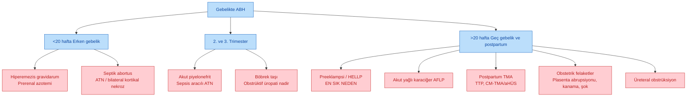

### Sistematik Değerlendirme

| Basamak | İçerik |
|---|---|
| **Anamnez ve FM** | Altta yatan hastalık (SLE vb.), volüm kaybı bulguları (hipotansiyon, taşikardi), ilaç kullanımı (özellikle postpartum NSAİİ), spesifik semptomlar (yan ağrısı, hematüri) |
| **Temel laboratuvar** | Tam idrar tahlili + sediment mikroskopisi, proteinüri kantifikasyonu (24 saatlik idrar veya Pr/Kr), TKS + periferik yayma (MAHA için), hemoliz belirteçleri (bilirubin, haptoglobin, LDH), karaciğer enzimleri (AST, ALT) |
| **Böbrek ultrasonu** | Obstrüksiyonu dışlamak için çoğu hastada gerekli. **Not: Fizyolojik hidronefroz (sağda belirgin) ile patolojik obstrüksiyon ayırt edilmelidir** |

### Klinik Ayırım Özeti

| Alt tip | Klinik | Bulgular | Prognoz |
|---|---|---|---|
| **Prerenal ABH** | Hiperemezis öyküsü, volüm kaybı | Minimal proteinüri, sade TIT | Sıvı replasmanı ile hızla düzelir |
| **Akut tübüler nekroz (ATN)** | Sepsis, kanama, şok | Pigmente granüler silendirler | Destekleyici bakım; 1-3 hafta iyileşme |
| **Renal kortikal nekroz** | Obstetrik felaket (plasenta abrupsiyonu, ağır kanama) sonrası ani oligüri/anüri | Triad: gross hematüri + yan ağrısı + hipotansiyon | Sıklıkla **geri dönüşümsüz**; %20-40 kısmi iyileşme |
| **Obstrüktif üropati** | Yan ağrısı, hematüri (%75-95) | Hidronefroz USG'de | Stent / nefrostomi ile düzelir |
| **Nefritik sendrom (GN)** | SLE alevlenmesi, yeni hastalık | Aktif sediment: hematüri, eritrosit silendirleri | Etyolojiye özgü tedavi |

### Preeklampsi ve gABH

* Tüm gebeliklerin %5-8'inde preeklampsi
* **Gebelikte ABH'nin en sık sebebi (%15-20)**
* Anne ölümlerinin %20'sinde neden
* Şiddetli olmayan preeklampside gABH nadirdir, RRT nadir
* Şiddetli preeklampside gABH daha sık
* **Erken başlangıç (<34 hf)** -- plasental preeklampsi, plasenta matur değilse klinik daha ağır
* **Geç başlangıç (>34 hf)** -- maternal preeklampsi
* Tedavi: **Şiddetli preeklampside acil doğum**

**Preeklampsi + gABH sonuçları**

* Renal ve ekstrarenal anormallikler tipik olarak **doğumdan sonraki 2-3 gün** içinde kendiliğinden düzelmeye başlar
* **GFR normalleşmesi doğumdan sonraki 8 hafta içinde** gerçekleşir
* Proteinüri şiddetli ise tamamen düzelmesi birkaç ay bulabilir
* Preeklampsi geçiren kadınlarda KBH gelişme riski artar ancak mutlak risk küçük
* Şiddetli preeklamptiklerde kardiyovasküler hastalık riski artmıştır

---

## Trombotik Mikroanjiyopatiler (TTP, CM-TMA, HELLP, AFLP)

Geç gebelikte ABH + mikroanjiyopatik hemoliz + trombositopeni tablosunda dört ayrı tanı düşünülmelidir.

### Ayırıcı Tanı Tablosu

| Etyoloji | Başlangıç | Tipik ABH Şiddeti | Yüksek KC Enzimleri | Akut KC Yetmezliği | Doğum Sonrası İyileşme | Diğer Özellik |
|---|---|---|---|---|---|---|
| **Preeklampsi / HELLP** | 3. trimester | Değişken | Sık | Nadir | **Evet** | İlk gebelikte daha sık |
| **TTP** | 2. ve 3. trimester | Hafif | Nadir | Nadir | Hayır | **ADAMTS13 aktivitesi <%10** |
| **CM-TMA (aHÜS)** | Geç 3. trimester veya **postpartum** | Şiddetli | Nadir | Nadir | Hayır | İlk gebelikte daha az olası |
| **Akut yağlı karaciğer (AFLP)** | 3. trimester | Değişken | Her zaman | Sık | Evet | İştahsızlık, bulantı, kusma; **hipoglisemi, amonyak yüksekliği** |

### Ek Laboratuvar Ayrımı

| Parametre | Preeklampsi/HELLP | AFLP | TTP | CM-TMA |
|---|---|---|---|---|
| Hipertansiyon | %100 | %50 | Değişken | %85 |
| Trombositopeni | Genellikle >100.000 | Genellikle >50.000 | Genellikle <20.000 | Genellikle >20.000 |
| Hipoglisemi | Yok | **Mevcut** | Yok | Yok |
| Amonyak yüksekliği | -- | **Yaygın** | Yok | Nadir |
| ADAMTS13 düzeyi | Normal | Normal | **<%5-10** | Normal |
| sFlt-1/PlGF | Anormal | Normal | Normal | Anormal |

### TTP vs CM-TMA (aHÜS)

| Özellik | TTP | CM-TMA (aHÜS) |
|---|---|---|
| Patofizyoloji | ADAMTS13 aktivitesinde ciddi eksiklik (≤%10) | Kontrolsüz kompleman aktivasyonu |
| Başlangıç zamanı | 2. ve 3. trimester | **Sıklıkla postpartum** |
| ABH şiddeti | Daha az yaygın, hafif | Yaygın ve şiddetli (çoğu diyaliz gerekir) |
| Tedavi | **Plazma değişimi** | **Anti-kompleman tedavi (Eculizumab)** |
| Prognoz | İleri evre KBH nadirdir | Anti-kompleman olmadan %53 SDBY |

### Etyolojiye Yönelik Tedavi Özeti

| Tanı | Tedavi |
|---|---|
| Preeklampsi (ağır) / HELLP / AFLP | **Acil doğum** |
| TTP | **Plazma değişimi** |
| CM-TMA (aHÜS) | **Eculizumab** (anti-kompleman) |
| ATN | Destekleyici bakım |
| Obstrüksiyon | Üreter stent / nefrostomi |
| Lupus nefriti | Spesifik immünsüpresif tedavi |

### Uzun Dönem Prognoz

| Durum | Uzun dönem |
|---|---|
| Preeklampsi | Böbrek fonksiyonları 8 hafta içinde düzelir; uzun dönemde KBH/HT riski artar |
| ATN | 1-3 hafta içinde iyileşme tipik |
| Renal kortikal nekroz | Genellikle geri dönüşümsüz; çoğu diyalize bağımlı, %20-40 kısmi iyileşme |
| CM-TMA | Tedavisiz kötü; tedaviyle belirgin düzelme |
| TTP | İleri evre KBH nadir |

---

## Gebelikte İdrar Yolu Enfeksiyonu

Gebelikte İYE'ye yatkınlığın nedenleri:

* Üriner staz (hidronefroz, hidroüreter)
* Yüksek aminoasit ve glukoz içeriği (bakteri için uygun ortam)
* Üreterovezikal sfinkter gevşemesi -- **vezikoüreteral reflü**
* **E. coli** en sık etken

### Sınıflandırma

| Tip | Sıklık | Özellik |
|---|---|---|
| Asemptomatik bakteriüri | %2-10 | Semptomsuz; tarama şart |
| Sistit-üretrit | -- | Semptomatik alt İYE |
| Piyelonefrit (piyelitis gravidarum) | ~%1 (gebeliklerin %2'sine kadar) | Akut üst İYE |

### Asemptomatik Bakteriüri (AsB)

> **Tanım:** Ateş, titreme, dizüri, abdominal ve kostovertebral ağrı olmaksızın, idrar kültüründe mL'de **≥100.000 organizma üremesi**.

* **9-17. gebelik haftalarında sık**
* Tedavi edilmezse **%20-40 akut piyelonefrit** gelişir
* Preterm doğum ve düşük doğum ağırlığı riskini artırır

**Tarama ve tedavi**

* **Tüm gebeler taranmalı** (TIT dipstick lökosit + idrar kültürü)
* Öyküde İYE, orak hücre özelliği, DM, nefrolitiazis varsa direkt kültür
* **4-7 gün tedavi** (nitrofurantoin, fosfomisin, beta-laktam uygun seçenekler)
* **Takip:** tedavi bitiminden 1 hafta sonra ve 4-6 haftada bir kültür; her kontrolde TIT

### Akut Piyelonefrit (APN)

* İnsidans ~%2
* **20-28. haftalar ve erken puerperal dönemde sık**
* Olguların yarısında başlangıçta asemptomatik bakteriüri
* **E. coli** en sık etken

**Klinik**

* Ani başlangıç
* Ateş, titreme, tek veya iki taraflı lomber/yan ağrısı
* İştahsızlık, bulantı, kusma
* Kostovertebral hassasiyet
* İdrar sedimenti: lökosit ve bakteri kümeleri

**Tedavi**

1. **Acil yatış**
2. İdrar kültürü
3. Yeterli hidrasyon
4. **IV antibiyotik**: ampisilin 1-2 g/4 saat, sefoksitin 1-2 g/8 saat
5. Ateşsiz 24 saat sonrasında oral tedaviye geçiş
6. **Toplam tedavi süresi: 21 gün**
7. Tedavi bitiminden 7-10 gün sonra idrar kültürü tekrar
8. Rekürrens durumunda **supresif tedavi** (nitrofurantoin 100 mg/gün)

> **Dikkat:** Aynı gebelik içinde piyelonefrit rekürrens insidansı %10-18. Preterm doğum riski artar, sepsis ve sepsis aracılı ATN gelişebilir.

---

## Kronik Böbrek Hastalığı ve Gebelik

> **Temel ilke:** KBH tanılı kadınlarda gebe kalma oranı düşüktür, komplikasyonsuz gebelik sürdürme oranı düşüktür, başarılı gebelik oranı KBH evresi ile yakından ilişkilidir.

### Fertilite

* Diyaliz grubunda 1980'lere kıyasla fertilite oranı ~%90 artış:
  - Yoğun ve etkili diyaliz
  - Diyalizle ilişkili bakımda iyileşme
  - ESA tedavisinin libido üzerindeki olumlu etkisi
* Menstrüel sikluslar düzensiz / amenore olsa dahi **gebelik gerçekleşebilir**
* Doğurganlık çağındaki KBH'li kadınlarda aylık gebelik testi önerilir (menstruasyon düzensizse)

### Gebelikte Riskli KBH Göstergeleri

* Serum kreatinin **>1.4 mg/dL**
* GFR'de yetersiz artış
* Proteinüri ve HT varlığı
* Gebelik öncesi proteinüride artış

### KBH'de Maternal ve Fetal Riskler

| Maternal | Fetal |
|---|---|
| Renal fonksiyonlarda bozulma / proteinüride artış | Preterm doğum |
| Primer hastalığın alevlenmesi | Ölü doğum / neonatal ölüm |
| Gebelik ilişkili HT (gestasyonel HT, preeklampsi, HELLP) | Düşük doğum ağırlığı |
| İmmünsüpresif ilişkili komplikasyonlar | Fetal büyüme geriliği, küçük gestasyonel yaş |
| -- | Düşük |

### KBH'nin Gebelik Seyri Üzerine Etkisi

* GFR'deki ılımlı düşüşler dahi preeklampsi, gestasyonel HT ve prematüre doğum riskini artırır
* **Evre 1 KBH** grubunda komplike gebelik riski:
  - Proteinüri varlığında **3.7 kat**
  - Hipertansiyon varlığında **3.4 kat**
* Gebelik öncesi HT varlığı <34 hafta preterm eylemle ilişkili
* **Konsepsiyon sürecinde ortalama arter basıncı >105 mmHg olan gebelerde fetal ölüm riski 10 kat**
* Düşük GFR + proteinüri varlığında kümülatif risk artışı

### KBH Progresyonu

Progresyon sonlanımları: serum kreatininin 2 katına çıkması, GFR'nin %25-50 azalması, SDBY'ye ilerleme.

* Erken evre KBH'de progresyon riski ılımlıdır
* Proteinüri ve kontrolsüz HT progresyon riskini artırır
* Postpartum dönemde renal fonksiyonlar kısmen/tamamen geri dönebilir

### Gebelikte KBH İzleminin Bileşenleri

**Gebelik öncesi**

* Gebelik öncesi danışmanlık ve planlama
* Teratojen ilaçların kesilmesi (ACEi/ARB, statin, MMF)
* Fetal/maternal riskleri artıran ilaçların kesilmesi
* Etkileri net bilinmeyen ilaçlardan kaçınma
* İmmünsüpresif tedavinin düzenlenmesi (MMF -> azatiyoprin veya takrolimus)
* Tedavi düzenlemesi sonrası güvenli konsepsiyon zamanı belirleme

**Gebelik döneminde**

* Diyetin düzenlenmesi
* Hipertansiyon yönetimi
* Anemi yönetimi
* Metabolik kemik hastalığının yönetimi

**Diyaliz gereksiniminde**

* Diyalize başlama endikasyonları
* Diyalizdeki gebede takip
* Peripartum bakım
* Postpartum bakım

### Ciddi Renal Yetmezliği Olan Gebe Hastada Genel Yaklaşım

* **Aspirin profilaksisi:** 12. haftadan sonra 75 mg/gün
* **KB hedefi:** DKB 80-90 mmHg
* **Anemi:** Hb >11 g/dL olmalı
* **Kalsiyum:** normokalsemik düzeyde tutulmalı
* **Metabolik asidoz:** sodyum bikarbonat ile düzelt, HCO3 >24 mmol/L
* **Protein alımı:** 1 g/kg/gün + 20 g/gün (fetüs için)

---

## Diyaliz Hastası Gebelik

### Gebelikte Diyaliz Başlama Endikasyonları

* GFR <20 mL/dk/1.73 m²
* Serum BUN >50-60 mg/dL (klasik kriter: kreatinin 3.5-4 mg/dL, BUN >50)
* Metabolik asidoz
* Sıvı yüklenmesi
* Kontrolsüz kan basıncı
* Metabolik parametrelerin medikal tedaviyle kontrol edilememesi

### Hemodiyaliz Reçetesi (Gebe)

| Parametre | Değer |
|---|---|
| Diyaliz sıklığı | **5-6 seans / hafta** |
| Diyaliz süresi | **>36 saat / hafta (>6 saat/gün)** |
| Kuru ağırlık | 2. ve 3. trimesterde 0.5 kg/hafta artış |
| UF hızı | 6-8 mL/kg/saat |
| Diyalizat K | 3 mmol/L |
| Diyalizat Ca | 1.5 mmol/L |
| Diyalizat HCO3 | 28-32 mmol/L |
| Antikoagülasyon | Düşük doz unfraksiyone heparin |
| Fosfor | Diyalizata fosfor eklenmesi gerekebilir |

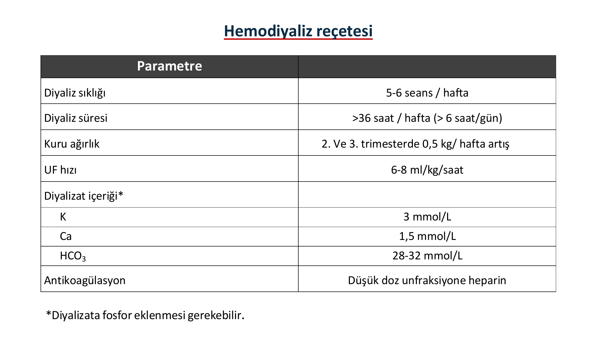

> **Tablo yorumu:** Gebelikte diyaliz reçetesi geleneksel rejimden farklıdır: haftada 5-6 seans ve toplam 36 saatten fazla, yüksek bikarbonat (28-32 mmol/L), düşük UF hızı (6-8 mL/kg/sa) ve düşük doz unfraksiyone heparin tercih edilir.

### Genel İlkeler

* **Yoğun diyaliz** gebelik sonuçlarını iyileştirir (BUN <50 mg/dL hedefi)
* Eritropoetin (ESA) ihtiyacı artar
* Metabolik asidoz düzeltilmeli (serum HCO3 >24 mmol/L)
* Diyet: 50 mmol K/gün, 80 mmol Na/gün, 1500 mg Ca/gün, 1 g/kg/gün protein + 20 g/gün fetüs için
* Diyaliz sırasında **hipotansiyondan kaçınılmalı** (<120/70 mmHg olmamalı)
* Diyalizler arası kilo artışı 1 kg'ı geçmemelidir

### Periton Diyalizi

* Değişim volümleri azaltılır
* Günde 5-6 kez değişim
* Peritoneal kavite büyüyen uterus tarafından etkilenir

### Trimesterlere Göre İzlem Planı

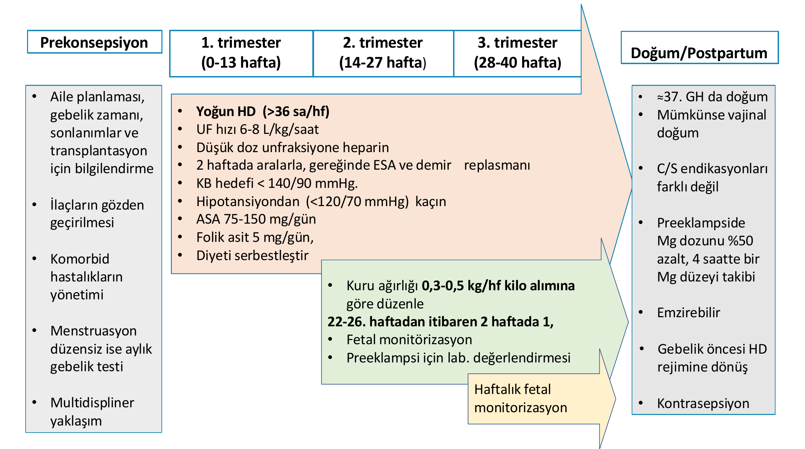

> **Şema yorumu:** Prekonsepsiyonda aile planlaması ve ilaç gözden geçirme; 1. trimesterde yoğun HD (>36 sa/hf), UF hızı 6-8 mL/kg/sa, düşük doz unfraksiyone heparin, 2 haftada bir ESA/demir, KB hedefi <140/90, aspirin 75-150 mg/gün, folik asit 5 mg/gün; 2. trimesterde kuru ağırlığı 0.3-0.5 kg/hf kilo alımına göre düzenle, 22-26. haftadan itibaren 2 haftada bir fetal monitörizasyon ve preeklampsi laboratuvarı; 3. trimesterde haftalık fetal monitör; doğumda ~37. gebelik haftasında doğum, mümkünse vajinal, preeklampside Mg dozunu %50 azalt ve 4 saatte bir Mg düzeyi takibi; emzirme ve kontrasepsiyon planı.

| Dönem | Ana müdahaleler |
|---|---|
| **Prekonsepsiyon** | Aile planlaması, gebelik zamanı, sonlanım bilgilendirmesi, transplantasyon seçeneği; ilaçların gözden geçirilmesi; komorbiditelerin yönetimi; menstruasyon düzensizse aylık gebelik testi; multidisipliner yaklaşım |
| **1. trimester (0-13 hf)** | Yoğun HD (>36 sa/hf), UF 6-8 mL/kg/sa, düşük doz unfraksiyone heparin, 2 haftada bir ESA/demir, KB hedefi <140/90, hipotansiyondan (<120/70) kaçın, ASA 75-150 mg/gün, folik asit 5 mg/gün, diyeti serbestleştir |
| **2. trimester (14-27 hf)** | Kuru ağırlığı 0.3-0.5 kg/hf kilo alımına göre düzenle; 22-26. haftadan itibaren 2 haftada bir fetal monitörizasyon; preeklampsi için laboratuvar değerlendirmesi |
| **3. trimester (28-40 hf)** | Haftalık fetal monitörizasyon |
| **Doğum / postpartum** | ~37. GH'da doğum; mümkünse vajinal doğum; C/S endikasyonları farklı değil; preeklampside Mg dozunu %50 azalt, 4 saatte bir Mg düzeyi takibi; emzirilebilir; gebelik öncesi HD rejimine dönüş; kontrasepsiyon |

---

## Böbrek Transplantlı Hastada Gebelik

### Zamanlama

* **Canlı böbrek transplantasyonu sonrası: 1 yıl** beklenmeli
* **Kadavra böbrek transplantasyonu sonrası: 2 yıl** beklenmeli
* Stabil greft fonksiyonu (kreatinin <1.5 mg/dL, proteinüri minimal)
* Rejeksiyon olmamalı, hipertansiyon kontrollü olmalı

### İmmünsüpresif Ayarı

> **⚠️ MMF KESİNLİKLE KESİLMELİ:** Mikofenolat mofetil **teratojeniktir** (yarık dudak-damak, kulak anomalileri, ekstremite malformasyonları). Gebelikten en az 6 hafta önce kesilmelidir.

| İlaç | Gebelikte Durum |
|---|---|
| **MMF (mikofenolat)** | **KONTRENDİKE** (teratojenik) |
| **Azatiyoprin** | Güvenli (FDA D ama yaygın kullanılır) |
| **Takrolimus** | Güvenli; düzeyi sık takip edilmelidir |
| **Siklosporin** | Güvenli; düzeyi takip edilmeli |
| **Prednizon / steroidler** | Güvenli (düşük dozda) |
| **mTOR inhibitörleri (sirolimus, everolimus)** | Kontrendike |
| **Belatasept** | Veri sınırlı, önerilmez |

### Komplikasyonlar

* Preeklampsi (%30'a varan)
* Preterm doğum
* İYE / akut piyelonefrit (grafte yakın transplante üreterden ötürü)
* Rejeksiyon riski (gebelikte hafif artar)
* Greft fonksiyonunda gerileme
* İmmünsüpresif ilişkili gestasyonel diyabet / HT

---

## Özel Durumlar: Lupus Nefriti, Diyabetik Nefropati

### Lupus Nefriti

* Gebelikte SLE aktive olabilir
* **Aktif SLE dönemindeyken gebelik** -- yüksek fetal kayıp oranı
* **En az 1 yıl remisyondan sonra gebeliğe izin** verilmelidir
* Gebelikte hastalık tedavisinde **prednizon ve azatiyoprin** kullanılabilir
* **Antikardiyolipin antikoru** taşıyanlarda fetal kayıp %40; sonraki gebeliklerde daha da artabilir
  - Tedavi: **Düşük molekül ağırlıklı heparin (LMWH)** + **Aspirin 75-100 mg/gün** (gebelik başlangıcından itibaren)

### Diyabetik Nefropati

* Renal fonksiyonları normal, glisemik kontrolü iyi olan gebelerde **fetal sağkalım %90'ın üzerinde**
* **Ciddi renal fonksiyon bozukluğunda gebelik önerilmez**
* Yoğun glisemik kontrol, aspirin profilaksisi, HT kontrolü (metildopa/labetalol/nifedipin)
* ACEi/ARB gebelikten önce kesilmeli

### Preeklampsi ve Primer Renal Hastalık Ayırıcı Tanısı

| Özellik | Preeklampsi | Primer renal hastalık |
|---|---|---|
| Proteinüri başlangıcı | 20. hf sonrası | **20. hf öncesi** olabilir |
| Hematüri | **Yok** | Sık |
| İdrar silendirleri | Nadiren hyalin | **Sık (eritrosit/lökosit silendiri)** |
| HT başlangıcı | 20. hf sonrası | 20. hf öncesi olabilir |
| Ürik asit | **>4.5 mg/dL** | <4.5 mg/dL |
| Postpartum proteinüri | 3 ay içinde kaybolur (12 aya kadar) | Devam eder |

---

## Uzun Dönem Sonuçlar ve Postpartum Takip

### Gebelikteki HT'nin Uzun Dönem Etkileri

**Anne için riskler (preeklampsi sonrası uzun dönem)**

| Sonuç | Risk Artışı |
|---|---|
| Kronik hipertansiyon | **4.5 kat** |
| İskemik kalp hastalığı | 2.1 kat (bazı çalışmalarda 2 kat) |
| İnme | 2.1 kat |
| **Son dönem böbrek yetmezliği** | **4.9 kat** |
| Vasküler demans | 2.4 kat |

**Çocuk için riskler (in utero maruziyet)**

| Sonuç | Etki |
|---|---|
| Sistolik KB (genç erişkinlikte) | +5.1 mmHg |
| Diyastolik KB | +4.3 mmHg |
| Obezite | Daha yüksek vücut kitle indeksi |
| İnme | 1.9 kat |

> **Klinik ilke:** Gebelikteki hipertansif bozukluklar, hem anne hem çocuk için ömür boyu sürecek bir kardiyovasküler ve renal sağlık göstergesidir. Doğum sonrası takip ve risk azaltma stratejileri esastır.

### Postpartum Takibe Alınacak Gebeler

* 34. haftadan önce preeklampsi gelişenler
* Rekürrent preeklampsi
* **6 haftadan uzun devam eden proteinüri**
* **6 haftadan uzun devam eden hipertansiyon**

### Takip İçeriği

* Primer renal hastalık araştırılması
* Esansiyel veya sekonder HT değerlendirmesi
* Antifosfolipid antikor sendromu
* Protein S, Protein C eksikliği
* Kardiyovasküler risk faktörlerinin düzenli taraması (lipid, glukoz, BMI)
* Yaşam tarzı önerileri (kilo, egzersiz, tuz, sigara bırakma)

### Laktasyon

Tüm antihipertansifler anne sütüne geçer; ancak konsantrasyon genellikle düşüktür.

| Laktasyonda KAÇINILMASI gereken | Laktasyonda güvenli |
|---|---|
| **Propranolol** (yüksek konsantrasyon) | Labetalol |
| **Nifedipin** (anne sütünde maternal plazma ile aynı konsantrasyon -- dikkatli) | Metoprolol |
| **Metildopa** (postpartum depresyon riski) | Nifedipin retard (dikkatle) |
| -- | ACEi (enalapril, kaptopril -- laktasyonda güvenli, gebelikte değil) |

---

## Vaka Örnekleri

**📋 VAKA ÖRNEĞİ 1: Erken Preeklampsi**

**Hasta:** 32 yaşında, primigravid, 28. gebelik haftası
**Öykü:** Son 1 haftadır artan baş ağrısı, el-yüz ödemi, görme bulanıklığı. 16. haftada ölçülen KB 115/75 mmHg idi.
**Fizik Muayene:** Nabız 88/dk, TA 168/112 mmHg, Solunum 18/dk, SpO2 %98. Pretibial 2+ ödem, DTR canlı.
**Laboratuvar:** Kreatinin 1.3 mg/dL (gebelik öncesi 0.6), proteinüri 2.4 g/24 saat, AST 78 U/L, ALT 65 U/L, trombosit 95.000/µL, LDH 680 U/L, ürik asit 6.2 mg/dL.
**Tanı:** **Ağır özellikli preeklampsi + HELLP gelişme zemini**
**Tedavi:**

* Yatış, yakın fetal izlem
* IV labetalol 20 mg bolus, gerekirse 40 mg tekrarı (hedef SKB 130-150, DKB 80-100)
* **MgSO4** 4 g IV yükleme + 1-2 g/saat idame (eklampsi profilaksisi)
* Antenatal kortikosteroid (fetal akciğer maturasyonu)
* 48 saat içinde değerlendirme -- klinik kötüleşme veya HELLP kriterleri tamamlanırsa acil doğum
**İzlem:** 30. haftada sezaryen. Postpartum 3. günde trombosit ve KCFT normalleşti. 8. haftada GFR ve proteinüri tamamen normal.

**Öğretici Notlar:**

1. Ağır preeklampside KB hedefi 130-150 / 80-100 mmHg; ilk 2 saatte KB'yi 25 mmHg'dan fazla düşürme
2. ACEi/ARB kesinlikle kontrendike -- MMF de keserseniz transplant değilseniz kullanılmaz
3. MgSO4 eklampsi profilaksisinin standardıdır; renal fonksiyon bozulmuşsa doz azaltılır ve düzey izlenir
4. Postpartum 8 hafta sonra GFR normalleşmezse KBH açısından takip şart

---

**📋 VAKA ÖRNEĞİ 2: Kronik Böbrek Hastalığı Zemininde Gebelik**

**Hasta:** 29 yaşında, evre 2 KBH (IgA nefropatisi), bazal kreatinin 1.2 mg/dL, proteinüri 1.5 g/gün. Gebelik planlıyor.
**Öykü:** 3 yıl önce IgA nefropatisi tanısı. ACE inhibitörü (ramipril 10 mg) ve nifedipin 30 mg alıyor. KB evde 128/82 mmHg.
**Değerlendirme:** Preeklampsi yüksek risk grubunda.
**Gebelik Öncesi Plan:**

* **Ramipril durdur**, labetalol veya metildopa ile değiştir (hedef <140/90)
* Folik asit 5 mg/gün başla
* Diyet ve kilo değerlendirmesi
* Multidisipliner (nefroloji + kadın doğum) takip planı
**Gebelik Sırasında:**
* 12. haftadan sonra düşük doz **aspirin 100-150 mg/gün** (preeklampsi profilaksisi)
* Her ayda serum kreatinin, proteinüri, idrar kültürü
* 22. haftadan itibaren 2 haftada bir fetal monitörizasyon
* Anemi için ESA/demir (Hb >11 g/dL hedef)
**Sonuç:** 37. haftada vajinal doğum; postpartum kreatinin 1.4 mg/dL (hafif geri döndü), proteinüri 2 g/gün. ACE inhibitörü yeniden başlandı (gebe değilken).

**Öğretici Notlar:**

1. KBH'li kadında gebelik ÖNCESİ danışmanlık şart; ACEi/ARB/MMF/statin kesilmeli
2. Aspirin 12-16. haftada başlanmalı, geç başlanırsa etkinlik azalır
3. Evre 1-2 KBH'de gebelik genelde başarılıdır ama progresyon riski ve preeklampsi riski vardır
4. Postpartum renal fonksiyon bazale göre kısmen geriler, uzun süreli takip gerekir

---

**📋 VAKA ÖRNEĞİ 3: Postpartum CM-TMA (aHÜS)**

**Hasta:** 26 yaşında, postpartum 4. gün (3. gebeliği, normal vajinal doğum)
**Öykü:** Gebeliği komplikasyonsuz geçmiş, ~39. haftada doğum. 3. günde halsizlik, oligüri, idrar koyulaşması.
**Fizik Muayene:** Nabız 102/dk, TA 158/98 mmHg, SpO2 %97. Soluk görünüm, periferik peteşiler.
**Laboratuvar:** Hb 8.1 g/dL (periferik yaymada şistositler), trombosit 42.000/µL, LDH 1450 U/L, haptoglobin <10 mg/dL, kreatinin 4.8 mg/dL (doğumda 0.7), AST 54 U/L, ALT 40 U/L, ADAMTS13 aktivitesi %65 (normal).
**Ayırıcı Tanı:** Postpartum TMA -- HELLP (unlikely, KCFT hafif), TTP (ADAMTS13 normal, ekarte), **CM-TMA (aHÜS)** -- en olası
**Tedavi:**

* Destekleyici bakım, gerektiğinde hemodiyaliz
* **Eculizumab** başlanır (anti-C5 monoklonal antikor)
* Meningokok aşısı (Eculizumab öncesi/sonrası)
**İzlem:** Eculizumab sonrası 3. haftada trombosit ve Hb normalleşti; kreatinin 1.6 mg/dL'ye geriledi (tam düzelme yok, uzun vadeli evre 3 KBH).

**Öğretici Notlar:**

1. Postpartum MAHA + trombositopeni + ABH üçlüsünde **CM-TMA** ilk akla gelmeli (özellikle tablo 48 saatten uzun sürüyorsa)
2. ADAMTS13 aktivitesi ayırıcı tanıda belirleyici: <%10 -> TTP, >%10 -> CM-TMA veya HELLP
3. AFLP için hipoglisemi ve amonyak yüksekliği ipucu verir
4. CM-TMA'da **Eculizumab** olmadan %53 SDBY; erken tedavi greft fonksiyonunu korur

---

**📋 VAKA ÖRNEĞİ 4: Gebe Diyaliz Hastası**

**Hasta:** 31 yaşında, kronik HD hastası (3 yıl, polikistik böbrek hastalığı), 8 haftalık gebe
**Öykü:** Standart 4 saat × 3/hafta diyaliz alıyor. Menstruasyonlar düzensizdi; rutin pregnancy testinde pozitif çıktı.
**Plan:**

* Diyaliz sıklığını **5-6 seans/hafta** (gün başına ~6 saat), toplam **>36 saat/hafta**
* Diyalizat: K 3 mmol/L, Ca 1.5 mmol/L, HCO3 28-32 mmol/L
* UF hızı 6-8 mL/kg/saat, diyaliz aralarında kilo artışı <1 kg
* Düşük doz unfraksiyone heparin
* ESA dozu %50 artırıldı; demir replasmanı
* Folik asit 5 mg/gün
* Aspirin 100 mg/gün (12. haftadan sonra)
* KB hedefi <140/90, hipotansiyondan kaçın
* 22. haftadan itibaren 2 haftada bir fetal monitör
**Sonuç:** 36. haftada elektif sezaryen; 2450 g sağlıklı bebek. Postpartum standart HD rejimine dönüş.

**Öğretici Notlar:**

1. Düzenli menstruasyonu olmayan diyaliz hastasında gebelik atlanabilir -- rutin gebelik testi önemli
2. Gebe diyaliz hastasında **yoğun HD** (>36 sa/hf) maternal ve fetal sonuçları belirgin iyileştirir
3. UF hızı düşük tutulmalı (6-8 mL/kg/sa), hipotansiyon fetusu zarar verir
4. BUN <50 mg/dL hedeflenmeli; yüksek BUN fetal ozmotik diürez yapar

---

## Özet ve Son Sözler

### Klinik İnci Noktalar

> **⚠️ ÖNEMLİ:**
>
> * Gebelikte normal kreatinin ~0.5 mg/dL; **>0.8 mg/dL** patolojik ipucu
> * Proteinüri normali **≤300 mg/gün**, üstü anlamlı
> * Ürik asit gebelik ortasında **düşer**; **akut yükselme preeklampsinin erken bulgusu**
> * Hidronefroz fizyolojiktir (sağ > sol); ağrı eşlik ediyorsa patolojiyi araştır
> * Preeklampsi tanısında proteinüri artık **zorunlu değil** -- yeni HT + hedef organ hasarı yeterli
> * sFlt-1/PlGF oranı ≤38 ise preeklampsi 1 hafta içinde ekarte edilebilir
> * Aspirin profilaksisi 12-16. haftadan **önce** başlanmalı; yüksek riskli gebelerde 81-162 mg/gün
> * **ACE inhibitörleri, ARB, direkt renin inhibitörleri KESİNLİKLE KONTRENDİKE** (fetotoksik)
> * Atenolol, spironolakton, statinler, sodyum nitroprusid de kullanılmaz
> * Gebelikte ilk tercih HT ilaçları: **labetalol, nifedipin, metildopa**
> * MgSO4 eklampsi profilaksi ve tedavisinin standardıdır
> * **HELLP** -- hipertansif gebede epigastrik/SÜK ağrısı + hemoliz bulgusu
> * Transplant sonrası: **canlı donör 1 yıl, kadavra 2 yıl** beklenmeli; **MMF teratojenik, kesilmeli**
> * Gebe diyaliz hastası: **5-6 seans/hafta, >36 sa/hf**, yoğun HD
> * Preeklampsi sonrası anne için uzun dönemde **SDBY riski 4.9 kat**, kronik HT riski 4.5 kat artar

### Gebelikteki 4 Hipertansif Tablo -- Hızlı Özet

| Tablo | Başlangıç | Proteinüri | Hedef organ | Tedavi |
|---|---|---|---|---|
| Kronik HT | <20 hf | ± | ± | İlaç ayarı, takip |
| Gestasyonel HT | ≥20 hf | Yok | Yok | Takip, KB kontrolü |
| Preeklampsi | ≥20 hf | + veya hedef organ hasarı | + | Doğum, MgSO4, antihipertansif |
| Kronik HT + PE | ≥20 hf (kronik HT zemininde) | Yeni veya ani artış | Yeni | Doğum, MgSO4, antihipertansif |

### Gebelikte ABH Etyoloji -- Trimester Haritası

* **<20 hf:** Hiperemezis (prerenal), septik abortus (ATN)
* **2-3. trimester:** Akut piyelonefrit, böbrek taşları
* **>20 hf / postpartum:** **Preeklampsi/HELLP (en sık)**, AFLP, TTP, CM-TMA (aHÜS), obstetrik felaketler, üreteral obstrüksiyon

---

## Kaynaklar

1. **Gebelikte kardiyovasküler hastalıkların tedavisine ilişkin ESC kılavuzları**, 2011
2. R. Gentry Wilkerson, Adeolu C. Ogunbodede. **Hypertensive Disorders of Pregnancy**, Emerg Med Clin N Am 37 (2019) 301-316
3. Amelia L.M. Sutton. **Hypertensive Disorders in Pregnancy**, Obstet Gynecol Clin N Am 45 (2018) 333-347
4. **2018 ESC/ESH Guidelines** for the management of arterial hypertension
5. **Türk Hipertansiyon Uzlaşı Raporu 2019**
6. **2020 International Society of Hypertension** global hypertension practice guidelines
7. **ACOG Practice Bulletin 222**: Gestational Hypertension and Preeclampsia (2022)
8. **ISSHP** classification and diagnosis of pregnancy hypertensive disorders
9. Dutch Guideline Working Group on Pregnancy in CKD. **Kidney Int Rep.** 2022;7(12):2575-2588
10. Wiles K, et al. The impact of CKD stages 3-5 on pregnancy outcomes. **Nephrol Dial Transplant** 2021;36(11):2008-2017
11. Piccoli GB, et al. Risk of Adverse Pregnancy Outcomes in Women with CKD. **J Am Soc Nephrol** 2015;26(8):2011-2022
12. Jungers P, Chauveau D. Pregnancy in renal disease. doi:10.1038/ki.1997.408
13. Cochrane: Calcium supplementation during pregnancy for preventing hypertensive disorders. **Cochrane Database Syst Rev** 2006;3:CD001059
14. Rolnik DL et al. **Aspirin versus placebo in pregnancies at high risk for preterm preeclampsia.** N Engl J Med 2017;377:613-622
15. Magann EF, Martin JN. **Twelve Steps to Optimal Management of HELLP Syndrome.** Clin Obstet Gynecol 1999;42(3):532-50

---

*Hazırlayan: Prof. Dr. Yavuz Yeniçerioğlu -- Aydın Adnan Menderes Üniversitesi Nefroloji Bilim Dalı*
*Kaynak PDF'ler: "7) Gebelikte Hipertansiyon ve Böbrek Hastalıkları" (2020-2021 dönem) ve "10-Gebelik ve Böbrek yeni" (12 Ocak 2026 güncelleme)*
