# HEMODİYALİZ

**Hazırlayan:** Prof. Dr. Yavuz Yeniçerioğlu
**Bölüm:** Aydın Adnan Menderes Üniversitesi -- Nefroloji Bilim Dalı

---

## İÇİNDEKİLER

1. [Kronik Böbrek Hastalığı ve Renal Replasman Tedavileri](#kronik-böbrek-hastalığı-ve-renal-replasman-tedavileri)
2. [Türkiye Epidemiyolojisi](#türkiye-epidemiyolojisi)
3. [Hemodiyaliz -- Temel Fiziksel Kavramlar](#hemodiyaliz----temel-fiziksel-kavramlar)
4. [Difüzyon](#difüzyon)
5. [Ultrafiltrasyon (UF) ve TMP](#ultrafiltrasyon-uf-ve-tmp)
6. [Konveksiyon](#konveksiyon)
7. [Adsorpsiyon](#adsorpsiyon)
8. [Hemodiyaliz Gereksinimleri](#hemodiyaliz-gereksinimleri)
9. [RRT Endikasyonları (Üremik Sendrom ve AEIOU)](#rrt-endikasyonları-üremik-sendrom-ve-aeiou)
10. [Vasküler Akses -- Damara Ulaşım](#vasküler-akses----damara-ulaşım)
11. [Arteriyovenöz Fistül (Altın Standart)](#arteriyovenöz-fistül-altın-standart)
12. [AV Fistül -- "Rule of 6's"](#av-fistül----rule-of-6s)
13. [AV Greft](#av-greft)
14. [Santral Venöz Kateterler (Geçici ve Tünelli)](#santral-venöz-kateterler-geçici-ve-tünelli)
15. [Vasküler Akses Komplikasyonları](#vasküler-akses-komplikasyonları)
16. [Diyalizer (Hollow-Fiber)](#diyalizer-hollow-fiber)
17. [Membran Özellikleri](#membran-özellikleri)
18. [Klerens Özellikleri](#klerens-özellikleri)
19. [Hemodiyaliz Suyu](#hemodiyaliz-suyu)
20. [Diyaliz Solüsyonu (Diyalizat)](#diyaliz-solüsyonu-diyalizat)
21. [Hemodiyaliz İşlemi](#hemodiyaliz-işlemi)
22. [Solüsyon Döngüsü ve Güvenlik](#solüsyon-döngüsü-ve-güvenlik)
23. [Antikoagülasyon Yöntemleri](#antikoagülasyon-yöntemleri)
24. [Hemodiyaliz Reçetesi (Planı)](#hemodiyaliz-reçetesi-planı)
25. [Ev Hemodiyalizi](#ev-hemodiyalizi)
26. [Alternatif Hemodiyaliz Yöntemleri](#alternatif-hemodiyaliz-yöntemleri)
27. [Hemodiyafiltrasyon (HDF)](#hemodiyafiltrasyon-hdf)
28. [Sürekli Renal Replasman Tedavileri (SRRT)](#sürekli-renal-replasman-tedavileri-srrt)
29. [İntradiyaliz Komplikasyonları (Sık)](#intradiyaliz-komplikasyonları-sık)
30. [İntradiyaliz Komplikasyonları (Sık Olmayan Fakat Ciddi)](#intradiyaliz-komplikasyonları-sık-olmayan-fakat-ciddi)
31. [Disekilibrium Sendromu](#disekilibrium-sendromu)
32. [Diyalizer Reaksiyonları (First-Use)](#diyalizer-reaksiyonları-first-use)
33. [Kronik Hemodiyaliz Hasta Yönetimi](#kronik-hemodiyaliz-hasta-yönetimi)
34. [Kuru Ağırlık](#kuru-ağırlık)
35. [Diyaliz Yeterliliği (Kt/V, URR)](#diyaliz-yeterliliği-ktv-urr)
36. [HD Hastası İzlemi](#hd-hastası-izlemi)
37. [Akut Zehirlenmelerde Diyaliz](#akut-zehirlenmelerde-diyaliz)
38. [Hangi Hastaya Hangi RRT -- Kontrendikasyonlar](#hangi-hastaya-hangi-rrt----kontrendikasyonlar)
39. [HD vs PD Tercih Tablosu](#hd-vs-pd-tercih-tablosu)
40. [Vaka Örnekleri](#vaka-örnekleri)
41. [Özet ve Anahtar Noktalar](#özet-ve-anahtar-noktalar)

---

## KRONİK BÖBREK HASTALIĞI VE RENAL REPLASMAN TEDAVİLERİ

> **Tanım:** **Kronik böbrek hastalığı (KBH)**, nefronların **ilerleyici ve geri dönüşümsüz kaybı** ile karakterize, ekskresyon ve metabolik fonksiyonların değişen derecelerde etkilendiği klinik tablodur. Süreç son evreye ulaştığında (**son dönem böbrek yetmezliği -- SDBY**) hasta yaşamını sürdürebilmek için **renal replasman tedavisi (RRT)** gereksinir.

### SDBY'de Tedavi Seçenekleri (Renal Replasman Tedavileri)

| RRT Türü | Alt Tipler |
|---|---|
| **Hemodiyaliz (HD)** | Merkez HD / Ev HD |
| **Periton diyalizi (PD)** | Manuel (SAPD) / Aletli (APD) |
| **Böbrek transplantasyonu** | Canlıdan / Kadavradan |

> **Anahtar kavram:** HD, PD ve transplantasyon **birbiriyle yarışan değil, birbirini tamamlayan yöntemlerdir**; her hasta için en uygun olanı seçilir ve **tedaviler arası geçiş mümkündür**.

---

## TÜRKİYE EPİDEMİYOLOJİSİ

Türk Nefroloji Derneği 2023 Ulusal Kayıt Sistemi verileri tabloyu özetlemektedir:

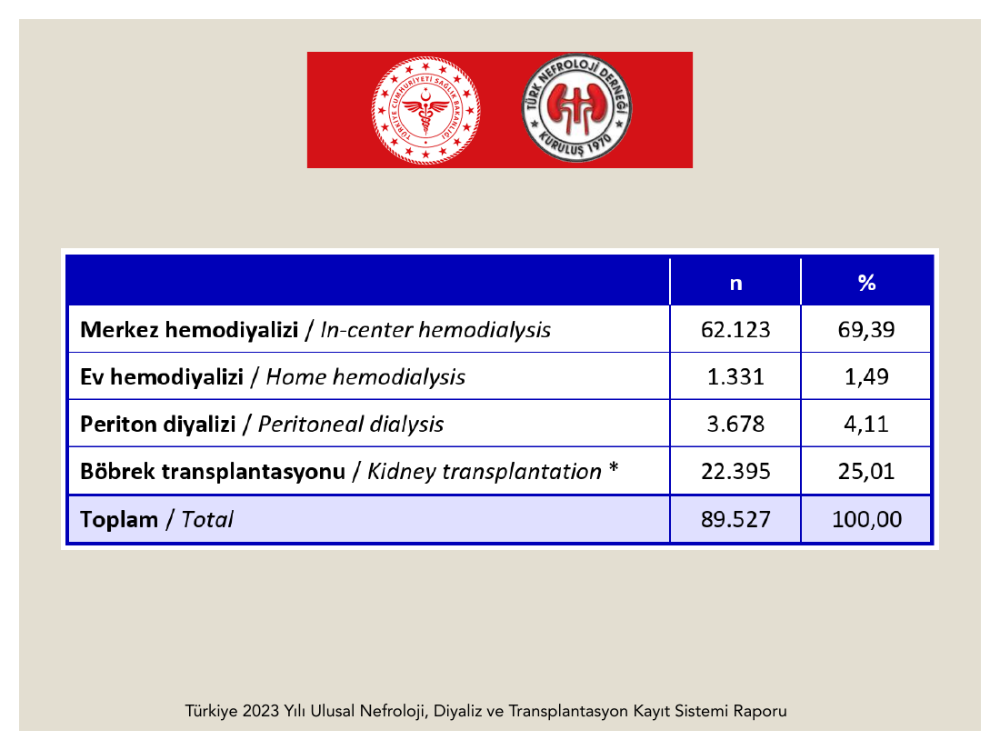

### RRT Dağılımı (Türkiye 2023)

| Tedavi | Hasta sayısı (n) | Yüzde (%) |
|---|---|---|
| Merkez hemodiyalizi | 62.123 | 69,39 |
| Ev hemodiyalizi | 1.331 | 1,49 |
| Periton diyalizi | 3.678 | 4,11 |
| Böbrek transplantasyonu | 22.395 | 25,01 |
| **Toplam** | **89.527** | **100** |

> **Yorum:** Türkiye'de RRT alan her 10 hastanın **~7'si merkez hemodiyalizi** almaktadır; hemodiyaliz **en yaygın kullanılan RRT yöntemidir**.

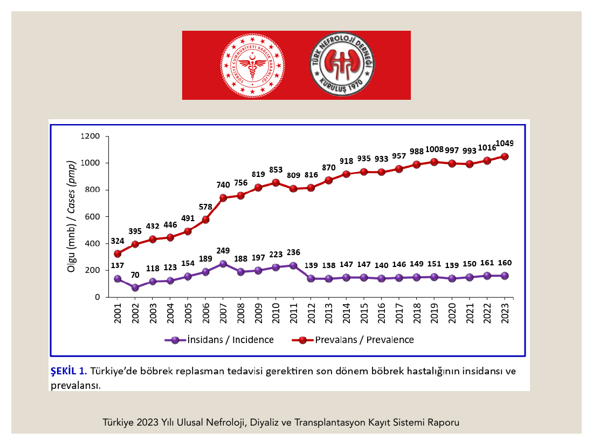

> **Şema yorumu:** Kırmızı eğri prevalansı (milyon nüfus başına düşen mevcut SDBY hastası) gösterir ve yıllar içinde **yaklaşık 3 katına** çıkmıştır. Mor eğri yıllık insidansı (yeni SDBY olgusu) gösterir ve 2008'den bu yana **~150/milyon seviyesinde stabildir**. Anlamı: Yeni SDBY hızı yavaşlamış, ancak **RRT altında yaşayan hastaların sağkalımı uzadığı için toplam hasta havuzu büyümektedir**.

### HD Hastalarında KBH Etiyolojisi (Türkiye 2023)

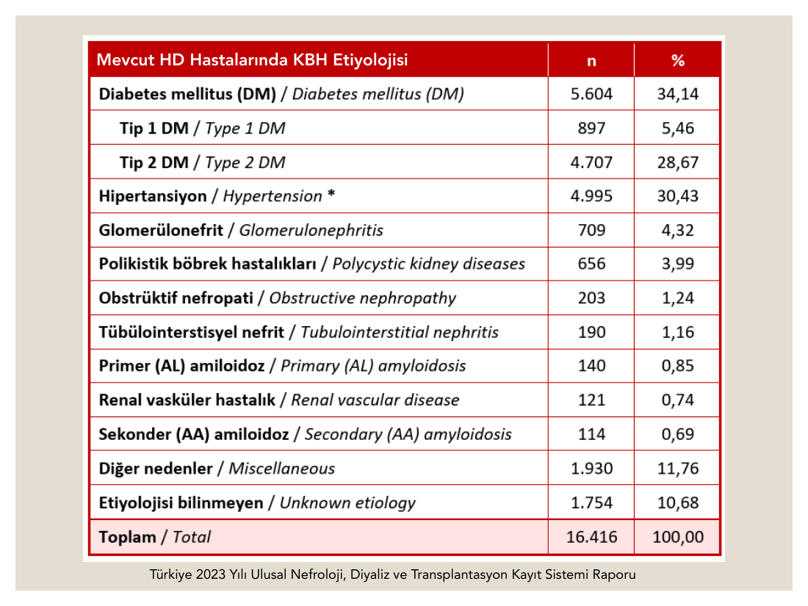

| Etiyoloji | n | % |
|---|---|---|
| **Diabetes mellitus (DM)** | 5.604 | **34,14** |
| -- Tip 1 DM | 897 | 5,46 |
| -- Tip 2 DM | 4.707 | 28,67 |
| **Hipertansiyon** | 4.995 | **30,43** |
| Glomerülonefrit | 709 | 4,32 |
| Polikistik böbrek hastalığı | 656 | 3,99 |
| Obstrüktif nefropati | 203 | 1,24 |
| Tübülointerstisyel nefrit | 190 | 1,16 |
| Primer (AL) amiloidoz | 140 | 0,85 |
| Renal vasküler hastalık | 121 | 0,74 |
| Sekonder (AA) amiloidoz | 114 | 0,69 |
| Diğer | 1.930 | 11,76 |
| Etiyoloji bilinmeyen | 1.754 | 10,68 |
| **Toplam** | **16.416** | **100** |

> **Anahtar:** HD hastalarının **~%65'inde altta yatan neden DM veya HT'dir**. Her iki hastalıkta da agresif kan basıncı ve glisemik kontrol, RAS blokajı, albüminüri takibi ile diyalize giriş geciktirilebilir.

---

## HEMODİYALİZ -- TEMEL FİZİKSEL KAVRAMLAR

Hemodiyalizin temelinde **yarı-geçirgen membran** aracılığıyla kan ile diyalizat arasındaki solüt ve su alışverişi yatar. Dört temel fiziksel mekanizma işlemin arkasındadır:

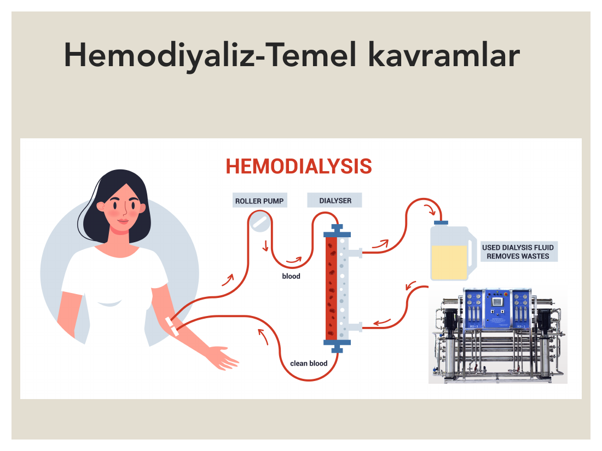

> **Şema yorumu:** Hastadan alınan kan **roller pompa** ile **dializer**e (hemodiyaliz filtresi) pompalanır. Saflaştırılmış sudan hazırlanan diyalizat ters yönde dializere girer; yarı-geçirgen membran üzerinden solüt ve su alışverişi olur. Üremik toksinleri ve fazla sıvıyı içeren kullanılmış diyalizat atılır, **temizlenmiş kan** venöz hatla hastaya döner.

| Mekanizma | Sürücü güç | Ne uzaklaştırır |
|---|---|---|
| **Difüzyon** | Konsantrasyon gradiyenti | Küçük solütler (üre, kreatinin, K⁺) |
| **Ultrafiltrasyon (UF)** | Hidrostatik basınç (TMP) | Su (sıvı uzaklaştırma) |
| **Konveksiyon** | Solvent sürüklemesi ("solvent drag") | Orta-büyük moleküller (β₂-mikroglobulin) |
| **Adsorpsiyon** | Membran yüzeyine kimyasal bağlanma | Bazı orta moleküller, endotoksinler |

---

## DİFÜZYON

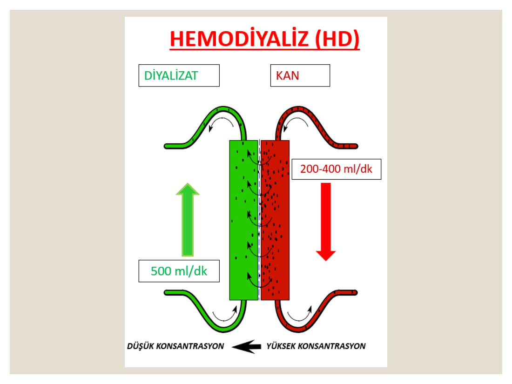

> **Şema yorumu:** Kan (kırmızı) **yukarıdan aşağı 200-400 mL/dk** hızla akar; diyalizat (yeşil) **karşı yönde (counter-current) 500 mL/dk** ile akar. Karşı-akım tasarımı **konsantrasyon gradiyentini membran boyunca korur** ve klerensi maksimize eder.

**Difüzyonu belirleyen faktörler:**

* **Solüt uzaklaştırma miktarı** (kan--diyalizat konsantrasyon farkı, Fick yasası)
* **Solüt çapı** (küçük moleküller daha hızlı geçer)
* **Membran özellikleri** (yüzey alanı, kalınlık, por çapı)
* **Akım hızları** (yüksek kan ve diyalizat akımı difüzyonu artırır)

> **Klinik çıkarım:** Üre (60 Da) difüzyonla **çok iyi**, kreatinin (113 Da) iyi, B₁₂ (1355 Da) **orta derecede**, β₂-mikroglobulin (11.800 Da) ise difüzyonla **kötü** uzaklaştırılır. Orta-büyük moleküller için konveksiyon daha etkindir.

---

## ULTRAFİLTRASYON (UF) VE TMP

Su (ve suda çözünmüş küçük moleküller) **hidrostatik basınç farkı** ile membrandan geçirilir. Bu basınç farkına **transmembran basınç (TMP)** denir.

**UF hızını belirleyen 3 faktör:**

1. **Sıvı uzaklaştırma hedefi** (hastanın kilosu ile kuru ağırlık arasındaki fark)
2. **TMP gradiyenti** (pozitif kan tarafı -- negatif diyalizat tarafı)
3. **Membranın suya geçirgenliği** = **Ultrafiltrasyon katsayısı (K_Uf)**

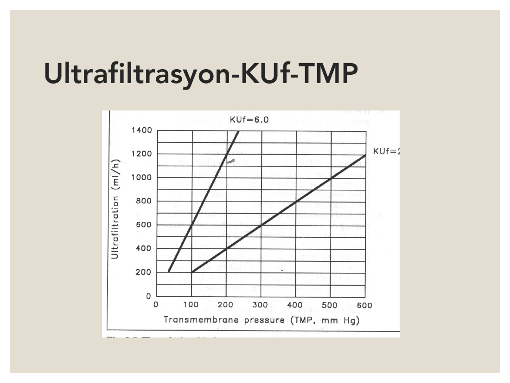

> **Şema yorumu:** X ekseninde transmembran basınç (TMP, mmHg), Y ekseninde saatlik ultrafiltrasyon miktarı (mL/saat) yer alır. Her bir eğri belirli bir K_Uf değerine sahip membranı temsil eder. **Düşük K_Uf'lu (low-flux) membranlarda** aynı TMP daha az UF sağlar; **yüksek K_Uf'lu (high-flux) membranlarda** daha az basınçla çok daha yüksek UF elde edilir. Dik bir eğim = daha yüksek membran geçirgenliği.

**K_Uf değerleri (mL/saat/mmHg):**

* Düşük akılı (low-flux) selüloz: **2-8**
* Yüksek akılı (high-flux) sentetik: **20-50**
* in vivo değerler in vitro'dan **%5-30 daha düşüktür** (protein tabakası nedeniyle).

---

## KONVEKSİYON

* **Solvent drag (sürüklenme)** prensibi: Su membrandan geçerken içinde çözünmüş daha büyük çaplı solütleri **beraberinde sürükler**
* **Orta moleküller** (β₂-mikroglobulin, parathormon, bazı sitokinler) için tek etkin uzaklaştırma yolu
* Konveksiyonun yoğun kullanıldığı yöntemler: **hemofiltrasyon, online hemodiyafiltrasyon (HDF)**

---

## ADSORPSİYON

* Solütlerin **membran yüzeyine kimyasal bağlanması** ile uzaklaştırılması
* Bazı **sentetik membranlar** (polisülfon, polieter sülfon, AN69) için özellikle önemlidir
* Endotoksin, sitokin, orta-büyük proteinler kısmen adsorpsiyonla tutulabilir

---

## HEMODİYALİZ GEREKSİNİMLERİ

Bir hemodiyaliz seansını gerçekleştirmek için 7 temel bileşen gereklidir:

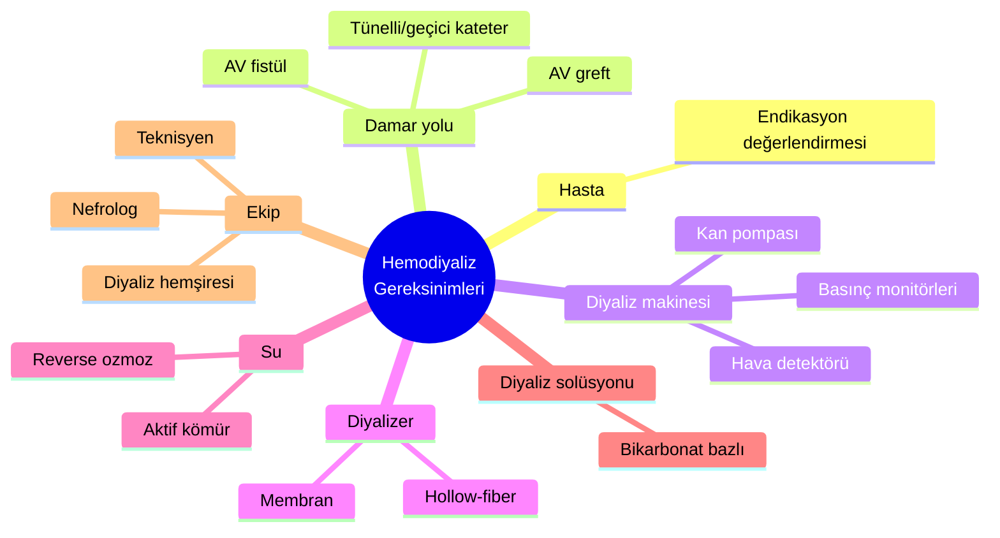
```mermaid
mindmap
  root((Hemodiyaliz<br>Gereksinimleri))
    Hasta
      Endikasyon değerlendirmesi
    Damar yolu
      AV fistül
      AV greft
      Tünelli/geçici kateter
    Diyaliz makinesi
      Kan pompası
      Basınç monitörleri
      Hava detektörü
    Diyalizer
      Hollow-fiber
      Membran
    Su
      Reverse ozmoz
      Aktif kömür
    Diyaliz solüsyonu
      Bikarbonat bazlı
    Ekip
      Nefrolog
      Diyaliz hemşiresi
      Teknisyen
```

---

## RRT ENDİKASYONLARI (ÜREMİK SENDROM VE AEIOU)

Akut diyaliz endikasyonları klasik olarak **"AEIOU"** kısaltmasıyla özetlenir:

| Harf | Anlam | Örnek |
|---|---|---|
| **A** | **A**sidoz | Tedaviye dirençli metabolik asidoz (pH <7,1) |
| **E** | **E**lektrolit bozukluğu | Tedaviye dirençli **hiperkalemi**, ciddi hiponatremi |
| **I** | **I**ntoksikasyon | Diyalizable toksin (metanol, etilen glikol, salisilat, lityum) |
| **O** | **O**verload (hipervolemi) | Dirençli pulmoner ödem, malign HT, kalp yetmezliği |
| **U** | **Ü**remi semptom/bulguları | Ensefalopati, perikardit, plevrit, kanama |

### Üremik Sendrom

* **Belirtiler:** Bulantı, kusma, iştahsızlık, kaşıntı, **üremik ensefalopati**
* **Bulgular:** Üremik **perikardit** ve **plevrit**, üremik **nöropati**, **üremik akciğer**, **üremik frost** (terde çöken üre kristalleri)

### Kronik Diyaliz Başlangıç Kriterleri

* **Kreatinin klerensi (GFR) <10-15 mL/dk**
* DM hastalarında daha erken (GFR ~15 mL/dk civarı) başlanabilir
* **Absolute** ≥1 üremik endikasyon varsa GFR'den bağımsız diyaliz başlatılır

> **⚠️ ÖNEMLİ:** Her hasta diyalize alınmalı mı? **Hayır.** Çok yaşlı, ileri komorbiditesi olan, beklenen yaşam süresi kısa ve yaşam kalitesi düşük hastalarda **konservatif yaklaşım** (palyatif üremi yönetimi) hasta ile birlikte değerlendirilmelidir. **Karar hasta-merkezli olmalı, hasta karar sürecine aktif katılmalıdır.**

---

## VASKÜLER AKSES -- DAMARA ULAŞIM

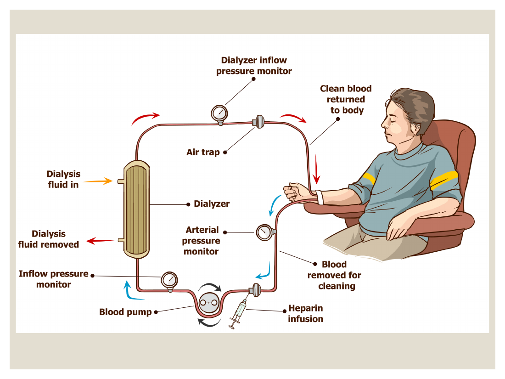

> **Şema yorumu:** Hastadan **arteriyel iğne** ile kan alınır; önce **arteriyel basınç monitörü** (−20 ile −80 mmHg, aşırı negatif olmamalı) geçilir. **Kan pompası (roller pump)** kanı 200-400 mL/dk hızla ilerletir. **Heparin infüzyonu** devreye katılarak pıhtılaşma önlenir. **Dializer**de diyalizat ile solüt/sıvı alışverişi yapılır. Dializerden çıkan kan **venöz basınç monitörü** (+50 ile +100 mmHg) ve **hava tuzağı (air trap) + hava detektörü** üzerinden geçtikten sonra **venöz iğne** ile hastaya döner.

### Damar Yolu Seçenekleri

1. **Arteriyovenöz (AV) fistül** -- altın standart
2. **Arteriyovenöz (AV) greft** -- fistül yapılamazsa
3. **Santral venöz kateter** (tünelli veya geçici)

> **"Fistula First" prensibi:** Mümkün olan her hastada **ilk tercih AV fistül** olmalıdır. Kateter ve greftin enfeksiyon, tromboz ve sağkalım üzerinde olumsuz etkisi fistülden belirgin fazladır.

---

## ARTERİYOVENÖZ FİSTÜL (ALTIN STANDART)

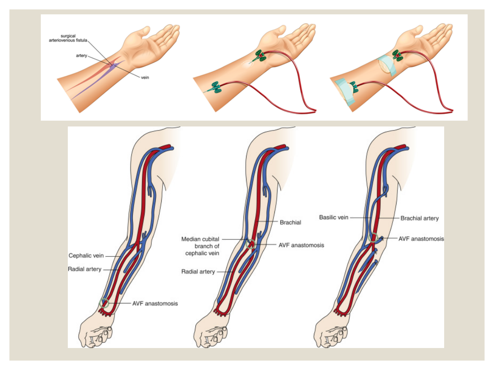

> **Şema yorumu:** Üst panelde **distal radyosefalik fistülün** (Brescia-Cimino, 1966) cerrahi aşamaları görülmektedir: radyal arter ile sefalik ven yan-yan anastomozu, maturasyonla genişleme ve kanülasyon. Alt panelde üst ekstremite fistül seçenekleri:
>
> * **Radiosefalik fistül** (el bileği) -- ilk tercih; distalden başlama prensibi
> * **Brakiyosefalik fistül** (antekubital) -- radiosefalik uygun değilse
> * **Transpoze brakiyobazilik fistül** -- yüzeyel venler yetersizse bazilik venin cilde transpoze edilmesi

### AV Fistül Avantajları

* **En uzun açıklık (patency) süresi** (5-10 yıl)
* **En düşük enfeksiyon riski**
* **En düşük mortalite oranı**
* Endojen doku -- trombojenik olmayan
* Yüksek akım (>600 mL/dk)

### AV Fistül Dezavantajları

* **Maturasyon gerekir** (6-12 hafta, ortalama 6 hafta)
* Fistül yapılamadığı hastalar (periferik damar hastalığı, diyabetik mikrovasküler hastalık)
* Steal sendromu, yüksek-debili kalp yetmezliği riski

---

## AV FİSTÜL -- "RULE OF 6's"

Fistülün kullanılabilir sayılması için karşılanması gereken ölçütler:

| Ölçüt | Değer |
|---|---|
| Maturasyon süresi | **≥6 hafta** |
| Ven çapı | **≥6 mm** |
| Ciltten derinliği | **≤6 mm** |
| Akım hızı | **≥600 mL/dk** |

### Fistül Muayenesi -- "Look, Feel, Listen"

| Adım | Ne aranır | Normal bulgu | Patolojik |
|---|---|---|---|
| **Look (İnspeksiyon)** | Şişlik, renk değişikliği, enfeksiyon bulgusu, anevrizma | Rahat dolgun ven | Eritem, ülser, pseudoanevrizma |
| **Feel (Palpasyon)** | Thrill (titreşim), cilt ısısı, ödem | Yumuşak devamlı thrill | Thrill kaybı (tromboz), pulsatil thrill (stenoz), ciltte soğuma |
| **Listen (Oskültasyon)** | Bruit (üfürüm) | Düşük tonlu, devamlı (sistol+diyastol) | Yüksek perdeli/kesikli bruit (stenoz), kaybolma (tromboz) |

---

## AV GREFT

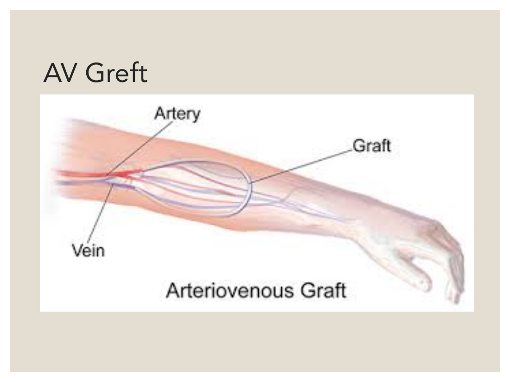

> **Şema yorumu:** Native venlerin yetersiz olduğu hastalarda arter ile ven arasına **sentetik tüp (politetrafloroetilen -- PTFE)** yerleştirilir. Kan arterden grefte, oradan vene akar; hemodiyaliz iğneleri greft üzerinden girilir.

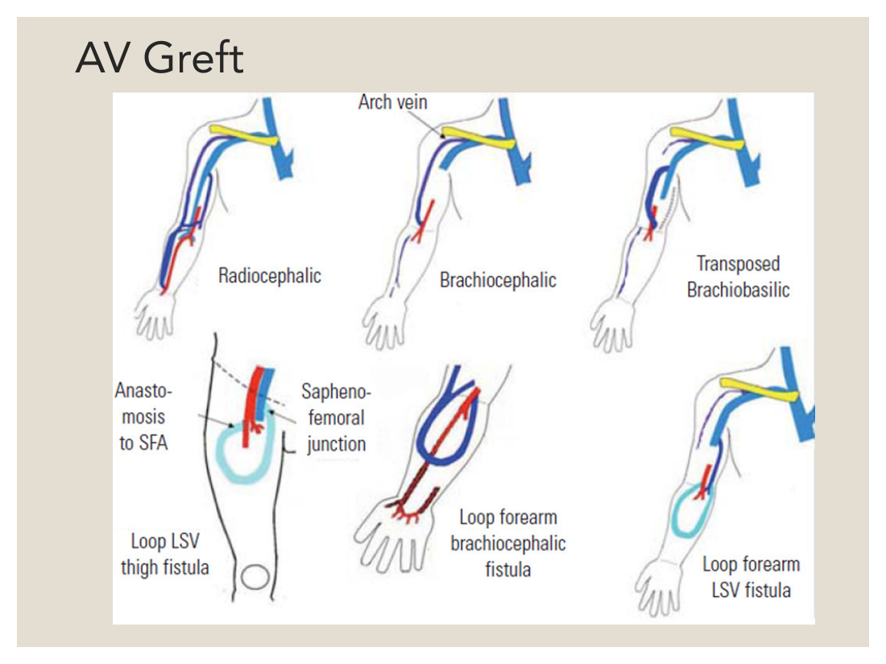

> **Şema yorumu:** Üst kol ve ön kolda greft **düz (straight)** veya **loop (ilmek)** şeklinde yerleştirilebilir. Tüm üst ekstremite akses seçenekleri tükenmişse **uyluk femoral loop grefti** veya **safenofemoral greft** seçenek olabilir.

### AV Greft Özellikleri

| Özellik | Değer |
|---|---|
| Kullanıma hazır olma | **2-4 hafta** (fistülden kısa) |
| Primer açıklık (1 yıl) | ~%50 |
| Sekonder açıklık (1 yıl) | ~%70 |
| Enfeksiyon riski | **Fistülden yüksek** |
| Tromboz riski | **Fistülden yüksek** |

---

## SANTRAL VENÖZ KATETERLER (GEÇİCİ VE TÜNELLİ)

### Geçici (Non-Tünelli) Kateter

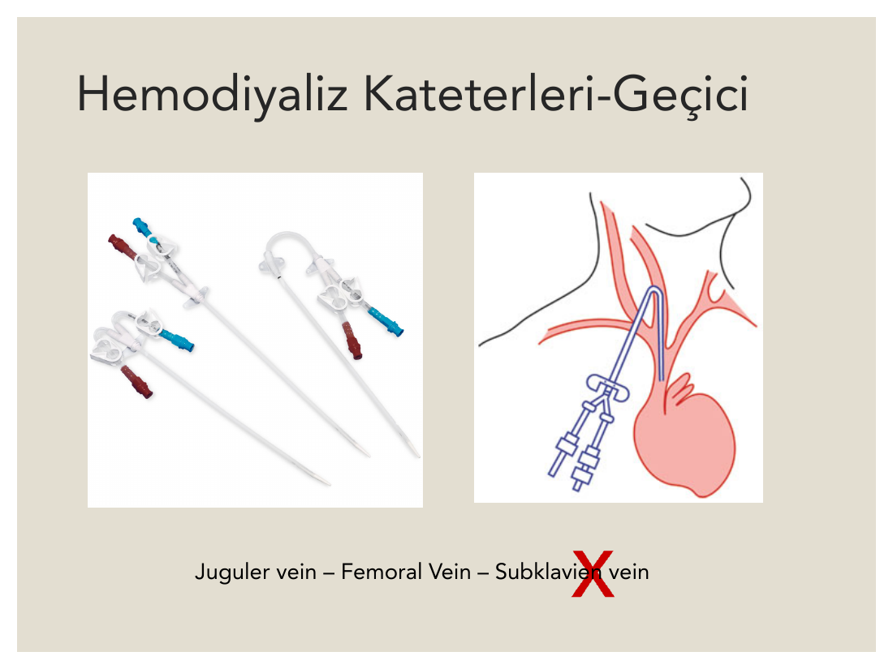

> **Şema yorumu:** Geçici hemodiyaliz kateterleri **çift lümenli** olarak tasarlanmıştır (arteriyel ve venöz port). Tercih sırası:
>
> 1. **İnternal juguler ven** (ilk tercih) -- sağ taraf anatomik olarak daha düzdür
> 2. **Femoral ven** -- acil durumlarda, kısa süreli
> 3. **Subklavian ven -- TERCİH EDİLMEZ** (şemadaki kırmızı X): subklavian stenoz gelişimi ileride aynı taraf AV fistül/greftin çalışmasını **imkânsız kılar**.

### Tünelli (Kalıcı) Kateter

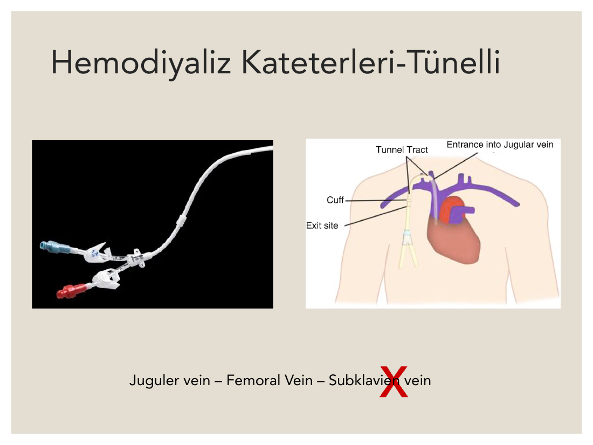

> **Şema yorumu:** Tünelli kateter, **cilt altı tünel** içinden geçerek **Dacron manşeti (cuff)** ciltaltı dokuya fibröz olarak bağlanır; bu yapı bakteriyel göçü ve ekstirpasyonu önler. Ucu **sağ atriyum-vena kava superior birleşim yerinde** sonlanır. Uzun süreli (haftalar-aylar) kullanım için uygundur; fistül maturasyonu bekleyen hastada köprü olarak da kullanılır.

### Geçici vs Tünelli Kateter Karşılaştırma

| Özellik | Geçici | Tünelli |
|---|---|---|
| Cuff (manşet) | Yok | Var |
| Kullanım süresi | Günler-haftalar (max 3-4 hafta) | Aylar-yıllar |
| Enfeksiyon riski | **Çok yüksek** | Daha düşük (cuff barriyer) |
| Akım hızı | 200-300 mL/dk | 300-400 mL/dk |
| Endikasyon | Acil HD, geçici ihtiyaç | Uzun süreli, fistül yok |

---

## VASKÜLER AKSES KOMPLİKASYONLARI

| Komplikasyon | Tipik klinik | Yaklaşım |
|---|---|---|
| **Tromboz** | Thrill kaybı, HD'de akım düşüklüğü | Endovasküler trombolitik / cerrahi trombektomi |
| **Stenoz** | Yüksek venöz basınç, resirkülasyon, uzun iğne bası süresi | Perkütan anjiyoplasti (PTA) |
| **Enfeksiyon** | Giriş yerinde eritem, ateş, bakteremi | Kültür + antibiyoterapi; greft/kateter çekimi |
| **Steal sendromu** | Distal iskemi (soğuk, siyanotik el, ağrı, nekroz) | DRIL prosedürü, banding, ligasyon |
| **Yüksek-debili kalp yetmezliği** | Akım >2 L/dk, kardiyomegali | Akım azaltma (banding) |
| **Anevrizma / pseudoanevrizma** | Lokal şişlik, pulsatil kitle | Cerrahi düzeltme |
| **Kateter malpozisyonu / kink** | Akım alınamıyor | Floroskopik repozisyon |

---

## DİYALİZER (HOLLOW-FIBER)

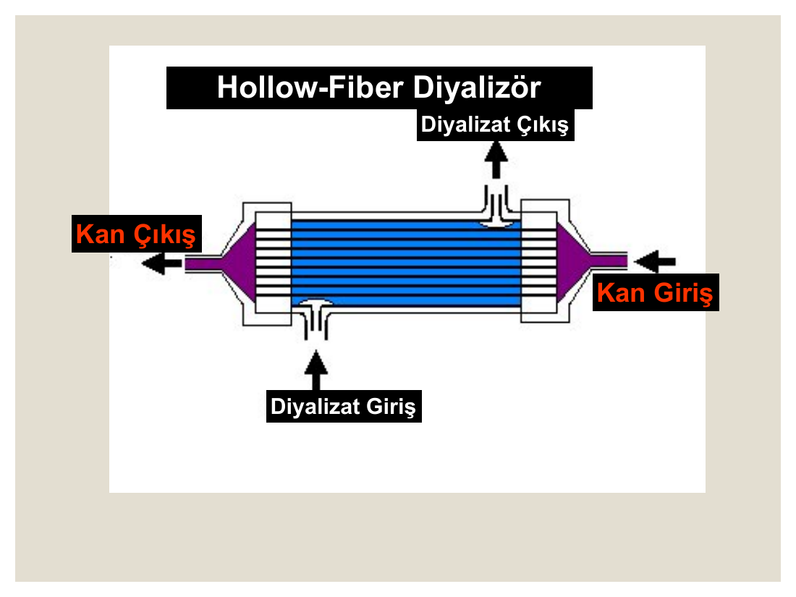

> **Şema yorumu:** Modern diyalizerler **hollow-fiber (içi boş fiber)** tasarımına sahiptir. Silindirik muhafaza içinde **~10.000 adet mikroskobik içi boş fiber** paralel dizilidir. Kan fiberlerin iç lümeninden (intraluminal), diyalizat ise fiberlerin dışından **karşı yönde (counter-current)** akar. Bu dizilim büyük bir **yüzey alanı/hacim oranı** sağlar.

---

## MEMBRAN ÖZELLİKLERİ

| Parametre | Değer/Aralık |
|---|---|
| **Yüzey alanı** | **0,8-2,1 m²** |
| Membran kalınlığı | 5-40 μm |
| Por boyutu | Küçük-büyük (low-flux vs high-flux) |
| **Ultrafiltrasyon katsayısı (K_Uf)** | **2-50 mL/saat/mmHg** |

### Membran Tipleri

| Tip | Örnek | Özellik |
|---|---|---|
| **Selüloz** | Kuprofan | Düşük biyouyumluluk (kompleman aktivasyonu), low-flux, ucuz |
| **Modifiye selüloz** | Selüloz asetat, hemofan | Orta biyouyumluluk |
| **Sentetik** | **Polisülfon, poliamid, polieter sülfon, AN69** | **Yüksek biyouyumluluk**, low- veya high-flux, pahalı, adsorpsiyon özelliği |

### Low-Flux vs High-Flux

| Özellik | Low-flux | High-flux |
|---|---|---|
| K_Uf | <12 mL/saat/mmHg | >20 mL/saat/mmHg |
| β₂-mikroglobulin klerensi | Yok/çok düşük | İyi |
| Su kalite gereksinimi | Standart | **Ultra-saf su zorunlu** |
| Maliyet | Düşük | Yüksek |

---

## KLERENS ÖZELLİKLERİ

**KoA (kitle transfer katsayısı × yüzey alanı) -- üre için:**

| KoA üre | Etkinlik |
|---|---|
| **300-600** | Orta derecede etkin |
| **>600** | Yüksek derecede etkin |

### Tipik Solüt Klerensleri

| Solüt | Klerens (Qb=200 mL/dk'da) |
|---|---|
| **Üre** (60 Da) | **130-200 mL/dk** |
| Kreatinin (113 Da) | Üre klerensinin ~%80'i |
| Vit B₁₂ (1355 Da, makromol) | **30-60 mL/dk** |
| Fosfat | Orta (başlangıçta hızlı, sonra yavaş -- hücre içi havuz) |
| β₂-mikroglobulin (11.800 Da) | Low-flux ≈ 0, high-flux 20-40 mL/dk |

> **Klinik anlam:** **Fosfat** intraseller dağılımı nedeniyle klasik HD ile yetersiz uzaklaştırılır. Bu yüzden kronik HD hastalarında **fosfor bağlayıcılar** (Ca bazlı, sevelamer, lantanum), **diyet kısıtlaması** ve uzun süreli (ev HD, HDF) tedavi gerekir.

---

## HEMODİYALİZ SUYU

> **Neden önemli?** Tipik bir HD seansında hasta **~120 L diyalizat suya** membran aracılığıyla maruz kalır. Kontaminasyonlar (ağır metal, endotoksin, bakteri) ciddi komplikasyonlara yol açabilir.

### Su Kontaminasyonları ve Etkileri

| Kontaminant | Etki |
|---|---|
| **Alüminyum (Al)** | **Diyaliz demansı, osteomalazi, anemi** |
| **Bakır (Cu)** | **Hemolitik anemi** |
| **Kloramin** | **Hemolitik anemi, methemoglobinemi** |
| **Florür** | Kemik hastalığı |
| **Nitrat** | Methemoglobinemi |
| **Bakteri / Endotoksin** | Pirojenik reaksiyon, kronik inflamasyon |

### Su Saflaştırma Aşamaları

1. Ön filtrasyon (kum, yumuşatıcı)
2. **Aktif kömür** (klor ve kloramin uzaklaştırır)
3. **İyon değişim reçineleri** (yumuşatma)
4. **Ters ozmoz (reverse osmosis)** -- ana saflaştırma basamağı
5. **UV lamba** / ultrafiltre
6. Karıştırma (diyalizat konsantresiyle)
7. Isıtma (~37°C)

### Mikrobiyolojik Sınırlar

* Standart HD: **<200 kol/mL** bakteri, endotoksin <2 EU/mL
* Ultra-saf su (HDF için zorunlu): <0,1 kol/mL, endotoksin <0,03 EU/mL

---

## DİYALİZ SOLÜSYONU (DİYALİZAT)

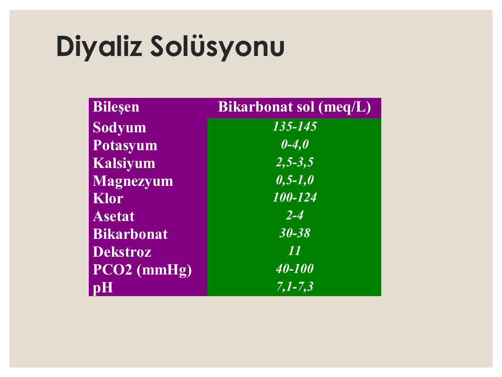

### Bikarbonatlı Diyalizat Bileşimi

| Bileşen | Konsantrasyon |
|---|---|
| Sodyum (Na⁺) | **135-145 mEq/L** |
| Potasyum (K⁺) | **0-4,0 mEq/L** |
| Kalsiyum (Ca²⁺) | **2,5-3,5 mEq/L** |
| Magnezyum (Mg²⁺) | **0,5-1,0 mEq/L** |
| Klor (Cl⁻) | 100-124 mEq/L |
| Asetat | 2-4 mEq/L |
| **Bikarbonat (HCO₃⁻)** | **30-38 mEq/L** |
| Dekstroz | 11 mmol/L (200 mg/dL) |
| pCO₂ | 40-100 mmHg |
| pH | 7,1-7,3 |

> **Klinik not:** Bikarbonat konsantrasyonu hastaya göre **bireyselleştirilir**. Yüksek bikarbonat alkalemiye yol açabilir; düşük bikarbonat asidoz düzeltilmesini yetersiz kılar. Standart: **35 mEq/L**.

### K⁺ Konsantrasyonu Seçimi

| Serum K | Diyalizat K önerisi |
|---|---|
| >5,5 mEq/L | **K1 veya K2** banyosu (2,0-2,5 mEq/L) |
| 4,0-5,5 mEq/L | **K2-K3** |
| Digoksin kullanımı / aritmi riski | **K3-K4** (ani K düşüşü aritmi yapabilir) |

> **⚠️ ÖNEMLİ:** Düşük-K diyalizat (K0-K1) ile **hızlı K düşüşü ani ölümcül aritmiye** neden olabilir, özellikle **digitalize hastalar ve iskemik kalp hastalığı** olanlarda.

### Ca²⁺ Konsantrasyonu Seçimi

* **2,5 mEq/L (1,25 mmol/L):** Hiperkalsemi riskli hastalar, Ca-bazlı bağlayıcı kullananlar
* **3,0 mEq/L (1,5 mmol/L):** Standart
* **3,5 mEq/L:** Hipokalsemi, sitrat antikoagülasyonu

---

## HEMODİYALİZ İŞLEMİ

### Seans Adımları

1. **Diyalizer rinse ve prime işlemi** (serum fizyolojik ile yıkama, hava uzaklaştırma)
2. **Fistül iğnelemesi** -- arter ve ven iğneleri **15-16 gauge**
3. **Akım hızı kademeli artışı** -- başlangıç **50 mL/dk**, sonra hedef Qb'ye çıkış
4. **Basınç monitörleri**:
   * **Arteriyel uç** (pompa öncesi): **−20 ile −80 mmHg** (aşırı negatif = yetersiz akım/stenoz)
   * **Venöz uç** (pompa sonrası): **+50 ile +100 mmHg** (aşırı pozitif = venöz dönüş engeli/stenoz)
5. **Hava detektörü** (embolİ önleme)
6. Seans sonu geri-yıkama (rinse-back) ile kanın hastaya iadesi, kuru ağırlık ölçümü

### Seans Parametreleri (Tipik)

| Parametre | Tipik değer |
|---|---|
| Süre | **3,5-4 saat** |
| Sıklık | **Haftada 3 seans** |
| Kan akım hızı (Qb) | **250-400 mL/dk** |
| Diyalizat akım hızı (Qd) | **500-800 mL/dk** |
| UF hızı | **<10-13 mL/kg/saat** (750-1000 mL/saat) |
| Diyaliz süresi/hafta | **≥12 saat** |

---

## SOLÜSYON DÖNGÜSÜ VE GÜVENLİK

Makine sürekli üç parametreyi izler:

* **İletkenlik (conductivity):** Elektrolit konsantrasyonunu dolaylı ölçer; sapma = yanlış karışım (hipo/hipertonik diyalizat → hemoliz riski)
* **Sıcaklık:** 35-37°C; aşırı ısınma hemoliz yapar
* **Kan kaçağı detektörü:** Diyalizat devresinde kan tespiti = membran rüptürü → makine durur

---

## ANTİKOAGÜLASYON YÖNTEMLERİ

Dışarıdaki ekstrakorporal devrede kan pıhtılaşmasını önlemek için antikoagülasyon zorunludur.

| Yöntem | Endikasyon | Doz |
|---|---|---|
| **Rutin heparin (UFH)** | Standart hasta | Yükleme 2000-5000 U + infüzyon 500-1500 U/saat |
| **Sıkı (low-dose) heparin** | Orta kanama riski | Yükleme 750-1000 U + 250-500 U/saat |
| **Heparinsiz diyaliz** | Yüksek kanama riski | Sık SF yıkama (her 15-30 dk 100-250 mL) |
| **LMWH** | Standart / HIT yok | Dalteparin/enoksaparin bolus |
| **Rejyonel sitrat** | HIT, yüksek kanama riski | Arteriyel uçta trisodyum sitrat + venöz uçta Ca infüzyonu |
| **Argatroban, bivalirudin** | HIT (heparin indüklü trombositopeni) | İnfüzyon |

### Antikoagülasyon Risk Stratejisi

| Risk Grubu | Strateji | Hasta Özelliği |
|---|---|---|
| **Standart** | Rutin heparin | Normal koagülasyon |
| **Orta risk (sıkı heparin)** | Düşük doz heparin | Perikardit, yakın zamanda cerrahi |
| **Yüksek risk (heparinsiz)** | SF yıkama + sitrat | Aktif kanama, cerrahi + kanama komplikasyonu, koagülopati, trombositopeni, **kafa içi kanama**, perikardit |

### Rejyonel Sitrat Antikoagülasyonu

* **Arteriyel uçtan trisodyum sitrat** infüzyonu → Ca²⁺'u şelate eder → lokal antikoagülasyon
* **Venöz uçtan Ca²⁺ infüzyonu** → Ca şelatı geri çevrilir, sistemik antikoagülasyon oluşmaz
* **Avantaj:** Sistemik kanama riski olmayan hastada bile güvenle kullanılabilir
* **Komplikasyonlar:** Metabolik alkaloz, hipo/hiperkalsemi, sitrat birikimi (karaciğer yetmezliğinde)

---

## HEMODİYALİZ REÇETESİ (PLANI)

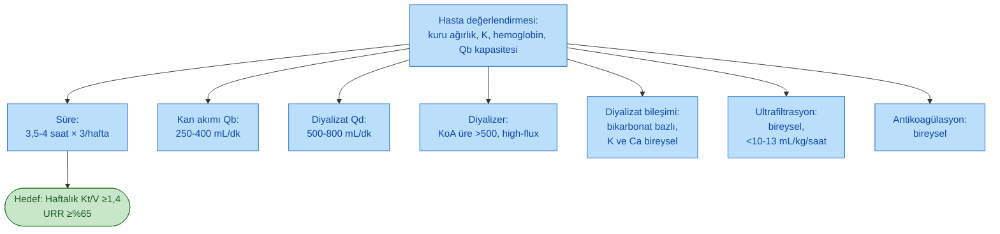
```mermaid
flowchart TD
    A[Hasta değerlendirmesi:<br>kuru ağırlık, K, hemoglobin, Qb kapasitesi] --> B[Süre:<br>3,5-4 saat × 3/hafta]
    A --> C[Kan akımı Qb:<br>250-400 mL/dk]
    A --> D[Diyalizat Qd:<br>500-800 mL/dk]
    A --> E[Diyalizer:<br>KoA üre >500, high-flux]
    A --> F[Diyalizat bileşimi:<br>bikarbonat bazlı,<br>K ve Ca bireysel]
    A --> G[Ultrafiltrasyon:<br>bireysel,<br><10-13 mL/kg/saat]
    A --> H[Antikoagülasyon:<br>bireysel]
    B --> I([Hedef: Haftalık Kt/V ≥1,4<br>URR ≥%65])

    classDef test fill:#bbdefb,stroke:#1565c0,color:#0d47a1
    classDef diagnose fill:#c8e6c9,stroke:#2e7d32,color:#1b5e20
    class A,B,C,D,E,F,G,H test
    class I diagnose
```

> **Nihai hedef:** **Haftada 3 gün × 4 saat** hemodiyaliz. Daha kısa süreli tedavi altmortalitesi artırır; daha uzun veya sık (ev HD) tedavi ek yarar sağlar.

---

## EV HEMODİYALİZİ

### Standart Merkez HD'nin Sınırlılıkları

* Komplikasyonların yetersiz tedavisi (hacim yönetimi, P kontrolü)
* Yüksek morbidite ve mortalite
* Düşük yaşam kalitesi
* Merkeze bağımlılık

### Ev Hemodiyalizi Özellikleri

* **Haftada 3 gün × 8 saat (yavaş, uzun, gece uyku sırasında)** veya kısa günlük (5-6×/hafta × 2-3 saat)
* **En az 2 ay teorik + uygulamalı eğitim**
* Hastanın evine HD cihazı ve **su arıtma sistemi** kurulumu
* **Faydalar:**
  * Daha uzun yaşam (sağkalım↑)
  * Komplikasyonların etkin tedavisi (özellikle **fosfor, HT, sıvı**)
  * Düşük morbidite
  * Düşük maliyet (uzun vadede)
  * Yaşam kalitesinde belirgin artış

---

## ALTERNATİF HEMODİYALİZ YÖNTEMLERİ

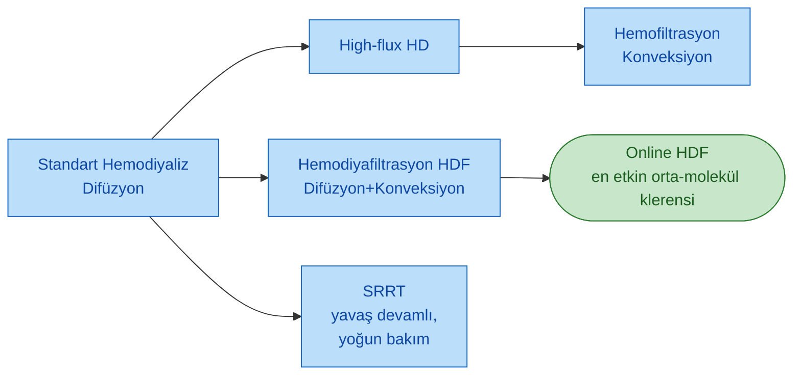
```mermaid
flowchart LR
    A[Standart Hemodiyaliz<br>Difüzyon] --> B[High-flux HD]
    B --> C[Hemofiltrasyon<br>Konveksiyon]
    A --> D[Hemodiyafiltrasyon HDF<br>Difüzyon+Konveksiyon]
    D --> E([Online HDF<br>en etkin orta-molekül klerensi])
    A --> F[SRRT<br>yavaş devamlı,<br>yoğun bakım]

    classDef test fill:#bbdefb,stroke:#1565c0,color:#0d47a1
    classDef diagnose fill:#c8e6c9,stroke:#2e7d32,color:#1b5e20
    class A,B,C,D,F test
    class E diagnose
```

---

## HEMODİYAFİLTRASYON (HDF)

HDF, **difüzyon (HD)** ve **konveksiyon (hemofiltrasyon)** mekanizmalarını birleştirir.

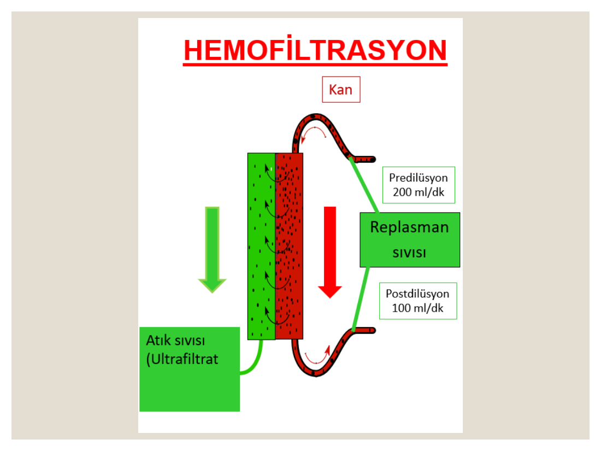

> **Şema yorumu:** Saf hemofiltrasyonda diyalizat **yoktur**; solüt uzaklaştırma sadece **konveksiyon** (yüksek UF) ile sağlanır. Uzaklaştırılan sıvının yerine **steril replasman sıvısı** infüze edilir: **predilüsyon** (dializer öncesi, 200 mL/dk) ve/veya **postdilüsyon** (dializer sonrası, 100 mL/dk). Predilüsyon klerensi düşürür ama hemokonsantrasyon ve pıhtılaşmayı azaltır.

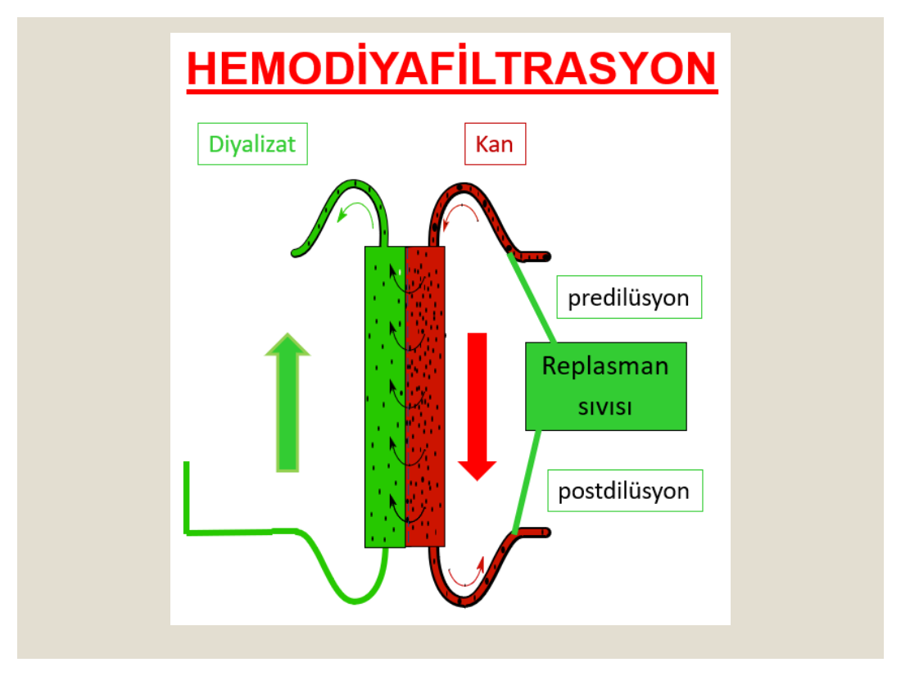

> **Şema yorumu:** HDF'de iki mekanizma birlikte çalışır: (1) kan ve diyalizatın karşı-akım geçişi (**difüzyon** → üre, kreatinin, K), (2) yüksek UF + replasman sıvısı (**konveksiyon** → β₂-mikroglobulin, orta moleküller). **Online HDF**'te replasman sıvısı ultrafiltre edilmiş ultra-saf diyalizattan **eş zamanlı** üretilir (maliyeti düşürür).

### HDF Avantajları

* Orta molekül klerensi belirgin üstün (β₂-mikroglobulin, serbest hafif zincirler)
* Diyaliz ilişkili amiloidozda yavaşlama
* İntradiyaliz hipotansiyon sıklığında azalma
* Bazı çalışmalarda sağkalım avantajı (CONTRAST, TURKISH HDF, ESHOL)

---

## SÜREKLİ RENAL REPLASMAN TEDAVİLERİ (SRRT)

Yoğun bakım ünitesinde **hemodinamik açıdan stabil olmayan**, hipervolemik hastalarda **72-96 saate varan sürelerde uygulanan düşük akımlı tedavi**.

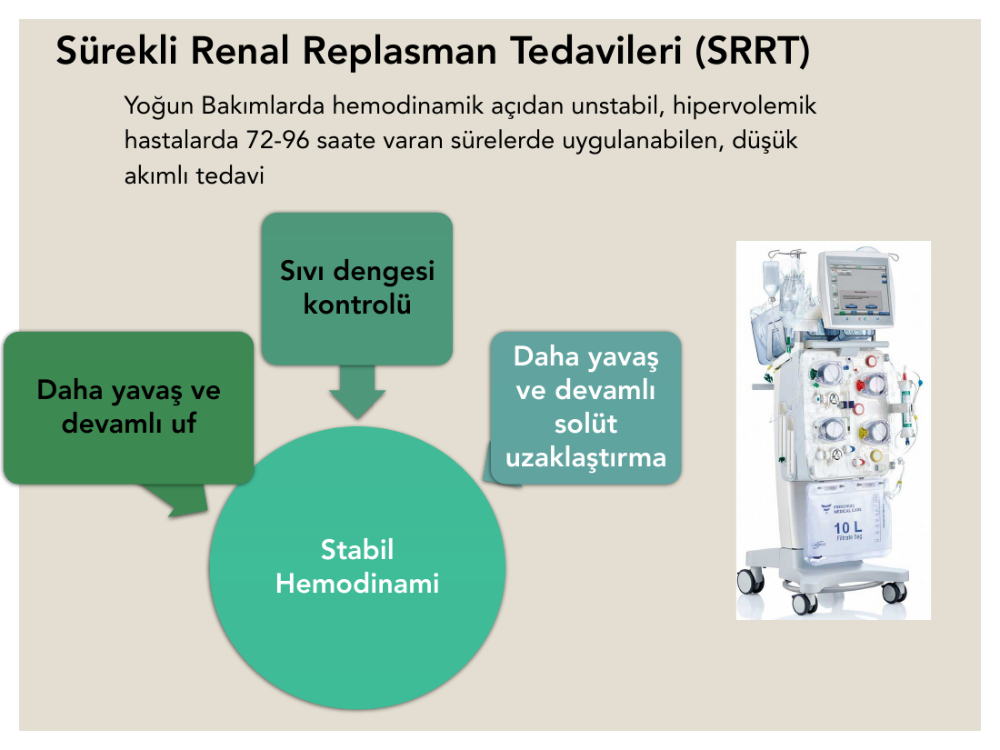

> **Şema yorumu:** SRRT'nin üç ana hedefi **stabil hemodinami** merkezinde buluşur: (1) yavaş ve devamlı UF (büyük sıvı değişiklikleri yok), (2) sıvı dengesi kontrolü (saatlik), (3) yavaş ve devamlı solüt uzaklaştırma. Aralıklı HD'nin aksine hızlı üre klerensi ve hızlı sıvı çekimi olmadığı için hipotansiyon ve disekilibrium riski düşüktür.

### SRRT Yöntemleri

| Yöntem | Açılım | Mekanizma |
|---|---|---|
| **SCUF** | Slow Continuous Ultrafiltration | Sadece UF, solüt klerensi yok |
| **CVVH** | Continuous Veno-Venous Hemofiltration | Konveksiyon (replasman sıvısı) |
| **CVVHD** | Continuous Veno-Venous Hemodialysis | Difüzyon (diyalizat) |
| **CVVHDF** | Continuous Veno-Venous Hemodiafiltration | Difüzyon + konveksiyon |

### SRRT Endikasyonları

* Hemodinamik instabilite (vazopresör altında)
* Ciddi serebral ödem / intrakranial HT (hızlı osmolal değişikliğe duyarlı)
* Ciddi karaciğer yetmezliği
* Septik şok + ABH
* Dekompanse kalp yetmezliği + aşırı volüm yükü

### SLED (Sustained Low-Efficiency Dialysis)

* SRRT ile aralıklı HD arası **hibrit modalite**
* 6-12 saatlik seanslar, düşük Qb ve Qd
* Daha düşük maliyet, benzer hemodinamik tolerans

---

## İNTRADİYALİZ KOMPLİKASYONLARI (SIK)

| Komplikasyon | Sıklık | Mekanizma / Yaklaşım |
|---|---|---|
| **Hipotansiyon** | **%20-30** | En sık. UF hızı yüksek, düşük Na diyalizat, DM, sol ventrikül disfonksiyonu, antihipertansif. **Trendelenburg + SF bolus, UF durdur** |
| **Kas krampları** | %5-20 | Sıvı/Na kayması, düşük Ca. SF veya hipertonik salin, **kuru ağırlığı gözden geçir** |
| **Bulantı-kusma** | %5-15 | Hipotansiyon, disekilibrium. Altta yatanı tedavi et |
| **Başağrısı** | ~%5 | Kafein çekilmesi, disekilibrium, HT |
| **Göğüs ve sırt ağrısı** | %2-5 | Koroner iskemi dışla; first-use reaksiyonu, hemoliz |
| **Kaşıntı** | ~%5 | Üremik pruritus, Ca-P ürünü, mast hücre degranülasyonu |
| **Ateş ve titreme** | **<%1** | **Bakteremi (kateter, fistül)**, endotoksin, pirojenik reaksiyon. **Kan kültürü + empirik AB** |

### İntradiyaliz Hipotansiyon -- Yaklaşım

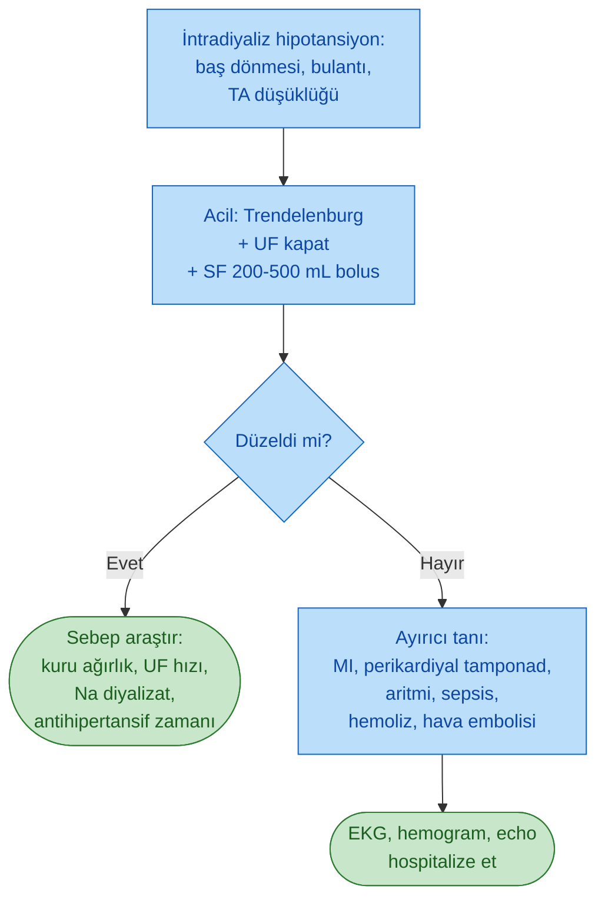
```mermaid
flowchart TD
    A[İntradiyaliz hipotansiyon:<br>baş dönmesi, bulantı,<br>TA düşüklüğü] --> B[Acil: Trendelenburg<br>+ UF kapat<br>+ SF 200-500 mL bolus]
    B --> C{Düzeldi mi?}
    C -->|Evet| D([Sebep araştır:<br>kuru ağırlık, UF hızı,<br>Na diyalizat,<br>antihipertansif zamanı])
    C -->|Hayır| E[Ayırıcı tanı:<br>MI, perikardiyal tamponad,<br>aritmi, sepsis,<br>hemoliz, hava embolisi]
    E --> F([EKG, hemogram, echo<br>hospitalize et])

    classDef test fill:#bbdefb,stroke:#1565c0,color:#0d47a1
    classDef diagnose fill:#c8e6c9,stroke:#2e7d32,color:#1b5e20
    classDef warn fill:#ffcdd2,stroke:#c62828,color:#b71c1c
    class A,B,C,E test
    class D,F diagnose
```

---

## İNTRADİYALİZ KOMPLİKASYONLARI (SIK OLMAYAN FAKAT CİDDİ)

| Komplikasyon | Özellikler |
|---|---|
| **Disekilibrium sendromu** | Beyin ödemi. İlk diyalizde, hızlı üre klerensi |
| **Diyalizer reaksiyonları** | Tip A (IgE), Tip B (kompleman/bradikinin) |
| **Aritmi** | K değişimi, hipokalsemi, digital, iskemi |
| **Kardiyak tamponad** | Üremik perikardit + heparin → hemorajik effüzyon |
| **İntrakranial kanama** | HT + antikoagülasyon |
| **Hemoliz** | Klor, bakır, aşırı ısıtılmış/hipotonik diyalizat, kink |
| **Hava embolisi** | Arter hat ayrışması, defektif hava detektörü |
| **Diyaliz ilişkili nötropeni/kompleman aktivasyonu** | Selüloz membran; seans ortasında nötrofil nadiri |
| **Diyaliz ilişkili hipoksi** | Asetat banyosu (tarihi), kompleman aktivasyonu |

### Hemoliz -- Tanıma

* Diyalizerden çıkan kanın **koyu şarap kırmızısı (port wine)** rengi
* Ani göğüs/sırt ağrısı, nefes darlığı, kaşıntı
* Serum pembemsi, plazma hemoglobinemisi
* Ani hiperkalemi (hücre içinden K salınır) → **aritmi ve ölüm**
* **Yaklaşım:** **Kanı hastaya GERİ VERME, devreyi kapat**, hastayı stabilize et, K kontrolü

---

## DİSEKİLİBRİUM SENDROMU

> **Tanım:** Hızlı üre (ve üremik toksin) klerensi sonrası **beyin-plazma ozmolal gradiyenti** ve pH değişikliği ile gelişen **beyin ödemi** tablosu. İlk diyaliz seansı veya uzun süreli üremi sonrası ilk başlatılan diyalizde sık görülür.

### Klinik

| Hafif | Ağır |
|---|---|
| Baş ağrısı | **Konvülsiyon** |
| Bulantı-kusma | **Koma** |
| Huzursuzluk | **Ölüm** |
| Kas krampları | Fokal nörolojik defisit |

### Risk Faktörleri

* İlk hemodiyaliz seansı, özellikle **yüksek üre düzeyi ile başlatılan** (BUN >150 mg/dL)
* Pediatrik hasta, yaşlı
* Metabolik asidoz, hiponatremi
* Önceki serebral lezyon

### Önleme

* İlk seans: **kısa tut** (2 saat, Qb 200 mL/dk, düşük etkinlik dializer, Qd 300 mL/dk)
* Sonraki seansları kademeli olarak süre ve etkinlikte artır
* Mannitol profilaksisi (yüksek riskli hastada)

---

## DİYALİZER REAKSİYONLARI (FIRST-USE)

Yeni bir dializerle karşılaşan hastada ortaya çıkan hipersensitivite:

| Özellik | Tip A (Anaflaktoid) | Tip B (Nonspesifik) |
|---|---|---|
| **Mekanizma** | **IgE aracılı**, ETO sterilizasyon | **Kompleman aktivasyonu** (selüloz) |
| **Başlangıç** | **İlk 5-20 dk** | 30-60 dk |
| **Klinik** | Dispne, anjioödem, hipotansiyon, **anafilaksi** | Göğüs ağrısı, sırt ağrısı (hafif) |
| **Şiddet** | **Ciddi, ölümcül olabilir** | Hafif, genelde kendiliğinden düzelir |
| **Risk faktörü** | ACE inhibitörü (AN69 + ACEi = bradikinin) | Selüloz membran ilk kullanımı |
| **Yaklaşım** | **Diyalizi derhal kes, kanı geri verme**, adrenalin, antihistaminik, steroid | Gözle, devam edilebilir |

> **⚠️ ÖNEMLİ:** **AN69 membran + ACE inhibitörü kombinasyonu** bradikinin birikimine yol açarak anaflaktoid reaksiyon yapar. Bu kombinasyondan **kaçınılmalıdır**.

---

## KRONİK HEMODİYALİZ HASTA YÖNETİMİ

8 temel bileşen:

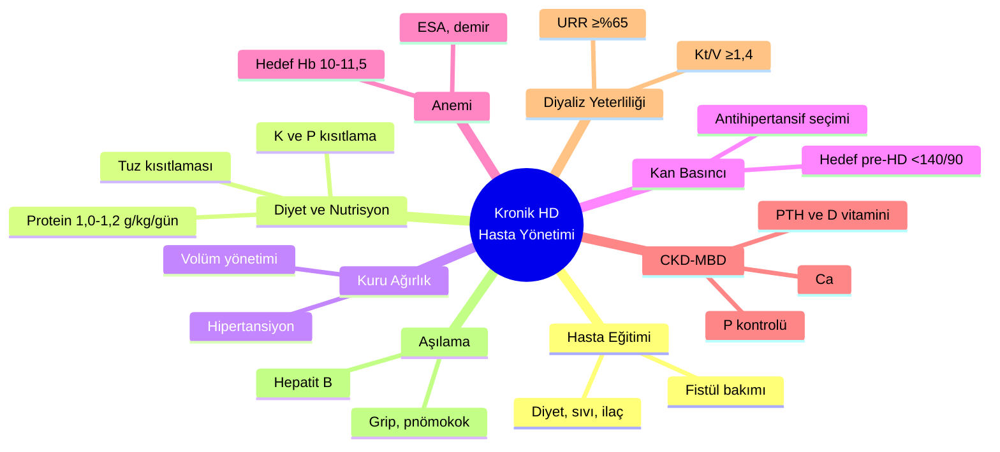
```mermaid
mindmap
  root((Kronik HD<br>Hasta Yönetimi))
    Hasta Eğitimi
      Diyet, sıvı, ilaç
      Fistül bakımı
    Diyet ve Nutrisyon
      Protein 1,0-1,2 g/kg/gün
      K ve P kısıtlama
      Tuz kısıtlaması
    Kuru Ağırlık
      Volüm yönetimi
      Hipertansiyon
    Kan Basıncı
      Hedef pre-HD <140/90
      Antihipertansif seçimi
    Anemi
      ESA, demir
      Hedef Hb 10-11,5
    CKD-MBD
      P kontrolü
      PTH ve D vitamini
      Ca
    Diyaliz Yeterliliği
      Kt/V ≥1,4
      URR ≥%65
    Aşılama
      Hepatit B
      Grip, pnömokok
```

### Anemi Tedavisi

* **Eritropoetin uyarıcı ajanlar (ESA):** Epoetin alfa/beta, darbepoetin, **metoksi-PEG epoetin** (mircera)
* **HIF-PH inhibitörleri** (roksadustat, vadadustat) oral alternatif
* Hedef Hb: **10-11,5 g/dL** (>13 g/dL kardiyovasküler risk!)
* Demir yönetimi: Transferrin satürasyonu >%20, ferritin >100 ng/mL (preferably >200 HD'de). IV demir (demir sukroz, demir glukonat)

### CKD-MBD (Kronik Böbrek Hastalığı -- Mineral Kemik Bozukluğu)

| Parametre | Hedef |
|---|---|
| Fosfor | 3,5-5,5 mg/dL |
| Kalsiyum (düzeltilmiş) | 8,4-10,2 mg/dL |
| iPTH | 2-9 × üst sınır (~130-600 pg/mL) |
| 25(OH)D | >30 ng/mL |

**Tedavi basamakları:**

1. **Diyet P kısıtlaması** (600-1000 mg/gün)
2. **Fosfor bağlayıcılar:**
   * Ca bazlı: kalsiyum karbonat, kalsiyum asetat (Ca yükü dikkatli)
   * Ca içermeyen: **sevelamer HCl/karbonat, lantanum karbonat**
   * Demir bazlı: demir sitrat, sukroferrik oksihidroksit
3. **D vitamini analogları:** kalsitriol, parikalsitol, doksekalsiferol
4. **Kalsimimetikler:** sinakalset (oral), **etelkalsetid** (IV, HD sonrası)
5. **Paratiroidektomi** -- dirençli sekonder/tertiyer hiperparatiroidizm

### Aşılama (HD hastasında)

| Aşı | Şema |
|---|---|
| **Hepatit B** | 40 μg IM, 0-1-2-6 ay (çift doz) |
| **İnfluenza** | Yılda bir |
| **Pnömokok** | PCV13 + PPSV23 (1 yıl arayla) |
| **Tetanoz-difteri** | 10 yılda bir |
| **COVID-19** | Öneriye göre |
| **HAV** (seronegatif + karaciğer hastalığı) | 0-6 ay |

---

## KURU AĞIRLIK

> **Tanım:** **Diyaliz sonunda hipotansiyona yol açmadan ulaşılabilen en düşük vücut ağırlığı.** Klinik olarak bulunur, sıklıkla deneme-yanılma ile ayarlanır.

### Hipervoleminin Bulguları (Kuru Ağırlığın Üstünde)

* **Semptom:** Dispne, ortopne, paroksismal nokturnal dispne (PND)
* **Bulgu:** Hipertansiyon, **juguler venöz dolgunluk (JVD)**, akciğerde ral, plevral effüzyon, hepatomegali, asit, **pretibial ödem**
* FM ile ağırlığın **%5'ten fazla artması** (klinik pratikte)

### Laboratuvar / Görüntüleme

* **Kardiyotorasik oran (KTO)** PA akciğer grafisi → >0,5 = kardiyomegali/overload
* **Ekokardiyografi** -- sol atriyal basınç, IVC çapı
* **Vena kava indeksi** (inspiratuar kollaps)
* Biyoempedans spektroskopi (BIA/BCM)
* **Natriüretik peptidler (BNP, NT-proBNP)** -- HD hastasında yorumu dikkatlidir
* **Akciğer ultrasonu** (B-line sayımı)

---

## DİYALİZ YETERLİLİĞİ (Kt/V, URR)

### Minimum ve Optimum Tedavi

| Minimum kabul edilebilir | Optimum tedavi |
|---|---|
| Üremi semptomu yok (bulantı-kusma) | Düşük morbidite ve mortalite |
| Asidoz kontrollü | Rehabilitasyon (iş, sosyal yaşam) |
| Ensefalopati yok | Yüksek yaşam kalitesi |

### Kt/V

> **Formül:** Kt/V = **Klerens × Seans süresi / Dağılım hacmi**

* **K:** Dializerin in vitro üre klerensi (L/dk)
* **t:** Seans süresi (dakika)
* **V:** Ürenin dağılım hacmi ≈ toplam vücut suyu (≈ 0,55 × vücut ağırlığı)

**Daugirdas II (tek havuz) formülü:**

Kt/V = −ln(R − 0,008 × t) + (4 − 3,5 × R) × UF/W

burada **R = post-BUN / pre-BUN**, UF = çekilen sıvı (L), W = post ağırlık (kg).

### Hedefler

| Parametre | Hedef |
|---|---|
| **spKt/V (tek seans, tek havuz)** | **≥1,4** (minimum ≥1,2) |
| **eKt/V (dengelenmiş)** | ≥1,2 |
| **URR** (üre redüksiyon oranı) | **≥%65** |
| Haftalık stdKt/V | ≥2,1 (3×/hafta), ≥2,5-4 (sık HD) |

**URR formülü:** URR = (pre-BUN − post-BUN) / pre-BUN × 100%

---

## HD HASTASI İZLEMİ

| Aralık | Yapılacaklar |
|---|---|
| **Aylık** | Biyokimya (BUN, Cr, elektrolit, Ca, P), tam kan sayımı, **URR -- Kt/V -- PCR** (protein katabolik hız) |
| **3 ayda bir** | Lipid profili, **Se demir, SDBK, ferritin**, transferrin satürasyonu, HbA1c (DM'li) |
| **6 ayda bir** | **PTH**, serolojik incelemeler (**HBsAg, anti-HCV, anti-HIV**) |
| **Yılda bir** | **EKG**, PA akciğer grafisi, **PSA** (erkek), **mamografi + jinekolojik bakı** (kadın), tiroid fonksiyonları |

---

## AKUT ZEHİRLENMELERDE DİYALİZ

**Diyalize uygun toksin özellikleri:**

* **Düşük molekül ağırlığı** (<500 Da)
* **Düşük protein bağlanması** (<%80)
* **Küçük dağılım hacmi** (<1 L/kg)
* **Suda çözünür**

### Hemodiyaliz ile Uzaklaştırılabilen Toksinler (MLMS)

| Toksin | Mekanizma | Not |
|---|---|---|
| **Metanol** | HD + fomepizol / etanol | Ciddi asidoz, körlük |
| **Etilen glikol** | HD + fomepizol | Ciddi asidoz, böbrek yetmezliği |
| **Salisilat (aspirin)** | HD | Ciddi intoksikasyon (>100 mg/dL) |
| **Lityum** | HD | Serum düzeyi >4 mEq/L veya ciddi nörolojik bulgu |
| Teofilin | HD / hemoperfüzyon | Aritmi, konvülsiyon |
| Valproik asit | HD | Yüksek doz, koma |
| Metformin | HD | Laktik asidoz |
| Barbitüratlar (uzun etkili) | HD / hemoperfüzyon | Koma |

### Hemoperfüzyon

* Toksin kömür veya reçine kolonuna geçirilir
* **Yüksek protein bağlı toksinlerde** HD'den üstün (fenobarbital, teofilin, karbamazepin, bazı mantar toksinleri)

---

## HANGİ HASTAYA HANGİ RRT -- KONTRENDİKASYONLAR

### RRT Seçimini Etkileyen Faktörler

* **Hasta tercihi** (en önemli)
* Beklenen **hasta ve teknik sağkalımı**
* Morbidite ve hastaneye yatış
* **Yaşam kalitesi**
* Tıbbi durumlar:
  * Rezidüel renal fonksiyon
  * Kardiyovasküler hastalık, hipertansiyon
  * Diabetes mellitus
  * Anemi, lipid metabolizması, üremik kemik hastalığı
  * Transplantasyon uygunluğu
  * Tedaviler arası geçiş esnekliği
* Maliyet

### Kontrendikasyonlar

| | **Hemodiyaliz** | **Periton Diyalizi** |
|---|---|---|
| **Mutlak** | Vasküler akses sağlanamaması | Periton fonksiyon bozukluğu (fibroz, yapışıklık, artmış geçirgenlik), akses sorunu, hasta/yakın uygulayamama |
| **Göreceli** | Ciddi hemodinamik instabilite, kanama bozukluğu | Büyük vücut yapısı ve RRF yok, intraabdominal vasküler cerrahi, malnutrisyon, ciddi herni, polikistik böbrek hastalığı (yer darlığı) |

---

## HD vs PD TERCİH TABLOSU

| **HD'de daha iyi** | **HD eğilimi** | **PD eğilimi** | **PD'de daha iyi** |
|---|---|---|---|
| Ciddi inflamatuvar barsak hastalığı | Bağımlı yaşam tarzı | Bağımsız yaşam tarzı | Unstabil vasküler hastalık |
| Aktif divertikülit / iskemik barsak hastalığı | Demans | Kardiyovasküler hastalık | Vasküler akses sorunu |
| Düşük intellektüel kapasite, yardımcı yok | Kötü hijyen | Rezidüel renal fonksiyon korunması | **5 yaş altı çocuk** |
| Psikotik bozukluk | Batın operasyonları (çok sayıda) | Bulaşıcı hastalık taşıyıcılığı (kanla bulaş riski) | Genç diyabetik |
| Evsiz | Ciddi herni | Seyahat özgürlüğü | Bağımsızlık ihtiyacı |
| Çözülemeyen PD komplikasyonu | Ciddi diyabetik gastroparezi | | Merkeze uzaklık |
| | Sık tedavi değişikliği | | Çözülemeyen HD komplikasyonu |

> **Karar algoritması:** Her hastada **entegre bir sunum** yapılmalı; hasta tüm seçenekleri (HD, PD, transplantasyon, konservatif) anladıktan sonra **birlikte karar verilmelidir**. Karar statik değildir, hastanın durumu değiştikçe yeniden değerlendirilir.

---

## VAKA ÖRNEKLERİ

**📋 VAKA ÖRNEĞİ 1: İlk Hemodiyaliz ve Disekilibrium Riski**

**Hasta:** 68 yaş erkek
**Öykü:** 6 aydır yorgunluk, iştahsızlık, kaşıntı. 3 haftadır bulantı, kusma ve uyku eğilimi artmış. Son 1 haftadır idrar çıkışı azaldı. Takibi yoktu.
**Fizik Muayene:** Nabız 92/dk, TA 180/105 mmHg, SpO₂ %92 (oda havası), akciğerde bilateral bazallerde ral, pretibial ödem (+++). Uykuya meyilli, yer-zaman oryantasyonu bozuk.
**Laboratuvar:** BUN 220 mg/dL, kreatinin 12,8 mg/dL, K 6,2 mEq/L, HCO₃ 14 mEq/L, Hb 7,8 g/dL, Ca 7,4 mg/dL, P 9,8 mg/dL.
**EKG:** Sivri T dalgaları.
**Tanı:** Önceden tanı konmamış SDBY, **üremik ensefalopati + hiperkalemi + asidoz + hipervolemi** -- acil HD endikasyonu (AEIOU pozitif).
**Yaklaşım:**
* Geçici internal juguler kateter yerleştirildi (subklavian tercih edilmedi -- ileride fistül şansını korumak için)
* **İlk seans disekilibrium riski nedeniyle KISA tutuldu:** 2 saat, Qb 200 mL/dk, Qd 300 mL/dk, düşük KoA'lı dializer
* **Mannitol profilaksisi** (yüksek BUN nedeniyle)
* Ertesi gün 2,5 saat, sonra 3 saat, 4. seanstan itibaren 4 saat standart
* Hepatit B/C/HIV serolojisi alındı; **hepatit B aşısı** başlandı (40 μg IM, çift doz)

**Öğretici Notlar:**
1. Yüksek BUN'li (>150 mg/dL) hasta ilk HD'de **kademeli süre ve etkinlik artışı** zorunlu
2. İlk seansta **Qb ve süre yarıya** düşürülür
3. **Subklavian vene kateter konmamalıdır** (stenoz = ipsilateral fistül iptali)
4. Kronik HD başlangıcında aşılama takvimi hemen kurulur

---

**📋 VAKA ÖRNEĞİ 2: İntradiyaliz Hipotansiyon**

**Hasta:** 74 yaş kadın, diyabetik, 3 yıldır HD alıyor
**Öykü:** Son 2 haftadır her seansta 3. saatte belirgin hipotansiyon, baş dönmesi. Son seansta bilincini kısa süreli kaybetmiş.
**Seans parametreleri:** Pre-ağırlık 72 kg, kuru ağırlık tanımlanmış 68 kg, UF hedefi 4 L (süre 4 saat → **1000 mL/saat, 14,7 mL/kg/saat**), Qb 300 mL/dk, diyalizat Na 138, Ca 2,5.
**Sorunlar:**
* **UF hızı çok yüksek** (>13 mL/kg/saat)
* Otonomik disfonksiyon (DM)
* Öğünü seans öncesi alıyor (splanknik dilatasyon)
* Antihipertansifini sabah almış
**Çözüm:**
* Kuru ağırlık yeniden değerlendirildi (FM, IVC, akciğer USG) -- %2 kadar yukarı ayarlandı
* UF profil (adım azalan) kullanıldı
* Diyalizat **Na profili** (138 → 140 mEq/L dereceli azalan) kullanıldı
* Diyalizat Ca 3,0 mEq/L'ye çıkarıldı
* Öğün seans ortasına alındı
* Sabah antihipertansif seans sonrasına kaydırıldı

**Öğretici Notlar:**
1. **UF hızı <10-13 mL/kg/saat** (ideal <10) -- aşıldıkça mortalite artar
2. İntradiyaliz hipotansiyonda **ilk çözüm kuru ağırlığı yeniden değerlendirmek**, UF hızı düşürmek için **süre uzatma**
3. Diyabetik hastalar otonomik nöropati nedeniyle **duyarlıdır**
4. Antihipertansifin HD gününde zamanlaması kritik

---

**📋 VAKA ÖRNEĞİ 3: Fistül Maturasyonu ve "Rule of 6's"**

**Hasta:** 58 yaş erkek, evre 5 KBH (GFR 8 mL/dk), 5 hafta önce sol ön kolda radiosefalik fistül açılmış
**Muayene (5. hafta):** Fistül yumuşak thrill (+), düşük perdeli devamlı bruit (+). Kompresyon testinde ven dolgunluğu artışı var.
**USG:** Sefalik ven çapı 4,5 mm, derinliği 7 mm, akım hızı 420 mL/dk.
**Değerlendirme:**
* Süre: 5 hafta (**<6 hafta, yetersiz**)
* Çap: 4,5 mm (**<6 mm, yetersiz**)
* Derinlik: 7 mm (**>6 mm, yetersiz**)
* Akım: 420 mL/dk (**<600 mL/dk, yetersiz**)
* **Rule of 6's karşılanmıyor; fistül henüz kullanılmaya hazır DEĞİLDİR.**

**Yaklaşım:**
* Fistül egzersizleri (top sıkma, turnikeli egzersiz)
* 4 hafta sonra tekrar değerlendirme
* Eğer 12. haftada hâlâ olgunlaşmazsa fistülogram ile stenoz araştırması, gerekirse **PTA**
* Hasta GFR <10 mL/dk ve semptom geliştirirse **geçici juguler kateter** ile köprüleme

**Öğretici Notlar:**
1. **Rule of 6's:** 6 hafta, ≥6 mm çap, ≤6 mm derinlik, ≥600 mL/dk akım
2. Olgunlaşmayan fistülde %30-50 oranında **juksta-anastomotik stenoz** vardır
3. Fistül açılımı diyalize gitmeden **en az 3-6 ay önce** planlanmalıdır

---

## ÖZET VE ANAHTAR NOKTALAR

> **⚠️ ÖNEMLİ -- Sınav ve Klinik Pratik Açısından:**
>
> * Hemodiyaliz **Türkiye'de en yaygın kullanılan RRT** formudur (%69).
> * Fiziksel temeller: **difüzyon (solüt), UF (su), konveksiyon (orta molekül), adsorpsiyon**.
> * Akut diyaliz endikasyonları **AEIOU**: **A**sidoz, **E**lektrolit (hiperK), **I**ntoksikasyon, **O**verload, **Ü**remi.
> * Damar yolu tercih sırası: **AV fistül > AV greft > tünelli kateter > geçici kateter**. "Fistula first".
> * **Rule of 6's:** 6 hafta maturasyon, ≥6 mm çap, ≤6 mm derinlik, ≥600 mL/dk akım.
> * **Subklavian vene kateter YERLEŞTİRİLMEZ** (stenoz = ipsilateral fistül imkânsızlığı).
> * Standart seans: **haftada 3 × 4 saat**, Qb 250-400 mL/dk, Qd 500-800 mL/dk.
> * Hedef: **spKt/V ≥1,4, URR ≥%65**, UF hızı **<10-13 mL/kg/saat**.
> * Tipik diyalizat Na **135-145**, K **0-4**, Ca **2,5-3,5**, HCO₃ **30-38 mEq/L**.
> * En sık intradiyaliz komplikasyonu: **hipotansiyon (%20-30)**.
> * **Disekilibrium sendromu**: İlk HD'de yüksek BUN → beyin ödemi; **ilk seans kısa tutulur** (2 saat, düşük Qb).
> * **First-use reaksiyonu Tip A (IgE, anaflaksi, AN69 + ACEi)** ve Tip B (kompleman) -- Tip A acil olarak diyaliz kesilir, kan hastaya verilmez.
> * **Hemoliz:** Koyu şarap rengi kan, hiperkalemi; **kanı geri verme**.
> * **Kontrendikasyonlar:** HD'de mutlak kontrendikasyon = **damar yolu sağlanamaması**.
> * HD ve PD **yarışan değil, tamamlayıcı yöntemlerdir**; hasta tercihini kılavuzlar.
> * Her HD hastasında **Hepatit B, grip, pnömokok aşılaması** mutlaktır.
> * **CKD-MBD yönetimi:** P<5,5, Ca düzeltilmiş, PTH 2-9× üst sınır; basamaklı fosfor bağlayıcı, D vit analoğu, kalsimimetik.
> * Anemide hedef **Hb 10-11,5 g/dL** (>13 KARDİYOVASKÜLER RİSK).
> * SRRT endikasyonu: **hemodinamik instabilite, serebral ödem, ciddi KC yetmezliği, septik şok + ABH**.
> * Diyaliz ile uzaklaştırılabilen toksinler **MLMS mnemonik**: **M**etanol, **L**ityum, **M**etformin (+etilen glikol), **S**alisilat.

---

**Kaynak:**

Prof. Dr. Yavuz Yeniçerioğlu -- Aydın Adnan Menderes Üniversitesi Tıp Fakültesi Nefroloji Bilim Dalı ders sunumları:

* *Hemodiyaliz -- Temel İlke ve Kavramlar* (53 slayt, Ters Yüz 2025)
* *Hemodiyaliz* (53 slayt, 2026)

Türkiye 2023 Yılı Ulusal Nefroloji, Diyaliz ve Transplantasyon Kayıt Sistemi Raporu (Türk Nefroloji Derneği).
