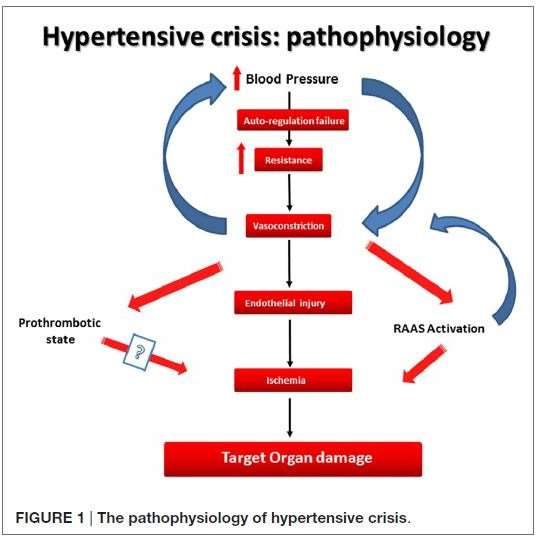
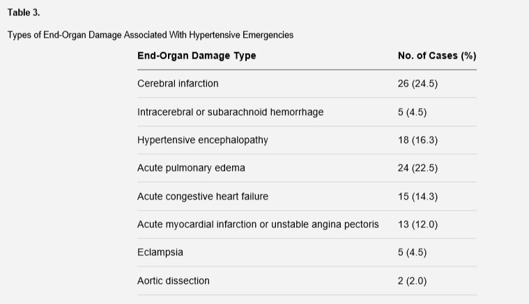
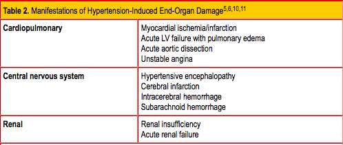
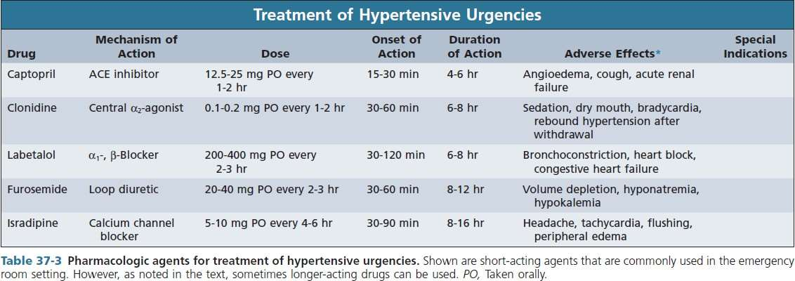

# HİPERTANSİF ACİL VE İVEDİ DURUMLAR

**Hazırlayan:** Doç. Dr. Hakan Akdam
**Bölüm:** Aydın Adnan Menderes Üniversitesi Tıp Fakültesi — İç Hastalıkları / Nefroloji Bilim Dalı

---

## İÇİNDEKİLER

1. [Hipertansiyon Tanımı ve Tanısı](#hipertansiyon-tanımı-ve-tanısı)
2. [Hipertansif Kriz — Temel Kavramlar](#hipertansif-kriz--temel-kavramlar)
3. [Etiyoloji](#etiyoloji)
4. [Patofizyoloji](#patofizyoloji)
5. [Epidemiyoloji](#epidemiyoloji)
6. [Hipertansif İvedi Durum (Emergency)](#hipertansif-ivedi-durum-emergency)
7. [Hipertansif Öncelikli Durum (Urgency)](#hipertansif-öncelikli-durum-urgency)
8. [Tanı — Öykü, Muayene, Laboratuvar](#tanı--öykü-muayene-laboratuvar)
9. [Tedavi Prensipleri](#tedavi-prensipleri)
10. [Parenteral Antihipertansif İlaçlar](#parenteral-antihipertansif-ilaçlar)
11. [Özel Klinik Durumlar — Hedefe Yönelik Tedavi](#özel-klinik-durumlar--hedefe-yönelik-tedavi)
12. [Öncelikli Durumda Oral Tedavi](#öncelikli-durumda-oral-tedavi)
13. [Özet Algoritma](#özet-algoritma)

---

## HİPERTANSİYON TANIMI VE TANISI

### Tanım

**Hipertansiyon (HT):** İnsan sağlığını, yaşam kalitesini ve yaşam süresini kötü yönde etkileyebilecek her türlü kan basıncı yükselmesidir. Sağlıklı yaşam için gerekli olan **vasküler kan basıncı kontrolünün bozulması** ile karakterizedir.

### Tanı Kriterleri (Türk Kardiyoloji Derneği 2019)

Erişkinlerde **hekim tarafından yapılan, tekrarlanan** klinik ölçümler:

> **⭐ HT Tanısı:**
>
> **Sistolik KB ≥ 140 mmHg** ve/veya **Diyastolik KB ≥ 90 mmHg**

> **📝 Öğrenci için önemli ayrıntı:** "Bir sefer 145/95 gördüm" **tanı koydurmaz**. HT kronik bir tanıdır — birden fazla ziyarette, dinlenmiş halde, ideal koşullarda tekrarlanan ölçümler gerekir. Bir hastanın ayakta, telaşlı halde, ağrı ile ölçülen tansiyonu gerçek HT'yi yansıtmayabilir ("beyaz önlük hipertansiyonu" — yaklaşık %15-30 oranında görülür). Bu yüzden tanı için **ev KB ölçümü veya 24 saatlik ambulatuar KB** tercih edilir.
>
> *Kaynak: Turk Kardiyol Dern Ars 2019;47(6):535-546*

---

## HİPERTANSİF KRİZ — TEMEL KAVRAMLAR

### Tanım

**Hipertansif kriz:** Akut uç organ hasarı ve fonksiyon bozukluğuna yol açabilen, **mortalitesi yüksek** klinik tablo.

**KB eşiği: 180/120 mmHg ↑**

### İkili Sınıflama

```
              HİPERTANSİF KRİZ
               180/120 mmHg ↑
                    │
          ┌─────────┴─────────┐
          ↓                   ↓
    Hipertansif          Hipertansif
    İvedi Durum          Öncelikli Durum
    (Emergency)          (Urgency)
          │                   │
   Uç organ hasarı      Uç organ hasarı
     VAR ✓                    YOK ✗
          │                   │
    Parenteral tedavi    Oral tedavi
    YBÜ şartlarında      Hastane dışı
    dakikalar-saatler    2-4 saat içinde
```

> **⚠️ KRİTİK KURAL:** Hipertansif **ivedi** durum ile **öncelikli** durumu ayırmada **KB eşik değeri yoktur**. Ayırt ettirici özellik **uç organ hasarının varlığı veya yokluğudur**.

> **💡 Kavramı tek cümlede anlatırsak:** 220/130 mmHg ile gelen asemptomatik bir hasta **öncelikli** durum sayılırken, 170/105 mmHg ile gelen ama **nöbet geçiren/göğüs ağrısı/akut akciğer ödemi** olan bir hasta **ivedi** durumdur. Yani rakama değil, **hastanın organlarına** bak.

### Malign Hipertansiyon

Eski bir terim — **retinopati grade III-IV + çok yüksek KB + hızla ilerleyen böbrek hasarı** triadıyla karakterize. Hipertansif ivedi durumun ağır bir formu olarak düşünülür.

> **📝 Niçin "malign"?** Tedavisiz bırakıldığında 1 yıl içinde **>%90 mortalite** taşırdı (antihipertansif öncesi dönemde). Günümüzde tedavi ile prognoz dramatik düzelmiştir, ama hâlâ ciddi bir klinik antite olarak kabul edilir.

### Prevalans

Hipertansif hastaların yaklaşık **%1-2'sinde** hipertansif kriz görülür. Her HT hastasının kriz yaşamayacağını, ama acillere başvuran HT'lilerin ciddi bir kısmının bu gruptan olduğunu hatırla.

---

## ETİYOLOJİ

Hipertansif kriz genellikle aşağıdaki zeminlerde gelişir:

* **Tedavisiz veya yetersiz tedavi edilmiş primer HT**
* **Dirençli hipertansiyon** (3 ilaç + diüretik alan hastada hâlâ kontrol altında olmayan)
* **Sekonder hipertansiyon**

> **💡 Sekonder HT uyarı sinyalleri:** Hipertansif kriz ile gelen hastada, özellikle **genç (&lt;30 yaş) veya yaşlı (>55 yaş) yeni başlangıçlı HT**, **aniden kontrolden çıkmış önceki stabil HT**, **tedaviye dirençli HT** varsa sekonder nedenleri ekarte et:
>
> * **Renal:** Renal arter stenozu (bilateral üfürüm!), renal parankimal hastalıklar
> * **Endokrin:** Feokromositoma, primer aldosteronizm, Cushing, hipertiroidi
> * **Obstrüktif uyku apne sendromu**
> * **İlaç/madde:** Kokain, amfetamin, sempatomimetikler, MAO inhibitörü + tiramin (peynir-şarap krizi), NSAİİ, oral kontraseptif
>
> Özellikle "genç + kriz + çarpıntı + terleme" üçlüsü → **feokromositoma** ekartasyonu için plazma/idrarda metanefrinler bak.

---

## PATOFİZYOLOJİ



Hipertansif krizin temel patogenezinde **iki mekanizma** yer alır:

### 1) Vasküler Otoregülasyon Bozulması

**Otoregülasyon:** Organların (beyin, kalp, böbrek) perfüzyon basıncının değişmesine bakılmaksızın **istikrarlı bir kan akışı** sürdürme yeteneğidir.

Normal bir insanda beyin kan akımı ortalama arter basıncı (MAP) **60-150 mmHg** arasında sabit kalır. Arter daraltma-genişletme ile bu aralıkta otoregüle edilir. Kronik HT'de bu eğri **sağa kayar** (90-180 mmHg) — beyin yüksek basınca adapte olur.

> **💡 Otoregülasyon metaforu:** Beyni, basınç değişikliğine karşı akım sabit tutan bir **regülatörlü su tesisatı** gibi düşün. Musluk tam açık olsa da kısık olsa da, lavaboya belli bir akım gelir. Ama basınç aşırı artarsa (180 mmHg üstü) veya aşırı azalırsa (60 mmHg altı) regülatör çalışmaz, akım **doğrudan basıncın esiri** olur. Hipertansif krizde basınç otoregülasyon tavanını aşar → beyin aşırı perfüzyona maruz kalır → kan-beyin bariyerinden sıvı sızar → **hipertansif ensefalopati** (baş ağrısı, bulantı, konfüzyon, nöbet, koma).
>
> Aynı mantık ters yönde de işler: Kronik HT'li bir hastada KB birden normale düşürülürse (örneğin 220'den 130'a hızlıca), otoregülasyon **alt sınırı** aşılır → **serebral iskemi + infarkt** riski. Bu yüzden "KB'yi hızla normale çekmek" akıl kârı değildir.

### 2) RAAS Aktivasyonu

Damar daralması → doku iskemisi → böbrek makula densa renin salar → anjiotensin II artar → daha fazla vazokonstriksiyon → daha fazla iskemi. Bir **kısır döngü**.

### Vazokonstriksiyonun Mekanik Sonuçları

Kan basıncındaki şiddetli yükselme, **vasküler direnç artışı** veya **şiddetli vazokonstriksiyon** ile birliktedir. Damarlardaki mekanik stres şunlara yol açar:

* **Endotel hasarı**, geçirgenliğin artması
* **Koagülasyon kaskadı** ve trombositlerin aktivasyonu
* **Arteriyollerde fibrinoid nekroz**

> **💡 Fibrinoid nekroz nedir?** Küçük arterlerin duvarında, fibrin benzeri eozinofilik materyal birikimi. Adeta damar duvarı "şişip çatlar" ve fibrin sızar. Histopatolojik işaret olarak "onion-skin" (soğan kabuğu) görünümü klasiktir. Bu hipertansif krizin mikroskopi altındaki imzasıdır.

### Protrombotik Durum

Son çalışmalar göstermiştir ki hipertansif krizde **sP-selektin** (trombosit aktivasyon belirteci) belirgin yüksektir — yani **trombosit aktivasyonu** krizin erken ve önemli bir bulgusudur. Bu yüzden klinik tabloya **mikroanjiyopatik hemolitik anemi (MAHA)** da eklenebilir (şemistosit pozitif), TMA ayırıcı tanısına girer.

### Sonuç

```
   Kan basıncında şiddetli yükselme
              ↓
  Vasküler direnç ↑ + Vazokonstriksiyon
              ↓
       Endotelyal hasar
              ↓
  Fibrinoid nekroz + Tromboz
              ↓
   UÇ ORGAN PERFÜZYON BOZUKLUĞU
   (beyin, kalp, böbrek, göz)
              ↓
      İskemi + İnfarkt
```

---

## EPİDEMİYOLOJİ

**HT ivedi durum:** %24-60
**HT öncelikli durum:** %40-76



| Uç Organ Hasar Tipi | Oran |
|---|---|
| **Serebral enfarkt (iskemik inme)** | **%24.5** |
| **Akut pulmoner ödem** | **%22.5** |
| **Hipertansif ensefalopati** | **%16.3** |
| **Akut konjestif kalp yetmezliği** | **%14.3** |
| **Akut MI / unstabil anjina** | **%12.0** |
| İntraserebral/subaraknoid kanama | %4.5 |
| **Eklampsi** | %4.5 |
| **Aort diseksiyonu** | %2.0 |

> **💡 Dikkat çeken gerçek:** En sık hipertansif acil **iskemik inme ve pulmoner ödem**dir — yani "kalp-beyin acilleri". Aort diseksiyonu nadir ama mortalitesi çok yüksek olduğundan her zaman ayırıcı tanıda tut.



| Sistem | Manifestasyonlar |
|---|---|
| **Kardiyopulmoner** | Miyokard iskemisi/infarkt, akut LV yetmezliği + pulmoner ödem, akut aort diseksiyonu, unstabil anjina |
| **Santral sinir sistemi** | Hipertansif ensefalopati, serebral enfarkt, intraserebral kanama, subaraknoid kanama |
| **Renal** | Renal yetmezlik, akut böbrek yetmezliği |

---

## HİPERTANSİF İVEDİ DURUM (EMERGENCY)

### Tanım

**İlerleyici uç organ hasarının eşlik ettiği** şiddetli kan basıncı yüksekliği.

### Yönetim İlkeleri

* **KB 10-30 dakika içinde 20-40 mmHg düşürülmeli**
* **Parenteral tedavi** (IV yol)
* **Yoğun bakım ünitesi (YBÜ) şartlarında**
* Amaç: **uç organ hasarını sınırlamak**

### İvedi Durumlar — Klinik Tablolar

* **Kafa içi kanama** (ICH, SAK)
* **Serebral iskemik inme**
* **Hipertansif ensefalopati**
* **Aort diseksiyonu**
* **Akut miyokard iskemisi / infarktüsü**
* **Akut pulmoner ödem**
* **Akut konjestif kalp yetmezliği**
* **Akut böbrek yetmezliği**
* **Ağır preeklampsi / Eklampsi**

> **💡 Klinik ipucu:** Acil serviste KB'si çok yüksek (180/120+) olan bir hastada **ilk iş** kan basıncını düşürmek DEĞİLDİR — ilk iş **"hangi organ etkilendi?"** sorusunu yanıtlamaktır. Çünkü her klinik tablonun farklı KB hedefi ve farklı ilaç seçimi vardır. Örneğin, akut iskemik inmede KB düşürülmek istenmezken, aort diseksiyonunda 10 dakika içinde sistolik 120'ye çekilmelidir. Acelecilikle başlanan yanlış bir ilaç hastayı öldürebilir.

---

## HİPERTANSİF ÖNCELİKLİ DURUM (URGENCY)

### Tanım

**Uç organ hasarının olmadığı**, kan basıncının **saatler-günler içinde oral tedavi ile** güvenli sınırlara düşürülmesi gereken durum.

### Yönetim İlkeleri

* **Oral** antihipertansif
* **Hastane dışı** (ayaktan) tedavi mümkün
* **2-4 saat içinde** KB &lt; 160/100 mmHg
* Sıkı ve hızlı düşürme **kontrendike** (otoregülasyon riski)

### Öncelikli Durum Nedenleri

* **Ağrı, emosyonel stres**
* **Kronik HT'de alevlenme**
* **HT tedavisinde uyumsuzluk** (en sık!)
* Akut glomerülonefrit
* Akut sistemik vaskülit
* Hafif preeklampsi
* Ağır burun kanaması (epistaksis)
* Unstabil anjina (aslında acil sınırında)
* Kronik spinal kord hasarı
* Ağır yanıklar

> **💡 Klinikte en sık senaryo:** Hasta tansiyon ilacını 3 gündür almadı → 200/110 ile acile geldi. Baş ağrısı dışında şikayet yok, muayene, EKG, fundus, üre-kreatinin normal. **Bu bir öncelikli durumdur, ivedi değil.** Tedavi: Hastayı sakinleştir, ilacını yeniden başlat, 2-4 saat sonra KB 160/100'ün altına ininse taburcu et. YBÜ'ye yatırmak gereksiz — hatta zararlıdır.

---

## TANI — ÖYKÜ, MUAYENE, LABORATUVAR

### Öykü

* **HT geçmişi ve süresi**
* **Kontrolsüz KB kayıtları**
* **İlaç uyumu** (en sık "öncelikli durum" nedeni)
* **KB'yi artırabilecek ilaçlar:** NSAİİ, **gripal ilaçlar (psödoefedrin!)**, kortikosteroid, oral kontraseptif, dekonjestan, kokain, amfetamin, MAO inhibitörü
* **Uyku apnesi sendromu öyküsü**
* **Kardiyovasküler risk faktörleri** ve komorbiditeler

> **⚠️ Sık atlanan detay:** "Grip ilacı aldınız mı?" sorusu çoğu zaman sorulmaz. Oysa psödoefedrin ve fenilefrin gibi dekonjestanlar KB'yi hızla yükseltebilir ve özellikle halihazırda HT'si olan hastalarda krize yol açabilir. Eczaneden reçetesiz alınan bu ilaçlar "ilaç" olarak algılanmaz, hasta söylemez; sormak hekimin görevidir.

### Fizik Muayene

* **KB her iki koldan** ölçülmeli (aort diseksiyonu ve subklavyen stenoz için)
* **Mümkünse oturma ve ayakta** pozisyonlarında (ortostatik değerlendirme)
* **Bir alt ekstremiteden** ölçüm (aort koarktasyonu tarama)
* **Kalp sesleri / üfürüm** (aortik koarktasyon)
* **Boyun arter ve abdominal üfürüm** (renal arter stenozu, renovasküler HT)
* **Nörolojik defisit:** mental durum, **fokal veya lateralizasyon** gösteren nörolojik bulgular (inme, ensefalopati)
* **Fundoskopik değerlendirme:**
    * **Grade III:** alev kanamaları, nokta-leke kanamaları, sert/yumuşak eksudat
    * **Grade IV:** **papilödem** (malign HT)
* **Alt ekstremitede nabız yokluğu / asimetri** (aort diseksiyonu)
* **Karın muayenesi** (aort anevrizması)
* **Vital:** ateş, nabız, O₂ satürasyonu

> **💡 "İki koldan KB" klasik ama kritik bir muayene noktası:** İki kol arası **20 mmHg'den fazla** fark varsa aort diseksiyonu **acilen** ekarte edilmelidir (kontrastlı torasik BT veya TEE). Aort diseksiyonunda yanlış yönde ilerleyen tedavi (vazodilatatör) hastayı öldürür; doğru tedavi (beta bloker + vazodilatatör ile agresif KB düşürme) kurtarır.

### Laboratuvar ve Görüntüleme

**Temel tetkikler:**

* **İdrar analizi** (proteinüri, hematüri, silindir → glomerülonefrit, akut böbrek hasarı)
* **Üre, kreatinin, elektrolitler**
* **Tam kan sayımı** (MAHA için şemistositler)
* **EKG** (akut iskemi, SVH, hiperkalemi bulguları)
* **Akciğer grafisi** (pulmoner ödem, mediastinal genişleme)

**Sekonder HT şüphesinde:**

* Plazma renin aktivitesi, aldosteron
* Katekolaminler (idrar/plazma metanefrinler)
* Kortizol, PTH, TSH

**Klinik tabloya göre:**

* **Ekokardiyografi** (SVH, diyastolik/sistolik disfonksiyon, perikardiyal effüzyon)
* **Beyin BT/MR** (inme, kanama, ödem)
* **Abdominal USG** (böbrek, adrenal, aort)
* **Torakoabdominal BT/MR** (diseksiyon, anevrizma)
* **Vasküler USG / dopler** (renal arter stenozu)

---

## TEDAVİ PRENSİPLERİ

### Altın Kural

> **⚠️ KB'yi hızla normal sınırlara getirmek TEHLİKELİDİR.**
>
> Hipertansif dolaşımda **otoregülatuvar kapasitenin altına inilmesi** serebral, renal ve kardiyak kan akımını bozar, bu organlarda **iskemi ve infarktlara** yol açar.

> **💡 Niçin?** Kronik HT'li hastada otoregülasyon eğrisi sağa kaymıştır. Beyin 90-180 mmHg MAP aralığında otoregüle edebilir; bunun altına indiğinde hipoperfüzyon başlar. Normal biri için 120 mmHg "harika" olabilir; ama kronik HT hastasında aynı 120 mmHg **beyin iskemisi** demektir. Bu yüzden "kademeli ve kontrollü" düşürme esastır.

### Kan Basıncı Düşürme Hedefleri

**Hipertansif İvedi Durum:**

* **İlk 1 saatte** KB'yi **&lt; %20-25** düşür
* **Diyastolik KB hedefi:** 100-110 mmHg
* **Diyastolik KB &lt; 90 mmHg uç organ hasarını ARTIRIR** (önemle ezberle!)
* **24-48 saatte** KB &lt; 140/90 mmHg

**Hipertansif Öncelikli Durum:**

* **2-4 saatte** KB &lt; 160/100 mmHg
* Kademeli, güvenli; uç organ hasarını önlemek için

### Hastaya Genel Yaklaşım (İvedi Durum)

* **Yoğun bakım ünitesinde**
* **İntravenöz yol** açılmalı
* **Parenteral** antihipertansif kullanılmalı
* **Sublingual, intramüsküler** uygulamadan **kaçınılmalı**
* Hastalar **yakın izlemde** tutulmalı
* Tercihen **intraarteriyel KB monitorizasyonu**
* Başlangıç hedef KB sağlanır sağlanmaz **oral antihipertansifler başlanmalı**

> **⚠️ Sublingual nifedipin hakkında:** Çok uzun yıllar boyunca "dilaltı nifedipin" HT krizi tedavisinin bayrak taşıyıcısıydı. Ancak **ani ve kontrolsüz** KB düşüşü → serebral/koroner iskemi, hatta **ölüm** bildirildi. Bugün **dilaltı nifedipin kullanılmamalıdır**. Eğer birini bu ilacı kullanırken görürsen durdur ve güncel literatürü göster.

---

## PARENTERAL ANTİHİPERTANSİF İLAÇLAR

### İlaçlar ve Kullanım Alanları

| İlaç | Etki Mekanizması | Kullanım Alanı / Uyarı |
|---|---|---|
| **Nitroprussid** | Arteriyoler-venöz dilatör (preload + afterload ↓) | Çoğu HT ivedi durumda. **Siyanid-tiyosiyanat toksisitesi**, miyokardiyal iskemi riski |
| **Nitrogliserin** | Venöz dilatasyon (öncelikli) | **Akut koroner sendrom**, akut pulmoner ödemde seçkin |
| **Esmolol** | Kardiyoselektif β-bloker | **Aort diseksiyonu**, perioperatif HT |
| **Diüretikler (furosemid)** | Na + su kaybı | Hipervolemik hastalar (pulmoner ödem) |
| **Fentolamin** | α-bloker | **Katekolamin deşarjı** durumlarında (**feokromositoma**, MAO krizi) |
| **Labetolol** | α + β bloker | Geniş kullanım, **akut kalp yetersizliğinde kontrendike** |
| **Fenoldopam mesilat** | Dopamin-1 reseptör antagonisti | Çoğu HT krizinde; **glokomda kullanılmaz** |

### İlaç Dozları ve Özellikleri

| İlaç | Doz | Etki Başlangıcı | Etki Süresi | Yan Etki | Endikasyon / Çekince |
|---|---|---|---|---|---|
| **Nitroprussid** | 0.25 μg/kg/dk infüzyon | Hemen | 1-2 dk | Bulantı, kusma, terleme, **tiyosiyanat intoksikasyonu** | Çoğu ivedi durumda. **Kafa içi basınç artışı**, **azotemi**, **KC yetmezliğinde dikkatli** |
| **Nitrogliserin** | 5-100 μg/dk infüzyon | 2-5 dk | 5-10 dk | Başağrısı, kusma, **methemoglobinemi**, **taşifilaksi** | **Koroner iskemi**, pulmoner ödemde seçkin |
| **Nikardipin** | 5-15 mg/saat IV | 5-15 dk | 15-30 dk (4 saate uzayabilir) | Taşikardi, başağrısı, flushing, bulantı | Çoğu ivedi durumda. **Akut kalp yetersizliği hariç** |
| **Fenoldopam** | 0.1-0.3 μg/kg/dk infüzyon | >5 dk | 30 dk | Taşikardi, başağrısı, bulantı, flushing | Çoğu ivedi durumda. **Glokomda kullanılmamalı** |
| **Enalaprilat** | 1.25-5 mg / 6 saatte bir IV | 15-30 dk | 6-12 saat | Yüksek reninli durumlarda **aşırı KB düşüşü** | **Akut sol kalp yetmezliğinde** uygun. **Akut MI'da kaçınılmalı** |
| **Hidralazin** | 10-20 mg IV | 10-20 dk | 1-4 saat | Taşikardi, başağrısı, kusma, flushing, anjina | **Eklampside uygun** |
| **Labetolol** | 20-80 mg IV bolus (10 dk'da bir) veya 0.5-2 mg/dk infüzyon | 5-10 dk | 3-6 saat | Bulantı, kusma, kalp bloğu, **bronkokonstriksiyon** | Çoğu ivedi durumda. **Akut kalp yetersizliği hariç** |
| **Esmolol** | 250-500 μg/kg IV bolus, ardından 50-100 μg/kg/dk infüzyon | 1-2 dk | 10-30 dk | Bulantı, astım, kalp bloğu, kalp yetersizliği | **Aort diseksiyonu**, perioperatif HT |
| **Fentolamin** | 5-15 mg IV bolus | 1-2 dk | 10-30 dk | Taşikardi, başağrısı, flushing | **Katekolamin artışı** durumlarında (feokromositoma) |

> **💡 Nitroprussid ve siyanid toksisitesi:** Nitroprussid metabolize olunca siyanide dönüşür, sonra tiyosiyanate. Uzun süreli (>48 saat) veya yüksek doz infüzyonlarda özellikle **renal/hepatik yetmezlik** olan hastalarda birikir ve **laktik asidoz, bilinç değişikliği, havale** yapabilir. İdeali: hızlı etki sonrası oral tedaviye erken geçiş. Eğer uzun infüzyon zorunluysa **hidroksikobalamin** veya **sodyum tiyosülfat** antidot olarak düşünülür.

> **💡 Nikardipin niçin popüler?** Kalsiyum kanal blokeri, arteriyel dilatasyon yapar. Titrasyonu kolay, yan etkisi nispeten az, **çoğu klinik durumda uygun**. Kalp yetersizliği dışında ideal bir "genel amaçlı" ilaç.

---

## ÖZEL KLİNİK DURUMLAR — HEDEFE YÖNELİK TEDAVİ

Her hipertansif acil tablosunun **kendine özgü** KB hedefi ve ilaç tercihi vardır. Bu başlığı ezberlemek klinik pratikte hayat kurtarır.



### Hipertansif Ensefalopati

* **İlaç:** Nitroprussid, Nikardipin, Labetolol
* **Hedef:** İlk 2 saatte KB'de **%20-25 düşme**

> **📝 Klinik tablo:** Ani başlangıçlı şiddetli başağrısı, bulantı, kusma, **görme bozukluğu**, konfüzyon, nöbet. PRES (posterior reversible encephalopathy syndrome) MR'da **oksipital-parietal ödem** gösterir. Tedavi KB düşürülünce tablo **geri döner** — bu da ensefalopati lehine tanı koydurur.

### İntrakranial Kanama

* **İlaç:** Nitroprussid (dikkatli)
* **Hedef:** İlk 2 saatte KB'de **%20-25 düşme**

> **⚠️ Dikkatli olma sebebi:** İntrakranyal basınç artmışsa, nitroprussid serebral vazodilatasyon yaparak ICP'yi daha da artırabilir. Bu yüzden nikardipin veya labetolol genellikle tercih edilir.

### İskemik İnme

* **Kural:** KB **&lt; 220/120 mmHg** ise ve başka bir uç organ hasarı yoksa **tedavi verilmez**
* **Eğer tedavi gerekiyorsa:** İlk 24 saatte KB **%10-15** düşürülmeli
* **Trombolitik (tPA) verilecekse:** KB **&lt; 185/110 mmHg** olmalı, tedavi sonrası **&lt; 180/105 mmHg** tutulmalı

> **💡 Niçin iskemik inmede KB agresif düşürülmez?** Çünkü iskemik alanda kollateral dolaşım **sistemik KB'ye bağımlıdır**. Penumbra (kurtarılabilir iskemik doku) düşük sistemik basınçla yetinemez. KB'yi düşürmek penumbrayı da infarkta çevirir. Bu yüzden "yukarı bırak, kendiliğinden toparlansın" kuralı geçerlidir — tabii belirli bir sınıra kadar.

### Akut Kalp Yetmezliği + Akut Akciğer Ödemi

* **İlaç:** **Nitrogliserin + Furosemid**
* **Hedef:** KB'nin 1 saatte **%10-15** düşürülmesi
* **β-bloker KONTRENDİKE** (akut dekompansasyonda!)

> **💡 Patofizyoloji:** Akut akciğer ödemi, sol ventrikülün yüksek afterload altında zorlanmasıyla gelişir. Nitrogliserin venöz dilatasyon (preload ↓) + arteriyoler dilatasyon (afterload ↓) yaparak LV'yi rahatlatır. Furosemid volüm atar. β-bloker ise pompa fonksiyonunu daha da baskılar — akut dönemde felakettir.

### Aort Diseksiyonu

* **İlaç:** **Beta bloker + Nitroprussid** (veya esmolol + nikardipin)
* **Hedef:** Sistolik KB'nin **10-20 dakika içinde 110-120 mmHg'ye** düşürülmesi
* **β-bloker ÖNCE verilmeli!**

> **⚠️ β-bloker niçin önce?** Aort diseksiyonunda duvara binen iki yük vardır: **basınç (SBP)** ve **kesme kuvveti (dp/dt — basınç değişim hızı)**. Sadece vazodilatör verirsen KB düşer ama kalp refleks taşikardi ile dp/dt'yi artırır → diseksiyon genişler. Bu yüzden **önce beta bloker** (kalp hızını ve dp/dt'yi düşür), **sonra vazodilatör** (basıncı düşür). Sıra önemlidir.
>
> **Hedef kalp hızı: &lt;60/dakika**
>
> **Hedef sistolik KB: 100-120 mmHg** (10-20 dakika içinde ulaşılır — hipertansif krizler içinde en agresif hedeftir)

### Akut Miyokard İnfarktı

* **İlaç:** **Nitrogliserin, Labetolol, Esmolol**
* **Hedef:** OAB (ortalama arter basıncı) ilk 1 saatte **%10-15** düşürülmesi

> **💡 Nitrogliserin niçin koroner perfüzyonda iyi?** Epikardiyal koroner arterleri dilate eder + preload azaltarak LV duvar stresini düşürür → miyokardiyal oksijen gereksinimi azalır. Beta bloker hem KB hem kalp hızı hem kontraktiliteyi düşürerek aynı hedefe ulaşır. İkisi birlikte iskemik alanı korur.

### Eklampsi / Preeklampsi

* **İlaç:** **MgSO₄ + Hidralazin veya Labetolol**
* **Hedef:** Sistolik KB **140-160 mmHg**, diyastolik **90-105 mmHg**
* **Nitroprussid → FETAL SİYANİD TOKSİSİTESİ** riski → kullanılmaz!

> **📝 MgSO₄ niçin?** Magnezyum **nöbet profilaksisi** sağlar (NMDA antagonisti + vazodilatör). Eklampside nöbet tablonun en ağır komponentidir, MgSO₄ hem tedavi hem profilaksi ajanıdır. Toksisite: solunum depresyonu, derin tendon refleksi kaybı — takipte solunum sayısı ve patellar refleksi izle. Antidot: **kalsiyum glukonat**.
>
> **Hidralazin ve labetolol** tercih edilir — plasentayı az geçer ve fetal güvenlik profili iyidir. ACE-İ ve ARB **gebelikte kesin kontrendikedir** (fetal renal disgenezi).

### Feokromositoma Krizi

* **İlaç:** **Fentolamin** (ilk tercih), nitroprussid, labetolol
* **β-bloker TEK BAŞINA KULLANILMAZ!**

> **⚠️ Niçin tek başına β-bloker yasak?** Katekolaminlerin α etkisi (vazokonstriksiyon) + β etkisi (taşikardi, vazodilatasyon) vardır. β'yı tek başına bloke edersen, β2-vazodilatasyon kaybolur → sadece α vazokonstriksiyonu baskın olur → **paradoks olarak KB daha da yükselir**. Bu "**karşılıksız α aktivasyonu**" olarak bilinir.
>
> **Doğru sıra:** Önce α-bloker (fentolamin IV veya fenoksibenzamin oral) → KB düşer → sonra β-bloker (taşikardi için). Bu kural, hipertansif acilde en önemli "yanlış yapılabilecek" noktalardan biridir.

### Özet Tablo — Klinik Duruma Göre İlaç ve Hedef

| Durum | İlaç | Hedef |
|---|---|---|
| **Hipertansif ensefalopati** | Nitroprussid, Nikardipin, Labetolol | İlk 2 s %20-25 düşme |
| **İntrakraniyal kanama** | Nitroprussid | İlk 2 s %20-25 düşme |
| **İskemik inme** | (Verilmez) | &lt;220/120 ise tedavi yok |
| **Akut KY + Pulmoner ödem** | Nitrogliserin + Furosemid | 1 s %10-15 ; **β-bloker yok!** |
| **Aort diseksiyonu** | **Esmolol + Nitroprussid** | 10-20 dk içinde SBP 110-120 |
| **Akut MI** | Nitrogliserin, Labetolol, Esmolol | OAB 1 s %10-15 |
| **Eklampsi** | **MgSO₄ + Hidralazin/Labetolol** | SBP 140-160, DBP 90-105 |
| **Feokromositoma** | **Fentolamin**, Nitroprussid, Labetolol | β-bloker TEK BAŞINA YOK |

---

## ÖNCELİKLİ DURUMDA ORAL TEDAVİ

### Genel Yaklaşım

* Çoğunlukla **tedaviye uyumsuz kronik HT** hastaları
* KB **> 180/110 mmHg** ise tedavi edilmeli
* Hastaya **sessiz bir oda** sağlanmalı — yalnızca bu bile hastaların **üçte birinde KB'de ≥20/10 mmHg düşüş** sağlar
* **Ağrı ve anksiyete** düzeltilmeli (analjezik, anksiyolitik)
* **2-4 saatte** KB &lt; 160/100 mmHg
* Oral ilaçlarla **hastane dışı** tedavi mümkün

> **💡 "Sessiz oda" etkisi küçümsenmemeli:** Birçok hasta acil servisin gürültüsü, ışığı, ağrısı nedeniyle sempatik aktivasyona girer → KB yükselir. Sadece sakin bir oda + ağrı kontrolü ile KB büyük oranda normale döner. Bu yüzden acilde "hemen ilaç verelim" refleksi yerine "önce ortamı sakinleştirelim, 30 dakika sonra tekrar ölçelim" yaklaşımı çoğu öncelikli durumda yeterlidir.

### Oral İlaçlar

**Kısa etkili kaptopril 12.5-25 mg:**

* **Etki başlangıcı:** 15-30 dakika
* **Etki süresi:** 4-6 saat
* **Kontrendikasyon:** **Bilateral renal arter stenozu** (abdominal üfürüm uyarısı!), gebelik, hiperkalemi

> **⚠️ BİLATERAL RAS uyarısı:** Sadece tek böbreği olan hastada veya bilateral renal arter stenozunda ACE-İ ile **akut böbrek hasarı** gelişebilir. Ultraşok gibi bir kreatinin yükselmesi görürsen (1.2 → 3.0 gibi) RAS düşün.

**Dilaltı nifedipin — KULLANILMAMALIDIR:**

* Ani KB düşüşü
* Serebral ve koroner iskemi
* **Ölüm** bildirilmiş
* **Hipertansif öncelikli durum tedavisinde dilaltı nifedipin kontrendikedir**

> **💡 Alternatifler (oral):** Kaptopril dışında **labetolol oral, klonidin oral, prazosin oral, furosemid oral** da düşünülebilir. Amaç 2-4 saatlik yavaş düşürme olduğu için agresif ajanlara gerek yoktur.

---

## ÖZET ALGORİTMA

```
                    HİPERTANSİF KRİZ
                    (180/120 mmHg ↑)
                           │
                  ┌────────┴────────┐
                  ↓                 ↓
            Hedef organ         Hedef organ
            hasarı VAR          hasarı YOK
                  │                 │
                  ↓                 ↓
          HT İVEDİ DURUM      HT ÖNCELİKLİ
          (Emergency)            DURUM
                  │             (Urgency)
                  ↓                 │
            YBÜ + Parenteral        ↓
                  │           Hastane dışı +
                  ↓           Oral antihipertansif
          İlk 2 s: %25 ↓            │
          24 s: ~100 mmHg            ↓
          (Diastolik)           2-4 s: <160/100
                  │                  │
                  ↓                  ↓
          Nitroprussid           Kaptopril
          Nitrogliserin          Furosemid
          Nikardipin             (sessiz oda,
          Labetolol              ağrı kontrolü)
          Esmolol
```

---

## SINAV NOTLARI — ANAHTAR HATIRLATMALAR

> **📋 En Sık Sorulan Noktalar:**
>
> 1. **HT krizi eşiği:** **180/120 mmHg ↑**
> 2. **İvedi vs Öncelikli ayrımı:** **Uç organ hasarı** (KB eşiği değil!)
> 3. **İvedi durumda ilk 1 saatte KB'yi %20-25'ten fazla düşürme.** Diastolik hedef **100-110 mmHg**. **DBP &lt; 90 tehlikelidir** (uç organ hasarını artırır).
> 4. **24-48 saatte** KB &lt; 140/90 mmHg'ye indirilir.
> 5. **Öncelikli durum:** 2-4 saatte KB &lt; 160/100 mmHg; **oral** tedavi, **hastane dışı** mümkün.
> 6. **Dilaltı nifedipin asla kullanılmaz** (ani KB düşüşü + iskemi + ölüm).
> 7. **İskemik inme:** &lt;220/120 ise tedavi verilmez; trombolitik verilecekse &lt;185/110.
> 8. **Aort diseksiyonu:** **β-bloker ÖNCE, sonra vazodilatör**; 10-20 dk içinde SBP 110-120; hedef kalp hızı &lt;60.
> 9. **Akut KY + pulmoner ödem:** Nitrogliserin + furosemid; **β-bloker kontrendike**.
> 10. **Eklampsi:** **MgSO₄ + hidralazin/labetolol**; nitroprussid ve ACE-İ/ARB **kontrendike** (gebelik).
> 11. **Feokromositoma:** **Fentolamin** (α-bloker önce); **tek başına β-bloker yasak**.
> 12. **Nitroprussid uyarıları:** Siyanid/tiyosiyanat toksisitesi, kafa içi basınç artışında dikkat, KC/böbrek yetmezliğinde dikkatli.
> 13. **ACE-İ kontrendikasyonu:** Bilateral RAS, gebelik, hiperkalemi.
> 14. **Hastaların %1-2'sinde kriz gelişir.**
> 15. **En sık 3 uç organ hasarı:** İskemik inme (%24.5), pulmoner ödem (%22.5), hipertansif ensefalopati (%16.3).

---

> **Kaynaklar:**
>
> 1. Türk Kardiyoloji Derneği HT Kılavuzu 2019. Turk Kardiyol Dern Ars 2019;47(6):535-546.
> 2. 2018 ESC/ESH Guidelines for the management of arterial hypertension. Eur Heart J 2018.
> 3. Elliott WJ. Clinical features in the management of selected hypertensive emergencies. Prog Cardiovasc Dis 2006.
> 4. van den Born BJ et al. ESC Council on hypertension position document. Eur Heart J Cardiovasc Pharmacother 2019.
