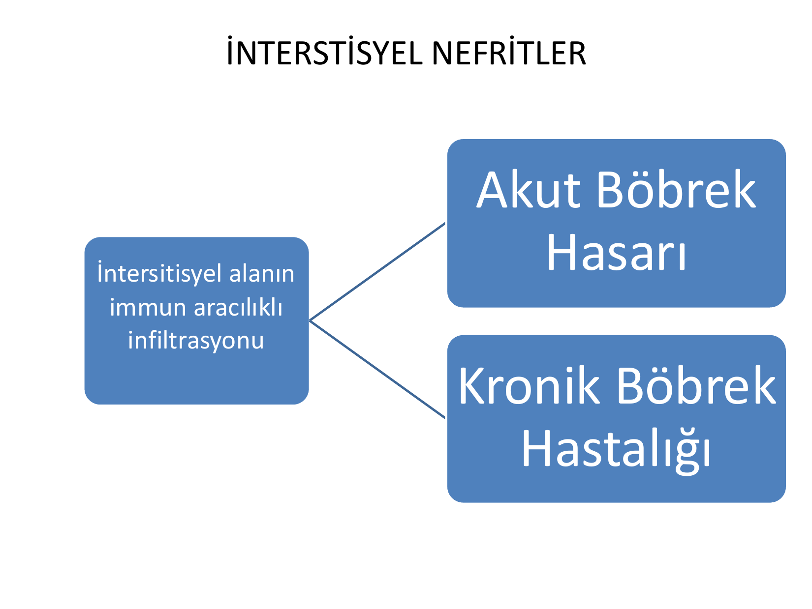
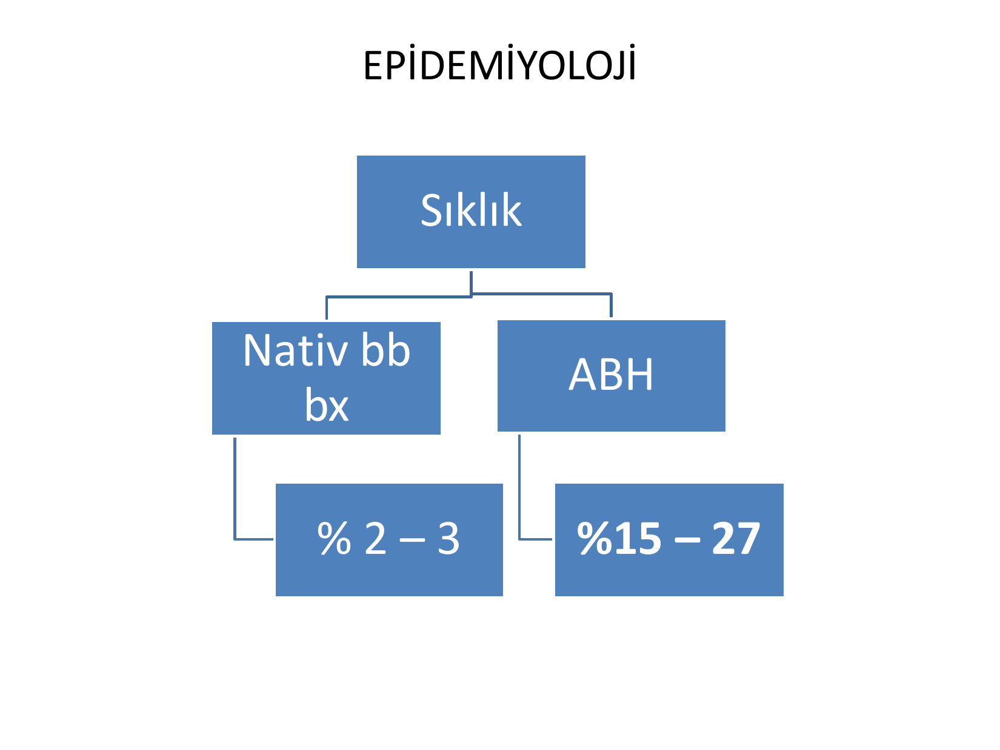
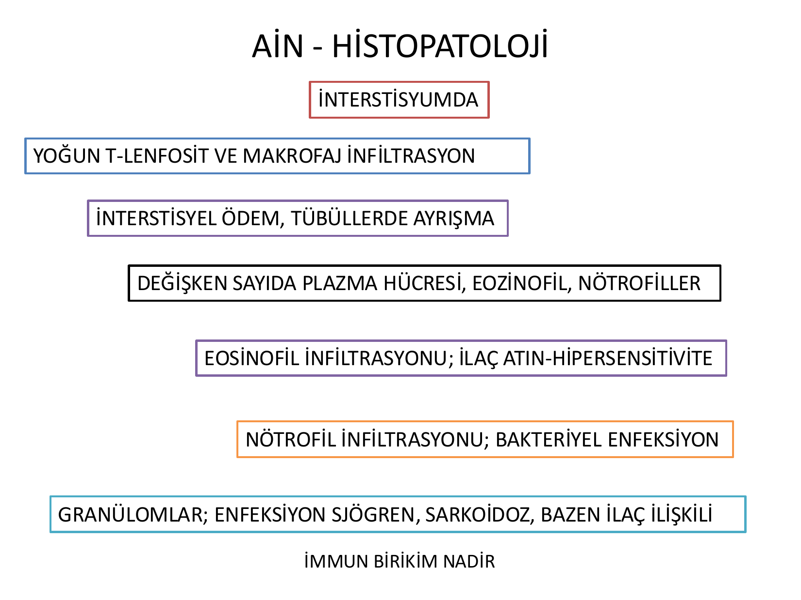
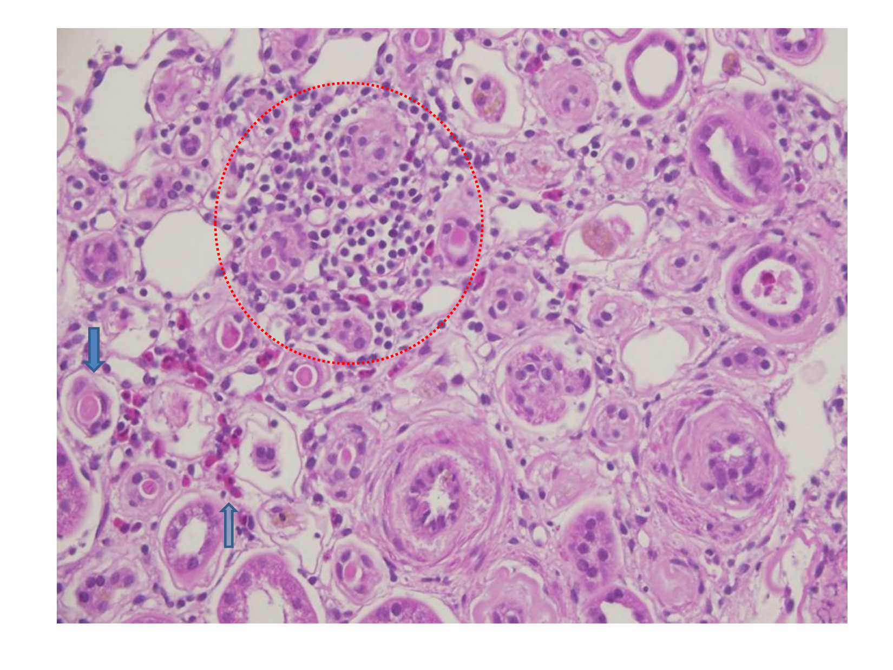
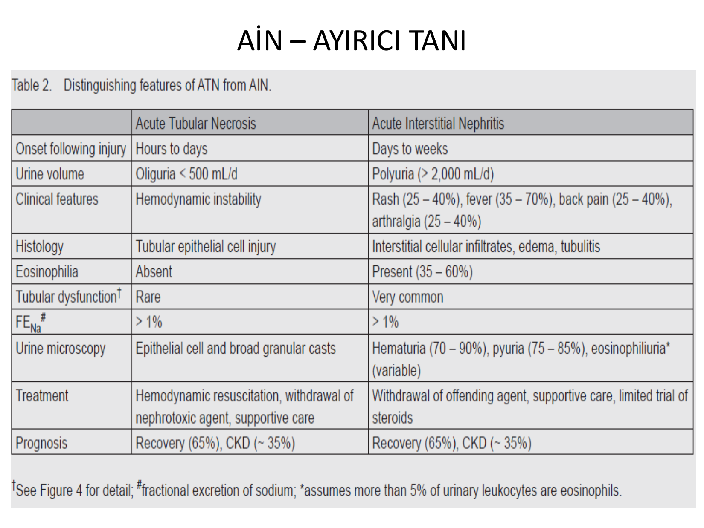
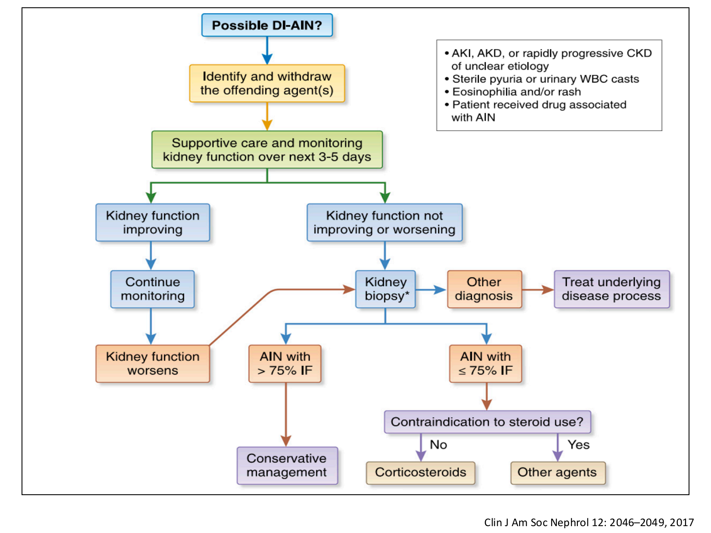
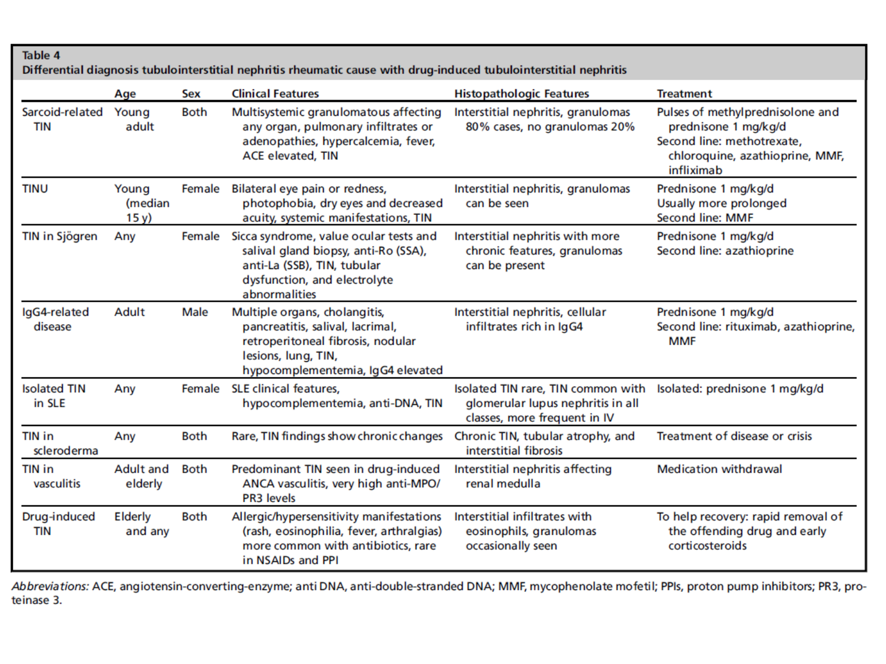
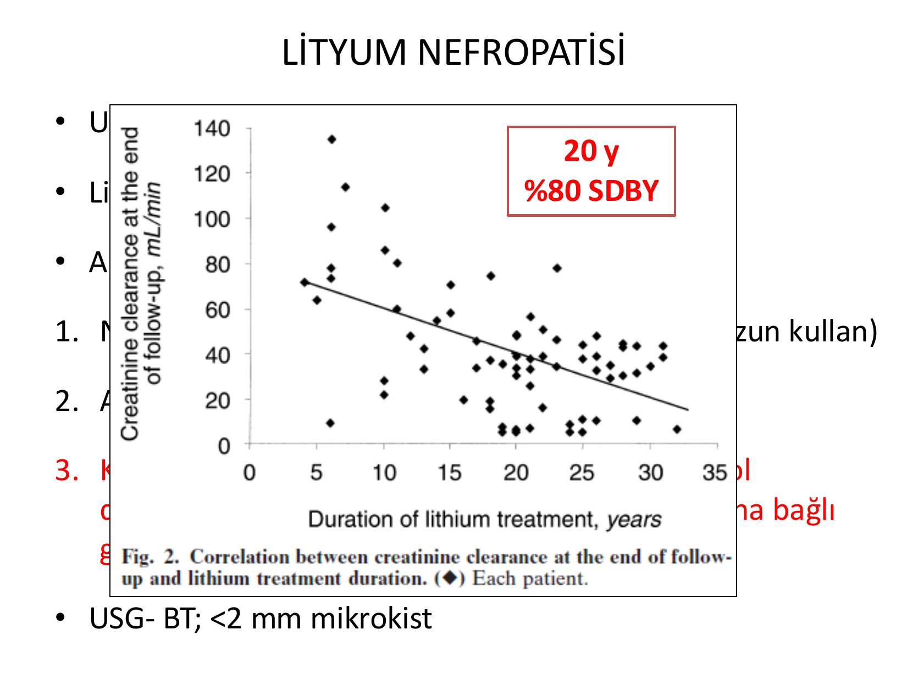

# İNTERSTİSYEL NEFRİTLER

**Hazırlayan:** Prof. Dr. Yavuz Yeniçerioğlu
**Bölüm:** Nefroloji Bilim Dalı — İç Hastalıkları Anabilim Dalı
**Gen
---

## İÇİNDEKİLER

1. [Tanım ve Sınıflama](#tanim-ve-siniflandirma)
2. [Epidemiyoloji](#epidemiyoloji)
3. [Akut İnterstisyel Nefrit (AİN)](#akut-interstisyel-nefrit)
4. [AİN — Etiyoloji](#ain-etiyoloji)
5. [AİN — Patogenez](#ain-patogenez)
6. [AİN — Histopatoloji](#ain-histopatoloji)
7. [İlaca Bağlı AİN](#ilaca-bagli-ain)
8. [TINU Sendromu](#tinu-sendromu)
9. [IgG4 İlişkili Hastalıklar](#igg4-iliskili-hastaliklar)
10. [AİN — Klinik Bulgular](#ain-klinik-bulgular)
11. [AİN — Laboratuvar Bulguları](#ain-laboratuvar-bulgulari)
12. [AİN — Ayırıcı Tanı](#ain-ayirici-tani)
13. [AİN — Tanısal Yaklaşım](#ain-tanisal-yaklasim)
14. [AİN — Tedavi](#ain-tedavi)
15. [AİN — Prognoz](#ain-prognoz)
16. [Kronik İnterstisyel Nefrit (KİN)](#kronik-interstisyel-nefrit)
17. [KİN — Etiyoloji](#kin-etiyoloji)
18. [KİN — Patoloji ve Klinik Bulgular](#kin-patoloji-ve-klinik-bulgular)
19. [Analjezik Nefropatisi](#analjezik-nefropatisi)
20. [Aristoloşik Asit Nefropatisi](#aristolosik-asit-nefropatisi)
21. [Lityum Nefropatisi](#lityum-nefropatisi)
22. [KİN — Tanısal Yaklaşım ve Tedavi](#kin-tanisal-yaklasim-ve-tedavi)

---

## TANIM VE SINIFLANDIRMA

> İnterstisyel nefritler, interstisyel alanın immün aracılıklı infiltrasyonu sonucu gelişen böbrek hastalıklarıdır.



**Eski terminoloji:** Tübülointerstisyel nefrit → **Yeni terminoloji:** İnterstisyel nefrit

| Tip | Böbrek Fonksiyonu | Patolojik Özellikler |
|---|---|---|
| **Akut İnterstisyel Nefrit (AİN)** | Ani bozulma → ABH | İnterstisyel inflamasyon, ödem |
| **Kronik İnterstisyel Nefrit (KİN)** | Yavaş bozulma → KBH | İnterstisyel fibrozis, tübüler atrofi, değişik derecelerde infiltrasyon |

---

## EPİDEMİYOLOJİ



| Saptanma Yöntemi | Sıklık |
|---|---|
| Nativ böbrek biyopsilerinde | %2-3 |
| ABH olgularında | **%15-27** |

---

## AKUT İNTERSTİSYEL NEFRİT

* Günler-haftalar içinde böbrek fonksiyonunda ani azalma
* İnterstisyumda inflamasyon ve ödem
* **Genellikle geri dönüşümlü**

---

## AİN ETİYOLOJİ

| Sebep | Etken | Sıklık |
|---|---|---|
| **İlaçlar** | Antibiyotikler (beta-laktam, rifampisin, siprofloksasin, vankomisin, asiklovir), NSAİİ (tümü), PPİ, H2 bloker, allopürinol, ifosfamid, 5-aminosalisilik asit, sorafenib, sunitinib | **%70-90** |
| **Enfeksiyon** | Bakteri (Brucella, Campylobacter, E. coli, Legionella, Salmonella, Streptokok, Stafilokok, Yersinia); Virus (CMV, EBV, HIV, hantavirus, polyomavirus); Diğer (Leptospira, TBC, Mikoplazma, Rickettsia, Schistosoma) | %5-10 |
| **İdiyopatik** | Anti-TBM, TINU sendromu | %5-10 |
| **Sistemik hastalıklar** | SLE, paraprotein, sarkoidoz, Sjögren, lenfoproliferatif hastalıklar | %10-15 |
| **Diğer** | Akut oksalat nefropatisi, akut nefrokalsinoz, IgG4 hastalığı | %1-2 |

### Detaylı İlaç Listesi

| İlaç Sınıfı | Sık Görülen (> 30-50 olgu) | Diğerleri |
|---|---|---|
| **Antibiyotikler** | Metisilin, rifampisin, siprofloksasin | Amoksisilin, ampisilin, vankomisin, penisilin, TMP-SMX, sefalosporinler, asiklovir, nitrofurantoin, linezolid |
| **NSAİİ** | Fenoprofen > ibuprofen > naproksen; COX-2: selekoksib > rofekoksib | İndometasin, diklofenak, piroksikam, sulindak |
| **PPİ / H2 blokerleri** | Omeprazol | Lansoprazol, pantoprazol, esomeprazol; simetidin, famotidin, ranitidin |
| **Antineoplastik** | İfosfamid | Sisplatin, gemsitabin, ipilimumab, interferon, sorafenib, sunitinib |
| **Diüretikler** | — | Furosemid, hidroklorotiyazid, triamteren, asetazolamid |
| **Diğer** | Allopürinol, 5-aminosalisilik asit | Fenitoin, karbamazepin, kaptopril, valproat, varfarin |

---

## AİN PATOGENEZ

* İmmünolojik olarak indüklenmiş **hipersensitivite reaksiyonu**
* Deneysel çalışmalarda major 3 antijen:
  1. TBM komponentleri (glikoprotein 3M-1, TIN-Ag/TIN1)
  2. Tübüler proteinler (üromodülin)
  3. Non-renal proteinler (immünkompleksler)
* İmmün reaksiyon renal antijenler ile indüklenmekle birlikte, çoğunlukla **ekstrarenal ilaç veya enfeksiyöz antijenler** tarafından indüklenir
* Bu antijenler böbrek parankimine bağlanıp **hapten** şeklinde nativ böbrek proteinlerinin immünojenisitesini modifiye eder

### Patogenetik Mekanizmalar

* **Antikor aracılıklı immünite**
* **Hücresel aracılıklı immünite** (daha sık)

```
İnterstisyel immün kompleks veya T-hücre infiltrasyonu
                    ↓
              Sitokin salınımı
                    ↓
          Kompleman aktivasyonu
                    ↓
          İnflamatuar reaksiyon
                    ↓
    İnterstisyel fibroblast proliferasyonu
                    ↓
         ESM sentezi artışı
                    ↓
       İnterstisyel fibrozis
```

**Önemli mediatörler:**
* Kemoatraktan: MCP-1, MIP-1, RANTES, lökotaksin
* Vazoaktif: Adenozin, NO, ET-1
* Adeziv: ICAM-1, VCAM-1, integrinler, selektinler
* Proinflamatuar: IL-6, IL-8, TNF-α, GM-CSF, PDGF-B
* Profibrotik: TGF-β, PDGF, IL-1, osteopontin, laminin, fibronektin

---

## AİN HİSTOPATOLOJİ



**İnterstisyumda:**
* **Yoğun T-lenfosit ve makrofaj infiltrasyonu**
* İnterstisyel ödem, tübüllerde ayrışma
* Değişken sayıda plazma hücresi, eozinofil, nötrofiller
* **Eozinofil infiltrasyonu** → ilaç ilişkili AİN / hipersensitivite
* **Nötrofil infiltrasyonu** → bakteriyel enfeksiyon
* **Granülomlar** → enfeksiyon, Sjögren, sarkoidoz, bazen ilaç ilişkili
* İmmün birikim nadir



---

## İLACA BAĞLI AİN

* **En sık sebep** (1960-1970: metisilin prototip ajan)
* İlaç alımından birkaç gün ile birkaç hafta içinde gelişir
* 1/3'ü **antibiyotik** ilişkili
* **Dozdan bağımsız**, hapten görevi yapar
* Rifampisin → tekrar kullanımından sonra gelişebilir
* **NSAİİ** → eozinofili yok, nefrotik sendrom eşlik edebilir
* **PPİ** → aylar sonra gelişebilir

---

## TINU SENDROMU

> **Bilateral Anterior Üveit + AİN**

* Kadınlarda **3 kat** daha sık
* **Fotofobi, göz ağrısı ve kızarıklık** ile prezente olur
* HLA-DQA1*01, HLA-DQB1*05 ve HLA-DQB1*01 ilişkili
* Patogenezi bilinmemekle birlikte hücre aracılı immünite sorumlu tutulmaktadır
* Üveit **%40** olguda tekrarlama eğilimindedir
* 200'den fazla olgu bildirilmiştir

---

## IgG4 İLİŞKİLİ HASTALIKLAR

* Yeni tanımlanmış **otoimmün** bir hastalık
* **50 yaş üstü erkeklerde** daha sık
* Sıklıkla **çoklu organ tutulumu** ile seyreder (pankreas, akciğer, tükürük bezi)
* **Kompleman düşüklüğü** saptanabilir
* Patolojide: IgG4 (+) plazma hücre infiltrasyonu + interstisyel C3 birikimi
* **Steroid yanıtı iyi** (%80)

---

## AİN KLİNİK BULGULAR

Akut veya subakut başlangıçlı, spesifik olmayan semptom ve bulgular:

| Bulgu | Sıklık |
|---|---|
| **Düşük dereceli ateş** | %36-75 |
| **Makülopapüler döküntü** | %22-50 |
| **Eozinofili** | ~%35 |
| Böbrek kapsülünün gerilmesine ikincil bel/yan ağrısı | Değişken |
| Miyalji, artralji | Değişken |
| Oligüri, kırgınlık, anoreksi, bulantı, kusma | Değişken |

**⚠️ ÖNEMLİ:** Klasik triad (ateş + döküntü + eozinofili) hastaların yalnızca **%10**'unda birlikte görülür.

---

## AİN LABORATUVAR BULGULARI

* Hafif veya şiddetli böbrek yetmezliği; **1/3'ünde** RRT ihtiyacı
* Hafif-orta düzeyde proteinüri (**< 2 g/gün**)
* **2/3'ünde** mikroskopik hematüri
* **Steril piyüri** — lökosit silendirleri
* Eozinofili — eozinofilüri
* Anemi — trombositopeni
* KCFT yüksekliği
* CRP yüksek — sedimentasyon artışı

**⚠️ ÖNEMLİ:** Hiçbir bulgunun özgüllüğü ve duyarlılığı **%50'den yüksek değildir**.

* Fanconi sendromu, tuz kaybettiren nefropati, distal renal tübüler asidoz ve idrar konsantrasyon defektleri de tanımlanmıştır
* USG ve BT'de **bilateral böbreklerde büyüme**, kortikal hiperekojenite saptanır

### Biyomarkerlar

| İdrar Biyomarkeri | İlişkili Lezyon |
|---|---|
| **İdrar MCP-1** (Monosit Kemotaktik Protein-1) ↑ | İnterstisyel ödem ve enflamatuar hücre infiltrasyonu |
| **İdrar NGAL** (Nötrofil Jelatinaz İlişkili Lipokalin) ↑ | Tübüler yaralanma ve tübüler atrofi |

---

## AİN AYIRICI TANI

### ATN vs AİN



| Özellik | Akut Tübüler Nekroz (ATN) | Akut İnterstisyel Nefrit (AİN) |
|---|---|---|
| **Hasarlanma sonrası başlangıç** | Saatler-günler | Günler-haftalar |
| **İdrar hacmi** | Oligüri (< 500 mL/gün) | Poliüri (> 2000 mL/gün) |
| **Klinik özellikler** | Hemodinamik instabilite | Döküntü (%25-40), ateş (%35-70), bel ağrısı (%25-40), artralji (%25-40) |
| **Histoloji** | Tübüler epitel hücre hasarı | İnterstisyel hücresel infiltrat, ödem, tübülit |
| **Eozinofili** | Yok | Mevcut (%35-60) |
| **Tübüler disfonksiyon** | Nadir | Çok sık |
| **FeNa** | > %1 | > %1 |
| **İdrar mikroskopisi** | Epitel hücre ve geniş granüler silendirler | Hematüri (%70-90), piyüri (%75-85), eozinofilüri (değişken) |
| **Tedavi** | Hemodinamik resüsitasyon, nefrotoksik ajan kesilmesi | Sorumlu ajanın kesilmesi, sınırlı steroid denemesi |
| **Prognoz** | İyileşme (%65), KBH (~%35) | İyileşme (%65), KBH (~%35) |

---

## AİN TANISAL YAKLAŞIM

### AİN Düşündüren Bulgular

* Pre-post renal nedenler dışlanmış ABH
* İlaç kullanım öyküsü
* Eozinofili
* Steril piyüri
* Deri döküntüsü
* Hipersensitivite bulgusu
* Üveit

### Tanı Yöntemleri

* **Galyum sintigrafisi:** Radyoaktif galyum lenfosit membranlarınca tutulur; böbreklerde uptake interstisyel lenfosit infiltrasyonunu gösterir. Duyarlılığı %58-69, özgüllüğü %50-60. Tanısal değeri **sınırlıdır** ancak ATN'yi AİN'den ayırmada yardımcı olabilir.

* **Böbrek biyopsisi:** **ALTIN STANDART**. Biyopsi kontrendike olmayan olgularda ATN'yi AİN'den ayırmada kesin tanı yöntemidir.

### İlaca Bağlı AİN Yönetim Algoritması



```
Olası ilaca bağlı AİN?
• Nedeni belirsiz ABH/AKD veya hızlı ilerleyen KBH
• Steril piyüri veya idrar lökosit silendirleri
• Eozinofili ve/veya döküntü
• AİN ile ilişkili ilaç kullanımı
              ↓
Sorumlu ajanı belirle ve kes
              ↓
Destek tedavi ve böbrek fonksiyon takibi (3-5 gün)
         ↙              ↘
Böbrek fonksiyonu         Böbrek fonksiyonu
düzeliyorsa               düzelmiyorsa/kötüleşiyorsa
    ↓                          ↓
Takibe devam              Böbrek biyopsisi
    ↓                     ↙         ↘
Fonksiyon              > %75 İF     ≤ %75 İF
kötüleşirse               ↓            ↓
    ↓                 Konservatif   Steroid kontrendike?
Biyopsi              tedavi        ↙        ↘
                                Hayır      Evet
                                  ↓          ↓
                            Kortikosteroid  Diğer ajanlar
```

---

## AİN TEDAVİ

* **Sorumlu ajanın kesilmesi** → en önemli adım
* Fibrotik değişiklikler tedavi yanıtında önemlidir
* Fibrotik değişiklikler hastalık başlangıcından **7-10 gün sonra** oluşmaya başlar → erken tedavi kritik

### Steroid Tedavisi

**Protokol 1:**
* Minimum **1-2 hafta** boyunca **1 mg/kg/gün** (maksimum 40-60 mg) prednizon
* Ardından doz yavaş yavaş azaltılır
* Toplam süre: **4-6 hafta**

**Protokol 2 (Pulse steroid):**
* 3 gün **0,5-1 g/gün** metilprednizolon pulse
* Ardından **1 mg/kg/gün** (maks 40-60 mg) prednizon
* Doz yavaş yavaş azaltılır, toplam **4-6 hafta**

---

## AİN PROGNOZ

| Sonuç | Oran |
|---|---|
| **Tam iyileşme** | %64 |
| **Parsiyel iyileşme** | %23 |
| **Son dönem böbrek yetmezliği (SDBY)** | %13 |

### Kötü Prognoz Göstergeleri

* İnterstisyel fibrozis ve tübüler atrofi (İFTA) varlığı
* İnterstisyel granülomlar (negatif prognostik değer)
* NSAİİ ile ilişkili AİN
* Uzun süreli proteinüri
* **3 haftadan uzun** süredir böbrek yetmezliği

---

## KRONİK İNTERSTİSYEL NEFRİT

* Sıklıkla **AİN'in tam tedavi edilememesine** bağlıdır
* Glomerüler, tübüler ve interstisyel yapısal hasar → yavaş ilerleyen böbrek yetmezliği

> KİN'in çoğunluğu tanı konmamış ve/veya tedavi edilmemiş bir AİN'in progresyonuna bağlıdır.

---

## KİN ETİYOLOJİ

| Sebep | Etken |
|---|---|
| **İlaçlar / Toksinler** | NSAİİ, lityum, PPİ, kalsinörin inhibitörleri (CNİ), kemoterapötik ajanlar, kurşun, civa, kadmiyum, radyasyon nefriti, aristoloşik asit |
| **Enfeksiyon** | Kronik piyelonefrit, malakoplaki, ksantogranülomatöz piyelonefrit |
| **Otoimmün hastalıklar** | Sjögren sendromu, sarkoidoz, SLE, TINU, IgG4 TİN, hipokomplementemik TİN, vaskülit |
| **Sistemik hastalıklar** | Lenfoproliferatif hastalıklar, orak hücre hastalığı, paraproteinemiler, inflamatuar barsak hastalığı, sistinoz, Dent hastalığı, ateroembolik hastalık |
| **Metabolik bozukluklar** | Kronik oksalat nefropatisi, kronik ürik asit nefropatisi, nefrokalsinoz, hipokalemik nefropati, AİN'in progresyonu |

### Romatizmal Hastalıklarda TİN Ayırıcı Tanısı



| Hastalık | Yaş | Cinsiyet | Klinik | Tedavi |
|---|---|---|---|---|
| **Sarkoidoz** | Genç erişkin | Her iki | Multisistemik granülomatöz, pulmoner infiltrat, hiperkalsemi, ACE ↑ | Pulse metilprednizolon + prednizon 1 mg/kg/gün |
| **TINU** | Genç (medyan 15y) | Kadın | Bilateral göz ağrısı, fotofobi, TİN | Prednizon 1 mg/kg/gün (daha uzun süreli) |
| **Sjögren TİN** | Her yaş | Kadın | Sicca sendromu, anti-Ro/La, tübüler disfonksiyon | Prednizon 1 mg/kg/gün |
| **IgG4** | Erişkin | Erkek | Çoklu organ, kolanjit, pankreatit, retroperitoneal fibrozis | Prednizon 1 mg/kg/gün |
| **SLE'de izole TİN** | Her yaş | Kadın | SLE klinik, hipokompleman, anti-DNA | Prednizon 1 mg/kg/gün |
| **İlaç ilişkili TİN** | Yaşlı | Her iki | Allerjik bulgular (döküntü, eozinofili, ateş, artralji) | Sorumlu ilacın hızla kesilmesi + erken kortikosteroid |

---

## KİN PATOLOJİ VE KLİNİK BULGULAR

### Patoloji

* **Non-spesifik** bulgular
* Tübüler hücre atrofisi veya dilatasyonu
* İnterstisyel fibrozis — **tiroidizasyon**
* Mononükleer hücre infiltrasyonu (T-lenfosit, makrofaj, nötrofil, eozinofil, plazma hücresi)
* %10'unda non-kazeifiye granülomatöz inflamasyon (sarkoidoz, bakteriyel/fungal enfeksiyon, Wegener, rifampisin, sülfonamid, PPİ)

### Klinik Bulgular

* Non-spesifik semptomlar
* **Hipertansiyon**
* **Poliüri — noktüri** (konsantrasyon yeteneğinde azalma)
* Yan ağrısı
* Proteinüri **< 2 g/gün** (tübüler proteinüri)
* Hematüri
* Üre-kreatinin yüksekliği
* **Erken ve derin anemi** (EPO üretiminin azalması)
* USG: Küçük böbrekler, renal papillada kalsifikasyonlar, böbrek kontur düzensizlikleri

---

## ANALJEZİK NEFROPATİSİ

* **Fenasetin ve aspirin** içeren karışımların aşırı tüketilmesi ile oluşan KİN formudur
* Genellikle kodein veya kafein içeren **iki veya daha fazla analjezik ajanın kombine** kullanımından kaynaklanır

| Kümülatif Doz | Etki |
|---|---|
| **1 kg** fenasetin | Konsantrasyon yeteneğinde azalma, GFH hafif düşme |
| **2-3 kg** fenasetin | Belirgin böbrek hastalığı |

### Patogenez

```
Fenasetin ve metabolitler
        ↓
İnterstisyumda birikim
        ↓
Serbest radikaller — oksidatif hasar
        ↓
Hücre hasarı
        ↓
Medulla kapillerleri etkilenir
        ↓
Medullada fokal nekroz alanları
        ↓
İFTA → Papiller nekroz → Kalsifikasyon
```

---

## ARİSTOLOŞİK ASİT NEFROPATİSİ

* 1991-1992 yıllarında Belçika'da tanımlandı
* Kadınlarda artan ABY başvuruları, hızlı SDBY progresyonu
* Ortak nokta: Aynı klinikten **zayıflama ürünleri** kullanımı
* Benzer isme sahip iki bitkinin karıştırılması → Han Fang Ji yerine **Guang Fang Ji** kullanılması
* *Aristolochia fanghi* eklenmesi → **aristoloşik asit** içeriyor
* Rakam hızla 100'ü aştı

### Klinik

* Nefrotik olmayan proteinüri
* Ilımlı hipertansiyon
* Kronik böbrek hastalığı (**%93**), 2 yıl içinde SDBY

### Patoloji

* Kronik tübülointerstisyel nefrit
* Minimal infiltrasyon, nadir Fanconi sendromu

### Kanser Riski

* Artmış mutasyon ve **üroepitelyal kanser riski** → **%66'ya** varan risk
* Kanser riski nedeniyle **nefroureterektomi** öneriliyor

**⚠️ ÖNEMLİ:** Aristoloşik asit **1. derece kanserojendir**. ABD'de satımı yasaktır ancak internette bulunabilmektedir. 2006 yılında ABD'de satılan Çin bitkilerinin %20'sinde etikette bildirilmediği halde mevcut saptanmıştır.

---

## LİTYUM NEFROPATİSİ

* Uzun süreli lityum kullanımına bağlı gelişir
* Lityum **toplayıcı tübüllerde** birikir
* **ADH etkisini antagonize eder**

### Klinik Formlar

1. **Nefrojenik diabetes insipidus** (%12 — 15 yıldan uzun kullanım)
2. **Akut lityum nefropatisi**
3. **Kronik lityum kaynaklı KİN** — muhtemelen inositol deplesyonu ve hücre proliferasyonu inhibisyonuna bağlı



**⚠️** 20 yıl kullanımda **%80 SDBY** riski

* USG-BT'de: **< 2 mm mikrokistler** karakteristik

---

## KİN TANISAL YAKLAŞIM VE TEDAVİ

### Tanısal İpuçları

| Özellik | Bulgu | Olası Tanı |
|---|---|---|
| **Mesleki öykü** | Ağır metal maruziyeti (pil, alaşım) | Kurşun veya kadmiyum nefropatisi |
| **Alkol** | Kaçak içki tüketimi öyküsü | Kurşun nefropatisi |
| **Sosyal öykü** | Menşe ülke | Balkan nefropatisi |
| **Geçmiş öykü** | SLE, Sjögren, sarkoidoz, İBH, otoimmün pankreatit | Hastalık ilişkili KİN |
| | Kronik ağrı sendromu | Analjezik nefropati |
| | Gut atağı | Kurşun nefropatisi |
| **İlaç** | Reçeteli ve reçetesiz (NSAİİ, PPİ) | İlaca bağlı KİN |
| | Bitkisel ürünler | Aristoloşik asit nefropatisi |
| **Fizik muayene** | Kuru göz | Sjögren |
| | Üveit | TINU sendromu |
| **Laboratuvar** | Hiperürisemi | Kronik ürik asit nefropatisi |
| | Hipokalemi | Hipokalemik nefropati |
| | Hiperkalsemi | Hiperkalsemik nefropati |
| | Yüksek serum IgG4 | IgG4 ilişkili hastalık |
| **Radyoloji** | Volüm azalması, düzensiz konturlar, papiller kalsifikasyon (BT) | Analjezik nefropati |
| | Mikrokistler (USG/MR) | Lityum nefropatisi |
| | Nefrokalsinoz (BT) | Hiperkalsemik nefropati |

### Diğer KİN Nedenleri

| Hastalık | Neden | Özellikler |
|---|---|---|
| **Kurşun nefropatisi** | Kurşun eriticiler, pil/akü üretimi, boya, petrol rafinerileri | Serum kurşun normal olabilir; idrar kurşun atılımı (sodyum versenat sonrası > 0,6 mg/gün) tanısal; hiperürisemi, gut (%50) |
| **Hiperkalsemik nefropati** | Kronik hiperkalsemi | NDI (%20), renal Na kaybı, distal RTA; nefrokalsinoz ve ürolitiyazis |
| **Hipokalemik nefropati** | Kronik hipokalemi | Ekstrarenal hipokalemi semptomları; NDI, renal kistler |
| **Hiperokzalürik nefropati** | Primer hiperokzalüri; kısa barsak sendromu, bariatrik cerrahi, İBH | Nefrokalsinoz, nefrolitiyazis |
| **Radyasyon nefriti** | Kümülatif radyasyon dozu > 23 Gy | Hipertansiyon, proteinüri, yavaş GFR azalması |
| **Herediter interstisyel böbrek hastalıkları** | Nefronofitiz (otozomal resesif); MCKD 1 ve 2 (otozomal dominant) | Nefronofitiz: SDBY gençlerde, tuz kaybı, medüller kistler; MCKD: yavaş ilerleyen BY, gut öyküsü |

### Tedavi

* Altta yatan **eksojen** (kurşun, analjezik, lityum), **metabolik** (hiperkalsemi, hiperürisemi) vb. etkenin tespiti ve buna yönelik tedavinin başlanması
* **KBH progresyonuna yönelik tedavi** (RAAS blokajı, kan basıncı kontrolü, proteinüri azaltılması)
