# KRONİK BÖBREK HASTALIĞI

**Hazırlayan:** Doç. Dr. Hakan Akdam
**Bölüm:** Aydın Adnan Menderes Üniversitesi Tıp Fakültesi — İç Hastalıkları / Nefroloji Bilim Dalı

---

## İÇİNDEKİLER

1. [Tanım ve Önemi](#tanım-ve-önemi)
2. [KBH Evrelemesi](#kbh-evrelemesi)
3. [GFH Ölçümü ve Tahmini](#gfh-ölçümü-ve-tahmini)
4. [Prevalans ve Epidemiyoloji](#prevalans-ve-epidemiyoloji)
5. [Etiyoloji](#etiyoloji)
6. [Doğal Gidiş ve Patofizyoloji](#doğal-gidiş-ve-patofizyoloji)
7. [Akut vs Kronik Böbrek Yetmezliği Ayırımı](#akut-vs-kronik-böbrek-yetmezliği-ayırımı)
8. [Klinik Bulgular — Organ Sistemlerine Göre](#klinik-bulgular--organ-sistemlerine-göre)
9. [KBH'da Progresyonu Yavaşlatma](#kbhda-progresyonu-yavaşlatma)
10. [Kan Basıncı Kontrolü — RAS Blokajı](#kan-basıncı-kontrolü--ras-blokajı)
11. [Proteinüri Yönetimi](#proteinüri-yönetimi)
12. [Anemi Yönetimi](#anemi-yönetimi)
13. [Glisemik Kontrol ve SGLT2i](#glisemik-kontrol-ve-sglt2i)
14. [Metabolik Asidoz](#metabolik-asidoz)
15. [Mineral-Kemik Bozukluğu (MKB)](#mineral-kemik-bozukluğu-mkb)
16. [Ürik Asit ve Diğer Faktörler](#ürik-asit-ve-diğer-faktörler)
17. [Renal Replasman Tedavisine Hazırlık](#renal-replasman-tedavisine-hazırlık)
18. [Özet — Tedavi Yaklaşımları](#özet--tedavi-yaklaşımları)

---

## TANIM VE ÖNEMİ

### Tanım

**Kronik Böbrek Hastalığı (KBH):** Çeşitli hastalıklara bağlı olarak **nefronların kronik, ilerleyici ve geri dönüşümsüz kaybı** ile karakterize olan bir nefrolojik sendromdur.

> **💡 KDOQI 2002 Tanım:**
>
> **En az 3 ay süren** aşağıdakilerden biri:
>
> 1. **Böbrek hasarı** — yapısal veya fonksiyonel anormallik (GFH'de azalma olsun veya olmasın):
>     * Patolojik anormallikler
>     * İdrar anormallikleri (proteinüri, hematüri)
>     * Kan anormallikleri (renal tübüler sendromlar)
>     * Görüntülemede anormallikler
>     * Böbrek transplantasyonu öyküsü
>
> 2. **GFH &lt; 60 ml/dk/1.73 m²** (böbrek hasarı olsun veya olmasın)

> **📝 Öğrenci için önemli ayrıntı:** "3 ay" şartı neden kritik? Çünkü **akut böbrek hasarının (ABH)** önemli bir kısmı 2-3 haftada düzelir. Erken dönemdeki geçici bir GFH düşüşüne "kronik" demek, geri dönüşü olmayan bir etiket yapıştırmak demektir. Örneğin; bir hafta önce ameliyat olmuş, hidrasyonu bozulmuş bir hastada ölçülen GFH 45 ml/dk olabilir; ama 2 hafta sonra tekrar bakıldığında 85'e çıkabilir. Onun için kılavuz "**üç ayın sonunda hâlâ bozuk mu?**" diye sorar.

> **💡 Niçin "KBY" değil "KBH"?** 2002'den önce "kronik böbrek yetmezliği" deniyordu. KDOQI bunu değiştirdi çünkü **GFH henüz düşmeden de böbrek hasarı olabiliyor** (ör. proteinüri (+), GFH 95 ml/dk). "Yetmezlik" sözcüğü bu erken durumları kapsamıyordu. "Hastalık" sözcüğü hem erken hasarı hem ileri evreyi kapsıyor.

### KBH'nin Önemi

* **Epidemi halini almış halk sağlığı sorunu**
* Artan sıklık
* Yüksek **morbidite ve mortalite** oranları
* Yaşam kalitesini ciddi etkilemesi
* Renal replasman tedavilerinin yüksek **maliyeti**
* Yüksek toplumsal yük

> **⚠️ ÇOK ÖNEMLİ:** Kronik diyaliz hastalarında mortalite ve morbidite oranı **genel popülasyondan 10-20 kat** daha yüksektir. Yani 60 yaşında bir diyaliz hastasının bir yıllık mortalite riski, sağlıklı 80 yaşında biriyle kıyaslanabilir.
>
> *Kaynak: Foley RN, et al. Am J Kidney Dis. 1998;32:112-119*

> **💡 Klinik perspektif:** Bir diyaliz hastası için mortalitenin en büyük nedeni **diyalizin kendisi değil, kardiyovasküler hastalıktır**. Yani "diyalize başlamak ölümden kurtarır" yaklaşımı yeterli değil — asıl iş, KBH tanısından itibaren **kardiyovasküler risk yönetimini** paralel olarak yapmaktır. Bunu "KBH tedavisi sadece böbrek değil, kardiyonefroloji tedavisidir" diye düşün.

---

## KBH EVRELEMESİ

**Kidney Disease Improving Global Outcome (KDIGO)** sınıflaması, GFH düzeyine göre KBH'yi 5 evreye ayırır.

| Evre | GFH (ml/dk/1.73 m²) | Tanım |
|---|---|---|
| **1** | **≥ 90** | Normal veya artmış GFH + böbrek hasarının diğer kanıtları |
| **2** | **60 - 89** | GFH'da hafif düşme + böbrek hasarının diğer kanıtları |
| **3A** | **45 - 59** | GFH'da orta derecede düşme (erken) |
| **3B** | **30 - 44** | GFH'da orta derecede düşme (geç) |
| **4** | **15 - 29** | GFH'da ağır derecede düşme |
| **5** | **&lt; 15** | **Son Dönem Böbrek Yetmezliği (SDBY)** |

> **⭐ Evre 1-2'de tanı konulabilmesi için GFH tek başına yetmez** — ek **böbrek hasarı kanıtı** (proteinüri, hematüri, görüntüleme bulgusu, patoloji vb.) şart.
>
> **Evre 3 ve üstünde** GFH &lt; 60 olduğu için tanı tek başına GFH ile konulabilir.

> **📝 Niçin Evre 3 ikiye bölündü (3A/3B)?** Başlangıçta evre 3 tek parçaydı (30-59). Sonradan çalışmalar gösterdi ki: **GFH 45'in altına inince** hem KV olay hem SDBY'ye ilerleme riski belirgin bir sıçrama yapıyor. Bu yüzden 2012'de Evre 3 ikiye bölündü. Bunu "bir yokuşun yarısında dönüm noktası" diye düşün — evre 3A hâlâ kontrol edilebilir bir noktadır, evre 3B'den itibaren iş ciddileşir.

> **💡 Hafızada tutma ipucu — "90, 60, 30, 15":**
>
> * **90**: Normal sınır
> * **60**: Tanı eşiği (tek başına KBH dedirtir)
> * **30**: Ciddileşen dönem başlar (Evre 4)
> * **15**: SDBY eşiği (diyaliz kapıda)
>
> Bu dört sayı evreleri ezbersiz hatırlamak için yeter.

---

## GFH ÖLÇÜMÜ VE TAHMİNİ

### GFH Ölçüm Yöntemleri

* **Altın standart:** **İnülin klirensi** — pratik kullanımı yoktur
* **Pratik standart:** Kreatinin bazlı formüller ve ölçümler

> **📝 Niçin inülin altın standart?** Çünkü inülin **yalnızca glomerülden filtre olur**, ne sekrete edilir ne reabsorbe edilir. Yani böbreğin "süzme" işlevinin saf ölçüsüdür. Ancak inülin test etmek için sürekli infüzyon + saatlik kan-idrar ölçümleri gerekir. Laboratuvar için pratik değil, araştırma için kullanılır. Klinikte kreatinin bazlı formüllerle yetiniyoruz.

### Serum Kreatininin Sınırlılıkları

* Glomerülden filtre olur, **proksimal tübülden sekrete edilir** → GFH'yi biraz yüksek gösterir
* Kas kütlesi, yaş, cinsiyete göre değişken → **tek başına ideal gösterge değildir**

> **💡 Kreatinin tuzağı:** Bir yaşlı zayıf kadının serum kreatinini **0.9 mg/dl** olabilir — "normal" diye geçilir. Oysa Cockcroft-Gault hesapladığında eGFR **35 ml/dk** çıkar! Kas kütlesi çok düşük olduğu için kreatinin üretimi düşük, GFH aslında azalmış. Bunu "dezavantajlı bir teraziyle sağlıklı gibi görünen zayıf bir kadın" gibi düşün. Bu yüzden kılavuzlar "kreatinin değerine değil, **hesaplanmış GFH'ye** bak" der.
>
> Aynı durumun tersi de geçerlidir: **genç, kaslı sporcuda** kreatinin 1.3 "yüksek" görünebilir ama GFH 100 ml/dk olabilir. Kas çok fazla → kreatinin üretimi çok → yüksek görünür.

### Kreatinin Bazlı Hesaplamalar

**1. 24 saatlik idrar kreatinin klirensi:**

```
CrCl (ml/dk) = [(idrar Cr × idrar miktarı) / (serum Cr × 1440)] × 100
```

**2. Cockcroft-Gault formülü:**

```
CrCl (ml/dk) = [(140 − yaş) × vücut ağırlığı / (72 × serum Cr)] × 0.85 (kadınsa)
```

**3. MDRD formülü:**

```
eGFR = 186 × (SCr)^(-1.154) × (Yaş)^(-0.203) × 0.742 (kadınsa)
```

> **💡 Hangisi ne zaman?**
>
> * **24 saatlik idrar:** Altın yaklaşım ama hasta uyumu zor (idrarı biriktirmek)
> * **Cockcroft-Gault:** İlaç doz ayarlamasında hâlâ yaygın (özellikle antibiyotik)
> * **MDRD / CKD-EPI:** Rutin klinik takipte tercih (CKD-EPI daha doğru)
>
> Günümüzde **CKD-EPI** formülü MDRD'den daha doğru kabul edilir ve GFH tahmininde tercih edilir.

### KFRE — Kidney Failure Risk Equation

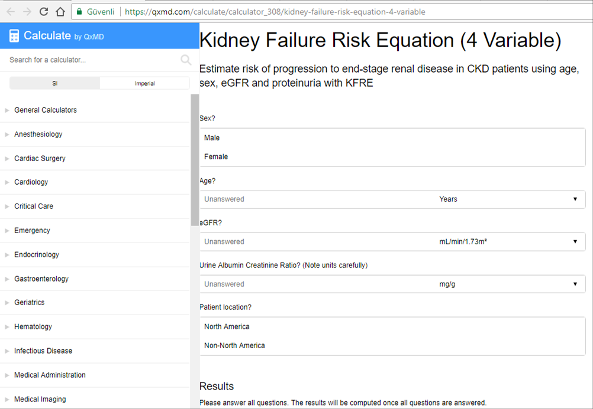

**KFRE**, KBH hastasında son dönem böbrek yetmezliğine ilerleme riskini **yaş, cinsiyet, eGFR ve idrar albümin/kreatinin oranı** kullanarak tahmin eder. Klinik karar vermede (ör. RRT hazırlığı zamanlaması) yardımcıdır.

> **📝 KFRE neden önemli?** "Bu hasta 2 yıla kadar diyalize girer mi?" sorusunun objektif cevabını verir. Örneğin 65 yaşında bir kadın hastada eGFR 22, albumin/kreatinin 600 mg/g ise KFRE 5-yıl riski %60 çıkabilir → AVF oluşturma zamanı gelmiştir. Aynı hastada oran 50 mg/g olsa risk %15 olur → acele yok. Yani KFRE bir "GPS" gibidir — "yolun sonuna ne kadar kaldı?" sorusunu cevaplar.
>
> *Kaynak: Tangri N et al. JAMA 2011;305:1553-1559*

---

## PREVALANS VE EPİDEMİYOLOJİ

### Küresel Veriler

* **KBH küresel prevalansı: ~%13.4** (%11.7 - %15.1)
* Küresel Hastalık Yükü: yılda **1.2 milyon ölüm** ve **19 milyon engelliliğe ayarlanmış yaşam yılı** kaybı

### Türkiye Verileri — CREDIT Çalışması (2006-2008)

| Parametre | Oran |
|---|---|
| **Genel popülasyonda KBH** | **%15.7** |
| GFH &lt; 60 ml/dk/1.73 m² (düşük GFH) | **%5.2** |
| SDBY | **%0.2** |

> **💡 Yorum:** %15.7 "her 6-7 kişiden biri KBH" demektir! Ama toplumda bunu bilen hasta sayısı çok az — çünkü KBH çok geç semptom verir. "Evre 1-2 KBH'lılar kendilerinin hasta olduğunu bile bilmezler" gerçeğini aklında tut; tarama bu yüzden önemlidir.

### HD Hasta Sayısının Yıllara Göre Değişimi

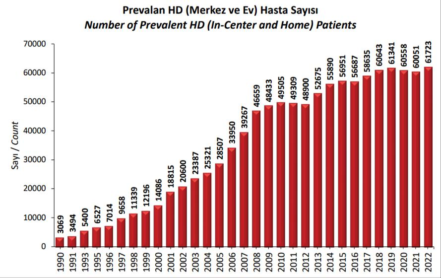

* **Prevalan PD hasta sayısı:** 3552
* **Transplantasyon yapılmış hasta sayısı:** 51.983
* **Kaynak:** Türk Nefroloji Derneği Registry Raporu 2022

### RRT Artış Sebepleri

* **Yaşam süresinin artması**
* Ekonomik durumun düzelmesi ve tıbbi hizmete erişimin artması
* SDBY hastalarındaki **sağkalım oranlarının artması**
* **KBH insidansındaki artış**

> **📝 Tarihsel bakış:** 1990'larda Türkiye'de ~3000 diyaliz hastası vardı; bugün ~65.000'i aşkın. Sebep kötüleşme değil — **diyalize erişim kolaylaştı**, yaş arttı, DM epidemisi büyüdü. Bunu "önceden teşhis edemiyorduk, şimdi edip tedavi ediyoruz" diye düşün. İyi haber: paralel olarak transplantasyon rakamı da yükseliyor.

---

## ETİYOLOJİ

### En Sık Nedenler (TND Registry 2022)

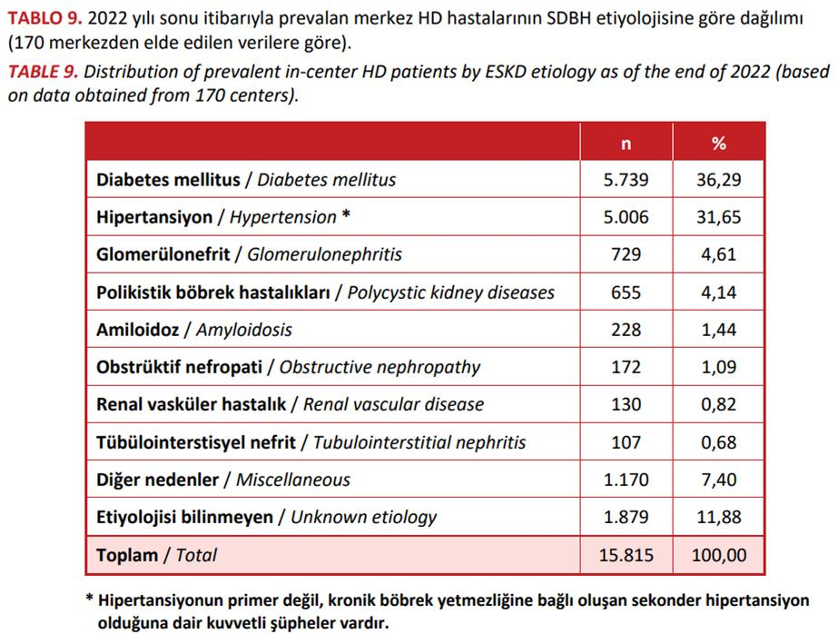

| Etiyoloji | Oran |
|---|---|
| **Diabetes mellitus** | **~%36** (birinci sıra) |
| **Hipertansiyon** | **~%27** |
| **Glomerülonefritler** | ~%8 |
| Polikistik böbrek hastalıkları | ~%5 |
| Piyelonefrit / tübülointerstisyel hastalıklar | ~%4 |
| Amiloidoz, renal vasküler hastalık, ürolojik, diğer | Kalan |

> **💡 Trend:** Geçmişte glomerülonefritlere bağlı SDBY başat iken, günümüzde **diyabete bağlı SDBY artmakta**, GN'ye bağlı SDBY azalmaktadır. Yani **"DM ve HT" ikilisi bugün KBH'nin %60'ından sorumlu**. Klinikte 60 yaş üstü bir KBH hastası gördüğünde "muhtemelen DM veya HT" diye başlamak istatistiksel olarak doğrudur — ama yine de anamnez alıp diğer sebepleri ekarte et.

> **📝 Klinik ipucu:** "KBH etiyolojisi nedir?" sorusu **sadece akademik değil**. Etiyoloji tedavi stratejisini belirler:
>
> * **Diyabetik nefropati:** SGLT2i + ACE-İ + glisemik kontrol
> * **Hipertansif nefroskleroz:** Sıkı TA kontrolü + ACE-İ/ARB
> * **GN:** Altta yatan immünolojik mekanizmaya göre (kortikosteroid, siklofosfamid, rituksimab vb.)
> * **PKBH:** Tolvaptan endikasyonu düşünülür
> * **Amiloidoz:** Altta yatan hastalığın tedavisi (FMF, MM, vb.)
>
> Yani "etiyoloji = tedavi yolu" diye hatırla.

---

## DOĞAL GİDİŞ VE PATOFİZYOLOJİ

### Genel Seyir

* KBH olguları **2-10 yıl** içinde SDBY'ye ilerler.
* Nefron kitlesi azaldıkça kalan nefronlar **hipertrofiye** olur, **hiperfiltrasyonla kompansasyon** sağlar.
* Artmış iş yükü zamanla daha fazla nefron kaybına yol açar → kısır döngü.
* Hasta **böbrek fonksiyonunun %70'ini kaybettiği halde tamamen asemptomatik** kalabilir.

> **💡 Sessiz hastalık metaforu:** 10 kişilik bir fabrikada 3 işçi hastalanıp ayrıldığında (nefron kaybı), kalan 7 işçi fazla mesai yaparak üretim hattını ayakta tutar (hiperfiltrasyon). Dışarıdan bakınca hiçbir şey değişmemiş gibi görünür — ürün çıkıyor, müşteri memnun (hasta asemptomatik). Ama fazla mesai uzun sürünce kalan işçiler de yıpranır ve 7'den 5'e, 5'ten 3'e düşer. Bir gün kritik eşik aşılır ve üretim birden çöker. Bu yüzden kreatinin **doğrusal değil, eksponansiyel** yükselir: yıllarca sabit gibi durur, sonra birdenbire 2'den 4'e, 4'ten 8'e atlar. Klinikte "hasta iyi gidiyordu birden kötüledi" tablolarının arkasında bu biyoloji vardır.

### Progresyon Göstergesi

> **💡 1/SCr Grafiği:** Hastanın zamana karşı **1/serum kreatinin** değerlerinin grafiği, progresyon hızını gösterir ve SDBY gelişme zamanını tahmin etmeye yardımcı olur.

> **📝 Niçin 1/Cr kullanılır, Cr değil?** Kreatinin logaritmik arttığı için düz grafikte zor yorumlanır. **1/Cr**, GFH ile **doğrusal orantılıdır** — bu yüzden grafiği düz bir çizgi çıkar. Çizginin eğimi progresyon hızını verir, x eksenini kestiği nokta ~SDBY zamanıdır. Bunu "zamanı geri sayan bir metronom" gibi düşün.

### Glomerüloskleroz Patogenezi

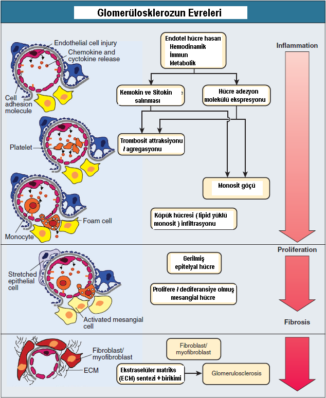

**Mekanik faktörler:**

* Hipertrofi
* Hiperperfüzyon
* **İntraglomerüler HT**
* **Hiperfiltrasyon**

**Biyolojik faktörler:**

* Büyüme faktörleri: **ANG-II**, TGF-β, EGF, FGF
* Sitokinler: IL-1, IL-6, TNF-α
* Hormonlar/otakoidler: ANP, endotelin
* Vazoaktif maddeler, lipidler

**Sonuç:** Mitojenik etki → hücre ve matriks artışı → **glomerüloskleroz**

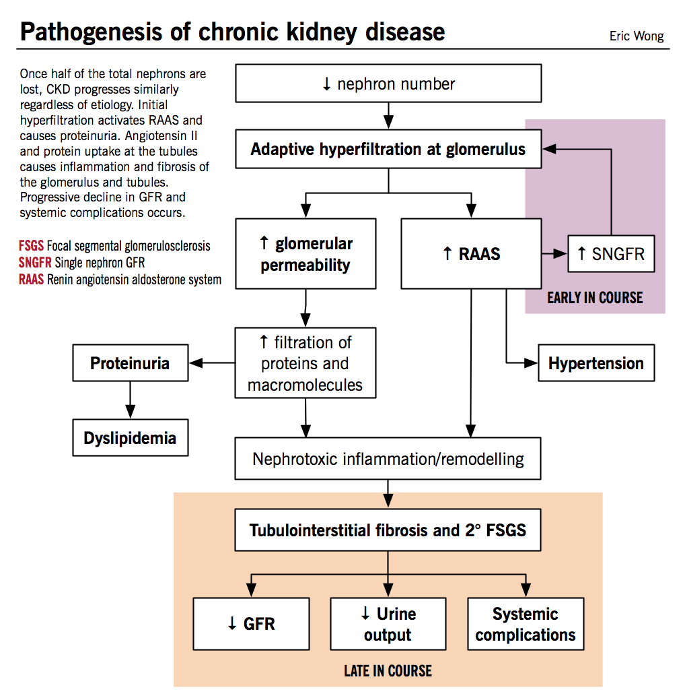

> **💡 Patogenezi iki cümlede özetle:**
>
> 1. **Başlangıçta koruyucu olan hiperfiltrasyon, sonunda yıkıcıdır.** Mekanik basınç glomerüler yapıyı zedeler, biyolojik mediatörler fibrozisi tetikler.
> 2. **Proteinüri bir sonuç olduğu kadar nedendir de.** Filtrelenen fazla protein proksimal tübülü tahrip eder → tübülointerstisyel fibroz → daha hızlı progresyon.
>
> Bu iki kısır döngüyü kırmak için ACE-İ/ARB (intraglomerüler basıncı düşürür + proteinüriyi azaltır) ve SGLT2i (hiperfiltrasyonu frenler) KBH tedavisinin kalbi konumundadır.

> **📝 TGF-β niçin önemli?** Böbrekteki "fibroz patronu" TGF-β'dır. ANG-II → TGF-β → ekstrasellüler matriks birikimi → skar dokusu. İntraglomerüler hipertansiyon TGF-β'yı aktive ettiği için ACE-İ sadece basıncı değil, fibrotik sinyali de keser. "ACE-İ bir taşla üç kuş vurur: sistemik HT ↓, glomerüler HT ↓, TGF-β ↓."

### Histopatoloji — FSGS Örneği

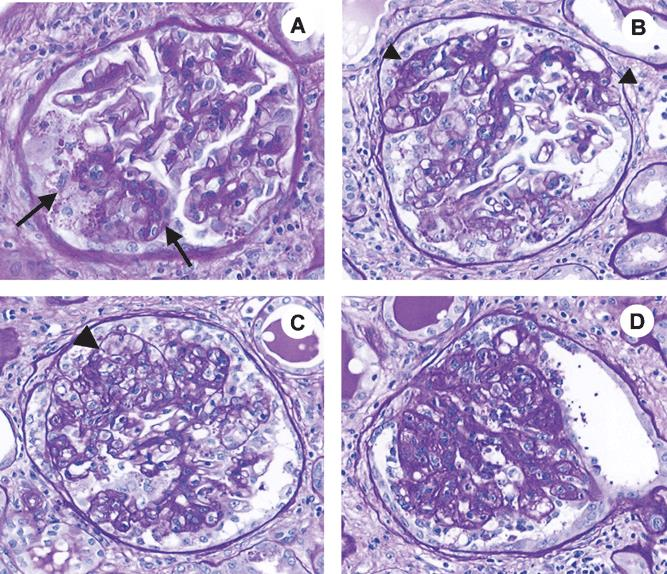

> **💡 FSGS bir son ortak yoldur:** Birçok farklı hasarın sonunda görülen histopatolojik patern. Hipertansif nefroskleroz, morbit obezite, HIV, herediter FSGS, idiyopatik FSGS hepsinin mikroskopi görünümü benzerdir. Bu yüzden "biyopside FSGS → klinik bağlamı düşün" diye aklında tut.

### KBH Patofizyolojisinin Sonuçları

İlerleyici nefron kaybı üç ana bozukluk grubuna yol açar:

| Bozukluk Grubu | Sonuçlar |
|---|---|
| **Su, elektrolit ve pH dengesi** | Sıvı fazlalığı, tuz retansiyonu, **hiponatremi**, **hiperkalemi**, **hiperfosfatemi**, **hipokalsemi**, **metabolik asidoz** |
| **Artık ürünlerin birikmesi** | Üre, kreatinin, β2-mikroglobulin, guanidin, okzalat, homosistein, vb. |
| **Hormon sentezinde bozukluk** | **Eritropoetin eksikliği**, **hiperparatiroidi**, **aktif D vitamini eksikliği** |

> **💡 Böbreğin 3 görevi:**
>
> 1. **Filtrasyon** (atık atar)
> 2. **Reabsorpsiyon/Sekresyon** (elektrolit-su dengesi)
> 3. **Endokrin** (EPO, 1,25-D, renin üretir)
>
> KBH bu üç görevin üçünü de aynı anda bozar. Bu yüzden klinik tabloda **hem atık birikimi (üremi), hem elektrolit bozukluğu, hem anemi + mineral-kemik hastalığı** bir arada görülür. "Tek bir hasta, üç farklı sorun" diye düşün.

### Nefron Kaybını Hızlandıran Faktörler

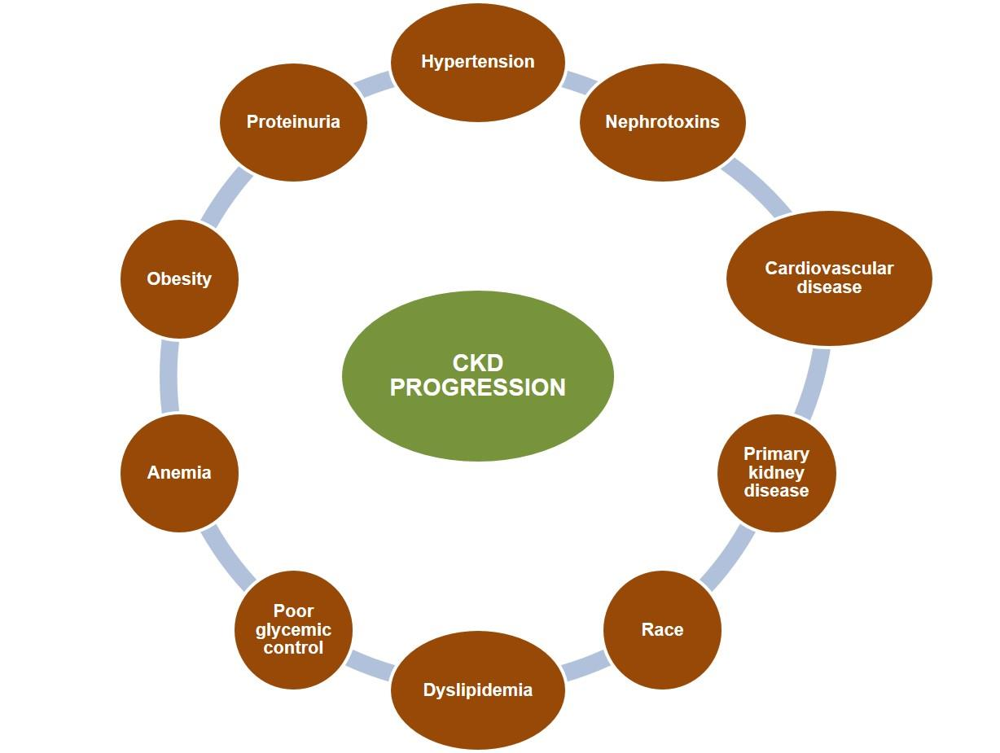

1. **KBH'nin primer nedenine bağlı aktivitenin devam etmesi**
2. **Proteinüri**
3. Tübülointerstisyel lezyonların ilerlemesi
4. **Hiperlipidemi**
5. **Yeni akut olaylar:** kontrast madde, aminoglikozid, NSAİİ

> **⚠️ Pratik uyarı:** KBH hastasında **her akut böbrek hasarı atağı kalıcı hasar bırakır**. Yani hasta hastaneden "aynı GFH ile çıktı" diye düşünsen bile, yapılan hasar büyüktür ve eğri yokuş aşağı biraz daha dikilir. Bu yüzden kontrast verirken, antibiyotik seçerken, NSAİİ reçete ederken **ayrı bir özen** gerekir.

---

## AKUT VS KRONİK BÖBREK YETMEZLİĞİ AYIRIMI

| Özellik | **Akut Böbrek Hasarı** | **Kronik Böbrek Hastalığı** |
|---|---|---|
| **Öykü** | Kısa (günler-haftalar) | Uzun (aylar-yıllar) |
| **Hemoglobin** | **Normal** | **Düşük** (anemi) |
| **Böbrek boyutları** | Normal | **Azalmış** (küçük böbrekler) |
| **Renal osteodistrofi** | Yok | **Var** |
| **Periferik nöropati** | Yok | **Var** |

> **💡 Klinik senaryo:** Acilde kreatinini 6 mg/dl olan yaşlı bir hasta. ABH mi KBH mi? Şunlara bak:
>
> * **Geçmiş tetkikleri** var mı? (En kuvvetli kanıt)
> * **Hemoglobin?** Düşükse KBH lehine
> * **USG'de böbrek boyutu?** &lt;9 cm → KBH
> * **Ca, P, PTH?** Renal osteodistrofi → KBH
> * **Tırnaklarda çizgi, kaşıntı?** KBH
>
> Eğer hasta sakince yatıyor ve üre 200 olduğu halde "iyi" görünüyorsa bu da KBH lehine — vücut yıllardır yüksek üreye alışmıştır.

### KBH Lehine Bulgular

* Semptomların uzun süreli olması
* **Yüksek üre değerlerine karşın akut hasta görünümünde olmama**
* Görüntülemede **küçük böbrekler**
* **Üremik kemik hastalığı**
* Nörolojik komplikasyonlar
* **Deri / tırnak / göz değişiklikleri**

### KBH Zemininde Akut Böbrek Hasarı Nedenleri

* Dehidratasyon
* **İlaçlar** (NSAİİ, ACE-İ/ARB, aminoglikozid, kontrast)
* Hastalık relapsı veya akselerasyonu
* Enfeksiyon
* **Obstrüksiyon**
* Hiperkalsemi
* Kontrolsüz **hipertansiyon**
* Kalp yetmezliği
* İnterstisyel nefrit

> **💡 "Akut-on-kronik" kavramı:** KBH hastasında ani kreatinin yükselişi → bir tetikleyici ara — çoğunlukla düzeltilebilir. Önce "3D + 1O" düşün: **D**ehidratasyon, **D**iüretik yanlışı, **D**rug (NSAİİ/kontrast), **O**bstrüksiyon. Bu dördünü ekarte etmeden biyopsiye koşma.

---

## KLİNİK BULGULAR — ORGAN SİSTEMLERİNE GÖRE

### Genel Durum

> **⚠️ Önemli:** KBH **SDBY'ye kadar genellikle asemptomatik** seyreder.
>
> GFH **10-15 ml/dk** düzeyine indiğinde nonspesifik semptomlar başlar:
>
> * Kırgınlık, güçsüzlük
> * İştahsızlık, bulantı, kusma
> * Konsantrasyon güçlüğü

> **💡 Niçin semptomlar bu kadar geç başlar?** Çünkü böbrek muazzam bir **rezerv kapasiteye** sahiptir. Bir insan **tek böbrekle** (GFH ~60 ml/dk) bile normal yaşayabilir. Ancak GFH 15-20 civarına indiğinde, üre ve toksinler birikmeye başlar ve **üremik sendrom** ortaya çıkar.
>
> Bu, klinikte çok kritik bir gerçektir: **"Hastam asemptomatik, demek ki KBH yok"** diyemezsin. Tarama (özellikle DM, HT, aile öyküsü olanlarda) şarttır.

### KBH'lı Hastalarda Prezentasyon Şekilleri

```
            Asemptomatik serum
            biyokimyasal anormalliği
                    ↓
   ┌────────────────┼────────────────┐
   ↓                ↓                ↓
Proteinüri/    KBH'nin       Semptomatik
hematüri       komplikas-    primer hastalık
               yonları
                    ↓
            Semptomatik üremi
                    ↓
            Hipertansiyon
```

### 🔴 Deri Bulguları

* **Solukluk** (anemiye bağlı)
* **Hiperpigmente kirli sarı (toprak rengi)** — p-MSH, karoten, ürokrom birikimi
* **Pruritis** (sık)
* **Ekimozlar** (kanama diyatezi)
* **Üremik frost** (terde ürenin kristalleşmesi → deride beyaz ince toz)
* **Kalsiflaksi** (Ca × P çökmesi → deri nekrozu ve büllöz lezyonlar)

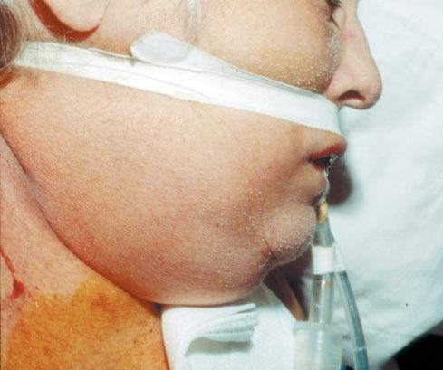

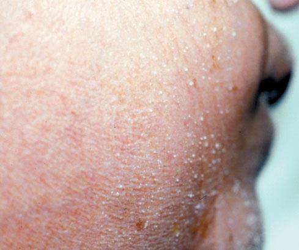

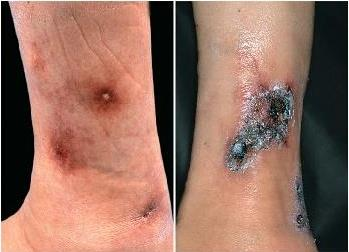

> **💡 Pruritis'i (kaşıntı) küçümseme:** KBH'lı hastaların yaklaşık yarısı ciddi kaşıntıdan yakınır. Sebep multifaktöriyel: **hiperfosfatemi, sekonder hiperparatiroidi, mast hücre aktivasyonu, üremik toksinler**. Önce **fosfor kontrolünü sıkılaştır** (diyet + fosfor bağlayıcı), gerekirse antihistaminik, gabapentin, UVB fototerapi. Yeni difelikefalin (κ-opioid agonisti) tedavisi diyaliz hastalarında özellikle etkilidir.

> **📝 Kalsiflaksi dramatik bir tablodur:** Deri altı küçük arterlerin kalsifiye olmasıyla oluşan iskemik nekroz; mortalitesi çok yüksek (%50+). Tipik olarak proksimal bölgelerde (uyluk, karın) şiddetli ağrılı kara lekeler halinde başlar. Tedavide **sodyum tiyosülfat**, fosfor kontrolü, warfarin kesilmesi anahtar. Bir KBH hastasının bacağında açıklanamayan nekrotik lezyon görürsen nefrolojiyi hemen ara.

### 💓 Kardiyovasküler Bulgular

> **⚠️ ÇOK ÖNEMLİ:** KVH, **KBH'da en sık morbidite ve mortalite nedenidir**. Hastaların **~%50'si KVH'dan kaybedilir**.

* Sıvı fazlalığı, ödem, **hipertansiyon**
* **Sol ventrikül hipertrofisi (SVH)**
* Kalp yetmezliği
* Diyalize başlayanların **%75'inde SVH**, **%80'inde HT** vardır
* HT genellikle **volüm fazlalığına** bağlıdır
* **Hızlanmış ateroskleroz**
* Asit-baz ve elektrolit bozukluklarına bağlı **aritmiler**
* **Üremik perikardit** (ilerlemiş üremide %6-10)

> **💡 Kalbi yoran üç yük:**
>
> 1. **Basınç yükü:** HT → sol ventrikül hipertrofisi (konsantrik)
> 2. **Volüm yükü:** Sıvı retansiyonu → sol ventrikül dilatasyonu (ekzantrik)
> 3. **Miyokardiyal toksik yük:** Üremik toksinler, inflamasyon, oksidatif stres, kalsifikasyon → diyastolik disfonksiyon, fibroz
>
> Sonuç: **kardiyorenal sendrom** — böbrek ve kalp birbirini sürekli kötüleştirir. Kalp yetmezliği böbreğe kan göndermez, böbrek volüm atamaz → hasta boğulur. Bu ikilinin bir tedavisi var: **SGLT2i**. Hem böbreği hem kalbi aynı anda koruduğu için "son 10 yılın en önemli ilacı" unvanını almıştır.

#### Hızlanmış Ateroskleroz — Risk Faktörleri

| Geleneksel | KBH'ye Özgü | Diyalize Bağlı |
|---|---|---|
| İleri yaş | Hemodinamik volüm yükü | Kardiyak dolumda intra/interdiyaletik değişiklik |
| Erkek cinsiyet | **Anemi** | Kan basıncı dalgalanması |
| Hipertansiyon | **Ca/P metabolizma bozukluğu** | Elektrolit dalgalanması |
| Yüksek LDL, düşük HDL | **Kronik inflamasyon** | Biyo-uyumsuz membran |
| DM, sigara, inaktivite | **Oksidatif stres**, malnütrisyon | Diyalizat safsızlığı |
| Menopoz, aile öyküsü, kilo | **Üremik durum, albuminüri** |   |

> **💡 Damar kalsifikasyonu tesadüf değil:** Hiperfosfatemi + hiperkalsemi → damar duvarı medial tabakasında **kemiksi dönüşüm** başlar. Damar adeta boru gibi sertleşir (Mönckeberg sklerozu). Bir 50 yaşındaki diyaliz hastasının aortu, 80 yaşındaki bir sağlıklı insanınki gibi kalsifiye olabilir. Bunu "yaşlılığın hızlandırılmış bir versiyonu" diye düşün.

### 🧠 Nörolojik Bulgular

* Erken dönem: **mental konsantrasyon bozukluğu**
* İleri dönem: **üremik ensefalopati** — uykusuzluk, hafıza kaybı, konfüzyon, disoryantasyon, emosyonel labilite, anksiyete, depresyon, **halüsinasyon**
* Tedavisizse: **flapping tremor, konvülsiyon**
* **Periferik nöropati**

> **💡 Üremik ensefalopati diyalizin en klasik endikasyonudur.** Hasta kafası karışık, uykulu, hatta komaya doğru gidiyorsa → diyalize başla. Paradoksal olarak **ilk diyalizden sonra geçici olarak kötüleşebilir** (disequilibrium sendromu) — beyin ile kan arasındaki solüt farkı ozmotik şift yaratır. Bu yüzden ilk diyaliz kısa ve nazik olur.

> **📝 Periferik nöropati:** Sensörimotor, simetrik, "çorap-eldiven" paterninde. DM nöropatisinden ayırmak zordur çünkü sık DM + KBH birlikteliği var. Tedavi: diyaliz, iyi kontrol. Gabapentin (dozu GFH'ye göre ayarla!) ve duloksetin yardımcı olur.

### 🤢 Gastrointestinal Bulgular

* İştahsızlık, **sabah bulantı-kusma**
* **Üremik fetor** (nefeste idrar kokusu — tükürükteki ürenin amonyağa dönüşümü)
* Ağızda **metalik tat**
* Gastrin düzeyi yüksek → **ülser insidansı artmış**
* Fosfor bağlayıcılarına bağlı **kabızlık**

> **💡 Klinik anekdot:** Üremik fetor öyle tipiktir ki deneyimli bir klinisyen hastanın yanına oturduğunda kokudan "KBH" tanısını koyabilir. Koku amonyak ve dimetilaminden kaynaklanır. Bu yüzden nefrologların hastaları çok iyi koklaması tavsiye edilir — ne çiçek için, ne balzam için; üremik fetor için.

### 🩸 Hematolojik Bozukluklar

* **Normokrom normositer anemi** — eritropoetin eksikliği
* Diğer anemi nedenleri: hemoliz, Fe/B12/folat eksikliği, hiperparatiroidi, kanamalar
* **Eritrosit yaşam süresi ~70 gün** (normalde 120)
* **Lökosit ve immün fonksiyon bozukluğu** → enfeksiyona eğilim
* **Trombosit fonksiyon bozukluğu** (agregasyon ve adezyon) → **kanamaya eğilim**
* Guanidinosüksinik asit, fenol, üre, PG'ler trombosit fonksiyonunu etkiler

> **💡 Paradoks:** KBH hastası hem **kanamaya** hem **trombozise** eğilimlidir! Trombosit fonksiyonu bozuk → kanar; ama damar duvarı inflamasyonlu + hiperkoagülabl → tıkanır. Bu yüzden operasyon öncesi antiagregan kesme, invaziv işlemler öncesi desmopressin vermek gibi denge sanatları gerekir.

> **📝 Anemi tedavisi niçin 120 değil 110-115 arası hedefler?** Çünkü TREAT, CHOIR, CREATE çalışmaları gösterdi ki **Hb'yi normal düzeylere (>13) çıkarmak mortaliteyi artırıyor** (felç, trombotik olaylar). "Az az ama yeter kadar" prensibi burada işler.

### Kemik Bozuklukları — Renal Osteodistrofi

* **Sekonder hiperparatiroidi**
* **Osteomalazi**
* **Adinamik kemik hastalığı**
* **Ca × P > 70** ise → damarlarda, eklemlerde, organlarda kalsifikasyon
* GFH **&lt; 30 ml/dk**'da tipik olarak görülür
* D vitamini eksikliğine bağlı **proksimal miyopati**

> **💡 Üç kemik patolojisini ayırt et:**
>
> * **Yüksek döngülü (SHPT):** PTH yüksek, kemik turnover hızlı, osteitis fibrosa
> * **Düşük döngülü (adinamik):** PTH bastırılmış (aşırı tedavi veya Ca yükü), turnover yavaş — ağrılı, kırık riski yüksek
> * **Karma:** Osteomalazi + SHPT
>
> Bunları kesin ayırt etmek için kemik biyopsisi gerekir (klinikte nadir yapılır). PTH, ALP, Ca, P ile klinik karar verilir.

### Endokrin ve Metabolik Bozukluklar

* **Cinsel fonksiyon bozukluğu** (sık)
* **Primer hipogonadizm** → impotans, infertilite, libido azalması
* **Hiperprolaktinemi** → amenore, galaktore
* **İnsülin direnci, glukoz intoleransı**
* İnsülin yarı ömrünün uzaması → **hipoglisemi atakları**
* **Çocuklarda büyüme-gelişme geriliği**
* **Hiperlipidemi** (TG, VLDL, LDL ↑; HDL ↓)

> **⚠️ Diyabetik KBH'de insülin doz tuzağı:** Hasta normalde 30 IU insülin alıyorsa, KBH ilerledikçe insülin yarı ömrü uzar ve aynı doz **hipoglisemi** yapabilir. Hasta "kan şekerim hep yüksekti, şimdi düştü — iyi mi oluyorum?" der; oysa bu böbreğin insülini artık temizleyememesidir. Doz **düşürülmelidir**. Özellikle GFH &lt; 30'da insülin dozunu %25-50 azaltmak standart yaklaşımdır.

### Laboratuvar Bulguları — Özet

| Bulgu | Değişim |
|---|---|
| Sodyum | ↓ (hiponatremi) |
| **Potasyum** | **↑** (hiperkalemi) |
| **Fosfor** | **↑** (hiperfosfatemi) |
| **Kalsiyum** | **↓** (hipokalsemi) |
| Magnezyum | ↑ |
| Ürik asit | ↑ |
| pH | **↓** (metabolik asidoz) |
| Hemoglobin | ↓ (anemi) |

> **💡 Hafıza ipucu — "Yüksekler listesi":** **K, P, Mg, Ürik asit, Üre, Kreatinin** hep **↑**. "Düşükler listesi": **Na, Ca, HCO₃, Hb** hep **↓**. Böbrek atamadığı her şeyi birikir, yapamadığı her şeyi eksilir.

### Renal Progresyona Etkili Unsurlar


* **Proteinüri**
* **Hipertansiyon**
* **Asidoz**
* **Hiperglisemi**
* **Sigara**
* **Hiperlipidemi**
* **Fosfat**

> **📝 Bu listedeki her madde düzeltilebilir:** "Progresyon kaderdir" diye düşünme. ACE-İ/ARB (HT + proteinüri), SGLT2i (glisemik + hiperfiltrasyon), statin (lipid), sigara bırakma, bikarbonat (asidoz), fosfor kısıtlaması — her biri eğimi biraz daha yatıklaştırır. 5-6 müdahaleyi bir araya koyduğunda bir hastanın "5 yıl içinde diyaliz" kaderi "15 yıl" haline gelebilir.

---

## KBH'DA PROGRESYONU YAVAŞLATMA

### KBH — HT — Yaşam Tarzı (KDIGO 2012)

| Önlem | Hedef | Kan Basıncında Düşme |
|---|---|---|
| **Kilo verme** | VKİ 18.4-24.9 kg/m² | **5-20 mmHg** (her 10 kg için) |
| **Tuz kısıtlaması** | &lt; 6 g/gün | **2-8 mmHg** |
| **Egzersiz** | 30 dk, haftada 3-5 gün | **4-9 mmHg** |
| **Sağlıklı beslenme** | — | **8-14 mmHg** |
| **Alkolün kesilmesi** | — | **2-4 mmHg** |
| **TOPLAM** |   | **23-55 mmHg** |

> **💡 Matematiği uyuşturmasın:** Bu rakamlar "toplanabilir" değildir — bir hasta tüm önerilere uyarsa 23-55 mmHg **düşmez**. Ancak 2-4 müdahaleyi uygulamak bile 15-20 mmHg düşüş sağlayabilir ki bu **bir antihipertansif ilaca eşdeğer** etkidir. İlaca başlamadan önce yaşam tarzını optimize etmek küçümsenecek bir yaklaşım değildir.

---

## KAN BASINCI KONTROLÜ — RAS BLOKAJI

### KBH'de Hedef Kan Basıncı

| Proteinüri | Hedef TA |
|---|---|
| **&lt; 0.3 g/gün** | **&lt; 140/90 mmHg** |
| **≥ 0.3 g/gün** | **&lt; 130/80 mmHg** |

> **💡 NICE 2021 Not:** Yeni öneriler sistolik KB hedefini **&lt; 120 mmHg**'ye çekmektedir (SPRINT çalışması etkisi).

> **📝 Niçin proteinüri varsa hedef daha sıkı?** Çünkü proteinüri, glomerüler hasarın hem göstergesi hem sebeplerinden biridir. Basıncı düşürmek → intraglomerüler basıncı düşürür → filtreden daha az protein kaçar → proksimal tübül daha az hasar görür. Yani burada TA hedefi, "kalbi korumak" değil, "glomerülü korumak" için sıkılaştırılmıştır.

### ACE-İ / ARB'nin Etki Mekanizması

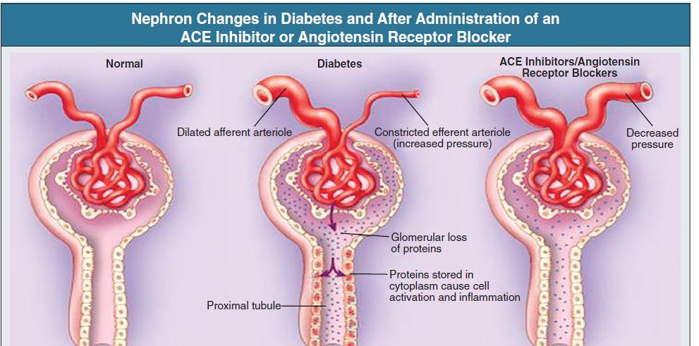

**İlk tercih:** **ACE-İ veya ARB**

**Etkileri:**

* **Glomerül içi basıncı azaltır** (efferent arteriolü genişleterek)
* Sistemik HT'yi azaltır
* **Fibrogenik faktörlerin üretimini azaltır** (TGF-β, PDGF)
* Tuz kısıtlaması (4-6 g/gün) etkiyi artırır

> **💡 Görsel ipucu — musluk ve lavabo:** Glomerülü bir lavabo gibi düşün. **Afferent arteriol** musluk (girişi), **efferent arteriol** drenaj (çıkışı). Anjiotensin II efferent arterioli **daraltır** → lavaboda su birikir, basınç artar (filtrasyon artar). **ACE-İ/ARB** efferent arterioli **açar** → lavabodaki basınç düşer, filtrasyon bir miktar azalır ama **glomerül uzun vadede korunmuş olur**.
>
> Bu yüzden ACE-İ başlangıcında **GFH'de %10-25 düşüş normaldir ve iyi bir işarettir** — lavabodaki baskının düştüğünü gösterir. Hasta "kreatinim yükseldi, ilaç zarar verdi" diye panik yapmasın diye bilgilendir.

### RAS ve Glomerüler Hasar Zinciri

```
              ANJİOTENSİN II
                    ↓
    Glomerüler HT ve Hiperfiltrasyon
                    ↓
    Nükleer Faktör κB aktivasyonu ↑
  (Growth Faktör - Profibrogenetik sitokin)
                    ↓
              PDGF ve TGF-β
                    ↓
              RENAL SKLEROZ
```

### NICE 2021 — ACE-İ / ARB Başlama ve Takip

* **K⁺ > 5 mmol/L:** ACE-İ / ARB başlanmaz
* **Başladıktan 1-2 hafta sonra** serum kreatinin ve potasyum bakılır:
    * eGFR düşüşü **&lt; %25** **veya** serum Cr artışı **&lt; %30** → **dozu değiştirme**
    * eGFR düşüşü **&gt; %25** veya Cr artışı **&gt; %30** → **ilacı kes/doz azalt**
* **K⁺ > 6 mmol/L:** ACE-İ / ARB **kes**

> **💡 "30/25 kuralı"** ezberlenmelidir: **Kreatinin %30'a kadar artabilir**, **eGFR %25'e kadar düşebilir** — bu **kabul edilebilir**, ilacı kesmiyorsun. Bu aralığın altında kalırsa, ilaç aslında uzun vadede koruyuculuğunu gösterir. Bu aralığı aşarsa, başka bir şey vardır (dehidratasyon, renal arter stenozu, NSAİİ kullanımı).

### Kreatininde %30 Artış Olasılığı Yüksek Hastalar

* Kadın cinsiyet
* İleri yaş
* Kardiyorenal komorbidite
* **NSAİİ kullanımı**
* **Loop diüretik** kullanımı
* **Potasyum tutucu diüretik** kullanımı

> **⚠️ Bilateral renal arter stenozu uyarısı:** ACE-İ başlayan hastada kreatinin **dramatik** şekilde artıyorsa (örneğin 1.2 → 2.5) **bilateral RAS** ekarte et. Bu hastalarda ACE-İ kontrendikedir, çünkü glomerül filtrasyonu tamamen efferent vazokonstriksiyona bağımlıdır; onu kesersen filtrasyon durur.
>
> *Kaynak: Schmidt M et al. BMJ 2017;356:j791*

---

## PROTEİNÜRİ YÖNETİMİ

### Proteinürinin KBH Progresyonundaki Rolü

**Proteinüri**, glomerüler filtrasyon bariyerinin hasarının bir göstergesi olmanın yanı sıra **tübülointerstisyel hasara doğrudan katkıda** bulunur:

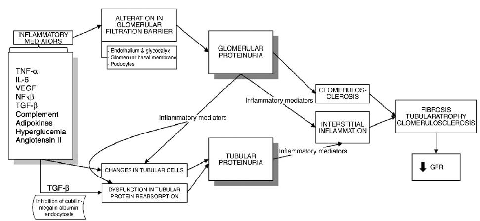

* Glomerülden süzülen proteinler proksimal tübül hücrelerinde reabsorbe edilir
* Aşırı reabsorpsiyon → **inflamatuar ve profibrotik sitokin salınımı**
* Tübülointerstisyel fibroz ve skleroza yol açar

> **💡 Proteinüri sadece bir "sayaç" değildir:**
>
> Çoğu öğrenci proteinüriyi "glomerülün ne kadar bozuk olduğunu gösteren bir ölçek" olarak görür. Oysa proteinüri **aktif bir hasar yapıcıdır**. Filtrelenen albümin, transferrin, kompleman proteinleri proksimal tübülde internalize olur → TGF-β, NF-κB, MCP-1 üretimine yol açar → **tübülointerstisyel fibroz**.
>
> Bu yüzden proteinüriyi azaltmak sadece "belirtiyi silmek" değil, **aktif hasarı durdurmaktır**. ACE-İ/ARB'nin en büyük renal koruyucu etkisi, kan basıncını düşürmesinden çok, **proteinüriyi azaltmasıdır**.

### Proteinüri Hedefleri ve Tedavi

* **Proteinüri hedefi: &lt; 0.5 g/gün** (bazı kaynaklarda &lt; 0.3 g/gün)
* ACE-İ / ARB ile proteinüri **azaltılmalı**
* Protein kısıtlaması: **0.6 - 0.8 g/kg/gün**

> **📝 Protein kısıtlaması tartışmalı:** Yüksek protein → glomerüler hiperfiltrasyon → ilerleme. Düşük protein → teorik olarak koruyucu. Ama klinik çalışmalar (MDRD) beklenen kadar güçlü etki gösteremedi, aynı zamanda **malnütrisyon riski** var. Bugün kılavuzlar "0.8 g/kg/gün — ortalama bir erişkin için yeterli, aşırıya kaçmaz" diye önerir. Diyaliz hastalarında bu değer **artar** (1.0-1.2 g/kg/gün) çünkü diyaliz protein kaybettirir.

### Proteinüri ve Progresyon İlişkisi

MDRD çalışması ve meta-analizler, proteinüri azaltımının **GFH düşüş hızını yavaşlattığını** göstermiştir.

> *Kaynak: Jafar TH et al. Ann Intern Med. 2003;139:244-252*

---

## ANEMİ YÖNETİMİ

### Anemi Nedenleri (KBH'de)

* **Eritropoetin üretim yetersizliği** (birincil neden)
* **Demir eksikliği**
* Kan kayıpları
* Sekonder hiperparatiroidi
* Akut ve kronik inflamatuar durumlar
* Alüminyum toksisitesi
* Hemoliz
* Folat ve/veya B12 eksikliği
* Hipotiroidi
* Hemoglobinopatiler

> **💡 Eritropoetin niçin böbrekte yapılır?** Böbrek, vücudun **oksijen tansiyonunu en hassas algılayan** organlarından biridir. Peritübüler interstisyel fibroblastlar O₂'deki düşüşü algılar ve EPO salgılar → kemik iliği eritropoezini uyarır. KBH'de bu hücreler fibrozise uğrar ve EPO üretimini durdururlar. Bunu "fabrika müdürünün istifa etmesi" gibi düşün — kemik iliği emir alamaz.

> **📝 Demir niçin önce kontrol edilir?** EPO yetersizliği düşünüp doğrudan ESA başlarsan, demir deposu boşsa yanıt alamazsın (ESA rezistansı). Bu yüzden önce **Ferritin > 100 ng/mL** ve **TSAT > %20** sağla, sonra ESA düşün. Yeterli demir olmadan ESA işe yaramaz.

### Anemi Başlangıcı — GFH İlişkisi

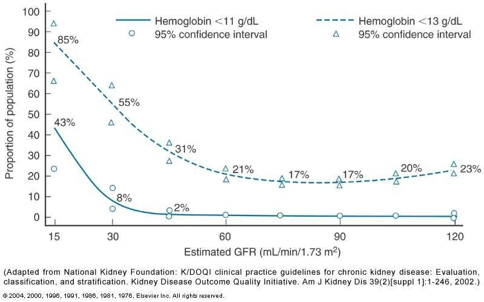

eGFR düştükçe anemi prevalansı belirgin şekilde artar.

> **💡 Grafik okuma:** Yaklaşık **GFH &lt; 60** ml/dk'dan itibaren Hb düşmeye başlar, GFH &lt; 30'da anemi ciddileşir. Bu yüzden "KBH evre 3'ten itibaren Hb takibe al" kuralı mantıklıdır.

### Anemi Değerlendirmesi

* Hematokrit ve hemoglobin
* **Eritrosit indeksleri** (MCV, MCH)
* **Retikülosit sayısı**
* **Demir parametreleri:**
    * Serum demiri
    * Total demir bağlama kapasitesi (TDBK)
    * **Transferrin satürasyonu (TSAT)** = (Serum demiri × 100) / TDBK
    * Serum ferritini
    * Hipokromik eritrosit yüzdesi
* Dışkıda gizli kan aranması

> **💡 Kural:** Neden bulunamazsa **EPO eksikliği** düşünülmelidir (KDIGO 2012 Anemi).

### Normokrom Normositer Anemi Ayırıcı Tanısı

| Mikrositoz | Makrositoz |
|---|---|
| **Demir eksikliği** | Folat eksikliği |
| Alüminyum fazlalığı | B12 eksikliği |
| Hemoglobinopatiler | **EPO tedavisine bağlı** artmış eritropoez |

> **💡 EPO başlangıcında MCV artışı:** Yeni üretilen retikülositler olgun eritrositlerden biraz daha büyüktür. ESA başladıktan sonra MCV'nin hafifçe yükselmesi B12/folat eksikliği değildir — "fabrika yeniden çalışıyor" demektir.

### Anemi Hedefleri

| Kılavuz | Hb Hedef |
|---|---|
| **KDIGO 2012** | Hb &lt; 10 → ESA başla; Hb **&gt; 11.5 olmamalı**; hedef **10-11.5 g/dl** |
| **NICE 2021** | Hb **10-12 g/dl** arası |

> **📝 Niçin normale çıkarmıyoruz?**
>
> * **CHOIR (2006):** Hb 13.5 hedefi vs 11.3 hedefi → **KV olaylar daha fazla** (13.5 grubunda)
> * **TREAT (2009):** Darbepoetin vs placebo → **inme riski 2 kat** (tedavi grubunda)
> * **CREATE (2006):** Tam düzeltmede fayda yok, zarar var
>
> Yani "daha yüksek daha iyi" değil. "Yeterince iyi" yeter. Bu, nefrolojide bir "Goldilocks prensibi" örneğidir — fazla az kötü, fazla çok da kötü; 10-11.5 aralığı "tam uygun".

### SUT (Sağlık Uygulama Tebliği) 2010 — ESA Dozları

| İlaç | Başlangıç Dozu | İdame Dozu |
|---|---|---|
| **Epoetin α/β/ζ** | 50-150 U/kg/hafta | 25-75 U/kg/hafta |
| **Darbepoetin** | 0.25-0.75 μg/kg/hafta | 0.13-0.35 μg/kg/hafta |
| **Metoksi-PEG epoetin β** | 0.4-0.94 μg/kg/2 hafta | 0.8-1.88 μg/kg/ay |

**Kural:**

* **Hb &lt; 10 g/dl ve Ferritin > 100 ve/veya TSAT > %20** → ESA başlangıç dozunda başla
* **Hb 11-12 g/dl** arası → idame dozunda ver
* **Hb > 12 g/dl** → tedaviyi **kes**

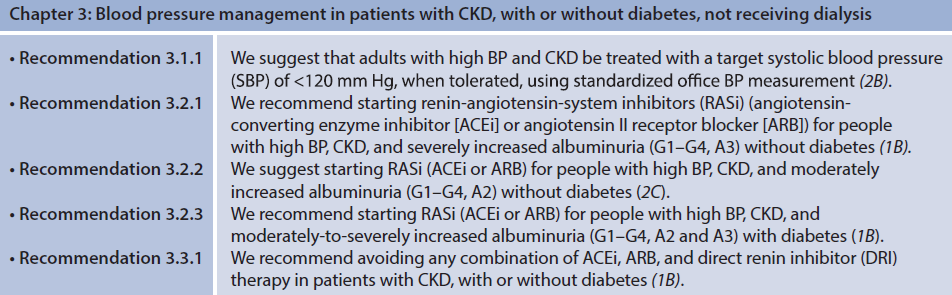

---

## GLİSEMİK KONTROL VE SGLT2i

### HbA1c Hedefi

* **UKPDS verileri:** Hedef **HbA1c &lt; %7**
* Sıkı glisemik kontrol mikro ve makrovasküler hastalık gelişimini yavaşlatır
* **Yaşlı / komorbiditeli hastada:** HbA1c 7-8 arası daha uygun

> **💡 HbA1c tuzağı:** KBH hastasında eritrosit yaşam süresi kısalmıştır (70 gün vs normal 120). Bu yüzden **HbA1c, gerçek glukoz düzeyine göre daha düşük çıkabilir**. Hasta "%6.5" değerinden memnun gözükse bile, sürekli glukoz monitorizasyonunda (CGM) ortalama değeri 170 mg/dl çıkabilir. İleri KBH'de HbA1c'ye ek olarak **fruktozamin** veya **CGM** kullan.

> *Kaynak: Williams ME, Garg R. Am J Kidney Dis. 2014;63(2):S22-S38*

### SGLT2 İnhibitörleri — KBH'de Renal Koruma

**Etki mekanizmaları (renal koruma):**

* Proksimal tübülde **Na⁺/K⁺ ATPase aktivitesini ↑** azaltarak tübüler iş yükünü düşürür
* **Proksimal tübülde O₂ ve enerji tüketimini azaltır**
* **İnflamasyon ve hipoksik hasarı azaltır**
* Afferent arteriolü kasarak **glomerüler hiperfiltrasyonu düşürür** (tübüloglomerüler feedback)

> **💡 SGLT2i niçin devrim niteliğinde?**
>
> Hikayeyi şöyle düşün: Diyabette glukoz proksimal tübülde SGLT2 ile aşırı reabsorbe edilir. Bu işlem pahalıdır — ATP harcar, O₂ tüketir, tübüler hücrelerin iş yükünü artırır. Aynı zamanda tübüloglomerüler geri bildirim mekanizması bozulur: macula densa daha az sodyum algılar → afferent arteriolü genişletir → **hiperfiltrasyon** (erken diyabetik böbrekte gördüğümüz 150-180 ml/dk GFH).
>
> SGLT2i bu zinciri tersine çevirir: glukoz emilmez → macula densa daha çok sodyum görür → afferent arteriol kasılır → **intraglomerüler basınç düşer** → hiperfiltrasyon frenlenir → uzun vadede glomerüler skleroz yavaşlar.
>
> Üstüne üstlük SGLT2i **kilo verdirir, kan basıncını düşürür, diyabet yapmayanlarda bile kalp yetmezliğini azaltır**. Bu yüzden son 10 yılın "en önemli antihipertansif olmayan, antidiyabetik olmayan ilacı" gibi özel bir konumdadır.

> **⭐ SGLT2i KBH'de standart tedavinin parçasıdır** (eGFR ≥ 20-25'e kadar başlanabilir; diyabet olsun olmasın renal ve KV koruma sağlar).
>
> *Kaynak: Tuttle KR et al. Am J Kidney Dis. 2021;77(1):94-109*

> **⚠️ SGLT2i başlarken bilinmesi gerekenler:**
>
> * **İlk 2 haftada GFH %5-10 düşer** (ACE-İ gibi) — sonra dengelenir, uzun vadede yavaşlatıcı etki gösterir
> * **Genital mikotik enfeksiyon** riski artar (glukozüri → mantar için şeker cenneti)
> * **Öglisemik DKA** riski nadir ama ciddi
> * **Volüm azalması** → ilk haftalarda tansiyon düşebilir; diüretik alan hastalarda doz ayarlaması gerekebilir

---

## METABOLİK ASİDOZ

### Patofizyoloji

```
Günlük 1 mEq/kg endojen asit üretimi
                ↓
            KBH → Net asit sekresyonunda azalma
                ↓
         Asit retansiyonu
                ↓
   Tamponlama sistemleri devreye girer:
   • Kemik (karbonat CO3²⁻)
   • Hücre içi (protein anyonları, HPO4²⁻)
   • Ekstrasellüler (HCO3⁻ - CO2 sistemi)
                ↓
   Kemikten Ca rezorpsiyonu
   Kemik mineral kaybı
   Kas proteinlerinin yıkılması
```

> **💡 Niçin kemik?** Vücut asidi tamponlamak için "en fazla tampon" olan yere gider. Kan tamponu sınırlıdır, hücre içi biraz daha fazla, ama **kemik kalsiyum karbonat açısından en büyük deposudur**. Asit yük artınca kemikten karbonat çekilir → o karbonata bağlı kalsiyum da serbest kalır → idrara gider → **zamanla kemik erir**. Yani KBH'li hastalarda kemiğin zayıflamasının bir nedeni de "asitin kemikte tamponlanması"dır.

### Metabolik Asidozun Olumsuz Etkileri (TND Uzman Görüşü 2020)

* **Kas protein parçalanması** → sarkopeni
* Çocuklarda büyümenin baskılanması
* **Kemik hastalığının artışı**
* Albümin sentezinde azalma → hipoalbuminemi
* **KBH ilerlemesi**
* İnflamasyonun uyarılması
* **İnsülin sekresyon ve yanıt bozukluğu**
* Amiloid birikimi
* **Ölüm riskinin artması**

### Tedavi

* **Hedef:** HCO₃⁻ **> 24 mEq/L (22 mEq/L üzeri)**
* **Oral sodyum bikarbonat** (başlangıç ~0.5-1 mEq/kg/gün)
* Alkali beslenme (meyve-sebze)

> **📝 Oral bikarbonat niçin bu kadar önemli?** UBI ve BiCARB çalışmaları gösterdi ki: bikarbonat replasmanı ile **GFH düşüş hızı yavaşlıyor, kas kütlesi korunuyor, mortalite azalıyor**. Basit bir tuz, sodyum bikarbonat — ama KBH'de "altın değerinde bir ilaç". Hastalar çoğunlukla tabletlerin sayısından şikayet ederler; bu yüzden diyette alkalizan besinler (ıspanak, roka, portakal, domates) vurgulanır.

> *Kaynak: Kraut JA, Madias ME. Am J Kidney Dis. 2016;67(2):307-317*

---

## MİNERAL-KEMİK BOZUKLUĞU (MKB)

### Patogenez

```
        ↓ GFH
    ┌─────┼──────────┐
    ↓     ↓          ↓
 ↓ 1,25  ↓ Fosfat   ↓ Ca algılama
  vit D  atılımı    reseptörü
    ↓     ↓          ↓
 Hipokalsemi + Hiperfosfatemi
    ↓
 SEKONDER HİPERPARATİROİDİ
    ↓
Kemik rezorpsiyonu ↑
Yüksek döngülü renal osteodistrofi
```

> **💡 FGF-23'ü unutma:** Klasik şema biraz eskidir. Günümüzde **FGF-23** (fibroblast growth factor 23) hiperfosfatemiye karşı ilk savunma hattı olarak kabul edilir: GFH daha düşmeden önce osteosit kaynaklı FGF-23 artar → fosfat atılımını artırır, 1,25-D üretimini baskılar. Bu "PTH'dan önce gelen hormon" anlamına gelir ve KBH'nin çok erken evrelerinde yükselir. FGF-23 yüksekliği bağımsız **kardiyovasküler risk** göstergesidir — yani yüksek FGF-23 olan bir KBH hastası KV olay açısından yüksek risklidir.

### Bedel (Trade-off) Hipotezi

Böbrek yetmezliğine bağlı iyon/bileşik dengesizliklerini düzeltmeye yönelik kompansatuvar mekanizmalar, kısa vadede dengeyi kurar ama uzun vadede **toksik sonuçlar** doğurur:

* Kemikte yüksek döngü → osteodistrofi
* Karbonhidrat intoleransı
* Hipertrigliseridemi
* Kemik iliği fibrozisi

> **💡 "Bedel" adının anlamı:** Vücut "fosforu atmak için" PTH'yı yükseltir. Bu kısa vadede fosforu normale çeker — sorun çözülmüş gibidir. Ama **bedeli kemikten kalsiyum çekmektir** → kemik erir → ikinci hastalık ortaya çıkar. Vücut bir problemi çözerken diğerini yaratır. Buna "yorganı yukarı çekince ayakların açılması" örneği uygun. KBH'nin pek çok komplikasyonu "bedel" kategorisinde yer alır.

### Sekonder Hiperparatiroidi Patofizyolojisi

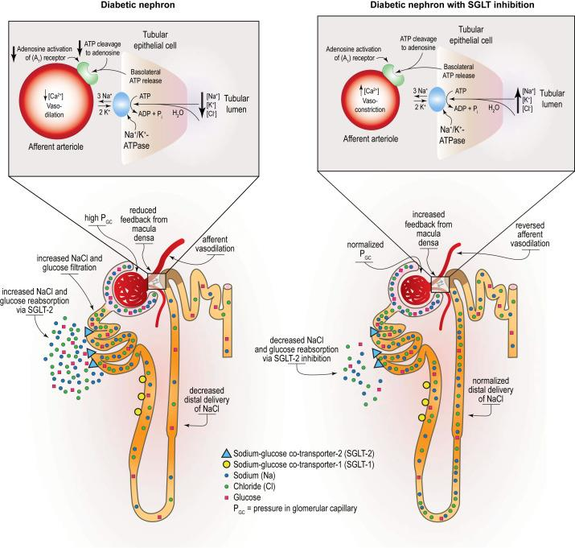

> **📝 Yeşil nokta — SHPT niçin gelişir?**
>
> 1. **Fosfat atılamaz** → hiperfosfatemi
> 2. **Hiperfosfatemi** hem direkt kalsiyum çökmesi yapar hem **1α-hidroksilaz** enzimini baskılar → aktif D vitamini (1,25-(OH)₂-D₃) üretimi düşer
> 3. **D vit düşmesi** → barsaktan Ca emilimi azalır → **hipokalsemi**
> 4. **Paratiroid** hipokalsemi ve hiperfosfatemiyi algılar → **PTH sekresyonunu artırır**
> 5. PTH kemikten Ca çeker, fosfatüriyi artırır (böbrekte kaldığı kadarıyla), aktif D vit üretimini uyarmaya çalışır → kısmen kompansasyon
> 6. Ama kalıcı uyarım **paratiroid hiperplazisine** yol açar — "otonom salgı" başlar (tersiyer hiperparatiroidi)
>
> Tedavi zinciri şu şekilde: **fosforu düşür (diyet + bağlayıcı)** → **aktif D ver** → **kalsimimetik** → yetmezse **paratiroidektomi**.

### Fosfor Dengesi

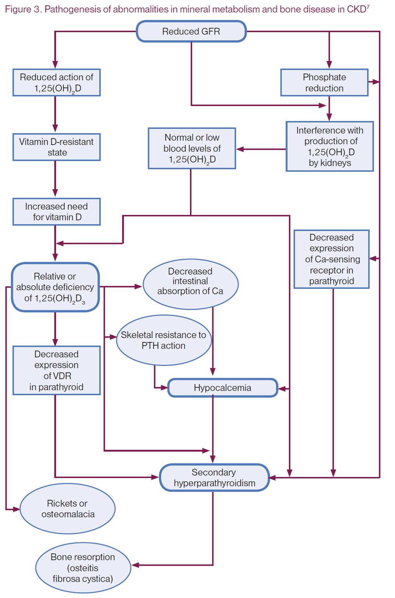

**Kritik eşik:**

* Diyetle fosfor alımı: **~1200 mg/gün**
* Net barsak absorpsiyonu: **~100 mg/gün** (geri kalanı fekal atılır)
* Böbrek: **fazla fosforu atar** — KBH'de bu kapasite azalır → **hiperfosfatemi**

> **💡 Sinsi fosfor kaynakları:** "Diyette fosforu kısıt" demek kolay, ama modern Türk beslenmesinde saklı fosfor **çok fazla** — işlenmiş et ürünleri (sosis, salam), koladaki **fosforik asit**, ambalajlı yiyeceklerde E-kodlu fosfat katkıları (E450, E451, E452). Doğal fosfor (et, süt, baklagil) %40-60 absorbe olurken, katkı fosforu **%90+ absorbe** olur. Bu yüzden hastaya "fosforu azalt" yerine "**işlenmiş gıdalardan kaçın**" diye öğüt ver — çok daha etkili olur.

### Fosfor Bağlayıcılar

**Kalsiyum içerikli:**

* **Kalsiyum asetat**
* **Kalsiyum karbonat**

**Kalsiyum içermeyen:**

* **Sevelamer**
* **Lantanum**

> **💡 Ca'lı mı Ca'sız mı?** Eskiden Ca'lı bağlayıcılar ucuz olduğu için tercih edilirdi. Ancak çalışmalar (COSMOS, INDEPENDENT) gösterdi ki yüksek Ca yükü **damar kalsifikasyonunu artırıyor** ve mortaliteyi yükseltiyor. Bu yüzden günümüzde Ca'sız bağlayıcılar (sevelamer, lantanum) daha çok tercih edilir — özellikle genç, damar kalsifikasyonu olan, hiperkalsemisi olan hastalarda. Bunu "taş ile taş kırmak" yerine "güvenli sünger kullanmak" gibi düşün.

### SHPT Tedavisi

| Strateji | Uygulama |
|---|---|
| **Diyetle fosfor kontrolü** | Günlük fosfor alımı kısıtlanır |
| **P bağlayıcı kullanımı** | Ca'lı veya Ca'sız |
| **Yeterli diyaliz** | P klirensini artırır |
| **Kalsimimetik** (sinakalset) | CaSR agonisti → PTH ↓ |
| **Vitamin D reseptör (VDR) aktivatörleri** | Selektif/nonselektif VDR agonistleri |
| **Oral Ca alımının kontrolü** | Hiperkalsemi önlenir |
| **Diyalizat Ca²⁺ ayarı** | Düşürülür |
| **Paratiroidektomi** | Refrakter SHPT'de cerrahi |

> **💡 Sinakalset niçin "kalsimimetik" adını alır?** Paratiroid hücresinde **kalsiyum algılayan reseptör (CaSR)** vardır. Sinakalset bu reseptörü **kalsiyummuş gibi** aktive eder → PTH üretimi düşer. Yani gerçek kalsiyumu artırmadan paratiroide "ortamda yeterince Ca var, susabilirsin" diye yalan söyler. Bu sayede PTH düşer ama Ca artmaz.

### Vitamin D Replasmanı (KDOQI)

**Protokol:**

1. **Yıllık 25(OH)D ölçümü**
2. **25(OH)D &lt; 30 ng/mL:** 8 hafta boyunca **ergokalsiferol 50.000 IU/hafta** (veya kolekalsiferol 10.000 IU/hafta)
3. Hâlâ &lt; 30 ise → aynı tedavi 8 hafta daha tekrarlanır
4. **≥ 30 ng/mL** olduğunda idame: **ergokalsiferol 50.000 IU/ay** veya **kolekalsiferol 1000-2000 IU/gün**
5. **25(OH)D > 100 ng/mL** veya **Ca > 10.5 mg/dL** → nutrisyonel D vitamini **kesilmelidir**

> **📝 25(OH)-D vs 1,25(OH)₂-D farkı:** 25(OH)-D (kalsidiol) depo formudur, karaciğerde yapılır, kan düzeyleri ölçülür. **1,25(OH)₂-D (kalsitriol)** aktif formdur, böbrekte 1α-hidroksilaz ile yapılır, kısa yarı ömürlü. KBH'de **böbrek 1α-hidroksilazı yapamadığı için** depo formu (25-D) yeterli olsa bile aktif form eksik olabilir. Bu yüzden evre 4-5'te **aktif D vit (kalsitriol/parikalsitol)** verilir, sadece nutrisyonel D yetmez.

> *Kaynak: Ergocalciferol and cholecalciferol in CKD. Am J Kidney Dis. 2012 Jul;60(1):139-56*

---

## ÜRİK ASİT VE DİĞER FAKTÖRLER

### Ürik Asit ve KBH

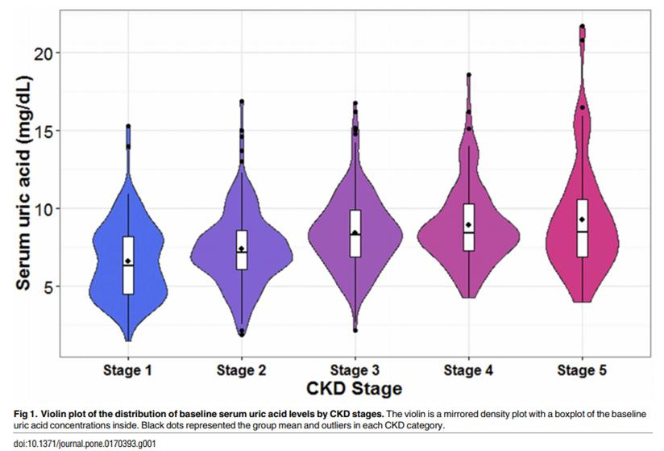

* **Kronik gut ve hiperürisemi** → renal medullada kristal oluşumu
* **RAS aktivasyonu** → glomerüler HT ve renal otoregülasyon bozulması
* **Oksidatif stres** — ürik asit ekstrasellüler antioksidan iken hücre içinde **pro-oksidan**
* Sonuç: **endotelyal ve mitokondriyal disfonksiyon**

> **💡 Ürik asit paradoksu:** Ekstrasellüler alanda (kan) ürik asit **antioksidan**tır — serbest radikalleri temizler, damar sağlığına katkı sağlar. Ama hücre içine girdiğinde **pro-oksidan** olur. Yani doğru yerde iyi, yanlış yerde kötü. KBH'de hücre içine geçişi arttığı için zararı baskın hale geçer. Tedavi (allopurinol, febuksostat) tartışmalıdır — asemptomatik hiperürisemiyi rutin tedavi etme önerilmez, ancak gut atağı varsa şart.

### Kontrast Madde — KBH'de Görüntüleme

* **KBH'de MR görüntüleme:** Gadolinium ile **nefrojenik sistemik fibroz (NSF)** riski vardır — eGFR &lt; 30'da dikkatli kullanım
* **İyotlu kontrast:** Kontrast-indüklü AKI riski → mümkünse kaçınılır, gerekliyse hidrasyon sağlanır

> **⚠️ Klinik pratik:**
>
> * eGFR ≥ 30 → iyotlu kontrast nispeten güvenli (prosedür öncesi hidrasyon)
> * eGFR &lt; 30 → kontrast dışı alternatif ara (USG, non-kontrast CT/MR)
> * **Acil bir hayat kurtarıcı görüntüleme varsa** (örn. pulmoner emboli, akut iskemik inme, aort diseksiyonu) → kontrasttan kaçınma, çünkü hastayı kaybetmek böbrek hasarından çok daha büyük kayıp
>
> Eski "kontrast nefropatisi korkusu" artık bir miktar yumuşamıştır; yeni çalışmalar (AMACING 2017) hidrasyonun bile çoğu hastada gerekli olmadığını gösterdi. Ama yine de **hesaplanmış risk** mantığı geçerli.

### Sıvı Alımı — "Ne Kadar Su İçmeliyiz?"

Günlük **2 litreden fazla sıvı alımı önerilmez**, çünkü:

* Böbrek süzme fonksiyonunda hızlı azalma
* Kan basıncında yükselme
* **Hiponatremi (su zehirlenmesi)**
* Ödem

> **💡 Toplumdaki "günde 2-3 litre su içilmeli" efsanesi KBH için YANLIŞTIR.** Sağlıklı bir insanın böbreği fazla suyu atabilir ama **KBH'lı bir böbrek bunu atamaz**. Hastaya "ne kadar su içmeliyim?" diye sorulduğunda sıradan cevap "susadıkça" olmalıdır. Hasta volüm yükü nedeniyle kalp yetmezliği veya hiponatremi geliştirebilir.

> **📝 Altın kural:** Genellikle **1.5 litre idrar** çıkaracak kadar sıvı tüketimi, toplam **&lt; 2 litre/gün** yeterlidir.

---

## RENAL REPLASMAN TEDAVİSİNE HAZIRLIK

### RRT Öncesi Basamaklar

1. **Değişik tedavi yöntemleri ile ilgili bilgilendirme** (HD, PD, transplantasyon)
2. İleride hemodiyaliz damar girişi için **önkol damarlarının korunması** ve eğitim
3. Diyaliz ünitesine ulaşım için **sosyal servislere sevk**
4. **Kalıcı damar yolu oluşturma zamanlaması:**
    * CrCl **&lt; 25 ml/dk** veya serum kreatinin **> 4 mg/dl**
    * Diyalize kadar tahmin edilen süre **≤ 12 ay**
    * **A-V fistül** tercih edilir
    * **Periton diyalizi kateteri** diyaliz başlamadan **2-4 hafta önce** yerleştirilir

> **⚠️ Önkol damarlarının korunması — öğrenciye önemli ders:** KBH evre 4 hastasında **non-dominant kolun cephalic ve basilic venleri** ileride AVF için kullanılacaktır. Hastane yatışlarında bu kol **intravenöz kanülasyon, kan alma, tansiyon ölçümü için kullanılmamalıdır**. Nöbette hastanın kolunda "AVF için korunuyor" notu görürsen o kola hiç dokunma. Bir kez zedelenen damar fistül için kaybedilmiş demektir.

> **💡 AVF niçin tercih edilir?**
>
> * **Santral venöz kateter** → enfeksiyon, tromboz, stenoz riski yüksek; kısa ömürlü
> * **Greft** → sentetik materyal; orta risk
> * **AVF (arteriyovenöz fistül)** → hastanın kendi damarı; **en uzun ömür, en az enfeksiyon, en iyi akım**
>
> AVF olgunlaşması **6-12 hafta** sürer; bu yüzden "diyalize girme zamanı yaklaşıyor" dediğinde AVF çoktan olgunlaşmış olmalıdır. Bu planlamayı zamanında yapmayan bir nefrolog hastayı santral kateterle diyalize sokmak zorunda kalır — bu da "ikinci sınıf" bir başlangıç sayılır.

### Düzeltilebilir Faktörler — Böbrek Yetmezliğini Hızlandıran Sebepler

* **Kalp yetmezliği**
* **İlaçlar:** NSAİİ, ACE-İ, ARB, aminoglikozid, kontrast
* **Volüm eksikliği**
* **Kontrolsüz HT**
* **Tıkanma**
* Renal / ekstrarenal enfeksiyon
* **Artmış katabolizma:** enfeksiyon, GİS kanaması, cerrahi

### Böbrek İşlev Bozukluğunun Geriye Dönebilir Nedenleri

| Böbrek perfüzyon azalması | Nefrotoksik ilaçlar | GFH'yi azaltan ilaçlar | Üriner yol tıkanmaları |
|---|---|---|---|
| Hipovolemi | Aminoglikozid | **ACE-İ** | — |
| Hipotansiyon | **NSAİİ** | **NSAİİ** |   |
| — | IV radyokontrast madde | — |   |

---

## ÖZET — TEDAVİ YAKLAŞIMLARI

### KBH İlerlemesini Yavaşlatıcı Tedavi

| Hedef | Değer | Tedavi |
|---|---|---|
| **Kan basıncı kontrolü** | 140/90 (prt−), **130/80 (prt+)** | **ACE-İ / ARB**, tuz kısıtlaması |
| **Proteinüri azaltma** | **&lt; 0.5 g/gün** | ACE-İ / ARB |
| **Glisemik kontrol** | **HbA1c &lt; %7** | Diyet, ilaç (**metformin, SGLT2i**) |
| **Protein kısıtlaması** | **0.6-0.8 g/kg/gün** | Diyet |
| **Kolesterol düşürme** | **LDL-K &lt; 100 mg/dL** | Diyet, **statinler** |
| **Yaşam tarzı** | İdeal VA, düzenli egzersiz, sigara bırakma | — |

> **💡 "KBH'nin beşli tedavisi" (öğrenciye ezber ipucu):**
>
> 1. **TA:** ACE-İ / ARB
> 2. **Glukoz:** Metformin + **SGLT2i**
> 3. **Asidoz:** Oral NaHCO₃
> 4. **Fosfor/PTH:** Diyet + P bağlayıcı + D vit
> 5. **Anemi:** Demir + ESA
>
> Bu beş pilar her KBH hastasının takibinde düzenli olarak sorgulanmalıdır. "Hastam ne aldı, ne almadı?" kontrolü için şu listeyi akılda tut.

### Üremik Komplikasyonların Önlenmesi ve Tedavisi

* **Tuz kısıtlaması:** 5 g/gün
* **VKİ:** 20-25 kg/m²
* **Protein kısıtlaması:** 0.8 g/kg/gün
* **Kan basıncı:** Proteinüri (+) → 130/80; (−) → 140/90
* **Asidoz:** HCO₃⁻ **> 24** tutulur
* **Renal osteodistrofi:** Ca-P bağlayıcıları, D vit, aktif D vit
* **Aneminin kontrolü:** Hedef Hb **10-11.5 g/dl**
* **Malnütrisyon önleme:** Hedef albümin **> 4 g/dl**
* **HbA1c:** **7-8** (bireyselleştirilmiş)
* **Ödem:** Loop diüretik

> **💡 Malnütrisyon niçin kötü?** KBH hastasında düşük albümin → **daha yüksek mortalite**. Bu kısmen inflamasyon, kısmen protein alımı sınırlamasının aşırıya kaçması, kısmen GI semptomlar (iştahsızlık, bulantı) nedeniyledir. Diyetisyenle ortak çalışma KBH takibinin ayrılmaz parçasıdır — hastayı "yeme" ile "az ye" arasında ince bir çizgide dolaştırmak gerekir.

---

## SINAV NOTLARI — ANAHTAR HATIRLATMALAR

> **📋 En Sık Sorulan Noktalar:**
>
> 1. **KBH tanısı:** En az **3 ay** süren böbrek hasarı ve/veya **GFH &lt; 60 ml/dk/1.73 m²**.
> 2. **KBH evreleri KDIGO:** Evre 1 (≥90) → Evre 5 (&lt;15 SDBY); Evre 3A/3B ayrımı 45'te yapılır.
> 3. **Türkiye'de KBH prevalansı ~%15.7** (CREDIT çalışması).
> 4. **En sık 3 etiyoloji:** **DM > HT > Glomerülonefritler**.
> 5. **Ana mortalite nedeni KVH** — hastaların %50'si bu nedenle kaybedilir.
> 6. **KBH vs ABH:** KBH'de Hb **düşük**, böbrek **küçük**, osteodistrofi ve periferik nöropati **var**.
> 7. **Progresyonu yavaşlatan temel tedaviler:** TA kontrolü + **ACE-İ / ARB** + proteinüri azaltma + SGLT2i + asidoz düzeltme.
> 8. **Kan basıncı hedefi:** Proteinüri (+) → **130/80**; (−) → **140/90**; NICE 2021 SBP &lt; 120.
> 9. **ACE-İ/ARB başlama kuralı:** K &gt; 5 başlanmaz; **%30 Cr artışı veya %25 eGFR düşüşü** olursa kes.
> 10. **Proteinüri hedefi:** **&lt; 0.5 g/gün**; protein alımı **0.6-0.8 g/kg/gün**.
> 11. **Anemi hedefi:** Hb **10-11.5 g/dl** (KDIGO), Hb > 12 ESA'yı kes.
> 12. **Metabolik asidoz:** HCO₃⁻ **> 24** tut; oral NaHCO₃.
> 13. **MKB:** ↓1,25(OH)₂D + ↑fosfat + ↓Ca → **Sekonder hiperparatiroidi**; tedavi P bağlayıcı, vit D, kalsimimetik, gerekirse paratiroidektomi.
> 14. **SGLT2i KBH'de renal ve KV koruma sağlar** (eGFR ≥20-25).
> 15. **RRT hazırlığı:** CrCl &lt;25 veya Cr &gt;4'te **AVF** oluşturulur; PD kateteri 2-4 hafta önceden.

---

> **Kaynaklar:**
>
> 1. KDIGO 2012 CKD Guideline. Kidney Int Suppl 3:5-14, 2013.
> 2. Foley RN, et al. Am J Kidney Dis. 1998;32:112-119.
> 3. Türk Nefroloji Derneği Registry Raporu 2022.
> 4. Süleymanlar G et al. CREDIT Çalışması. 2006-2008.
> 5. Tangri N et al. JAMA 2011;305:1553-1559 (KFRE).
> 6. Jafar TH et al. Ann Intern Med. 2003;139:244-252.
> 7. Kraut JA, Madias ME. Am J Kidney Dis. 2016;67(2):307-317.
> 8. Tuttle KR et al. Am J Kidney Dis. 2021;77(1):94-109 (SGLT2i).
> 9. Williams ME, Garg R. Am J Kidney Dis. 2014;63(2):S22-S38.
> 10. Schmidt M et al. BMJ 2017;356:j791.
> 11. NICE 2021 CKD Guideline.
> 12. Comprehensive Clinical Nephrology, 5E, 2015.

---

## EK: Hiperkalemi Şiddetine Göre EKG Değişiklikleri

| Potasyum seviyesi (mmol/L) | Mekanizma | EKG değişiklikleri |
|---|---|---|
| **5.5 – 6.5** | Repolarizasyon anormallikleri | Sivri T dalgaları (T sivrileşmesi) |
| **6.5 – 7.0** | İlerleyici atriyal paralizi | • P dalgasında genişleme/düzleşme<br>• PR uzaması<br>• Sonuçta P dalgalarının kaybolması |
| **7.0 – 9.0** | İleti anormallikleri | • **Bradiaritmiler:** Sinüs bradikardisi; yavaş kavşak (junctional) ve ventriküler kaçış ritimleri ile yüksek dereceli AV blok; yavaş atriyal fibrilasyon<br>• İleti blokları (dal bloğu, fasiküler bloklar)<br>• Bizar (tuhaf) QRS morfolojisi ile uzamış QRS mesafesi |
| **> 9.0** | Yukarıdakilerin hepsi | • Sinüs dalgası (sine wave) görünümünün gelişimi (pre-terminal ritim)<br>• Asistoli<br>• Ventriküler fibrilasyon<br>• Bizar, geniş kompleksli ritim ile NAE (Nabızsız Elektriksel Aktivite) |
