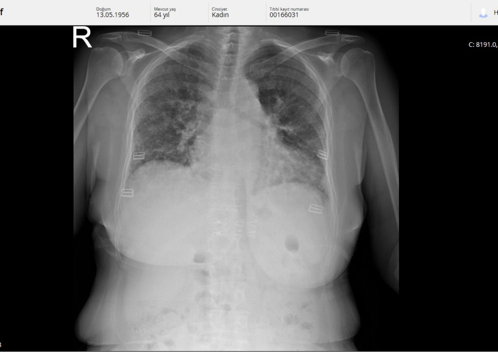
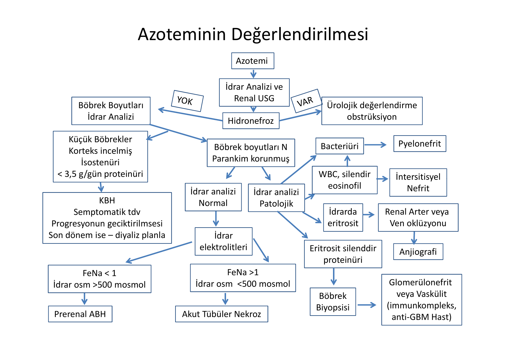
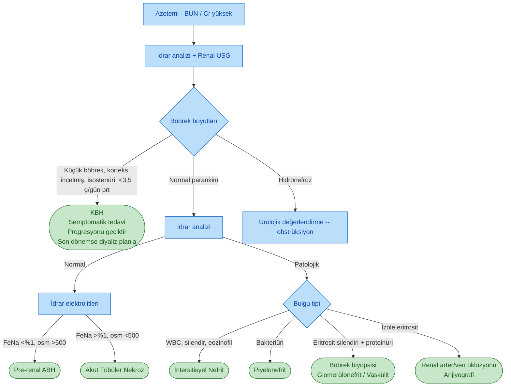
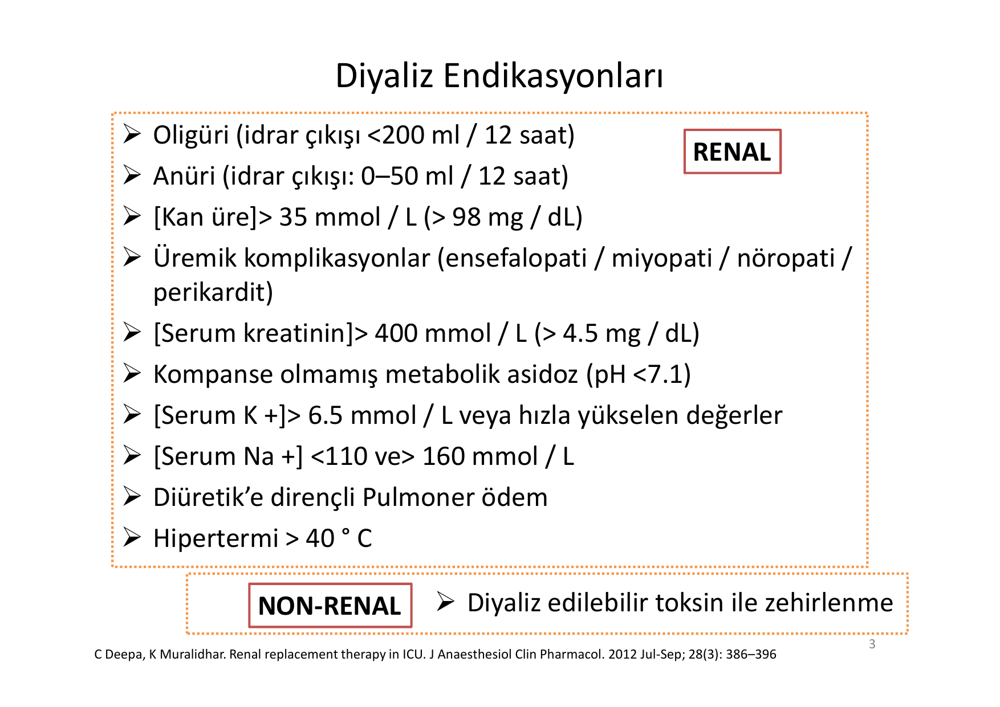
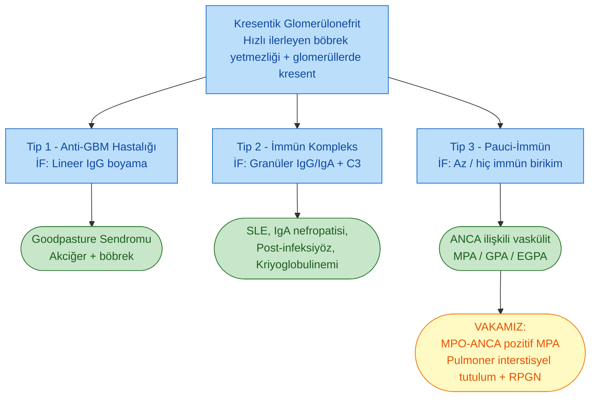

# NEFROLOJİ VAKA TARTIŞMASI

**Hazırlayan:** Prof. Dr. Hakan Akdam
**Bölüm:** Aydın Adnan Menderes Üniversitesi -- Nefroloji Bilim Dalı

> **Ders başlığı:** Vaka üzerinden akut böbrek hasarına (ABH) klinik yaklaşım -- azotemi değerlendirme algoritması, diyaliz endikasyonları, böbrek biyopsisi endikasyonları/kontrendikasyonları/komplikasyonları ve hızlı ilerleyen glomerülonefrite (RPGN) yaklaşım.

---

## İÇİNDEKİLER

1. [Giriş ve Öğretici Hedefler](#giriş-ve-öğretici-hedefler)
2. [VAKA 1: 64 Yaş Kadın -- RPGN Zemininde Pauci-İmmün Kresentik Glomerülonefrit (MPO-ANCA Pozitif)](#vaka-1-64-yaş-kadın----rpgn-zemininde-pauci-i̇mmün-kresentik-glomerülonefrit-mpo-anca-pozitif)
3. [Azoteminin Değerlendirme Algoritması](#azoteminin-değerlendirme-algoritması)
4. [Diyaliz Endikasyonları](#diyaliz-endikasyonları)
5. [Glomerülonefrit Tanısında İstenecek Tetkikler](#glomerülonefrit-tanısında-i̇stenecek-tetkikler)
6. [Böbrek Biyopsisi -- Endikasyonlar, Kontrendikasyonlar, Komplikasyonlar](#böbrek-biyopsisi----endikasyonlar-kontrendikasyonlar-komplikasyonlar)
7. [Kresentik GN Sınıflaması ve Vaka ile İlişkisi](#kresentik-gn-sınıflaması-ve-vaka-ile-i̇lişkisi)
8. [Öğretici Notlar ve Pratik Mesajlar](#öğretici-notlar-ve-pratik-mesajlar)

---

## Giriş ve Öğretici Hedefler

Bu vaka tartışması, kreatinin yüksekliği ile başvuran bir hastada **ABH/KBH ayrımı**, **ön tanı şeklinde etiyoloji sınıflaması** (pre-renal / renal / post-renal), **diyaliz kararı**, **glomerülonefrit serolojisi** ve sonunda **böbrek biyopsisi ile kesin tanı** sürecini adım adım işler. Ders, bir genç hekimin şu soruları cevaplayabilmesi için tasarlanmıştır:

* Halsizlik ve nefes darlığı ile gelen, kreatinini aylar içinde 0,6'dan 6,8'e yükselen hastada ilk yaklaşım nasıl olmalıdır?
* Hangi hastaya, hangi endikasyonla acil diyaliz başlanır?
* Hızlı ilerleyen böbrek yetmezliğinde glomerülonefrit serolojik paneli nedir, nasıl yorumlanır?
* Böbrek biyopsisinin mutlak ve rölatif kontrendikasyonları nelerdir; komplikasyon riskleri nasıl yönetilir?
* Pauci-immün kresentik GN'de acil tedavi ne olmalıdır?

---

## VAKA 1: 64 Yaş Kadın -- RPGN Zemininde Pauci-İmmün Kresentik Glomerülonefrit (MPO-ANCA Pozitif)

**Hasta:** 64 yaşında, kadın

**Öykü:**

* 2 ay önce başlayan **halsizlik, yorgunluk, nefes darlığı** yakınmaları.
* Arada ateş yüksekliği olmuş; 1,5 ay önce bir başka merkezde yatırılıp **IV antibiyoterapi** almış, nefes darlığı düzelmemiş.
* Öksürük/balgam/kanlı balgam yok. **COVID-19** yönünden tetkik edilmiş, patoloji saptanmamış.
* Nefes darlığı artışı nedeniyle Göğüs Hastalıkları'nca **interstisyel akciğer hastalığı** düşünülüp **Toraks BT** çekilmiş; o dönem **kreatinin 3,21 mg/dL** saptanmış.
* **25 yıldır hipertansiyon** tanısıyla izleniyor.
* 5 gün sonra nefroloji polikliniğinde **kreatinin 6,8 mg/dL** saptanan hasta **ABH etiyolojisi için yatırıldı**.

**Özgeçmiş:**

* HT (25 yıl)
* İnterstisyel akciğer hastalığı (1 aydır)
* Operasyonlar: kolesistektomi (2013), böbrek taşı operasyonu (10 yıl önce), sağ ayak bileği platin (3 yıl önce)
* Vertigo (7 yıl)

**Kullandığı ilaçlar:**

* Atacand Plus 16 mg 1x1 (kandesartan + hidroklorotiazid)
* Vastarel (trimetazidin)
* Nootropil (pirasetam)
* Betaserc (betahistin)
* İnhaler tedavi

**Sistem sorgulaması:** Diz altı şişlik, nefes darlığı, iştahsızlık, halsizlik.

**Fizik Muayene:**

* TA: 160/90 mmHg, Ateş: 37 °C
* Baş-boyun: Olağan
* **Solunum sistemi:** Üst zonlarda hırıltılı solunum, bazallerde inspiratuvar raller
* **Kardiyovasküler:** Kalp sesleri ritmik, taşikardik; aort odağında **2. kalp sesi sert (S2 şiddetlenmiş)**
* **PTÖ:** +/+ (bilateral pretibial ödem)

---

### İlk Klinik Muhakeme: ABH mı, KBH mi?

Hastada üç olasılık tartışılır:

1. **Saf akut böbrek hasarı (ABH)**
2. **Kronik böbrek hastalığı (KBH)**
3. **KBH zeminine gelişmiş akut böbrek hasarı (AoCKD)**

Bu vakada 3 yıl önce **kreatinin 0,63-0,69 mg/dL** ile normal olup 2 ay içinde 3,21 -> 6,88 mg/dL progresyonu **akut bir süreci** işaret eder. Böbrek boyutları USG'de normal, parankim ekojenitesi hafif artmış (Grade 1). Bu bulgular **ABH** (ve muhtemelen altta yatan bir glomerüler/vaskülitik süreç) lehinedir.

---

### ABH Etiyoloji Sınıflaması

| Sınıf | Mekanizma | Vaka İçin Değerlendirme |
|---|---|---|
| **Pre-renal** | Sıvı kaybı, ateş, kan kaybı, GİS/damar yaralanması -> böbrek hipoperfüzyonu | Vaka aleyhine: hipovolemi/dehidrasyon bulgusu yok; hatta **pretibial ödem** var. İdrar Na/FeNa beklenen değerleri (dansite >1030, FeNa <%1, idrar Na <20, idrar osm >500) olmadı. |
| **Renal (intrinsik)** | Glomerüler, tübüler, interstisyel, vasküler | **En olası.** Sedim 95-120 mm/h, CRP 94 mg/L, eritrosit silendirleri beklenen -- glomerüler/vaskülitik süreç düşündürür. |
| **Post-renal** | Taş, pıhtı, tümör, prostat obstrüksiyonu -> hidronefroz | Vaka aleyhine: USG'de **hidronefroz yok**, taş/ektazi yok. |

> **Pre-renal ABH idrar parametreleri:** Dansite >1030 -- FeNa <%1 -- İdrar Na <20 mmol/L -- İdrar osm >500 mOsm/kg. Bu değerler böbrek tübüler fonksiyonun korunduğunu, kaybın fonksiyonel (hipoperfüzyon) olduğunu gösterir.

---

### Laboratuvar Bulguları (Başvuru -- 06.08.2020)

| Parametre | Değer | Birim | Referans | Yorum |
|---|---|---|---|---|
| Hemoglobin | 9,6 (L) | g/dL | 11-15 | Normositer/hafif mikrositer anemi |
| Hematokrit | 29,4 (L) | % | 37-47 | Düşük |
| Lökosit | 13,98 (H) | 10³/µL | 4-10 | Nötrofil hakimiyetinde lökositoz |
| Trombosit | 672 (H) | 10³/µL | 100-450 | Reaktif trombositoz (inflamasyon) |
| Eozinofil # | 0,00 (L) | 10³/µL | 0,02-0,5 | Düşük (akut interstisyel nefrit aleyhine) |
| NLO | 8,54 (H) |  | 1,63-3,11 | İnflamatuvar |
| Sedimentasyon | 95 (H) | mm/saat | <20 | Çok yüksek |
| CRP | 94,1 (H) | mg/L | <5 | Çok yüksek |
| Üre | 92 (H) | mg/dL | 13-43 | Yüksek |
| Kreatinin | 3,21 (H) | mg/dL | 0,57-1,11 | Yüksek |
| **eGFR** | **14,52** | mL/dk/1,73 m² | -- | Evre 5 |
| Na | 134 (L) | mmol/L | 136-145 | Hafif hiponatremi |
| K | 3,8 | mmol/L | 3,5-5,1 | Normal |
| Albümin | 35,0 | g/L | 35-50 | Alt sınır |
| C3 | 1,52 | g/L | 0,85-2 | **Normal** (pauci-immün GN ile uyumlu) |
| C4 | 0,22 | g/L | 0,15-0,5 | **Normal** |
| ANA | Negatif |  |  | SLE aleyhine |
| Anti-CCP | 0,80 | U/mL | <4,99 | Negatif |

---

### Klinik Kötüleşme (5 Gün Sonra -- 11.08.2020)

| Parametre | 06.08 | 11.08 | Trend |
|---|---|---|---|
| Üre (mg/dL) | 92 | 113 | ↑↑ |
| BUN | 42,99 | 52,80 | ↑ |
| Kreatinin (mg/dL) | 3,21 | **6,88** | ↑↑ |
| eGFR (mL/dk/1,73 m²) | 14,52 | **5,78** | ↓↓ |
| Na (mmol/L) | 134 | **124** | ↓ |
| Ürik asit (mg/dL) | -- | 8,2 (H) | ↑ |
| Bikarbonat (mmol/L) | -- | 17,2 (L) | Metabolik asidoz |
| Hemoglobin (g/dL) | 9,6 | **8,3** | ↓ |
| Sedimentasyon (mm/h) | 95 | **120** | ↑ |
| İdrar protein (spot) | Normal -> +2 | +1 -- makroskopik hematüri | Nefritik sendrom |
| Mik. eritrosit (idrar) | 15 | 199 -> 241 | Belirgin hematüri |
| PTH (pg/mL) | -- | 98,7 (H) | Sekonder hiperparatiroidi |
| Anti-HBs | -- | 16,97 (Pozitif) | Aşı ya da geçirilmiş enfeksiyon |

**Özetle:** Hasta **hızla ilerleyen glomerülonefrit (RPGN)** tablosu çizmektedir -- günler içinde kreatinin **yaklaşık iki katına** çıkmış, aktif idrar sedimenti (mikroskopik hematüri + proteinüri), yüksek akut faz reaktanları (CRP 94, sedim 120) mevcuttur.

---

### Görüntüleme

**Renal USG (12.08.2020):**

* Her iki böbrek **normal boyutta**, parankim **normal kalınlıkta**.
* **Parankim ekojenitesi Grade I artmış** (medikal böbrek hastalığı ile uyumlu).
* Toplayıcı sistemde taş/ektazi yok; hidronefroz yok.

**Toraks grafisi:**

* Bilateral akciğer alanlarında **yaygın retiküler-opasiteler**, interstisyel infiltrasyon paterni.
* Kardiyotorasik oran artmış, volüm yüklenmesi bulguları mevcut.

> **Kritik klinik nokta:** Böbrek tutulumu (RPGN) + akciğer tutulumu (interstisyel infiltrat, nefes darlığı) birlikte olduğunda **pulmo-renal sendrom** aklımıza gelmelidir. Ayırıcı tanıda **ANCA ilişkili vaskülit (GPA, MPA, EGPA)**, **anti-GBM hastalığı (Goodpasture)**, **SLE (lupus nefriti + akciğer tutulumu)**, **kriyoglobulinemik vaskülit** vardır.

---

### Ön Tanı ve Ayırıcı Tanı

**Ön Tanı:** Hızlı ilerleyen glomerülonefrit (RPGN) / Pulmo-renal sendrom şüphesi.

**Ayırıcı Tanı:**

1. **ANCA-ilişkili pauci-immün kresentik GN** (mikroskopik polianjit -- MPA, granülomatöz polianjit -- GPA, EGPA)
2. **Anti-GBM hastalığı** (Goodpasture sendromu)
3. **İmmün kompleks mediyeli GN** (SLE, post-infeksiyöz, kriyoglobulinemi, IgA)
4. **Akut interstisyel nefrit** (ilaç/enfeksiyon, eozinofili beklenir -- vakada eozinofil 0)
5. **Multipl miyelom / amiloidoz** (65+ yaş, normositer anemi, yüksek sedim)
6. **TMA** (aHÜS, malign HT, skleroderma)
7. **Kronik HT nefropatisine eklenen akut süreç**

### İstenen Serolojik Paneller (Neden İstiyoruz?)

| Test | Hedef | Vaka Sonucu |
|---|---|---|
| ANA, Anti-dsDNA | SLE | Negatif |
| C3, C4 | İmmün kompleks hastalık (C3↓ lupus/APSGN/MPGN) | Normal |
| Anti-GBM | Goodpasture | -- |
| **MPO-ANCA (p-ANCA)** | **Mikroskopik polianjit** | **100 AU/mL -- POZİTİF** |
| **PR3-ANCA (c-ANCA)** | **Granülomatöz polianjit** | 1,6 AU/mL -- Negatif |
| HBsAg / Anti-HCV / HIV | Viral GN | Negatif |
| Anti-CCP, RF | Romatoid artrit / kriyoglobulinemi | Negatif |
| ASO | Post-streptokoksik GN | (istendi) |
| Serum ACE | Sarkoidoz | (istendi) |
| Protein elektroforez + serbest hafif zincir | Multipl miyelom | (istendi) |
| Total IgE, eozinofil | İnterstisyel nefrit, EGPA | Eozinofil 0 |

### Tanısal Testler

* **24 saatlik idrar proteini:** **427,5 mg/gün** (subnefrotik proteinüri)
* **24 saatlik idrar mikroalbümin:** 184 mg/gün
* **24 saatlik kreatinin:** 150,5 mg/gün (düşük -- kreatinin klirensinin ciddi azaldığının dolaylı göstergesi)
* **MPO-ANCA:** 100 AU/mL -- **kesin pozitif**
* **Böbrek biyopsisi** planlandı (bb boyutu normal + nedeni açıklanamayan ABH).

---

### Böbrek Biyopsisi Sonucu

**Makroskopi:** Uç uca eklendiğinde 2,2 cm uzunluğunda, 0,1 cm çapında kirli-beyaz renkte 2 adet biyopsi materyali.

**Mikroskopi:**

* Toplam **5 glomerül izlenmiş**; **tüm glomerüllerde sellüler özellikte kresent** varlığı, fibrin depozitleri.
* Bowman kapsülünde **rüptür**.
* İnterstisyel alanda çok sayıda nötrofili de içeren **yoğun mikst enflamasyon**.
* Tübüllerde **atrofi ve tübülit**; damarlarda medial kalınlaşma ve hyalinizasyon (kronik HT zemini).
* **Kongo red: amiloid yok.** PAS, M. Silver, Trichrome uygulandı.
* **Direkt immünfloresan:** C3 ile glomerüllerde granüler birikim; IgA/IgG/IgM belirgin boyama yok. **-> Pauci-immün paterne (kategorik olarak "az immün kompleks") uyumlu.**

**Patolojik Tanı:** **KRESENTİK GLOMERÜLONEFRİT (BÖBREK, BİYOPSİ)**

**Patolog Yorumu:** Olgunun **vaskülitik etiyoloji açısından (Wegener granülomatozisi başta olmak üzere) klinikopatolojik korelasyonu önerilir.** -> MPO-ANCA pozitifliği ile birlikte **Mikroskopik Polianjit (MPA)** en olası tanıdır.

---

### Kesin Tanı

> **MPO-ANCA pozitif, pauci-immün kresentik glomerülonefrit -- Mikroskopik Polianjit (MPA) ilişkili ANCA vasküliti + pulmoner tutulum (interstisyel akciğer hastalığı tablosu).**

Hasta ayrıca **25 yıllık kontrolsüz HT zeminine eklenmiş** olduğu için damarlarda medial kalınlaşma da histopatolojide görülmüştür.

---

### Tedavi

#### 1. Acil Destek Tedavisi (Diyaliz)

Kreatinin 6,88 mg/dL, eGFR 5,78, volüm yüklenmesi, üremik semptomlar ve metabolik asidoz (HCO₃ 17,2) mevcuttu. Hastaya **diyaliz tedavisi başlandı**.

#### 2. İndüksiyon İmmünsüpresif Tedavi (Standart Rejim -- ANCA Vasküliti)

| İlaç | Doz / Uygulama | Amaç |
|---|---|---|
| **Metilprednizolon puls** | 500-1000 mg/gün IV, 3 gün | Akut inflamasyon baskılama |
| **Prednizolon** | 1 mg/kg/gün PO (maks. 60 mg), yavaş taper | İdame steroid |
| **Siklofosfamid IV (NIH rejimi)** | 0,5-1 g/m² ayda bir, 6 ay | Kresent progresyonunu durdurma |
| veya **Rituksimab** | 375 mg/m² haftada 1 x 4 doz | CD20+ B-hücre deplesyonu |
| **Plazmaferez** | Şiddetli RPGN (kreatinin >5,7), diffüz alveoler hemoraji veya anti-GBM pozitifliğinde | Sirküle antikor temizleme |

> **Vaka için pratik not:** Kreatinin 6,88 mg/dL, diyaliz bağımlı ve pulmoner tutulum olduğu için **plazmaferez** de düşünülür (PEXIVAS çalışması sonrası endikasyonlar daraldı, ancak diyaliz bağımlı + pulmoner hemoraji hâlâ endikasyon olarak kabul edilir).

#### 3. İdame Tedavi

* **Azatioprin** 2 mg/kg/gün veya **MMF** 1-2 g/gün
* Düşük doz steroid (5-10 mg/gün)
* Toplam idame süresi: **en az 18-24 ay**

#### 4. Destekleyici Tedavi

* Hipertansiyon kontrolü (ARB/ACE-i; eGFR izlemi ile)
* Anemi tedavisi (ESA + demir)
* Sekonder hiperparatiroidi için aktif D vitamini
* PCP profilaksisi (TMP-SMX)
* Aşılar (pnömokok, influenza, HBV)
* Diyet: Tuz <2 g/gün, protein 0,8-1 g/kg/gün, K/P kısıtlaması

---

### İzlem

* Diyaliz bağımlılığından çıkış serum kreatininin 3-6 ayda düşmesine bağlıdır; bazı olgularda diyaliz kalıcı olabilir.
* **Relaps riski** MPO-ANCA'da %30-40 (PR3-ANCA'da daha yüksek) -- idame tedavi altında **ANCA titre takibi** ve klinik izlem.
* CRP, sedimentasyon, kreatinin, idrar sedimenti ve proteinüri trendi aylık kontrol.

---

## Azoteminin Değerlendirme Algoritması

Aşağıdaki algoritma, azotemi (BUN/kreatinin yüksekliği) ile başvuran her hastada izlenmesi gereken standart iş akışını özetler.

> **Vakamızın algoritma yerleşimi:** Böbrek boyutu normal -> idrar analizi patolojik (eritrosit silendiri, proteinüri) -> **Glomerülonefrit / Vaskülit** bacağı -> **böbrek biyopsisi** -> MPO-ANCA pozitif pauci-immün kresentik GN.

---

## Diyaliz Endikasyonları

### Renal Endikasyonlar (A-E-I-O-U + Volüm + Elektrolit)

| Endikasyon | Eşik / Klinik |
|---|---|
| **A - Asidoz** | Kompanse olmamış metabolik asidoz, **pH <7,1** |
| **E - Elektrolit** | **K⁺ >6,5 mmol/L** veya hızla yükselen; Na <110 veya >160 mmol/L |
| **I - İntoksikasyon** | Diyaliz edilebilir toksinle zehirlenme (metanol, etilen glikol, lityum, salisilat, valproik asit, vb.) |
| **O - Oligüri / Overload** | İdrar çıkışı <200 mL/12 saat (anüri <50 mL/12 saat); **diüretiğe dirençli pulmoner ödem** |
| **U - Üremi** | Üremik **ensefalopati, miyopati, nöropati, perikardit** |
| **Kan üresi / Kreatinin** | Üre >35 mmol/L (>98 mg/dL -- klasik hedef >150 mg/dL); kreatinin >4,5 mg/dL düzeylerinde değerlendir |
| **Hipertermi** | >40 °C (non-renal) |

**Vakada karşılanan kriterler:**

* Kreatinin 6,88 mg/dL (>4,5)
* Üremik yük, volüm yüklenmesi (pulmoner ödem tablosu)
* Metabolik asidoz (HCO₃ 17,2 mmol/L)
* Tedaviye dirençli HT (160/90)

-> **Diyaliz başlandı.**

> **Klinik kural:** Diyaliz kararı tek bir laboratuvar değerine değil, **klinik tabloya** dayanmalıdır. Örneğin kreatinin 6 olan asemptomatik hastada diyaliz zorunlu olmayabilir; ancak kreatinin 3 olan ağır üremik/asidotik hastada diyaliz gerekebilir.

---

## Glomerülonefrit Tanısında İstenecek Tetkikler

### Tanı için Temel Yaklaşım

* **Böbrek biyopsisi** altın standarttır.
* Biyopsi öncesi/beraberinde **sekonder nedenlerin dışlanması** şarttır.

### Önerilen Rutin Tetkikler

| Test | Özgül Amaç | Yorum / Patern |
|---|---|---|
| **24 saatlik idrar** | Proteinüri ölçümü | Na/K/üre atılımı ile tuz alımı, nutrisyon değerlendirilir |
| **Serum albümin** | GFB hasarı şiddeti | Nutrisyon ve karaciğer fonksiyonu göstergesi |
| **LDH** | Hemoliz / kas-organ hasarı | Kas/organ hasarı yokluğunda hemolizi işaret eder (örn. TMA) |
| **Retikülosit + Plt sayımı** | Eritrosit üretim/yıkım, TMA | Retikülosit yüksek + Plt düşük + şistosit -> TMA (vaskülit, AFA, TTP, aHÜS, skleroderma, malign HT, kriyoglobulinemi, sepsis) |
| **C3, C4** | Klasik/alternatif kompleman aktivasyonu | İmmün kompleks hastalık ayrımı (aşağıdaki patern tablosu) |
| **Protein elektroforezi + serbest hafif zincir** | Monoklonal gammopati | Monoklonal (+) ise kappa/lambda oranı, serum immünelektroforez; hipogamaglobulinemi (+) ise IgG/IgA/IgM |
| **HBsAg, Anti-HCV, HIV** | Viral GN (MPGN, MGN, nefropati) | İmmünsüpresif tedavi planlanıyorsa zorunlu |
| **ANA, Anti-dsDNA** | Otoimmün hastalık taraması | SLE ve diğer romatizmal hastalıklar |
| **ANCA (MPO/PR3)** | ANCA ilişkili vaskülit | MPA, GPA, EGPA ayrımı |
| **Romatoid faktör** | Kriyoglobulinemi Tip 1-2, otoimmün | Kriyoglobulinemik GN'de biyopsi + plazmada kriyoglobulin saptanması zor |

### Kompleman Patern -- Ezberi Kolaylaştırıcı Tablo

| Patern | Olası Hastalık |
|---|---|
| C3 Normal + C4 ↓ | Tip 1-2 kriyoglobulinemi |
| C3 ↓↓ + C4 Normal | APSGN (post-streptokoksik GN) |
| C3 ↓ + C4 Normal | HÜS, aHÜS, MPGN Tip 1 |
| C3 ↓ + C4 ↓ (hem klasik hem alternatif) | **Lupus nefriti**, MPGN Tip 2 |
| C3 ve C4 Normal | **Pauci-immün GN (ANCA vasküliti), anti-GBM** -- *vakamızın paterni* |

### Opsiyonel Tetkikler

| Test | Özgül Amaç | Yorum |
|---|---|---|
| Kan kültürü | Enfeksiyon durumunda |  |
| **Anti-GBM** | Goodpasture sendromu | Pulmo-renal sendrom varlığında MUTLAKA |
| ASO | APSGN | Yakın enfeksiyon öyküsü, nefritik sendrom, C3 ↓, C4 Normal |
| D-dimer | Hiperkoagulabilite | Şiddetli nefrotik sendromda ekstremite/renal ven trombozu riski |
| İmmünoglobulinler (IgG/IgA/IgM) | Poliklonal bozukluk |  |
| ADAMTS-13 | TTP | TMA bulgusu olan her hastada |
| PAAC (Posterior-anterior akciğer grafisi) | Pulmo-renal sendrom, pulmoner komplikasyon |  |

---

## Böbrek Biyopsisi -- Endikasyonlar, Kontrendikasyonlar, Komplikasyonlar

### Endikasyonlar

1. **Nefrotik sendrom** (çocuklar hariç, birçok erişkinde)
2. **Sistemik hastalıkların böbrek tutulumu** (SLE, vaskülit, amiloidoz, miyelom)
3. **Nedeni bilinmeyen akut veya kronik böbrek yetmezliği** (böbrek boyutları normalse)
4. **Mikroskopik hematüri + proteinüri** birlikteliği
5. **Subnefrotik proteinüri (>1 g/gün)**
6. **Ailesel böbrek hastalığı şüphesi**
7. **Transplante böbrekte açıklanamayan fonksiyon bozulması**
8. **Renal fonksiyonlarda hızlı bozulma (RPGN şüphesi)** -- *vakamızın endikasyonu*

### Kontrendikasyonlar

| Mutlak | Rölatif |
|---|---|
| Kontrolsüz hipertansiyon | Tek böbrek |
| Kanama diyatezi | Antiplatelet/antikoagülan tedavi |
| Böbrek tümörü | Anatomik anormallikler |
| Hidronefroz | Aktif idrar veya cilt enfeksiyonu |
| Unkoopere hasta | Aşırı şişmanlık (BMI >35) |

### Komplikasyonlar

| Komplikasyon | Sıklık |
|---|---|
| Ağrı | Sık |
| **Makroskopik hematüri** | %0,3-14,5 |
| Perirenal hematom | Değişken |
| **Arteriyo-venöz fistül** | %10,8 (çoğu spontan kapanır) |
| Hayatı tehdit eden komplikasyon | <%0,1 |
| Kan transfüzyonu ihtiyacı | %0,9 |
| Cerrahi girişim/embolizasyon | %0,2-0,6 |
| **Ölüm** | %0,02 |

### Komplikasyon Zamanlaması

* **4 saat içinde** majör komplikasyonların %46'sı
* **8 saat içinde** %79'u
* **12 saat içinde** %100'ü ortaya çıkar

**Sonuç:** **12 saatlik izlem yeterlidir.** Sıkı yatak istirahati süresi 2 saat ile 7 saat karşılaştırıldığında; 2 saatlik istirahatte yan ağrısı daha az, komplikasyon oranı benzer.

### Komplikasyon Riskini Artıran Faktörler

* **14 gauge (kalın) iğne** kullanımı
* **Uzun süreli kontrolsüz hipertansiyon**

### Patolojik Tanıda Kullanılan Yöntemler

* **Işık mikroskopisi** (HE, PAS, Masson trichrome, metenamin silver)
* **İmmünfloresan** (IgA, IgG, IgM, C3, C1q, kappa, lambda, fibrinojen)
* **Elektron mikroskopisi** (bazal membran, podosit, depozit lokalizasyonu)

---

## Kresentik GN Sınıflaması ve Vaka ile İlişkisi

Kresentik GN, immünfloresan paternine göre **üç ana gruba** ayrılır:

### Patern Karşılaştırma Tablosu

| Özellik | Tip 1 (Anti-GBM) | Tip 2 (İmmün Kompleks) | Tip 3 (Pauci-İmmün) |
|---|---|---|---|
| **Sıklık** | ~%10-20 | ~%40 | ~%40-50 |
| **Yaş** | Bimodal (20-30 ve 60-70) | Her yaş | Orta-ileri yaş |
| **İmmünfloresan** | Lineer IgG + C3 | Granüler (IgG/IgA/C3) | Az / hiç |
| **ANA** | Negatif | Pozitif (SLE) olabilir | Genelde negatif |
| **ANCA** | Negatif | Negatif | **Pozitif (%80-90)** |
| **Kompleman** | Normal | Sıklıkla ↓ (SLE, MPGN) | Normal |
| **Akciğer tutulumu** | Sık (Goodpasture) | Nadir (SLE'de olabilir) | Sık (özellikle MPA/GPA) |
| **Tedavi** | Plazmaferez + steroid + siklofosfamid | Altta yatan nedene yönelik | Steroid + siklofosfamid/rituksimab |

**Vakamızda bulgular:**
-- İmmünfloresan: C3 granüler hafif boyama, IgA/IgG/IgM belirgin boyama yok -> **Pauci-immün (Tip 3)**
-- MPO-ANCA 100 AU/mL pozitif
-- Akciğer tutulumu (interstisyel infiltrat) mevcut
-- Kompleman normal
-> **Sonuç: Mikroskopik Polianjit (MPA) -- pauci-immün kresentik GN.**

---

## Öğretici Notlar ve Pratik Mesajlar

1. **ABH/KBH ayrımı -- boyut ve geçmiş kreatinin:** Hastanın eski kreatinin değerleri (3 yıl önce 0,69) ve böbrek boyutlarının normal olması akut süreç lehinedir. Küçük böbrek + anemi + uzun süreli üremik bulgular KBH'yi düşündürür.

2. **Her kreatinin yüksekliğinde reflex seroloji istemek yanlış ekonomidir; ancak RPGN paterni varsa (günler-haftalar içinde ikiye katlama + aktif idrar sedimenti) ANCA, anti-GBM, C3, C4, ANA, HBsAg/Anti-HCV hızlıca istenmelidir.** Biyopsi geciktirilmez.

3. **Pulmo-renal sendrom** kombinasyonu (hemoptizi / interstisyel infiltrat + RPGN) acil tanıya zorlar. Ayırıcıda **MPA, GPA, Goodpasture, SLE, kriyoglobulinemi** vardır. Sıklık sırası kliniğe göre değişir; Türkiye kohortlarında **ANCA vasküliti** ilk sıradadır.

4. **Eozinofil 0, interstisyel nefrit tanısını dışlamaz** ancak tipik "ilaç ilişkili AIN" patern tablosu eozinofili, döküntü, ateş üçlüsü ile gelir. Vakamızda eozinofil düşüklüğü steroid + akut faz yanıtına bağlı olabilir.

5. **C3/C4 normal + pauci-immün paterni kresentik GN'de ANCA vaskülitini işaret eder**; ANCA negatif olsa bile (seronegatif MPA/GPA) biyopsi bulguları tanı koydurur.

6. **MPO-ANCA titre düzeyi ile relaps riski korelasyonu** PR3-ANCA kadar kuvvetli değildir; ancak dört kat artış klinik relaps habercisidir.

7. **Biyopsi öncesi mutlaka** kontrolsüz HT'yi tedavi edin, INR/APTT/trombosit sayısını kontrol edin, antiagregan/antikoagülan ilaçları kesin (ASA 5-7 gün, klopidogrel 7 gün, varfarin INR <1,5 olana dek).

8. **12 saatlik izlem yeterlidir** (majör komplikasyonların %100'ü ilk 12 saatte) -- hastayı bu süre boyunca vital takibi, hemoglobin kontrolü ve sırt üstü yatak istirahati altında tut.

9. **ANCA vaskülitinde indüksiyon tedavisi:** Klasik NIH rejimi (siklofosfamid + steroid) veya **RAVE çalışması sonrası rituksimab** (özellikle genç, fertilite korunmak istenen, relaps olgularda) tercih edilir. PEXIVAS çalışması **plazmaferez** endikasyonlarını daraltmış olsa da **diyaliz bağımlı + pulmoner hemoraji** kombinasyonunda hâlâ uygulanır.

10. **Prognostik faktörler:** Başlangıç kreatinin, diyaliz bağımlılığı, biyopsideki skleroz/fibroz oranı, interstisyel tutulum. İleri yaş, başlangıçta diyaliz bağımlılığı ve >%75 glomerüler skleroz kötü prognoz göstergeleridir. Vakamızda 5/5 glomerülde kresent -- ileri dönem, ama hâlâ agresif tedavi endikasyonu vardır.

11. **İzlem:** İdame altında dahi **5 yıl içinde %30-40 relaps** riski vardır. Enfeksiyöz komplikasyonlar (özellikle PCP, fungal, CMV) en önemli mortalite nedenidir -- profilaksi atlanmamalıdır.

12. **Hasta bilgilendirme:** Tanı aldıktan sonra hasta ve aile, diyaliz bağımlılığının **geçici veya kalıcı olabileceği**, ilaçların immün sistemi baskıladığı, düzenli poliklinik takibinin yaşam süresi için belirleyici olduğu konusunda bilgilendirilmelidir.

---

**Özet klinik akış (vaka):**

Halsizlik + nefes darlığı + HT öyküsü + interstisyel akciğer -> 2 ayda kreatinin 0,7 -> 6,8 -> RPGN paterni + ANCA paneli -> **MPO-ANCA 100 AU/mL** -> böbrek biyopsisi: **%100 sellüler kresent, pauci-immün paternde** -> **Mikroskopik Polianjit tanısı** -> acil diyaliz + steroid pulse + siklofosfamid/rituksimab indüksiyonu.
