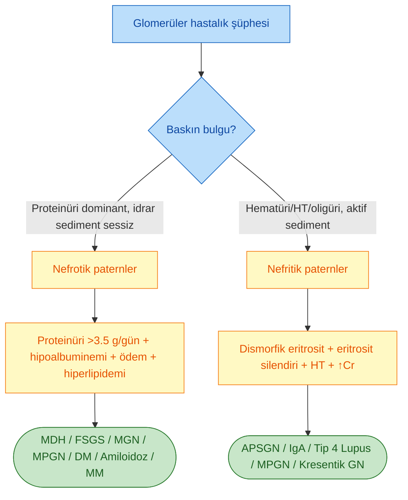
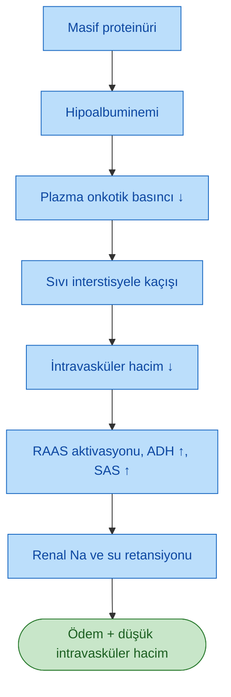
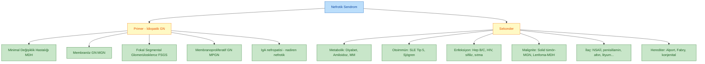
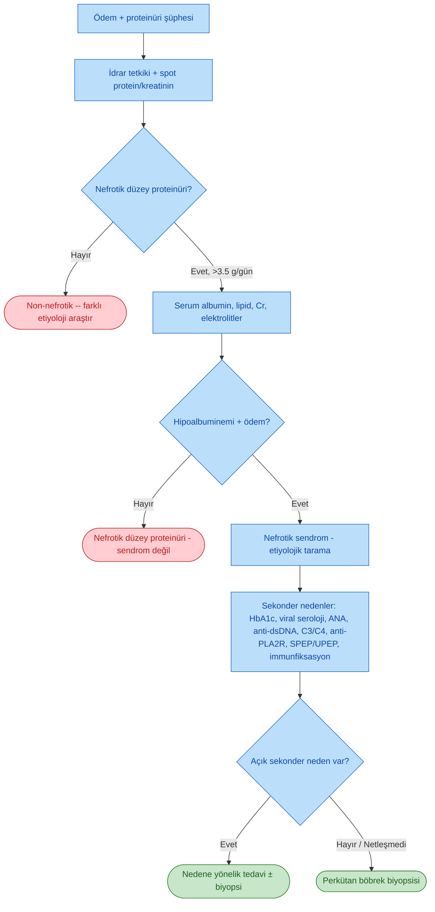

# NEFROTİK SENDROM

**Hazırlayan:** Prof. Dr. Hakan Akdam
**Bölüm:** Aydın Adnan Menderes Üniversitesi -- Nefroloji Bilim Dalı

---

## İÇİNDEKİLER

1. [Tanım ve Tetrad](#tanım-ve-tetrad)
2. [Nefrotik ve Nefritik Sendrom Karşılaştırması](#nefrotik-ve-nefritik-sendrom-karşılaştırması)
3. [Glomerüler Filtrasyon Bariyeri ve Podosit](#glomerüler-filtrasyon-bariyeri-ve-podosit)
4. [Patofizyoloji](#patofizyoloji)
5. [Klinik Bulgular](#klinik-bulgular)
6. [Etyoloji](#etyoloji)
7. [Primer Glomerüler Nedenler](#primer-glomerüler-nedenler)
8. [Sekonder Nedenler](#sekonder-nedenler)
9. [Tanısal Yaklaşım](#tanısal-yaklaşım)
10. [Böbrek Biyopsisi](#böbrek-biyopsisi)
11. [Komplikasyonlar](#komplikasyonlar)
12. [Tromboembolik Komplikasyonlar ve Profilaksi](#tromboembolik-komplikasyonlar-ve-profilaksi)
13. [Tedavi Yaklaşımı](#tedavi-yaklaşımı)
14. [Ödem Tedavisi](#ödem-tedavisi)
15. [Ek Destekleyici Tedaviler](#ek-destekleyici-tedaviler)
16. [İmmünsüpresif Tedavi](#immünsüpresif-tedavi)
17. [Çocukluk Çağı Nefrotik Sendromu](#çocukluk-çağı-nefrotik-sendromu)
18. [Klinik Vakalar](#klinik-vakalar)
19. [Özet](#özet)

---

## TANIM VE TETRAD

> **Tanım:** Nefrotik sendrom, glomerüler filtrasyon bariyerinin ciddi yapısal/fonksiyonel bozukluğu sonucu gelişen; **masif proteinüri**, bunun sonucu **hipoalbuminemi**, **ödem** ve **hiperlipidemi/lipidüri** ile karakterize bir klinik sendromdur.

### Klasik Tetrad

| Bulgu | Kriter |
|---|---|
| **Proteinüri** | **> 3,5 g/gün / 1,73 m²** (erişkin); çocukta > 40 mg/m²/saat |
| **Hipoalbuminemi** | Serum albumin **< 3 g/dL** (çoğu klinikte < 2,5 g/dL) |
| **Ödem** | Periorbital, pretibial gode bırakan ödem; ilerlemiş olguda **anazarka**, asit, plevral efüzyon |
| **Hiperlipidemi / Lipidüri** | ↑ LDL, ↑ kolesterol; idrarda oval yağ cisimcikleri, Malta haçı görünümü |

### Fakültatif (Eklenmesi Kolaylaştırıcı) Bulgu

* **Hiperkoagülabilite** -- derin ven trombozu (DVT), pulmoner emboli (PE), **renal ven trombozu (RVT)** riski artmıştır.

**⚠️ ÖNEMLİ:**

* Erişkinde **3,5 g/gün/1,73 m²** eşiği **nefrotik düzey proteinüri**'yi tanımlar; bu eşik altında ama anlamlı proteinüri **non-nefrotik (subnefrotik)** olarak adlandırılır.
* Tanı için sadece proteinürinin varlığı yetmez; **hipoalbuminemi** ve **ödem** mutlaka eşlik etmelidir; aksi halde "nefrotik düzey proteinüri" denir, "nefrotik sendrom" denmez.

---

## NEFROTİK VE NEFRİTİK SENDROM KARŞILAŞTIRMASI

> **Temel ayrım:** Nefrotik sendromda hasar **podosit/GBM/endotel (glomerüler filtrasyon bariyeri -- GFB) bütününü** etkiler ancak **subendotelyal inflamasyon minimumdur**; nefritik sendromda ise **subendotelyal inflamasyon** ön plandadır ve hematüri/HT/oligüri baskındır.

| Özellik | **NEFROTİK SENDROM** | **NEFRİTİK SENDROM** |
|---|---|---|
| Proteinüri | **> 3,5 g/gün/1,73 m²** (masif) | Non-nefrotik düzey (< 3,5 g/gün) |
| Hematüri | Genelde yok / mikroskopik | **Belirgin; dismorfik eritrositler, eritrosit silendirleri** |
| Ödem | **Anazarka, gode bırakan** | Hafif-orta (periorbital) |
| Hipertansiyon | Genelde yok / hafif | **Belirgin HT** |
| İdrar çıkışı | Normal | **Oligüri** |
| Azotemi (↑ BUN, ↑ Cr) | Geç evrede | **Erken; belirgin** |
| Hipoalbuminemi | **Belirgin (< 3 g/dL)** | Yok / hafif |
| Hiperlipidemi-lipidüri | **Var** | Yok |
| Hiperkoagülabilite (DVT, PE, RVT) | **Var** | Yok |
| Ortak yapısal hasar | **GFB (delikli endotel -- GBM -- podosit ayakçıkları)** | **Subendotelyal hasar ve inflamasyon** |
| Tipik primer nedenler | **MDH, FSGS, MGN, MPGN** | **Akut postinfeksiyöz GN, IgA nefropatisi, MPGN, kresentik GN, Tip 4 lupus nefriti** |
| Tipik sekonder nedenler | **DM, amiloidoz, MM, enfeksiyon, Tip 5 lupus nefriti** | Enfeksiyonlar (GABHS), vaskülit, SLE |

### Ayrım Mermaid

---

## GLOMERÜLER FİLTRASYON BARİYERİ VE PODOSİT

### GFB'nin Üç Katmanı

1. **Fenestre (delikli) endotel** -- 70-100 nm çapında fenestralar; negatif yüklü glikokaliks ile albuminin geçişini kısıtlar.
2. **Glomerüler bazal membran (GBM)** -- tip IV kollajen, laminin, heparan sülfat proteoglikanlar (negatif yük bariyeri). Üç katmanlı: lamina rara interna, lamina densa, lamina rara eksterna.
3. **Podosit (visseral epitel hücresi) ayakçık çıkıntıları** -- primer/sekonder ayakçıklar arasında **yarık diyafragmı (slit diaphragm)** bulunur.

### Podositin Ana Yarık Diyafram Proteinleri

| Protein | İşlev | İlgili Hastalık |
|---|---|---|
| **Nefrin (NPHS1)** | Yarık diyafragmının ana proteini | Konjenital nefrotik sendrom (Finnish tipi) |
| **Podosin (NPHS2)** | Nefrini hücre membranına bağlar | Steroid-rezistan FSGS |
| **CD2AP** | Nefrin-aktin bağlantısı | FSGS |
| **α-actinin-4 (ACTN4)** | Aktin sitoskeletonu | Ailesel FSGS |
| **TRPC6** | Katyon kanalı | Erişkin başlangıçlı FSGS |
| **WT1** | Podosit transkripsiyon faktörü | Denys-Drash, Frasier sendromu |

> **Patogenez kuralı:** Podosit hasarı -- neden bağımsız olarak -- proteinürinin ortak son yoludur. Podositler post-mitotik olduğundan kayıpları kalıcı skar (FSGS) ile sonuçlanır.

---

## PATOFİZYOLOJİ

### 1. Proteinüri Mekanizması

* Negatif yüklü GBM'nin yük selektivitesi bozulur (özellikle MDH'da).
* Podosit ayakçıklarının silinmesi (**foot process effacement**) boyut selektivitesini bozar.
* Özellikle **albumin (69 kDa)** filtrasyonu artar; tubüler geri emilim kapasitesi aşıldığında idrara dökülür.

### 2. Ödem Mekanizmaları -- İki Klasik Teori

#### Underfill (Azaltılmış Dolum) Teorisi

* Özellikle çocukluk çağı MDH için geçerlidir.

#### Overfill (Aşırı Dolum) Teorisi

* Distal nefronda **primer Na retansiyonu** (ENaC aktivasyonu, **plazmin gibi filtrelenmiş proteazlar** tarafından) hacim ekspansiyonuna yol açar.
* İntravasküler hacim **yüksek-normaldir**; plazma renin-aldosteron baskılanmış olabilir.
* Erişkin nefrotik sendromun büyük kısmında baskın mekanizmadır.

### 3. Hiperlipidemi

* **Hepatik lipoprotein sentezi** artar (apoB, LDL, VLDL, Lp(a)).
* **LDL reseptör ekspresyonu ↑** olsa bile klirens azalır; **PCSK9** artar.
* **Lipoprotein lipaz (LPL)** aktivitesi ↓ → VLDL klirensi bozulur.
* **HDL** idrara kaçar (apoA-I kaybı).
* Sonuç: ↑ total kolesterol, ↑ LDL, ↑ TG, ↓ HDL → aterosklerotik risk.

### 4. Hiperkoagülabilite

> **Klinik önem:** DVT, PE ve özellikle **renal ven trombozu (RVT)** nefrotik hastalarda önemli morbidite nedenidir. MGN'de RVT riski tüm nefrotik nedenler içinde **en yüksektir**.

| Değişiklik | Mekanizma |
|---|---|
| **Antitrombin III ↓** | Düşük molekül ağırlıklı olduğundan idrara kaçar |
| **Protein C ve S** | Serbest protein S ↓ (C4b-BP ↑ ile bağlı fraksiyon artar) |
| **Fibrinojen ↑** | Karaciğer kompansatuvar sentezi |
| **Faktör V, VIII ↑** | Artmış hepatik sentez |
| **Plazminojen ↓** | İdrar kaybı |
| **α2-antiplazmin ↑** | Fibrinoliz ↓ |
| **Trombosit hiperaktivitesi** | Artan agregasyon, ↑ tromboksan A2 |
| **Hipoalbuminemi** | Trombosit agregasyonunu direkt artırır |
| **Hemokonsantrasyon** | Diüretik ile kötüleşir |

### 5. Enfeksiyon Riski

* **İmmünoglobulin (özellikle IgG) idrar kaybı**
* **Kompleman faktör B ve D** kaybı → alternan yol zayıflığı → **kapsüllü bakteri** (özellikle **S. pneumoniae**) riski ↑
* **Opsonizasyon** bozulur
* T-hücre fonksiyonu baskılanabilir (hastalıktan veya tedaviden)
* Klinik tablo: **spontan bakteriyel peritonit** (özellikle çocuklarda), selülit, pnömoni, sepsis.

### 6. Endokrin/Metabolik Bozukluklar

| Kayıp Olan Protein | Klinik Sonuç |
|---|---|
| **D vitamini bağlayıcı protein** | 25(OH)D ve 1,25(OH)₂D ↓; hipokalsemi, sekonder hiperparatiroidizm |
| **Tiroksin bağlayıcı globulin (TBG)** | Total T4 ↓ (free T4 genelde normal); hipotiroidi tablosu nadir |
| **Transferrin** | Demir eksikliği anemisi (mikrositik) |
| **Seruloplazmin** | Bakır ↓ |
| **Kortizol bağlayıcı globulin** | Total kortizol ↓ |

### 7. Akut Böbrek Hasarı (ABH) Riski

* İntravasküler hacim azalması (özellikle yoğun diürez sonrası)
* **NSAİİ** kullanımı (prerenal ABH + akut interstisyel nefrit)
* Akut tubuler nekroz (hipoperfüzyon)
* RVT veya sepsise bağlı ABH

---

## KLİNİK BULGULAR

* **Gode bırakan ödem** -- periorbital (sabah), pretibial (akşam), anazarka
* **Plevral efüzyon, asit, skrotum ödemi** (ileri olguda)
* **Köpüren idrar** (proteinürinin klinik ipucu)
* **Kilo artışı** (sıvı retansiyonu)
* **Halsizlik, iştahsızlık**
* **Karın ağrısı** (asit, spontan peritonit, RVT)
* **Ani yan ağrısı + makroskopik hematüri** → **renal ven trombozu** akla gelmeli
* **Ani göğüs ağrısı, dispne, hemoptizi** → **pulmoner emboli**
* **Xantelasma, xantoma** (uzun süreli hiperlipidemi)
* **Müehrcke çizgileri** (tırnakta beyaz transvers çizgiler, hipoalbuminemi belirtisi)
* Çocuklarda: **iştahsızlık, ishal, asit, peritonit riski** ön planda

---

## ETYOLOJİ

> **Kural:** Erişkinde nefrotik sendromun **en sık sebebi diyabetik nefropatidir**. Primer glomerüler nedenler içinde ise **membranöz glomerülonefrit (MGN)** ve **fokal segmental glomerüloskleroz (FSGS)** başta gelir; çocukluk çağında ise **minimal değişiklik hastalığı (MDH)** baskın nedendir.

### Genel Sınıflama

---

## PRİMER GLOMERÜLER NEDENLER

| Hastalık | Tipik Demografi | Ayırt Edici Özellikler | Patoloji | Tedaviye Yanıt |
|---|---|---|---|---|
| **Minimal değişiklik hastalığı (MDH)** | **Çocuk** (2-6 yaş); erişkinde Hodgkin, NSAİİ ilişkili | Selektif proteinüri (albumin dominant), ani başlangıç | IF/IM normal; **EM: yaygın podosit ayakçık silinmesi** | **Steroide çok iyi yanıt** (%90 remisyon) |
| **Fokal segmental glomerüloskleroz (FSGS)** | Genç erişkin; siyahlarda sık | Non-selektif proteinüri, HT, hematüri eşlik edebilir | **Segmental skleroz**; podosit hasarı; primer/sekonder (reflü, obezite, HIV, aşırı nefron kaybı) | Değişken; primer formda steroid ± kalsinörin inh. |
| **Membranöz GN (MGN)** | **40-60 yaş erişkin**, erkek > kadın | Genellikle subakut; RVT riski çok yüksek | **Subepitelyal immün kompleks** (IgG4 + C3); EM: "spike and dome" | Primer: **anti-PLA2R ab (~70%)**, anti-THSD7A (~3%); sekonder: Hep B, SLE, tümör |
| **Membranoproliferatif GN (MPGN)** | Genç erişkin/çocuk | Miks nefrotik-nefritik tablo; **C3 düşüklüğü** | Mezangial proliferasyon + GBM çift kontur (**"tram-track"**); immün kompleks veya kompleman aracılı (C3 GN, dense deposit disease) | Altta yatan nedene göre |
| **IgA nefropatisi** | Genç erişkin | Genelde nefritik; nefrotik düzeye nadiren ulaşır | Mezangial IgA birikimi | ACEİ/ARB, bazen steroid |

### MGN'de Anti-PLA2R

> **Anti-fosfolipaz A2 reseptörü (PLA2R) antikoru**, primer MGN hastalarının yaklaşık %70-80'inde pozitiftir. Serumda saptanması **doku biyopsisine eşdeğer tanısal değerde** kabul edilir; titrenin tedaviye yanıtla düştüğü, nüksten önce arttığı gösterilmiştir.

> **Anti-THSD7A** ise küçük bir alt grupta (%3-5) pozitiftir; **malignite (özellikle solid tümör)** ile daha sık birliktelik gösterdiği bildirilmiştir.

---

## SEKONDER NEDENLER

### Metabolik

| Hastalık | Özellikler |
|---|---|
| **Diyabetik nefropati** | **Erişkinde en sık nefrotik sendrom nedeni.** Uzun süreli DM (>10 yıl T1DM, T2DM'de tanı anında olabilir), mikroalbuminüri → makroalbuminüri → nefrotik düzey. Biyopsi: **diffüz/nodüler (Kimmelstiel-Wilson) glomerüloskleroz**. Retinopati eşlik eder (T1'de daima). |
| **Amiloidoz (AL/AA)** | AL: plazma hücre diskrazisi (hafif zincir); AA: kronik inflamasyon (RA, FMF, kronik enfeksiyon). **Kongo kırmızısı (+) apple-green birefringence**. Yağ/rektal biyopsi ile tarama; SAP sintigrafi. |
| **Multiple myelom / MGRS** | Hafif zincir toksisitesi, AL amiloidoz veya LCDD ile nefrotik sendrom yapabilir. Serum/idrar **immunfiksasyon elektroforezi**, serbest hafif zincir oranı. |

### Otoimmün

* **SLE -- Sınıf 5 (membranöz) lupus nefriti**: nefrotik tabloyu tipik olarak bu sınıf yapar. Sınıf 4 (diffüz proliferatif) nefritik tabloya daha yakın ama nefrotik düzey proteinüri gösterebilir.
* **Sjögren sendromu**, mikst bağ dokusu hastalığı.

### Enfeksiyonlar

| Enfeksiyon | İlişkili Patoloji |
|---|---|
| **Hepatit B** | MGN (çocuklarda daha sık), MPGN, poliarteritis nodosa |
| **Hepatit C** | MPGN + krioglobulinemi, MGN |
| **HIV** | **HIVAN -- kollapsing FSGS**; siyahlarda sık |
| **Sifiliz (konjenital/sekonder)** | MGN |
| **Sıtma (P. malariae)** | MPGN benzeri tablo |
| **Şistozomiazis** | FSGS, MPGN |
| **İnfektif endokardit** | MPGN, kresentik GN (genelde nefritik) |

### Malignite

* **Solid tümörler (akciğer, meme, kolon, prostat)** → **MGN**
* **Hodgkin lenfoma** → **MDH**
* **Non-Hodgkin lenfoma, KLL** → MGN, MPGN, MDH
* Erişkinde **60 yaş üstü yeni MGN tanısı** alan hastada tümör taraması önerilir.

### İlaçlar

| İlaç | Tipik Patoloji |
|---|---|
| **NSAİİ** | **MDH ± akut interstisyel nefrit** |
| **Penisillamin, altın** | MGN |
| **Kaptopril, tiopronin** | MGN |
| **Lityum** | MDH, FSGS, kronik tübülointerstisyel nefrit |
| **Pamidronat, zoledronat** | **Kollapsing FSGS** |
| **İnterferon-α/β** | FSGS, MDH |
| **Heroin (i.v.)** | Kollapsing FSGS |
| **Anti-VEGF (bevacizumab)** | Trombotik mikroanjiopati, proteinüri |

### Herediter

* **Alport sendromu** (tip IV kollajen; sensörinöral işitme kaybı)
* **Fabry hastalığı** (α-galaktosidaz A eksikliği)
* **Konjenital nefrotik sendrom** (Finnish tipi -- NPHS1 mutasyonu)
* **Nail-patella sendromu**

---

## TANISAL YAKLAŞIM

### Basamaklı Yaklaşım

### İdrar İncelemesi

| Bulgu | Anlamı |
|---|---|
| **Dipstick 3-4+ protein** | Albuminürinin yarı kantitatif göstergesi |
| **Oval yağ cisimcikleri (oval fat bodies)** | Lipidüri; polarize ışıkta **Malta haçı** görünümü |
| **Hyalin silendirler** | Yoğun proteinüri; spesifik değil |
| **Mumsu (waxy) silendir** | Kronik böbrek hastalığı, ilerlemiş glomerüler hasar |
| **Yağ silendiri** | Nefrotik sendrom için tipik |
| **Dismorfik eritrosit + eritrosit silendiri** | Nefritik komponent; miks tablo düşündürür |

### Kantitatif Proteinüri Ölçümü

| Yöntem | Yorum |
|---|---|
| **24 saatlik idrar protein** | Altın standart; > 3,5 g/gün/1,73 m² nefrotik düzey |
| **Spot idrar protein/kreatinin oranı (P/C)** | Hasta dostu; > 3,0-3,5 mg/mg nefrotik düzey ile uyumlu |
| **Spot idrar albumin/kreatinin (A/C)** | Özellikle diyabette mikroalbuminüri tanısı/izlem |
| **Dipstick** | Semikantitatif tarama; hafif zincir proteinürisini kaçırır (Bence-Jones) -- bu nedenle MM şüphesinde **sülfosalisilik asit testi** veya **UPEP/immunfiksasyon** gerekir |

### Kan Tetkikleri

* **Albumin, total protein, protein elektroforezi**
* **Lipid profili** (total kolesterol, LDL, HDL, TG)
* **BUN, kreatinin, eGFR**
* **Sodyum, potasyum, kalsiyum** (düzeltilmiş), fosfor
* **Tam kan sayımı**
* **Hemostaz:** D-dimer, antitrombin III (RVT şüphesinde)

### Etiyolojiye Yönelik Tetkikler

* **HbA1c, açlık glukozu**
* **ANA, anti-dsDNA, C3/C4, anti-Sm, anti-Ro/La**
* **ANCA** (nefritik komponent varsa)
* **Anti-PLA2R antikoru, anti-THSD7A** (MGN şüphesi)
* **Hepatit B (HBsAg, anti-HBs, anti-HBc), Hepatit C (anti-HCV, HCV-RNA), HIV, sifiliz (VDRL)**
* **Serum/idrar protein elektroforezi ve immunfiksasyon**
* **Serbest hafif zincir (κ/λ) oranı**
* **Kompleman (C3, C4, CH50)**
* **Yağ aspirasyon / rektal / duodenal biyopsi** (amiloidoz şüphesi)
* **Tümör taraması** (> 60 yaş MGN)

---

## BÖBREK BİYOPSİSİ

### Endikasyonlar (Erişkin)

> **Erişkinde nefrotik sendrom tanısı için neredeyse daima böbrek biyopsisi gereklidir.** Çocukta ise **steroid-duyarlı tipik MDH tablosunda biyopsi rutin olarak yapılmaz** (ampirik steroid denenir; yanıt alınamazsa biyopsi).

Biyopsi endikasyonları:

* Erişkinde yeni tanı nefrotik sendrom (diyabet dışı ya da atipik diyabetik nefropati)
* Diyabetik hastada **atipik** bulgular (kısa DM süresi, retinopati yokluğu, aktif sediment, hızlı GFR kaybı)
* Çocukta **steroid-rezistan, steroid-bağımlı, sık relaps yapan** nefrotik sendrom
* Çocukta **atipik yaş (< 1 veya > 12 yaş)**, HT, makroskopik hematüri, düşük C3

### Biyopside Değerlendirilen Yöntemler

1. **Işık mikroskobu (IM)** -- H&E, PAS, Masson trikrom, Jones metenamin gümüş
2. **İmmünfloresans (IF)** -- IgG, IgM, IgA, C3, C1q, κ, λ
3. **Elektron mikroskobu (EM)** -- ayakçık silinmesi, subepitelyal/subendotelyal birikimler

---

## KOMPLİKASYONLAR

| Komplikasyon | Mekanizma / Özellik |
|---|---|
| **Tromboembolizm (DVT, PE, RVT)** | Hiperkoagülabilite; özellikle **MGN'de** ve **albumin < 2,0-2,5 g/dL** ise risk yüksek |
| **Enfeksiyon** | İmmünoglobulin, faktör B/D kaybı; kapsüllü bakteri (pnömokok, meningokok); **spontan bakteriyel peritonit** |
| **Akut böbrek hasarı (ABH)** | İntravasküler hacim ↓, NSAİİ, RVT, ATN |
| **Hiperlipidemi → aterosklerotik kardiyovasküler hastalık** | Uzun süreli nefrotik sendromda KV risk artar |
| **Malnütrisyon** | Özellikle çocuklarda; protein kaybı + iştahsızlık |
| **D vitamini eksikliği, hipokalsemi** | DBP kaybı |
| **Anemi** | Transferrin, eritropoetin kaybı; demir eksikliği |
| **Tiroid fonksiyon anomalileri** | TBG kaybı; subklinik hipotiroidi |
| **Kronik böbrek hastalığına ilerleme** | Özellikle FSGS, DN, MGN'de |

---

## TROMBOEMBOLİK KOMPLİKASYONLAR VE PROFİLAKSİ

> **Klinik altın kural:** **Membranöz glomerülonefrit (MGN)** tüm nefrotik sendrom nedenleri arasında **en yüksek venöz tromboembolizm riskine** sahiptir; renal ven trombozu (RVT) sıklığı %20-40'a ulaşabilir.

### Profilaktik Antikoagülasyon Endikasyonları

Profilaktik antikoagülasyon düşünülmelidir:

* **MGN + serum albumin < 2,0-2,5 g/dL**
* **Önceden venöz tromboembolizm öyküsü**
* **Yüksek trombotik risk skorlaması** (Lee skoru, Glasser indeksi -- kanama/tromboz risk dengesi)
* **Genetik trombofili birlikteliği**
* **Uzamış immobilizasyon**
* **Obezite (BMI > 35), nefrotik sendrom + atriyal fibrilasyon** gibi eş-risk durumları

### Ajan Seçimi

* **Warfarin** (INR 2-3) -- klasik seçenek
* **Düşük molekül ağırlıklı heparin (LMWH)** -- akut dönemde
* **DOAC'lar** (rivaroksaban, apiksaban) -- rutin öneri yoktur; eGFR ve albumin düzeyine göre bireyselleştirilmelidir
* **Antiagregan (aspirin)** -- arteriyel tromboz profilaksisinde seçilmiş olgularda

**⚠️ ÖNEMLİ:**

* Albumin **< 2,0 g/dL** + **MGN** kombinasyonu, kanama riski yüksek değilse profilaktik antikoagülasyon için güçlü gerekçedir.
* Proteinüri remisyonu ile birlikte albumin yükseldiğinde ve tromboz riski azaldığında antikoagülasyon kesilebilir.

### Renal Ven Trombozu (RVT) Şüphesi

Klinik ipuçları:

* **Ani yan ağrısı**
* **Makroskopik hematüri**
* **Proteinüride ani artış**
* **Sol varikosel (sol RVT)**
* **Trombositopeni, LDH ↑**

Tanı: **Doppler USG, BT/MR venografi**; tedavi: **terapötik antikoagülasyon (en az 6-12 ay, bazı olgularda ömür boyu)**.

---

## TEDAVİ YAKLAŞIMI

### Genel Prensipler

1. **Proteinüriyi azalt** (RAAS blokajı)
2. **Ödemi kontrol et** (tuz-sıvı kısıtlama, diüretik)
3. **Hiperlipidemiyi tedavi et** (statin)
4. **Trombotik komplikasyonları önle** (endikasyonuna göre antikoagülasyon)
5. **Enfeksiyonları önle/tedavi et** (aşılar, erken antibiyotik)
6. **Altta yatan nedene yönelik spesifik tedavi** (immünsüpresif, nedene yönelik)

---

## ÖDEM TEDAVİSİ

### Temel Önlemler

* **Tuz kısıtlaması:** < 2 g sodyum/gün (< 5 g NaCl/gün)
* **Sıvı kısıtlaması:** ileri hiponatremi veya anazarka varsa (1-1,5 L/gün)
* **Günlük kilo takibi, sıvı dengesi**
* **Yatak istirahatinden kaçınma** (DVT riski)

### Diüretik Tedavi

| Sınıf | İlaç / Doz | Notlar |
|---|---|---|
| **Loop diüretik** | Furosemid 40-120 mg po/iv (2-3 × gün); torsemid, bumetanid | Birincil seçim; oral emilim bozulabileceğinden iv tercih edilebilir |
| **Tiazid** | Hidroklorotiazid 25-50 mg, metolazon 2,5-10 mg | Loop ile **ardışık nefron blokajı** dirençli ödemde etkili |
| **Potasyum tutucu** | Spironolakton 25-100 mg, amilorid | Hipokalemi riskini azaltır; hiperaldosteronizm hedefli |
| **Albumin + furosemid** | %20-25 albumin 25-50 g + iv furosemid | Sadece şiddetli hipoalbuminemi (< 2 g/dL) ve diüretik direnç varsa; rutin önerilmez |

**⚠️ DİKKAT:**

* Çok hızlı diürez → **hipovolemi, prerenal ABH, trombotik komplikasyon**
* Hedef kilo kaybı: **1-2 kg/gün (ödemli ama intravasküler hacim normal ise)**; anazarkada 0,5-1 kg/gün yeterlidir
* **Hipokalemi, metabolik alkaloz, hiponatremi, ototoksisite** (yüksek doz iv furosemid) izlenir

---

## EK DESTEKLEYİCİ TEDAVİLER

### Proteinüri Azaltma ve Kan Basıncı

* **ACE inhibitörü** veya **ARB** -- hipertansif ya da normotansif tüm nefrotik hastalarda (proteinüriyi %30-40 azaltır)
* **Hedef kan basıncı:** < 130/80 mmHg (proteinürik hastada)
* **SGLT2 inhibitörü** (dapagliflozin, empagliflozin) -- diyabetik nefropatide ve seçilmiş non-diyabetik proteinürik KBH'da (DAPA-CKD, EMPA-KIDNEY verileri) kreatinin ve proteinüriyi azaltır
* **Nonsteroid mineralokortikoid reseptör antagonisti (finerenon)** -- diyabetik böbrek hastalığında ek kardiyo-renal koruma

### Diyet

* **Protein:** 0,8-1,0 g/kg/gün (normal kiloya göre). Aşırı protein alımı glomerüler hiperfiltrasyona yol açıp proteinüriyi artırır; aşırı kısıtlama ise malnütrisyonu kötüleştirir.
* **Enerji:** 35 kcal/kg/gün
* **Tuz:** < 2 g Na/gün
* **Doymuş yağ ↓, trans yağ ↓**
* **Potasyum ve fosfor kısıtlaması** GFR düşükse

### Hiperlipidemi

* **Statin** (atorvastatin, rosuvastatin) -- LDL hedefine göre
* **Ezetimibe** ek tedavide
* Diyet ve egzersiz desteği

### Aşılama

* **Pnömokok aşısı (PCV13 + PPSV23)** -- tüm nefrotik hastalara
* **İnfluenza aşısı (yıllık)**
* **Hepatit B aşısı**
* **COVID-19 aşısı**
* İmmünsüpresif başlanacaksa **canlı aşılar (MMR, suçiçeği, zoster)** tedaviden önce tamamlanmalı

### Destek Tedaviler

* **D vitamini replasmanı** (25(OH)D düzeyine göre)
* **Demir replasmanı** (ferritin, TSAT düşükse)
* **Antikoagülasyon** (yukarıdaki endikasyonlar)
* **Erken enfeksiyon tedavisi** (ampirik antibiyotik düşük eşikle)

---

## İMMÜNSÜPRESİF TEDAVİ

> **Önemli:** Spesifik immünsüpresif, **biyopsi ile doğrulanmış patolojiye göre** seçilir. Aşağıdaki tablo genel bir özet sunar; detay her patolojiye özeldir (MGN, FSGS, MDH, MPGN, IgA tedavileri ayrı notlarda anlatılır).

| Patoloji | Birinci Basamak | İkinci Basamak / Alternatif |
|---|---|---|
| **MDH (çocuk)** | **Prednizolon 60 mg/m²/gün** (max 60 mg) 4-6 hafta, sonra idame 40 mg/m² altgün | Siklofosfamid, kalsinörin inh., MMF, rituksimab |
| **MDH (erişkin)** | Prednizolon 1 mg/kg/gün (max 80 mg) 8-16 hafta | Siklosporin, takrolimus, rituksimab |
| **FSGS (primer)** | Prednizolon 1 mg/kg/gün 4-16 hafta | Siklosporin, takrolimus, rituksimab |
| **FSGS (sekonder)** | RAAS blokajı, altta yatan nedene yönelik | Steroid genellikle fayda etmez |
| **MGN (primer, yüksek riskli)** | **Ponticelli protokolü** (6 ay, siklofosfamid + steroid ayaklı) veya **rituksimab** (MENTOR çalışması) | Kalsinörin inh. (siklosporin, takrolimus) |
| **MGN (orta riskli)** | 6 ay konservatif izlem + RAAS blokajı sonrası immünsüpresif | - |
| **MPGN (idiyopatik)** | Altta yatan nedene yönelik; steroid ± immünsüpresif | Eculizumab (C3 GN'de) |
| **Diyabetik nefropati** | RAAS blokajı, SGLT2i, finerenon, glisemik kontrol | - |
| **Lupus nefriti Sınıf 5** | Steroid + MMF veya kalsinörin inh. | Siklofosfamid, rituksimab |
| **Amiloidoz AL** | Plazma hücresine yönelik kemoterapi (bortezomib bazlı) | Otolog kök hücre transplantasyonu |

### Remisyon Tanımları

| Terim | Kriter |
|---|---|
| **Tam remisyon** | Proteinüri < 0,3 g/gün + normal albumin + normal kreatinin |
| **Kısmi remisyon** | Proteinüride > %50 azalma ve < 3,5 g/gün + albumin > 3 g/dL |
| **Relaps** | Remisyondan sonra 3+ dipstick veya spot P/C > 2 mg/mg |
| **Steroid-rezistan** | 4 (çocuk) -- 16 hafta (erişkin) yeterli doz steroide rağmen remisyon yok |
| **Steroid-bağımlı** | Steroid dozu azaltılınca veya kesilince 2 hafta içinde relaps |
| **Sık relaps** | 6 ayda ≥ 2 veya 12 ayda ≥ 4 relaps |

---

## ÇOCUKLUK ÇAĞI NEFROTİK SENDROMU

### Özellikler

* **En sık neden: minimal değişiklik hastalığı (MDH)** (> %80-90; özellikle 2-6 yaş)
* Tipik başvuru: **göz kapağı ödemi, anazarka, iştahsızlık, asit**
* **Selektif proteinüri** (ağırlıklı albumin)
* **Hipoalbuminemi belirgin**; hiperkolesterolemi belirgin

### Ampirik Yaklaşım

> **1-10 yaş arası, tipik klinik bulguları olan, makroskopik hematüri-HT-renal yetmezlik yok, C3 normal** çocuklarda biyopsi yapılmadan **ampirik steroid** başlanır.

### Atipik / Biyopsi Gerektiren Bulgular

* **< 1 yaş** veya **> 12 yaş**
* **Makroskopik hematüri** veya persistan mikroskopik hematüri
* **Belirgin HT**
* **Renal fonksiyon bozukluğu**
* **Düşük C3/C4**
* **Sistemik hastalık bulguları** (cilt döküntüsü, artrit)
* **Steroid-rezistan** (4 haftalık yeterli doza yanıt yok)

### Komplikasyonlar

* **Spontan bakteriyel peritonit** (özellikle asit + S. pneumoniae)
* **Selülit**
* **Hipovolemik şok** (özellikle diüretik sonrası)
* **Tromboembolizm**
* **Steroid yan etkileri** (Cushingoid, büyüme gecikmesi, katarakt, osteoporoz)

---

## KLİNİK VAKALAR

**📋 VAKA ÖRNEĞİ 1:** Ani başlangıçlı anazarka ve masif proteinüri

**Hasta:** 4 yaşında erkek çocuk
**Öykü:** 1 haftadır göz kapaklarında şişlik, sonra tüm vücuda yayılan ödem; köpüren idrar
**Fizik Muayene:** TA 100/60 mmHg (yaşına göre normal), nabız 110/dk, pretibial 3+ ödem, asit, skrotum ödemi
**Laboratuvar:** İdrar dipstick protein 4+, hematüri yok; spot P/C 8 mg/mg; albumin 1,8 g/dL; total kolesterol 450 mg/dL; Cr 0,4 mg/dL; C3 normal
**Tanı:** Klinik olarak **çocukluk çağı nefrotik sendromu -- en olası tanı minimal değişiklik hastalığı (MDH)**
**Tedavi:** Tuz kısıtlama, prednizolon 60 mg/m²/gün 4-6 hafta, pnömokok aşısı, enfeksiyon profilaksisi
**İzlem:** 10. günde proteinüri kaybolur, ödem geriler (tam remisyon).

**Öğretici Notlar:**

1. **1-10 yaş + tipik tablo + normal C3 + normal Cr → biyopsi yapılmadan steroid** başlanabilir.
2. MDH'da steroide yanıt hızlı ve yüksektir (%90 üzeri remisyon).
3. Erken pnömokok aşısı ve spontan bakteriyel peritonit farkındalığı önemlidir.

---

**📋 VAKA ÖRNEĞİ 2:** Ani yan ağrısı ve makroskopik hematüri

**Hasta:** 55 yaşında erkek, 2 ay önce nefrotik sendrom (MGN) tanısı almış
**Öykü:** Bugün başlayan sol yan ağrısı, makroskopik hematüri, proteinüride ani artış
**Fizik Muayene:** TA 140/85 mmHg, sol kostovertebral açı hassasiyeti, anazarka
**Laboratuvar:** Cr 0,9 → 1,5 mg/dL, albumin 1,7 g/dL, LDH 480 U/L, D-dimer belirgin yüksek, idrar sedimentte bol eritrosit
**Görüntüleme:** Doppler USG sol renal vende akım kaybı; BT venografi sol **renal ven trombozu** doğrular
**Tanı:** **MGN zemininde sol renal ven trombozu**
**Tedavi:** İv heparin → warfarin (INR 2-3), en az 6-12 ay; nefrotik sendrom tedavisine devam; rituksimab düşünülür

**Öğretici Notlar:**

1. **MGN + albumin < 2,5 g/dL** ile **RVT riski en yüksek** kombinasyondur.
2. Yan ağrısı + hematüri + proteinüri artışı olan her nefrotik hastada **RVT** ekarte edilmelidir.
3. **Profilaktik antikoagülasyon** (warfarin) bu hastada tanı anında düşünülmeliydi.

---

**📋 VAKA ÖRNEĞİ 3:** Diyabetik nefrotik sendrom -- "atipik" özellikler

**Hasta:** 62 yaşında kadın, 15 yıldır T2DM
**Öykü:** Son 3 aydır bacaklarda ödem; kilo artışı, halsizlik
**Fizik Muayene:** TA 155/90 mmHg, pretibial 2+ ödem
**Laboratuvar:** HbA1c %8,2; 24 saatlik idrar protein 6,5 g/gün; albumin 2,5 g/dL; Cr 1,8 mg/dL; kolesterol 320 mg/dL; **göz muayenesinde diyabetik retinopati mevcut**
**Tanı:** Klinik olarak **diyabetik nefropati (DN) zemininde nefrotik düzey proteinüri**
**Plan:** Biyopsi **zorunlu değil** -- tipik öykü + retinopati yeterli. Ancak hızlı Cr artışı, aktif sediment, kısa DM süresi veya retinopati olmasaydı biyopsi gerekirdi.
**Tedavi:**

* Glisemik kontrol (HbA1c hedef < %7)
* **SGLT2 inhibitörü** (dapagliflozin/empagliflozin)
* **ACE inhibitörü veya ARB** (maksimum tolere doz)
* **Finerenon** (eGFR uygunsa, kardiyovasküler fayda)
* Statin, tuz kısıtlama, diüretik (furosemid + tiazid)

**Öğretici Notlar:**

1. **Diyabetik nefropati, erişkinde nefrotik sendromun en sık nedenidir.**
2. **Retinopati yokluğu**, **kısa DM süresi**, **hızlı Cr artışı**, **aktif sediment** → biyopsi düşünülmelidir (başka bir GN birlikte olabilir).
3. Diyabetik böbrek hastalığı tedavisinde RAAS blokajı + SGLT2i + finerenon üçlüsü günümüz standardıdır.

---

## ÖZET

> **Nefrotik sendrom = proteinüri (> 3,5 g/gün) + hipoalbuminemi + ödem + hiperlipidemi ± hiperkoagülabilite**

**Anahtar noktalar:**

1. **Erişkin en sık neden: diyabetik nefropati**; primer GN'ler arasında **MGN ve FSGS** başta.
2. **Çocuk en sık neden: minimal değişiklik hastalığı (MDH)**; empirik steroide çok iyi yanıt verir.
3. **Anti-PLA2R antikoru primer MGN tanısında** biyopsiye eşdeğer değerli.
4. **Erişkinde biyopsi** diyabet dışı veya atipik olgularda şarttır.
5. **MGN + albumin < 2,0-2,5 g/dL** kombinasyonu **profilaktik antikoagülasyon** endikasyonudur.
6. **Tedavi temel taşları:** tuz kısıtlama, loop diüretik, ACE inhibitörü/ARB, statin, aşılama, pato-spesifik immünsüpresif.
7. **SGLT2 inhibitörleri** diyabetik ve non-diyabetik proteinürik KBH'da renoprotektif etkiye sahiptir.
8. **En sık komplikasyonlar:** enfeksiyon (özellikle pnömokok), tromboembolizm, ABH, dislipidemi-KV risk.
9. **Renal ven trombozu** MGN'de özellikle sıktır; yan ağrısı + hematüri ile başvurur.
10. **Nefrotik ve nefritik sendrom ayrımı** klinik ve laboratuvar ile hızlıca yapılır; miks tablo ayrıca değerlendirilir (örn. MPGN, Tip 4 lupus).

---

> **Son söz:** Nefrotik sendrom bir "tek hastalık" değil, pek çok primer ve sekonder glomerüler hastalığın ortak klinik yüzüdür. Tedavi başarısı doğru etiyolojik tanı (biyopsi, serolojik belirteçler) + komplikasyonlara karşı proaktif önlemlerin (antikoagülasyon, aşı, diüretik yönetimi) birleştirilmesiyle sağlanır.
