# PERİTON DİYALİZİ

**Hazırlayan:** Prof. Dr. Yavuz Yeniçerioğlu
**Bölüm:** Aydın Adnan Menderes Üniversitesi -- Nefroloji Bilim Dalı

---

## İÇİNDEKİLER

1. [Giriş ve SDBY Tedavi Seçenekleri](#giriş-ve-sdby-tedavi-seçenekleri)
2. [Türkiye ve Dünyada Periton Diyalizi](#türkiye-ve-dünyada-periton-diyalizi)
3. [Periton Anatomi ve Histolojisi](#periton-anatomi-ve-histolojisi)
4. [Periton Fizyolojisi ve Transport](#periton-fizyolojisi-ve-transport)
5. [Altı Direnç Noktası ve Por Teorisi](#altı-direnç-noktası-ve-por-teorisi)
6. [Periton Diyalizi Temel Prensipleri](#periton-diyalizi-temel-prensipleri)
7. [Teknik Donanım](#teknik-donanım)
8. [Periton Diyaliz Kateterleri](#periton-diyaliz-kateterleri)
9. [Periton Diyalizi Solüsyonları](#periton-diyalizi-solüsyonları)
10. [Glukozlu Solüsyonlar](#glukozlu-solüsyonlar)
11. [Yeni Nesil Solüsyonlar](#yeni-nesil-solüsyonlar)
12. [Icodextrin](#icodextrin)
13. [Amino Asit Solüsyonu](#amino-asit-solüsyonu)
14. [Bikarbonat / Laktat Solüsyonları](#bikarbonat--laktat-solüsyonları)
15. [Klinik Uygulama (SAPD ve APD)](#klinik-uygulama-sapd-ve-apd)
16. [PD Terminolojisi](#pd-terminolojisi)
17. [Yöntem Seçimi ve PET Testi](#yöntem-seçimi-ve-pet-testi)
18. [PD'de Yeterlilik (Kt/V)](#pdde-yeterlilik-ktv)
19. [Komplikasyonlar -- Enfeksiyöz](#komplikasyonlar--enfeksiyöz)
20. [Komplikasyonlar -- Enfeksiyon Dışı](#komplikasyonlar--enfeksiyon-dışı)
21. [Kontrendikasyonlar](#kontrendikasyonlar)
22. [PD vs HD Tercih Matrisi](#pd-vs-hd-tercih-matrisi)
23. [PD Avantajları ve Dezavantajları](#pd-avantajları-ve-dezavantajları)
24. [Klinik Vaka Örnekleri](#klinik-vaka-örnekleri)
25. [Sonuç](#sonuç)

---

## GİRİŞ VE SDBY TEDAVİ SEÇENEKLERİ

> **Tanım:** **Periton diyalizi (PD)**, **son dönem böbrek yetmezliği (SDBY)** olan hastada **periton zarının yarı geçirgen bir membran** olarak kullanıldığı, **diffüzyon** ve **ultrafiltrasyon** ile üremik toksinlerin ve fazla sıvının uzaklaştırıldığı bir renal replasman tedavisi yöntemidir.

**Son dönem böbrek yetmezliğinde üç temel renal replasman seçeneği vardır:**

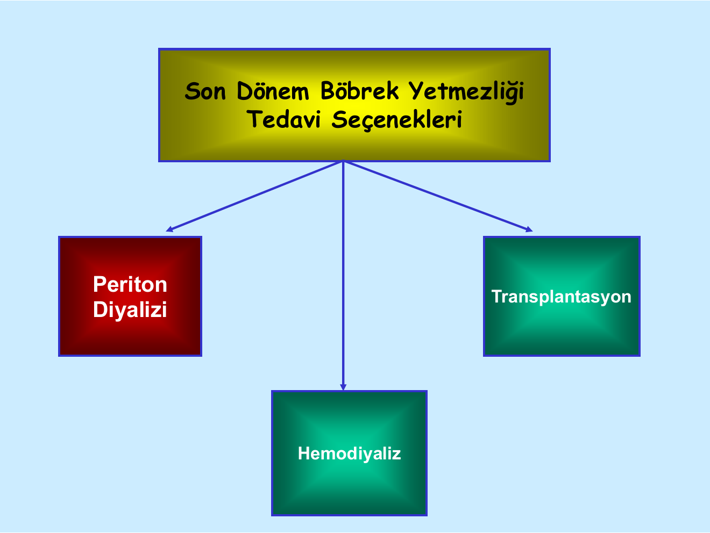

> **Şema yorumu:** SDBY hastasında üç renal replasman tedavi seçeneği bulunur:
>
> * **Transplantasyon:** Altın standart, en iyi sağkalım ve yaşam kalitesi. Ancak verici kısıtlılığı ve kontrendikasyonlar nedeniyle tüm hastalara uygulanamaz.
> * **Hemodiyaliz (HD):** En sık uygulanan yöntem, merkez veya evde yapılabilir.
> * **Periton diyalizi (PD):** Ev bazlı, bağımsız bir tedavi seçeneği. Hasta ve/veya yakını tarafından uygulanır.

**PD'nin temel planı (ders planı):**

* Giriş
* Anatomi
* Histoloji
* Fizyoloji
* Temel prensipler
* Donanım
* Klinik uygulama
* Komplikasyonlar
* Seyir
* Avantajlar -- dezavantajlar -- tercih nedenleri

---

## TÜRKİYE VE DÜNYADA PERİTON DİYALİZİ

### Türkiye'de RRT Dağılımı (2023 Verileri)

| Renal Replasman Tedavisi | Hasta Sayısı (n) | Oran (%) |
|---|---|---|
| **Merkez hemodiyalizi** | 62.123 | 69,39 |
| **Ev hemodiyalizi** | 1.331 | 1,49 |
| **Periton diyalizi** | **3.678** | **4,11** |
| **Böbrek transplantasyonu** | 22.395 | 25,01 |
| **Toplam** | **89.527** | **100,00** |

### Türkiye PD Hastalarında Yöntem Dağılımı

| Yöntem | n | % |
|---|---|---|
| **SAPD** (Sürekli Ayaktan PD) | 2.282 | 62,04 |
| **APD** (Aletli PD) | 1.396 | 37,96 |
| **Toplam** | 3.678 | 100,00 |

### Türkiye PD Hastalarında KBH Etiyolojisi (2023)

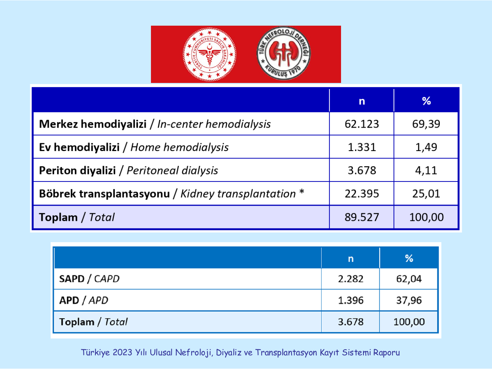

| Etiyoloji | n | % |
|---|---|---|
| **Hipertansiyon** | 546 | 29,23 |
| **Diyabetes mellitus (DM)** -- toplam | 505 | 27,03 |
| Tip 1 DM | 77 | 4,12 |
| Tip 2 DM | 428 | 22,91 |
| Glomerulonefrit | 127 | 6,80 |
| Polikistik böbrek hastalıkları | 86 | 4,60 |
| Renal vasküler hastalık | 50 | 2,68 |
| Tübülointerstisyel nefrit | 35 | 1,87 |
| Primer (AL) amiloidoz | 24 | 1,28 |
| Obstrüktif nefropati | 22 | 1,18 |
| Sekonder (AA) amiloidoz | 10 | 0,54 |
| Diğer nedenler | 251 | 13,43 |
| Etiyoloji bilinmeyen | 212 | 11,35 |
| **Toplam** | **1.868** | **100,00** |

> **Epidemiyolojik yorum:** Türkiye'de PD hastalarında **en sık etiyoloji hipertansiyon**, ikinci sırada **diyabetes mellitus (özellikle Tip 2 DM)** gelmektedir.

### Türkiye Genel Böbrek Yetmezliği İnsidans ve Prevalansı

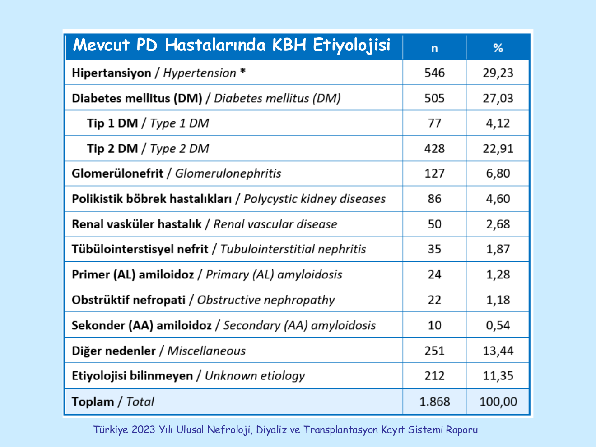

> **Grafik yorumu:** 2002'den 2023'e kadar SDBY **prevalansı** sürekli artış göstererek **1049/milyon** düzeyine ulaşmıştır; **insidans** ise 140-160/milyon bandında stabil seyretmektedir. Bu, erken ölümlerin azalması ve hasta sağkalımının uzaması ile açıklanır.

### Dünyada Periton Diyalizi Yüzdesi

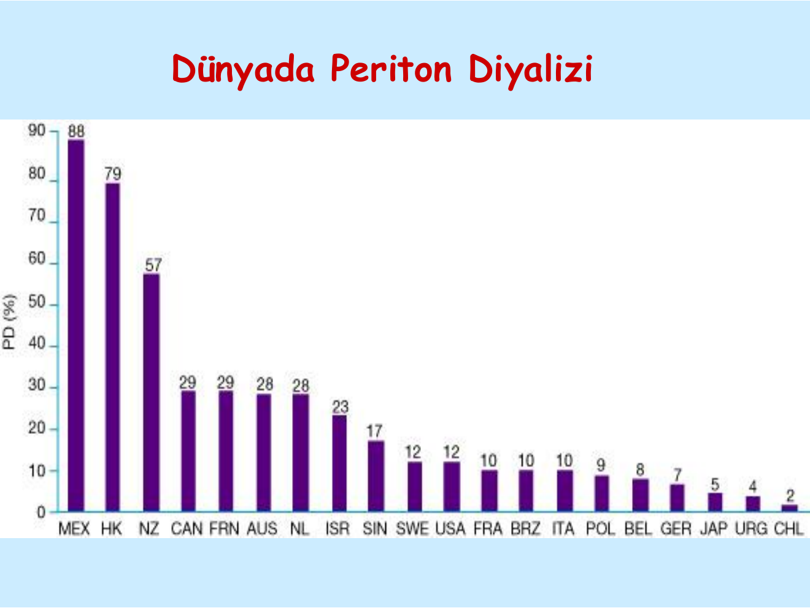

> **Grafik yorumu:** **Meksika (%88), Hong Kong (%79) ve Yeni Zelanda (%57)** PD kullanımında öncü ülkelerdir. ABD, Almanya, Japonya, Belçika gibi gelişmiş ülkelerde PD oranı %5-12 arasında kalmaktadır. Türkiye'de oran **%4** civarındadır.

---

## PERİTON ANATOMİ VE HİSTOLOJİSİ

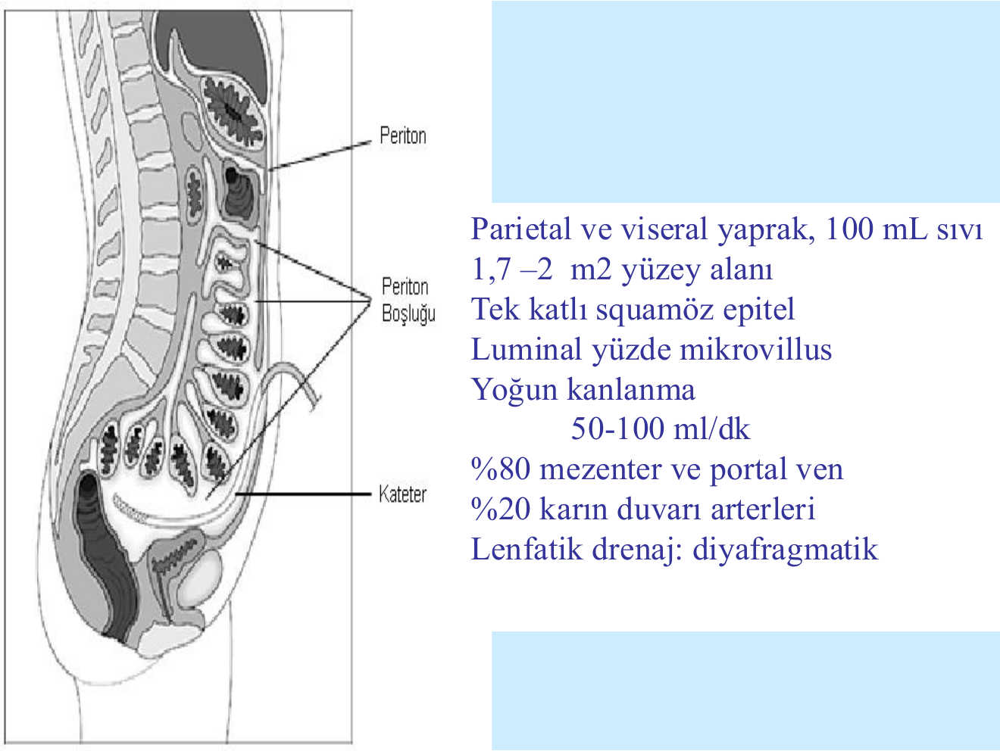

**Periton zarı özellikleri:**

| Özellik | Değer / Açıklama |
|---|---|
| **Yaprak yapısı** | Parietal (karın duvarı) + viseral (iç organ) iki yaprak |
| **Fizyolojik sıvı miktarı** | 100 mL |
| **Yüzey alanı** | 1,7 -- 2 m² |
| **Epitel tipi** | Tek katlı squamöz (skuamöz) epitel -- **mezotel** |
| **Luminal yüz** | Mikrovillüslü |
| **Kanlanma** | Yoğun, 50-100 mL/dk |
| Arter kaynağı | %80 mezenter ve portal ven; %20 karın duvarı arterleri |
| **Lenfatik drenaj** | Diyafragmatik |

### Peritoneal Mikrovillüs Histolojisi

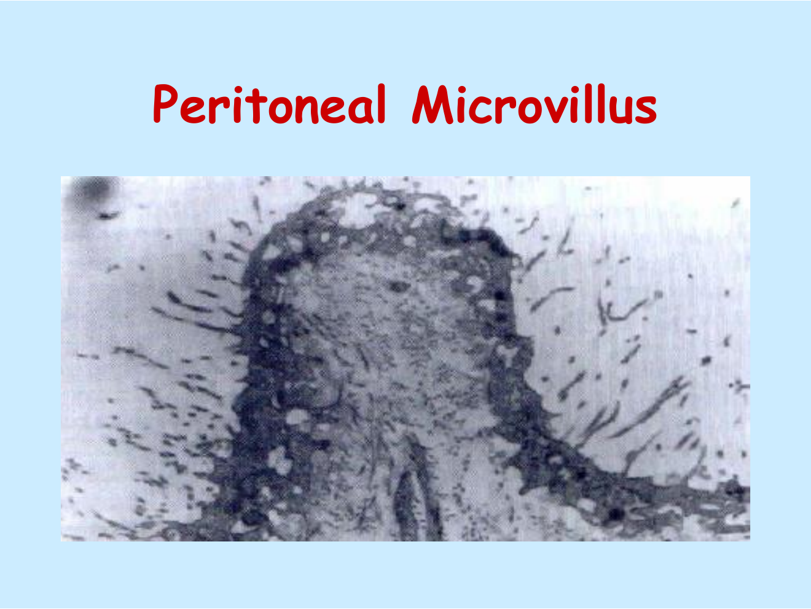

> **Histoloji yorumu:** Mezotel hücresinin luminal yüzeyindeki **mikrovillüslar** yüzey alanını genişleterek solüt ve sıvı transportunu artırır.

---

## PERİTON FİZYOLOJİSİ VE TRANSPORT

### Peritoneal Transport Kompartmanları

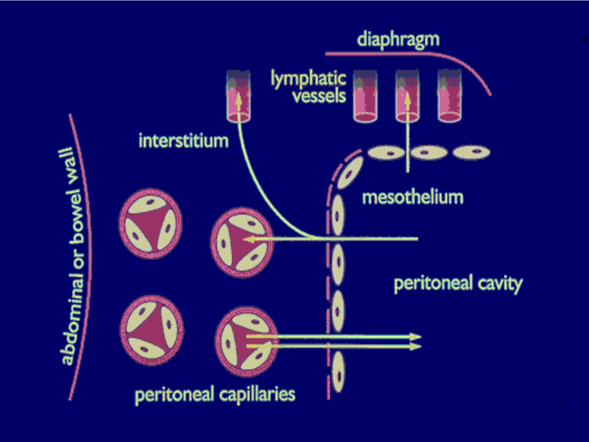

> **Şema yorumu:** Peritoneal solüt ve sıvı transportunda devrede olan anatomik yapılar:
>
> * **Peritoneal kapiller** (ana transport yüzeyi)
> * **İnterstisyum** (kapiller ile mezotel arası boşluk)
> * **Mezotelyum** (peritoneal boşluğu sınırlandıran tek katlı epitel)
> * **Lenfatikler** (sıvı reabsorpsiyonu, özellikle diyafragmatik)

---

## ALTI DİRENÇ NOKTASI VE POR TEORİSİ

### Altı Direnç Noktası

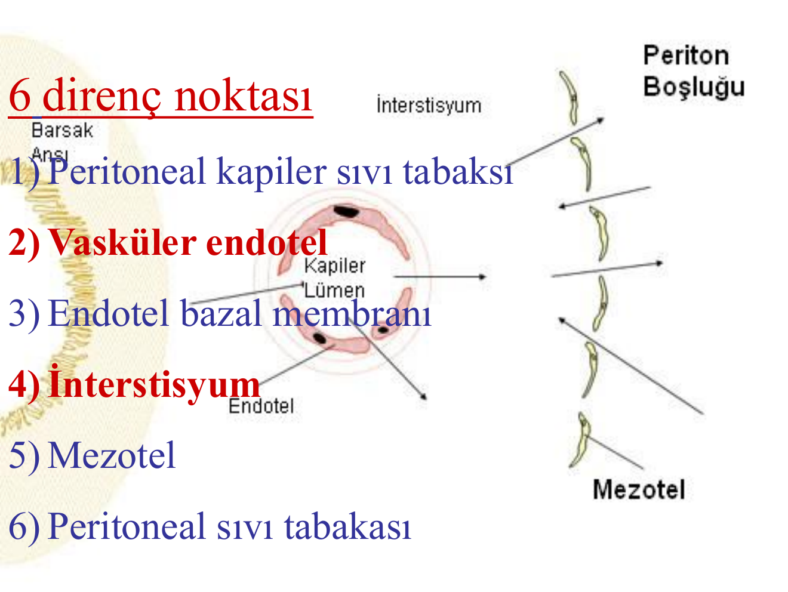

**Solüt ve sıvı transportuna karşı altı direnç noktası (kan → peritoneal boşluk):**

| # | Direnç Noktası |
|---|---|
| 1 | Peritoneal kapiller sıvı tabakası (stagnant film) |
| 2 | **Vasküler endotel** (ana direnç; por teorisinin gerçekleştiği yer) |
| 3 | Endotel bazal membranı |
| 4 | **İnterstisyum** |
| 5 | Mezotel |
| 6 | Peritoneal sıvı tabakası |

### Por Teorisi (Üç Kapı / Three-Pore Model)

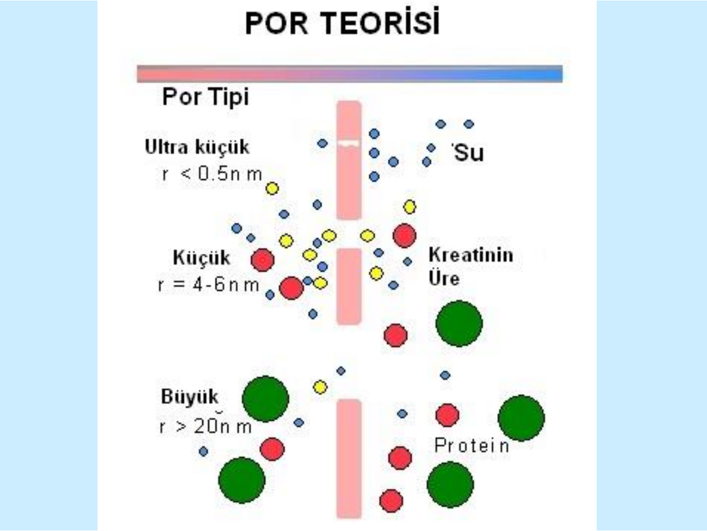

> **Rippe'nin "Üç Por (Three-Pore)" Modeli:** Peritoneal kapiller endotelde farklı boyutta porlar bulunur; her por farklı boyutta solüt ve sıvıyı geçirir.

| Por Tipi | Çap (r) | Geçen Moleküller | Klinik Önemi |
|---|---|---|---|
| **Ultra küçük (aquaporin-1)** | r < 0,5 nm | Sadece **su** (serbest su transportu) | Glukoz ozmotik gradyenti ile UF'nin büyük kısmı |
| **Küçük por** | r = 4-6 nm | **Üre, kreatinin, elektrolitler, küçük moleküller** | Diffüzyon ile solüt klirensi (ana kapı) |
| **Büyük por** | r > 20 nm | **Protein** (albumin vb.) | Protein kayıpları (günde 10-20 g) |

> **Önemli:** Ultrafiltrasyon büyük ölçüde **aquaporin-1 (ultra küçük por)** aracılığıyla, sodyum sieve (sodyum elemesi) ile gerçekleşir. Bu por yolunda sadece su geçer ve bu da erken değişim periyodunda diyalizat sodyumunda **dilüsyonel bir düşüş (sodyum sieving)** oluşturur.

---

## PERİTON DİYALİZİ TEMEL PRENSİPLERİ

**PD dört temel işlem üzerine kuruludur:**

### 1. Diffüzyonla Solüt Uzaklaştırılması (Klirens)

* Konsantrasyon gradyenti boyunca solüt geçişi
* **Boyut seçiciliği** -- küçük moleküller hızlı, büyük moleküller yavaş geçer
* **Etkin vasküler alan** (perfüze olan kapiller yüzey) klirensi belirler

### 2. Ultrafiltrasyon (UF)

* **Ozmotik (veya onkotik) basınç gradyenti** ile su geçişi
* Glukoz (kristalloid ozmotik ajan) veya icodextrin (kolloid ozmotik ajan) ile sağlanır

### 3. Emilim (Absorbsiyon)

* **Lenfatik drenaj** ile diyalizattan dolaşıma sıvı geri dönüşü (yaklaşık 1-2 mL/dk)
* UF'yi azaltan bir faktördür

### 4. Alkali Tedavisi

* Laktat veya bikarbonat ile metabolik asidozun düzeltilmesi

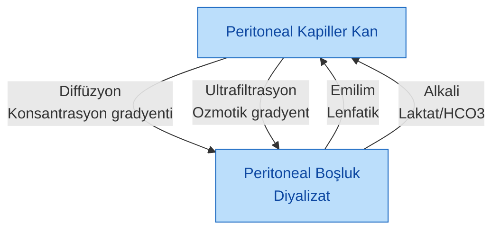
```mermaid
flowchart TD
    A[Peritoneal Kapiller Kan] -->|Diffüzyon<br/>Konsantrasyon gradyenti| B[Peritoneal Boşluk<br/>Diyalizat]
    A -->|Ultrafiltrasyon<br/>Ozmotik gradyent| B
    B -->|Emilim<br/>Lenfatik| A
    B -->|Alkali<br/>Laktat/HCO3| A

    classDef diffusion fill:#bbdefb,stroke:#1565c0,color:#0d47a1
    classDef uf fill:#c8e6c9,stroke:#2e7d32,color:#1b5e20
    classDef absorb fill:#ffcdd2,stroke:#c62828,color:#b71c1c
    classDef alkali fill:#fff9c4,stroke:#f9a825,color:#f57f17

    class A,B diffusion
```

---

## TEKNİK DONANIM

**PD uygulaması dört temel bileşenden oluşur:**

* **Kateter** (peritona yerleştirilir)
* **Bağlantı setleri**
* **Diyaliz solüsyonu** (torbada)
* **Klinik uygulama** biçimi:
  * **Elle** (SAPD -- sürekli ayaktan PD)
  * **Aletli** (APD -- otomatik cihazlar = cycler)

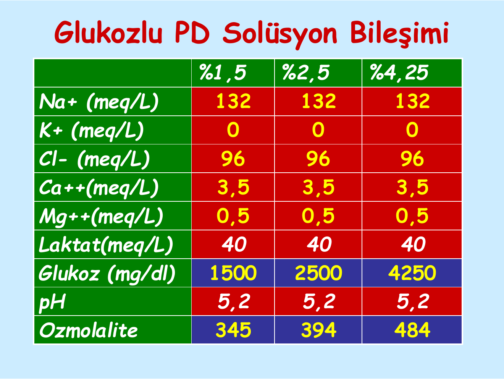

---

## PERİTON DİYALİZ KATETERLERİ

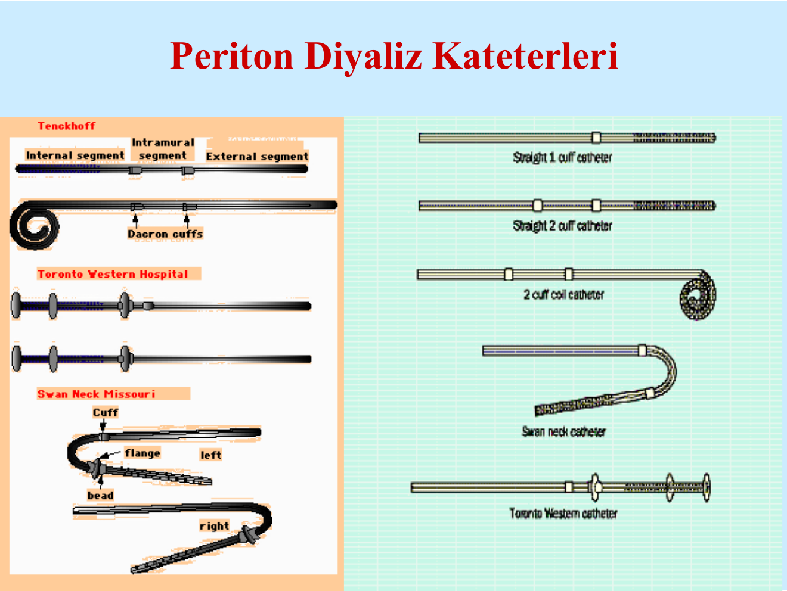

> **Şema yorumu:** PD kateterlerinin tümü **silastik (silikon)** yapıdadır ve karın duvarında bir ya da iki adet **dakron keçesi (cuff)** ile sabitlenir. Keçeler etrafında **fibröz doku yapışması (ingrowth)** oluşarak kateteri sabitler ve mikroorganizma göçünü engeller.

**Kateter tipleri:**

| Kateter Tipi | Özellik |
|---|---|
| **Tenckhoff (düz, coil uçlu)** | Klasik tip; intraabdominal segment düz ya da kıvrımlı (coiled) |
| **Swan-neck (Missouri)** | Subkutan segmentte "kuğu boynu" kıvrımı; çıkış yeri enfeksiyonu oranını azaltır |
| **Toronto Western** | İki diskli intraabdominal uç |
| **1-cuff / 2-cuff varyantlar** | Tek keçeli ya da çift keçeli |

### Kateter Yerleşimi

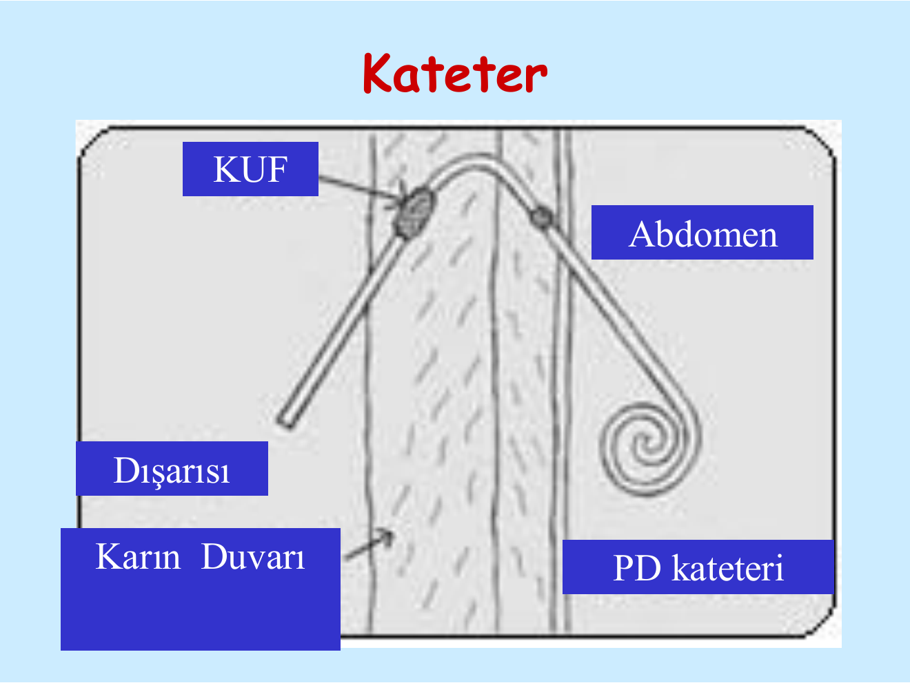

> **Anatomik konum:** Kateterin intraabdominal ucu **Douglas boşluğuna (pelvise)** yerleştirilir. Subkutan tünel **swan-neck** konfigürasyonunda karın duvarında aşağıya doğru kıvrılarak dış çıkış yerine ulaşır (çıkış yeri enfeksiyonu riskini azaltır).

### Klinik Çıkış Yeri Örnekleri

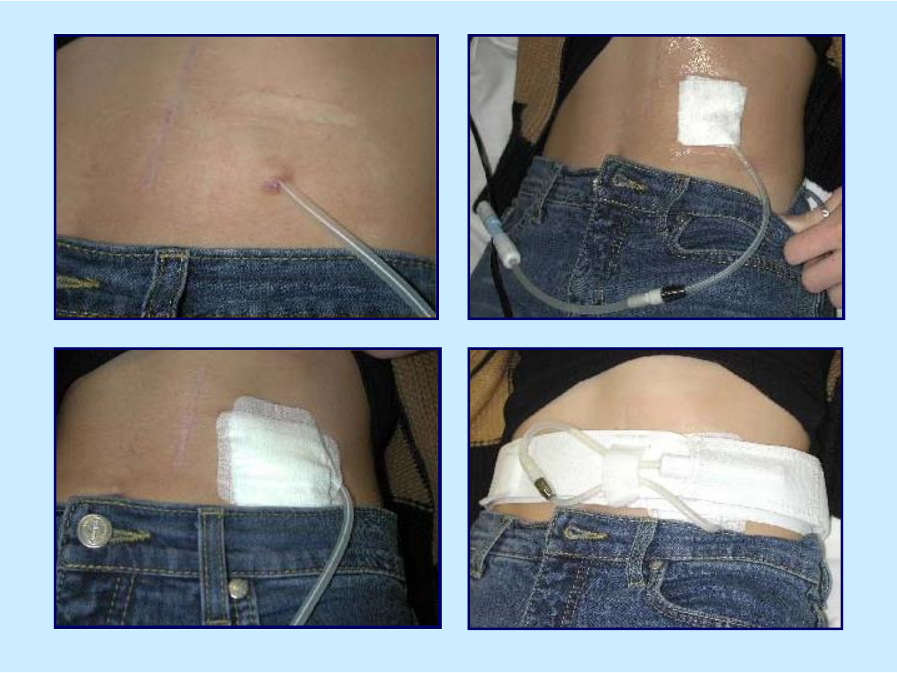

---

## PERİTON DİYALİZİ SOLÜSYONLARI

**PD solüsyonunun temel özellikleri:**

* **Hacim:** 2-3 L (SAPD), 5-6 L (APD) değişimi başına
* **Elektrolit içeriği** seruma benzer
  * **Potasyumdan fakir** (K⁺ = 0 mEq/L; üremi hipokalemisi zaten nadir olduğu için)
* **Ozmotik aktif molekül:**
  * Glukoz (en sık)
  * Poliglukoz (icodextrin)
  * Amino asit
* **Asidoz tedavisi için tampon:**
  * Laktat (klasik)
  * Bikarbonat (HCO₃⁻, yeni nesil)

---

## GLUKOZLU SOLÜSYONLAR

### Glukozlu PD Solüsyon Bileşimi

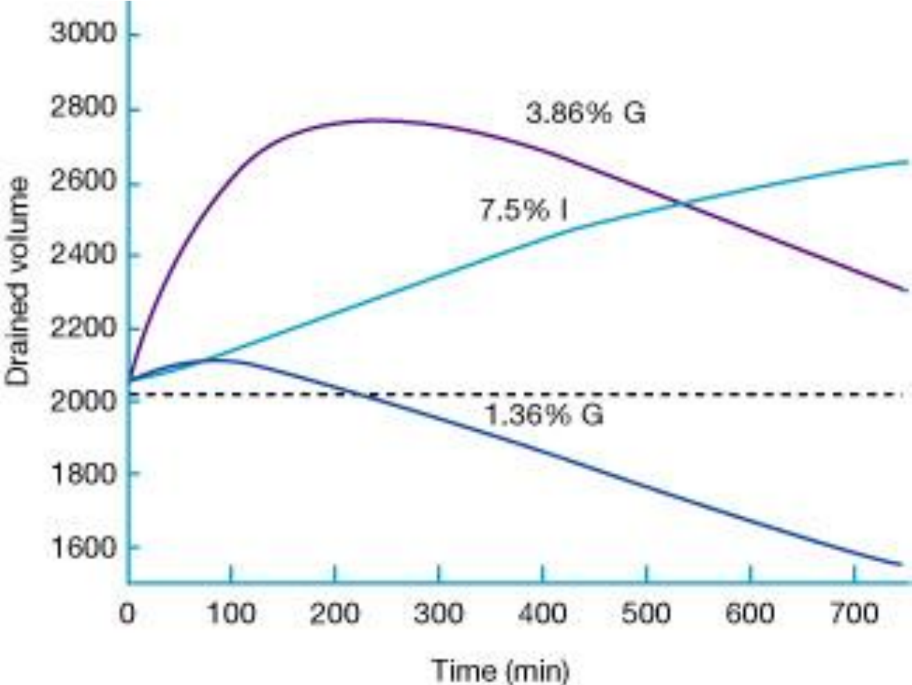

| Bileşen | %1,5 | %2,5 | %4,25 |
|---|---|---|---|
| **Na⁺ (mEq/L)** | 132 | 132 | 132 |
| **K⁺ (mEq/L)** | 0 | 0 | 0 |
| **Cl⁻ (mEq/L)** | 96 | 96 | 96 |
| **Ca²⁺ (mEq/L)** | 3,5 | 3,5 | 3,5 |
| **Mg²⁺ (mEq/L)** | 0,5 | 0,5 | 0,5 |
| **Laktat (mEq/L)** | 40 | 40 | 40 |
| **Glukoz (mg/dL)** | 1500 | 2500 | 4250 |
| **pH** | 5,2 | 5,2 | 5,2 |
| **Ozmolalite (mOsm/kg)** | 345 | 394 | 484 |

> **Ozmotik ajan olarak glukoz konsantrasyonları (farklı adlandırma):**
>
> * **%1,5 solüsyon** = **1,36 g/dL** monohidrat glukoz
> * **%2,5 (%2,30) solüsyon** = **2,27 g/dL** monohidrat glukoz
> * **%4,25 solüsyon** = **3,86 g/dL** monohidrat glukoz

### Glukozun Ozmotik Ajan Olarak Avantajları

* **Ucuz**
* **Organizmaya yabancı değil** (endojen molekül)
* Etkili bir ozmotik ajan

### Glukozun Dezavantajları

* **Hızlı emilim, UF kaybı** (değişim süresinin sonunda glukoz gradyenti kaybolur)
* Fizyolojik dozlardan yüksek sistemik glukoz maruziyeti
* **Glukoz parçalanma ürünleri (GDP)** oluşumu (steril solüsyon hazırlığı sırasında)
* **İleri glikolizlenme ürünleri (AGE)** birikimi
* **Peritonda kalınlaşma, fibrozis, fonksiyon kaybı**

### Karşılanamayan Klinik Sorunlar

| Solüsyon İçeriği | Sorun | Klinik Bulgu |
|---|---|---|
| Yüksek glukoz | Sürekli glukoz emilimi | **Obezite**, **dislipidemi**, **DM'de kötü kan şekeri kontrolü** |
| Yüksek ozmolalite | Periton iritasyonu | Ağrı |
| Yüksek laktat | Metabolik yük | Laktik asidoz riski (yüksek laktat düzeyi) |
| Düşük pH (5,2) | Sitotoksik | Mezotel hasarı, mesafe girişinde ağrı |
| Yüksek GDP | Periton zarı hasarı | **Peritoneal membran fonksiyon kaybı, artmış geçirgenlik, hipervolemi** |
| -- | **Yetersiz ve kısa süreli UF** | Hipervolemi |
| -- | **Peritoneal protein kaybı** (10-20 g/gün) | Protein malnütrisyonu |

---

## YENİ NESİL SOLÜSYONLAR

**Klasik glukozlu solüsyonların dezavantajlarını azaltmak için geliştirilen alternatifler:**

| Solüsyon | pH | GDP | Ozmotik ajan |
|---|---|---|---|
| **Klasik glukoz** | 5,2 | Yüksek | Glukoz |
| **Bikarbonat/Laktat** | **7,0-7,4** | **Düşük** | Glukoz |
| **Icodextrin (Extraneal)** | 5,2 | Düşük | **Glukoz polimeri** (glukoz yok, izo-ozmolar) |
| **Amino asit (Nutrineal)** | **~6,7** | **Yok** | Amino asit (glukoz yok) |

---

## ICODEXTRIN

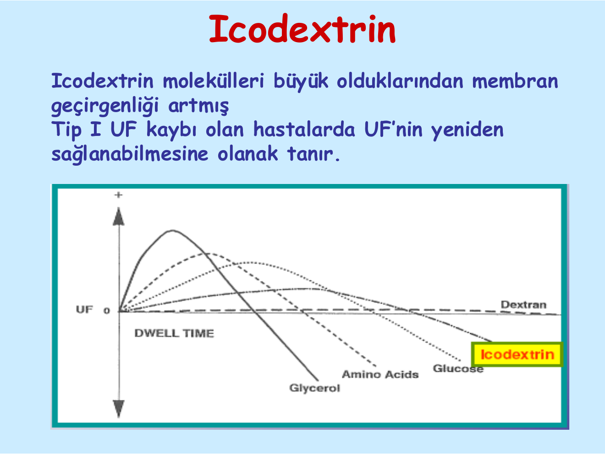

> **Tanım:** **Icodextrin**, **nişastadan elde edilen**, **moleküler ağırlığı 13.000-19.000 Dalton** olan bir **glukoz polimeridir**. Kolloid ozmotik özelliğe sahiptir.

### Neden Gerekli?

* **Uzun beklemelerde (özellikle APD gündüz beklemesi veya SAPD gece beklemesi)** glukoz ile sürekli UF sağlanamaz; glukoz hızla emilerek gradyent kaybolur.
* Icodextrin büyük molekül olduğundan **emilmez** ve **uzun beklemeler boyunca stabil UF** sağlar.
* **Glukoz maruziyetini azaltır.**

### Icodextrin'in UF Profili

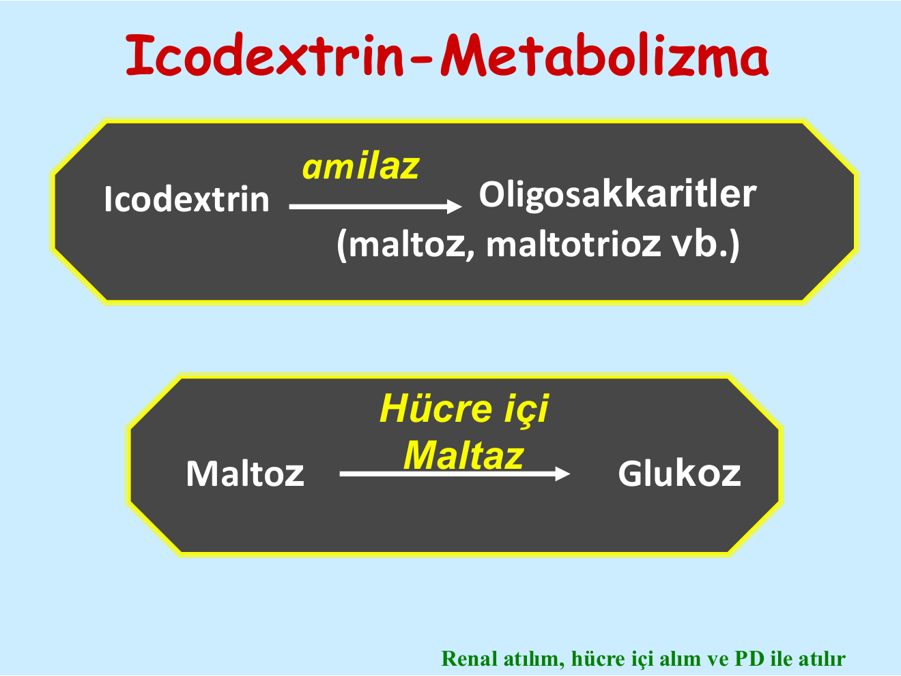

> **Grafik yorumu:** **%3,86 glukoz** erken dönemde yüksek UF sağlar ancak 3-4 saatte gradyent kaybolur ve UF düşer. **Icodextrin** ise **daha yavaş ama uzun süreli (8-16 saat)** stabil UF sağlar; gliserol ve amino asit hızla emilir.

> **Klinik endikasyon:** **Tip I ultrafiltrasyon (UF) kaybı** olan hastalarda (yüksek transport tipi, hızlı glukoz emilimi) **icodextrin UF'yi yeniden sağlar**.

### Icodextrin Metabolizması

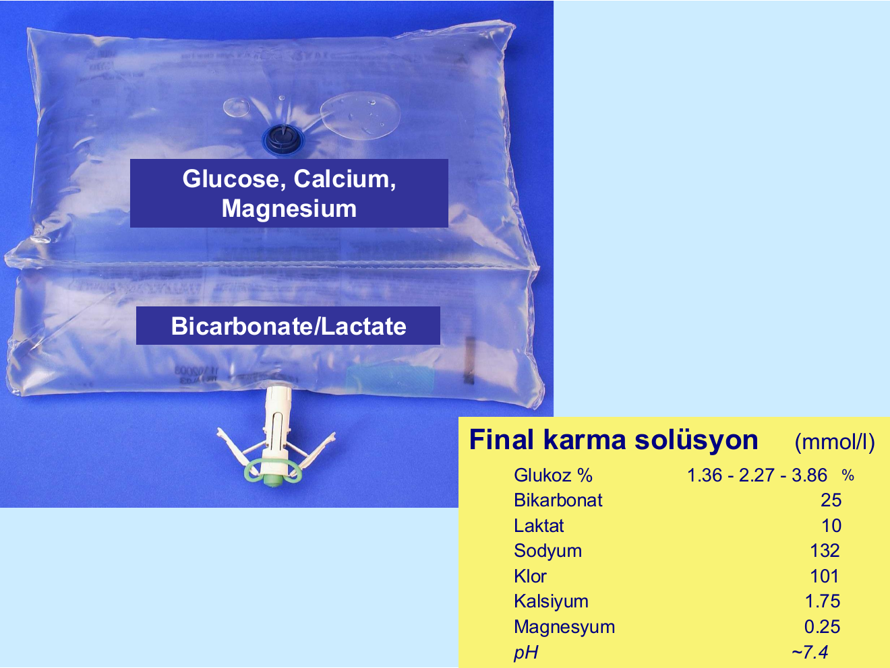

> **Metabolizma yolağı:**
>
> 1. **Icodextrin** dolaşımdaki **amilaz** ile **oligosakkaritlere** (maltoz, maltotrioz vb.) parçalanır.
> 2. **Maltoz** hücre içine alınır ve **maltaz** ile **glukoza** dönüştürülür.
> 3. Kalıntılar **renal atılım, hücre içi alım ve PD ile atılım** yollarıyla uzaklaştırılır.

### Avantajlar

* **Uzamış teknik sağkalım** (PD süresi uzar)
* **Yüksek konsantrasyonlu glukoz solüsyonlarının zararlı etkilerinden korunma**
* **Peritonitler süresince ortaya çıkan UF kayıplarının engellenmesi**

### Dezavantajlar

* **Allerjik reaksiyonlar:**
  * **Steril peritonit** (icodextrin ilişkili, kültür negatif)
  * Deri döküntüleri
* **Kan maltoz düzeyi yükselir** (klinik önemi tartışmalı)
* **Yanlış yüksek glukoz ölçümü:** Bazı glukoz tayin stripleri (**GDH-PQQ = glukoz dehidrojenaz kinolinekinon**) icodextrin hastalarında **yanlış yüksek** glukoz değeri verir. **Glukoz spesifik stripler** kullanılmalıdır.

---

## AMİNO ASİT SOLÜSYONU

> **Nutrineal (%1,1 amino asit solüsyonu):** Malnütrisyonlu PD hastalarında **hem ozmotik ajan hem de beslenme desteği** olarak kullanılır.

### Özellikler

* **Ozmotik ajan:** Amino asit
* **Peritoneal kayıpların replasmanı:**
  * Protein: 5-15 g/gün kaybı
  * Amino asit: 3-4 g/gün kaybı
* **Glukoz yok, GDP yok**
* **Daha fizyolojik pH (~6,7)**
* **Ozmolalite ve klirens/UF: %1,5 glukoza eşdeğer**
* **Laktat: 40 mEq/L**

### Klinik Sonuçlar (AA solüsyonu ile)

**Beslenme parametrelerinde düzelme:**

* ↑ nPCR (normalized protein catabolic rate)
* ↑ SGA (subjective global assessment)
* ↑ Lean body mass (yağsız vücut kütlesi)
* ↑ Nitrojen dengesi
* ↑ IGF-1
* ↑ Albumin, transferrin, total protein
* ↑ Vücut ağırlığı ve BMI

**Laboratuvar değişiklikleri:**

* ↑ Plazma üre konsantrasyonu (amino asitlerin metabolizmasıyla)
* ↓ Plazma bikarbonat, potasyum ve fosfat

### Avantajlar ve Dezavantajlar

| Avantajlar | Dezavantajlar |
|---|---|
| Glukoz yok | **Günde 1 defa** kullanılmalı (fazlası asidoz yapar) |
| GDP yok | Metabolik asidoza yatkınlık |
| Beslenme desteği sağlar | Oral karbonhidrat tüketimi gerekir (ko-katabolizma için) |

---

## BİKARBONAT / LAKTAT SOLÜSYONLARI

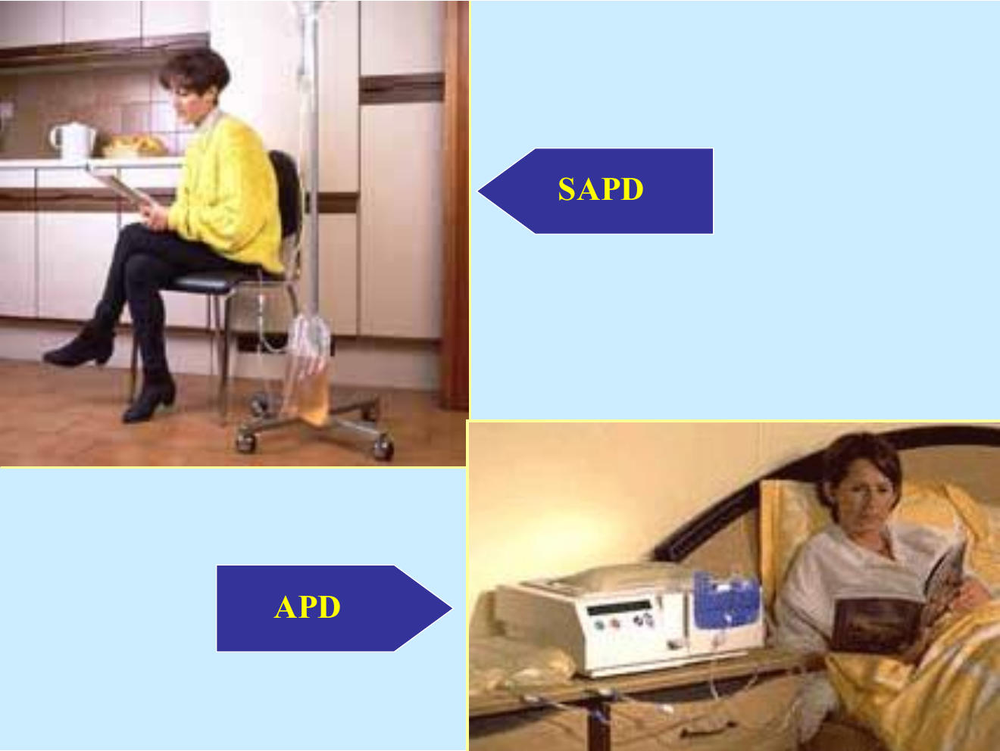

> **Teknik prensip:** Glukoz düşük pH'da daha stabildir, bikarbonat ise yüksek pH gerektirir. Bu nedenle solüsyon **iki ayrı kompartmanda** saklanır:
>
> * **Solüsyon A:** Elektrolitler + **Glukoz** (pH 2,8-3,1)
> * **Solüsyon B:** **Laktat/HCO₃⁻** (pH 8,0-8,6)
>
> Kullanım anında iki kompartman karıştırılarak **final pH 7,0-7,4** elde edilir.

### Final Karma Solüsyon

| Bileşen | Değer |
|---|---|
| **Glukoz %** | 1,36 -- 2,27 -- 3,86 |
| **Bikarbonat (mmol/L)** | 25 |
| **Laktat (mmol/L)** | 10 |
| **Sodyum** | 132 |
| **Klor** | 101 |
| **Kalsiyum** | 1,75 |
| **Magnezyum** | 0,25 |
| **pH** | **~7,4** |

### Avantajlar

* **Nötr pH** -- daha fizyolojik
* **Azalmış GDP** (steril hazırlama sırasında glukoz bozunması az)
* **Daha az sitotoksik** (mezotel hücresi üzerine)
* **Periton zarı fonksiyonlarının daha iyi korunması**
* **Asidozun fizyolojik düzeltilmesi** (bikarbonat direkt tampon)
* **Azalmış laktik asidoz riski**
* **Sıvı verilmesi sırasında azalmış ağrı** (düşük pH'a bağlı infüzyon ağrısı yok)

---

## KLİNİK UYGULAMA (SAPD VE APD)

### Sürekli Ayaktan Periton Diyalizi (SAPD / CAPD)

* **Günde 4-6 kez (her ~6 saatte bir)** 2-3 litrelik değişim
* **Elle** (yerçekimi ile) yapılır
* Her değişim yaklaşık 30-40 dk sürer
* 24 saat boyunca karında sıvı bulunur

### Aletli Periton Diyalizi (APD / Otomatik Cycler)

* **Otomatize sistem** (cycler)
* **Hasta gece uyurken (8-10 saat)** birden fazla değişim yapar
* Gündüz bir ya da iki değişim eklenebilir (CCPD)
* Gündüz karnı "dolu" veya "boş" bırakılabilir

### SAPD ve APD Klinik Görünüm

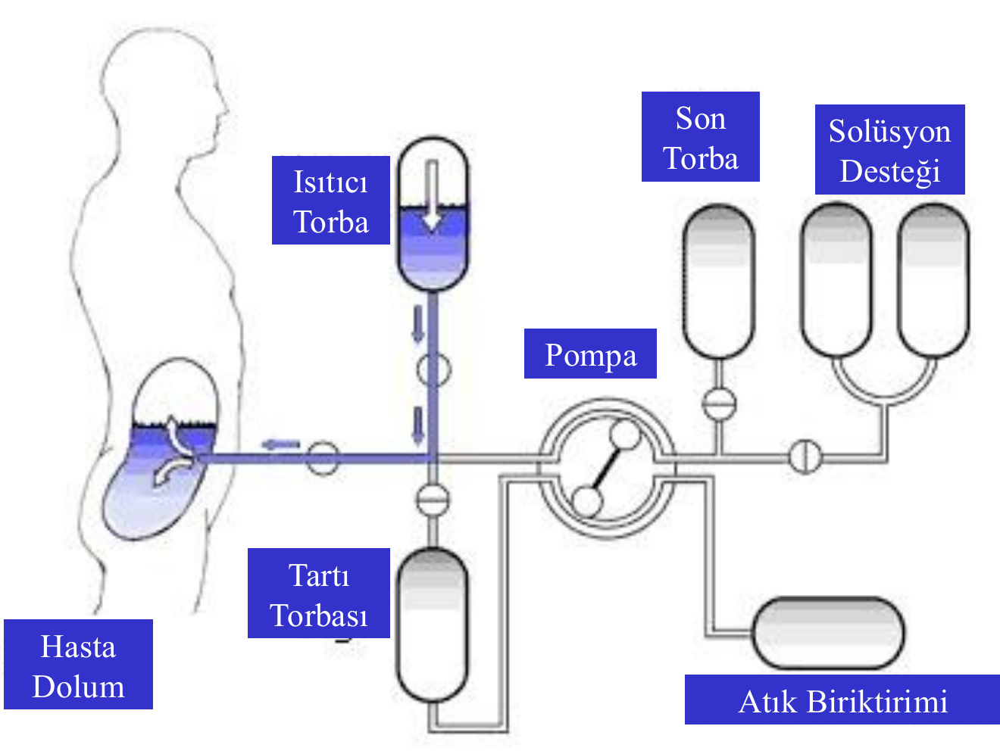

### APD Cycler Donanımı

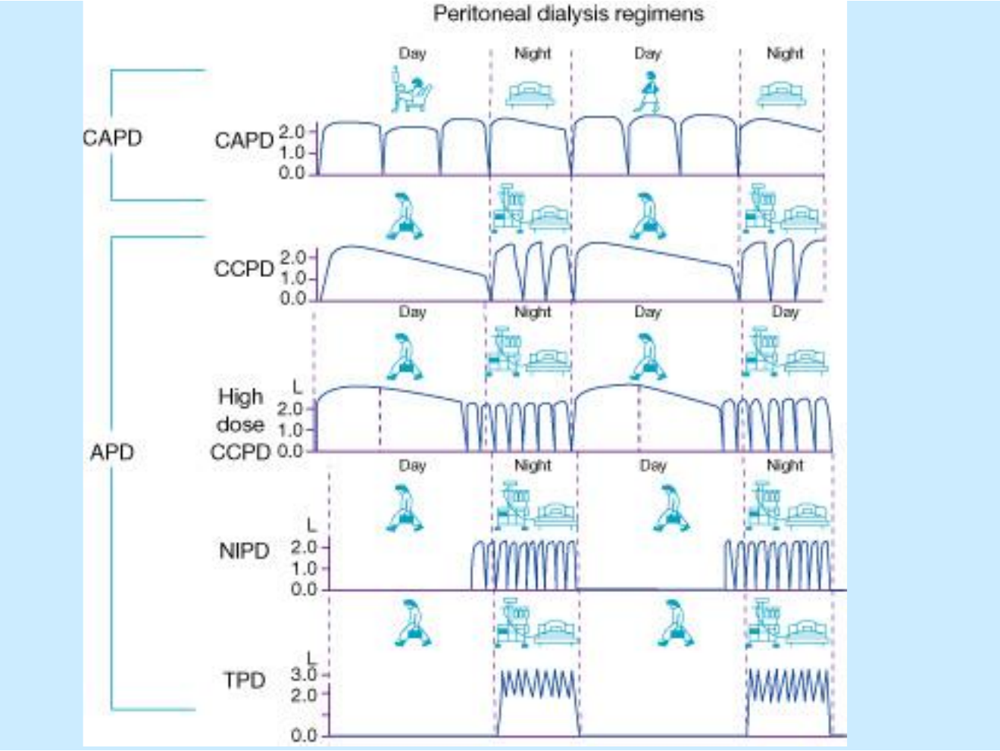

> **Şema yorumu:** APD cycler'ı;
>
> * **Isıtıcı torba:** Solüsyonu vücut ısısına getirir
> * **Pompa:** Dolum ve boşaltım basıncını sağlar
> * **Tartı torbası:** Boşalan miktarı ölçer (UF hesabı)
> * **Solüsyon desteği ve son torba:** Gece değişimleri ve sabah bırakılacak solüsyon
> * **Atık biriktirimi:** Boşalan diyalizatın toplandığı bölüm

### PD Rejimleri -- Karın İçi Hacim Profilleri

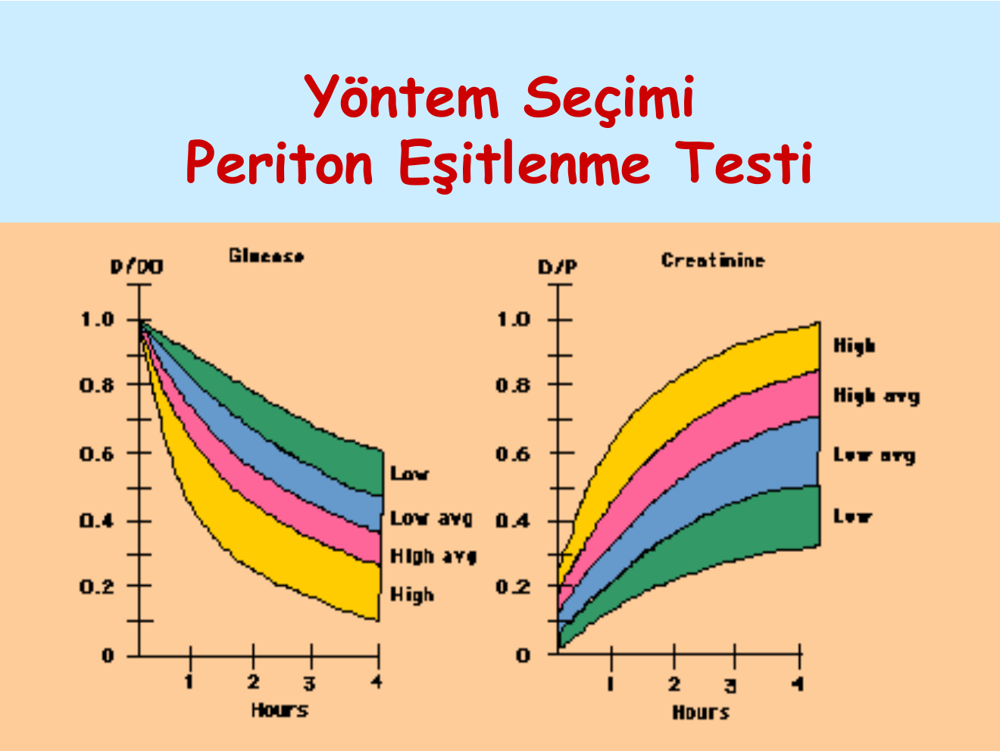

> **Şema yorumu:** Karın içi diyalizat hacmi zaman içinde her rejimde farklı profil çizer: **CAPD'de** 2 L sürekli, **CCPD'de** gece birkaç kez dolum-boşalım + gündüz bekleme, **NIPD'de** gündüz kuru, **TPD'de** (tidal) her değişimde **rezidüel hacim bırakılır**.

---

## PD TERMİNOLOJİSİ

| Kısaltma | Açılımı | Tanım |
|---|---|---|
| **SAPD / CAPD** | Sürekli Ayaktan PD | Günde 4-5 değişim, elle, sürekli karında sıvı |
| **CCPD** | Sürekli Ardışık PD | Gece cycler + gündüz karın dolu bekleme |
| **DAPD** | Gündüz Ayaktan PD | Sadece gündüz 4-5 değişim (gece karın boş) |
| **NIPD** | Gece Aralıklı PD | Her gece **8-12 saat** sürede 10-20 L diyaliz solüsyonu ile değişim (gündüz karın boş) |
| **NTPD / TPD** | Gecelik Tidal PD | Her gece 8-12 saat boyunca **15-20 L** solüsyon; her değişimde karında rezidüel sıvı bırakılır, teorik olarak **40 L** sıvı kullanımı |
| **Standart SAPD** | -- | 24 saat boyunca 4-5 değişim |
| **Yüksek doz SAPD/CCPD** | -- | SAPD için **>10 L/gün**, CCPD için **>13 L/gün** |

---

## YÖNTEM SEÇİMİ VE PET TESTİ

### Periton Eşitlenme Testi (PET -- Peritoneal Equilibration Test)

> **Tanım:** **PET**, 2 litre **%2,5 glukoz** solüsyonu ile yapılan, **4 saat bekleme** süresinde belirli zaman noktalarında (0, 1, 2, 4 saat) **diyalizat/plazma kreatinin (D/P Cr)** ve **diyalizat glukoz/başlangıç glukoz (D/D₀ glukoz)** oranlarını ölçen testtir. Hastanın peritoneal membran transport özelliğini belirler.

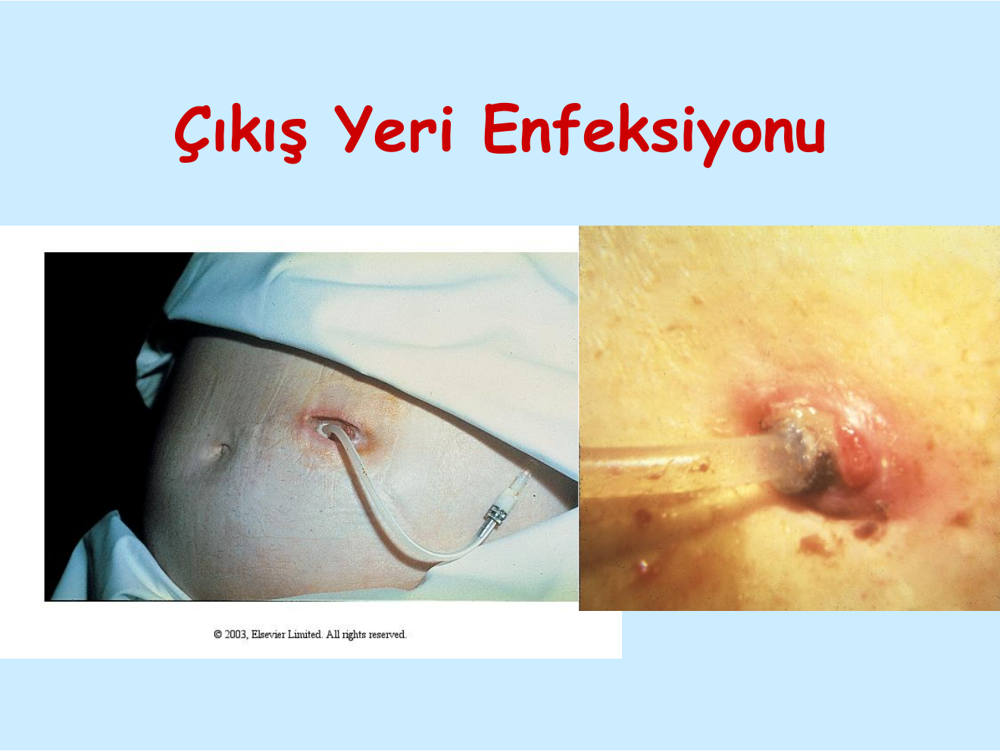

> **Grafik yorumu:** PET sonucu hastalar 4 kategoriye ayrılır:
>
> * **High (yüksek transport):** Hızlı solüt geçişi, hızlı glukoz emilimi → **düşük UF, yeterli klirens**
> * **High-average (yüksek-orta)**
> * **Low-average (düşük-orta)**
> * **Low (düşük transport):** Yavaş solüt geçişi, yavaş glukoz emilimi → **iyi UF, yetersiz klirens**

### PET Sonucuna Göre Yöntem Seçimi

| PET Tipi | Boşalım Volümü | UF Beklentisi | Klirens Beklentisi | Önerilen Yöntem |
|---|---|---|---|---|
| **Yüksek** | Düşük | Kötü | Yeterli | **DAPD, NIPD, NTPD** (kısa, sık değişimler) |
| **Yüksek-orta** | Düşük-orta | Yeterli | Yeterli | **Standart doz PD** |
| **Düşük-orta** | Yüksek-orta | İyi | Yeterli veya yetersiz | **Standart doz PD veya yüksek doz PD** |
| **Düşük** | Yüksek | Çok iyi | Yetersiz | **Yüksek doz PD veya HD'ye geçiş** |

### UF Yetersizliğinde PET'in Kullanımı

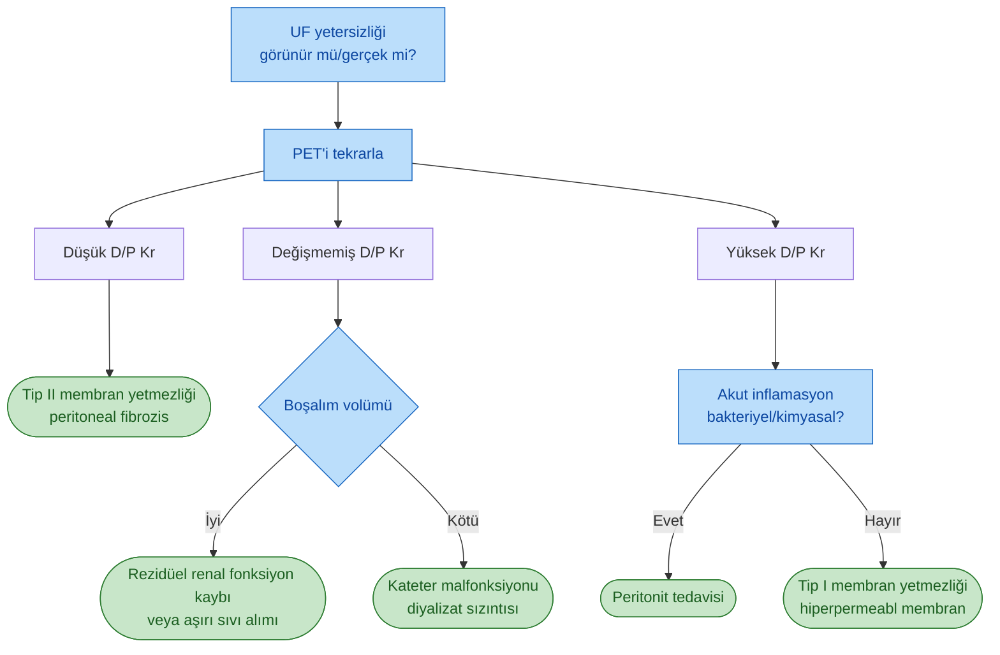
```mermaid
flowchart TD
    A[UF yetersizliği<br/>görünür mü/gerçek mi?] --> B[PET'i tekrarla]
    B --> C[Düşük D/P Kr]
    B --> D[Değişmemiş D/P Kr]
    B --> E[Yüksek D/P Kr]

    C --> F([Tip II membran yetmezliği<br/>peritoneal fibrozis])

    D --> G{Boşalım volümü}
    G -->|İyi| H([Rezidüel renal fonksiyon kaybı<br/>veya aşırı sıvı alımı])
    G -->|Kötü| I([Kateter malfonksiyonu<br/>diyalizat sızıntısı])

    E --> J[Akut inflamasyon<br/>bakteriyel/kimyasal?]
    J -->|Evet| K([Peritonit tedavisi])
    J -->|Hayır| L([Tip I membran yetmezliği<br/>hiperpermeabl membran])

    classDef test fill:#bbdefb,stroke:#1565c0,color:#0d47a1
    classDef diagnose fill:#c8e6c9,stroke:#2e7d32,color:#1b5e20
    classDef exclude fill:#ffcdd2,stroke:#c62828,color:#b71c1c
    classDef warning fill:#fff9c4,stroke:#f9a825,color:#f57f17

    class A,B,G,J test
    class F,H,I,K,L diagnose
```

> **Ultrafiltrasyon yetmezliği tipleri:**
>
> * **Tip I UF kaybı:** Hiperpermeabl membran (yüksek transport) → glukoz hızla emiliyor, gradyent korunamıyor. **Tedavi: icodextrin**.
> * **Tip II UF kaybı:** Peritoneal fibrozis, solüt transport azalmış. **Tedavi: PD'ye ara ver / HD'ye geç**.
> * **Tip III UF kaybı:** Artmış lenfatik absorbsiyon
> * **Tip IV UF kaybı:** Aquaporin disfonksiyonu

---

## PD'DE YETERLİLİK (Kt/V)

### Klinik Biyokimyasal İyilik Hali Kriterleri

* **Normovolemik** (hipervolemi yok)
* **Normotansif** (iyi kan basıncı kontrolü)
* **Albumin > 4 g/dL**
* **Hb > 11 g/dL**
* İyi beslenme durumu (SGA)
* Metabolik asidoz düzelmiş (HCO₃⁻ ≥ 22)
* Normal elektrolit dengesi

### Kt/V (Üre Klirens İndeksi)

> **Formül:** Kt/V = (üre klirensi × diyaliz süresi) / total vücut suyu

**Peritoneal + Rezidüel renal fonksiyon Kt/V hedefleri:**

* **Haftalık total Kt/V (peritoneal + renal) ≥ 1,7** (ISPD kılavuzu)
* **Rezidüel böbrek fonksiyonu korunmalıdır** (PD'nin en büyük avantajlarından biri)
* Rezidüel idrar çıkışı > 100 mL/gün ise klinik olarak anlamlı kabul edilir

> **Önemli:** Kt/V sadece bir sayıdır -- **klinik iyilik hali her zaman daha önemlidir**. İdeal Kt/V'de bile hipervolemi, malnütrisyon, asidoz varsa diyaliz yeterli değildir.

---

## KOMPLİKASYONLAR -- ENFEKSİYÖZ

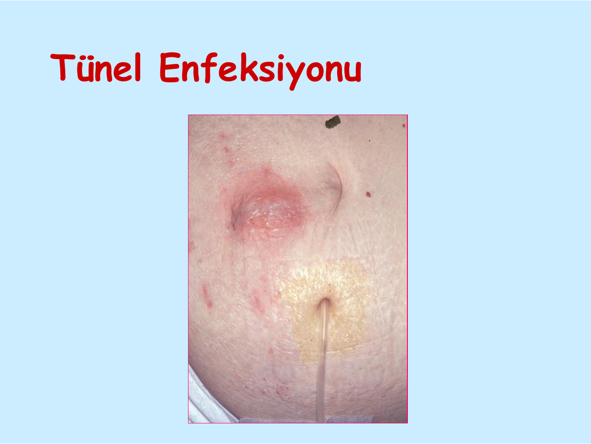

### 1. Peritonit

> **Tanım:** Peritonitin tanısı aşağıdaki üç kriterden **en az ikisinin** varlığı ile konur (**ISPD 2022 kriterleri**):
>
> 1. **Peritonite uygun klinik bulgular** (karın ağrısı ve/veya bulanık diyalizat)
> 2. **Diyalizat BK > 100/µL (≥ 1 saat bekleme süresi sonrası)** ve **%50'den fazla polimorfonükleer lökosit (PNL)**
> 3. **Pozitif diyalizat kültürü**

**Klinik bulgular:**

* **Bulanık peritoneal sıvı** (en sık ilk belirti)
* Karın ağrısı
* Bulantı -- kusma
* Ateş (nadir, geç bulgu)
* Peritonitik defans (nadir)

**Peritonit etyolojisi:**

| Mikroorganizma | Sıklık | Yorum |
|---|---|---|
| **Koagülaz negatif stafilokok** (S. epidermidis vb.) | En sık | Cilt florasından; temas kontaminasyonu |
| **Staphylococcus aureus** | Sık | Ciltten, nazal taşıyıcılık |
| **Gram negatifler** (E. coli, Klebsiella, Pseudomonas) | Sık | Transmural (barsak kaynaklı) veya ellerle kontaminasyon |
| **Streptokoklar** | Az | Oral flora |
| **Mantar (Candida)** | Nadir | **Kötü prognoz, kateter çekilmeli** |
| **Mikobakteri (tbc)** | Nadir | Atipik prezentasyon |
| **Kültür negatif** | %10-20 | Steril peritonit (icodextrin, kimyasal), önceden antibiyotik almış olma |

**Tedavi (ampirik):**

> **İntraperitoneal (IP) antibiyotik** tercih edilir; IV de verilebilir.

* **Gram (+) kapsama:** **Sefazolin** veya **vankomisin** (IP)
* **Gram (-) kapsama:** **Seftazidim** veya **aminoglikozid (gentamisin)** (IP)
* **Süre:** 2-3 hafta (etkene göre)
* **Kültür sonucuna göre spesifik antibiyotiğe geçiş**

**Kateter çekilme endikasyonları:**

* Refrakter peritonit (5 günde klinik yanıt yok)
* Relaps peritonit
* Tünel enfeksiyonu eşlik eden peritonit
* **Mantar peritoniti** (her zaman kateter çekilir)
* Mikobakteri peritoniti

### 2. Çıkış Yeri Enfeksiyonu

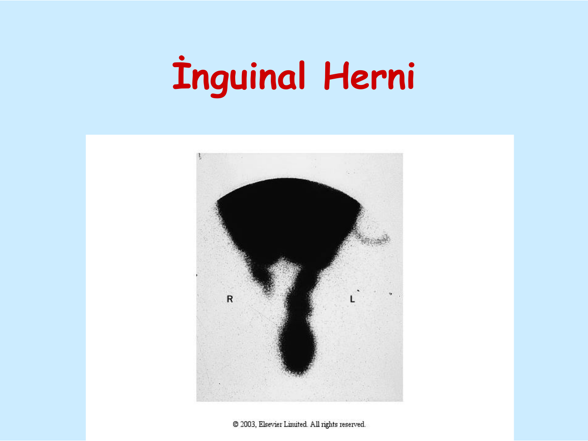

> **Tanım:** Kateterin dış çıkış yerinde **pürülan akıntı, eritem, ağrı, şişlik** ile karakterize enfeksiyondur. **Sadece eritem** olması enfeksiyon olarak kabul edilmez (travmatik/irritatif olabilir).

* En sık etkenler: **S. aureus** (nazal taşıyıcılık önemli), **Pseudomonas**
* Tedavi: **Oral antibiyotik** (sefaleksin, siprofloksasin); topikal mupirosin profilaksisi önerilir

### 3. Tünel Enfeksiyonu

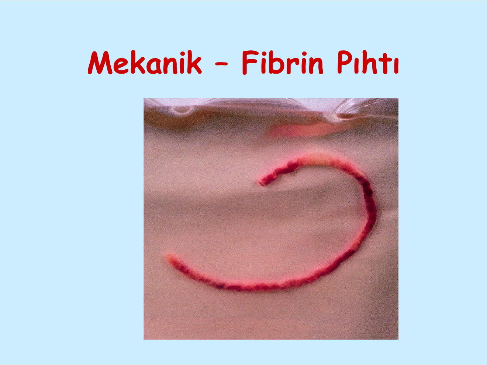

> **Tanım:** Kateterin **subkutan tüneline** yayılmış enfeksiyon. Çıkış yeri enfeksiyonunun komplikasyonu olarak gelişir. **Peritonit riski yüksektir** ve çoğunlukla **kateter değişimi** gerektirir.

* US ile tanı konulabilir
* IV antibiyotik + kateter revizyonu

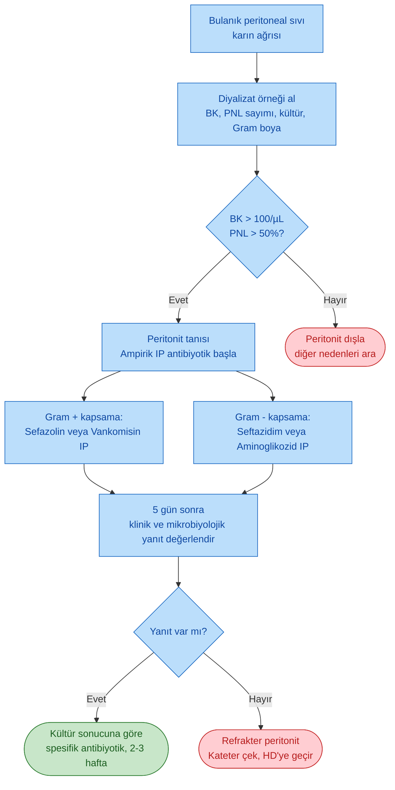
```mermaid
flowchart TD
    A[Bulanık peritoneal sıvı<br/>karın ağrısı] --> B[Diyalizat örneği al<br/>BK, PNL sayımı, kültür, Gram boya]
    B --> C{BK > 100/µL<br/>PNL > 50%?}
    C -->|Evet| D[Peritonit tanısı<br/>Ampirik IP antibiyotik başla]
    C -->|Hayır| E([Peritonit dışla<br/>diğer nedenleri ara])

    D --> F[Gram + kapsama:<br/>Sefazolin veya Vankomisin IP]
    D --> G[Gram - kapsama:<br/>Seftazidim veya Aminoglikozid IP]

    F --> H[5 gün sonra<br/>klinik ve mikrobiyolojik yanıt değerlendir]
    G --> H

    H --> I{Yanıt var mı?}
    I -->|Evet| J([Kültür sonucuna göre<br/>spesifik antibiyotik, 2-3 hafta])
    I -->|Hayır| K([Refrakter peritonit<br/>Kateter çek, HD'ye geçir])

    classDef test fill:#bbdefb,stroke:#1565c0,color:#0d47a1
    classDef diagnose fill:#c8e6c9,stroke:#2e7d32,color:#1b5e20
    classDef exclude fill:#ffcdd2,stroke:#c62828,color:#b71c1c

    class A,B,C,D,F,G,H,I test
    class J diagnose
    class E,K exclude
```

---

## KOMPLİKASYONLAR -- ENFEKSİYON DIŞI

### Mekanik Komplikasyonlar

| Komplikasyon | Mekanizma / Bulgu | Yaklaşım |
|---|---|---|
| **Kateter tıkanması** | Fibrin pıhtısı, omentum sarılması, kateter kıvrılması | Heparin, fibrinolitik lavaj; cerrahi revizyon |
| **Kateter yer değiştirmesi (migration)** | Douglas'tan üst karına çıkması | Manipülasyon, laparoskopik repozisyon |
| **Sızıntı (leak)** | Cerrahi sonrası erken diyaliz, abdominal zayıflık | 2-4 hafta PD'ye ara ver, düşük hacim |
| **Herni** (inguinal, umbilikal, insizyonel) | Karın içi basınç artışı | Cerrahi onarım |
| **Hidrotoraks** | Plevroperitoneal leak (sıklıkla sağ taraf) | Düşük hacim + APD, plöridez |
| **Dış keçe çıkması** | Erozyon, enfeksiyon | Keçe traşlama, kateter değişimi |
| **Hemoperitoneum** | Menstrüasyon (ovulasyon), travma | Gözlem; menstrüel ise genellikle benign |

### Klinik Örnekler

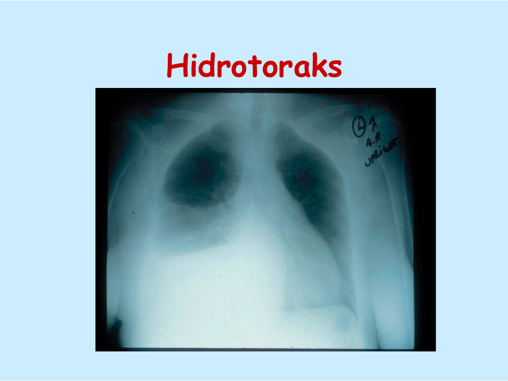

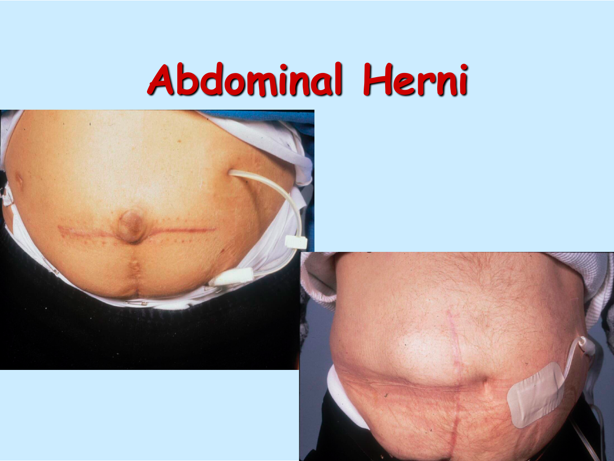

> **Görsel yorumu:** Sintigrafide karın içine verilen radyoizotop işaretli diyalizat **sağ inguinal herni boşluğuna** uzanım göstermektedir. PD hastasında **intraabdominal basınç artışı nedeniyle** daha önce asemptomatik olan herniler semptomatik hale gelebilir.

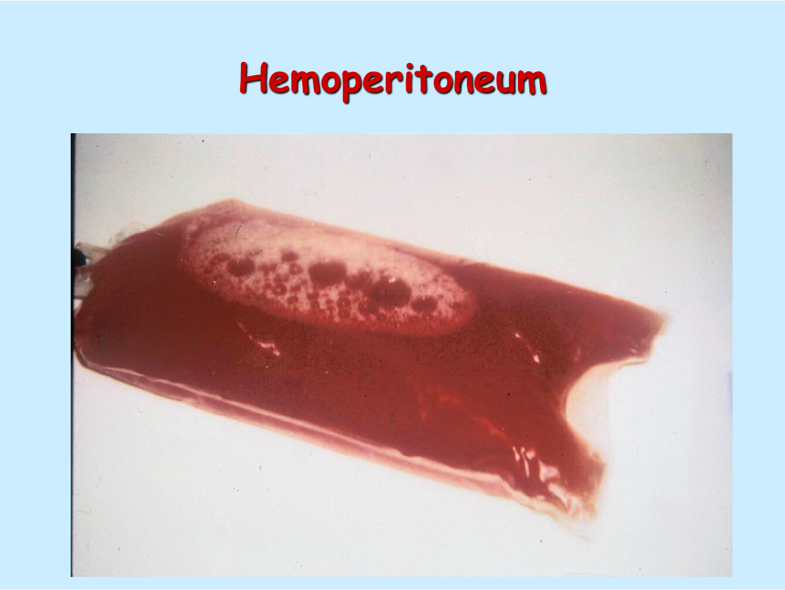

### Metabolik Komplikasyonlar

* **UF yetersizliği** (bkz. PET bölümü)
* **Diyaliz yetersizliği** (düşük Kt/V)
* **Hiperlipemi (dislipidemi)** -- sürekli glukoz yükü ile
* **Obezite** -- glukoz emilimi ile
* **Ateroskleroz** -- dislipidemi ve uremiden
* **Diyalizatta protein kaybı (10-20 g/gün)** -- hipoalbüminemi, malnütrisyon
* **Enkapsüle peritoneal skleroz (EPS)** -- uzun süreli PD'nin ender ancak ölümcül komplikasyonu (periton fibrozisi, barsak obstrüksiyonu)

---

## KONTRENDİKASYONLAR

### Mutlak Kontrendikasyonlar

* **Aktif inflamatuar barsak hastalıkları** (Crohn, ülseratif kolit aktif dönem)
* **Akut iskemik barsak hastalığı**
* **Akut divertikülit**
* **Karın içi abseler**
* **Kolostomi** (rölatif/soru işareti)
* **3. trimester gebelik**
* **Aktif depresyon**
* **Psikoz**
* **Düşük entellektüel düzey** (yardımcı yoksa)

### Kısmi / Rölatif Kontrendikasyonlar

* **Karın içi yapışıklıklar** (önceki batın cerrahisi)
* **Herniler** (onarılmamış)
* **Semptomatik KOAH** (karın içi basınç artışı diyafragmayı zorlar)
* **Malnütrisyon**
* **Şiddetli hipertrigliseridemi**
* **Evsizlik / barınma sorunu**
* **1 ay içinde planlı renal Tx**
* **Kötü hijyenik alışkanlıklar**
* **Demans**
* **Uyumsuzluk (noncompliance)**

---

## PD VS HD TERCİH MATRİSİ

| HD'de Daha İyi | HD Eğilimi | PD Eğilimi | PD'de Daha İyi |
|---|---|---|---|
| Ciddi inflamatuar barsak hastalığı | Bağımlı yaşam tarzı | Bağımsız yaşam tarzı | Unstabil vasküler hastalık |
| Aktif divertikülit / iskemik barsak hastalığı | Demans | **Kardiyovasküler hastalık** | **Vasküler akses sorunu** |
| Düşük entellektüel kapasite (yardımcı yok) | Kötü hijyen | **Rezidüel renal fonksiyon** | **5 yaş altı** (pediatrik) |
| Psikotik bozukluk | Batın operasyonları | Bulaşıcı hastalık (Hep B/C/HIV) | Genç diyabetik |
| Evsiz | Ciddi herni | Seyahat gereksinimi | Bağımsızlık isteği |
| Çözülemeyen PD komplikasyonu | Ciddi diyabetik gastroparezi | -- | Merkeze uzak yaşam |
| -- | Sık tedavi değişikliği | -- | Çözülemeyen HD komplikasyonu |

> **Önemli:** **Kardiyovasküler instabil hastalar (ör. ileri kalp yetmezliği)** ve **vasküler akses sorunu olan hastalar** PD için **daha iyi adaylardır**; çünkü PD'de ani volüm ve hemodinamik değişiklikler HD'ye göre çok daha azdır.

---

## PD AVANTAJLARI VE DEZAVANTAJLARI

### Periton Diyalizinin Avantajları

1. **Bağımsızlık ve seyahat özgürlüğü**
2. **Sürekli tedavi** → daha stabil biyokimya ve volüm kontrolü
3. **Daha serbest diyet ve sıvı alımı**
4. **Daha aktif ve kaliteli yaşam** (evde tedavi)
5. **Daha iyi kan basıncı regülasyonu**
6. **Rezidüel renal fonksiyon daha iyi korunur** (HD'ye göre belirgin avantaj)
7. **Aneminin kontrolü daha kolay** (EPO ihtiyacı daha az)
8. **Daha iyi kalsiyum-fosfor dengesi**
9. **Daha başarılı renal transplantasyon** (greft sağkalımı)
10. **Hepatit insidansı daha düşük** (vasküler giriş yok)

### Periton Diyalizinin Dezavantajları

1. **Peritonit atakları**
2. **Teknik kullanım süresinin düşüklüğü** (ortalama 5-7 yıl sonra membran yetmezliği)
3. **Kateterle ilgili problemler** (tıkanma, enfeksiyon, yer değiştirme)
4. **Protein kayıpları** (10-20 g/gün)
5. **Metabolik komplikasyonlar** (dislipidemi, obezite, hiperglisemi)

---

## KLİNİK VAKA ÖRNEKLERİ

**📋 VAKA ÖRNEĞİ 1: Refrakter UF Yetersizliği**

**Hasta:** 58 yaşında kadın, 4 yıldır SAPD, DM nedenli SDBY
**Öykü:** Son 3 aydır **kilo artışı (+4 kg)**, **bacaklarda ödem**, **nefes darlığı**. Glukoz %4,25'e çıkıldı ancak UF hala yetersiz.
**Fizik muayene:** TA 160/95 mmHg, pretibial ++/++ ödem, akciğerde bazallerde ral
**Laboratuvar:** Albumin 3,2 g/dL, BUN 75, Kr 9, HCO₃⁻ 19
**Yaklaşım:**

* **PET testi yapılır** -- sonuç: **High transport, D/P Cr = 0,85**
* **Tip I UF kaybı** tanısı (hızlı glukoz emilimi, hiperpermeabl membran)
* **Gündüz uzun bekleme için icodextrin (Extraneal)** eklenir
* Rezidüel idrar çıkımı değerlendirilir; 2 kg kilo kaybı sonrası ödem geriler

**Öğretici Notlar:**

1. **Her PD hastasında yılda 1 kez PET yapılmalıdır.**
2. UF yetersizliğinde **önce hasta uyumu, sıvı alımı** sorgulanır; sonra PET ve kateter değerlendirilir.
3. **Icodextrin, Tip I UF kaybının tedavisinde standarttır.**

---

**📋 VAKA ÖRNEĞİ 2: PD Peritoniti**

**Hasta:** 45 yaşında erkek, 2 yıldır SAPD, hipertansif nefropati
**Öykü:** Dün akşamdan beri **bulanık boşaltma sıvısı**, karın ağrısı, hafif bulantı
**Fizik muayene:** Ateş 37,8°C, karında diffüz hassasiyet, peritonitik defans yok
**Laboratuvar (diyalizat):** BK = **850/µL**, %85 PNL, Gram boyama negatif
**Yaklaşım:**

* Peritonit tanısı (BK > 100, PNL > %50, bulanık sıvı)
* Diyalizat kültürü alınır (aerob + anaerob + mantar)
* **Ampirik IP antibiyotik başlanır:**
  * **Sefazolin 1 g/torba** (Gram +) + **Seftazidim 1 g/torba** (Gram -)
* 3 gün sonra kültürde **koagülaz negatif stafilokok** ürer (metisilin duyarlı)
* Sefazolin ile tedavi **2 hafta** tamamlanır

**Öğretici Notlar:**

1. **Bulanık diyalizat** peritonitin **en önemli erken bulgusudur**.
2. Ampirik tedavide **hem Gram (+) hem Gram (-) kapsama şarttır**.
3. **İntraperitoneal (IP)** verim **IV'ye göre eşit veya üstündür**.
4. Koagülaz negatif stafilokoklar en sık etken olmakla birlikte genellikle **iyi prognozludur**.

---

**📋 VAKA ÖRNEĞİ 3: PD Adayı Seçimi -- Kardiyak Hasta**

**Hasta:** 72 yaşında erkek, iskemik kalp yetmezliği (EF %25), KBH evre 5, başlangıç RRT gerekiyor
**Öykü:** Tekrarlayan hipervolemi, AV fistül açılamıyor (damar yapısı kötü), HD seansında hipotansiyon
**Yaklaşım:**

* **PD tercih edilir:**
  * Ani hemodinamik değişiklik olmaz
  * Sürekli, nazik UF sağlar
  * Vasküler akses gerekmez
  * Rezidüel renal fonksiyonu koruyor
* Hasta ve eşine PD eğitimi verilir, SAPD başlanır

**Öğretici Notlar:**

1. **Kardiyak instabilite, vasküler akses sorunu, yaşlılık** PD için **güçlü endikasyonlardır**.
2. Assisted PD (yardımlı PD) yaşlı ve demans olan hastalarda geçerli bir seçenektir.

---

## SONUÇ

* **Periton diyalizi, renal replasman tedavi seçeneklerinden biridir.**
* **Hemodiyalize benzer hasta sağkalımı** sağlar (özellikle ilk 2-3 yıl).
* **Ev bazlı tedavi olması** nedeniyle **yaşam kalitesi artmıştır**.
* **Rezidüel renal fonksiyonu daha iyi korur**, **kardiyovasküler instabilite ve vasküler akses sorunu olan hastalarda tercih edilir**.
* **En önemli komplikasyonları** peritonit ve uzun dönemde periton membran yetmezliğidir.
* **Yeni nesil biyokompatibl solüsyonlar (nötr pH, düşük GDP, icodextrin, amino asit)** periton membranını ve teknik sağkalımı iyileştirmiştir.

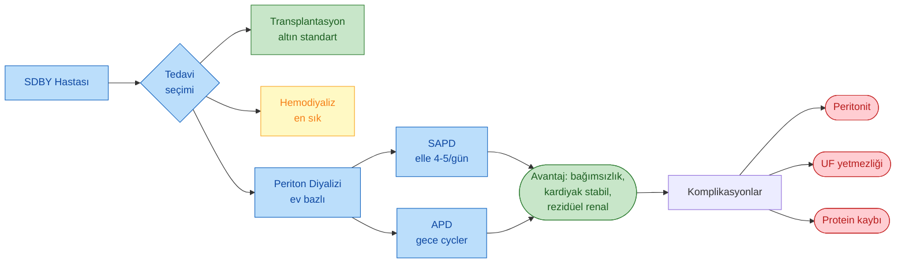
```mermaid
flowchart LR
    A[SDBY Hastası] --> B{Tedavi<br/>seçimi}
    B --> C[Transplantasyon<br/>altın standart]
    B --> D[Hemodiyaliz<br/>en sık]
    B --> E[Periton Diyalizi<br/>ev bazlı]

    E --> F[SAPD<br/>elle 4-5/gün]
    E --> G[APD<br/>gece cycler]

    F --> H([Avantaj: bağımsızlık,<br/>kardiyak stabil,<br/>rezidüel renal])
    G --> H

    H --> I[Komplikasyonlar]
    I --> J([Peritonit])
    I --> K([UF yetmezliği])
    I --> L([Protein kaybı])

    classDef main fill:#bbdefb,stroke:#1565c0,color:#0d47a1
    classDef good fill:#c8e6c9,stroke:#2e7d32,color:#1b5e20
    classDef bad fill:#ffcdd2,stroke:#c62828,color:#b71c1c
    classDef warn fill:#fff9c4,stroke:#f9a825,color:#f57f17

    class A,B,E,F,G main
    class C,H good
    class J,K,L bad
    class D warn
```

---

**Kaynak:** Prof. Dr. Yavuz Yeniçerioğlu -- ADÜ Tıp Fakültesi Nefroloji Bilim Dalı Ders Notu
**Referans veriler:** Türkiye 2023 Yılı Ulusal Nefroloji, Diyaliz ve Transplantasyon Kayıt Sistemi Raporu
