# POLİKİSTİK BÖBREK HASTALIĞI VE TOLVAPTAN TEDAVİSİ

**Hazırlayan:** Prof. Dr. Hakan Akdam
**Bölüm:** Aydın Adnan Menderes Üniversitesi -- Nefroloji Bilim Dalı

---

## İÇİNDEKİLER

1. [Otozomal Dominant Polikistik Böbrek Hastalığı (ODPKBH)](#otozomal-dominant-polikistik-böbrek-hastalığı-odpkbh)
2. [Genetik ve Mutasyonlar](#genetik-ve-mutasyonlar)
3. [İki Vuruş Hipotezi (Double Hit)](#iki-vuruş-hipotezi-double-hit)
4. [Patogenez](#patogenez)
5. [Sistemik (Ekstrarenal) Hastalık](#sistemik-ekstrarenal-hastalık)
6. [Klinik Bulgular](#klinik-bulgular)
7. [Tanı -- Ravine (Pei-Ravine) Kriterleri](#tanı--ravine-pei-ravine-kriterleri)
8. [ODPKBH'nın Epidemiyolojik Önemi](#odpkbhnın-epidemiyolojik-önemi)
9. [ADH Etkisi ve Patofizyolojik Zemin](#adh-etkisi-ve-patofizyolojik-zemin)
10. [Tolvaptan -- Gelişim Tarihi](#tolvaptan--gelişim-tarihi)
11. [Tolvaptan Farmakolojik Özellikleri](#tolvaptan-farmakolojik-özellikleri)
12. [Tolvaptan Etki Mekanizması](#tolvaptan-etki-mekanizması)
13. [TEMPO 3:4 Çalışması](#tempo-34-çalışması)
14. [TEMPO 4:4 Uzatma Çalışması](#tempo-44-uzatma-çalışması)
15. [REPRISE Çalışması](#reprise-çalışması)
16. [SDBH Uzatma Etkisi](#sdbh-uzatma-etkisi)
17. [İkincil Faydalar (Ağrı, Hematüri, ÜSİ, HT)](#ikincil-faydalar-ağrı-hematüri-üsi-ht)
18. [Mayo Klinik Sınıflaması (Total Böbrek Volümü)](#mayo-klinik-sınıflaması-total-böbrek-volümü)
19. [Kılavuzlarda Hızlı İlerleme Kriterleri](#kılavuzlarda-hızlı-ilerleme-kriterleri)
20. [Çok Su İçme Faydalı mı?](#çok-su-içme-faydalı-mı)
21. [Tolvaptan Yan Etkileri ve Güvenlik](#tolvaptan-yan-etkileri-ve-güvenlik)
22. [Hepatotoksisite İzlem Algoritması](#hepatotoksisite-izlem-algoritması)
23. [TNF Dernek Önerileri (ODPBH Genel Yönetimi)](#tnf-dernek-önerileri-odpbh-genel-yönetimi)

---

## OTOZOMAL DOMİNANT POLİKİSTİK BÖBREK HASTALIĞI (ODPKBH)

> **Tanım:** Otozomal dominant polikistik böbrek hastalığı (ODPKBH / ADPKD), böbrek tübüllerinden köken alan çok sayıda **kistin** zamanla büyüyerek böbrek parankimini tahrip ettiği **sistemik, kalıtsal** bir hastalıktır.

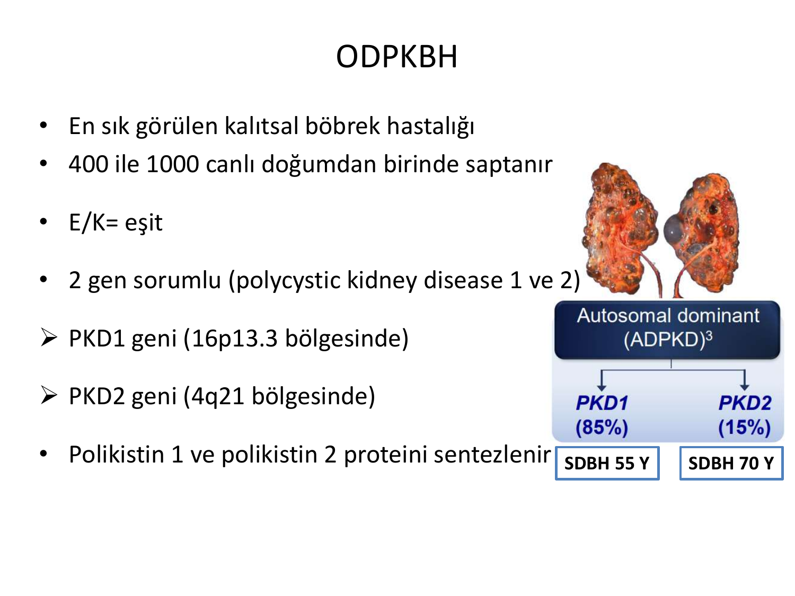

> **Şema yorumu:** Görselde normal ile karşılaştırmalı olarak ODPKBH böbreği (çok sayıda değişik boyutta kist) gösterilmektedir. Sağda otozomal dominant kalıtım paterni; iki ana genin (**PKD1** ve **PKD2**) hastalığa yol açtığı ve **son dönem böbrek hastalığına (SDBH) ortalama varış yaşının** PKD1 için ~55, PKD2 için ~70 yıl olduğu vurgulanır.

### Epidemiyoloji

* **En sık görülen kalıtsal böbrek hastalığıdır.**
* **1:400 -- 1:1000** canlı doğumda saptanır.
* **Erkek / Kadın = eşit** görülme sıklığı.
* Dünyada milyonlarca hastayı etkiler; **SDBH'ye gidişin 4. sıradaki en sık nedeni** konumundadır (Türkiye registry verileri).

---

## GENETİK VE MUTASYONLAR

### Hastalıktan Sorumlu Genler

| Gen | Lokus | Kodlanan Protein | Prevalans | Klinik Seyir |
|---|---|---|---|---|
| **PKD1** | 16p13.3 | **Polikistin-1** (membran reseptörü) | ~%85 | Daha **erken** başlayan, **ağır** seyir -- SDBH ~55 yaş |
| **PKD2** | 4q21 | **Polikistin-2** (Ca²⁺ iyon kanalı) | ~%15 | Daha **geç** ve **hafif** seyir -- SDBH ~70 yaş |
| GANAB, DNAJB11, PKD3 | -- | Nadir varyantlar | <%1 | Atipik fenotip |

### Polikistin Proteinlerinin İşlevi

* **Polikistin-1 (PC1):** Hücre içi sinyal iletiminde görev alan büyük bir **membran reseptörüdür**. Hücre-hücre ve hücre-matriks etkileşimlerini düzenler.
* **Polikistin-2 (PC2):** **Kalsiyum iyon kanalı / poru** olarak işlev görür. TRP ailesinden non-selektif katyon kanalıdır.
* **PC1 ve PC2'nin sitoplazmadaki karboksil terminal uçları** birbiri ile **etkileşim halindedir**; birlikte primer silyumda işlev gören bir **kompleks** oluştururlar.

> **Patogenez özünde:** Herhangi bir polikistinin sentezindeki azalma, tübül hücresinde **kalsiyum homeostazını** bozar, hücre içi **Ca²⁺ sunumu artar ve paradoksal olarak cAMP yolağı aktive olur**.

---

## İKİ VURUŞ HİPOTEZİ (DOUBLE HİT)

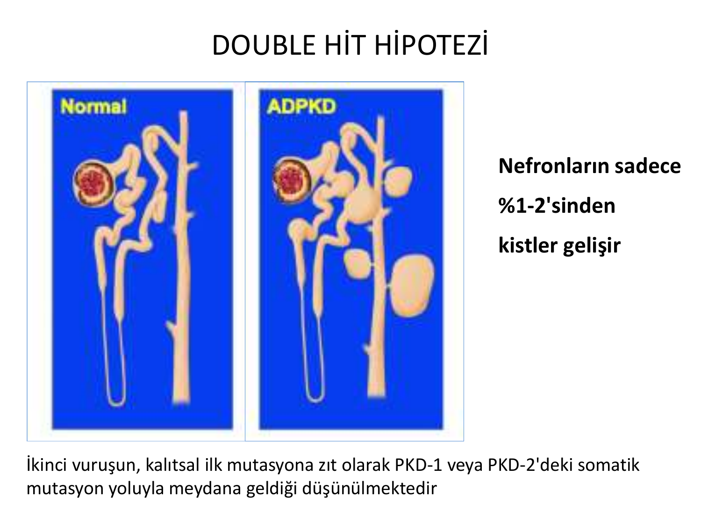

> **Şema yorumu:** Hasta, **her hücresinde kalıtsal (germline) heterozigot PKD-1 veya PKD-2 mutasyonu** ile doğar. Ancak kist oluşması için **ikinci somatik mutasyonun** (ikinci vuruş) aynı genin diğer alleli üzerinde edinilmesi gerekir. Bu **Knudson tipi iki-vuruş** modeli, nefronların neden sadece **%1-2'sinde** kist geliştiğini açıklar; diğer nefronlar tek sağlam allel ile normal işleyişini sürdürür.

**Sonuç:**
- Doğumda tüm hücreler tek mutant allele sahiptir.
- Yaşam boyu az sayıda tübül hücresinde **somatik "ikinci vuruş"** birikir.
- Bu ender hücrelerden klonal genişleme ile kist oluşur; bu nedenle kistler **yıllar içinde** ortaya çıkar.

---

## PATOGENEZ

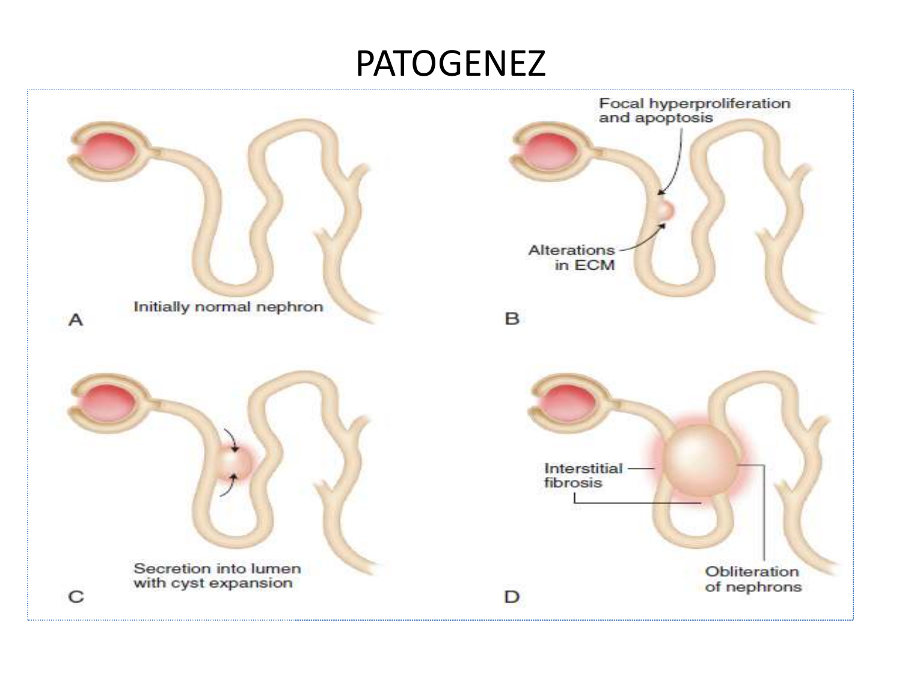

> **Şema yorumu:** Dört aşamalı kist gelişimi:
> - **A.** Başlangıçta normal nefron (tek germline mutasyon, işlev korunmuş).
> - **B.** İkinci vuruş sonrası **fokal hiperproliferasyon**, apoptoz artışı ve **ekstraselüler matriks (ECM) değişiklikleri** başlar.
> - **C.** Tübül lümenine **aktif sıvı sekresyonu** ile kist genişler; başlangıçta tübüle bağlı olan kist, zamanla tübülden ayrılır.
> - **D.** Büyüyen kistler komşu nefronları sıkıştırır; **interstisyel fibroz** ve **nefron obliterasyonu** gelişir → GFH düşer.

### PKD1/PKD2 Mutasyonundan Kiste Giden Yolak

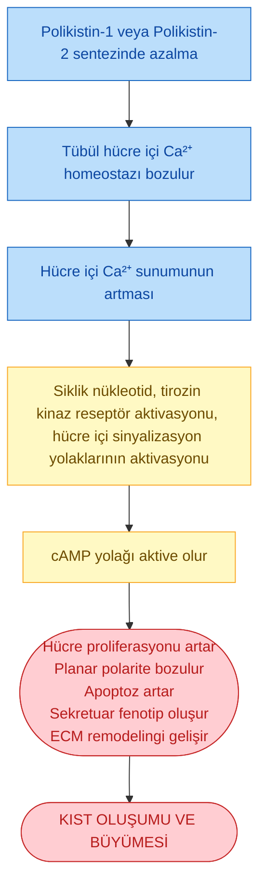
```mermaid
flowchart TD
    A[Polikistin-1 veya Polikistin-2 sentezinde azalma] --> B[Tübül hücre içi Ca²⁺ homeostazı bozulur]
    B --> C[Hücre içi Ca²⁺ sunumunun artması]
    C --> D[Siklik nükleotid, tirozin kinaz reseptör aktivasyonu, hücre içi sinyalizasyon yolaklarının aktivasyonu]
    D --> E[cAMP yolağı aktive olur]
    E --> F([Hücre proliferasyonu artar<br/>Planar polarite bozulur<br/>Apoptoz artar<br/>Sekretuar fenotip oluşur<br/>ECM remodelingi gelişir])
    F --> G([KIST OLUŞUMU VE BÜYÜMESİ])

    classDef trigger fill:#bbdefb,stroke:#1565c0,color:#0d47a1
    classDef process fill:#fff9c4,stroke:#f9a825,color:#6d4c00
    classDef outcome fill:#ffcdd2,stroke:#c62828,color:#b71c1c
    class A,B,C trigger
    class D,E process
    class F,G outcome
```

---

## SİSTEMİK (EKSTRARENAL) HASTALIK

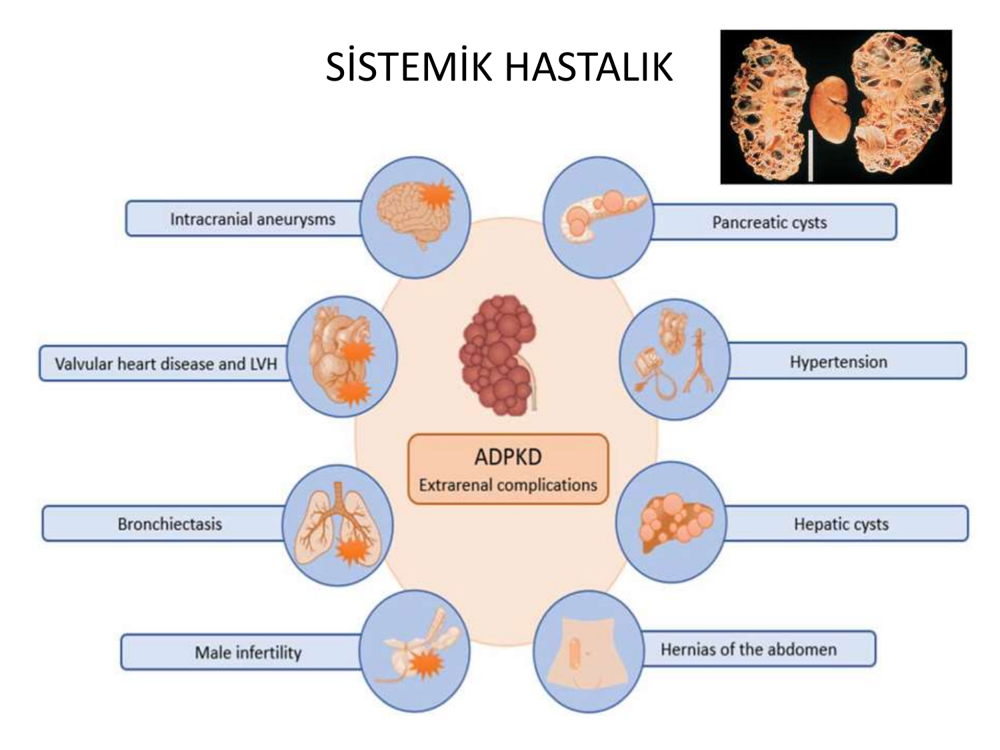

> **Şema yorumu:** ODPKBH **yalnızca böbrekle sınırlı olmayan, çok sistemli bir hastalıktır**. Görselde merkezdeki ADPKD böbreğinin çevresinde sekiz ana ekstrarenal bulgu gösterilmektedir:
> - **İntrakraniyal anevrizma** (Intracranial aneurysms)
> - **Pankreatik kistler** (Pancreatic cysts)
> - **Hipertansiyon** (Hypertension) -- en erken ve en sık sistemik bulgu
> - **Hepatik kistler** (Hepatic cysts) -- en sık ekstrarenal bulgu (%80-85)
> - **Abdominal herniler** (Hernias of the abdomen) -- inguinal, umbilikal
> - **Erkek infertilitesi** (Male infertility) -- sperm anomalileri
> - **Bronşiektazi** (Bronchiectasis)
> - **Kapak hastalığı ve LVH** (Valvular heart disease and LVH) -- özellikle mitral valv prolapsusu

### Ekstrarenal Bulguların Sıklığı ve Klinik Önemi

| Sistem | Bulgu | Sıklık / Not |
|---|---|---|
| **Karaciğer** | Hepatik kistler | **%80-85** (en sık) -- genellikle asemptomatik |
| **SSS** | İntrakraniyal anevrizma | **%8-10** -- aile öyküsü varsa MR anjiyografi ile tara |
| **Kardiyovasküler** | Mitral valv prolapsusu | ~%25 |
| **Kardiyovasküler** | Sol ventrikül hipertrofisi (LVH) | HT zemininde sık |
| **Genito-üriner** | Erkek infertilitesi (sperm anomalileri, seminal vezikül kistleri) | Nadir ama tanımlanmış |
| **Gastrointestinal** | Divertikülozis, inguinal/umbilikal herni | Sık |
| **Pankreas/Dalak** | Pankreatik ve splenik kistler | %5-10 |
| **Solunum** | Bronşiektazi | Daha az sıklıkta |

> **⚠️ Önemli:** İntrakraniyal anevrizma aile öyküsü olan veya mesleki risk taşıyan (pilot, dalgıç) hastalarda **MR anjiyografi ile tarama** önerilir. Rüptür mortalitesi yüksektir.

---

## KLİNİK BULGULAR

**Renal bulgular:**

* **Yan ağrısı / abdominal kitle** (büyüyen böbrekler)
* **Hematüri** -- kist rüptürü veya taş ile
* **Hipertansiyon (%50-70)** -- erken bulgu, GFH normal iken başlayabilir
* **Kist enfeksiyonu / piyelonefrit** -- tedavisi güç
* **Taş (%20)** -- sıklıkla **ürik asit** taşı, idrar stazı ve asidik idrar nedeniyle
* **Kronik böbrek hastalığı** ve **son dönem böbrek hastalığı (SDBH)** -- 65 yaşa kadar ~%50

**Ekstrarenal bulgular:** yukarıdaki tabloya bakınız.

---

## TANI -- RAVİNE (PEI-RAVİNE) KRİTERLERİ

> **Tanım:** Aile öyküsü pozitif olgularda **renal ultrasonografi (USG)** temelli Ravine/Pei-Ravine kriterleri tanı için standarttır. **Ucuz ve non-invazivdir** ve ilk seçenek görüntüleme olmalıdır.

### Aile Öyküsü Pozitif ise USG Tanı Kriterleri

| Yaş Grubu | Tanı için Gerekli Kist Sayısı |
|---|---|
| **15-39 yaş** | Tek taraflı veya iki taraflı **toplam ≥3 kist** |
| **40-59 yaş** | **Her böbrekte ≥2 kist** |
| **≥60 yaş** | **Her böbrekte ≥4 kist** |

### Diğer Tanısal Yaklaşımlar

* **MRG:** 30 yaş altında **>10 kist** saptanması tanısaldır (USG duyarlılığı bu yaşta yetersiz kalabilir).
* **BT:** Komplikasyon (kist enfeksiyonu, rüptür, taş) değerlendirmesinde.
* **MR -- Total Böbrek Volümü (TKV) ölçümü:** Prognoz ve Mayo sınıflaması için.
* **Genetik test:** Kesin tanı gerekli ise (potansiyel canlı donör, belirsiz vakalar, pre-implantasyon genetik tanı).

---

## ODPKBH'NIN EPİDEMİYOLOJİK ÖNEMİ

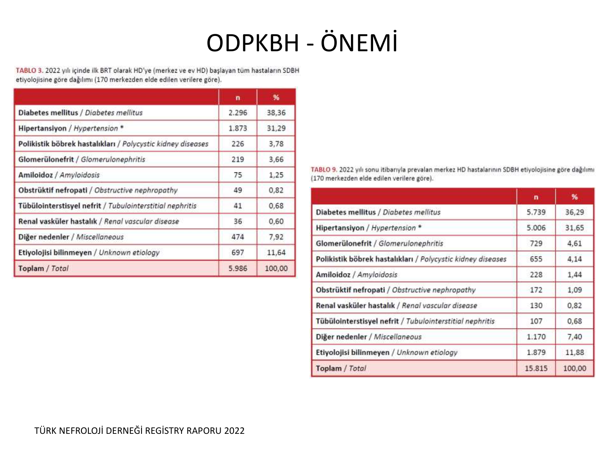

> **Tablo yorumu (TND Registry 2022):** Türkiye'de hemodiyaliz (HD) ve periton diyalizi (PD) hastalarında SDBH nedenleri arasında **polikistik böbrek hastalıkları** önemli bir yer tutar:
> - **HD hastalarında:** Polikistik böbrek hastalıkları **%5,78** (sık ilk 3-4 neden arasında)
> - **PD hastalarında:** **%5,16**
> - Diabetes mellitus, hipertansiyon ve glomerülonefritten sonra en sık kalıtsal neden **ODPKBH**'dir.

ODPKBH, **önlenebilir bir SDBH nedeni** olarak karşımıza çıktığından erken tanı ve **hastalık-modifiye eden tedavi (tolvaptan)** büyük önem taşır.

---

## ADH ETKİSİ VE PATOFİZYOLOJİK ZEMİN

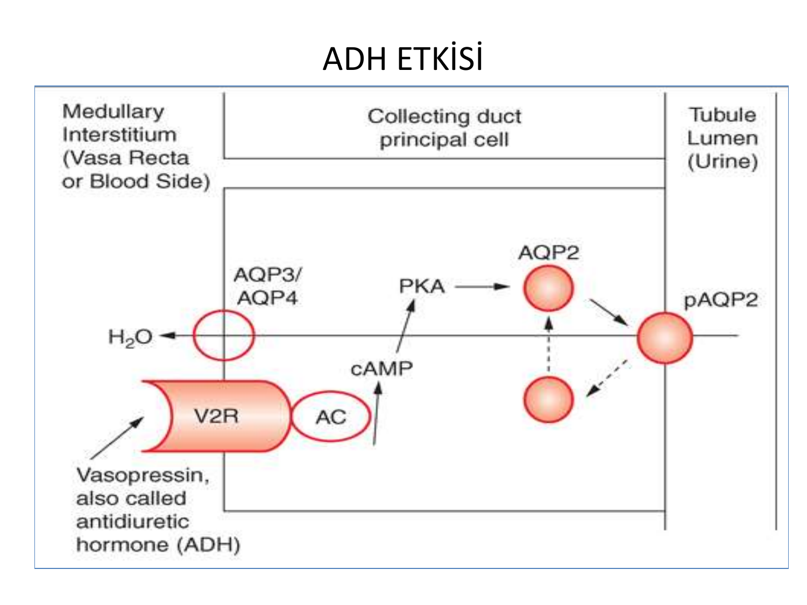

> **Şema yorumu:** Toplayıcı kanal prinsipal hücresinde ADH (vazopresin) bazolateral membrandaki **V2 reseptörüne** bağlanır. Bu, adenil siklaz (AC) enzimini aktive ederek **cAMP** üretir; cAMP → **protein kinaz A (PKA)** → sitoplazmik vezikül havuzundan **AQP2 (akuaporin-2)** su kanallarının apikal membrana translokasyonunu sağlar. Bazolateral tarafta ise AQP3/AQP4 su geri emilimini tamamlar. **ODPKBH'da bu yolağın aşırı aktif olması patolojik kist büyümesine yol açar.**

### ODPKBH'da ADH'ın Rolü

* Normal kişilerde dolaşımda **vazopresin sürekli** olarak bulunur. ODPKBH'da **vazopresin düzeyi yüksektir**.
* **Kusurlu osmoregülasyon** ODPKBH'nın **erken bir belirtisidir**; vazopresine direnç ve bozulmuş salınım vardır.
* ODPKBH'daki tübüler hücrelerdeki **azalmış hücre içi Ca²⁺** ve **V2R'nin anormal uyarımı** nedeniyle **cAMP düzeyi patolojik olarak yükselir**.
* Vazopresin cAMP sinyalizasyonunu arttırarak **kiste sıvı salınımına** ve yüzey hücrelerinin **proliferasyonuna** yol açar.
* **V2R'yi bloke etmek** kistik dokularda cAMP'yi düşürür, böbrek kistik progresyonunu yavaşlatır ve preklinik modellerde böbrek fonksiyonunu iyileştirir.

### V2R Blokajının Kistojenik Sürece Etkisi

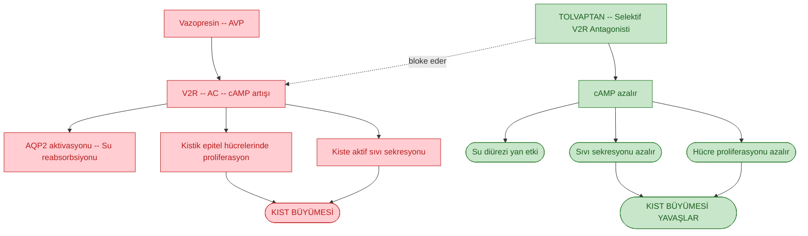
```mermaid
flowchart TD
    A[Vazopresin -- AVP] --> B[V2R -- AC -- cAMP artışı]
    B --> C[AQP2 aktivasyonu -- Su reabsorbsiyonu]
    B --> D[Kistik epitel hücrelerinde proliferasyon]
    B --> E[Kiste aktif sıvı sekresyonu]
    D --> F([KIST BÜYÜMESİ])
    E --> F

    G[TOLVAPTAN -- Selektif V2R Antagonisti] -.bloke eder.-> B
    G --> H[cAMP azalır]
    H --> I([Su diürezi yan etki])
    H --> J([Sıvı sekresyonu azalır])
    H --> K([Hücre proliferasyonu azalır])
    J --> L([KIST BÜYÜMESİ YAVAŞLAR])
    K --> L

    classDef bad fill:#ffcdd2,stroke:#c62828,color:#b71c1c
    classDef good fill:#c8e6c9,stroke:#2e7d32,color:#1b5e20
    classDef drug fill:#bbdefb,stroke:#1565c0,color:#0d47a1
    class A,B,C,D,E,F bad
    class G,H,I,J,K,L good
```

---

## TOLVAPTAN -- GELİŞİM TARİHİ

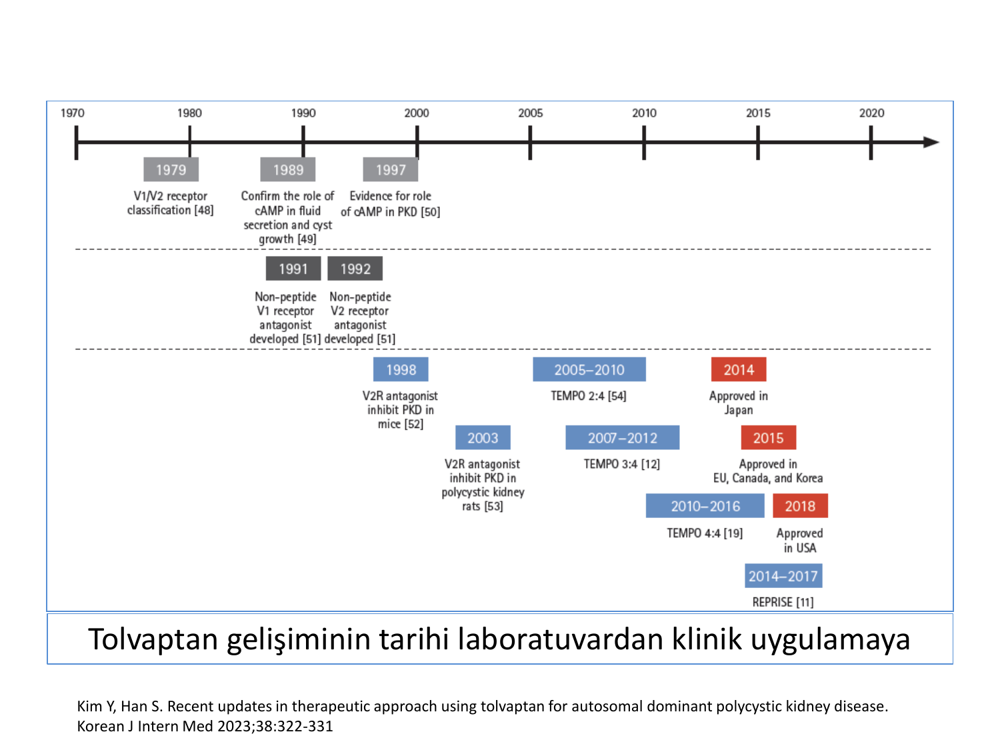

> **Şema yorumu:** Laboratuvardan klinik uygulamaya yolculuk:
> - **1979 -- 1989:** V1/V2 reseptör tanımı ve cAMP'nin kist sıvı sekresyonundaki rolünün gösterilmesi.
> - **1991 -- 1992:** İlk non-peptid V1 ve V2 reseptör antagonistlerinin geliştirilmesi.
> - **1998 -- 2003:** V2R antagonistlerinin fare ve sıçan PKD modellerinde etkinliğinin gösterilmesi.
> - **2005 -- 2016:** TEMPO 2:4, **TEMPO 3:4**, TEMPO 4:4 ve **REPRISE** klinik çalışmaları.
> - **2014:** Japonya'da onay -- **2015:** AB, Kanada, Kore -- **2018:** ABD onayı.

---

## TOLVAPTAN FARMAKOLOJİK ÖZELLİKLERİ

| Özellik | Değer / Açıklama |
|---|---|
| Sınıf | **Selektif V2 reseptör antagonisti** |
| V2R afinite oranı (V2/V1) | **~2 kat** (V2 seçici) |
| Emilim | Hızlı; **oral biyoyararlanım ~%40** |
| Besinle etkileşim | **Etkilenmez** (aç/tok fark etmez) |
| Yarılanma ömrü | **12 saat** |
| Metabolizma | **Sitokrom P450 (CYP3A4)** |
| Atılım yolu | Ağırlıkla **feçes** |
| Renal yetersizlikte kullanım | **GFH < 10 mL/dk** → **kullanılmamalıdır** |

> **⚠️ İlaç etkileşimleri:** Güçlü CYP3A4 inhibitörleri (ketokonazol, itrakonazol, klaritromisin, simvastatin, greyfurt suyu) kontrendikasyon oluşturur; orta dereceli inhibitörlerle doz azaltımı gerekir.

---

## TOLVAPTAN ETKİ MEKANİZMASI

Tolvaptan, böbrek toplayıcı kanal prinsipal hücresinde bazolateral **V2 reseptörüne** bağlanarak vazopresinin etkisini **kompetitif olarak** bloke eder:

* **cAMP üretimi azalır** → kistik epitelde proliferasyon azalır.
* **Kist lümenine aktif sıvı sekresyonu azalır.**
* **AQP2 translokasyonu azaldığı için serbest su itrahı artar** → **akuaretik (sulu diürez)** etki.
* Net klinik sonuç: **kist büyümesi yavaşlar, GFH kaybı yavaşlar.**

---

## TEMPO 3:4 ÇALIŞMASI

> **"Tolvaptan in patients with autosomal dominant polycystic kidney disease"** (Torres VE ve ark., NEJM 2012)

### Tasarım

* **Faz 3, çok merkezli, çok uluslu, plasebo kontrollü randomize klinik çalışma**
* **Dahil etme:** 18 -- 50 yaş, **GFH ≥ 60 mL/dk**, **böbrek volümü (BV) > 750 mL**
* **Randomizasyon:** Tolvaptan : Plasebo = **2 : 1**
* **Hasta sayısı:** **1445** hasta
* **Takip süresi:** **3 yıl**
* **Doz titrasyonu (haftalık artım):** 45 + 15 mg → 60 + 30 mg → **90 + 30 mg** (sabah + akşam)

### Birincil Sonlanımlar (Plasebo'ya karşı Tolvaptan)

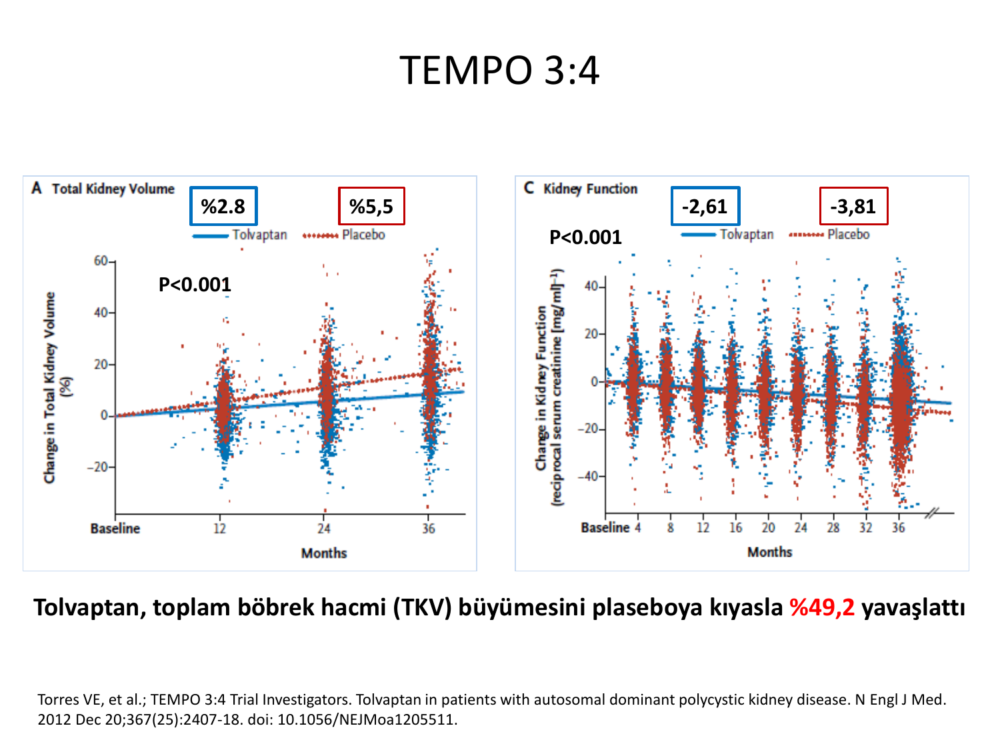

> **Grafik yorumu:** İki panelde 3 yıllık değişim:
> - **A. Total Kidney Volume (TKV):** Yıllık büyüme oranı **tolvaptanda %2,8 vs plaseboda %5,5** (P < 0.001). **Tolvaptan TKV büyümesini %49,2 oranında yavaşlattı.**
> - **C. Kidney Function (eGFR):** Yıllık eGFR değişimi **tolvaptanda -2,61 vs plaseboda -3,81 mL/dk/1,73m²** (P < 0.001). Böbrek fonksiyon kaybı anlamlı şekilde yavaşladı.

| Sonlanım | Tolvaptan | Plasebo | Fark |
|---|---|---|---|
| Yıllık TKV artışı | **%2,8** | **%5,5** | **%49,2 yavaşlama** (P < 0.001) |
| eGFR değişimi (resiprokal kreatinin temelli) | **−2,61** / yıl | **−3,81** / yıl | Anlamlı koruma (P < 0.001) |

### Çalışmayı Tamamlama Oranı

* Tolvaptan kolunda **740 (%77,0)** hasta çalışmayı tamamladı.
* Plasebo kolunda **417 (%86,2)** hasta tamamladı.
* Tolvaptan kolundaki yüksek bırakma oranı, ağırlıkla **akuaretik yan etkilere (poliüri, noktüri, susuzluk)** ve karaciğer enzim yüksekliğine bağlıdır.

---

## TEMPO 4:4 UZATMA ÇALIŞMASI

> **"Multicenter, open-label, extension trial"** (Torres VE ve ark., Nephrol Dial Transplant 2018)

### Tasarım

* **Uzatılmış, açık etiketli** uzatma çalışması
* **871 hasta** dahil edildi
* **Ek 2 yıl takip** (TEMPO 3:4 sonrası)
* Amaç: **Erken vs geç tolvaptan başlamanın** uzun dönem etkinlik ve güvenlik karşılaştırması

### Toplam Böbrek Volüm Büyümesi

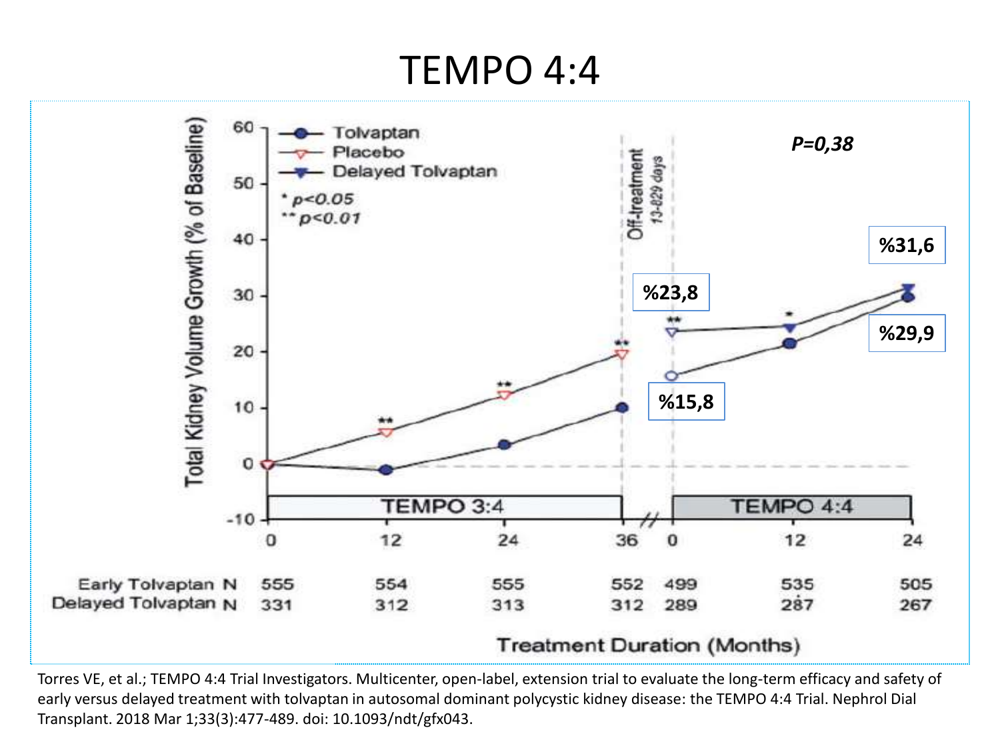

> **Grafik yorumu:** TEMPO 3:4 fazında erken tolvaptan grubunda TKV büyümesi **%15,8**, gecikmiş (plasebo → tolvaptan) grupta **%23,8** saptandı. TEMPO 4:4 uzatmasında **iki grup arasındaki fark kapandı (%31,6 vs %29,9; P = 0,38)**; yani gecikmiş başlama yetişebildi fakat **önceki yıllarda kaybedilen volüm farkı kalıcı** oldu.

### eGFR Değişimi (TEMPO 4:4)

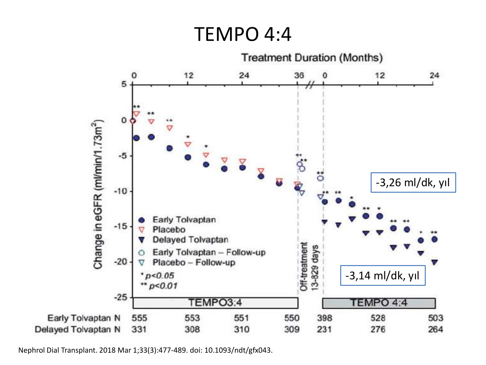

> **Grafik yorumu:** Uzatma çalışması boyunca eGFR yıllık düşüşü iki grupta benzerdi (erken −3,26, gecikmiş −3,14 mL/dk/yıl); **tolvaptana geçildikten sonra her iki grupta da düşüş yavaşlamaktadır**.

**Ana mesaj:** **Tolvaptan ne kadar erken başlanırsa, korunan böbrek fonksiyonu o kadar fazla**; gecikmiş başlamada erken kayıp telafi edilemez.

---

## REPRISE ÇALIŞMASI

> **"Tolvaptan in Later-Stage Autosomal Dominant Polycystic Kidney Disease"** (Torres VE ve ark., NEJM 2017)

### Tasarım

* **Faz 3, çok merkezli, randomize, plasebo kontrollü, çift kör** çalışma
* **Daha ileri evre** ODPKBH hastalarında tolvaptan etkinliğini test etti:
  - **18-55 yaş:** GFH **25-65 mL/dk**
  - **56-65 yaş:** GFH **25-44 mL/dk**
* **1370 hasta**, 1:1 randomizasyon, **1 yıl takip**

### Birincil Sonlanım

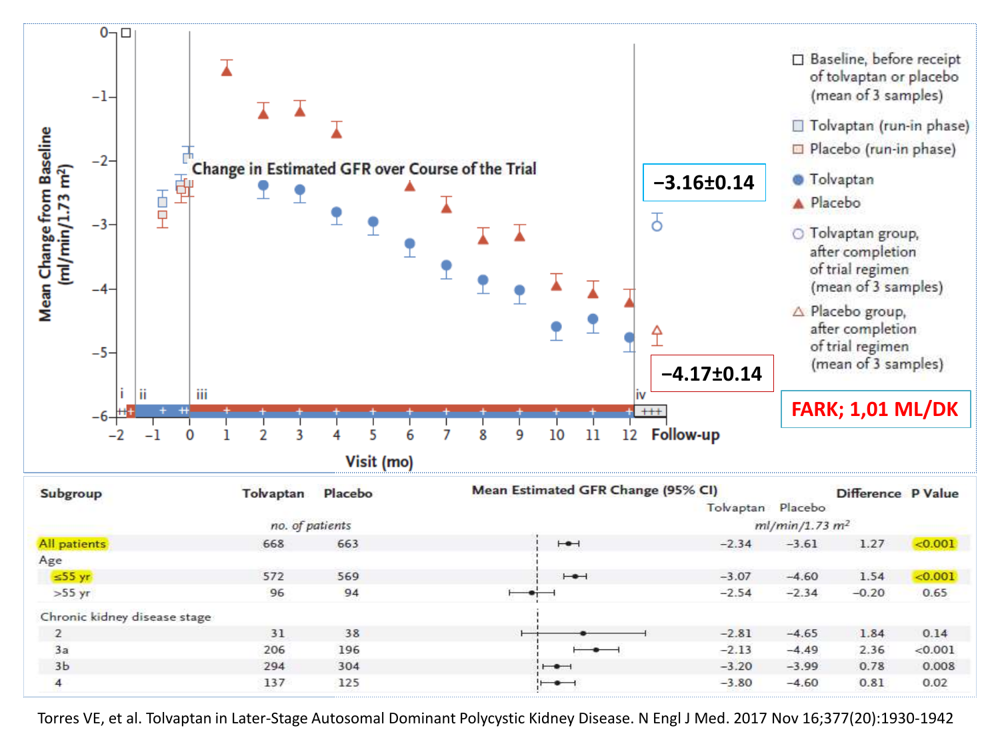

> **Grafik yorumu:** Birincil sonlanım, tedavi öncesi ve sonrası eGFR değişim eğimi:
> - **Tolvaptan grubu:** −3,16 ± 0,14 mL/dk/1,73m² / yıl
> - **Plasebo grubu:** −4,17 ± 0,14 mL/dk/1,73m² / yıl
> - **Fark: 1,01 mL/dk/yıl** (anlamlı) -- alt grup analizlerinde (yaş, KBH evresi) tutarlı etki.

**Sonuç:** İleri evre ODPKBH'da bile tolvaptan eGFR düşüşünü anlamlı olarak yavaşlatır; bu bulgu FDA onayının temelini oluşturdu (ABD, 2018).

---

## SDBH UZATMA ETKİSİ

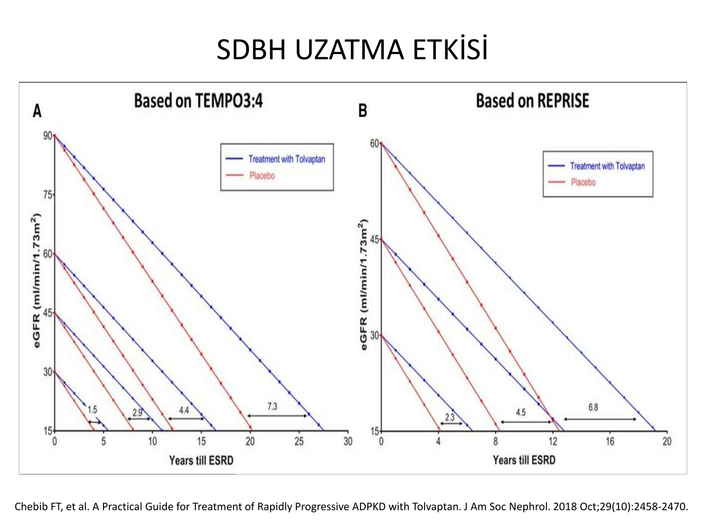

> **Şema yorumu:** Chebib ve ark. (JASN 2018) hesaplamasında, eGFR başlangıç düzeyine göre tolvaptanın **SDBH'ye ulaşımı geciktirme süresi** modellenmiştir:
> - TEMPO 3:4 temelinde hesaplamayla tolvaptan erken evrede başlanırsa **SDBH'ye gidiş 5-7 yıl kadar geciktirilebilir**.
> - REPRISE temelinde, ileri evrede başlansa bile **SDBH'ye ulaşım 4,5 -- 6,6 yıl** geciktirilebilir.
> - Ne kadar erken başlanırsa **kazanılan SDBH-ötesi yaşam süresi** o kadar artar.

> **📋 Klinik mesaj:** Tolvaptan kanıtlanmış şekilde **diyalize girişi yıllar ölçeğinde erteler** -- bu bir **hastalık-modifiye edici tedavi**dir.

---

## İKİNCİL FAYDALAR (AĞRI, HEMATÜRİ, ÜSİ, HT)

### Renal Ağrı ve Hematüri (Meta-Analiz)

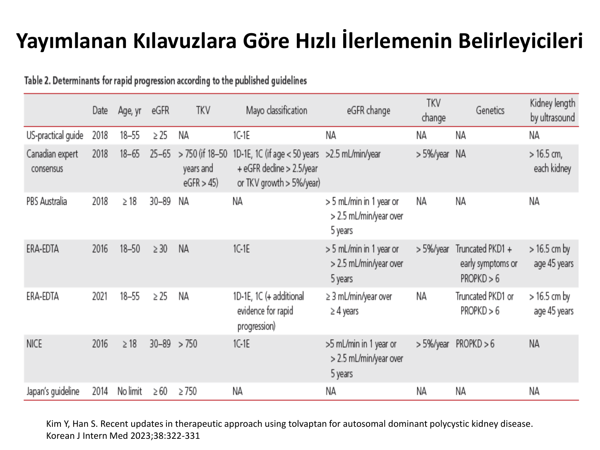

> **Şema yorumu:** U.X. ve ark. (Nefrologia 2023) sistematik derleme ve meta-analizi:
> - **Renal ağrı:** Risk oranı **0,66 (0,55 -- 0,80)** → tolvaptan grubunda anlamlı azalma.
> - **Hematüri:** Risk oranı **0,55 (0,41 -- 0,74)** → hematüri atakları yarıdan fazla azalmaktadır.

### İdrar Yolu Enfeksiyonu, Hematüri, Hipertansiyon

> **Şema yorumu (Jingkui Lu ve ark., Int Urol Nephrol 2023):**
> - **Renal ağrı (OR 0,69):** Tolvaptan kolunda ağrı atakları azalır.
> - **İdrar yolu enfeksiyonu (OR 0,69):** ÜSİ sıklığı anlamlı düşer -- yoğun sulu diürezin yıkayıcı etkisine bağlanabilir.
> - **Hematüri (OR 0,69):** Tolvaptan grubunda azalmış.
> - **Hipertansiyon (OR 0,66):** Tolvaptan grubunda yeni HT ve HT kontrolsüzlüğü daha az.

> **📋 Özet:** Tolvaptan yalnızca TKV ve eGFR üzerinde değil, hastanın **yaşam kalitesini doğrudan etkileyen komplikasyonlarda** (ağrı, hematüri, ÜSİ, HT) da anlamlı azalma sağlamaktadır.

---

## MAYO KLİNİK SINIFLAMASI (TOTAL BÖBREK VOLÜMÜ)

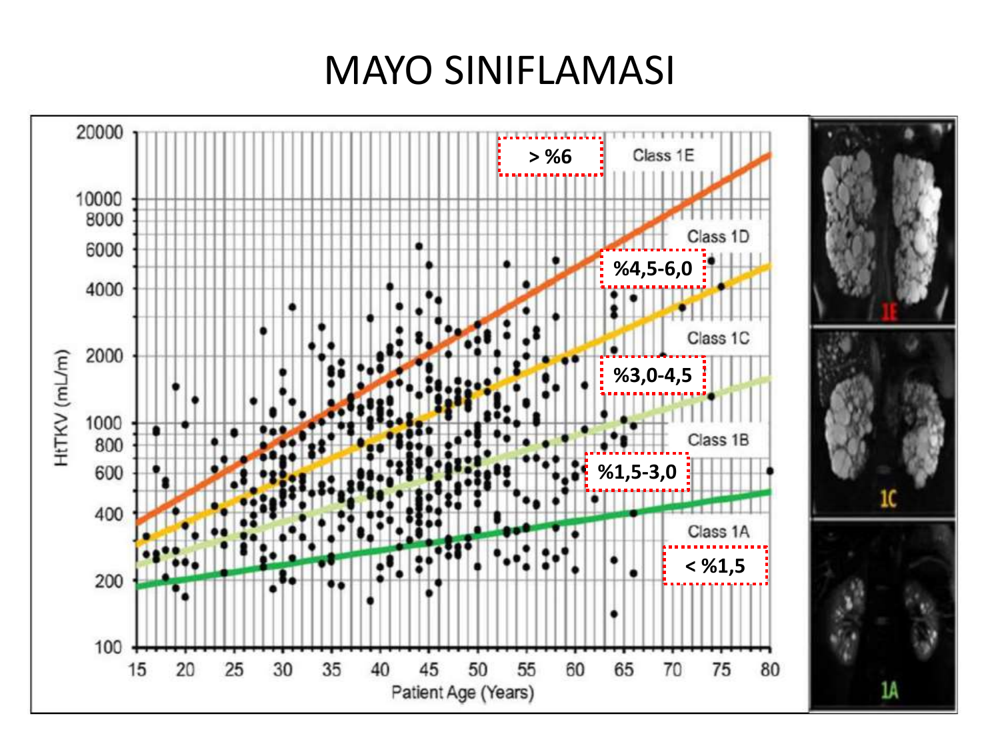

> **Şema yorumu:** **Boya düzeltilmiş TKV (htTKV, mL/m)** yaşa karşı logaritmik grafik üzerine çizilerek hasta **Mayo Sınıfı 1A - 1E**'den birine yerleştirilir. Sınıflar yıllık TKV büyüme hızı ile tanımlanır:

| Mayo Sınıfı | Yıllık TKV Büyüme Hızı | Hızlı İlerleme Riski |
|---|---|---|
| **1A** | **< %1,5** | Düşük |
| **1B** | %1,5 -- %3,0 | Düşük-orta |
| **1C** | %3,0 -- %4,5 | **Orta-yüksek** |
| **1D** | %4,5 -- %6,0 | **Yüksek** |
| **1E** | **> %6,0** | **Çok yüksek** |

> **⚠️ Klinik kullanım:** **Mayo 1C, 1D, 1E** sınıfındaki hastalar **hızlı ilerleyen** olarak kabul edilir ve **tolvaptan endikasyonu** için uygun profile sahiptirler. **Sınıf 2** ise atipik (asimetrik, tek taraflı, segmental) polikistik hastalıkları kapsar ve Mayo prognostik eğimleri uygulanamaz.

**Diğer prognostik araç:** **PROPKD skoru** (cinsiyet + erken başlangıç HT + ilk ürolojik olay yaşı + PKD1/PKD2 genotip); **skor ≥ 6** hızlı ilerleme belirtir.

---

## KILAVUZLARDA HIZLI İLERLEME KRİTERLERİ

> **Tablo yorumu:** Uluslararası kılavuzlarda hızlı ilerleme kriterlerinin karşılaştırması:

| Kılavuz | Yıl | Yaş | eGFR | TKV (Mayo) | eGFR değişim | TKV değişim | Genetik | USG boyutu |
|---|---|---|---|---|---|---|---|---|
| **US pratik kılavuzu** | 2018 | 18-55 | ≥ 25 | 1C-1E | -- | -- | -- | -- |
| **Kanada uzman görüşü** | 2018 | 25-65 | > 70 (<55 y) veya >45 (55-65 y) | 1C-1E, eGFR düşüşü ≥ 2,5/yıl 5 yıldır | ≥ 2,5 mL/dk/yıl | > %5/yıl | -- | ≥ 16,5 cm |
| **PRS Australia** | 2018 | 30-89 | N/A | 1C-1E | -- | -- | -- | -- |
| **ERA-EDTA** | 2016 | 18-50 | > 30 | 1C-1E | ≥ 2,5 mL/dk / yıl 5 yıldır | -- | -- | -- |
| **ERA-EDTA** | 2021 | 18-55 | ≥ 25 | 1C-1E veya TKV kanıtları | ≥ 2 mL/dk/yıl | -- | Trunkuslu PKD1 veya erken PROPKD>6 | ≥ 16,5 cm (55 y altı) |
| **NICE** | 2016 | ≥ 18 | > 20 | 1C-1E | ≥ 5 mL/dk/1 yıl veya ≥ 2,5/yıl 5 yılda | > %5/yıl | PROPKD > 6 | -- |
| **Japan** | 2014 | Yaş sınırı yok | limit yok | -- | -- | -- | -- | -- |

> **📋 Türkiye (TND Uzman Görüş Raporu -- 2023):** Hızlı ilerleme kriteri, **Mayo 1C-1E + eGFR yıllık düşüşü ≥ 2,5 -- 5 mL/dk** veya **PROPKD ≥ 6** olarak özetlenebilir; bu profildeki 18-55 yaş hastalara **tolvaptan önerilir**.

### Endikasyonlar ve Kontrendikasyonlar (Özet)

**Endikasyon (FDA/EMA/TND):**
* Erişkin ODPKBH
* **KDIGO Evre 1-4** (eGFR ≥ 25 mL/dk)
* **Hızlı progresyon riski** (Mayo 1C-1E, PROPKD ≥ 6, yıllık eGFR düşüşü yüksek)

**Kontrendikasyonlar:**
* **ALT / AST > 3× üst sınır** veya aktif karaciğer hastalığı
* **Anüri**
* **Volüm deplesyonu / dehidratasyon**
* **Hipernatremi**
* **Susama algısında bozukluk** (tehlikeli hipertonisite riski)
* **Gebelik ve laktasyon**
* **Güçlü CYP3A4 inhibitörleri** ile birlikte kullanım

---

## ÇOK SU İÇME FAYDALI MI?

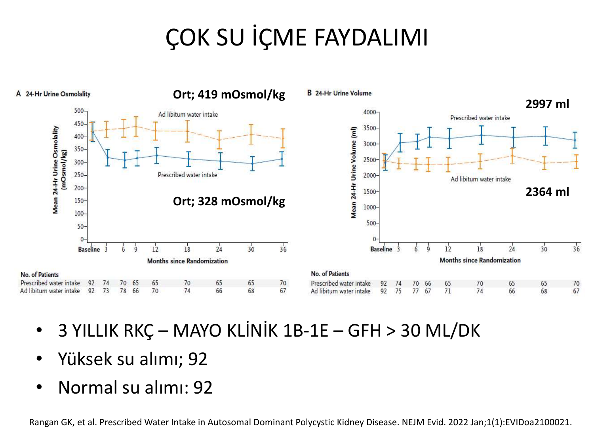

> **Şema yorumu:** Rangan GK ve ark. (NEJM Evidence 2022) -- **3 yıllık açık etiketli RKÇ**, Mayo 1B-1E, GFH > 30 mL/dk:
> - **Reçeteli (yüksek) su alımı grubu (n=92):** 24-saatlik idrar osmolalitesi ortalama **328 mOsmol/kg**, idrar volümü **2997 mL**.
> - **Normal (ad libitum) su alımı grubu (n=92):** Osmolalite **419 mOsmol/kg**, volüm **2364 mL**.
> - Reçeteli su alan hastalar hedef 24-saatlik idrar osmolalitesine **yarısında** ulaştı.

### Çalışmanın Sonucu

> **ODPKBH'lı hastalar için, reçeteli su alımı aşırı olumsuz olaylarla ilişkilendirilmedi ve hastaların yarısı için hedef 24 saatlik idrar osmolalitesine ulaşıldı; ancak 3 yıl boyunca normal su alımına kıyasla toplam böbrek hacminin büyümesini yavaşlatmadı.**

**Ana mesaj:**
* **Yüksek su alımı teorik olarak mantıklı** (endojen vazopresini baskılar, cAMP'yi düşürür).
* Pratikte hedef idrar osmolalitesine ulaşmak zordur.
* **Yüksek su alımı TKV büyümesini veya eGFR düşüşünü yavaşlatmadı.**
* Yine de **ılımlı su alımı** (idrar ozmolalitesi ≤ 280 mOsm/kg hedefli) TND önerileri kapsamındadır, ancak **tolvaptanın yerini tutmaz**.

---

## TOLVAPTAN YAN ETKİLERİ VE GÜVENLİK

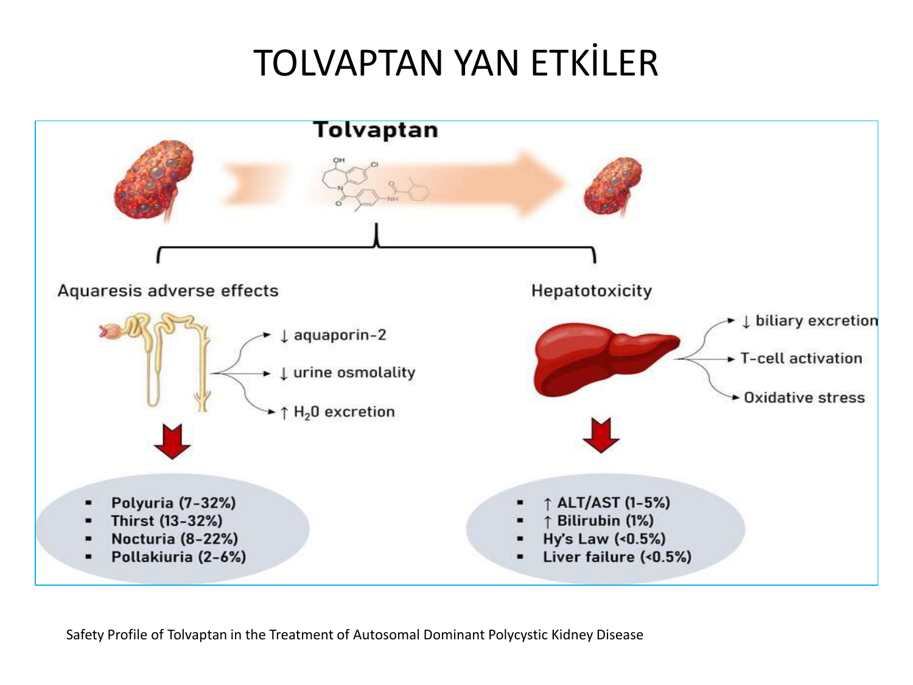

> **Şema yorumu:** Tolvaptanın iki ana yan etki paterni:
>
> **1. Akuaretik yan etkiler (çok sık, hasta ~%100):**
> - ↓ AQP2 translokasyonu
> - ↓ İdrar osmolalitesi
> - ↑ Serbest su ekskresyonu
> - → **Poliüri (%7-32)**, susuzluk (%13-32), **noktüri (%5-22)**, pollakiüri (%2-6)
>
> **2. Hepatotoksisite:**
> - ↓ Biliyer ekskresyon
> - T hücresi aktivasyonu
> - Oksidatif stres
> - → **ALT/AST yüksekliği (%1-5)**, bilirubin artışı (~%1), **Hy's Law (%0,5)**, karaciğer yetmezliği (~%0,5)

### Yan Etki Sıklığı (TEMPO 3:4 ve Güvenlik Havuzu)

| Yan Etki | Sıklık | Not |
|---|---|---|
| **Poliüri** | **%55-100** | Hemen tüm hastalarda; günlük idrar volümü 5-7 L |
| **Susuzluk / polidipsi** | %55 | Yaşam kalitesini etkiler |
| **Noktüri** | %25-30 | Uyku düzenini bozar |
| **Hipernatremi** | %4-7 | Yetersiz su alımı ile artar |
| **ALT/AST > 3× ULN** | **%3-5** | Genellikle ilk **18 ay** içinde |
| **Hy's Law kriterini karşılayan hepatotoksisite** | ~%0,5 | Ağır, ölümcül olabilir |
| **Dehidratasyon** | Nadir | Volüm takibi gerekir |

> **⚠️ Önemli güvenlik noktaları:**
> - **Karaciğer enzim izlemi:** İlk **18 ay aylık**, sonra **3 ayda bir** ALT/AST/Bilirubin.
> - **Serbest su alımı:** Hasta poliüriye yetişecek kadar su içmeli; susama hissine rağmen dahi **ek 500 mL su** uyku öncesi önerilebilir.
> - **Na izlemi:** Baseline ve periyodik; hipernatremi durumunda doz azaltılır.

---

## HEPATOTOKSİSİTE İZLEM ALGORİTMASI

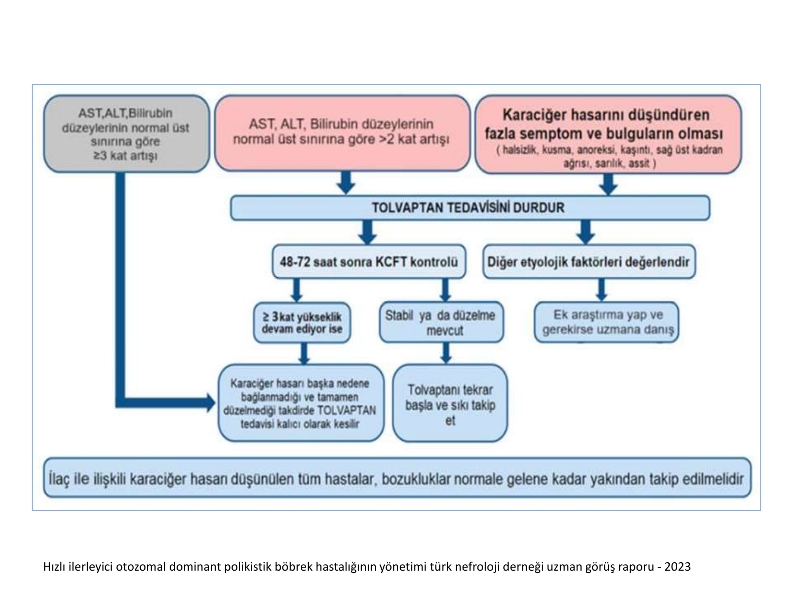

> **Şema yorumu:** TND 2023 uzman görüş raporuna göre tolvaptan altında karaciğer enzim takibi:

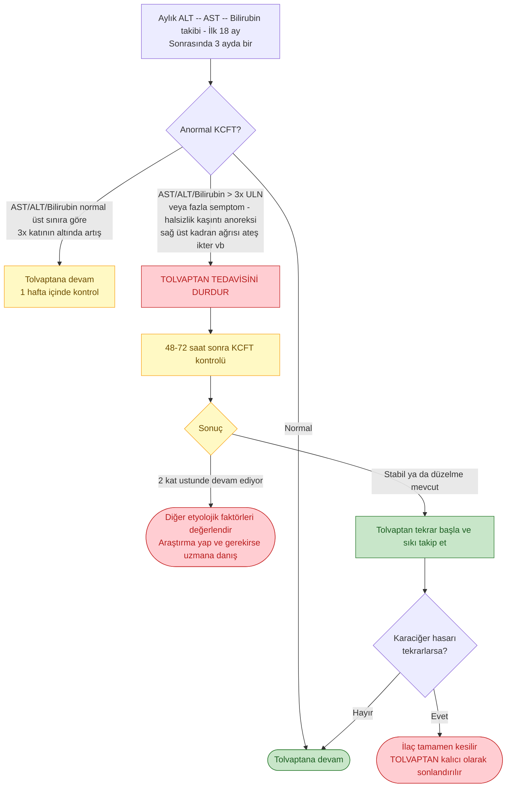
```mermaid
flowchart TD
    A[Aylık ALT -- AST -- Bilirubin takibi - İlk 18 ay<br/>Sonrasında 3 ayda bir] --> B{Anormal KCFT?}
    B -->|Normal| Z([Tolvaptana devam])
    B -->|AST/ALT/Bilirubin normal üst sınıra göre<br/>3x katının altında artış| C[Tolvaptana devam<br/>1 hafta içinde kontrol]
    B -->|AST/ALT/Bilirubin > 3x ULN<br/>veya fazla semptom - halsizlik kaşıntı anoreksi<br/>sağ üst kadran ağrısı ateş ikter vb| D[TOLVAPTAN TEDAVİSİNİ DURDUR]
    D --> E[48-72 saat sonra KCFT kontrolü]
    E --> F{Sonuç}
    F -->|2 kat ustunde devam ediyor| G([Diğer etyolojik faktörleri değerlendir<br/>Araştırma yap ve gerekirse uzmana danış])
    F -->|Stabil ya da düzelme mevcut| H[Tolvaptan tekrar başla ve sıkı takip et]
    H --> I{Karaciğer hasarı<br/>tekrarlarsa?}
    I -->|Evet| J([İlaç tamamen kesilir<br/>TOLVAPTAN kalıcı olarak sonlandırılır])
    I -->|Hayır| Z

    classDef safe fill:#c8e6c9,stroke:#2e7d32,color:#1b5e20
    classDef warn fill:#fff9c4,stroke:#f9a825,color:#6d4c00
    classDef danger fill:#ffcdd2,stroke:#c62828,color:#b71c1c
    class Z,H safe
    class C,E,F warn
    class D,G,J danger
```

> **💡 Pratik not:** İlaç ile ilişkili karaciğer hasarı düşünülen tüm hastalar, bozukluk normale gelene kadar **yakından takip edilmelidir**.

---

## TNF DERNEK ÖNERİLERİ (ODPBH GENEL YÖNETİMİ)

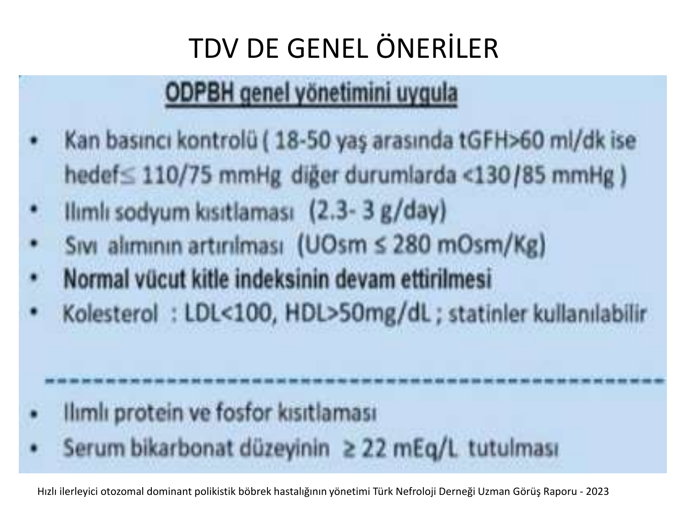

> **TND 2023 Uzman Görüş Raporu -- ODPBH genel yönetimi:**

### Ana Öneriler

| Konu | Öneri |
|---|---|
| **Kan basıncı kontrolü** | **18-50 yaş arasında tGFH > 60 mL/dk ise hedef ≤ 110/75 mmHg**; diğer durumlarda < 130/85 mmHg |
| **Sodyum kısıtlaması** | Ilımlı sodyum kısıtlaması (**2,3 -- 3 g/gün**) |
| **Sıvı alımı artırımı** | **İdrar ozmolalitesi ≤ 280 mOsm/kg** hedefli |
| **Vücut kitle indeksi** | **Normal VKİ** korunmalı (obezite hızlı progresyonla ilişkili) |
| **Kolesterol / statin** | **LDL < 100, HDL > 50 mg/dL**; uygun olanlara **statin** başlanabilir |
| **Protein / fosfor** | Ilımlı **protein ve fosfor** kısıtlaması |
| **Asid-baz dengesi** | **Serum bikarbonat ≥ 22 mEq/L** tutulmalı |

### HALT-PKD Çalışmasından Alınan Ders

* **Sıkı kan basıncı kontrolü (≤ 110/75 mmHg)** erken evre ODPKBH hastalarında TKV büyümesini yavaşlatır.
* **ACE-inhibitörü / ARB** tercih edilir (vazopressor etkiyi ve renin-anjiyotensin sistemini baskılar).
* Daha ileri evrede (Evre 3-4) sıkı hedefler ek fayda sağlamaz.

### Tolvaptan Başlama Pratik Protokolü (TND 2023 özeti)

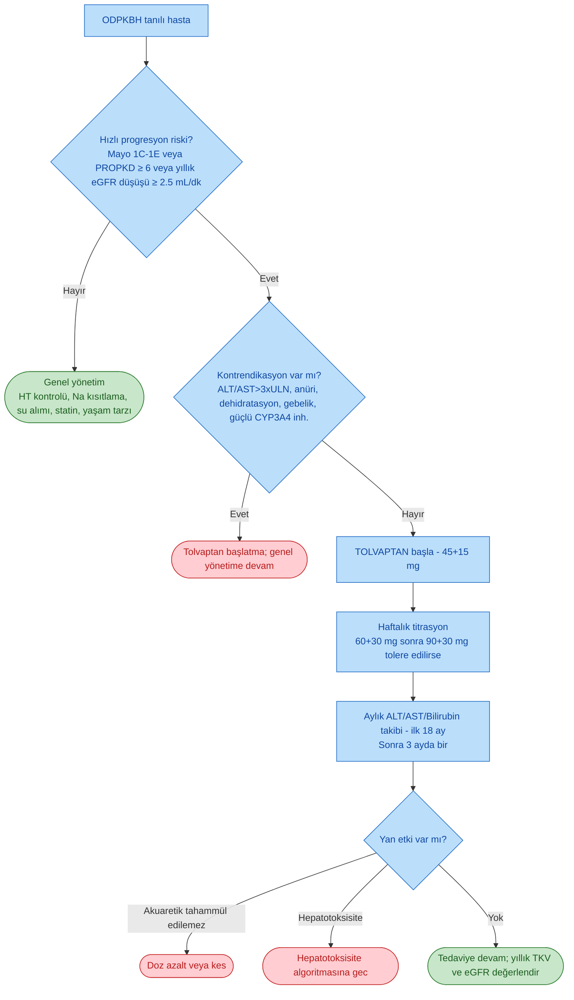
```mermaid
flowchart TD
    A[ODPKBH tanılı hasta] --> B{Hızlı progresyon riski?<br/>Mayo 1C-1E veya PROPKD ≥ 6 veya yıllık eGFR düşüşü ≥ 2.5 mL/dk}
    B -->|Hayır| C([Genel yönetim<br/>HT kontrolü, Na kısıtlama, su alımı, statin, yaşam tarzı])
    B -->|Evet| D{Kontrendikasyon var mı?<br/>ALT/AST>3xULN, anüri, dehidratasyon, gebelik, güçlü CYP3A4 inh.}
    D -->|Evet| E([Tolvaptan başlatma; genel yönetime devam])
    D -->|Hayır| F[TOLVAPTAN başla - 45+15 mg]
    F --> G[Haftalık titrasyon<br/>60+30 mg sonra 90+30 mg tolere edilirse]
    G --> H[Aylık ALT/AST/Bilirubin takibi - ilk 18 ay<br/>Sonra 3 ayda bir]
    H --> I{Yan etki var mı?}
    I -->|Akuaretik tahammül edilemez| J([Doz azalt veya kes])
    I -->|Hepatotoksisite| K([Hepatotoksisite algoritmasına gec])
    I -->|Yok| L([Tedaviye devam; yıllık TKV ve eGFR değerlendir])

    classDef diagnose fill:#c8e6c9,stroke:#2e7d32,color:#1b5e20
    classDef exclude fill:#ffcdd2,stroke:#c62828,color:#b71c1c
    classDef test fill:#bbdefb,stroke:#1565c0,color:#0d47a1
    class L,C diagnose
    class E,J,K exclude
    class A,B,D,F,G,H,I test
```

---

## VAKA ÖRNEĞİ

**📋 VAKA ÖRNEĞİ 1: Hızlı İlerleyen ODPKBH**

**Hasta:** 32 yaşında erkek
**Öykü:** Babası 55 yaşında ODPKBH nedeniyle diyalize girmiş. Hastanın 2 yıldır bilinen HT'si mevcut. Son 6 aydır sol yanda künt ağrı, intermitan hematüri. Sigara içmiyor.
**Fizik Muayene:** Nabız 78/dk, TA 158/98 mmHg, palpable sol böbrek kitlesi, SpO₂ %98.
**Laboratuvar:**
- Kreatinin 1,3 mg/dL (eGFR 68 mL/dk/1,73m²)
- Proteinüri negatif, mikroskopik hematüri pozitif
- K 4,2, Na 140, ürik asit 7,5 mg/dL

**Görüntüleme:**
- Renal USG: Her iki böbrekte >15 kist, en büyüğü 5 cm. Sol böbrek boyutu **17,5 cm**.
- MR TKV ölçümü: **1850 mL htTKV / boy** → **Mayo Sınıfı 1D**

**PROPKD Skoru:** Erkek (1) + HT < 35 yaş (2) + ilk ürolojik olay < 35 yaş (2) + PKD1 trunkating mutasyonu (4) = **9 puan → Yüksek risk**

**Tanı:** Hızlı ilerleyen PKD1-ilişkili ODPKBH

**Tedavi:**
1. **Kan basıncı kontrolü:** ramipril 10 mg/gün başlandı; hedef ≤ 110/75 mmHg.
2. **Yaşam tarzı:** Günlük su alımı 3 L, Na kısıtlaması 3 g/gün, kafein ve metilksantin azaltma.
3. **Statin:** LDL 110 mg/dL → atorvastatin 20 mg başlandı.
4. **Tolvaptan:** 45 + 15 mg başlandı, haftalık titrasyonla 90 + 30 mg'a çıkıldı. Aylık ALT/AST/Bilirubin takibi planlandı.
5. **Genetik danışmanlık:** Ailede 1. derece akrabalar için ADPKD taraması ve MR anjiyografi ile intrakraniyal anevrizma taraması önerildi.

**İzlem:**
- 6. ayda eGFR 65 mL/dk, ALT/AST normal sınırlarda.
- 12. ayda TKV büyümesi %3,1 (önceki yıllık %5,5'e göre yavaşlama).
- Hasta günlük 5-6 L idrar çıkarıyor, iş ve uyku düzeni ayarlandı.

**Öğretici Notlar:**

1. **Hızlı ilerleme kriterlerinin tanımlanması** tolvaptan endikasyonunun temelidir: Mayo 1C-1E, PROPKD ≥ 6 veya yıllık eGFR düşüşü ≥ 2,5 mL/dk.
2. Tolvaptan başlamadan önce **mutlaka karaciğer fonksiyonları** (ALT, AST, bilirubin) kontrol edilmeli, üst sınırın 3 katı üzeri değerlerde başlanmamalı.
3. **Hasta uyumu** poliüri nedeniyle zorlanabilir; tedavi öncesi hastaya **günde 5-7 L idrar çıkaracağı**, işyerinde ve uykuda bunun yönetimi detaylı anlatılmalı.
4. **Aile taraması** (ilk derece akrabalar) ve intrakraniyal anevrizma taraması (aile öyküsü varsa) ihmal edilmemeli.
5. Tolvaptan tek başına yeterli değildir; HT kontrolü, yaşam tarzı düzenlemeleri ve **kardiyovasküler risk yönetimi** (statin) bütün tedavi paketinin parçalarıdır.

---

## ÖZET -- KLİNİK MESAJLAR

1. **ODPKBH** en sık kalıtsal böbrek hastalığıdır; PKD1 (%85, daha ağır) ve PKD2 (%15, daha hafif) genleri sorumludur.
2. **Tanı** aile öyküsü + yaşa göre USG kist sayısı (Ravine kriterleri) ile konur; pro­gnoz TKV temelli **Mayo sınıflaması** ile belirlenir.
3. Patogenezde **V2R -- cAMP** aşırı aktivasyonu merkezdedir; bu **tolvaptan**'ın hedefidir.
4. **TEMPO 3:4** erken evrede TKV büyümesini %49 yavaşlattı, eGFR kaybını anlamlı olarak azalttı.
5. **REPRISE** ileri evrede bile (eGFR 25-65) tolvaptanın eGFR kaybını ~1 mL/dk/yıl yavaşlattığını gösterdi → FDA onayının temeli.
6. **Tolvaptan endikasyonu:** hızlı ilerleyen ODPKBH (Mayo 1C-1E, PROPKD ≥ 6, yıllık eGFR düşüşü yüksek).
7. **Yan etkiler:** Akuaretik (hasta %100) ve **hepatotoksisite %3-5**; aylık KCFT takibi şart.
8. **Ek önlemler:** KB kontrolü (≤ 110/75), yaşam tarzı, statin, aile taraması.
9. **Çok su içme** tek başına TKV'yi yavaşlatmadı; tolvaptanın yerini tutmaz.
10. Tolvaptan **diyalize girişi yıllar ölçeğinde geciktirir** -- tek hastalık-modifiye edici tedavidir.

---

**Referanslar (slayt sunumu):**

- Torres VE, et al.; TEMPO 3:4 Trial Investigators. *N Engl J Med.* 2012;367(25):2407-18.
- Torres VE, et al.; TEMPO 4:4 Trial Investigators. *Nephrol Dial Transplant.* 2018;33(3):477-489.
- Torres VE, et al. *N Engl J Med.* 2017;377(20):1930-1942 (REPRISE).
- Chebib FT, et al. *J Am Soc Nephrol.* 2018;29(10):2458-2470.
- Kim Y, Han S. *Korean J Intern Med* 2023;38:322-331.
- Raina R, et al. *Drug Healthc Patient Saf.* 2022;14:147-159.
- Rangan GK, et al. *NEJM Evid.* 2022;1(1):EVIDoa2100021.
- Li X, et al. *Nefrologia.* 2023;43(6):731-741.
- Lu J, et al. *Int Urol Nephrol.* 2023;55:631-640.
- Türk Nefroloji Derneği Registry Raporu 2022.
- Türk Nefroloji Derneği -- Hızlı İlerleyici ADPKD Uzman Görüş Raporu 2023.
