# PRİMER GLOMERÜLONEFRİTLER

**Hazırlayan:** Prof. Dr. Hakan Akdam
**Bölüm:** Aydın Adnan Menderes Üniversitesi -- Nefroloji Bilim Dalı

---

## İÇİNDEKİLER

1. [Giriş -- Nefrotik ve Nefritik Sendrom](#giriş--nefrotik-ve-nefritik-sendrom)
2. [Glomerüler Filtrasyon Bariyeri](#glomerüler-filtrasyon-bariyeri)
3. [Böbrek Biyopsisi](#böbrek-biyopsisi)
4. [Membranöz Glomerülonefrit (MGN)](#membranöz-glomerülonefrit-mgn)
5. [Fokal Segmental Glomerüloskleroz (FSGS)](#fokal-segmental-glomerüloskleroz-fsgs)
6. [Minimal Değişiklik Hastalığı (MDH / MLH)](#minimal-değişiklik-hastalığı-mdh--mlh)
7. [IgA Nefropatisi (Berger Hastalığı)](#iga-nefropatisi-berger-hastalığı)
8. [Membranoproliferatif Glomerülonefrit (MPGN)](#membranoproliferatif-glomerülonefrit-mpgn)
9. [Post-Streptokoksik GN (Kısa Özet)](#post-streptokoksik-gn-kısa-özet)
10. [Özet Karşılaştırma Tablosu](#özet-karşılaştırma-tablosu)

---

## GİRİŞ -- NEFROTİK VE NEFRİTİK SENDROM

Primer glomerülonefritler (GN) böbreği doğrudan tutan, altta sistemik bir hastalık olmaksızın glomerüler hasara yol açan hastalıklar grubudur. Klinik olarak iki ana sendrom çerçevesinde değerlendirilirler.

### Nefrotik Sendrom

> **Tanım:** Glomerüler filtrasyon bariyerinin (özellikle podosit ve slit diyafram) hasarına bağlı **masif proteinüri** ve onun sonuçlarını içeren klinik tablodur.

**Klasik beşli:**

* **Proteinüri > 3,5 gr/gün/1,73 m²**
* **Hipoalbuminemi** (< 3 gr/dL)
* **Ödem** (pretibial, periorbital, presakral)
* **Hiperlipidemi / hiperkolesterolemi**
* **Lipidüri** (idrarda yağ cisimleri, Malta haçı)

**Ek komplikasyonlar:**

* **Tromboembolik hastalık** (DVT, renal ven trombozu, PE) -- özellikle MGN'de
* İmmün disfonksiyon, enfeksiyon yatkınlığı (IgG kaybı)
* D vitamini eksikliği, demir eksikliği anemisi (bağlayıcı proteinlerin kaybı)

### Nefritik Sendrom

> **Tanım:** Glomerüler kapiller duvarının inflamatuvar hasarına bağlı **hematüri ağırlıklı** klinik tablodur.

**Klasik bulgular:**

* **Hematüri** (dismorfik eritrositler, eritrosit silendirleri)
* Hafif-orta proteinüri (< 3,5 gr/gün)
* **Hipertansiyon**
* **Oligüri** ve sıvı retansiyonu
* **Akut böbrek hasarı / azotemi**
* Ödem (periorbital, daha az belirgin)

### Nefrotik -- Nefritik Ayırımı

| Özellik | Nefrotik | Nefritik |
|---|---|---|
| **Proteinüri** | > 3,5 gr/gün, seçici veya nonseçici | < 3,5 gr/gün |
| **Hematüri** | Nadir, genellikle yok | **Belirgin**, dismorfik eritrosit |
| **Eritrosit silendiri** | Yok | **Var** |
| **Hipoalbuminemi** | Belirgin | Hafif |
| **Ödem** | Jeneralize, belirgin | Sınırlı, periorbital |
| **Hipertansiyon** | Hafif / yok | **Belirgin** |
| **GFR** | Genellikle normal | **Azalmış** |
| **Tipik nedenler** | MDH, FSGS, MGN, diyabetik nefropati | Post-streptokoksik GN, IgA, MPGN, kresentik GN |

### Primer GN'lerin Kümülatif Sınıflaması

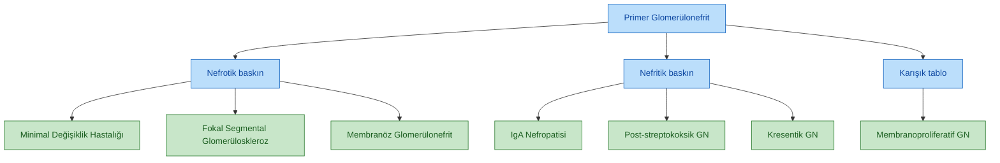
```mermaid
flowchart TD
    A[Primer Glomerülonefrit] --> B[Nefrotik baskın]
    A --> C[Nefritik baskın]
    A --> D[Karışık tablo]

    B --> B1[Minimal Değişiklik Hastalığı]
    B --> B2[Fokal Segmental Glomerüloskleroz]
    B --> B3[Membranöz Glomerülonefrit]

    C --> C1[IgA Nefropatisi]
    C --> C2[Post-streptokoksik GN]
    C --> C3[Kresentik GN]

    D --> D1[Membranoproliferatif GN]

    classDef diagnose fill:#c8e6c9,stroke:#2e7d32,color:#1b5e20
    classDef test fill:#bbdefb,stroke:#1565c0,color:#0d47a1
    class A test
    class B,C,D test
    class B1,B2,B3,C1,C2,C3,D1 diagnose
```

---

## GLOMERÜLER FİLTRASYON BARİYERİ

Glomerüler filtrasyon bariyeri üç katmanlı bir yapıdır; **podosit** disfonksiyonu primer GN'lerin büyük kısmında anahtar rol oynar.

**Üç katman:**

1. **Fenestralı endotel** (kapiller endotel, negatif yüklü glikokaliks)
2. **Glomerüler bazal membran (GBM)** (tip IV kollajen, laminin, heparan sülfat proteoglikan -- negatif yük bariyeri)
3. **Podosit ayaksı çıkıntıları + slit diyafram**

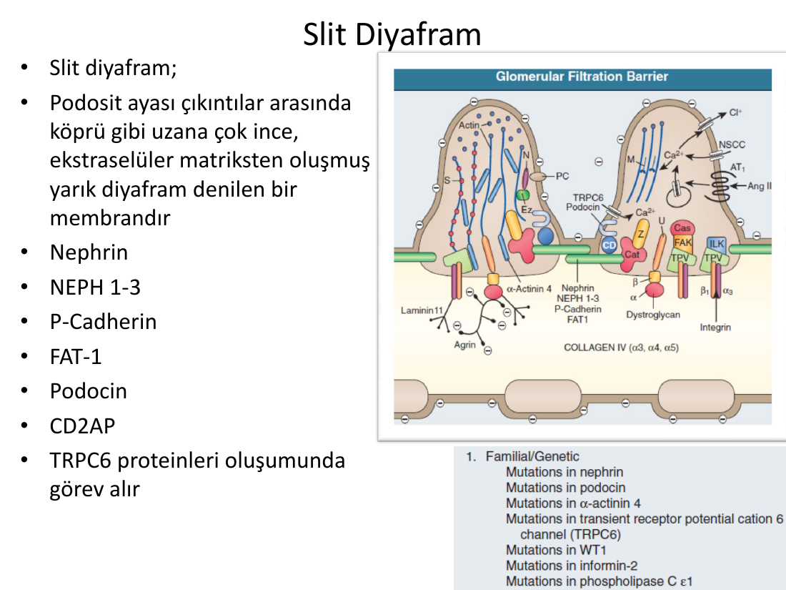

> **Şema yorumu:**
>
> Görselde **glomerüler filtrasyon bariyeri** üç katmanlı olarak gösterilir: kapiller lümen, fenestralı endotel, GBM ve üzerinde oturan podosit ayaksı çıkıntıları. **Slit diyafram**, komşu podosit ayaksı çıkıntıları arasında köprü benzeri, ekstraselüler matriksten yapılmış yarık benzeri bir membrandır. Bu diyaframın yapısında görev alan anahtar proteinler; **nefrin, NEPH 1-3, P-kaderin, FAT-1, podosin, CD2AP ve TRPC6**'dır. Bu proteinlerdeki genetik mutasyonlar steroid dirençli çocukluk çağı nefrotik sendromu ve primer FSGS'nin moleküler nedenleridir.

### Slit Diyafram Proteinleri ve Hastalık İlişkisi

| Protein | Gen | Hastalık |
|---|---|---|
| **Nefrin** | NPHS1 | Konjenital nefrotik sendrom (Finnish tipi) |
| **Podosin** | NPHS2 | Steroid dirençli nefrotik sendrom, FSGS |
| **α-actinin-4** | ACTN4 | Ailesel FSGS |
| **TRPC6** | TRPC6 | Otozomal dominant FSGS |
| **WT1** | WT1 | Denys-Drash, Frasier sendromu |
| **İnvertin-2 / Fosfolipaz Cε1** | INF2 / PLCE1 | Ailesel FSGS |
| **CD2AP** | CD2AP | FSGS |

---

## BÖBREK BİYOPSİSİ

Glomerüler hastalıkların kesin tanısı **perkütan böbrek biyopsisi** ile konur. Örnek üç teknikte değerlendirilir:

* **Işık mikroskopisi (LM)** -- H&E, PAS, Masson trikrom, metenamin-gümüş
* **İmmünfloresan (IF)** -- IgG, IgA, IgM, C3, C1q, kappa/lambda
* **Elektron mikroskopi (EM)** -- ayaksı çıkıntı, GBM, depoların yeri

**Biyopsi endikasyonları (yetişkin):**

* Nedeni belirsiz nefrotik sendrom
* Nefritik sendrom (post-streptokoksik GN dışı)
* Açıklanamayan akut böbrek hasarı
* Sistemik hastalığın böbrek tutulumunu değerlendirme (SLE, vaskülit, amiloidoz)
* İzole proteinüri > 1 gr/gün (renal fonksiyon bozukluğu ile)

**Çocukta biyopsi ertelenebilir:**
Çocuklarda klasik ani başlangıçlı nefrotik sendromda ilk basamak olarak **ampirik steroid tedavisi** başlanır; yanıt varsa tanı **minimal değişiklik hastalığı** (MDH) olarak kabul edilir. Steroid dirençli olgularda biyopsi gerekir.

---

## MEMBRANÖZ GLOMERÜLONEFRİT (MGN)

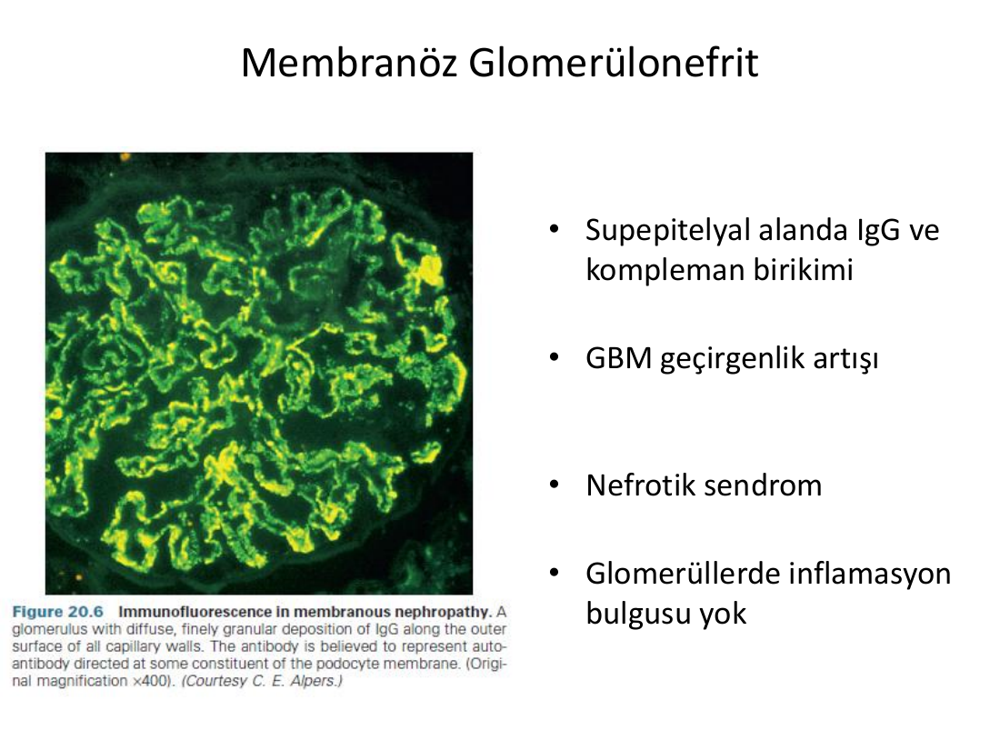

> **Şema yorumu:**
>
> Glomerüler kapiller kesitinde GBM'nin **subepitelyal (epitel/podosit tarafında)** alanında **IgG ve kompleman (C3) granüler birikimi** izlenir. Bu birikim GBM geçirgenliğini artırarak klinik olarak **nefrotik sendroma** yol açar. MGN'nin ayırt edici özelliği; hücresel proliferasyon ve lökosit infiltrasyonu gibi **inflamasyon bulgularının yokluğu**dur.

### Tanım ve Epidemiyoloji

> **Tanım:** GBM'nin subepitelyal bölgesinde IgG ve kompleman birikimi ile karakterize, ışık mikroskopisinde GBM kalınlaşmasına yol açan, nefrotik sendrom ile giden glomerüler hastalıktır.

* **Diyabetik olmayan erişkinde en sık nefrotik sendrom nedeni**
* Tüm böbrek biyopsilerinin yaklaşık **1/3'ü**
* **1/3 sekonder, 2/3 idiyopatik (primer)**
* İnsidans: **5-10 / milyon / yıl**
* E/K ~ 3/1, 4.-5. dekadda pik

### İdiyopatik (Primer) ve Sekonder Ayırımı

**İdiyopatik MGN'de patogenez:** Podosit yüzeyindeki **fosfolipaz A2 reseptörüne (PLA2R)** karşı oluşan otoantikorlar başlıca sorumludur (hastaların **%70-80'inde PLA2R antikoru pozitif**). Daha nadir olarak **THSD7A** (Thrombospondin Type-1 Domain-Containing 7A) antikorları (%5) saptanır.

| Özellik | İdiyopatik MGN | Sekonder MGN |
|---|---|---|
| **Depozit yeri** | **Subepitelyal** | **Subendotelyal + mezangial** |
| **Hakim IgG alt sınıfı** | **IgG4** baskın | IgG1, IgG2, IgG3 |
| **PLA2R antikoru** | **Pozitif (%70-80)** | Negatif |
| **C1q birikimi** | Genelde yok | Sık (full-house pattern) |
| **Ek birikim** | Sadece IgG + C3 | IgA, IgM de birlikte olabilir |

### Sekonder MGN Nedenleri

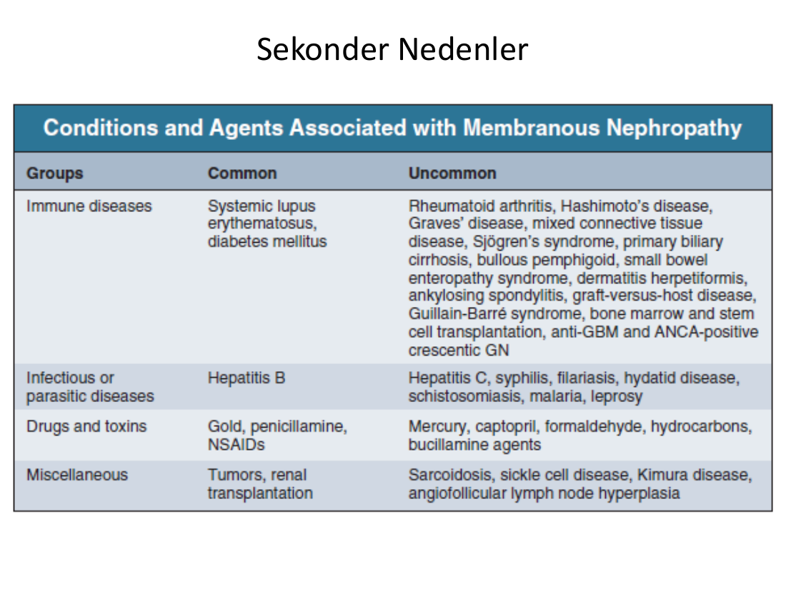

| Grup | Sık Nedenler | Diğer |
|---|---|---|
| **Otoimmün hastalıklar** | **Sistemik lupus eritematozus (SLE)**, diabetes mellitus | Romatoid artrit, Hashimoto tiroiditi, Graves hastalığı, miks bağ dokusu hastalığı, primer bilier siroz, sirkoz, bullöz pemfigoid, epidermolizis bülloza, dermatitis herpetiformis, ankilozan spondilit, sarkoidoz, Guillain-Barré, Sjögren, Gilmer-Sidbury sendromu, crescentik GN |
| **Enfeksiyöz** | **Hepatit B**, hepatit C | Sifiliz, lepra, filariazis, hidatik hastalık, şistozomiyazis, malaria, enterokokkal endokardit |
| **İlaçlar** | NSAİİ, altın, **penisilamin**, merkür, kaptopril, formaldehit, hidrokarbonlar, bukillamin |
| **Diğer (malignite)** | **Solid tümörler** (akciğer, kolon, meme, prostat), sarkoidoz, orak hücre hastalığı, Kimura hastalığı, anjiofoliküler lenf nodu hiperplazisi |

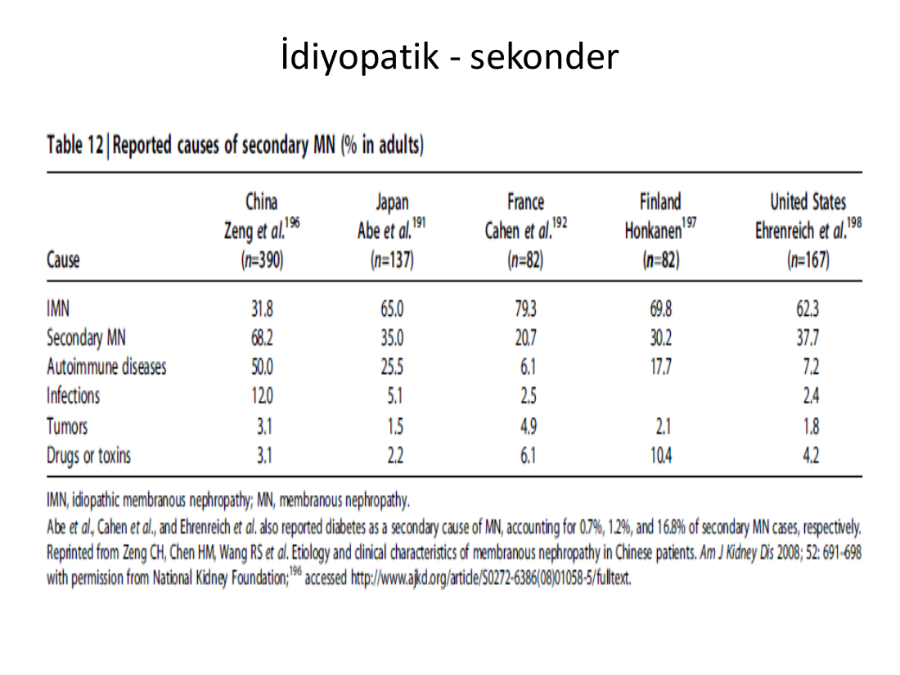

> **Tablo yorumu:**
>
> Erişkinde raporlanan sekonder MGN nedenlerinin ülkelere göre dağılımı: İdiopatik MN (IMN) %62-80; sekonder MN %20-38. Sekonder nedenler içinde **otoimmün hastalıklar** (SLE başta) %6-50, enfeksiyonlar %2,5-12, **tümörler %1,5-5**, ilaçlar %2,2-10 oranlarında yer alır. Bu veriler etnik/coğrafi faktörler ile değişkenlik gösterir.

### Malignite Taraması

* **Occult malignite için geniş tarama önerilmiyor** (gaitada gizli kan, anemi, kilo kaybı varlığında geniş tarama)
* **Yaşa uygun kanser taramaları:**
  * **50 yaş üstü** erkek ve kadında **kolonoskopi**
  * **40 yaş üstü kadında mamografi**
  * **50 yaş üstü erkekte PSA**
  * Akciğer kanseri için yüksek risk gruplarında PA akciğer grafisi, gerekirse toraks BT
* **Malignite prevalansı:** < 60 yaş %4,1; > 60 yaş **%19,4**

### Doğal Seyir

* **Spontan tam remisyon:** 5 yılda **%5-30**
* **Spontan kısmi remisyon** (proteinüri ≤ 2 gr/gün): 5 yılda **%25-40**
* **Tedavi edilmeyenlerde SDBY** (son dönem böbrek yetmezliği):
  * 5 yıl: **%14**
  * 10 yıl: **%35**
  * 15 yıl: **%41**

### Risk Faktörleri

| Kötü Prognoz | İyi Prognoz |
|---|---|
| > 50 yaş | Genç erişkin |
| Erkek cinsiyet | Kadın cinsiyet |
| Nefrotik düzeyde proteinüri | Nonnefrotik proteinüri |
| **Özellikle > 8-10 gr/gün** | Proteinüride progresif ↓ |
| Tanıda yüksek kreatinin | Normal BFT |

### Risk Sınıflaması (Toronto Risk)

| Risk | Kriter | 5 yılda KBY'ye ilerleme |
|---|---|---|
| **Düşük** | Proteinüri < 4 gr/gün + GFR normal (6 aylık takipte) | **%8** |
| **Orta** | Proteinüri 4-8 gr/gün + GFR normale yakın (6 aylık takipte) | **%50** |
| **Yüksek** | Proteinüri > 8 gr/gün (3 ay süre ile) ve/veya GFR ↓ | **%75** |

### Klinik Bulgular

* **%60-70** başlangıçta **nefrotik sendrom** (ödem, hiperlipidemi, hipoalbuminemi)
* **%30-40** non-nefrotik proteinüri
* **Non-selektif proteinüri**
* Mikroskopik hematüri **%30-40**
* Başlangıçta kan basıncı normal veya hafif yüksek
* **Tromboembolik hastalığa eğilim** (DVT, renal ven trombozu, PE) -- **%10-40** (tüm primer GN'ler içinde en yüksek risk)

### Böbrek Fonksiyonlarında Hızlı Bozulma -- Nedenleri

MGN doğal seyrinde yavaş ilerleyen bir hastalıktır; kreatininde hızlı yükselme varsa üç ana neden düşünülmeli:

1. **Renal ven trombozu** -- bilateral, yan ağrısı
2. **Akut interstisyel nefrit** -- ilaçlara bağlı, eozinofili
3. **Kresentik GN'ye dönüşüm** -- hematüri ile birlikte artan proteinüri

### Laboratuvar Bulguları

* **C3 ve C4 normal** (MPGN'den ayırıcı)
* BFT genellikle normal
* < %10 BFT yüksek
* **Serum PLA2R antikoru** pozitifliği primer MGN'yi destekler; tedavi yanıtı takibinde kullanılabilir

### Patoloji

**Işık mikroskopi (LM):**

* Erken dönemde glomerül normal, kapiller duvarları belirgin
* Subepitelyal immün birikim arttıkça **GBM'de kalınlaşma**
* Bazal membranın epitel tarafında **sivri uçlu görünüm (spike)** -- metenamin-gümüş boyada belirgin
* İlerledikçe kapiller lümeni daralır, sklerozis ve hiyalinozis

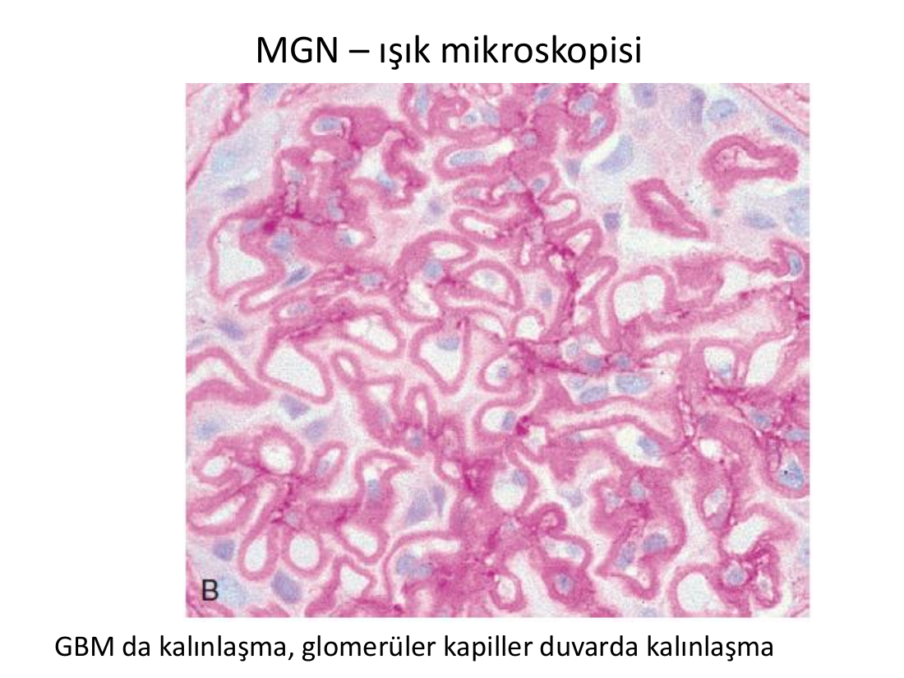

> **Histoloji yorumu:** PAS veya metenamin-gümüş boyalı ışık mikroskopisi kesiti. Glomerüler kapiller duvarlar **difüz olarak kalınlaşmış** görünür; hücresel proliferasyon veya inflamatuvar hücre infiltrasyonu **yoktur**. Bu bulgu subepitelyal immün depolanmanın GBM'yi genişletmesi ile açıklanır.

**İmmünfloresan (IF):**

* **GBM boyunca granüler IgG ve C3 birikimi** -- karakteristik
* Epitel (podosit) tarafında granüler tarzda dağılım
* **PLA2R için immünfloresan boyama** primer MGN'de pozitif

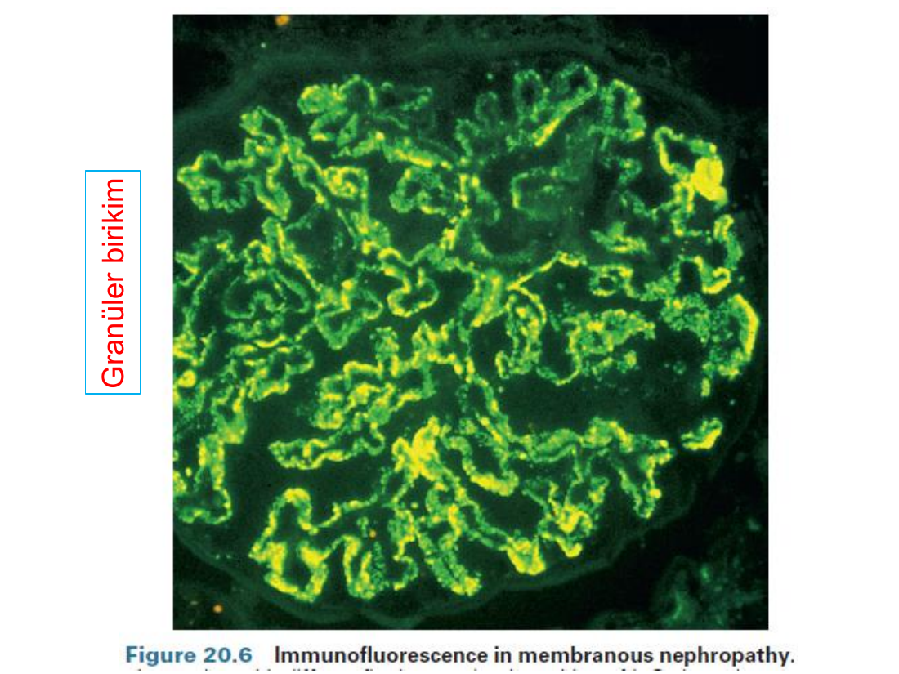

> **Histoloji yorumu:** Anti-IgG floresan boyama; glomerüler kapiller duvarlar boyunca **granüler ("frosted/starry sky") pattern**. Bu granüler subepitelyal birikim, primer MGN'nin en önemli tanısal bulgusudur; lineer birikim (anti-GBM hastalığı) ve mezangial birikim (IgA nefropatisi) ile karıştırılmamalıdır.

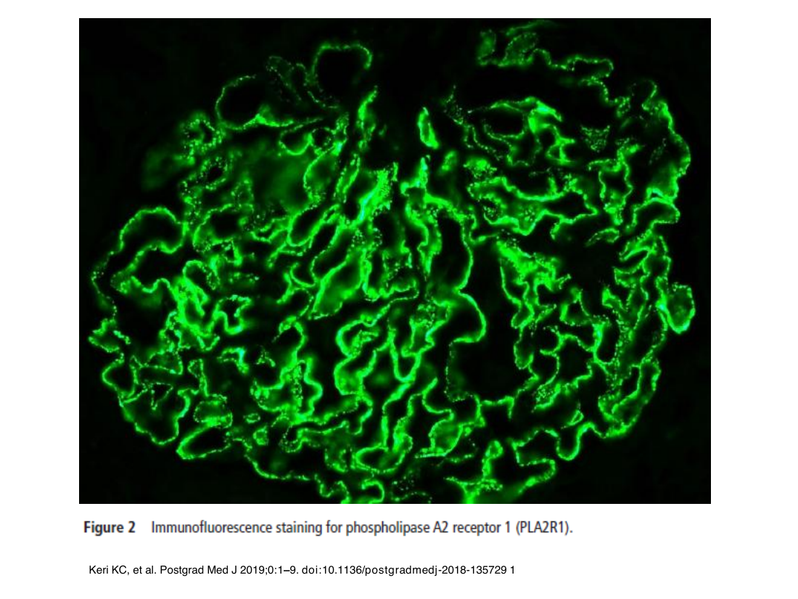

> **Histoloji yorumu:** **Anti-PLA2R immünfloresan** ile granüler subepitelyal boyama. Bu pozitiflik **primer idiyopatik MGN** tanısını moleküler düzeyde destekler. PLA2R antikoru hem dokuda hem serumda saptanabilir; serum titresi hastalık aktivitesi ve tedavi yanıtı ile korelasyon gösterir.

**Elektron mikroskopi (EM) -- Ehrenreich-Churg Sınıflaması:**

| Evre | Bulgu |
|---|---|
| **Evre I** | Küçük subepitelyal elektron-dens depozitler; GBM normal |
| **Evre II** | GBM'den podosit tarafına uzanan **spike (sivri çıkıntılar)** |
| **Evre III** | Depozitler **GBM içinde gömülü** (intramembranöz), spike'lar tepelerinde kubbeleşir ("dome pattern") |
| **Evre IV** | Rezorbe depozitlerin yerinde **vakuolleşme / transparan alanlar**; GBM düzensiz kalınlaşmış |

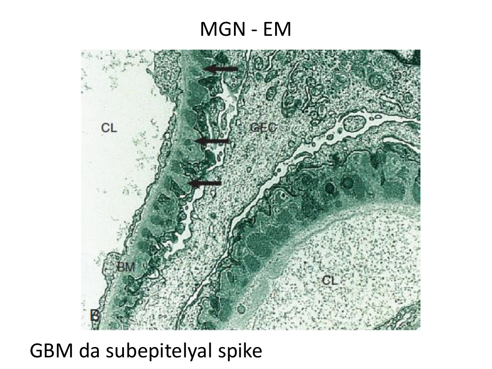

> **Histoloji yorumu:** Elektron mikroskopi görüntüsünde kapiller lümen (CL), GBM ve podositler görülür. GBM'nin epitel tarafında **elektron-dens subepitelyal depozitler** (oklar) ve bunlara paralel **sivri GBM uzantıları (spike)** -- Ehrenreich-Churg Evre II tipik bulgusu. Hastalık ilerledikçe spike'lar depozitleri örterek GBM'ye gömer (Evre III).

### Tedavi -- Non-İmmünsüpresif (Tüm Hastalara)

* **Kan basıncı kontrolü** (hedef < 125/75 mmHg)
* **ACE-İ + ARB** (etki hızlı; ilk 3 ay içinde proteinüriyi %30 azaltır)
* **Sodyum kısıtlaması** (RAS blokajı etkinliğini artırır)
* **Lipid düşürücü tedavi** (LDL < 100 mg/dL)
* **Protein kısıtlaması** (0,8 gr/kg/gün) -- proteinüriyi %15-25 azaltır
* Sigara, obezite kontrolü
* **Diüretik** (hipervolemi varsa)
* **Antikoagülasyon** (seçilmiş hastalara)

### Proteinüride Hedef

* **Tam remisyon:** proteinüri < 0,3 gr/gün + BFT normal
* **Kısmi remisyon:** proteinüri 1-3,5 gr/gün + proteinüride en az %50 azalma
* **Hedef:** proteinüri < 1 gr/gün (tercihen < 0,3 gr/gün)

### Antikoagülasyon Endikasyonları

**Serum albümin < 2,5-2 gr/dL** olan hastalarda, aşağıdaki ek risk faktörlerinden biri varsa:

* Proteinüri > 10 gr/gün
* Vücut kitle indeksi (BMI) > 35 kg/m²
* Tromboembolik aile öyküsü, belgelenmiş genetik yatkınlık
* NYHA Sınıf III-IV kalp yetmezliği
* Yakın zamanlı abdominal / ortopedik cerrahi veya uzamış immobilizasyon

**Kontrendikasyonlar:** Uyumsuz hasta, kanama bozukluğu, GİS kanaması, SSS hemorajisi, warfarin metabolizmasını/etkinliğini bozan genetik bozukluk.

**Rejim:** Riskli hastalara heparin 5000 IU 2x1 SC; uzun dönem warfarin INR 2-3 hedefle.

### KDIGO 2021 Risk Stratifikasyonu ve Tedavi

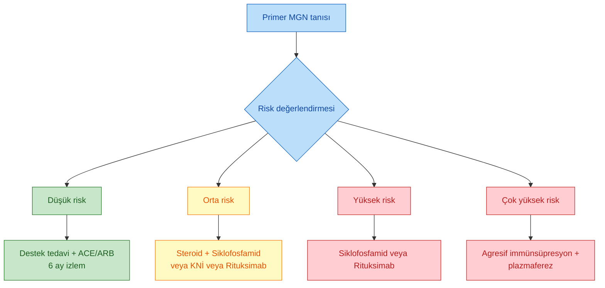
```mermaid
flowchart TD
    A[Primer MGN tanısı] --> B{Risk değerlendirmesi}

    B --> C[Düşük risk]
    B --> D[Orta risk]
    B --> E[Yüksek risk]
    B --> F[Çok yüksek risk]

    C --> C1[Destek tedavi + ACE/ARB<br/>6 ay izlem]
    D --> D1[Steroid + Siklofosfamid<br/>veya KNİ veya Rituksimab]
    E --> E1[Siklofosfamid veya Rituksimab]
    F --> F1[Agresif immünsüpresyon +<br/>plazmaferez]

    classDef diagnose fill:#c8e6c9,stroke:#2e7d32,color:#1b5e20
    classDef test fill:#bbdefb,stroke:#1565c0,color:#0d47a1
    classDef warning fill:#fff9c4,stroke:#f57f17,color:#e65100
    classDef exclude fill:#ffcdd2,stroke:#c62828,color:#b71c1c
    class A,B test
    class C,C1 diagnose
    class D,D1 warning
    class E,E1,F,F1 exclude
```

**KDIGO 2021 risk kategorileri:**

| Risk | Kriter | İlk seçenek |
|---|---|---|
| **Düşük** | Normal GFR + proteinüri < 3,5 gr/gün + serum albümin > 3 gr/dL **veya** 6 ayda proteinüride > %50 azalma | **Sadece destek tedavi** (ACE-İ/ARB), 6 ay izlem |
| **Orta** | Normal GFR + proteinüri 3,5-8 gr/gün, 6 ay destek tedaviye rağmen düzelmeyen **veya** PLA2R Ab > 50 RU/mL | **Rituksimab** veya KNİ (tercihen takrolimus) veya siklofosfamid/steroid |
| **Yüksek** | Azalmış GFR (< 60 mL/dk) **ve/veya** proteinüri > 8 gr/gün + albümin < 2,5 gr/dL **veya** PLA2R Ab > 150 RU/mL | **Siklofosfamid/steroid (Ponticelli)** veya rituksimab |
| **Çok yüksek** | Hayatı tehdit eden nefrotik sendrom, hızlı GFR kaybı | Siklofosfamid + steroid ± **plazmaferez** (özellikle alloimmünize hasta, transplant sonrası) |

### İmmünsüpresif Tedavi Seçenekleri

* **Steroid** (monoterapi yetersiz; kombinasyon içinde)
* **Klorambusil**
* **Siklofosfamid**
* **Siklosporin**
* **Takrolimus**
* **Mikofenolat mofetil (MMF)**
* **Rituksimab** (CD20 monoklonal Ab -- PLA2R antikor üretimini bloke eder)
* **ACTH**

### Ponticelli Protokolü (6 aylık alterne siklofosfamid-steroid)

Yüksek riskli MGN için klasik, kanıt düzeyi yüksek rejim:

| Ay | İlaç |
|---|---|
| **1. ay** | Metilprednizolon 1 gr IV/gün x 3 gün → prednizon 0,4 mg/kg/gün PO, 27 gün |
| **2. ay** | Siklofosfamid 2-2,5 mg/kg/gün PO, 30 gün |
| **3. ay** | Metilprednizolon 1 gr IV/gün x 3 gün → prednizon 0,4 mg/kg/gün PO, 27 gün |
| **4. ay** | Siklofosfamid 2-2,5 mg/kg/gün PO, 30 gün |
| **5. ay** | Prednizon rejimi |
| **6. ay** | Siklofosfamid rejimi |

### Diğer İmmünsüpresif Rejimler

**Takrolimus:** 2x1 (0,05 mg/kg/gün), kan düzeyi hedefi 3-5 mcg/L. Tam/kısmi remisyona girenlerde 12 aya kadar devam; sonra 6 ay boyunca 2 ayda bir doz %25 azaltılarak kesilir.

**Rituksimab (GEMRITUX, MENTOR çalışmaları):**

* **CD20+ B hücre deplesyonu** ile PLA2R antikor üretimini azaltır
* Dozaj: **1000 mg IV x 2 doz, 2 hafta ara ile** veya **375 mg/m² haftada, toplam 4 hafta**
* MENTOR çalışmasında rituksimab siklosporine üstün bulunmuştur (24 ayda remisyon)

### Steroid Tedavisi Alanlarda Profilaksi

* **Pneumocystis jirovecii** için trimetoprim-sülfametoksazol
* **Osteoporoz profilaksisi** (yaşlı, postmenopozal kadın): GFR > 30 ise bifosfonat

---

## FOKAL SEGMENTAL GLOMERÜLOSKLEROZ (FSGS)

### Tanım ve Epidemiyoloji

> **Tanım:** Glomerüllerin yalnızca bir kısmında (fokal) ve tutulan glomerüllerde de yalnızca belli segmentlerde (segmental) skleroz ile karakterize, podosit hasarından kaynaklanan glomerülopatidir.

* **MGN ve MDH'den sonra idiyopatik nefrotik sendromun 3. en sık nedeni**
* Nefrotik sendromun **%10-20'sinden sorumlu**
* **Siyah ırkta daha sık** (APOL1 gen varyantları)
* **SDBY'ye ilerleme riski yüksek**
* Erkek cinsiyet baskın, ortalama başlangıç yaşı 20-30

### Sınıflama

| Grup | Nedenler |
|---|---|
| **Primer (idiyopatik)** | Permeabilite faktörü hipotezi; MDH'den progresyon |
| **Ailesel / genetik** | Nefrin (NPHS1), podosin (NPHS2), α-aktinin 4 (ACTN4), TRPC6, WT1, INF2, PLCE1, **APOL1** |
| **İlaca bağlı** | Eroin, interferon, lityum, pamidronat, sirolimus, anabolik steroid |
| **Virüslere bağlı** | **HIV-1**, parvovirüs B19, SV40, CMV |
| **Yapısal-fonksiyonel adaptif** | Renal kitlenin azalması, düşük doğum ağırlığı, renal displazi, **reflü nefropati (VUR)**, cerrahi renal ablasyon, kronik allogreft nefropati, oligomeganefroni |
| **Hemodinamik / hiperfiltrasyon** | HT, **obezite** (morbid), ateroemboli, siyanotik konjenital kalp hastalığı, **orak hücreli anemi** |

**Primer FSGS'nin %25'inde podosit proteinlerinde genetik anomali** saptanır.

### Patoloji

**Işık mikroskopi:**

* Patolojik değişikliklerin ilk başladığı yer **jukstamedüller glomerüllerdir** -- biyopsi yalnız kortikal yüzeyel glomerülleri kapsıyorsa **FSGS tanısı gözden kaçabilir** ve MDH olarak rapor edilebilir
* **Glomerüler hilustan başlayan segmental skleroz**, mezangial hiperselülarite
* Etkilenen glomerülün çevresinde tübüler atrofi, periglomerüler skar, interstisyel fibrozis
* Plazma proteinleri **subendotelyal** bölgede eozinofilik hiyalin birikim; komşu kapiller yumakların kollapsı

**İmmünfloresan:**

* Genellikle **immün birikim yok**
* Bazı olgularda (özellikle FSGS NOS ve kollapsing varyant) **IgM ve C3 birikimi** olabilir (non-spesifik tuzaklanma)

**Elektron mikroskopi:**

* **Podosit ayaksı çıkıntılarının silinmesi** (primer FSGS'de difüz, sekonder FSGS'de < %50 segmental)
* İmmün birikim yok
* Mezangial skleroz

### FSGS Varyantları (Columbia Sınıflaması -- 5 Tip)

| Varyant | Özellik | Klinik |
|---|---|---|
| **1. NOS (not otherwise specified / klasik)** | Gruplanamayan; en sık tip | En değişken prognoz |
| **2. Perihiler** | Skleroz glomerüler hilus çevresinde; sık postadaptif (obezite, VUR) | Sekonder FSGS'de baskın |
| **3. Selüler** | Endokapiller hiperselülerite + skleroz | Primer FSGS ile ilişkili |
| **4. Tip varyant (uç, "tip lesion")** | Segmental skleroz proksimal tübüle yakın tip bölgede | **En iyi prognoz**, steroide iyi yanıt |
| **5. Kollapsing** | Global glomerüler kollaps + podosit hipertrofi/hiperplazi; belirgin tübüler hasar | **En kötü prognoz**; HIV-ilişkili nefropati (HIVAN), parvovirüs B19, interferon, pamidronat |

### Kollapsing Varyant Özellikleri

* En az bir glomerülde segmental veya global kollaps + visseral epitel hücre hipertrofi/hiperplazi
* Daha çok global lezyonlar
* Endokapiller hiperselülerite **yoktur**
* Tübülointerstisyel hastalık belirgin: tübüler atrofi, interstisyel fibrozis, ödem, inflamasyon
* IF: kollaps lezyonlarında IgM ve C3 pozitif
* EM: hem kollabe hem normal glomerüllerde ayaksı çıkıntı silinmesi
* **HIV-ilişkili FSGS'de sık**
* Parvovirüs B19, interferon, pamidronat toksisitesinde de gözlenir

### Primer -- Sekonder FSGS Ayırımı

| Özellik | Primer FSGS | Sekonder / Postadaptif FSGS |
|---|---|---|
| **Başlangıç** | Ani, tam nefrotik sendrom | Yavaş, non-nefrotik proteinüri |
| **Serum albümin** | Düşük (nefrotik) | Normal / hafif düşük |
| **Ödem** | Belirgin | Sınırlı / yok |
| **Ayaksı çıkıntı silinmesi (EM)** | **Difüz, > %80 glomerülde** | **Segmental, < %50** |
| **Glomerülomegali** | Nadir | Sık (obezite, VUR) |
| **Perihiler lezyon** | Nadir | Baskın |
| **İmmünsüpresyona yanıt** | Var | **Yok** (altta yatan nedene yönelik tedavi) |

### Klinik Bulgular

* **İdiyopatik FSGS**: asemptomatik proteinüriden tam nefrotik sendroma kadar spektrum
* Nefrotik sendrom: erişkinde %50-70, çocukta %70-90
* **Sekonder FSGS**: non-nefrotik proteinüri, albümin normal
* **Hipertansiyon tanıda %30-50**
* **Non-nefrotik persistan proteinüri %20**
* **Hematüri + proteinüri %5**
* Erişkinde ortalama başlangıç yaşı 20-30
* Böbrek yetmezliği gelişme riski MDH'ye göre belirgin yüksek, spontan remisyon azdır

### Laboratuvar

* Proteinüri **non-selektif**
* **Steril piyüri, glukozüri, aminoasidüri** gibi anormalliklerin en sık izlendiği primer glomerüler hastalıktır
* **Serum C3 normal**, IgG azalmış
* Hipoalbuminemi
* Kreatinin yüksek olabilir
* Faktör V, VII, VIII, X, fibrinojen artmıştır
* Antitrombin III, Faktör XI ve XII azalmıştır

### İlerleyici Hastalık İçin Risk Faktörleri

**Biyopsi anındaki klinik bulgular:**

* Nefrotik düzeyde / masif proteinüri
* Yüksek serum kreatinini
* **Siyah ırk**

**Biyopsi anındaki histopatolojik bulgular:**

* **Kollapsing varyant**
* Tübülointerstisyel fibrozis

**İzlem sırasında:**

* Kısmi veya tam remisyon sağlayamama

### Tanı ve İnceleme

* Lipid profili, serum albümin, temel laboratuvar
* İdrar mikroskopisi
* 24 saat idrarda proteinüri
* **Hepatit B/C ve HIV serolojisi**
* Kompleman düzeyleri (C3, C4)
* Yaşlılarda **serum ve idrar protein elektroforezi** (paraproteinemi dışlama)
* **Kesin tanı için böbrek biyopsisi**

### Tedavi

**Genel önlemler (tüm hastalar):**

* Sodyum kısıtlaması
* Diüretik
* Protein kısıtlaması (0,8 gr/kg/gün)
* **HT kontrolü** (< 125/75 mmHg)
* Hiperlipidemi tedavisi (statin)
* **ACE-İ / ARB** -- ilk basamak antiproteinürik

**Spesifik immünsüpresif tedavi (primer FSGS):**

* **Steroid tedavinin temel taşıdır** -- **6 aydan uzun süre**
* Prednizon **1 mg/kg/gün** veya **1,5-2 mg/kg/gün aşırı** (günaşırı)
* 4-8 haftalık tedavi sonrası doz azaltımı
* Başlangıç tedaviye yanıt **%40-80**

**Alternatifler / steroide dirençli olgular:**

* **Siklosporin** 3-6 mg/kg/gün, 4-6 ay (hedef düzey 100-175 ng/mL)
* **Siklofosfamid** 2 mg/kg/gün, 2-4 ay
* **Takrolimus**
* **MMF** 1-1,5 gr 2x1, 4-6 ay
* **Rituksimab** (steroid bağımlı/dirençli seçilmiş olgularda)
* **Plazmaferez** (permeabilite faktörünün uzaklaştırılması; özellikle transplant sonrası nüks)

**Not:** Sekonder FSGS'de immünsüpresyon etkisizdir; altta yatan nedene yönelik tedavi yapılır. Genetik FSGS'de immünsüpresyon **faydalı değildir**.

### FSGS Tedavi Algoritması

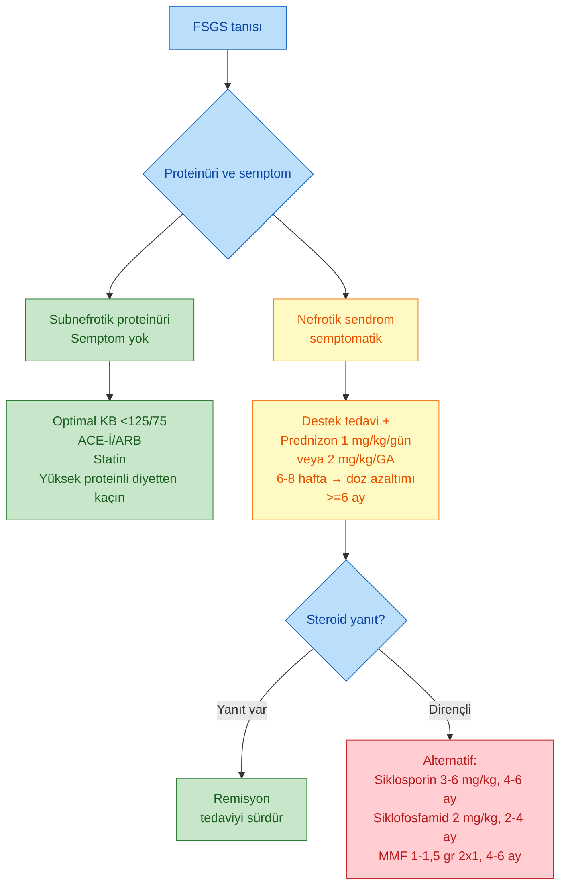
```mermaid
flowchart TD
    A[FSGS tanısı] --> B{Proteinüri ve semptom}

    B --> C[Subnefrotik proteinüri<br/>Semptom yok]
    B --> D[Nefrotik sendrom<br/>semptomatik]

    C --> C1[Optimal KB <125/75<br/>ACE-İ/ARB<br/>Statin<br/>Yüksek proteinli diyetten kaçın]

    D --> D1[Destek tedavi +<br/>Prednizon 1 mg/kg/gün<br/>veya 2 mg/kg/GA<br/>6-8 hafta → doz azaltımı<br/>>=6 ay]

    D1 --> E{Steroid yanıt?}
    E -->|Yanıt var| F[Remisyon<br/>tedaviyi sürdür]
    E -->|Dirençli| G[Alternatif:<br/>Siklosporin 3-6 mg/kg, 4-6 ay<br/>Siklofosfamid 2 mg/kg, 2-4 ay<br/>MMF 1-1,5 gr 2x1, 4-6 ay]

    classDef diagnose fill:#c8e6c9,stroke:#2e7d32,color:#1b5e20
    classDef test fill:#bbdefb,stroke:#1565c0,color:#0d47a1
    classDef warning fill:#fff9c4,stroke:#f57f17,color:#e65100
    classDef exclude fill:#ffcdd2,stroke:#c62828,color:#b71c1c
    class A,B,E test
    class C,C1,F diagnose
    class D,D1 warning
    class G exclude
```

### Prognoz ve Transplant

* **~%50'si 5-10 yılda SDBY'ye ilerler**
* **Transplant sonrası FSGS nüksü %30-40** -- erken nüks genellikle ilk günlerde, **permeabilite faktörü**ne bağlı olduğu düşünülen primer FSGS'de görülür
* Nüks histopatolojisi natif böbrek ile benzer
* Plazmaferez transplant sonrası nükste denenebilir

---

## MİNİMAL DEĞİŞİKLİK HASTALIĞI (MDH / MLH)

### Tanım ve Epidemiyoloji

> **Tanım:** Işık mikroskopisinde glomerül normal görünür, immünfloresanda depolanma yoktur; elektron mikroskopisinde **podosit ayaksı çıkıntılarının difüz silinmesi** ile karakterize, çocukluk çağı nefrotik sendromunun baskın nedenidir.

* **Pediatride en sık nefrotik sendrom nedeni (%80-90)**
* Erişkinlerde nadir (**%10-15**)
* **Akut başlangıçlı** nefrotik sendrom
* Böbrek yetmezliği genellikle görülmez
* Başka isimler: "lipoid nefroz", "nil lesion"

### Etyoloji

| Grup | Nedenler |
|---|---|
| **İdiyopatik (çoğunluk)** | Podosit hedefli T hücre disfonksiyonu, dolaşan permeabilite faktörü |
| **Neoplazi** | **Hodgkin hastalığı** (klasik birliktelik), Non-Hodgkin lenfoma |
| **İlaçlar** | **NSAİİ** (eşlik eden akut interstisyel nefrit ile), daunomisin, interferon, lityum |
| **Enfeksiyonlar** | Viral |
| **Atopi** | Alerjik hastalık ilişkisi (polen, besin, arı sokması) |

### Patogenez

* **T hücre aracılıklı** immün mekanizma sorumlu
* **CD8 T lenfosit artmış**, **CD4 T lenfosit azalmış**
* Dolaşan bir sitokin / permeabilite faktörünün podositlere etki ettiği, ayaksı çıkıntı silinmesine yol açtığı düşünülmekte
* Yeni tanımlanan bir antikor: **Anti-nefrin antikorları** (vakaların bir kısmında pozitif)

### Patoloji

* **LM:** Glomerül **normal** görünüm (tuzak: optik nötrfomacy)
* **IF:** **Negatif** (IgM nadiren zayıf mezangial)
* **EM:** **Podosit ayaksı çıkıntıların difüz silinmesi** -- patognomonik tek bulgu

### Klinik Bulgular

* **Ani başlangıçlı masif proteinüri + nefrotik sendrom**
* **Seçici (selektif) proteinüri** (başlıca albümin)
* Mikroskopik hematüri nadir (< %20)
* Hipertansiyon nadir
* GFR genellikle normal
* Ödem belirgin (pretibial, periorbital); çocuklarda skrotal/vulvar

### Laboratuvar

* Nefrotik sendromun klasik bulguları
* **Seçici proteinüri** (albümin >> globülin)
* C3, C4 normal

### Tedavi

* **Steroid ilk seçenek** -- yüksek yanıt oranı (**%90**)
* **Prednizon 1 mg/kg/gün** (maks 60 mg/gün) veya **2 mg/kg gün aşırı** -- 8-16 hafta, sonra **6 ayda azaltarak kesme**
* **Çocukta ampirik steroid**: nefrotik sendrom tablosunda böbrek biyopsisi yapılmadan steroid başlanır; yanıt varsa tanı **MDH** olarak konulur, yanıt yoksa renal biyopsi endike
* Relaps sıktır (vakaların yarısı relaps yapar)

**Steroid bağımlı / dirençli / sık relaps yapan olgular:**

* **Siklofosfamid** 2-2,5 mg/kg/gün, 8-12 hafta (erişkinde)
* **Kalsinörin inhibitörleri** (siklosporin, takrolimus)
* **MMF**
* **Rituksimab** (giderek sık kullanılan seçenek; steroid bağımlılığını kırmak için)
* **Levamizol** (çocuklarda)

### Prognoz

* **İyi prognoz** -- böbrek yetmezliği nadir
* **%60-70 relaps** yapar, ancak steroid yanıtı sürer
* **Uyarı:** MDH'de 5-10 yıl sonrasında böbrek yetmezliği gelişirse tanı **FSGS** olarak revize edilmelidir; FSGS erken dönemde MDH ile karışabilir çünkü yüzeyel glomerüller normal görünür

---

## IGA NEFROPATİSİ (BERGER HASTALIĞI)

### Tanım ve Epidemiyoloji

> **Tanım:** Mezangiumda **difüz IgA depolanması** ile karakterize; **dünyada primer glomerülonefritlerin en sık nedeni**dir. İlk olarak 1968'de Jean Berger ve Hinglais tarafından tanımlandı.

* **Dünyada en sık primer GN**
* **Coğrafi dağılım:**
  * **Asya**: böbrek biyopsilerinin **%30-40**
  * **Avrupa**: %15-20
  * **Amerika**: %5-10
* 2.-3. dekad başlangıç, genç erişkin
* E/K **2/1 -- 6/1**
* **Sinsi ilerleyici** hastalık
* **20 yılda SDBY: ~%30**

### Mezengial IgA Birikimi ile Giden Hastalıklar

| Primer | Sekonder |
|---|---|
| **IgA Nefropatisi** | HIV enfeksiyonu, toxoplasmosis |
| | Sero (-) spondiloartropati, ankilozan spondilit, Reiter sendromu |
| | Çölyak hastalığı, gluten enteropatisi, dermatitis herpetiformis, Crohn hastalığı |
| | KC hastalığı, alkolik siroz |
| | Sicca sendromu, sklerit, mastit, pulmoner hemosideroz |
| | Lepra, ailesel IgA nefropatisi |
| | Siklik nötropeni, immün trombositopeni |
| | Neoplaziler: mycosis fungoides, akciğer ca, müsin-sekrete eden Ca |
| | **Henoch-Schönlein purpurası (IgA vasküliti) -- IgA nefropatisinin sistemik formu** |

### Patogenez -- "4-Hit" (Multi-Hit) Hipotezi

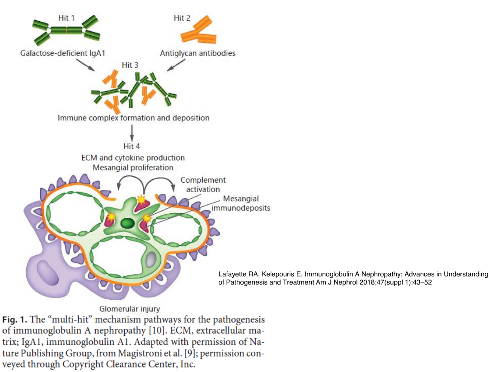

> **Şema yorumu:**
>
> **"Multi-hit" (çoklu vuruş) modeli IgA nefropatisi patogenezini dört ardışık basamakla açıklar:**
>
> 1. **Hit 1:** Anormal glikozilasyonlu, **galaktoz-eksik IgA1** (Gd-IgA1) üretimi artar (mukozal plazma hücrelerinde)
> 2. **Hit 2:** Dolaşımda Gd-IgA1'in açığa çıkan O-bağlı glikan epitoplarına karşı **antiglikan antikorlar** (IgG ve/veya IgA) oluşur
> 3. **Hit 3:** Dolaşımda **immün kompleksler** oluşur (Gd-IgA1 + antiglikan Ab)
> 4. **Hit 4:** İmmün kompleksler **mezangiuma depolanır** → kompleman aktivasyonu (alternatif ve lektin yol) → mezangial proliferasyon, ECM birikimi, sitokin üretimi → glomerüler hasar

**Patogenez özet bulguları:**

* **IgA1** (kemik iliği, dalak, lenf nodu plazma hücrelerinden; monomerik) glomerüllerde birikir
* **IgA2** (solunum yolu, GİS; polimerik) birikmez
* IgA1'in **anormal glikozilasyonu (O-galaktosizasyonu)** anahtardır
* IgA1'in kendi kendine agregasyonu, dolaşımdan temizlenmesinin bozulması, ekstraselüler matrikse fazla bağlanması
* IL-6, IL-1, TNF, serbest O₂ radikalleri
* **Kompleman aktivasyonu (alternatif veya lektin yolu)** -- klasik yol aktif değil

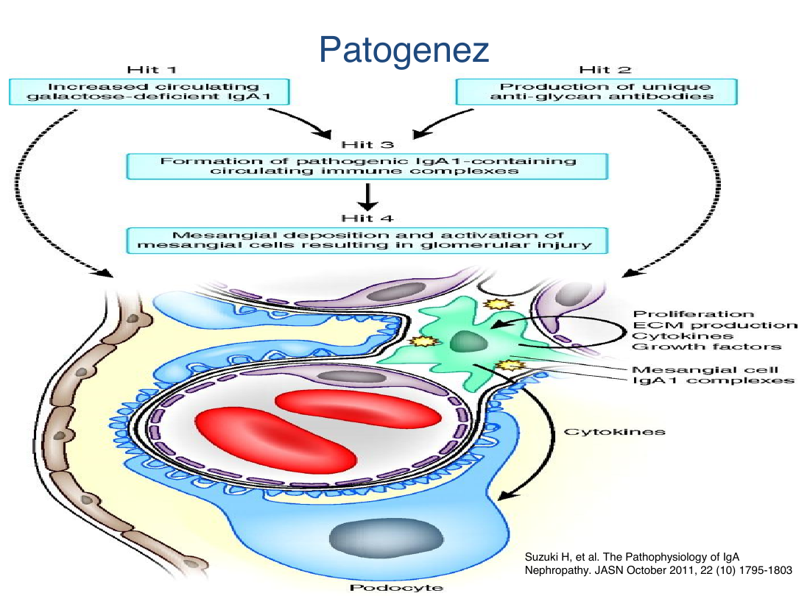

> **Şema yorumu:** Hit 1'de galaktoz-eksik IgA1 üretimi, Hit 2'de unique antibodies (antiglikan antikorlar) oluşumu, Hit 3'te patojenik IgA1-içeren immün komplekslerin oluşumu, Hit 4'te ise bu komplekslerin mezangiuma depolanması ve mezangial proliferasyon, kompleman aktivasyonu, proinflamatuvar sitokin salınımı sonucu glomerüler hasar oluşması gösterilir.

### Klinik Bulgular

**Klasik prezentasyonlar:**

* **Makroskopik hematüri** (genç hastalarda sık) -- ataklar sıklıkla **eş zamanlı** veya **ÜSYE'nin 1.-2. gününde** gelişir ve **"sinfarenjitik"** olarak adlandırılır (postinfeksiyöz GN'nin 10-14 günlük latent dönemi YOKTUR)
* **Mikroskopik hematüri** (%30-40)
* **Akut böbrek hasarı** (cast nefropatisi, ATN)
* Yavaş ilerleyen renal yetmezlik
* **Nefrotik sendrom** (%5) -- "IgAN-MDH overlap" olarak da bilinir
* **Kresentik glomerülonefrit** (hızlı ilerleyici GN)

### IgA Nefropatisi ve Post-Streptokoksik GN Ayrımı

| Özellik | IgA Nefropatisi | Post-streptokoksik GN |
|---|---|---|
| **Enfeksiyon-hematüri aralığı** | **Senkronize (1-2 gün)** | **10-14 gün latent** |
| **Yaş** | Genç erişkin | Çocuk (5-12 yaş) |
| **Kompleman (C3)** | **Normal** | **Düşük** |
| **Seyir** | Kronik, rekürren | Self-limiting |
| **IgA antikoru** | Yüksek (%50) | Normal |
| **Anti-streptolizin O (ASO)** | Negatif | Pozitif |

### Tanı

* **İmmünfloresan** altın standart: **mezangial IgA depolanması** (C3 ile birlikte, IgM değişken)
* Serum galaktoz-eksik IgA1 ve anti-glikan antikor düzeyleri (araştırma amaçlı)
* Serum IgA normal olabilir (tanı dışlamaz)
* Kompleman (C3, C4) normal

### Patoloji -- Oxford MEST-C Sınıflaması

**Oxford MEST-C:** IgA nefropatisinin prognostik histolojik sınıflaması. Her skor bağımsız prognostik anlam taşır.

| Harf | Parametre | Skor |
|---|---|---|
| **M** | **Mezangial hiperselülerite** | M0 (< %50 glomerülde), M1 (≥ %50) |
| **E** | **Endokapiller hiperselülerite** | E0 (yok), E1 (var) |
| **S** | **Segmental glomerüloskleroz** | S0 (yok), S1 (var) |
| **T** | **Tübüler atrofi / interstisyel fibrozis** | T0 (< %25), T1 (%26-50), T2 (> %50) |
| **C** | **Kresent** (Crescent) | C0 (yok), C1 (< %25), C2 (≥ %25) |

**Tübülointerstisyel fibrozis (T skoru)** ve **kresent (C skoru)** en güçlü prognostik belirteçlerdir.

### Kötü Prognoz Göstergeleri

| Klinik | Histopatolojik |
|---|---|
| **Hipertansiyon** | Mezangial hiperselülerite (M1) |
| **Böbrek yetmezliği** (Cr > 2-3 mg/dL "geri dönüşümsüz nokta") | Endokapiller proliferasyon (E1) |
| **Şiddetli proteinüri** (> 1 gr/gün) | Segmental glomerüloskleroz (S1) |
| Hiperürisemi | **Tübüler atrofi / interstisyel fibrozis (T1-T2)** |
| Gross obezite | Kapiller IgA birikimi |
| Semptom süresi | Kresent (C1-C2) |
| İleri yaş | |

**İyi prognoz:** Tekrarlayan makroskopik hematüri (izole)

**Prognoza etkisi olmayan:** Cinsiyet, IgA birikiminin yoğunluğu, serum IgA düzeyi

### Geri Dönüşümsüz Nokta

Serum kreatininin aştığında immünsüpresyonun faydası azalır:

* **Serum Cr > 3 mg/dL** (D'Amico 1993, Scholl 1999)
* Serum Cr > 2 mg/dL (Kamatsu 2005 -- Japon kohortu)

### Tedavi

**Tedavi hedefleri:**

* Nefrojenik IgA üretimini azaltmak
* Glomerüler IgA birikimini önlemek/temizlemek
* Erken dönemde immün ve inflamatuvar süreçleri bloke etmek
* Renal yetmezliğe neden olan non-spesifik olayları önlemek
* Transplant sonrası nüksü önlemek

### KDIGO / Risk Temelli Tedavi

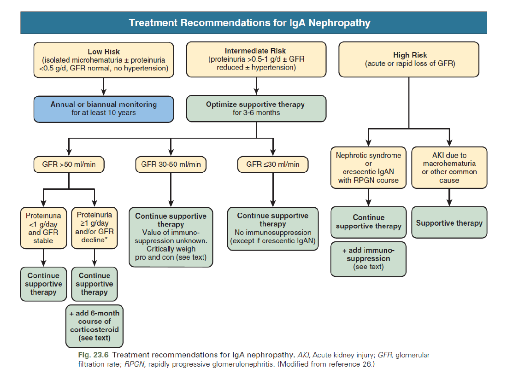

> **Şema yorumu:**
>
> **IgA nefropatisinde risk-temelli tedavi algoritması:**
>
> * **Düşük risk:** İzole mikrohematüri ± proteinüri < 0,5 gr/gün, GFR normal, HT yok → **10 yıl yıllık/6 aylık izlem**
> * **Orta risk:** Proteinüri > 0,5-1 gr/gün ± GFR azalmış ± HT → **3-6 ay optimal destek tedavi**; GFR > 50 ve proteinüri ≥ 1 gr/gün ve/veya GFR azalıyorsa → **6 aylık kortikosteroid kürü** ekle; GFR 30-50: immünsüpresyon faydası belirsiz; GFR ≤ 30: immünsüpresyon verilmez
> * **Yüksek risk:** Nefrotik sendrom veya kresentik IgAN / RPGN → **destek tedavi + immünsüpresyon**; makrohematüriye bağlı AKI → sadece destek tedavi

### Tedavi Seçenekleri

**Destek tedavi (tüm hastalarda):**

* **ACE-İ / ARB** (ilk basamak) -- glomerüler HT ve hiperfiltrasyonu düzenler
  * Proteinüri > 1 gr/gün → hedef TA **125/75 mmHg**
  * Proteinüri < 1 gr/gün → hedef TA **130/80 mmHg**
  * Proteinüri hedefi **< 500 mg/gün**
* **Balık yağı** (omega-3: EPA + DHA)
  * Yüksek doz: 3,76 gr EPA + 2,94 gr DHA/gün
  * Standart: 1,88 gr EPA + 1,47 gr DHA/gün
  * Biyolojik mediatörlerde (IL-1, IL-2, TNF, PDGF) azalma, TG-VLDL düşüşü, antiagregant etki, nitrik oksit artışı
* Sigara, obezite, tuz kısıtlaması

**İmmünsüpresif tedavi seçenekleri:**

* **Steroid** -- proteinüriyi azaltır, SDBY'ye gidişi yavaşlatır (renal fonksiyonları normal/hafif azalmış hastalarda)
* **Budesonid (Nefecon)** -- yeni generasyon; mukozal hedefli, Peyer plağındaki B hücrelerine etki eder, sistemik yan etki daha az; **2021 FDA onayı**
* **MMF** -- T ve B lenfosit proliferasyonunu inhibe eder (özellikle Asya popülasyonunda etkili)
* **Azatioprin**
* **Siklofosfamid** (kresentik/RPGN seyirli IgAN'de)

**Not -- TESTING ve STOP-IgAN çalışmaları:**

* **STOP-IgAN (2015):** Destek tedaviye immünsüpresyon eklemenin GFR kaybını engellemediği, yan etkileri artırdığını göstermiştir
* **TESTING (2017, 2022):** Yüksek proteinürili olgularda azaltılmış dozda metilprednizolon GFR kaybını ve SDBY'yi azaltmıştır (yan etki profili daha iyi)
* Son yıllarda **mukozal-hedefli budesonid** öne çıkmaktadır

### Özel Klinik Durumlar

**Kresentik IgA nefropatisi:**

Kronik böbrek hasarı olmaksızın:

* Nefrotik düzeyde proteinüri
* Artmış kan basıncı
* SDBY'ye hızlı ilerleme
* **Kresent > %10** (biyopsi)

→ Kresentik/hızlı ilerleyici GN tedavisi: **yüksek doz steroid + siklofosfamid ± plazmaferez**

**Nefrotik IgA ("MDH-IgAN overlap"):**

* Normal görünümlü glomerül
* Sadece mezangial IgA birikimi
* EM'de difüz ayaksı çıkıntı silinmesi
* → **Steroid tedavisine dramatik yanıt**

**Makroskopik hematüri atakları:**

* Tonsillektomi ve profilaktik antibiyoterapi **kanıt yetersiz**
* Spesifik tedavi önerilmemekte -- **destek tedavi**

**IgAN + akut böbrek hasarı (ABH):**

* Cast nefropatisi (tübüler obstrüksiyon) veya ATN
* Destek tedavi + hidrasyon
* **2-3 gün içinde düzelme yoksa → biyopsi** (kresentik dönüşüm?)

### Transplant Sonrası Nüks

* 10 yıllık greft kaybı **~%9,7**
* **Histolojik nüks %50-60** (klinik nüks daha nadir)
* 10 yıllık greft sağkalımı diğer GN'lerden farklı değil
* Nüksü önleyecek spesifik immünsüpresif rejim yok

---

## MEMBRANOPROLİFERATİF GLOMERÜLONEFRİT (MPGN)

### Tanım ve Genel Özellikler

> **Tanım:** Kompleman sisteminin kontrolsüz aktivasyonu ile karakterize; glomerüler yumak lobüle, hiperselüler; kapiller duvar kalınlaşmış ve **çift kontur ("tramvay yolu")** görünümünde; mezangial proliferatif glomerülonefrit grubudur.

**Diğer isimler:** Mezangiokapiller GN, hipokomplementemik GN, lobüler GN

**Glomerülde elektron-yoğun birikimler vardır -- 3 klasik tip:**

* **MPGN Tip I:** Subendotelyal ve mezangial birikim
* **MPGN Tip II:** İntramembranöz yoğun birikim (**Dense Deposit Disease, DDD**)
* **MPGN Tip III:** Subendotelyal, mezangial **ve subepitelyal** birikim

### Yeni Sınıflama (2012 Sonrası)

Geleneksel Tip I/II/III yerine **immünolojik-patogenetik sınıflama** benimsenmiştir:

| Yeni Sınıflama | Patogenez | Alt gruplar |
|---|---|---|
| **İmmün-kompleks aracılı MPGN (IC-MPGN)** | IgG/IgM + kompleman depozitleri; klasik yol aktif | **Hepatit C (en sık), hepatit B, SLE, kriyoglobulinemi, bakteriyel endokardit, monoklonal gamopati** |
| **C3 glomerülopatisi** | Sadece C3 depoziti, IgG yok; alternatif yol disregülasyonu | **C3 glomerülonefrit (C3GN)**, **Dense Deposit Disease (DDD)** |

**İmmünfloresanda IgG yoksa ve sadece C3 baskınsa → C3 glomerülopatisi.**

### Nedenler (Geleneksel Sınıflama ile)

| Tip | Sekonder Nedenler |
|---|---|
| **MPGN Tip I (miks kriyoglobulinemi, Tip II-III)** | **Hepatit C (%70-90)**, bakteriyel endokardit, hepatit B |
| **MPGN Tip I (kriyoglobulinsiz)** | Bakteriyel enfeksiyon (endokardit, apse, infekte ventriküler şant), viral (hepatit B/C/G, HIV, Hanta virüs, malarya), kollajen vasküler (**SLE**, hipokomplementemik ürtikeriyel vaskülit), herediter kompleman eksikliği (C1q, C2, C4, C3), edinilmiş kompleman eksikliği (C4 nefritik faktör), kronik KC hastalığı, orak hücre, malignite (KLL, lenfoma, timoma, RCC) |
| **Dense Deposit Disease (MPGN Tip II)** | **C3 nefritik faktör** + parsiyel lipodistrofi ± retinal anomaliler; **Faktör H mutasyonu / antikor** |
| **MPGN Tip III** | MPGN Tip I sekonder nedenleri (HCV/HBV) |

### Patogenez

**Ortak özellik:** Kompleman sisteminin **düzenlenmemiş (dysregulated) aktivasyonu**.

* **Tip I:** İmmün kompleks birikimi + kompleman **klasik yol** aktivasyonu
* **Tip II (DDD):** Kompleman sisteminin **sürekli alternatif yol aktivasyonu**, C3 düzeyi düşük
* **Tip III:** Tip I + **terminal kompleman yolu (C5-C9)** aktivasyonu

**Tip II MPGN (DDD) patogenezinde:**

* **Alternatif kompleman yolun aşırı aktivasyonu**
* İnhibitor bozukluğu: **Faktör H eksikliği** (kalıtsal mutasyon veya antikor)
* **C3 Nefritik Faktör (C3NeF):** C3 konvertaza karşı oluşmuş **IgG veya IgM yapısında otoantikor**, C3'ü sürekli aktive eder
* **Sonuç:** Düşük serum **C3**; C2, C4 ve terminal kompleman (C5-C9) **normaldir**
* **Parsiyel lipodistrofi**: kompleman aracılı adiposit kaybına bağlı (üst vücut yağ kaybı tipik)

### Klinik

* İnsidans düşük, sporadik
* Yeni başlayan nefritik sendromların **%5-30**'unu açıklar
* Erişkinlerde çocuklardan daha az
* E/K eşit
* Beyazlarda siyahlara göre sık

**Prezentasyonlar:**

| Tablo | Sıklık |
|---|---|
| Mikroskopik hematüri + non-nefrotik proteinüri | %35 |
| **Nefrotik sendrom** | %35 |
| Kronik progressif glomerülonefrit | %20 |
| Hızlı ilerleyen böbrek yetmezliği (proteinüri + eritrosit silendiri) | %10 |
| **Hipertansiyon** | **%50-80** |

**DDD'ye özgü klinik:** Parsiyel lipodistrofi + retinal anormallikler (drusen)

**Kriyoglobulinemiye bağlı olgular:**

* Güçsüzlük
* Diz, kalça, omuzlarda tutan artralji
* Alt ekstremitede palpabl vaskülitik lezyonlar
* Raynaud fenomeni
* Digital nekroz
* Periferal nöropati
* Hepatomegali, siroz bulguları (HCV ilişkili)

### Laboratuvar

**MPGN'de kompleman bulguları -- anahtar ayrıştırıcı:**

| Tip | C3 | C4 | CH50 | C5-C9 |
|---|---|---|---|---|
| **Tip 1** | **↓** | **↓** | ↓ | Normal |
| **Tip 2 (DDD)** | **↓↓** | Normal | ↓ | Normal |
| **Tip 3** | ↓ | Normal | Normal | **↓** |

**C3 Nefritik Faktör (C3NeF) pozitifliği:**

* Tip 1 ve Tip 3: %20-25
* **Tip 2 (DDD): %60-70**
* Sekonder MPGN: %50

**C3NeF aktivitesi DDD ile güçlü ilişkili, ancak DDD'ye özgü değildir.** Hemolitik test veya C3NeF IgG katı-faz analizi ile saptanır.

**Kriyoglobulinemik hastalarda:** Hepatit B ve C taraması zorunludur.

### Patoloji

**Işık mikroskopi:**

* Difüz mezangial ve endotelyal hücre proliferasyonu
* Kapiller duvar kalınlaşması ve **glomerül bazal membranında bölünme ("tram-track / çift kontur")**
* Hipersellülerite glomerül yumağın lökosit/monosit infiltrasyonu ile artar
* Şiddetli olgularda kresent saptanabilir
* Trikrom boyasında birikimler görünür
* **Metenamin-gümüş boyası** GBM bölünmesini en iyi gösterir

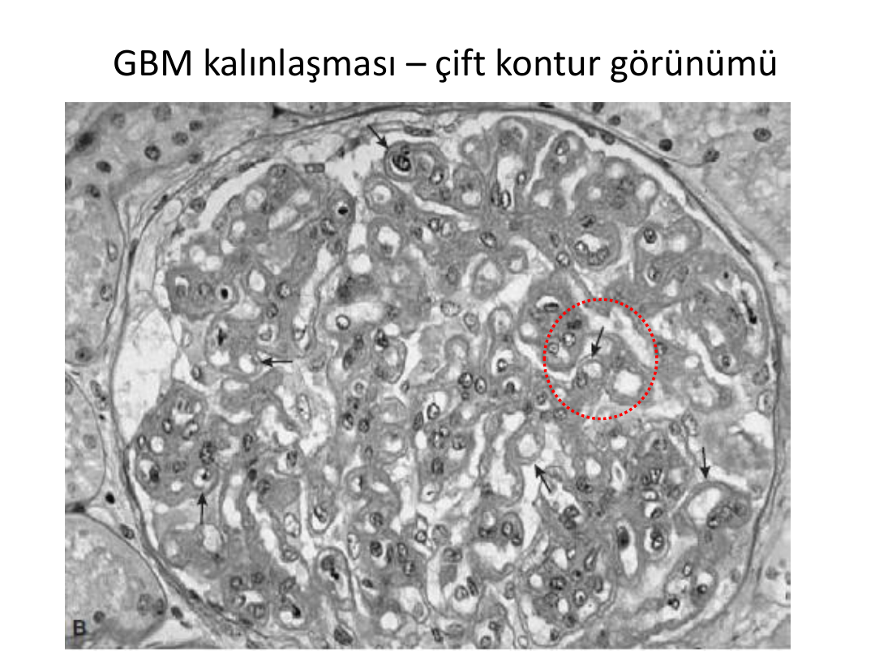

> **Histoloji yorumu:** MPGN için karakteristik **"çift kontur / tramvay yolu"** görünümü. Kapiller duvarın metenamin-gümüş boyası ile siyah boyanan dış hattı ve yeni sentezlenen iç hattı arasında mezangial hücre sitoplazması (mezangial interpozisyon) uzanmıştır. Glomerüler yumak belirgin **hiperselülerdir** (mezangial + endotelyal + infiltratif hücreler). Bu bulgular MPGN'nin ışık mikroskopisinde tanınmasını sağlayan iki temel özelliktir.

**İmmünfloresan:**

* Genellikle **C3, IgG ve IgM** için kapiller duvar ve mezangiumda pozitif
* Klasik kompleman yolu yapıları (C1q) Tip 1'de görülür
* **C3 glomerülopatisinde yalnızca C3 pozitif, IgG negatif**

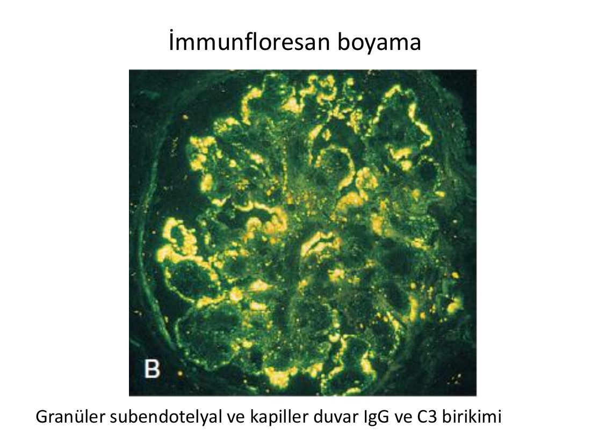

> **Histoloji yorumu:** Anti-C3 immünfloresan boyama ile glomerüler kapiller duvar boyunca ve mezangiumda **granüler, kaba (kaba granüler) subendotelyal ve mezangial** IgG ve C3 birikimi. MPGN'nin karakteristik immünfloresan paternidir. IgG baskın ise immün-kompleks aracılı MPGN; yalnızca C3 baskın ise **C3 glomerülopatisi** düşünülür.

**Elektron mikroskopi -- tipe göre yerleşim:**

| Tip | EM Bulgusu |
|---|---|
| **Tip 1** | **Subendotelyal ve mezangial** elektron-dens depozitler |
| **Tip 2 (DDD)** | GBM'nin **lamina densa içinde** sürekli, kalın, şerit benzeri elektron-dens depozitler (adını buradan alır) |
| **Tip 3** | **Subendotelyal, mezangial VE subepitelyal** depozitler |

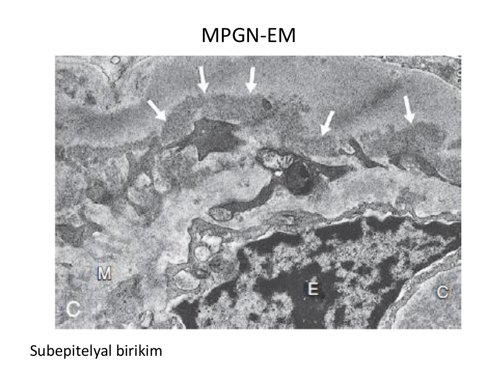

> **Histoloji yorumu:** Elektron mikroskopi görüntüsünde GBM'nin subepitelyal tarafında (podositler altı) elektron-dens depozitler (oklar). Bu bulgu özellikle **MPGN Tip III**'te saptanır (Tip I'de subendotelyal baskın, Tip III'te hem subendotelyal hem subepitelyal bulunur).

### Ayırıcı Tanı (MPGN benzeri histoloji)

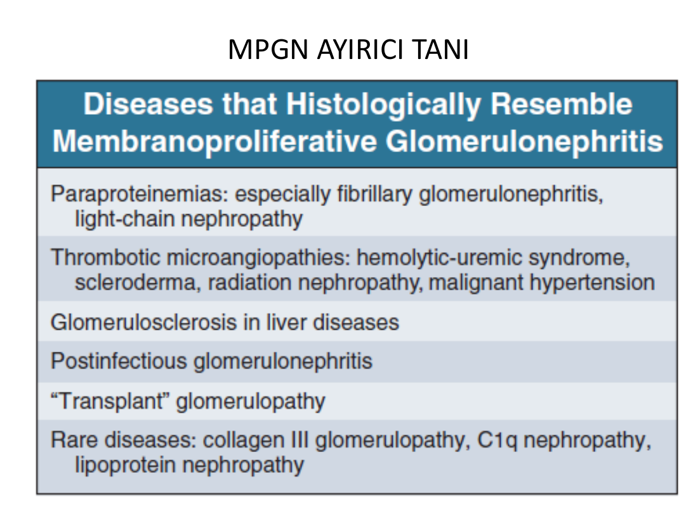

> **Tablo yorumu:**
>
> **Histolojik olarak MPGN'yi taklit eden durumlar:**
>
> * **Paraproteinemiler** (özellikle fibriler glomerülonefrit, hafif-zincir nefropati)
> * **Trombotik mikroanjiyopatiler** (HÜS, sklerdoderma renal kriz, radyasyon nefropatisi, malign HT)
> * KC hastalıklarında glomeruloskleroz
> * Post-infeksiyöz glomerülonefrit
> * "Transplant" glomerulopatisi
> * Nadir durumlar: **kollajen tip III glomerulopatisi, C1q nefropatisi, lipoprotein nefropatisi**
>
> Bu tablo MPGN tanısında **klinik kontext ve ek laboratuvar** (kompleman, SPEP/IFE, HCV, ADAMTS13) ile dikkatli değerlendirme gerektiğini vurgular.

### Tedavi

**Genel prensipler:**

* **Altta yatan nedene yönelik tedavi en önemli adımdır** (hepatit C → DAA tedavisi; SLE → immünsüpresyon; monoklonal gamopati → klon-hedefli tedavi)
* **ACE-İ / ARB** destek tedavisi
* **Steroid** yalnızca nefrotik sendrom veya renal fonksiyon bozukluğunda

**Tedavi seçenekleri:**

* Steroid (6 ay dozu)
* **Siklofosfamid**
* **MMF**
* Antitrombosit / antikoagülan (dipiridamol -- günümüzde önerilmiyor)
* **İnterferon ve ribavirin** (HCV-ilişkili MPGN; artık DAA'lar tercih edilir)
* **Rituksimab** (kriyoglobulinemik MPGN, idiyopatik IC-MPGN)
* **Eculizumab** (C3 glomerülopatisi / DDD'de denenmiştir -- terminal kompleman C5 inhibitörü)

### Tip ve Yaş Gruplarına Göre Tedavi Özeti

| Tip | Tedavi |
|---|---|
| **Tüm tipler** | Destekleyici tedavi, konservatif (ACE-İ, ARB) |
| **İdiyopatik MPGN (çocuk)** | Non-nefrotik proteinüri, normal böbrek fonk: **3 ay ara ile izle** Normal böbrek fonk, proteinüri > 3 gr/gün: **prednizolon 40 mg/m², günaşırı 3 ay** Nefrotik veya böbrek fonk bozuk: **prednizolon 40 mg/m², günaşırı 2 yıl**, sonra 20 mg gün aşırıya azalt 3-10 yılda |
| **İdiyopatik MPGN (erişkin)** | Non-nefrotik proteinüri, normal böbrek fonk: **3 ay ara ile izle** Nefrotik veya böbrek fonk bozuk: **1 mg/kg/gün 6 ay steroid (12-16 hft)**; proteinüride > %30 azalma varsa 6-8 ay doz azaltarak sürdür; yanıt yoksa kes, **KNİ denenebilir** Hızlı ilerleyen böbrek yetmezliği + difüz kresent: **hızlı ilerleyen GN gibi tedavi** KBY veya nefrotik sendrom varlığında: **ACE-İ** |

### Sekonder MPGN -- Temel Prensip

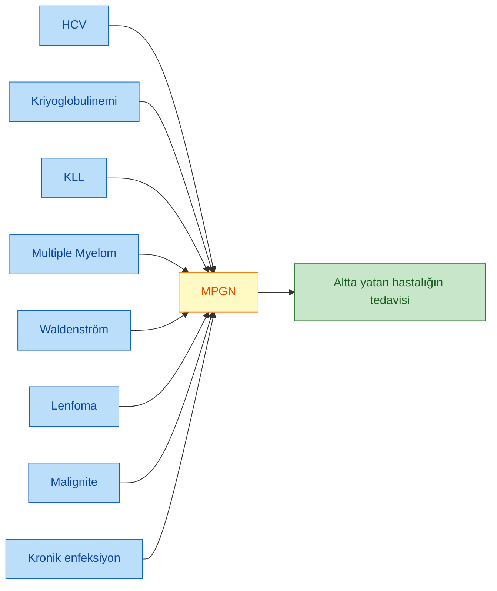
```mermaid
flowchart LR
    A[HCV] --> Z[MPGN]
    B[Kriyoglobulinemi] --> Z
    C[KLL] --> Z
    D[Multiple Myelom] --> Z
    E[Waldenström] --> Z
    F[Lenfoma] --> Z
    G[Malignite] --> Z
    H[Kronik enfeksiyon] --> Z

    Z --> T[Altta yatan hastalığın tedavisi]

    classDef diagnose fill:#c8e6c9,stroke:#2e7d32,color:#1b5e20
    classDef test fill:#bbdefb,stroke:#1565c0,color:#0d47a1
    classDef warning fill:#fff9c4,stroke:#f57f17,color:#e65100
    class A,B,C,D,E,F,G,H test
    class Z warning
    class T diagnose
```

### Prognoz

* **%50'si 5 yılda SDBY'ye ilerler**
* 10 yıllık izlemde **%64 SDBY**
* **Kötü prognoz göstergeleri:**
  * Başlangıçta nefrotik sendrom
  * Yaygın tübülointerstisyel lezyonlar
  * İnterstisyel fibrozis
  * Azalmış GFR

### Transplant Sonrası Nüks

* Transplant hastalarının **%20-30'unda nüks**
* **DDD (Tip 2) nüks riski %90** -- en yüksek
* Nüks hastalarının **%40'ında geri dönüşümsüz greft kaybı**

---

## POST-STREPTOKOKSİK GN (KISA ÖZET)

### Tanım ve Epidemiyoloji

> **Tanım:** **Grup A beta-hemolitik streptokok (GABHS)** enfeksiyonu sonrası, özellikle çocuklarda gelişen akut nefritik sendrom tablosu.

* Çocuklarda (5-12 yaş), E > K
* Gelişmiş ülkelerde insidans azalmış, gelişmekte olan ülkelerde halen önemli neden
* **Sporadik veya epidemik** formlar

### Patogenez

* Streptokoksik farenjit (10-14 gün sonra) veya piyodermi (4-6 hafta sonra)
* **Nefritojenik streptokok antijenleri** (NAPlr, SPEB) → immün kompleks → glomerüler subepitelyal birikim
* **Kompleman klasik + alternatif yol aktivasyonu** (kompleman tüketimi)

### Klinik

* **Ani başlangıçlı nefritik sendrom:**
  * **Hematüri** (makroskopik, çay/kola renkli)
  * **Ödem** (özellikle periorbital)
  * **Hipertansiyon**
  * **Oligüri, azotemi**
* 10-14 gün **latent dönem** (tipik!)

### Laboratuvar

* **Düşük C3** (normale 6-8 haftada döner)
* C4 normal veya hafif düşük
* **ASO yüksek** (farenjit sonrası), **anti-DNase B yüksek** (piyodermi sonrası)
* Boğaz kültürü / cilt kültürü

### Patoloji

* **LM:** Difüz proliferatif GN, nötrofil infiltrasyonu
* **IF:** Kaba granüler IgG + C3 birikimi ("hörgüç / starry sky" pattern)
* **EM:** Subepitelyal elektron-dens **"hörgüç (hump)" depozitleri**

### Tedavi ve Prognoz

* **Destek tedavi:** sıvı kısıtlaması, diüretik, antihipertansif
* **Antibiyotik** (persistan streptokok varsa; hastalığın seyrini değiştirmez)
* İmmünsüpresyon genelde gerekmez
* **Self-limiting** -- çocukların **> %95'inde tam iyileşme**
* Erişkinde prognoz daha kötü (%50 rezidüel bozukluk)

---

## ÖZET KARŞILAŞTIRMA TABLOSU

| Özellik | **MDH** | **FSGS** | **MGN** | **IgA Nefropatisi** | **MPGN** | **Post-streptokoksik GN** |
|---|---|---|---|---|---|---|
| **Tipik yaş** | Çocuk | Genç erişkin | Orta yaş (40-50) | 2.-3. dekad | Her yaş | Çocuk (5-12) |
| **Klinik** | Nefrotik | Nefrotik | **Nefrotik** | **Nefritik** (sinfarenjitik) | Karışık (nefritik+nefrotik) | Nefritik |
| **C3 düzeyi** | Normal | Normal | Normal | Normal | **Düşük** | **Düşük** |
| **Hematüri** | Nadir | Nadir (%5) | %30-40 (mikro) | **Belirgin (makro)** | Sık | **Belirgin (makro)** |
| **Proteinüri** | Selektif, masif | Non-selektif, masif | Non-selektif, masif | Değişken | Değişken | Non-nefrotik |
| **LM bulgusu** | **Normal** | Fokal segmental skleroz | GBM kalınlaşması, spike | Mezangial hiperselülerite | Lobüler, çift kontur | Difüz proliferatif, PMN |
| **IF bulgusu** | **Negatif** | IgM/C3 (fokal) | **Granüler GBM IgG + C3** | **Mezangial IgA + C3** | Kapiller duvar + mezangium IgG + C3 | Kaba granüler IgG + C3 (hörgüç) |
| **EM bulgusu** | Ayaksı çıkıntı silinmesi | Ayaksı çıkıntı silinmesi, segmental skleroz | **Subepitelyal spike / dome** | Mezangial elektron-dens | Subendotelyal/intramembranöz | **Subepitelyal hump** |
| **Karakteristik biyomarker** | -- | APOL1 (siyah ırk) | **Anti-PLA2R Ab (%70-80)** | Gd-IgA1, anti-glikan Ab | **C3NeF (DDD'de)** | ASO, anti-DNase B |
| **Tedavi -- ilk seçim** | **Steroid (yüksek yanıt %90)** | Steroid (uzun) + KNİ/CTX | Destek → risk göre Rituksimab / Ponticelli | **ACE-İ/ARB** + risk göre steroid / budesonid | Altta yatan neden + destek | **Destek tedavi** |
| **Prognoz** | **İyi** | Kötü (%50 SDBY 10 yıl) | Değişken (risk göre) | Sinsi (%30 SDBY 20 yıl) | Kötü (%50 SDBY 5 yıl) | Çocukta iyi, erişkinde kötü |

---

## ANAHTAR ÖĞRENME NOKTALARI

> **⚠️ ÖNEMLİ:**
>
> * **Erişkinde (diyabetik olmayan) en sık nefrotik sendrom nedeni: MGN**
> * **Çocukta en sık nefrotik sendrom nedeni: MDH (%80-90)**
> * **Dünyada en sık primer GN: IgA nefropatisi**
> * **Primer MGN'nin en önemli otoantijeni: PLA2R** (%70-80 pozitif)
> * **MDH'de IF NEGATIF** -- bu bulgu ayırıcıdır
> * **FSGS biyopsisi yüzeyel alınırsa MDH olarak rapor edilebilir** (jukstamedüller glomerüllerden başlar)
> * **Hodgkin lenfoma ile klasik birliktelik: MDH**
> * **IgA nefropatisinde ÜSYE ile hematüri SENKRONIZE (1-2 gün), post-streptokoksikte 10-14 gün LATENT**
> * **Düşük C3 görülen primer GN'ler: MPGN (özellikle DDD) ve post-streptokoksik GN** (ayırıcı için kritik)
> * **Ponticelli protokolü:** 6 ay alterne steroid-siklofosfamid (yüksek riskli MGN)
> * **Oxford MEST-C:** IgA nefropatisinin prognostik histolojik sınıflaması
> * **Rituksimab:** Primer MGN'de MENTOR çalışması ile siklosporine üstün bulunmuştur
> * **Tüm primer GN'lerde destek tedavi: ACE-İ/ARB + HT kontrolü + lipid kontrolü + protein kısıtlaması**
> * **FSGS transplant sonrası nüks %30-40** (permeabilite faktörü); **DDD nüks %90**

---

## KAYNAKLAR

1. Cattran DC, Brenchley PE. Membranous nephropathy: integrating basic science into improved clinical management. Kidney Int. 2017;91(3):566-574.
2. KDIGO 2021 Clinical Practice Guideline for the Management of Glomerular Diseases.
3. Keri KC, et al. Postgrad Med J 2019;0:1-9.
4. Lafayette RA, Kelepouris E. Immunoglobulin A Nephropathy. Am J Nephrol 2018;47(suppl 1):43-52.
5. Suzuki H, et al. The Pathophysiology of IgA Nephropathy. JASN October 2011, 22(10) 1795-1803.
6. Beaudreuil S, et al. Optimal management of primary focal segmental glomerulosclerosis in adults. Int J Nephrol Renovasc Dis. 2017;10:97-107.
7. National Kidney Foundation. K/DOQI Clinical Practice Guidelines for Chronic Kidney Disease. Am J Kidney Dis 39:S1-S266, 2002.
8. Therapy in Nephrology & Hypertension, 3rd ed, 2008.
9. Recent Advances in IgA Nephropathy, 2009.
