# HIZLI İLERLEYEN GLOMERÜLONEFRİT VE BÖBREK VASKÜLİTLERİ

**Hazırlayan:** Prof. Dr. Yavuz Yeniçerioğlu
**Bölüm:** Aydın Adnan Menderes Üniversitesi -- Nefroloji Bilim Dalı

---

## İÇİNDEKİLER

1. [Giriş ve Olgu Sunumu](#giriş-ve-olgu-sunumu)
2. [Renal Vaskülitler: Genel Bakış](#renal-vaskülitler-genel-bakış)
3. [Vaskülitlerin Sınıflaması (CHCC)](#vaskülitlerin-sınıflaması-chcc)
4. [Hızlı İlerleyen Glomerülonefrit (RPGN / Kresentik GN)](#hızlı-ilerleyen-glomerülonefrit-rpgn--kresentik-gn)
5. [Kresent Oluşum Patofizyolojisi](#kresent-oluşum-patofizyolojisi)
6. [Kresentik GN'ye Yol Açan Hastalıklar](#kresentik-gnye-yol-açan-hastalıklar)
7. [Kresentik GN Tipleri (I, II, III)](#kresentik-gn-tipleri-i-ii-iii)
8. [Tip I -- Anti-GBM Hastalığı (Goodpasture)](#tip-i----anti-gbm-hastalığı-goodpasture)
9. [Tip II -- İmmün Kompleks Aracılı GN](#tip-ii----i̇mmün-kompleks-aracılı-gn)
10. [Tip III -- ANCA İlişkili Pauci-İmmün Vaskülitler (AASV)](#tip-iii----anca-i̇lişkili-pauci-i̇mmün-vaskülitler-aasv)
11. [ANCA: Biyokimya ve Tipler](#anca-biyokimya-ve-tipler)
12. [ANCA Hedef Antijenleri ve Klinik Birliktelikler](#anca-hedef-antijenleri-ve-klinik-birliktelikler)
13. [ANCA Sensitivite/Spesifite -- Klinik Prediktif Değer](#anca-sensitivitespesifite----klinik-prediktif-değer)
14. [AASV Epidemiyolojisi](#aasv-epidemiyolojisi)
15. [AASV Etiyopatogenezi](#aasv-etiyopatogenezi)
16. [AASV Klinik Bulguları](#aasv-klinik-bulguları)
17. [GPA (Wegener Granülomatozisi)](#gpa-wegener-granülomatozisi)
18. [MPA (Mikroskopik Polianjiit)](#mpa-mikroskopik-polianjiit)
19. [EGPA (Churg-Strauss Sendromu)](#egpa-churg-strauss-sendromu)
20. [Ayırıcı Tanı Tablosu](#ayırıcı-tanı-tablosu)
21. [Histopatoloji](#histopatoloji)
22. [Tanı Yaklaşımı ve Algoritma](#tanı-yaklaşımı-ve-algoritma)
23. [AASV Tedavisi](#aasv-tedavisi)
24. [İndüksiyon Tedavisi](#i̇ndüksiyon-tedavisi)
25. [İdame Tedavisi](#i̇dame-tedavisi)
26. [Relaps Tedavisi ve Prognoz](#relaps-tedavisi-ve-prognoz)
27. [Renal Transplantasyon](#renal-transplantasyon)
28. [Diğer Sistemik Vaskülitler](#diğer-sistemik-vaskülitler)
29. [Özet ve Anahtar Noktalar](#özet-ve-anahtar-noktalar)

---

## GİRİŞ VE OLGU SUNUMU

> **Tanım:** Hızlı ilerleyen glomerülonefrit (RPGN), haftalar ile aylar içinde ilerleyen, histolojik olarak yaygın **kresent (ay şekli) formasyonu** ile karakterize, tedavisiz bırakıldığında son dönem böbrek yetmezliğine (SDBY) ilerleyen agresif glomerüler hasarlanmadır.

**📋 VAKA ÖRNEĞİ 1: Gözden Kaçan RPGN**

**Hasta:** 45 yaş, erkek
**Başvuru:** Poliklinikte eklem ağrısı şikayeti
**Rutin Tetkik:**

* Serum kreatinin: **1.1 mg/dL** (normal)
* Tam idrar tetkiki (TİT): **Protein (+), eritrosit (+++)**, bakıda bol eritrosit

**İzlem:** Ayaktan izlem kararı verildi.

**1 Ay Sonra:**

* Nefes darlığı ile yeniden başvurdu
* Serum kreatinin: **8.6 mg/dL** (7.5 kat artış)
* İdrar bakısı: **Dismorfik eritrositler + eritrosit silendirleri**  → aktif glomerüler hastalık
* Acil hemodiyaliz başlandı
* Renal biyopsi: **Kresentik glomerülonefrit**

**Sonuç:** Sitotoksik + steroid tedavisine rağmen yetersiz yanıt; **KBY ve kalıcı hemodiyaliz** gereksinimi.

**📚 Öğretici Notlar:**

1. **İdrar mikroskopisi** erken dönemde tek bulgudur; dismorfik eritrosit + eritrosit silendiri **aktif glomerüler hasar** anlamına gelir.
2. Proteinüri + hematüri kombinasyonu, kreatinin normal olsa bile ciddi uyarıdır; **erken şüphe** kalıcı renal hasarlanmayı önleyebilirdi.
3. RPGN'de tanı gecikmesi sıklıkla **geri dönüşümsüz böbrek yetmezliği** ile sonuçlanır.

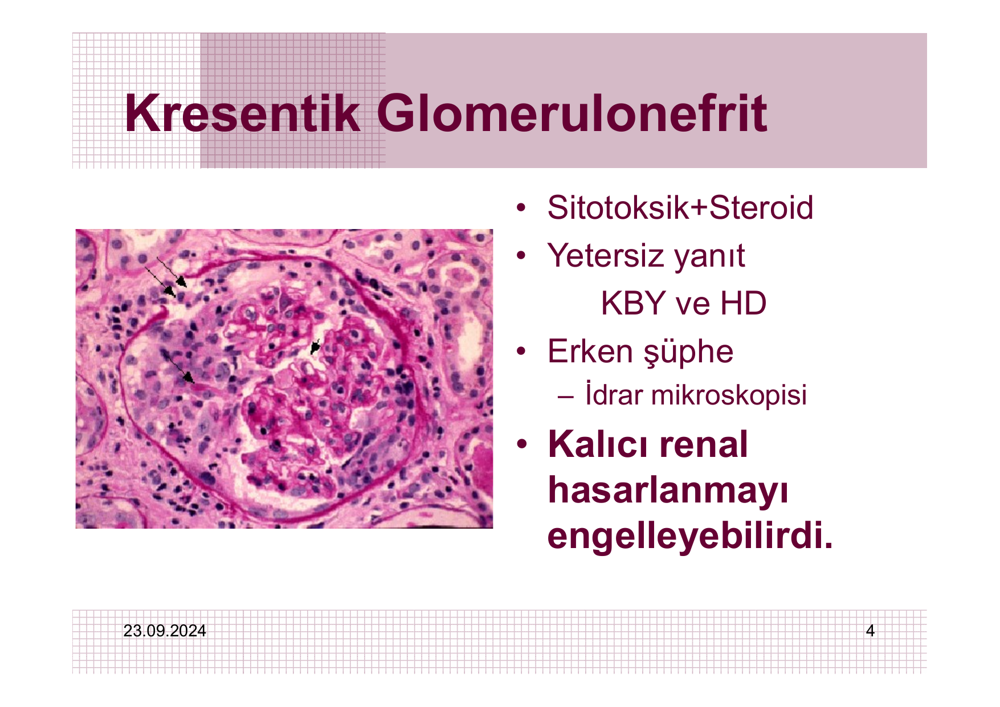

> **Histoloji yorumu:** H&E boyamada glomerül tuftunun (glomerüler kapiller yumak) Bowman aralığına uzanan **hücresel kresent** ile çevrelenmiş olduğu görülmektedir. Kresent, parietal epitel hücrelerinin, makrofajların ve fibrin birikiminin oluşturduğu ay şeklinde yapıdır; **global kresent varlığı glomerülün işlevini kaybetmesi** anlamına gelir. Bu olguda **sitotoksik + steroid** tedavisine yetersiz yanıt, kresentlerin büyük ölçüde **fibröz** fazda olması ile açıklanmıştır.

---

## RENAL VASKÜLİTLER: GENEL BAKIŞ

**Temel İlkeler:**

* **Böbrekler, birçok sistemik vaskülitin hedefidir.**
* Böbrekleri tutan vaskülitler, **tutulan damarın kalibresine bağlı olarak farklı klinik tablolar** oluşturur.
* Renal vaskülitler tipik olarak **küçük kalibreli damarları (SVV -- Small Vessel Vasculitis)** tutar.

| Damar Boyutu | Tutulan Yapı | Klinik Yansıması |
|---|---|---|
| **Büyük damar** | Aort, ana dallar | Renovasküler HT, dev hücreli arterit |
| **Orta damar** | İnterlobar, arkuat arterler | Poliarteritis nodoza (PAN), Kawasaki |
| **Küçük damar (SVV)** | Glomerüler kapiller, arteriyoller, venüller | **Pauci-immün GN**, hematüri, RPGN |

---

## VASKÜLİTLERİN SINIFLAMASI (CHCC)

Chapel Hill Consensus Conference (CHCC) sınıflamasına göre vaskülitler:

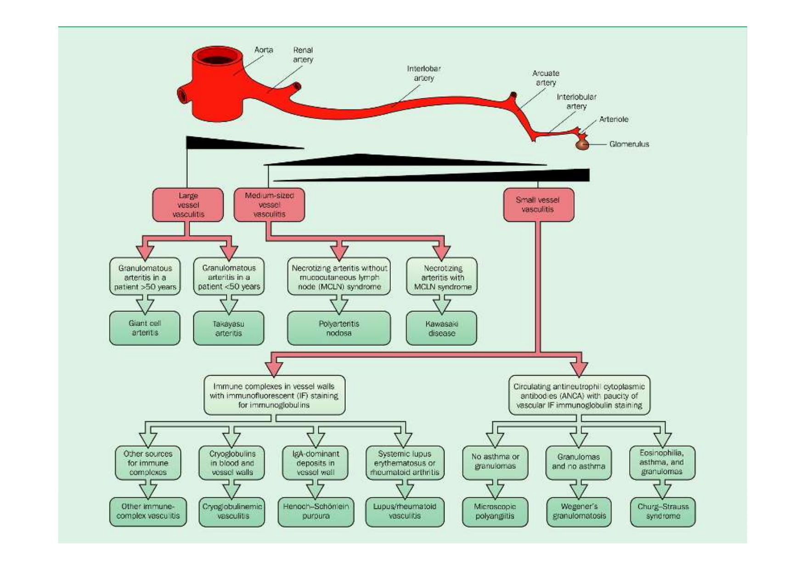

> **Şema yorumu:** Algoritma, vaskülitleri üç ana gruba ayırır.
>
> **Büyük damar vaskülitleri:** Dev hücreli arterit (>50 yaş), Takayasu arteriti (<40 yaş).
>
> **Orta damar vaskülitleri:** Poliarteritis nodoza (PAN), Kawasaki hastalığı.
>
> **Küçük damar vaskülitleri** iki büyük alt gruba ayrılır:
>
> 1. **İmmün kompleks aracılı (IC-vaskülit):** damar duvarında immünfloresan boyamada belirgin birikim vardır. Örnekler: **kriyoglobulinemik vaskülit, IgA vasküliti (Henoch-Schönlein), hipokomplementemik ürtikeryal vaskülit, anti-GBM hastalığı**.
> 2. **ANCA ilişkili (pauci-immün):** dolaşımda ANCA pozitif, damar duvarında immün birikim yok/az. Örnekler: **mikroskopik polianjiit (MPA), granülomatöz polianjiit (GPA/Wegener), eozinofilik granülomatöz polianjiit (EGPA/Churg-Strauss)**.
>
> Ayrıca **paraneoplastik, inflamatuar barsak hastalığı ilişkili, Behçet, ilaç ilişkili, Romatoid, Lupus, infeksiyon ilişkili** vaskülitler de küçük damar grubuna dahil edilir.

**Küçük Damar Vaskülitleri -- Alt Grupları Tablosu:**

| ANCA İlişkili | İmmün Kompleks İlişkili |
|---|---|
| Mikroskobik Polianjiit (MPA) | Kriyoglobulinemik Vaskülit |
| Wegener Granülomatozisi (GPA) | Henoch-Schönlein Purpurası (IgA vasküliti) |
| Churg-Strauss Sendromu (EGPA) | Anti-GBM Hastalığı |
| Renal-limited vaskülit | Serum hastalığı vasküliti |
| İlaçların tetiklediği ANCA ilişkili vaskülit | Lupus vasküliti, Romatoid vaskülit |
| | Hipokomplementemik ürtikeryal vaskülit |
| | Behçet, ilaç ilişkili İC vasküliti |

---

## HIZLI İLERLEYEN GLOMERÜLONEFRİT (RPGN / KRESENTİK GN)

> **Tanım:** Morfolojik olarak **yaygın kresent formasyonu** ile karakterize; haftalar ile aylar içinde hızlı progresyon gösteren (**GFR'de 3 ayda ≥ %50 azalma**) glomerülonefrit formudur.

**Temel Özellikler:**

* **Tedavisiz olgularda 6 ay içinde SDBY gelişme riski: %80**
* Başvuru sırasında hastaların hemen hepsinde **plazma kreatinin > 3 mg/dL**
* Klinik tablo: **hematüri, subnefrotik proteinüri, oligüri, hipervolemi, ödem, hipertansiyon, halsizlik**
* Nefrotik düzeyde proteinüri **nadir** (<3 g/gün sık)

**Kresent Formasyonu -- Prognoz İlişkisi:**

> **⚠️ ÖNEMLİ:**
>
> * **Hastalık derecesi, kresent formasyonu ile doğrudan ilişkilidir**
> * **Glomerül tutulumu > %80** → tedaviye yetersiz yanıt
> * Kresent varlığı, glomerülde **ciddi histolojik hasarı** gösteren bir markerdir
> * Bir dizi farklı glomerülonefritte gözlenebilir (tanısal spesifite yok, şiddet göstergesi)

---

## KRESENT OLUŞUM PATOFİZYOLOJİSİ

**Mekanizma -- Adım Adım:**

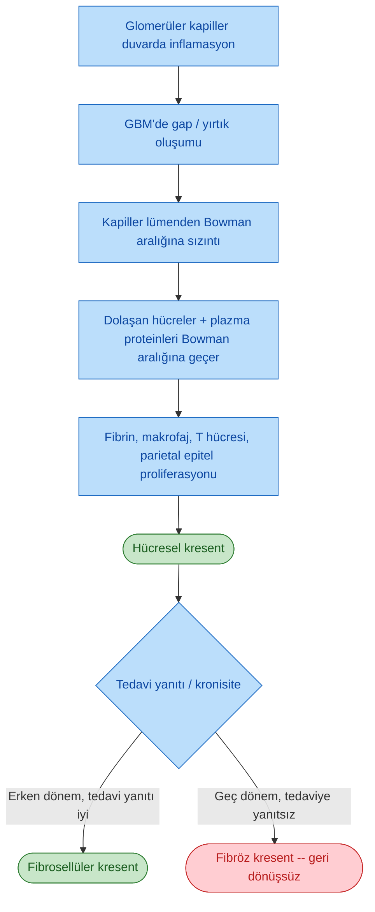
```mermaid
flowchart TD
    A[Glomerüler kapiller duvarda inflamasyon] --> B[GBM'de gap / yırtık oluşumu]
    B --> C[Kapiller lümenden Bowman aralığına sızıntı]
    C --> D[Dolaşan hücreler + plazma proteinleri Bowman aralığına geçer]
    D --> E[Fibrin, makrofaj, T hücresi, parietal epitel proliferasyonu]
    E --> F([Hücresel kresent])
    F --> G{Tedavi yanıtı / kronisite}
    G -->|Erken dönem, tedavi yanıtı iyi| H([Fibrosellüler kresent])
    G -->|Geç dönem, tedaviye yanıtsız| I([Fibröz kresent -- geri dönüşsüz])

    classDef acute fill:#bbdefb,stroke:#1565c0,color:#0d47a1
    classDef reversible fill:#c8e6c9,stroke:#2e7d32,color:#1b5e20
    classDef irreversible fill:#ffcdd2,stroke:#c62828,color:#b71c1c
    class A,B,C,D,E acute
    class F,H reversible
    class I irreversible
    class G acute
```

**Kresent Oluşumunda Görev Alan Bileşenler:**

1. **Koagülasyon proteinleri** (fibrin -- en önemli tetikleyici)
2. **Makrofajlar** (dominant hücre)
3. **T lenfositleri**
4. **Parietal glomerüler epitelyal hücreler** (proliferasyon gösterir)
5. **İnterstisyel fibroblastlar** (geç dönem, fibrozis)

**Kresent Evrimi:**

| Evre | Bileşim | Tedavi Yanıtı |
|---|---|---|
| **Sellüler kresent** | Makrofaj + T hücresi + parietal epitel + fibrin | **İyi** (reversibl) |
| **Fibrosellüler kresent** | Hücre + kollajen | **Orta** |
| **Fibröz kresent** | Kollajen dominant | **Yetersiz** (kalıcı hasar) |

> **⚠️ ÖNEMLİ:** Fibröz kresentler **tedaviye yetersiz yanıt** verir -- erken tanı ve tedavi bu nedenle hayati önemdedir.

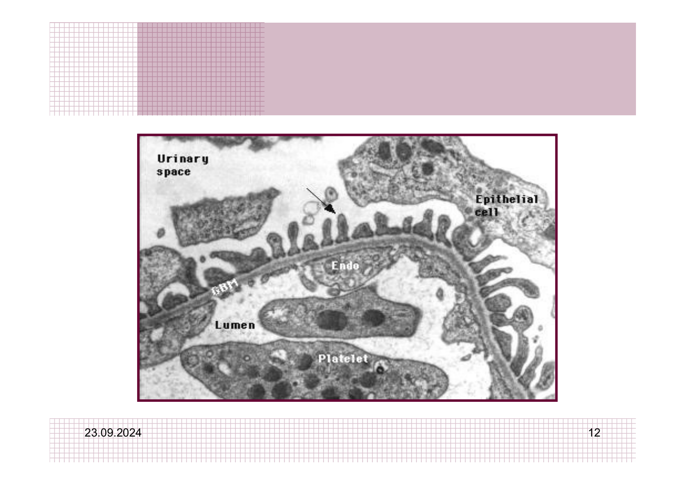

> **Histoloji yorumu:** Elektron mikroskopi görselinde **normal glomerüler kapilerin yapısı** görülmektedir. Lümen (Lumen), endotelyal hücre (Endo), glomerüler bazal membran (GBM), üriner boşluk (Urinary space) ve epitel hücresi (Epithelial cell -- podosit) ayağı katmanları belirgin. Ok işareti, filtrasyonun gerçekleştiği normal süzme bariyerini göstermektedir. RPGN'de bu bariyer rüptüre olur ve hücresel içerik Bowman aralığına geçer.

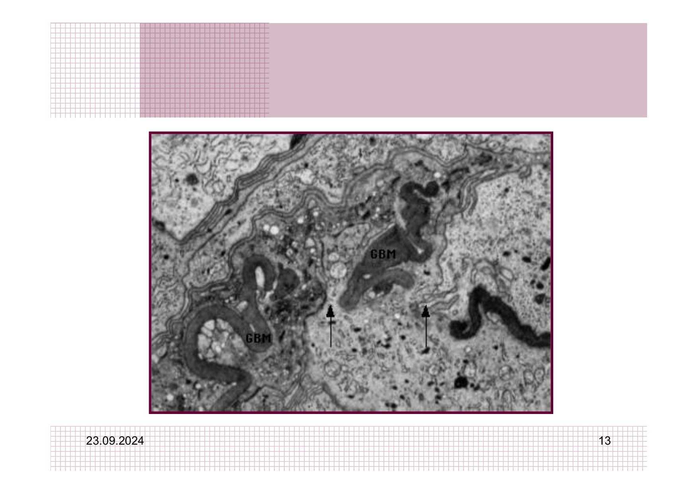

> **Histoloji yorumu:** Bu görsel **GBM'de gap oluşumunu** (oklar) göstermektedir -- RPGN patogenezinin başlangıç basamağı. Kapiller duvarın bütünlüğü bozulduğunda fibrin, plazma proteinleri ve inflamatuar hücreler **Bowman aralığına** geçer ve kresent oluşumuna zemin hazırlar.

---

## KRESENTİK GN'YE YOL AÇAN HASTALIKLAR

| Tanı | Sıklık (%) |
|---|---|
| **ANCA-ilişkili vaskülitler** | **37** |
| SLE (lupus nefriti) | 23 |
| IgA hastalığı | 12 |
| Membranoproliferatif GN (MPGN) | 6 |
| Fokal-segmental glomerülonefrit | 6 |
| **Anti-GBM hastalığı** | **6** |
| Postinfeksiyöz glomerülonefrit | 3 |
| Membranöz glomerülonefrit | 2 |
| Fokal segmental glomerüloskleroz | 2 |
| Henoch-Schönlein purpurası | 1 |
| Diğer | 3 |

> **⚠️ ÖNEMLİ:** RPGN olgularının yaklaşık **%45-60'ı ANCA ilişkili küçük damar vaskülitidir**; bu nedenle RPGN şüphesinde **ilk istenecek serolojik testler ANCA (PR3, MPO) ve anti-GBM** antikorlarıdır.

---

## KRESENTİK GN TİPLERİ (I, II, III)

İmmünfloresan (IF) paternine göre 3 ana tip:

| Tip | İmmün Birikim Paterni | Hastalık Grubu | Serolojik Belirteç |
|---|---|---|---|
| **Tip I** | **Lineer IgG** birikimi (GBM boyunca) | **Anti-GBM hastalığı** (Goodpasture) | Anti-GBM antikoru |
| **Tip II** | **Granüler** IgG/IgM birikimi | **İmmün kompleks aracılı** (post-strep GN, SLE, IgA, MPGN, kriyo, HSP) | ANA, ASO, C3/C4↓, kriyoglobulin |
| **Tip III** | **Pauci-immün** (az/hiç birikim) | **ANCA ilişkili vaskülit** (GPA, MPA, EGPA) | c-ANCA (PR3) / p-ANCA (MPO) |

> **⚠️ ÖNEMLİ:** RPGN şüphesi olan her hastaya **hızlı tanı** için **renal biyopsi + serolojik panel** (ANCA, anti-GBM, ANA, anti-dsDNA, C3/C4, kriyoglobulin, hepatit B/C) ve klinik değerlendirme **eş zamanlı** yapılmalıdır.

---

## TİP I -- ANTİ-GBM HASTALIĞI (GOODPASTURE)

> **Tanım:** Glomerüler bazal membrandaki **Tip IV kollajenin α3 zincirinin non-kollajen (NC1) domainine karşı** gelişen otoantikorların oluşturduğu, hızlı ilerleyen GN ile birlikte (veya olmaksızın) **pulmoner hemoraji** ile seyreden otoimmün hastalıktır.

**Epidemiyoloji:**

* **Yıllık insidans:** 1 / 1.000.000
* Tüm glomerülonefritlerin **~%5**'i
* **İki pik:** 2-3. dekad ve 5-6. dekad (her yaşta olabilir)
* **Pulmoner hemoraji:** genç erkeklerde daha sık
* **GN dominant form:** yaşlı kadınlarda daha sık
* **%85'inde HLA-DR2** pozitifliği (genetik yatkınlık)

**Klinik Bulgular:**

* Halsizlik, artralji, kilo kaybı gibi **sistemik semptomlar**
* **Başvuru sırasında 2/3 hastada pulmoner hemoraji** (hemoptizi, dispne, hipoksemi)
* Pulmoner hemoraji ile ölen hastalarda genellikle **ilerlemiş böbrek yetmezliği** mevcuttur
* Böbrek yetmezliği varsa **hipokomplementemi** olabilir
* Renal hasarın **en erken bulgusu: mikroskobik hematüri**
* **Dismorfik eritrositler, makroskopik hematüri, ılımlı proteinüri (<3 g/gün)**

**Tetikleyici Faktörler:**

* **Sigara** (pulmoner hemoraji için kritik risk faktörü)
* **Hidrokarbon maruziyeti** (solventler, organik kimyasallar)
* **Viral enfeksiyonlar** (influenza)
* **Pulmoner enfarktüs, ARDS** (alveolar membranı hasarlayan her durum)

> **⚠️ ÖNEMLİ:** Sigara içmeyen anti-GBM pozitif hastalarda **izole GN** formu görülürken, sigara içenlerde **pulmoner hemoraji eklenir** -- bu nedenle sigara kesimi tedavinin ayrılmaz parçasıdır.

**ANCA ile Birliktelik:**

* Anti-GBM hastalığı, **ANCA (+) küçük damar vasküliti ile birlikte görülebilir**
* Bu durumda ANCA sıklıkla **MPO-spesifik** (p-ANCA)
* **Çift pozitiflik %12-38** (çalışmalara göre)
* Çift pozitif hastalarda **ANCA pozitif hasta gibi davranılmalı** (rekürrens riski yüksek)

### Tanı -- Altın Standart

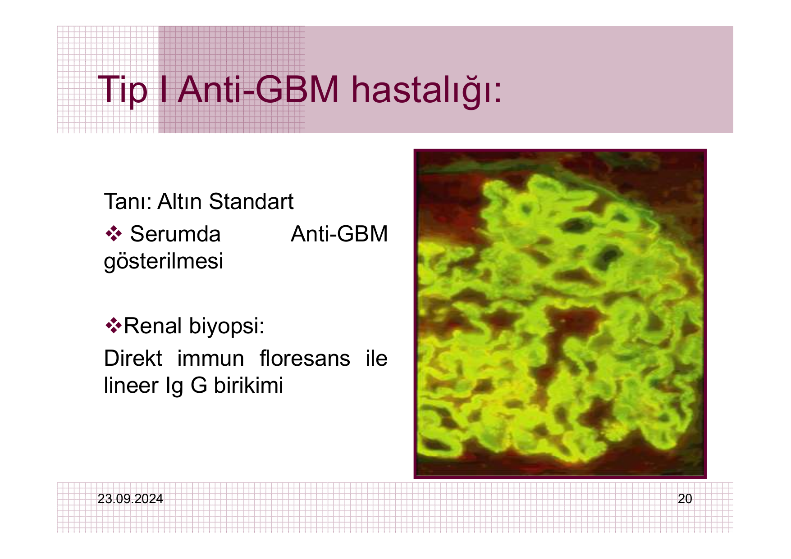

> **Histoloji yorumu:** Direkt immünfloresan (DIF) boyamada glomerüler bazal membran boyunca **homojen, düzgün, lineer IgG birikimi** görülmektedir. Bu patern **anti-GBM hastalığı için patognomoniktir**; lineer boyanma diyabetik nefropatide de görülebilir ancak klinik ve serolojik kontekstle ayrılır. Granüler birikim (noktasal) ise immün kompleks hastalıklarına işarettir.

**Tanı Kriterleri:**

1. **Serum anti-GBM antikoru pozitifliği** (ELISA, >2-3 U/mL tanısal)
2. **Renal biyopside lineer IgG birikimi** (DIF)
3. **Klinik tablo:** RPGN ± pulmoner hemoraji

### Anti-GBM Hastalığı -- Tedavi

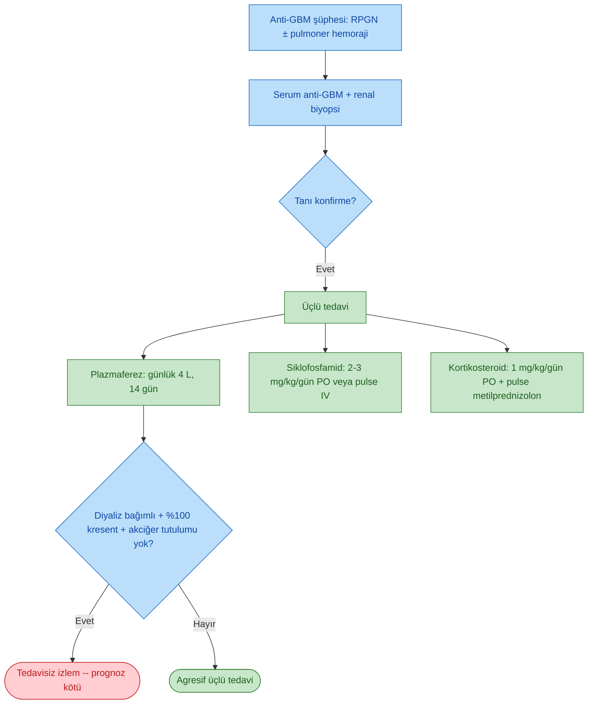
```mermaid
flowchart TD
    A[Anti-GBM şüphesi: RPGN ± pulmoner hemoraji] --> B[Serum anti-GBM + renal biyopsi]
    B --> C{Tanı konfirme?}
    C -->|Evet| D[Üçlü tedavi]
    D --> E[Plazmaferez: günlük 4 L, 14 gün]
    D --> F[Siklofosfamid: 2-3 mg/kg/gün PO veya pulse IV]
    D --> G[Kortikosteroid: 1 mg/kg/gün PO + pulse metilprednizolon]
    E --> H{Diyaliz bağımlı + %100 kresent + akciğer tutulumu yok?}
    H -->|Evet| I([Tedavisiz izlem -- prognoz kötü])
    H -->|Hayır| J([Agresif üçlü tedavi])

    classDef test fill:#bbdefb,stroke:#1565c0,color:#0d47a1
    classDef treat fill:#c8e6c9,stroke:#2e7d32,color:#1b5e20
    classDef nontreat fill:#ffcdd2,stroke:#c62828,color:#b71c1c
    class A,B,C,H test
    class D,E,F,G,J treat
    class I nontreat
```

**Tedavi Temel Prensipleri:**

* **Plazmaferez:** Dolaşan anti-GBM antikorunu uzaklaştırır -- RPGN başlangıcında en hızlı etkili basamak
* **Siklofosfamid:** Antikor üretimini baskılar (yeni antikor oluşumunu durdurur)
* **Kortikosteroid:** İnflamatuar yanıtı baskılar
* **Sigara bırakma:** Pulmoner hemoraji rekürrensini önler

**Tedavi Başarısızlığı Kriterleri (tedaviden kaçınılabilir):**

* **Diyaliz bağımlı** hasta + **%100 kresent** + **pulmoner tutulum yok** → prognoz çok kötü, agresif tedavi kazanımı düşük

**Rekürrens:**

* Antikor negatifleşince **rekürrens nadir**
* Transplantasyon **antikor negatifleştikten en az 6-12 ay sonra** yapılır
* Anti-GBM pozitif halde transplantasyon → **erken rekürrens**

---

## TİP II -- İMMÜN KOMPLEKS ARACILI GN

> **Tanım:** Kresent formasyonu ile birlikte **granüler IgG ve IgM birikimi** izlenen, altta çeşitli immün kompleks aracılı glomerüler hastalıkların yer aldığı gruptur.

**Temel Özellikler:**

* **Endokapiller proliferasyon** daha sık
* IgA birikimi baskınsa → **IgA nefropatisi** olarak yorumlanır
* **Orta ve ileri yaş** sorunu (2 ve 3'e göre daha yaşlı hastalarda)
* **Spontan remisyon** Tip I'e göre daha sıktır

**Altta Yatan Hastalıklar:**

* Post-streptokoksik glomerülonefrit
* Sistemik lupus eritematozus (SLE) -- **lupus nefriti class IV**
* IgA nefropatisi (Berger hastalığı)
* Henoch-Schönlein purpurası (IgA vasküliti)
* Membranoproliferatif GN (MPGN, tip I-III)
* Kriyoglobulinemik GN (Hep C ilişkili sık)
* Endokarditle ilişkili GN

**Tedavi:**

* Altta yatan nedene göre şekillenir (örneğin lupus için siklofosfamid/MMF + steroid; hepatit C kriyoglobulinemi için antiviral + rituksimab)
* Genellikle **steroid + immünsüpresif** kombinasyon

---

## TİP III -- ANCA İLİŞKİLİ PAUCİ-İMMÜN VASKÜLİTLER (AASV)

> **Tanım:** İmmünfloresanda **az/hiç immün birikim** (pauci-immün) ve dolaşımda **nötrofil sitoplazmik antijenlerine karşı antikor (ANCA)** varlığı ile karakterize, küçük kalibreli damar vaskülitidir.

**Temel İstatistikler:**

* **Tüm yaş grupları** içinde RPGN'nin en sık nedeni: **%45-60 ANCA ilişkili**
* Renal vaskülitler içinde **en geniş alt grubu** oluşturur
* Hızlı ilerleyen kresentik GN'lerin **major nedeni**

**Alt Grupları (AASV):**

1. **Wegener Granülomatozisi (GPA -- Granülomatöz Polianjiit)**
2. **Mikroskopik Polianjiit (MPA)**
3. **Churg-Strauss Sendromu (EGPA -- Eozinofilik Granülomatöz Polianjiit)**
4. **Renal-limited vaskülit** (böbreğe sınırlı pauci-immün GN)
5. **İlaçlar ile ilişkili vaskülitler** (propiltiyourasil, hidralazin, levamizol, minosiklin vb.)

---

## ANCA: BİYOKİMYA VE TİPLER

> **Tanım:** ANCA (Antineutrophil Cytoplasmic Antibodies), **nötrofillerin myeloid lizozomal içeriklerine karşı oluşan otoantikorlardır**.

**Nötrofil Granülleri ve İçerikleri:**

| Azurofilik Granüller (primer) | Spesifik Granüller (sekonder) |
|---|---|
| Asit hidrolazlar | Laktoferrin |
| **Myeloperoksidaz (MPO)** | Lizozim |
| CAP57 | |
| Defensin | |
| Elastaz | |
| **Proteinaz 3 (PR3)** | |
| Katepsin G | |
| α1-antitripsin | |
| CD68 | |

**İmmünfloresans Paternleri:**

Etanol ile fikse edilmiş insan nötrofilleri kullanılarak **indirekt immünfloresans (IFA)** yöntemi ile floresan paternine göre sınıflandırılır:

| ANCA Tipi | Floresan Paterni | Tipik Hedef Antijen |
|---|---|---|
| **c-ANCA** | Sitoplazmada yaygın granüler floresans | **Proteinaz 3 (PR3)** |
| **p-ANCA** | Perinükleer sınırlı floresans | **Myeloperoksidaz (MPO)** |
| **x-ANCA (atipik)** | Her iki paterni de gösteren | Katepsin G, laktoferrin, elastaz |

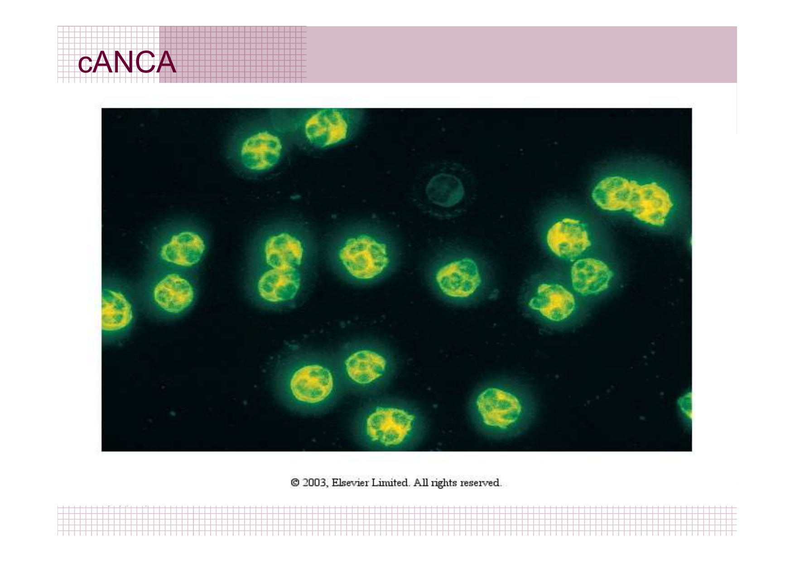

> **Histoloji yorumu:** İndirekt immünfloresansta **c-ANCA** paterni -- nötrofil **sitoplazmasında yaygın, granüler, yeşil floresans** görülmektedir. Bu patern **Proteinaz 3 (PR3) antijeni** ile reaksiyonu gösterir ve **Wegener granülomatozisi (GPA)** için tipiktir.

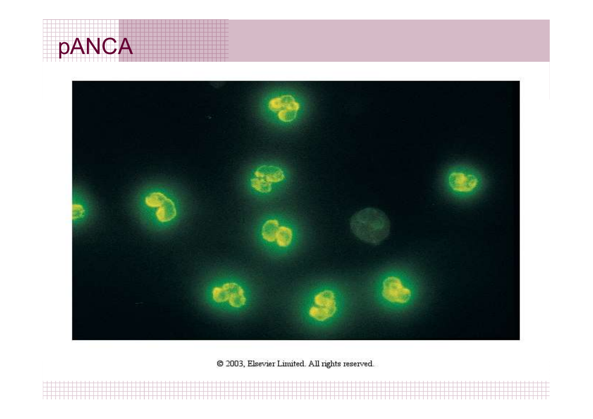

> **Histoloji yorumu:** İndirekt immünfloresansta **p-ANCA** paterni -- nötrofil **perinükleer (nükleus etrafı) bölgede sınırlı yeşil floresans** görülmektedir. Bu patern **Myeloperoksidaz (MPO) antijeni** ile reaksiyonu gösterir. Tipik olarak **MPA** ve **EGPA** ile ilişkilidir, ilaç ilişkili vaskülitlerde de sık görülür.

**⚠️ Dikkat:** IFA sonrası **ELISA ile spesifik antijen tayini (PR3, MPO)** kesinlikle yapılmalıdır; IFA yalancı pozitifliği (SLE, inflamatuar barsak hastalığı vb.) mümkündür.

---

## ANCA HEDEF ANTİJENLERİ VE KLİNİK BİRLİKTELİKLER

| ANCA Tipi | Hedef Antijen | Birlikte Bulunduğu Hastalıklar |
|---|---|---|
| **c-ANCA** | **Proteinaz 3 (PR3)** | **Wegener Granülomatozisi (GPA)** |
| **c-ANCA** | CAP57 | Klasik PAN |
| **p-ANCA** | **Myeloperoksidaz (MPO)** | **MPA, EGPA** |
| **p-ANCA** | Elastaz | MPA |
| **p-ANCA** | Laktoferrin | İnflamatuar barsak hastalığı |
| **x-ANCA** | Katepsin G | **Ülseratif kolit** |

### Küçük Damar Vaskülitlerinde ANCA Sıklığı

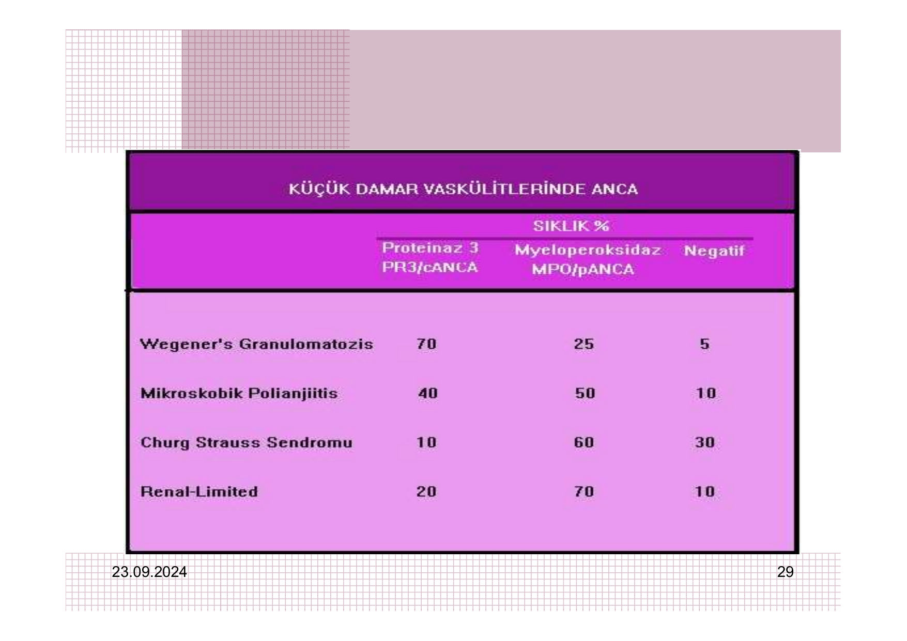

| Hastalık | PR3 / c-ANCA (%) | MPO / p-ANCA (%) | Negatif (%) |
|---|---|---|---|
| **Wegener Granülomatozisi (GPA)** | **70** | 25 | 5 |
| **Mikroskopik Polianjiit (MPA)** | 40 | **50** | 10 |
| **Churg-Strauss Sendromu (EGPA)** | 10 | **60** | 30 |
| **Renal-Limited vaskülit** | 20 | **70** | 10 |

> **⚠️ ÖNEMLİ:** GPA'da PR3 dominant, MPA ve EGPA'da MPO dominantır; ancak **çapraz pozitiflik her zaman mümkündür**. ANCA negatif olması tanıyı dışlamaz (özellikle EGPA'da %30 negatif).

### Diğer İnflamatuar Durumlarda ANCA Pozitifliği

ANCA birçok hastalıkta yalancı pozitif olabilir:

* İnflamatuar barsak hastalıkları (UC, Crohn)
* Skleroderma
* Sjögren sendromu
* Romatoid artrit
* Sistemik lupus eritematozus (SLE)
* Reaktif artrit
* Antifosfolipid antikor sendromu
* Kronik inflamatuar karaciğer hastalıkları
* Bakteriyel endokardit
* Kistik fibrozis

> **⚠️ ÖNEMLİ:** Bu durumlarda ANCA sıklıkla **laktoferrin, katepsin G, elastaz** gibi "atipik" antijenlere karşıdır -- PR3 ve MPO ELISA negatiftir. Bu nedenle **IFA + ELISA birlikte değerlendirilmelidir**.

---

## ANCA SENSİTİVİTE/SPESİFİTE -- KLİNİK PREDİKTİF DEĞER

ANCA'nın prediktif değeri klinik tabloya göre dramatik olarak değişir:

| Klinik Tablo | Prevalans | (+) Prediktif Değer | (-) Prediktif Değer |
|---|---|---|---|
| **RPGN** | **%47** | **%98** | **%80** |
| Hematüri, proteinüri + kreatinin > 3 mg/dL | %21 | %92 | %93 |
| Hematüri, proteinüri + kreatinin 1.5-3 mg/dL | %7 | %77 | %98 |
| Hematüri, proteinüri + kreatinin < 1.5 mg/dL | %2 | %47 | %99 |

**(Hagen EC, Hermans J. Kidney International 1998; 53:743)**

> **⚠️ KLİNİK ÇIKARIM:** RPGN kliniğinde **ANCA pozitifliği %98 ihtimalle AASV** demektir -- biyopsi beklemeden tedavi başlanabilir. Ancak **hafif kliniklerde ANCA pozitifliği yalancı pozitif olabilir** (PPV %47'ye kadar düşer). Bu nedenle **ANCA her zaman klinik kontekstle değerlendirilir.**

---

## AASV EPİDEMİYOLOJİSİ

* **Batı Avrupa yıllık AASV insidansı:** 10-20 / milyon
* **Prevalans:** 200 / milyon
* **SDBY nedenlerinin %5'ini** oluşturur
* İnsidans **yaşla birlikte artar** (özellikle 60+)
* Etnik, coğrafik, mevsimsel farklılıklar vardır
* Afrikalı zencilerde insidans Batı Avrupa'dan **düşüktür**
* **Erkeklerde daha sık**
* **GPA (Wegener):** soğuk iklim koşullarında sık
* **MPA:** sıcak iklim koşullarında sık (Güney Avrupa, Japonya)

---

## AASV ETİYOPATOGENEZİ

**Temel Hipotez:** ANCA **tek başına patojenik değildir**, ancak **eşlik eden proinflamatuar stimulus** (enfeksiyon, sitokinler) varlığında nötrofilleri aktive ederek vaskülit oluşturur.

**Patogenez -- Adım Adım:**

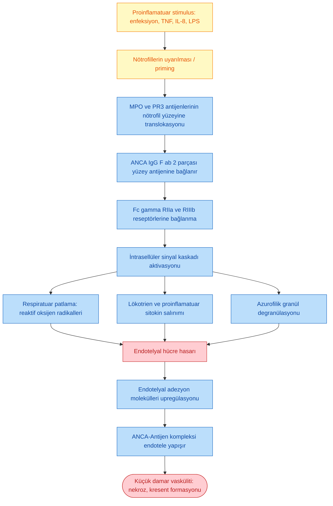
```mermaid
flowchart TD
    A[Proinflamatuar stimulus: enfeksiyon, TNF, IL-8, LPS] --> B[Nötrofillerin uyarılması / priming]
    B --> C[MPO ve PR3 antijenlerinin nötrofil yüzeyine translokasyonu]
    C --> D[ANCA IgG F ab 2 parçası yüzey antijenine bağlanır]
    D --> E[Fc gamma RIIa ve RIIIb reseptörlerine bağlanma]
    E --> F[İntrasellüler sinyal kaskadı aktivasyonu]
    F --> G[Respiratuar patlama: reaktif oksijen radikalleri]
    F --> H[Lökotrien ve proinflamatuar sitokin salınımı]
    F --> I[Azurofilik granül degranülasyonu]
    G --> J[Endotelyal hücre hasarı]
    H --> J
    I --> J
    J --> K[Endotelyal adezyon molekülleri upregülasyonu]
    K --> L[ANCA-Antijen kompleksi endotele yapışır]
    L --> M([Küçük damar vasküliti: nekroz, kresent formasyonu])

    classDef trigger fill:#fff9c4,stroke:#f57c00,color:#e65100
    classDef process fill:#bbdefb,stroke:#1565c0,color:#0d47a1
    classDef damage fill:#ffcdd2,stroke:#c62828,color:#b71c1c
    class A,B trigger
    class C,D,E,F,G,H,I,K,L process
    class J,M damage
```

**Önemli Noktalar:**

* **TNF, TGF-β, IL-8** gibi sitokinler nötrofilleri primer uyarır
* Normalde **hücre içinde** duran MPO ve PR3 **hücre yüzeyine taşınır** (translokasyon)
* ANCA'nın F(ab)2 parçası yüzey antijenine bağlanırken **Fc parçası FcγRIIa/IIIb** reseptörüne bağlanır
* Sonuçta **reaktif oksijen radikalleri + lökotrienler + proinflamatuar sitokinler + azurofilik granül içerikleri** salınır
* Endotelyal hücrelerde **apopitoz ve liziz**

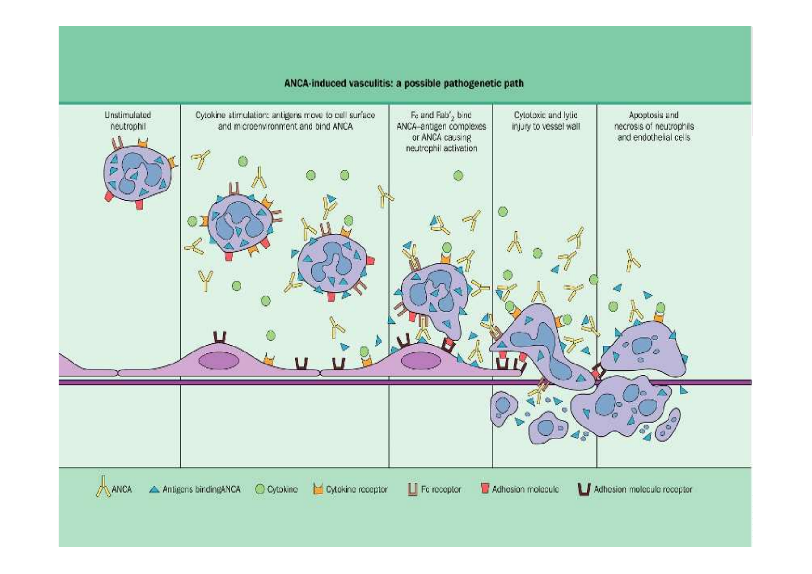

> **Şema yorumu:** Şemada soldan sağa patogenetik yol gösterilmektedir.
>
> **1. Uyarılmamış nötrofil** (Unstimulated neutrophil): hücre yüzeyinde antijen yok.
>
> **2. Sitokin stimülasyonu** (Cytokine stimulation): antijenler (MPO, PR3) hücre yüzeyine taşınır -- hem çevreye hem de kısmen hücre dışına salınır. Dolaşımdaki ANCA antijenlere bağlanır.
>
> **3. Fc ve F(ab)₂ bağlanması** (Fc and Fab2 bind): ANCA-antijen kompleksi hem FcγR reseptörüne hem antijene çift yönlü bağlanır; **nötrofil aktivasyonu** başlar.
>
> **4. Sitolitik ve sitotoksik damar duvarı hasarı** (Cytolysis and lytic injury to vessel wall): reaktif oksijen türleri, proteazlar salınır, endotel liziz olur.
>
> **5. Nötrofil apoptozu ve endotel nekrozu** (Apoptosis and necrosis of neutrophil and endothelial cells): son aşamada vaskülitin histolojik bulguları ortaya çıkar -- fibrinoid nekroz, kapiller duvar hasarı, kresent oluşumu.

---

## AASV KLİNİK BULGULARI

AASV kliniği, **tutulum bölgesine ve aktivite/kronisite düzeyine** bağlı olarak son derece çeşitlidir. Her üç vaskülit (GPA, MPA, EGPA) **küçük damar vaskülitine özgü ortak özellikler** taşırken, kendilerine has ayırt edici bulgular da gösterir.

**Fokal Nekrotizan Lezyonların Organ Yansımaları:**

| Tutulan Damar Yatağı | Klinik Bulgu |
|---|---|
| Glomerüler kapiller | **Glomerülonefrit (RPGN, hematüri, proteinüri)** |
| Alveolar kapiller | **Pulmoner hemoraji** |
| Dermal venül | **Purpura** |
| Üst solunum yolu mukozal venül | **Rinit, sinüzit, otitis media** |
| Epinöral arter | **Mononöritis multipleks** |
| Mezenter arter | **Abdominal ağrı, intestinal iskemi/perforasyon** |
| Koroner arter | Koroner vaskülit (nadir) |

### Renal Tutulum

* **GPA ve MPA'da çok sık**, **EGPA'da daha nadir**
* En sık bulgu: **hematüri, proteinüri, oligüri, renal yetmezlik** (glomerüler tutuluma bağlı)
* **Sessiz formlar:** sadece halsizlik ve ödem ile başvuru mümkün
* Hastaların çoğunda başvuruda **plazma kreatinin > 3 mg/dL**
* GPA ve MPA, **subakut veya kronik nefrit** şeklinde de yansıyabilir

### Sistemik İnflamatuar Belirtiler

* **Ateş, halsizlik, kilo kaybı, myalji, artralji** (non-spesifik)
* **Flu-like sendrom** çoğu hastada ilk başvuru bulgusudur

### Kutanöz Tutulum

* **Dermal venülit kaynaklı purpura:** GPA, MPA, EGPA'da sık
* **Alt ekstremitede purpurik döküntüler**
* Purpuraya eşlik eden **küçük ülserasyonlar**
* **Noduler kutanöz lezyonlar:** GPA ve EGPA'da sık (subkutan arterit + nekrotizan granülom)

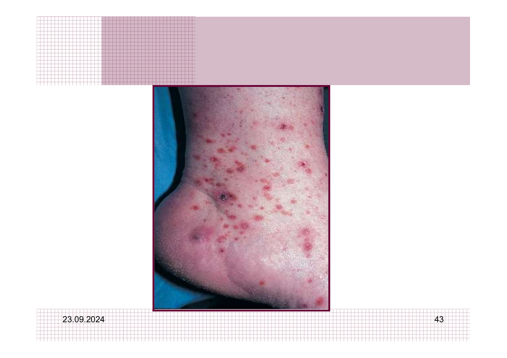

> **Klinik foto yorumu:** Alt ekstremitede **palpabl purpura** görünümünde, dermal venülit kaynaklı eritemli-purpurik lezyonlar izlenmektedir (temkinli yorum). Bu tip palpabl purpura, küçük damar vaskülitlerinin klasik cilt bulgusudur; lezyonların basmakla solmaması **kanama (ekstravazasyon)** anlamına gelir ve vaskülit düşündürür.

### Solunum Sistemi Tutulumu

* En sık **GPA ve EGPA'da**
* Her üç vaskülitte **hemorajik kapillarit → pulmoner hemoraji**
* **GPA ve EGPA:** radyolojide **nodül / kavite** (nekrotizan granülomatöz inflamasyon)
* **MPA:** **granülomatöz respiratuar lezyon YOK** (kritik ayırıcı tanı!)

**Üst Solunum Yolu (ÜSY) Tutulumu -- GPA'ya özgü:**

* Sinüzit, rinit, otitis media
* **Kemik destrüksiyonu** → **septal perforasyon** ve **semer burun (saddle-nose) deformitesi**
* Bu deformiteler **sadece nekrotizan granülomatöz inflamasyon** varlığında oluşur → **MPA'da GÖRÜLMEZ!**

### Nörolojik Tutulum

* **Periferal nöropati** sık (özellikle **mononöritis multipleks**), en çok **EGPA'da**
* **SSS tutulumu çok nadir**

### GİS Tutulumu

* Mezenter iskemisine bağlı **abdominal ağrı**
* Nadiren **intestinal perforasyon**
* Pankreas ve karaciğer vasküliti → **pankreatit ve hepatit taklit edebilir**

### Organ Sistem Tutulum Sıklığı (%)

| Organ Sistemi | MPA | GPA (WG) | EGPA (CSS) |
|---|---|---|---|
| **Böbrek** | **90** | **80** | 45 |
| Deri | 40 | 40 | 60 |
| Akciğer | 50 | **90** | 70 |
| Kulak, Burun, Boğaz | 35 | **90** | 59 |
| Kas-İskelet sistemi | 60 | 60 | 50 |
| Sinir sistemi | 30 | 50 | **70** |
| Gastrointestinal | 50 | 50 | 50 |

**(Jennette JC, Falk RJ. N Engl J Med 1997; 337:1512-23)**

---

## GPA (WEGENER GRANÜLOMATOZİSİ)

> **Tanım:** Respiratuar sistemi tutan **granülomatöz inflamasyon** ile karakterize, küçük çaplı damarları tutan **nekrotizan vaskülit**. **c-ANCA / PR3-ANCA** pozitifliği ile karakterizedir.

**GPA Üçlü Tutulumu (Klasik Triad):**

1. **Üst solunum yolu:** sinüzit, rinit, nazal septum perforasyonu, **semer burun deformitesi**
2. **Alt solunum yolu:** pulmoner **nodül, kavite, hemoraji**
3. **Böbrek:** **pauci-immün kresentik GN**

**Sınırlı GPA:**

* **Renal tutulum yok**, sadece solunum ve ÜSY bulguları
* Daha iyi prognoz
* Nadiren sistemik forma ilerler

**Tanı Kriterleri (ACR 1990, yönlendirici):**

| Kriter | Açıklama |
|---|---|
| Nazal/oral inflamasyon | Ağrılı/ağrısız oral ülser, purulan/kanlı nazal akıntı |
| Anormal akciğer grafisi | Nodül, kavite, sabit infiltrat |
| İdrar sedimanı | Mikroskopik hematüri veya eritrosit silendiri |
| Biyopside granülomatöz inflamasyon | Arter duvarı, perivasküler, ekstravasküler alanda granülom |

**Laboratuvar:**

* **PR3-ANCA (c-ANCA):** ~70% pozitif
* CRP, ESR yüksek
* Hematüri, proteinüri
* Anemi, trombositoz

**Tedavi:**

* **İndüksiyon:** Rituksimab VEYA Siklofosfamid + pulse metilprednizolon + oral steroid
* **RAVE çalışması (2010):** Rituksimab, siklofosfamide **non-inferior**, özellikle **relaps hastalığında üstün**
* **İdame:** Azatiyoprin, MTX, MMF veya **rituksimab (MAINRITSAN)**
* **Avacopan (C5a reseptör antagonisti):** steroid kullanımını azaltan yeni ajan

---

## MPA (MİKROSKOBİK POLİANJİİT)

> **Tanım:** Küçük çaplı damarları tutan **nekrotizan vaskülit**. Granülom içermez ve **MPO / p-ANCA** pozitifliği ile karakterizedir.

**Klinik Özellikler:**

* **Granülom YOK** (GPA'dan en önemli ayırıcı özellik)
* Semer burun, sinüzit bulguları olmaz
* **Pulmoner kapillarit → pulmoner hemoraji**
* **ÜSY belirtileri nadirdir**
* **Böbrek tutulumu %90** -- en sık RPGN tablosu ile gelir
* ANCA spesifitesi: **PR3 ve MPO arasında değişim** gösterir (MPO baskın)

**Klinik Prezentasyon:**

* Hızlı ilerleyen glomerülonefrit (RPGN)
* Pulmoner-renal sendrom (hemoptizi + RPGN)
* Palpabl purpura
* Mononöritis multipleks
* Sistemik semptomlar (ateş, halsizlik, kilo kaybı)

**Tanı:**

* p-ANCA / MPO pozitifliği
* Renal biyopsi: **pauci-immün kresentik GN**
* Klinikte **renal + pulmoner + cilt** tutulumu

---

## EGPA (CHURG-STRAUSS SENDROMU)

> **Tanım:** Respiratuar sistemi tutan **eozinofilden zengin granülomatöz inflamasyon** ile karakterize, küçük çaplı damarları tutan **nekrotizan vaskülit**.

**Karakteristik Özellikler:**

* **Astım** (neredeyse tüm hastalarda, vaskülit öncesinde yıllar süren öykü)
* **Periferal eozinofili > 1.5 × 10⁹/L (>1500/mm³)**
* **Atopik yatkınlık** (alerjik rinit, nazal polipler)
* **Renal tutulum diğerlerine göre daha az veya indolent**
* **Mononöritis multipleks** en sık -- periferal nöropati
* **p-ANCA / MPO-ANCA** pozitifliği (%40-60)

**Üç Evre:**

1. **Prodromal (alerjik)**: astım, alerjik rinit, atopi
2. **Eozinofilik**: periferal eozinofili, eozinofilik doku infiltrasyonu (Löffler, eozinofilik gastroenterit)
3. **Vaskülitik**: sistemik küçük damar vasküliti (purpura, nöropati, GN, kardiyak tutulum)

**Ayırt Edici Klinik Bulgular:**

* **Kardiyak tutulum:** EGPA'ya özgü -- en sık ölüm nedeni (miyokardit, koroner vaskülit, perikardit)
* **Nöropati:** %70 mononöritis multipleks
* **GİS tutulumu:** eozinofilik gastroenterit
* **Nazal polipler**

**ACR 1990 Kriterleri (4/6 tanısal):**

1. Astım
2. Eozinofili > %10
3. Nöropati (mono/polinöropati)
4. Migratuvar / geçici pulmoner infiltratlar
5. Paranazal sinüs anomalisi
6. Ekstravasküler eozinofili (biyopside)

**Tedavi:**

* **Hafif hastalık (ANCA negatif, dominant astım):** kortikosteroid yeterli
* **Ciddi hastalık (renal, kardiyak, GİS, nöropati):** siklofosfamid/rituksimab + steroid
* **Mepolizumab (anti-IL-5):** yeni tedavi -- özellikle **steroid bağımlı astım ve relaps** formunda etkili

> **⚠️ ÖNEMLİ:** EGPA tanısı, tipik olarak **astım + eozinofili + vaskülit** triadıyla konur; ancak **astım öyküsü her zaman aranmalıdır** -- bazen vaskülit başlangıcında eozinofili steroid ile maskelenebilir.

---

## AYIRICI TANI TABLOSU

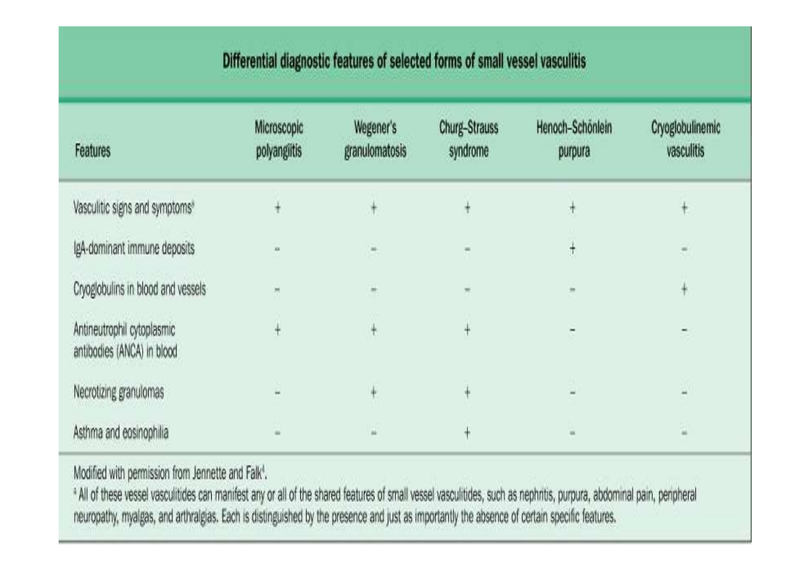

### Küçük Damar Vaskülitlerinin Seçilmiş Formlarının Ayırıcı Özellikleri

| Özellik | Mikroskobik Polianjiit (MPA) | Wegener Granülomatozisi (GPA) | Churg-Strauss Sendromu (EGPA) | Henoch-Schönlein Purpurası | Kriyoglobulinemik Vaskülit |
|---|---|---|---|---|---|
| Vaskülit bulgu ve semptomları¹ | + | + | + | + | + |
| IgA dominant immün birikim | − | − | − | **+** | − |
| Kan ve damarlarda kriyoglobulin | − | − | − | − | **+** |
| Kanda anti-nötrofil sitoplazmik antikor (ANCA) | **+** | **+** | **+** | − | − |
| Nekrotizan granülom | − | **+** | **+** | − | − |
| Astım ve eozinofili | − | − | **+** | − | − |

**¹** Bu 5 küçük damar vaskülitinin tümü **nefrit, purpura, abdominal ağrı, periferal nöropati, myalji, artralji** gibi ortak bulgulara sahip olabilir. Birbirinden ayrımı **belirli spesifik özelliklerin varlığı ya da yokluğu** ile yapılır.

**(Modifiye: Jennette ve Falk¹)**

---

## HİSTOPATOLOJİ

**AASV'de Glomerüler Lezyon:**

* **Nekrotizan GN** -- sıklıkla **kresent formasyonu** ile sonlanır
* **Hafif/erken evre:** küçük kresent + **segmental fibrinoid nekroz**
* **Ciddi akut evre:** geniş **dairesel (sirkumferensiyel) kresentler + global nekroz**
* **Kronik evre:** **fibröz kresent** + glomerüloskleroz

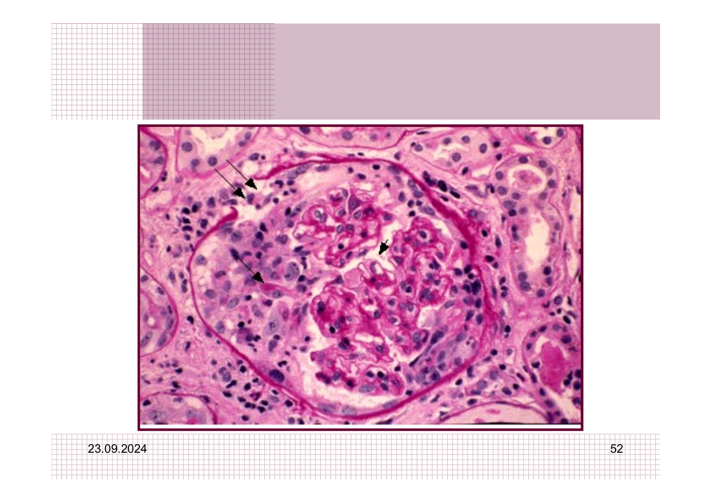

> **Histoloji yorumu:** H&E boyamada **erken dönem hücresel kresent** görülmektedir. Oklar **parietal epitel hücre proliferasyonunu** ve Bowman aralığına dolan inflamatuar hücreleri (makrofaj, lenfosit) göstermektedir. Glomerül tufu kısmen basılmış durumda. Bu hücresel kresent aktif inflamasyonu temsil eder ve **tedaviye en iyi yanıt veren** formdur.

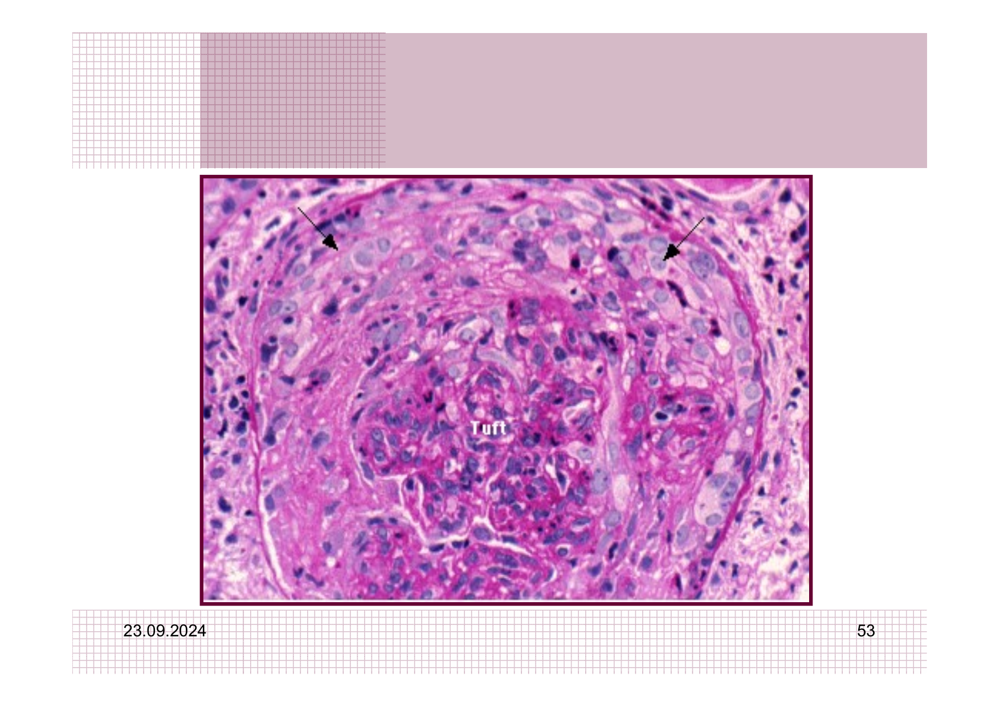

> **Histoloji yorumu:** Görselde **globally (tümüyle) hücresel kresent** izlenmektedir; glomerüler tuft (Tuft) kresent tarafından merkeze itilmiştir. Oklar kresentin Bowman kapsülünden glomerül içine doğru ilerleyen parietal epitel proliferasyonunu işaret eder. Bu global tutulum prognozu olumsuz etkiler.

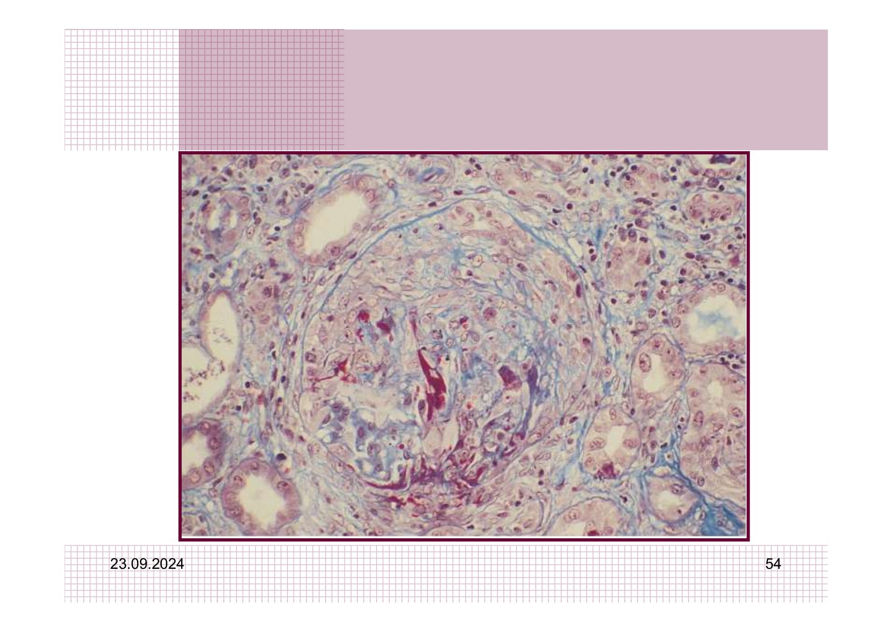

> **Histoloji yorumu:** Masson trikrom boyamada **fibrosellüler kresent** izlenmektedir -- mavi boyanan kollajen (fibroz) ile hücresel komponent birlikte. Bu ara evre kresent, tedaviye **orta derecede yanıt** verir; tam remisyon nadirdir. Kresent eski lezyonların **progresif fibrozisi** izlenmektedir.

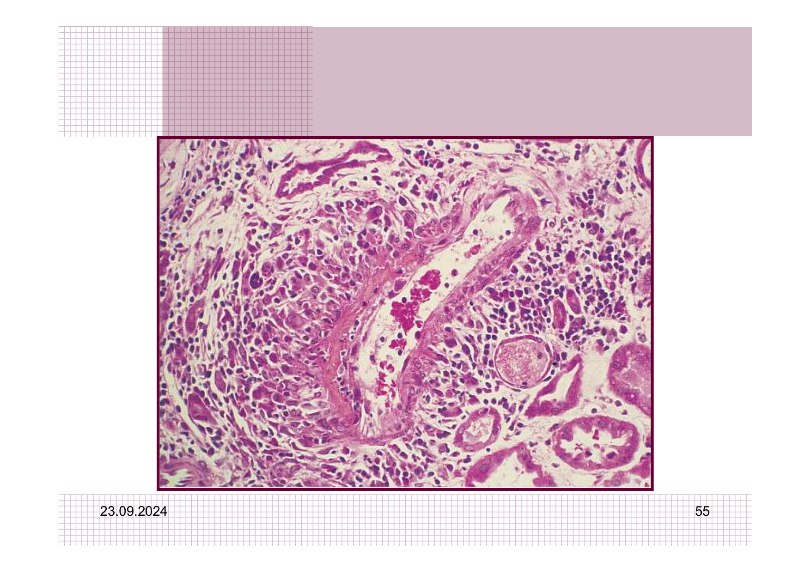

> **Histoloji yorumu:** H&E boyamada arterde **fibrinoid nekroz** görülmektedir. Damar duvarında eozinofilik (parlak pembe) **fibrin birikimi** ve çevresinde yoğun inflamatuar hücre infiltrasyonu izlenmektedir -- küçük çaplı damar vaskülitinin karakteristik bulgusu. Lümen daralmış/kapalı; distal iskemi bu nedenle oluşur.

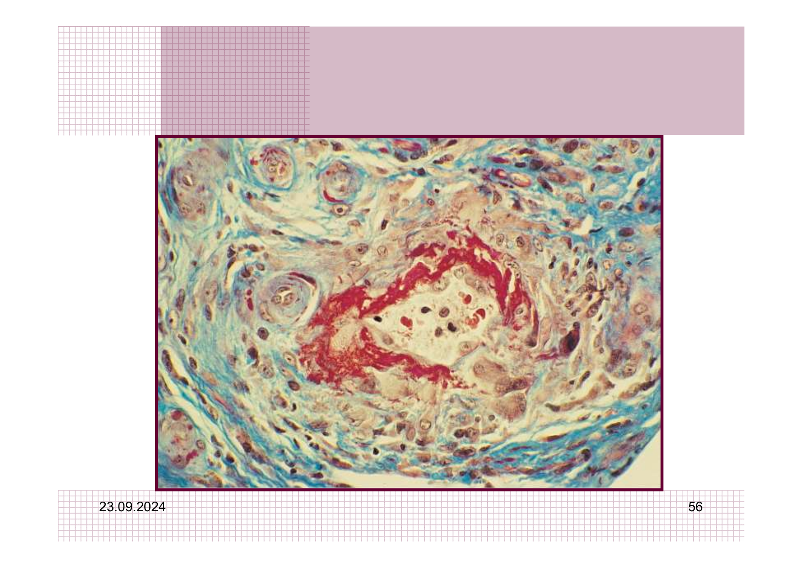

> **Histoloji yorumu:** Masson trikrom boyamada arteriyel segmentte **aktif fibrinoid nekroz (kırmızı)** ve damar etrafında kollajen birikimi (mavi) izlenmektedir. Lümen hasar görmüş, endotel kaybı mevcut. Bu bulgu **aktif vaskülit** göstergesidir ve immünsüpresif tedavi endikasyonudur.

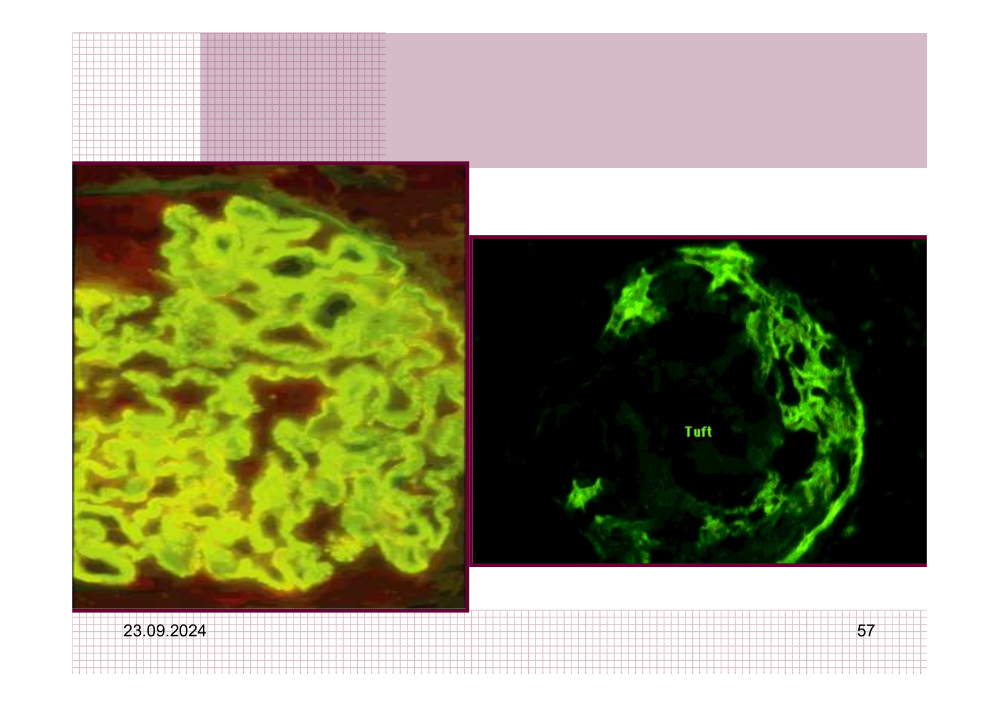

> **Histoloji yorumu:** Direkt immünfloresanda **pauci-immün patern** izlenmektedir -- glomerülde ve Bowman kapsülünde (Tuft işaretli bölge) **zayıf, diffüz, granüler olmayan ışıldama**; belirgin **lineer ya da granüler IgG birikimi YOK**. Bu patern **ANCA ilişkili vaskülit (Tip III)** için tipiktir. Anti-GBM'deki (Tip I) **lineer IgG** ve immün kompleks hastalığındaki (Tip II) **granüler IgG/C3** paterninin tam tersi bir görünümdür.

---

## TANI YAKLAŞIMI VE ALGORİTMA

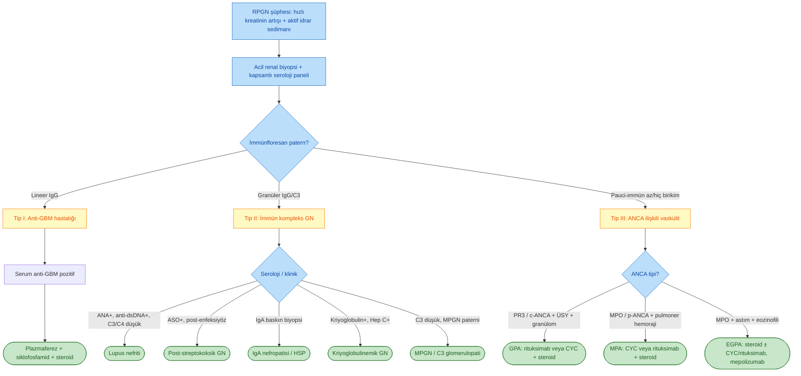
```mermaid
flowchart TD
    A[RPGN şüphesi: hızlı kreatinin artışı + aktif idrar sedimanı] --> B[Acil renal biyopsi + kapsamlı seroloji paneli]
    B --> C{İmmünfloresan patern?}
    C -->|Lineer IgG| D[Tip I: Anti-GBM hastalığı]
    C -->|Granüler IgG/C3| E[Tip II: İmmün kompleks GN]
    C -->|Pauci-immün az/hiç birikim| F[Tip III: ANCA ilişkili vaskülit]

    D --> D1[Serum anti-GBM pozitif]
    D1 --> D2([Plazmaferez + siklofosfamid + steroid])

    E --> E1{Seroloji / klinik}
    E1 -->|ANA+, anti-dsDNA+, C3/C4 düşük| E2([Lupus nefriti])
    E1 -->|ASO+, post-enfeksiyöz| E3([Post-streptokoksik GN])
    E1 -->|IgA baskın biyopsi| E4([IgA nefropatisi / HSP])
    E1 -->|Kriyoglobulin+, Hep C+| E5([Kriyoglobulinemik GN])
    E1 -->|C3 düşük, MPGN paterni| E6([MPGN / C3 glomerulopati])

    F --> F1{ANCA tipi?}
    F1 -->|PR3 / c-ANCA + ÜSY + granülom| F2([GPA: rituksimab veya CYC + steroid])
    F1 -->|MPO / p-ANCA + pulmoner hemoraji| F3([MPA: CYC veya rituksimab + steroid])
    F1 -->|MPO + astım + eozinofili| F4([EGPA: steroid ± CYC/rituksimab, mepolizumab])

    classDef test fill:#bbdefb,stroke:#1565c0,color:#0d47a1
    classDef diagnose fill:#c8e6c9,stroke:#2e7d32,color:#1b5e20
    classDef warn fill:#fff9c4,stroke:#f57c00,color:#e65100
    class A,B,C,E1,F1 test
    class D2,E2,E3,E4,E5,E6,F2,F3,F4 diagnose
    class D,E,F warn
```

**Temel Serolojik Panel:**

| Test | Hedef Hastalık |
|---|---|
| **ANCA (IFA + ELISA: PR3, MPO)** | AASV (GPA, MPA, EGPA) |
| **Anti-GBM antikoru** | Goodpasture sendromu |
| **ANA, anti-dsDNA, anti-Sm** | SLE / lupus nefriti |
| **C3, C4** | SLE, post-strep GN, MPGN, kriyoglobulinemi |
| **Kriyoglobulin** | Kriyoglobulinemik vaskülit |
| **Hepatit B, C paneli** | PAN (Hep B), kriyoglobulin (Hep C) |
| **ASO** | Post-streptokoksik GN |
| **Kan kültürü** | Endokardit ilişkili GN |
| **IgA düzeyi** | IgA nefropatisi, HSP |

**Görüntüleme:**

* **Toraks BT yüksek çözünürlüklü (HRCT):** pulmoner hemoraji, nodül, kavite, interstisiyel değişiklikler
* **Sinüs BT/paranazal:** GPA'da üst solunum yolu tutulumu
* **Böbrek USG:** boyut, parankim ekojenitesi, obstrüksiyon ekarte etmek için

**Renal Biyopsi Endikasyonu -- ACİL:**

RPGN şüphesi olan her hastada **en hızlı şekilde renal biyopsi** yapılmalıdır; tanı ve tedavi kararını biyopsi yönlendirir.

---

## AASV TEDAVİSİ

AASV tedavisi **üç fazdan** oluşur:

1. **İndüksiyon tedavisi** (remisyon sağlama -- 3-6 ay)
2. **İdame tedavisi** (remisyonu koruma -- 18-24 ay, hatta daha uzun)
3. **Relaps tedavisi** (yeniden aktivasyon)

**Tedavisiz Prognoz:** 2 yıl içinde **%90 mortalite**.

**Kortikosteroid + siklofosfamid** kombinasyonu ile mortalite **dramatik olarak azalmıştır**.

---

## İNDÜKSİYON TEDAVİSİ

### Klasik Rejim -- Siklofosfamid + Steroid

**Siklofosfamid:**

* **Günlük oral:** 1.5-2 mg/kg/gün PO
* **Aylık pulse IV:** 15 mg/kg (maks 1.2 g) her 2-3 haftada (CYCLOPS çalışması)
* **Ciddi lökopeni riski** (NE < 1500/mm³ takip et!)
* Total doz 25 g'ı geçmemelidir (malignite riski)
* **Kontrendikasyonlar:** gebelik, aktif enfeksiyon

**Kortikosteroid:**

* **Oral:** 1 mg/kg/gün prednizolon (maks 60-80 mg)
* **IV pulse metilprednizolon:** 7-15 mg/kg/gün × 3 gün (ciddi hastalıkta)
* Siklofosfamid etkisini gösterene kadar (7-14 gün) başlangıç dozunda
* Sonrasında **kademeli azalma** (aylarca)

### Alternatif Tedavi Rejimleri

| Rejim | Yer / Endikasyon |
|---|---|
| **Rituksimab (anti-CD20)** | RAVE, RITUXVAS -- siklofosfamide alternatif (özellikle genç, gebelik isteği, relaps) |
| **Metotreksat** | Hafif hastalık, renal tutulum yok |
| **Azatiyoprin** | İdame (indüksiyonda yetersiz) |
| **Plazmaferez** | Ciddi hastalık, pulmoner hemoraji, çift pozitif (anti-GBM + ANCA) |
| **MMF** | Relaps veya steroid bağımlı hafif olgular |
| **Avacopan (C5a reseptör antagonisti)** | Steroid tasarrufu, aktif AASV |
| **Mepolizumab (anti-IL-5)** | EGPA'da steroid bağımlı astım |

### Rituksimab -- RAVE ve RITUXVAS

* **RAVE çalışması (2010):** Rituksimab (**375 mg/m² haftada 1, 4 hafta**) siklofosfamide **non-inferior**; **relaps hastalığında üstün**
* **RITUXVAS çalışması:** Rituksimab + düşük doz siklofosfamid, yüksek doz siklofosfamide **non-inferior**
* Alternatif şema: **1 g IV × 2 doz** (2 hafta arayla)

### Plazmaferez -- MEPEX ve PEXIVAS

* **MEPEX çalışması (2007):** Ciddi RPGN + diyaliz gereksinimi olan hastalarda plazmaferez → renal iyileşmeyi artırır
* **PEXIVAS çalışması (2020):** Plazmaferez **mortalite veya SDBY'de anlamlı yarar sağlamadı**
* Ancak PEXIVAS, **düşük doz steroid** rejimini validate etti (steroid tasarrufu)
* Güncel pratik: Plazmaferez **pulmoner hemoraji, çift pozitif (anti-GBM + ANCA), ağır RPGN** durumlarında seçilebilir

> **⚠️ ÖNEMLİ:** PEXIVAS sonrası plazmaferez ANCA vaskülitinde **rutin** değildir, ancak **anti-GBM hastalığında hala standart tedavi**dir.

---

## İDAME TEDAVİSİ

**Amaç:** Remisyon sağlandıktan sonra relapsı önlemek (18-24 ay, hatta daha uzun).

**Temel Seçenekler:**

| İlaç | Doz | Özel Not |
|---|---|---|
| **Azatiyoprin** | 1.5-2 mg/kg/gün PO | Klasik standart (CYCAZAREM) |
| **Metotreksat (MTX)** | 20-25 mg/hafta | Hafif hastalık, böbrek fonksiyonu iyi olmalı |
| **MMF** | 2 g/gün | AZA'ya alternatif |
| **Rituksimab** | 500 mg her 6 ayda veya 1 g yıllık | **MAINRITSAN** çalışması -- AZA'dan üstün |

**MAINRITSAN Çalışması:**

* Rituksimab **5 yıllık relapsız sağkalımda AZA'dan üstün**
* Özellikle **PR3/GPA**'da en etkili seçim

---

## RELAPS TEDAVİSİ VE PROGNOZ

**Relaps Tanımı:**

* Remisyon sonrası **hastalık aktivitesinin yeniden ortaya çıkması**
* **BVAS (Birmingham Vasculitis Activity Score)** ile değerlendirilir
* Organ hasarı birikimi için **VDI (Vasculitis Damage Index)** kullanılır

**Relaps Oranları:**

* **GPA:** %40-50 (5 yılda, özellikle PR3-ANCA pozitif)
* **MPA:** %30-40
* **EGPA:** %20-30

**Relaps Tedavisi:**

* **Hafif relaps:** steroid artışı + AZA optimizasyonu
* **Ağır relaps:** yeniden indüksiyon (siklofosfamid veya **rituksimab tercih**)

### AASV Mortalite ve Morbidite

* **SDBY:** hastaların **%20-25'inde** gelişir
* **Akut faz diyaliz gereksinimi** olan hastalarda tedaviye yanıt kötü (**SDBY %40-70**)
* **Major ölüm nedenleri:**
  1. Altta yatan hastalık komplikasyonları (renal yetmezlik, pulmoner yetmezlik)
  2. **Tedaviye bağlı komplikasyonlar** (enfeksiyon, malignite -- özellikle uzun süre siklofosfamid)

**5 Yıllık Sağkalım:** Modern tedavi ile **%75-85**

---

## RENAL TRANSPLANTASYON

**Temel Prensipler:**

* ANCA vaskülitinde transplantasyon verileri **sınırlı** ancak genellikle olumludur
* **Transplantasyon sonrasında hastalık rekürrensi** mümkündür (yaklaşık %5-20)
* **Transplantasyon sırasında ANCA pozitifliği**, rekürrensin **güvenilir bir göstergesi değildir**
* **ANCA pozitifliği transplantasyon için kontrendikasyon değildir**
* Genel öneri: **En az 6-12 ay remisyonda** kalma sonrası transplantasyon uygundur

**Anti-GBM'de Transplantasyon:**

* **Antikor negatif olmadan yapılmamalıdır** (rekürrens riski yüksek)
* **En az 6 ay antikor negatif** olmalı
* Rekürrens, antikor negatif alıcıda nadirdir

---

## DİĞER SİSTEMİK VASKÜLİTLER (BÖBREK TUTULUMU)

### IgA Vasküliti (Henoch-Schönlein Purpurası)

* **Çocuklukta en sık vaskülit**
* **Palpabl purpura (alt ekstremite) + artrit + karın ağrısı + GN** tetradı
* Biyopsi: **IgA dominant birikim** (mezangial)
* Nefrit: IgA nefropatisi benzeri (mikroskopik/makroskopik hematüri, subnefrotik proteinüri)
* Çocuklarda genellikle kendini sınırlar; **erişkinde daha ciddi seyir**, kresentik form mümkün
* Tedavi: Ciddi GN'de steroid + siklofosfamid/MMF

### Poliarteritis Nodoza (PAN)

* **Orta boy damar vasküliti** (küçük damar değil!)
* **Hepatit B** ile sıkı ilişki (%10-30)
* **Glomerüler tutulum YOK** -- renal arter tutulumu (mikroanevrizmalar, iskemi)
* **HT, renal infarkt, abdominal ağrı, nöropati**
* Anjiografi: mikroanevrizmalar (boncuk tespih görünümü)
* Tedavi: steroid ± siklofosfamid; HBV varsa antiviral + plazmaferez

### Kriyoglobulinemik Vaskülit

* Soğukta presipite olan Ig'lerin oluşturduğu vaskülit
* **Tip I** (monoklonal) -- MM, WM ile ilişkili
* **Tip II (mikst, monoklonal + poliklonal)** ve **Tip III (poliklonal)** -- sıklıkla **Hepatit C** ile ilişkili
* Klinik: **Meltzer triadı -- purpura + artralji + halsizlik**
* Böbrek tutulumu: **MPGN tip I benzeri patern** (hematüri, proteinüri, düşük C4)
* Tedavi: Hep C tedavisi (doğrudan etkili antiviraller), ciddi GN'de **rituksimab + steroid**

---

## ÖZET VE ANAHTAR NOKTALAR

> **⭐ KLİNİK İNCİLER:**
>
> 1. **RPGN**, haftalar-aylar içinde ilerleyen, biyopside **>%50 kresent** gösteren agresif GN formudur. **Tanı gecikmesi = kalıcı böbrek hasarı**.
>
> 2. RPGN'nin üç tipi **immünfloresan paternine** göre ayrılır:
>    - **Tip I:** Lineer IgG → anti-GBM (Goodpasture)
>    - **Tip II:** Granüler → immün kompleks (SLE, IgA, MPGN, post-strep)
>    - **Tip III:** Pauci-immün → ANCA ilişkili (GPA, MPA, EGPA)
>
> 3. **ANCA ilişkili vaskülit RPGN'nin en sık nedenidir** (%45-60). ANCA IFA + ELISA birlikte değerlendirilmeli; **RPGN kliniğinde pozitif prediktif değer %98**.
>
> 4. **GPA = PR3-ANCA + granülom + üst+alt solunum yolu + böbrek** (semer burun, kavite, RPGN).
>
> 5. **MPA = MPO-ANCA + granülom YOK + pulmoner hemoraji + RPGN**.
>
> 6. **EGPA = MPO-ANCA + astım + eozinofili + mononöritis multipleks + kardiyak tutulum**.
>
> 7. **Anti-GBM hastalığı** = lineer IgG + Goodpasture (akciğer + böbrek), Tip IV kollajen α3 hedefli. Tedavide **plazmaferez + siklofosfamid + steroid**.
>
> 8. **AASV indüksiyon:** siklofosfamid **veya** rituksimab + pulse steroid. **RAVE ve RITUXVAS** rituksimabın etkinliğini gösterdi.
>
> 9. **PEXIVAS çalışması:** ANCA'da plazmaferez rutin **değildir**; ancak **anti-GBM, pulmoner hemoraji, çift pozitif** durumda kullanılır.
>
> 10. **İdame:** azatiyoprin, MTX, MMF veya **rituksimab** (MAINRITSAN rituksimabı AZA'dan üstün buldu).
>
> 11. **Avacopan (C5a reseptör antagonisti)** ve **mepolizumab (anti-IL-5, EGPA için)** yeni jenerasyon hedefli ajanlar.
>
> 12. **Renal biyopsi RPGN şüphesinde ACİLdir**; histopatoloji (kresent tipi: sellüler > fibrosellüler > fibröz) prognozu belirler.

---

**Kaynak:** Prof. Dr. Yavuz Yeniçerioğlu, ADÜ Tıp Fakültesi Nefroloji Bilim Dalı, "Hızlı İlerleyen Glomerülonefrit ve Böbrekleri Tutan Vaskülitler" ders sunumu.

**Ana referanslar:**

* Jennette JC, Falk RJ. Small vessel vasculitis. N Engl J Med 1997; 337:1512-23
* Hagen EC, Hermans J. Kidney International 1998; 53:743
* Chapel Hill Consensus Conference (CHCC) 2012
* RAVE Trial (Stone JH, NEJM 2010)
* RITUXVAS Trial (Jones RB, NEJM 2010)
* MEPEX Trial (Jayne DR, JASN 2007)
* PEXIVAS Trial (Walsh M, NEJM 2020)
* MAINRITSAN Trial (Guillevin L, NEJM 2014)
