# SİSTEMİK HASTALIKLAR VE BÖBREK

**Hazırlayan:** Prof. Dr. Hakan Akdam
**Bölüm:** Aydın Adnan Menderes Üniversitesi -- Nefroloji Bilim Dalı

---

## İÇİNDEKİLER

1. [Giriş ve Genel İlkeler](#giriş-ve-genel-ilkeler)
2. [Pulmono-Renal Sendromlar](#pulmono-renal-sendromlar)
3. [Vaskülitler ve Böbrek](#vaskülitler-ve-böbrek)
4. [ANCA Pozitif Küçük Damar Vasküliti](#anca-pozitif-küçük-damar-vasküliti)
5. [Wegener Granülomatozu (GPA)](#wegener-granülomatozu-gpa)
6. [Mikroskobik Polianjiit (MPA)](#mikroskobik-polianjiit-mpa)
7. [Klasik Poliarteritis Nodoza (PAN)](#klasik-poliarteritis-nodoza-pan)
8. [Henoch-Schönlein Purpurası (IgA Vasküliti)](#henoch-schönlein-purpurası-iga-vasküliti)
9. [Trombotik Mikroanjiyopatiler](#trombotik-mikroanjiyopatiler)
10. [Progresif Sistemik Skleroz (Skleroderma)](#progresif-sistemik-skleroz-skleroderma)
11. [Multiple Myelom](#multiple-myelom)
12. [Amiloidoz](#amiloidoz)
13. [Kriyoglobulinemi](#kriyoglobulinemi)
14. [Sistemik Lupus Eritematozus (SLE) ve Lupus Nefriti](#sistemik-lupus-eritematozus-sle-ve-lupus-nefriti)
15. [Diabetes Mellitus ve Nefropati](#diabetes-mellitus-ve-nefropati)
16. [Tümör Lizis Sendromu](#tümör-lizis-sendromu)
17. [Kardiyo-Renal Sendromlar](#kardiyo-renal-sendromlar)

---

## GİRİŞ VE GENEL İLKELER

> **Tanım:** Böbrekler birçok sistemik hastalıkta tutulum gösterir. Glomerüller kapiller ağlardan oluştuğu için böbrekler büyük miktarda **damar yüzeyi** içerir; bu nedenle sistemik vasküler ve immünolojik hastalıklar sıklıkla böbreği etkiler.

### Böbrek Hasarının 3 Ana Mekanizması

| # | Mekanizma | Prototip Hastalık |
|---|---|---|
| 1 | **İmmünolojik birikim** | SLE (lupus nefriti) |
| 2 | **Madde birikimi** | Amiloidoz, hafif zincir birikim |
| 3 | **Damar cidarında hasar** | Wegener granülomatozu, diğer vaskülitler |

---

## PULMONO-RENAL SENDROMLAR

> **Tanım:** Akciğer hastalıkları ile böbrek hastalıklarının ortak görüldüğü klinik tablolar. **Hızlı ilerleyici glomerülonefrite (RPGN)** ikincil akut böbrek yetmezliği, vaskülitik purpura, alveoler kanama ve solunum yetmezliğinin birlikte veya ayrı ayrı görüldüğü sendromdur.

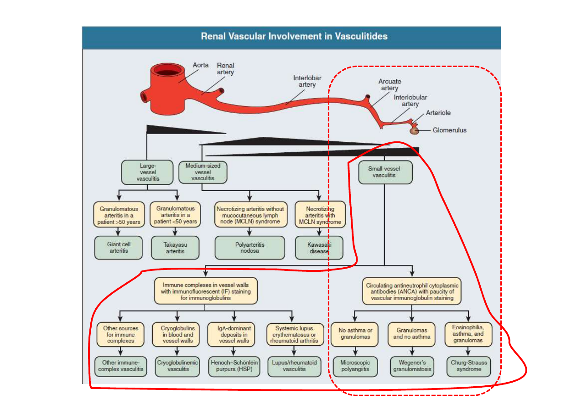

> **Şema yorumu:** Pulmono-renal sendroma ateş, halsizlik, kilo kaybı, genel durum düşkünlüğü gibi konstitüsyonel bulgular eşlik eder; artralji ve artrit olarak karşımıza çıkabilen eklem bulguları da görülebilir.

### İki Alt Grup

| Grup | Örnekler |
|---|---|
| **1. Vaskülitler** | Wegener (GPA), mikroskobik polianjiit (MPA), Churg-Strauss (EGPA), anti-GBM (Goodpasture) |
| **2. Vaskülit dışı ortak tutulumlar** | Hipervolemiye ikincil pulmoner ödem (ABY, KBY, KKY), bazı enfeksiyonlar (Legionella), multiorgan yetmezliği (ARDS + ABY) |

> **Klinik inci:** Pulmoner-renal sendromun **en sık sebebi mikroskobik polianjiittir (MPA)**.

---

## VASKÜLİTLER VE BÖBREK

> **Tanım:** Vaskülitler **damarın direkt atake edildiği** hastalıklar grubudur. Glomerüler kapillerlerin etkilenmesi ile GN, pulmoner kapillerlerin etkilenmesi ile alveoler hemoraji, dermal venüllerin tutulumu ile purpura ortaya çıkar.

### Böbreği Etkileyen Başlıca Vaskülitler

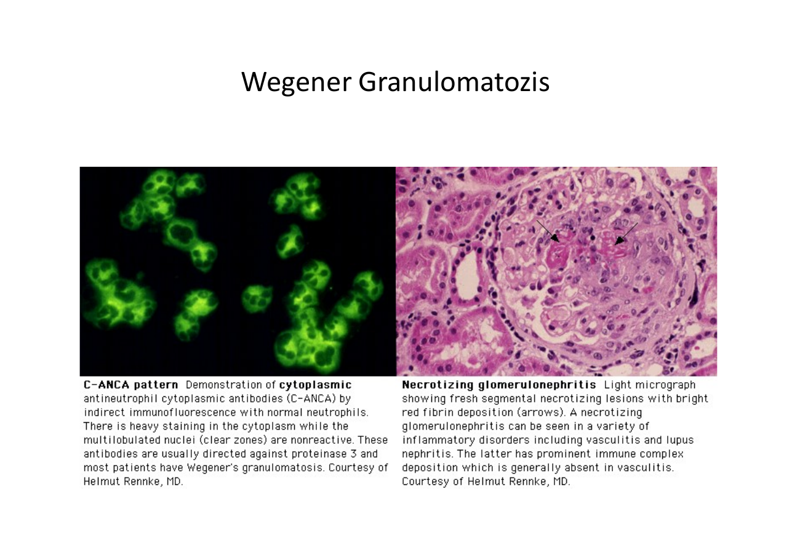

> **Şema yorumu:** Küçük damar vaskülitleri böbrekte hematüri, proteinüri ve böbrek yetmezliği olarak karşımıza çıkar; hızlı ilerleyici nitelikte olabilirler.

* **Wegener granülomatozu (GPA)**
* **Mikroskobik polianjiit (MPA)**
* **Klasik poliarteritis nodoza (PAN)**
* **Henoch-Schönlein purpurası (IgA vasküliti)**
* **Esansiyel mikst kriyoglobulinemi**
* **SLE vasküliti**

### Küçük Damar Vaskülitinde Ortak Özellikler

* Ateş, miyalji, artralji, halsizlik gibi **genel semptomlar**
* **Tanıda en önemli nokta olası tanının akla gelmesidir**
* Ciltte, solunum sistemi, böbrekler, periferik sinirler, iskelet kasındaki damarlar tutulabilir
* Ciltte **lökositoklastik vaskülit** (purpura, nekroz odakları, eritematöz hassas nodüller, livedo retikülaris)
* **Wegener Gr ve MPA'da** pulmoner renal sendrom; **HSP'de** dermal-renal sendrom

---

## ANCA POZİTİF KÜÇÜK DAMAR VASKÜLİTİ

> **Tanım:** Nötrofil sitoplazmasının bileşenlerine karşı gelişen otoantikorlar (**ANCA**) ile karakterize küçük damar vaskülitleri: GPA, MPA, EGPA.

### Genel Özellikler

| Özellik | Değer |
|---|---|
| **Tutulan damarlar** | Venül, arteriol, kapiller (küçük arter-ven olabilir) |
| **Yaş** | 5-6. dekad |
| **Cinsiyet** | K = E |
| **İnsidans** | ~1/100.000 |
| **ANCA hedef antijenleri** | **Proteinaz 3 (PR3)** ve **Miyeloperoksidaz (MPO)** |

### ANCA Alt Tipleri

| ANCA | Boyama Paterni | Antijen | Hastalık |
|---|---|---|---|
| **c-ANCA** | Sitoplazmik granüler | **PR3** | GPA (Wegener) |
| **p-ANCA** | Perinükleer | **MPO** | MPA, EGPA |

### Klinik Ortak Özellikler

* Böbrek: hematüri, proteinüri, böbrek yetersizliği
* Böbrek yetmezliği tipik olarak **1-3 ay içinde** son dönem böbrek yetersizliğine ilerleyebilen **hızlı ilerleyici** özellik
* Akciğer: alveol içi kanama, nekrotizan granülomatöz inflamasyona ikincil nodüler/kaviter lezyonlar
* **MPA'da granülomatöz lezyon görülmez** (tanım gereği)
* Böbrek tutulumunda **immün birikim yoktur (Pauci-immün)**

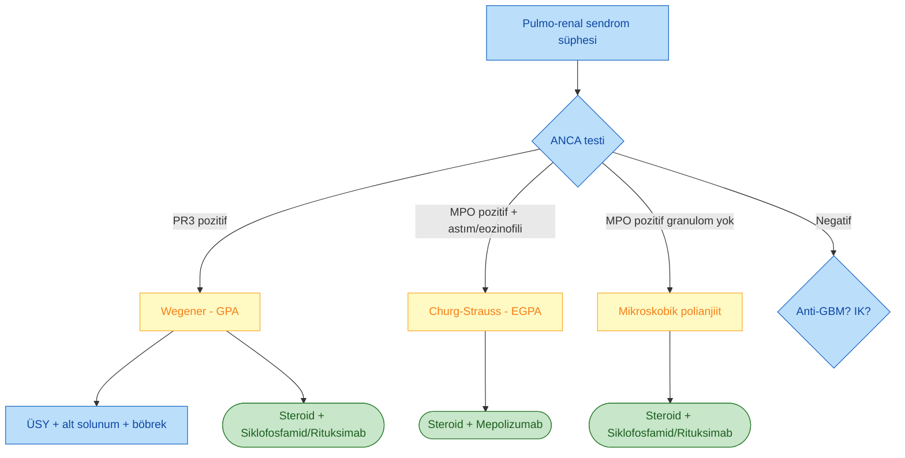
```mermaid
flowchart TD
    Süphe[Pulmo-renal sendrom süphesi]
    Süphe --> ANCA{ANCA testi}
    ANCA -->|PR3 pozitif| GPA[Wegener - GPA]
    ANCA -->|MPO pozitif + astım/eozinofili| EGPA[Churg-Strauss - EGPA]
    ANCA -->|MPO pozitif granulom yok| MPA[Mikroskobik polianjiit]
    ANCA -->|Negatif| Diger{Anti-GBM? IK?}

    GPA --> Triad[ÜSY + alt solunum + böbrek]
    GPA --> Tedavi1([Steroid + Siklofosfamid/Rituksimab])
    MPA --> Tedavi2([Steroid + Siklofosfamid/Rituksimab])
    EGPA --> Tedavi3([Steroid + Mepolizumab])

    classDef test fill:#bbdefb,stroke:#1565c0,color:#0d47a1
    classDef diagnose fill:#c8e6c9,stroke:#2e7d32,color:#1b5e20
    classDef warn fill:#fff9c4,stroke:#f9a825,color:#f57f17
    class Süphe,ANCA,Diger,Triad test
    class GPA,MPA,EGPA warn
    class Tedavi1,Tedavi2,Tedavi3 diagnose
```

---

## WEGENER GRANÜLOMATOZU (GPA)

> **Tanım:** Üst ve alt solunum yollarında **nekrotizan granülomatöz inflamasyon** + **nekrotizan glomerülonefrit** ile seyreden ANCA pozitif küçük damar vasküliti. Güncel adıyla **Granulomatosis with Polyangiitis (GPA)**.

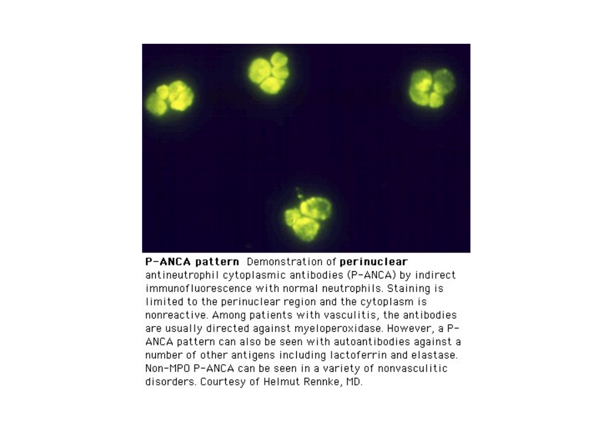

> **Klinik foto yorumu:** Wegener granülomatozunda tekrarlayan sinüzit, otitis media, oküler inflamasyon önemli bulgulardır. Saddle-nose (semer burun) deformitesi, nazal septum perforasyonunun geç bulgusudur. Kesin tanı biyopsi ile konur.

### Klinik Özellikler

* **Tekrarlayan sinüzit**, otitis media, oküler inflamasyon
* Nazal/oral mukozada inflamasyon, septum perforasyonu
* **Akciğer:** nodül, kavite, fiks infiltratlar, alveoler kanama
* **Böbrek tutulumu %80'de** -- hızlı ilerleyen GN
* Limited WG: üst solunum yolu ağırlıklı, böbrek tutulumu yok

### Laboratuvar

| Test | Sonuç |
|---|---|
| **c-ANCA (PR3-ANCA)** | **%90 pozitif**; duyarlılık %90-97, **özgüllük %80-100** |
| İdrar | Proteinüri + glomerüler hematüri + **eritrosit silendirleri** |
| Böbrek fonksiyon | Kreatinin artışı (hızlı ilerleyebilir) |

### ACR 1990 Tanı Kriterleri

2 veya daha fazla kriter varlığı (duyarlılık %88.2, özgüllük %92):

1. **Anormal idrar sedimenti** (eritrosit silendirleri veya büyük büyütmede >5 eritrosit)
2. **Akciğer grafisinde anormal bulgular** (nodül, kavite, fiks infiltrasyon)
3. **Oral ülser veya nazal akıntı**
4. **Biyopside granülomatöz inflamasyon**

### Biyopsi Bulguları

| Biyopsi Yeri | Bulgular |
|---|---|
| **Açık akciğer biyopsisi** | Tanı koyma oranı %91; granülomatöz inflamasyon |
| **Böbrek biyopsisi** | Fokal nekroz, **kresent oluşumları**, immün birikimin azlığı veya yokluğu (Pauci-immün) |

### Tedavi

**İndüksiyon tedavisi (birinci seçim):** Steroid + Siklofosfamid

| İlaç | Doz |
|---|---|
| **Metilprednisolon pulse** | 7 mg/kg × 3 gün IV |
| **Prednizolon** | 1 mg/kg/gün; 3 ayda 10 mg'a azaltılır |
| **Siklofosfamid** | 2 mg/kg/gün PO **veya** 0.5 g/m²/ay IV × 6 ay |

* Remisyon oranı: **%90**
* Remisyondan 3-5 ay sonra siklofosfamid kesilebilir
* Alternatif indüksiyon: **Rituksimab** (RAVE çalışması)

**İdame tedavisi:** Azatioprin 1-2 mg/kg/gün × 12-18 ay

**Ek stratejiler:**
* **Trimetoprim-sülfametoksazol (TMP-SMX):** nazal stafilokok taşıyıcılığını azaltarak remisyon idamesinde yararlı
* Relaps sıktır

> **⚠️ Uzun dönem risk:** Siklofosfamid ile **15 yılda %16 mesane kanseri** riski saptanmıştır -- bu nedenle günümüzde rituksimab tercih edilmektedir.

---

## MİKROSKOBİK POLİANJİİT (MPA)

> **Tanım:** Granülom oluşturmadan gelişen pauci-immün küçük damar vasküliti; böbrek ve akciğer başta olmak üzere çoklu organ tutulumu yapar.

### Özellikler

| Özellik | Değer |
|---|---|
| **ANCA** | %80'den fazla pozitif; genellikle **p-ANCA (MPO)** |
| **Böbrek tutulumu** | **%90** (hızlı ilerleyen GN) |
| **Granülom** | **YOK** (GPA'dan ayrımda anahtar) |

### Klinik ve Laboratuvar

* Kreatininde **günler içinde** belirgin artış
* Hematüri, granüle/eritrosit silendirleri, böbrek yetmezliği
* Biyopside nekrotizan vaskülit + fokal segmental GN + kresentler

### Tedavi

* **Kortikosteroid + siklofosfamid** (GPA ile benzer)
* **Pulse metilprednizolon** (1 g × 3 gün)
* Etkisiz olursa **plazmaferez** denenebilir
* **Remisyon sonrası bir yıl idame tedavi** gerekir
* Relaps sıktır

---

## KLASİK POLİARTERİTİS NODOZA (PAN)

> **Tanım:** Orta boy müsküler arterlerin dallanma noktalarını tutan vaskülit; anevrizmalar karakteristiktir. Böbrek, sinir sistemi ve kalp baskın tutulur.

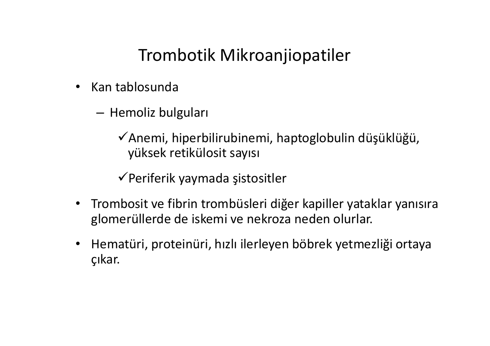

> **Şema yorumu:** PAN'da anjiyografide renal veya mezenterik arterlerde birden fazla **anevrizma (inci tanesi görünümü)** saptanır. Bu bulgu patognomonik kabul edilir.

### Epidemiyoloji ve Klinik

* **30-50 yaş arası erkeklerde** sık
* **Hep B enfeksiyonu**, IV ilaç kullanımı ile birlikte görülebilir
* Nonspesifik semptomlar: ateş, kilo kaybı, artralji
* **Glomerüler iskemiye bağlı hiperreninemik hipertansiyon**
* Kalp tutulumu (%70): anjina, MI, perikardit
* Sinir tutulumu: **mononöritis multipleks** (en sık)

### Böbrek Tutulumu (%65-100)

* İdrar bulguları **gros hematüri** dışında negatif
* Böbrek yetmezliği iskemiye (glomerülün direkt tutulumuna değil) bağlıdır
* **Yama tarzı infarktlar** oluşur
* **Glomerülonefrit YOKTUR** (küçük damar vaskülitinden ayrım)

### Tanı

* **Biyopsi** (sinir, böbrek) veya **anjiyografi** (renal, çölyak -- anevrizmalar)
* ANCA genellikle negatif (%50-90 negatif)

### Tedavi

* **Erken tanı ve tedavi çok önemlidir** -- erken başlanırsa lezyonlar **reverzibl** olabilir
* Steroid + siklofosfamid
* Hep B pozitifse antiviral tedavi

---

## HENOCH-SCHÖNLEIN PURPURASI (IgA VASKÜLİTİ)

> **Tanım:** Çocuklarda **en sık görülen sistemik vaskülit**; damarlarda **IgA'dan zengin immün kompleks birikimi** ile karakterize.

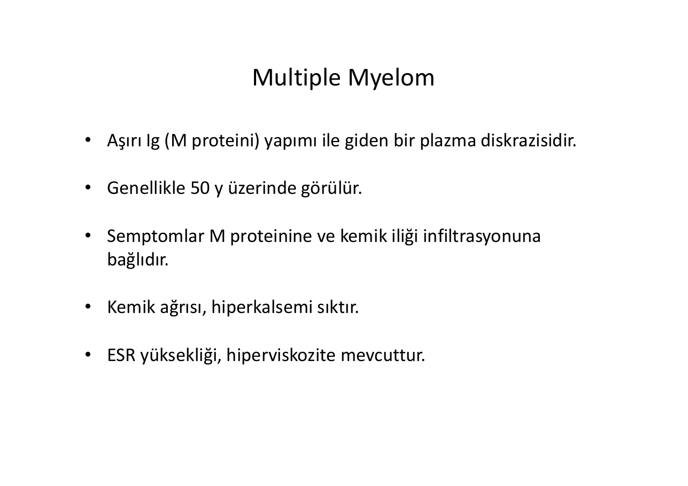

> **Klinik foto yorumu:** HSP'de alt ekstremite ve gluteal bölgede palpabl purpura klasik bulgudur. Genellikle çocuk yaş grubunda, erkeklerde daha sıktır.

### Klinik Bulgular

| Bulgu | Sıklık |
|---|---|
| **Purpura** | %90 |
| **Artrit/artralji** | %60 |
| **GİS bulguları** | %50 (karın ağrısı, kanama, intususepsiyon) |
| **Böbrek tutulumu** | %10-20 (prognozu belirler) |
| **Nefrotik sendrom** | %20-30 |

### Böbrek Patolojisi

* Mezangioproliferatif glomerülonefrit (**IgA nefropatisi ile aynı histoloji**)
* Hematüri + nefrotik düzeyde proteinüri olabilir
* **Kresentik GN** görülebilir -- kötü prognoz

### Tedavi

| Durum | Tedavi |
|---|---|
| **Hafif renal tutulum** | Genellikle tedavi gerekmez |
| **Ağır böbrek tutulumu** | Kortikosteroid + azatioprin |
| **Kresentik HSP indüksiyon** | Prednizolon 0.5-1 mg/kg/gün × 8 hafta + Siklofosfamid 2 mg/kg/gün × 8 hafta |
| **İdame** | Prednizolon azaltılır + Azatioprin 2.5 mg/kg/gün |

---

## TROMBOTİK MİKROANJİYOPATİLER

> **Tanım:** **Mikroanjiyopatik hemolitik anemi + trombositopeni + değişen derecede böbrek yetmezliği** ile seyreden klinik sendrom. Nörolojik bulguların baskın olduğu tipi **TTP**, böbrek yetmezliğinin baskın olduğu tipi **HÜS** olarak adlandırılır.

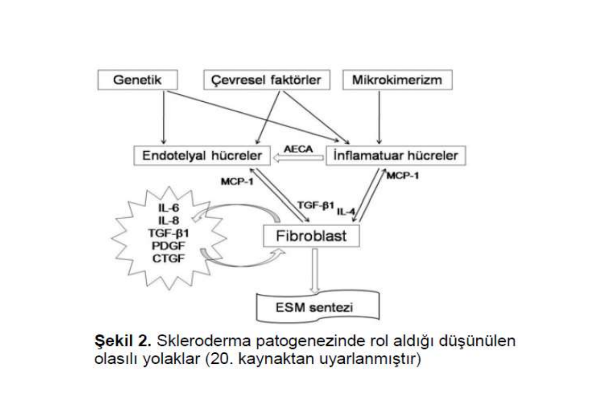

> **Histoloji yorumu:** TMA'da glomerüler kapiller ve arteriollerde **fibrin trombüsleri** mevcuttur. Periferik yaymada **şistositler** tipiktir.

### Sınıflama

| Hastalık | Özellik | Neden |
|---|---|---|
| **TTP** | Nörolojik baskın, erişkin | ADAMTS13 eksikliği (otoantikor), artmış vWF multimerleri |
| **Tipik HÜS** | Böbrek yetmezliği baskın, **çocukta sık** | Shiga toksin (E. coli O157:H7), **verotoksin**, enterik enfeksiyon |
| **Atipik HÜS** | Herhangi yaş | Komplement disregülasyonu (faktör H, faktör I, MCP) |
| **Sekonder TMA** | -- | Gebelik, SLE, ilaçlar (siklosporin, mitomisin C), malignite, HIV |

### Klinik Bulgular

* **Hemoliz:** Anemi, hiperbilirubinemi, haptoglobulin ↓, retikülosit ↑
* **Periferik yaymada şistositler**
* Trombositopeni
* Glomerüllerde iskemi/nekroz → hematüri, proteinüri, hızlı ilerleyen böbrek yetmezliği

### Tedavi

| Hastalık | Tedavi |
|---|---|
| **TTP** | **Plazmaferez** (ana tedavi), ± kortikosteroid (tartışmalı), rituksimab, kaplasizumab |
| **Tipik HÜS** | Destek tedavisi (sıvı, diyaliz), antibiyotik YOK (toksin salınımı) |
| **Atipik HÜS** | **Eculizumab** (C5 kompleman inhibitörü), ravulizumab |

> **⚠️ Tedavi edilmezse TTP fataldir.** Klinik şüphede plazmaferez hemen başlatılmalıdır.

---

## PROGRESİF SİSTEMİK SKLEROZ (SKLERODERMA)

> **Tanım:** Tıkayıcı damar lezyonları ile seyreden, cilt, akciğer, GİS ve böbrek tutulumu yapan bağ dokusu hastalığı.

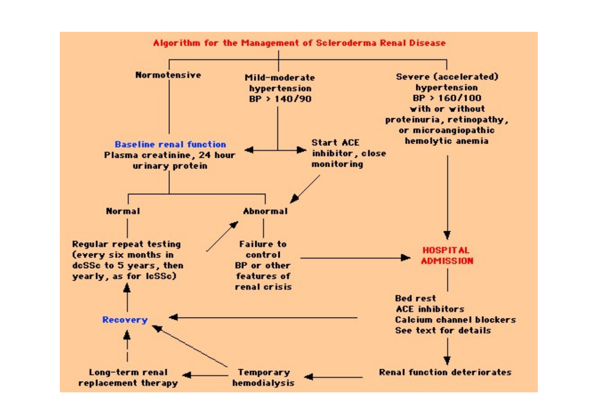

> **Klinik foto yorumu:** Sistemik sklerozda cilt sertleşmesi (skleroderma), sklerodaktili ve Raynaud fenomeni klasik bulgulardır. Böbrek tutulumu genellikle geç ortaya çıkar.

### Genel Özellikler

| Özellik | Değer |
|---|---|
| **Hasta grubu** | Orta yaşlı kadınlar |
| **ANA** | **%90 pozitif** (benekli patern) |
| **Anti-Scl-70** | Daha spesifik (topoizomeraz I) |
| **Antisentromer (CREST)** | Spesifik (sınırlı form) |
| **Böbrek tutulumu** | **%50'ye varan** |

### Böbrek Patolojisi

* İnterlobüler arterlerde obliteratif lezyonlar
* **"Soğan kabuğu" görünümü** (patognomonik)
* İdrar sedimenti **inaktif**
* Glomerüler iskemi → **renin artışı** → hipertansiyon

### İki Tablo

| Tablo | Özellik |
|---|---|
| **Renal kriz** | Şiddetli HT + **1-2 ayda** böbrek yetmezliğine gidiş; %25 sklerodermada |
| **Yavaş ilerleyen böbrek yetmezliği** | Subakut-kronik seyir |

### Renal Kriz Risk Faktörleri

* **Yüksek cilt skoru** (modifiye Rodnan deri kalınlık skoru ≥20)
* Eklem kontraktürleri
* **Kortikosteroid kullanımı** (önemli iyatrojenik risk)

### Tedavi -- En Önemli Nokta: **Kan Basıncı Kontrolü**

| Tedavi | Özellik |
|---|---|
| **ACE inhibitörü (kaptopril, enalapril)** | **Birinci seçim** -- sağ kalım oranını belirgin artırır |
| Prognoz (ACEi ile) | 1 yıllık sağkalım %76, 5 yıllık %66 |
| Prognoz (ACEi öncesi) | 1 yıllık %15, 5 yıllık %10 |

> **⚠️ ÖNEMLİ:** Skleroderma renal krizde **ACE inhibitörleri hayat kurtarıcıdır**. Diğer sistemik hastalıklarda ACEi hipotansif krize yol açabilirken burada tercih edilen ilaçtır.

---

## MULTIPLE MYELOM

> **Tanım:** Aşırı Ig (M proteini) yapımı ile giden plazma hücre diskrazisi. **Böbrek yetmezliği %50 hastada** görülür.

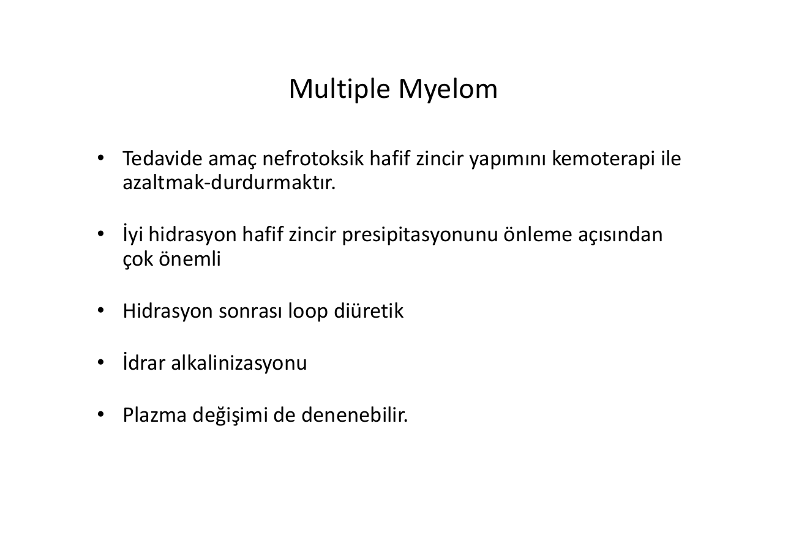

> **Histoloji yorumu:** Myelom böbreğinde (cast nefropatisi) tübüllerde **eozinofilik, katı, çatlaklı silindir** görünümünde hafif zincir birikimi tipiktir. Dev hücre reaksiyonu eşlik edebilir.

### Klinik

* 50 yaş üzeri
* Kemik ağrısı, hiperkalsemi
* ESH yüksekliği, hiperviskozite
* **Hafif zincirler (Bence-Jones proteini)** idrarda
* Dipstik proteinüri **negatif** olabilir (sadece albümine hassas); kantitatif tetkikle pozitif
* İdrar sedimenti **inaktif**

### Böbrek Yetmezliği Nedenleri

| # | Mekanizma |
|---|---|
| 1 | **Anormal Ig'lerin tübüllerde çökerek obstrüksiyon** (cast nefropati) |
| 2 | Direkt hafif zincir toksisitesi (tübüler) |
| 3 | Hiperkalsemi (GFH azalır) |
| 4 | Hiperürisemi (ürik asit nefropatisi) |
| 5 | Piyelonefrit (enfeksiyona yatkınlık) |
| 6 | **Amiloid birikimi** |
| 7 | Nefrotoksinler (NSAİD) |
| 8 | Dehidratasyon |

### Multiple Myelom Düşündüren Bulgular

Böbrek yetmezliği ile başvuran hastada:

* **Hiperkalsemi** (böbrek yetmezliğinde hipokalsemi beklenir -- uyumsuz!)
* Böbrek yetmezliği derecesine göre **beklenmeyecek derinlikte anemi**
* **Aşırı yüksek sedimentasyon**
* Dipstikte proteinüri yok ama kantitatif yöntemle var
* **Yüksek globulin, azalmış anyon gap**

### Tedavi

* **Ana hedef:** Nefrotoksik hafif zincir yapımını kemoterapi ile azaltmak-durdurmak
* **İyi hidrasyon** (hafif zincir presipitasyonunu önler)
* Hidrasyon sonrası loop diüretik
* İdrar alkalinizasyonu
* Plazma değişimi (plazmaferez) denenebilir

---

## AMİLOİDOZ

> **Tanım:** **Erimeyen protein yapısında, amorf ve eozinofilik** bir maddenin hücre dışı dokuda birikimi.

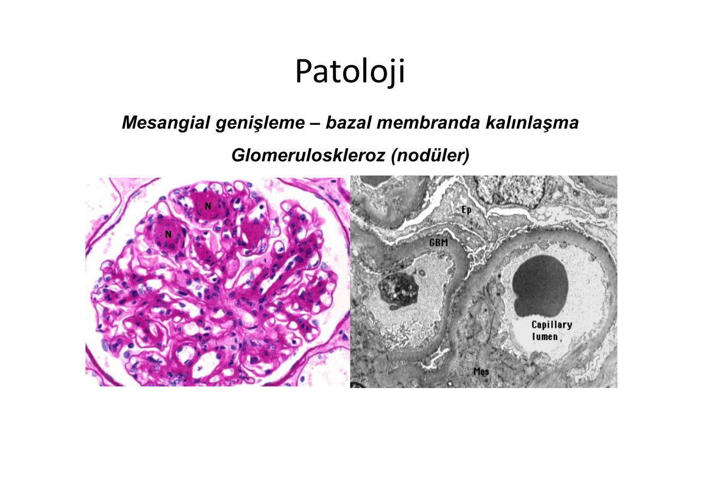

> **Histoloji yorumu:** Amiloidoz tanısında **Kongo kırmızısı boyama** + polarize ışıkta **elma yeşili çift kırılma (apple-green birefringence)** altın standarttır.

### Sınıflama

| Tip | Sorumlu Protein | Neden |
|---|---|---|
| **Primer (AL)** | Hafif zincir | **Multiple myelom**, plazma hücre diskrazileri |
| **Sekonder (AA)** | Serum amiloid A | **FMF**, kronik enfeksiyonlar (osteomiyelit, TBC, kronik bronşit), RA, Crohn |
| Senile | Transtiretin | Yaşlı -- kardiyak ATTR |
| Diyaliz ilişkili | β2-mikroglobulin | Uzun süreli diyaliz |

### Klinik

* Proteinüri (sıklıkla **nefrotik düzeyde**)
* Tübüler tutulum: **RTA, hiperkalemi, diabetes insipidus**
* **Kan basıncı genellikle düşük** (tipik)
* Multisistem: kalp (restriktif KMP), nöropati, hepatomegali, makroglossi (AL)

### Tanı

* **Abdominal yağ dokusu biyopsisi** (duyarlılık %80)
* **Rektal biyopsi**
* Biyopsilerde Kongo kırmızısı pozitif
* Tiplendirme: immünofiksasyon, lazer mikrodiseksiyon + kütle spektrometresi

### Tedavi

* AL: kemoterapi (melfalan, bortezomib, daratumumab), otolog KİT
* AA: altta yatan nedeni tedavi et
* **FMF + AA amiloidoz: kolşisin koruyucu etkisi** (profilaksi)

> **⚠️ Not:** Amiloid birikimli hastalar **kanamaya meyillidir** (periorbital purpura faktör X eksikliği).

---

## KRİYOGLOBULİNEMİ

> **Tanım:** Düşük ısıda presipite olan ve 37°C'ye ısıtıldığında çözünen immünoglobulinlerin varlığı.

### Brouet Sınıflaması

| Tip | Kompozisyon | İlişki |
|---|---|---|
| **Tip I** | **Monoklonal** IgG veya IgM | Waldenström makroglobulinemisi, MM |
| **Tip II (esansiyel mikst)** | Poliklonal IgG + **monoklonal IgM** (romatoid faktör) | **HCV, EBV, HBV** |
| **Tip III (mikst)** | Poliklonal IgG + poliklonal IgM | Kronik inflamatuvar, otoimmün, lenfoproliferatif, **HCV** |

### Mikst Kriyoglobulineminin Kliniği

* **Palpabl purpura**
* Artralji
* Lenfadenopati
* Hepatosplenomegali
* Periferal nöropati
* **Hipokomplementemi** (C4 belirgin düşük)
* Low-grade NHL sıklığında artış

### Renal Tutulum (Mikst Kriyoglobulinemi)

* Tanıda **%20**, seyir boyunca **%35-60**; **Tip II'de daha sık**
* Patoloji: GBM kalınlaşması, sellüler proliferasyon, **intraluminal trombüsler**, makrofaj artışı
* **Diffüz IgM depozisyonu** (kapiller loopda)
* Subendotelyal birikim
* Patogenez: **HCV içeren immün kompleksler**

### Tedavi

* Altta yatan HCV'ye **direkt etkili antiviral (DAA)** (ledipasvir/sofosbuvir, glecaprevir/pibrentasvir)
* Ağır vaskülitte: rituksimab, plazmaferez, siklofosfamid

---

## SİSTEMİK LUPUS ERİTEMATOZUS (SLE) VE LUPUS NEFRİTİ

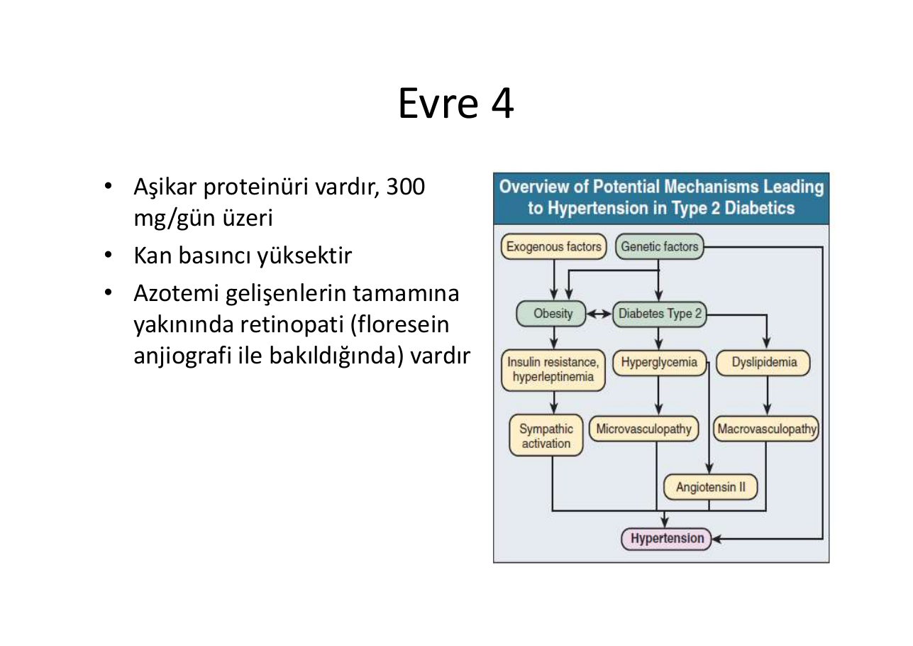

> **Şema yorumu:** SLE'de böbrek tutulumu en ciddi organ tutulumlarından biridir. Malar rash, artrit, serozit diğer klinik bulgular eşlik edebilir.

### Epidemiyoloji

| Parametre | Değer |
|---|---|
| **Tanıda renal tutulum** | %40-70 |
| **5 yıllık takipte** | %70-90 |
| **Biyopsi ile subklinik tutulum dahil** | %90 |
| Tipik zamanlama | Tanıdan **6 ay - 3 yıl** arasında |

### SLE'de Renal Tutulum Bulguları

* **Proteinüri** (en sık)
* Anormal idrar sedimenti (eritrosit silendirleri)
* Serum kreatinin yüksek
* Sessiz lupus nefriti (bulgu yok, biyopsi pozitif)

### Kötü Prognoz Kriterleri

**Klinik:**
* Erkek cinsiyet
* Zenci ırk
* Hipertansiyon
* 24 yaşından önce başlangıç
* İmmünsüpresif tedaviye geç başlama
* Renal alevlenmeler

**Patoloji/Laboratuvar:**
* **>%50 kresent varlığı**
* Yüksek kronisite indeksi
* Serum kreatinin yüksek
* Nefrotik sendrom
* Anemi, lökopeni, trombositopeni
* Antifosfolipid antikor pozitifliği
* **Yüksek anti-dsDNA**
* **Kalıcı hipokomplementemi**

### Alevlenme Tanımları

| Tip | Tanım |
|---|---|
| **Nefritik alevlenme** | Nefritik sedimentle birlikte **kreatininde bazale göre ≥%30 hızlı artış** |
| **Proteinürik alevlenme** | Proteinüride artış, en az **2 g/gün** |

### WHO Sınıflaması (Lupus Nefriti Tipleri)

| Sınıf | Patoloji | Klinik |
|---|---|---|
| **I** | Minimal mezangial (normal LM, mezangial depozit) | Asemptomatik |
| **II** | Mezangial proliferatif | Hematüri ± hafif proteinüri |
| **III** | Fokal proliferatif (<%50 glomerül tutulu) | Proteinüri, hematüri, HT olabilir |
| **IV** | **Diffüz proliferatif** (≥%50 glomerül tutulu) | **En sık ve en ağır**; nefrotik + nefritik + böbrek yetmezliği |
| **V** | Membranöz | Nefrotik sendrom |
| **VI** | Sklerozan (kronik hasar) | Yavaş ilerleyen böbrek yetmezliği |

> **Not:** Hastaların **%15-50'sinde** bir formdan diğerine dönüş olabilir (sınıflar arası geçiş).

### Lupus Nefriti Patogenezi

**Mezangial ve subendotelyal birikim:**
* Dolaşımdaki immün kompleksler birikir
* Kompleman aktivasyonu + C3a/C5a ile nötrofil/mononükleer hücre kemotaksisi
* **Mezangial, fokal veya diffüz proliferatif GN**
* Aktif idrar sedimenti, sıklıkla böbrek yetmezliği

**Subepitelyal birikim:**
* GBM'ı geçebilen katyonik antijenler veya epitel antijenlerine karşı otoantikor
* Kompleman aktivasyonu vardır ama vasküler alandan ayrı
* Kemotaksis **olmaz**
* Hasar glomerüler epitelde
* **Membranöz nefropati paterni**
* Proteinüri (sıklıkla nefrotik), idrar sedimenti inaktif

> **Klinik inci:** Lupusa spesifik patolojik bulgu: **glomerüler endotel hücrelerinde tübüloretiküler cisimcikler** (ribonükleoprotein + membran; α-interferon ile artar; ayrıca HIVAN'da görülür).

### Tedavi Hedefleri

1. **Tedavide gecikmemek**
2. **Tam remisyon sağlamak**
3. **Alevlenmeleri engellemek**
4. **Tedavi komplikasyonlarından kaçınmak**

### Sınıfa Göre Tedavi

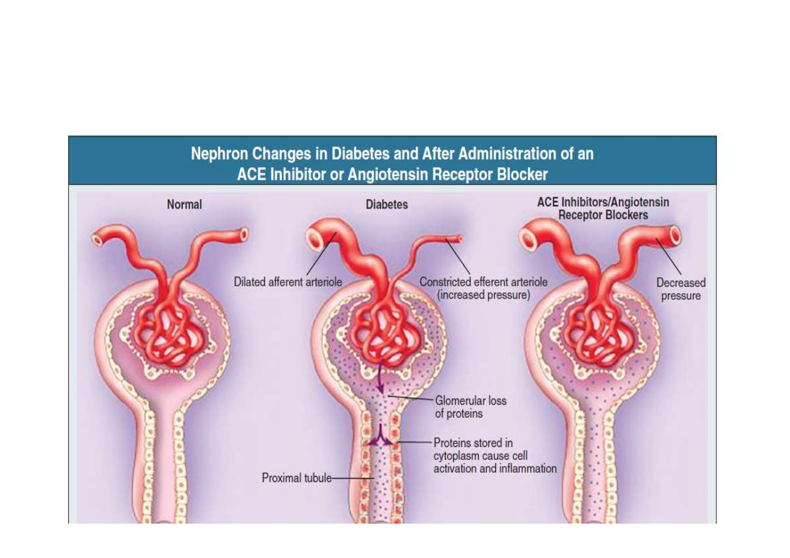

> **Şema yorumu:** Lupus nefriti tedavisi sınıfa (ISN/RPS) göre bireyselleştirilir. Sınıf III/IV mutlaka immünsüpresif tedavi gerektirir; Sınıf V'te nefrotik düzeye göre karar verilir.

**Sınıf II (Mezangial):**
* Genellikle **tedavi gerektirmez**
* Prognoz iyidir

**Sınıf III (Fokal Proliferatif):**
* <%25 tutulum: 5 yılda böbrek yetmezliği ihtimali düşük
* %40-50 tutulum + nekroz/kresent/nefrotik/HT: **diffüz gibi tedavi et**
* IF: IgG + C3 birikimi

**Sınıf IV (Diffüz Proliferatif):**
* En sık ve en ağır form
* **Agresif tedavi gerekli**
* **İndüksiyon:** Prednizon 1 mg/kg + **siklofosfamid 2-2.5 mg/kg PO veya aylık pulse**
* Ağır vakalarda pulse steroid
* Alternatif: **MMF** (Mikofenolat mofetil 2-3 g/gün)
* **Belimumab, vokloporin** (yeni ajanlar)

**Sınıf V (Membranöz LN):**
* Membranöz LN **başka klinik ve serolojik SLE bulgusu olmadan görülebilen tek formdur**
* Asemptomatik hastalar tedavi edilmez
* Orta: Prednizon
* Ağır: Prednizon + **siklofosfamid veya klorambusil**
* Siklosporin denenmiş, relaps fazla

**Sınıf VI (Sklerozan):**
* Önceden oluşmuş hasarın iyileşmesi
* İlerlemeyi yavaşlatma: **ACE inh, düşük proteinli diyet, lipid kontrolü**
* Biyopsi ile tanı, gereksiz immünsüpresif tedaviden kaçınmak için

### SLE -- Diğer Böbrek Tutulumları

**Tübülointersisyel tutulum:**
* Glomerüler patolojilere eşlik eder
* İnterstisyel infiltrat + tübüler zedelenme
* Şiddeti prognozu belirler

**Vasküler hastalık:**
* **İmmün birikim, nekrotizan vaskülit, intravasküler tromboz**
* Genellikle **lupus antikoagülanı** ile ilişkili
* **TTP benzeri TMA** -- küçük arteriol ve kapillerlerde fibrin trombüsleri
* TMA tedavisi: **plazmaferez**
* Lupus antikoagülanı için **kronik warfarin**

---

## DİABETES MELLİTUS VE NEFROPATİ

> **Tanım:** DM, kronik böbrek hastalığının **en sık nedenidir** (%30-35). Tip 1 ve Tip 2 DM hastalarının %35-40'ı etkilenir.

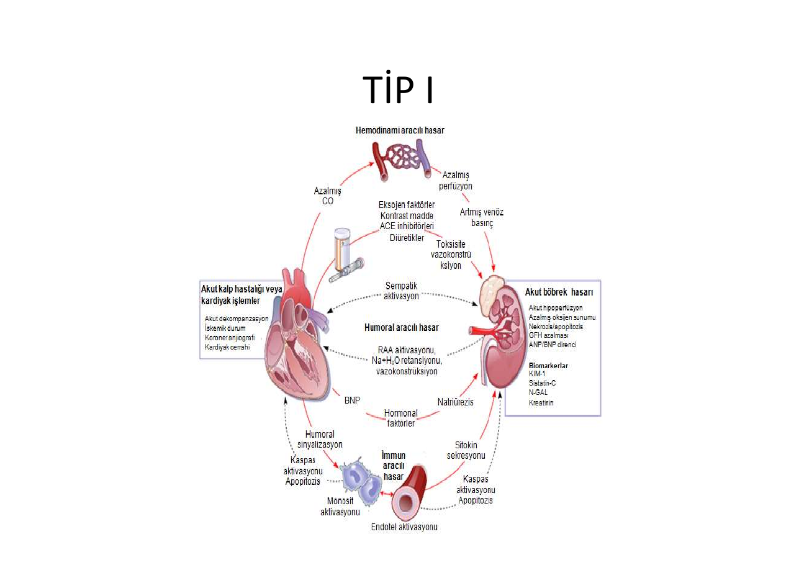

> **Şema yorumu:** Diyabetik nefropati patogenezinde hiperglisemi anahtardır. 3 ana yolak: AGE oluşumu, aldoz redüktaz-sorbitol, diaçilgliserol-PKC. Bu yolaklar birlikte glomerüler hasarı tetikler.

### Klinik Özellikler

* Proteinüri, böbrek tutulumunun habercisidir
* Başlangıç: GFH artışı ve hiperfiltrasyon
* Proteinüri çıktıktan **7-10 yıl sonra** son dönem böbrek yetmezliği
* Erken evre değişiklikler **reverzibl** (iyi kan şekeri kontrolü, ACE inh ile)

### Mogensen 5 Evre Sınıflaması

| Evre | Tanım |
|---|---|
| **I** | **Hiperfonksiyon** -- GFH'de %20-40 artış |
| **II** | **Klinik latent** -- GFR normal/artmış, GBM kalınlaşması (2-5 yıl), mezangial matriks genişlemesi |
| **III** | **Mikroalbüminüri (insipient)** -- 30-300 mg/gün, **reverzibl** |
| **IV** | **Klinik (aşikar) nefropati** -- proteinüri >300 mg/gün, GFH azalması, HT, ödem |
| **V** | **Böbrek yetmezliği** -- GFR <25 mL/dk, nefrotik proteinüri, HT, ödem, azotemi |

### Patogenez -- 3 Aktif Yol

**1. İlerlemiş glikasyon son-ürünleri (AGE):**
* Glukoz proteinlerdeki serbest amino gruplarına non-enzimatik bağlanır
* AGE'ler glomerülde tip IV kollajen + TGF-β1 ekspresyonunu güçlendirir
* PKC aktivitesini artırır
* Aminoguanidin: Fare modelinde nefropati gelişimini geciktirir

**2. Aldoz redüktaz (poliol) yolu:**
* Hiperglisemide glukoz-6-fosfat yolu sature olur
* AR aracılığıyla sorbitol oluşumu artar
* Biriken sorbitol PKC-α aktive eder → matriks protein sentezi ↑
* Retinopati ve nöropati gelişiminde rol alır

**3. Diaçilgliserol-Protein Kinaz C aktivasyonu:**
* Hiperglisemide vasküler doku ve glomerül mezangial hücrelerde aktive olur
* **PKC sitokin, ekstraselüler matriks, Endotelin-1** üretimini artırır
* Bazal membran kalınlaşması, vasküler oklüzyon, geçirgenlik artışı
* Ruboxistaurin TGF-β isoformlarını inhibe eder

### Hiperfiltrasyon Mekanizmaları

* Hiperglisemi
* Artmış GH, glukagon
* Keton cisimcikleri, diyette protein fazlası
* RAAS bozuklukları
* Prostaglandin yapım bozuklukları
* **Angiotensin II**: glomerüler HT + mezangial hücre büyümesi + ECM sentezi artışı
* Makrofajlar AGE reseptörü + NO + IL-1 salınımı

### Patoloji

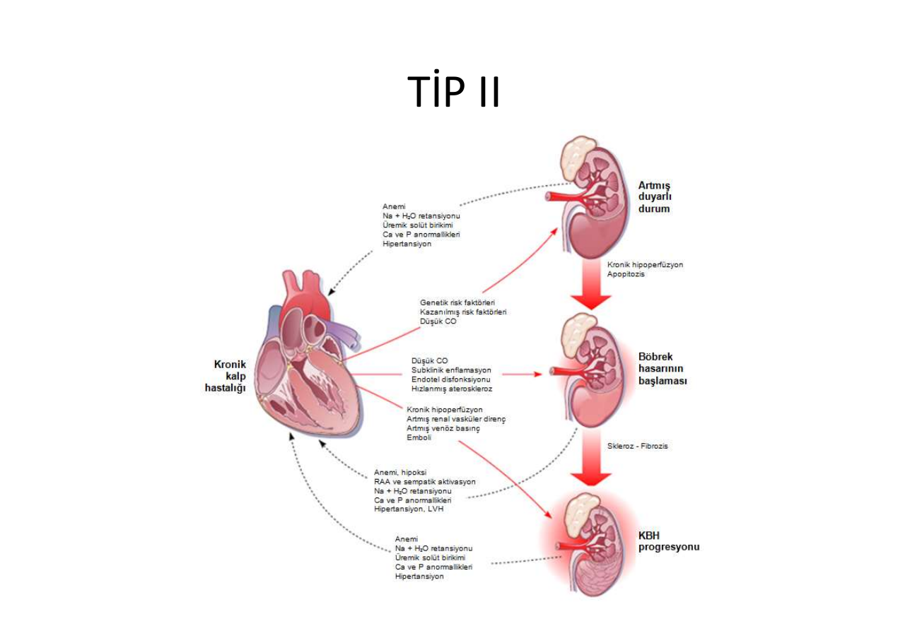

> **Histoloji yorumu:** **Nodüler glomerüloskleroz (Kimmelstiel-Wilson nodülü)** diyabetik nefropati için **patognomoniktir**. Diffüz glomerüloskleroz ve afferent-efferent hyalinoz eşlik eder.

| Bulgu | Özellik |
|---|---|
| **En erken bulgu** | **GBM kalınlaşması** |
| Mezangial artış | GFH ile korele |
| **Nodüler glomerüloskleroz (Kimmelstiel-Wilson)** | **Spesifik/patognomonik** |
| Diffüz glomerüloskleroz | Daha yaygın |
| Arteriyoler hyalinoz | **Afferent + efferent birlikte** (tipik) |

### Mikroalbüminüri (MAÜ)

* **30-300 mg/gün** veya 20-200 μg/dakika
* **10-14 yıl sonra** aşikar nefropati gelişir
* 6 ay içinde 3 ölçüm yapılmalı, 2'sinde saptanırsa tanı
* **Reverzibl evre** (tedavi ile geri döndürülebilir)

### Tanı

| Kriter | Yorum |
|---|---|
| **Tip 1 DM'de ≥5 yıl hastalık + proteinüri + retinopati** | **Biyopsiye gerek yok** |
| **Tip 2 DM'de ilk tanıda** proteinüri olabilir | Hastalık uzun süredir olabileceği için |
| Atipik seyir | Biyopsi düşün (non-diyabetik böbrek hast.) |

### Tarama

* **Tip 1 DM:** Tanıdan 5 yıl sonra
* **Tip 2 DM:** Tanı anında

### Komplikasyonlar

* **Tip IV RTA** (hiporenin-hipoaldosteron -- diyabette sık)
  * Hiperkalemi + metabolik asidoz birlikte
* Enfeksiyonlar sık
* **Papilla nekrozu** görülebilir
* Azotemi geliştiğinde **insülin ihtiyacı azalır** (insülinin %30-40'ı böbrekte yıkılır)

### Tedavi

| Yaklaşım | Detay |
|---|---|
| **Kan basıncı kontrolü** | <130/80; ACE/ARB birinci seçim (**glomerüler basıncı azaltır**) |
| **Kan şekeri kontrolü** | HbA1c bireyselleştir (genelde <7%) |
| **SGLT2 inhibitörleri** | Renoprotektif -- dapagliflozin, empagliflozin |
| **GLP-1 RA** | Liraglutid, semaglutid -- kardiyo-renoprotektif |
| **Finerenon** | Non-steroidal MRA -- FIDELIO-DKD, FIGARO-DKD |
| **Nefrotoksik ilaçlardan kaçın** | Radyokontrast, aminoglikozid, NSAİİ |
| **Düşük proteinli diyet** | 0.8 g/kg/gün |
| **Lipid kontrolü** | Statin |
| **Diyaliz başlangıcı** | GFR 15 mL/dk (daha erken değil) |
| **KRT seçenekleri** | HD, PD, **böbrek + pankreas transplantasyonu** |

### RAAS'ın Rolü

* Hiperglisemi intrarenal RAAS'ı uyarır
* Lokal Ang II yapımı artar
* Negatif feedback ile **sistemik renin salınımı inhibe** (sistemik RAAS baskılı)
* **Tip IV RTA nedeni = hiporeninemik hipoaldosteronizm**

| Reseptör | Etki |
|---|---|
| **AT2 reseptör** | İntrarenal NO ↑, natriürez, hücre büyümesi ve matriks sentezi inhibisyonu |
| **AT1 reseptör** | Vasküler rezistans ↑, renal kan akımı ↓, ECM yapımı ↑ |

---

## TÜMÖR LİZİS SENDROMU

> **Tanım:** Genellikle tümör yükü fazla olan hastalarda malign hücrelerin hızlı yıkımı sonucu **hücre içi metabolitlerin dolaşıma salınması** ile gelişen onkolojik acil.

### Etyoloji ve Risk

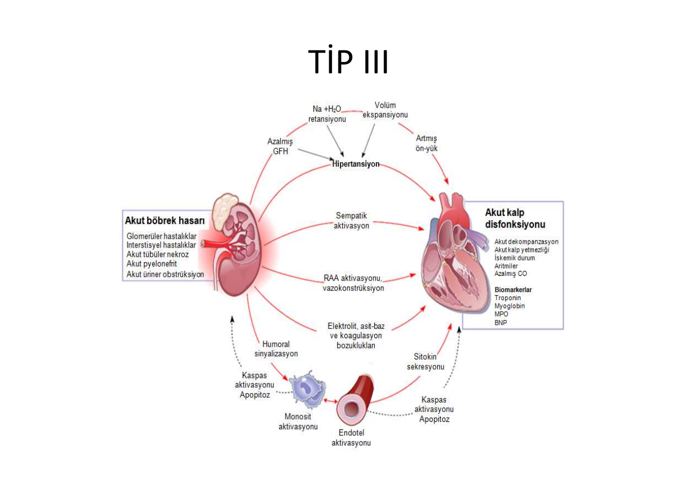

> **Şema yorumu:** TLS'de hücre parçalanması sonucu **hiperürisemi, hiperkalemi, hiperfosfatemi ve sekonder hipokalsemi** tetradı oluşur. Ürat çökeltisi akut böbrek yetmezliğine yol açar.

* Spontan (yüksek turnover) veya tedavi sonrası (radyo/kemoterapi, hormonlar, biyolojik ajanlar)
* **Yüksek risk:** ALL, NHL (özellikle Burkitt), **lösemi**
* 4 biyokimyasal anormallik: **ürik asit ↑, K ↑, fosfat ↑, kalsiyum ↓** (Ca-P çökmesi)

### Yüksek Risk Kriterleri

| Kriter | Değer |
|---|---|
| Yaş | <25 |
| Cinsiyet | Erkek |
| Hastalık | İleri evre |
| LDH | Yüksek |
| Lökosit | >100.000 |
| Kreatinin | >2.4 mg/dL |

### Predispozan Faktörler

* Volüm azalması
* Konsantre asidik idrar
* Yüksek üriner ürik asit atılımı

### Tedavi -- 3 Temel İlke

1. **Hidrasyon**
2. **İdrar alkalinizasyonu**
3. **Ürik asit oluşumunun azaltılması**

### Detaylı Protokol

| Tedavi | Doz |
|---|---|
| **IV hidrasyon (24-48 saat önce başla)** | %0.45 NaCl + %5 dextroz veya SF **3-6 L/m²/gün** |
| NaHCO₃ hidrasyona ekle | **50-100 mmol/L** |
| **Hedef idrar pH** | **7-7.5** |
| **Allopurinol (sitotoksik tedavi öncesi)** | 100 mg/m² × 3/gün PO **veya** 150 mg/m² × 2/gün |
| **Rasburikaz (rekombinant ürat oksidaz)** | **0.05-0.20 mg/kg × 5 gün** IV (en az 30 dk infüzyon) |
| İzlem | Serum elektrolit, ürik asit, kreatinin yakından |

> **⚠️ Rasburikaz:** Mevcut ürik asidi hızla temizler; yüksek riskli hastada tercih edilir. İdrar alkalinizasyonu rasburikaz ile gereksiz (hatta fosfat çökelmesini artırır).

---

## KARDİYO-RENAL SENDROMLAR

> **Tanım:** Kalp ve böbreklerin birindeki akut ya da kronik fonksiyon bozukluğunun **diğer organda akut ya da kronik fonksiyon bozukluğuna** yol açabildiği klinik tablolar.

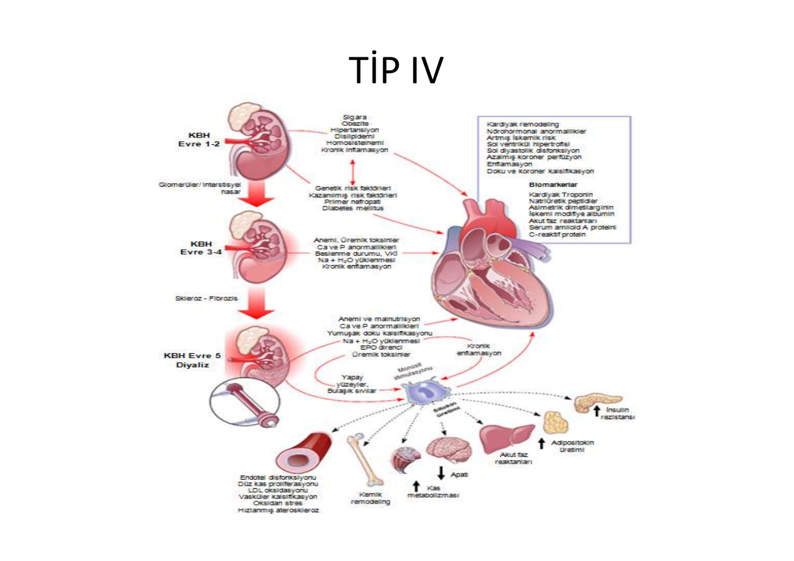

> **Şema yorumu:** Ronco sınıflamasına göre kardiyo-renal sendrom 5 tipe ayrılır. Birincil organa (kalp/böbrek) ve seyir hızına (akut/kronik) göre sınıflandırma klinik ve tedavi yönetimini belirler.

### 5 Tip Kardiyorenal Sendrom

| Tip | İsim | Mekanizma | Örnek |
|---|---|---|---|
| **Tip I** | **Akut Kardiyo-Renal** | Akut kalp yetmezliği → akut böbrek hasarı | ADHF, kardiyojenik şok → ABH |
| **Tip II** | **Kronik Kardiyo-Renal** | Kronik KY → progresif KBH | Kronik sistolik/diyastolik KY |
| **Tip III** | **Akut Reno-Kardiyak** | Akut böbrek hasarı → akut kalp disfonksiyonu | ABH'de aritmi, LV disfonksiyonu |
| **Tip IV** | **Kronik Reno-Kardiyak** | KBH → kronik kardiyak disfonksiyon | LVH, KY, aritmi, KV ölüm |
| **Tip V** | **Sekonder Kardiyo-Renal** | Sistemik bir hastalık hem kalbi hem böbreği etkiler | Sepsis, SLE, DM, amiloidoz |

### Yönetim İlkeleri

* Volüm optimizasyonu (furosemid infüzyonu + albümin kombinasyonu)
* **Ultrafiltrasyon** (diüretiğe dirençli volüm yükü)
* RAAS inhibisyonu (dikkatli -- böbrek fonksiyonu düşerse azalt)
* SGLT2 inhibitörü (hem KY hem KBH'de faydalı)
* Natriüretik peptidler (sacubitril-valsartan -- PARADIGM-HF)

---

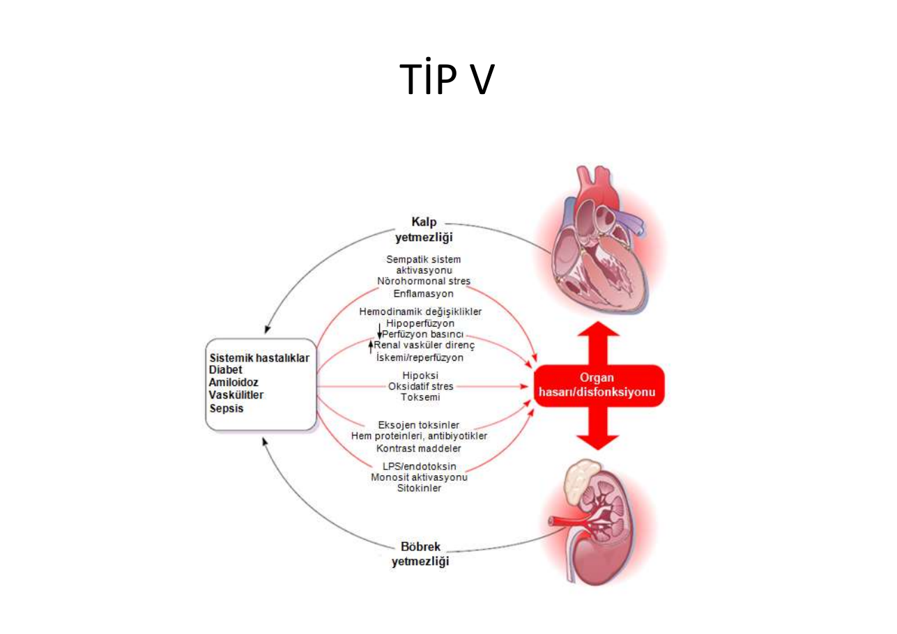

> **Grafik yorumu:** Diyabetik nefropatide zaman içinde GFR azalır, proteinüri ise artar. Ancak erken tedavi ile (ACE/ARB, glisemi kontrolü) bu eğri yataylaştırılabilir.

---

## KLİNİK VAKA ÖRNEKLERİ

**📋 VAKA ÖRNEĞİ 1: Pulmono-Renal Sendrom**

**Hasta:** 56 yaşında erkek, 3 haftadır sinüzit, burun kanaması, son 1 haftada hemoptizi ve idrar azalması.

**Fizik Muayene:** TA 160/95 mmHg, SpO₂ %91. Akciğerlerde bilateral ral, burun mukozası ülsere.

**Lab:** Kreatinin 3.2 mg/dL, Hb 10.1 g/dL, sedim 98 mm/saat, **c-ANCA (PR3) pozitif**. İdrar: 3+ protein + eritrosit silendirleri.

**Görüntüleme:** Toraks BT: bilateral alt loblarda kaviter nodüller.

**Tanı:** **Wegener Granülomatozu (GPA)** -- pulmono-renal sendrom.

**Tedavi:** Metilprednizolon 1 g × 3 gün IV pulse, ardından prednizolon 1 mg/kg + **rituksimab 375 mg/m² × 4 hafta**. Plazmaferez (PEXIVAS kriterleri -- ağır renal).

**Öğretici Not:** Sinüs + akciğer kavite + böbrek üçlüsü Wegener için klasiktir. ACR-1990 tanı kriterlerinden 3'ü karşılandı.

**📋 VAKA ÖRNEĞİ 2: Skleroderma Renal Krizi**

**Hasta:** 48 yaşında kadın, 5 yıldır skleroderma, son 1 haftada ani başağrısı ve TA 220/130 mmHg.

**Lab:** Kreatinin 2.8 mg/dL (bazal 0.9), periferik yaymada şistositler (TMA paterni), LDH 800.

**Tanı:** **Skleroderma renal krizi**.

**Tedavi:** **Kaptopril 12.5 mg oral her 6 saatte bir**, dozu titre ederek hedef TA <140/90. Steroid başlanmadı (renal kriz riski).

**Sonuç:** 2 haftada TA kontrol altına alındı, kreatinin 1.8'e geriledi.

**Öğretici Not:** Sklerodermada **ACE inhibitörü hayat kurtarır**. Steroid renal krizi tetikleyebilir.

**📋 VAKA ÖRNEĞİ 3: Multiple Myelom ile Başvuran ABH**

**Hasta:** 72 yaşında erkek, 2 aydır kemik ağrısı, halsizlik. Kreatinin 4.5 mg/dL, Hb 8.2, Ca 12.8, sedim 120.

**İpuçları:** **Böbrek yetmezliği derinliğine göre beklenmeyecek anemi**, **hiperkalsemi** (böbrek yetmezliğinde hipokalsemi beklenir), çok yüksek sedim.

**Lab:** Dipstik proteinüri **negatif**, kantitatif 24-saat **4.5 g/gün**. SPEP: IgG kappa M-spike. Kemik iliği: plazma hücresi %45.

**Tanı:** **Multiple myelom + hafif zincir (cast) nefropatisi**.

**Tedavi:** Agresif hidrasyon (3-4 L/gün), loop diüretik, **bortezomib-siklofosfamid-deksametazon (VCd)** kemoterapi, bifosfonat (hiperkalsemi), plazmaferez (hızlı hafif zincir azaltma).

**Öğretici Not:** Dipstik proteinüri negatif iken kantitatif pozitif → hafif zincir (Bence-Jones) proteini (dipstik sadece albüminde hassas).

---

**Kaynak:** Prof. Dr. Hakan Akdam ders notu, ADÜ Tıp Fakültesi Nefroloji Bilim Dalı. Ek referans: KDIGO 2021 glomerüler hastalık kılavuzu, ISN/RPS 2018 lupus nefriti sınıflaması, RAVE/MEPEX/PEXIVAS çalışmaları.
