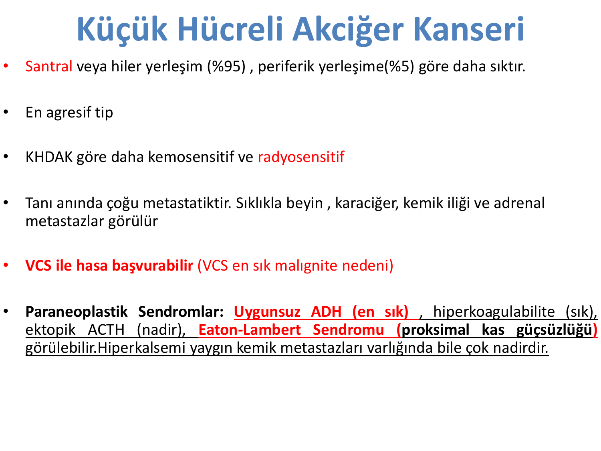
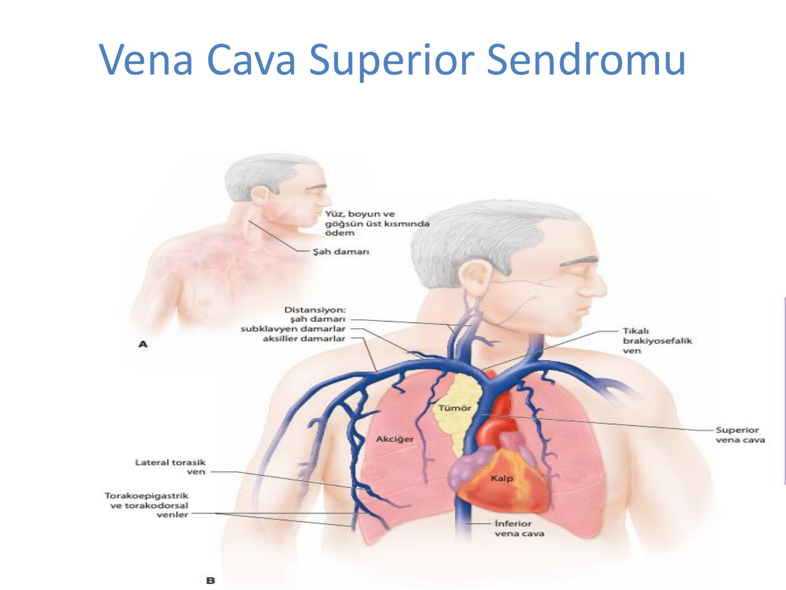
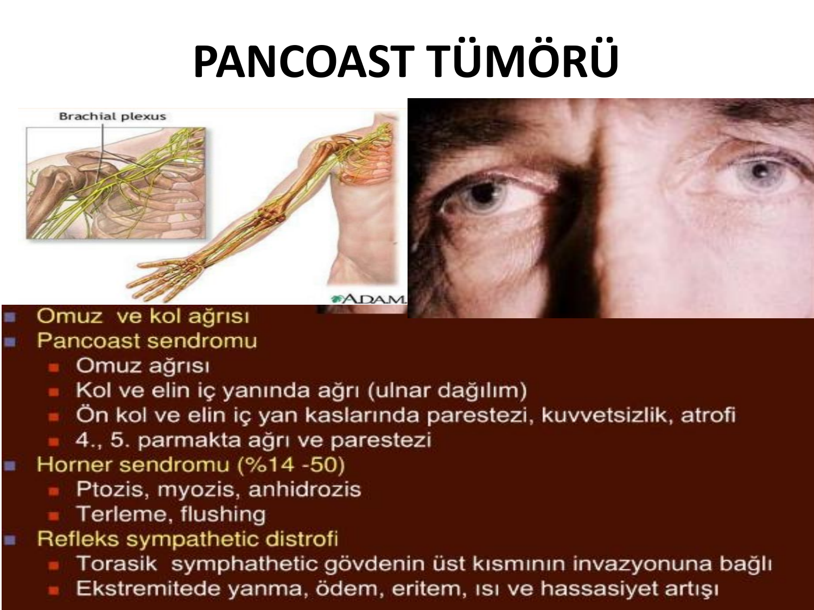
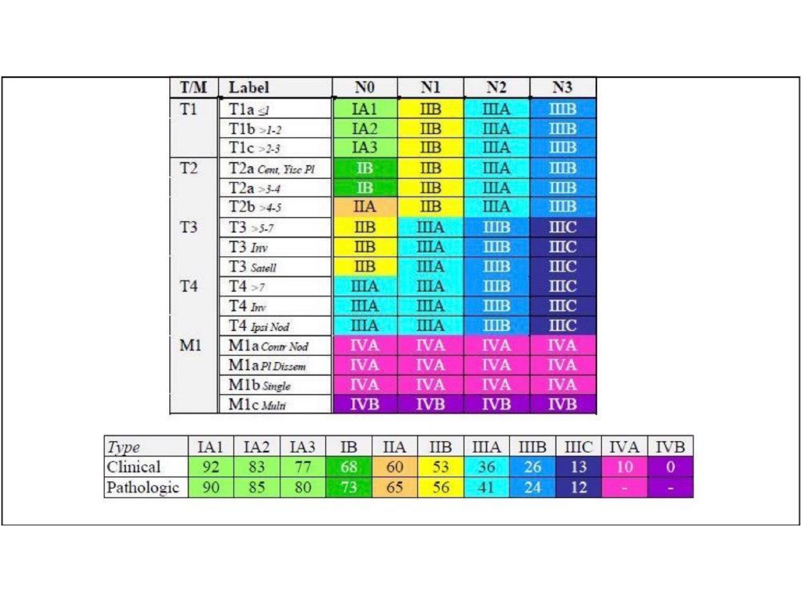
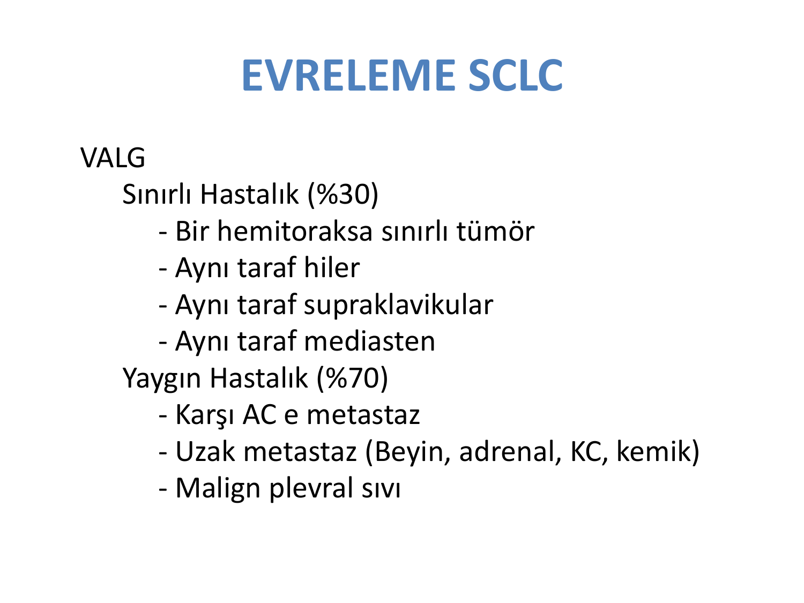
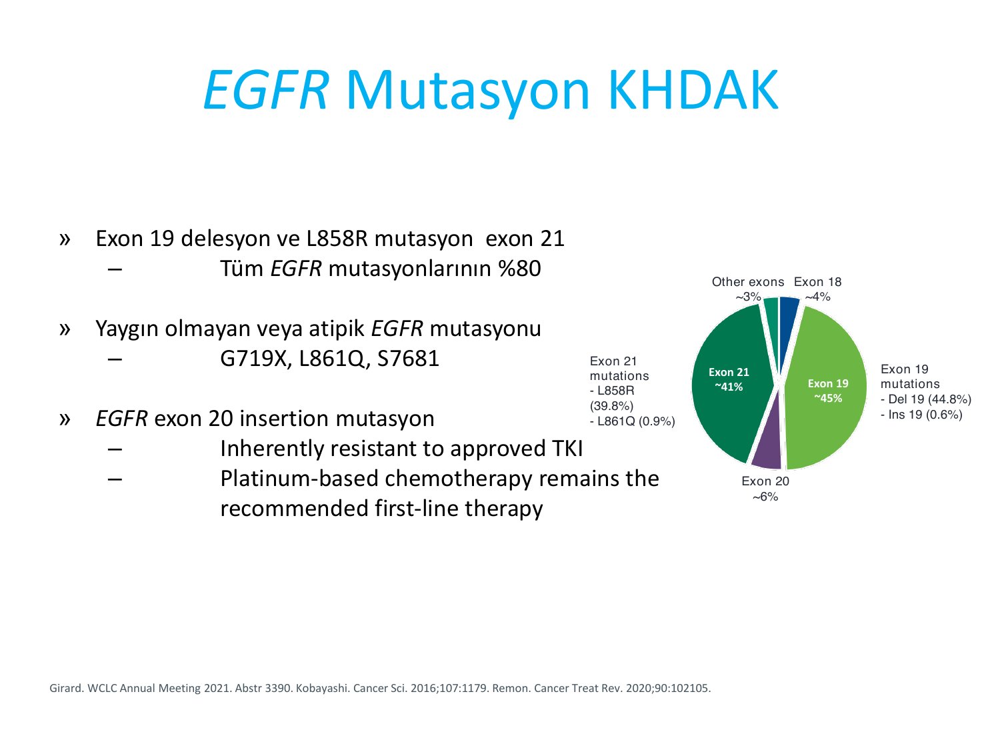

# AKCİĞER TÜMÖRLERİ

**Hazırlayan:** Doç. Dr. Bilgin Demir
**Bölüm:** Aydın Adnan Menderes Üniversitesi Tıp Fakültesi — Tıbbi Onkoloji Bilim Dalı

---

## İÇİNDEKİLER

1. [Epidemiyoloji](#epidemiyoloji)
2. [Etiyoloji ve Risk Faktörleri](#etiyoloji-ve-risk-faktörleri)
3. [Sigaranın Rolü](#sigaranın-rolü)
4. [Histolojik Sınıflandırma](#histolojik-sınıflandırma)
5. [Küçük Hücreli Akciğer Kanseri (KHAK / SCLC)](#küçük-hücreli-akciğer-kanseri-khak--sclc)
6. [Küçük Hücre Dışı Akciğer Kanseri (KHDAK / NSCLC)](#küçük-hücre-dışı-akciğer-kanseri-khdak--nsclc)
7. [Klinik — Semptom ve Bulgular](#klinik--semptom-ve-bulgular)
8. [Vena Kava Süperior Sendromu](#vena-kava-süperior-sendromu)
9. [Pancoast Tümörü](#pancoast-tümörü)
10. [Paraneoplastik Sendromlar](#paraneoplastik-sendromlar)
11. [Erken Tanı ve Tarama](#erken-tanı-ve-tarama)
12. [Tanı — Patolojik ve Moleküler](#tanı--patolojik-ve-moleküler)
13. [Evreleme — NSCLC (TNM)](#evreleme--nsclc-tnm)
14. [Evreleme — SCLC (VALG)](#evreleme--sclc-valg)
15. [NSCLC Tedavisi](#nsclc-tedavisi)
16. [Hedefe Yönelik Tedaviler (Moleküler Sürücülere)](#hedefe-yönelik-tedaviler-moleküler-sürücülere)
17. [İmmünoterapi](#i̇mmünoterapi)
18. [SCLC Tedavisi](#sclc-tedavisi)

---

## EPİDEMİYOLOJİ

### Sıklık

* **Akciğer kanseri:** Dünyada **kansere bağlı ölümlerin 1. sırası** (hem erkek hem kadın).
* Türkiye'de de erkeklerde en sık ölümcül kanser.
* **55-65 yaş arası pik** yapar.
* **Erkeklerde görülme oranı azalmakta**, **kadınlarda artmakta** (sigara içme trendleriyle paralel).

---

## ETİYOLOJİ VE RİSK FAKTÖRLERİ

### Başlıca Nedenler

* **Sigara** (%85-90'ının başlıca nedeni)
* **Asbest**
* **Radyasyon** (radon gazı, iyonize radyasyon)
* **Diğer akciğer hastalıkları** (AC skarı, KOAH, tüberküloz skarı)
* **Mesleki maruziyet:** Arsenik, nikel, krom, **klorometiletel**, kadmiyum, berilyum, silika
* **Polisiklik aromatik hidrokarbonlar**
* **Hava kirliliği**
* **İkinci el sigara (pasif içicilik)**
* **Aile öyküsü**
* **Diyet faktörleri**

### Sigaradaki Karsinojenler

Sigarada en güçlü karsinojenler:

* **Aromatik aminler**
* **N-nitrozaminler**
* Benzen, vinil klorür, **arsenik**, krom, **radon**, **polonyum-210**

---

## SİGARANIN ROLÜ

### Temel Bilgiler



* **AC kanser riski**, yıllık tüketilen paket sayısı ile değerlendirilebilecek **kümülatif dozla ilişkilidir** (**paket-yıl**).
* **Yılda 10 paket** (2 günde 1 adet) sigara tüketildiğinde AC kanser riski normal popülasyondan farklılaşır.
* **Akciğer kanserlerinin %10-25'i sigara içmemiş kişilerde** gelişir (yaşam boyu <100 sigara). Bu tip tümörler **kadınlarda daha sık**tır ve çoğu **adenokarsinom**dur.

### Sigarayı Bırakma ve Risk

* 20 yıldan az içen kişiler sigarayı bıraktığında AC kanser riski **giderek azalır**.
* **15 yıllık sigarasız dönemin ardından risk normal popülasyona yaklaşır**, ancak kesinlikle eşitlenmez.

### Asbest ile Sinerji

* **Asbeste maruz kalan sigara içicilerinde risk:**
    * Yalnız sigara içenlere göre **3 kat**
    * Normal popülasyona göre **90 kat**

> **💡 Kanser önleme çalışmaları başarısız:** 13-cis-retinoik asit, fenretinid, etretinat, beta-karoten, vit B12/folat çalışmaları akciğer kanseri önlemede başarısız olmuştur. **Tek etkili önleme yöntemi sigarayı bırakmaktır.**

---

## HİSTOLOJİK SINIFLANDIRMA

Akciğer kanseri iki büyük kategoride incelenir:

| Kategori | Oran |
|---|---|
| **Küçük Hücreli Akciğer Kanseri (KHAK / SCLC)** | **%10-15** |
| **Küçük Hücre Dışı Akciğer Kanseri (KHDAK / NSCLC)** | **%85-90** |

### KHDAK Alt Tipleri

| Alt Tip | Oran | Konum | Özellikler |
|---|---|---|---|
| **Adenokarsinom** | **~%40** (en sık) | **Periferik** | **Yavaş büyüme**, kadınlarda sık, Asyalılarda sık, non-sigara içenlerde sık |
| **Skuamöz (epidermoid) hücreli** | ~%29-30 | **Merkezi (santral)** | Çoğu **tütün kullanımından** kaynaklanır |
| **Büyük hücreli** | %10-15 | Periferik | Hızlı büyüme ve yayılma |
| Diğer alt türler | <%4-5 | — | — |

---

## KÜÇÜK HÜCRELİ AKCİĞER KANSERİ (KHAK / SCLC)


### Temel Özellikler

* **Santral/hiler yerleşim %95** (periferik %5)
* **En agresif tip**
* **KHDAK'ya göre daha kemosensitif ve radyosensitif**
* **Tanı anında çoğu metastatiktir**:
    * Beyin, karaciğer, kemik iliği, adrenal metastazlar sık

### Başvuru Özellikleri

* **Vena kava süperior sendromu (VCSS)** ile hasta başvurabilir
* **VCSS'nin en sık maligniteye bağlı nedeni KHAK'dır**

### Paraneoplastik Sendromlar (KHAK)

| Sendrom | Sıklık | Mekanizma |
|---|---|---|
| **Uygunsuz ADH (SIADH)** | **En sık** | Ektopik ADH |
| **Hiperkoagülabilite** | Sık | — |
| **Ektopik ACTH (Cushing)** | Nadir | Ektopik ACTH |
| **Eaton-Lambert sendromu** | — | Proksimal kas güçsüzlüğü; presinaptik kalsiyum kanalına karşı antikor |

> **⚠️ ÖNEMLİ:** KHAK'de **hiperkalsemi çok nadirdir** (yaygın kemik metastazı varlığında bile). Hiperkalsemi skuamöz hücreli kanserin bulgusudur.

---

## KÜÇÜK HÜCRE DIŞI AKCİĞER KANSERİ (KHDAK / NSCLC)

Bu gruba **skuamöz (epidermoid), adenokarsinom** ve **büyük hücreli** gibi histolojik alt tipler girer. Prezentasyon, doğal seyir ve tedavilerdeki benzerlikten dolayı toplanmıştır.

### Yerleşim Özellikleri

| Alt tip | Yerleşim |
|---|---|
| **Skuamöz hücreli karsinom** | **Santral** |
| **Adenokarsinom** | **Periferal** |
| **Büyük hücreli** | Periferal |

### Metastaz Paterni

**Adenokarsinom ve büyük hücreli:** **Yaygın hematojen metastaz** (en sık **kemik, karaciğer, beyin, adrenal**).

**Skuamöz hücreli:** Lokal invazyon ve merkezi yayılımla ön planda.

### Demografi

* **Skuamöz tip** erkeklerde daha sık
* **Adenokarsinom** kadınlarda ve sigara içmeyenlerde en sık tip

### Paraneoplastik Sendromlar (KHDAK)

| Alt Tip | Paraneoplastik Sendrom |
|---|---|
| **Skuamöz hücreli (en sık paraneoplastik)** | **PTH-rP'ye bağlı hiperkalsemi** (en sık) |
| Skuamöz | Hipertrofik osteoartropati, nötrofili, hiperkoagülabilite |
| **Adenokarsinom** | **Hipertrofik osteoartropati**, hiperkoagülabilite, PTH-rP'ye bağlı hiperkalsemi (daha nadir) |
| **Büyük hücreli** | **Jinekomasti** |

> **💡 Öğrenci özeti paraneoplastik sendromlar:**
>
> * **SIADH → KHAK**
> * **Cushing → KHAK (ektopik ACTH)**
> * **Eaton-Lambert → KHAK**
> * **Hiperkalsemi (PTH-rP) → Skuamöz**
> * **Hipertrofik osteoartropati → Adenokarsinom**
> * **Jinekomasti → Büyük hücreli**

---

## KLİNİK — SEMPTOM VE BULGULAR

Akciğer kanserlerinin çoğu semptomatiktir. Sadece **%5-15'i rutin AC grafisi ile asemptomatik iken tanınır**.

### Semptomların Oluşumu — 3 Mekanizma

1. **Lokal büyüme**
2. **Uzak metastazlar**
3. **Paraneoplastik sendromlar**

### Lokal Büyüme ile İlgili Semptomlar

* **Öksürük** (en sık ilk semptom)
* **Hemoptizi**
* **Nefes darlığı**
* **Göğüs ağrısı** (plevral, göğüs duvarı, mediasten invazyonu)
* **Stridor**
* **Ses kısıklığı** (sol **rekürren laringeal sinir** tutulumu)
* **Disfaji**
* **Diyafragmatik paralizi** (frenik sinir)
* **Vena kava süperior sendromu**
* **Pancoast sendromu**

### Uzak Metastaz Bulguları

* **Beyin:** Baş ağrısı, nöbet, fokal nörolojik defisit
* **Kemik:** Ağrı, kırık
* **Karaciğer:** Karın ağrısı, kilo kaybı, kaşeksi
* **Sürrenal:** Genellikle asemptomatik

### Paraneoplastik Sendromlar (~%10)

* **Endokrin:** SIADH, Cushing, hiperkalsemi
* **Nörolojik:** Eaton-Lambert, subakut serebellar dejenerasyon
* **Hematolojik:** Anemi, trombositoz, lökositoz, DIC, marantik endokardit
* **Cilt:** Kaşıntı, akantozis nigrikans, eritema multiforme, dermatomiyozit
* **Kas-iskelet:** Hipertrofik osteoartropati, çomak parmak

---

## VENA KAVA SÜPERİOR SENDROMU



### Tanım

Mediastendeki kitle veya LAP'nin **vena kava süperiora bası** yapması sonucu gelişen tablo.

**En sık malignite nedeni: Küçük hücreli akciğer kanseri.**

### Klinik Bulgular

* **Nefes darlığı**
* **Yüzde, boyunda ve göğsün üst kısmında ödem**
* **Baş-boyun bölgede dolgunluk**
* **Öksürük, göğüs ağrısı, disfaji, baş dönmesi**
* **Yüzde siyanoz**
* **Boyunda ve göğüste venöz distansiyon ve ödem**
* **Şah damarı distansiyonu**
* **Subklavyen ve aksiller damarlar**da tıkanıklık bulguları
* **Kollateral venöz ağ** (göğüs duvarında görünür venler)

### Tanı ve Yaklaşım

1. **Öncelikle histolojik tanı** konulmalıdır (biyopsi — LAP veya kitle)
2. Tedavi **altta yatan tümör tipine göre** (KHAK → KT; KHDAK → KT/RT)
3. **Endovasküler stent** (acil dekompresyon gereken durumlarda)
4. Hemen RT başlanması **histolojik tanı konmadan önerilmez** — doku tanısını bozar

---

## PANCOAST TÜMÖRÜ



### Tanım

**Akciğerin apikal (süperior sulkus) bölgesinden kaynaklanan tümör.** Genellikle skuamöz hücreli karsinom.

### Pancoast Sendromu

* **Omuz ve kol ağrısı**
* **Kol ve elin iç yanında ağrı** (ulnar dağılım)
* **Ön kol ve elin iç yan kaslarında parestezi, kuvvetsizlik, atrofi**
* **4. ve 5. parmakta ağrı ve parestezi**

### Horner Sendromu (%14-50)

**Sempatik gövde (stellat ganglion) invazyonu:**

* **Ptozis** (göz kapağının düşmesi)
* **Miyozis** (pupil küçülmesi)
* **Anhidrozis** (aynı tarafta terleme kaybı)
* Terleme ve flushing değişiklikleri

### Refleks Sempatik Distrofi

Torasik sempatik gövdenin üst kısmının invazyonuna bağlı: Ekstremitede yanma, ödem, eritem, ısı ve hassasiyet artışı.

---

## PARANEOPLASTİK SENDROMLAR

Daha önce belirtilen paraneoplastik sendromlar burada özetlenmiştir:

| Sistem | Sendrom | Histoloji |
|---|---|---|
| **Endokrin** | **SIADH (hiponatremi)** | **KHAK** |
| Endokrin | **Cushing (ektopik ACTH)** | **KHAK** |
| Endokrin | **Hiperkalsemi (PTH-rP)** | **Skuamöz** |
| Endokrin | Jinekomasti (HCG) | Büyük hücreli |
| **Nörolojik** | **Eaton-Lambert sendromu** | **KHAK** |
| Nörolojik | Subakut serebellar dejenerasyon | KHAK |
| Nörolojik | Paraneoplastik ensefalomiyelit | KHAK |
| **Hematolojik** | Trombositoz, anemi, lökositoz | Tüm tipler |
| Hematolojik | **DIC, Trousseau (gezici tromboflebit)** | Adeno |
| **Kas-iskelet** | **Hipertrofik pulmoner osteoartropati (HPO)** | **Adenokarsinom** |
| Kas-iskelet | **Çomak parmak** | Tüm tipler |
| **Cilt** | Akantozis nigrikans, dermatomiyozit | — |

---

## ERKEN TANI VE TARAMA

### Geleneksel Yaklaşım (Başarısız)

* **Akciğer grafisi + balgam sitolojisi** ile yapılan çalışmalar **sağkalıma katkıda bulunmadı**.
* Tarama ile saptanan akciğer kanserlerinin %45'i asemptomatik olmasına rağmen sağkalım oranında fark bulunamadı.

### Düşük Doz BT ile Tarama (Günümüz Standardı)

> **⭐ Tarama endikasyonu (USPSTF/NLST):**
>
> * **55-75 yaş arası**
> * **≥30 paket-yıl sigara öyküsü**
> * **≤15 yıldır sigarayı bırakmış** kişilerde
> * **Düşük doz BT** ile yıllık tarama yapılır

> **💡 Önemli:** Sağlıklı bireylerde **bronş lavajı tarama amaçlı önerilmez**.

---

## TANI — PATOLOJİK VE MOLEKÜLER

### Yaklaşım

1. **Akciğer kanserinden şüphelenilen hastalarda bir an önce patolojik tanı** konmalıdır.
2. **KHAK ve KHDAK ayrımı** yapılmalıdır.
3. KHDAK ise **adeno/skuamöz ayrımı** yapılmalıdır.
4. **Tanıyı koyduracak en az invaziv test** tercih edilmelidir.

### Patolojik Tanı Yöntemleri

| Yöntem | Endikasyon |
|---|---|
| **Flexible fiberoptik bronkoskopi** | **Santral (merkezi) lezyonlar**. Tüm AC kanserlerinin **2/3'ü** görüntülenebilir. Transbronşiyal biyopsi imkanı. |
| **Transtorasik ince iğne aspirasyonu (TTİİA)** | **Periferal lezyonlar** için tercih edilir. |
| **EBUS (endobronşiyal US)** | Mediastinal lenf nodu örnekleme için. |
| **EUS (özefageal endoskopik US)** | Mediastinal lenf nodu örnekleme. |
| **VATS / Mediastinoskopi** | EBUS/EUS negatif ise cerrahi evreleme. |

### İmmünohistokimya (Alt Tip Ayrımı)

| Marker | Kanser Tipi |
|---|---|
| **TTF1, Napsin A** | **Adenokarsinom (pulmoner)** |
| **p63, p40, sitokeratin 5/6** | **Skuamöz hücreli** |
| **Kromogranin A, sinaptofizin, CD56** | **Nöroendokrin (KHAK)** |

### Moleküler Tanı — KHDAK'de Öncelikli Test Edilmesi Gerekenler

**Adenokarsinom ve küçük biyopsi / sigara içmeyen hastalarda:**

* **EGFR mutasyonu** (%15-25)
* **ALK füzyonu** (~%4)
* **ROS1 füzyonu** (%2)
* **BRAF V600E mutasyonu** (%3)
* **NTRK, MET ex14, RET, HER2, KRAS G12C** — genişletilmiş profil
* **PD-L1 ekspresyonu** (immünoterapi için)

> **⚠️ KRİTİK:** Metastatik / inoperabl KHDAK'de **tedavi öncesi tümöre özgü belirteçlere** mutlaka bakılmalıdır — hedefe yönelik tedavi seçimi buna göre yapılır.

---

## EVRELEME — NSCLC (TNM)

### T Sınıflaması (Tümör Boyutu ve Yayılımı)

| T | Tanım |
|---|---|
| **T1** | Tümör ≤3 cm; T1a ≤1, T1b >1-2, T1c >2-3 |
| **T2** | T2a >3-4 cm; T2b >4-5 cm. Visseral plevra invazyonu, ana bronş tutulumu (karinadan uzak), atelektazi/obstrüktif pnömoni |
| **T3** | >5-7 cm. Göğüs duvarı invazyonu, Pancoast (vertebra invazyonu olmadan), parietal perikard, frenik sinir, aynı lobda ayrı nodül |
| **T4** | >7 cm. **Vertebra, spinal kanal, büyük damarlar, trakea, özofagus, mediasten, kalp** invazyonu. Pancoast (C8+ invazyon). Aynı tarafta farklı lobda nodül |

### N Sınıflaması (Lenf Nodu)

| N | Tanım |
|---|---|
| **N0** | Lenf nodu metastazı yok |
| **N1** | **İpsilateral peribronşiyal / hiler / intrapulmoner** lenf nodu |
| **N2** | **İpsilateral mediastinal / subkarinal** lenf nodu |
| **N3** | **Kontralateral mediastinal/hiler** veya **skalen/supraklaviküler** (ipsi veya kontra) lenf nodu |

### M Sınıflaması (Metastaz)

| M | Tanım |
|---|---|
| **M0** | Uzak metastaz yok |
| **M1a** | **İntratorasik:** Karşı AC'de ayrı nodül, plevral/perikardiyal malign efüzyon, plevral nodül |
| **M1b** | **Tek ekstratorasik** metastaz (tek organda tek lezyon) |
| **M1c** | **Çoklu ekstratorasik** metastaz |

### NSCLC Evreleme Tablosu



**5 yıllık sağkalım (klinik evre):**

| Evre | 5-Yıllık Sağkalım |
|---|---|
| **IA1** | %92 |
| **IA2** | %83 |
| **IA3** | %77 |
| **IB** | %68 |
| **IIA** | %60 |
| **IIB** | %53 |
| **IIIA** | %36 |
| **IIIB** | %26 |
| **IIIC** | %13 |
| **IVA** | %10 |
| **IVB** | **0** |

> **💡 Evreye göre dağılım:** Tanı anında **~%40 hasta Evre IV**, %10 Evre I. Erken tanı çok düşük.

### Kranial Görüntüleme

* **KHAK'de rutin** — asemptomatik metastaz ~%10
* **KHDAK'de:**
    * Evre 1-2'de semptom yoksa **endike değil**
    * **Evre 3-4'te** agresif multimodalite tedavi veya KT planlanan hastalarda endike

### PET-BT Rolü

* BT ile saptanamayan **%4-12 lenf nodu veya uzak metastaz** saptar
* Daha doğru TNM evreleme sağlar
* Futile (gereksiz) torakotomi oranını azaltır
* Eşkivlak konvansiyonel BT lezyonlarının doğasını belirler

---

## EVRELEME — SCLC (VALG)



**VALG (Veterans Administration Lung Cancer Group) sınıflaması:**

### Sınırlı Hastalık (%30)

* **Bir hemitoraksa sınırlı** tümör
* **Aynı taraf hiler, supraklaviküler, mediasten** lenf nodları
* **Tek RT alanına** sığabilecek düzeyde

### Yaygın Hastalık (%70)

* **Karşı akciğere metastaz**
* **Uzak metastaz** (beyin, adrenal, karaciğer, kemik)
* **Malign plevral sıvı**

---

## NSCLC TEDAVİSİ

### Evreye Göre Tedavi Özeti

| Evre | Tedavi |
|---|---|
| **I-II** | **Cerrahi** (lobektomi, VATS) + adjuvan KT ± immünoterapi ± hedefe yönelik tedavi |
| **IIIA (resektabl)** | Neoadjuvan KT/İO → cerrahi → adjuvan |
| **IIIA (non-resektabl) / IIIB-C** | **Eş zamanlı kemoradyoterapi** + konsolidasyon durvalumab |
| **IV** | Biyobelirteç bazlı sistemik tedavi (hedefe yönelik / immünoterapi / KT) |

### Cerrahi

* **Erken evrelerde ilk tercih**
* **Lobektomi** (standart), pnömonektomi, wedge rezeksiyon, VATS
* **5 yıllık sağkalım:**
    * Evre 1 cerrahi sonrası **%70**
    * Evre 2 cerrahi sonrası **%55**
* Cerrahi sonrası takip: İlk 2-3 yıl **3 ayda bir FM**, yılda 2 kez AC grafisi

### Radyoterapi

* Cerrahi yapılamayan veya reddeden hastalarda **küratif RT (stereotaktik)**
* **5 yıllık sağkalım: %20**

### Adjuvan Tedavi

**KT ± immünoterapi ± hedefe yönelik tedavi:**

* **Evre 1b-3a'da mutlak %4-5 sağkalım yararı**
* **EGFR mutasyonlu** Evre 1B-3A adjuvanında **osimertinib** (ADAURA çalışması — %90 DFS)

### Neoadjuvan Tedavi

* **Evre 3B** (özellikle T4N0-1) ve **3A** (ilerlemiş N2) → neoadjuvan KT sonrası **down-stage olanlarda cerrahi denenebilir**
* **Neoadjuvan KT + İO** (checkpoint inhibitörleri) — CheckMate-816 sonrası standart

### Kemoradyoterapi

* **Eş zamanlı** ya da **ardışık** kullanılabilir
* **N2 ve N3 hastalıkta** daha uygun
* **Eş zamanlı KRT ardışıktan üstündür**

### Metastatik NSCLC — Hedefe Yönelik Olmayan

**Platin içeren kombine KT:**

* **Sisplatin + pemetrekset** (non-skuamöz/adeno)
* Sisplatin/gemsitabin
* Karboplatin/paklitaksel

**± İmmünoterapi (pembrolizumab gibi)**

---

## HEDEFE YÖNELİK TEDAVİLER (MOLEKÜLER SÜRÜCÜLERE)

### KHDAK'de Sık Görülen Sürücü Mutasyonlar

| Mutasyon | Sıklık (adenokarsinomda) |
|---|---|
| **KRAS** | **%30** |
| **EGFR** | **%15** |
| **ALK** | ~%4 |
| **BRAF** | %3 |
| **ROS1** | %2 |
| **HER2** | %2 |
| **MET ex14** | %3-4 |
| **RET** | %1-2 |
| **NTRK** | <%1 |

### EGFR Mutasyonu — Tedavi



**En sık mutasyonlar:**

* **Ekson 19 delesyonu (%45)**
* **L858R mutasyonu (ekson 21, %41)**
* Bunlar tüm EGFR mutasyonlarının **~%80'i**
* **Ekson 20 insersiyon:** Standart TKI'lara dirençli

**Tedavi jenerasyonları:**

| Jenerasyon | İlaçlar |
|---|---|
| **1. jenerasyon** | **Erlotinib, gefitinib** |
| **2. jenerasyon** | **Afatinib** |
| **3. jenerasyon** | **Osimertinib** (tercih edilen), dakomitinib |

> **💡 Osimertinib** → EGFR mutasyonlu KHDAK'de **1. basamak standart** (**T790M dirençli mutasyonlara da etkili**).

### ALK Mutasyonu — Tedavi

| Jenerasyon | İlaçlar |
|---|---|
| **1. jenerasyon** | **Krizotinib** |
| **2. jenerasyon** | **Alektinib, seritinib, brigatinib** |
| **3. jenerasyon** | **Lorlatinib** |

**Alektinib** genelde 1. basamak tercih edilir.

### Diğer Hedeflenebilir Mutasyonlar

| Mutasyon | İlaçlar |
|---|---|
| **ROS1 rearranjmanı** | Krizotinib, seritinib, entrektinib, lorlatinib |
| **B-Raf V600E mutasyonu** | **Dabrafenib + trametinib** |
| **MET ex14 skipping** | Kapmatinib, tepotinib |
| **RET füzyonu** | Selperkatinib, pralsetinib |
| **HER2** | T-DXd (trastuzumab deruxtecan) |
| **NTRK füzyonu** | Entrektinib, larotrectinib |
| **KRAS G12C** | Sotorasib, adagrasib |

---

## İMMÜNOTERAPİ

### Nobel Ödüllü Keşif (2018)

**James P. Allison** ve **Tasuku Honjo** — **İmmün kontrol noktalarının keşfi** ile 2018 Nobel Tıp Ödülü.

* **Allison:** **CTLA-4** freni kaldıran antikor
* **Honjo:** **PD-1** freni kaldıran antikor

### Mekanizma

**Kanser-bağışıklık döngüsü:**

1. Kanser antijenlerinin salınımı
2. Antijen sunumu
3. Hazırlanma ve aktivasyon
4. T hücrelerinin tümöre göçü
5. Tümöre infiltrasyon
6. Kanser hücrelerinin tanınması
7. Kanser hücrelerinin öldürülmesi

**PD-L1 (tümörde)** ve **CTLA-4 (T hücrede)** bu döngüyü baskılar. Checkpoint inhibitörleri bu frenleri kaldırır.

### Kullanılan Ajanlar

| Hedef | İlaçlar |
|---|---|
| **CTLA-4 inhibitörleri** | **İpilimumab** |
| **PD-1 inhibitörleri** | **Nivolumab, pembrolizumab** |
| **PD-L1 inhibitörleri** | **Atezolizumab, durvalumab, avelumab** |

### KHDAK'de Kullanım

* **PD-L1 ≥%50 + EGFR/ALK negatif** → 1. basamak **pembrolizumab monoterapisi**
* PD-L1 <%50 → Kemoterapi + immünoterapi kombinasyonu
* Adjuvan / konsolidasyon (durvalumab evre III kemoradyoterapi sonrası)

---

## SCLC TEDAVİSİ

### Sınırlı Hastalık

* **Tercih edilen tedavi: Eş zamanlı kombine kemoradyoterapi** (yaş ve performans statusuna göre)
* **KT rejimi: Sisplatin/Etoposit (EP)**
* **Hiperfraksione RT** (2 kez/gün) konvansiyonel RT'ye göre daha az toksik ve daha iyi sağkalım sağlar
* **İdame durvalumab**
* **Cerrahinin yeri çok sınırlıdır** (sadece TNM Evre 1-2 ve mediastinal LAP negatif olanlar)
* **2 yıllık sağkalım: %20-25, 5 yıllık: %10**
* **Profilaktik kraniyal radyoterapi (PCI):** Tam yanıt alınan hastalarda beyin metastazı önlenmesi için

### Yaygın Hastalık

* **Ayaktan izlenen hastalarda KT denenebilir**
* **1. basamak: EP + İO (Atezolizumab veya Durvalumab)**
* **Alternatifler:** CAV (siklofosfamid-doksorubisin-vinkristin), EP
* **2. basamak: Topotekan, irinotekan, paklitaksel**
* Prognoz kötü — medyan sağkalım 8-13 ay

---

## SINAV NOTLARI — ANAHTAR HATIRLATMALAR

> **📋 En Sık Sorulan Noktalar:**
>
> 1. **Sigara** AC kanserinin %85-90 nedeni. Paket-yıl × doz ilişkili.
> 2. **Asbest + sigara** → 90 kat risk (sinerji).
> 3. **KHDAK %85-90, KHAK %10-15.**
> 4. **Santral yerleşim:** Skuamöz, KHAK. **Periferik yerleşim:** Adeno, büyük hücreli.
> 5. **Adenokarsinom** kadınlarda ve sigara içmeyenlerde en sık.
> 6. **KHAK en agresif, en kemoradyosensitif.** Tanı anında çoğu metastatik.
> 7. **Paraneoplastik sendromlar:** SIADH, Cushing, Eaton-Lambert → **KHAK**. Hiperkalsemi (PTH-rP) → **Skuamöz**. HPO → **Adeno**. Jinekomasti → **Büyük hücreli**.
> 8. **Pancoast tümörü:** Omuz ağrısı, ulnar dağılımda kol/el ağrısı, **Horner sendromu (ptozis/miyoz/anhidrozis)**, ulnar sinir tutulumu. Genelde skuamöz.
> 9. **Horner sendromu triadı:** Ptozis + miyozis + anhidrozis.
> 10. **VKSS'nin en sık malignite nedeni KHAK**'tır. Tedaviden önce doku tanısı konulmalı.
> 11. **Rutin tarama:** 55-75 yaş + **≥30 paket-yıl** + ≤15 yıldır sigarayı bırakmış → **düşük doz spiral BT** (yıllık).
> 12. **Bronş lavajı tarama amaçlı önerilmez.**
> 13. **Flexible bronkoskopi** → santral lezyonlar; **TTİİA** → periferal lezyonlar.
> 14. **TTF1, Napsin A** → adenokarsinom; **p63/p40, CK5/6** → skuamöz; **kromogranin A, sinaptofizin, CD56** → nöroendokrin.
> 15. **KHDAK'de biyobelirteçler:** EGFR, ALK, ROS1, BRAF, NTRK, MET, RET, KRAS G12C, HER2, PD-L1.
> 16. **EGFR mutasyonunda en sık:** Ekson 19 delesyonu (%45), L858R (%41). **Tedavi:** Osimertinib (1. basamak).
> 17. **ALK (+) KHDAK'de:** Alektinib (1. basamak tercih), krizotinib da kullanılabilir.
> 18. **B-Raf V600E:** Dabrafenib + trametinib.
> 19. **PD-L1 ≥%50 + EGFR/ALK negatif:** Pembrolizumab monoterapisi (1. basamak).
> 20. **SCLC evreleme:** VALG → Sınırlı (%30) vs Yaygın (%70).
> 21. **Sınırlı SCLC:** Eş zamanlı KRT (sisplatin/etoposit) + PCI (tam yanıt sonrası).
> 22. **Yaygın SCLC 1. basamak:** EP + atezolizumab/durvalumab.
> 23. **KHAK'de hiperkalsemi ÇOK NADİRDİR** (kemik metastazı varlığında bile).
> 24. **Erken evre NSCLC'de tedavi: Cerrahi (lobektomi).**
> 25. **Mediastinal evreleme:** EBUS + EUS → negatif ise mediastinoskopi/VATS.

---

## EK ÖĞRETİCİ NOTLAR

Bu bölüm, ders notunda geçen temel kavramları daha kolay sindirmek için **öğrenimi kolaylaştırıcı açıklamalar, örnekler ve klinik ipuçları** içerir.

### KHAK vs KHDAK — Kavramsal Çerçeve

**KHAK'ı (SCLC) en iyi anlatan tek cümle:** "**Hızla bölünen, hızla yayılan, hızla yanıt veren, hızla direnç geliştiren**." Yani hastalığın doğası bir koşucu gibidir — çok hızlı ama uzun mesafede tükenir. Bu paradoksal doğa tedavi yaklaşımını şekillendirir:

* **Hızla yayılır** → tanı anında çoğunda metastaz
* **Hızla yanıt verir** → KT ve RT'ye dramatik cevap
* **Hızla direnir** → ilk remisyondan sonra aylar içinde tekrar
* **Cerrahi nadiren işe yarar** → çünkü tanıyı koyduğunda sistemik hastalık var

Buna karşı **KHDAK (NSCLC) bir maratoncu gibidir** — daha yavaş ilerler, cerrahi erken evrede küratif olabilir, tedavi seçimleri histolojik alt tipe (adeno/skuamöz/büyük hücreli) göre farklılaşır.

> **💡 Bir "ayna karşıtlığı":** KHAK ve KHDAK aynı organda ama adeta **zıt hastalıklar** gibidir. KHAK **kemoterapiye sensitif, cerrahiye dirençli**, KHDAK ise **cerrahiye sensitif, erken evrede KT'ye gerek yok**. Tedavi stratejileri neredeyse ayna yansıması gibidir.

### Sigara ve Akciğer Kanseri İlişkisinin Derecesi

Sigara → akciğer kanseri ilişkisi tıp tarihinin en kesin epidemiyolojik bağlantılarından biridir. Örneğin;

* **20 yıl boyunca günde 20 sigara içen** birinde akciğer kanseri riski hiç içmeyene göre **~20 kat** yüksek
* Sigarayı bıraktıktan sonra **risk düşer ama asla sıfıra inmez** — 15-20 yıl sonra risk hâlâ normalden yüksektir
* **Pasif içicilikte** bile risk ~%20-30 artar

Bu veriler sadece akademik değil — **tarama önerilerinin temelidir**. "55-75 yaş, ≥30 paket-yıl" kriteri tam da bu kümülatif dozun kanser riskinin maksimum arttığı aralığı hedefler.

> **📝 Paket-yıl nasıl hesaplanır?** Günde içilen paket sayısı × kaç yıldır içildiği. Örnek: 40 yaşında, 20 yıldır günde 2 paket içen → 2 × 20 = **40 paket-yıl**.

### Histopatolojik Alt Tipler — Hafıza Paterni

| Alt Tip | Sigara | Lokalizasyon | Karakteristik Özellik |
|---|---|---|---|
| **Adenokarsinom** | En sık içmeyende görülen tip | **Periferik** | TTF1, napsin A; EGFR/ALK mutasyonları |
| **Skuamöz** | Güçlü sigara ilişkisi | **Santral** | p63, p40; **hiperkalsemi (PTH-rP)** |
| **Büyük hücreli** | Sigara ilişkili | Periferik/santral | **Jinekomasti** |
| **KHAK (Small cell)** | **En güçlü sigara ilişkisi** | **Santral** | Nöroendokrin belirteçler; **paraneoplastik sendromlar** |

> **💡 Hafıza ipucu — "Paraneoplastik organ-tümör eşleşmeleri":**
>
> * **KHAK + endokrin paraneoplastik** (SIADH → hiponatremi; ACTH → Cushing; Eaton-Lambert → kas güçsüzlüğü)
> * **Skuamöz + kalsiyum** (PTH-rP → hiperkalsemi)
> * **Adeno + kemik-eklem** (HPO → hipertrofik pulmoner osteoartropati → çomak parmak + eklem ağrıları)
> * **Büyük hücreli + jinekomasti** (β-hCG)
>
> Bu eşleşmeleri bilen öğrenci sınavda dört sorunun cevabını ezbersiz çıkarır.

### Tümör-Konuma Göre Klinik Paterni

Akciğer kanseri tek bir "semptom seti" ile karşına gelmez — **tümörün yerleştiği bölge** klinik tabloyu belirler. Şunun gibi düşün:

**Santral tümör** → büyük hava yolları çevresinde büyür → **öksürük, hemoptizi, wheezing, post-obstrüktif pnömoni, atelektazi**. Tipik olarak **skuamöz veya KHAK**. Bronkoskopide direkt görülür.

**Periferik tümör** → plevra altında veya akciğer çevresinde → **plevral ağrı, plevral effüzyon, pulmoner semptomlar geç** gelir. Tipik olarak **adenokarsinom**. Transtorasik ince iğne biyopsisi ile tanı konur.

**Apikal (Pancoast) tümör** → süperior sulkus → **omuz/ulnar ağrı, Horner sendromu, kol kası atrofisi**. Genelde **skuamöz**. Tipik olarak omuz ortopediye yönlendirilir; geç tanı alır.

### Venöz Obstruksiyonlar — VKSS Mekanizması

**Vena kava süperior sendromu (VKSS)**, sağ akciğer apeksindeki veya mediastinal bir kitlenin **SVC'yi dıştan bastırması** sonucu gelişir. Tablo: yüz, boyun, üst ekstremite ödemi; boyun venlerinde dolgunluk; pletore; başağrısı; nefes darlığı.

> **💡 VKSS'ye mekanik görüntü:** Bir hortumun ortasına büyük bir taş düştüğünü düşün — taşın gerisinde su birikir. SVC'de de aynı şey olur; mediastinal kitlenin arkasında (yukarıda) kan göllenir. Hastanın yüzü şişer, kolları mor olur.
>
> Bu mekanizma bilinirse tedavinin mantığı kolayca anlaşılır: **taşı küçült** (kemoterapi, radyasyon) veya **yan yol aç** (stent). KHAK'da asıl tedavi kemoterapidir, çünkü tümör KT'ye çok hızlı yanıt verir.

### Tarama — LDCT'nin Değeri

**Düşük doz spiral BT (LDCT)** ile akciğer kanseri taramasının (NLST çalışması) gösterdiği: mortalite **%20 azalma**. Yani 320 yüksek riskli kişiyi taradığında bir ölümü önleyebiliyorsun. Bu, mamografi benzeri bir veri.

Ama unutma: tarama **herkes için yapılmaz**. Kriterler:

* **55-80 yaş**
* **≥20 paket-yıl** (USPSTF güncellemesi) veya **≥30 paket-yıl** (NLST orijinal kriteri)
* **Halen içen veya son 15 yıl içinde bırakmış**
* **İyi performans, komorbidite yok**
* **Hasta nodül çıkarsa BT-klinik takip + muhtemel biyopsiyi kabul ediyor**

> **📝 Yalancı pozitif tuzağı:** LDCT'nin en büyük handicap'i **benign nodüllerin fazlalığı** — yılda %1-2 oranında kanser yakalanırken, %10-25 oranında "şüpheli nodül" raporlanır. Bu nodüllerin çoğu takip sonunda iyi huylu çıkar ama hasta yıllarca anksiyete ve ekstra tetkik yaşar. Bu yüzden tarama yalnızca **yüksek riskli** grupta yapılmalıdır.

### Moleküler Tedavi — Hedefli İlaçların Mantığı

**KHDAK tedavisi son 15 yılda dramatic değişti.** Eskiden tek seçenek "platinum-based KT" idi — bu hasta için 1 yıl sağkalım anlamına geliyordu. Şimdi **moleküler profil → spesifik ilaç → uzun süreli yanıt**:

**Öğretici örnek — EGFR mutant KHDAK:**

* Hastada EGFR L858R mutasyonu var
* **Osimertinib** (3. kuşak EGFR TKI) başlanır
* İlk 1-2 hafta içinde tümör küçülmeye başlar
* **Ortalama progresyonsuz sağkalım: 18-20 ay** (kemoterapinin 5-6 katı!)
* Progresyon olunca → biyopsi → direnç mekanizması (C797S?) → sıradaki tedavi

Bu, şunun gibi düşün: bir kilitli kapı (hücre büyüme sinyali) var, ve senin kitin içinde mükemmel uyan bir anahtarın (osimertinib) var. Rasgele taş atmak (kemoterapi) kapıyı kırsa da çevreye zarar verir. Anahtarla açmak — sadece o kapıyı açar, diğer hücrelere dokunmaz. Bu nedenle **yan etki profili kemoterapiden çok daha iyi**.

### İmmünoterapi Çağı

**Checkpoint inhibitörleri** (pembrolizumab, nivolumab, atezolizumab) akciğer kanseri tedavisinin üçüncü devrimi (ilk ikisi: platinum-based KT ve hedefli tedaviler).

**Temel mantık:**

* Tümör hücreleri **PD-L1** ifade ederek T hücrelerini "frenler"
* Anti-PD-1/PD-L1 ilaçları bu freni kaldırır → T hücreleri tümörü saldırır
* **PD-L1 ≥%50 + EGFR/ALK negatif** hastada **pembrolizumab monoterapi** KT'den daha iyi
* **PD-L1 &lt;%50** → KT + immünoterapi kombinasyonu

**Yan etkileri farklı:** İmmünoterapi kemoterapi gibi çalışmaz — bağışıklık sistemini aktive ettiği için **otoimmün yan etkiler** (ITP, kolit, pnömoni, tiroidit, hepatit, hipofizit, nefrit) olur. Bu yüzden hasta "ishalim var" derse romatolojik/gastroenterolojik işlem başlamadan önce **immünoterapi ilişkili kolit**i düşün. Tedavi: steroid.

> **📝 Klinik pearl — "Steroid düşmanı değil, dost":** İmmünoterapi başlanmış hastalarda steroid kullanmak endişe yaratır ("tedavinin etkisini bozar mı?"). Çalışmalar gösterdi ki **immün ilişkili yan etkilerde (irAE)** steroid kullanımı hem yan etkiyi kontrol eder hem tümör yanıtını bozmaz. Ancak **tedavi öncesi** elektif steroid kullanılmaması tercih edilir.

### SCLC — Tedavi Paradoksu

**Sınırlı evre SCLC** (%30): Hasta hâlâ küratif hedef olarak görülür. Tedavi:

1. **Eşzamanlı KT (sisplatin + etoposit) + RT** (6 hafta)
2. Tam yanıt sonrası **proflaktik kraniyal radyasyon (PCI)** — çünkü beyin metastazı riski yüksek ve bu metastaz görüntülemede görünmeden önce gelişebilir
3. 5 yıllık sağkalım %20-25

**Yaygın evre SCLC** (%70):

1. **EP + atezolizumab/durvalumab** (immünoterapi eklenmesi son 5 yılın en büyük değişimi)
2. Ortalama sağkalım 10-12 ay
3. **PCI tartışmalı** — bazı çalışmalarda fayda yok, MR ile beyin takibi yeterli olabilir

> **⭐ Klinik pearl — PCI:** "Proflaktik kraniyal radyasyon" kavramı başka hiçbir kanserde rutin uygulanmaz — sadece sınırlı SCLC'de. Çünkü SCLC'nin beyin metastazı yapma eğilimi **başka kanserlerden çok daha yüksek** ve hastaları beyin metastazından kaybediyoruz. "Metastaz gelmeden önce kafayı ışınla" mantığı başka hiçbir tümörde işe yaramaz.

### Klinik Pearl'ler Özet Tablosu

| Durum | Anahtar Pearl |
|---|---|
| **60 yaş üstü erkek + omuz ağrısı** | Pancoast ekarte et → göğüs BT |
| **Boyun venleri dolu, yüz pletore** | VKSS → mediastinal kitle |
| **Akciğer nodülü + hiperkalsemi** | Skuamöz hücreli olasılığı |
| **Akciğer nodülü + hiponatremi** | SCLC → SIADH |
| **Akciğer nodülü + jinekomasti** | Büyük hücreli / germ hücreli benzer |
| **Çomak parmak + eklem ağrıları** | HPO → adenokarsinom |
| **Tanıda metastaz + hızlı ilerleme** | SCLC olma ihtimali yüksek |
| **Yavaş büyüyen periferik nodül, sigara öyküsü az** | Adenokarsinom |
| **EGFR pozitif hasta** | **Asla** kemoterapi ile başlama — TKI öncelik |
| **PD-L1 ≥%50** | Pembrolizumab monoterapi birinci basamak |

### Karşılaştırma — Akciğer Kanseri Alt Tiplerinde Tedavi Algoritmaları

```
                   KHDAK                           KHAK
                   ─────                           ─────
  Evre I-II        Cerrahi                         (Nadir — sınırlı SCLC gibi)
                   (lobektomi)
  Evre III         KT + RT ± cerrahi              Eşzamanlı KT + RT + PCI
                   (moleküler profil)             (sınırlı)
  Evre IV          Moleküler profil bazlı:        KT + İmmünoterapi
                   - TKI (EGFR/ALK/BRAF+)         (yaygın)
                   - İmmünoterapi (PD-L1+)
                   - KT + İmmünoterapi
  Biyobelirteç     EGFR, ALK, ROS1, BRAF,         Rutin biyobelirteç yok
                   NTRK, MET, RET, HER2, KRAS,    (DLL3 araştırma)
                   PD-L1
  Nöroendokrin     Genelde değil                   Evet (kromogranin,
  belirteçler                                       sinaptofizin, CD56)
```

---

> **Kaynaklar:**
>
> 1. Dr. Bilgin Demir — Akciğer Kanserinde Sistemik Tedavi ders notu, ADÜ Tıp Fakültesi.
> 2. NCCN Clinical Practice Guidelines in Oncology — Non-Small Cell Lung Cancer 2024.
> 3. NCCN Clinical Practice Guidelines in Oncology — Small Cell Lung Cancer 2024.
> 4. ESMO Clinical Practice Guidelines — Lung cancer.
> 5. American Cancer Society — Lung Cancer Facts and Figures.
