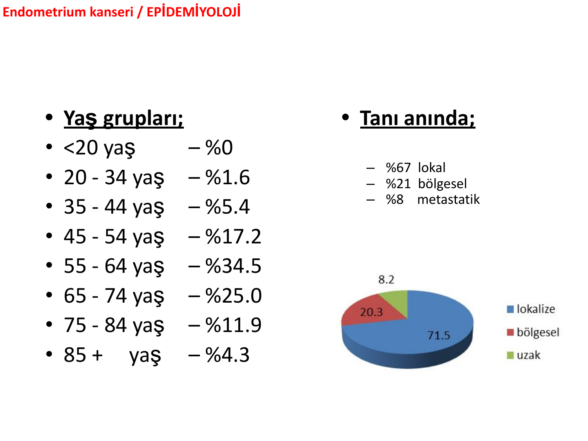
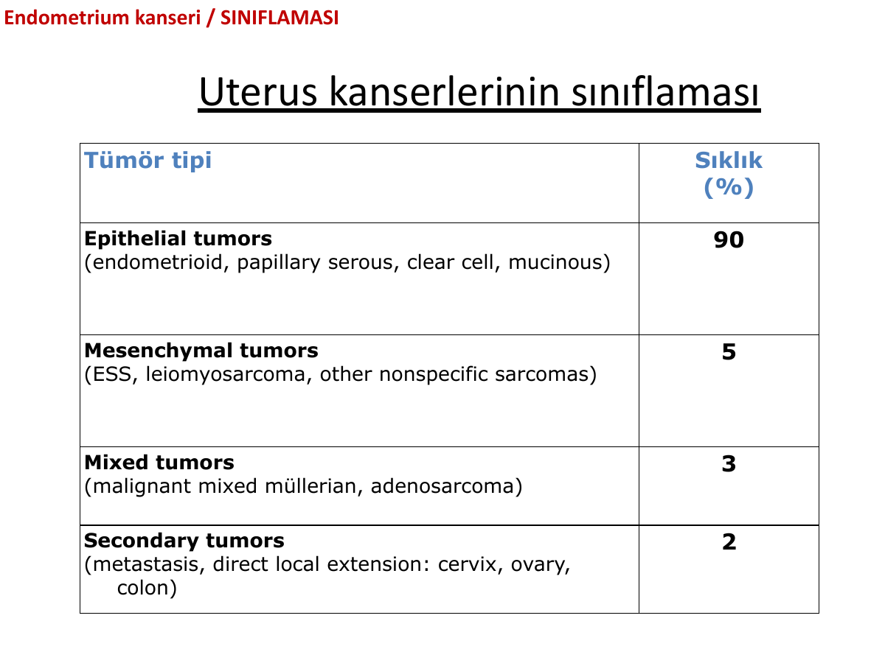
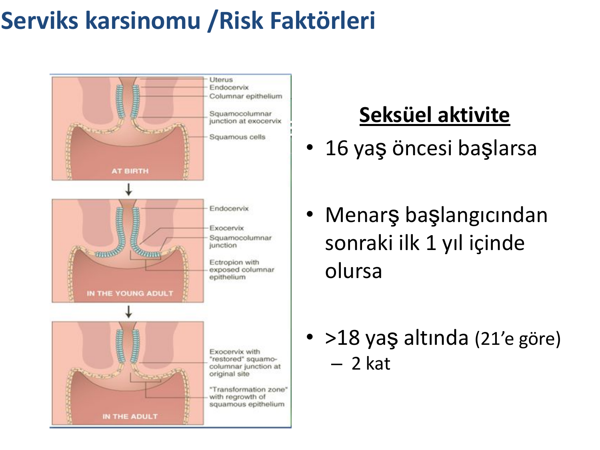
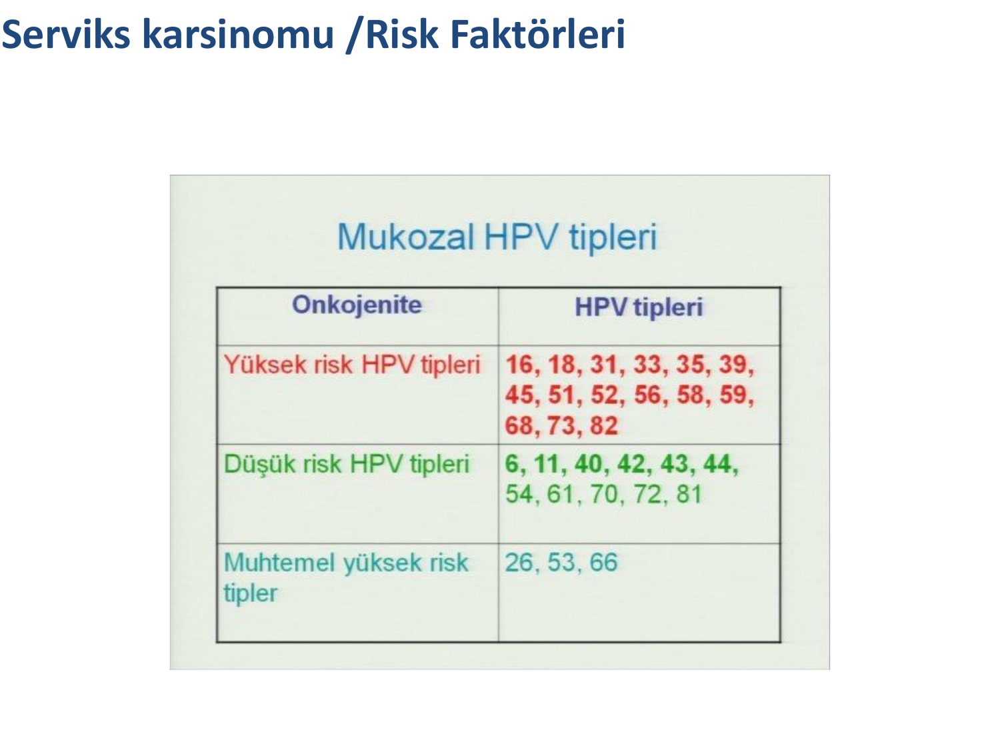
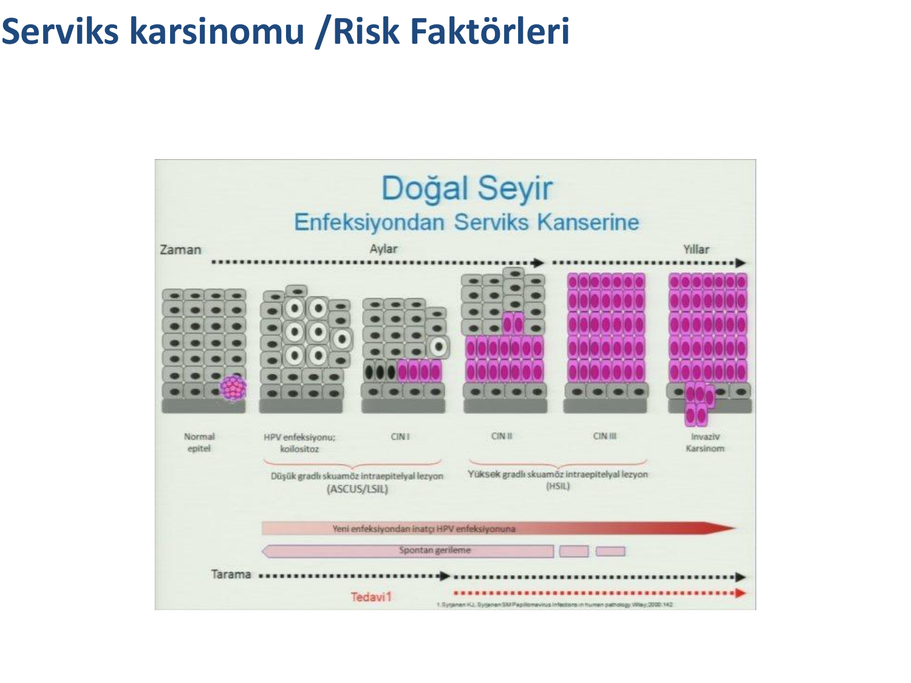
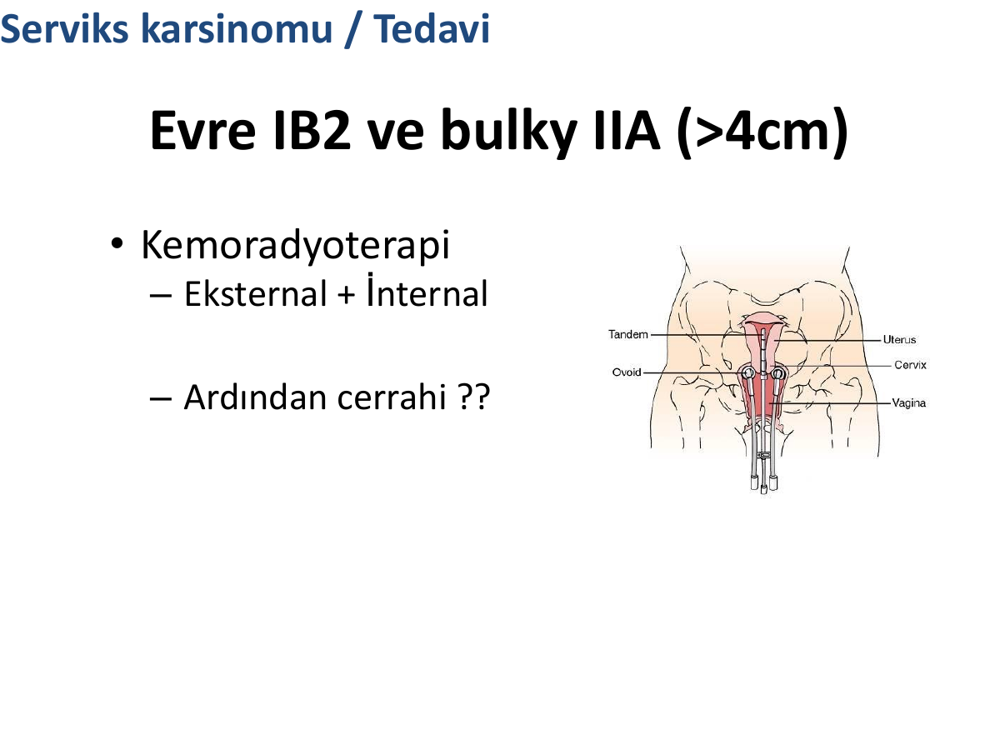

# ENDOMETRİYUM VE SERVİKS KANSERİ

**Hazırlayan:** Dr. Öğr. Üyesi Merve Turan
**Bölüm:** Tıbbi Onkoloji

---

## İÇİNDEKİLER

1. [Genel Bakış ve Karşılaştırma](#genel-bakış-ve-karşılaştırma)
2. [Endometriyum Kanseri - Epidemiyoloji](#endometriyum-kanseri---epidemiyoloji)
3. [Endometriyum Kanseri - Sınıflama (Tip I ve Tip II)](#endometriyum-kanseri---sınıflama-tip-i-ve-tip-ii)
4. [Endometriyum Kanseri - Risk Faktörleri](#endometriyum-kanseri---risk-faktörleri)
5. [Endometriyum Kanseri - Koruyucu Faktörler](#endometriyum-kanseri---koruyucu-faktörler)
6. [Endometriyum Kanseri - Histolojik Sınıflama](#endometriyum-kanseri---histolojik-sınıflama)
7. [Endometriyum Kanseri - Prognoz](#endometriyum-kanseri---prognoz)
8. [Endometriyum Kanseri - Semptomlar](#endometriyum-kanseri---semptomlar)
9. [Endometriyum Kanseri - Tanı](#endometriyum-kanseri---tanı)
10. [Endometriyum Kanseri - FIGO Evreleme](#endometriyum-kanseri---figo-evreleme)
11. [Endometriyum Kanseri - Tedavi](#endometriyum-kanseri---tedavi)
12. [Serviks Kanseri - Epidemiyoloji](#serviks-kanseri---epidemiyoloji)
13. [Serviks Kanseri - Risk Faktörleri](#serviks-kanseri---risk-faktörleri)
14. [HPV ve Serviks Kanseri](#hpv-ve-serviks-kanseri)
15. [HPV Aşılama](#hpv-aşılama)
16. [CIN (Servikal İntraepitelyal Neoplazi) ve Bethesda](#cin-servikal-i̇ntraepitelyal-neoplazi-ve-bethesda)
17. [Serviks Kanseri - Histolojik Tipler](#serviks-kanseri---histolojik-tipler)
18. [Serviks Kanseri - Yayılım](#serviks-kanseri---yayılım)
19. [Serviks Kanseri - Tarama](#serviks-kanseri---tarama)
20. [Serviks Kanseri - Klinik Bulgular](#serviks-kanseri---klinik-bulgular)
21. [Serviks Kanseri - FIGO Evreleme](#serviks-kanseri---figo-evreleme)
22. [Serviks Kanseri - Tedavi](#serviks-kanseri---tedavi)
23. [Klinik Vakalar](#klinik-vakalar)
24. [Özet Karşılaştırma Tablosu](#özet-karşılaştırma-tablosu)
25. [Test Soruları](#test-soruları)
26. [Kısaltmalar](#kısaltmalar)

---

## GENEL BAKIŞ VE KARŞILAŞTIRMA

Endometriyum ve serviks kanserleri kadın genital sisteminin en sık görülen iki malign tümörüdür. Patogenez, risk faktörleri ve tedavi yaklaşımları birbirinden oldukça farklıdır:

| Özellik | Endometriyum Kanseri | Serviks Kanseri |
|---|---|---|
| **Temel etyoloji** | Östrojenik uyarı (Tip I), genetik (Tip II) | Persistan HPV enfeksiyonu (>%95) |
| **Ortalama yaş** | 60 (postmenapozal ağırlıklı) | Daha genç (adenokarsinom <35 yaş artıyor) |
| **En sık histoloji** | Endometrioid adenokarsinom (%90 epitelyal) | Skuamöz hücreli karsinom (%70-90) |
| **Tarama** | ❌ Rutin tarama **yok** | ✅ Pap smear, HPV DNA testi |
| **Aşı** | ❌ Yok | ✅ HPV aşısı (profilaksi) |
| **İlk semptom** | Anormal vajinal kanama (>%90) | Erken evrede asemptomatik; postkoital kanama |
| **Evreleme** | Cerrahi (FIGO) | Klinik (FIGO) - tarihsel olarak |
| **Tanı yöntemi** | Endometrial biyopsi / D&C | Kolposkopi + biyopsi |
| **Öncü lezyon** | Endometrial hiperplazi (atipik) | CIN / SIL |
| **Primer tedavi** | Cerrahi (TAH + BSO ± LND) | Erken: cerrahi; İleri: kemoradyoterapi |

> 💡 **Akılda Kalıcı Nokta:** Endometriyum kanseri "östrojen hastalığı", serviks kanseri "HPV hastalığıdır". Endometriyum kanseri erken semptom verir (kanama) → erken evrede yakalanır → iyi prognoz. Serviks kanseri sinsi başlar → tarama olmadan ileri evrede yakalanır.

---

# ENDOMETRİYUM KANSERİ

---

## ENDOMETRİYUM KANSERİ - EPİDEMİYOLOJİ



### Yaş Dağılımı

| Yaş Grubu | Sıklık |
|---|---|
| <20 yaş | %0 |
| 20-34 yaş | %1.6 |
| 35-44 yaş | %5.4 |
| 45-54 yaş | %17.2 |
| **55-64 yaş** | **%34.5** (zirve) |
| 65-74 yaş | %25.0 |
| 75-84 yaş | %11.9 |
| 85+ yaş | %4.3 |

### Tanı Anında Yayılım

| Yayılım | Oran |
|---|---|
| **Lokalize** | %67 (yaklaşık %71.5 lokalize) |
| **Bölgesel** | %21 (yaklaşık %20.3) |
| **Metastatik (uzak)** | %8 (yaklaşık %8.2) |

> **Anahtar Nokta:** Endometriyum kanseri çoğunlukla **postmenapozal kadınlarda (55-64 yaş zirve)** görülür ve olguların **üçte ikisi lokalize evrede** yakalanır -- bu nedenle genel prognozu iyidir.

---

## ENDOMETRİYUM KANSERİ - SINIFLAMA (TİP I VE TİP II)

Endometriyum kanserinin klasik Bokhman sınıflaması iki tip üzerine kuruludur. Bu ayrım; etyoloji, klinik seyir, histoloji ve tedavi yanıtı açısından kritiktir.

| Özellik | Tip I (Endometrioid) | Tip II (Seröz/Berrak hücreli) |
|---|---|---|
| **Östrojen ile ilişki** | ✅ Var (endojen/eksojen) | ❌ Yok |
| **Öncü lezyon** | Endometrial hiperplazi (EIN) | Yok (atrofik endometriyum) |
| **Risk faktörü** | Östrojen maruziyeti (obezite, geç menapoz, nulliparite, TMX, HRT) | Endometrial atrofi, polip |
| **Histoloji** | Endometrioid | Seröz papiller, berrak hücreli, transisyonel, karsinosarkom, undiferansiye |
| **Grade** | Genellikle düşük | Yüksek grade, kötü prognoz |
| **Genetik** | **PTEN**, KRAS, ARID1A, PIK3CA, CTNNB1, **MSI** | **p53**, HER2, p16 |
| **Hormon reseptörleri (ER, PR)** | Sıklıkla pozitif | Sıklıkla negatif |
| **Hormonal tedaviye yanıt** | ✅ Yanıtlı | ❌ Yanıtsız |
| **Prognoz** | İyi | Kötü |
| **Evreden bağımsız adjuvan KT** | Hayır | ✅ Evet (seröz/berrak hücreli) |

> 💡 **Mnemonik -- "TİP I: İyi, TİP II: İki kat kötü":** Tip I endometrioidtir, östrojene bağlı, hormona yanıtlıdır. Tip II seröz/berrak hücrelidir, atrofik zeminde gelişir, p53 mutasyonuyla agresif seyreder.

---

## ENDOMETRİYUM KANSERİ - RİSK FAKTÖRLERİ

### Kronik Östrojenik Uyarı

| Risk Faktörü | Risk Oranı (RR) |
|---|---|
| Östrojen replasmanı (progestinsiz) | 2-12 kat |
| Erken menarş / geç menapoz | 1.6-4.0 |
| Nulliparite | 2-3 |
| Anovulasyon (örn. PCOS) | Artmış |
| Östrojen üreten tümörler (örn. granüloza hücreli) | Artmış |
| Polikistik over sendromu (PCOS) | Artmış |

### Demografik Özellikler

- Artan yaş
- Yüksek sosyoekonomik durum
- Ailede endometriyum kanseri öyküsü

### Ek Hastalıklar

- Diabetes mellitus
- Safra kesesi taşı
- Obezite
- Hipertansiyon
- Pelvik radyoterapi öyküsü

### Özel Risk Durumları

| Durum | Risk |
|---|---|
| **Tamoksifen (TMX) kullanımı** | %0.1-3.8 (yaşa göre), **RR: 2.6** (postmenapozallerde) |
| **Herediter non-poliposis kolorektal kanser (Lynch/HNPCC)** | **Yaşam boyu risk %20-70**; endometriyum ca'lıların %2-5'i; daha genç (45-55 yaş); çoğu endometrioid; alt uterin segment yerleşimi sık; dediferansiye alanlar ve ↑ TIL |
| **Cowden sendromu** (PTEN mutasyonu) | Yaşam boyu risk %13-28 |
| **BRCA1** | **RR: 2.6**, TMX kullanıyorsa **RR: 11**; seröz histoloji |

> **⚠️ ÖNEMLİ - Tamoksifen Paradoksu:**
>
> * Meme kanserinde östrojen reseptörünü bloke eder
> * Endometriyumda **parsiyel agonist** etki → endometrial proliferasyon
> * TMX alan postmenapozal kadınlarda endometriyum kanseri riski **2.6 kat**
> * BRCA1 (+) ve TMX kullanıyorsa risk **11 kat** (seröz histolojiye eğilim)

> 💡 **Mnemonik -- "OBEZ NULLİPAR DM'li POSTMENAPOZAL kadın":** Klasik Tip I endometriyum kanseri adayı.

> 💡 **Mnemonik -- "Lynch = L → Lower uterine segment":** Lynch sendromunda endometriyum kanseri **alt uterin segment** (isthmus) yerleşimine yatkındır. Ayrıca "L" → **L**ynch, **L**ower, **L**ife-time risk %20-70 (yaşam boyu) şeklinde de hatırlanır.

> 💡 **Mnemonik -- "5B ile yüksek risk sendromları":** **B**RCA1, **B**ayan (yaşam boyu), **B**ağırsak (Lynch/HNPCC -- kolon ilişkili), **B**önek (Cowden -- PTEN, deri-mukoza), **B**etasın (beta-catenin/CTNNB1).

---

## ENDOMETRİYUM KANSERİ - KORUYUCU FAKTÖRLER

| Faktör | OR / RR | %95 CI |
|---|---|---|
| **Sigara** | 0.71 | 0.65-0.78 |
| **Egzersiz** | 0.73 | 0.58-0.93 |
| **Oral kontraseptif (OK)** | 0.6 | 0.3-0.9 |
| &nbsp;&nbsp;Tip I için | 0.68 | 0.65-0.71 |
| &nbsp;&nbsp;Tip II için | 0.75 | 0.66-0.85 |
| **Yeşil çay** | 0.8 | 0.7-0.9 |
| **Kahve (orta alım)** | 0.87 | 0.78-0.97 |
| **Kahve (çok alım)** | 0.64 | 0.48-0.86 |
| **Aspirin** | 0.72 | 0.58-0.90 |

> **Not:** Sigara; endometriyum kanseri için **koruyucu** gibi görünse de, akciğer/mesane/serviks ve diğer birçok kanser için güçlü risk faktörüdür -- asla önerilmez.

---

## ENDOMETRİYUM KANSERİ - HİSTOLOJİK SINIFLAMA



Uterus kanserlerinin histolojik dağılımı:

| Tümör Tipi | Sıklık (%) | Alt Tipler |
|---|---|---|
| **Epitelyal tümörler** | **%90** | Endometrioid, papiller seröz, berrak hücreli (clear cell), müsinöz |
| Mezenkimal tümörler | %5 | Endometrial stromal sarkom (ESS), leiomyosarkom, diğer nonspesifik sarkomlar |
| Mikst tümörler | %3 | Malign mikst Müllerian tümör (karsinosarkom), adenosarkom |
| Sekonder (metastatik/direkt yayılım) | %2 | Serviks, over, kolon kaynaklı |

> **Anahtar:** Endometriyum kanserinin %90'ı epitelyal kökenli olup, en sık **endometrioid adenokarsinom** (Tip I) görülür.

> 💡 **Mnemonik -- "90-5-3-2 kuralı":** Uterus kanserlerinin **%90 epitelyal, %5 mezenkimal, %3 mikst, %2 sekonder**. Kolay hatırlama: 90-5-3-2 basamaklı azalır.

---

## ENDOMETRİYUM KANSERİ - PROGNOZ

### 5 Yıllık Sağkalım (Evreye Göre)

| Yayılım | 5 Yıllık Sağkalım |
|---|---|
| **Lokalize** | %96 |
| **Bölgesel** | %66 |
| **Metastatik** | %24 |

### Evre I-II'de Yaşa Göre 5 Yıllık Sağkalım

| Yaş | Sağkalım |
|---|---|
| <40 yaş | %96 |
| 41-50 yaş | %94 |
| 51-60 yaş | %87 |
| 61-70 yaş | %78 |
| 71-80 yaş | %71 |
| ≥80 yaş | %54 |

> **Önemli:** Aynı evrede bile yaş ilerledikçe sağkalım belirgin azalır; komorbidite ve tedavi toleransı kritiktir.

---

## ENDOMETRİYUM KANSERİ - SEMPTOMLAR

- **Ortalama yaş:** 60
- **En sık başvuru yakınması: Anormal vajinal kanama (>%90)**
  - **Postmenapozal kanamaların %3-20'si endometriyum kanseridir**
  - Premenapozal kadınlarda:
    - İnterval kanama
    - Menstrual sıklık artışı
    - Yoğun kanama (menoraji)
- Görüntülemede **artmış endometrial kalınlık** (postmenapozalde >4-5 mm anlamlı)

> **⚠️ KLİNİK KURAL:**
>
> * **Postmenapozal kanama aksi ispatlanana kadar endometriyum kanseridir!**
> * Mutlaka endometrial örnekleme gerekir.

---

## ENDOMETRİYUM KANSERİ - TANI

### Kimler Değerlendirilmeli?

1. Postmenapozal vajinal kanamalı **tüm** kadınlar
2. Perimenapozal aşırı veya uzamış kanamalar
3. Premenapozal anormal kanamalı **obez, anovulatuvar** kadınlar

### Tanı Yöntemleri

| Yöntem | Rolü |
|---|---|
| **Endometrial biyopsi (pipelle)** | ⭐ İlk basamak, ofis koşullarında |
| **Dilatasyon + küretaj (D&C)** | Ofis bx yetersiz/negatifse, uterin kavite örneklemesi |
| **Transvajinal USG** | Endometrial kalınlık (postmenapozde >4-5 mm patolojik) |
| **Histeroskopi** | Fokal lezyon, görüntü rehberli örnekleme |
| PAP smear | ❌ **Nadiren** yararlı (servikal tarama testi; endometriyum için güvenilir değil) |
| BT, MR | Evreleme, lokal-uzak yayılım |
| PA akciğer grafisi | Metastaz taraması |
| CA-125 | Seröz/berrak hücreli histolojide, ekstrauterin yayılım markerı |

---

## ENDOMETRİYUM KANSERİ - FIGO EVRELEME

Endometriyum kanseri **cerrahi olarak evrelendirilir** (FIGO 2009).

| Evre | Tanım |
|---|---|
| **Evre I** | Tümör korpus uterideki sınırlı |
| &nbsp;&nbsp;IA | Miyometrium invazyonu yok veya <%50 |
| &nbsp;&nbsp;IB | Miyometrium invazyonu ≥%50 |
| **Evre II** | Tümör servikal stromayı tutar (uterus dışına çıkmamış) |
| **Evre III** | Tümör lokal ve/veya bölgesel yayılım göstermiş |
| &nbsp;&nbsp;IIIA | Seroza ve/veya adneksiyal tutulum |
| &nbsp;&nbsp;IIIB | Vajinal ve/veya parametrial tutulum |
| &nbsp;&nbsp;IIIC1 | Pelvik LN (+) |
| &nbsp;&nbsp;IIIC2 | Paraaortik LN (+), pelvik LN ± |
| **Evre IV** | Mesane ve/veya barsak mukozası tutulumu, uzak metastaz |
| &nbsp;&nbsp;IVA | Mesane ve/veya barsak mukozası invazyonu |
| &nbsp;&nbsp;IVB | Uzak metastaz (intraabdominal ve/veya inguinal LN dahil) |

> **Anahtar:** Evre I = uterusa sınırlı, Evre II = serviks tutulumu, Evre III = pelvis içi yayılım, Evre IV = uzak.

---

## ENDOMETRİYUM KANSERİ - TEDAVİ

### Primer Tedavi: Cerrahi

Standart cerrahi: **Total abdominal histerektomi + bilateral salpingo-ooferektomi (TAH + BSO)** + pelvik/paraaortik lenf nodu diseksiyonu (riskli olgularda) + peritoneal yıkama.

### Adjuvan Tedavi - Risk Grupları

| Risk Grubu | Tanım | Tedavi |
|---|---|---|
| **DÜŞÜK RİSK** | Evre IA + Grade 1, endometrioid, endometriyumla sınırlı | **Adjuvan tedavi gereksiz**; yaşam >%90; RT alanlar daha kötü; megesterol yararı yok; vajinal cuff nüksü ~%5 |
| **ORTA RİSK (Düşük-Orta)** | Tartışmalı, uzak metastaz riski düşük | İzlem |
| **ORTA RİSK (Yüksek-Orta)** | G3, yetersiz cerrahi, derin miyometrium tutulumu | Vajinal RT (yaşam avantajı yok); KT tartışmalı |
| **YÜKSEK RİSK** | Evre III-IV (grade/histolojiden bağımsız); uterin seröz veya berrak hücreli (evreden bağımsız) | **Adjuvan kemoterapi ardından RT** |

### Metastatik / Nüks Hastalık

#### Kemoterapi

**İlk sıra rejimler:**

- Karboplatin + paklitaksel (standart)
- Karboplatin + paklitaksel + doksorubisin

**Diğer sıra (tek ajan) seçenekler:**

- Doksorubisin
- Paklitaksel
- İfosfamid
- Topotekan
- Etoposid, oksaliplatin
- Lipozomal doksorubisin

#### Hormonal Tedavi

**Endikasyonlar:**

- Kemoterapi almış veya alamayacak hastalar
- **Hormon reseptörü (HR) pozitif** olmalı (ER/PR +)
- Grade 1-2 hastalık
- Tümör yükü az, minimal semptomatik

**Ajanlar:**

| İlaç | Mekanizma |
|---|---|
| **Megesterol asetat** | Progestin |
| **Tamoksifen** | SERM |
| **Aromataz inhibitörleri** | (letrozol, anastrozol) |

> 💡 **Mnemonik -- "Tip I = Hormona yanıtlı, Tip II = Kemoye yanıtlı":** ER/PR pozitif endometrioid tümörler progestin/TMX/AI'ya yanıt verirken, seröz/berrak hücreli Tip II tümörler platin bazlı kemoterapiye yanıtlıdır.

---

# SERVİKS KANSERİ

---

## SERVİKS KANSERİ - EPİDEMİYOLOJİ

- Sıklık **1930'lardan itibaren düşmekte** (tarama + tedavi gelişmeleri)
- Gelişmiş ülkelerde sıklık ve ölüm son 50 yılda **%75 azaldı**
- **Gelişmekte olan ülkelerde 2. en sık kanser ölüm nedeni**
  - Dünya genelindeki olguların **>%80'i gelişmekte olan ülkelerde**
- Sıklık: **7-15 / 100.000**

### Tarama Eksikliği

| Durum | Oran |
|---|---|
| Yetersiz tarama | %54 |
| Hiç tarama yaptırmamış | %42 |
| Taramada hatalı negatiflik | %11-30 |

> **⚠️ ÖNEMLİ:** Negatif tarama sonucu **semptomlu hastalığı ekarte ettirmez**. Semptom varsa mutlaka ileri tetkik gerekir.

---

## SERVİKS KANSERİ - RİSK FAKTÖRLERİ

### Seksüel Davranış ve Üreme

| Faktör | Etki |
|---|---|
| Seks işçiliği | ↑↑↑ |
| **İlk cinsel deneyimin erken yaşta olması** (transformasyon zonu HPV'ye daha duyarlı) | 2 kat (<18 yaş vs 21 yaş) |
| Çoklu cinsel partner | ≥2 partnerde 2 kat, >6 partnerde 3 kat |
| Genç yaşta doğum (<20 yaş) | ↑ |
| Fazla doğum (≥3 doğum) | ↑ |
| Yüksek riskli cinsel partner | HPV'li veya çoklu partnerli erkek eş |
| Cinsel yolla bulaşan hastalık öyküsü (Chlamydia trachomatis, HSV) | ↑ |

### Davranışsal ve Medikal

| Faktör | Etki |
|---|---|
| **Sigara içimi** (sadece **skuamöz** histolojide!) | **2-5 kat** |
| **İmmün yetmezlik** - HIV | **24 kat** |
| **İmmün yetmezlik** - Transplant | **16 kat** |
| Vitamin A veya C eksikliği | ↑ |
| Düşük sosyoekonomik durum | ↑ |
| Uzun süreli OK (>5 yıl; kestikten 10 yıl sonra risk yok) | 20-30 yaş, 10 yıl kullananda 4-8/100 |

### Transformasyon Zonu ve HPV



- Serviks **endoserviks (kolumnar epitel)** ve **ektoserviks (skuamöz epitel)** birleşim yerinde bir **transformasyon zonu** vardır.
- Bu zondaki metaplastik değişiklikler:
  - İn utero başlar
  - Puberte ve ilk gebelikte **↑ artar**
  - Menopozda **↓ azalır**
- HPV, bu metaplastik alanda kolayca infekte olur → displazi → kanser zinciri başlar.

> **⚠️ ÖNEMLİ:**
>
> * **16 yaş öncesi cinsel ilişki → yüksek risk**
> * **Menarştan sonraki ilk 1 yıl içinde ilişki → yüksek risk**
> * Bu dönemlerde transformasyon zonu hücreleri immatür ve HPV'ye duyarlıdır.

---

## HPV VE SERVİKS KANSERİ

### Temel Bilgiler

- **HPV DNA hastaların >%95-99.7'sinde** pozitif (neredeyse zorunlu etken)
- **>40 tip** HPV vardır
- Yaklaşık **15'i onkojenik**
- **En sık HPV 16 ve 18** → **serviks kanserlerinin %70'ini** oluşturur
- Oral seks → baş-boyun kanseri (HPV ilişkili)



### HPV Serotipleri - Onkojeniteye Göre Sınıflama

| Onkojenite | HPV Tipleri |
|---|---|
| **Yüksek risk (onkojenik)** | **16, 18**, 31, 33, 35, 39, 45, 51, 52, 56, 58, 59, 68, 73, 82 |
| **Düşük risk** | 6, 11, 40, 42, 43, 44, 54, 61, 70, 72, 81 |
| **Muhtemel yüksek risk** | 26, 53, 66 |

> 💡 **Mnemonik -- "16, 18 öldürür; 6, 11 siğil yapar":** HPV 16-18 yüksek riskli onkojenik; HPV 6-11 düşük riskli, genital siğil (kondiloma akuminata) etkeni.

### Histolojiye Göre HPV Tip Dağılımı

| Histoloji | En Sık HPV Tipleri |
|---|---|
| **Skuamöz hücreli karsinom (SCC)** | HPV **16 (%59)**, 18 (%13), 58 (%5), 33 (%5), 45 (%4) |
| **Adenokarsinom** | HPV **16 (%36), 18 (%37)**, 45 (%5), 31 (%2), 33 (%2) |

### HPV Tipine Göre Tümör Davranışı

| HPV Tipi | Klinik Özellikler |
|---|---|
| **HPV 16** | Large cell keratinize tümör, **rekürrens daha az** |
| **HPV 18** | Kötü diferansiye CA, **LAP (+) ↑**, tedaviye kötü yanıt, uzak metastaz ↑ |

### HPV Enfeksiyonu -- Kanser Dönüşüm Doğal Seyri



```
Normal servikal          HPV enfeksiyonu       CIN 1        CIN 2       CIN 3      İnvaziv
    epitel          →   (aylar içinde)     →  (düşük      (orta       (yüksek   →  kanser
                                               grade       grade       grade          (yıllar)
                                               SIL)        SIL)        SIL / CIS)
    ← Tarama: Pap smear, HPV DNA ──────────────────────→     ← Tedavi →
```

- **Herkes HPV ile infekte olmaz → kanser olmaz** (küçük bir kısmı)
- **HPV tek başına yeterli değil** (sigara, immünsüpresyon, diğer kofaktörler gerekir)
- **Displazi → karsinoma in-situ dönüşümü:** **10 yıl içinde %66**
- **CIS → İnvaziv kanser:** ortalama **15 yıl**
- CIN 3'ün 13 yıllık gözlem sonucu:
  - İlerleme: **%14**
  - Değişmeyen: **%61**
  - Gerileme: diğerleri
- **Yüksek grade HPV (+) CIN → spontan regresyon olasılığı %38**

> 💡 **Anahtar:** HPV enfeksiyonundan invaziv kansere geçiş **onlarca yıl** sürer; bu zaman penceresi taramanın etkili olmasının temelidir.

---

## HPV AŞILAMA

### Aşı Tipleri - Ayrıntılı Karşılaştırma

| Özellik | Bivalan (Cervarix) | Kuadrivalan (Gardasil-4) | 9-valan (Gardasil-9) |
|---|---|---|---|
| **Kapsanan HPV tipleri** | 16, 18 | 6, 11, **16, 18** | 6, 11, 16, 18, **31, 33, 45, 52, 58** |
| **Yüksek riskli onkojenik tip** | 2 tip | 2 tip | **7 tip** |
| **Düşük riskli (siğil) tip** | Yok | 2 tip (6, 11) | 2 tip (6, 11) |
| **Serviks ca koruması (yaklaşık)** | ~%70 | ~%70 | **~%90** |
| **Genital siğil koruması** | ❌ Yok | ✅ Var | ✅ Var |
| **Adjuvan** | AS04 | Alüminyum | Alüminyum |
| **Onaylı yaş aralığı** | 9-45 | 9-45 | **9-45** (tercih edilen) |
| **İmalat** | GSK | Merck | Merck |

> 💡 **Mnemonik -- "Bi-Qu-9 = 2-4-9":** Bivalan 2 tip (16-18), Quadrivalan 4 tip (+6, +11), Nona (9)-valan 9 tip (+31, 33, 45, 52, 58). **9-valan = 16+18+4 ek yüksek riskli tip + 6-11 siğil** → en geniş kapsam.

> 💡 **Mnemonik -- "ADU 9-5-3-2-1-3": 9-valan ek tipleri sayısal sıra:** 31-33-45-52-58. Alfabetik benzetme yoktur, ancak **biri hariç hepsi çift basamaklı üst tiplerdir**.

### Aşılama Önerileri

| Yaş Grubu | Öneri |
|---|---|
| **9-14 yaş (ideal)** | 2 doz (0. ve 6-12. ay) |
| **15-26 yaş** | 3 doz (0, 1-2, 6. ay) |
| **27-45 yaş** | Bireysel karar verilmeli (katalog dışı endikasyon) |
| **Erkekler** | 9-26 yaş (anal kanser, genital siğil, baş-boyun kanseri korunması) |

> **⚠️ ÖNEMLİ:**
>
> * Aşı **profilaktiktir**, tedavi edici değildir -- cinsel aktiviteden **önce** uygulanmalı
> * Aşı korumalı kadınlarda bile **servikal tarama devam etmelidir** (aşılar tüm onkojenik tipleri kapsamaz)
> * Aşı, **HPV 6-11**'e karşı da koruduğundan **kondiloma akuminata** (genital siğil) da önler
> * Dersteki çıkmış sınav sorusunda "45 yaş altı bireyler HPV aşısı yaptırmalıdır" ifadesi YANLIŞ seçenek olarak verilmiştir -- rutin aşılama **9-26 yaş** grubundadır.

---

## CIN (SERVİKAL İNTRAEPİTELYAL NEOPLAZİ) VE BETHESDA

### Histolojik Sınıflama (CIN)

Serviks epitelindeki neoplazik değişikliklerin şiddeti:

| Sınıf | Epitelde Tutulum | Bethesda Karşılığı |
|---|---|---|
| **CIN 1** | **Alt 1/3 epitelde** mitoz + immatür hücreler | LSIL (düşük grade skuamöz intraepitelyal lezyon) |
| **CIN 2** | **Orta 2/3'e** kadar uzanır | HSIL (yüksek grade SIL) |
| **CIN 3** | **Üst 1/3'e** kadar (tam kat) mitoz + immatür hücreler | HSIL / CIS |
| **Karsinoma in situ (CIS)** | Tam kat displazi, bazal membran sağlam | HSIL |

### Neoplazi Derecelendirme Kriterleri

- **Mitotik aktivite derecesi**
- **İmmatür hücre proliferasyonu**
- **Nükleer atipi**

### Bethesda Sitoloji Sistemi (Pap smear sonuçları - Tam Tablo)

| Kategori | Tam Açılım | Anlamı | Yönetim (kısa) |
|---|---|---|---|
| **NILM** | Negative for Intraepithelial Lesion or Malignancy | Normal | Rutin tarama sürdürülür |
| **ASC-US** | Atypical Squamous Cells of Undetermined Significance | Önemi belirsiz atipi | HPV refleks testi; +/- kolposkopi |
| **ASC-H** | Atypical Squamous Cells -- cannot exclude HSIL | HSIL ekarte edilemez | **Kolposkopi** |
| **LSIL** | Low-Grade Squamous Intraepithelial Lesion | CIN 1, HPV etkisi | Kolposkopi (25+) |
| **HSIL** | High-Grade Squamous Intraepithelial Lesion | CIN 2-3, CIS | **Kolposkopi + biyopsi; LEEP** |
| **AGC** | Atypical Glandular Cells | Glandüler atipi (endoserviks/endometriyum) | Kolposkopi + endoservikal + endometriyal örnekleme |
| **AIS** | Adenocarcinoma In Situ | Glandüler in-situ karsinom | **Konizasyon** (CKC veya LEEP) |
| **SCC** | Squamous Cell Carcinoma | İnvaziv skuamöz kanser | Onkolojik değerlendirme |
| **Adenokarsinom** | - | İnvaziv adenokarsinom | Onkolojik değerlendirme |

### CIN (Histoloji) vs Bethesda (Sitoloji) Karşılıkları

| Histolojik (Biyopsi) | Sitolojik (Pap) | Epitelde Tutulum | Anahtar Özellik |
|---|---|---|---|
| **Normal** | **NILM** | Yok | Sağlıklı epitel |
| **Reaktif değişiklikler** | **NILM** (reaktif) veya ASC-US | Düşük atipi | Enfeksiyon, tamir |
| **CIN 1** | **LSIL** | Alt 1/3 | HPV sitopatik etki; sıklıkla spontan geriler |
| **CIN 2** | **HSIL** | Orta 2/3 | p16 pozitif → HSIL kabul edilir |
| **CIN 3 / CIS** | **HSIL** | Tam kat | Tedavi endikasyonu (konizasyon/LEEP) |
| **Glandüler displazi** | **AGC / AIS** | Endoservikal bez | Farklı yönetim; konizasyon gerekir |
| **İnvaziv karsinom** | **SCC / adenokarsinom** | Bazal membran aşılmış | Evreleme + tedavi |

> 💡 **Mnemonik -- "1-3 / 2-3 / 3-3":** CIN 1 = alt 1/3, CIN 2 = orta 2/3, CIN 3 = üst 3/3 (tam kat).

> 💡 **Mnemonik -- "LSIL = L*ow = CIN 1; HSIL = H*igh = CIN 2-3":** İki grupludur (low-grade / high-grade). LEEP genellikle HSIL için uygulanır.

> **CIN -- İlerleme özeti:**
>
> * CIN 1'lerin çoğu spontan geriler
> * CIN 2-3 kalıcıdır ve tedavi edilmezse invaziv kansere ilerler
> * **CIN invaziv kanserden ortalama 15 yıl önce** ortaya çıkar -- **bu taramanın altın zaman penceresidir**

---

## SERVİKS KANSERİ - HİSTOLOJİK TİPLER

### Ana Histolojik Kategoriler

**A. Skuamöz Hücreli Karsinom (SCC) -- %70-90**

- Large cell, keratinize
- Large cell, non-keratinize
- Verruköz karsinom
- Papiller skuamöz ve transizyonel hücreli karsinom
- Lenfoepitelyoma benzeri karsinom

**B. Adenokarsinom -- %10-25**

- Müsinöz, endoservikal variant
- Müsinöz, intestinal tip, signet ring variant
- Müsinöz, adenoma malignum (minimal deviation variant)
- Müsinöz, villoglandüler adenokarsinom (iyi diferansiye)
- Endometrioid tip
- Clear cell (berrak hücreli) tip
- Papiller seröz tip
- Mezonefrik tip

**C. Adenoskuamöz karsinom**

**D. Adenoid kistik karsinom**

**E. Nöroendokrin (karsinoid, small cell, large cell)**

- Small cell karsinom: seyri **kötü**, erken metastaz

**F. Undiferansiye karsinom**

**G. Mikst epitelyal ve mezenkimal tümörler**

### Adenokarsinom Özel Notları

- **Sıklığı giderek artıyor** (özellikle <35 yaş grubunda)
- CIN taramalarında **skuamöz lezyonları yakalamak, glandüler öncü lezyonlardan daha kolay**
- Taramalar her iki tipte de etkin, ancak **skuamözda daha başarılı**
- **OK kullanımı adenokarsinom riskini artırıyor** (?)
- Sigara ile ilişkisi yok (SCC ile ilişkili, adenokarsinomla değil)

> **⚠️ KLİNİK KURAL:** Sınav sorularında "serviks kanserinin en sık histolojik tipi adenokarsinomdur" ifadesi YANLIŞTIR. En sık tip **skuamöz hücreli karsinom**'dur.

---

## SERVİKS KANSERİ - YAYILIM

### Lokal Yayılım

Karsinomların çoğu **endoserviks kolumnar epiteli ile ektoserviks skuamöz epitel birleşim yerinde** (transformasyon zonu) başlar.

**Klinik görünüm:**

- Yüzeyel ülserasyon
- Ekzofitik (dışa büyüyen) tümör
- Ya da hiç görülmez (endoservikal kanal içinde / erken evre)

**Yayılım patterni:**

```
                    Serviks (transformasyon zonu)
                              ↓
                    Bazal membran aşılır
                              ↓
               ┌──────────────┼──────────────┐
               ↓              ↓              ↓
         Servikal stroma   Vajen        Endoserviks →
         (direkt/vasküler)               korpus uteri
                              ↓
                    Parametrium → Pelvik duvar
                         ↓
                    Fikse tümör
                         ↓
               ┌─────────┴─────────┐
               ↓                   ↓
            Mesane              Rektum
         (önde tutulum)      (arkada tutulum)
```

### Lenf Nodu Yayılımı (Paraaortik nod tutulumu evreye göre)

| Evre | Paraaortik LN Tutulumu |
|---|---|
| Evre IA | %1-2 |
| Evre IB | %5-8 |
| Evre IIA | %12-17 |
| Evre IIB | %27-29 |
| **Evre IVA** | **%47** |

---

## SERVİKS KANSERİ - TARAMA

### Tarama Yöntemleri

| Yöntem | Açıklama |
|---|---|
| **Konvansiyonel Pap smear** | Klasik sitolojik tarama |
| **Likit bazlı sitoloji** | ThinPrep, SurePath -- daha duyarlı |
| **HPV DNA testleri** | Hybrid Capture 2 (hc2), Cervista HPV HR, Cervista HPV 16/18 genotyping |

### Tarama Takvimi (Kılavuz Özetleri)

| Yaş Grubu | Öneri |
|---|---|
| **<21 yaş** | Tarama **başlatılmaz** (cinsel aktivite varsa bile) |
| **21-29 yaş** | **3 yılda bir** konvansiyonel Pap smear |
| **30-65 yaş** | Konvansiyonel → **3 yılda bir**, Konvansiyonel + HPV ko-test → **5 yılda bir** |
| **>65 yaş** | Önceki taramalar **negatif ise artık yok** |
| **TAH + BSO sonrası** (benign sebeple) | Tarama **gerekmez** |

> 💡 **Mnemonik -- "21-29 üçer yıl, 30+ beşer yıl":** 21-29 yaşta 3 yılda bir Pap; 30-65 yaşta HPV ile birlikte 5 yılda bir.

> **⚠️ ÖNEMLİ:** Sınav sorusu hatırlatması: "Tarama Pap smear ile **en geç 21 yaşında başlar**" ifadesi DOĞRUDUR.

### Serviks Kanseri Tarama Algoritması (Yaş Gruplarına Göre)

```
                    Yaş < 21
                       ↓
                 TARAMA YOK
     (cinsel aktivite olsa bile)
──────────────────────────────────────
                  Yaş 21-29
                       ↓
           Konvansiyonel Pap smear
                (3 yılda bir)
         ↓                    ↓
    Normal (NILM)         Anormal
      ↓                       ↓
   3 yıl sonra          ASC-US → HPV refleks
      tekrar              LSIL+ → Kolposkopi
──────────────────────────────────────
                  Yaş 30-65
                       ↓
        ┌──────────────┴──────────────┐
        ↓                              ↓
  Sadece Pap smear              Pap + HPV ko-test
   (3 yılda bir)                 (5 yılda bir)
        ↓                              ↓
    Normal → tekrar         Her ikisi de (-) → 5 yıl sonra
                            HPV(+)/Pap(-) → HPV 16/18 genotipleme
                            Pap anormal → kolposkopi
──────────────────────────────────────
                   Yaş > 65
                       ↓
         Son 10 yılda tüm taramalar negatif?
        ↓                        ↓
      Evet                     Hayır
        ↓                        ↓
   TARAMA SONLANDIR         Tarama sürdür
──────────────────────────────────────
        TAH + BSO (benign nedenle) sonrası:
                 TARAMA GEREKMEZ
         (serviks cerrahi olarak çıkarılmıştır)
```

### Tarama Sonuçlarına Göre Yönetim Algoritması (Kısa)

| Pap Sonucu | Yönetim |
|---|---|
| **NILM (normal)** | Yaş grubuna göre rutin tarama |
| **ASC-US** | HPV refleks testi → HPV(+) kolposkopi; HPV(-) 3 yıl sonra Pap |
| **ASC-H** | **Doğrudan kolposkopi** |
| **LSIL** | 25+ yaş: kolposkopi; 21-24 yaş: 1 yıl sonra Pap |
| **HSIL** | **Kolposkopi + biyopsi; çoğu hastada LEEP konizasyon** |
| **AGC / AIS** | Kolposkopi + endoservikal küretaj + (35+ veya risk) endometrial biyopsi |
| **SCC / Adenokarsinom** | Onkolojik konsey, evreleme |

> 💡 **Mnemonik -- "ASC-H H = Hızlı/Kolposkopi":** ASC-H (H = High) HSIL ekarte edilemediğinden **doğrudan kolposkopiye** gider; ASC-US önce HPV refleks testine gider.

---

## SERVİKS KANSERİ - KLİNİK BULGULAR

### Pre-invaziv Lezyonlar

- **Asemptomatik** -- tarama sırasında saptanır

### İnvaziv Lezyonlar

**Anormal vajinal kanama (en sık):**

- **Menstrüasyonlar arası kanama (interval kanama)**
- **Postkoital kanama (ilişki sonrası)** -- çok karakteristik
- **Vajinal akıntı:** sulu, mukoid, iltihaplı, **kötü kokulu**

**İleri evrede:**

- **Pelvik ağrı** (parametrial tutulum)
- **Alt ekstremite ödemi** (lenfatik/venöz obstrüksiyon)
- **Hematüri** (mesane tutulumu)
- **Rektal kanama / hematokezya** (rektum tutulumu)
- **Vajenden dışkı veya idrar gelmesi** (fistül)
- **Hidronefroz, böbrek yetmezliği** (üreter obstrüksiyonu)

> **⚠️ KIRMIZI BAYRAK:** **Postkoital kanama** olan her kadında serviks kanseri ekarte edilmelidir.

> 💡 **Mnemonik -- "Serviks kanseri klasik triadı: PAP"**
>
> * **P**ostkoital (koitus sonrası) kanama
> * **A**normal akıntı (sulu, mukoid, kötü kokulu)
> * **P**elvik ağrı (ileri evrede parametrial tutulum)
>
> Aynı zamanda tarama yöntemi de **Pap** olduğundan kolay hatırlanır.

> 💡 **Mnemonik -- "İleri evre serviks ca: 4 fistül/obstrüksiyon bulgusu":** **H**ematüri (mesane), **R**ektal kanama (rektum), **L**enf ödem (alt ekstremite), **H**idronefroz (üreter) → "HRLH"

---

## SERVİKS KANSERİ - FIGO EVRELEME

Serviks kanseri tarihsel olarak **klinik** evrelendirilir (FIGO); güncellemelerle görüntüleme ve cerrahi bulgular da dahil edilir (FIGO 2018).

| Evre | Tanım |
|---|---|
| **Evre 0** | Karsinoma in situ (CIS) -- artık FIGO'da yer almaz, ayrı tanınır |
| **Evre I** | Tümör serviksle sınırlı (korpus tutulumu dikkate alınmaz) |
| &nbsp;&nbsp;IA | Mikroskopik invaziv karsinom (<5 mm derinlik) |
| &nbsp;&nbsp;&nbsp;&nbsp;IA1 | Stromal invazyon ≤3 mm |
| &nbsp;&nbsp;&nbsp;&nbsp;IA2 | Stromal invazyon >3 mm -- ≤5 mm |
| &nbsp;&nbsp;IB | Makroskopik lezyon veya >5 mm invazyon (serviksle sınırlı) |
| &nbsp;&nbsp;&nbsp;&nbsp;IB1 | En büyük boyut ≤2 cm |
| &nbsp;&nbsp;&nbsp;&nbsp;IB2 | 2 cm < tümör ≤ 4 cm |
| &nbsp;&nbsp;&nbsp;&nbsp;IB3 | Tümör > 4 cm |
| **Evre II** | Tümör uterus ötesine uzanmış ama pelvik duvara ulaşmamış; vajen alt 1/3'üne inmemiş |
| &nbsp;&nbsp;IIA | Parametrium tutulumu yok; vajen üst 2/3'ü |
| &nbsp;&nbsp;&nbsp;&nbsp;IIA1 | Tümör ≤4 cm |
| &nbsp;&nbsp;&nbsp;&nbsp;IIA2 | Tümör >4 cm |
| &nbsp;&nbsp;IIB | **Parametrium tutulumu var**, pelvik duvara ulaşmamış |
| **Evre III** | Pelvik duvara uzanmış / vajen alt 1/3 / hidronefroz / afonksiyone böbrek / pelvik veya paraaortik LN (+) |
| &nbsp;&nbsp;IIIA | Vajen alt 1/3 tutulumu, pelvik duvar tutulumu yok |
| &nbsp;&nbsp;IIIB | Pelvik duvar tutulumu / hidronefroz / afonksiyone böbrek |
| &nbsp;&nbsp;IIIC1 | Pelvik LN (+) |
| &nbsp;&nbsp;IIIC2 | Paraaortik LN (+) |
| **Evre IV** | Gerçek pelvis dışı yayılım veya mesane/rektum mukoza tutulumu |
| &nbsp;&nbsp;IVA | Mesane / rektum mukozası invazyonu |
| &nbsp;&nbsp;IVB | Uzak metastaz |

> 💡 **Anahtar:** Evre IIB'nin işareti **parametrium tutulumu**, Evre III'ün işareti **pelvik duvar / hidronefroz**, Evre IVA'nın işareti **mesane-rektum mukozası**.

---

## SERVİKS KANSERİ - TEDAVİ

Evre bazlı tedavi yaklaşımı özeti:

### Evre 0 (CIS)

- **Süperfisyal ablatif tedavi**
- **Lazer** veya **kriyoterapi**
- **Konizasyon** (LEEP / CKC)

### Evre IA1 (Mikroinvaziv, ≤3 mm)

- **TAH veya vajinal histerektomi**
- LAP eksizyonuna gerek yok (<%1 LN tutulumu)
- **Çocuk istiyorsa: Konizasyon** (fertilite koruyucu)

### Evre IA2 (>3 mm -- ≤5 mm)

- **Radikal veya modifiye radikal histerektomi**
- LVI olsun olmasın **pelvik LN diseksiyonu** (LN tutulum riski %5-10)
- LVI varsa **Tip II histerektomi + LN diseksiyonu**
- Cerrahi uygunsa RT

### Evre IA cerrahi istemiyor / medikal inop

- **Radyoterapi**
- CIS'te RT başarısı %100
- Mikroinvaziv kanserde 5 yıllık sağkalım **%95-96**

### Evre IB1, nonbulky IIA (<4 cm)

- **Radikal histerektomi** (abdominal / vajinal / robotik) + pelvik LND
- **Fertilite koruyucu seçenek: Trakelektomi** (vajinal / abdominal) -- seçilmiş hastalarda
- **Seksüel aktif ise:** Tip II histerektomi + paraaortik-pelvik LND
- **Seksüel aktif değilse:** RT (eksternal + internal) veya cerrahi
- **RT veya cerrahi sonuçları benzer**

### Evre IB2 (2-4 cm), Bulky IIA (>4 cm)



- **Kemoradyoterapi** (eksternal + internal brakiterapi, sisplatin eşliğinde)
- **Brakiterapi (internal RT):** Tandem (uterus içine) + ovoid (forniks lateralinde) uygulayıcılarla lokalize yüksek doz verilir
- Ardından cerrahi **tartışmalı**

### Evre IIB - IVA

- **Kemoradyoterapi** (sisplatin bazlı eş zamanlı kemoradyoterapi) -- standart
- Brakiterapi dahil edilmelidir

### Evre IVB (uzak metastaz) / Nüks

**Sistemik tedavi:**

- Sisplatin / karboplatin + paklitaksel ± bevasizumab
- Pembrolizumab (PD-L1 +)
- Diğer sıralar: topotekan, gemsitabin, vinorelbin

**Nüks için pelvik ekzanterasyon:**

- Operasyon şansı **%50**
- 5 yıllık sağkalım **%25-50**

### Adjuvan Radyoterapi Endikasyonları

**Nod negatif hastalarda:**

- Klinik tümör ≥4 cm
- Parametrial tutulum
- >2/3 stromal invazyon
- Tümör >5 cm ve LVI varsa

**Nod pozitif hastalarda:**

- Lokal yinelemeyi **%50'den %25'e** azaltır
- Genel sağkalımı etkilemez (ama lokal kontrol önemli)

### Cerrahi Uygun Olmayan Hastalar

- **Tümör >4 cm**
- LN tutulumu (+)
- Serviks dışı yayılım şüphesi
- Derin stromal invazyon >1 cm
- Bu grupta **adjuvan RT gereksinimi %80**

### Neoadjuvan Kemoterapi

- Evre IB2, IIA, tümör >4 cm hastalarda RT öncesi
- **Standart değil** (araştırma ortamı)

### Yineleme Oranları

| Tedavi Modalitesi | Nüks | Morbidite |
|---|---|---|
| Cerrahi sonrası | ~%25 | %28 |
| RT sonrası | ~%26 | %12 |

> 💡 **Özet:** Erken evre serviks kanseri (Evre IA-IB1, IIA1) → **cerrahi** (veya RT); ileri evre (IB2, IIB-IVA) → **eş zamanlı kemoradyoterapi**; metastatik/nüks → **sistemik kemoterapi ± immunoterapi**.

---

## KLİNİK VAKALAR

**📋 VAKA ÖRNEĞİ 1: Postmenopozal Kanama ile Başvuran Hasta**

**Hasta:** 62 yaş, kadın, G2P2, postmenopozal (menopoz yaşı 51, 11 yıldır menstruasyon yok)
**Öykü:** 3 aydır ara sıra pembe-kırmızı vajinal lekelenme. Son 2 haftada miktar artmış, günde 1-2 ped değiştiriyor. Ağrı yok. Kilo kaybı yok.
**Özgeçmiş:** Tip 2 DM (10 yıl, metformin), HT (valsartan), obezite (BMI 34). İki çocuk, normal doğum.
**Soygeçmiş:** Annesi meme ca (65 yaş), teyzesi kolon ca.
**Fizik Muayene:** TA 138/86 mmHg, Nabız 82/dk. Jinekolojik muayenede vulva/vajen normal; servikste anormallik yok, aktif kanama yok.

**Laboratuvar ve Görüntüleme:**
- Transvajinal USG: **Endometrial kalınlık 14 mm** (postmenopozal normal <4-5 mm), heterojen
- Hemogram: Hb 11.8 g/dL (hafif anemi)
- CA-125: 18 U/mL (normal)

**Klinik Yaklaşım:**

1. **Postmenopozal kanama → aksi ispatlanana kadar endometriyum kanseri** kabul et
2. **Endometrial biyopsi (pipelle)** yapıldı → Endometrioid adenokarsinom, Grade 1
3. Evreleme için pelvik MR: Miyometrium invazyonu <%50 (klinik IA)
4. PA akciğer grafisi + abdominal BT: Uzak metastaz yok

**Tanı:** Endometriyum kanseri, Tip I (endometrioid), Grade 1, klinik Evre IA (FIGO 2009)

**Tedavi:**
- **Total abdominal histerektomi + bilateral salpingo-ooferektomi (TAH + BSO)** + pelvik yıkama
- Cerrahi patoloji: Miyometrium invazyonu %30 (IA), peritoneal yıkama negatif, LN diseksiyonu negatif
- **Düşük risk grubu → adjuvan tedavi gereksiz** (5 yıllık sağkalım >%90)
- Vajinal cuff nüks riski ~%5; yakın izlem

**Öğretici Notlar:**

1. **Postmenopozal kanama = endometriyum kanseri aksi kanıtlanana kadar.** %3-20'si endometriyum ca'dır; mutlaka örnekleme.
2. **Obezite + DM + HT** klasik Tip I endometriyum kanseri triadıdır (östrojen fazlalığı ekseni).
3. Endometrial kalınlık **postmenapozalde >4-5 mm patolojik**; hasta kanama varsa kalınlık normal olsa bile biyopsi endikedir.
4. Düşük risk Grade 1, Evre IA olgularda cerrahi tek başına yeterli; **adjuvan RT yarardan çok zarar getirir**.
5. Annesinde meme, teyzesinde kolon ca → **Lynch/HNPCC** değerlendirmesi için genetik danışma önerilebilir (mismatch repair immünhistokimya, MSI).

---

**📋 VAKA ÖRNEĞİ 2: HPV 16 Pozitif, LSIL'li Genç Kadın**

**Hasta:** 35 yaş, kadın, G1P1, evli
**Öykü:** Rutin kontrol için aile hekimine başvuruyor. Postkoital kanama yok, akıntı yok. Düzenli adet görüyor.
**Özgeçmiş:** Özellik yok. Sigara içmiyor. İlk cinsel ilişki 19 yaşında. 2 cinsel partner. Oral kontraseptif kullanmıyor.
**HPV Aşısı:** Yok
**Son Pap Smear:** 3 yıl önce normaldi

**Güncel Pap Smear + HPV ko-test sonucu:**
- **Pap: LSIL** (Low-Grade Squamous Intraepithelial Lesion)
- **HPV DNA: pozitif → 16/18 genotipleme: HPV 16 pozitif**

**Klinik Yaklaşım:**

1. **25 yaş üstü HPV(+) LSIL → doğrudan kolposkopi**
2. **Kolposkopi:** Transformasyon zonunda asetobeyaz alan; biyopsi alındı
3. **Biyopsi:** CIN 1 (LSIL - histolojik)

**Tanı:** HPV 16 pozitif, servikal CIN 1 (LSIL)

**Tedavi ve Takip:**

- **CIN 1'de standart tedavi izlem** (çoğu spontan geriler; 2 yıl içinde ~%60 regresyon)
- **12 ay sonra kotest** tekrar planı:
  - Normale dönüş → 1 yıl sonra tekrar kotest
  - Persistan HPV 16 (+) veya progresyon → kolposkopi tekrarı, gerekirse LEEP/konizasyon
- Partner bilgilendirmesi; **sigara bırakma** önerisi (kofaktör)
- **Yaş 45 altı olduğu için HPV aşılama değerlendirilebilir** (tedavi edici değil ama diğer tiplerden koruyucu)

**Öğretici Notlar:**

1. **HPV 16 pozitifliği** serviks kanserinin en önemli yüksek risk faktörü (ca olgularının %59'unda) → yakın takip.
2. **LSIL = CIN 1** sitolojik karşılığı; histolojik CIN 1 genellikle yönetimi **izlemdir** (çoğu geriler).
3. **HPV (+) CIN'in spontan regresyon olasılığı** yüksek grade'de bile %38; bu nedenle agresif eksizyon CIN 1'de önerilmez.
4. **HPV'den kansere geçiş 10-15 yıl alır** → tarama zaman penceresi buradadır.
5. **Sigara**, HPV persistansını artırır ve skuamöz karsinom riskini 2-5 kat yükseltir; CIN tanılı hastalarda bırakılmalıdır.
6. Hasta **düşük riskli (sigara içmeyen, immünkompetan)** olduğu için doğrudan eksizyon gerekmez.

---

## ÖZET KARŞILAŞTIRMA TABLOSU

| Parametre | Endometriyum Kanseri | Serviks Kanseri |
|---|---|---|
| **Sıklık zirvesi** | 55-64 yaş | Genç yaş grubunda sıklık artıyor (adenokarsinom <35) |
| **Temel etken** | Östrojen (Tip I); p53 (Tip II) | HPV (>%95) |
| **Öncü lezyon** | Endometrial hiperplazi (EIN) | CIN / SIL |
| **En sık histoloji** | Endometrioid adenokarsinom (%90) | SCC (%70-90) |
| **İkinci sık histoloji** | Seröz, berrak hücreli | Adenokarsinom (%10-25) |
| **Risk faktörleri** | Obezite, DM, HT, nulliparite, TMX, Lynch, BRCA1 | HPV, erken cinsel ilişki, çoklu partner, sigara (SCC), HIV, OK |
| **Koruyucu faktörler** | OK, sigara (paradoksal), egzersiz, aspirin | HPV aşısı, bariyer kontrasepsiyon |
| **Tarama** | Rutin tarama yok | Pap smear, HPV DNA; 21 yaştan itibaren |
| **İlk semptom** | Postmenapozal vajinal kanama (>%90) | Erken evrede asemptomatik; postkoital kanama; akıntı |
| **Tanı yöntemi** | Endometrial biyopsi / D&C | Kolposkopi + biyopsi |
| **Evreleme** | Cerrahi (FIGO) | Klinik (FIGO) |
| **Primer tedavi (erken evre)** | TAH + BSO ± LND | Radikal histerektomi + LND (veya RT) |
| **Primer tedavi (ileri evre)** | Adjuvan KT + RT | Eş zamanlı kemoradyoterapi (sisplatin) |
| **Hormonal tedavi** | ✅ HR (+) Tip I tümörlerde (megesterol, TMX, AI) | ❌ Rolü yok |
| **5 yıllık sağkalım (lokalize)** | %96 | Evre I: %80-90 |
| **Aşı ile korunma** | ❌ Yok | ✅ HPV aşısı |

---

## TEST SORULARI

---

**SORU 1 (Endometriyum Kanseri)**

58 yaşında, menopozunu 48 yaşında olmuş, G0P0 (nullipar) bir kadın hasta, 2 aydır olan postmenopozal vajinal kanama şikayeti ile başvuruyor. Öyküsünde 15 yıldır tip 2 DM ve 10 yıldır HT bulunmakta; BMI 36. Annesinde 62 yaşında kolon kanseri tanısı öyküsü var. Yapılan transvajinal USG'de endometrial kalınlık 16 mm ölçülmüş. Endometrial biyopsi sonucu **Grade 2 endometrioid adenokarsinom** olarak gelmiştir.

**Bu hasta için aşağıdakilerden hangisi en olası risk faktörü profili ve ilk tedavi yaklaşımıdır?**

A) Tip II seröz karsinom olasılığı yüksek; başlangıç tedavisi adjuvan kemoterapi olmalıdır
B) Östrojen aşırı uyarısına bağlı Tip I endometrioid karsinom; primer tedavi TAH + BSO ± lenf nodu diseksiyonudur
C) Cowden sendromu kuşkusu yüksek; primer tedavi pelvik radyoterapidir
D) Postmenapozal kanamada endometrial kalınlık 16 mm normaldir; takip önerilir
E) BRCA1 mutasyonu şüphesi yüksek; tedavi hormonal ajanla başlamalıdır

**Cevap: B**

**Açıklama:** Hasta **klasik Tip I endometriyum kanseri profiline** uymaktadır: obezite, DM, HT, nulliparite, erken menopoza girmeme (48 geç değil ama risk yok demek değil) ve ailede kolon ca (Lynch olasılığı). Tip I endometrioid adenokarsinom östrojen ilişkilidir ve **primer tedavisi cerrahi (TAH + BSO ± LND)**'dir. Postmenapozal endometrial kalınlık >4-5 mm patolojiktir; Cowden (PTEN) çok daha nadirdir. BRCA1 tedavi planını hormonal ajanla başlatmaz. Seröz karsinom Tip II'dir ve atrofik endometriyumla ilişkilidir; bu hasta Tip I profile uyar.

---

**SORU 2 (Serviks Kanseri)**

32 yaşında, G1P1 kadın hasta, 3 ay önceki rutin jinekolojik taramasında Pap smear sonucu **HSIL** olarak gelmiş. HPV DNA testi **HPV 16 pozitif**. Postkoital kanama şikayeti başlamış; son 1 aydır sulu-kötü kokulu vajinal akıntı var. Fizik muayenede servikste 3 cm'lik ekzofitik lezyon görülüyor. Kolposkopi-biyopsi **invaziv skuamöz hücreli karsinom** olarak raporlandı. Pelvik MR'da tümör serviksle sınırlı, en büyük boyut 3 cm, parametrium tutulumu yok, lenf nodları negatif.

**Bu hastada FIGO 2018 evrelemesi ve uygun primer tedavi seçeneği nedir?**

A) Evre IA1; konizasyon yeterlidir, lenf nodu diseksiyonuna gerek yoktur
B) Evre IB2; **radikal histerektomi + pelvik lenf nodu diseksiyonu** (alternatif: eşit etkinlikte radyoterapi)
C) Evre IIB; eş zamanlı kemoradyoterapi uygulanmalı, cerrahi kontraendikedir
D) Evre IVA; pelvik ekzanterasyon tedavinin ilk basamağıdır
E) Evre IIIA; sadece palyatif bakım önerilir

**Cevap: B**

**Açıklama:** Tümör serviksle sınırlı, en büyük boyutu **2-4 cm arası (3 cm)**, parametrium tutulumu ve uzak yayılım yok → **FIGO 2018 Evre IB2** (IB1 ≤2 cm; IB2 2-4 cm; IB3 >4 cm). Erken evre Evre IB1-IB2 ve nonbulky IIA'da **radikal histerektomi + pelvik lenf nodu diseksiyonu** primer tedavidir; radyoterapi ile sonuçlar benzer. Evre IA1'de konizasyon yeterlidir ama bu vakada invaziv 3 cm tümör var. Evre IIB (parametrium) ve üzerinde eş zamanlı kemoradyoterapi (sisplatin) standarttır. Evre IVA mesane/rektum mukoza tutulumudur. **HPV 16** en sık izole edilen onkojenik tiptir; postkoital kanama + akıntı serviks kanserinin klasik erken invaziv bulgularıdır.

---

## KISALTMALAR

| Kısaltma | Açılım |
|---|---|
| **AGC** | Atypical Glandular Cells (Atipik glandüler hücreler) |
| **AI** | Aromatase Inhibitor (Aromataz inhibitörü) |
| **ARID1A** | AT-Rich Interaction Domain 1A (tümör supresör gen) |
| **ASC-H** | Atypical Squamous Cells - cannot exclude HSIL |
| **ASC-US** | Atypical Squamous Cells of Undetermined Significance |
| **BRCA1** | Breast Cancer Gene 1 |
| **BSO** | Bilateral Salpingo-Ooferektomi |
| **BT** | Bilgisayarlı Tomografi |
| **CA-125** | Cancer Antigen 125 |
| **CIN** | Cervical Intraepithelial Neoplasia (Servikal intraepitelyal neoplazi) |
| **CIS** | Carcinoma in situ |
| **CKC** | Cold Knife Conization (Soğuk bıçak konizasyonu) |
| **CTNNB1** | Catenin Beta 1 geni (β-katenin) |
| **D&C** | Dilatation and Curettage (Dilatasyon ve küretaj) |
| **DM** | Diabetes Mellitus |
| **EIN** | Endometrial Intraepithelial Neoplasia |
| **ER** | Estrogen Receptor (Östrojen reseptörü) |
| **ESS** | Endometrial Stromal Sarcoma |
| **FIGO** | International Federation of Gynecology and Obstetrics (Uluslararası Jinekoloji ve Obstetrik Federasyonu) |
| **GN** | Glomerülonefrit |
| **HC2** | Hybrid Capture 2 (HPV DNA testi) |
| **HER2** | Human Epidermal Growth Factor Receptor 2 |
| **HIV** | Human Immunodeficiency Virus |
| **HNPCC** | Hereditary Non-Polyposis Colorectal Cancer (Lynch sendromu) |
| **HPV** | Human Papilloma Virus |
| **HR** | Hormon Reseptörü |
| **HRD** | Homologous Recombination Deficiency (Homolog rekombinasyon eksikliği) |
| **HRT** | Hormone Replacement Therapy (Hormon replasman tedavisi) |
| **HSIL** | High-Grade Squamous Intraepithelial Lesion |
| **HSV** | Herpes Simplex Virus |
| **KRAS** | Kirsten Rat Sarcoma Viral Oncogene Homolog |
| **KT** | Kemoterapi |
| **LAP** | Lenfadenopati |
| **LEEP** | Loop Electrosurgical Excision Procedure |
| **LN** | Lenf Nodu |
| **LND** | Lymph Node Dissection (Lenf nodu diseksiyonu) |
| **LSIL** | Low-Grade Squamous Intraepithelial Lesion |
| **LVI** | Lymphovascular Invasion (Lenfovasküler invazyon) |
| **MR** | Manyetik Rezonans |
| **MSI** | Microsatellite Instability (Mikrosatellit instabilitesi) |
| **NILM** | Negative for Intraepithelial Lesion or Malignancy |
| **OK** | Oral Kontraseptif |
| **PAP** | Papanicolaou smear |
| **PAAKC** | PA akciğer grafisi |
| **PCOS** | Polycystic Ovary Syndrome (Polikistik over sendromu) |
| **PD-L1** | Programmed Death-Ligand 1 |
| **PIK3CA** | Phosphatidylinositol-4,5-Bisphosphate 3-Kinase Catalytic Subunit Alpha |
| **PR** | Progesterone Receptor (Progesteron reseptörü) |
| **PTEN** | Phosphatase and Tensin Homolog (tümör supresör gen) |
| **RR** | Relative Risk (Göreceli risk) |
| **RT** | Radyoterapi |
| **SCC** | Squamous Cell Carcinoma (Skuamöz hücreli karsinom) |
| **SERM** | Selective Estrogen Receptor Modulator |
| **SIL** | Squamous Intraepithelial Lesion |
| **SpO₂** | Oksijen satürasyonu |
| **TAH** | Total Abdominal Histerektomi |
| **TIL** | Tumor Infiltrating Lymphocytes (Tümör infiltre eden lenfositler) |
| **TMX** | Tamoksifen |
| **USG** | Ultrasonografi |
