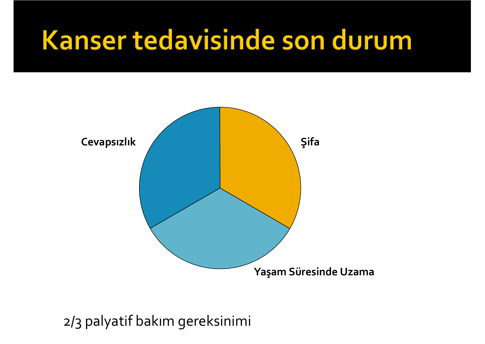
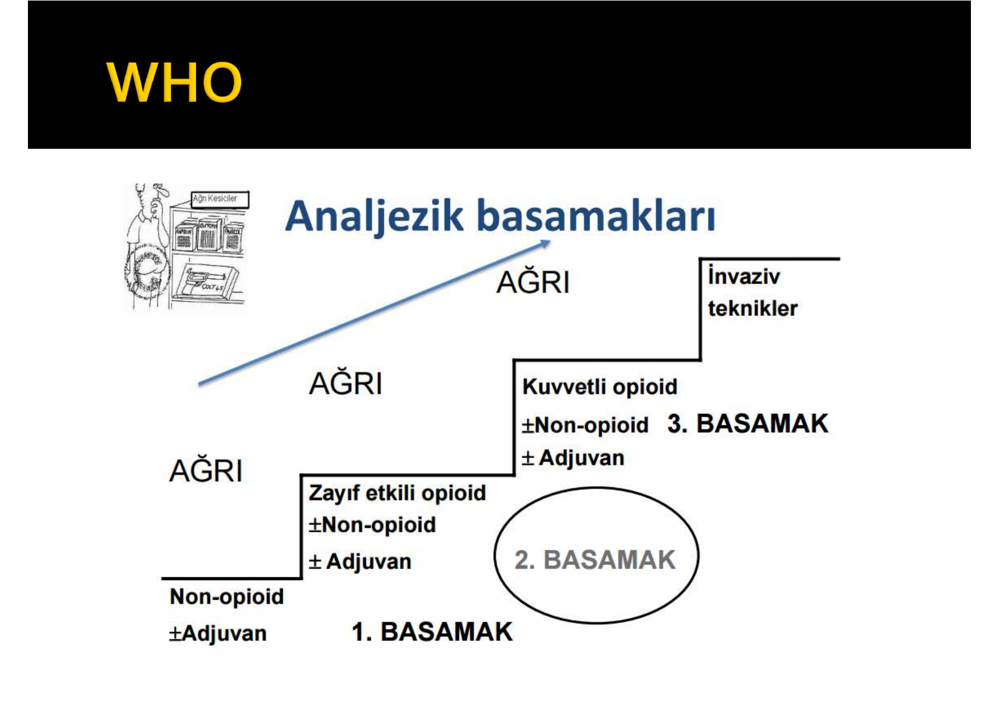
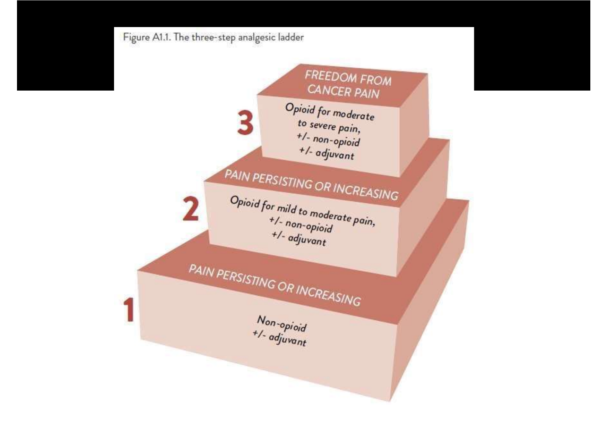
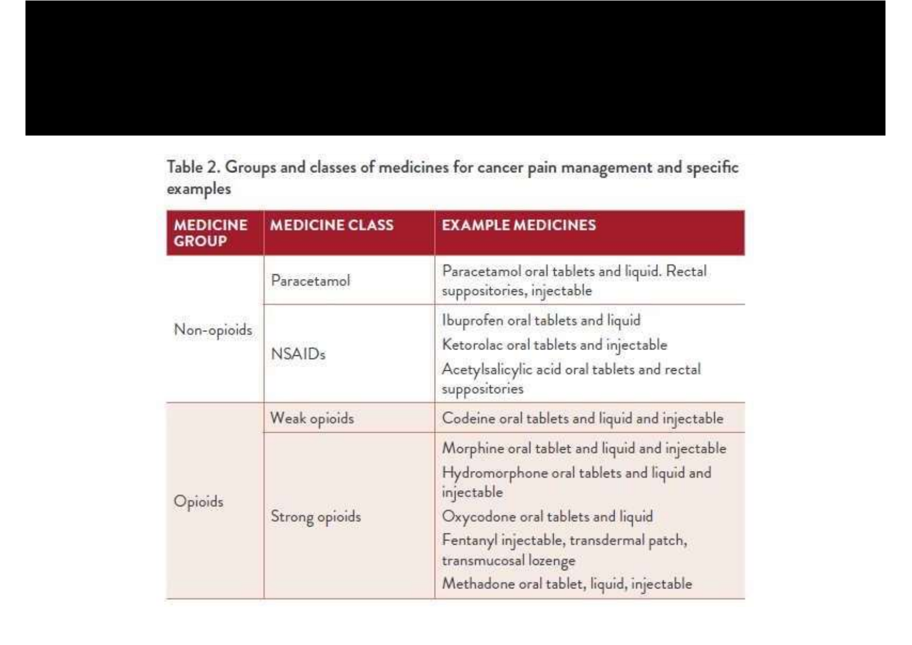
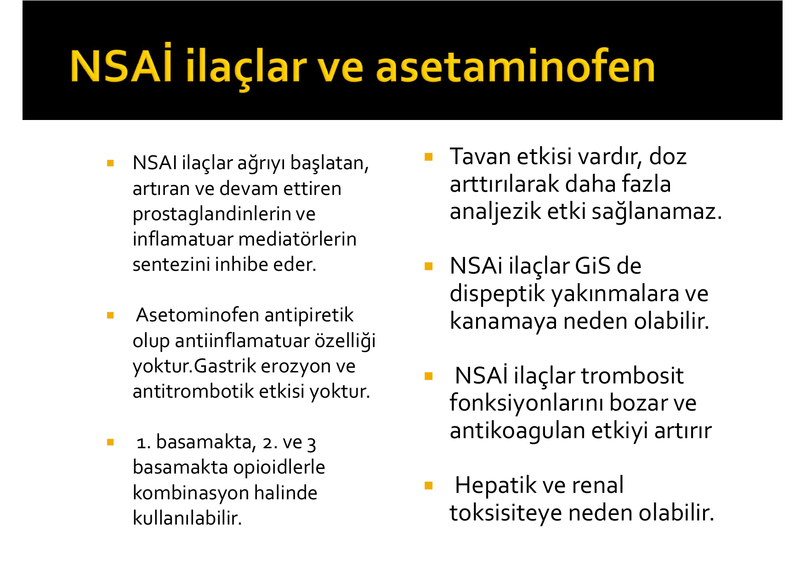
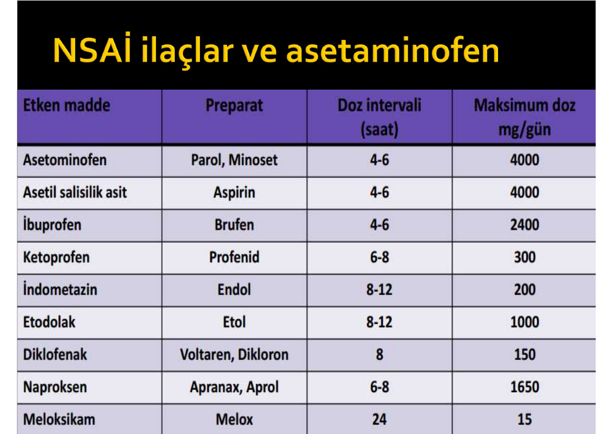
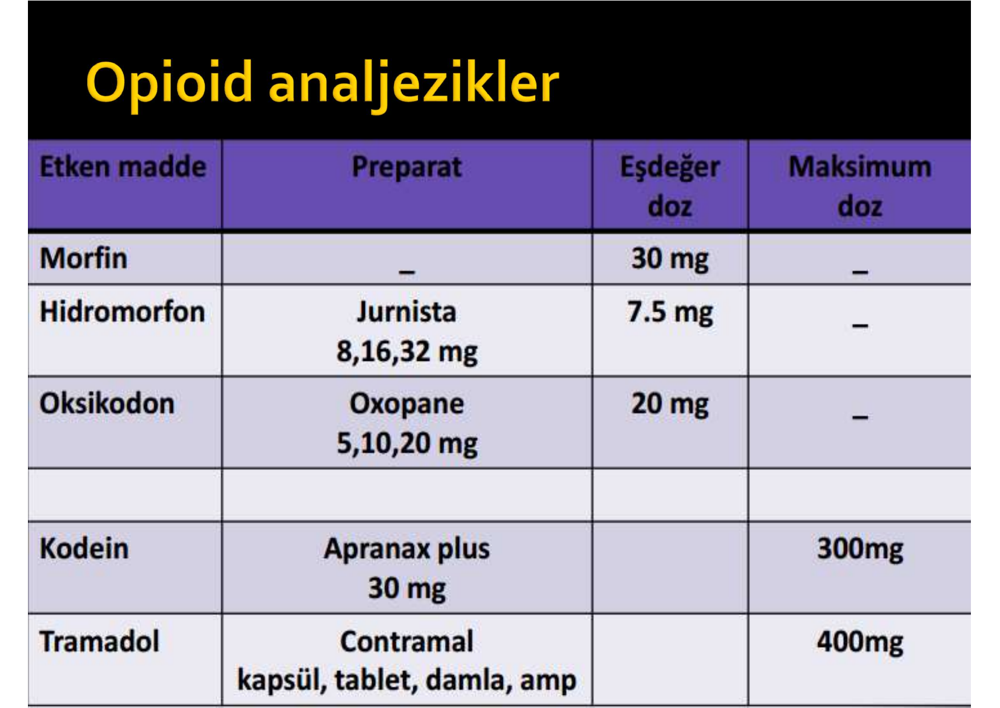
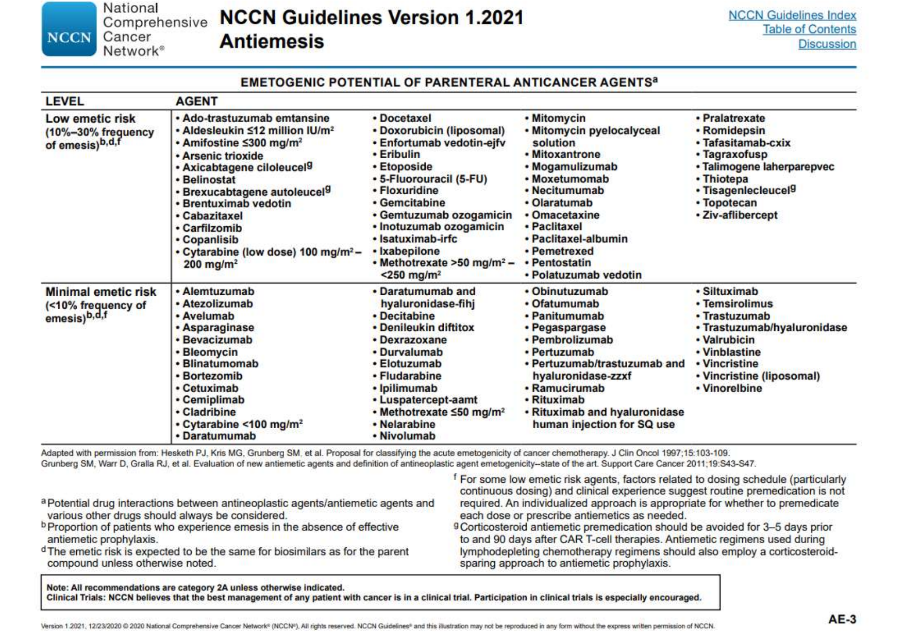
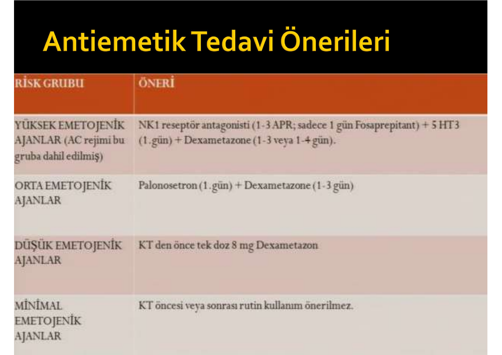
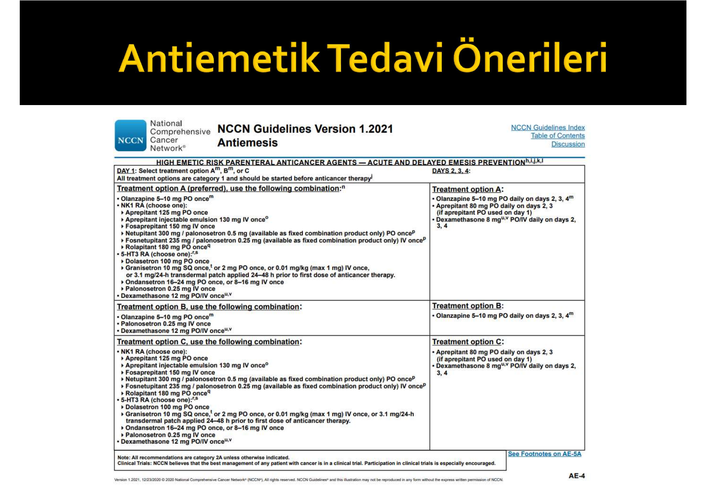

# KANSERDE DESTEK TEDAVİLERİ

**Hazırlayan:** Dr. Öğr. Üyesi Merve Turan
**Bölüm:** Tıbbi Onkoloji

---

## İÇİNDEKİLER

1. [Tanım ve Genel Bakış](#tanım-ve-genel-bakış)
2. [Ağrı](#ağrı)
3. [Bulantı ve Kusma](#bulantı-ve-kusma)
4. [Febril Nötropeni ve MASCC Skoru](#febril-nötropeni-ve-mascc-skoru)
5. [Mukozit](#mukozit)
6. [Ağız Kuruluğu (Kserostomi)](#ağız-kuruluğu-kserostomi)
7. [Konstipasyon](#konstipasyon)
8. [Diyare](#diyare)
9. [İştahsızlık (Anoreksi)](#i̇ştahsızlık-anoreksi)
10. [Beslenme Bozukluğu ve Beslenme Desteği](#beslenme-bozukluğu-ve-beslenme-desteği)
11. [Myeloid Büyüme Faktörleri](#myeloid-büyüme-faktörleri)
12. [Klinik Vaka Örnekleri](#klinik-vaka-örnekleri)
13. [Test Soruları](#test-soruları)
14. [Kısaltmalar](#kısaltmalar)

---

## TANIM VE GENEL BAKIŞ

> **Kanserde Destek Tedavisi (Dünya Sağlık Örgütü / WHO):** "Kanser veya tedavi yöntemleri nedeniyle ortaya çıkan problemleri ortadan kaldırmayı, hasta ve yakınının yaşam kalitesini yükseltmeyi amaçlayan yaklaşımdır."

### Kanser Tedavisinde Son Durum



- Hastaların **2/3'ünde palyatif bakım gereksinimi** vardır.
- Tedavi sonucu üç ana grupta toplanır:
  - **Şifa**
  - **Yaşam süresinde uzama**
  - **Cevapsızlık**

### Yaşam Kalitesini En Çok Etkileyen Semptomlar

| Sıra | Semptom |
|---|---|
| 1 | Ağrı |
| 2 | Anoreksi (iştahsızlık) |
| 3 | Kilo kaybı |
| 4 | Ağızda kuruma (kserostomi) |
| 5 | Cinsel fonksiyon bozukluğu |

> 💡 **Akılda tutulacak:** Kanser hastasının en sık çektiği semptom ağrıdır; bunu beslenme/kaşeksi problemleri izler.

### Sunum Planı

Bu notta ele alınan destek tedavi başlıkları:

- Ağrı
- Bulantı--kusma ve tedavisi
- Anemi
- Venöz tromboemboli
- Mukozit ve ağız kuruluğu
- Konstipasyon ve diyare
- İştahsızlık ve beslenme desteği
- Myeloid büyüme faktörleri
- Stres yönetimi

---

## AĞRI

### Tanım

> **Ağrı (Uluslararası Ağrı Araştırma Derneği -- IASP):** Ağrı, vücudun herhangi bir yerinden kaynaklanan, organik bir nedene bağlı olan veya olmayan, kişinin geçmişteki tüm deneyimlerini kapsayan hoş olmayan bir duygudur.

### Epidemiyoloji

| Evre | Ağrı Prevalansı |
|---|---|
| Tanı anında | **%20-30** |
| Tedavi süresince | **%40-70** |
| İleri evre / terminal dönem | **%70-90** |

> ⭐ **Önemli:** Günümüzde kanser ağrısının **%85-95'i** uygun farmakolojik yöntemlerle kontrol altına alınabilmektedir. Ağrının yetersiz tedavisi çoğunlukla bilgi eksikliğine bağlıdır.

### Sınıflandırma

**A) Süre ve başlangıç şekline göre:**

| Tip | Özellik |
|---|---|
| **Akut ağrı** | Kısa süreli, belirli bir tetikleyiciye bağlı |
| **Kronik ağrı** | >3 ay süren, sürekli ağrı |
| **Kaçak ağrı (breakthrough pain)** | Kontrol altındaki kronik ağrıda ani alevlenme |

**B) Patofizyolojik mekanizmaya göre:**

| Tip | Kaynak | Örnek |
|---|---|---|
| **Nosiseptif -- Somatik** | Deri, kas, kemik, bağ dokusu reseptörleri | Kemik metastazı ağrısı |
| **Nosiseptif -- Visseral** | İç organ reseptörleri | Karaciğer kapsül gerilmesi |
| **Nöropatik** | Sinir hasarı / tutulumu | Brakiyal pleksus infiltrasyonu, KT nöropatisi |
| **Miksed (karışık)** | Birden fazla mekanizma birlikte | İleri evre solid tümörlerin çoğu |

### Kaçak Ağrılar (Breakthrough Pain)

> **Tanım:** Yeterli derecede kontrol altında olan kanser ağrısında geçici, çoğunlukla kısa süreli ve ani gelişen ağrı artışıdır.

**Özellikleri:**

- Kanser hastalarında **%40-80** sıklıkta görülür
- **Kısa sürelidir** (ortalama **30 dk**)
- **Şiddetli** ağrılardır
- Tedavi için kısa etkili opioidler (ör. morfin, oksikodon IR) kullanılır

---

### WHO Analjezik Merdiveni (3 Basamaklı Tedavi)





```
                                      3. BASAMAK
                                 ┌──────────────────┐
                                 │  Kuvvetli opioid │  İnvaziv
                                 │  ± Non-opioid    │  teknikler
                                 │  ± Adjuvan       │
                                 └──────────────────┘
                                          ↑
                        Ağrı devam ediyor veya artıyorsa
                                          ↑
                      2. BASAMAK
                 ┌───────────────────────┐
                 │  Zayıf etkili opioid  │
                 │  ± Non-opioid         │
                 │  ± Adjuvan            │
                 └───────────────────────┘
                              ↑
            Ağrı devam ediyor veya artıyorsa
                              ↑
     1. BASAMAK
  ┌─────────────────────┐
  │  Non-opioid         │   (Parasetamol, NSAİİ)
  │  ± Adjuvan          │
  └─────────────────────┘
```

> 💡 **Mnemonik -- "1-2-3 NZK":** 1. basamak **N**on-opioid, 2. basamak **Z**ayıf opioid, 3. basamak **K**uvvetli opioid.

### Basamaklarda Kullanılan İlaçlar



| İlaç Grubu | İlaç Sınıfı | Örnek İlaçlar |
|---|---|---|
| **Non-opioid** | Parasetamol | Parasetamol (oral tb/şurup, rektal supp, IV) |
| **Non-opioid** | NSAİİ | İbuprofen, ketorolak, aspirin |
| **Zayıf opioid** | -- | **Kodein**, **tramadol** |
| **Kuvvetli opioid** | -- | **Morfin**, hidromorfon, oksikodon, fentanil (TD patch, transmukozal), metadon |
| **Adjuvan** | Antidepresan, antikonvülzan, nöroleptik, kortikosteroid, oral lokal anestezik, anksiyolitik | Amitriptilin, gabapentin, pregabalin, deksametazon |

---

### Non-Opioid Analjezikler (NSAİİ ve Parasetamol)



**Etki Mekanizmaları ve Farklar:**

| Özellik | NSAİİ | Parasetamol (Asetominofen) |
|---|---|---|
| Etki mekanizması | Prostaglandin sentezi inhibisyonu (COX) | Santral antipiretik etki; antiinflamatuar etki yok |
| Antiinflamatuar | ✅ Var | ❌ Yok |
| Antipiretik | ✅ Var | ✅ Var |
| Gastrik erozyon | ✅ Var | ❌ Yok |
| Antitrombotik etki | ✅ Var | ❌ Yok |
| Renal toksisite | ✅ Var | ⚠️ Yüksek dozda |
| Hepatik toksisite | Nadir | ⚠️ Yüksek dozda |

**⚠️ NSAİİ'lere dair önemli noktalar:**

- Ağrıyı başlatan, artıran ve devam ettiren **prostaglandinlerin ve inflamatuar mediatörlerin sentezini inhibe eder**.
- **Tavan etkisi (ceiling effect) vardır** → doz artırılarak daha fazla analjezi sağlanamaz.
- 1. basamakta tek başına, 2. ve 3. basamakta opioidlerle **kombine** kullanılabilir.
- **Yan etkileri:**
  - GİS: Dispeptik yakınmalar, gastrik erozyon, kanama
  - Hematolojik: Trombosit fonksiyon bozukluğu, antikoagulan etki artışı
  - Hepatik ve renal toksisite

**Parasetamol özellikleri:**

- Antipiretik etki vardır; **antiinflamatuar etkisi yoktur**.
- Gastrik erozyon ve antitrombotik etkisi yoktur.
- Güvenlik profili nedeniyle tüm basamaklarda opioidlerle kombine kullanılır.

### Non-Opioid Analjezik Doz Tablosu



| Etken madde | Preparat | Doz intervali (saat) | Maksimum doz (mg/gün) |
|---|---|---|---|
| **Asetaminofen** | Parol, Minoset | 4-6 | **4000** |
| **Asetilsalisilik asit** | Aspirin | 4-6 | 4000 |
| **İbuprofen** | Brufen | 4-6 | 2400 |
| **Ketoprofen** | Profenid | 6-8 | 300 |
| **İndometazin** | Endol | 8-12 | 200 |
| **Etodolak** | Etol | 8-12 | 1000 |
| **Diklofenak** | Voltaren, Dikloron | 8 | 150 |
| **Naproksen** | Apranax, Aprol | 6-8 | 1650 |
| **Meloksikam** | Melox | 24 | 15 |

> 💡 **Pratik ipucu:** Parasetamol ve ASA için günlük maksimum doz her ikisinde de **4000 mg'dır**; meloksikam günlük **15 mg tek doz** ile farklı bir grafiğe sahiptir.

---

### Opioid Analjezikler



| Etken madde | Preparat | Eşdeğer doz | Maksimum doz |
|---|---|---|---|
| **Morfin** | -- | **30 mg** | -- (tavan yok) |
| **Hidromorfon** | Jurnista 8, 16, 32 mg | **7.5 mg** | -- |
| **Oksikodon** | Oxopane 5, 10, 20 mg | **20 mg** | -- |
| **Kodein** | Apranax plus 30 mg | -- | **300 mg/gün** |
| **Tramadol** | Contramal (kapsül, tablet, damla, amp) | -- | **400 mg/gün** |

> ⭐ **Önemli -- Opioid eşdeğerlik:** Morfin 30 mg ≈ Hidromorfon 7.5 mg ≈ Oksikodon 20 mg (PO). Güçlü opioidlerde **tavan dozu yoktur**; zayıf opioidlerde (kodein, tramadol) vardır.

**Güçlü opioidler:** Fentanil, morfin
**Zayıf opioidler:** Kodein, tramadol
**Adjuvan ilaçlar:** Antidepresan, antikonvülzan, nöroleptik, kortikosteroid, oral lokal anestezik, anksiyolitik

### Opioid Eş-Analjezik Doz Tablosu (Pratik Rotasyon)

| Opioid | Oral (mg) | Parenteral (IV/SC, mg) | Oral:Parenteral Oran |
|---|---|---|---|
| **Morfin** | **30** | **10** | 3:1 |
| **Oksikodon** | **20** | 10 | 2:1 |
| **Hidromorfon** | **7.5** | **1.5** | 5:1 |
| **Fentanil TTS (patch)** | -- | **12 µg/h ≈ 30 mg oral morfin/gün** (yaklaşık) | -- |
| **Tramadol** | **150-300** (eşdeğerlik zayıf, tavan: 400 mg/gün) | -- | -- |
| **Kodein** | **200-300** (tavan: 300 mg/gün) | -- | -- |
| **Metadon** | Değişken (deneyimli hekim tarafından belirlenir) | -- | -- |

> 💡 **Pratik rotasyon ipucu:** Günlük oral morfin eş değerini hesapla → hedef opioid eş değerine dönüştür → **çapraz tolerans için %25-50 azalt** → kısa etkili kurtarma (rescue) dozu olarak günlük toplamın **%10-15'i**ni her 4 saatte bir PRN düzenle.
>
> Örnek: 60 mg/gün oral morfin → 60 mg oksikodon karşılığı yaklaşık 40 mg → çapraz tolerans sonrası **20-30 mg/gün oksikodon**, PRN 5 mg her 4 saatte bir.

---

### NSAİİ vs Opioid -- Yan Etki Karşılaştırması

| Yan Etki | NSAİİ | Opioid |
|---|---|---|
| **GİS** | Dispeptik yakınma, **gastrik erozyon, ülser, kanama** | **Konstipasyon** (profilaksi şart!), bulantı, kusma, ağız kuruluğu |
| **Renal** | **Akut böbrek yetmezliği, tubüler hasar** | İdrar retansiyonu |
| **Hematolojik** | **Trombosit fonksiyon bozukluğu**, antikoagulan etki | -- |
| **Kardiyovasküler** | MI, inme riski artışı (özellikle COX-2 selektifler) | Hipotansiyon (nadir), sinüs bradikardisi |
| **SSS** | Baş ağrısı, konfüzyon (yaşlıda) | **Sedasyon, kognitif bozukluk, miyoklonus, halüsinasyon** |
| **Solunum** | -- | ⚠️ **Solunum depresyonu** (en ciddi) |
| **Hepatik** | Nadir (parasetamol hariç) | Nadir |
| **Tavan etkisi** | ✅ **Var** (dozu artırmak fayda etmez) | ❌ **Yok** (güçlü opioidler) |
| **Tolerans gelişimi** | Yok | Solunum depresyonu/analjeziye tolerans **gelişir**, konstipasyona **gelişmez** |
| **Bağımlılık riski** | Yok | Var (kanser ağrısında gerçek bağımlılık %0.1) |
| **Antiinflamatuar** | ✅ Var | Yok |

> 💡 **Pratik köşe:** Kemik metastazı ağrısında NSAİİ **mekanizmaya yönelik** en rasyonel tercihtir (PGE₂ aracılı osteoklastik aktivite baskılanır) → opioide ek NSAİİ ciddi additif analjezi sağlar.

### Opioidlerin Yan Etkileri

| Sistem | Yan Etkiler |
|---|---|
| 🤢 **GİS** | Kaşıntı, GİS motilitesi azalır → **konstipasyon**, bulantı-kusma, ağız kuruluğu |
| 🚰 **Üriner** | İdrar retansiyonu |
| 🥵 **Otonom** | Sıcak basması, terleme |
| 🧠 **SSS** | Baş dönmesi, **sedasyon**, miyoklonus, kognitif problemler, halüsinasyon, davranış değişiklikleri |
| 🫁 **Solunum** | ⚠️ **Solunum depresyonu** (en ciddi) |

> 💡 **Mnemonik -- Opioid yan etkileri "KSMBS":** **K**onstipasyon (tolerans gelişmez, her zaman profilaksi!) -- **S**edasyon -- **M**iyoklonus -- **B**ulantı -- **S**olunum depresyonu.

> 💡 **Alternatif mnemonik -- "SMASHED Opioid":**
> - **S**edation (sedasyon)
> - **M**yoclonus (miyoklonus)
> - **A**ğız kuruluğu + **A**ltered mental state
> - **S**olunum depresyonu (en ciddi)
> - **H**ipotansiyon / Halüsinasyon
> - **E**mesis (bulantı-kusma) + **E**ufori
> - **D**ismotilite (konstipasyon) + **D**iuresis azalması (idrar retansiyonu)

> ⭐ **Altın Kural -- Tolerans gelişmeyen iki yan etki:** Opioidlere **konstipasyon** ve **miyotik pupil** (miyozis) toleransı **hiçbir zaman** gelişmez → konstipasyon için **profilaktik laksatif** her zaman başlanır!

### Opioidlere Psikolojik Bağımlılık

**⚠️ ÖNEMLİ:**

- Psikolojik bağımlılık **patolojik bir yanıttır**
- Yersiz ön yargı ve korkular vardır (opiofobi)
- Kanser ağrısı tedavisinde ilacın kötüye kullanım oranı yani **psikolojik bağımlılık yüzdesi sadece %0.1'dir**
- Bu nedenle opioid başlamaktan korkmayın; ağrıyı yeterince tedavi etmemek daha büyük hatadır.

---

### Meperidin (Petidin) -- Neden Tercih Edilmemeli?

> ⚠️ **Uyarı:** Petidin (meperidin hidroklorid -- Dolantin, Aldolan) **kronik kanser ağrısı tedavisinde kötü bir seçimdir**, başka seçenek varsa kullanılmamalıdır!

**Nedenleri:**

| Sorun | Açıklama |
|---|---|
| Oral emilim | **%40 yetersiz** |
| Etkinlik süresi | **Kısa (t½ <3 saat)** |
| Ana metabolit | **Normeperidin** |
| Normeperidin özellikleri | Analjezik değil, **nörotoksik** (tremor, disfori, nöbet), **kardiyotoksik** |
| Normeperidin yarı ömrü | Meperidinden **daha uzun** → birikir |
| Renal atılım | Yaşlı ve renal yetmezlikte **problem** |
| Bağımlılık | **Yüksek** |

```
   MEPERİDİN kullanımı (kronik ağrıda)
              ↓
   NORMEPERİDİN birikimi
        ↓             ↓
   Nörotoksisite   Kardiyotoksisite
   (tremor,        (aritmi)
   disfori, nöbet)
```

> 💡 **Mnemonik -- Meperidin = "NO-PE-RI-DIN":**
> - **N**orm-meperidin toksik metabolit
> - **O**ral emilim yetersiz (%40)
> - **P**ek kısa etki (t½ <3 sa)
> - **E**pileptojenik (nöbet)
> - **R**enal atılım → yaşlıda birikim
> - **I**tiyat-bağımlılık yüksek
> - **D**isfori + tremor
> - **iN**-onko kronik ağrıda **KULLANMA!**

---

### Nöropatik Ağrıda Adjuvan Tedavi (Önemli Özel Durum)

Kanser hastalarında özellikle **brakiyal pleksus infiltrasyonu**, **KT nöropatisi** (oksaliplatin, paklitaksel, vinkristin), **post-herpetik nevralji**, **spinal kord basısı** gibi durumlarda nöropatik ağrı sıktır ve klasik opioidlere göre **adjuvan ilaçlar** daha etkindir.

| Sınıf | İlaç | Doz | Özellik |
|---|---|---|---|
| **Antikonvülzan (Gabapentinoid)** | **Gabapentin** | 300 mg/gün başla, titre et (maks 3600 mg/gün, 3 dozda) | İlk basamak, sedasyon + kilo alımı |
| | **Pregabalin** | 75 mg 2x1 başla, maks 600 mg/gün | Daha hızlı titrasyon, lineer farmakokinetik |
| **TSA (Trisiklik Antidepresan)** | **Amitriptilin** | 10-25 mg gece başla, maks 75-150 mg | Antikolinerjik yan etki, yaşlıda dikkat |
| **SNRİ** | **Duloksetin** | 30 mg/gün başla, 60-120 mg/gün | Özellikle KT indüklü periferik nöropati |
| **Topikal** | Lidokain %5 patch, Kapsaisin | Lokal alana | Lokalize nöropatide |
| **Kortikosteroid** | **Deksametazon** | 4-8 mg/gün (yüksekte 16 mg) | Sinir basısı, ödem azaltılması |

> 💡 **Mnemonik -- Nöropatik ağrıda ilk tercih "GA-DU-PRE-AMİ":** **Ga**bapentin, **Du**loksetin, **Pre**gabalin, **Ami**triptilin -- bu 4 ilaç NCCN/EAPC rehberlerinin 1. sıradaki önerileridir.

---

## BULANTI VE KUSMA

### Genel Bilgiler

- Hastaların **profilaksiye rağmen %70-80'inde** ortaya çıkar.
- **Profilaksi en etkin yöntemdir** (tedaviden daha önemli).
- Yaşam kalitesini ciddi biçimde etkiler ve **tedavi reddine neden olabilir**.

**Tıbbi sorunlar / komplikasyonlar:**

- Dehidratasyon
- Elektrolit imbalansı
- Malnutrisyon
- Aspirasyon pnömonisi
- Özefageal yırtılma (Mallory-Weiss)

### Kanser Hastalarında Tedavi Dışı Bulantı Nedenleri

| Neden | Örnek |
|---|---|
| **Mekanik** | İleus, subileus, intestinal obstrüksiyon |
| **Vestibüler** | Vestibüler disfonksiyon |
| **SSS** | Beyin metastazları |
| **Elektrolit imbalansı** | Hiperkalsemi, hiperglisemi, hiponatremi |
| **Metabolik** | Üremi |
| **İlaç** | Diğer tedaviler (opiatlar) |
| **Motilite bozukluğu** | Gastroparezi (tümör, vinkristin, diyabet) |
| **Patofizyolojik** | Anksiyete, beklentisel |

---

### Kemoterapi Kaynaklı Bulantı ve Kusma (CINV)

KT kaynaklı bulantı-kusma başlangıç zamanına göre sınıflandırılır:

| Tip | Zaman | Süre | Mekanizma | Tipik Ajan | Tedavi Anahtarı |
|---|---|---|---|---|---|
| **Akut başlangıçlı** | İlaç uygulamasından **dakikalar--saatler** sonra, **5-6 saatte pik** | <24 saat | **Serotoninerjik yol** (5-HT₃) | Hemen her emetojenik KT | **5-HT₃RA** (ondansetron, palonosetron) |
| **Geç başlangıçlı** | **24 saat sonra** başlar, **24-72 saatte maksimum** | 2-5 gün | **Substans P / NK₁ yolu** baskın | **Sisplatin**, karboplatin, **siklofosfamid**, doksorubisin | **NK₁RA + deksametazon** (gün 2-4) |
| **Beklentisel** | KT öncesi ortaya çıkar | Kısa | Klasik şartlanma (psikolojik) | Önceki yetersiz profilaksi sonrası | **Benzodiazepin** (lorazepam) |
| **Breakthrough (Kaçak)** | Profilaksiye rağmen ortaya çıkar | Değişken | Rezistans / yetersiz blokaj | Herhangi bir emetojenik KT | **Olanzapin 5-10 mg PO** veya metoklopramid, haloperidol |
| **Refrakter** | Profilaksi + breakthrough tedaviye rağmen devam eder | Kronik | Çoklu mekanizma | İleri evre / yoğun rejim | Rejim değişikliği, kannabinoid, kombine |

> 💡 **Mnemonik -- CINV "5 Tipi: ABBREviation":**
> - **A**kut (ilk 24 sa, 5-HT₃)
> - **B**eklentisel (KT öncesi, benzo)
> - **B**reakthrough (profilaksiye rağmen, olanzapin)
> - **R**efrakter (tüm tedaviye dirençli)
> - **E**tkisi uzun -- yani geç (24-72 sa, NK₁)
>
> Kısa hatırlama: **"A-B-B-R-E"** -- Akut, Beklentisel, Breakthrough, Refrakter, Gecikmiş (Extended).

### Beklentisel Bulantı-Kusma

**Özellikler:**

- KT öncesi (henüz ilaç uygulanmamışken) ortaya çıkar
- **Genç hastalarda daha sık**
- Önceki KT'lerde yetersiz profilaksi / tedaviye yanıtsızlık varsa gelişir
- **Düşünme, görme, tatma, koku ve anksiyete** ile tetiklenebilir
- ⭐ Tedavide **anksiyolitikler (benzodiazepinler)** etkilidir

---

### KT Ajanlarının Emetojenik Potansiyeli (NCCN 2021)

NCCN, parenteral antineoplastik ajanları emezis sıklığına göre **4 kategoride** sınıflandırır:



| Risk Sınıfı | Emezis Sıklığı | Örnek Ajanlar |
|---|---|---|
| **Yüksek** | >%90 | **Sisplatin**, siklofosfamid >1500 mg/m², **karboplatin AUC ≥4**, dakarbazin, doksorubisin ≥60 mg/m², epirubisin >90 mg/m², ifosfamid ≥2 g/m², karmustin >250 mg/m², mekloretamin, streptozosin, **AC kombinasyonu** (antrasiklin + siklofosfamid) |
| **Orta** | %30-90 | Karboplatin AUC <4, siklofosfamid <1500 mg/m², doksorubisin <60 mg/m², azasitidin, bendamustin, busulfan, daunorubisin, idarubisin, ifosfamid <2 g/m², **irinotekan**, **oksaliplatin**, metotreksat ≥250 mg/m², temozolomid, trabektedin |
| **Düşük** | %10-30 | Ado-trastuzumab emtansin, **dosetaksel**, **paklitaksel**, pemetreksed, **5-FU**, **gemsitabin**, etoposid, topotekan, bortezomib, karfilzomib, kabazitaksel |
| **Minimal** | <%10 | Monoklonal antikorların büyük çoğunluğu: **bevasizumab, setuksimab, pertuzumab, trastuzumab, rituksimab, vinkristin, vinblastin, bleomisin, fludarabin**, immünoterapiler (pembrolizumab, nivolumab, ipilimumab, atezolizumab, avelumab, durvalumab) |

> 💡 **Pratik not:** AC rejimi (antrasiklin + siklofosfamid) -- özellikle meme kanserinde yaygın -- 2019'dan itibaren yüksek emetojenik gruba dahil edilmiştir.

---

### Antiemetik İlaçlar

| Sınıf | Örnek | Özellik |
|---|---|---|
| **5-HT₃ reseptör antagonistleri** | Ondansetron, granisetron, tropisetron, dolasetron, **palonosetron** | Akut bulantıda etkili |
| **Kortikosteroidler** | Deksametazon, prednizolon | Akut + gecikmiş |
| **NK₁ reseptör antagonistleri** | **Aprepitant**, fosaprepitant, rolapitant, netupitant, fosnetupitant | Orta-yüksek emetojenik rejimlerde |
| **Dopamin antagonistleri** | Metoklopramid, proklorperazin, haloperidol | Adjuvan |
| **Olanzapin** | -- | Yüksek emetojenik rejim ve beklentisel |
| **Benzodiazepinler** | Lorazepam | Beklentisel bulantı |
| **Kannabinoidler** | Dronabinol, nabilon | Dirençli olgular |

---

#### 5-HT₃ Antagonistleri

| Jenerasyon | İlaçlar | Özellik |
|---|---|---|
| **1. jenerasyon** | Ondansetron, granisetron, tropisetron, dolasetron | Akut bulantı ve kusmada etkin |
| **2. jenerasyon** | **Palonosetron** | Yarı ömrü **40 saat** -- hem akut hem gecikmiş bulantıda etkin |

- **Oral ve parenteral formlar aynı etkinliktedir**
- **Yan etkileri:** Baş ağrısı, KCFT yüksekliği, geçici EKG değişiklikleri (QT uzaması), **konstipasyon**, diyare

#### Steroidler

- **Deksametazon**, prednizolon
- **Düşük emetojenik etkili protokollerde tek başına yeterli**
- Hem akut hem de gecikmiş bulantı-kusmada diğer antiemetikler ile birlikte etkilidirler

#### NK₁ Reseptör Antagonistleri

- **Aprepitant** (PO), **Fosaprepitant** (IV)
- **Orta ve yüksek emetojenik durumlarda** kullanılır
- Aprepitant **CYP3A4** inhibitörüdür → etkileşim nedeniyle **deksametazon dozu yarıya düşürülür**

**Yan etkiler:**

- Baş ağrısı
- KCFT yüksekliği
- Karın ağrısı
- Anoreksi
- İshal
- Hıçkırık

---

### Antiemetik Tedavi Önerileri (NCCN 2021)





| Risk Grubu | Antiemetik Rejimi |
|---|---|
| **Yüksek Emetojenik** (AC dahil) | **NK₁RA** (Aprepitant 1-3 gün veya tek doz Fosaprepitant) + **5-HT₃RA** (1. gün) + **Deksametazon** (1-3 veya 1-4 gün) ± **Olanzapin** 5-10 mg (1-4 gün) |
| **Orta Emetojenik** | **Palonosetron** (1. gün) + **Deksametazon** (1-3 gün) |
| **Düşük Emetojenik** | KT öncesi **tek doz 8 mg Deksametazon** |
| **Minimal Emetojenik** | KT öncesi veya sonrası **rutin antiemetik önerilmez** |

#### Yüksek Emetojenik Rejimde Tedavi Seçenekleri (NCCN -- 1. Gün)

**Seçenek A (tercih):** Olanzapin + NK₁RA + 5-HT₃RA + Deksametazon

- **Olanzapin 5-10 mg PO** (1 kez)
- **NK₁RA** (birini seç):
  - Aprepitant 125 mg PO 1 kez
  - Fosaprepitant 150 mg IV 1 kez
  - Netupitant 300 mg / palonosetron 0.5 mg PO (NEPA)
  - Fosnetupitant 235 mg / palonosetron 0.25 mg IV
  - Rolapitant 180 mg PO 1 kez
- **5-HT₃RA** (birini seç):
  - Dolasetron 100 mg PO
  - Granisetron 10 mg SC veya 2 mg PO veya 0.01 mg/kg (maks 1 mg) IV veya **3.1 mg/24-sa transdermal patch** (KT'den 24-48 saat önce uygulanır)
  - Ondansetron 16-24 mg PO veya 8-16 mg IV
  - Palonosetron 0.25 mg IV
- **Deksametazon 12 mg PO/IV** 1 kez

**Seçenek A -- 2-4. Günlerde devam:**

- Olanzapin 5-10 mg PO günlük (gün 2, 3, 4)
- Aprepitant 80 mg PO günlük (gün 2, 3) -- eğer 1. gün PO aprepitant kullanıldıysa
- Deksametazon 8 mg PO/IV günlük (gün 2, 3, 4)

**Seçenek B:** Olanzapin + Palonosetron + Deksametazon
**Seçenek C:** NK₁RA + 5-HT₃RA + Deksametazon (olanzapin olmadan)

### Hızlı Reçete Özeti -- Emetojenik Risk → Rejim

```
        ┌─────────────────────────────────────────────────┐
        │         EMETOJENİK RİSK SINIFI                  │
        └─────────────────────────────────────────────────┘
                           │
   ┌───────────┬───────────┼───────────┬─────────────┐
   ↓           ↓           ↓           ↓             ↓
YÜKSEK       ORTA        DÜŞÜK      MİNİMAL      BEKLENTİSEL
(>%90)     (%30-90)     (%10-30)    (<%10)       (+Anksiyete)
   │           │           │           │             │
   ↓           ↓           ↓           ↓             ↓
4'lü      PALO + DEX    8 mg DEX   Rutin yok    Lorazepam
OLA+NK1    (gün 1-3)    (tek doz,                  ±
+5HT3+DEX               KT öncesi)              Davranış terapisi
```

> 💡 **Mnemonik -- 4'lü Rejim "OLANDA-SUSTU":**
> - **OLAN**zapin + **DA**ha (NK1RA aprepitant) + **SU**bstans 5-HT3 antagonisti + **TU**z (deksametazon)
> - Yani: Olanzapin + Aprepitant + 5-HT3RA (palonosetron/ondansetron) + Deksametazon
> - **"OLANDA SUSTU"** = 4 ilaç bir araya geldiğinde yüksek emetojenik KT'de bulantı susar.

> ⭐ **Pratik hatırlatma -- Aprepitant uyarısı:** Aprepitant **CYP3A4 inhibitörü** → birlikte kullanıldığında **deksametazon dozu yarıya** indirilir (12 mg → 6 mg; 8 mg → 4 mg).

---

## FEBRİL NÖTROPENİ VE MASCC SKORU

### Febril Nötropeni (FN) Tanımı

> **Febril nötropeni (FN):**
> - **Ateş:** Oral tek ölçüm **≥38.3°C** veya **≥38.0°C'nin 1 saatte devam etmesi**
> - **Nötropeni:** ANC (mutlak nötrofil sayısı) **<500 /mm³** veya **<1000 /mm³** ve 48 saat içinde <500 /mm³'ün altına düşme beklentisi

### Risk Stratifikasyonu -- MASCC Skorlama Tablosu

MASCC (Multinational Association of Supportive Care in Cancer) skorlama sistemi **düşük riskli FN** hastalarını ayırt etmek için kullanılır. Maksimum skor 26'dır.

| Özellik | Puan |
|---|---|
| **Hastalık yükü (semptom şiddeti):** Yok / hafif | **5** |
| Hastalık yükü: Orta | **3** |
| Hastalık yükü: Ağır | 0 |
| **Hipotansiyon yok** (sistolik TA ≥90 mmHg) | **5** |
| **KOAH yok** | **4** |
| **Solid tümör** veya hematolojik maligniteye bağlı önceki mantar enfeksiyonu **yok** | **4** |
| **Dehidratasyon yok** (IV sıvı gerektirmeyen) | **3** |
| **Ateş başlangıcında ayaktan (poliklinik) hasta** | **3** |
| **Yaş <60** | **2** |
| **TOPLAM** | **Maks 26** |

### MASCC'ye Göre Yönetim

| MASCC Skoru | Risk | Yönetim |
|---|---|---|
| **≥21** | **Düşük risk** | Uygun hastalarda **oral antibiyotik + ayaktan tedavi** (siprofloksasin + amoksisilin-klavulanat) düşünülebilir |
| **<21** | **Yüksek risk** | **Hastaneye yatış + geniş spektrumlu IV antibiyotik** (monoterapi: piperasilin-tazobaktam, sefepim, meropenem) |

> ⚠️ **KRİTİK -- İlk 60 dakika:** FN tanısı konulduktan sonra **60 dakika içinde** geniş spektrumlu IV antibiyotik başlanmalıdır. Bu "door-to-antibiotic" süresi mortaliteyi doğrudan etkiler.

### Ampirik Antibiyotik Rejimi

```
         FEBRİL NÖTROPENİ TANISI
                   │
         Kan kültürü x 2 (perif + port)
         İdrar, akciğer grafisi, CRP
                   │
         ┌─────────┴─────────┐
         ↓                   ↓
   MASCC ≥21              MASCC <21
   DÜŞÜK RİSK            YÜKSEK RİSK
         │                   │
         ↓                   ↓
   Oral:                 IV monoterapi:
   Siprofloksasin +      Piperasilin-tazobaktam
   Amoks-klav            VEYA Sefepim
   (ayaktan izlem)       VEYA Meropenem
                              │
                              ↓
                   48-72 sa sonra ateş devam +
                   gram (+) şüphesi veya kateter
                              ↓
                   VANKOMİSİN ekle
                              │
                              ↓
                   4-7 gün hala ateş →
                   Antifungal (kaspofungin, vorikonazol)
```

> 💡 **Mnemonik -- FN yönetiminde "60-21-72 kuralı":**
> - **60** dakika içinde antibiyotik başla (zaman penceresi)
> - MASCC **21** düşük risk sınırı
> - **72** saat sonra yanıt değerlendir (ateş devam → gram+, glikopeptid/antifungal eklenmesi)

> ⭐ **Önemli -- Vankomisin endikasyonu:** Rutin ampirik değildir; sadece aşağıdaki durumlarda eklenir:
> - Klinik şüphe (kateter enfeksiyonu, cilt/soft tissue)
> - Hemodinamik instabilite
> - MRSA kolonizasyonu
> - Ciddi mukozit
> - Kinolon profilaksisi almış hasta

---

## MUKOZİT

### Epidemiyoloji ve Patofizyoloji

- Kemoterapi alan hastaların **%40'ında** görülür
- **%50'si ciddidir**
- Kemoterapi dozunda **düzenleme gerektirir**
- Normal oral mukoza her **9-16 günde** yenilenir
- Kemoterapi mukoziti nasıl yapar:
  - Bazal epitel hücrelerinin replikasyonunu bozar
  - Mikrovasküler hasar
  - Proinflamatuar sitokin salınımı
  - Bakteriyel metabolik ürünler

### Klinik Derecelendirme

**WHO (Ders Notu) Grade Sistemi:**

| Grade | Bulgular |
|---|---|
| **Grade 1** | Hiperemi |
| **Grade 2** | Birleşme göstermeyen, **1,5 cm'yi geçmeyen** psödomembran |
| **Grade 3** | Birleşme gösteren, **1,5 cm'yi geçen** psödomembran |
| **Grade 4** | Nekroz, derin ülserasyon, **kolay kanayan** lezyonlar |

**CTCAE v5.0 -- Oral Mukozit Grading (Klinik Pratik):**

| Grade | Semptomlar | Oral Alım | Müdahale |
|---|---|---|---|
| **Grade 1** | Asemptomatik/hafif semptom, sadece muayenede bulgu | Normal | Girişim gerekmez |
| **Grade 2** | **Orta ağrı**, yeme/yutmayı **etkilemez** ama modifiye diyet | Modifiye (yumuşak) | Oral analjezi, topikal tedavi |
| **Grade 3** | **Şiddetli ağrı**, yeme/yutmayı **etkiler**, oral alım yetersiz | Yetersiz | **IV analjezi**, IV sıvı/beslenme desteği |
| **Grade 4** | **Yaşamı tehdit eden** komplikasyon, **acil girişim** | İmkansız | **Hospitalizasyon**, TPN, cerrahi/endoskopik |
| **Grade 5** | Ölüm | -- | -- |

> 💡 **Mnemonik -- Mukozit "1,5 cm" (WHO):** Grade 2 ile 3 arasındaki sınır 1,5 cm'dir: birleşmeyen küçük = G2, birleşen büyük = G3.
>
> 💡 **Mnemonik -- CTCAE "YEME kuralı":** G1 = **Y**akınma yok, G2 = **E**tkilemez (yer), G3 = **M**odifiye yemez (IV analjezi lazım), G4 = **E**kstrem (yaşamı tehdit).

### Mukozit Önleme -- Oral Hijyen

- Atravmatik ağız temizliği için **yumuşak diş fırçası**
- Gargara (izotonik, karbonat) **günde 4-6 kez**
- **Her yemek sonrası ağız çalkalama**
- Protezler ve ağızdaki plaklar temizlenir
- **Diyet:** Asitli, tuzlu, kuru olmayan, çiğneme gerektirmeyen yumuşak yiyecekler
- **Diş tedavisi:** Kemoterapiden **7 gün önce** planlanmalı
  - Acil şartlarda: **Plt >40.000**, **Nötrofil >500** olmalı; profilaktik antibiyotik verilmelidir

### Mukozit Tedavisi

| Yaklaşım | İlaç / Uygulama |
|---|---|
| **Mukoza koruyucu ajanlar** | Maltodekstrin, amphojel (aluminium hidroksit) |
| **Topikal/sistemik analjezik** | **Lidokain %2 sprey**, benzokain sprey, difenhidramin solüsyon, opioidler |
| **Enfeksiyon tedavisi** (%70 **oral kandida**) | Topikal **klotrimazol**, **nistatin** |
| **Glutamin** (nükleotid sentezi prekürsörü) | Oral süspansiyon (**L-glutamin**) 2,5 gr 3x1 -- parenteral form **etkisizdir** |
| **Kriyoterapi** | Buz parçacıkları -- 5-FU, melfalan infüzyonu sırasında |
| **Palifermin** | Keratinosit büyüme faktörü (KGF) -- HSCT hastalarında |

> ⚠️ **Önemli:** Parenteral glutamin mukoziti etkilemez, sadece **oral süspansiyon (L-glutamin)** formları ciddi mukozitte etkilidir.

---

## AĞIZ KURULUĞU (Kserostomi)

**Tedavi yaklaşımları:**

- Sakız, şeker, buz parçaları (mekanik tükürük stimülasyonu)
- Sıvı içeceklerin sık sık alınması
- Asitli ve baharatlı gıdalardan kaçınma
- Sodalı gargaralar
- Havayı nemlendirme
- **Amifostin** (radyoprotektör, radyoterapi alan hastalarda)
- **Pilokarpin tb 5 mg (3x1)** (muskarinik agonist -- tükürük bezi stimülasyonu)

---

## KONSTİPASYON

### Kanser Hastasında Konstipasyon Nedenleri

**⚠️ İlk değerlendirmede mutlaka ekarte edilmesi gereken: İNTESTİNAL OBSTRÜKSİYON!!**

| Neden | Mekanizma |
|---|---|
| **Vinka alkaloidleri** | Otonomik sinir disfonksiyonu |
| **5-HT₃ antagonistleri** | Yan etki (ondansetron konstipasyon yapar) |
| **Opioidler** | GİS motilitesi azalır (tolerans gelişmez!) |
| **İmmobilite** | Fiziksel inaktivite |
| **Anoreksi** | Yetersiz oral alım, düşük lif |
| **Dehidratasyon** | Sıvı azlığı |
| **Hiperkalsemi** | Metabolik konstipasyon |

### Tedavi

- **Magnezyum hidroksit emülsiyon**
- **Senna bileşikleri** (stimülan laksatif -- opioid konstipasyonunda ilk tercih)
- Osmotik laksatifler (laktuloz, polietilen glikol)
- Düzenli oral alım + sıvı desteği + mobilizasyon
- Opioid kullanıyor → **profilaktik laksatif başla** (tolerans gelişmez)

---

## DİYARE

### Etiyolojiye Göre

| Kategori | Örnek |
|---|---|
| **Kanser ilişkili** | **Karsinoid sendrom**, VIPoma |
| **Tedavi ilişkili** | **5-FU**, sitarabin, kapesitabin, irinotekan |
| **Radyoterapi ilişkili** | Pelvik/abdominal RT sonrası |
| **Enfeksiyöz** | *C. difficile* (antibiyotik sonrası) |

### İrinotekan Diyaresi

İrinotekan **ciddi diyare** ve diğer **kolinerjik semptomlar** (terleme, kramp, rinore, lakrimasyon) yapar.

```
                İRİNOTEKAN DİYARESİ
                        |
            ┌───────────┴────────────┐
            ↓                        ↓
         ERKEN                      GEÇ
    (infüzyon sırasında         (24 sa sonra)
     veya hemen sonra)         Tedavi: LOPERAMİD
    Tedavi: ATROPİN             (yüksek doz)
    0.25-1 mg SC/IV            4 mg başlangıç,
    (kolinerjik kriz)          her 2 saatte 2 mg
```

> 💡 **Mnemonik -- "Erken Atropin, Geç Loperamid":** İrinotekan diyaresinde zamanlamaya göre farklı tedavi -- erken kolinerjik (atropin), geç mukozal hasar (loperamid).

---

## İŞTAHSIZLIK (Anoreksi)

### Genel Bilgiler

- Sıklıkla diğer semptomlarla birlikte görülür: **ağrı, stres, anemi, uyku bozuklukları**
- **Yaşam kalitesini (QoL)** belirgin düşürür
- Günlük aktiviteleri bozar

### İştahsızlığın Nedenleri

```
     ┌────────────────────────┐
     │    İŞTAHSIZLIK         │
     │    NEDENLERİ           │
     └────────────────────────┘
               │
    ┌──────────┼──────────┬──────────┐
    │          │          │          │
Ağız bakımı Ağrı    Tat bozukluğu  Depresyon
    │          │          │          │
Enfeksiyon Bulantı- Dismotilite   Anemi
          kusma
               │
               ↓
           TEDAVİ
```

**Nedenlere göre tedaviye giden yol:**

- Ağız bakımı
- Ağrı kontrolü
- Tat bozukluğu (çinko, B12 eksikliği)
- Depresyon tedavisi
- Enfeksiyon tedavisi
- Bulantı-kusma tedavisi
- Dismotilite (prokinetik)

### İştahsızlık Farmakolojik Tedavisi

| Sınıf | İlaç | Doz |
|---|---|---|
| **Kortikosteroidler** | Deksametazon | **0,75 mg x 4/gün** |
| | Metilprednizolon | **16 mg/gün** |
| **Progesteronlar** | Medroksiprogesteron | **300 mg/gün** |
| | Megesterol asetat | **40-240 mg/gün** |
| **Serotonin antagonistleri** | Siproheptadin | **8 mg x 3/gün** |
| | Melatonin | **20 mg/gün** |
| **Stimülan** | Dextroamfetamin | **15 mg/gün** |
| **Prokinetik** | Metoklopramid | **10 mg x 3/gün** |
| **H₂ reseptör blokerleri** | Ranitidin, famotidin | Standart doz |
| **Anabolik** | Testosteron (erkek) | Duruma göre |

> 💡 **Pratik:** Kanser kaşeksisinde en sık **megesterol asetat** ve **kortikosteroidler** tercih edilir. Kortikosteroid kısa süreli, megesterol uzun süreli etki için.

---

## BESLENME BOZUKLUĞU VE BESLENME DESTEĞİ

### Beslenme Bozukluğunun Sonuçları

- **Protein, enerji, eser element ve vitamin eksikliği**
- Kas kitlesinde azalma (sarkopeni)
- Periferik ödem (hipoalbüminemi)
- **Kaşeksi**
- İmmün sistemde bozukluk (hem hücresel hem humoral)

### Beslenme Desteğinin Amaçları

1. Hücre metabolizmasının devamlılığı
2. Kanser kaşeksisinin önlenmesi veya tedavisi
3. Tedavi toleransının artırılması
4. Yaşam kalitesinin artırılması

### Enteral vs Parenteral Beslenme -- Karşılaştırma

| Özellik | **ENTERAL** (tercih) | **PARENTERAL** |
|---|---|---|
| Uygulama | NG/NJ/PEG/gastrostomi | **Subklaviyen, internal juguler kateter** |
| Fizyolojik mi? | ✅ **Kolay, fizyolojik** | ❌ Non-fizyolojik |
| İntestinal immünite | ✅ **Korunur** | ❌ Azalır |
| Bakteriyel translokasyon | ✅ **Azaltır** | ❌ Artırır |
| Sepsis riski | **Düşük** | **Yüksek** (kateter enfeksiyonu) |
| Komplikasyon oranı | Düşük | **Yüksek** (hiperglisemi, elektrolit imbalansı) |
| Prosedür komplikasyonu | Minimal | Pnömotoraks, hemotoraks vs. |
| Maliyet | **Etkin** | **Pahalı** (hospitalizasyon gerektirir) |

> ⭐ **Genel kural:** "If the gut works, use it!" -- GİS fonksiyon gösteriyorsa mutlaka enteral beslenme tercih edilir. Parenteral beslenme GİS tamamen kullanılamadığında (ileus, kısa bağırsak sendromu, ciddi mukozit) kullanılır.

---

## MYELOİD BÜYÜME FAKTÖRLERİ

### İlaçlar

| İlaç | Tanım | Etki Süresi |
|---|---|---|
| **Filgrastim** | Granulosit koloni stimülan faktör (**G-CSF**) | Kısa etkili (günlük) |
| **Pegfilgrastim** | Pegile G-CSF -- **uzun etkili** | Tek doz / siklus |
| **Lenograstim** | **Glikolize** G-CSF | Kısa etkili (günlük) |

### Önerilen Dozlar

| İlaç | Doz | Uygulama |
|---|---|---|
| **G-CSF (Filgrastim)** | **5 µg/kg/gün** | SC, nötropeni düzelene kadar günlük |
| **Peg-G-CSF (Pegfilgrastim)** | **6 mg/kg/gün** (sabit 6 mg) | **KT'den 24 saat sonra tek sefer** verilir |

> ⚠️ **Önemli:** Pegfilgrastim KT'nin **24 saat sonrasında** başlanır, KT ile eş zamanlı veya 24 saat içinde verilirse hematolojik toparlanmayı bozar.

### Profilaksi Türleri

| Profilaksi Tipi | Tanım | Amaç |
|---|---|---|
| **Primer profilaksi** | Kemoterapinin **ilk siklusundan itibaren** G-CSF başlanması | <p>- Nötropenik ateş insidansını ve hospitalizasyonu azaltmak<br>- Hasta sağkalımını artıracak **doz-yoğun** KT'lerin uygulanabilmesi</p> |
| **Sekonder profilaksi** | Kemoterapinin ilk siklusunda **nötropenik ateş geliştikten sonra**, devam eden KT sikluslerinde CSF verilmesi | Nötropenik ateş gelişme riskini **%50 azaltır** |

```
                KT 1. siklus
                     │
         ┌───────────┴───────────┐
         ↓                       ↓
  FN riski >%20              FN yok/düşük
         │                       │
   PRİMER PROFİLAKSİ         İzlem
   (CSF başla,                    │
   her siklusta)           1. siklusta FN geliştiyse?
                                  │
                          ┌───────┴───────┐
                          ↓               ↓
                     SEKONDER           Devam
                     PROFİLAKSİ         (profilaksi yok)
                     (sonraki
                     sikluslarda CSF)
```

> 💡 **Primer profilaksi kriteri:** NCCN önerisi -- febril nötropeni riski **≥%20** olan rejimlerde primer profilaksi başlanır. %10-20 arası rejimlerde hasta risk faktörleri (yaş ≥65, önceden KT/RT, ileri evre, komorbidite) değerlendirilir.

### G-CSF Endikasyon Akış Şeması (NCCN/ASCO Basitleştirilmiş)

```
            YENİ KT REJİMİ PLANLANIYOR
                      │
                      ↓
          REJİMİN FN RİSKİ NE KADAR?
                      │
     ┌────────────────┼────────────────┐
     ↓                ↓                ↓
 FN riski         FN riski         FN riski
  >%20           %10-20            <%10
     │                │                │
     ↓                ↓                ↓
PRİMER          HASTA RİSK       PROFİLAKSİ
PROFİLAKSİ      FAKTÖRLERİ?      VERİLMEZ
(her siklus)         │
                     ↓
          (Yaş ≥65, ileri evre,
           önceden KT/RT, ECOG ≥2,
           komorbidite, albumin↓)
                     │
          ┌──────────┴──────────┐
          ↓                     ↓
       VAR → G-CSF           YOK → İzlem
       (primer profilaksi)
                      │
                      ↓
          1. SİKLUSTA FN GELİŞTİ Mİ?
          (profilaksi verilmemiş ise)
                      │
          ┌───────────┴───────────┐
          ↓                       ↓
        EVET                    HAYIR
          │                       │
          ↓                       ↓
  SEKONDER PROFİLAKSİ        İZLEM DEVAM
  (sonraki tüm siklüslerde)
```

> 💡 **Mnemonik -- G-CSF kararı "20-10 KURALI":**
> - FN riski **≥20** → **P**rimer profilaksi (her siklus)
> - FN riski **10-20** + risk faktörü → **P**rimer profilaksi
> - 1. siklusta FN geliştiyse → **S**ekonder profilaksi
> - <%10 risk → profilaksi **yok**

### Myeloid Büyüme Faktörleri -- Yan Etkileri

- **En sık yan etki:** **Kemik ağrısı** (>%20) -- genellikle NSAİİ veya loratadine yanıt verir
- **Alerjik reaksiyonlar:**
  - 🔴 **Deri:** Döküntü, ürtiker, yüzde ödem
  - 🫁 **Solunum:** Wheezing, dispne
  - 💓 **KVS:** Hipotansiyon, taşikardi
- **Dalak rüptürü** (nadir fakat ciddi)
- **ARDS** (Akut Solunum Sıkıntısı Sendromu)
- **Alveoler hemoraji, hemoptizi**

> ⚠️ **KRİTİK UYARI -- BLEOMİSİN:** G-CSF, **bleomisin içeren rejimlerle kullanıldığında PULMONER TOKSİSİTE riski ciddi artar!** Bleomisin-G-CSF kombinasyonu mümkünse kaçınılmalı ya da yakın pulmoner monitörizasyon yapılmalıdır.

---

## KLİNİK VAKA ÖRNEKLERİ

**📋 VAKA ÖRNEĞİ 1: Solid Tümör Hastasında Febril Nötropeni -- MASCC Değerlendirmesi**

**Hasta:** 54 yaş, kadın, evre III non-small cell akciğer kanseri (NSCLC) tanılı.
**Öykü:** Sisplatin-pemetreksed KT'sinin 1. siklusunun 10. gününde **2 gündür halsizlik, ateş** şikayetiyle poliklinik başvurusu. KOAH, diyabet gibi komorbiditesi yok. Evde dolaşabiliyor, ciddi dehidratasyon belirtisi yok.
**Fizik Muayene:** Ateş 38.6°C, Nabız 92/dk, TA 118/74 mmHg, Solunum 18/dk, SpO₂ %97. Orta derecede halsizlik. Orofarinks temiz, solunum sesleri normal, karın rahat. Port kateter giriş yerinde eritem/akıntı yok.
**Laboratuvar:** WBC 1.100/mm³, **ANC 320/mm³**, Hb 10.8 g/dL, Plt 140.000. CRP 48 mg/L. Prokalsitonin negatif. Akciğer grafisi normal. İdrar tetkiki temiz.
**Tanı:** Febril nötropeni (ateş ≥38.3°C + ANC <500/mm³).

**MASCC Skoru Hesaplaması:**

| Kriter | Durum | Puan |
|---|---|---|
| Hastalık yükü (orta semptom) | Orta | 3 |
| Hipotansiyon yok | TA 118/74 | 5 |
| KOAH yok | Yok | 4 |
| Önceden fungal enfeksiyon yok | Yok | 4 |
| Dehidratasyon yok (IV gerektirmeyen) | Yok | 3 |
| Ateş başında ayaktan | Poliklinik başvurusu | 3 |
| Yaş <60 | 54 yaş | 2 |
| **TOPLAM** | | **24** |

**Yönetim:** MASCC = **24 (≥21)** → **Düşük risk**. Güvenli ev ortamı ve yakın izlem imkanı mevcut ise:
- Kan kültürü x 2 (periferik + port) alındı.
- **Oral siprofloksasin 750 mg 2x1 + amoksisilin-klavulanat 1 gr 2x1** başlandı.
- 24-48 saatte klinik/laboratuvar kontrolü planlandı.
- Yanıt vermemesi veya klinik kötüleşme durumunda hemen IV antibiyotiğe geçiş ve hospitalizasyon.

**İzlem:** 48. saatte ateş düştü, ANC 720/mm³'e çıktı. Tedaviye 7 güne tamamlandı. Bir sonraki KT siklusunda **sekonder G-CSF profilaksisi** (pegfilgrastim 6 mg SC, KT'den 24 saat sonra) başlandı.

**Öğretici Notlar:**
1. MASCC ≥21 + uygun sosyal koşullar = **oral antibiyotik ve ayaktan tedavi** güvenli bir seçenektir.
2. Antibiyotik kararı klinik sunumdan **60 dakika içinde** alınmalı; kan kültürü antibiyotik başlanmadan önce (ancak başlanması geciktirmeden) alınır.
3. 1. siklusta FN geliştiği için sonraki siklüslerde **sekonder G-CSF profilaksisi** NCCN önerisidir (FN riskini %50 azaltır).
4. Uzun etkili pegfilgrastim **KT'den 24 saat sonra tek doz** verilir; erken uygulanırsa hematolojik toparlanmayı bozar.

---

**📋 VAKA ÖRNEĞİ 2: Yüksek Emetojenik KT -- Profilaktik Antiemetik Rejim Kararı**

**Hasta:** 48 yaş, kadın, evre IIIA HER2-negatif meme kanseri (yeni tanı).
**Öykü:** Cerrahi sonrası adjuvan **AC rejimi** (Doksorubisin 60 mg/m² + Siklofosfamid 600 mg/m²) planlanıyor. Önceki KT almamış. Yolculuk kusması öyküsü (+), alkol kullanımı yok. Genel durum iyi, ECOG 0.
**Fizik Muayene:** Nabız 78/dk, TA 120/75 mmHg. Sistem muayeneleri doğal.
**Laboratuvar:** Biyokimya, hemogram, EKG (QT 412 ms) normal. Karaciğer-böbrek fonksiyonları normal.

**Klinik Soru:** AC rejimi için optimal antiemetik profilaksi nedir?

**Değerlendirme:**
- AC (antrasiklin + siklofosfamid) kombinasyonu **yüksek emetojenik** (>%90) grupta yer alır (2019'dan itibaren).
- Hasta risk faktörleri:
  - **Genç kadın** (daha yüksek CINV riski)
  - **Yolculuk kusması öyküsü** (+) → duyarlılık artmış
  - Alkol kullanımı **yok** (bulantı eşiği düşük)
  - Önceki KT yok → beklentisel bulantı riski düşük ama ilk siklusta iyi profilaksi şart.

**Planlanan Antiemetik Rejim (4'lü, NCCN Seçenek A):**

**1. Gün (KT sabahı, KT'den 30-60 dk önce):**
- **Olanzapin 10 mg PO** (1 kez)
- **Aprepitant 125 mg PO** 1 kez (veya Fosaprepitant 150 mg IV)
- **Palonosetron 0.25 mg IV** (veya Granisetron 2 mg PO / Ondansetron 16 mg PO)
- **Deksametazon 12 mg PO/IV** 1 kez (aprepitant ile kombin edildiği için standart 20 mg yerine 12 mg)

**2-4. Günler (Gecikmiş emezis profilaksisi):**
- **Olanzapin 10 mg PO/gün** (gün 2, 3, 4)
- **Aprepitant 80 mg PO/gün** (gün 2, 3 -- fosaprepitant kullanıldıysa gerek yok)
- **Deksametazon 8 mg PO/gün** (gün 2, 3, 4)

**Ek Öneriler:**
- KT sabahı hafif kahvaltı; keskin kokulardan kaçınma.
- Breakthrough için **lorazepam 0.5-1 mg PO SOS** ve **metoklopramid 10 mg PO SOS**.
- Konstipasyon takibi (palonosetron + olanzapin birlikte obstipasyon yapabilir) → **laktuloz profilaksisi**.
- Olanzapin sedatif olabilir, gece verilmesi tercih edilir.

**İzlem:** Hasta 1. siklusta hafif 1. gün bulantı yaşadı, 2-4. günde düzeldi. Beklentisel bulantı gelişmedi. Bir sonraki siklus aynı rejimle devam edildi.

**Öğretici Notlar:**
1. AC rejimi klasik olarak "orta emetojenik" sayılırdı, fakat 2019'dan sonra **yüksek emetojenik** kabul edilir ve 4'lü rejim önerilir.
2. **NK₁RA + Deksametazon beraber kullanılırsa deksametazon dozu yarıya** indirilmelidir (CYP3A4 etkileşimi).
3. **Genç kadın + yolculuk kusması öyküsü** = CINV için yüksek risk faktörleri; bu grupta ilk siklustan itibaren en güçlü rejim tercih edilir.
4. Başarısız ilk siklus profilaksisi → **beklentisel bulantı** gelişme riski %30'a çıkar; sonraki siklüslerde benzodiazepin eklenir.
5. Olanzapin antiemetik rehberde 5-10 mg dozunda; yaşlılarda 5 mg ile başlanır.

---

## TEST SORULARI

**SORU 1 (Antiemetik / Bulantı-Kusma):**

28 yaşında kadın hasta, yeni tanı Hodgkin lenfoma nedeniyle **ABVD rejimi** (Doksorubisin + Bleomisin + Vinblastin + Dakarbazin) alacak. Hastanın yolculuk kusması öyküsü var ve alkol kullanmıyor. Dakarbazin bu rejimde yüksek emetojenik potansiyele sahiptir.

Bu hastada **1. gün** için en uygun antiemetik profilaksi rejimi hangisidir?

**A)** KT öncesi tek doz 8 mg deksametazon yeterlidir
**B)** Palonosetron 0.25 mg IV + deksametazon 12 mg
**C)** Metoklopramid 10 mg PO + ranitidin 150 mg PO
**D)** Olanzapin 10 mg + Aprepitant 125 mg PO + Palonosetron 0.25 mg IV + Deksametazon 12 mg PO
**E)** Lorazepam 1 mg PO + ondansetron 8 mg PO

<details>
<summary><b>Cevap ve Açıklama</b></summary>

**Doğru cevap: D**

ABVD rejiminde dakarbazin yüksek emetojenik (>%90) bir ajandır, bu nedenle rejim **yüksek emetojenik** kategoride değerlendirilir. NCCN 2021 önerisine göre yüksek emetojenik rejimlerde **4'lü antiemetik profilaksi** (Olanzapin + NK₁RA + 5-HT₃RA + Deksametazon) "Seçenek A" olarak önerilir. Aprepitant CYP3A4 inhibitörü olduğu için deksametazon dozu yarıya (20 mg yerine 12 mg) düşürülmüştür. Genç kadın + yolculuk kusması öyküsü ek risk faktörleridir ve en güçlü rejimi gerektirir.

**Neden diğerleri yanlış:** A → sadece düşük emetojenik rejimler için yeterlidir. B → orta emetojenik rejim için uygundur, yüksek emetojenik için yetersizdir. C → düşük emetojenik veya breakthrough tedavisi için kullanılır, profilaksi değildir. E → beklentisel bulantı tedavisi için kullanılır, ilk siklusta profilaksi olarak yetersizdir.
</details>

---

**SORU 2 (Febril Nötropeni / MASCC):**

62 yaşında erkek hasta, evre IV kolorektal kanser nedeniyle FOLFIRI rejimi alırken, KT'nin 8. gününde **ateş (38.8°C)** ve halsizlik şikayetiyle acil servise başvuruyor. Hastada bilinen KOAH öyküsü var; ancak hipotansiyonu yok (TA 124/78 mmHg), dehidratasyonu yok, orta derecede halsizlik mevcut. Önceki fungal enfeksiyon öyküsü yok.

Laboratuvarda **ANC 380/mm³** saptandı.

Bu hasta için **MASCC skoru** ve **en uygun yönetim yaklaşımı** hangisidir?

**A)** MASCC = 26 → Ayaktan oral siprofloksasin + amoksisilin-klavulanat
**B)** MASCC = 19 → Hastaneye yatış + IV piperasilin-tazobaktam
**C)** MASCC = 23 → Ayaktan oral antibiyotik tedavisi güvenli
**D)** MASCC = 15 → Hastaneye yatış + vankomisin + meropenem kombinasyonu
**E)** MASCC = 21 → Ayaktan tedavi, 24 saat sonra kontrol

<details>
<summary><b>Cevap ve Açıklama</b></summary>

**Doğru cevap: B**

**MASCC Skoru hesaplaması:**
- Hastalık yükü (orta) = 3
- Hipotansiyon yok = 5
- KOAH **VAR** = 0 (puan kazanılmaz)
- Önceden fungal enfeksiyon yok = 4
- Dehidratasyon yok = 3
- Ateş başında ayaktan = 3
- Yaş **≥60** = 0 (puan kazanılmaz)

**Toplam = 3 + 5 + 0 + 4 + 3 + 3 + 0 = 18-19** (orta semptom yorumu ile yaklaşık 19)

MASCC **<21** → **yüksek risk**. Bu hasta hastaneye yatırılmalı ve **geniş spektrumlu IV monoterapi** (piperasilin-tazobaktam, sefepim veya meropenem) ile tedavi edilmelidir. Kan kültürü x 2 alınarak **tanıdan 60 dakika içinde** antibiyotik başlanmalıdır.

**Neden diğerleri yanlış:** A → KOAH ve yaş ≥60 puan kaybına neden olur, 26 mümkün değil. C ve E → MASCC <21 olduğu için ayaktan tedavi güvenli değildir. D → Vankomisin rutin ampirik olarak eklenmez; kateter enfeksiyonu, MRSA kolonizasyonu, hemodinamik instabilite, ciddi mukozit gibi spesifik endikasyonlar olmadan eklenmemelidir.
</details>

---

## KISALTMALAR

| Kısaltma | Açılım (İngilizce / Türkçe) |
|---|---|
| **5-FU** | 5-Fluorourasil |
| **5-HT₃** | 5-Hidroksitriptamin (serotonin) tip 3 reseptörü |
| **ABVD** | Doksorubisin + Bleomisin + Vinblastin + Dakarbazin (Hodgkin lenfoma rejimi) |
| **AC** | Antrasiklin + Siklofosfamid kemoterapi kombinasyonu |
| **ANC** | Absolute Neutrophil Count -- Mutlak nötrofil sayısı |
| **ARDS** | Acute Respiratory Distress Syndrome -- Akut Solunum Sıkıntısı Sendromu |
| **ASCO** | American Society of Clinical Oncology |
| **AUC** | Area Under the Curve -- Eğri altı alan (karboplatin dozlama) |
| **CINV** | Chemotherapy-Induced Nausea and Vomiting -- KT kaynaklı bulantı-kusma |
| **CTCAE** | Common Terminology Criteria for Adverse Events |
| **COX** | Siklooksijenaz enzimi |
| **CSF** | Colony Stimulating Factor -- Koloni stimüle edici faktör |
| **CYP3A4** | Sitokrom P450 3A4 enzim izoformu |
| **EAPC** | European Association for Palliative Care |
| **ECOG** | Eastern Cooperative Oncology Group performans skoru |
| **EKG** | Elektrokardiyogram |
| **FN** | Febril Nötropeni -- Nötropenik ateş |
| **FOLFIRI** | 5-FU + Leukovorin + İrinotekan kemoterapi rejimi |
| **G-CSF** | Granulocyte Colony Stimulating Factor -- Granulosit koloni stimülan faktör |
| **GİS** | Gastrointestinal sistem |
| **HSCT** | Hematopoetik Kök Hücre Transplantasyonu |
| **IASP** | International Association for the Study of Pain -- Uluslararası Ağrı Araştırma Derneği |
| **IR** | Immediate Release -- Hızlı salınımlı |
| **IV** | İntravenöz |
| **KCFT** | Karaciğer Fonksiyon Testleri |
| **KGF** | Keratinocyte Growth Factor -- Keratinosit büyüme faktörü (palifermin) |
| **KT** | Kemoterapi |
| **KVS** | Kardiyovasküler Sistem |
| **MASCC** | Multinational Association of Supportive Care in Cancer |
| **MRSA** | Metisilin dirençli *Staphylococcus aureus* |
| **NCCN** | National Comprehensive Cancer Network |
| **NEPA** | Netupitant + Palonosetron (sabit kombinasyon) |
| **NSCLC** | Non-Small Cell Lung Cancer -- Küçük hücreli dışı akciğer kanseri |
| **NG / NJ** | Nazogastrik / Nazojejunal |
| **NK₁** | Nörokinin-1 reseptörü |
| **NSAİİ / NSAİ** | Non-Steroid Anti-İnflamatuar İlaç |
| **PCA** | Patient Controlled Analgesia -- Hasta Kontrollü Analjezi |
| **PEG** | Perkütan Endoskopik Gastrostomi |
| **Plt** | Platelet (trombosit) |
| **PO** | Per os -- Ağızdan |
| **PRN / SOS** | Pro re nata -- Gerektiğinde |
| **QoL** | Quality of Life -- Yaşam kalitesi |
| **RA** | Reseptör Antagonisti |
| **RT** | Radyoterapi |
| **SC** | Subkutan |
| **SNRİ** | Serotonin-Noradrenalin Geri Alım İnhibitörü |
| **SSS** | Santral Sinir Sistemi |
| **TA** | Tansiyon Arteriyel |
| **TD / TTS** | Transdermal / Transdermal Therapeutic System |
| **TPN** | Total Parenteral Nutrisyon |
| **TSA** | Trisiklik Antidepresan |
| **VIP** | Vazoaktif İntestinal Peptid |
| **VTE** | Venöz Tromboemboli |
| **WHO** | World Health Organization -- Dünya Sağlık Örgütü |
