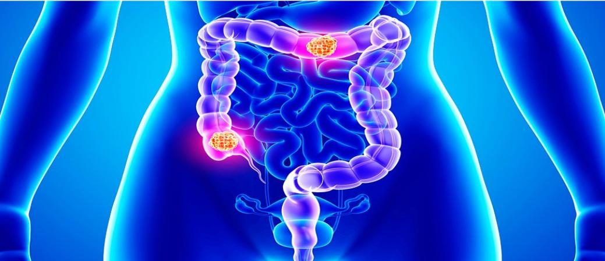
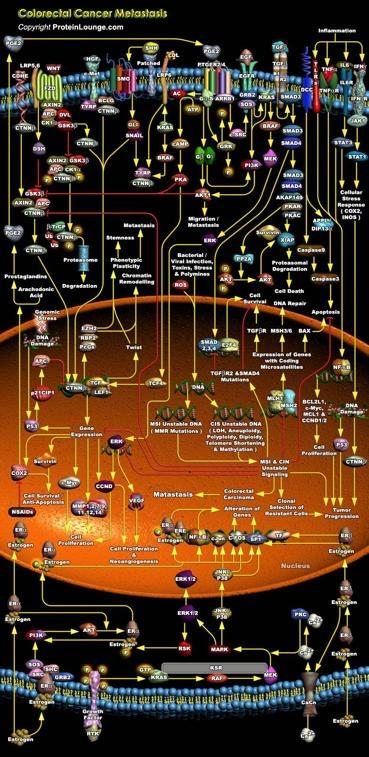
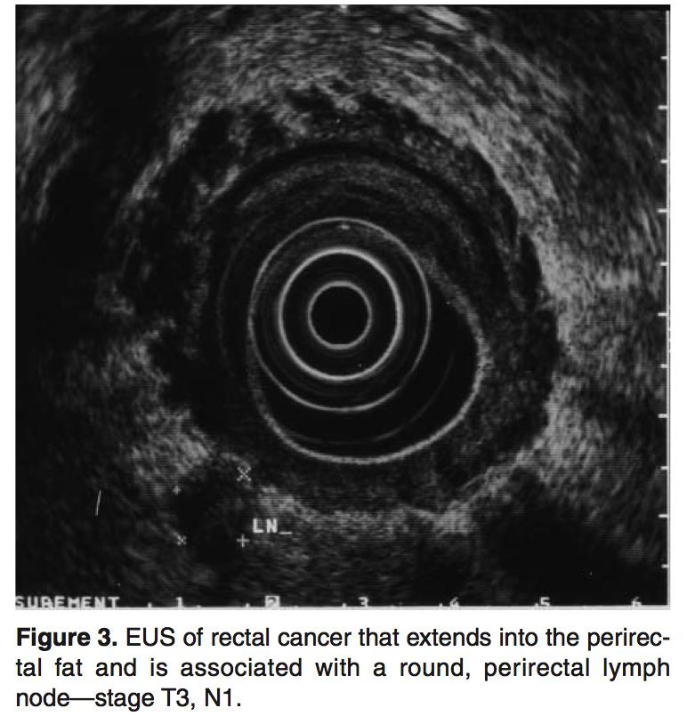
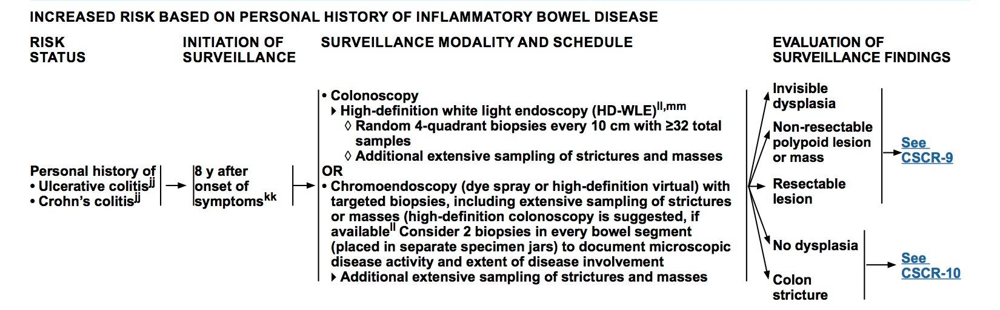
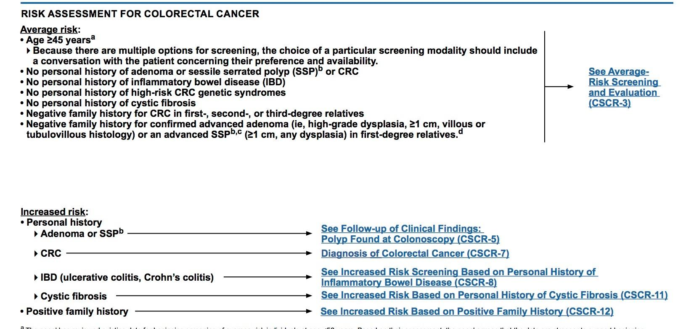

# KOLOREKTAL KANSERLERE YAKLAŞIM

**Hazırlayan:** Dr. Bilgin Demir
**Bölüm:** Aydın Adnan Menderes Üniversitesi Tıp Fakültesi — Medikal Onkoloji Bilim Dalı

---

## İÇİNDEKİLER

1. [Anatomi ve Giriş](#anatomi-ve-giriş)
2. [Etiyoloji ve Risk Faktörleri](#etiyoloji-ve-risk-faktörleri)
3. [Epidemiyoloji ve Kalıtsal Sendromlar](#epidemiyoloji-ve-kalıtsal-sendromlar)
4. [Karsinogenez — Moleküler Mekanizmalar](#karsinogenez--moleküler-mekanizmalar)
5. [Polip-Kanser Sekansı](#polip-kanser-sekansı)
6. [Lynch Sendromu ve HNPCC](#lynch-sendromu-ve-hnpcc)
7. [FAP ve İlişkili Sendromlar](#fap-ve-ilişkili-sendromlar)
8. [İBH ve Kolorektal Kanser Riski](#i̇bh-ve-kolorektal-kanser-riski)
9. [Klinik Prezentasyon](#klinik-prezentasyon)
10. [Tanı](#tanı)
11. [Tümör Belirteçleri](#tümör-belirteçleri)
12. [Sağ vs Sol Kolon Tümörleri](#sağ-vs-sol-kolon-tümörleri)
13. [Yayılım Yolları](#yayılım-yolları)
14. [Evreleme ve Prognoz](#evreleme-ve-prognoz)
15. [Tedavi — Evre Bazlı](#tedavi--evre-bazlı)
16. [Hedefli Tedaviler ve İmmünoterapi](#hedefli-tedaviler-ve-i̇mmünoterapi)
17. [Tarama](#tarama)

---

## ANATOMİ VE GİRİŞ



### Kalın Bağırsak Anatomisi

Kalın bağırsaklar **valvula ileoçekalisten anüse** kadar uzanır ve şu bölümleri içerir:

* **Çekum ve appendiks**
* **Çıkan (assendan) kolon**
* **Transvers kolon**
* **İnen (desendan) kolon**
* **Sigmoid kolon**
* **Rektum**

> **💡 Embriyolojik ayrım — Niçin önemli?** Kolon embriyolojik olarak iki farklı kaynaktan gelir:
>
> * **Sağ kolon (çekum, çıkan kolon, transvers kolonun proksimal 2/3'ü):** **Midgut** kökenli, süperior mezenterik arter beslemeli
> * **Sol kolon (transvers distal 1/3, inen kolon, sigmoid, rektum):** **Hindgut** kökenli, inferior mezenterik arter beslemeli
>
> Bu embriyolojik ayrım **yalnızca akademik bir detay değildir** — sağ ve sol kolon tümörleri **moleküler, klinik ve prognoz** açısından farklılık gösterir. Yani aynı hastalığı aynı şekilde tedavi etme reflexiyle hareket etmek hata olur.

---

## ETİYOLOJİ VE RİSK FAKTÖRLERİ

### Yaşam Tarzı Faktörleri

* **Hayvansal gıdalardan ve yağdan zengin, lifden fakir diyet**
* **Kırmızı ve işlenmiş et** (sosis, salam)
* **Sigara, alkol**
* **Yüksek kolesterol**
* **Sedanter yaşam**
* **Obezite, DM (Tip 2)**

### Coğrafya

* **Gelişmiş ülkelerde gelişmekte olan ülkelere göre daha sık**
* Göçmenlerde 1-2 nesil içinde insidans göç edilen ülkeye yaklaşır → **çevresel faktörlerin belirleyiciliği**

### Hasta Temelli Risk Faktörleri

* **Yaş > 45** (eskiden 50 idi; son 20 yılda 45 yaş altı KRK insidansı artışta)
* **Kişisel KRK, adenom veya sesil serrated polip öyküsü**
* **1. derece akrabada KRK veya yüksek riskli kolon polipi**
* **İBH (ülseratif kolit, Crohn)**
* **Kistik fibrozis** (%10.91 KRK insidansı!)
* **Androjen deprivasyon tedavisi** (prostat kanseri hastaları)
* **Kolesistektomi**
* **Akromegali**
* **Renal transplant** (immünsüpresyon)

### Herediter Sendromlar

Otozomal dominant geçişli kalıtsal sendromlar **KRK'nin %5-10'undan** sorumludur:

* **Familial Adenomatoz Polipozis (FAP)**
* **Lynch Sendromu (HNPCC)**
* **Gardner Sendromu**
* **Turcot Sendromu**
* **Peutz-Jeghers Sendromu**
* **MUTYH ilişkili polipozis**

### Koruyucu Faktörler

* **Fiziksel aktivite**
* **Akdeniz diyeti, lifli gıda alımı**
* **Folik asit, B6 vitamini**
* **Kalsiyum ve D vitamini**
* **Magnezyum**
* **Balık, sarımsak, kahve**

**İlaçlar (koruyucu etki bildirilmiş):**

* **Aspirin ve NSAİİ** — en güçlü kanıt; özellikle **Lynch sendromunda KRK riskini azaltır**
* **Hormon replasman tedavisi** (postmenopozal)
* **Statinler**
* **Bifosfonatlar**
* **Antioksidanlar**
* **Anjiotensin II inhibitörleri**
* **Erlotinib**

> **💡 Aspirin ve KRK önleme:** CAPP2 ve meta-analizler gösterdi ki düşük doz aspirin (75-325 mg/gün) **uzun süreli** kullanıldığında KRK riski ve mortaliteyi azaltır. Bu etki **özellikle Lynch sendromlu hastalarda** belirgindir. Mekanizma: COX-2 inhibisyonu + Wnt sinyaline müdahale. Ancak **kanama riski** nedeniyle rutin önerilmez — sadece KV endikasyon + KRK riski birlikteyse düşün.

---

## EPİDEMİYOLOJİ VE KALITSAL SENDROMLAR

### Hastalık Dağılımı

| Grup | Oran |
|---|---|
| **Sporadik KRK** | **~%85** |
| **Ailesel KRK sendromları** | **%10-15** |

### Ailesel KRK Sendromları

1. **Familial Adenomatoz Polipozis (FAP)**
    * Klasik FAP
    * Gardner sendromu
    * Turcot sendromu
2. **Herediter Non-Polipozis Kolon Kanseri (HNPCC / Lynch sendromu)**

> **📝 Kavramsal sıralama:** "KRK'si olan her 10 hastadan ~1'i kalıtsal bir sendroma sahiptir" diye düşün. Aile öyküsü + erken yaş + birden çok tümör tipi uyarı işaretleridir. Bu hastaları tanımak **sadece hastayı tedavi etmek değil, aileyi de korumak** için kritiktir.

---

## KARSİNOGENEZ — MOLEKÜLER MEKANİZMALAR

Kolorektal karsinogenez 3 ana yol üzerinden ilerler:

### 1) Adenom-Karsinom Sekansı

Normal mukoza → **APC mutasyonu** → erken adenom → **KRAS mutasyonu** → ileri adenom → **18q LOH / SMAD4 kaybı** → **TP53 mutasyonu** → karsinom

Bu klasik Fearon-Vogelstein modelidir. Genellikle **10 yıl** gibi uzun bir zaman alır.

### 2) Genomik ve Epigenomik İnstabilite

* **Kromozomal instabilite (CIN)** — %70-85
* **Mikrosatellit instabilite (MSI)** — %15
* **CpG adacık hipermetilasyonu (CIMP)** — serrated yolak

### 3) Hücre İçi Moleküler Yolaklar

* **Wnt sinyal yolağı** (APC)
* **TGF-β sinyal yolağı**
* **18q LOH** (DCC geni)
* **TP53**
* **EGFR sinyali**
* **PI3K sinyali**

> **💡 Üç yol, üç farklı klinik profil:**
>
> * **CIN yolağı:** Sol kolon, sporadik, klasik patern, RAS/BRAF mutasyonu yaygın
> * **MSI yolağı:** **Sağ kolon**, genellikle **Lynch sendromu** veya sporadik BRAF+, **daha iyi prognoz**, **immünoterapiye dramatik yanıt**
> * **CIMP yolağı:** Sesil serrated polip → sağ kolon, BRAF mutasyonu, MSI ile birlikte olabilir
>
> Bu üç yolağı bilmek, günümüz KRK tedavisinin moleküler çağına girişinin anahtarıdır. Moleküler profil **tedaviyi belirler**, anatomik evre tek başına yeterli değildir.

---

## POLİP-KANSER SEKANSI

**Kolorektal kanserlerin önemli bir bölümü kolonda daha önce bulunan adenomlardan kaynaklanır.** Bu nedenle poliplerin erken saptanması ve çıkarılması KRK önlemenin temelidir.

> **⭐ Temel prensip:** "Adenom çıkarsa kanser gelişemez" — **KRK taramasının bilimsel temeli budur**. Bu yüzden kolonoskopi hem **tarama** hem **önleme** aracıdır (aynı cihazla polipi görüp çıkarabildiğiniz için).

### Polip Morfolojisi

* **Pedunculated (saplı)**
* **Sessile (sapsız)** — çıkarması daha zor
* **Sessile serrated adenom** (son yıllarda tanımlanan, önemli bir prekürsör)

### Polipler — Sınıflama

**Neoplastik olmayan polipler:**

* İnflamatuar
* Hamartomatöz
* Submukozal (lenfoid polip, lipom)
* **Hiperplastik** (eskiden benign kabul ediliyordu; şimdi serrated varyantları önemli bir prekürsör olarak görülüyor)

**Neoplastik polipler (adenomatöz):**

| Tip | Oran | Kanserleşme Riski |
|---|---|---|
| **Tubular** | %65-80 | **Düşük** |
| **Tubulovillöz** | %10-25 | Orta |
| **Villous** | %5-10 | **En yüksek** |

### Polip Boyutu ve Kanserleşme Riski

| Polip Boyutu | Kanserleşme Riski |
|---|---|
| **&lt; 1 cm** | **&lt; %5** |
| **> 1 cm** | 10 yılda **~%10**, 20 yılda **~%25** |
| **> 1 cm** (yıllık risk) | %3 |
| **Villöz adenom** | **%12** |
| **Şiddetli displazili adenom** | **%37** |

> **💡 "1 cm" eşiği neden kritik?** 1 cm altında olan tubuler adenomlarda risk artışı **belirgin değildir** — çoğu asla kansere dönmez. 1 cm üzerinde, özellikle **villöz patern + nükleer atipi + displazi** varsa risk dramatik artar. Kolonoskopide raporun "4 mm tubuler adenom" olması ile "2 cm villöz adenom, high-grade displazi" olması **tamamen farklı klinik senaryolardır** — birincisi 10 yıl sonra kontrol, ikincisi 6-12 ay sonra tekrar + yakın izlem demektir.

> **📝 "10 yıl kuralı":** Normal bir adenomun kansere dönüşmesi için **yaklaşık 10 yıl** gerekir. Bu yüzden **10 yılda bir kolonoskopi** yeterli sayılmaktadır (düşük riskli kişilerde). Kolonoskopi ile pratik olarak **karsinogenezin önüne geçilebilir bir süreç** oluşuyor — bu yüzden KRK "önlenebilir bir kanser" sayılır.

---

## LYNCH SENDROMU VE HNPCC

### Moleküler Temel

**Lynch sendromu (HNPCC)**, **DNA mismatch repair (MMR)** genlerinde germline mutasyonla karakterize otozomal dominant bir sendromdur:

* **MLH1**
* **MSH2**
* **MSH6**
* **PMS2**
* **EPCAM** (MSH2'yi indirekt etkiler)

### MSI Kavramı

**Mikrosatellitler**, DNA boyunca kısa tekrarlanan dizilerdir. MMR defektinde bu diziler replikasyon sırasında hata yapar → uzar/kısalır → **mikrosatellit instabilitesi (MSI)**.

| Durum | Tanım |
|---|---|
| **MSS (Mikrosatellit Stabil)** | Hiçbir belirteçte instabilite yok |
| **MSI-Low** | Sadece **1 belirteçte** instabilite |
| **MSI-High (MSI-H)** | **2 veya daha fazla** belirteçte instabilite |

**MSI tespit yöntemleri:**

* **PCR**
* **İmmünohistokimya (IHC)** — MMR protein eksikliğini gösterir

### Lynch vs Sporadik MSI

| Özellik | Lynch Sendromu | Sporadik MSI-H KRK |
|---|---|---|
| **Mekanizma** | **Germline MMR mutasyonu** | **MLH1 promoter hipermetilasyonu** |
| Yaş | Genç | İleri yaş (>60) |
| Lokalizasyon | Sağ kolon yoğun | Sağ kolon |
| BRAF mutasyonu | **Yok** | **Sık (%70)** |
| Aile öyküsü | **Var** | Yok |
| Tarama/Kan izlemi | Aile taraması şart | Rutin değil |

> **💡 BRAF ayrım çok değerli:** Sporadik MSI-H tümörlerde **BRAF V600E** mutasyonu sıktır. Lynch sendromunda BRAF genellikle **negatiftir**. Bu yüzden kolonoskopide MSI-H saptanan bir tümörde **BRAF mutasyonu pozitifse Lynch ihtimali düşüktür**. Bu, gereksiz genetik test ve aile taramalarını önler.

### Amsterdam II Kriterleri (Lynch Tanısı)

* **En az 3 akraba** Lynch-ilişkili kansere sahip (kolorektal, endometrium, ince barsak, üreter/renal pelvis)
* **Biri diğer ikisinin 1. derece akrabası**
* **En az 2 ardışık nesil** etkilenmeli
* **En az birine 50 yaşından önce** tanı
* **FAP** ekarte edilmiş olmalı
* Tümörler patolojik olarak doğrulanmalı

> **📝 Yeni yaklaşım — Universal screening:** Günümüzde, 70 yaşın altındaki TÜM KRK hastalarında MSI/IHC testi yapılması önerilir. Amsterdam kriterleri çok kısıtlayıcıdır ve Lynch hastalarının bir kısmını atlar. Universal screening ile Lynch olguları erken tespit edilir ve aile taraması yapılır.

### HNPCC Klinik Özellikler

* **Otozomal dominant**
* **Erken yaşta** (ortalama 44-49 yaş)
* **Proksimal barsak tutulumu baskın** (sağ kolon)
* **%18 senkron kolon kanseri** (aynı anda iki tümör)
* **10 yıl içinde metakron lezyon** (farklı zamanlarda farklı tümörler)
* **Tedavi:** **Subtotal kolektomi** tercih edilir (çünkü tekrar riski yüksek)
* Aynı evredeki **sporadik kanserlere kıyasla daha iyi prognoz**
* **Kolonoskopi izlemi:** **18 yaşından itibaren 1-2 yılda bir** (veya ailede en genç kanser olgusunun yaşından 10 yıl önce)

### Lynch Sendromunda Diğer Kanser Riskleri



| Tümör | Ömür Boyu Risk |
|---|---|
| **Kolorektal** | **%46-61** |
| **Endometrium** | **%34-54** |
| **Over** | %4-20 |
| **Üreter/renal pelvis** | %0.2-5 |
| **Mide** | %5-7 |
| **İnce bağırsak** | %0.4-11 |
| **Prostat** | %4.4-13.8 |
| **Meme (kadın)** | %10.6-18.6 |
| **Beyin, pankreas, safra yolu, deri** | Artmış |

> **💡 Lynch sendromu ≠ "sadece kolon"**. Aile hikâyesinde ilginç bir kombinasyon görürsen (kolon + endometrium veya kolon + üreter) mutlaka Lynch ekarte et. Kadın bir Lynch hastasında **endometrium kanseri riski kolonla eşit veya daha yüksek** olabilir — bu yüzden histerektomi + oforektomi risk azaltıcı seçenektir.

---

## FAP VE İLİŞKİLİ SENDROMLAR

### Familial Adenomatoz Polipozis (FAP)

**Genetik temel:** **APC geni** (adenomatosis polyposis coli) germline mutasyonu. Otozomal dominant.

**Tanı kriterleri:**

* **100'den fazla adenomatöz polip** veya
* **Ailede FAP + adenomatöz polip** gelişmişse

**Özellikler:**

* Tüm KRK'nin **~%1'i**
* Ortalama görülme yaşı **29**, **39'da malignleşir**
* **Tedavi edilmezse MUTLAKA malignite gelişir**
* **%10-20'sinde spontan mutasyon** (aile öyküsü yok ama yine de FAP)

> **⚠️ Profilaktik cerrahi:** FAP'ta adenomatöz polipler 20'li yaşlarda yüzlerce-binlerce olarak çıkar. Her birinin kansere dönme olasılığı vardır. Bu yüzden **profilaktik total proktokolektomi** standardır — genellikle 20-25 yaş arası. Cerrahi sonrası ileoanal anastomoz (J-pouch) ile kontinans korunur.

### FAP Varyantları

**1) Klasik FAP** — 100+ polip, kolon ağırlıklı

**2) Gardner Sendromu** = FAP + **ekstra-intestinal tümörler:**

* **Epidermal inklüzyon kistleri**
* **Kemik osteomaları** (mandibula, kafatası)
* Desmoid tümörler
* **Tiroid kanseri**
* Retinal pigment epitel hipertrofisi (CHRPE)

**3) Turcot Sendromu** = FAP + **beyin tümörleri:**

* **Medulloblastom** (genelde APC mutasyonu ile)
* **Glioblastom** (genelde MMR mutasyonu ile)

> **💡 Hafızaya "Turcot → beyin, Gardner → kemik/kist" diye yerleştir.** İkisi de FAP üzerinde ekstra özelliklerdir. Ders sınavlarında klasik eşleştirme sorusu olarak gelir.

### Peutz-Jeghers Sendromu

* **STK11/LKB1** mutasyonu
* **Mukokutanöz pigmentasyon** (dudak, ağız içi, parmak uçları)
* **Hamartomatöz polipler** (jejunum ve ileum yoğun)
* Kanser riski: KRK, mide, pankreas, meme, over, serviks, testis

> **💡 Klinik görsel hafıza:** "Ağzında karabiber lekeleri + ailede poliplere bağlı invaginasyon öyküsü = Peutz-Jeghers". Çocuklukta invaginasyon ile başvurabilir. Hamartomatöz polipler **neoplastik değildir** ama yine de kanser riski artar.

---

## İBH VE KOLOREKTAL KANSER RİSKİ

### Ülseratif Kolit

* **10 yıldan sonra** kanser gelişme riski **her yıl %1** artar
* **20 yıldan sonra** kümülatif risk **~%20**
* Biyopside **displazi** saptanırsa kanser gelişme riski **%30**
* Ülseratif kolit zemininde gelişen kanserlerin **%35'i Evre III-IV** — ileri evrede yakalanır

### Crohn Hastalığı

* 20 yılda KRK gelişme riski **~%7**
* Sıklıkla **darlık bölgelerinde**
* **Kronik fistül traktuslarında** skuamöz veya adenokarsinom

### İBH'de Tarama

> **⭐ Altın kural:** **Hastalık süresi 8-10 yılı geçtikten sonra** yıllık veya 2 yılda bir kolonoskopi + çoklu biyopsi ile **displazi araması** yapılır. Displazi saptanırsa kolektomi.

> **💡 Niçin İBH'de kanser agresif?** Çünkü inflamasyon zemininde gelişen tümörler klasik polip-kanser sekansını izlemez — **düz, infiltre**, **multifokal** olabilirler. Kolonoskopide gözden kaçabilirler. Bu yüzden rastgele biyopsi ve chromoendoscopy gibi ek teknikler kullanılır.

---

## KLİNİK PREZENTASYON

### Lokalizasyona Göre Farklı Semptomlar

```
   SAĞ KOLON                    SOL KOLON / REKTUM
   (geniş lümenli)              (dar lümenli)

   • Gizli kan                  • Obstrüksiyon
   • Melena                     • Konstipasyon
   • Demir eksikliği anemisi    • Hematokezya
   • Sessiz seyir               • Tenesmus
                                • Dışkılama alışkanlığında değişiklik
```

### Rektosigmoidal Tümörler

* **İlk belirti:** **Dışkılama alışkanlığında değişiklik**
* Konstipasyon / ishal
* **Rektal kanama** (parlak kırmızı)
* **Tenesmus** (dışkılama sonrası dolu hissetme)

### Sol Kolon Tümörleri

* **Obstrüksiyon** — kolonda obstrüksiyonun **en sık nedeni** — **kolik ağrı**
* Barsak alışkanlığında değişiklik

### Sağ Kolon Tümörleri

* **Gizli kanama** — sessiz
* **Demir eksikliği anemisi** — ileri yaştaki bir erkekte IDA varsa **KRK tara**
* Asemptomatik kitle

### Geç Dönem Bulguları

* **Kilo kaybı**
* Abdominal kitle
* **Fistülizasyon** (vezikokolik, enterokütan)
* **Perforasyon → peritonit**

### Komplikasyonlar

* **En sık: İleus**
* **Prognozu en kötü: Perforasyon**
* Fistül

> **💡 Niçin sağ sessiz, sol gürültülü?**
>
> Sağ kolonda lümen **geniştir** ve dışkı **sıvı kıvamındadır** → tümör obstrüksiyon yapmadan önce büyüyebilir. Kanar ama bu kan sindirim ile değişir → **melena veya gizli kan**. Hasta yıllarca farkında olmaz, sonunda IDA ile gelir.
>
> Sol kolonda lümen **dardır** ve dışkı **katıdır** → tümör erken dönemde obstrüksiyon yapar, dışkı alışkanlığını değiştirir, taze kanama verir. Hasta hızlı hekime gelir.
>
> Bu yüzden "**60 yaşında bir erkekte açıklanamayan IDA = aksi kanıtlanana kadar sağ kolon kanseri**" kuralı geçerlidir. Demir tedavisi başlamadan önce kolonoskopi yap.

---

## TANI

### Tanı Yöntemleri

**1. Baryumlu Grafi**

* Günümüzde nadir kullanılır
* "Apple core" (elma çekirdeği) görünümü → darlık lehine

**2. Kolonoskopi — Altın Standart**

* Hem **tanı** hem **tedavi** (polipektomi)
* **Biyopsi** alımı
* Total kolon değerlendirmesi
* Tüm pozitif tarama testlerinde doğrulama için yapılır

**3. Transrektal USG (TRUS)**



* **Rektum kanserinde lokal evreleme** için kullanılır
* T evresi (duvar invazyon derinliği) ve N (perirektal LN) değerlendirilir

**4. Bilgisayarlı Tomografi (BT)**

* **Abdominal ve pelvik metastazları** gösterir
* **Üriner trakt** değerlendirmesi
* Yandaş patolojiler
* **Nüks aramada** yararlıdır
* **BT-anjiyogram:** Karaciğer metastazında sensitivite **%95**
* Rektal duvar invazyonu doğruluğu **%90**

**5. MR**

* Tümör vs normal doku vs **fibrotik skar ayırımında** iyi
* **Karaciğer metastazlarında BT'den daha duyarlıdır**
* Kolon kanserinde BT'ye üstünlüğü yoktur
* **Rektal kanserde lokal yayılımı en iyi gösteren yöntem**
* **Preoperatif neoadjuvan KT-RT kararında** rektum MR kritiktir

**6. PET/BT**

* Nüks ve uzak metastaz araştırmasında
* Belirsiz vakalarda karar verme

> **💡 Kolon vs Rektum — görüntüleme farkı:**
>
> * **Kolon kanseri:** BT yeterli. Lokal invazyon o kadar kritik değildir, çünkü tedavi cerrahi.
> * **Rektum kanseri:** **MR şart** — çünkü sfinkter koruma + neoadjuvan tedavi kararı buna bağlı. Rektum MR'da mesorektal fasya tutulumu, ekstramural venöz invazyon, sfinkter ilişkisi net görülür.
>
> Bu ayrım yalnız akademik değil, tedavi planlamasının temelidir.

---

## TÜMÖR BELİRTEÇLERİ

### CEA (Karsinoembriyojenik Antijen)

* **Protein yapısında**
* Fetusta bulunur
* Yetişkinde intestinal polip, kolonik inflamatuar mukoza ve çocuklarda normal intestinal mukozada var
* **KRK belirteci** — ancak **tarama değeri yok**
* Meme, karaciğer, akciğer kanserinde de yükselebilir
* **Yükselebilen non-malign durumlar:** sigara, siroz, pankreatit, üremi, peptik ülser, intestinal metaplazi, ülseratif kolit

**CEA'nın Klinik Kullanımı:**

1. **Preoperatif bakım:** Yüksek CEA = daha yüksek nüks riski öngörür
2. **Postop takip:** 3 ayda bir CEA bakılır; yükselme nüks işaretidir
3. **Metastatik hastalıkta tedavi yanıtı** takibi

> **💡 CEA'yı tarama için kullanma!** Yanlış pozitifler çok fazladır (sigara, iyi huylu durumlar) ve yanlış negatifler erken kanseri atlatır. **CEA takip markeridir, tanı markeri değil.** Ama postop izlemde paha biçilmezdir: her 3 ayda artıyorsa, görüntüleme normal bile olsa nüks için tetikte ol.

### CA 19-9

* İnsan KRK hücrelerine karşı geliştirilmiş monoklonal antikor
* Antijene spesifik değildir
* **Pankreas, safra kesesi, mide mukozasında** da bulunur
* **Nüksü haber vermede CEA'ya üstünlüğü yoktur**
* KRK'de CEA kadar kullanılmaz

> **📝 CA 19-9'un asıl yeri: pankreas kanseri.** KRK'de rutin istenmez.

---

## SAĞ VS SOL KOLON TÜMÖRLERİ

Son yıllardaki moleküler çalışmalar, sağ ve sol kolon tümörlerinin **farklı hastalıklar** gibi davrandığını göstermiştir.

| Özellik | **Sağ Taraf Tümörler** | **Sol Taraf Tümörler** |
|---|---|---|
| **Yaş** | **Yaşlı** hastalar | **Genç** hastalar |
| **Cinsiyet** | **Kadın** daha sık | Erkek |
| **Moleküler profil** | **MSI-H** daha sık, **BRAF/KRAS/PI3KCA** mutasyonu | **WT (wild-type)** ağırlıklı, **HER2 artışı**, **AREG/EREG yüksek** |
| **Prognoz** | **Daha kötü** | **Daha iyi** |
| **EGFR inhibitöre yanıt** | **Zayıf/yok** (KRAS mt veya sinyalizasyon farkları) | **İyi** (RAS WT hastalarda) |
| **Klinik prezentasyon** | Gizli kan, IDA, sessiz | Obstrüksiyon, hematokezya |

> **⭐ Klinik pearl — EGFR inhibitörü tercihi:** Metastatik KRK'de **RAS WT + sol kolon** tümörlerde **setuksimab/panitumumab (anti-EGFR)** dramatik fayda sağlar. **Sağ kolon** tümörlerinde RAS WT olsa bile aynı etki gözlenmez. Bu yüzden moleküler test + **lokalizasyon** birlikte tedavi seçiminde belirleyicidir.

> **💡 Hafızada tutma ipucu:** "**Sağ = Sessiz Senil kadın, MSI+, BRAF+**". "**Sol = Semptomatik genç erkek, HER2+, RAS WT**". Bu iki paterni unutma.

---

## YAYILIM YOLLARI

1. **Lenfatik (en sık)** — %25-40 hastada tanı anında mevcut
2. **Hematojen** — sırasıyla **1) Karaciğer 2) Akciğer**
3. **Direk invazyon** — tam kat ulaşmış invazyonlu hastaların **yarısında LN metastazı** var
4. **İmplantasyon** (peritoneal karsinomatoz, "drop metastazı")

### Niçin Karaciğer En Sık?

Kolon ve rektumun venöz drenajı **portal ven sistemi** üzerindendir → ilk filtre karaciğerdir → hematojen yayılımda **karaciğer birinci duraktır**.

> **💡 İstisna — Distal rektum:** Rektumun alt 1/3'ü **inferior rektal ven → iliak ven → VCI** yoluyla sistemik dolaşıma drene olur, portal sistemi atlar. Bu yüzden alt rektum kanserleri doğrudan **akciğere** metastaz yapabilir, karaciğer ikinci sırada olabilir. Hasta "bel ağrısı + nefes darlığı" ile gelirse rektum altı kanser akla gelmeli.

### Klinik Anlamı

* Karaciğer metastazı olan hastalarda **metastaz rezeksiyonu** seçeneğini değerlendir — %20-40 5 yıllık sağkalım
* İzole akciğer metastazlarında da **metastazektomi** sağkalım artırır
* Peritoneal karsinomatoz prognozu kötü, ancak **sitoredüktif cerrahi + HIPEC** seçilmiş hastalarda uygulanır

---

## EVRELEME VE PROGNOZ

### AJCC / TNM Evrelemesi (Özet)

| Evre | TNM | Tanım |
|---|---|---|
| **Evre 0** | Tis | Karsinoma in situ |
| **Evre I** | T1-2, N0, M0 | Submukoza veya kas tabakasına sınırlı |
| **Evre IIA** | T3, N0, M0 | Subseroz/perikolik dokuda |
| **Evre IIB** | T4a, N0, M0 | Visseral periton |
| **Evre IIC** | T4b, N0, M0 | Komşu organ invazyonu |
| **Evre IIIA-C** | Her T, N1-2, M0 | Bölgesel LN tutulumu |
| **Evre IVA** | Her T, Her N, M1a | 1 organ veya bölge |
| **Evre IVB** | Her T, Her N, M1b | >1 organ/peritoneal met |
| **Evre IVC** | Her T, Her N, M1c | Peritoneal karsinomatoz |

### Kötü Prognostik Kriterler

* **TNM ileri evre** — T4, **12'den az LN diseksiyon**
* **Az diferansiye tümör** (yüksek grade)
* **Rezidüel tümör** (pozitif cerrahi sınır)
* **Müsinöz veya yüzük hücreli tip**
* **Vasküler veya perinöral invazyon**
* **Barsak perforasyonu**
* Düşük tümör regresyon gradı (neoadjuvan sonrası)
* **Preoperatif CEA yüksekliği**
* **MSI** — ilginçtir, MSI-H evre II'de **iyi prognoz**, ama evre III'te eşit veya hafif iyi
* **18q allel kaybı** (DCC geni)
* **KRAS, NRAS, BRAF mutasyonu**
* **Sağ kolon yerleşimi**

> **💡 "12 LN kuralı":** Cerrahi patoloji raporunda **en az 12 lenf nodu** incelenmiş olmalıdır. Bu hem doğru evreleme için (mikroskopik metastaz gözden kaçmasın diye) hem de **adjuvan kemoterapi kararı** için gereklidir. 12'den az LN → "inadequate staging" → N0 olarak kabul edemezsin → adjuvan KT düşünmek gerekebilir.

> **📝 MSI-H'nin evre II paradoksu:** Evre II MSI-H KRK'de **5-FU adjuvan KT fayda sağlamaz** (hatta zararlı olabilir). Bu yüzden evre II hastada MSI-H saptanırsa adjuvan tedavi kararı farklılaşır — genellikle gözlem önerilir. Bu tedavi kararını moleküler profil belirler.

---

## TEDAVİ — EVRE BAZLI



### Genel İlkeler

* **Evre I:** Cerrahi rezeksiyon yeterli
* **Evre II:** Cerrahi ± adjuvan KT (yüksek riskli özelliklere göre)
* **Evre III:** Cerrahi + **adjuvan kemoterapi** (standart)
* **Evre IV:** Palyatif KT ± hedefli tedavi ± metastazektomi
* **Radyoterapi:** Rektumda neoadjuvan veya adjuvan — **kolonda yeri yok**
* **Kolonda neoadjuvan KT veya RT yeri yoktur** — direkt cerrahi

### Kolon Kanseri — Evre Spesifik

**Evre I (T1-2, N0, M0):** Sadece cerrahi rezeksiyon

**Evre II (T3-4, N0, M0):** Cerrahi; **yüksek riskli** özellikler varsa adjuvan KT:

* T4
* &lt;12 LN
* Perforasyon
* Obstrüksiyon
* Az diferansiye
* Lenfovasküler veya perinöral invazyon
* **Not:** MSI-H olan evre II hastada adjuvan KT verilmez

**Evre III (N+, M0):** **Standart adjuvan KT şart:**

* **FOLFOX** (5-FU + lökovorin + oksaliplatin)
* **CAPOX** (kapesitabin + oksaliplatin)
* 6 ay standart (düşük risklide 3 ay)

**Evre IV (M+):** Palyatif sistemik KT + hedefli tedavi

### Rektum Kanseri — Farklı Yaklaşım

**Lokalize rektum kanseri (T3-4 veya N+):**

> **⭐ Total neoadjuvant therapy (TNT) yaklaşımı:** Günümüzde rektum kanseri için **neoadjuvan KT + RT → cerrahi → adjuvan KT** şeklinde bir sıralama tercih edilir. Hatta bazı hastalarda **"watch and wait"** stratejisi ile cerrahi atlanabilir (tam klinik yanıt olursa).

**Klasik rejim:**

* **Uzun süreli RT (5.5 hafta) + 5-FU** (neoadjuvan)
* Sonra **total mezorektal eksizyon (TME)** cerrahisi
* **Adjuvan KT** (FOLFOX)

> **💡 Niçin rektumda RT var, kolonda yok?** Çünkü:
>
> * **Rektum pelvis içinde sabit bir organ** — radyasyon odağı belirgin
> * **Rektum etrafında mesorektal fasya** önemli bir anatomik sınır — cerrahi bile buranın temiz olmasına bağlı
> * **Lokal nüks riski yüksek** (sfinkter koruma + dar cerrahi alan)
>
> Kolon ise:
>
> * **Peristaltik, hareketli** — RT hedefi güç
> * **İnce bağırsak çok yakın** — radyasyon toksisitesi tehlikeli
> * **Lokal nüks riski düşük**
>
> Bu yüzden tedavi paradigmaları bambaşkadır.

---

## HEDEFLİ TEDAVİLER VE İMMÜNOTERAPİ

### EGFR ve VEGFR Sinyal Yolakları

Metastatik KRK tedavisinde iki ana hedef vardır:

**1) EGFR yolağı (anti-EGFR):**

* **Setuksimab, panitumumab**
* **Sadece RAS WT (wild-type) hastalarda etkili**
* **Sol kolon tümörlerinde** en iyi yanıt
* Cilt toksisitesi (akneiform döküntü), hipomagnezemi

**2) VEGF yolağı (anti-anjiogenez):**

* **Bevasizumab, ramusirumab, aflibersept**
* **RAS durumundan bağımsız** kullanılabilir
* Perforasyon, tromboemboli, HT, yara iyileşmesi bozukluğu, proteinüri

> **⭐ Klinik kural:** Metastatik KRK'de **HER zaman** önce:
>
> 1. **RAS mutasyonu** (KRAS, NRAS ekson 2, 3, 4)
> 2. **BRAF mutasyonu**
> 3. **MSI durumu**
> 4. **HER2** (seçilmiş hastalarda)
>
> test edilmelidir. Bu test sonuçları **tedaviyi belirler**.

### KRAS/NRAS Mutasyonu

* **KRAS veya NRAS mutant** hastalarda **anti-EGFR ilaçları işe yaramaz** (hatta zararlı)
* RAS sinyal yolağı EGFR'den **aşağıda** → EGFR'yi kesmek RAS'ı durduramaz
* RAS mutant hastalarda VEGF inhibitörü (bevasizumab) standart tercih

### BRAF V600E Mutasyonu

* KRK'nin ~%8-10'unda
* **Kötü prognoz** belirteci
* **Sporadik MSI-H ile ilişkili**
* Klasik tedavilere yanıt kötü

**BRAF V600E Tedavisi:**

* **Encorafenib (BRAF inhibitörü) + setuksimab (anti-EGFR)** — 2. basamak standart
* Üçlü kombinasyonlar (BRAF + MEK + EGFR inhibitörü) araştırma aşamasında

> **💡 Niçin BRAF mutant KRK'de BRAF inhibitörü tek başına yetmez?** Çünkü BRAF inhibisyonu paradoksal olarak **EGFR aktivasyonunu** uyarır (feedback) → tümör yeniden sinyal alır. Bu yüzden **EGFR blokajı eklenmelidir**. Melanomdaki BRAF tedavisinden farklı — melanomda EGFR yok.

### Checkpoint İnhibitörleri — MSI-H/MMRD KRK

> **⭐ Dramatic yanıt:** MSI-H veya MMR-deficient (MMRD) KRK, **immünoterapiye çarpıcı yanıt verir**. Bunun sebebi yüksek mutasyon yükü → bol neoantijen → bağışıklık sistemi için "görünür" tümör.

**Onaylı ajanlar (MSI-H/MMRD için):**

* **Pembrolizumab** (anti-PD-1)
* **Nivolumab** (anti-PD-1)
* **Nivolumab + İpilimumab** (anti-PD-1 + anti-CTLA-4)

**Endikasyon:**

* Floropirimidin, oksaliplatin ve irinotekan sonrası ilerlemiş MSI-H/MMRD KRK
* Ayrıca **1. basamakta** da MSI-H hastalarda pembrolizumab onaylıdır (KEYNOTE-177)

**Önemli:** MSS (mikrosatellit stabil) KRK immünoterapiye **yanıt vermez** — bu yüzden MSI testi şart.

> **💡 "Görünür vs görünmez tümör":** MSI-H tümörler DNA tamir mekanizması bozuk olduğu için **çok fazla mutasyon birikir** → çok fazla anormal protein (neoantijen) üretir → T hücreleri bunları yabancı olarak tanır. Immünoterapi (PD-1/CTLA-4 blokajı) T hücrelerinin frenini çeker → saldırı başlar. MSS tümörler sessiz, az mutasyonlu → bağışıklık sistemi tarafından tanınmaz → frenleri çekmek bir şey değiştirmez. Bu mantık KRK dışındaki tüm tümörlerde de geçerlidir (melanom, akciğer, vb).

### Kemoterapi Ajanları

**Temel omurgalar:**

* **5-Fluorourasil (5-FU)** + **Lökovorin**
* **Kapesitabin** (oral 5-FU prodrug)
* **Oksaliplatin** (FOLFOX, CAPOX)
* **İrinotekan** (FOLFIRI)

**Kombinasyonlar:**

* **FOLFOX:** 5-FU + LV + oksaliplatin
* **FOLFIRI:** 5-FU + LV + irinotekan
* **FOLFOXIRI:** Üçü birden (agresif)
* **CAPOX / XELOX:** Kapesitabin + oksaliplatin

### Kişiselleştirilmiş Tedavi

```
  KOLON KANSERİ 1 HASTALIK DEĞİL!

  Moleküler           Anatomik
  ─────────           ────────
  MSI vs MSS          Sağ vs Sol vs Rektum
  RAS WT vs Mutant    Yaş (genç vs yaşlı)
  BRAF WT vs Mutant   Dışkı flora türleri
  HER2 durumu
```

Her hasta için tedavi bu faktörlerin kombinasyonuyla seçilir.

---

## TARAMA



### Tarama Amaçları

* Semptom olmadan kanser değerlendirmesi
* **Erken tanı** → küratif pencere
* **Mortaliteyi azaltmak**

### Tarama Yöntemlerinin Handikapları

* Komplikasyonlar (kolonoskopi → perforasyon, kanama)
* **Yalancı pozitiflik** → anksiyete, ekstra tetkikler, komplikasyonlar
* **Yalancı negatiflik** → gecikmiş tanı

### Tarama Başlangıç Yaşı

* **USPSTF önerisi: 45 yaş** (eskiden 50 idi; 2021'de revize edildi)
* **Aile öyküsü, İBH, kistik fibrozis olanlarda** 45 yaştan önce
* **FAP:** 10-12 yaşta kolonoskopi
* **Lynch:** 20-25 yaş veya ailedeki en genç tanı yaşından 10 yıl önce

### KETEM (Türkiye) Önerileri

* **50-70 yaş arası**
* **Gaitada gizli kan → 2 yılda 1**
* **Kolonoskopi → 10 yılda 1**
* **Risk faktörü varsa** → 40 yaşta başlar

### Tarama Yöntemleri

**1) Gaita Bazlı Testler**

* **Guaiac FOBT (gFOBT):** Hemoglobin temelli; mortalite azalması %15-33
* **Fekal immünohistokimyasal test (iFOBT/FIT):** Daha duyarlı ve özgül
* **Cologuard (Multitarget stool DNA):** FIT + APC/KRAS/TP53 mutasyonları; **hem kanser hem polip** için duyarlı (%92)

**2) Sigmoidoskopi**

* Rektum ve aşağı kolonu görür
* **Mortalite azalması ~%60-70**
* Distal lezyonlar için yeterli

**3) Kolonoskopi — ALTIN STANDART**

* **Rektum + tüm kolonu** görür
* **Hem tarama hem tedavi** (polipektomi)
* **Mortalite azalması %60-70**

**4) Sanal (BT) Kolonoskopi**

* Sedasyon gerektirmez
* Polip saptama olasılığı benzer
* Polip bulunursa yine **kolonoskopi + biyopsi** gerekir
* Sağkalım avantajı net değil

### Tarama Öneri Özeti

| Grup | Öneri |
|---|---|
| **Ortalama risk** | 45 yaştan itibaren kolonoskopi (10 yılda bir) veya FIT (yıllık) |
| **Aile öyküsü (1. derece &lt;60 yaş)** | 40 yaşta veya akrabanın yaşından 10 yıl önce |
| **Lynch** | **20-25 yaş, 1-2 yılda bir** |
| **FAP** | **10-12 yaş, yıllık** |
| **İBH** | 8 yıl hastalık sonrası, 1-2 yılda bir |
| **Kistik fibrozis** | 40 yaşta veya erken |

---

## SINAV NOTLARI — ANAHTAR HATIRLATMALAR

> **📋 En Sık Sorulan Noktalar:**
>
> 1. **Sağ kolon: sessiz, anemi, IDA**; **sol kolon: obstrüksiyon, hematokezya**.
> 2. **60 yaş üstü erkek + IDA = sağ kolon kanseri** aksi kanıtlanana kadar.
> 3. **Polip-kanser sekansı ~10 yıl** — bu yüzden kolonoskopi 10 yılda bir tarama etkili.
> 4. **&gt;1 cm polip** kanser riski belirgin artar; **villöz %12**, **high-grade displazili %37**.
> 5. **Lynch (HNPCC):** MMR genleri (MLH1, MSH2, MSH6, PMS2); **sağ kolon, erken yaş, otozomal dominant**; endometrium, ince barsak, üreter de etkilenir.
> 6. **FAP:** APC mutasyonu, 100+ polip, **profilaktik proktokolektomi**.
> 7. **Gardner = FAP + kemik osteoma + epidermal kist**; **Turcot = FAP + beyin tümörü**.
> 8. **Peutz-Jeghers:** STK11, mukokutanöz pigment, hamartomatöz polip.
> 9. **İBH:** UK 10 yıl sonra yılda %1 risk; 20 yıl sonra ~%20. Displazi varsa kolektomi.
> 10. **KRK moleküler markerlar:** **RAS, BRAF, MSI, HER2** — tedavi seçimi belirler.
> 11. **Sağ kolon = MSI+, BRAF+, kötü prognoz**; **Sol kolon = HER2+, RAS WT, iyi prognoz**.
> 12. **Anti-EGFR (setuksimab/panitumumab) sadece RAS WT + sol kolon**'da etkilidir.
> 13. **BRAF V600E → encorafenib + setuksimab**. Tek başına BRAF inhibitörü yetmez.
> 14. **MSI-H / MMRD KRK → immünoterapi (pembrolizumab)** dramatik yanıt.
> 15. **CEA tarama değil, takip markeri**. 3 ayda bir bak.
> 16. **Karaciğer en sık metastaz yeri** (portal dolaşım); distal rektumda akciğer birinci olabilir.
> 17. **En az 12 LN** cerrahi patolojide bakılmalı (doğru evreleme).
> 18. **Evre III → adjuvan FOLFOX/CAPOX şart**.
> 19. **Rektumda neoadjuvan KT+RT**; **kolonda KT/RT yeri yok**.
> 20. **Tarama:** Ortalama risk 45 yaş kolonoskopi 10 yılda bir veya FIT yıllık; **Lynch 20-25**, **FAP 10-12**.

---

> **Kaynaklar:**
>
> 1. NCCN Clinical Practice Guidelines in Oncology: Colon Cancer / Rectal Cancer, 2024.
> 2. Bufill JA. Ann Intern Med. 1990;113:779-788 (sağ-sol kolon farklılığı).
> 3. Missiaglia E et al. ASCO 2013 Abstract 3526.
> 4. Brule SY et al. ASCO 2013 Abstract 3528.
> 5. The Cancer Genome Atlas Network. Nature. 2012;490:61-70.
> 6. USPSTF Colorectal Cancer Screening Recommendations, 2021.
> 7. ESMO Clinical Practice Guidelines: Localised Colon Cancer, Metastatic Colorectal Cancer.
> 8. KEYNOTE-177 (Pembrolizumab in MSI-H mCRC). NEJM 2020;383:2207-2218.
