# MEME KANSERİ

**Hazırlayan:** Dr. Öğretim Üyesi Merve TURAN
**Bölüm:** Tıbbi Onkoloji Bilim Dalı

---

## İÇİNDEKİLER

1. [Epidemiyoloji](#epidemiyoloji)
2. [Risk Faktörleri](#risk-faktörleri)
3. [Kalıtsal Meme Kanseri](#kalitsal-meme-kanseri)
4. [Tarama](#tarama)
5. [Tanı](#tani)
6. [Patoloji](#patoloji)
7. [Prognostik ve Prediktif Faktörler](#prognostik-ve-prediktif-faktörler)
8. [Reseptör Değerlendirmesi](#reseptör-değerlendirmesi)
9. [Moleküler Alt Tipler](#moleküler-alt-tipler)
10. [Tedavi](#tedavi)
11. [Sistemik Tedavi](#sistemik-tedavi)
12. [Neoadjuvan Tedavi](#neoadjuvan-tedavi)
13. [HER2 Pozitif Hastalık](#her2-pozitif-hastalik)
14. [Luminal Hastalık](#luminal-hastalik)
15. [Hormonal Tedavi](#hormonal-tedavi)
16. [Üçlü Negatif Meme Kanseri](#üçlü-negatif-meme-kanseri)
17. [Metastatik Meme Kanseri Tedavisi](#metastatik-meme-kanseri-tedavisi)
18. [Takip](#takip)
19. [Nüks](#nüks)
20. [Geç Toksisiteler](#geç-toksisiteler)

---

## EPİDEMİYOLOJİ

### Ülkemiz Genelindeki Durum

**Erkeklerde en sık görülen kanserler:**

| Kanser Türü | Yüzde (%) |
|---|---|
| Trakea, Bronş, Akciğer | 21.1 |
| Prostat | 12.7 |
| Kolorektal | 9.3 |
| Mesane | 7.7 |
| Mide | 5.9 |
| Non-Hodgkin lenfoma | 3.0 |
| Böbrek | 2.7 |
| Larinks | 2.6 |
| Tiroid | 2.5 |
| Beyin, sinir sistemi | 2.2 |

**Kadınlarda en sık görülen kanserler:**

| Kanser Türü | Yüzde (%) |
|---|---|
| **Meme** | **24.9** |
| Tiroid | 12.0 |
| Kolorektal | 8.0 |
| Uterus Korpusu | 5.4 |
| Trakea, Bronş, Akciğer | 5.0 |
| Mide | 3.9 |
| Over | 3.4 |
| Non-Hodgkin lenfoma | 2.8 |
| Uterus Serviksi | 2.4 |
| Beyin, sinir sistemi | 2.2 |

⚠️ Meme kanseri kadınlarda **en sık** görülen kanserdir (%24.9).

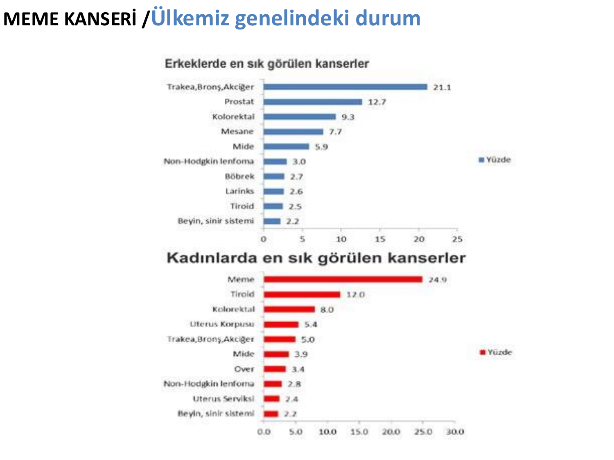

---

## RİSK FAKTÖRLERİ

* **Yaş**
* **Aile öyküsü** → 1 birinci derece yakını varsa risk 2 kat artar
* **Meme kanseri öyküsü**
* **Artmış östrojen karşılanımı:**
  - Erken menarş (15'e karşı 13'e göre HR 0.76, %95 CI 0.68-0.85)
  - Geç menapoz (1 yıl gecikme → %5 azalma)
  - Hormon replasman tedavisi / oral kontraseptifler
* **Nulliparite** (RR: 1.2-1.7)
* **İlk gebeliğin 30 yaş üzerinde olması**
  - 20 yaş → %20 azalma, 25 yaş → %10 azalma, 35 yaş → %5 artış
* **Diyet, yaşam tarzı** → Obezite (BMI >30), aşırı alkol alımı
* **40 yaş öncesi radyasyon ile karşılaşma**
* **Dens meme, yüksek BMD (kemik mineral dansitesi)**
* **Benign veya premalign meme hastalıkları:**
  - *In situ* kanser
  - Atipik hiperplazi
* **Kalıtsal sendromlar:**
  - BRCA1-2, Li-Fraumeni sendromu vb.

---

## KALITSAL MEME KANSERİ

### Kalıtsal Meme-Over Kanseri Sendromları (KMOK)

**Kanser türlerine göre sporadik/familyal/herediter dağılım:**

| Kanser Türü | Sporadik | Familyal | Herediter |
|---|---|---|---|
| Meme kanseri | %70-80 | %15-20 | %5-10 |
| Over kanseri | %75-90 | — | %10-25 |
| Kolorektal kanser | %70 | %20 | %10 |

⚠️ BRCA1 ve BRCA2 herediter meme ve over kanserinin **en sık** nedenidir.

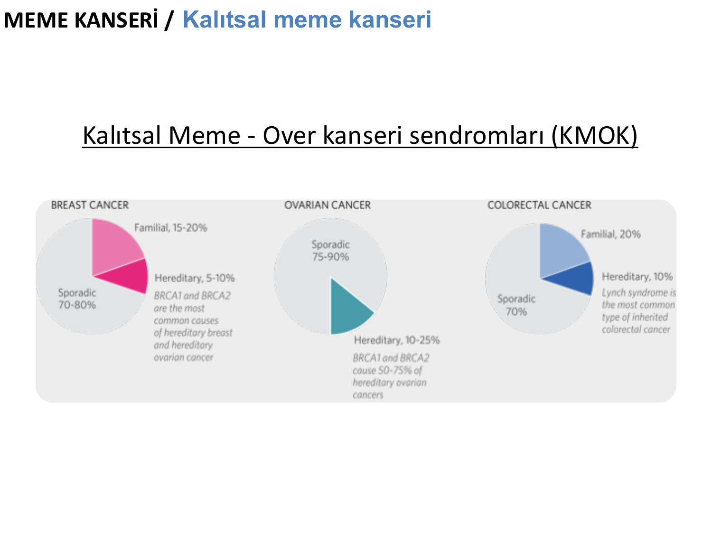

### BRCA Mutasyon Taşıyıcılarında Kanser Riski

**Erkeklerde:**

| Kanser Türü | ABD beyaz | BRCA1 mutasyon taşıyıcı | BRCA2 mutasyon taşıyıcı |
|---|---|---|---|
| Meme | %0.1 | %1-5 | %7 |
| Prostat | 16 | * | 25 |
| Melanom | 2 | N.S. | 5 |
| Pankreas | 1 | Up to 3 | 3-5 |

**Kadınlarda:**

| Kanser Türü | ABD beyaz | BRCA1 mutasyon taşıyıcı | BRCA2 mutasyon taşıyıcı |
|---|---|---|---|
| Meme | %13 | **%60-80** | **%50-70** |
| Over | %1-2 | %20-45 | %10-20 |
| Melanom | 2 | N.S. | Up to 5 |
| Pankreas | 1 | Up to 3 | 3-5 |

*N.S. = Not significant; * 65 yaş altı erkeklerde artmış risk kanıtı var*

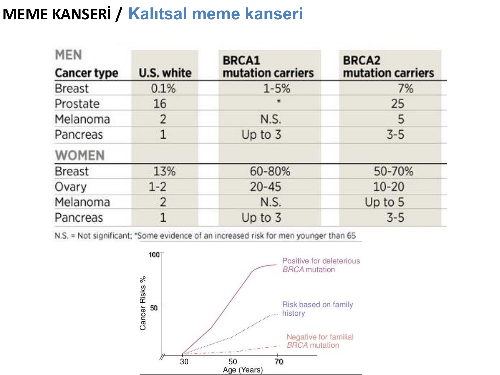

### BRCA İlişkisi Ne Zaman Akla Gelmelidir?

**1- Ailede bilinen BRCA mutasyonu varlığı**

**2- Hasta (DCIS dahil):**
* ≤45 yaş meme kanseri
* ≤50 yaş meme kanseri + aşağıdakilerden biri:
  - 2\. primer meme
  - ≥1 yakınında (1., 2., 3. derece) meme kanseri öyküsü
  - ≥1 yakınında pankreas veya prostat kanseri (Gleason >7)
* Üçlü negatif meme kanseri
* İki veya daha fazla primer meme kanseri
* İnvaziv over, fallop tüp, primer peritoneal kanser
* Erkek meme kanseri
* Over kanseri
* Ashkenazi ise yaştan bağımsız
* Hasta herhangi bir yaş + aşağıdakilerden biri:
  - ≥1 yakınında pankreas veya prostat kanseri (Gleason >7)
  - ≥1 yakınında (1., 2., 3. derece) <50 yaş meme kanseri öyküsü
  - Yakınında erkek meme kanseri

**3- Kanser yok ancak 1.-2.-3. derece yakınlarında:**
* Bilinen bir mutasyon var
* ≤45 yaş meme kanseri
* ≥2 meme kanseri
* İnvaziv over, fallop tüp, primer peritoneal kanser
* Erkek meme kanseri

### BRCA Dışı KMOK İlişkili Genler

**1. Yüksek penetranslı genler (>5 kat risk):**
*TP53, PALB2, CDH1, PTEN, STK11, RAD51C ve RAD51D*

**2. Düşük-orta penetranslı genler (2-4 kat risk):**
*ATM, CHEK2, BRIP1*

| Gen | Meme Kanseri RR (%90 CI) |
|---|---|
| *ATM* | 2.8 (2.2-3.7) |
| *BARD1* | Bildirilmiş, RR henüz belirlenmemiş |
| *BRIP1* | 2.0 (1.3-3.0); over kanseri RR 11.2 |
| *CDH1* | 6.6 (2.2-19.9) |
| *CHEK2* | 3.0 (2.6-3.5); 1100delC için veri |
| *NBN* | 2.7 (1.9-3.7) |
| *PALB2* | 5.3 (3.0-9.4) |
| *PTEN* | RR 2.0-5.0 |
| *STK11* | RR 2.0-4.0 |
| *TP53* | 105 (62-165) |

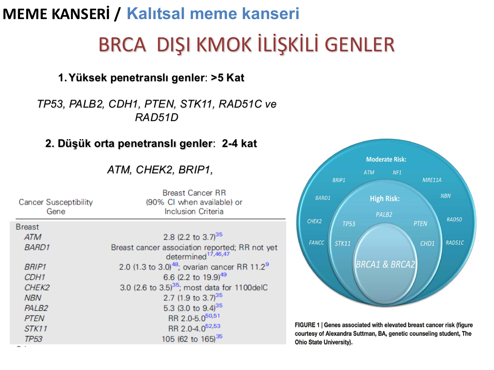

### KMOK Sendromları

| Gen | Sendrom | Bulgular |
|---|---|---|
| *BRCA1* | KMOK | **Meme**, over |
| *BRCA2* | KMOK | **Meme**, over, fallop tüpü, erkek meme, pankreas, prostat |
| *TP53* | Li-Fraumeni | **Meme**, yumuşak doku ve kemik, lösemi, adrenal, koroid pleksus, BAL akc. |
| MRG (*MSH2, MLH1, MSH6, PMS2*) *EPCAM* | Lynch (Kalıtsal non-polipozis kolon kanseri) | Kolon, endometrium, over, renal pelvis ve mide kanserleri |
| *CDH1* (*E-kaderin-1*) | Kalıtsal diffüz mide kanseri | **Lobüler meme kanseri** ve diffüz mide kanseri |
| *PTEN* | Cowden/PTEN hamartom | **Meme**, endometrium, non-medüller tiroid, kolon, böbrek kanserleri; hamartom, dudak papillom, keratozlar, trişilemmal tümör, makrosefali |
| *STK11* | Peutz-Jeghers | **Meme**, ince barsak, kolorektal, mide, pankreas, akciğer, endometrium, over ve sex kord stromal tümörler; hamartomoz polipler, mukokütanöz pigmentasyon |

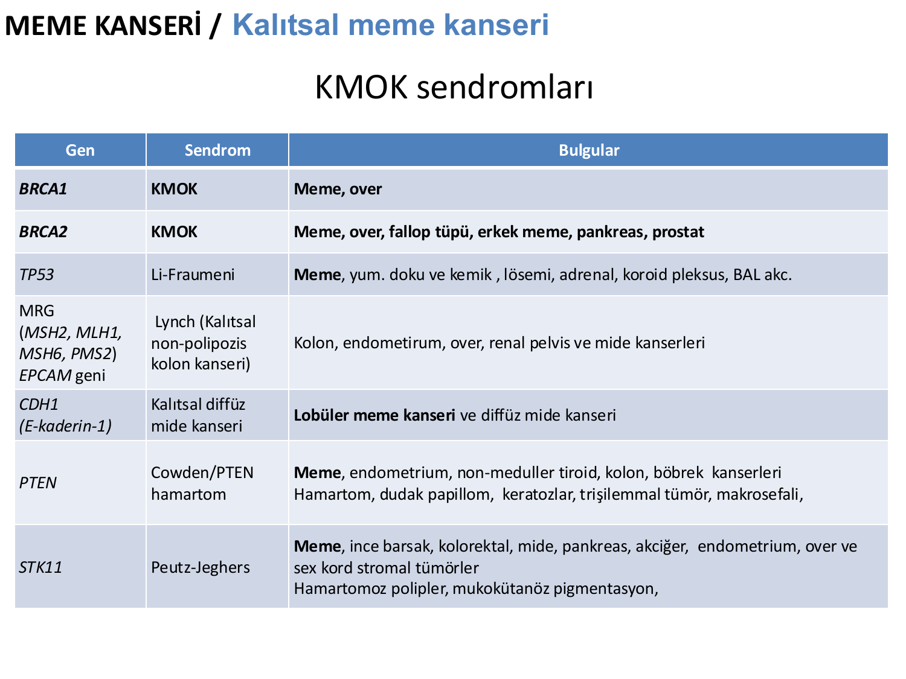

---

## TARAMA

### Mammografinin Hedefleri

* Asemptomatik hastalarda daha **erken tanı**
* **Mortaliteyi azaltmak**

| Yaş | Mortalite Azalması (%) | Açıklama |
|---|---|---|
| 40-49 | %17 | 15 yıllık tarama sonrası |
| 50-69 | %25-30 | 10-12 yıllık tarama sonrası |
| 70+ | Veri yok | Artık var |

* >70 yaş üstünde yaşam avantajı artık var

### Tarama Yöntemleri

* **Mammografi** → Meme dokusunda kitleler ve mikrokalsifikasyonları tespit eder
* **Meme MR** → Özellikle yüksek riskli hastalarda kullanılır

### Meme Dansitesi Sınıflaması (BI-RADS)

* **A:** Neredeyse tamamı yağ dokusu
* **B:** Dağınık fibroglandüler dansiteler
* **C:** Heterojen dens meme
* **D:** Aşırı dens meme

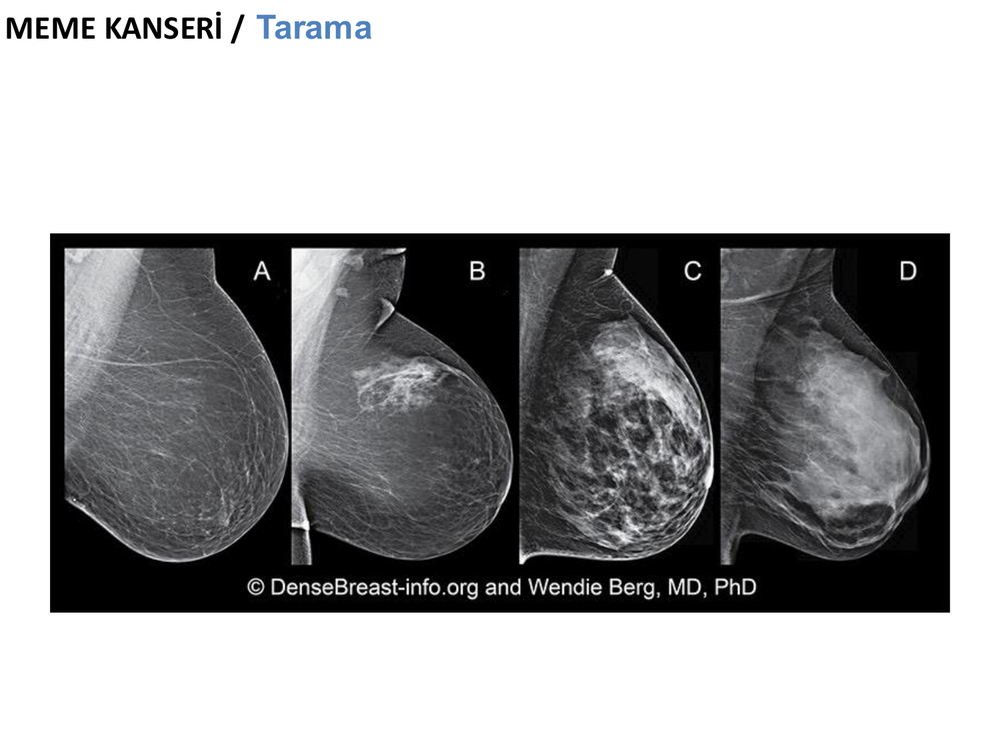

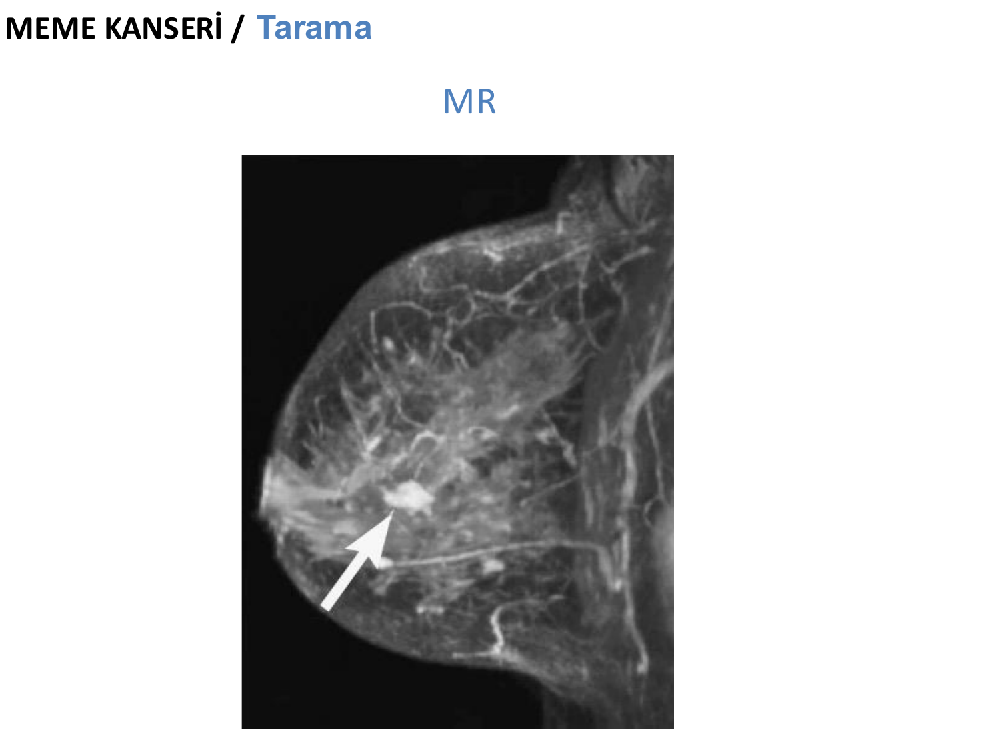

### Tarama Önerileri (Genel Popülasyon)

* Ülkelere göre değişiklik gösterir
* Türkiye'de **40 yaşından itibaren yılda bir** mammografi
* En erken meme kanserinden **5-10 yıl öncesinden** başlayarak yıllık değerlendirme
  - Artmış ailesel risk durumunda

### Kalıtsal Durumlar (BRCA) İçin Tarama

1. **Kendi kendine meme muayenesi:** Aylık, 18 yaşından itibaren
2. **Klinik muayene:** 25 yaşından itibaren en az 6 ayda bir
3. **Görüntüleme:**
   - 25-29 yaş → Yıllık **MRI**
   - 30-75 yaş arası → Yıllık **MRG ve MMG**
   - 75 yaş üstü → Kişisel karar

---

## TANI

### Biyopsi Değerlendirme Algoritması

```
         Biyopsi Değerlendirmesi
                ↓
    ┌───────────┴───────────┐
    ↓                       ↓
Palpabl kitle      Non-palpabl kitle
    ↓                       ↓
    ↓              ┌────────┴────────┐
    ↓              ↓                 ↓
    ↓         Kist                Normal
    ↓              ↓                 ↓
    ↓        Kist aspirasyonu   Uygun taramaya
    ↓              ↓             devam
    ↓         Persistan ise
    ↓         kısa süreli takip
    ↓
    ↓
    ↓         İğne lokalizasyonu
    ↓
Biyopsi
    ↓
    ├─ Eksizyonel biyopsi
    ├─ Core-cutting iğne biyopsisi
    └─ İnce iğne aspirasyonu
         ↓
    ┌────┴────┬──────────┬──────────┬────────┐
    ↓         ↓          ↓          ↓        ↓
Yetersiz   DCIS     İnvaziv    LCIS     Benign
değerlendir.       kanser
rebiyopsi
```

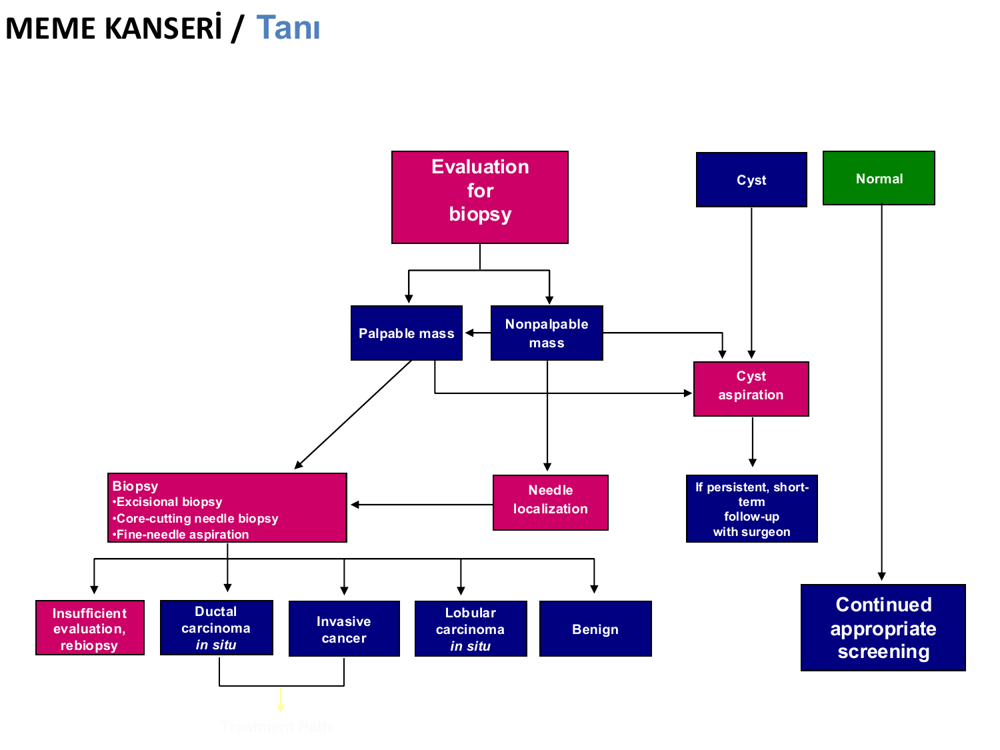

### Biyopsi Teknikleri

* **Eksizyonel biyopsi** → Tümör boyutu ve histolojik tanı
* **Tru-cut biyopsisi:**
  - Histolojik tanı ve doku
  - Reseptör durumları
* **İnce iğne** → Sitolojik tanı

---

## PATOLOJİ

### Histolojik Sınıflama

**Non-invaziv karsinoma *in situ*:**
* Duktal karsinoma *in situ* (DCIS)
* Lobuler karsinoma *in situ* (LCIS)

**İnvaziv karsinoma:**
* Duktal veya lobuler karsinoma
* Medüller, müsinöz ve tübüler karsinoma

**Nadir Tümörler:**
* İnflamatuvar karsinoma
* Paget hastalığı

### Histolojik Alt Tipler ve Sıklıkları

| Alt Tip | Sıklık (%) |
|---|---|
| **İn situ karsinoma** | |
| Lobüler | 6 (2.3) |
| Duktal | 15 (5.7) |
| **İnvaziv karsinoma (özel tip dışı)** | |
| **Duktal** | **183 (70.0)** ← en sık |
| Lobüler | 19 (7.2) |
| Mikst duktal ve lobüler | 1 (0.4) |
| **İnvaziv karsinoma (özel tipler)** | |
| Papiller | 7 (2.6) |
| Medüller | 4 (1.5) |
| Apokrin | 2 (0.8) |
| Müsinöz | 5 (1.9) |
| Berrak hücreli | 3 (1.1) |
| Kribriform | 2 (0.8) |
| Tübüler | 1 (0.4) |
| Paget hastalığı | 3 (1.1) |
| **Çeşitli (invaziv)** | |
| Anaplastik | 3 (1.1) |
| Metaplastik/karsinosarkom | 2 (0.8) |
| Malign fillodes tümör | 5 (1.9) |
| Pleomorfik sarkom | 1 (0.4) |
| **Toplam** | **261 (100)** |

---

## PROGNOSTİK VE PREDİKTİF FAKTÖRLER

* Aksiller nod sayısı
* Tümör büyüklüğü
* Lenfatik vasküler invazyon
* Tümörün histolojik tipi
* Histolojik grade
* Nükleer grade
* ER / PR reseptör durumu
* HER2/*neu* aşırı salınımı
* Ki67
* ...

---

## RESEPTÖR DEĞERLENDİRMESİ

### İmmünohistokimya (İHK) Değerlendirmesi

* ≥ %1 tümör hücre çekirdeğinde boyanma → **pozitif**
* < %1 boyanma → **negatif**

### Optimal Bir Test İçin

* Yeterli çoklu core biyopsi gerekli

### Hazırlık

* Doku alındığında gecikmeden fikse edilmeli
* >6 saat - <72 saat %10 NBF'de kalmalı
* 6 hafta içinde değerlendirilmeli

### HER2/*neu* ve Prognoz

* HER-2/*neu* gen aşırılığı **%25-30** oranında görülür
* 5 yıllık yaşam anlamlı olarak daha az
* ER / PR'den bağımsız prognostik faktör

---

## MOLEKÜLER ALT TİPLER

### Meme Kanserinde Alt Tipler

| Alt Tip | ER | PR | HER2 | Ki-67 |
|---|---|---|---|---|
| **Luminal A** | ER pozitif ve/veya PR pozitif | Pozitif | Negatif | <%14 |
| **Luminal B (HER2 negatif)** | ER pozitif ve/veya PR pozitif | Pozitif | Negatif | ≥%14 |
| **Luminal B (HER2 pozitif)** | ER pozitif ve/veya PR pozitif | Pozitif | Pozitif | Herhangi |
| **HER2-enriched** | Negatif | Negatif | Pozitif | Herhangi |
| **TNBC (Üçlü negatif)** | Negatif | Negatif | Negatif | Herhangi |

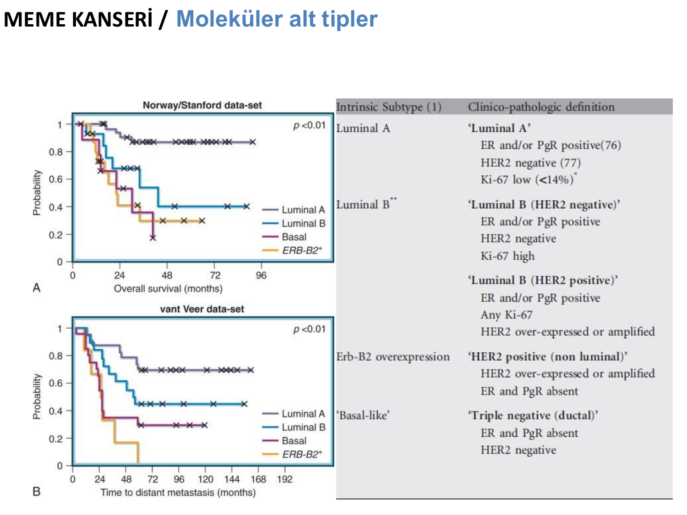

**⚠️ ÖNEMLİ:**

* Hastaların tedavi kararları alınırken bu reseptörlerin durumlarının bilinmesi **kesinlikle gerekli**:
  - ER, PR, HER2, Ki-67, TIL

### Prognoz Sıralaması (İyiden Kötüye)

```
Luminal A → Luminal B → HER2+ → Triple Negatif
(İyi prognoz)                    (Kötü prognoz)
(Daha az agresif)                (Daha agresif)
```

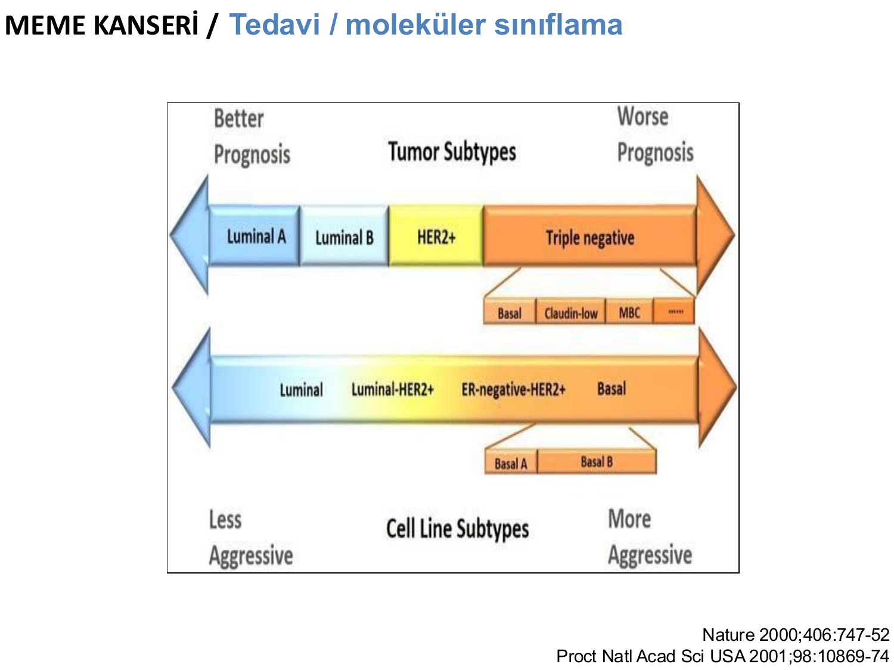

---

## TEDAVİ

### Tedavi Yaklaşımı

* Eski yöntemler → Yeni yaklaşımlara geçiş
* Biyolojik alt tiplere göre tedavi kararları

### Sistemik Tedavi Seçimi

**Hastanın özellikleri:**
* Yaş, menopoz durumu, eş hastalıkları, sosyoekonomik koşullar, hastanın tercihi

**Tümörün özellikleri:**
* Evre, moleküler alt tipi

**Uluslar arası kılavuzlar:**
* ASCO, ESMO, NCCN, St Gallen, Adjuvant Online, Predict vb.

**Gen ekspresyon analizleri** → Tedavi kararında yol gösterici

### Moleküler Sınıflamaya Göre Tedavi

| Klinik Alt Grup | Notlar | Tedavi |
|---|---|---|
| **Üçlü negatif** | ER, PR ve HER2 negatif | **Kemoterapi** |
| **HR-negatif ve HER2-pozitif** | ASCO/CAP kılavuzu | **Kemoterapi + Anti-HER2** |
| **HR-pozitif ve HER2-pozitif** | ASCO/CAP kılavuzu | **Kemoterapi + HT + Anti-HER2** |
| **HR-pozitif ve HER2-negatif** | ER ve/veya PR pozitif ≥%1 | **HT ± Kemoterapi** |

**HR-pozitif ve HER2-negatif grupta alt sınıflama:**

* **Yüksek reseptör ekspresyonu, düşük proliferasyon, düşük grade (Luminal A benzeri):**
  - Yapılabiliyorsa gen testleri → iyi prognoz
  - ER/PR kuvvetli pozitif, Ki-67 veya grade kesin olarak düşük
* **Ara risk:** Endokrin tedavi ve KT'ye yanıt belirsiz
* **Düşük reseptör ekspresyonu, yüksek proliferasyon, yüksek grade (Luminal B benzeri):**
  - Yapılabiliyorsa gen testleri → kötü prognoz
  - ER/PR zayıf pozitif, Ki-67 kesin olarak yüksek, histolojik grade 3

*Not: Klinik patolojik düşük riskli olan vakalarda (pT1a, pT1b, grade 1, ER yüksek pozitif ve N0 hastalık) gen testine gerek yoktur.*

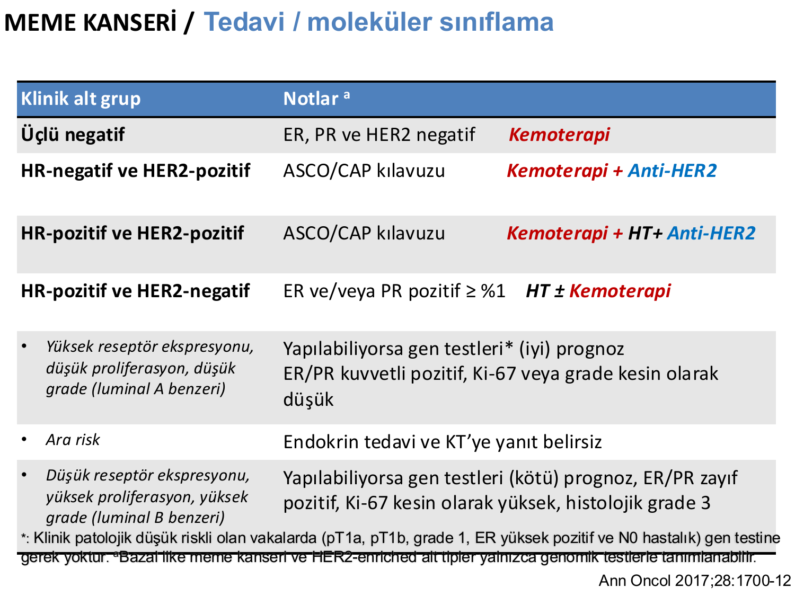

---

## SİSTEMİK TEDAVİ

### Sistemik Tedavi Rasyonelleri

* Mikrometastazlar
* Lokal dışı sebeplerle ölüm
* Lokal tedavilerle metastaz sıklığında minimal azalma
* Sistemik tedaviler ile anlamlı yaşam uzaması

### Sistemik Tedavi Uygulamaları

* **Adjuvan** → Herkese gerekli mi? Alt gruplara göre farklılaşıyor
* **Neoadjuvan** → Adjuvan ile benzer tedaviler
* **Palyatif**

### Adjuvan Tedavide Güncel Öneriler

* **AC x 4 kür ardından paclitaxel x 4 kür**
* **Doz yoğun uygulamalar**
* **Dosetaksel + siklofosfamid (TC)**
* CAF x 4-6 kür
* AC x 4 kür
* TAC
* CEF x 6 kür
* CMF x 6 ay
* 3FEC x 3 Dosetaksel
* A x 4 kür ardından CMF x 8 kür

---

## NEOADJUVAN TEDAVİ

### Amaçları

* **MKC (meme koruyucu cerrahi) olanağını artırmak:**
  - Mastektomiden sakınmak
  - Başarılı kozmetik sonuç
* **Cerrahinin uygun olmadığı hastalar**
* **Kür şansını artırmak** → Patolojik tam yanıt (pCR)

### Kimlere Uygulanır?

* Lokal ileri hastalar (Evre III'ler)
* Erken evre hastalar (Evre I-II'ler)
* Yanıt olasılığı yüksek hastalar → **Üçlü negatif veya HER2 grubu**
* Adjuvan tedavi ile aynı tedaviler uygulanır

### Hedef

* **Patolojik tam yanıta (pCR) ulaşmak**
* pCR elde eden hastalarda hem olaysız sağkalım (EFS) hem de genel sağkalım (OS) anlamlı olarak daha iyi (HR=0.48 ve HR=0.36, p<0.001)

---

## HER2 POZİTİF HASTALIK

### Anti-HER2 Tedavi Endikasyonları

* >1 cm tümörde **her hastada**
* <1 cm tümörde **HR negatif hastalara**
* **1 yıl süreyle** (RT dahil)
* İlaçlar: **Trastuzumab, Pertuzumab**
* 3 ayda bir **EKO** ile kardiyak monitörizasyon

### Trastuzumab Etki Mekanizmaları

* ADCC (Antikor bağımlı hücresel sitotoksisite)
* Sinyal iletimi ve hücre siklusu inhibisyonu
* Proteolitik yıkımın inhibisyonu
* Tümör anjiyogenez inhibisyonu
* DNA hasar onarım inhibisyonu

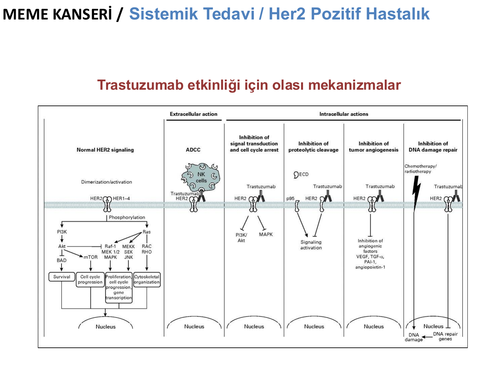

### Pertuzumab

* HER2/HER3 heterodimerizasyonunu engelleyerek sinyal iletimini inhibe eder

---

## LUMİNAL HASTALIK

### Luminal Hastalık Genel Özellikleri

* KT'den göreceli daha az yarar
* KT %70-80 gereksiz
* >5 mm üstü her hastaya endokrin tedavi uygulanır
* Nod pozitif hastalıkta KT + HT tercih edilir

### Endokrin Tedavinin Amacı

* Tümörü **östrojenin etkisinden kurtarmak:**
  - Östrojen **sentezini azaltmak:**
    - Premenopozal → Ovarian ablasyon
    - Postmenopozal → Aromataz inhibitörleri
  - Östrojenin ER'e **bağlanmasını engellemek**

### Hangi Tümör Tiplerinde Endokrin Tedavi Tercih Edilmelidir?

* Reseptör pozitifliği olan **tüm hastalarda** kullanılır
* Pozitiflik yüzdesi arttıkça yanıt oranları artar
* Beraberinde PR (+)'liği varsa yanıt oranı artar
* İzole PR (+)'liği düşüktür (%5)
* HER2 (-) hastalarda yanıt daha yüksektir
* Uygun cut-off: 10 fmol/mg (ligand bağlama), İHK genellikle %10 → %1
* >%75 daha yüksek yanıt (+++)
* Metastazında ER durumu karakter değiştirebilir

### Endokrin Tedavinin Üstünlükleri

* ER (+) etkili olabileceğine dair bir gösterge
* Yan etkileri daha az
* Yanıt süresi göreceli olarak daha iyi
* Postmenopozal ER (+) → KT'ye yakın etkinlik
* Diğer memede kanser gelişimini azaltıyor
* DCIS'ta lokal yinelemeyi azaltıyor

### Luminal Hastalıkta Kemoterapi Gerekli Mi? (HER2 Negatif)

**Luminal A benzeri (%40) — ALN negatif: Uzak metastaz riski %5 (%4-%7):**
* → **Hormonal tedavi**
* ER kuvvetli pozitif, PR ≥%20 pozitif
* Ki-67 <%14, Grade 1
* LVI negatif, N0-3 pozitif
* Gen analizlerinde **düşük risk**

**Luminal B benzeri (%20) — ALN negatif: Uzak metastaz riski %18 (%15-%22):**
* → **Kemoterapi + HT**
* ER zayıf pozitif veya PR negatif
* Ki-67 >%20, Grade 3
* LVI pozitif, <35 yaş hasta
* ≥4 nod pozitifliği
* Gen analizlerinde **yüksek risk**

---

## HORMONAL TEDAVİ

### Hormonoterapi İlaçları

**SERM'ler (Selektif Östrojen Reseptör Modülatörleri):**
* Tamoksifen
* Raloksifen
* Toremifen

**Aromataz İnhibitörleri:**
* Anastrozol
* Letrozol
* Eksemestan

### Aromataz İnhibitörlerinin Sınıflaması

| Jenerasyon | Tip 1 (Steroidal İnaktivatör) | Tip 2 (Non-steroidal İnhibitör) |
|---|---|---|
| Birinci | Yok | Aminoglutetimid |
| İkinci | Formestan | Fadrozol, Rogletimid |
| Üçüncü | Eksemestan (Aromasin) | Anastrozol (Arimidex), Letrozol (Femara), Vorozol |

**Aromataz İnhibitörlerinin Yan Etkileri:**
* Kas eklem ağrıları
* Osteoporoz
* Lipid metabolizması üzerine negatif etkiler
* Sıcak basması

*Not: Postmenopozal kadınlarda östrojen, overler yanında düşük miktarlarda **böbrek üstü bezleri ve yağ dokusu** tarafından da üretilir.*

### Premenopozal Hastalar

* Ana ilaç **tamoksifendir**
* Aİ + LHRH analogları eş veya daha üstün

**⚠️ ÖNEMLİ:**

* Tamoksifen KT birlikte **kullanılmaz:**
  - Hastalıksız sağkalım azalır
  - Daha yüksek tromboembolik olaylar gelişir
* Tamoksifen RT ile birlikte **kullanılmaz:**
  - Meme ve akciğer fibrozisi riskini artırır

### Tamoksifen Yan Etkileri

| Ciddi | Daha hafif | Sık |
|---|---|---|
| Tromboembolik olaylar | Ateş basması | Depresyon |
| Endometrial kanser | Vajinal salgı | Kilo alımı |
| Katarakt | Seksüel disfonksiyon | |

✅ **Olumlu etkileri:** Osteoporozdan korur, kolesterol düzeylerini düşürebilir

### Postmenopozal Hastalar

* Postmenopozal hastalarda **TMX veya Aİ** kullanılabilir
* Menopoz: 1 yıl süreyle adet görmemektir
* ⚠️ KT'ye bağlı amenorede dikkatli olunmalıdır

**KT rejimine göre amenore oranları (%):**

| Amenore (%) | <30 yaş | 30-40 yaş | >40 yaş |
|---|---|---|---|
| CMF | 19 | 31-38 | 79-96 |
| AC | — | 13 | 57-63 |
| FEC/FAC | 0 | 10-25 | 80-90 |
| TAC | — | 51 | — |
| 4 AC – 4 T | — | 38 | — |

### Tedavi Süresi

* Tamoksifen 5 yıl kullanımda yıllık nüks odds oranında %47, ölüm odds oranında %26 azalma
* **5 yıl mı? 10 yıl mı?** → Güncel yaklaşımda uzatılmış tedavi gündemde

### Adjuvan CDK4/6 İnhibitörleri

**Yüksek riskli hastalar:**
* Lenf nodu 4 ve üzeri pozitif
* Tümör 5 cm ve üzeri + lenf nodu 1-3 pozitif ya da grade 3
* → **2 yıl abemasiklib + HT**

**Yüksek riskli hasta:**
* LN pozitif ya da tümör >5 cm
* Tm 2-5 cm, grade 2 (Ki-67 >%20 ya da genomik yüksek riskli) ya da grade 3
* → **3 yıl ribosiklib + Aİ**

---

## GEN EKSPRESYON ANALİZLERİ

### Birinci Jenerasyon Testler
* **Mammaprint**
* **Oncotype DX**

### İkinci Jenerasyon Testler
* PAM 50 (Prosigna)
* Endopredict
* Breast Cancer Index

### Diğer
* Mammostrat
* IHC4

### Oncotype DX

* 21 gen analizi (16 kanser geni + 5 referans gen)
* **Proliferasyon genleri:** Ki67, STK15, Survivin, CCNB1, MYBL2
* **HER2 genleri:** GRB7, HER2
* **Östrojen genleri:** ER, PGR, BCL2, SCUBE2
* **İnvazyon genleri:** MMP11, CTSL2
* Diğer: GSTM1, CD68, BAG1

**Oncotype DX Risk Kategorileri:**

| Risk Kategorisi | Skor | Hasta Oranı (%) | 10 Yılda Uzak Nüks (%) |
|---|---|---|---|
| Düşük | <18 | 51 | 6.8 (4.0-9.6) |
| Orta | 18-30 | 22 | 14.3 (8.3-20.3) |
| Yüksek | ≥31 | 27 | 30.5 (23.6-37.4) |

---

## ÜÇLÜ NEGATİF MEME KANSERİ

### Erken Evre Tedavi

* KT dışında seçenek yok
* Tercihen **neoadjuvan tedavi**
* NAKT sonrası rezidü kalan hastalarda **kapesitabin 6 ay**
* BRCA mutasyon varlığı araştırılmalı
* Platinler BRCA mutantlarda tercih edilir

---

## METASTATİK MEME KANSERİ TEDAVİSİ

Biyolojik alt tipe göre tedavi seçimi yapılır.

### HR+/HER2- Metastatik Hastalık

**1. Basamak tedavi:**
* Endokrin tedavi + CDK 4/6 inhibitörleri
  - Aromataz inhibitörü + CDK 4/6 inhibitörü (ribosiklib, palbosiklib, abemasiklib)
  - Fulvestrant + CDK 4/6 inhibitörü
  - Everolimus + eksemestan
  - PIK3CA mutant → Alpelisib + fulvestrant

**CDK 4/6 inhibitörlerinin yan etkileri:**
* Nötropeni (ortak)
* Ribosiklib → QTC uzaması, KCFT ↑
* Abemasiklib → Diyare
* Everolimus → Mukozit
* Alpelisib → Hiperglisemi

**HR+/HER2- ancak viseral krizde / endokrin dirençli:**
* Germline BRCA 1 ya da 2 mutant → PARPi (talazoparib, olaparib)
* Trastuzumab deruxtecan
* Sacituzumab govitecan

### HER2 Pozitif Metastatik Hastalık

**1. Basamak:**
* Pertuzumab + trastuzumab + dosetaksel

**2. Basamak:**
* Trastuzumab deruxtecan *(tümör agnostik)*

**3. Basamak:**
* Tucatinib + trastuzumab + kapesitabin
* TDM-1 (ado-trastuzumab emtansin)

### Üçlü Negatif Metastatik Hastalık

**1. Basamak tedavi:**
* PDL-1 CPS >10 → **Pembrolizumab + KT** (paklitaksel, gemsitabin, karboplatin)
* PDL-1 CPS <10 ve germline BRCA mut negatif → **Sistemik kemoterapi**
* PDL CPS <10, germline BRCA mutant → **PARPi** (olaparib/talazoparib) veya platin

**2. Basamak:**
* Sacituzumab govitecan
* BRCA 1/2 (germline) → PARPi
* HER2 İHK +1/+2 FISH negatif → Trastuzumab deruxtecan

### Metastatik Meme Kanserinde Kullanılan Kemoterapötikler

* **Antrasiklinler:** Doksorubisin, lipozomal doksorubisin
* **Taksanlar:** Paklitasel
* **Anti-metabolitler:** Kapesitabin
* **Mikrotübül inhibitörleri:** Vinorelbin, eribulin
* **Diğer:** İxabepilon

---

## TAKİP

* **İlk 2 yıl:** 3-4 ayda bir
* **2-5 yıl:** 6 ayda bir
* **>5 yıl:** Yılda bir

**Takip tetkikleri:**
* Yıllık mammografi, meme USG, abdomen USG, PAAC, toraks-abdomen BT
* Hemogram, biyokimya, CA 15-3
* Kemik mineral dansitometrisi (KMD)

---

## NÜKS

**Lokal Nüks:**
* Cerrahi ±
* RT ±
* Sistemik tedavi

**Metastatik Nüks:**
* Moleküler alt tipe göre sistemik tedavi

---

## GEÇ TOKSİSİTELER

* **Kardiyotoksisite** → Antrasiklin ve trastuzumab
* **Osteoporoz** → Aromataz inhibitörleri + GNRH agonistleri
* **Menopoz**
* **İnfertilite**
* **Sekonder maligniteler** → Lösemi, anjiosarkom
* **Psikososyal destek ihtiyacı**
