# ONKOLOJİK ACİLLER

**Hazırlayan:** Dr. Öğr. Üyesi Esin Oktay
**Bölüm:** Aydın Adnan Menderes Üniversitesi -- Tıbbi Onkoloji Bilim Dalı

---

## İÇİNDEKİLER

1. [Tanım ve Mekanizmalar](#tanım-ve-mekanizmalar)
2. [Onkolojik Aciller Sınıflaması](#onkolojik-aciller-sınıflaması)
3. [Süperior Vena Kava (SVK) Sendromu](#süperior-vena-kava-svk-sendromu)
4. [Spinal Kord Basısı](#spinal-kord-basısı)
5. [Perikard Tamponadı](#perikard-tamponadı)
6. [Pulmoner Emboli](#pulmoner-emboli)
7. [İntestinal Obstrüksiyon](#intestinal-obstrüksiyon)
8. [Üriner Obstrüksiyon](#üriner-obstrüksiyon)
9. [Malign Biliyer Obstrüksiyon](#malign-biliyer-obstrüksiyon)
10. [İntrakraniyal Metastaz ve KİBAS](#intrakraniyal-metastaz-ve-kibas)
11. [Malign Hiperkalsemi](#malign-hiperkalsemi)
12. [Uygunsuz ADH Sendromu (SIADH)](#uygunsuz-adh-sendromu-siadh)
13. [Hipoglisemi](#hipoglisemi)
14. [Adrenal Yetmezlik](#adrenal-yetmezlik)
15. [Laktik Asidoz](#laktik-asidoz)
16. [Tümör Lizis Sendromu (TLS)](#tümör-lizis-sendromu-tls)
17. [Tiflitis (Nötropenik Enterokolit)](#tiflitis-nötropenik-enterokolit)
18. [Hemorajik Sistit](#hemorajik-sistit)
19. [Febril Nötropeni](#febril-nötropeni)
20. [İnfüzyon Reaksiyonları (İnsan Antikor İnfüzyonu)](#infüzyon-reaksiyonları)
21. [Kemoterapi Sonrası Hemolitik Üremik Sendrom ve TTP](#kemoterapi-sonrası-hemolitik-üremik-sendrom-ve-ttp)
22. [Pulmoner İnfiltratlar](#pulmoner-infiltratlar)
23. [Klinik Vaka Örnekleri](#klinik-vaka-örnekleri)

---

## TANIM VE MEKANİZMALAR

> **Tanım:** Onkolojik aciller, **kanser veya kanser tedavisi komplikasyonlarına bağlı** olarak gelişen, **hayatı tehdit eden** ve **geç kalınırsa geri dönüşümsüz** olabilen akut klinik durumlardır.

### Ne Zaman Görülebilir?

Kanserin **herhangi bir döneminde** ortaya çıkabilir:

* **İlk tanı** sırasında
* **Aktif tedavi** alırken
* **Hastalığın progresyonu** sırasında

**⚠️ ÖNEMLİ:** Kanser hastasında **normal bir insanda görülebilecek tüm acil durumlar** da görülebilir. Kanserin kendisine bağlı olmayan komorbiditeler gözden kaçırılmamalıdır.

### Patogenetik Mekanizmalar

| # | Mekanizma | Örnek |
|---|---|---|
| 1 | **İnvazyon ve metastaz** | Kemik metastazından patolojik kırık |
| 2 | **Tromboz ve hemoraji** | Kanser-ilişkili VTE, DİC |
| 3 | **Damar, kanal veya visseral boşlukların bası ve obstrüksiyonu** | SVK, spinal kord, biliyer, intestinal |
| 4 | **Normal organ parankiminin yerini alma** | Lösemide kemik iliği yetmezliği |
| 5 | **Seröz membranların infiltrasyonu ve efüzyonu** | Perikardiyal tamponad, malign plevral efüzyon |
| 6 | **Anormal metabolik madde üretimi** | PTHrP → hiperkalsemi, ektopik ADH → SIADH |
| 7 | **Tedaviye bağlı** | Tümör lizis sendromu, nötropenik enfeksiyon |

---

## ONKOLOJİK ACİLLER SINIFLAMASI

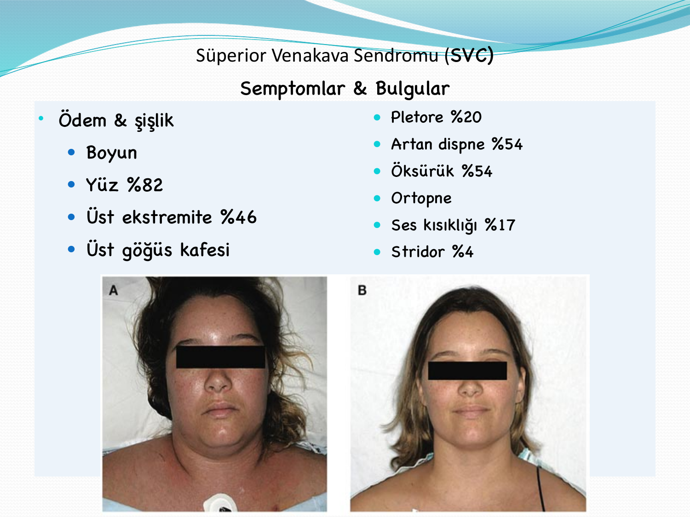

> **Şema yorumu:** Onkolojik aciller **organ sistemine göre** gruplandırılır; kardiyovasküler (SVK, tamponad), solunum (havayolu tıkanıklığı, hemoraji, emboli, solunum yetmezliği), hematolojik (lökostaz, hiperviskozite, DİC, sitopeniler, febril nötropeni), renal-metabolik (obstrüksiyon, ürat nefropatisi, TLS, hiperkalsemi), GI (obstrüksiyon, perforasyon, kanama), nörolojik (spinal kord basısı, KİBAS, konvülsiyon) ve göz-göz dibi metastazı gibi kategoriler tanımlanır.

### Esas Üç Grup (Etyopatojik)

```mermaid
flowchart TD
    Onk[Onkolojik Aciller]
    Onk --> A[A - Yapisal ve Tikayici Aciller]
    Onk --> B[B - Metabolik Aciller]
    Onk --> C[C - Tedaviye Bagli Aciller]

    A --> A1[SVK sendromu]
    A --> A2[Spinal kord basisi]
    A --> A3[Perikard tamponadi]
    A --> A4[Intestinal/uriner/biliyer obstruksiyon]
    A --> A5[Intrakraniyal bası / KIBAS]
    A --> A6[Pulmoner emboli, hava yolu tikanikligi]

    B --> B1[Hiperkalsemi]
    B --> B2[SIADH]
    B --> B3[Hipoglisemi]
    B --> B4[Adrenal yetmezlik]
    B --> B5[Laktik asidoz]

    C --> C1[Tumor lizis sendromu]
    C --> C2[Febril notropeni]
    C --> C3[Tiflitis]
    C --> C4[Hemorajik sistit]
    C --> C5[Hemolitik uremik sendrom / TTP]
    C --> C6[Infuzyon reaksiyonu]

    classDef test fill:#bbdefb,stroke:#1565c0,color:#0d47a1
    classDef warn fill:#fff9c4,stroke:#f9a825,color:#f57f17
    classDef red fill:#ffcdd2,stroke:#c62828,color:#b71c1c
    class Onk,A,B,C test
    class A1,A2,A3,A4,A5,A6 warn
    class B1,B2,B3,B4,B5 warn
    class C1,C2,C3,C4,C5,C6 red
```

---

## SÜPERİOR VENA KAVA (SVK) SENDROMU

> **Tanım:** Süperior vena kavanın dıştan bası, damar içi tıkanma (tromboz) veya direkt invazyon sonucu **kısmi ya da tam obstrüksiyonu** ile gelişen sendrom.

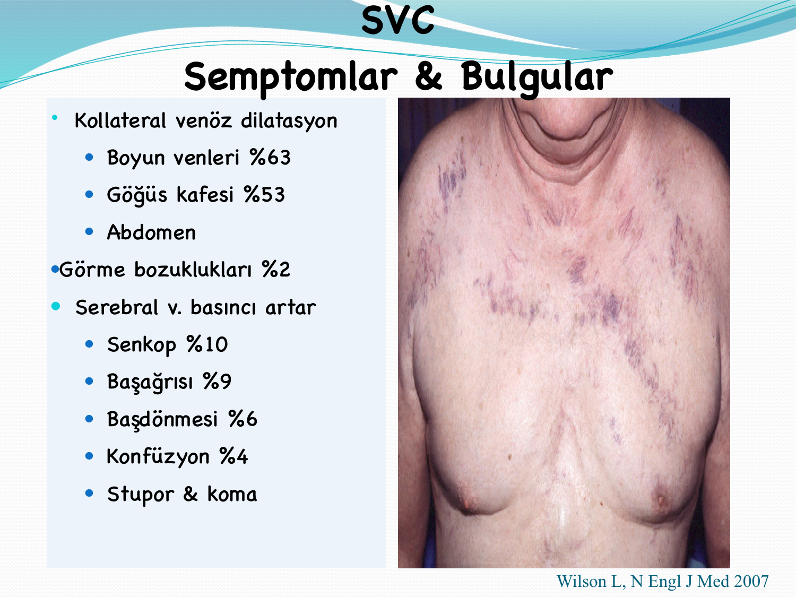

> **Şema yorumu:** Obstrüksiyon **üst gövdeden kalbe venöz dönüşü bozar**; yüz, boyun ve kollarda ödem, dilate kollateral damarlar ve bazen serebral venöz basınç artışına bağlı nörolojik bulgular gelişir.

### Semptomlar ve Bulgular

| Bulgu | Sıklık |
|---|---|
| **Ödem ve şişlik** | -- |
| Yüz | **%82** |
| Üst ekstremite | %46 |
| Boyun | -- |
| Üst göğüs kafesi | -- |
| **Dispne** | %54 |
| **Öksürük** | %54 |
| **Kollateral venöz dilatasyon** | -- |
| Boyun venleri | **%63** |
| Göğüs kafesi | %53 |
| Pletore | %20 |
| Ses kısıklığı | %17 |
| Senkop | %10 |
| Başağrısı | %9 |
| Başdönmesi | %6 |
| Konfüzyon | %4 |
| Stridor | %4 |
| Görme bozukluğu | %2 |

**Kaynak:** Wilson L, N Engl J Med 2007.

### Patofizyoloji

**Obstrüksiyonun 3 mekanizması:**

1. **Dıştan bası** (malign nedenler) -- en sık
2. **Damar içi tıkanıklık** (tromboz)
3. **Damar duvarının direkt invazyonu**

> Hızla ilerleyen olay → **akut SVK krizi** (hayatı tehdit eden klinik).

### Etyoloji -- Malign Nedenler

| Neden | Oran | Alt grup |
|---|---|---|
| **Akciğer kanseri** | **%75** | NSCLC %50, SCLC %22 |
| **Lenfoma** | %12 | Hodgkin & non-Hodgkin |
| **Metastatik kanser** | %9 | Meme kanseri ön planda |
| **Germ hücreli tümör** | %3 | Erkek <40 yaş, βHCG/AFP yüksek |
| **Timoma** | %2 | Myastenia gravis, saf kırmızı hücre aplazisi eşlik edebilir |
| **Mezotelyoma** | %1 | Asbest maruziyeti |
| **Diğer** | %1 | -- |

**Akciğer kanseri özellikleri:** Sağ taraftaki kitlelerde sık; sigara ve >50 yaş; akciğer kanserlerinin %3-12'sinde SVK gelişir.

### Tanı

| Amaç | Yöntem |
|---|---|
| **Anatomik lokalizasyon** | Torasik BT |
| **Vasküler özellikler** | MRI |
| **Histolojik tanı** | Doku biyopsisi (lenfoma, germ hücreli tümör, SCLC ayrımı için şart) |

> **⚠️ ÖNEMLİ:** Tedaviye başlamadan önce **doku tanısı konulmalıdır** (steroid başlandıktan sonra lenfoma tanısı güçleşir).

### Tedavi

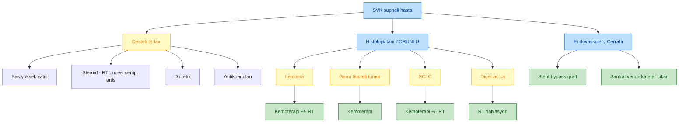

| Destek | Kesin Tedavi |
|---|---|
| Baş yükseltme, oksijen | **Kemoterapi** (SCLC, lenfoma, germ hücreli tümör -- kür amaçlı) |
| **Steroidler** (RT ile semptomda artış için koruyucu) | **Radyoterapi** (palyasyon veya küratif -- lenfoma/SCLC) |
| **Diüretikler** | **Endovasküler stent** (hızlı semptom rahatlaması) |
| **Antikoagülan tedavi** (tromboz varlığında) | **Bypass graft** (nadir) |
| **Trombolitik tedavi** | **Santral venöz kateter çıkarılması** (kateter ilişkili tromboz) |

---

## SPİNAL KORD BASISI

> **Tanım:** Tümör veya metastazın vertebral kanal içinde spinal korda bası yaparak akut nörolojik disfonksiyon oluşturduğu onkolojik acil.

### Epidemiyoloji

* Kanser hastalarının **%5-10'unda** görülür.

### Etyoloji

| Primer tümör | Özellik |
|---|---|
| **Akciğer kanseri** | En sık |
| **Meme kanseri**, **Prostat kanseri** | Çok odaklı metastaz yapar |
| **Lenfoma, Multipl myelom** | Ekstradural tümöral kitle |

### Anatomik Dağılım

| Omurga Seviyesi | Oran |
|---|---|
| **Dorsal** vertebra | **%70** |
| **Lumbosakral** vertebra | %20 |
| **Servikal** vertebra | %10 |

### Klinik

| Semptomlar | Fizik Muayene |
|---|---|
| **Lokalize sırt ağrısı** (en sık ilk bulgu) | **Ağrı** |
| Radiküler ağrı | **Spastisite** |
| Kuşak tarzı ağrı | Ekstensor plantar refleks |
| Aşağıya vuran ağrı | ↓ anal tonus |
| Hassasiyet | ↓ perineal sensitivite |
| Uyuşukluk | Glob vezikal |
| **Güçsüzlük** | |
| **Barsak ve mesane kontrol kaybı** | |

### Tanı

* **Direkt grafi:** Vertebra destrüksiyonu, çökme, litik/sklerotik lezyonlar
* **Kemik sintigrafisi**
* **MRI** (tüm omurga) -- **altın standart**

### Tedavi

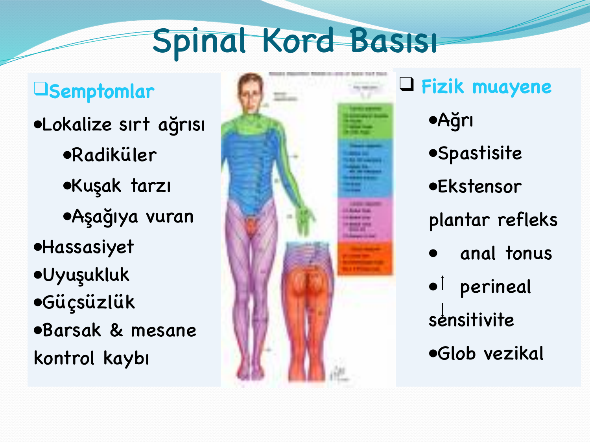

> **Şema yorumu:** MR ile seviye ve kompresyonun şiddeti belirlenir. Yönetim acildir: **deksametazon başlanır, hemen RT ve/veya cerrahi** değerlendirilir.

| Tedavi | Protokol |
|---|---|
| **Deksametazon (Dekort)** | **4 × 4 mg IV/IM** (yaygın pratik); ağır olgularda yüksek doz yaklaşım (10 mg bolus, ardından 4 mg 6 saatte bir) |
| **Radyoterapi** | Birincil yöntem (melanom ve renal hücreli karsinomda **dirençli**) |
| **Laminektomi** | Dekompresyon (tek seviye, belirgin kord basısı, RT'ye yanıtsız) |
| **Ketokonazol 400 mg 3×1** | Prostat kanseri + steroid kombinasyonu (androjen blokajı) |
| **Bifosfonat** | Kemik metastazı olan hastalarda profilaksi |

---

## PERİKARD TAMPONADI

> **Tanım:** Perikard boşluğunda sıvı birikimi (malign perikardiyal efüzyon) sonucu kalbin diyastolik dolumunun bozulması ve kardiyojenik şok gelişimi.

### Etyoloji

* **Malign en sık:** Akciğer kanseri, meme kanseri, özofagus kanseri, melanom, lösemi, lenfoma metastazı
* **Perikardın primer sarkomu ve mezotelyoma** (nadir)
* **Kanser hastalarının %50'sinde** tamponad **selim nedenlere** bağlıdır:
  * RT, ilaç ilişkili perikardit
  * Hipotiroidi
  * İdyopatik
  * Enfeksiyon
  * Otoimmün

### Tanı -- Ekokardiyografi

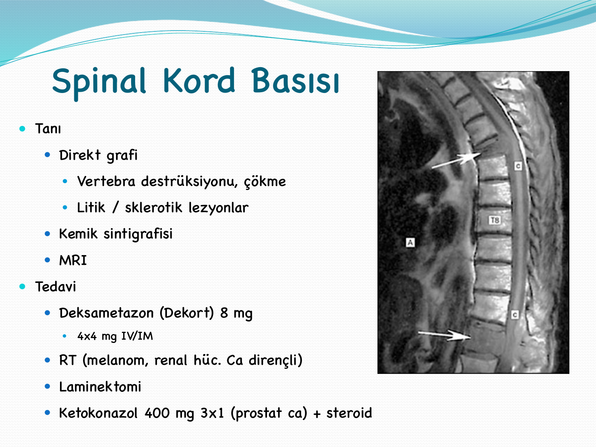

> **Şema yorumu:** Perikardiyal sıvının kesin tanısı **ekokardiyografi** ile konur. EKO'da **sol ventrikül arka duvarı ile posterior pariyetal perikard** arasında veya **sağ ventrikül ön duvarı ile komşu pariyetal perikard** arasında **ekosuz (siyah) alan** saptanması perikard sıvısı için **patognomoniktir**.

### Klinik Bulgular

* **Beck triadı:** Hipotansiyon + dolgun boyun venleri + sessiz kalp sesleri
* **Pulsus paradoksus** (inspiryumda sistolik TA'da >10 mmHg düşüş)
* Dispne, taşikardi, ortopne
* EKG: Düşük voltaj, elektriksel alternans

### Tedavi

| Yöntem | Amaç |
|---|---|
| **Perikardiyosentez (drenaj)** | Acil dekompresyon; sitoloji **%65-85** pozitif |
| **Perikard biyopsisi** | Histolojik tanı |
| **Perikardda pencere / skleroz** | Uzun süreli palyasyon, rekürrens önleme |
| **Kemoterapi** | Kanser tipine yönelik (lenfoma, meme, SCLC) |

---

## PULMONER EMBOLİ

> **⚠️ KLİNİK İNCİ:** Dispne ile gelen **her kanser hastasında mutlaka pulmoner emboli düşünülmelidir.**

### Etyoloji

Kanser hastasında PE riski:

* **Kanserin ve tedavinin direkt trombojenik etkisi** (Trousseau sendromu)
* **Vasküler invazyon** (renal hücreli karsinom, HCC)
* **Tümör ve cerrahiye bağlı venöz obstrüksiyon**

**Kaynak:** En sık alt ekstremite venleri ve pelvik venlerden. Nadir: renal venler, hepatik venler, sağ ventrikül.

> **⚠️ KATETER:** Kanser hastasında **santral kateter varsa** PE riski için uyanık olunmalıdır.

### Klinik

| Bulgu |
|---|
| Asemptomatik olabilir |
| **Klasik triad:** Hemoptizi + dispne + göğüs ağrısı |
| Akut hipoksemi |
| Sağ kalp yetersizliği |
| Akut kor pulmonale |
| **Şok ve ölüm** (masif PE) |

### Tanı

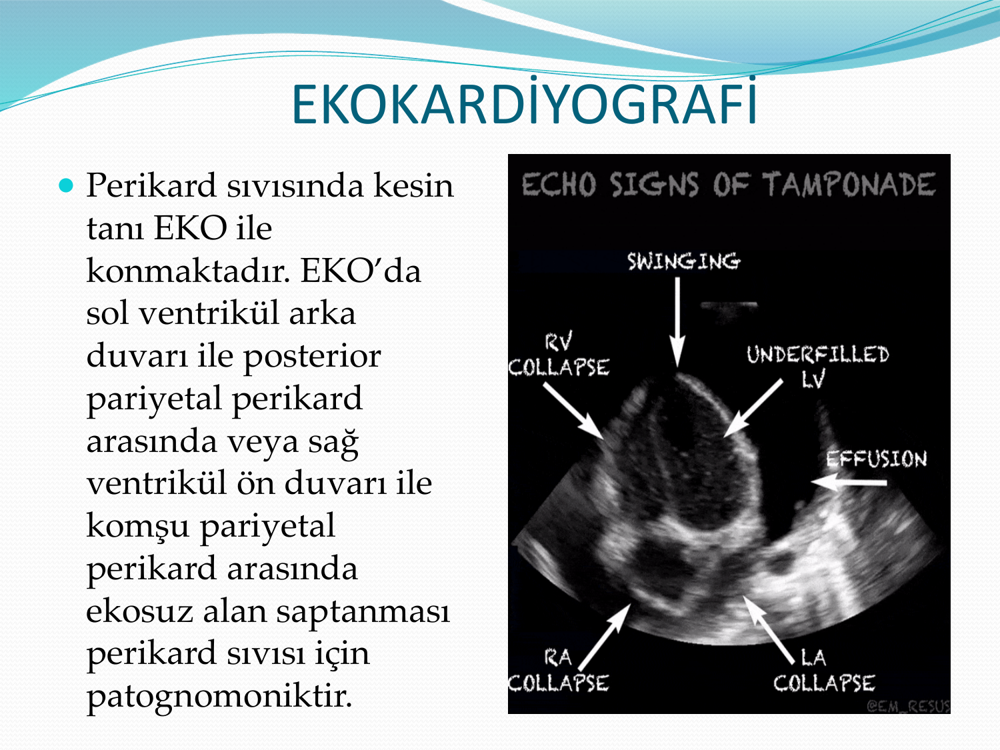

> **Şema yorumu:** PE'de EKG sinüs taşikardisiyle birlikte sağ kalp yüklenme bulguları gösterir. **SIQIIITIII paterni** (1. derivasyonda derin S, 3.'te Q dalgası, 3.'te ters T) bir çalışmada **%99'a varan özgüllükle** PE lehine en spesifik bulgudur. Ayrıca inferior (II, III, aVF) ve sağ prekordiyal (V1-4) derivasyonlarda **eş zamanlı T dalga inversiyonları** sağ ventrikül gerilimini yansıtır.

| Test | Kullanım |
|---|---|
| **Klinik şüphe** (Wells skoru) | İlk değerlendirme |
| **D-dimer <500 ng/mL** | Düşük pretest olasılıkta **dışlar** |
| **Akciğer grafisi** | Nonspesifik |
| **EKG** | Sinüs taşikardi, komplet/inkomplet sağ dal bloğu, sağ aks sapması, V1'de dominant R, P pulmonale, **SIQIIITIII**, atriyal taşiaritmiler, T inversiyonları (II-III-aVF + V1-4) |
| **Kan gazı** | Hipoksi + hipokapni |
| **EKO** | Sağ ventrikül yüklenmesi, pulmoner hipertansiyon |
| **V/Q sintigrafisi** | "Yüksek olasılık değilse dışlar" |
| **Venöz Doppler** | Odak arama |
| **Anjio BT (CTPA)** | **ALTIN STANDART** |

### Tedavi

* Hemodinamik stabil: **Antikoagülasyon** (LMWH -- enoksaparin 1 mg/kg 2×/gün; kanserde standart)
* Masif PE (hipotansiyon): **Trombolitik** (alteplaz)
* DOAC'lar (apiksaban, rivaroksaban) -- seçili kanser hastasında alternatif

---

## İNTESTİNAL OBSTRÜKSİYON

### Etyoloji

* **İleri evre kolorektal ve over kanseri**
* **Metastaz:** Akciğer kanseri, meme kanseri, melanom

### Patofizyoloji

* Tümörün mezenter/barsağa **infiltrasyonu**
* **Çölyak pleksus tutulumu**
* **Paraneoplastik nöropati** (özellikle SCLC)

### Klinik Bulgular

* Karın ağrısı
* Batın distansiyonu
* Hepatomegali
* **Bulantı ve kusma**
* Prognoz genellikle kötü

### Tedavi

* **Nazogastrik dekompresyon, sıvı-elektrolit replasmanı**
* **Octreotide** (somatostatin analoğu, Sandostatin 0.1 mg amp, LAR formu) -- sekresyonu azaltır
* Cerrahi/stent palyasyonu (seçili hastada)
* Opioid analjezi, anti-emetik

---

## ÜRİNER OBSTRÜKSİYON

### Etyoloji

* **Prostat kanseri, jinekolojik kanserler (serviks)**
* **Metastatik hastalık**
* **RT sonrası fibrozis**

### Semptomlar

* **Bilateral hidronefroz** (en tehlikeli senaryo)
* **Böbrek yetmezliği**
* Böğür ağrısı
* Üriner enfeksiyon
* Proteinüri, hematüri

### Tanı

* **Kreatinin** (ani yükselme)
* **Böbrek ultrasonografisi** (hidronefroz)

### Tedavi

* **Palyatif üriner diversiyon** -- fistül, sepsis riski
* **Perkütan nefrostomi** (acil dekompresyon)
* **Suprapubik sistostomi**
* JJ stent

---

## MALİGN BİLİYER OBSTRÜKSİYON

### Etyoloji

* **Pankreas kanseri**, **ampulla Vateri kanseri**
* Safra yolları kanseri (kolanjiokarsinom)
* HCC
* Karaciğere metastaz yapmış tümörler
* **Periduktal LN metastazı olan tümörler** (gastrik, kolon, meme, akciğer ca)

### Klinik

* **Sarılık** (konjuge hiperbilirubinemi)
* **Açık renk dışkı** (steatore)
* **Koyu idrar** (bilirubinüri)
* **Kaşıntı** (safra tuzları)
* Kilo kaybı

### Tedavi -- Palyatif

* **Endoskopik stent** (ERCP ile biliyer stent)
* **Perkütan transhepatik kolanjiyografi (PTK)**
* Cerrahi bypass (seçili hastada)

---

## İNTRAKRANİYAL METASTAZ VE KİBAS

> **Tanım:** İntrakraniyal metastaz kanser hastalarında **en sık ölüm sebeplerindendir**.

### En Sık Primer Kaynaklar

* **Akciğer kanseri** (en sık)
* **Meme kanseri**
* **Melanom**

### Klinik Bulgular

| Semptom | Açıklama |
|---|---|
| **Başağrısı** | Sabah kötüleşen, artan |
| Bulantı-kusma | Fışkırır tarzda olabilir |
| Davranış değişikliği | |
| **Konvülsiyon** | |
| Fokal ve progresif nörolojik değişiklikler | |
| **Papil ödemi** | KİBAS gelişen hastalarda |

### Tanı

* **BT** (ilk adım, kanamayı gösterir)
* **MRI (kontrastlı)** -- **en iyi yöntem**

**Metastaz içine kanama yapan tümörler** (5 klasik): **Melanom, germ hücreli tümör, renal hücreli karsinom, koryokarsinom, tiroid kanseri** (MGR-C-T mnemoniği).

### Tedavi

| Durum | Yaklaşım |
|---|---|
| **Herniasyon bulguları** | **ENTÜBE et** |
| **Mannitol** | 0.25-1 g/kg bolus (acil KİBAS yönetimi) |
| **Deksametazon** | 10 mg IV yükleme + 4 mg 6 saatte bir |
| **Çok sayıda lezyon** | **Tüm beyin RT (WBRT)** |
| **Tek lezyon veya oligometastatik** | **Cerrahi rezeksiyon veya stereotaktik RT (SRS)** |

---

## MALİGN HİPERKALSEMİ

> **Tanım:** Kanser veya tümör ürettiği maddeler sonucu serum kalsiyumunun yükselmesi. **En sık paraneoplastik sendromdur.**

### Epidemiyoloji

* İleri evre kanserlerde **%10** görülür
* **Ortalama sağkalım 3 ay** (hiperkalsemi gelişince kötü prognoz belirteci)

### Referans Değerler

| Parametre | Değer |
|---|---|
| Normal serum Ca | **8.15-10.5 mg/dL** (2-2.6 mmol/L) |
| **Düzeltilmiş Ca formülü** | **Ca + 0.8 × (4 -- albümin)** |
| **Malign hiperkalsemi eşiği** | >12 mg/dL |

### Etyoloji

| Kanser |
|---|
| **Akciğer skuamöz hücreli** karsinom |
| **Meme kanseri** |
| **Prostat kanseri** |
| **Baş-boyun kanserleri** |
| **Renal hücreli karsinom** |
| **Multiple myelom** |

### Patofizyolojik Mekanizmalar

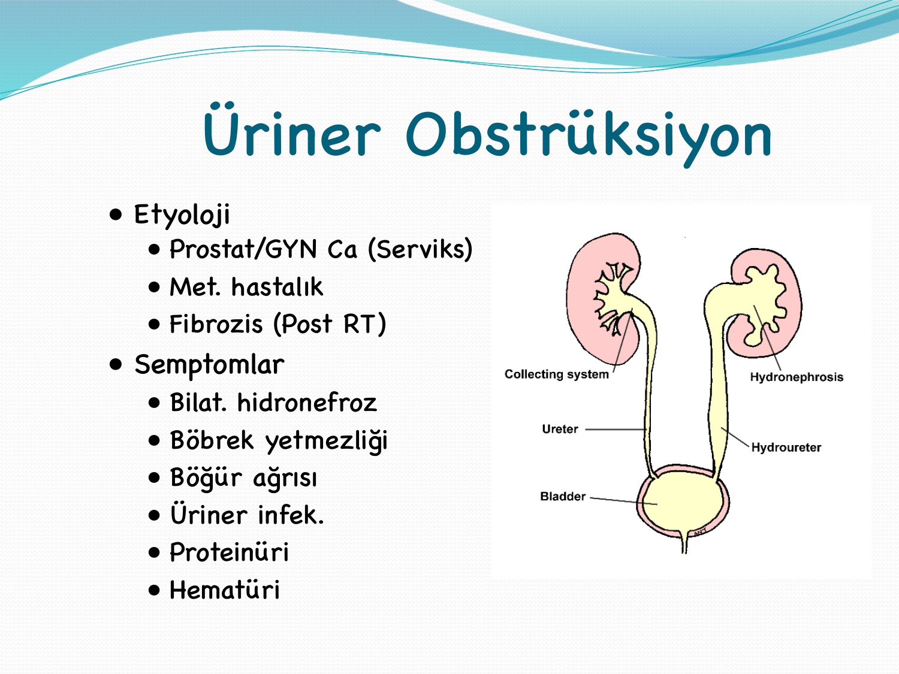

> **Şema yorumu:** Malign hiperkalsemi 3 ana mekanizma ile oluşur: **humoral** (PTHrP), **lokal osteolitik** (sitokinler) ve **D vitamini aracılı** (özellikle lenfomalarda 1α-hidroksilasyon).

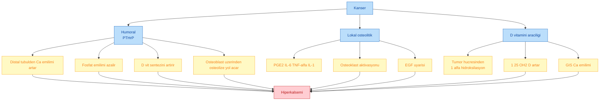

* **Humoral hiperkalsemi (PTHrP):** Paratiroid hormonu benzeri protein; en sık mekanizma (özellikle skuamöz hücreli karsinomlarda). Distal tübülde Ca emilimini artırır, fosfat emilimini azaltır, D vit sentezini artırır, osteoblast üzerinden kemik rezorpsiyonuna yol açar.
* **Lokal osteolitik hiperkalsemi:** PGE-2, IL-6, TNF-α, IL-1 osteoliz yapar; EGF osteoklastları aktive eder (MM, meme metastazı).
* **D vitamini ilişkili:** Tümör hücresi 1α-hidroksilasyon ile D vit aktif metabolitine dönüştürür (lenfomalar, granulomatöz).

### Klinik

| Semptomlar | Laboratuvar |
|---|---|
| **Bitkinlik** | **Elektrolitler** |
| İştahsızlık | Ca, PO₄, albümin |
| **Konstipasyon** | **Düzeltilmiş Ca:** Ca + 0.8 × (4 -- alb) |
| Polidipsi | **PTH** |
| Kas güçsüzlüğü | **PTHrP** |
| Bulantı, kusma | **1,25-dihidroksi D₃** |
| Şuur bulanıklığı | EKG: **QT kısalması** |

### Tedavi

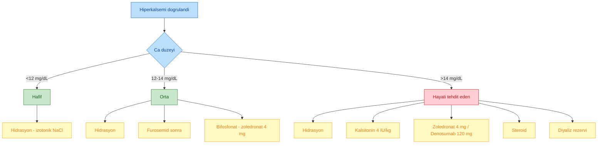

| Tedavi Seçeneği | Mekanizma / Doz |
|---|---|
| **Hidrasyon (izotonik NaCl)** | İlk yapılacak; Ca **1.6-2.4 mg/dL azalır**; tek başına yetersiz kalır |
| **Furosemid** | **Sıvı verildikten sonra**; Henle kulbunda Ca emilimini önler; aldığı-çıkardığı takibi şart; K ve Mg replasmanı gerekebilir |
| **Bifosfonatlar** | Kemikte hidroksiapatite bağlanır, osteoklastları inhibe eder |
| -- Zoledronik asit | **En potent**; 4 mg IV 15 dk; böbrek yetmezliğinde doz ayarı |
| -- Pamidronat | 90 mg IV 2-4 saat |
| -- İbandronat, klodronat | Alternatif |
| **Denosumab** | 120 mg SC; bifosfonat yanıtsız/KBH hastalarında |
| **Kalsitonin** | **Taşiflaksi gelişir** (24-48 saat sonra etki azalır); 4 IU/kg SC/IM 6-12 saatte bir |
| **Mitramisin (Plicamycin)** | Eski seçenek, az kullanılır |
| **Gallium nitrate** | Kemik rezorpsiyonunu inhibe eder |
| **Glukokortikoid** | Lenfoma, MM, D vit aracılı hiperkalsemide |
| **IV fosfat** | Nadiren, şiddetli hipofosfatemi varsa |
| **Diyaliz** | Böbrek yetmezliği veya dirençli olgu |

### Tedavi Seçimi Özet

| Ca (mg/dL) | Yaklaşım |
|---|---|
| **<12** (hafif) | **Hidrasyon** |
| **12-14** (orta) | **Hidrasyon + Bifosfonat** |
| **>14** (hayatı tehdit eden) | **Hidrasyon + Kalsitonin + Bifosfonat ± Steroid ± Mithramisin** |

---

## UYGUNSUZ ADH SENDROMU (SIADH)

> **Tanım:** ADH'nin uygunsuz salınımı ile **dilüsyonel hiponatremi** ve **konsantre idrar** oluşmasıdır.

### Schwartz-Bartter Tanı Kriterleri

1. **Serum Na <130 mEq/L**
2. **Plazma osmolalitesi <275 mOsm/kg**
3. **İdrar osmolalitesi >500 mOsm/kg**
4. **İdrar osmolalitesi > plazma osmolalitesi**
5. **Volüm açığı klinik bulgularının olmaması** (övolemi)
6. **Renal, adrenal ve tiroid fonksiyonlarının normal olması**

### Etyoloji -- 4 Mekanizma

1. **Ektopik ADH salınımı:** Tümör dokusundan (**SCLC en sık**, baş-boyun ca, pankreas ca), enfeksiyon, pnömotoraks veya astım gibi intratorasik basıncın arttığı durumlar
2. **Nörolojik hastalıklar:** Enfeksiyon, Guillain-Barré, beyin tümörü, hipotalamik ADH benzeri hormon salımı
3. **İlaçlar:** Karbamazepin, SSRI, antipsikotik, vinkristin, siklofosfamid, klorpropamid, NSAİİ
4. **Ekzojen olarak ADH veya oksitosin verilmesi**

### Semptomlar

| Hafif/orta (Na 125-135) | Ağır (Na <110) |
|---|---|
| Asemptomatik | Ekstensor plantar cevap |
| Anoreksi | Arefleksi |
| Depresyon, irritabilite | Psödobulber palsi |
| Konfüzyon | Koma |
| Letarji | Konvülsiyon |
| Kas güçsüzlüğü | **Ölüm** |
| Belirgin kişilik değişiklikleri | |

**⚠️ Erken:** Yorgunluk, bulantı-kusma. **Geç:** Letarji, konfüzyon, konvülsiyon, koma.

### Laboratuvar

* **Hiponatremi** (<135 mEq/L)
* **İdrar osmolalitesi > plazma osmolalitesi**
* **İdrar Na atılımı >30 mEq/L**
* **Övolemi** (volüm azalması yok)

### Tedavi

| Na Düzeyi | Yaklaşım |
|---|---|
| Na >130 | **Sıvı kısıtlaması ana tedavi** (500-1000 mL/24 saat) |
| **Na <130** | Distal tübüllerde vazopresin etkisini inhibe et:   -- **Demeklosiklin 900-1200 mg/gün (2×1)**   -- Lityum karbonat 300 mg (3×1)   -- **Vaptanlar** (tolvaptan 15 mg/gün) |
| **Na <125** veya konvülsiyon/koma | **%3 hipertonik salin** ve serbest suyu atmak için **1 mg/kg furosemid** |

> **⚠️ ÖNEMLİ:** **Na düzeltme hızı 0.5-1 mEq/saat'i geçmemelidir.** Daha hızlı yükseltme **osmotik demiyelinizasyon sendromu (santral pontin miyelinoliz)**, serebral ödem ve intrakraniyal herniasyona yol açabilir.

İdrar çıkışı ve elektrolitler yakın izlenmelidir.

---

## HİPOGLİSEMİ

> **Tanım:** Kan şekeri ≤50 mg/dL olan klinik sendrom.

### Etyoloji -- Kanser Hastasında

| Neden |
|---|
| **Pankreatik adacık hücre tümörü (insülinoma)** |
| **Mezenkimal tümörler** (retroperitoneal/torasik -- insülin benzeri büyüme faktörü [IGF-II] üretir) |
| İğsi hücreli sarkom |
| **Hepatoma** (KC yetmezliği veya tümör glukoz tüketimi) |
| Adrenokortikal tümör |
| **Karaciğer metastazları** (KC yetmezliği, tümör glukoz kullanımı) |
| **Lösemi** |
| İnsülin reseptör antikoru yapımını indükleyen tümörler |

### Klinik Belirtiler

* **Mental değişiklikler, koma**
* **Hipotansiyon**
* Terleme, solukluk
* Çarpıntı, tremor (adrenerjik)

### Tedavi

| Akut | Kronik / Palyatif |
|---|---|
| **Glukoz (IV %50 dextroz)** | Diazoksid (insülin salınımını inhibe eder) |
| Tekrarlayıcıda glukagon | Steroid (insülin direnci artırır) |
| | **Somatostatin analoğu** (oktreotid) |
| | Cerrahi (tümör rezeksiyonu) |
| | Hepatomda alkol/kriyoterapi |

---

## ADRENAL YETMEZLİK

### Etyoloji (Kanser Hastasında)

| Neden | Açıklama |
|---|---|
| **Bilateral sürrenal metastazı** | Akciğer, meme, kolon, böbrek kanserleri, lenfoma |
| Bilateral sürrenalektomi | Cerrahi |
| **Hemorajik nekroz** | Sepsis, antikoagülan ilişkili |
| **İlaçlar** | Mitotane, ketokonazol, suramin, aminoglutetimid |
| **Steroid ve megestrol asetat tedavisinin aniden kesilmesi** | İyatrojenik |
| **Hipofiz veya hipotalamus metastazı** | Sekonder adrenal yetmezlik |

### Semptomlar

* Bulantı ve kusma
* Güçsüzlük
* Anoreksi
* Ortostatik hipotansiyon

### Tanı

| Test | Yorum |
|---|---|
| **Sabah serum kortizol <3 μg/dL** | Adrenal yetmezlik (tanı konur) |
| Sabah serum kortizol 3-10 μg/dL | **ACTH (Synacthen) uyarı testi** yapılmalı; 30-60 dk sonra kortizol **<18 μg/dL** → tanı |
| Sabah serum kortizol >18 μg/dL | Dışlanır |
| **Serum ACTH** | Primer AY'de **çok düşük**; sekonder/tersiyerde **10 μg/dL üzeri** |

### Tedavi

* **Hidrokortizon (steroid replasmanı)** -- akut krizde 100 mg IV bolus + 50-100 mg 6 saatte bir
* **Sıvı-elektrolit tedavisi** (IV %0.9 NaCl ± %5 dextroz)
* **Etyolojiye yönelik tedavi**

---

## LAKTİK ASİDOZ

> **Tanım:** Kanserin nadir, potansiyel olarak **fatal bir komplikasyonu**; sepsis ve dolaşım bozukluğuna eşlik eder, terminal kanser hastasının ölümünde rol oynar.

### Etyoloji

* **Lösemi, lenfoma** ve bazı solid tümörlerde **hipoksemi olmadan** gelişebilir
* **Yaygın karaciğer tutulumu** çoklukla vardır

### Klinik

* Karaciğer disfonksiyonunda laktat birikir
* **Takipne, taşikardi, mental bozukluklar, hepatomegali**
* **Serum laktik asid düzeyi 10-20 mEq/L (90-180 mg/dL)**'ye erişebilir

### Tedavi

* **Sebebe yönelik** (prognoz kötüdür)
* **Asidoz** ana problemdir
* Şiddetli asidozda (**pH <7.15**) **NaHCO₃** verilebilir

---

## TÜMÖR LİZİS SENDROMU (TLS)

> **Tanım:** Tümör hücrelerinin ölmesi ve hücre içeriklerinin dolaşıma salınması sonucu oluşan **metabolik anormallikler** triadı.

### Tetrad

* **Hiperürisemi**
* **Hiperfosfatemi**
* **Hiperpotasemi**
* **Semptomatik hipokalsemi** (fosfatla kalsiyumun birleşip çökmesi sonucu sekonder)

### Zamanlama

* Kemoterapiden **önce de** olabilir
* Genellikle **kemoterapi başlandıktan 12-72 saat sonra** gelişir

### Etyoloji

**Kemoterapiye cevaplı hastalıklar:**

* **ALL, KLL**
* **Burkitt lenfoma** (en yüksek risk)
* Yüksek gradlı non-Hodgkin lenfomalar
* **Solid tümörler** (germ hücreli tümör, SCLC -- daha az sıklıkla)

### Yüksek Riskli Hasta (Cairo-Bishop)

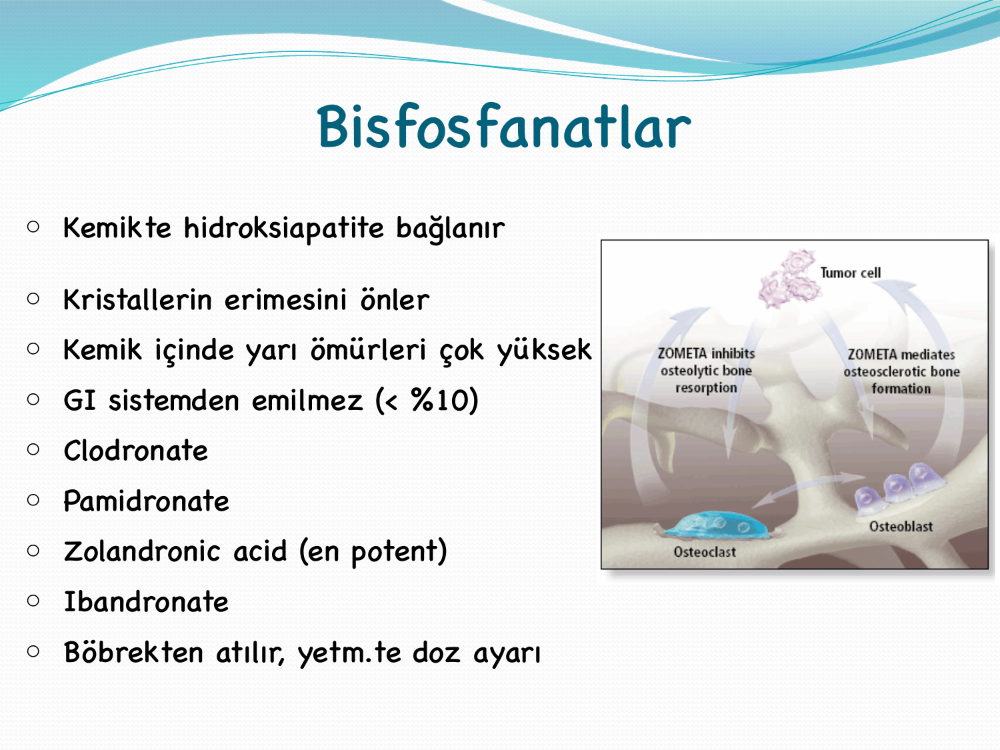

> **Şema yorumu:** Cairo-Bishop kriterleri laboratuvar (ürik asit, K, P, Ca, kreatinin %25 değişim) + klinik (ABH, aritmi, konvülsiyon) bulgularıyla tanımlanır. Yüksek riskli hastalar agresif profilaksiye alınır.

| Parametre | Değer |
|---|---|
| **Lökosit** | >100.000 /μL |
| **Bulky tümör kitlesi** | >10 cm |
| **Yüksek kreatinin** | >2.4 mg/dL |
| **Yüksek ürik asit** | >7.5 mg/dL |
| **LDH** | >1000 U/L |

### İzlem

| Tetkik | Neden |
|---|---|
| **Tam kan sayımı** | Tümör yükü |
| **Kreatinin** | ABH gelişimi |
| **Ürik asit** | Hiperürisemi |
| **Na, K, Ca, PO₄** | Elektrolit takibi |
| **İdrar pH** | Alkalinizasyon hedefi >7 |
| **Aldığı/çıkardığı sıvı takibi** | Sıvı dengesi |

### Profilaksi

| İlaç / Önlem | Doz |
|---|---|
| **Allopurinol** | **300-600 mg/gün PO** (ksantin oksidaz inhibitörü) |
| **IV sıvı** | **3000 mL/m²/gün** (agresif hidrasyon) |
| **Na bikarbonat** | **50 mEq/L** veya **asetazolamid 2-3 amp/L** (84 mg/mL, 10 mL amp) |
| İdrar pH hedefi | **>7** (ürik asit nefropatisi ve ABH'den korunmak için) |
| **Kalsiyum glukonat** | Semptomatik hipokalsemi varsa |
| **Rasburikaz** | Rekombinant ürat oksidaz (yüksek riskli hastada allopurinol yerine -- ürat → allantoin dönüştürür, idrar alkalinizasyonu gerekmez) |

> **⚠️ NOT:** Allopurinol yeni ürik asit oluşumunu engeller ama mevcut ürik asidi düşürmez. **Rasburikaz ise mevcut ürik asidi dakikalar içinde temizler** -- yüksek riskli hastada tercih edilir.

### Tedavi

* Hiperpotasemi (K >6.5): IV Ca glukonat + glukoz-insülin + K bağlayıcı reçine
* Hiperfosfatemi: Fosfat bağlayıcılar
* **Hemodiyaliz** (ağır elektrolit bozukluğu, ABH, dirençli olgu)

---

## TİFLİTİS (NÖTROPENİK ENTEROKOLİT)

> **Tanım:** **Çekum ve komşu kolonun nekrozu**; nötropeni zemininde ortaya çıkar.

### Klinik

* **Sağ alt kadran ağrısı, hassasiyet, rebound**
* Distansiyon, **ateş ve nötropeni**
* **Sulu diyare ve bakteremi** sıktır
* **Kanama** gelişebilir

### Tedavi

| Yaklaşım |
|---|
| **Acil geniş spektrumlu antibiyotik** (piperasilin-tazobaktam, meropenem; anaerob kapsamı şart) |
| **Nazogastrik dekompresyon** |
| **Oral alım kesilir** |
| **Sıvı replasmanı** |
| **Yakın izlem** |
| Klinik 24 saat içinde gerilemez veya **perforasyon** gelişirse **acil cerrahi** |

---

## HEMORAJİK SİSTİT

> **Tanım:** **Siklofosfamid ve ifosfamid** tedavisi sonrası gelişen hemorajik mesane inflamasyonu.

### Patogenez

* Sorumlu metabolit: **Akrolein**
* İdrarla atılır, mesanede **uzun süreli temas veya yüksek konsantrasyonda irritasyon ve hemoraji** yapar

### Önleme (en etkili)

| Strateji |
|---|
| **İdrar hacmi yüksek tutulur** (agresif hidrasyon) |
| **Kimyasal antagonist: MESNA** (2-merkaptoetan sülfonat) |
| **MESNA dozu:** İfosfamid dozunun **%20'si** dozlar hâlinde **üç dozda** uygulanır (0, 4, 8. saat) |

### Destek Tedavisi Yetmezse

1. **10 dk süreyle %0.37-0.74 formalin solüsyonu** ile mesane yıkaması
2. **N-asetilsistein** ile mesane yıkaması
3. **Nadiren sistektomi** gerekir

---

## FEBRİL NÖTROPENİ

> **Tanım:** Nötropenik hastada **ateş** varlığı; kanser hastasında **onkolojik acildir**.

### Tanı Kriterleri

| Ateş Kriteri | Nötropeni Kriteri |
|---|---|
| **Oral sıcaklık ≥38.3°C (tek seferlik)** | **Nötrofil <500/mm³** |
| **veya ≥38°C ve >1 saat süreyle** | **veya <1000/mm³** fakat ilk 48 saat içinde 500/mm³ altına düşme ihtimali yüksek |
| | **Ağır nötropeni: <100/mm³** |

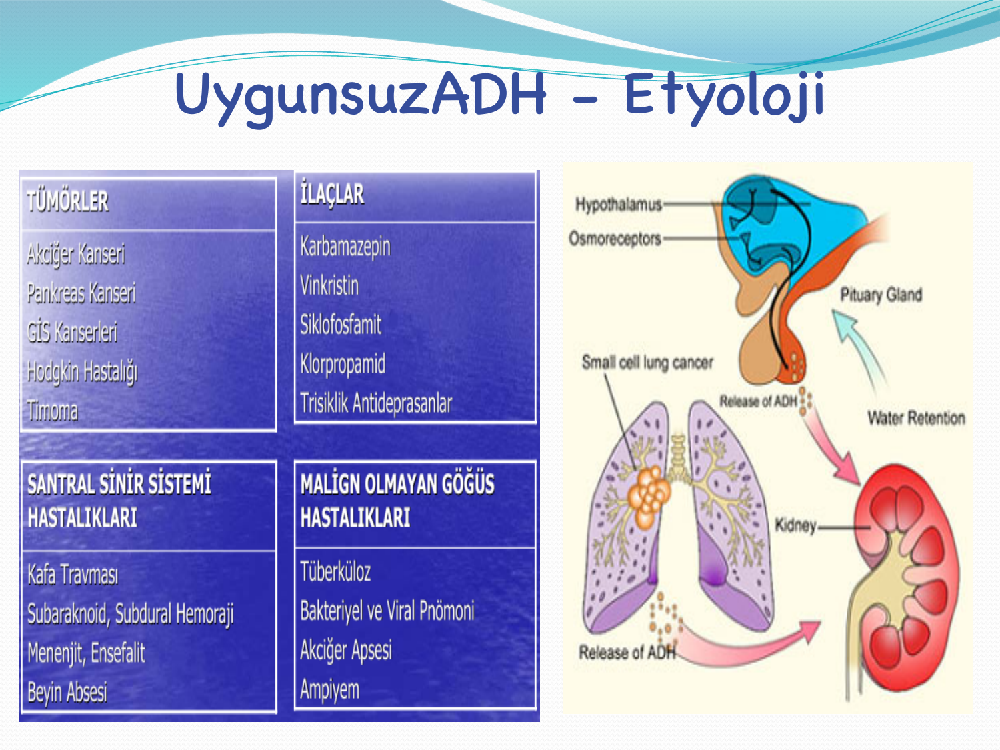

> **Şema yorumu:** Nötropenik ateşli hastada **saatler içinde** ampirik geniş spektrumlu antibiyotik başlanmalıdır; her geçen saat mortaliteyi artırır.

### Değerlendirme

#### Ayrıntılı Anamnez

Önceki tedaviler, kullandığı ilaçlar, son 6 ayda enfeksiyon öyküsü, kateter, nötropeni süresi.

#### Her Gün Ayrıntılı Fizik Muayene

| Bölge | Aranacak |
|---|---|
| **Oral mukoza** | Mukozit, aft, diş eti infeksiyonu |
| **Sinüs hassasiyeti** | Sinüzit, aspergillus |
| **Akciğerler** | Ral, raller |
| **Cilt ve tırnaklar** | Selülit, döküntü, tırnak lokalizasyonu |
| **Kateter yolları** (periferal ve santral) | Hassasiyet, eritem |
| **Perianal bölge** | Enfeksiyon ve abse (ağrı, dolgunluk, fluktuasyon) -- **palpasyonla** |

> **⚠️ REKTAL TUŞE HİÇBİR ZAMAN YAPILMAZ!** -- nötropenik hastada bakteriyemi ve perianal abse riski vardır.

### Tetkikler

| Test |
|---|
| KC ve böbrek fonksiyonları |
| Elektrolitler |
| **Tam kan sayımı ve periferik yayma** |
| TİT (tam idrar tetkiki) |
| O₂ saturasyonu |
| **ACPA -- XR (akciğer grafisi)** |
| Gerekirse **HRCT** |
| Konfüzyon varsa **lomber ponksiyon** |
| **Kültürler:** |
| -- Kan ×2 (1 santral kateter, 1 periferik) |
| -- İdrar |
| -- Dışkı + **C. difficile toksini** (ishalde) |
| -- Ciltten sürüntü (enfeksiyon bulgusunda) |

### Tedavi -- Ampirik Antibiyoterapi

**Yüksek riskli hasta (hospitalizasyon + IV):**

* **Piperasilin-tazobaktam 4.5 g 4×1 IV** VEYA
* **Seftazidim / sefepim 2 g 3×1 IV** VEYA
* **Meropenem 1 g 3×1 IV** VEYA
* **İmipenem-silastatin 500 mg 4×1 IV**

**Belirli durumlarda eklenir:**

| Durum | Ajan |
|---|---|
| Santral kateter enfeksiyonu şüphesi, MRSA riski, mukozit, ağır sepsis | **Vankomisin** |
| Persistan ateş >4-7 gün, tipik klinik | **Antifungal** (flukonazol, vorikonazol, amfoterisin B) |
| Anaerob şüphesi (perianal, tiflitis) | **Metronidazol** veya anaerob etkili karbapenem |
| Fungal risk (uzamış nötropeni) | Profilaktik **flukonazol** veya **posakonazol** |

**G-CSF profilaksisi:** Febril nötropeni riski %20'den büyük rejimlerde primer profilaksi; ikincil profilaksi önceki siklusda FN gelişti ise.

### "Eve Gidebilecek" (Düşük Riskli) Hasta Kriterleri

Ayaktan oral antibiyoterapiye uygunluk için:

* **Solid tümör**
* Oral sıvı ve ilaç içebilen
* **PEG'i olmayan**
* **1 saat içinde hastaneye gelebilecek** (hasta ve yakınlarının bunun önemini algılaması şart)
* **24 saat sürekli yanında bakıcı olan**
* Oturduğu yerde telefon ve transportasyonu olan
* Antibiyotik kullanmakta olmayan
* **15 yaşından büyük**
* **Kinolon alerjisi olmayan**

> **MASCC Skoru:** Bu kriterleri kantitatif hale getiren standart skorlama sistemidir; **≥21 puan → düşük risk**, ayaktan oral tedavi değerlendirilebilir.

Oral ajanlar: **Siprofloksasin 750 mg 2×1 + amoksisilin-klavulanat 875/125 mg 2×1** (düşük riskli, MASCC ≥21).

---

## İNFÜZYON REAKSİYONLARI (İNSAN ANTİKOR İNFÜZYONU)

> **Tanım:** Monoklonal antikor veya biyolojik ajan infüzyonu sırasında **hipersensitivite veya sitokin salınımı** ile gelişen akut klinik reaksiyon.

### Riskli Ajanlar

| Ajan Grubu | Örnekler |
|---|---|
| **Anti-CD20** | Rituksimab, obinutuzumab, ofatumumab |
| **Taksanlar** | Paklitaksel, dosetaksel (Cremophor-EL solventine bağlı) |
| **Platin türevleri** | Karboplatin, oksaliplatin (tekrarlı siklüslerde IgE ilişkili) |
| **Anti-EGFR** | Setuksimab (α-gal hipersensitivitesi, özellikle ABD güneyi) |
| **Antikor-ilaç konjugatları** | Trastuzumab emtansin |
| **Kimoimmün tedavi** | Kemoterapi + rituksimab kombinasyonları |

### Klinik Görünüm

| Tip | Zamanlama | Bulgular |
|---|---|---|
| **Tip I (IgE)** | İlk 5-15 dk | Ürtiker, angioödem, bronkospazm, hipotansiyon, anafilaksi |
| **Sitokin salınım sendromu** (infüzyon ilişkili) | İlk infüzyon dakikalarında | Titreme, ateş, flushing, göğüs sıkışması, dispne, hipo/hipertansiyon |
| **Gecikmiş** | Saatler sonra | Serum hastalığı benzeri, artralji, döküntü |

### Yönetim

| Basamak | Eylem |
|---|---|
| **Hafif** (grade 1-2) | İnfüzyonu yavaşlat, antihistaminik (difenhidramin 25-50 mg IV), parasetamol |
| **Orta** (grade 3) | İnfüzyonu durdur, antihistaminik + kortikosteroid (metilprednizolon 100 mg IV) |
| **Şiddetli / anafilaksi** (grade 4) | **Adrenalin 0.3-0.5 mg IM** (1:1000, uyluk), O₂, sıvı, ileri yaşam desteği |

### Premedikasyon (Rituksimab için standart)

* **Difenhidramin 25-50 mg IV + Parasetamol 500-1000 mg PO**, infüzyondan 30 dk önce
* Yüksek riskli hastada ek olarak **metilprednizolon 100 mg IV**
* İlk infüzyon yavaş başlatılır (50 mg/saat), tolerans gösterilirse 50 mg/saat artışla maksimum 400 mg/saat'e çıkılır.

---

## KEMOTERAPİ SONRASI HEMOLİTİK ÜREMİK SENDROM VE TTP

> **Tanım:** Kemoterapiye bağlı trombotik mikroanjiyopati (TMA); klasik triad: **mikroanjiyopatik hemolitik anemi (MAHA)** + **trombositopeni** + **akut böbrek hasarı** (HUS) ya da buna ek nörolojik bulgular (TTP).

### Etyoloji (Kanser Hastasında TMA Nedenleri)

| Neden | Örnek |
|---|---|
| **Kemoterapi ajanları** | **Mitomisin C** (en klasik), gemsitabin, sisplatin, bleomisin, 5-FU |
| **Anti-VEGF ajanlar** | Bevacizumab, aflibersept, sunitinib |
| **Kalsinörin inhibitörleri** (KİT sonrası) | Siklosporin, takrolimus |
| **KİT / HSCT** | Transplantasyon ilişkili TMA |
| **Kanserin kendisi** | Müsinöz adenokarsinom (mide, meme, akciğer, pankreas) |
| **İnfeksiyon** | *E. coli* O157:H7 (tipik HUS) |

### Klinik

| Bulgu | Açıklama |
|---|---|
| **MAHA** | Şistositler periferik yaymada, LDH↑, haptoglobin↓, indirekt bilirubin↑, retikülosit↑ |
| **Trombositopeni** | Tipik olarak <50 × 10⁹/L |
| **AKİ** (HUS baskın) | Oligüri, kreatinin artışı, proteinüri |
| **Nörolojik** (TTP baskın) | Konfüzyon, konvülsiyon, fokal defisit, koma |
| **Ateş** | Seyrek, TTP'de klasik pentad |

### Ayırıcı Tanı

| Tanı | Ayırıcı İpucu |
|---|---|
| **TTP (idiopatik)** | ADAMTS13 aktivitesi <%10; anti-ADAMTS13 antikoru |
| **Kemoterapi ilişkili TMA** | ADAMTS13 normal veya hafif düşük |
| **DİK** | PT/aPTT uzun, fibrinojen düşük, D-dimer yüksek |
| **Atipik HUS** | Komplement disregülasyonu (C3, faktör H/I mutasyonu) |
| **Sepsis** | Enfeksiyon tablosu, kültür pozitifliği |

### Tedavi

| Yaklaşım |
|---|
| **Sorumlu ilacı kes** (gemsitabin, mitomisin C gibi) |
| **Plazmaferez** (TTP'de hayat kurtarıcı -- ADAMTS13 eksikliği varsa; kanser-ilişkili TMA'da etkisi değişken) |
| **Taze donmuş plazma (TDP)** (plazmaferez yapılamazsa köprü) |
| **Eculizumab** (atipik HUS; komplement aracılı TMA) |
| **Destek tedavisi** -- transfüzyon (ihtiyaç halinde eritrosit; **trombosit verme** -- tromboz kötüleşir) |
| **Hemodiyaliz** (AKİ varsa) |
| **Kortikosteroid** (idiopatik TTP'de) |

> **⚠️ ÖNEMLİ:** **Aktif TMA'da trombosit transfüzyonu kaçınılmadıkça yapılmaz** -- trombotik olayları kötüleştirebilir.

---

## PULMONER İNFİLTRATLAR

> **Tanım:** Kanser hastasında görüntülemede saptanan **yeni ortaya çıkan akciğer parankim opasiteleri**; enfeksiyöz ve non-enfeksiyöz nedenler ayrımı kritiktir.

### Ayırıcı Tanı Çerçevesi

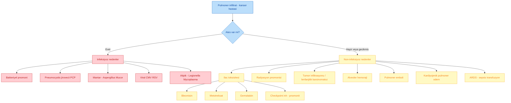

### Tanı Yaklaşımı

| Test | Amaç |
|---|---|
| **HRCT** | Ayrıntılı parankim değerlendirmesi (buzlu cam, nodüler, kavite, plevral efüzyon) |
| **Kültürler** | Kan, balgam, bronkoalveoler lavaj (BAL) |
| **Galaktomannan, (1→3)-β-D-glukan** | İnvazif fungal enfeksiyon markerları |
| **BAL** | PCP (PCR, boyama), CMV (PCR), galaktomannan |
| **Viral PCR** | CMV, RSV, influenza, adenovirüs, SARS-CoV-2 |
| **Biyopsi** | Transtorasik veya transbronşiyal (tümör, ilaç toksisitesi, organize pnömoni) |

### İlaç İlişkili Pulmoner Toksisite Örnekleri

| İlaç | Paten |
|---|---|
| **Bleomisin** | Dozla ilişkili diffüz pulmoner fibrozis; baz FO₂ sınırlamak gerekir |
| **Metotreksat** | Hipersensitivite pnömonisi, eozinofili |
| **Gemsitabin** | Non-kardiyojenik pulmoner ödem |
| **Siklofosfamid** | Geç başlangıçlı fibrozis |
| **Anti-PD-1 / Anti-PD-L1** (nivolumab, pembrolizumab) | **Checkpoint-inhibitör pnömoniti** -- organize pnömoni, NSIP paterni |
| **Trastuzumab emtansin** | Pnömonit |
| **EGFR TKI** (gefitinib, erlotinib, osimertinib) | İntersisyel akciğer hastalığı |

### Tedavi (Yaklaşım)

* **Febril nötropenik pulmoner infiltratta:** Ampirik antibiyotik + **antifungal** (persistan ateşte) + PCP kapsamı (CD4 <200 veya lenfopenik: **trimetoprim-sulfametoksazol**)
* **Checkpoint inhibitör pnömoniti:** Etken ajanı kes + **yüksek doz steroid** (metilprednizolon 1-2 mg/kg/gün IV), grade 3-4'te infliksimab veya mikofenolat
* **Bleomisin fibrozu:** Etkeni kesin + steroid denemesi (tartışmalı)

---

## KLİNİK VAKA ÖRNEKLERİ

**📋 VAKA ÖRNEĞİ 1: SVK Sendromu**

**Hasta:** 58 yaşında erkek, 40 paket-yıl sigara, 2 hafta önce yüzde ve kollarda şişlik şikayeti.

**Öykü:** Dispne artışı, sabah yüzde belirgin şişme, boyun venlerinde dolgunluk.

**Fizik Muayene:** Nabız 102/dk, TA 130/85 mmHg, SpO₂ %93. Yüzde pletore, kollarda +1 ödem, boyunda belirgin venöz dilatasyon.

**Görüntüleme:** Torasik BT: Sağ üst mediastinumda 6 cm kitle, SVK'ya dıştan bası. **Biyopsi:** SCLC.

**Tedavi:** Baş yükseltme, deksametazon 4 mg 6 saatte bir IV, **endovasküler SVK stent**, ardından **sisplatin-etoposid kemoterapisi + konkomitan torasik RT**.

**Öğretici Not:** SCLC SVK'nın **en yanıtlı** nedenidir -- tanı konduktan sonra KT + RT ile dramatik semptom rahatlaması sağlanır. Stent acil palyasyon sağlar ama kesin tedavi kemoterapidir.

**📋 VAKA ÖRNEĞİ 2: Tümör Lizis Sendromu**

**Hasta:** 22 yaşında erkek, yeni tanı **Burkitt lenfoma**, lökosit 45.000, LDH 2400 U/L, ürik asit 11 mg/dL, K 5.8 mEq/L.

**Değerlendirme:** Yüksek risk TLS; kemoterapi öncesi profilaksi şart.

**Profilaksi:** IV hidrasyon 3000 mL/m²/gün + **rasburikaz 0.2 mg/kg/gün IV** + yakın K/P/Ca/kreatinin izlemi.

**İzlem:** 12-72 saat içinde tetrad taraması, diyaliz hazırlığı.

**Öğretici Not:** Burkitt lenfoma TLS için **en yüksek riskli** hastalıktır. Allopurinol değil **rasburikaz** tercih edilir çünkü mevcut ürik asidi hızla temizler. İdrar alkalinizasyonu rasburikaz ile gereksizdir (hatta fosfat çökelmesini artırır).

**📋 VAKA ÖRNEĞİ 3: Malign Hiperkalsemi**

**Hasta:** 65 yaşında kadın, meme kanseri metastazı, letarji, konstipasyon, polidipsi.

**Lab:** Ca 14.2 mg/dL, albümin 3.2 (düzeltilmiş Ca: 14.2 + 0.8×0.8 = 14.8 mg/dL), PTH baskılı, **PTHrP yüksek**, kreatinin 1.5.

**Tedavi:**
1. IV NaCl 300 mL/saat (8 saat) -- sonra 150 mL/saat
2. **Zoledronat 4 mg IV 15 dk**
3. Kalsitonin 4 IU/kg 12 saatte bir (ilk 48 saat, taşiflaksi öncesi)
4. Na/K takibi, idrar çıkışı izlemi

**48. Saat:** Ca 11.1 mg/dL -- semptomatik düzelme, taburculuk.

**Öğretici Not:** Malign hiperkalsemide bifosfonat **48-72 saat içinde** etki eder; erken dönem **kalsitonin köprü tedavisidir**. Kronik denosumab bifosfonat yanıtsız olguda kullanılır.

**📋 VAKA ÖRNEĞİ 4: Febril Nötropeni**

**Hasta:** 48 yaşında kadın, AML indüksiyon tedavisi 12. gün, ateş 38.6°C, nötrofil 200/mm³, santral kateter yerinde.

**Muayene:** Kateter giriş yerinde eritem, diğer odak yok.

**Tetkik:** 2 set kan kültürü (1 kateter, 1 periferik), idrar, ACPA, CRP 180.

**Ampirik Tedavi:** **Piperasilin-tazobaktam 4.5 g IV 6 saatte bir + vankomisin 15 mg/kg IV 12 saatte bir** (kateter enfeksiyonu şüphesi).

**48. Saat:** Kateter kültüründe MRSA üretildi -- vankomisine devam, kateter çekildi. Ateş düştü, nötrofil 800'e çıktı.

**Öğretici Not:** Nötropenik ateş kanser hastalığının %1-2 mortaliteli ancak tanınmazsa %30'a çıkan bir acildir. **İlk 60 dakika içinde antibiyotik başlanmalıdır.** Kateter şüphesinde MRSA kapsamı (vankomisin) eklenir. Rektal tuşe YAPILMAZ.

---

**Kaynak:** Dr. Öğr. Üyesi Esin Oktay ders slaytı (65 sayfa), Adnan Menderes Üniversitesi Tıbbi Onkoloji Bilim Dalı. Ek referans: Wilson L, N Engl J Med 2007 (SVK); NCCN, ESMO onkolojik aciller kılavuzları.
