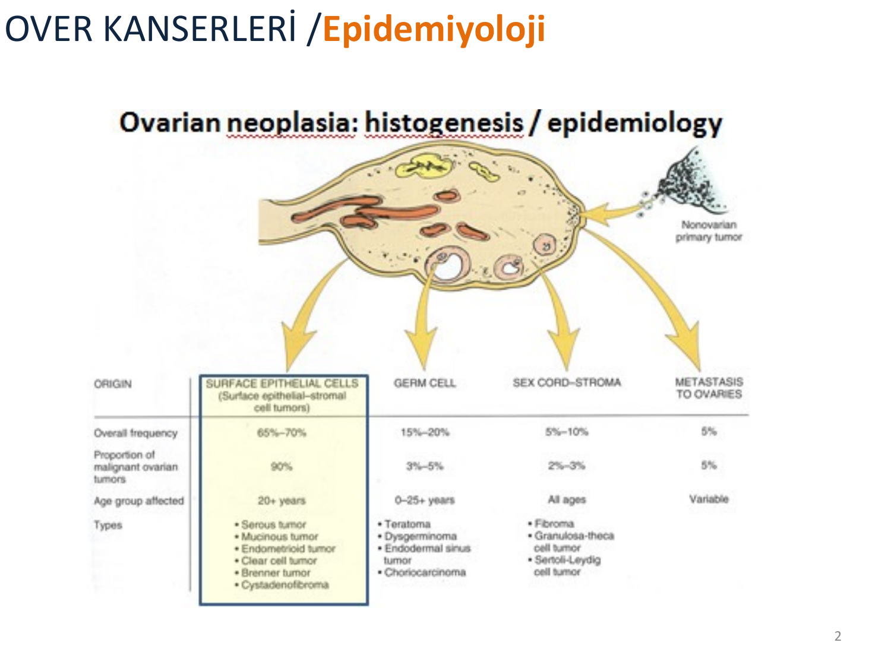
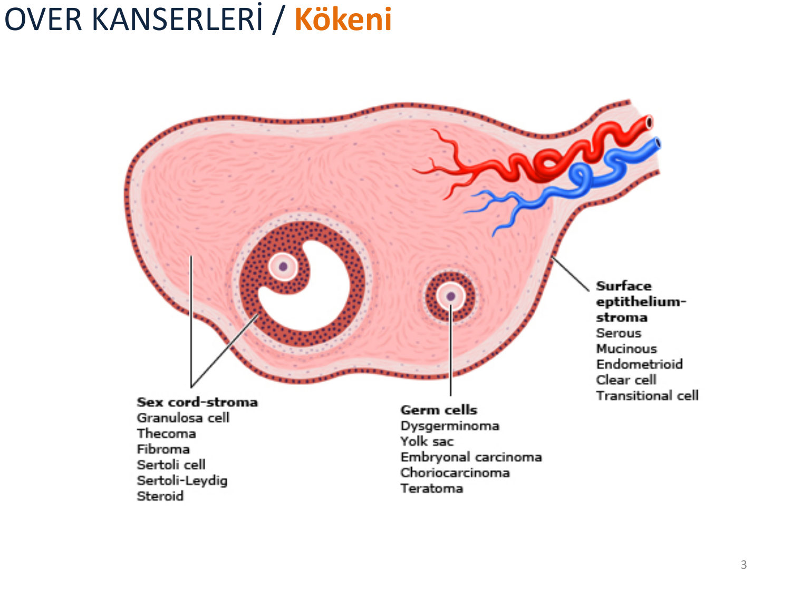
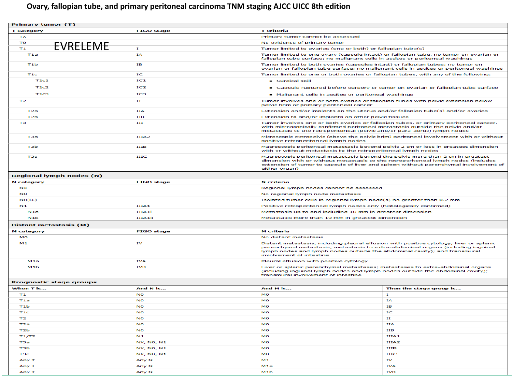
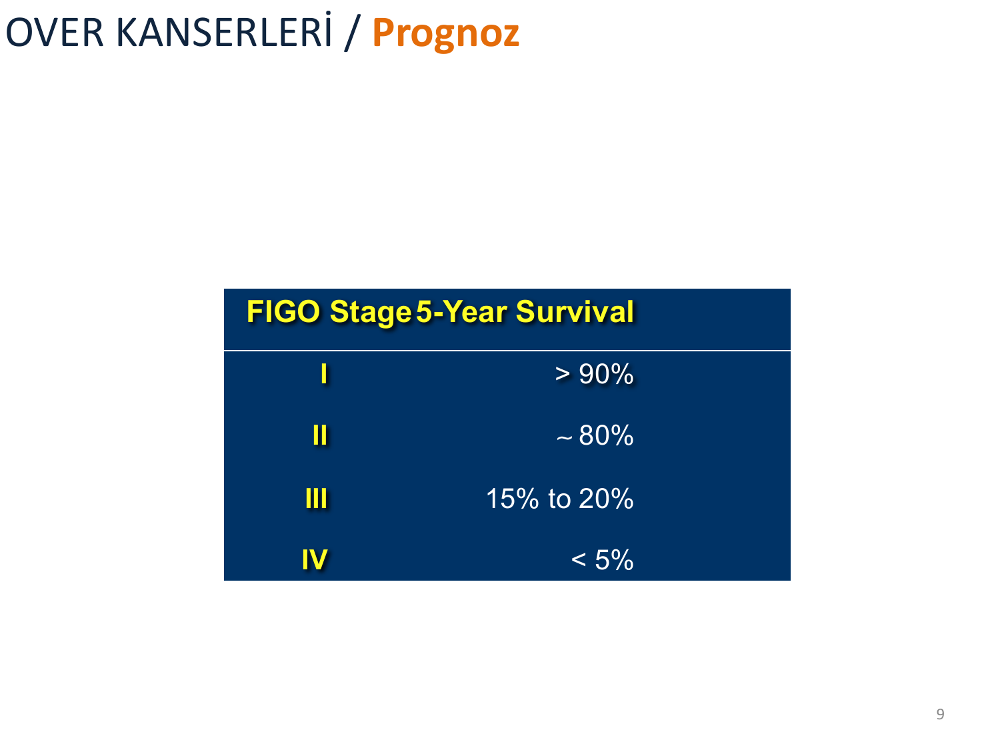
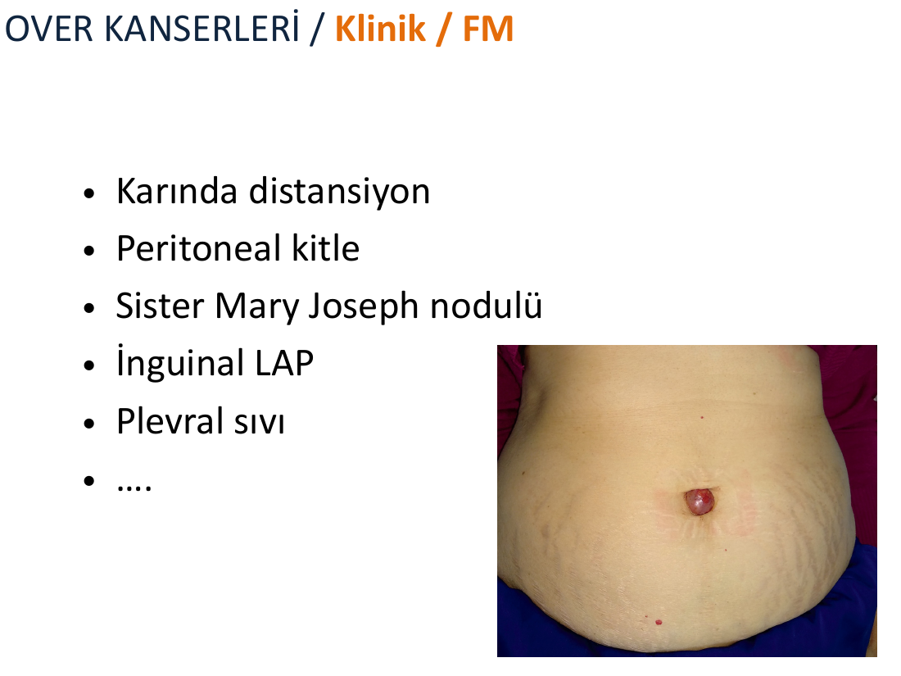
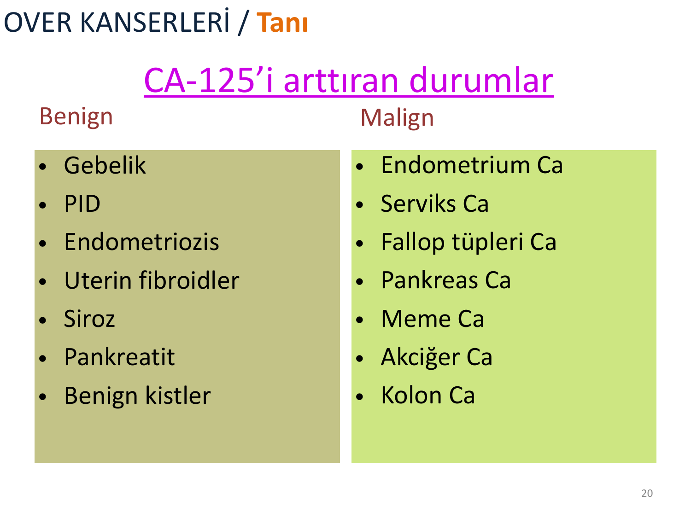
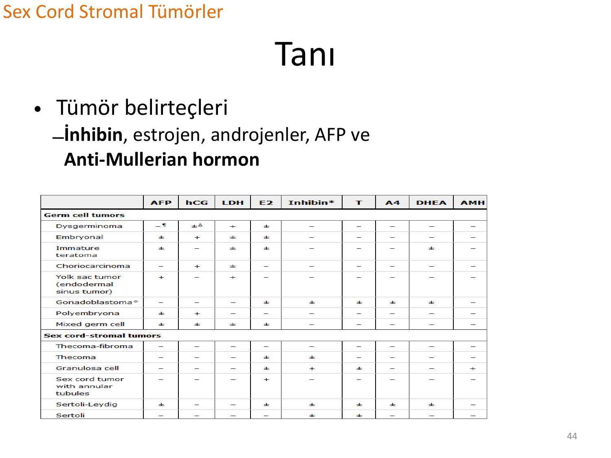
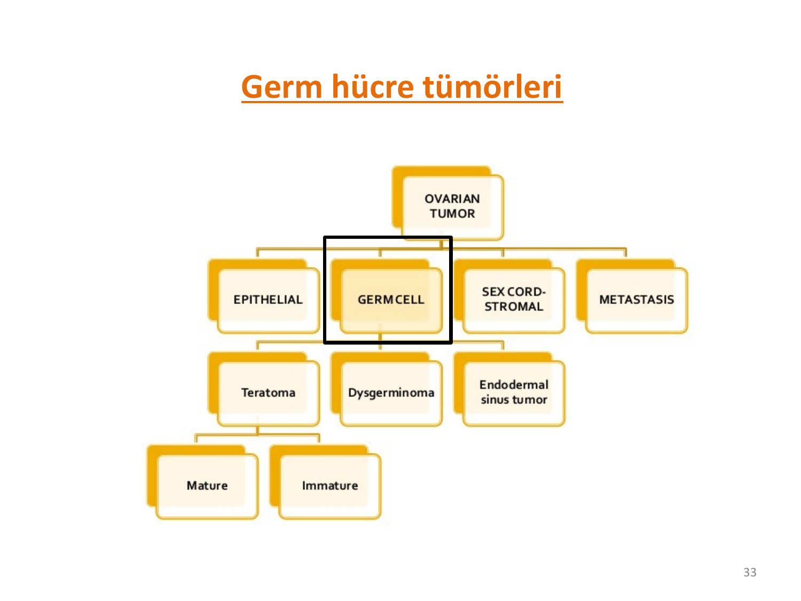
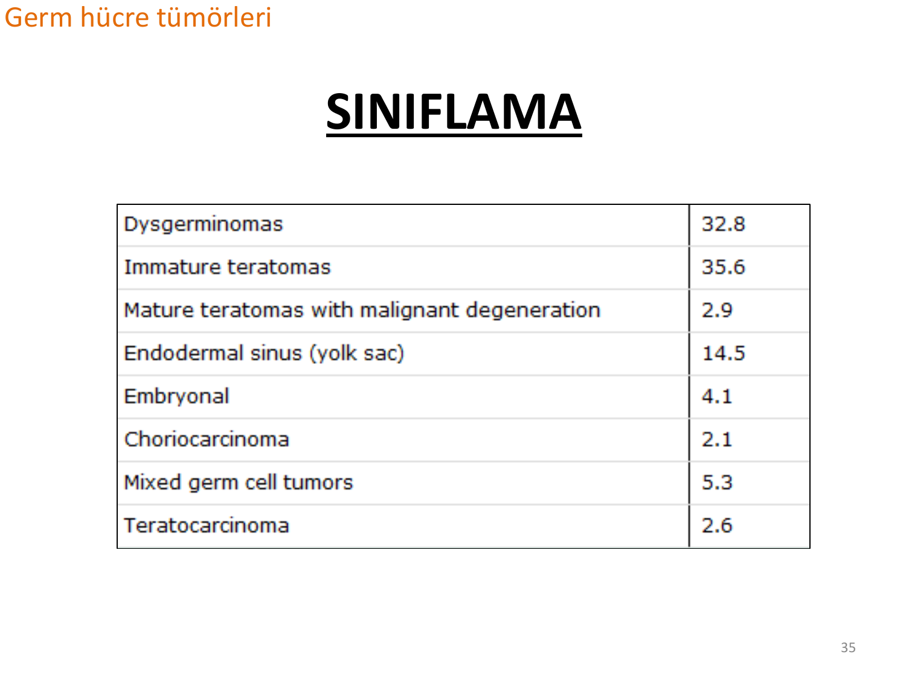
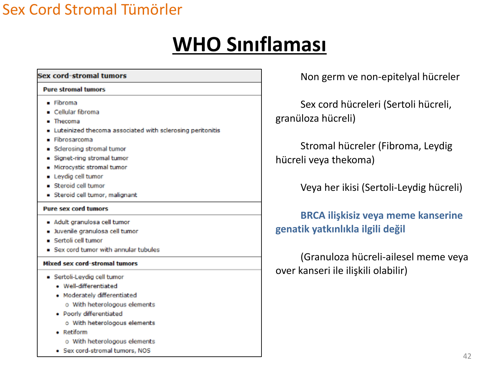

# OVER KANSERİ

**Hazırlayan:** Dr. Öğr. Üyesi Merve Turan
**Bölüm:** Tıbbi Onkoloji

---

## İÇİNDEKİLER

1. [Genel Bakış ve Epidemiyoloji](#genel-bakış-ve-epidemiyoloji)
2. [Over Tümörlerinin Kökeni ve Histolojik Sınıflama](#over-tümörlerinin-kökeni-ve-histolojik-sınıflama)
3. [Epitelyal Alt Tipler Karşılaştırması](#epitelyal-alt-tipler-karşılaştırması)
4. [Risk Faktörleri ve Koruyucu Faktörler](#risk-faktörleri-ve-koruyucu-faktörler)
5. [Evreleme (TNM / FIGO 2013)](#evreleme-tnm--figo-2013)
6. [Prognoz](#prognoz)
7. [Klinik Bulgular](#klinik-bulgular)
8. [Paraneoplastik Sendromlar ve Özel Klinik Durumlar](#paraneoplastik-sendromlar-ve-özel-klinik-durumlar)
9. [Tanı](#tanı)
10. [Tedavi (Epitelyal Over Kanseri)](#tedavi-epitelyal-over-kanseri)
11. [PARP İnhibitörleri ve Hedefe Yönelik Tedavi](#parp-i̇nhibitörleri-ve-hedefe-yönelik-tedavi)
12. [Takip](#takip)
13. [Korunma ve Erken Tanı](#korunma-ve-erken-tanı)
14. [Germ Hücre Tümörleri](#germ-hücre-tümörleri)
15. [Sex Cord Stromal Tümörler](#sex-cord-stromal-tümörler)
16. [Klinik Vaka Örnekleri](#klinik-vaka-örnekleri)
17. [Özet Karşılaştırma Tabloları](#özet-karşılaştırma-tabloları)
18. [Test Soruları](#test-soruları)
19. [Kısaltmalar](#kısaltmalar)

---

## GENEL BAKIŞ VE EPİDEMİYOLOJİ

> **Over kanseri:** "Sessiz öldürücü" olarak bilinen, çoğunlukla ileri evrede tanı konulan jinekolojik malignitelerin en ölümcülüdür.

Over tümörleri kökenlerine göre dört ana gruba ayrılır:

| Köken | Genel Sıklık | Maligniteye Oranı | Etkilenen Yaş Grubu |
|---|---|---|---|
| **Yüzey epitel (surface epithelial-stromal)** | %65-70 | %90 | 20 yaş ve üzeri |
| **Germ hücreli** | %15-20 | %3-5 | 0-25 yaş |
| **Sex cord-stromal** | %5-10 | %2-3 | Tüm yaşlar |
| **Overlere metastaz** | %5 | -- | Değişken |



> 💡 **Mnemonik -- "EGSM":** **E**pitelyal (en sık, erişkin) - **G**erm hücreli (genç) - **S**ex cord stromal (hormon) - **M**etastaz. Malignite riski en yüksek olanı epitelyal olandır.

---

## OVER TÜMÖRLERİNİN KÖKENİ VE HİSTOLOJİK SINIFLAMA

Over; üç farklı hücre populasyonundan ve kendine özgü damar, stroma yapısından köken alır. Her grup farklı histolojik alt tipleri kapsar:



### Yüzey Epitel-Stroma Kökenli Tümörler

* Seröz (en sık)
* Müsinöz
* Endometrioid
* Berrak hücreli (clear cell)
* Transisyonel (Brenner) hücreli

### Germ Hücre Kökenli Tümörler

* Teratoma (matür/immatür)
* Disgerminoma
* Yolk sac (endodermal sinüs) tümörü
* Embriyonel karsinom
* Koriokarsinom

### Sex Cord-Stromal Tümörler

* Granuloza hücreli tümör
* Theca hücreli (thecoma)
* Fibroma
* Sertoli hücreli
* Sertoli-Leydig hücreli
* Steroid (lipid) hücreli tümör

> 💡 **Akılda kalması için:** Yüzey epitel = **SMECB** (Seröz, Müsinöz, Endometrioid, Clear cell, Brenner). Germ hücreli = **TDYEK** (Teratoma, Disgerminoma, Yolk sac, Embryonal, Koriokarsinom).

> 💡 **"Seröz" -- isminden çağrışım:** "Seröz" = **seröz sıvı** (berrak sulu salgı). High-Grade Seröz Karsinoma (HGSC) peritoneal yüzeylere bol seröz sıvı salgılar, bu yüzden erken dönemde büyük hacimli **asit** yapar ve karın şişliği tipik bulgudur. "Su sızdıran" görüntü seröz tümörü hatırlatır.

---

## EPİTELYAL ALT TİPLER KARŞILAŞTIRMASI

Epitelyal over kanseri (EOK) tek bir hastalık değildir -- biyolojisi, moleküler profili ve tedaviye yanıtı birbirinden farklı **beş ana alt tipi** vardır. HGSC en sık ve en kötü prognozludur; PARP inhibitörlerinin ana hedefi bu gruptur.

| Özellik | HGSC (High-Grade Seröz) | LGSC (Low-Grade Seröz) | Berrak Hücreli | Endometrioid | Müsinöz |
|---|---|---|---|---|---|
| **Sıklık (EOK içinde)** | **%70** (en sık) | %3-5 | %5-10 | %10 | %3 |
| **Köken** | Fallop tüpü fimbriya | Seröz border-line → LGSC | Endometriozis | Endometriozis | Gİ sistem (bazen apendiks) |
| **Tanı evresi** | İleri (III-IV) | Erken-ileri karışık | Erken (I) | Erken (I) | Erken (I) |
| **Tipik mutasyon** | **TP53** (+), **BRCA1/2** (~%20), HRD | KRAS, BRAF | ARID1A, PIK3CA | ARID1A, PTEN, β-catenin | KRAS, HER2 |
| **CA-125** | **Çok yüksek** | Orta | Orta | Orta | Genelde düşük |
| **Ek belirteç** | -- | -- | -- | -- | **CA-19-9**, CEA |
| **Platin yanıtı** | **İyi** (başlangıçta) | Zayıf | Zayıf | Orta-iyi | Kötü |
| **PARP inhibitörü yararı** | **Var** (özellikle BRCA/HRD+) | Yok | Yok | Sınırlı | Yok |
| **Prognoz** | Kötü (geç tanı) | Orta (indolan seyir) | Kötü | İyi | Erken iyi, ileri kötü |
| **Özel ilişki** | HBOC, BRCA1/2 | Seröz borderline tümör | VTE riski belirgin ↑ | Lynch sendromu | Psödomiksoma peritonei |

> 💡 **Mnemonik -- "HGSC 3P":** **P**53 mutasyonu + **P**latin yanıtı + **P**ARP inhibitör hedefi. HGSC için üç anahtar kelime.

> ⭐ **Kritik nokta:** HGSC'lerin çoğunun aslında fallop tüpünün fimbriyasından köken aldığı gösterilmiştir -- bu yüzden BRCA pozitif kadınlarda **RRSO'da bilateral salpingo-ooforektomi** yapılır, yalnız ooforektomi yeterli değildir.

---

## RİSK FAKTÖRLERİ VE KORUYUCU FAKTÖRLER

### EOK Riskini Arttıran Durumlar

| Risk Faktörü | Not |
|---|---|
| **İleri yaş** | Özellikle postmenopozal dönem |
| **Nulliparite** | Hiç doğum yapmamış olmak |
| **Oral kontraseptif (OK) kullanmamış olmak** | |
| **Meme kanseri öyküsü** | Kendisi veya ailede |
| **Aile öyküsü** | Over / meme kanseri |
| **Herediter kanser sendromları** | BRCA1, BRCA2, HNPCC (Lynch-II) |

### EOK Riskini Azaltan Durumlar

* **Gebelik**
* **Laktasyon**
* **Oral kontraseptif (OK) kullanımı**

> ⭐ **Temel ilke -- "Sürekli ovulasyon hipotezi":** Ovulasyon sayısını azaltan her durum (gebelik, laktasyon, OK) over kanseri riskini azaltır; ovulasyonu arttıran veya nulliparite gibi ovulasyonu sürekli kılan durumlar riski arttırır.

> 💡 **Mnemonik -- "NOMAD + BRCA":** Over kanseri risk faktörlerini hatırla:
> - **N**ulliparite
> - **O**K kullanmama (ve geç menopoz → uzun ovulasyon)
> - **M**eme kanseri öyküsü
> - **A**ile öyküsü
> - **D**oğurganlık tedavisi (tartışmalı, ovulasyon indüksiyonu)
> - **BRCA** / Lynch sendromu

### Herediter Risk Artışı (Özet)

| Durum | Over Ca Riskinde Artış |
|---|---|
| Aile hikayesi (+) | **2 kat** |
| Meme Ca aile öyküsü (+) veya kendisi meme Ca geçirmiş | **2 kat** |
| BRCA-1 veya BRCA-2 (+) | **%10-27** yaşam boyu risk |
| Lynch-II (HNPCC) sendromu | **2-4 kat** |

> 💡 **Mnemonik -- "BRCA'nın üçlüsü (HBOC)":** Herediter Breast-Ovarian Cancer -- BRCA1/2 (+) olan kadınlarda hem meme hem over kanseri riski yüksektir.

### HBOC Sendromu -- BRCA1 vs BRCA2 Detayları

| Özellik | **BRCA1** | **BRCA2** | Toplum Geneli |
|---|---|---|---|
| Lokalizasyon | 17q21 | 13q12-13 | -- |
| Yaşam boyu **over Ca** riski | **%40-50** | **%15-25** | ~%1.3 |
| Yaşam boyu **meme Ca** riski | %65-80 | %45-70 | ~%12 |
| Erkekte meme Ca | Düşük risk | **Artmış risk** | -- |
| Tanı yaşı (over Ca) | Genelde <50 | 50 sonrası daha sık |  ~60 |
| Prostat / pankreas Ca ilişkisi | Zayıf | **Kuvvetli** | -- |
| Dominant alt tip | HGSC | HGSC | HGSC |
| PARP inhibitörü yararı | **Var** (yüksek) | Var (yüksek) | Yalnızca HRD+ |

> 💡 **Analoji -- "BRCA1 = 1 numaralı katil, BRCA2 = 2 numaralı yandaş":** BRCA1 over kanseri riskini daha **erken** ve daha **yüksek** yapar (daha agresif). BRCA2 daha **geç** başlar, **erkek meme ve pankreas/prostat** kanserlerine de eşlik eder ("B**R**CA**2** = ailedeki erkek**ler**e de dokunur"). Her ikisi de **HR (homolog rekombinasyon)** yolunda görevlidir -- mutasyonları **HRD (HR deficiency)** fenotipi yaratır ve **PARP inhibitörlerine aşırı duyarlılık** verir ("sentetik letalite").

---

## EVRELEME (TNM / FIGO 2013)

Over, fallop tüpü ve primer peritoneal karsinomlar **FIGO 2013 sınıflamasında birlikte** evrelenmektedir (AJCC/UICC 8. edisyon).



### FIGO Evrelemesi -- Tek Satırlık Özet

| Evre | Tanım Özeti | Anahtar Soru |
|---|---|---|
| **I** | **Sadece over(ler) / tüp(ler)** -- dışarı çıkmamış | Kapsül sağlam mı, asit (+) mi? |
| **II** | **Pelvise yayılım** (pelvik sınırın altında) | Uterusa, tüpe, mesaneye yayıldı mı? |
| **III** | **Pelvis dışı periton** ve/veya **retroperitoneal LN** | Omentum, diyafragma, para-aortik LN (+) mi? |
| **IV** | **Uzak organ metastazı** (parankim / plevral / inguinal) | Akciğer, karaciğer parankim, plevral sitoloji (+) mi? |

> 💡 **Hızlı hatırlama -- "1 over, 2 pelvis, 3 peritoneum, 4 uzak":** Sayıya göre yayılım genişler. Evre III'te **kapsül** tutulumu olabilir (karaciğer/dalak kapsülü) ama **parankim** tutulumu olursa Evre IV olur.

### Evre I -- Tümör Yalnızca Over(ler)e veya Fallop Tüp(ler)ine Sınırlı

| Alt evre | Tanım |
|---|---|
| **IA** | Tek overe (kapsül sağlam) veya tek fallop tüpüne sınırlı. Over/tüp yüzeyinde tümör yok. Asit veya peritoneal yıkama sıvısında malign hücre yok |
| **IB** | İki overe (kapsüller sağlam) veya iki fallop tüpüne sınırlı. Over/tüp yüzeyinde tümör yok. Asit/yıkamada malign hücre yok |
| **IC** | Bir veya iki overe/tüpe sınırlı ancak **aşağıdakilerden biri** var |
| IC1 | **Cerrahi sırasında tümör dökülmesi (surgical spill)** |
| IC2 | **Cerrahi öncesi kapsül rüptürü** veya over/tüp yüzeyinde tümör |
| IC3 | **Asit veya peritoneal yıkamada malign hücreler** |

### Evre II -- Pelvik Yayılım

Tümör bir veya iki overi/tüpü içerir, pelvik (pelvik sınırın altında) yayılım veya primer peritoneal kanser vardır.

| Alt evre | Tanım |
|---|---|
| **IIA** | Uterus ve/veya tüp ve/veya overlere yayılım/implant |
| **IIB** | Diğer pelvik intraperitoneal dokulara yayılım |

### Evre III -- Pelvis Dışı Peritoneal ve/veya Retroperitoneal LN Tutulumu

| Alt evre | Tanım |
|---|---|
| **IIIA1** | Yalnızca pozitif retroperitoneal lenf nodu (histolojik doğrulanmış) |
| IIIA1(i) | Metastaz ≤10 mm |
| IIIA1(ii) | Metastaz >10 mm |
| **IIIA2** | Pelvis dışı mikroskopik peritoneal tutulum ± LN |
| **IIIB** | Pelvis dışı makroskopik peritoneal metastaz **≤2 cm** ± LN |
| **IIIC** | Pelvis dışı makroskopik peritoneal metastaz **>2 cm** ± LN (karaciğer ve dalak kapsül tutulumu dahil, parankimal tutulum hariç) |

### Evre IV -- Uzak Metastaz

| Alt evre | Tanım |
|---|---|
| **IVA** | Pozitif sitolojili plevral efüzyon |
| **IVB** | Karaciğer/dalak **parankim** metastazı, ekstra-abdominal organlar, inguinal LN, abdomen dışı LN, intestinin transmural tutulumu |

> 💡 **"IC'nin üçlüsünü" unutma:** IC1 = cerrahi dökülme, IC2 = kapsül yırtığı/yüzey tümörü, IC3 = asit/yıkama sitoloji (+). Bu ayrım prognoz ve tedavi seçimini etkiler.

> ⚠️ **ÖNEMLİ:** Peritoneal kanserin FIGO Evre I'i yoktur; primer peritoneal karsinom en az Evre II'den başlar.

---

## PROGNOZ



| FIGO Evre | 5 Yıllık Sağkalım |
|---|---|
| **I** | >%90 |
| **II** | ~%80 |
| **III** | %15-20 |
| **IV** | <%5 |

> ⚠️ **ÖNEMLİ:** Epitelyal over kanseri hastalarının **%70'i ilk tanıda Evre III veya IV**'tedir. Buna karşın germ hücreli tümörlerin **%70'i Evre I**'de yakalanır (erken belirtiler: ağrı, kanama, hızlı büyüme).

---

## KLİNİK BULGULAR

### Genel Özellikler

* Epitelyal over kanseri **sessiz öldürücü**dür; erken evrede semptom nadir
* En az bir yıldır postmenopozal kadında **herhangi bir pelvik kitle** over kanseri açısından araştırılmalıdır
* Asit ve abdominal kitle tipiktir

### Lokalize Hastalıkta Nonspesifik Bulgular (~%90)

* Nonspesifik karın şikayetleri
* En sık: **karın ve pelvik ağrı + şişkinlik**
* Vajinal kanama veya salgı
* GİS ve idrar yolu semptomları (sık idrara çıkma, idrar kaçırma)
* Paraneoplastik sendromlar

### Acil Durumlar (İleri Evre Hastalıkta)

| Acil Durum | Klinik |
|---|---|
| **Karın şişliği + nefes darlığı** | Asit + plevral sıvı |
| **Pulmoner emboli** | Nefes darlığı (⭐ VTE riski toplumdan **3 kat** fazla) |
| **Barsak tıkanıklığı** | Bulantı, kusma, karın ağrısı |
| **Hiperkalsemi** | Paraneoplastik |
| **DİK** | Dissemine intravasküler koagülasyon |

### Evrelenmiş Hastalığın Fizik Muayene Bulguları

* Karında distansiyon
* Palpabl peritoneal kitle
* ⭐ **Sister Mary Joseph nodülü** (umbilikal metastatik nodül)
* İnguinal LAP
* Plevral sıvı



> ⭐ **Sister Mary Joseph nodülü:** Umbilikal metastaz; genellikle **kötü prognoz** göstergesidir. Over, mide, pankreas ve kolon kanserinde tipiktir. Over kanserinde ligamentum teres hepatis boyunca yayılımdan kaynaklanır.

> 💡 **Mnemonik -- "ABD + PE":** **A**sit, **B**arsak tıkanıklığı, **D**İK + **P**ulmoner **E**mboli. Over kanserinde VTE riski 3 kat arttığından yeni başlayan nefes darlığında PE akla gelmelidir.

---

## PARANEOPLASTİK SENDROMLAR VE ÖZEL KLİNİK DURUMLAR

### Paraneoplastik Sendromlar

| Sistem | Bulgu |
|---|---|
| **Nörolojik** | Periferik nöropati, organik demans, ALS benzeri sendrom, serebellar ataksi |
| **Hematolojik** | Kan cross-match'te sorun yaratan antikorlar, DİK, tromboflebit |
| **Endokrin** | Cushing sendromu, hiperkalsemi |
| **Dermatolojik** | Dermatomyozit, akantozis nigrikans |

### Hormonal / Tümör Tipine Özgü Klinik

| Tümör Tipi | Klinik Bulgu |
|---|---|
| **Sertoli-Leydig hücreli** | Virilizasyon (androjen fazlalığı) |
| **Granuloza hücreli** | Premenarş dönemde **puberte prekoks**, amenore, anormal kanama (östrojen fazlalığı) |
| **Germ hücre tümörleri** | Şiddetli pelvik ağrı (infundibulopelvik lig. tutulumu / torsiyon / rüptür) |

---

## TANI

### Cerrahi Tanı

* Over ile sınırlı hastalıkta yayılım riski nedeniyle **biyopsiden kaçınılır**
* Cerrahi sırasında tümör **patlatılmamalı** (surgical spill → IC1 evresine çıkar)
* **Asit örneği** mutlaka alınmalıdır
* Cerrahiye uygun olmayan hastada **peritoneal veya asit örnekleme**

### Laboratuvar ve Tümör Belirteçleri

| Belirteç | Yükseldiği Durum |
|---|---|
| **CA-125** >35 U/mL | Epitelyal over kanseri (%80-85 duyarlılık) |
| **CA-19-9** | Müsinöz tümörler |
| **CEA** | Genellikle epitelyal tümörlerde düşük-orta düzeyde |
| **β-hCG** | Germ hücre tümörleri (embriyonel, koriokarsinom, miks) |
| **AFP** | Germ hücre tümörleri (yolk sac, embryonal, immatür teratom) |
| **LDH** | Disgerminomlar |
| **İnhibin** (TGF-β benzeri) | Stromal tümörler (özellikle granuloza) |
| **AMH (Anti-Mullerian H.)** | Granuloza hücreli |

### CA-125'i Arttıran Durumlar



| Benign | Malign |
|---|---|
| Gebelik | Endometrium Ca |
| PID | Serviks Ca |
| Endometriozis | Fallop tüpleri Ca |
| Uterin fibroidler | Pankreas Ca |
| Siroz | Meme Ca |
| Pankreatit | Akciğer Ca |
| Benign kistler | Kolon Ca |

> ⚠️ **ÖNEMLİ:** CA-125 **tarama testi değildir**. Çünkü pek çok benign/malign durumda yükselir. Aynı şekilde Papanicolaou (Pap) testi over kanseri taraması için **yetersizdir**; çok nadir (%2-5) atipik glandüler hücreler saptanabilir.

### Pelvik Kitle Değerlendirmesi -- RMI ve ROMA Skorları

CA-125'in tek başına yorumlanması yetersizdir. Pelvik kitle saptanan kadında **malignite olasılığını artıran** iki klinik skor kullanılır:

| Skor | Formül / Bileşenler | Kesim | Değerlendirme |
|---|---|---|---|
| **RMI** (Risk of Malignancy Index) | USG skoru × Menopoz skoru × CA-125 | **>200** = yüksek risk | Postmenopozal + multilokülasyon + solid alan + CA-125 yüksek → cerrahi onkoloji |
| **ROMA** (Risk of Ovarian Malignancy Algorithm) | CA-125 + **HE4** + menopoz durumu | Pre: >%11.4 <p>Post: >%29.9</p> | HE4, fibroid/endometriozise CA-125 kadar yanıltıcı değildir |

**USG -- Malignite Şüphesi Veren Bulgular:**

* Multilokülarite
* Solid alan içermesi
* Bilateralite
* Asit varlığı
* İntraabdominal metastaz varlığı

> 💡 **Mnemonik -- "Premenopozal ≠ güvenlik garantisi; postmenopozal = büyük kırmızı bayrak":** Postmenopozal bir kadında **her** adneksiyal kitle aksi ispat edilinceye kadar malign kabul edilmelidir (RMI formülünde menopoz skoru 4 ile çarpılır).

> ⭐ **HE4 (Human Epididymis Protein 4):** CA-125'ten farklı olarak **endometriozis, fibroid ve gebelik**ten etkilenmez; bu yüzden premenopozal kadınlarda tanısal güveni arttırır. ROMA skoru CA-125 + HE4 kombinasyonu ile çalışır.

### Tümör Belirteç Kombinasyonlarının Tanıya Katkısı (Germ Hücre + Sex Cord-Stromal)

Farklı tümör tiplerinde AFP, hCG, LDH, E2 (östrojen), inhibin, testosteron (T), A4 (androstenedion), DHEA ve AMH sonuçlarının dağılımı tanıda yardımcıdır:



| Tümör | AFP | hCG | LDH | E2 | İnhibin | T/A4/DHEA | AMH |
|---|---|---|---|---|---|---|---|
| Disgerminom | -- | ± | + | ± | -- | -- | -- |
| Embryonel | ± | + | ± | ± | -- | -- | -- |
| İmmatür teratom | ± | -- | ± | ± | -- | (DHEA ±) | -- |
| Koriokarsinom | -- | + | ± | -- | -- | -- | -- |
| Yolk sac (endodermal sinus) | + | -- | + | -- | -- | -- | -- |
| Granuloza hücreli | -- | -- | -- | ± | **+** | T ± | + |
| Sertoli-Leydig | ± | -- | -- | ± | ± | ± | -- |
| Thecoma | -- | -- | -- | ± | ± | -- | -- |

> 💡 **Hafıza kartı:**
> - **AFP** → Yolk sac (mutlak), embryonel, immatür teratom
> - **hCG** → Koriokarsinom (mutlak), embryonel, miks germ
> - **LDH** → Disgerminom
> - **İnhibin + AMH** → Granuloza
> - **Androjenler** → Sertoli-Leydig

---

## TEDAVİ (EPİTELYAL OVER KANSERİ)

### Temel Yaklaşım

* Klinik, radyolojik ve laboratuvar bulgular over kanserini düşündürüyorsa **doğrudan cerrahiye** yönlendirilir
* Düşündürmüyorsa diğer tanısal yöntemler uygulanır

### Cerrahi Evreleme -- Adım Adım

1. **Tümör tam çıkarılır** ve frozen section için gönderilir
2. Özellikle **cul-de-sac'ta (Douglas)** serbest sıvı sitolojiye gönderilir
3. Serbest sıvı yoksa **50-100 mL SF ile peritoneal yıkama** yapılır ve sitolojiye gönderilir
4. Tüm peritoneal yüzeyler ve organlar değerlendirilir; şüpheli alan ve adezyonlardan biyopsi alınır
5. **Diyafragmadan** biyopsi alınır
6. **Transvers kolondan itibaren omentum rezeke** edilir (omentektomi)
7. Son olarak **retroperitoneal pelvik ve paraaortik LN** değerlendirilir

### Sitoredüktif Cerrahi (Debulking)

Primer tümör ve olabildiğince çok metastazın çıkarılması + **retroperitoneal LN diseksiyonu** yapılır.

> ⭐ **Optimal sitoredüksiyon:** Rezidüel tümör çapı ≤1 cm olarak tanımlanır; sağkalımı belirleyen en önemli cerrahi hedeftir.

### Evreye Göre Tedavi Şeması

#### Evre IA, IB (Grade 1)

| Hasta Durumu | Tedavi |
|---|---|
| **Premenopozal + fertilite koruma isteği** | Evreleme laparotomisi sonrası **unilateral ooforektomi** |
| **Postmenopozal veya çocuk isteği yok** | **TAH + BSO** (Total Abdominal Histerektomi + Bilateral Salpingo-Ooforektomi) |

#### Evre IA, IB (Grade 2-3) ve Evre IC

* Cerrahi sonrası **adjuvan kemoterapi**
* **Sisplatin (veya Karboplatin) + Paklitaksel**, 4-6 kür
* Yaşlılarda: 4-6 kür **tek ajan** (Paklitaksel veya Karboplatin)

#### Evre II, III, IV

* **Cerrahi (debulking) + Adjuvan KT**
* Kurtarma tedavisi (rekürrenste):
  * **HİPEC** (Hyperthermic Intraperitoneal Chemotherapy)
  * Palyatif cerrahi
  * Kemoterapi

### Kemoterapi -- Platin Temelli Rejim

* **Platin analogları** KT'nin yapıtaşını oluşturur
* **Standart tedavi:** Platin analogu + Paklitaksel kombinasyonu

**Sisplatin vs Karboplatin farkları:**

| Özellik | Karboplatin (Sisplatine göre) |
|---|---|
| Renal toksisite | ↓ Daha az |
| Nörolojik yan etki | ↓ Daha az |
| GİS yan etkileri | ↓ Daha az |
| Hematotoksisite | ↑ **Daha fazla** |

> 💡 **Akılda kalması -- "Karbo = Kemik iliği":** Karboplatin böbreği korur ama kemik iliğini daha çok baskılar. Sisplatin ise aksine nefrotoksik/nörotoksik.

### Kurtarma (Salvage) Tedavisi -- Relaps Yaklaşımı

| Relaps Süresi | Hastalık Tipi | Yaklaşım |
|---|---|---|
| Tedavi sonrası **>6 ay** | **Platin duyarlı (sensitive)** | Aynı platin bazlı ilaçlar tekrar denenebilir |
| Tedavi sırasında veya **≤6 ay** içinde | **Platin dirençli (resistant)** | Başka ajanlara geçilir |

**Platin dirençli hastalıkta seçenekler:**

* Etoposid
* Topotekan
* Gemsitabin
* Vinorelbin
* İfosfamid
* Heksametilmelamin (Altretamin)
* Lipozomal doksorubisin

> 💡 **"6 ay kuralı":** Tedaviden 6 aydan sonra relaps = platin duyarlı (şans tekrar); 6 aydan önce relaps = platin dirençli (yeni ajan).

---

## PARP İNHİBİTÖRLERİ VE HEDEFE YÖNELİK TEDAVİ

### Çalışma Prensibi -- Sentetik Letalite

PARP (Poli-ADP-Riboz Polimeraz), DNA tek zincir kırıklarını onarır. PARP **inhibe edildiğinde** bu kırıklar çift zincir kırığına dönüşür. Normal hücre bunları **HR (homolog rekombinasyon)** ile onarır; ancak **BRCA1/2 mutasyonlu** veya **HRD (+)** hücrelerde HR bozuk olduğundan hücre ölümü tetiklenir. Bu "**sentetik letalite**" prensibidir.

### Tedavi Akış Algoritması -- EOK'de Kemoterapi + PARP

```
        İleri Evre EOK (III-IV, HGSC)
                    ↓
        Debulking Cerrahi (± neoadjuvan)
                    ↓
        Platin + Paklitaksel 6 kür
                    ↓
            Yanıt değerlendirmesi
                    ↓
        ┌───────────┴───────────┐
        ↓                       ↓
   Tam / Kısmi yanıt        Progresyon
        ↓                       ↓
   GENETİK TESTLER:         Platin dirençli tedavi
   BRCA1/2 ve HRD            (topotekan, PLD, gemsitabin
        ↓                    ± bevasizumab)
  ┌─────┴─────┐
  ↓           ↓
BRCA /       Wild-type
HRD (+)     non-HRD
  ↓           ↓
İdame PARP   İdame bevasizumab
(olaparib,   veya gözlem
niraparib,
rukaparib)
```

### PARP İnhibitörü Ajanlar

| İlaç | Onay Endikasyonu | Başlıca Yan Etki |
|---|---|---|
| **Olaparib** | BRCA mutasyonlu (germline/somatik) ileri EOK idame | Anemi, bulantı, yorgunluk |
| **Niraparib** | BRCA statüsünden bağımsız idame (HRD+ daha iyi yanıt) | Trombositopeni, hipertansiyon |
| **Rukaparib** | BRCA mutasyonlu relaps sonrası idame | ALT/AST artışı, bulantı |

**Bevasizumab (Anti-VEGF):** HGSC'de platin ile birlikte ve idamede kullanılır; özellikle **asit kontrolü**nde etkilidir.

> 💡 **Mnemonik -- "Üç P kuralı":** **P**latin duyarlı + **P**ARP inhibitörü + **P**rogresyonsuz sağkalım. BRCA/HRD pozitif HGSC için üç kelimelik anahtar.

> ⚠️ **ÖNEMLİ:** İleri evre HGSC tanısı alan **her** hastada **germline BRCA** testi yapılmalıdır; aile öyküsü olmasa bile. Tümörde **somatik BRCA** veya **HRD** testi de değerli bilgi verir.

---

## TAKİP

* **Klinik muayene** (en önemli unsur)
* **CA-125** seri takibi
* **BT ve USG** (gerektiğinde)

---

## KORUNMA VE ERKEN TANI

| Risk Grubu | Risk Artışı |
|---|---|
| Aile hikayesi (+) | 2 kat |
| Meme Ca (+) | 2 kat |
| BRCA-1 / BRCA-2 (+) | **%10-27** |
| Lynch-II (HNPCC) | 2-4 kat |

### Profilaktik Ooforektomi

* Yüksek riskli tüm gruplarda **genetik tarama sonrası**, çocuk doğurma tamamlandıysa **profilaktik ooforektomi** önerilir
* **⚠️ ÖNEMLİ:** Profilaktik ooforektomi bile **tam koruma sağlamaz**; over ve tüpler alınsa bile **peritoneal karsinomlar** ortaya çıkabilir
* CA-125 ve vajinal USG'nin **taramadaki yararı tam bilinmemektedir**

> ⭐ **Risk azaltma stratejileri (BRCA pozitif kadınlarda):**
> 1. Doğum kontrol hapı kullanımı (riski azaltır)
> 2. Gebelik-laktasyon tamamlandıktan sonra **risk-azaltıcı salpingo-ooforektomi (RRSO)** -- 35-40 yaş arası
> 3. Düzenli CA-125 + transvajinal USG takibi (etkinlik tartışmalı)

---

## GERM HÜCRE TÜMÖRLERİ



### Genel Özellikler

* Tüm over tümörlerinin **~%25'i**
* Tüm over **kanserlerinin %5'i**
* Hastaların çoğu **10-30 yaş** arası
* Bu yaş grubundaki over tümörlerinin **%70'i germ hücreli**

### Klinik

* Karın şişmesi (kitle, asit %20) -- **%85**
* Ağrı: **rüptür %20**, **torsiyon %5**
* hCG salgılayan tümörlerde puberte prekoks, anormal vajinal kanama (%10)
* Gebelik belirtileri (hCG etkisi)

### Sınıflama ve Sıklık



| Alt Tip | Oran (%) |
|---|---|
| **İmmatür teratom** | 35.6 |
| **Disgerminom** | 32.8 |
| **Endodermal sinüs (yolk sac)** | 14.5 |
| Miks germ hücreli | 5.3 |
| Embryonel | 4.1 |
| Malign dejenerasyon gösteren matür teratom | 2.9 |
| Teratokarsinom | 2.6 |
| Koriokarsinom | 2.1 |

### Tümör Belirteçleri (Özet)

| Tümör | hCG | AFP | LDH |
|---|---|---|---|
| **Disgerminom** | Bazen + | -- | **+** |
| Embryonel | **+** | Bazen + | -- |
| Yolk sac (endodermal sinüs) | -- | **+** | -- |
| Koriokarsinom | **+** | -- | -- |
| Miks germ hücreli | ± | ± | ± |
| İmmatür teratom | -- | ± | -- |

### Cerrahi Tedavi

* **Erken evre:** Evre ve fertilite isteğine göre
  * **Fertilite koruyucu cerrahi** (genç hastada tek taraflı ooforektomi + evreleme)
  * Fertilite gerekmiyorsa TAH + BSO
* **İleri evre:**
  * **Optimal sitoredüksiyon** gereklidir
  * KT yanıtı iyi olduğundan cerrahi riski dikkatli tartılmalı
  * **Non-disgerminomlarda rezidü kalmaması daha önemlidir** (disgerminomlar KT'ye daha duyarlı)

> 💡 **Germ hücre tümörlerinin temel avantajı:** KT'ye yüksek yanıt → **ileri evrede bile fertilite korunabilir**. Çoğu hastada tek taraflı adneksektomi yeterlidir.

---

## SEX CORD STROMAL TÜMÖRLER



### Genel Özellikler

* Ooositi çevreleyen ve ovaryan hormon üreten hücreler + stroma hücrelerinden köken alır
* Over kanserlerinin **~%2-3'ü**
* Genel sıklık: **0.1-2 / 100.000**
* Bazıları **steroid hormon** (androjenler veya östrojen) üretir

### Epidemiyoloji ve Seyir

* Çoğunluğu **erken evre, düşük grade** ve **genç** hastalar
* %60 -- **30-60 yaş** arası
* %60 -- overde sınırlı
* %15 -- bölgesel yayılım (çevre organ + LN)
* %22 -- metastatik
* **Lenf nodu metastazı nadir**
* Prognozu EOK'ye göre daha iyidir
* Sigara içen, OK kullanan ve doğum yapan kadınlarda daha az görülür

> ⭐ **Önemli fark:** Sex cord-stromal tümörler **BRCA ile ilişkili değildir**, meme kanserine genetik yatkınlıkla da ilgili değildir. **İstisna:** Granuloza hücreli tümör ailesel meme/over kanseri ile ilişkili olabilir.

### WHO Sınıflaması


#### Saf Stromal Tümörler

* Fibroma
* Selüler fibroma
* Thecoma
* Luteinize thecoma (sklerozan peritonit ile ilişkili)
* Fibrosarkom
* Sklerozan stromal tümör
* Signet-ring stromal tümör
* Mikrokistik stromal tümör
* Leydig hücreli tümör
* Steroid hücreli tümör (benign / malign)

#### Saf Sex Cord Tümörler

* Erişkin granuloza hücreli tümör
* Juvenil granuloza hücreli tümör
* Sertoli hücreli tümör
* **Sex cord tumor with annular tubules (SCTAT)**

#### Miks Sex Cord-Stromal Tümörler

* **Sertoli-Leydig hücreli tümör** (iyi diferansiye / orta diferansiye / kötü diferansiye / retiform; her biri heterolog elementli olabilir)
* Sex cord-stromal tümörler, NOS

> 💡 **Hücresel köken özeti:**
> - **Non-germ, non-epitelyal** hücreler
> - **Sex cord hücreleri** → Sertoli, granuloza
> - **Stromal hücreler** → Fibroma, Leydig, thecoma
> - Veya **her ikisi** → Sertoli-Leydig

### Klinik

#### Non-Hormonal Semptomlar (EOK'ye benzer)

* Ağrı
* Asit veya plevral sıvı

> ⭐ **Meigs sendromu:** **Fibroma** + asit + plevral sıvı (benign, tümör çıkarılınca düzelir).
> **Pseudo-Meigs sendromu:** Leiomyom, teratom, kistadenom, struma ovarii gibi diğer pelvik kitleler + asit + plevral sıvı.

> 💡 **Meigs formülü -- "FAP":** **F**ibroma + **A**sit + **P**levral sıvı = Meigs. "FAP" aynı zamanda ailesel adenomatöz polipozis olarak karıştırılabilir; ayırmak için: Meigs'te **benign over fibroması** vardır, çıkarılınca asit+plevral sıvı **kendiliğinden geriler** (bu Meigs'in tanımıdır!).

#### Hormonal Semptomlar

| Hormon | Klinik |
|---|---|
| **Östrojen** (granuloza/thecoma) | Çocukta puberte prekoks, anormal uterin kanama, **endometrial hiperplazi veya kanser** |
| **Androjen** (Sertoli-Leydig, steroid hücreli) | Virilizasyon, alopesi, akne, ses değişikliği, **klitoromegali**, adet değişiklikleri |

### Tanı

* Tümör belirteçleri: **İnhibin**, östrojen, androjenler, AFP ve **Anti-Mullerian hormon (AMH)**
* Görüntüleme: Pelvik ve vajinal USG, BT, MR, PET-BT
* **Endometrial kalınlık artışı** (östrojen salgılayan tümörlerde) aranmalıdır

### Tedavi

#### Cerrahi

* Önce **iyi evreleme**
* **Endometrial küretaj** (senkron endometrial hiperplazi/kanser tarama amacıyla; özellikle östrojen üreten tümörlerde)
* Fertilite korunumu isteniyorsa fertilite koruyucu cerrahi
* Aksi halde **TAH + BSO**
* **LN diseksiyonu gereksiz** (LAP yoksa)
* Çocuk isteği varsa operatif bulgulara göre karar verilir

#### Sistemik Tedavi

* Nadir tümör → yeterli randomize veri yok
* **Evre IA granuloza hücreli tümör:** İzlem
* **Evre IA Sertoli-Leydig hücreli tümör:**
  * İyi diferansiye → **izlenebilir**
  * Diğerleri → KT
* **Evre IB-IC hastalık:** KT

---

## KLİNİK VAKA ÖRNEKLERİ

**📋 VAKA ÖRNEĞİ 1: Postmenopozal Asit + Kilo Kaybı**

**Hasta:** 64 yaşında kadın, G3P3
**Öykü:** Son 3 aydır giderek artan karın şişliği, yeme isteğinde azalma, 6 kg istemsiz kilo kaybı. Adet öyküsü: 12 yaşında menarş, 52 yaşında menopoz. OK kullanım öyküsü yok. Annesinde 58 yaşında meme kanseri tanısı.
**Fizik Muayene:** Kaşektik görünüm, TA 110/70 mmHg, Nabız 96/dk. Karın distandü, shifting dullness (+), alt abdomende sol adneksde 8 cm sert, düzensiz sınırlı kitle palpe edildi. Umbilikusta küçük sert nodül (**Sister Mary Joseph nodülü**) izlendi.
**Laboratuvar:** **CA-125: 2850 U/mL** (↑↑↑), CA-19-9 normal, Hb 10.8 g/dL, albümin 2.8 g/dL
**Görüntüleme:** BT'de bilateral over kitleleri (sağ 6 cm, sol 8 cm, solid-kistik), büyük hacimli asit, omental kek, para-aortik LAP.
**Cerrahi:** Açık laparotomi, debulking; omentektomi, bilateral salpingo-ooforektomi, pelvik-paraaortik LN diseksiyonu. Optimal sitoredüksiyon (rezidü <1 cm) sağlandı.
**Patoloji:** **High-Grade Seröz Karsinom (HGSC)**, FIGO **Evre IIIC**
**Genetik:** Germline **BRCA1 mutasyonu (+)**
**Tedavi:** Karboplatin + Paklitaksel 6 kür → tam yanıt → **Olaparib** idame (PARP inhibitörü)
**İzlem:** 18 ay sonra nüks yok; CA-125 13 U/mL.

**Öğretici Notlar:**
1. Postmenopozal **her** yeni gelişen pelvik kitle over kanseri açısından araştırılmalıdır.
2. "Sessiz öldürücü": hasta ileri evrede tanı alır (vakaların %70'i III-IV).
3. Sister Mary Joseph nodülü + asit + kaşeksi = ileri evre intraabdominal malignite klasiği.
4. HGSC'de optimal debulking (rezidü ≤1 cm) sağkalımı belirleyen en önemli cerrahi hedeftir.
5. BRCA mutasyonu saptanınca **PARP inhibitörü idamesi** uzun süreli remisyon sağlar (sentetik letalite).
6. BRCA1 (+) hastanın **akrabalarına** genetik danışmanlık ve kaskad test önerilir.

---

**📋 VAKA ÖRNEĞİ 2: Genç Kadında Hızlı Büyüyen Pelvik Kitle**

**Hasta:** 19 yaşında üniversite öğrencisi, nullipar, G0P0
**Öykü:** 4 haftadır sol alt kadran ağrısı, son 1 haftada şiddetlenen pelvik ağrı ve bulantı. Son 3 ayda sol alt kadranında ele gelen, hızla büyüyen şişlik fark etmiş. Düzensiz adet, son adet 2 ay önce. Aktif cinsel yaşam yok.
**Fizik Muayene:** TA 120/78 mmHg, Nabız 110/dk. Batın gergin, sol alt kadranda 10 cm sert, fikse kitle. Pelvik muayenede sol adnekste solid kitle.
**Laboratuvar:** **β-hCG: 85 mIU/mL** (hafif ↑), **LDH: 780 U/L** (↑↑), **AFP normal**, CA-125 62 U/mL (hafif ↑).
**USG / BT:** Sol adnekste 11 cm solid, hipervasküler, iyi sınırlı kitle; az miktar asit. Karşı over normal.
**Cerrahi:** Fertilite koruyucu yaklaşım: sol unilateral salpingo-ooforektomi + evreleme (peritoneal yıkama, omental biyopsi, frozen section).
**Patoloji:** **Disgerminoma**, FIGO **Evre IA** (kapsül sağlam, yıkama sitolojisi negatif)
**Tedavi:** Evre IA olduğu için **yalnızca gözlem** (gözetim). Eğer daha ileri evre olsaydı **BEP** (Bleomisin + Etoposid + Sisplatin) KT verilecekti.
**İzlem:** Her 2 ayda bir LDH, β-hCG, pelvik muayene ve USG. Fertilite korundu.

**Öğretici Notlar:**
1. 10-30 yaş arası hızla büyüyen pelvik kitle = **germ hücre tümörü** akla gelmelidir.
2. **LDH yüksekliği + hafif hCG + AFP negatifliği** → **Disgerminom** ipucudur ("LDH = disgerminom").
3. Germ hücre tümörlerinde **fertilite korumak** önceliktir; karşı over sağlamsa **unilateral cerrahi** yeterli.
4. Germ hücre tümörleri **KT'ye çok duyarlıdır** (özellikle disgerminom) -- ileri evrelerde bile iyi prognoz.
5. Disgerminom germ hücre tümörlerinin en **radyosensitif** ve **kemosensitif** olanıdır (testiküler seminomun dişi karşılığı).
6. Torsiyon/rüptür acili olmadan ameliyat edilmeli; hormonal semptom şüphesi varsa (puberte prekoks, virilizasyon) endokrin profili istenmelidir.

---

## ÖZET KARŞILAŞTIRMA TABLOLARI

### Over Tümörlerinin Üç Ana Grubu -- Karşılaştırma

| Özellik | Epitelyal | Germ Hücreli | Sex Cord-Stromal |
|---|---|---|---|
| Over tümörlerinin yüzdesi | %65-70 | %15-20 | %5-10 |
| Over kanserlerinin yüzdesi | %90 | %5 | %2-3 |
| Yaş grubu | ≥20 yaş, çoğunlukla postmenopoz | 10-30 yaş | 30-60 yaş |
| Tipik tanı evresi | Evre III-IV (%70) | Evre I (%70) | Erken evre |
| Hormon üretimi | -- | hCG, AFP (bazıları) | Östrojen/androjen (sıklıkla) |
| BRCA ilişkisi | ✅ Var | ❌ Yok | ❌ Yok (granuloza kısmen) |
| Tümör belirteci | CA-125 | hCG, AFP, LDH | İnhibin, AMH, E2 |
| Prognoz | Kötü | İyi (KT duyarlı) | İyi |

### Tümör Belirteçleri -- Hızlı Referans

| Belirteç | Hangi Tümör |
|---|---|
| **CA-125** | Epitelyal over Ca |
| **CA-19-9** | Müsinöz epitelyal |
| **CEA** | Epitelyal (genel) |
| **β-hCG** | Koriokarsinom, embryonel, miks germ |
| **AFP** | Yolk sac, embryonel, immatür teratom |
| **LDH** | Disgerminom |
| **İnhibin** | Granuloza, thecoma, Sertoli-Leydig |
| **AMH** | Granuloza |
| **Östradiol (E2)** | Granuloza, thecoma |
| **Testosteron/androjenler** | Sertoli-Leydig, steroid hücreli |

### Tedavi Özeti -- Evre Bazlı Epitelyal Over Kanseri

| Evre / Grade | Cerrahi | Adjuvan Tedavi |
|---|---|---|
| IA, IB (Grade 1) + fertilite isteği | Unilateral ooforektomi | İzlem |
| IA, IB (Grade 1) + çocuk yok | TAH + BSO | İzlem |
| IA, IB (Grade 2-3) + IC | TAH + BSO + evreleme | **Karboplatin + Paklitaksel 4-6 kür** |
| II, III, IV | Debulking (sitoredüksiyon) | Karboplatin + Paklitaksel ± HİPEC |
| Relaps >6 ay | -- | Platin bazlı (aynı ajanlar) |
| Relaps ≤6 ay | -- | Non-platin (topotekan, gemsitabin vs.) |

> 💡 **Hızlı akılda tutma:**
> - Epitelyal = yaşlı + Evre III-IV + CA-125 + kötü prognoz
> - Germ hücreli = genç + Evre I + hCG/AFP/LDH + iyi prognoz (KT duyarlı)
> - Sex cord-stromal = orta yaş + erken evre + hormon üretimi + iyi prognoz

---

## TEST SORULARI

### Soru 1 -- Tanı ve Evreleme

**62 yaşında postmenopozal kadın hasta** son 2 aydır artan karın şişliği, bulantı ve iştahsızlık yakınmalarıyla başvuruyor. Fizik muayenede batında **yaygın asit** ve sağ adnekste 9 cm sert kitle palpe ediliyor. **CA-125: 1850 U/mL**. BT'de bilateral over kitleleri, omental "kek" görünümü ve **para-aortik lenf nodu** büyümesi (3 cm) izleniyor. Plevral sıvı yok. Laparoskopik biyopside **high-grade seröz karsinom** tanısı konuluyor.

**Bu hasta için FIGO evresi aşağıdakilerden hangisidir?**

A) IIA
B) IIC
C) IIIA1(ii)
D) IIIC
E) IVA

<details>
<summary>Cevap ve Açıklama</summary>

**Doğru cevap: D) IIIC**

Pelvis dışı (omentum kek) **makroskopik peritoneal metastaz >2 cm** ve retroperitoneal pozitif LN (>10 mm) varlığı → **Evre IIIC**. IIIA1(ii) yalnızca >10 mm LN tutulumunu ifade eder, ek olarak makroskopik periton tutulumu olursa IIIB (≤2 cm) veya IIIC (>2 cm)'ye yükselir. Plevral sıvı olsaydı ve sitolojisi pozitif çıksaydı IVA olurdu. HGSC hastalarının %70'i ileri evrede tanı alır.
</details>

---

### Soru 2 -- Tedavi ve Genetik

**45 yaşında premenopozal kadın**, 3 yıl önce sağ memede **triple-negatif invaziv duktal karsinom** tanısı ile tedavi almış. Annesi 48 yaşında over kanserinden, teyzesi 52 yaşında meme kanserinden vefat etmiş. Şu anda over kanseri taraması sırasında sol overde 7 cm solid-kistik kitle saptanmış, **CA-125: 680 U/mL**. Debulking cerrahi yapılmış, patoloji **FIGO Evre IIIC high-grade seröz karsinom** olarak gelmiş. Germline genetik testte **BRCA1 mutasyonu** pozitif saptanmış.

**Bu hastada 6 kür Karboplatin + Paklitaksel sonrası tam yanıt sağlanırsa, idame tedavisinde en uygun seçenek aşağıdakilerden hangisidir?**

A) Metotreksat + 5-FU
B) Topotekan monoterapisi
C) Trastuzumab
D) **Olaparib (PARP inhibitörü)**
E) Tamoksifen

<details>
<summary>Cevap ve Açıklama</summary>

**Doğru cevap: D) Olaparib (PARP inhibitörü)**

Hasta **BRCA1 mutasyonu (+)** HGSC ile HBOC sendromunu düşündürüyor. BRCA mutasyonlu hastalarda HR (homolog rekombinasyon) yolu bozuktur; PARP inhibitörleri (olaparib, niraparib, rukaparib) "**sentetik letalite**" prensibi ile tümör hücrelerini öldürür. Platin bazlı KT sonrası **tam yanıt** alınan BRCA(+) ileri evre EOK'de olaparib idamesi progresyonsuz sağkalımı anlamlı uzatır. Topotekan platin dirençli relapsda seçenektir. Trastuzumab HER2 (+) meme kanserinde kullanılır. Tamoksifen hormon reseptörü pozitif meme kanserinin hormonal tedavisidir; over kanseri idamesinde değil.
</details>

---

## KISALTMALAR

| Kısaltma | Açılım |
|---|---|
| **AFP** | Alfa-Fetoprotein |
| **AJCC** | American Joint Committee on Cancer |
| **ALS** | Amyotrofik Lateral Skleroz |
| **AMH** | Anti-Mullerian Hormon |
| **BRCA1 / BRCA2** | Breast Cancer Susceptibility Gene 1/2 |
| **BSO** | Bilateral Salpingo-Ooforektomi |
| **BT** | Bilgisayarlı Tomografi |
| **Ca** | Kanser (Carcinoma) |
| **CA-125** | Cancer Antigen 125 |
| **CA-19-9** | Cancer Antigen 19-9 |
| **CEA** | Karsinoembriyonik Antijen |
| **DHEA** | Dehidroepiandrosteron |
| **DİK** | Dissemine İntravasküler Koagülasyon |
| **E2** | Östradiol |
| **EMG** | Elektromiyografi |
| **EOK** | Epitelyal Over Kanseri |
| **FIGO** | International Federation of Gynecology and Obstetrics |
| **GIS / GİS** | Gastrointestinal Sistem |
| **HBOC** | Hereditary Breast and Ovarian Cancer (Syndrome) |
| **hCG / β-hCG** | İnsan Koryonik Gonadotropin |
| **HE4** | Human Epididymis Protein 4 |
| **HGSC** | High-Grade Serous Carcinoma |
| **HİPEC** | Hyperthermic Intraperitoneal Chemotherapy |
| **HNPCC** | Hereditary Non-Polyposis Colorectal Cancer (Lynch Sendromu) |
| **HR** | Homolog Rekombinasyon (DNA onarım yolu) |
| **HRD** | Homologous Recombination Deficiency |
| **LGSC** | Low-Grade Serous Carcinoma |
| **KT** | Kemoterapi |
| **LAP** | Lenfadenopati |
| **LDH** | Laktat Dehidrogenaz |
| **LN** | Lenf Nodu |
| **MR** | Manyetik Rezonans |
| **NOS** | Not Otherwise Specified (başka türlü sınıflandırılamayan) |
| **OK** | Oral Kontraseptif |
| **PARP** | Poli (ADP-riboz) Polimeraz (inhibitörleri BRCA mutasyonlu hastalarda kullanılır) |
| **PET-BT** | Pozitron Emisyon Tomografisi -- BT |
| **PID** | Pelvik İnflamatuar Hastalık |
| **PLD** | Pegile Lipozomal Doksorubisin |
| **RMI** | Risk of Malignancy Index |
| **ROMA** | Risk of Ovarian Malignancy Algorithm |
| **RRSO** | Risk-Reducing Salpingo-Oophorectomy |
| **SCTAT** | Sex Cord Tumor with Annular Tubules |
| **SF** | Serum Fizyolojik |
| **TAH** | Total Abdominal Histerektomi |
| **TGF-β** | Transforming Growth Factor Beta |
| **TNM** | Tumor-Node-Metastasis |
| **UICC** | Union for International Cancer Control |
| **USG** | Ultrasonografi |
| **VEGF** | Vascular Endothelial Growth Factor |
| **VTE** | Venöz Tromboemboli |
| **WHO** | Dünya Sağlık Örgütü (World Health Organization) |
