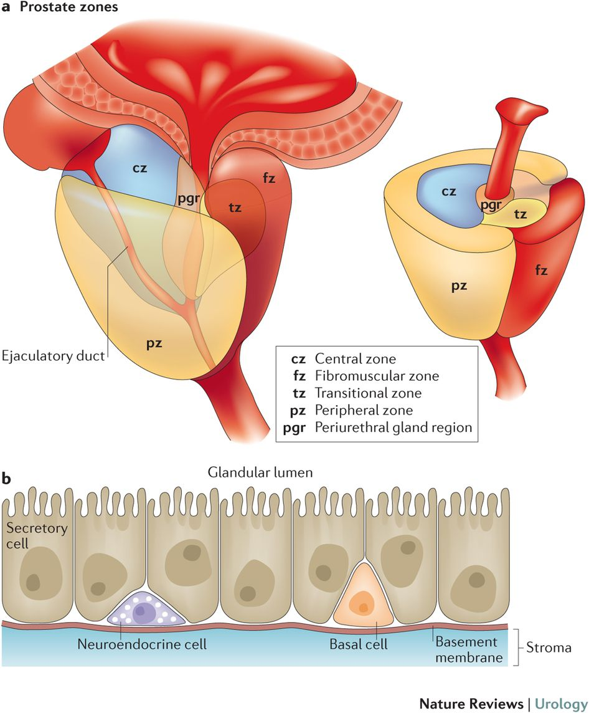
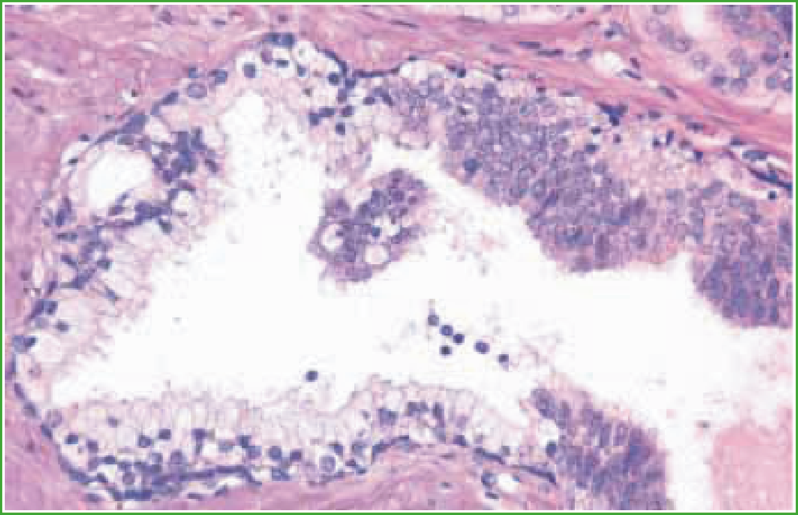
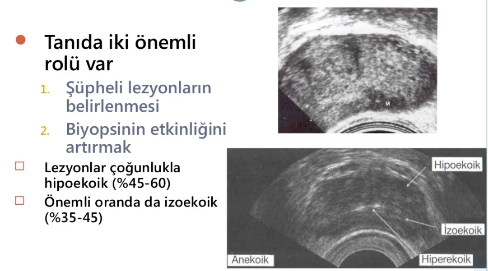
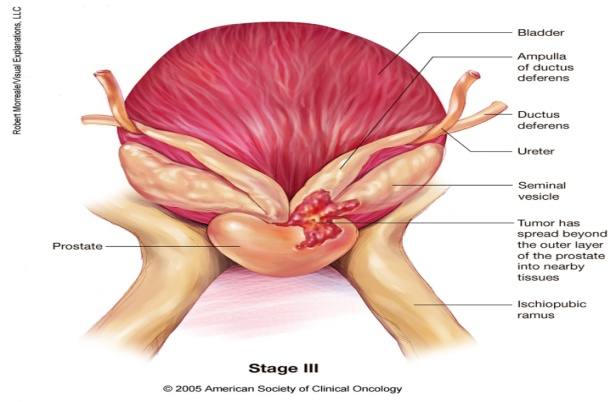
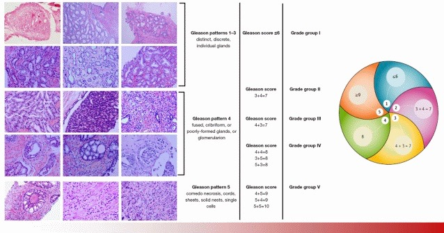
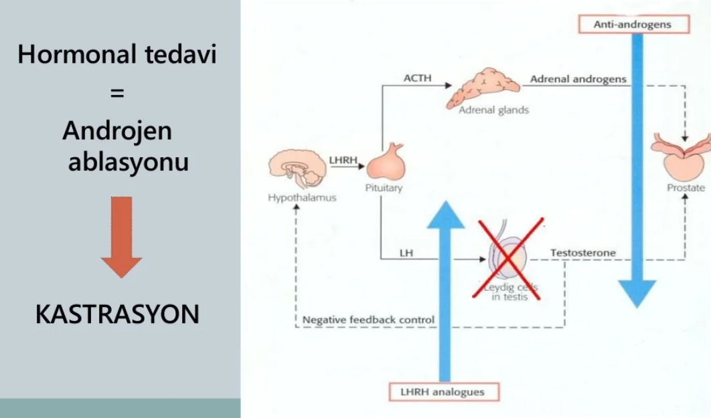
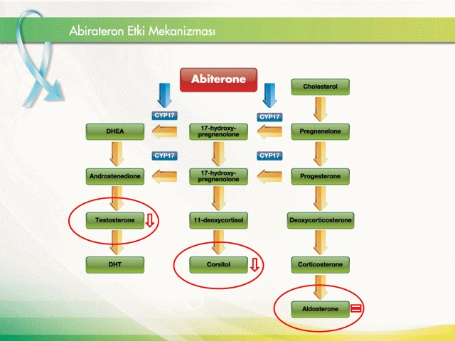

# PROSTAT KANSERİNE YAKLAŞIM

**Hazırlayan:** Dr. Bilgin Demir
**Bölüm:** Aydın Adnan Menderes Üniversitesi Tıp Fakültesi — Medikal Onkoloji Bilim Dalı

---

## İÇİNDEKİLER

1. [Prostatın Yapısı ve İşlevi](#prostatın-yapısı-ve-i̇şlevi)
2. [Epidemiyoloji](#epidemiyoloji)
3. [Patofizyoloji ve Doğal Seyir](#patofizyoloji-ve-doğal-seyir)
4. [Tarama](#tarama)
5. [Klinik Prezentasyon ve Tanı](#klinik-prezentasyon-ve-tanı)
6. [Evreleme, Gleason Skoru ve Prognoz](#evreleme-gleason-skoru-ve-prognoz)
7. [Klinik Yönetim — Lokalize Hastalık](#klinik-yönetim--lokalize-hastalık)
8. [Lokal İleri Hastalık](#lokal-i̇leri-hastalık)
9. [Metastatik Hastalık](#metastatik-hastalık)
10. [Hormonal Tedavi — Androjen Deprivasyon Tedavisi (ADT)](#hormonal-tedavi--androjen-deprivasyon-tedavisi-adt)
11. [Kastrasyon Dirençli Prostat Kanseri (KDPK)](#kastrasyon-dirençli-prostat-kanseri-kdpk)
12. [Yeni Nesil Anti-androjenler ve Radyonüklid Tedaviler](#yeni-nesil-anti-androjenler-ve-radyonüklid-tedaviler)
13. [Kemik Koruyucu Ajanlar](#kemik-koruyucu-ajanlar)
14. [Sınav Notları — Anahtar Hatırlatmalar](#sınav-notları--anahtar-hatırlatmalar)
15. [Vaka Soruları](#vaka-soruları)

---

## PROSTATIN YAPISI VE İŞLEVİ

### Anatomi

Prostat, **rektumun önünde** ve **mesanenin altında** bulunan, **ceviz büyüklüğünde** bir bezdir. Erkek üreme sisteminin ayrılmaz parçasıdır ve üretra prostatın tam ortasından geçer.

### Prostat 4 Zona Ayrılır



| Zon | Prostat Hacmindeki Yeri | Klinik Önemi |
|---|---|---|
| **Periferal zon (PZ)** | **~%70** | **Prostat kanserinin %80'i buradan çıkar** — gland yapısından en zengin bölge, adenokarsinom ve PIN'in en sık geliştiği alan |
| **Santral zon (CZ)** | ~%25 | Ejakülatör kanallar çevresinde; kanser nadir |
| **Transizyonel zon (TZ)** | ~%5 | **Benign Prostat Hiperplazisi (BPH) buradan gelişir** — yaşlılarda büyür |
| **Anterior fibromüsküler stroma** | ~%30 | Düz kas ağırlıklı, non-glandüler |

> **💡 Öğrenci için anahtar ayrım — "Kanser arkada, BPH ortada":**
>
> Prostat kanseri **periferal zondan** (arkadan) çıktığı için **rektal tuşe** ile ele gelebilir. BPH ise **transizyonel zondan** (merkezde, üretra çevresinde) büyüdüğü için **erken dönemde üretra basısı** yapar (idrar akımını engeller). Bu yüzden:
>
> * BPH hastası "tuvaletim zorlaşıyor, ince akıyor" diye gelir.
> * Prostat kanseri başlangıçta **asemptomatiktir** — arkada, üretraya uzak bölgede büyür, üretrayı ileri evreye kadar sıkıştırmaz.
>
> Bunu "prostatın ortasında bir aynalı dolap (BPH) varsa kıyafetini hemen giyemezsin; dolabın arkasındaki duvara astığın bir tablo (kanser) ise haftalarca farketmezsin" gibi düşün.

### Periferik Zon — Kanser Açısından Özellikleri

* Prostatın **glandüler dokusunun %70'ini** oluşturur
* **Androjenlerden etkilenen tek bölge**
* Rektuma **en yakın** yerde
* Üretranın **alt kısmında**
* **Prostat kanserlerinin %80'i** buradan çıkar

### Prostat Bezinin Fonksiyonu

**Sperm için besleyici ve koruyucu sıvı üretir** — toplam semenin **~%20'si** prostatik sıvıdır.

Prostatik sıvının içeriği:

* **Spermin** — sperm motilitesini artırır
* **Prostaglandinler** — uterusu uyarır
* **Çinko** — testosteron metabolizmasını etkiler

### Prostat Spesifik Antijen (PSA)

* Prostat bezinin ürettiği **koagülaz enzim**
* Normalde semen sıvısında yüksek konsantrasyonda bulunur, semen pıhtısını çözer
* Kanda **çok düşük düzeylerde** bulunur
* Prostat hasarı, enflamasyon, kanser vs → kana "sızar"

> **💡 PSA'yı nasıl düşün?** PSA bir "sızıntı göstergesidir" — normalde semen içindeyken doğru yerdedir. Prostat dokusu bozulduğunda (travma, iltihap, BPH, kanser) PSA kana karışır. **PSA = "prostat iyi değil" uyarısı**, ama "prostat kanseri" demek değildir. Yani PSA **bir tanı testi değil, bir pencere**. Yüksek çıkarsa "arkada bir şey var" dersin ama ne olduğunu sonradan araştırırsın.

---

## EPİDEMİYOLOJİ

### Sıklık

* **Prostat kanseri, erkeklerde 2. en sık görülen kanserdir** (Türkiye Halk Sağlığı Kurumu 2017)
* Akciğer kanserinden sonra en sık erkek kanseri
* ABD'de bazı yıllarda **1. sıraya** çıkmıştır (özellikle PSA tarama yoğunluğuna bağlı)

### Yaşa Spesifik Mortalite

* **Yaş ile dramatik artış:** 60 yaş sonrası insidans ve mortalite eğrisi keskin yükselir.
* Postmortem çalışmalar: **80 yaşında erkeklerin %90'ında** prostat kanseri hücreleri bulunmuştur — ancak çoğu **hayat boyu sessiz** kalır.

### Risk Faktörleri

**Kesin risk faktörleri:**

* **Yaş** — Vakaların **2/3'ü &gt; 65 yaş**
* **Etnik köken** — **siyah ırk > beyaz ırk > asyalı**
* **Aile öyküsü** — vakaların **%5-10'u** ailevi; özellikle **&lt;55 yaş** tanı konmuş 1. derece akraba riski belirgin artırır
* **BRCA1, BRCA2, ATM, CHEK2** mutasyonları (agresif seyir)

**Muhtemel risk faktörleri:**

* Yüksek kalorili diyet, yüksek yağlı kırmızı et
* Düşük fiziksel aktivite
* Aşırı kalsiyum tüketimi

**Koruyucu faktörler (tartışmalı):**

* Selenyum
* Likopen (domates)
* Vitamin E
* Yeşil çay

> **💡 "Yaşlanmanın doğal sonucu mu, hastalık mı?" paradoksu:** Prostat kanseri eğer 80 yaşın %90'ında mevcutsa, bu bir "hastalık" mıdır yoksa "yaşlanmanın doğal yan etkisi" midir? Bu soru prostat kanseri literatürünün merkezi bir tartışması. Gerçek şu: birçok prostat kanseri **indolent** (yavaş, tehlikesiz) seyirlidir ve hasta **başka sebeplerden ölür**. Bir kısmı ise **agresif** seyirlidir ve tedavi gerektirir. Tıbbın sanatı, hangisinin hangisi olduğunu **tedaviden önce** tahmin edebilmektir.
>
> Bu yüzden düşük riskli prostat kanseri için **"aktif izlem (active surveillance)"** kavramı doğmuştur — "tedavi etme, ama yakından izle". Bir böbrek taşının bazen kendiliğinden geçmesini beklediğin gibi.

---

## PATOFİZYOLOJİ VE DOĞAL SEYİR

### Prekanseröz Lezyon — PIN

**PIN (Prostatik İntraepitelyal Neoplazi):** Prostatın prekanseröz lezyonudur.

* **Yüksek grade PIN** → yaklaşık **%20-30 kanser gelişme riski**
* Biyopside PIN saptanması yakın takibi gerektirir (3-6 ayda bir)

### Hastalığın Seyri

* **Genellikle yavaş ilerler** (yıllar içinde)
* Postmortem çalışmalar: 80 yaşındaki erkeklerin %90'ında mevcut
* Semptomlar **geç dönemde** ortaya çıkar

### Histopatoloji

| Histoloji | Oran |
|---|---|
| **Adenokarsinom (asiner tip)** | **~%95** |
| Duktal adenokarsinom | %0.2-0.8 |
| Üroteliyal karsinom | %0.7-2.8 |
| Skuamöz karsinom | %0.6 |
| Bazal hücreli karsinom | Nadir |
| **Nöroendokrin / küçük hücreli** | Nadir, **agresif**, ADT'ye yanıtsız |
| Prostatik sarkom | &lt;%0.1 |



### Fizyopatoloji — Androjen Bağımlılığı

> **⭐ Altın kural:** Prostat kanseri **androjen bağımlı** bir kanserdir.

**Androjen reseptörü (AR) aktivasyonu**, prostat kanserinin büyümesi ve hayatta kalması için hastalığın **her noktasında** kritik bir rol oynar. Bu nedenle:

* **Erken evrede:** Androjenleri kesmek (kastrasyon) tümörü küçültür
* **İleri evrede:** Hasta hâlâ **androjen sinyalizasyonuna bağımlıdır** (bu yüzden KDPK'da bile yeni nesil anti-androjenler etkilidir)

> **💡 Kritik kavram:** "Kastrasyona dirençli" dediğimiz hasta **androjen bağımsız** değildir — sadece "düşük androjen düzeyine adapte olmuş" hasta demektir. Tümör hâlâ AR'yi kullanmaya devam eder (mutasyonla, amplifikasyonla, intrakrin sentez ile). Bu yüzden KDPK'da **abirateron (androjen sentezini blokajı)** ve **enzalutamid (AR sinyalizasyonu blokajı)** çalışır. "Dirençli" ama "bağımsız değil" — önemli ayrım.
>
> Bunu şöyle düşün: bir bahçıvan tohumları kesti ama bitki topraktan kalan minik kalıntılarla veya başka bir kaynakla beslenmeye devam ediyor. İkinci bir hamleyle o kalıntıları da kesmen lazım → yeni nesil anti-androjenler bunu yapar.

### Metastaz Yayılım Paterni

| Metastaz Yeri | Sıklık |
|---|---|
| **Kemikler** | **%90** (en sık!) |
| Akciğer | %46 |
| Karaciğer | %25 |
| Plevra | %21 |
| Adrenal bezler | %13 |

> **💡 Niçin kemik?** Prostat kanseri özellikle **aksiyel iskelete** (vertebra, pelvis, femur, kosta) yayılır. Bunun sebebi **Batson venöz pleksusudur** — prostat ve vertebra venleri birbirine bağlıdır, kapaksız. Kanser hücreleri portal sistemi atlayarak doğrudan omurgaya ulaşır. Ayrıca prostat kanseri **osteoblastik** (kemik yapıcı) metastazlar yapar; bu da skelet sintigrafisinde **"hot spot"** görünümüne neden olur.
>
> Prostat kanserinin osteoblastik paterni, meme kanserinin tersidir (meme genelde osteolitik). Bu yüzden prostat kanserinde **kalsiyum normalde düşer**, meme kanserinde yükselir.

### Prostat Kanserinde İlgili Genler

**Germline mutasyonlar:**

* **BRCA1, BRCA2** → agresif seyir, **PARP inhibitör** hedefi
* **ATM, CHEK2** → DNA hasar yanıt yolağı
* AR geni polimorfizmleri, inflamatuar ve hormon metabolize edici gen varyantları

> **💡 BRCA2 ve prostat kanseri:** Çoğu öğrenci BRCA1/2'yi meme-over kanseri ile ilişkilendirir; ama **BRCA2** mutasyonu prostat kanseri riskini de 2-8 kat artırır ve agresif seyire yol açar. Bu genetik bilgi **terapötik**tir — BRCA mutasyonlu hastalarda **olaparib (PARP inhibitörü)** klinik fayda sağlar. Bu yüzden KDPK hastalarında **germline + somatik BRCA testleri** standart hale gelmiştir.

---

## TARAMA

### Tarama Testleri

Prostat kanserinde iki ana tarama aracı:

1. **PSA testi** (eşik: &lt; 4 ng/mL — kaba değer)
2. **Dijital rektal muayene (DRE)**

### PSA'yı Yükselten Durumlar

PSA yüksekliği **tek başına** prostat kanseri anlamına **gelmez**. Farklı nedenler:

* **Prostat kanseri**
* **BPH (benign prostat hiperplazisi)**
* **Prostatit** (enflamasyon)
* **Travma** (rektal muayene, bisiklet sürme, kateterizasyon)
* Ejakülasyon (son 24-48 saat)

> **📝 Klinik ipucu:** PSA istenmeden önce hastaya "son 48 saatte ejakülasyon, bisiklet, rektal muayene, kateter, üriner enfeksiyon oldu mu?" sorulmalıdır. Aksi halde yanlış yüksek PSA ile gereksiz biyopsilere yönlenebilir.

### PSA Düzeylerine Göre Biyopside Kanser Saptanma Olasılığı

| PSA Düzeyi | Biyopside Kanser Saptanma |
|---|---|
| **&lt; 4 ng/mL** | **%15** |
| **4-10 ng/mL** | **%25** ("gri zon") |
| **> 10 ng/mL** | **%50** |

> **💡 "Gri zon" 4-10 ng/mL — En sık kafa karıştıran aralık:**
>
> Bu aralıkta hasta BPH'li mi yoksa kanserli mi ayırmak zordur. Yardımcı testler:
>
> * **Serbest/total PSA oranı** — Düşük oran (&lt;%10-15) kanser lehine, yüksek oran (>%25) BPH lehine
> * **PSA yoğunluğu (density)** — PSA/prostat hacmi; yüksek density kanser lehine
> * **PSA velositesi (hız)** — Yıllık artış &gt; 0.75 ng/mL kanser lehine
> * **PSA dublaj zamanı**
> * **Yaşa göre PSA** (genç hastada daha düşük eşik)
>
> Günümüzde ayrıca **multiparametrik MR (mpMR)** ve **PI-RADS** skorlaması ile hedefli biyopsi, kör 12'li biyopsiden daha doğru sonuç verir.

### Dijital Rektal Muayene (DRE)

* Prostat **rektum duvarına bitişik** (periferal zon %70)
* DRE sırasında **sert şişlikler** veya **düzensiz yüzeyler** kanser belirtisi olabilir
* **Sensitivitesi sınırlı** — erken kanseri yakalayamaz
* **Yine de şart** — çünkü bazı agresif kanserler PSA yükseltmeden DRE'de ele gelebilir

> **💡 DRE'nin "unutulan değeri":** PSA yaygınlaşınca DRE ihmal edildi. Ama nadir bir grup hasta (tipik olarak daha agresif, az farklılaşmış) düşük PSA ile yüksek volümlü kanser taşıyabilir — DRE'yi atlama!

### Kimlere Tarama?

| Grup | Öneri |
|---|---|
| **Ortalama riskli erkek** | **≥ 50 yaş** tarama başlat |
| **Yüksek risk (aile öyküsü, siyah ırk)** | **≥ 45 yaş** |
| **Çok yüksek risk (2+ 1. derece akraba, BRCA)** | **≥ 40 yaş** |

> **💡 Tarama tartışması:** PSA taramasının mortaliteyi azalttığı (ERSPC) ve azaltmadığı (PLCO) çalışmalar var. Sonuç: tarama **overdiagnosis** (aşırı tanı) + **overtreatment** (aşırı tedavi) riskini artırır — aslında hayat boyu sessiz kalacak bir kanser yüzünden hasta inkontinans/impotans yaşayabilir. Bu yüzden günümüzde karar **hasta ile paylaşılmış karar (shared decision-making)** temeline dayanır. Amerikan Kanser Topluluğu (ACS), USPSTF ve AUA farklı öneriler sunar ama ortak mesaj: "**hastayı bilgilendir, tercihi ile birlikte karar ver**".

### PSA Taramasının İnsidans ve Mortalite Üzerine Etkisi

* 1990'ların başında PSA testinin yaygınlaşmasıyla Avrupa'da (özellikle &lt;75 yaş erkeklerde) **prostat kanseri insidansında artış**
* Türkiye ve ABD'de 5 yıllık sağkalım **%66 → %99** (1975 → 2008)
* Prostat kanseri mortalitesi 1990'lardan beri **düşüşte** (Doğu Avrupa hariç)
* Ancak bu düşüşün sadece PSA'ya mı bağlı olduğu tartışmalıdır

---

## KLİNİK PREZENTASYON VE TANI

### Semptomlar

Prostat kanseri **erken evrede genellikle asemptomatiktir**. İleri evrede:

* **İdrar yapmada güçlük** (dysuria)
* **Noktüri** (gece idrar)
* **Ağrılı idrar** (tümör üretraya veya mesaneye invazyon)
* **Hematüri**
* **Kemik ağrısı** (metastaz — özellikle bel, kalça, omurga)
* Yorgunluk, kilo kaybı

> **📝 Dikkat:** Birçok genç hekim "idrar yakınması = BPH" der. Oysa 50+ yaş bir erkekte yeni başlayan LUTS (lower urinary tract symptoms), **mutlaka prostat kanseri açısından da değerlendirilmelidir**. BPH ve prostat kanseri **birlikte bulunabilir** — biri diğerinin varlığını ekarte etmez.

### Ayırıcı Tanı — BPH

**BPH (Benign Prostat Hiperplazisi):** Non-prekanseröz, benign.

| Yaş | BPH Prevalansı |
|---|---|
| 30'lar | %10 |
| 40'lar | %20 |
| 60'lar | **%50-60** |
| 70 ve 80'ler | **%80-90** |

> **💡 Önemli:** BPH **prekanseröz değildir**. BPH olan bir erkekte prostat kanseri gelişme riski **BPH olmayan bir erkekten farklı değildir**. Yani "BPH zamanla kansere döner" **yanlış bir inanıştır**. Bunun nedeni: BPH transizyonel zondan, kanser periferal zondan çıkar — farklı kökenler.

### Tanı Algoritması

**1. Öykü**

* Aile öyküsü?
* Üretra obstrüksiyon bulguları (frequency, urgency, zayıf akım, tam boşaltamama)?
* LUTS derecesi (IPSS skoru)?

**2. Fizik Muayene ve Tetkikler**

* **Rektal tuşe (DRE)**
* **Serum PSA**
* **Transrektal USG (TRUS)**
* **Prostat biyopsisi** (kesin tanı)

### Transrektal Ultrasonografi (TRUS)



**TRUS'un iki rolü vardır:**

1. **Şüpheli lezyonların belirlenmesi**
2. **Biyopsinin etkinliğini artırma** (hedefli örnekleme)

**Tümör ekojenitesi:**

* **Hipoekoik (%55-60)** — en sık
* İzoekoik (%35-45)
* Hiperekoik (nadir)

> **💡 TRUS bir "görüntüleme" değil, "rehberlik" aracıdır.** TRUS'ta prostat kanserinin kesin tanısı konulamaz; TRUS esas olarak **iğne biyopsisini doğru yere götürmek** için kullanılır. Artık günümüzde **mpMR-TRUS füzyon biyopsisi** (MR'da görülen şüpheli alanın TRUS'ta hedeflenmesi) daha doğru sonuç verir.

### Prostat Biyopsisi

* **Kalın iğne (core) biyopsisi**
* Avrupa kılavuzları: **antibiyotik profilaksisi altında**, **TRUS eşliğinde**, **en az 10-12 kor örnek** (sistematik)
* Günümüzde **hedefli biyopsi** (mpMR ile belirlenen şüpheli alanlardan ekstra örnek) giderek daha çok tercih ediliyor

> **⚠️ Biyopsi komplikasyonları:**
>
> * Enfeksiyon (**~%2-5, sepsis riski**) — bu yüzden ab profilaksisi şart
> * Hematüri, hematospermi, hemorajik rektal kanama
> * Nadiren üriner retansiyon
> * Enfeksiyon önlemek için giderek daha çok **transperineal biyopsi** tercih edilmekte

### Görüntüleme

**Endikasyonlar:** &gt; 10 yıl yaşam beklentisi olan veya semptomatik hastalar

| Yöntem | Amaç |
|---|---|
| **Pelvik BT veya MR** | **Lokal invazyon** değerlendirmesi |
| **Kemik sintigrafisi** | **Kemik metastazı** (osteoblastik — prostat için klasik tarama) |
| **PSMA PET/BT** | **En duyarlı yöntem** — hem kemik hem yumuşak doku metastazlarını tarar |

> **💡 PSMA PET/BT devrim niteliğinde:** PSMA (prostat spesifik membran antijeni) prostat kanser hücrelerinde aşırı eksprese olur. **Ga-68 PSMA PET/BT**, kemik sintigrafisi + BT kombinasyonundan **çok daha duyarlı** olarak metastazları yakalar. Ayrıca tedavi takibinde ve **Lu-177 PSMA** radyonüklid tedavisinin hedefini bulmada kullanılır.

---

## EVRELEME, GLEASON SKORU VE PROGNOZ

### TNM — Primer Tümör (T)



| T Evresi | Tanım |
|---|---|
| **T1** | Klinik olarak belli olmayan, **non-palpabl** |
| T1a | Rezeke edilen dokunun **≤%5**'inde insidental tümör |
| T1b | Rezeke edilen dokunun **>%5**'inde insidental tümör |
| T1c | **Yükselmiş PSA** nedeniyle yapılan iğne biyopsisinde saptanan tümör, ele gelmiyor |
| **T2** | Tümör **palpe edilir** ve **prostata sınırlı** |
| T2a | Bir lobun yarısı veya daha azı |
| T2b | Bir lobun yarısından çoğu, diğer lobu tutmaz |
| T2c | Her iki lobu da kapsar |
| **T3** | **Prostat dışına yayılır** |
| T3a | Ekstrakapsüler yayılım (uni veya bilateral) |
| T3b | **Seminal vezikül invazyonu** |
| **T4** | Tümör **fikse** veya seminal vezikül dışı komşu yapıları invaze eder (mesane boynu, dış sfinkter, rektum, levator kası, pelvik duvar) |

### TNM — Nod ve Metastaz

**Lenf Nodu (N):**

* **NX:** Değerlendirilemez
* **N0:** Bölgesel lenf nodu metastazı yok
* **N1:** Bölgesel lenf nodu metastazı var

**Metastaz (M):**

* **M0:** Yok
* **M1a:** Bölgesel olmayan lenf nodları
* **M1b:** **Kemik(ler)** (en sık)
* **M1c:** Diğer bölgeler

### Gleason Skoru



**Gleason skoru**, prostat kanserinde en yaygın kullanılan histopatolojik **derecelendirme** sistemidir. Tümör hücrelerinin **mimari büyüme paternini** değerlendirir.

### Skorlama Sistemi

```
     PRİMER GLEASON           SEKONDER GLEASON
     (en sık, >%50)           (ikinci en sık, >%5)

        1-5 arası     +        1-5 arası

              TOPLAM = 2 - 10
```

**Günümüzde:**

* Pratikte **3+3 = 6** skoru **en düşük** kabul edilir (daha az diferansiye paternler nadiren raporlanır)
* 2014'te **ISUP Grade Grup (GG)** sistemi geliştirildi:

| Gleason | ISUP Grade Grup | Prognoz |
|---|---|---|
| **≤ 6 (3+3)** | **GG 1** | İyi (indolent) |
| **7 (3+4)** | **GG 2** | İyi |
| **7 (4+3)** | **GG 3** | Orta |
| **8 (4+4)** | **GG 4** | Kötü |
| **9-10** | **GG 5** | Çok kötü |

> **💡 3+4 vs 4+3 fark eder mi?** **Evet, çok!** İkisi de "7" ama **primer patern** prognozu belirler:
>
> * **3+4 = 7 (GG 2):** Çoğunluk iyi farklılaşmış, azınlık kötü → daha iyi prognoz
> * **4+3 = 7 (GG 3):** Çoğunluk kötü, azınlık iyi → daha kötü prognoz, metastaz riski yüksek
>
> Bu fark aktif izlem adaylığını belirlerken kritik: GG1-2 hastası aktif izleme alınabilirken, GG3 hastasında genelde aktif tedavi önerilir.

### Evreleme Temelleri

Bir prostat tümörünün **evre grubu** üç parametre ile belirlenir:

1. **PSA** düzeyi
2. **TNM evresi**
3. **Gleason skoru / ISUP GG**

Evre grupları **I-IV** arasındadır.

### AJCC Prognostik Evre Grupları (UICC 8. Edisyon)

| T Evresi | N | M | PSA | Grade Grup | Evre Grubu |
|---|---|---|---|---|---|
| cT1a-c, cT2a | N0 | M0 | &lt; 10 | 1 | **I** |
| pT2 | N0 | M0 | &lt; 10 | 1 | **I** |
| cT1a-c, cT2a, pT2 | N0 | M0 | ≥ 10, &lt; 20 | 1 | **IIA** |
| cT2b-c | N0 | M0 | &lt; 20 | 1 | **IIA** |
| T1-2 | N0 | M0 | &lt; 20 | 2 | **IIB** |
| T1-2 | N0 | M0 | &lt; 20 | 3-4 | **IIC** |
| T1-2 | N0 | M0 | ≥ 20 | 1-4 | **IIIA** |
| T3-4 | N0 | M0 | Herhangi | 1-4 | **IIIB** |
| Herhangi T | N0 | M0 | Herhangi | 5 | **IIIC** |
| Herhangi T | N1 | M0 | Herhangi | Herhangi | **IVA** |
| Herhangi T | Herhangi N | M1 | Herhangi | Herhangi | **IVB** |

> **📝 Not:** PSA veya Grade Grup bilgisi mevcut değilse, evreleme T kategorisi ve mevcut olan parametre ile belirlenmelidir.

### Evreye Göre 5 Yıllık Sağkalım

| Evre | 5-Yıllık Sağkalım |
|---|---|
| **Lokal (Evre I-II)** | **~%100** |
| **Bölgesel (Evre III)** | **~%100** |
| **Uzak / Metastatik (Evre IV)** | **~%31** |

> **💡 Dramatik kontrast:** Lokalize prostat kanseri 5 yıllık %100 sağkalımlıyken, uzak metastatik hastalıkta %31'e düşer. Bu, erken tanının ve tedavinin prostat kanserinde **hayat kurtarıcı** olduğunu gösteriyor — ancak aşırı tanı/tedaviye karşı dengeli bir yaklaşım gerekir.

### Klinik Tablo Sınıflaması

```
  Erken Evre Lokal      →  Lokal İleri Evre     →  Metastatik
   T1-2, N0, M0            T3-4, herhangi N, M0    Herhangi T, N,
                           veya T herhangi,          M+
                           N+, M0
```

### D'Amico Risk Sınıflaması

Lokalize prostat kanserinin tedavi planlamasında en yaygın kullanılan risk gruplandırmasıdır:

| Risk Grubu | PSA | Gleason / ISUP GG | Klinik Evre |
|---|---|---|---|
| **Düşük risk** | &lt; 10 ng/mL **ve** | ≤ 6 (GG 1) **ve** | ≤ T2a |
| **Orta risk** | 10-20 ng/mL **veya** | 7 (GG 2-3) **veya** | T2b-c |
| **Yüksek risk** | > 20 ng/mL **veya** | 8-10 (GG 4-5) **veya** | ≥ T3a |

> **💡 Neden önemli?** D'Amico sınıflaması tedavi kararını doğrudan yönlendirir:
>
> * **Düşük risk** → aktif izlem adayı (gereksiz tedaviden kaçın)
> * **Orta risk** → prostatektomi veya RT (± kısa süreli ADT, 4-6 ay)
> * **Yüksek risk** → agresif tedavi (RT + uzun süreli ADT 2-3 yıl, veya prostatektomi + genişletilmiş LN disseksiyonu)
>
> Üç parametreden **en kötü olanı** risk grubunu belirler. Yani PSA = 5, Gleason 3+3, T2c olan hasta **orta risk** sayılır (T2c nedeniyle).

---

## KLİNİK YÖNETİM — LOKALİZE HASTALIK

### Tanım

**T1-2, N0, M0** — tümör prostat içinde sınırlı.

### Tedavi Seçenekleri

| Tedavi | Kim İçin Uygun? | Avantaj | Dezavantaj |
|---|---|---|---|
| **Radikal Prostatektomi** | Genç (&lt;70), iyi performans, lokalize hastalık | Kesin doku alımı, patolojik evre net | **İnkontinans, erektil disfonksiyon** |
| **Eksternal RT** | Operasyon adayı olmayan, yaşlı | Non-invazif | Radyasyon sistit/proktit, uzun tedavi süresi |
| **Brakiterapi** | Düşük-orta risk lokalize | Kısa süre, lokal hedefli | Teknik gerektirir, orta-yüksek riskli değil |
| **Aktif izlem** | Düşük risk (GG1, düşük PSA, düşük tümör hacmi) | Yan etki yok | Anksiyete, tedaviyi erteleme riski |
| **Watchful waiting** | Yaşlı, komorbid, &lt;10 yıl yaşam beklentisi | Tedaviden kaçınma | Semptomatik olduğunda palyasyon |

> **💡 "Aktif izlem" vs "Watchful waiting" fark:**
>
> * **Aktif izlem (Active Surveillance):** Küratif niyet korunur. Düzenli PSA, DRE, MR, tekrar biyopsi yapılır. Progresyon olursa **aktif tedavi** (RT, cerrahi) başlanır. Amaç: küratif pencereyi kaçırmamak + gereksiz tedaviden kaçınmak.
> * **Watchful waiting:** Küratif niyet yok. Hasta yaşlı/kırılganda semptomatik olunca palyatif tedavi (hormon, RT) verilir. Amaç: yaşam kalitesi.
>
> Bu iki kavram sıkça karıştırılır. Birinci "ilerlemeyi yakalamaya hazırım", ikincisi "ilerlemeyi bekliyorum ve fazla uğraşmayacağım".

---

## LOKAL İLERİ HASTALIK

### Tanım

**T3-4, herhangi N, M0** veya **T herhangi, N+, M0** — tümör prostat dışına veya bölgesel lenf nodlarına yayılmış, uzak metastaz yok.

### Tedavi

1. **Radyoterapi + Uzun Süreli ADT** (2-3 yıl) — altın standart
2. **Radikal prostatektomi + Pelvik LN disseksiyonu** (seçilmiş vakalarda) + adjuvan/salvage RT
3. **Hormonal manipülasyon:**
    * **Orşiektomi** (cerrahi kastrasyon)
    * **Medikal kastrasyon** (LHRH analogları/antagonistleri)
    * **Antiandrojen**

> **💡 Niçin RT + ADT kombinasyonu?** Çalışmalar (EORTC 22863, RTOG 85-31) gösterdi ki lokal ileri hastalıkta RT'ye ek uzun süreli ADT verilince **sağkalım belirgin artar**. ADT, tümör hücrelerini RT'ye duyarlılaştırır ve mikrometastazları kontrol eder.

---

## METASTATİK HASTALIK

### Tanım

**Herhangi T, herhangi N, M+** — uzak metastaz (kemik, akciğer, karaciğer, nonregional LN).

### Tedavi Temelleri

1. **MAB (Maksimal Androjen Blokajı) = Kastrasyon + Antiandrojen**
2. **Sistemik kemoterapi** (dosetaksel)
3. **Yeni nesil anti-androjenler** (abirateron, enzalutamid, apalutamid, darolutamid)

### mHSPC'de Güncel Tedavi Yaklaşımları

Metastatik hormona duyarlı prostat kanserinde (mHSPC) artık **ADT tek başına yeterli değildir**. Güncel kılavuzlar ADT'ye ek tedavi eklenmesini önerir:

**Dublet rejimler (ADT + 1 ajan):**

| Eklenen Ajan | Dayanak Çalışma | Katkı |
|---|---|---|
| **Dosetaksel (6 kür)** | CHAARTED, STAMPEDE | OS avantajı, özellikle **yüksek volümlü** hastalıkta belirgin |
| **Abirateron + prednizolon** | LATITUDE, STAMPEDE | OS avantajı, düşük ve yüksek volümlü hastalıkta |
| **Enzalutamid** | ENZAMET, ARCHES | OS avantajı |
| **Apalutamid** | TITAN | OS + rPFS avantajı |

**Triplet rejim (ADT + dosetaksel + abirateron):**

* **PEACE-1** çalışması: Yüksek volümlü mHSPC'de ADT + dosetaksel + abirateron → OS avantajı
* Günümüzde yüksek volümlü hastalıkta **triplet** giderek standart oluyor

> **💡 "Yüksek volüm" vs "Düşük volüm" ayrımı (CHAARTED kriterleri):**
>
> * **Yüksek volüm:** ≥ 4 kemik metastazı (en az 1'i aksiyel iskelet dışı) **veya** visseral metastaz
> * **Düşük volüm:** Yukarıdaki kriterleri karşılamayan
>
> Bu ayrım tedavi seçiminde kritiktir: dosetaksel eklenmesinin en büyük faydası **yüksek volümlü** hastalıktadır.

### Prostat Kanseri Hastalığının Seyri

```
Hormona duyarlı                    Kastrasyon Dirençli
(HSPC / mHSPC)                     (CRPC / mCRPC)

Lokal tedavi → ADT başla → Kastrasyon → Progresyon →
  Yeni nesil hormon → KT → Yeni nesil hormon → Radyonüklid → Ölüm
```

---

## HORMONAL TEDAVİ — ANDROJEN DEPRİVASYON TEDAVİSİ (ADT)



### Neden Androjen Blokajı?

Prostat kanserinin **her aşamasında** androjen reseptör (AR) aktivasyonu kritik rol oynar. Androjen kaynağını kesersek tümör **küçülür, PSA düşer, semptomlar hafifler**.

> **💡 Niçin LHRH analoğu "başlangıçta yükseltir"?** LHRH analogları önce hipofizde LH-FSH salgısını **uyarır** (flare etkisi) → testosteron **geçici olarak yükselir** → tümör kısa süre büyüyebilir, semptomatik metastatik kemik ağrısı kötüleşebilir. Bu yüzden LHRH analoglarından **önce** antiandrojen (bikalutamid 2 hafta) verilir — flare etkisini bloke etmek için. LHRH **antagonistleri** (degarelix) ise doğrudan supresyon yaptığı için flare yoktur.

### Androjen Blokajı Yöntemleri

**1) Cerrahi Kastrasyon (Orşiektomi)**

* **Altın standart**, en hızlı yöntem
* Dakikalar içinde testosteronu kastre düzeye indirir
* **Dezavantaj:** Psikolojik, geri dönüşümsüz

**2) Medikal Kastrasyon**

* **LHRH agonistleri:** Leuprolid, goserelin, triptorelin — aylık/3 aylık/6 aylık depo enjeksiyonlar
* **LHRH antagonistleri:** Degarelix, abarelix — flare etkisi yok, ama anafilaksi riski
* **Östrojenler:** Tarihsel; tromboembolik riskler nedeniyle terk edildi

**3) Hedef Hücrede Androjen Blokajı — Antiandrojenler**

* **Bikalutamid, flutamid, nilutamid** (non-steroidal) — LHRH analoğu başlangıcında flare korumak için + MAB
* **Siproteron asetat** (steroidal)

### Hormonal Tedavi Yan Etkileri

> **⚠️ ADT'nin sistemik yan etkileri:**

* **Metabolik sendrom** (insülin direnci, abdominal obezite, dislipidemi)
* **Kardiyovasküler hastalıklar** (Mİ, stroke artışı)
* **Osteoporoz, kırık riski** (özellikle vertebra, kalça)
* **Sıcak basması** (menopozal semptom benzeri)
* **Libido kaybı**
* **İmpotans**
* **Jinekomasti**
* Anemi, kas gücü azalması, kognitif disfonksiyon, depresyon

> **💡 Klinik pearl:** ADT alan hastada **yıllık DEXA**, **lipid + glukoz profili**, **düzenli kardiyoloji izlemi**, **D vit + kalsiyum takviyesi**, **osteoporoz profilaksisi (bifosfonat/denosumab)** unutulmamalıdır. Prostat kanseri hastası prostat kanserinden değil, ADT'nin yan etkilerinden ölebilir.

---

## KASTRASYON DİRENÇLİ PROSTAT KANSERİ (KDPK)

### Prostat Kanseri Evreleri — Modern Sınıflama



```
          Kastrasyon Duyarlı         Kastrasyon Dirençli
          (KDPK / HSPC)              (KRPK / CRPC)

      ┌─────────┬─────────┐       ┌─────────┬─────────┐
      ↓         ↓         ↓       ↓         ↓         ↓
      M0        M1                M0        M1
    (non-     (mHSPC)           (nmCRPC)  (mCRPC)
    metas.)
```

### Kastrasyona Naif

**"Kastrasyon-naif"** terimi, progresyon anında ADT almayan hastaları tanımlar. Önceden RT sırasında neoadjuvan/eşzamanlı/adjuvan ADT almış olsa bile, **testis fonksiyonları geri dönmüşse** hâlâ kastrasyon-naif sayılır.

### KRPK — Güncel Tanımı (2017 EAU)

**KRPK tanısı için iki kriter gereklidir:**

**Kriter 1: Kastre testosteron düzeyi**

* **Serum testosteron &lt; 50 ng/dl** (veya &lt; 1.7 nmol/L)

**Kriter 2: Progresyon**

**a) Biyokimyasal progresyon:**

* **PSA'da 3 kez üst üste yükselme**
* **En az birer hafta arayla**
* **En az iki kez en düşük değerin %50 üzerinde**
* **PSA > 2 ng/mL**

**VE/VEYA**

**b) Radyolojik progresyon:**

* **Yeni lezyonlar** veya
* **Kemik görüntülemesinde ≥ 2 yeni kemik lezyonu** veya **RECIST'e göre yumuşak doku progresyonu**

> **⚠️ Kritik uyarı:** **Semptomatik progresyon tek başına yeterli değildir.** KRPK tanısı için mutlaka PSA yükselmesi **veya** radyolojik progresyon belgelenmelidir.

> **📝 Niçin bu kadar sıkı tanımlanmış?** Çünkü KRPK'ya geçiş, hastanın tedavi hattının değiştirilmesi anlamına gelir. Yanlış tanı konulursa hasta gereksiz yere toksik ikinci basamak tedavilere başlanır. Ayrıca **PSA flare** (geçici PSA artışı) ile karıştırılmamalı — bu yüzden 3 kez üst üste yükselme şartı var.

### Non-metastatik KRPK (nmCRPC)

Kastre testosteron düzeyinde PSA progresyonu var ama **görüntülemede metastaz saptanmayan** hastalar. Bu grup önemlidir çünkü tedavisiz **metastaz gelişim riski yüksektir**.

| İlaç | Çalışma | Birincil Sonlanım |
|---|---|---|
| **Apalutamid** + ADT | SPARTAN | MFS (metastazsız sağkalım) avantajı |
| **Enzalutamid** + ADT | PROSPER | MFS avantajı |
| **Darolutamid** + ADT | ARAMIS | MFS avantajı |

> **💡 nmCRPC'de tedavi başlama kriteri:** **PSA dublaj zamanı ≤ 10 ay** olan hastalar yüksek risklidir ve tedavi başlanmalıdır. PSA dublaj zamanı uzun (&gt; 10 ay) olan hastalar daha yakın izlemle takip edilebilir.

> **📝 Darolutamid'in farkı:** Kan-beyin bariyerini daha az geçer → nörokognitif yan etkiler (düşme, yorgunluk, nöbet) enzalutamide göre **belirgin daha az**. Yaşlı ve nörolojik komorbidite olan hastalarda tercih nedeni olabilir.

### Metastatik KRPK (mCRPC) — Tedavi Seçenekleri

**1) Sekonder Hormonal Manipülasyonlar**

* **Orşiektomi** (LHRH'ya rağmen testosteron yüksekse)
* **Bikalutamid** (daha önce almadıysa)
* **Anti-androjenlerin kesilmesi** (withdrawal response — paradoksal PSA düşüşü görülebilir)
* Siproteron asetat, flutamid, ketokonazol

**2) Kemoterapi**

* **Dosetaksel** — ilk basamak standart KT
    * Etki mekanizması: **mikrotübül stabilizatörü** (depolimerizasyonu engeller → mitoz durur)
    * Doz: **75 mg/m² IV, her 3 haftada bir**, toplam **6-10 kür**
    * Prednizolon 5 mg 2×/gün ile birlikte verilir
    * Yan etkiler: nötropeni, nöropati, onikoliz, sıvı retansiyonu
* **Kabazitaksel** — ikinci basamak (dosetaksel sonrası progresyon)
    * Dosetaksel dirençli hücrelerde de etkili (farklı beta-tübülin afinitesi)
    * Doz: **20-25 mg/m² IV, her 3 haftada bir**
    * Yan etkiler: **belirgin nötropeni** (G-CSF desteği sıklıkla gerekir), diyare

**3) Yeni Hormonoterapiler**

* **Abirateron asetat**
* **Enzalutamid**
* **Apalutamid**
* **Darolutamid**

**4) Radyonüklid Tedaviler**

* **Radyum-223 (Xofigo)** — semptomatik kemik metastazı
* **Lutetium-177 PSMA** — tedaviye dirençli KRPK
* **Aktinyum-225** — refrakter vakalar

**5) Hedefli Tedaviler**

* **PARP inhibitörleri** (olaparib, rucaparib) — BRCA1/2, ATM mutasyonlu
* **Sipuleucel-T** (otolog immünoterapi — ABD'de)

---

## YENİ NESİL ANTİ-ANDROJENLER VE RADYONÜKLİD TEDAVİLER

### Abirateron Asetat

**Etki mekanizması:** **CYP17A1** enziminin inhibisyonu → androjen sentezinin **tüm yollarda** (testis, adrenal, tümör içi intrakrin) baskılanması.

**Etki:**

* Testosteron ↓
* Kortizol ↓ (yan etki)
* **ACTH ↑** (kortizol kaybının telafisi)
* Aldosteron **sentezi** azalmaz ama ACTH artışı nedeniyle **düzeyi yükselebilir** → **hipertansiyon, hipokalemi, sıvı retansiyonu**

> **⭐ Klinik pearl:** **Abirateron ile HER ZAMAN steroid (prednizolon 5 mg 1-2×/gün) verilmelidir!**
>
> Niçin? Çünkü abirateron adrenal kortizol sentezini bloke eder. ACTH yükselir → mineralokortikoid prekürsörler birikir → **hiperaldosteronizm benzeri tablo** (HT, hipokalemi, ödem). Ek prednizolon kortizolü yerine koyarak ACTH'yı bastırır ve bu yan etkileri önler.

### Enzalutamid (XTANDI)

**Etki mekanizması:** AR sinyal yolağının **3 basamağını aynı anda inhibe eden ilk AR sinyalizasyon inhibitörü**:

1. AR'ye androjen bağlanmasını önler
2. AR'nin çekirdeğe translokasyonunu bloke eder
3. AR'nin DNA'ya bağlanmasını engeller

### Abirateron vs Enzalutamid — Güvenlik Profili

| Özellik | Abirateron | Enzalutamid |
|---|---|---|
| **Steroid gerekliliği** | **Evet** (prednizolon şart) | Hayır |
| **Sıvı tutulumu / HT** | **Var** | Hafif |
| **Kardiyak yan etki** | Var | Var |
| **Aç karnına alım** | **Gerekli** | Gerekmez |
| **Nöbet riski** | Hayır | **Var** (nöbet öyküsü kontrendike) |
| **Nörokognitif yan etki** | Nadir | **Daha fazla** (baş dönmesi, düşme) |

> **💡 Klinik tercih rehberi:**
>
> * **Kardiyak komorbiditesi** olan → enzalutamid daha temiz
> * **Nöbet öyküsü** veya ileri yaş demans → **abirateron** tercih
> * **Steroid kullanımı sorunlu** (diyabet, peptik ülser) → enzalutamid
> * **Düzgün tablet uyumu zayıf** → enzalutamid günde tek doz

### Radyonüklid Tedaviler

**1) Lutetium-177 PSMA**

* **mCRPC**'de kullanılıyor
* **%25 parsiyel yanıt**
* **Nefrotoksisite** (PSMA böbrek tübülünde de eksprese)
* **%20-40 tedaviye refrakter**
* **Yaygın kemik iliği tutulumu varsa kaçınılmalı** (miyelosüpresyon)

**2) Actinium-225 PSMA**

* Lutetium-177'ye yanıtsız/refrakter hastalarda
* Alfa emitörü, özellikle **beyin ve kemik iliği metastazları** için

**3) Radium-223 (Xofigo)**

* **Semptomatik kemik metastazı** olan (osteoblastik) hastalarda
* **Visseral metastaz yok**, **LN &lt; 3 cm** olanlarda
* Alfa emitörü
* **Eliminasyonu GİS yoluyla**
* Mortaliteyi azalttığı kanıtlanmıştır (ALSYMPCA çalışması)

> **💡 Radionüklidlerin mantığı:** Alfa ve beta parçacıkları kısa mesafede (mikrometre-milimetre) çok yüksek enerji bırakır. Osteoblastik lezyonlarda kemik çevresindeki tümör hücrelerini öldürür, çevre dokuya zarar verme az olur. "Hedefli radyasyon bombası" gibi düşün — hedef **kemikte Ca/P metabolizmasının fazla olduğu yerler**.

---

## KEMİK KORUYUCU AJANLAR

Prostat kanserinde kemik metastazı ve ADT'ye bağlı osteoporoz nedeniyle kemik koruyucu tedavi önem kazanır:

| Ajan | Endikasyon | Mekanizma | Uygulama |
|---|---|---|---|
| **Zoledronik asit** | Kemik metastazı olan mCRPC | Osteoklast inhibisyonu (bifosfonat) | 4 mg IV, her 3-4 haftada bir |
| **Denosumab (Xgeva)** | Kemik metastazı olan mCRPC | RANKL monoklonal antikoru | 120 mg SC, her 4 haftada bir |
| **Denosumab (Prolia)** | ADT'ye bağlı osteoporoz | RANKL monoklonal antikoru | 60 mg SC, her 6 ayda bir |

> **⚠️ Her iki ajanda da çene osteonekrozu (ONJ) riski:**
>
> * Tedavi öncesi **diş muayenesi** yapılmalı
> * Ağız hijyeni sağlanmalı
> * İnvaziv dental işlemler mümkünse tedaviden önce tamamlanmalı

> **💡 Klinik ipucu:** Tüm kemik koruyucu ajanlarla birlikte **kalsiyum (500-1000 mg/gün) ve D vitamini (400-800 IU/gün)** takviyesi verilmelidir. Hipokalsemi riski nedeniyle tedavi öncesi kalsiyum düzeyi kontrol edilmeli.

---

## SINAV NOTLARI — ANAHTAR HATIRLATMALAR

> **📋 En Sık Sorulan Noktalar:**
>
> 1. **Prostat kanserinin %80'i periferal zondan** çıkar; **BPH transizyonel zondan**. Kanser DRE'de ele gelebilir, BPH üretra basısı yapar.
> 2. **Adenokarsinom %95**, nadir tipler (küçük hücreli nöroendokrin — agresif, ADT yanıtsız).
> 3. **PSA: &lt;4 normal, 4-10 gri zon, >10 yüksek risk**. PSA'yı artıran: kanser + BPH + prostatit + travma.
> 4. **Gleason 3+4 vs 4+3** fark eder — ISUP GG 2 vs GG 3, prognoz farkı önemli.
> 5. **Kemik metastazı en sık (%90)**, osteoblastik patern, Batson pleksusu.
> 6. **BRCA1/2 mutasyonu** → agresif seyir + **PARP inhibitörü** hedefi.
> 7. **Tarama:** ≥50 yaş (risk varsa ≥45), shared decision-making.
> 8. **PSMA PET/BT** en duyarlı evreleme yöntemi.
> 9. **Lokalize:** Prostatektomi/RT/aktif izlem; **Lokal ileri:** RT + uzun ADT; **Metastatik:** ADT + yeni nesil hormon/KT.
> 10. **LHRH analoğunda flare etkisi** → antiandrojen ile prevansiyon (bikalutamid 2 hafta).
> 11. **ADT yan etkileri:** metabolik sendrom, KV hastalık, osteoporoz, impotans, jinekomasti. Yıllık DEXA + D vit + Ca + lipid takip.
> 12. **KRPK tanısı:** Kastre testosteron (&lt;50) + PSA progresyonu (3 üst üste %50+) veya radyolojik progresyon.
> 13. **Abirateron + prednizolon şart** (CYP17 blokajı → kortizol ↓ → ACTH ↑ → hipokalemi, HT).
> 14. **Enzalutamid** nöbet öyküsünde kontrendike, nörokognitif yan etki var.
> 15. **Radyum-223:** Semptomatik osteoblastik kemik metastazı, visseral metastaz yok.
> 16. **Lu-177 PSMA:** Refrakter mCRPC'de, yaygın kemik iliği tutulumunda kontrendike.

---

---

## VAKA SORULARI

---

**📋 VAKA SORUSU 1: PSA Yüksekliğinin Değerlendirilmesi**

**Hasta:** 58 yaşında erkek, rutin check-up sırasında PSA: 7.2 ng/mL saptanıyor.
**Öykü:** Noktüri (gece 2-3 kez), idrar akımında hafif zayıflama. Aile öyküsünde babasında 72 yaşında prostat kanseri tanısı var. Dün bisiklet sürmüş.
**Fizik Muayene:** DRE'de prostat simetrik, hafif büyük, yüzeyi düzgün, sertlik yok.

**Soru:** Bu hastada bir sonraki adım ne olmalıdır?

**Cevap:**
* PSA "gri zon"da (4-10 ng/mL). Ancak bisiklet travması PSA'yı yanlış yükseltebilir.
* Öncelikle **2-4 hafta sonra PSA tekrarı** yapılmalı (travma etkisi elimine edilmeli).
* Tekrar PSA hâlâ yüksekse → **serbest/total PSA oranı** istenmeli:
    * Oran &lt; %15 → kanser lehine → **biyopsi**
    * Oran > %25 → BPH lehine → yakın takip
* **mpMR (multiparametrik MR)** ile PI-RADS skorlaması yapılabilir → PI-RADS ≥ 3 ise hedefli biyopsi
* DRE normal olması kanseri ekarte ettirmez — periferal zondaki küçük lezyonlar ele gelmeyebilir

**Öğretici Notlar:**
1. PSA'yı artıran nonmalign durumları (travma, prostatit, BPH, ejakülasyon) sorgulamadan biyopsi kararı verme
2. Gri zon PSA'da serbest/total PSA oranı ve mpMR tanıya yardımcı

---

**📋 VAKA SORUSU 2: Lokalize Prostat Kanseri - Tedavi Kararı**

**Hasta:** 63 yaşında erkek. PSA: 8 ng/mL, DRE'de sağ lobda sert nodül.
**Biyopsi:** 12 kor biyopside 2/12 korda tümör, Gleason skoru 3+4 = 7 (ISUP GG 2), T2a.
**Görüntüleme:** mpMR'da PI-RADS 4 lezyon, kapsül invazyonu yok. Kemik sintigrafisi normal.

**Soru:** Bu hastanın D'Amico risk grubu nedir ve hangi tedavi seçenekleri önerilir?

**Cevap:**
* **D'Amico risk sınıflaması:**
    * PSA &lt; 10 → Düşük risk kriteri
    * Gleason 7 (3+4) → **Orta risk** kriteri
    * T2a → Düşük risk kriteri
    * En kötüsü alınır → **Orta risk**
* **Tedavi seçenekleri:**
    * **Radikal prostatektomi** (tercih — genç, iyi performans, lokalize)
    * **Eksternal radyoterapi ± kısa süreli ADT (4-6 ay)**
    * Aktif izlem bu hastada **önerilmez** — GG 2 aktif izlem sınırında, ancak DRE'de palpabl lezyon var
* **⚠️ Dikkat:** Gleason 3+4 (GG 2) vs 4+3 (GG 3) farkı kritik — bu hasta 3+4 olduğu için prognozu daha iyi

**Öğretici Notlar:**
1. D'Amico sınıflamasında en kötü parametre risk grubunu belirler
2. GG 1 (Gleason ≤ 6) aktif izlem adayı olabilir; GG 2 (3+4) sınırda; GG 3+ (4+3) aktif tedavi gerektirir

---

**📋 VAKA SORUSU 3: Kemik Ağrısı ile Başvuran Hasta**

**Hasta:** 72 yaşında erkek, 3 aydır artan bel ve kalça ağrısı ile başvuruyor.
**Öykü:** Son 6 ayda 5 kg kilo kaybı, iştahsızlık, yorgunluk. Daha önce prostat şikayeti olmamış.
**Fizik Muayene:** DRE'de prostat sert, düzensiz, fikse. Lomber vertebralarda palpasyonla hassasiyet.
**Tetkikler:** PSA: 285 ng/mL. Hemoglobin: 10.2 g/dL. ALP: 420 U/L (N: 40-130).

**Soru:** En olası tanı nedir, tanıyı doğrulamak ve evrelemeyi tamamlamak için hangi tetkikler istenmelidir?

**Cevap:**
* **En olası tanı: Metastatik prostat kanseri (kemik metastazlı)**
* Çok yüksek PSA (285), DRE'de fikse sert prostat, yüksek ALP (kemik metastazı göstergesi), anemi
* **İstenmesi gereken tetkikler:**
    * **TRUS eşliğinde prostat biyopsisi** → histopatolojik tanı
    * **Kemik sintigrafisi** veya **PSMA PET/BT** → kemik metastazı yaygınlığı
    * **Pelvik MR** → lokal invazyon değerlendirmesi
    * **Toraks BT** → visseral metastaz taraması
    * **Serum testosteron** → tedavi öncesi baz değer
* **Tedavi:** ADT (LHRH analoğu veya antagonist) + yeni nesil hormonoterapi (abirateron/enzalutamid) ± dosetaksel (yüksek volümlü ise triplet)
* **⚠️ LHRH analoğu başlanacaksa:** Flare etkisini önlemek için 2 hafta önceden bikalutamid başla!

**Öğretici Notlar:**
1. Kemik ağrısı + çok yüksek PSA + yüksek ALP → prostat kanseri kemik metastazı düşün
2. Prostat kanseri **osteoblastik** metastaz yapar → ALP yükselir (osteolitik metastazda kalsiyum yükselir)
3. Batson venöz pleksusu aracılığıyla aksiyel iskelete yayılım en sık patern

---

**📋 VAKA SORUSU 4: KRPK Tanısı**

**Hasta:** 68 yaşında erkek, 3 yıl önce metastatik prostat kanseri tanısı almış. Leuprolid (LHRH analoğu) + bikalutamid ile tedavi altında. Son 3 kontrol PSA değerleri:
* 2 ay önce: 4.2 ng/mL
* 1 ay önce: 6.8 ng/mL
* Bu ay: 9.5 ng/mL
**Tetkik:** Serum testosteron: 18 ng/dL (&lt; 50 ng/dL, kastre düzey).

**Soru:** Bu hastada KRPK tanısı konulabilir mi? Bir sonraki tedavi adımı ne olmalıdır?

**Cevap:**
* **KRPK tanı kriterleri kontrolü:**
    * ✅ Kastre testosteron düzeyi (&lt; 50 ng/dL) → 18 ng/dL ile sağlanıyor
    * ✅ PSA progresyonu: 3 kez üst üste yükselme → 4.2 → 6.8 → 9.5
    * ✅ En az birer hafta arayla (aylık kontroller)
    * ✅ En az iki kez en düşük değerin %50 üzerinde (nadir = 4.2; 6.8 ve 9.5 ikisi de %50+ fazla)
    * ✅ PSA > 2 ng/mL
    * → **KRPK tanısı konulabilir**
* **Tedavi:**
    * Önce **bikalutamid kesilmesi** denenebilir (withdrawal response — paradoksal PSA düşüşü olabilir)
    * Progresyon devam ederse → **abirateron + prednizolon** veya **enzalutamid**
    * Visseral metastaz, hızlı progresyon → **dosetaksel** kemoterapisi
    * BRCA testi yapılmalı → pozitifse PARP inhibitörü seçeneği

**Öğretici Notlar:**
1. KRPK tanısında semptomatik progresyon **tek başına yeterli değil** - mutlaka PSA veya radyolojik progresyon belgelenmeli
2. PSA flare (geçici artış) ile gerçek progresyonu ayırt etmek için "3 kez üst üste" kriteri var
3. Tedavi sıralaması hastanın performans durumuna, komorbiditelere ve genetik profile göre bireyselleştirilmeli

---

**📋 VAKA SORUSU 5: Tedavi Yan Etkisi Yönetimi**

**Hasta:** 75 yaşında erkek, mCRPC tanısı ile 4 aydır abirateron + prednizolon 5 mg 2×/gün alıyor. Kontrol muayenesinde:
**Vital bulgular:** TA 165/100 mmHg (önceki kontrolde 130/80).
**Laboratuvar:** K: 2.9 mEq/L (N: 3.5-5.0), Na: 146 mEq/L, Kreatinin: normal.
**Fizik Muayene:** Alt ekstremitelerde bilateral pretibial +2 ödem.

**Soru:** Bu tablonun en olası sebebi nedir ve nasıl yönetilmelidir?

**Cevap:**
* **En olası tanı: Abirateronun mineralokortikoid yan etkisi**
    * Abirateron CYP17 inhibisyonu → kortizol ↓ → ACTH ↑ → mineralokortikoid prekürsör birikimi
    * Sonuç: **hiperaldosteronizm benzeri tablo** → HT + hipokalemi + sıvı retansiyonu (ödem)
* **Yönetim:**
    * Prednizolon dozu yeterli mi kontrol et (2×5 mg alıyor mu? uyum var mı?)
    * Gerekirse prednizolon dozu artır (ACTH'yı baskılamak için)
    * **Spironolakton eklenmemeli** (AR antagonist etkisi, abirateronun etkisini azaltabilir)
    * **Eplerenon** tercih edilebilir (selektif mineralokortikoid antagonisti)
    * Potasyum replasmanı, antihipertansif tedavi
    * Ağır/dirençli ise abirateron kesilip **enzalutamide geçiş** düşünülebilir

**Öğretici Notlar:**
1. Abirateron alan hastada HT + hipokalemi + ödem = mineralokortikoid excess düşün
2. Spironolakton prostat kanserinde kontrendike (antiandrojenik etki)
3. Abirateron-enzalutamid tercihi komorbiditelere göre bireyselleştirilmeli

---

> **Kaynaklar:**
>
> 1. Türkiye Halk Sağlığı Kurumu, Türkiye Kanser İstatistikleri, 2017.
> 2. Mottet N et al. EAU-ESTRO-ESRU-SIOG Guidelines on Prostate Cancer, 2017.
> 3. Kohli M & Tindall DJ. Mayo Clin Proc 2010;85:77-86.
> 4. American Cancer Society, Prostate Cancer Screening Guidelines, 2010.
> 5. Wolf AMD et al. CA Cancer J Clin 2010;60:70-98.
> 6. Schalken JA, Fitzpatrick JM. BJU Int 2016;117:215-225.
> 7. ERSPC Study, NEJM 2009, 2014.
> 8. NCCN Clinical Practice Guidelines in Oncology: Prostate Cancer, 2024.
