# ÜRİNER SİSTEM TÜMÖRLERİ

**Hazırlayan:** Dr. Bilgin Demir
**Bölüm:** Adnan Menderes Üniversitesi - Medikal Onkoloji Bilim Dalı

---

## İÇİNDEKİLER

1. [Böbrek Kanseri](#böbrek-kanseri)
2. [Mesane Kanserine Onkolojik Yaklaşım](#mesane-kanserine-onkolojik-yaklaşım)
3. [Testis Tümörleri](#testis-tümörleri)
4. [YDUS Soruları](#ydus-soruları)

---

# BÖLÜM 1: BÖBREK KANSERİ

---

## EPİDEMİYOLOJİ

### Ülkemizde

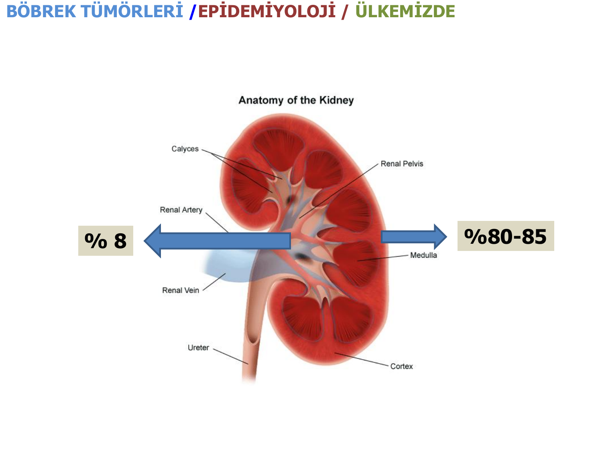

* Böbrek tümörlerinin **%80-85**'i renal parankimden (korteks), **%8**'i renal pelvisten köken alır
* Erkeklerde böbrek kanseri tüm kanserler arasında **%5.8** oranında görülür

### Dünyada

* Avrupa'da 2012'de yaklaşık **115.000** yeni böbrek kanseri vakası teşhis edilmiştir:
  - Erkeklerde 71.700 vaka
  - Kadınlarda 43.400 vaka
  - **E/K: 2/1**
* Böbrek kanseri vakalarının çoğu **60-70 yaş** arasındaki erişkinlerde görülür
  - Teşhis anında medyan yaş **64**
* 1993-95 ve 2012-14 yılları arasında yaşa göre standardize edilmiş insidans erkeklerde ~%69, kadınlarda ~%86 artmıştır

### RCC Epidemiyolojisi

* RCC, böbrek kanserinin **en sık görülen** formudur
  - Tüm yetişkin malignitelerinin **%2-3**'ü
  - Tüm böbrek kanserlerinin **%90**'ı

| Bölge | İnsidans | Mortalite |
|---|---|---|
| Dünya | 209.000 yeni vaka | 102.000 ölüm |
| Avrupa Birliği | 84.400 yeni vaka | 34.700 ölüm |

* RCC için globalde ve Avrupa'daki insidans oranları son 20 yılda **%2** artmıştır
* İnsidans oranları erkeklerde kadınlardakinden daha belirgin şekilde artmıştır

### Tanı Anında Evre Dağılımı

* Lokalize hastalık: **%62**
* Bölgesel: **%17**
* Metastatik: **%17**

---

## RENAL HÜCRELİ KARSİNOMUN METASTAZ YERLERİ

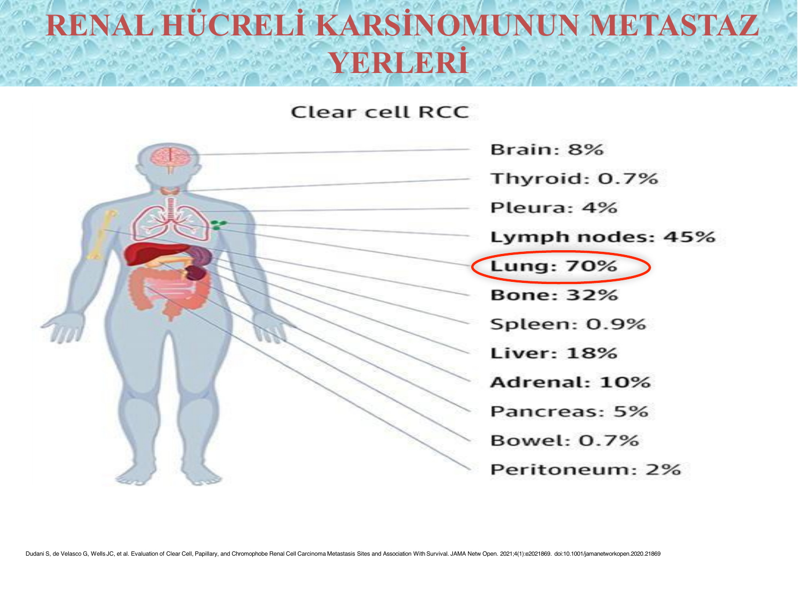

Berrak hücreli RCC'de metastaz sıklığı:

| Metastaz Yeri | Sıklık |
|---|---|
| 🫁 Akciğer | **%70** |
| Lenf nodları | %45 |
| Kemik | %32 |
| Karaciğer | %18 |
| Adrenal | %10 |
| Beyin | %8 |
| Pankreas | %5 |
| Plevra | %4 |
| Peritoneum | %2 |
| Dalak | %0.9 |
| Tiroid | %0.7 |
| Barsak | %0.7 |

---

## RİSK FAKTÖRLERİ

### Sporadik Risk Faktörleri

#### Artıranlar

* **Sigara (%30)**
  - İçmeyenlere risk artışı → E: %50, K: %20
  - CO, KOAH, DNA hasarı, del3p
  - Paket ve yılla doğru orantılı
  - Kesilince azalır (>10 yıl)
* **Obezite (%30-40)**
  - Hipoksi, insülin direnci, inflamatuar yanıt
* **Analjezik kullanımı**
  - Fenasetin
  - NSAİD
* **Hipertansiyon**
  - Kronik hipoksi, reaktif oksijen radikalleri
  - TA kontrolü riski azaltır
* **KBY, böbreğin kistik hastalığı**
  - %5-6
  - PKBH: Bilateral (%12), sarkomatid (%33), multisentrik (%28)
* **Endüstriyel solvent**
  - Trikloretilen, kadmiyum, asbest
  - Deri ve ayakkabı endüstrisinde çalışan işçiler
* **Diyabet** (kesin kanıtlanmamış)

#### Azaltanlar

* **Fiziksel aktivite** → ↓ kilo, tansiyon kontrolü, azalmış inflamasyon, ↓ insülin direnci
* **Diyet** → Taze sebze ve meyve
* **Alkol** → Kadınlarda, >15 gr/gün HR: 0.53 (0.34-0.83)

---

## GENETİK VE KALITIM

### Sporadik ve Kalıtsal Böbrek Kanseri Formları

* Böbrek kanseri **sporadik** (kalıtsal olmayan) veya **kalıtsal** formlarda görülebilir
* Sporadik böbrek kanseri tek bir lezyon olarak ortaya çıkma eğilimindeyken, kalıtsal formlar:
  - Bilateral
  - Multifokal
  - Erken yaş (≤45)
  - Aile öyküsü en az ≥2 akraba
  - Nadir cilt rahatsızlıkları (leiomyomlar, fibrofollikülomalar, anjiyofibromlar)
* Tüm RCC'lerin sadece ~**%2-3**'ü kalıtsal kökenlidir

### Kalıtsal RCC Özellikleri

* RCC vakalarının yaklaşık **%2-3**'ü kalıtsaldır ve otozomal dominant hastalıklarla ilişkilidir
* Sporadik RCC ile karşılaştırıldığında kalıtsal RCC:
  - Tipik bir morfolojiye sahiptir; genellikle çok odaklı ve iki taraflıdır
  - Genellikle daha genç yaşta görülür
  - Her iki cinsiyette de benzer bir insidans vardır

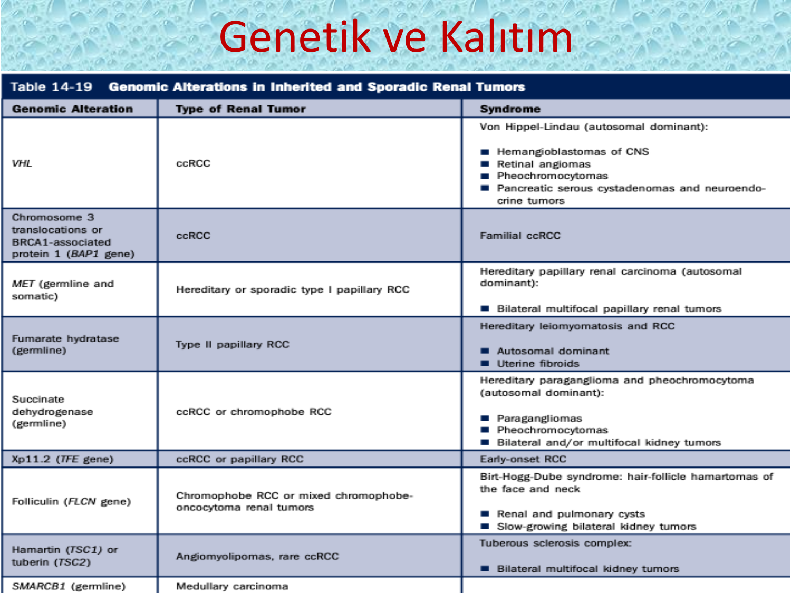

### Genomik Değişiklikler ve İlişkili Sendromlar

| Genomik Değişiklik | Renal Tümör Tipi | Sendrom |
|---|---|---|
| *VHL* | ccRCC | Von Hippel-Lindau (OD) |
| Kromozom 3 translokasyonları / *BAP1* geni | ccRCC | Familyal ccRCC |
| *MET* (germline ve somatik) | Herediter veya sporadik tip I papiller RCC | Herediter papiller renal karsinom (OD) |
| Fumarat hidrataz (germline) | Tip II papiller RCC | Herediter leiomyomatozis ve RCC (OD) |
| Süksinat dehidrogenaz (germline) | ccRCC veya kromofob RCC | Herediter paraganglioma ve feokromositoma (OD) |
| Xp11.2 (*TFE* geni) | ccRCC veya papiller RCC | Erken başlangıçlı RCC |
| Follikülin (*FLCN*) | Kromofob RCC veya mikst | Birt-Hogg-Dube sendromu |
| Hamartin (*TSC1*) / Tuberin (*TSC2*) | Anjiomiyolipomlar, nadir ccRCC | Tüberoz skleroz kompleksi |
| *SMARCB1* (germline) | Medüller karsinom | - |

---

## VON HİPPEL-LİNDAU (VHL) SENDROMU

* Hastaların erken dönemlerinde birden fazla organda (böbrekler, beyin, omurga, gözler, böbreküstü bezleri, pankreas dahil) malign tümörlere yatkındır
* **3p25-26** kromozomal bandı üzerindeki VHL tümör baskılayıcı genindeki germline mutasyonlar bu sendroma neden olur
* Otozomal dominant kalıtım gösterir
* **E/K: 1**

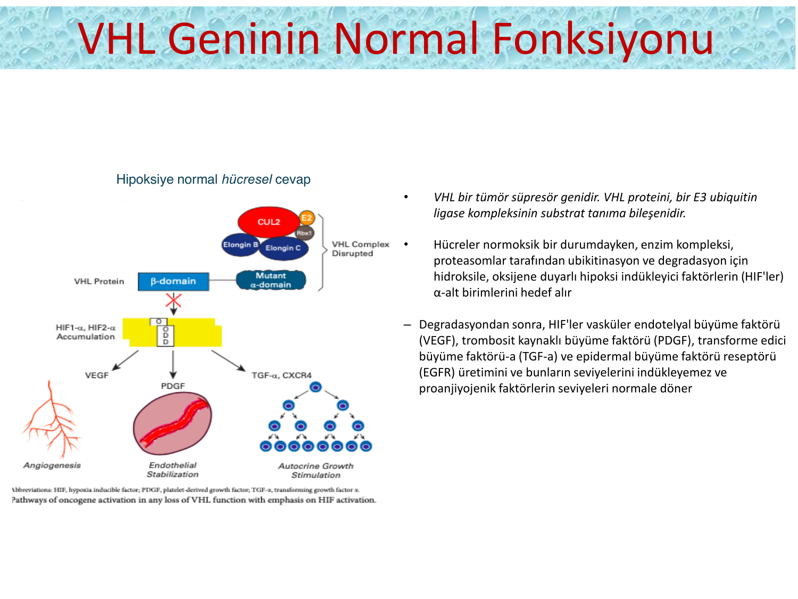

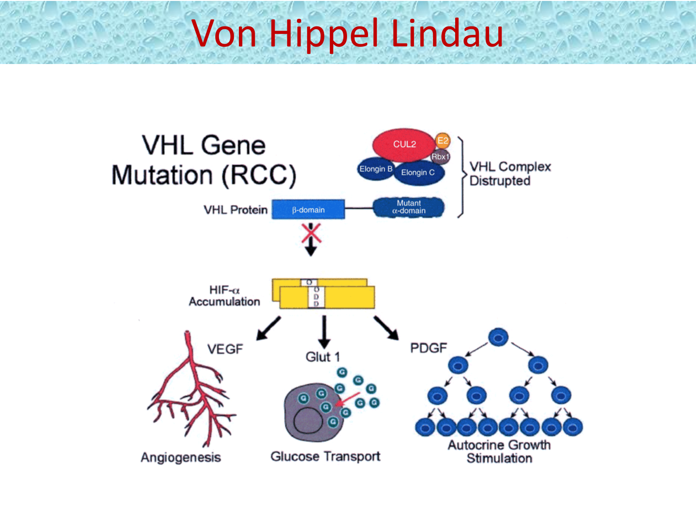

### VHL Klinik Bulgular

* Multiple angiomlar: Göz, MSS, pankreas, epididim, böbrekler
* Retinal ve MSS'de hemanjioblastom
* Pankreas kitleleri: Adenom, adenokarsinom, hemanjioblastom, NET
* Böbrekte RCC (**%36**'sında) → Genelde bilateral ve metastaz sık

### VHL Geninin Normal Fonksiyonu

* VHL bir **tümör süpresör gen**dir. VHL proteini, bir E3 ubiquitin ligase kompleksinin substrat tanıma bileşenidir
* Hücreler normoksik durumdayken, enzim kompleksi proteasomlar tarafından ubikitinasyon ve degradasyon için hidroksile, oksijene duyarlı **hipoksi indükleyici faktörlerin (HIF)** α-alt birimlerini hedef alır
* Degradasyondan sonra HIF'ler VEGF, PDGF, TGF-α ve EGFR üretimini indükleyemez → proanjiyojenik faktörlerin seviyeleri normale döner

### VHL Gen Mutasyonu Sonuçları

* VHL'nin mutasyonu veya inaktivasyonu → VHL fonksiyonu bozulur → HIF'ler normoksik koşullar altında bile degrade olmaz
* HIF'ler çekirdek içine yer değiştirerek birikirler ve hipoksi ile indüklenebilir genlerin transkripsiyonuna ve büyüme faktörlerinin aşırı üretilmesine neden olur (VEGF, TGF-α, PDGF)
* Büyüme faktörlerinin endotel hücre yüzeylerindeki reseptörlerine bağlanması **anjiyogenezi** teşvik eder

### VHL Sendromu - HIF Yolağı

* Hipoksi ile indüklenen faktör (HIF1α, HIF2α)
  - Alfa ve beta alt birimleri var
  - Beta oksijene bağlanmaz, alfa bağlanır
* HIF1α miktarı artar → **Eritropoietin** (mRNA aktivasyonu), VEGF, PDGF, TGF Beta artar

---

## BİRT-HOGG-DUBE (BHD) SENDROMU

* Böbrek kanseri (%30, Bilateral %25)
* **Follikülin geni (17p12)**
  - %84-90 penetrans
  - 100'den fazla mutasyon
  - TSG (tümör süpresör gen)
  - mTOR yolak baskılanması
* Fibrofollikülomlar (yaklaşık 20-30'lu yaş)
* Akciğer hava kistleri (%80, 20'li yaşlar) → Spontan pnömotoraks
* Kromofob ve onkositom

---

## BAP-1 İLİŞKİLİ RCC

* Ailesel üveal melanom
* Kutanöz melanom
* Mezotelyomada
* BAP1 mutasyonu

---

## TÜBEROZ SKLEROZİS KOMPLEKSİ

* Otozomal dominant
* TSG: Hamartin (TSC1 geni), Tuberin (TSC2 geni)
* Multifokal bilateral böbrek kitleleri:
  - Anjiomiyolipomlar
  - Böbrek kistleri

---

## HEREDİTER PARAGANGLİOMA VE FEOKROMOSİTOMA

* Otozomal dominant
* Süksinat dehidrogenaz mutasyonu: *SDHA*, *SDHB*, *SDHC* ve *SDHD*
* Para-gangliomalar
* Agresif böbrek tümörleri: Berrak hücreli, papiller tip

---

## SEKONDER POLİSİTEMİ YAPAN TÜMÖRLER

* RCC
* **HCC (en sık)**
* Serebellar hemanjioblastoma
* Uterin myoma
* Adrenal tümörler (feokromositoma)
* Meningioma

---

## PATOLOJİ

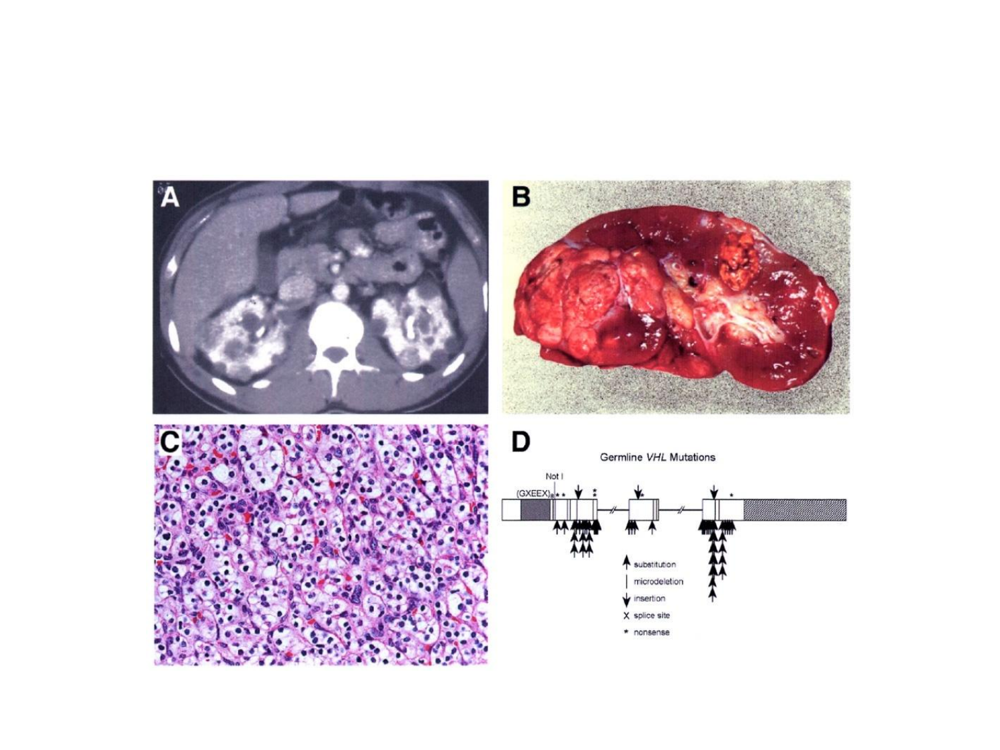

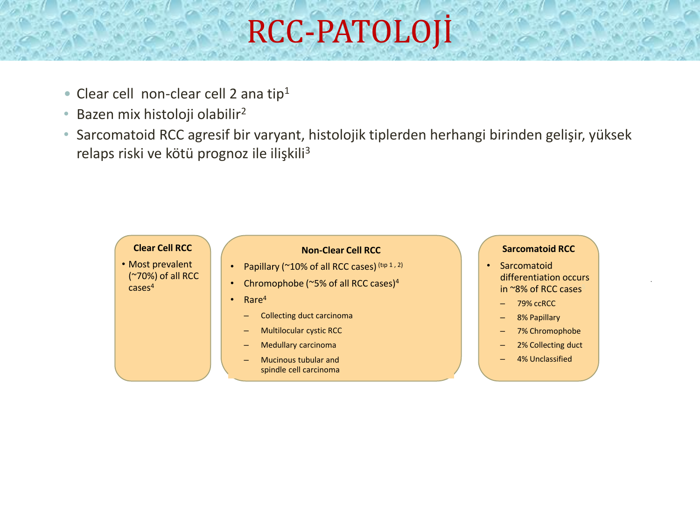

### RCC Patolojisi

* **Clear cell** ve **non-clear cell** → 2 ana tip
* Bazen mikst histoloji olabilir
* Sarkomatoid RCC agresif bir varyant, histolojik tiplerden herhangi birinden gelişir, yüksek relaps riski ve kötü prognoz ile ilişkili

| Tip | Sıklık |
|---|---|
| **Clear Cell RCC** | ~%70 (en sık) |
| Papiller RCC | ~%10 (tip 1, 2) |
| Kromofob RCC | ~%5 |
| Toplayıcı kanal karsinomu | Nadir |
| Multilokuler kistik RCC | Nadir |
| Medüller karsinom | Nadir |
| Müsinöz tübüler ve iğsi hücreli karsinom | Nadir |

### Sarkomatoid RCC

* ~%8 RCC vakasında sarkomatoid diferansiyasyon görülür:
  - %79 ccRCC
  - %8 Papiller
  - %7 Kromofob
  - %2 Toplayıcı kanal
  - %4 Sınıflandırılamamış

---

## PROGNOSTİK FAKTÖRLER

* TNM evreleme
* Tümör tipi
  - Multikistik renal hücreli karsinoma → iyi seyir
  - Medüller, sarkomatoid → kötü seyir
* Grade
* Klinik faktörler: Performans durumu, paraneoplastik durum, semptomlar

### TNM Evreleme (UICC TNM 8)

#### Primer Tümör (T)

| Evre | Tanım |
|---|---|
| TX | Primer tümör değerlendirilemiyor |
| T0 | Primer tümör kanıtı yok |
| **T1** | Tümör ≤7 cm, böbrekle sınırlı |
| T1a | Tümör ≤4 cm |
| T1b | Tümör >4 cm, ≤7 cm |
| **T2** | Tümör >7 cm, böbrekle sınırlı |
| T2a | Tümör >7 cm, ≤10 cm |
| T2b | Tümör >10 cm, böbrekle sınırlı |
| **T3** | Major venlere veya perinefrik dokulara uzanır, Gerota fasyasını aşmaz |
| T3a | Renal ven veya dallarına, pelvikasileal sisteme, perinefrik/renal sinüs yağına invazyon |
| T3b | Vena kavaya uzanır (diyafram altı) |
| T3c | Vena kavaya uzanır (diyafram üstü) veya duvar invazyonu |
| **T4** | Gerota fasyasını aşar (ipsilateral adrenal dahil) |

#### Bölgesel Lenf Nodları (N)

| Evre | Tanım |
|---|---|
| NX | Bölgesel lenf nodları değerlendirilemiyor |
| N0 | Bölgesel lenf nodu metastazı yok |
| N1 | Bölgesel lenf nod(lar)ında metastaz |

#### Uzak Metastaz (M)

| Evre | Tanım |
|---|---|
| M0 | Uzak metastaz yok |
| M1 | Uzak metastaz var |

#### Evre Grupları

| Evre | T | N | M |
|---|---|---|---|
| **Evre I** | T1 | N0 | M0 |
| **Evre II** | T2 | N0 | M0 |
| **Evre III** | T3 | N0 | M0 |
| | T1, T2, T3 | N1 | M0 |
| **Evre IV** | T4 | Any N | M0 |
| | Any T | Any N | M1 |

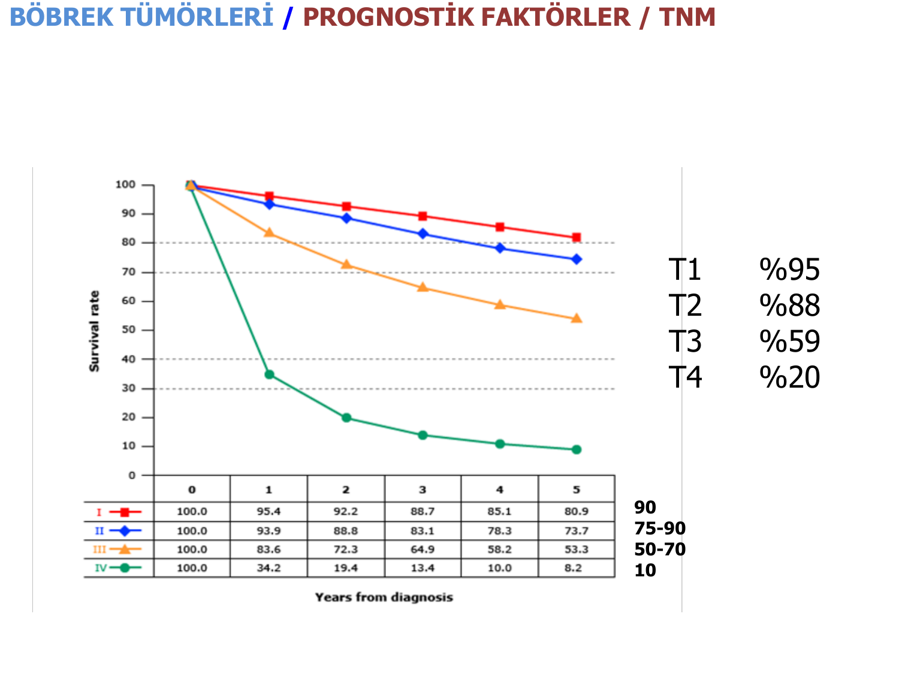

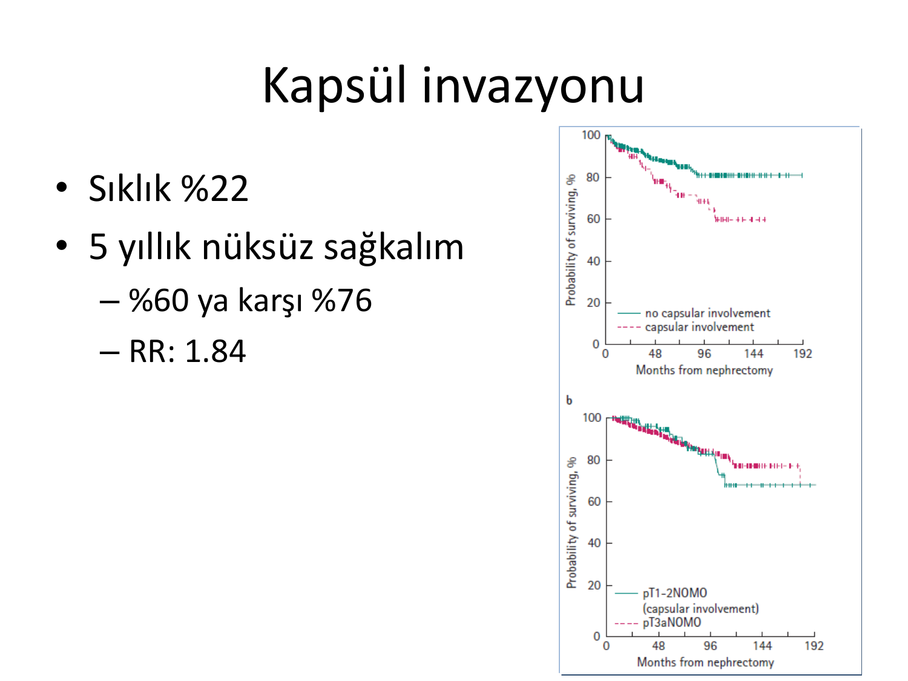

### T Evresine Göre 5 Yıllık Sağkalım

| T Evresi | 5 Yıllık Sağkalım |
|---|---|
| T1 | **%95** |
| T2 | %88 |
| T3 | %59 |
| T4 | %20 |

### Evreye Göre 5 Yıllık Sağkalım

| Evre | 5 Yıllık SK |
|---|---|
| I | **%90** |
| II | %75-90 |
| III | %50-70 |
| IV | **%10** |

### Kapsül İnvazyonu

* Sıklık: %22
* 5 yıllık nüksüz sağkalım: %60'a karşı %76
* RR: 1.84

### Histopatoloji ve Prognoz

* Sık görülenlerden berrak hücreli daha kötü seyirli, ancak tedavi yanıtı iyi
* 5 yıllık RFS (rekürenssiz sağkalım):

| Histolojik Tip | 5 Yıllık RFS |
|---|---|
| Papiller | **%95** |
| Kromofob | %92 |
| Berrak hücreli | %86 |

* Kötü seyirli nadir tipler: Sarkomatoid varyant, toplayıcı kanal ve medüller

### Fuhrman Grade ve Sağkalım

* Fuhrman's grade: Nükleer boyut ve sınırlar, nükleolus belirginliği

| Grade | 5 Yıllık SK |
|---|---|
| G1 | %89-94 |
| G2 | %65-86 |
| G3-4 | %46-59 |
| G4 | %31 |

---

## MSKCC PROGNOSTİK KRİTERLERİ

**MSKCC (Memorial Sloan Kettering / Motzer) Risk Faktörleri:**

Kötü prognoz ile ilişkili 5 risk faktörü:

* **Karnofsky performans durumu (KPS) <%80**
* **Düşük serum hemoglobin** → E: **<13 g/dL**, K: **<11.5 g/dL**
* **Yüksek düzeltilmiş serum kalsiyumu** → **>10 mg/dL**
* **Yüksek laktat dehidrogenaz** → **>300 U/L** (yaklaşık >1.5 x ULN)
* **Nefrektomi yapılmamış olması** VEYA **tanıdan tedaviye geçen süre <1 yıl**

| Risk Grubu | Faktör Sayısı | 1 Yıllık SK |
|---|---|---|
| Favorable (İyi) | **0** | **%71** |
| Intermediate (Orta) | **1-2** | %42 |
| Poor (Kötü) | **≥3** | **%12** |

> **📚 Kaynak:** Motzer RJ, et al. J Clin Oncol. 2002;20:289-296.

---

## IMDC PROGNOSTİK KRİTERLERİ

**Klinik:**
* KPS <%80 (*P* <.0001)
* Tanı anından geçen süre <1 yıl (*P* = .01)

**Laboratuvar:**
* Anemi
* **Hiperkalsemi**
* Nötrofili
* Trombositoz

| Risk Grubu | Tanım |
|---|---|
| İyi | 0 risk faktörü |
| Orta | 1-2 risk faktörü |
| Kötü | 3+ risk faktörü |

---

## KLİNİK BULGULAR VE SEMPTOMLAR

### Belirti ve Semptomların Sıklığı

| Belirti/Semptom | Sıklık (%) |
|---|---|
| Hematüri, böğürde kitle ve ağrı (klasik triad) | 9-10 |
| Hematüri | 40 |
| Böğür kitlesi | 40 |
| Kilo kaybı | 33 |
| Ateş | 20 |
| Hipertansiyon | 20 |
| KCFT bozukluğu | 15 |
| Hiperkalsemi | 5 |
| Eritrositoz | 3 |
| Nöromiyopati | 2 |
| Amiloidoz | 2 |
| Eritrosit sedimantasyonunda artış | 55 |

### Metastatik Hastaların Tutulum Oranları

* %75'inde akciğer
* %36'sında yumuşak doku
* %20'sinde kemik
* %18'inde karaciğer
* %8'inde cilt
* %8'inde SSS tutulumu

### KCFT Yüksekliği

* KCFT artabilir → Her zaman metastaz anlamına gelmez
* Paraneoplastik sendroma bağlı olabilir (**Stouffer sendromu**)
* BT ile ayrım önemlidir
* Böbrek çıkarılınca düzelebilir

---

## TEDAVİ

### Erken Evre

* **Cerrahi** temel tedavidir
* Cerrahiye uygun değiller ise:
  - Damar embolizasyonu
  - Radyoterapi uygulanabilir
* Bilateral RCC'li hastalarda:
  - Bir böbrek parsiyel nefrektomi
  - Diğer böbrek radikal nefrektomi

### Adjuvan Tedavi

* **İmmünoterapi:** Pembrolizumab

### İleri Evre Tedavi

* Lokal tedavi
* TKI (Tirozin kinaz inhibitörleri)
* İmmünoterapi (IQ)
* Kombinasyon TKI + IQ
* Diğer tedavi seçenekleri

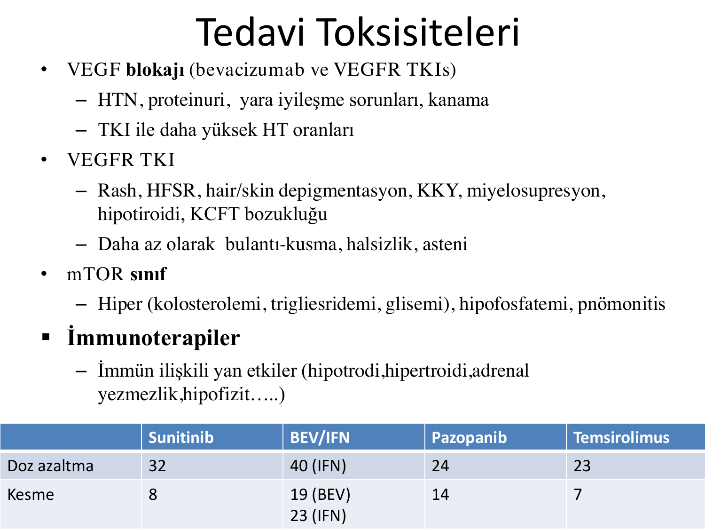

### Berrak Hücreli Histoloji - Birinci Basamak Tedavi (NCCN)

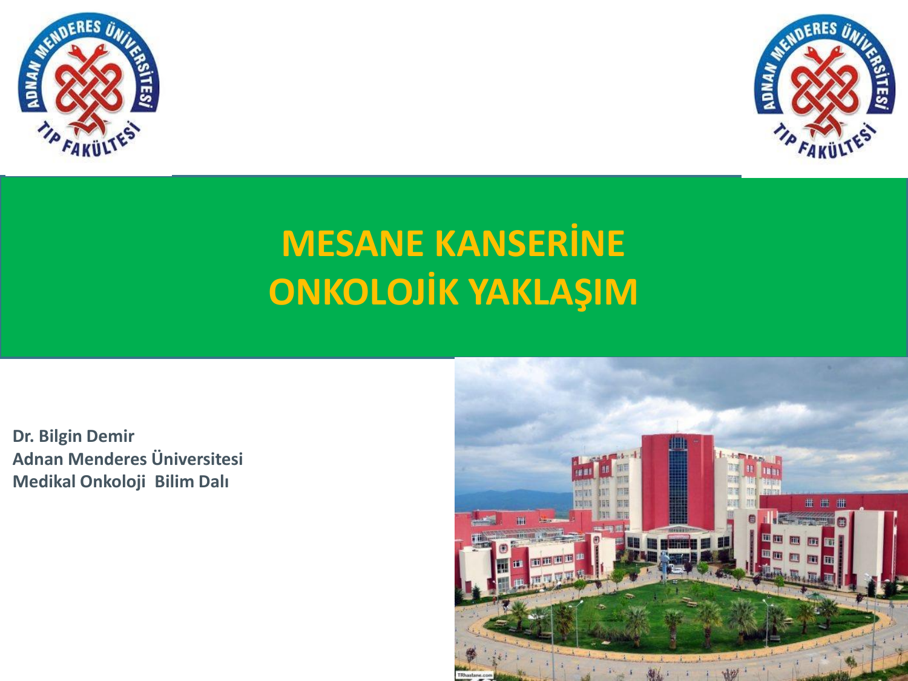

#### Favorable (İyi) Risk

| Tercih Edilen | Diğer Önerilen | Belirli Durumlarda |
|---|---|---|
| Aksitinib + pembrolizumab (kat. 1) | Aksitinib + avelumab | Aktif sürveyans |
| Kabozantinib + nivolumab (kat. 1) | Kabozantinib (kat. 2B) | Aksitinib (kat. 2B) |
| Lenvatinib + pembrolizumab (kat. 1) | İpilimumab + nivolumab | Yüksek doz IL-2 (kat. 2B) |
| | Pazopanib | |
| | Sunitinib | |

#### Poor/Intermediate (Kötü/Orta) Risk

| Tercih Edilen | Diğer Önerilen | Belirli Durumlarda |
|---|---|---|
| Aksitinib + pembrolizumab (kat. 1) | Aksitinib + avelumab | Aksitinib (kat. 2B) |
| Kabozantinib + nivolumab (kat. 1) | Pazopanib | Yüksek doz IL-2 (kat. 3) |
| İpilimumab + nivolumab (kat. 1) | Sunitinib | Temsirolimus (kat. 3) |
| Lenvatinib + pembrolizumab (kat. 1) | | |
| Kabozantinib | | |

### Tedavi Toksisiteleri

* **VEGF blokajı** (bevacizumab ve VEGFR TKI'lar):
  - HTN, proteinüri, yara iyileşme sorunları, kanama
  - TKI ile daha yüksek HT oranları
* **VEGFR TKI:**
  - Rash, HFSR, hair/skin depigmentasyon, KKY, miyelosupresyon, hipotiroidi, KCFT bozukluğu
  - Daha az olarak bulantı-kusma, halsizlik, asteni
* **mTOR inhibitörleri:**
  - Hiperkolesterolemi, hipertrigliseridemi, hiperglisemi, hipofosfatemi, pnömonitis
* **İmmünoterapiler:**
  - İmmün ilişkili yan etkiler (hipotiroidi, hipertiroidi, adrenal yetmezlik, hipofizit...)

| | Sunitinib | BEV/IFN | Pazopanib | Temsirolimus |
|---|---|---|---|---|
| Doz azaltma (%) | 32 | 40 (IFN) | 24 | 23 |
| Kesme (%) | 8 | 19 (BEV) / 23 (IFN) | 14 | 7 |

---

---

# BÖLÜM 2: MESANE KANSERİNE ONKOLOJİK YAKLAŞIM

---

## EPİDEMİYOLOJİ

* Tüm kanserler arasında erkeklerde **4.**, kadınlarda **7-8. sırada**
* **E/K:** 2.7/1 (ABD), 7/1 (İtalya)
* Genellikle **65 yaş üstü** erkeklerde görülür
  - 40 yaş altında nadir → iyi seyirli
* Ölümler 1975'ten beri azalmaktadır
* Ortalama tanı yaşı: **73**
* Yaş grubuna göre sıklık (SEER 2011):
  - <20 yaş: %0.1
  - 20-34: %0.4
  - 35-44: %1.5
  - 45-54: %7.1
  - 55-64: %18.5
  - 65-74: %27.9
  - 75-84: **%30.5**
  - >84: %14.0

### Türkiye'de (2018)

* Erkeklerde mesane kanseri **20.0/100.000** (4. sıra)
* Kadınlarda **11.1/100.000**

### Prognoz

* 5 yıllık yaşam: **%77**
* Evreye göre dağılım ve sağkalım:

| Evre | Oran | 5 Yıllık SK |
|---|---|---|
| In Situ | %51 | %96.2 |
| Lokalize | %35 | %69.2 |
| Bölgesel | %7 | %33.7 |
| Uzak organ | %4 | %5.5 |
| Bilinmeyen | %3 | %48.7 |

---

## PATOGENEZ

* En önemli özelliklerinden birisi **farklı veya aynı alanda tekrarlayıcı** olmasıdır
* Tekrarlama aynı veya daha ileri evreler şeklinde olabilir
* Bu durum **polikronotopizm** olarak adlandırılır
* Uretelyal instabiliteden kaynaklanan **alan defektinin** neden olduğu düşünülmekte

### Risk Faktörleri

* **Sigara** içimi en önemli risk faktörü (**%30-60**)
  - Sigara = "**field defect**" nedeni
  - Sigara(+) = ürogenital atipi %50
  - Sigara(-) = atipi %4
  - Risk azalması için 10-20 yıl gerekli
  - Tümör gelişimi için ortalama 18 yıl gerekli
* **Meslek** (%20)
  - Boya, deri ve lastik sanayi riskli
  - PAH, aromatik aminler
  - Aldehitler ve nitrozaminler
* **Balkan endemik nefropatisi**
  - Kronik tubulointerstisiyel nefropati
  - Aristolohik asitler
  - %10-40 üretelyal tümör gelişir (%46 mesane, %32 üreter)
  - Genellikle düşük grade ve multiple
* Yüksek miktarda kızarmış et ve yağ
* **Siklofosfamid**, fenasetin (x9 risk)
* Kahve, çay ve tatlandırıcının (aspartam) etkisi belirsiz
* **Schistozoma haematobium** → Skuamoz cell Ca ve TCC gelişimine neden olabilir
* Kronik irritasyon (kateter...)
* Radyoterapi

### Korunma

* Sigarayı bırak
* Sıvı alımı artarsa kanser azalır
  - BPH da artar
  - Trigon ve üreter orifisinde fazla
* Yağdan az, bol taze sebze meyve
* Kilo ver

---

## KLİNİK

* Hastaların başlangıçta:
  - **%75**'i süperfisyal
  - **%20**'si invaziv
  - **%5**'i metastatiktir

### Semptomlar

* **Hematüri (%80-90)**
  - Ağrısız, aralıklı, makroskopik-mikroskopik, idrar boyunca
  - Diğer sorunlarla karışabilir (sistit, taş hastalığı)
  - Tüm idrar boyunca devam eder
    - Başta ise → üretra
    - Sonda ise → mesane boynu veya prostatik üretra
* **İşeme sorunları** (sık gitme, ağrılı idrar)
  - Hastaların 1/3'ünde
  - CIS'da daha fazla
  - Azalmış mesane kapasitesi, trigon tutulumu, mesane boynu ve üretra tutulumu
* **Ağrı**
  - Yan ağrısı → Tıkanmaya bağlı, taş ağrısına benzer
  - Supra pubik ağrı → Lokal ileri hastalık, tıkanma
  - Makata vuran ağrı → Lokal ileri
* Tıkanma bulguları
* Kilo kaybı, iştahsızlık
* Metastatik ise kemik ağrıları bulunabilir

---

## TANISAL YAKLAŞIMLAR

* Öykü
* Muayene (rektal tuşe)
* TİT (Tam idrar tetkiki)
* İdrar sitolojisi
  - Duyarlılık %34, Özgüllük %98
* Sistoüreteroskopi
* İVP (İntravenöz piyelografi)
* BT/MR

### Görüntüleme

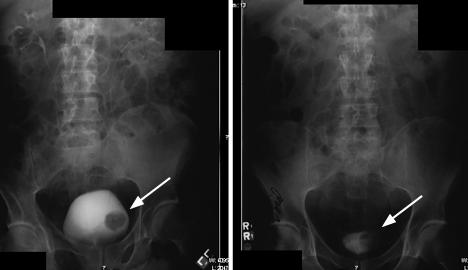

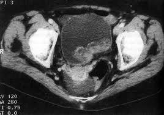

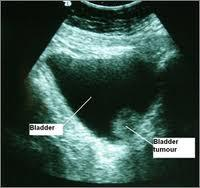

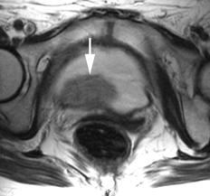

### Sitoloji

* Duyarlılık: %35-45
* Özgüllük: %90
* Evre ve grade artıkça artar:
  - G1: %17
  - G3: **%90**

---

## PATOLOJİ

* **Epitelyal tümörler %98**'i
  - Rabdomiyosarkom, leiomiyokarsinom nadir
* **Transisyonel hücreli karsinom %90-95**
* **Skuamoz hücreli karsinom %3-7** → Tedaviye dirençli
* **Adenokarsinom %1-2** → Urakal (kubbede) artıktan gelişir
* **Small cell karsinom** <1% sıklıkta

---

## EVRELEME

* TNM sınıflaması kullanılır
* İnvazyon derinliğini daha ayrıntılı sınıflaması nedeniyle ağırlıklı olarak TNM sınıflaması kullanılmaktadır
* **En önemli nokta müsküler tabakanın durumudur.** Tutulum varsa mesanenin çıkarılması ve neoadjuvan tedavi gerekecektir

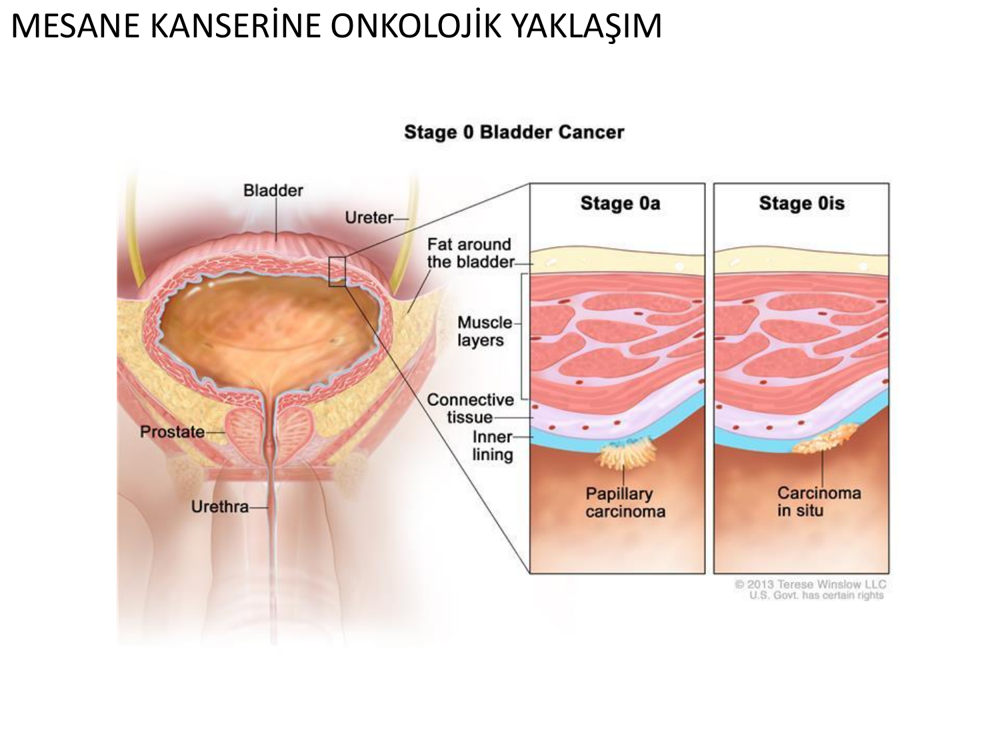

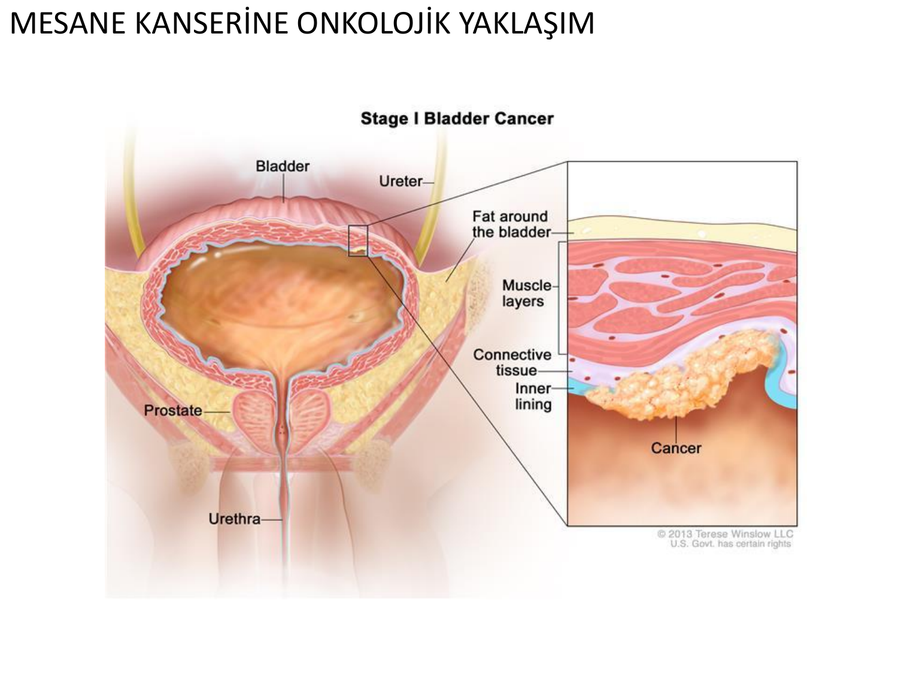

### TNM Evreleme (Mesane)

#### Primer Tümör (T)

| Evre    | Tanım                                                                                         |
| ------- | --------------------------------------------------------------------------------------------- |
| TX      | Primer tümör değerlendirilemiyor                                                              |
| T0      | Primer tümör kanıtı yok                                                                       |
| **Ta**  | Non-invaziv papiller karsinom                                                                 |
| **Tis** | Karsinoma in situ: "flat tümör"                                                               |
| **T1**  | Subepitelyal bağ dokusuna invazyon                                                            |
| **T2**  | Muskularis propriaya invazyon                                                                 |
| pT2a    | Yüzeyel muskularis propria (iç yarı)                                                          |
| pT2b    | Derin muskularis propria (dış yarı)                                                           |
| **T3**  | Perivezikal dokuya invazyon                                                                   |
| pT3a    | Mikroskopik                                                                                   |
| pT3b    | Makroskopik (ekstravezikal kitle)                                                             |
| **T4**  | Prostatik stroma, seminal veziküller, uterus, vajina, pelvik duvar, abdominal duvar invazyonu |
| T4a     | Prostatik stroma, uterus, vajina                                                              |
| T4b     | Pelvik duvar, abdominal duvar                                                                 |

#### Bölgesel Lenf Nodları (N)

| Evre | Tanım |
|---|---|
| NX | Değerlendirilemiyor |
| N0 | Lenf nodu metastazı yok |
| N1 | Tek bölgesel LN metastazı (hipogastrik, obturator, eksternal iliak, presakral) |
| N2 | Çoklu bölgesel LN metastazı |
| N3 | Kommon iliak LN metastazı |

#### Evre Grupları

| Evre | T | N | M |
|---|---|---|---|
| 0a | Ta | N0 | M0 |
| 0is | Tis | N0 | M0 |
| I | T1 | N0 | M0 |
| II | T2a, T2b | N0 | M0 |
| III | T3a, T3b, T4a, T4b | N0 | M0 |
| IV | Any T | N1-3 | M0 |
| | Any T | Any N | M1 |

### Grade

* Mesane tümörleri düşük (G1), orta (G2), yüksek grade (G3) olarak sınıflanır
* İnvaziv tümörlerin tamamına yakınında tümör grade'i **yüksektir**
* CIS başlangıç lezyonu olarak değerlendirilir
  - Tedavi edilmez ise 5 yıl içinde **%50** sıklıkla tekrarlar

---

## TEDAVİ

### Genel Prensipler

* Hastalığın evresine göre farklılık gösterir
* Süperfisyal tümörlerin (Ta, T1, Tcis) ilk tedavisi **sistoskopik rezeksiyon**
  - Bunlar sıklıkla tekrarlar (%70)
  - %30 sıklıkta daha yüksek evre ve grade'e sahiptirler
* İlk Ta lezyonda intravezikal (İV) tedavi genellikle uygulanmaz

### T1 Tümör Tedavisi

* 1 yıl içinde %50'si tekrarlar
* 5 yıl içinde ise %50'si invaziv hastalık geliştirir
* **İntravezikal BCG** ile tedavi edilir
* BCG tekrarı %50, progresyonu ise %15 azaltır
* Tedaviye rağmen 6 ay - 1 yıl arası tekrarlarda **sistektomi** uygulanılır

### T2 Tümör Tedavisi

* En uygun tedavi **neoadjuvan KT takiben radikal sistektomi**dir

### Definitif Radyoterapi

* Cerrahi uygulanamayan hastalarda tercih edilir
* Cerrahiye göre etkisi daha azdır
* 2.0-2.5 Gy fraksiyonda 55-65 Gy doz uygulanılır
* Başlangıçta tam yanıt oranı %40-52'dir
* Tam yanıt alınamayan olgularda sistektomi uygulanılır

### Tedavi Hedefleri

* Neoadjuvan
* Adjuvan
* RT ile birlikte + KT (genellikle medikal inop)
* Metastatik

---

## METASTATİK MESANE KANSERİ TEDAVİSİ

### Birinci Basamak

* **İlk sırada: Enfortumab vedotin + Pembrolizumab**
* Enfortumab vedotin: Nektin-4'e karşı geliştirilmiş bir ADC (antibody-drug conjugate)

### Cisplatin Uygun Hastalar

* **GC (Gemsitabin + Cisplatin)** + idame Avelumab
* **M-VAC** (Metotreksat, Vinblastin, Doksorubisin, Cisplatin) + idame Avelumab

### Cisplatin Uygun Değil

* Karboplatin-gemsitabin + idame avelumab
* İmmünoterapiler (Pembrolizumab, Nivolumab, Atezolizumab)
* Enfortumab Vedotin
* Erdafinib (FGFR2-3)

---

---

# BÖLÜM 3: TESTİS TÜMÖRLERİ

---

## EPİDEMİYOLOJİ

* Oldukça heterojen bir grup hastalık
* Çoğunluğu **germ hücreli tümör (GHT)**
* ABD'de yıllık vaka: 7000, yıllık ölüm: 300
* **20-35 yaş** arasında en sık solid tümör
* Bölgeler arası büyük farklar var
* Sıklığı artıyor, nedeni tam bilinmemektedir
* Genetik değişiklik nadir

---

## SINIFLANDIRMA

### Germ Hücreli Tümörler (%90)

| Tip | Alt Tip | Oran |
|---|---|---|
| **Seminoma** | | **%50** |
| | Seminoma with syncytiotrophoblastic cells | |
| | Spermatositik seminoma | |
| | Spermatositik seminoma with sarcoma | |
| **Non-seminomatöz GHT** | | **%50** |
| | Embriyonal karsinom | |
| | Teratom (dermoid kist, monodermal teratom) | |
| | Teratom with somatic type malignancy | |
| | Trofoblastik tümörler (koryokarsinom) | |
| | Yolk sac tümörü (endodermal sinüs tümörü) | |
| | Mikst germ hücreli tümörler | |

### Seks Kord-Stromal Tümörler

* Sertoli hücreli tümör
* Leydig hücreli tümör
* Granüloza hücreli tümör
* Mikst tipler (Sertoli-Leydig hücreli tümör)

---

## İNTRATÜBÜLER GERM HÜCRE NEOPLAZİSİ (TESTİKÜLER KARSİNOMA İN-SİTU)

* Seminom ve non-seminomatöz hastalık öncü lezyonu
* İnfertillerde biyopside **%1**
* İnmemiş testiste **%5**
* Tedavisiz kişilerde 5 yılda kansere dönüşüm **%50**
* Spermatositik seminom hariç diğerlerinde bulunma **%90**

---

## RİSK FAKTÖRLERİ

* **İnmemiş testis**
  - Abdominal daha riskli
  - İnguinalde sıkı takip
* **Genetik hastalıklar**
  - Klinefelter sendromu (47 XXY, mediastinal)
  - Down sendromu
  - Peutz-Jeghers sendromu ve Carney's kompleksi (Sertoli hücreli tümör)
* **Hipospadias** (RR: 2)
* **Ailesel** → Kardeşlerinde risk 6 kat fazla
* **HİV** (RR: 21)
* **Hormonal**
  - Dietilstilbestrol kullananların çocukları
  - Organochlorine pestisidleri
* **Kolesterol yüksekliği?** → >270 RR: 4
* **Vazektomi???** (belirsiz)
* **İzokromozom 12 (i12p)**
  - GHT için patognomonik sayılır
  - 12p13 siklin D2

---

## SEMPTOM VE BULGULAR

### Lokal Bulgular

* **Ağrısız kitle** (patognomonik)
  - Kendi veya eşi fark eder
  - Atrofik testislde büyüme olmayabilir
  - Ağrı: Sızı, his, perianal alan...
* Ancak sıklıkla:
  - Yaygın ağrı, şişlik, sertlik
* Sıklıkla epididimit veya orşit eşlik eder
  - Enfeksiyon - Kanser ayrımı yapılmalı
  - **Şüphe varsa (2-3 haftada) USG**

### Metastaza Bağlı Bulgular

* Öksürük, nefes darlığı
* Supraklaviküler LAP
* Bel ağrısı
* Ayaklarda şişme
* Nörolojik sorunlar

### Hormonal Aktiviteye Bağlı

* Jinekomasti (%5) (Leydig hücreli tümörlerde %20-30)
* Hipertiroidi (hCG)

### Paraneoplastik

* Limbik ensefalit (Anti-Ma otoantikoru)

---

## TANI

* Muayene
* USG
* BT
* PET-CT
* Laboratuvar

### Görüntüleme

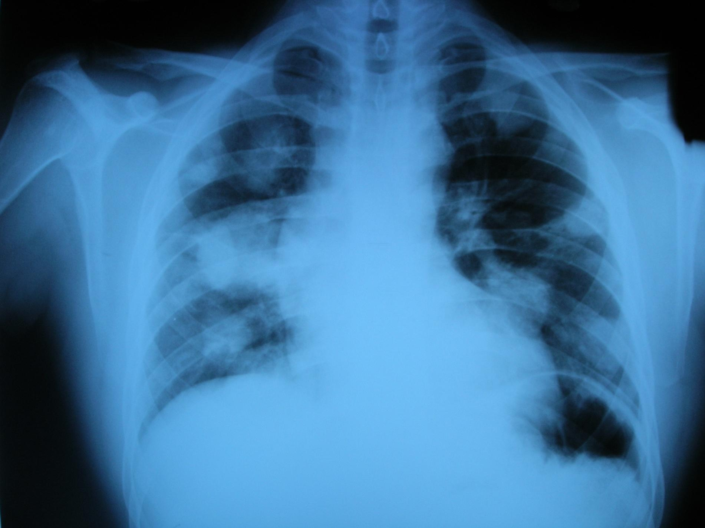

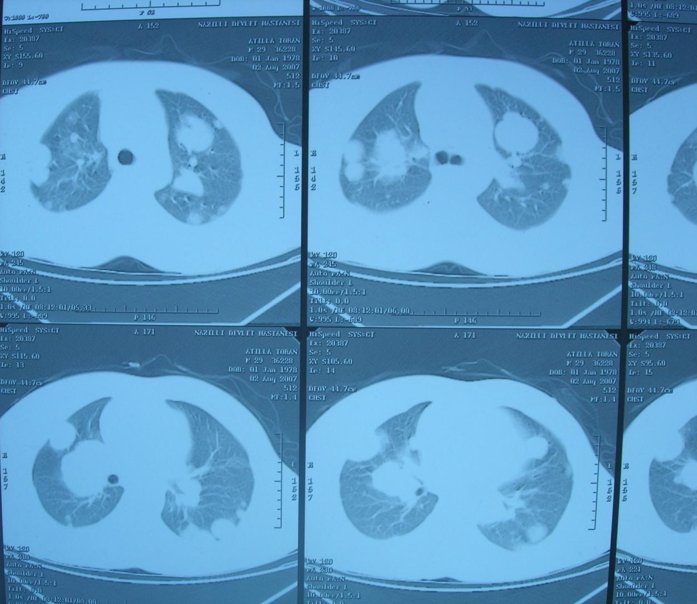

### Tümör Markerları

**Tanısal, prognostik ve tedavi izlemi amacıyla kullanılır:**

| Marker | Yükseldiği Durum |
|---|---|
| **α-FP** | Sadece non-seminomda yükselir |
| **β-HCG** | Her ikisinde de yükselebilir |
| **LDH** | Non-seminomda %50-60, seminomda %80 |

**⚠️ ÖNEMLİ:**

* α-FP yüksekliği varsa **seminom tanısı konulamaz** → Non-seminom gibi tedavi edilir
* Non-seminomda α-FP ve/veya β-HCG **%70** sıklıkta yükselir

### Cerrahi

* **Radikal inguinal orşiektomi** → Standart cerrahi yaklaşım
* **RPLND** (Retroperitoneal lenf nodu diseksiyonu)
* **Transskrotal orşiektomi kontraendike**
* %10 GHT ekstragonadal yerleşimli:
  - Retroperitoneal
  - Mediastinal
  - Pineal (çocuk)
  - Sakrum, baş-boyun, yumuşak doku (nadir)

---

## EVRELEME

* TNM AJCC (8th edition)
* **Evre I:** Testis, epididim veya spermatik kord'da
* **Evre II:** Retroperitoneal lenf nodlarında
* **Evre III:** Retroperiton dışında tutulum

### TNM Evreleme (Testis)

#### Primer Tümör (pT)

| Evre | Tanım |
|---|---|
| pTX | Değerlendirilemiyor |
| pT0 | Primer tümör kanıtı yok |
| pTis | İntratübüler germ hücre neoplazisi (karsinoma in situ) |
| pT1 | Testis ve epididimle sınırlı, vasküler/lenfatik invazyon yok |
| pT2 | Testis ve epididimle sınırlı, vasküler/lenfatik invazyon var veya tunika vaginalis tutulumu |
| pT3 | Spermatik korda invazyon |
| pT4 | Skrotuma invazyon |

#### Lenf Nodları (N) - Klinik

| Evre | Tanım |
|---|---|
| NX | Değerlendirilemiyor |
| N0 | Bölgesel LN metastazı yok |
| N1 | LN kitlesi ≤2 cm |
| N2 | LN kitlesi >2 cm, ≤5 cm |
| N3 | LN kitlesi >5 cm |

#### Lenf Nodları (pN) - Patolojik

| Evre | Tanım |
|---|---|
| pNX | Değerlendirilemiyor |
| pN0 | Lenf nodlarında tümör kanıtı yok |
| pN1 | LN kitlesi ≤2 cm ve pozitif nod sayısı ≤5, hiçbiri >2 cm değil |
| pN2 | LN kitlesi >2 cm, ≤5 cm; veya >5 pozitif nod (hiçbiri >5 cm değil); veya ekstranodal yayılım |
| pN3 | LN kitlesi >5 cm |

#### Uzak Metastaz (M)

| Evre | Tanım |
|---|---|
| MX | Değerlendirilemiyor |
| M0 | Uzak metastaz yok |
| M1 | Uzak metastaz var |
| M1a | Nonregional nodal veya pulmoner metastaz |
| M1b | Akciğer ve nonregional LN dışı uzak metastaz |

### Serum Tümör Markerları (S)

| Kategori | LDH | HCG (mIU/mL) | AFP (ng/mL) |
|---|---|---|---|
| S1 | <1.5 x N | <5.000 | <1.000 |
| S2 | 1.5-10 x N | 5.000-50.000 | 1.000-10.000 |
| S3 | >10 x N | >50.000 | >10.000 |

### Evre Grupları

| Evre | T | N | M | S |
|---|---|---|---|---|
| **IA** | pT1 | N0 | M0 | S0 |
| **IB** | pT2-4 | N0 | M0 | S0 |
| **IS** | Any pT/Tx | N0 | M0 | S1-3 |
| **IIA** | Any pT/Tx | N1 | M0 | S0-1 |
| **IIB** | Any pT/Tx | N2 | M0 | S0-1 |
| **IIC** | Any pT/Tx | N3 | M0 | S0-1 |
| **IIIA** | Any pT/Tx | Any N | M1a | S0-1 |
| **IIIB** | Any pT/Tx | N1-3 / Any N | M0 / M1a | S2 |
| **IIIC** | Any pT/Tx | N1-3 / Any N / Any N | M0 / M1a / M1b | S3 / S3 / Any S |

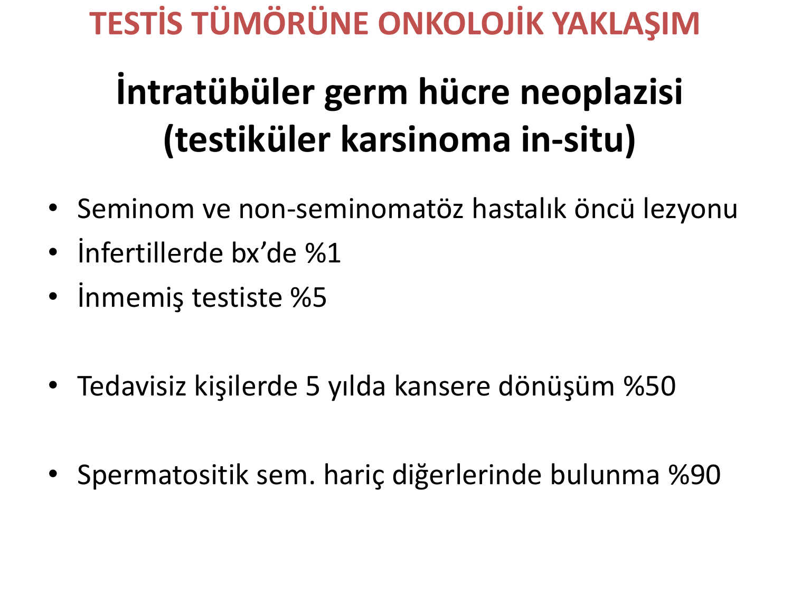

### IGCCCG Risk Sınıflaması

| Risk | Seminoma | Non-seminoma |
|---|---|---|
| **İyi risk** | Any HCG, any LDH, nonpulmoner viseral metastaz **yok** | AFP <1000, HCG <5000, LDH <1.5xN, nonpulmoner viseral metastaz yok, gonadal/retroperitoneal primer |
| **Orta risk** | Nonpulmoner viseral metastaz **var** | AFP 1000-10.000, HCG 5000-50.000, LDH 1.5-10xN, nonpulmoner viseral metastaz yok, gonadal/retroperitoneal primer |
| **Kötü risk** | **Yok** | Mediastinal primer, nonpulmoner viseral metastaz var, AFP >10.000, HCG >50.000, LDH >10xN |

**⚠️ ÖNEMLİ:** Seminomda **kötü risk grubu yoktur**

### Lenf Drenajı

* Lenf drenajı başlıca retroperiton
* Sağ testis → ana damarlardan
* Sol testis → renal damardan
* Sol testis tümöründe ilk tutulan nodlar → **Renal damar altındaki para-aortik lenf nodlarıdır**

---

## SEMİNOM

* Tüm GHT'lerin **yarısını** oluşturur
* Median yaş: **4. dekad**
* Daha ılımlı seyir izler
* Evre dağılımı: Evre I %70, Evre II %20, Evre III %10
* Evre I-II'de **radyoterapi** etkilidir
* **⚠️ Miks özellik varsa → Non-seminom gibi tedavi edilir**

---

## NON-SEMİNOM

* En sık **3. dekad**
* **4 farklı histolojik alt tipi** içerir:
  1. **Embriyonal karsinom**
  2. **Teratom** (dermoid kist, monodermal teratom)
  3. **Trofoblastik tümörler (koryokarsinom)**
  4. **Yolk sac tümörü** (endodermal sinüs tümörü)
* Seyir daha hızlı
  - Retroperiton lenfatikleri ve akciğer yayılımı daha erken
* Evre dağılımı: Evre I %30, Evre II %30, Evre III %30

---

## KEMOTERAPİ

### BEP Rejimi (Bleomisin, Etoposid, Sisplatin)

* **Bleomisin** → Akciğer fibrozisi riski (DLCO ile takip)
* **Sisplatin** → Nefrotoksik, ototoksik, nörotoksik
* **Etoposid** → Uzun süre kullanımı lösemi riski
* **Kür şansı: %70-80**

### Diğer Rejimler

* VIP (Etoposid/İfosfamid/Sisplatin)
* VeIP (Vinblastin/İfosfamid/Sisplatin)
* Yüksek doz kemoterapi (kurtarma tedavisi)

---

---

# YDUS SORULARI

---

**Soru 1 (2023 YDUS):** Von Hippel Lindau sendromulu bir hastada, aşağıdaki tümörlerden hangisinin eşlik etmesi beklenmez?

A. Renal hücreli kanser
B. Feokromositoma
C. **Troid medüller kanser** ✅
D. Pankreatik kistadenom
E. Retinal hemanjioblastoma

---

**Soru 2 (2023 YDUS):** Von Hippel Lindau sendromunda aşağıdakilerden tümörlerden hangisinin görülmesi en olasdır?

A. **Şeffaf hücreli renal hücreli karsinom** ✅
B. Tip 1 papiller renal hücreli karsinom
C. Tip 2 papiller renal hücreli karsinom
D. 17p11.2 (BHD) kromozom anormalliği
E. 7q34 (MET) kromozomal anormalliği

---

**Soru 3 (2009 YDUS):** Retroperitoneal kitle saptanan 16 yaşındaki bir erkek hastada, kitleden alınan biyopsi örneğinde epitelyal malign tümör metastazı saptanmıştır. Bu hastadaki primer tümörü aşağıdaki tümör belirleyicilerden hangisi gösterir?

A. CA 15-3
B. Karsinoembriyonik antijen (CEA)
C. Prostat spesifik antijen
D. CA19-9
E. **B-HCG** ✅

---

**Soru 4 (2010 YDUS):** Eritrositoz, aşağıdaki kanser tiplerinin hangisinde en çok görülür?

A. Meme kanseri
B. Prostat kanseri
C. **Böbrek kanseri** ✅
D. Lenfoma
E. Lösemi

---

**Soru 5 (2010 YDUS):** Pür seminomda aşağıdakilerden hangisinin artması beklenir?

A. AFP
B. Karsinoembriyonik antijen (CEA)
C. Prostat spesifik antijen
D. CA19-9
E. **LDH** ✅

---

**Soru 6 (2014 YDUS):** Non-seminomatöz germ hücre tanısı alan 23 yaşındaki erkek hastaya sistemik kemoterapi planlanıyor. Bu hastada akciğer fibrozisi riski nedeniyle kümülatif doza ulaşmadan kesilmesi gereken ilaç hangisidir?

A. Mitomisin
B. **Bleomisin** ✅
C. Etoposid
D. Sisplatin
E. İfosfamid

---

**Soru 7 (2009 YDUS):** 24 yaşında erkek hasta sol testisinde ağrısız kitle ve baş ağrısı yakınması ile başvuruyor. Fizik muayenede 2x2 cm sol testiste kitle ve başka patolojik bulgu yok. Akciğer grafisinde her iki akciğerde yaygın yuvarlak, çok sayıda metastatik kitle ve karın BT'de pelvik-paraaortik LAP, beyin MRG'da multipl metastaz saptanıyor. Bu hasta için en uygun yaklaşım aşağıdakilerden hangisidir?

A. Orşiektomi ve RPLND için üroloğa ve RT için radyasyon onkolojiye yönlendirmek
B. Yaygın hastalığı nedeni ile kötü prognozu olduğunu düşünerek destekleyici tedavi planlamak
C. **KT için tıbbi onkoloğa göndermek** ✅
D. Beyin ve pelvisi RT için radyasyon onkoloğuna ve akciğer metastazektomi için göğüs cerrahına yönlendirmek
E. Tüm vücut ışınlaması için yalnızca radyasyon onkoloğa yönlendirmek

---

**Soru 8 (2008 YDUS):** Aşağıdakilerden hangisi non-seminomatöz germ hücre tümörleri için kötü risk faktörlerinden biridir?

A. **Akciğer dışı organ metastaz varlığı** ✅
B. B-HCG düzeyinin 5000-50000 mIU/ml arasında olması
C. LDH düzeyinin 1,5-10 x ULN olması
D. AFP düzeyinin 1000-10000 ng/ml arasında olması
E. Primer gonodal tümör varlığı

---

**Soru 9 (2023 YDUS):** Germ hücreli tümörlerden olan non-seminomlarda aşağıdaki faktörlerden hangisi diğerlerine göre daha iyi prognoz göstergesidir?

A. Akciğer dışı diğer organlarda metastazların varlığı
B. B-HCG düzeyinin 50000 mIU/ml den fazla olması
C. LDH düzeyinin 10 x ULN den fazla olması
D. **AFP düzeyinin 10000 ng/ml den az olması** ✅
E. Primer mediastinal bölgede olması

---

## EK ÖĞRETİCİ NOTLAR

Bu bölüm, üriner sistem tümörleri konusunun daha kolay anlaşılması için **analojiler, klinik pearl'ler, karşılaştırmalar ve öğretici açıklamalar** içerir.

---

### BÖLÜM 1 — BÖBREK KANSERİ (RCC)

#### RCC — "Büyük taklitçi" kavramı

Renal hücreli karsinom, onkolojinin klasik "büyük taklitçilerinden" biridir. Paraneoplastik sendromlar açısından o kadar zengindir ki **polisitemi, hiperkalsemi, karaciğer fonksiyon bozukluğu (Stauffer sendromu), ateş, amiloidoz, hipertansiyon, anemi** dahil bir dizi sistemik bulguyla karşına gelebilir. Bu yüzden klinikte "sebebi bulunamayan polisitemi" veya "non-metastatik karaciğer enzim yüksekliği" olan bir hastada RCC akılda tutulmalıdır.

> **💡 Stauffer sendromu nedir?** RCC'de **metastaz olmadan** karaciğer enzim yüksekliği, ALP artışı, hipoalbuminemi ve bazen hepatomegali. Nefrektomi sonrası tablolar düzelir. Yani "karaciğer metastazı değil, karaciğer paraneoplastik disfonksiyonu". Bunu "karaciğer size uzaktan bağırıyor — tümörden haberim var ama dokunmadı bile" diye düşün.

#### Klasik RCC triadı — Ders kitabı vs gerçek klinik

Ders kitaplarında **yan ağrı + hematüri + palpabl kitle** klasik üçlüsü geçer. Ancak bu **triad günümüzde hastaların yalnızca ~%10'unda** bulunur. Çünkü RCC çoğunlukla **asemptomatik** evrelerde başka nedenlerle çekilen **USG/BT'de rastlantısal** olarak saptanır. "İnsidental renal kitle" modern nefrektominin en sık endikasyonu olmuştur.

> **💡 Klinik pearl:** Görüntülemede şans eseri yakalanan 4 cm altı renal kitleler genellikle erken evredir ve **cerrahi ile %95+ sağkalım** sağlanır. Bir USG'de "renal kitle" raporu gördüğünde hasta asemptomatik bile olsa mutlaka **faz değişimli BT veya MR** ile değerlendirilmelidir.

#### VHL — "Üç harf, beş organ"

**VHL sendromunu** kolayca hatırlamanın yolu: **"3H + 2R"** — **H**emanjiyoblastom (serebellum, omurilik), **H**emanjiyoblastom (retinal), **H**ipernefroma (RCC), **R**enal kistler + **R**eproduktif (feokromositoma) + pankreatik nöroendokrin tümörler. Otozomal dominant, 3p25 VHL gen mutasyonu.

> **📝 Klinik pearl:** VHL hastasında **RCC genellikle bilateral, multipl ve berrak hücreli** alt tiptedir. Bu yüzden **nefron koruyucu cerrahi (parsiyel nefrektomi)** birinci tercihtir — hastayı her RCC epizodunda bir böbrekten mahrum etmek uzun dönemde diyaliz demek olur. VHL'de **tümör 3 cm'yi geçinceye kadar izlenir** (metastaz riski düşük, ama böbrek koruma kritik).

#### RCC — Moleküler ve Tedavi Devrimi

20 yıl önce metastatik RCC için "**interferon + IL-2**" seçeneği vardı; yanıt %10-15, ciddi toksisite. Bugün:

* **VEGFR-TKI** (sunitinib, pazopanib, kabozantinib, aksitinib)
* **mTOR inhibitörleri** (everolimus, temsirolimus)
* **PD-1/PD-L1 inhibitörleri** (nivolumab, pembrolizumab)
* **Kombinasyonlar:** Nivolumab + ipilimumab; pembrolizumab + axitinib; lenvatinib + pembrolizumab

**Sonuç:** Metastatik RCC'de medyan sağkalım 10 aydan **40+ ay**a çıktı.

> **💡 Hafıza ipucu — "RCC hipervaskülarize":** RCC, görüntülemede **anjiyojenik** bir tümördür — kontrasta dramatik şekilde boyanır. Bu hipervasküler doğası, tedaviye de rehberlik eder: **VEGF ekseni tedavinin merkezidir**.

#### IMDC vs MSKCC Prognostik Modeller

```
     MSKCC (Motzer)           IMDC (Heng)
     ──────────────           ─────────────
     Tanı → tedavi < 1 yıl    Tanı → tedavi < 1 yıl
     Performans ↓             Performans ↓
     Hb düşük                 Hb düşük
     Ca yüksek                Ca yüksek
     LDH yüksek               Nötrofil yüksek
                              Trombosit yüksek
```

IMDC, MSKCC'nin modern versiyonudur — **nötrofil ve trombosit** eklenmiş, LDH çıkarılmıştır.

> **⭐ Klinik pearl:** IMDC risk grupları: 0 → favorable; 1-2 → intermediate; 3+ → poor. İmmünoterapi kombinasyonlarının (nivo+ipi) faydası özellikle **intermediate/poor risk** grupta belirgindir.

#### RCC vs Diğer Üriner Kanserler — Karşılaştırma Tablosu

| Özellik | **RCC** | **Mesane CA** | **Testis CA** |
|---|---|---|---|
| **En sık histoloji** | Berrak hücreli (%75) | Üroteliyal (%90+) | Germ hücreli (%95+) |
| **Risk faktörü** | Sigara, obezite, HT | **Sigara (en güçlü)**, aromatik amin | Kriptorşidizm, Klinefelter |
| **Yaş** | 60-70 | 60-70 | **15-35 (genç!)** |
| **Tarama** | Yok | Yok | Yok |
| **Klasik prezentasyon** | Ağrısız hematüri veya insidental | **Ağrısız hematüri** | **Ağrısız skrotal kitle** |
| **Tanı** | Kontrastlı BT/MR | **Sistoskopi + biyopsi** | **USG → orşiektomi** (biyopsi yasak!) |
| **KT duyarlılığı** | Düşük | Orta | **Çok yüksek — küratif** |

---

### BÖLÜM 2 — MESANE KANSERİ

#### Mesane kanseri patogenezi — "Sigara ve idrar"

Mesane kanserinin en güçlü risk faktörü sigaradır. Mekanizma:

1. Sigarada **aromatik aminler** (2-naftilamin, benzidin) akciğerden kana geçer
2. Karaciğerde N-hidroksillenir → aktif karsinojen
3. İdrarla atılır, mesane mukozasıyla **uzun süreli temas**
4. Mesane epiteli → üroteliyal displazi → karsinom

> **💡 Niçin sigaranın mesaneye etkisi geç çıkar?** Kümülatif hasardır — paket-yıl × mesane temas süresi. Sigara bırakıldıktan sonra da risk 20+ yıl yüksek kalır.

#### Mesleki Maruziyetler

* **Boya işçileri** (anilin boyaları) — ilk mesleki kanser olarak tarihe geçti
* **Lastik/kauçuk, tekstil, berber** (saç boyaları)
* **Schistosoma haematobium** → **skuamöz hücreli** mesane karsinomu

> **📝 Schistosoma ve mesane:** Dünyada **skuamöz hücreli mesane karsinomunun** en sık nedeni Schistosoma haematobium enfeksiyonudur. Mısır, Afrika, Orta Doğu'da endemik.

#### NMIBC vs MIBC — Temel Ayrım

```
     NMIBC                         MIBC
     ─────────────────            ──────────────────
     Evre Ta, Tis, T1              Evre T2, T3, T4
     Mukoza/submukozada            Muscularis propriaya
                                   ulaşmış
     %75 tanı anında               %25 tanı anında
     TUR-MT + intravezikal BCG     Radikal sistektomi +
                                   neoadjuvan KT (sisplatinli)
     Yüksek nüks, düşük prog.      
     5-yıl %90+                    5-yıl %50-60
```

> **⭐ Klinik pearl — BCG nasıl çalışır?** İntravezikal Bacillus Calmette-Guérin, canlı attenue mikobakteri. Mesane içine verilince **lokal bağışıklık yanıtını uyarır** — neoantijen sunumu + T hücre aktivasyonu + sitokin salınımı → tümör hücre yıkımı. Modern kanser immünoterapisinin **ilk örneklerinden biridir** (1976'dan beri).

#### ADC Çağı — "Akıllı bomba"

**Enfortumab vedotin** (Nectin-4 hedefleyen antikor-ilaç konjugatı) + pembrolizumab kombinasyonu, metastatik üroteliyal kanserde sisplatinli rejimleri geçmiştir. "Adrese teslim kemoterapi" — hedef spesifik, çevre zararı minimum.

---

### BÖLÜM 3 — TESTİS TÜMÖRLERİ

#### Testis tümörleri — "Kür edilebilir kanser" modeli

Testis kanseri onkolojinin "gurur tablosu":

* **Genç erkeklerin kanseri** (15-35 yaş)
* **Metastatik hastalıkta bile %80+ kür**
* **Kemoterapiye çok duyarlı**
* Düşük tümör yükü ile başvurur
* **Tümör belirteçleri** (AFP, β-hCG, LDH) hassas

**BEP** (bleomisin + etoposit + sisplatin) kombinasyonu ile evre 3 hastada bile küratif sonuçlar.

> **💡 Tıp tarihi ipucu:** 1970'ler öncesi metastatik testis kanseri 5 yıl sağkalım **%10**. 1974'te Einhorn cisplatin kombinasyonunu başlattı → **%80+**. Lance Armstrong yaygın metastatik testis kanseri ile tedavi alıp kürlenen ünlü örnektir.

#### Seminom vs Non-seminom — Altın Ayrım

| Özellik | **Seminom** | **Non-seminom** |
|---|---|---|
| **Yaş** | 30-40 | 20-30 (daha genç) |
| **AFP** | **Asla yükselmez** | Yükselebilir (yolk sac) |
| **β-hCG** | %10-20 hafif yüksek | **%50+ yüksek** (koryokarsinom dramatik) |
| **LDH** | Yüksekse kötü | Yüksekse kötü |
| **KT duyarlılığı** | Çok yüksek | Çok yüksek |
| **RT duyarlılığı** | **Yüksek** | Düşük |
| **Yayılım** | Lenfatik (sadık) | Lenfatik + **hematojen (akciğer)** |

> **⭐ "AFP yüksek = non-seminom" altın kuralı:** Saf seminom **ASLA** AFP yükseltmez. Patolojik rapor "saf seminom" ama AFP yüksekse **mutlaka non-seminomatöz komponent vardır** — non-seminom protokolüyle tedavi edilir. Sınavda klasik bir tuzaktır.

#### Testis Kanseri — Fizik Muayene İpuçları

"**Sert, ağrısız bir skrotal kitle**" testis kanseri aksi kanıtlanana kadar.

* **%30** travma öyküsü ile başvurur (travma kanser yapmaz, fark ettirir)
* **%10** orşit gibi başvurabilir
* **%20** metastaz bulgularıyla gelir: retroperitoneal LN (bel ağrısı), akciğer (dispne), β-hCG (jinekomasti)

> **💡 Pearl — "Orşiektomi önce, biyopsi yasak":** Testis kanseri şüphesinde **biyopsi yapılmaz**. Neden? Biyopsi skrotal boşluğu "kontamine" eder → tümör hücreleri inguinal LN'lere yayılır, oysa testisin doğal drenajı **retroperitoneal**. Standart yaklaşım: **şüphe → doğrudan radikal inguinal orşiektomi**. Skrotal insizyon YASAK.

#### Tümör Belirteçleri Yarı Ömürleri

| Belirteç | Yarı Ömür | Klinik Anlam |
|---|---|---|
| **AFP** | **5-7 gün** | Yolk sac, embriyonel CA |
| **β-hCG** | **1-2 gün** | Koryokarsinom, embriyonel CA |
| **LDH** | **1-3 gün** | Tümör yüküyle orantılı |

> **📝 Takipte belirteç yarı ömürleri niçin önemli?** Orşiektomi sonrası belirteçlerin **beklenen hızda** düşmesi gerekir. AFP 3-4 hafta içinde normale inmelidir. Düşmezse veya plato yaparsa → rezidüel hastalık / metastaz.

---

### ÜRİNER KANSERLERİN ORTAK ÖĞRETİCİ NOKTALARI

#### Hematüri Paterni

| Tümör | Hematüri Özelliği |
|---|---|
| **RCC** | Ağrısız, makroskobik, geç bulgu |
| **Mesane** | **Ağrısız, intermittan** (gelir gider), tipik |
| **Prostat** | Geç evrede, mikrohematüri sıktır |
| **Üst toplayıcı sistem** | Ağrısız hematüri + yan ağrı (pıhtı kolik) |

> **⭐ Kural:** **40 yaş üstü ağrısız hematüri** → **ürolojik malignite aksi kanıtlanana kadar**. Sistoskopi + üst sistem görüntüleme (BT ürografi) standart.

#### Hızlı Hafıza Paternleri

| Durum | Anahtar Pearl |
|---|---|
| **Genç erkek + ağrısız skrotal kitle** | Testis tümörü → USG → radikal orşiektomi |
| **60 yaş + ağrısız hematüri + sigara** | Mesane kanseri → sistoskopi |
| **60 yaş + insidental renal kitle** | RCC → kontrastlı BT/MR |
| **Retinal hemanjiyoblastom + RCC** | VHL sendromu |
| **Metastaz + AFP yüksek** | Non-seminomatöz germ hücreli tümör |
| **Polisitemi + renal kitle** | RCC → EPO üretimi (paraneoplastik) |
| **Genç erkek + akciğer metastazı** | Aksi kanıtlanana kadar non-seminom |
| **Schistosomiasis + hematüri** | Skuamöz hücreli mesane kanseri |
| **Travma → ani başlayan skrotal ağrı** | Travma tümörü "açığa çıkardı" — USG |
| **Stauffer sendromu (↑ ALP, hepatomegali, RCC)** | Non-metastatik paraneoplastik |

#### Sistemik Tedavi Duyarlılık Spektrumu

```
     En hassas                            En dirençli
          ↑                                     ↑
     ─────────────────────────────────────────
     Testis       Mesane      Prostat     Böbrek
     (BEP)        (platinum)  (ADT)       (TKI/IO)
     %80 kür      Orta yanıt  Yavaş       Eskiden
                              hastalık    dirençli,
                                          şimdi IO
                                          ile düzeldi
```

Testis: kemoterapiye âşık.
Mesane: platinumdan iyi yanıt, şimdi IO çağı.
Prostat: KT orta, asıl tedavi hormonal.
Böbrek: eskiden KT'yi umursamazdı, şimdi anti-anjiyojenik + IO ile dramatik düzelme.
