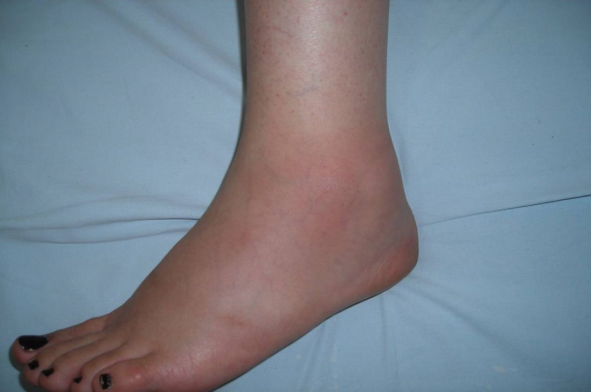
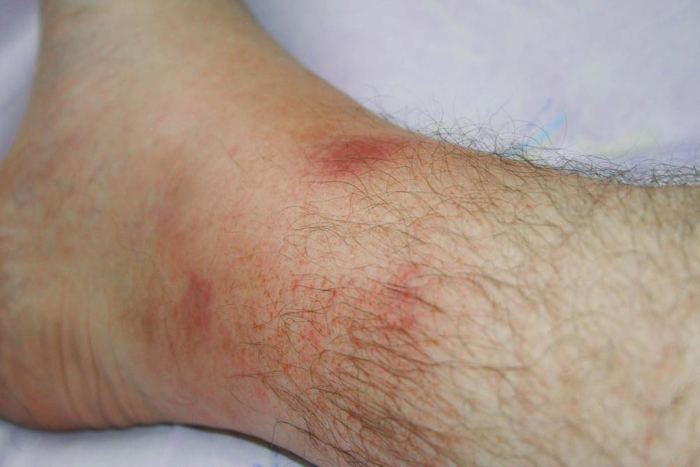

# AİLEVİ AKDENİZ ATEŞİ

**Hazırlayan:** Prof. Dr. Gökhan Sargın
**Bölüm:** ADÜ Tıp Fakültesi - İç Hastalıkları Anabilim Dalı, Romatoloji Bilim Dalı

---

## İÇİNDEKİLER

1. [Tanım](#tanim)
2. [Patogenez](#patogenez)
3. [MEFV Geni ve Mutasyonlar](#mefv-geni-ve-mutasyonlar)
4. [Epidemiyoloji](#epidemiyoloji)
5. [Klinik Bulgular](#klinik-bulgular)
6. [Laboratuvar](#laboratuvar)
7. [Tanı](#tani)
8. [Tedavi](#tedavi)

---

## TANIM

Ailevi Akdeniz Ateşi (AAA/FMF), **otozomal resesif** geçişli, **MEFV genindeki mutasyonlarla** ilişkili bir **otoinflamatuar hastalık**tır.

### Otoinflamatuar Hastalıklar - Genel Özellikler

* Herediter
* Tekrarlayıcı inflamasyon atakları (tetikleyiciler: aşılama, enfeksiyonlar, travma, soğuk, egzersiz, stres)
* Enfeksiyon veya aşikar otoimmün patoloji **yok**
* Otoantikor veya otoreaktif T hücresi **yok**

### Inflammasom Disfonksiyonu ile Gelişen Herediter Otoinflamatuar Hastalıklar

* **CAPS:** Kriyopirin/NLR pirin alanındaki mutasyon
* **FMF:** Pirin alanındaki mutasyon
* **PAPA:** PSTPIP1 genindeki mutasyon

---

## PATOGENEZ

### 1997 Öncesi Dönem

* Katekolamin metabolizma bozukluğu (Aramin testi, dopamin beta hidroksilaz testi)
* C5a-inhibitör eksikliği (periton ve sinoviyal sıvılarda, nötrofil kemotaksisi)
* Lipokortin eksikliği (fosfolipaz-A2 inhibisyonu)

### 1997 Sonrası Dönem

* FMF'den sorumlu gen **(MEFV geni)** klonlandı
* Yeni mutasyonlar tanımlandı
* Pirin etki mekanizması aydınlatıldı
* Modifiye edici genler/moleküller keşfedildi

**⚠️ ÖNEMLİ:** Pirin proteini, **inflammasom** yolunun blokajında görev alır. Pirin proteininde meydana gelen mutasyon/fonksiyon kaybı, **caspase-1 aktivasyonu** ve **IL-1 beta üretimini** arttırır.

---

## MEFV GENİ VE MUTASYONLAR

Hastalıktan **MEFV (MEditerranean FeVer)** genindeki mutasyonlar sorumludur.

### Mutasyonların Dağılımı

* Mutasyonların **%80'den fazlası 10. ekzonda** yer alır
* En sık mutasyonlar: **M694V**, **M680I** ve **V726A**
* Daha nadir mutasyonlar: 2., 3. ve 5. ekzonda

### 10. Ekzon Mutasyonları

| Kodon | Normal Amino Asit | Mutant Amino Asit |
|---|---|---|
| 148 | E (glutamik asit) | Q (glutamin) |
| 680 | M (metionin) | I (izolösin) |
| 681 | T (treonin) | I (izolösin) |
| 692 | I (izolösin) | del (delesyon) |
| 694 | M (metionin) | V (valin) / I (izolösin) / R (arginin) |
| 695 | K (lösin) | A (alanin) |
| 726 | V (valin) | A (alanin) |
| 744 | A (alanin) | S (serin) |
| 761 | R (arginin) | H (histidin) |

Diğer ekzonlardaki nadir mutasyonlar: 2. ekzonda E167D, T267I; 3. ekzonda P369S, R408Q; 5. ekzonda F479L

---

## EPİDEMİYOLOJİ

### Etnik Dağılım

* Türkler, Sefarad Yahudileri, Ermeniler, Araplar

### Prevalans

| Ülke | Prevalans |
|---|---|
| **Türkiye** | **1/400 - 1/1000** (~100.000 hasta) |
| İsrail | 1/250 - 1/1000 (~10.000 hasta) |
| Ermenistan | 1/500 (~6.000 hasta) |
| Japonya | Nadir (~100 vaka) |

### Cinsiyet ve Yaş

| Parametre | Değer |
|---|---|
| Erkek/Kadın | **1.5-2 / 1** |
| 10 yaşına kadar başlangıç | **%50-60** |
| 20 yaşına kadar başlangıç | %80-95 |
| 20 yaşından sonra başlangıç | %5-10 |
| 40 yaşından sonra başlangıç | Oldukça nadir |

---

## KLİNİK BULGULAR

Genel klinik bulgular:
* Ateş
* Peritonit / plörit / perikardit / epididimit / orşit / aseptik menenjit
* Artrit
* Miyozit / miyalji
* Erizipel benzeri eritem

**⚠️ ÖNEMLİ:** Artrit dışı ataklar **12-72 saat** içinde sonlanır.

---

### Ateş Yüksekliği

* Tekrarlayıcı epizodlar, **1-3 gün** sürer
* Birkaç saat süre ile **40 derece**ye varan ateş olabilir
* Bazen yıllarca tek bulgu olabilir (%1-2), diğer bulgular zamanla eklenebilir
* Sıklıkla enfeksiyon tanısı konulur

---

### Abdominal Ataklar

* **En sık görülen atak tipi (%90-95)**
* %68 olguda ilk bulgu
* Sıklıkla üşüme-titreme ile birlikte **39-40 derece** ateş
* Hafif distansiyon, belirgin peritonit
* Diğer nedenli peritonitlerden ayırt edilemez
* Yaklaşık **1/3 hasta** gereksiz apendektomi geçirir

---

### Eklem Atakları

* **En sık görülen ikinci atak tipi**
* %16 olguda ilk bulgu

**Atak tipleri:**
* **Akut atak (3-5 gün):** Kendini sınırlar
* **Kronik atak (>1 ay):** Nadir

**Eklem tutulum özellikleri:**
* Mono / oligo / poliartiküler olabilir
* **Alt taraf büyük eklemler** en sık tutulur:
  - Diz (%63), ayak bileği (%42), kalça (%17)
  - El-ayak küçük eklemler (%3-10)
  - Sakroiliak eklem (%1)
* Deformite/destrüksiyon genellikle görülmez (%3)

---

### Plörit Atağı

* Akut febril plörit atakları
* Efüzyon olabilir
* Genellikle tek taraflı
* **48 saat** içinde kaybolur

---

### Erizipel Benzeri Eritem

* Ateş ve monoartrit veya sadece ateş ile birlikte
* Ayak bileği lateral-medial yüzde / ayak sırtında
* Genelde **24-48 saat** içinde kaybolur
* Ayırıcı tanı: sellülit, artrit





---

### Perikardit

* Nadir (**%0.7**)
* Genellikle asemptomatik
* İzole veya diğer serozit bulgularıyla birlikte

---

### Myalji

Üç tipi tanımlanmıştır:

| Tip | Özellikler |
|---|---|
| **Spontan** | %8 |
| **Egzersiz ilişkili** | %81 |
| **Uzamış febril** | %11, vaskülit ilişkili olabilir, homozigot M694V, steroide gereksinim |

---

### Renal Bulgular

* **Glomerülonefrit**
* **Amiloidoz**
  - **Tip 1:** Tipik FMF atakları olan hastalarda
  - **Tip 2:** Klasik FMF atakları olmadan gelişir

---

### Fenotip 2

Aşağıdaki durumların varlığında Fenotip 2'den söz edilir:

1. Biyopsi ile kanıtlanmış **AA amiloidoz**
2. Pozitif aile anamnezi **var**, klasik FMF atakları **yok**
3. Biyopsiden sonra ortaya çıkan klasik FMF atakları
4. **2 MEFV mutasyonunun** bulunması

---

## LABORATUVAR

### Atak Döneminde

* **Akut faz reaktanlarında artış:**
  - Sedimantasyon ↑
  - Fibrinojen ↑
  - CRP ↑
  - Haptoglobin ↑
  - C3, C4 ↑
  - **Serum amiloid-A (SAA) ↑**
* **Lökositoz**
* İdrar analizi (proteinüri takibi - amiloidoz)
* Sinoviyal/seröz sıvı analizleri

💡 FMF, **IL-1 ilişkili** bir hastalıktır.

---

## TANI

> Tanı esas olarak **kliniktir.** Üç anahtar özellik: **rekürrens**, **ateş**, **süre**

### Tel-Hashomer Kriterleri

| Kriter Tipi | Bulgular |
|---|---|
| **Major bulgular** | Peritonit, plörit veya sinovitin eşlik ettiği tekrarlayan ateşli epizodlar |
| | Diğer nedenlere bağlı olmayan AA tipi amiloidoz |
| | Devamlı kolşisin tedavisine anlamlı yanıt |
| **Minör bulgular** | Tekrarlayan ateşli ataklar |
| | Erizipel benzeri eritem |
| | Birinci derece akrabalarda FMF |

**Kesin tanı:** 2 major **veya** 1 major + 2 minör

**Olası tanı:** 1 major + 1 minör

---

### Mutasyon Analizi Algoritması

Klinik şüphe durumunda aşağıdaki algoritma uygulanır:

```
                    Klinik Değerlendirme
                           ↓
           ┌───────────────┼───────────────┐
           ↓               ↓               ↓
      Klinik (+)      Klinik (?)      Klinik (-)
           ↓               ↓               ↓
     Mutasyon analizi  Mutasyon analizi    İzlem
     gerek yok              ↓
           ↓          ┌─────┼─────┐
     Kolşisin         ↓     ↓     ↓
     tedavisi       +/+   +/-   -/-
                     ↓     ↓     ↓
                  Kolşisin  ↓   İzlem
                  tedavisi  ↓
                       Kolşisin testi
                      ┌─────┼─────┐
                      ↓           ↓
                 Yanıt (+)   Yanıt (-)
                      ↓           ↓
                 Kolşisin    Taşıyıcı
                 tedavisi    İzlem/Tedavi
```

💡 Kolşisine yanıt iyi ise ve kesildiğinde atak oluyorsa, tanıyı FMF kabul ederek tedaviye devam etmek akılcıdır.

---

## TEDAVİ

### Tedavinin Amacı

* Normal **SAA düzeyi (<10 mg/L)**
* Normal CRP
* Subklinik inflamasyonu azaltmak

---

### Kolşisin Tedavi Algoritması

```
                         FMF Tanısı
                             ↓
                         Kolşisin
                ┌────────────┼────────────┐
                ↓                         ↓
        Atak kontrolü var         Kontrolsüz atak
                ↓                         ↓
     Ataksız dönemde SAA        Dozu arttır*
                ↓                         ↓
        ┌───────┼───────┐       Ataksız dönemde SAA
        ↓               ↓            ↓
     Normal          Yüksek    ┌─────┼─────┐
        ↓               ↓     ↓           ↓
   Tedaviye         Dozu     Normal     Yüksek
   devam et      arttır*       ↓           ↓
                          Tedaviye     Başka neden?
                          devam et     Dozu arttır*
                                       veya tedaviyi
                                       değiştir
```

*Erişkinlerde **3 mg/gün** veya tolere edilebilen daha yüksek dozlara çıkılması denenebilir.

---

### Atak Tedavisi

* **Analjezikler**
* **NSAİİ:** Örneğin IM diklofenak
* **Kolşisin:** Yerleşik atakta etkisiz, **prodromal dönemde** verilmeli
* **Metilprednizolon infüzyonu:** 40 mg MP, 250 cc SF
* **İnterferon alfa:** 3-10 milyon IU SC
* **Biyolojik tedaviler**

---

### Kolşisin Direnci

**⚠️ ÖNEMLİ:** Önce **komplians** ve **doz** kontrol edilmelidir!

**Kolşisin direnci tanımı:**
* Tolere edilen maksimum doza rağmen, **ayda bir veya daha fazla atak** veya **artmış akut faz reaktanları** (ataklar arasında)
* Yılda 6'dan fazla atak

### Kolşisin Dirençli FMF Tedavisi

Kolşisin dirençli hastalarda **biyolojik tedaviler** (anti-IL-1 ajanlar: anakinra, kanakinumab, rilonasept) gündeme gelir.

---

## KAYNAKLAR

* Bijlsma JWJ (editor). EULAR Textbook on Rheumatic Diseases, Third Edition. BMJ Publishing Group, 2018.
* Jameson JL, Fauci AS, Kasper DL, et al. Harrison's Principles of Internal Medicine, 20th Edition. McGraw-Hill Professional, 2018.
* Giancane G, et al. Evidence-based recommendations for genetic diagnosis of familial Mediterranean fever. Ann Rheum Dis. 2015;74:635-41.
* Berkun Y, et al. Diagnostic criteria of familial Mediterranean fever. Autoimmun Rev. 2014;13:388-90.
