# AKUT ROMATİZMAL ATEŞ

**Hazırlayan:** Dr. Öğr. Üyesi Reyhan Köse Çobanoğlu
**Bölüm:** Aydın Adnan Menderes Üniversitesi -- Romatoloji Bilim Dalı

---

## İÇİNDEKİLER

1. [Tanım ve Terminoloji](#tanım-ve-terminoloji)
2. [Epidemiyoloji](#epidemiyoloji)
3. [Etyopatogenez](#etyopatogenez)
4. [Klinik Seyir](#klinik-seyir)
5. [Jones Kriterleri](#jones-kriterleri)
6. [Majör Bulgular](#majör-bulgular)
7. [Minör Bulgular](#minör-bulgular)
8. [Laboratuvar](#laboratuvar)
9. [Ayırıcı Tanı](#ayırıcı-tanı)
10. [Tedavi](#tedavi)
11. [Sekonder Profilaksi](#sekonder-profilaksi)
12. [Prognoz](#prognoz)
13. [Klinik Vakalar](#klinik-vakalar)
14. [Özet ve Püf Noktalar](#özet-ve-püf-noktalar)

---

## TANIM VE TERMİNOLOJİ

> **Tanım:** Akut Romatizmal Ateş (ARA) -- eski adıyla **akut eklem romatizması** -- A grubu beta-hemolitik streptokokların (GABHS; *Streptococcus pyogenes*) neden olduğu **farengeal enfeksiyondan 1-4 hafta sonra** (ortalama 3 hafta); **kalp, eklemler, santral sinir sistemi, deri ve deri altı dokularını** tutan sistemik inflamatuvar bir hastalıktır.

- Konağın **otoimmün (humoral + hücresel)** yanıtı sonucunda gelişir.
- Az gelişmiş ve gelişmekte olan ülkelerde **çocuk ve genç erişkinlerde edinilmiş kalp hastalığının en önemli nedenidir**.
- **Kardiyak tutulum** hastalığın mortalite ve morbiditesinden birincil sorumludur; kalıcı kapak hasarı (romatizmal kapak hastalığı, RKH) en ciddi sekeldir.
- **⚠️ ÖNEMLİ:** ARA sadece **boğaz (farenjit) kaynaklı** streptokok enfeksiyonları sonrası gelişir. **Kutanöz (deri) streptokok enfeksiyonları sonrası ARA görülmez** (impetigo, erizipel gibi cilt enfeksiyonları ARA tetiklemez; ancak akut post-streptokoksik glomerülonefrite yol açabilir).

---

## EPİDEMİYOLOJİ

### İnsidans

| Bölge/Ülke | İnsidans (/100.000) |
|---|---|
| Gelişmiş ülkeler | 0.5 -- 3 |
| Gelişmekte olan ülkeler | 20 -- 100 |
| Türkiye (1972-1976) | 20 |

- **Türkiye'de romatizmal kapak hasarı (RKH) prevalansı (1976):** %0.6

### Demografik Özellikler

| Parametre | Değer / Not |
|---|---|
| **Yaş** | 5 -- 15 yaş (pik yaş) |
| 5 yaş altı | %5 (çok daha nadir) |
| 2 yaş altı | Görülmez |
| 35 yaş üstü | Çok nadir |
| **Cinsiyet** | K = E (eşit) |
| **Irk** | Fark yok |
| **Mevsim** | Kış ve ilkbahar (üst solunum yolu enfeksiyonları ile paralel) |
| **Sosyoekonomik düzey** | Gelişmekte olan ülkelerde fazla |
| **Genetik** | Yatkınlık var (HLA-DR7, HLA-DR4 birlikteliği) |

### Kapak Tutulum Örüntüsü

- **Mitral stenoz:** Kadınlarda daha sık
- **Aort stenozu ve aort yetmezliği:** Erkeklerde daha sık

### Rekürrens Olasılığı

- İlk bir yıl atağın tekrarlama olasılığı: **%50**
- 5 yıl sonra tekrarlama olasılığı: **%10**
- Puberte sonrası rekürrens riski yaşla birlikte azalır.

---

## ETYOPATOGENEZ

### Etken Mikroorganizma

- **A grubu beta-hemolitik streptokoklar (GABHS / Streptococcus pyogenes)**
- **Tüm serotipler ARA oluşturmaz.**
- **M proteini** -- antifagositik özelliğe sahip, ARA gelişiminden sorumlu antijen.
- Atakların başlaması M proteininin serotipine bağlıdır.
- **Romatojenik suşlar:** M tip **1, 3, 5, 6, 18, 19, 24, 27, 29**

### Moleküler Mimikri Mekanizması

> **Temel prensip:** M proteinin antijenik özellikleri ile insan dokularındaki bazı antijenlerin yapısal benzerliği (moleküler mimikri) otoimmüniteyi tetikleyen faktördür. Konakçının immün sistemi **kendi dokularını** tahrip eder.

### Hastalığa Duyarlılığı Artıran Faktörler

- Konakçı yatkınlığı (genetik)
- Kötü beslenme
- Kalabalık yaşam ortamı
- Kötü/yetersiz tıbbi bakım
- Tekrarlayan streptokok enfeksiyonları

---

### İmmünolojik Çapraz Reaksiyonlar

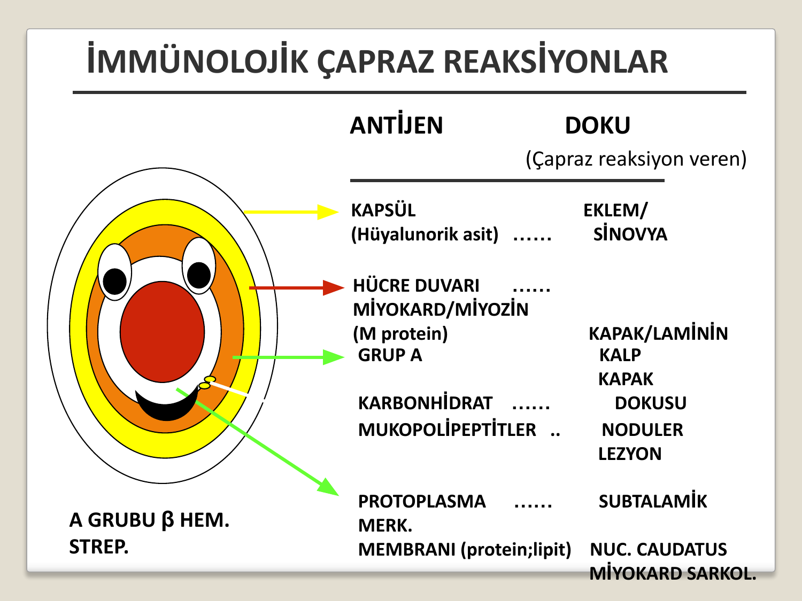

> **Şema yorumu:** Şema A grubu beta-hemolitik streptokokun farklı yapısal bileşenleri ile çapraz reaksiyon verdiği insan dokularını özetler. Aynı epitoplara karşı oluşan antikorlar hem bakteriyi hem de benzer yapıya sahip konakçı dokularını hedef alır.

| GABHS Antijeni | Çapraz Reaksiyon Veren İnsan Dokusu |
|---|---|
| **Kapsül** (hyalüronik asit) | Eklem / Sinovya |
| **Hücre duvarı -- M proteini** | Miyokard / Miyozin, Kapak / Laminin |
| **Grup A karbonhidrat** | Kalp kapak dokusu |
| **Mukopolipeptitler** | Nodüler lezyon |
| **Protoplazma / Hücre membranı** (protein-lipit) | Subtalamik nukleus kaudatus, Miyokard sarkolemma |

---

### Patogenez Kaskadı

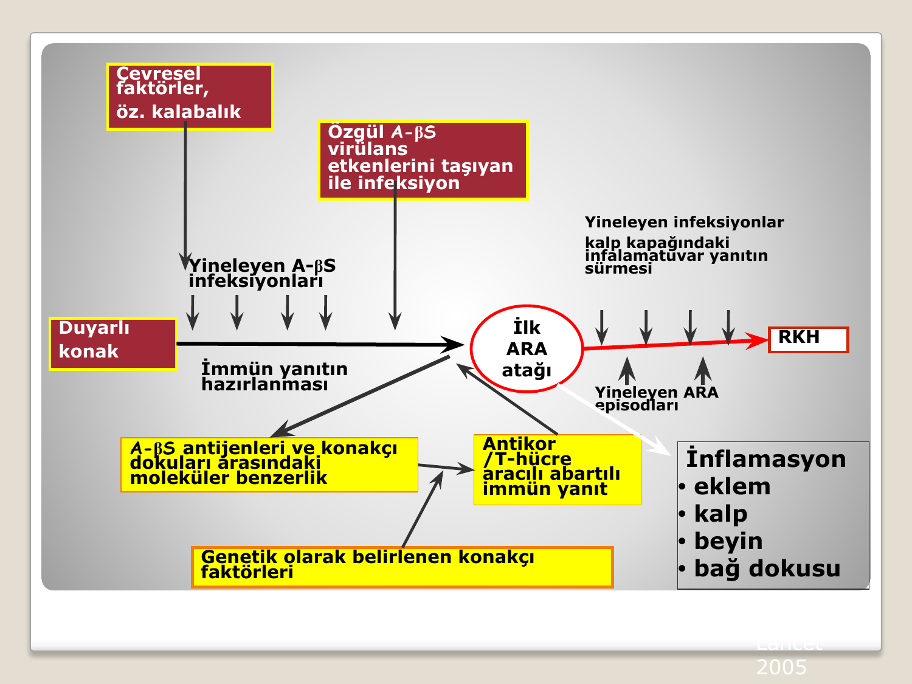

> **Şema yorumu:** Çevresel faktörler (özellikle kalabalık ortam) ve duyarlı konak bir araya geldiğinde, özgül virülans etkenlerini (M protein gibi) taşıyan A-betaS enfeksiyonları moleküler benzerlik aracılığı ile abartılı antikor/T-hücre yanıtı başlatır. İlk ARA atağından sonra yineleyen enfeksiyonlar kalp kapağındaki inflamatuvar yanıtı sürdürerek RKH'ye ilerler. İnflamasyon eklem, kalp, beyin ve bağ dokusunda klinik bulgulara yol açar.

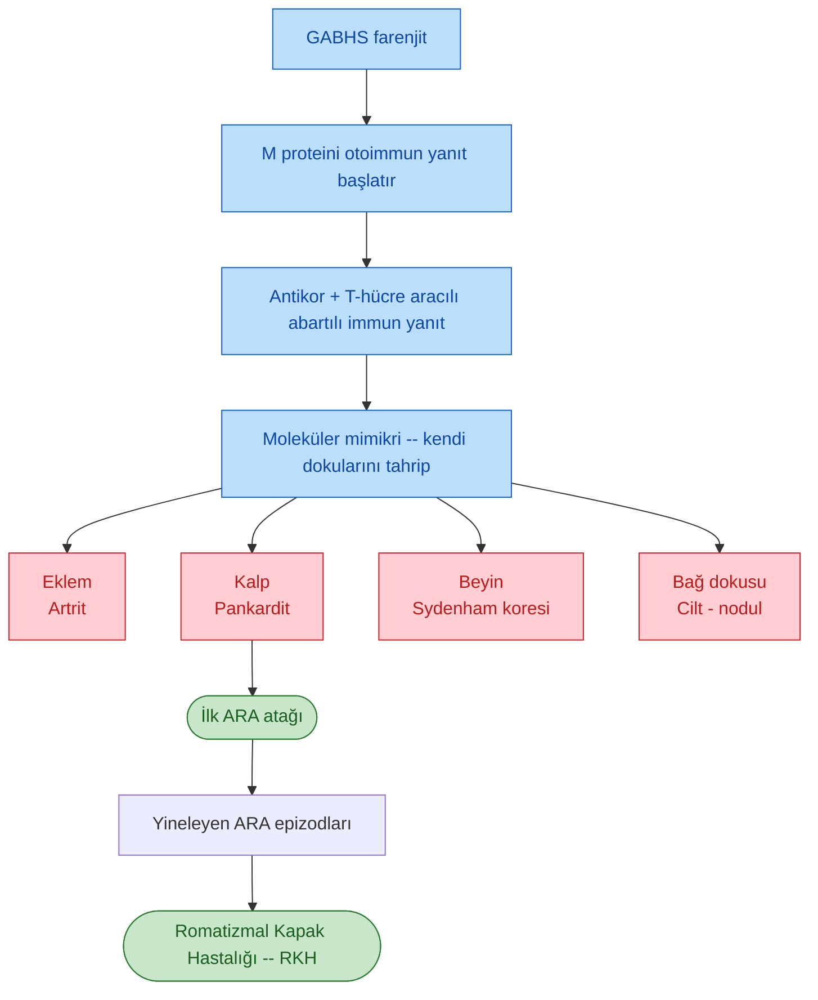

---

## KLİNİK SEYİR

- Sıklıkla streptokok farenjitinden **2-4 hafta** sonra (aralık 10 gün -- 5 hafta) akut ateşli bir hastalık tablosu şeklinde ortaya çıkar.
- Farenjit ile ARA belirtileri arasında geçen semptomsuz süreye **"latent period" (latent dönem)** denir.
- **Sydenham koresi** aylar sonra (1-6 ay) ortaya çıkabilir.

### Yaş Grubuna Göre Tipik Prezentasyon

| Yaş grubu | En sık bulgu |
|---|---|
| Çocuklar | Karditis + poliartrit |
| **Yetişkinler** | **Ateş + gezici poliartrit** |
| Adolesan kızlar | Sydenham koresi (geç prezentasyon) |

---

## JONES KRİTERLERİ

### Modifiye Jones Kriterleri (1992 -- Klasik)

| Majör Kriterler | Minör Kriterler |
|---|---|
| Artrit | Ateş |
| Kardit | Artralji |
| Kore (Sydenham koresi) | Akut faz reaktanlarında artış (ESH, CRP) |
| Eritema marginatum | EKG'de PR süresinin uzaması |
| Subkutan nodüller | -- |

**Tanı:** 2 majör **veya** 1 majör + 2 minör **+ geçirilmiş streptokok enfeksiyonu delilleri** (boğaz kültürü, hızlı antijen testleri, antistreptokok antikorları -- ASO, anti-DNase B).

---

### 2015 Revize Jones Kriterleri

2015 revizyonu, toplumları **düşük riskli** ve **orta-yüksek riskli** olarak ikiye ayırır. Yüksek riskli toplumlarda kriterler esnetilmiştir (örn. monoartrit de yeterli sayılır).

#### Düşük Riskli Toplumlar

| Majör Kriterler | Minör Kriterler |
|---|---|
| **Kardit** (klinik veya subklinik -- ekokardiyografik) | Poliartralji |
| Poliartrit | Ateş (≥38.5°C) |
| Kore | ESH ≥60 mm/saat ve/veya CRP ≥3.0 mg/dL |
| Eritema marginatum | PR intervalinde uzama (yaşa göre) |
| Subkütan nodül | Geçirilmiş A-βS enfeksiyonu bulguları |

#### Orta-Yüksek Riskli Toplumlar

| Majör Kriterler | Minör Kriterler |
|---|---|
| **Kardit** (klinik veya subklinik) | Monoartralji |
| **Monoartrit / poliartrit** veya poliartralji | Ateş (≥38°C) |
| Kore | ESH ≥30 mm/saat ve/veya CRP ≥3.0 mg/dL |
| Eritema marginatum | PR intervalinde uzama (yaşa göre) |
| Subkütan nodül | -- |

#### Tanı Ölçütleri

| Durum | Gerekli kriter sayısı |
|---|---|
| **İlk atak tanısı** | 2 majör **veya** 1 majör + 2 minör |
| **Tekrarlayan ARA atağı** | 2 majör **veya** 1 majör + 2 minör **veya** 3 minör |
| Tüm tanılar için zorunlu | Geçirilmiş A-βS enfeksiyonu bulguları |

**⚠️ ÖNEMLİ:**

* Tüm Jones kriterleri (2015) uygulamasında **geçirilmiş GABHS enfeksiyonu kanıtı mutlaka gereklidir**.
* Sydenham koresi **tek başına tanı koydurur** (geçirilmiş streptokok kanıtı aranmaz -- latent dönem uzundur, serolojik kanıtlar negatifleşmiş olabilir).
* İndolent kardit (sinsi seyirli kardit) de tek başına tanı koydurabilir.

---

## MAJÖR BULGULAR

### 1. Kardit

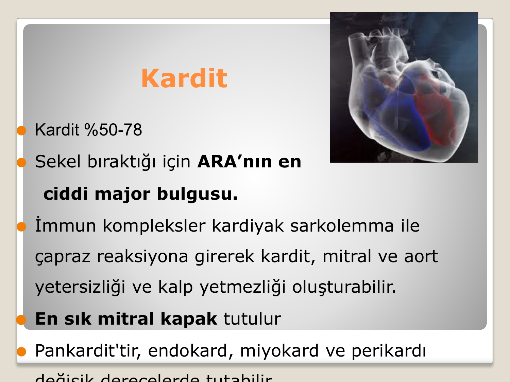

> **Şema yorumu:** ARA'da kalp tutulumu pankardit karakterindedir; üç kat (endokard, miyokard, perikard) eş zamanlı değişen derecelerde etkilenir. Klinik ciddiyeti ve uzun dönem sekelleri (kapak hastalığı) hastalığın en önemli yönüdür.

#### Özellikler

- **Sıklık:** %50 -- 78
- **Sekel bıraktığı için ARA'nın en ciddi majör bulgusudur.**
- Patogenez: İmmün kompleksler kardiyak sarkolemma ile çapraz reaksiyona girerek kardit, mitral ve aort yetersizliği ve kalp yetmezliği oluşturabilir.
- **En sık mitral kapak tutulur** (mitral > aort > triküspit > pulmoner).
- **Pankardit**tir: endokard, miyokard ve perikard değişen derecelerde birlikte tutulur.

#### Tanı (En Az Biri Yeterli)

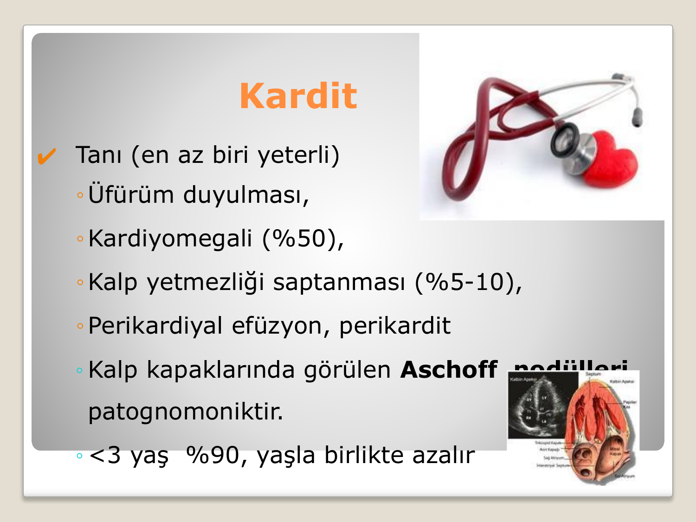

> **Şema yorumu:** Kardit tanısı için aşağıdaki bulgulardan biri yeterlidir. Aschoff nodülü histolojik olarak patognomoniktir; klinik uygulamada tanıya genellikle üfürüm, kardiyomegali ve ekokardiyografi katkı sağlar.

| Bulgu | Sıklık / Not |
|---|---|
| **Yeni üfürüm duyulması** | En sık (mitral yetersizlik üfürümü, Carey Coombs, aort yetersizlik üfürümü) |
| **Kardiyomegali** | %50 |
| **Kalp yetmezliği** | %5 -- 10 |
| **Perikardiyal efüzyon, perikardit** | Sürtünme sesi, sessiz alan |
| **Aschoff nodülleri** | Kalp kapaklarında -- **patognomoniktir** (histolojik) |
| **3 yaş altı kardit** | %90 (yaşla birlikte sıklık azalır) |

**⚠️ ÖNEMLİ:**

* **Aschoff nodülü** ARA kardinin patognomonik histolojik lezyonudur: Merkezde fibrinoid nekroz, çevresinde büyük histiositler (Anitschkow hücreleri) ve dev hücreler (Aschoff dev hücresi).
* Subklinik kardit, 2015 kriterlerinde ekokardiyografi ile saptanan valvülit olarak majör kabul edilir.

---

### 2. Artrit

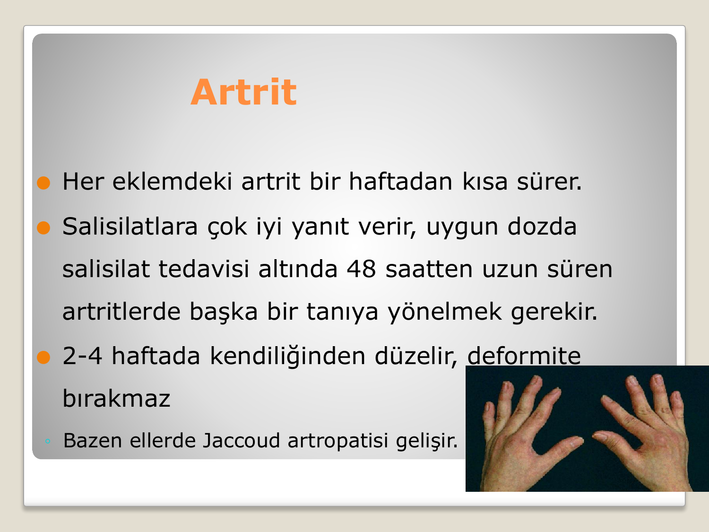

> **Şema yorumu:** ARA artriti büyük eklemlerde gezici (migratuar) poliartrit şeklindedir; deformite bırakmaz. Nadiren tekrarlayan ataklardan sonra ellerde deforme olmayan, redükte edilebilen **Jaccoud artropatisi** gelişebilir.

#### Özellikler

- **Sıklık:** %35 -- 88 (en sık görülen majör bulgu)
- **Poliartrit:** %75
- Yaşla birlikte artar.
- Büyük eklemlerde (diz, ayak bileği, dirsek, el bileği) şişlik, ağrı, kızarıklık, fonksiyon bozukluğu, ısı artışı.
- İki veya daha fazla eklem tutulur, **gezici (migratuar)** karakterdedir.
- Her eklemdeki artrit **bir haftadan kısa** sürer.
- **Salisilatlara (aspirin) çok iyi yanıt verir** -- uygun dozda salisilat tedavisi altında **48 saatten uzun süren artritlerde başka bir tanıya yönelmek gerekir**.
- 2-4 haftada kendiliğinden düzelir.
- **Deformite bırakmaz** (istisna: tekrarlayan atakta nadiren Jaccoud artropatisi).

**⚠️ ÖNEMLİ:**

* Artrit varsa artralji **minör kriter olarak sayılmaz** (çifte sayım yasağı).
* Tuzak: Aspirin başlandıktan sonra artrit hızla söndüğü için tanı örüntüsü kaybolabilir -- şüphede önce tanı konmalı, sonra tedavi başlanmalıdır.

---

### 3. Sydenham Koresi

- **Sıklık:** %2 -- 19
- **Latent dönem:** Akut ARA atağından 1-6 ay sonra ortaya çıkar (geç bulgu).
- **Kızlarda ve adolesanlarda** sıktır.
- Gövde ve ekstremitelerde (özellikle üst ekstremite) **istemsiz, hızlı, sıçrayıcı, düzensiz hareketler**.
- **Emosyonel dengesizlik** ve **hipotoni** ile birliktedir.
- **Uykuda kaybolur** (fonksiyonel lokalizasyon testi).
- Hastanın yazısı bozulur, düğme ilikleyip çözemez.
- **Tek başına ARA tanısı koydurur** (diğer bulgular olmasa bile).

#### Sydenham Koresine Yaklaşım

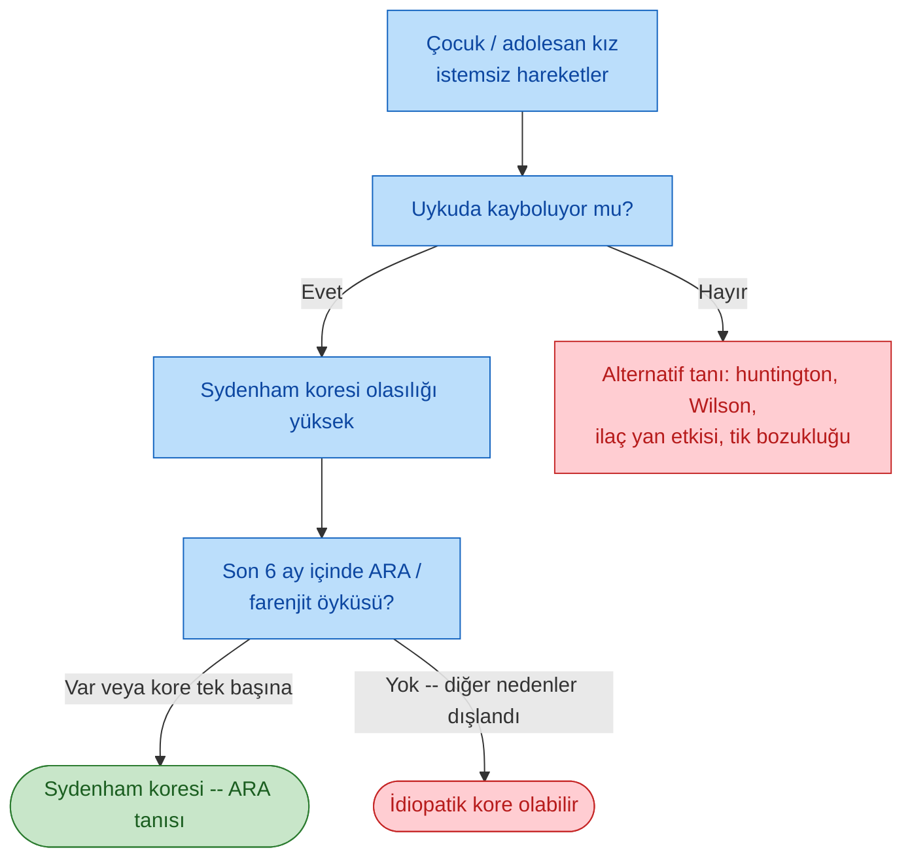

---

### 4. Eritema Marginatum

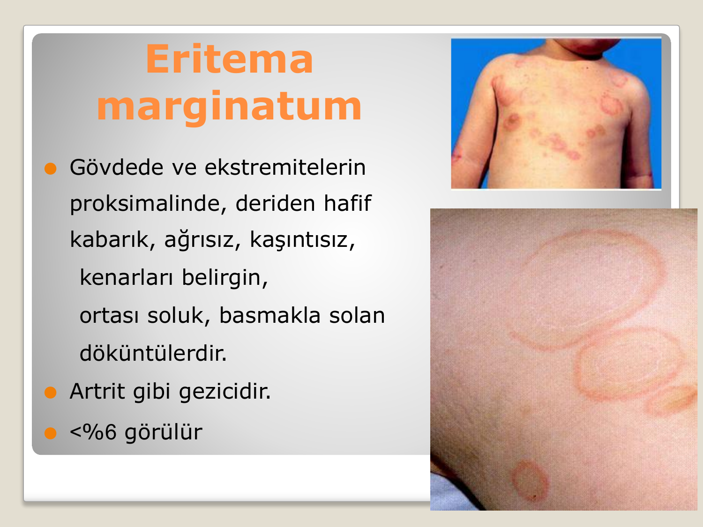

> **Şema yorumu:** Eritema marginatum, gövde ve ekstremite proksimallerinde yerleşen, tipik olarak **kenarları belirgin, ortası soluk, halka veya yılankavi** görünümünde, ağrısız ve kaşıntısız, **basmakla solan** döküntüdür. Artrit gibi gezici karakterdedir.

#### Özellikler

- **Sıklık:** <%6 (nadir ama spesifik)
- **Yerleşim:** Gövde ve ekstremitelerin **proksimal** kısımları (yüzde görülmez).
- Deriden hafif kabarık, ağrısız, kaşıntısız.
- **Kenarları belirgin, ortası soluk**, basmakla solan.
- **Artrit gibi gezicidir** (birkaç saat içinde şekil değiştirebilir).

---

### 5. Subkutan Nodüller

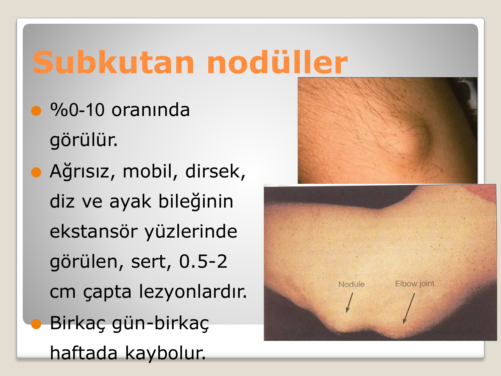

> **Şema yorumu:** Subkutan nodüller, genellikle dirsek ve diz gibi kemik çıkıntıları ve tendonlar üzerinde yerleşen, sert kıvamlı, ağrısız ve hareketli nodüllerdir. Nadir görülür ancak genellikle ciddi kardit ile birlikte bulunur.

#### Özellikler

- **Sıklık:** %0 -- 10 (nadir)
- **Ağrısız, mobil, sert** kıvamlı
- **Yerleşim:** Dirsek, diz ve ayak bileğinin **ekstansör yüzleri**; oksiput, skapula, omurga spinoz prosesleri.
- Çap: **0.5 -- 2 cm**
- **Birkaç gün -- birkaç haftada kaybolur.**
- Genellikle **ciddi kardit** ile birlikte bulunur (önemli prognostik ipucu).

---

## MİNÖR BULGULAR

### 1. Ateş

- 38 -- 40 °C arasında değişir.
- Karakteristik bir paterni yoktur.
- **1 hafta sürüp 1-2 haftada geçer.**
- 2015 kriterlerinde:
  - Düşük riskli toplumlar: ≥38.5 °C
  - Orta-yüksek riskli toplumlar: ≥38 °C

### 2. Artralji

- Büyük eklemlerde, gezici karakterde.
- **Artrit varsa artralji minör bulgu olarak kabul edilmez** (çifte sayım yasağı).
- Düşük riskli toplumlarda **poli**artralji; orta-yüksek riskli toplumlarda **mono**artralji yeterli.

### 3. Akut Faz Reaktanları

- Eritrosit çökme hızı (ESH/Sedimentasyon): Erken dönemde genellikle **saatte 60 mm'den fazla**.
- C-reaktif protein (CRP): ≥3.0 mg/dL.

### 4. EKG'de PR Uzaması

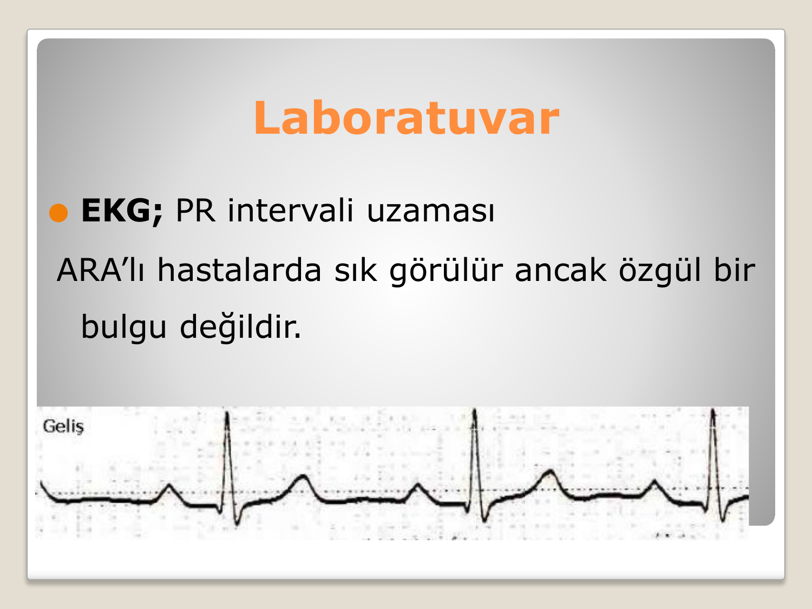

> **Şema yorumu:** EKG'de birinci derece AV blok (PR >200 msn) ARA'lı hastalarda sık görülür ancak özgül değildir; **PR uzamasının tek başına varlığı kardit tanısı koydurmaz**. Tedavi ile düzelir.

- ARA'lı hastalarda sık görülür ancak **özgül bir bulgu değildir.**
- Yaşa göre değerlendirilmelidir.
- Kardit varsa **PR uzaması minör kritere sayılmaz** (çifte sayım yasağı).

---

## LABORATUVAR

### Geçirilmiş Streptokok Enfeksiyonu Delilleri

ARA tanısı için **mutlaka** geçirilmiş GABHS enfeksiyonu kanıtı gereklidir (Sydenham koresi ve indolent kardit istisna).

| Test | Açıklama |
|---|---|
| **Antikor testleri** | **ASO** (anti-streptolizin O) ve **anti-DNase B** -- en sık kullanılan ikili |
| **Boğaz kültürü** | Altın standart; ancak ARA başladığında genellikle negatifleşmiştir |
| **Hızlı streptokok antijen testi** | Hızlı tanı (özgüllüğü yüksek, duyarlılığı orta) |

**⚠️ ÖNEMLİ:**

* **ASO düzeyinin yüksek bulunması** yalnızca geçirilmiş streptokok enfeksiyonunun göstergesidir; tek başına ARA tanısı koymak için **yeterli değildir**.
* ASO pik düzeyi enfeksiyondan **2-3 hafta sonra** görülür; **anti-DNase B** yavaş yükselir ve daha uzun süre yüksek kalır (Sydenham koresi için ASO negatifken faydalıdır).
* ASO eşik değeri erişkinlerde genellikle **≥200 Todd ünitesi**.

### Akut Faz Reaktanları

| Parametre | Bulgu |
|---|---|
| Sedimentasyon (ESH) | Erken dönemde genellikle **>60 mm/saat** |
| C-reaktif protein (CRP) | Belirgin artış (≥3.0 mg/dL) |
| Lökositoz | Nötrofilik hakimiyet ile orta düzeyde artış |
| Anemi | Normositer, kronik hastalık anemisi tipinde olabilir |

### EKG

- **PR uzaması** (1. derece AV blok) -- sık ancak özgül değil.
- İleri AV bloklar, aritmiler (nadir)
- ST-T değişiklikleri (perikardit/miyokardit)

### Ekokardiyografi

- Subklinik kardiyak tutulum için **tüm şüpheli hastalara** yapılır.
- Mitral yetersizlik en sık ekokardiyografik bulgu.
- 2015 kriterlerinde subklinik kardit majör kriter.

### Boğaz Kültürü

- ARA semptomları başladığında genellikle negatif (streptokok temizlenmiştir).
- Kültür negatif olsa bile **tedavi başlanmalıdır** (eradikasyon için).

---

## AYIRICI TANI

| Hastalık | Ayırıcı Özellikler |
|---|---|
| **Juvenil idiopatik artrit (JIA)** | Kronik seyir, tek eklem veya simetrik küçük eklemler, sabah tutukluğu |
| **Reaktif artrit** | Geniş spektrum enfeksiyon sonrası, sakroiliak tutulum olabilir, HLA-B27 (+) |
| **Septik artrit** | Tek eklem, yüksek ateş, ileri akut faz reaktanları, pozitif eklem sıvısı kültürü |
| **Viral artrit** (parvovirüs B19, rubella, EBV, hepatit B/C) | Kendini sınırlayan, döküntü eşliğinde, serolojik tanı |
| **Sistemik lupus eritematozus (SLE)** | Kelebek döküntü, ANA/anti-dsDNA pozitifliği, multisistem tutulum |
| **Akut lösemi** | Kemik ağrısı, pansitopeni, periferik yayma |
| **Gonokok artriti** | Genç erişkin, tenosinovit + pustüler döküntü, genitoüriner enfeksiyon |
| **Lyme artriti** | Endemik bölge, ECM, serolojik tanı |
| **Henoch-Schönlein purpurası (IgA vaskülit)** | Palpabl purpura, karın ağrısı, nefrit |
| **Post-streptokoksik reaktif artrit (PSRA)** | Latent dönem kısa (<10 gün), gezici değil, aspirine yanıt zayıf, kardit yok |

---

## TEDAVİ

Tedavi dört ana basamaktan oluşur:

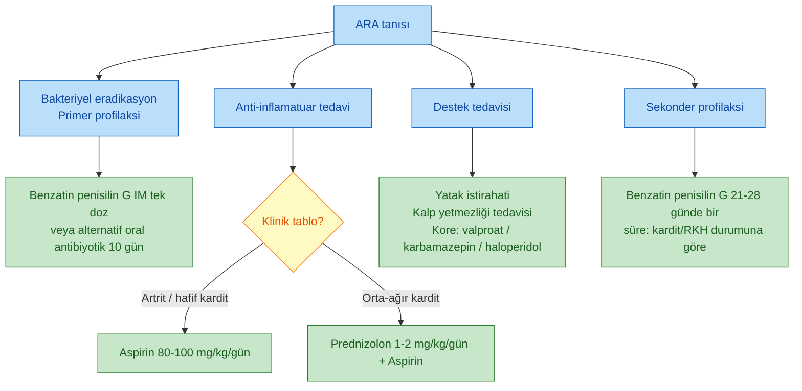

---

### 1. Bakteriyel Eradikasyon (Primer Profilaksi)

**Boğaz kültüründe üreme olmasa bile antibiyotik tedavisi verilmelidir.**

#### Birinci Seçenek: Benzatin Penisilin G

| Hasta | Doz |
|---|---|
| Erişkin | **1.200.000 ünite tek doz IM** (Deposilin / Penadur LA) |
| Çocuk (<27 kg) | **600.000 ünite tek doz IM** |
| Çocuk (≥27 kg) | 1.200.000 ünite tek doz IM |

#### Alternatifler

| İlaç | Doz | Süre |
|---|---|---|
| Aminopenisilinler (ampisilin, amoksisilin) | Uygun dozda oral | 10 gün |
| Sefalosporinler (oral 1. kuşak) | Uygun dozda | 10 gün |
| **Penisilin alerjisi varsa -- Eritromisin** | 40 mg/kg/gün 4 dozda (maks 1 g/gün) | 10 gün |
| Penisilin V (oral) | 250 -- 500 mg 2-3x/gün | 10 gün |

**⚠️ ÖNEMLİ:**

* Antibiyotik tedavisi **ARA atağını durdurmaz** (immünolojik reaksiyon zaten başlamıştır); ancak streptokokların eradikasyonu **rekürrensi önler**.
* Kısa süreli tedavi (<10 gün) eradikasyon için yetersizdir.

---

### 2. Anti-İnflamatuvar Tedavi

| Klinik tablo | Tedavi |
|---|---|
| **Artrit -- hafif kardit** | **Aspirin 80-100 mg/kg/gün** 2 hafta; sonra azaltılarak 6 haftada kesilir |
| **Orta-ağır kardit** | **Prednizolon 1-2 mg/kg/gün** 2 hafta; azaltılırken **Aspirin 75 mg/kg/gün** başlanır; steroid azaltılarak kesilir, kesildikten sonra aspirine **4 hafta** devam edilir |

**⚠️ ÖNEMLİ:**

* Aspirin artriti ve ateşi **24-48 saat içinde dramatik biçimde** düzeltir; bu yanıt tanı desteklemektedir.
* Anti-inflamatuvar tedavi **çok erken başlanırsa tanı koyma güçleşebilir** (klinik bulgular örtülür).
* Steroid kesilirken "geri tepme (rebound) alevlenmesi" olabilir -- aspirinin devam edilme nedeni budur.

---

### 3. Destek Tedavisi

#### İstirahat (Aktif Bulgular Kaybolana Kadar)

| Klinik | Yatak istirahati | Kısmi istirahat |
|---|---|---|
| Artrit | 2 hafta | 2 hafta |
| Kardit | 4 hafta | 4 hafta |

- **2-3 ay boyunca tüm hastalar ağır aktivitelerden kaçınmalıdır.**

#### Diyet

- Konjestif kalp yetmezliği (KKY) varsa **tuzsuz** diyet.
- KKY yoksa normal diyet.

#### Kalp Yetmezliği Tedavisi

- Oksijen
- Diüretik
- Digoksin (dikkatli kullanılmalı -- ARA'da miyokardiyal hassasiyet artmış olabilir)
- ACE inhibitörleri (kapak yetersizliğinde)

#### Sydenham Koresi Tedavisi

Sedasyon ve dopamin antagonisti / anti-epileptik ilaçlar:

- **Valproik asit** (birinci seçenek)
- **Karbamazepin**
- **Fenobarbital**
- **Haloperidol** (ağır olgularda)

---

## SEKONDER PROFİLAKSİ

> **Tanım:** Daha önce ARA geçirmiş bir hastada **yeni bir GABHS enfeksiyonunu ve dolayısıyla yeni bir ARA atağını engellemek** amacıyla uzun süreli antibiyotik kullanımıdır.

### Neden Gerekli?

- Rekürrens olasılığı çocuklarda daha sıktır.
- **İlk yıl içinde nüks %50**, 5 yıl sonra %10.
- Her yeni atak kapak hasarını **artırır**.
- Puberte sonrası rekürrens yaşla birlikte azalır.

### Sekonder Profilaksi Rejimleri

| İlaç | Doz | Sıklık |
|---|---|---|
| **Benzatin Penisilin G (birinci seçim)** | Erişkin: 1.200.000 Ü IM / Çocuk <27 kg: 600.000 Ü IM | **Her 21-28 günde bir** |
| Penisilin V (oral) | 250 mg | 2x/gün |
| Eritromisin (penisilin alerjisi) | 250 mg | 2x/gün |
| Sülfadiazin | 500-1000 mg | 1x/gün |

**⚠️ ÖNEMLİ:**

* **İntramusküler benzatin penisilin** oral profilaksiden daha etkindir (compliance sorunu yok).
* Yüksek riskli bölgelerde **21 günde bir** (4 haftalık aralık geniş), düşük riskli bölgelerde **28 günde bir** tercih edilir.

---

### Sekonder Profilaksi Süresi

Süre, **kardit varlığı** ve **kalıcı kapak hastalığı (RKH)** durumuna göre belirlenir:

| Klinik durum | Süre |
|---|---|
| **Kardit yok (artrit, kore, deri bulguları ile ARA)** | **5 yıl veya 21 yaşına kadar** (hangisi uzunsa) |
| **Kardit var, RKH gelişmedi** | **10 yıl veya 21-25 yaşına kadar** (hangisi uzunsa) |
| **Kardit var, RKH var (kalıcı kapak hastalığı)** | **10 yıl veya 40 yaşına kadar** (hangisi uzunsa); yüksek riskli gruplarda **ömür boyu** |

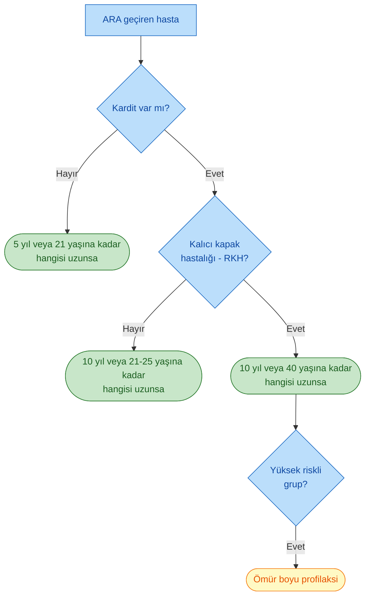

---

### Bakteriyel Endokardit Profilaksisi

- **Özellikle kapak lezyonu (RKH) olan hastalarda** cerrahi girişimler ve **diş girişimleri öncesinde** bakteriyel endokardit profilaksisi yapılmalıdır.
- Amaç: Diş işlemi sırasında kan dolaşımına karışan viridans streptokokların hasarlı kapakta endokardit başlatmasını önlemektir.
- Standart rejim: **Amoksisilin 2 g oral, işlemden 30-60 dakika önce** (çocukta 50 mg/kg).
- Penisilin alerjisinde: **Klindamisin 600 mg** (çocukta 20 mg/kg).
- **NOT:** Bu rejim *sekonder ARA profilaksisi ile aynı değildir*; amaç ve hedef bakteri farklıdır.

---

## PROGNOZ

- **Akut atak mortalitesi** günümüzde tedavi ile çok düşüktür.
- **Uzun dönem prognoz** kardit ciddiyetine ve RKH gelişimine bağlıdır.
- Her yeni ARA atağı kapak hasarını artırır -- sekonder profilaksinin önemi buradadır.
- Tek atak ve kardit yoksa tam iyileşme beklenir.
- Ağır kardit + kronik kalp yetmezliği → yüksek morbidite ve cerrahi (kapak replasmanı) gereksinimi.

---

## KLİNİK VAKALAR

**📋 VAKA ÖRNEĞİ 1: Klasik ilk atak (çocuk)**

**Hasta:** 10 yaşında erkek çocuk.
**Öykü:** 3 hafta önce geçirilmiş boğaz ağrısı (antibiyotik kullanmamış). Son 1 haftadır önce sağ dizinde, sonra sol ayak bileğinde, şimdi sağ dirseğinde şişlik ve ağrı. Eklemler 2-3 gün içinde sıralı olarak tutulmuş, önceki eklem düzelmiş.
**Fizik Muayene:** Ateş 39 °C. Nabız 120/dk, TA 100/65 mmHg. Sağ dirsek sıcak ve şiş. Oskültasyonda apexte yeni 2/6 sistolik üfürüm.
**Laboratuvar:** ESH 85 mm/saat, CRP 8 mg/dL, ASO 650 Todd Ü, EKG'de PR 0.22 sn.
**Tanı:** **Akut Romatizmal Ateş** -- 2 majör (poliartrit + kardit) + 2 minör (ateş, ESH↑) + GABHS kanıtı (yüksek ASO).
**Tedavi:**

* Benzatin penisilin G 600.000 Ü (27 kg'ın altında) tek doz IM (primer profilaksi).
* Aspirin 85 mg/kg/gün 4 dozda 2 hafta; sonra azaltılarak 6 haftada kesim.
* Yatak istirahati 4 hafta + kısmi istirahat 4 hafta (kardit olduğu için).
* Sekonder profilaksi: Benzatin penisilin G 600.000 Ü her 28 günde bir, en az 10 yıl.

**Öğretici Notlar:**
1. Gezici (migratuar) poliartrit + apex üfürümü klasik ARA tablosu.
2. ASO tek başına yeterli olmasa da, 2 majör + 2 minör ile birlikte tanıyı destekler.
3. Artrit varken artralji minör sayılmaz -- burada ateş ve ESH minör kriterleri oluşturur.

---

**📋 VAKA ÖRNEĞİ 2: Geç kore prezentasyonu**

**Hasta:** 12 yaşında kız çocuk.
**Öykü:** Son 3 haftadır ellerinde ve yüzünde istemsiz, düzensiz hareketler, yazısında bozulma, emosyonel dalgalanmalar. Ateş, eklem ağrısı yok. Son 4 ayda bilinen enfeksiyon öyküsü yok (6 ay önce kısa boğaz ağrısı olmuş).
**Fizik Muayene:** Nabız 90/dk, TA 105/70 mmHg, ateş yok. Üst ekstremitede belirgin koreiform hareketler, uykuda tamamen kayboluyor. Oskültasyon normal.
**Laboratuvar:** ESH 25 mm/saat (normal), CRP negatif, ASO sınır düzeyde, anti-DNase B yüksek. EKG normal.
**Tanı:** **Sydenham koresi -- Akut Romatizmal Ateş**. Sydenham koresi tek başına tanı koydurur; ayrıca anti-DNase B geç latent enfeksiyonu destekler.
**Tedavi:**

* Benzatin penisilin G 1.200.000 Ü tek doz IM.
* Valproik asit ile semptomatik tedavi.
* Ekokardiyografi (subklinik kardit taraması).
* Sekonder profilaksi: Benzatin penisilin G IM her 28 günde bir (en az 21 yaşına kadar).

**Öğretici Notlar:**
1. Sydenham koresi **geç bulgudur** (latent 1-6 ay) -- akut faz reaktanları ve ASO normal/sınırda olabilir.
2. Anti-DNase B yavaş yükseldiği için bu dönemde ASO'dan daha değerlidir.
3. Kore uykuda kaybolması organik kore ile fonksiyonel / psikojenik hareket bozukluğu ayırıcı tanısına yardımcıdır.
4. Eko ile subklinik kardit dışlanmalıdır.

---

**📋 VAKA ÖRNEĞİ 3: Ağır kardit ve kalp yetmezliği**

**Hasta:** 8 yaşında erkek çocuk.
**Öykü:** 2 hafta önce boğaz ağrısı sonrasında halsizlik, nefes darlığı, ayak bileklerinde ödem, çarpıntı.
**Fizik Muayene:** Nabız 140/dk, TA 90/60 mmHg, SpO₂ %92, ateş 38.3 °C. Apekste 3/6 sistolik üfürüm (mitral yetersizlik), S3 gallop. Akciğerlerde bilateral ral. Karaciğer 3 cm palpabl. Pretibiyal ödem.
**Laboratuvar:** ESH 100 mm/saat, CRP 12 mg/dL, ASO 800 Todd Ü. EKG: sinüs taşikardisi + PR 0.24 sn. Teleradyografi kardiyomegali. EKO: orta-ağır mitral yetersizlik + hafif perikardiyal efüzyon.
**Tanı:** ARA -- **ağır kardit + konjestif kalp yetmezliği**.
**Tedavi:**

* Benzatin penisilin G 600.000 Ü tek doz IM.
* **Prednizolon 2 mg/kg/gün** 2 hafta, ardından azaltma. Steroid azaltılırken Aspirin 75 mg/kg/gün eklenir; steroid kesildikten sonra aspirine 4 hafta devam edilir.
* Yatak istirahati 4 hafta + 4 hafta kısmi istirahat.
* Kalp yetmezliği: oksijen, diüretik (furosemid), ACE inhibitörü, digoksin (dikkatli doz).
* Sekonder profilaksi: En az 10 yıl veya 40 yaşına kadar (RKH gelişirse).

**Öğretici Notlar:**
1. Ağır kardit → **prednizolon**; hafif kardit veya sadece artritte aspirin yeterli.
2. ARA kardinde digoksin **dikkatle** kullanılmalı -- miyokard hassasiyeti artmış olabilir.
3. Kapak lezyonu kalıcı olursa (RKH), profilaksi süresi uzar; diş/cerrahi işlemlerde **endokardit profilaksisi** eklenir.

---

## ÖZET VE PÜF NOKTALAR

### Hızlı Hatırlatma Kartı

| Bileşen | Anahtar Bilgi |
|---|---|
| **Etken** | A grubu β-hemolitik streptokok (*S. pyogenes*), **M proteini** |
| **Başlangıç zamanı** | Farenjit sonrası **2-4 hafta** (latent dönem) |
| **Ortalama yaş** | 5-15 yaş |
| **Patogenez** | Moleküler mimikri → otoimmün inflamasyon |
| **Majör (5)** | **K**ardit, **A**rtrit, **K**ore, **E**ritema marginatum, **S**ubkütan nodül (KAKES) |
| **Minör (4)** | Ateş, artralji, akut faz reaktanları↑, PR uzaması |
| **Tanı (ilk atak)** | 2 majör **veya** 1 majör + 2 minör **+ streptokok kanıtı** |
| **En sık bulgu** | Artrit (%75) |
| **En ciddi bulgu** | Kardit -- sekel bırakır (RKH) |
| **En sık kapak** | Mitral (%60-80) |
| **Patognomonik** | Aschoff nodülü (histolojik) |
| **Artrit özelliği** | Gezici, büyük eklem, aspirine dramatik yanıt, deforme etmez |
| **Primer tedavi** | Benzatin penisilin G 1.2 M Ü IM tek doz |
| **Artrit/hafif kardit** | Aspirin 80-100 mg/kg/gün |
| **Orta-ağır kardit** | Prednizolon 1-2 mg/kg/gün |
| **Sekonder profilaksi** | Benzatin penisilin G 1.2 M Ü her 3-4 haftada IM |

---

### Klinik Tuzaklar (Traps)

**⚠️ ÖNEMLİ:**

* Aspirin başlandıktan **sonra** eklem bulguları hızla söner -- önce tanı, sonra tedavi.
* **Artrit + artralji aynı anda minör olarak sayılmaz**; **kardit + PR uzaması** aynı anda sayılmaz (çifte sayım yasağı).
* **Sydenham koresi geç ortaya çıkar**; ASO normal olabilir -- anti-DNase B istenmeli.
* **Kutanöz streptokok (impetigo) ARA oluşturmaz** -- ama post-streptokoksik glomerülonefrite yol açabilir.
* Antibiyotik tedavisi **akut atağı durdurmaz**, sadece bakteriyel eradikasyon ve rekürrens önlemi sağlar.
* Boğaz kültürü negatif olsa da **tedavi verilir**.
* Kardit + RKH varsa sekonder profilaksi **en az 40 yaşına kadar**, yüksek riskli grupta **ömür boyu**.
* Post-streptokoksik reaktif artrit (PSRA) ARA'dan ayrılmalı -- PSRA'da latent dönem kısa (<10 gün), aspirine zayıf yanıt, kardit yok.

---

### Anahtar Mnemotek

- **"KAKES"** -- Majör kriterler: **K**ardit, **A**rtrit, **K**ore, **E**ritema marginatum, **S**ubkütan nodül.
- **"FEA-P"** (ateş-ESH-artralji-PR) -- Minör kriterler: **F**ever (ateş), **E**SH↑/CRP↑, **A**rtralji, **P**R uzaması.
- **Artrit = migratuar, büyük eklem, aspirine 24-48 saatte yanıt, deforme ETMEZ.**
- **Aschoff nodülü = kardinin patognomonik histolojik işareti.**
- **Jones kriterlerinin istisnaları:** Sydenham koresi ve indolent kardit tek başlarına tanı koydurur.

---

**Kaynak:** Dr. Öğr. Üyesi Reyhan Köse Çobanoğlu -- ADÜ Tıp Fakültesi, Romatoloji Bilim Dalı ders notu; 2015 Revize Jones Kriterleri (AHA Scientific Statement).
