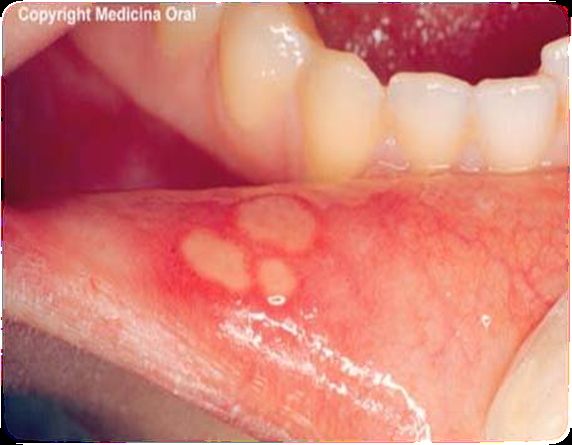
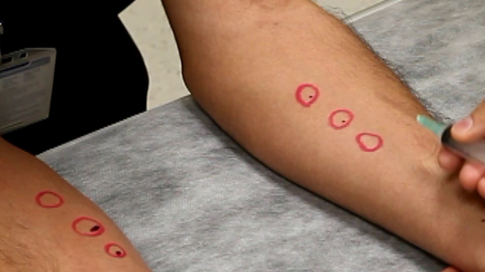
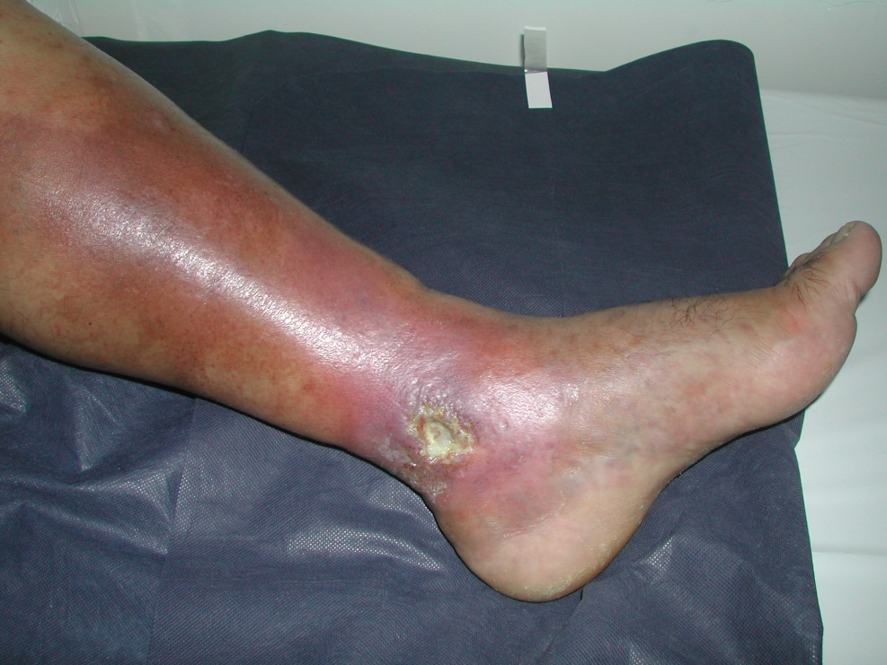
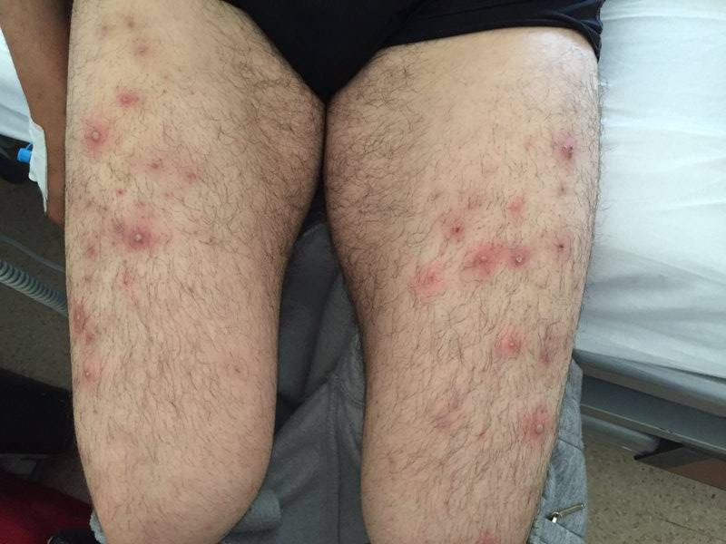

# BEHÇET HASTALIĞI

**Hazırlayan:** Prof. Dr. Gökhan Sargın
**Bölüm:** ADÜ Tıp Fakültesi - İç Hastalıkları Anabilim Dalı, Romatoloji Bilim Dalı

---

## İÇİNDEKİLER

1. [Tanım ve Tarihçe](#tanım-ve-tarihçe)
2. [Epidemiyoloji](#epidemiyoloji)
3. [Sınıflama](#sınıflama)
4. [Klinik Bulgular](#klinik-bulgular)
5. [Laboratuvar](#laboratuvar)
6. [Tanı Kriterleri](#tanı-kriterleri)
7. [Ayırıcı Tanı](#ayırıcı-tanı)
8. [Tedavi](#tedavi)
9. [Kaynaklar](#kaynaklar)

---

## TANIM VE TARİHÇE

* **Prof. Dr. Hulusi Behçet** tarafından **1937** yılında tanımlanmıştır
* **Üçlü semptom kompleksi:**
  - Rekürren aftöz stomatit
  - Genital ülser
  - Hipopyonlu üveit
* Kronik, relaps ve remisyonlarla seyreden, multisistemik inflamatuar bir hastalıktır

---

## EPİDEMİYOLOJİ

* Genellikle **15-30 yaş** arasında başlar
  - Çocuklarda ve 50 yaş üstünde nadir
* **E/K oranı:** ~1.5 : 1
  - Erkeklerde ve gençlerde daha şiddetli seyir
* **Coğrafik dağılım:**
  - Kuzey yarım küre
  - **"İpek Yolu"** sınırındaki ülkelerde sık (Türkiye, İran, Japonya, Kore, Çin)
* **Prevalans:** 8-37 / 100.000

---

## SINIFLAMA

⭐ **Revised International Chapel Hill Consensus Conference** sınıflamasına göre Behçet hastalığı **değişken damar vasküliti** (variable vessel vasculitis) grubunda yer alır.

* Hem küçük hem büyük damarları tutabilir
* Arter ve ven tutulumu birlikte görülebilir

---

## KLİNİK BULGULAR

### Tekrarlayan Oral Aft (%97-100)

* Ağız içinin her yerinde, **multipl** olarak görülür
* Üç tipi vardır:
  - **Minör aft:** En sık görülen tip, <1 cm, 1-2 haftada iyileşir
  - **Majör aft:** >1 cm, derin, skatris bırakabilir
  - **Herpetiform aft:** Çok sayıda, küçük, kümelenmiş
* ⚠️ Ağrısı yaşam kalitesini ciddi şekilde etkiler
* **Tanı için zorunlu kriter:** 12 aylık sürede en az 3 kez tekrarlamalı

---

### Tekrarlayan Genital Ülserler (%80-90)

* **Erkeklerde:** Skrotum
* **Kadınlarda:** Vajen dudakları (labium)
* Ağrılıdır
* ⭐ **Skatris (skar) bırakarak iyileşir** - oral afttan ayırt edici özellik

---

### Göz Bulguları (%50)

* **Hipopyonlu iridosiklit** - en karakteristik bulgu
* Retinal eksuda ve hemoraji
* Papil ödemi
* Ven trombozu
* Optik atrofi
* Sekonder glokom
* Katarakt
* ⚠️ **%10-20 vakada körlük** gelişebilir

---

### Damar Tutulumu

**Ven tutulumu:**
* Tromboflebit
* Derin ven trombozu (DVT)
* Pulmoner emboli nadirdir

**Arter tutulumu:**
* Geç dönemde görülür
* Anevrizma veya tromboz
* ⭐ **En sık pulmoner arter anevrizması**

---

### SSS Tutulumu

**Parankimal tutulum (%80):**
* Piramido-serebellar belirtiler
* En sık **beyin sapı** tutulur

**Dural sinüs trombozu (%20):**
* Baş ağrısı, papilödem
* Prognoz parankimal tutuluma göre daha iyi

---

### GİS Bulguları (%25)

* Karın ağrısı, iştahsızlık ve bulantı
* Kanlı-kansız ishal
* Perforasyon riski
* En sık **ileoçekal bölgede** ülserasyon
  - ❗ Crohn hastalığı ile ayırıcı tanı önemli

---

### Artrit (%40)

* Genellikle non-eroziv, oligoartiküler artrit
* Alt ekstremite eklemleri daha sık tutulur

---

### Paterji Testi

* Deri aşırı duyarlılığını gösterir
* Ön kol iç yüzüne steril iğne ile batırılır
* **24-48 saat** sonra doktor tarafından değerlendirilir
* Papül veya püstül oluşumu pozitif kabul edilir

---

### Deri Lezyonları

---

## LABORATUVAR

* **Spesifik laboratuvar bulgusu yoktur**
* ESH, CRP yükselebilir
* Anemi görülebilir
* Otoantikorlar genellikle **negatif**
* ⭐ **HLA-B5 (B51):** %80 pozitif (normal popülasyonda %30)

---

## TANI KRİTERLERİ

### Uluslararası Çalışma Grubu Behçet Hastalığı Tanı Kriterleri

| Kriter | Tanım |
|---|---|
| **Tekrarlayan oral ülserler** (zorunlu) | Doktor veya hasta tarafından gözlenen, 12 aylık süre boyunca en az 3 kez tekrarlayan minör, majör veya herpetiform aftlar |
| Tekrarlayan genital ülserler | Doktor veya hasta tarafından gözlenen aftöz ülserasyon veya skatris |
| Göz lezyonları | Anterior üveit, posterior üveit veya biyomikroskopik muayenede vitreusta hücre; veya doktorun saptadığı retinal vaskülit |
| Deri lezyonları | Eritema nodozum, psödofolikülit veya papülopüstüler lezyonlar, veya steroid tedavisi almayan puberte sonrası hastalarda akneiform nodüller |
| Pozitif paterji testi | 24-48. saatte doktor tarafından testin (+) yorumlanması |

**⚠️ ÖNEMLİ:**

* Tanı için **tekrarlayan oral ülser (zorunlu)** + en az **2 ek kriter** gereklidir

---

## AYIRICI TANI

* Rekürren aftöz stomatit
* Crohn hastalığı (özellikle GİS tutulumunda)
* Ülseratif kolit
* Herpes simpleks enfeksiyonu
* SLE ve diğer vaskülitler
* Reaktif artrit (Reiter sendromu)

---

## TEDAVİ

* Tedavi organ tutulumuna göre bireyselleştirilir
* **Mukokütanöz tutulum:** Kolşisin, topikal kortikosteroidler, azatiyoprin
* **Göz tutulumu:** Azatiyoprin, siklosporin, anti-TNF ajanlar (infliksimab, adalimumab)
* **Vasküler tutulum:** Kortikosteroidler, immünosupresifler, antikoagülasyon
* **SSS tutulumu:** Yüksek doz kortikosteroid, azatiyoprin, anti-TNF ajanlar
* **Artrit:** NSAİİ, kolşisin

---

## KAYNAKLAR

* Bijlsma JWJ (editor). EULAR Textbook on Rheumatic Diseases, Third Edition. BMJ Publishing Group, 2018.
* Jameson JL, Fauci AS, Kasper DL, et al. Harrison's Principles of Internal Medicine, 20th Edition. McGraw-Hill Professional, 2018.
* Yazici H, Seyahi E, Hatemi G, Yazici Y. Behçet syndrome: a contemporary view. Nat Rev Rheumatol. 2018;14:107-119.
* Davatchi F. Behçet's disease. Int J Rheum Dis. 2018;21:2057-2058.
