# GUT HASTALIĞI

**Hazırlayan:** Dr. Öğr. Üyesi Reyhan Köse Çobanoğlu
**Bölüm:** Romatoloji

---

## İÇİNDEKİLER

1. [Tanım ve Genel Bakış](#tanım-ve-genel-bakış)
2. [Eklemde Görülen Kristaller](#eklemde-görülen-kristaller)
3. [Pürin Metabolizması](#pürin-metabolizması)
4. [Ürik Asit Düzeyleri ve Hastalık Evrimi](#ürik-asit-düzeyleri-ve-hastalık-evrimi)
5. [Hiperürisemi Etyolojisi](#hiperürisemi-etyolojisi)
6. [Epidemiyoloji](#epidemiyoloji)
7. [Gut Sıklığını Artıran Nedenler](#gut-sıklığını-artıran-nedenler)
8. [Gut Artriti Oluşum Mekanizması](#gut-artriti-oluşum-mekanizması)
9. [İnflamatuar Yanıt](#inflamatuar-yanıt)
10. [Asemptomatik Hiperürisemi](#asemptomatik-hiperürisemi)
11. [Ürik Asite Bağlı Patolojiler](#ürik-asite-bağlı-patolojiler)
12. [Gut Hastalığının Klinik Evreleri](#gut-hastalığının-klinik-evreleri)
13. [Kristal Tanımlama -- Mikroskopi](#kristal-tanımlama----mikroskopi)
14. [Tedavi](#tedavi)
15. [Yaşlılarda Gut Hastalığı](#yaşlılarda-gut-hastalığı)
16. [Ayırıcı Tanı -- Gut vs RA vs CPPD](#ayırıcı-tanı----gut-vs-ra-vs-cppd)
17. [Klinik Vaka Örnekleri](#klinik-vaka-örnekleri)
18. [Özet ve Akılda Kalıcı Bilgiler](#özet-ve-akılda-kalıcı-bilgiler)
19. [Test Soruları](#test-soruları)
20. [Kısaltmalar](#kısaltmalar)

---

## TANIM VE GENEL BAKIŞ

> **Gut:** Monosodyum ürat (MSU) kristallerinin dokuda birikerek yol açtığı inflamatuar cevap ile karakterize metabolik bir hastalıktır.

**Klinik bulgular (beşlisi):**

1. **Hiperürisemi**
2. **Tekrarlayan akut artrit atakları**
3. **Tofüs** (MSU kristal birikimi)
4. **Gut nefropatisi**
5. **Ürik asit taşı** (ürolitiyaz)

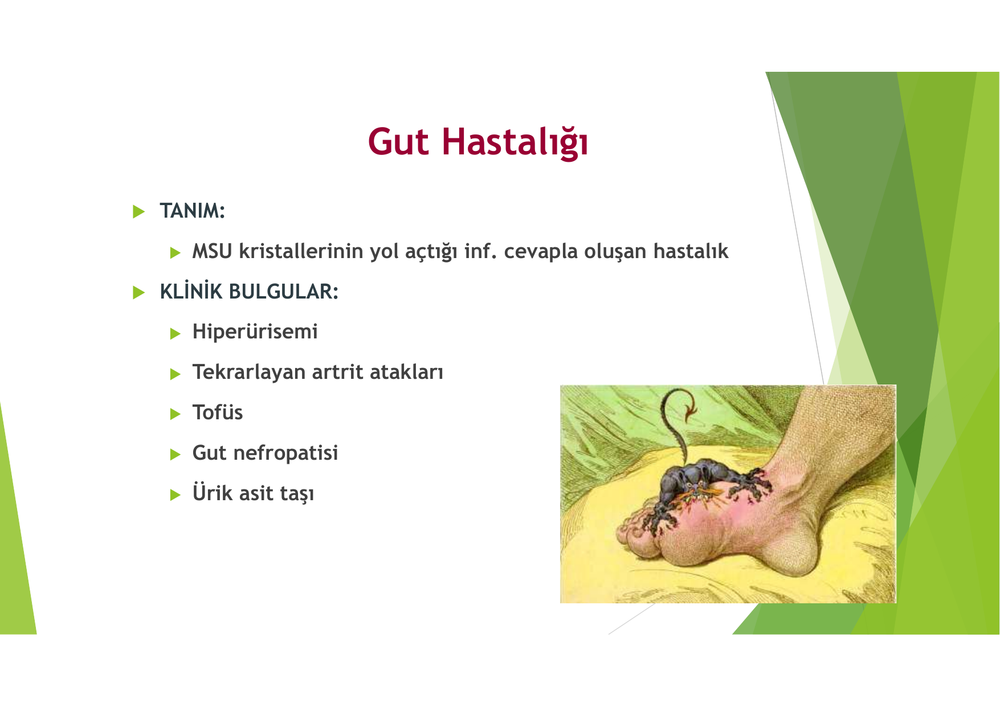

> 💡 **Akılda kalıcı:** Gut, yalnızca bir "eklem ağrısı" değildir; **metabolik, sistemik ve renal** bir hastalıktır. Ürik asit düzeyi yüksek her bireyde gut gelişmez, ancak gut olan her bireyde kristalinojenik bir ortam mevcuttur.

> 💡 **Etimoloji -- "Podagra":** Yunanca **podos** (ayak) + **agra** (tuzak, yakalama) → "ayağın tuzağa düşmesi". Antik Yunan'dan beri 1. MTF'de gece ağrıyan tabloya verilen isim; hastanın ayağının bir kapanla kıstırılmış gibi kıvrandığı halini anlatır.

> 💡 **Mnemonik -- Klinik beşlinin "5H" hatırlatıcısı:** **H**iperürisemi, **H**ücum (akut atak), **H**arabiyet (nefropati), **H**areket bozan **tofüs**, **H**asta **taş** (ürolitiyaz). Gut sadece eklem değil, **beş yüzlü bir hastalıktır.**

---

## EKLEMDE GÖRÜLEN KRİSTALLER

Eklem hastalıklarına yol açan başlıca kristaller:

| Kısaltma | Kristal | Temel Hastalık |
|---|---|---|
| **MSU** | Monosodyum ürat | **Gut hastalığı** |
| **CPPD** | Kalsiyum pirofosfat dihidrat | Psödogut (kondrokalsinoz) |
| **BCP** | Basic (bazik) kalsiyum fosfat | Kalsifik tendinit / Milwaukee omzu |
| **HA** | Hidroksi apatit (BCP alt grubu) | Periartiküler kalsifikasyonlar |
| -- | Trikalsiyum fosfat (BCP alt grubu) | -- |
| -- | Oktakalsiyum fosfat (BCP alt grubu) | -- |
| -- | Kalsiyum oksalat | Diyaliz hastalarında artrit |

> 💡 **Mnemonik -- "MSU-CPPD-BCP":** Eklemde kristal görürseniz aklınıza ilk gelmesi gereken üçlüdür. BCP kendi içinde HA, trikalsiyum fosfat ve oktakalsiyum fosfatı barındırır.

---

## PÜRİN METABOLİZMASI

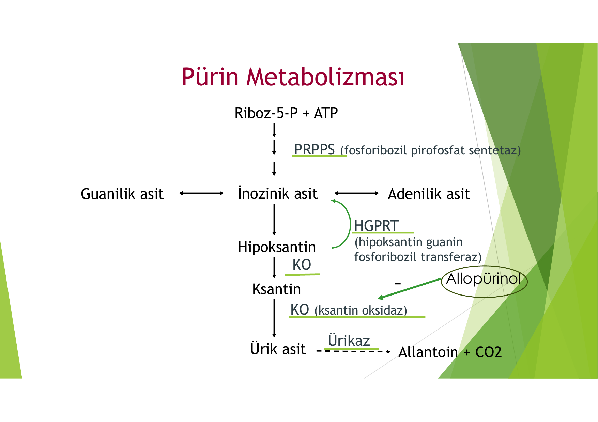

**Yolak özeti:**

```
Riboz-5-P + ATP
        │
        ▼  PRPPS (fosforibozil pirofosfat sentetaz)
        
     İnozinik asit ──→ Adenilik asit
    ▲     │
    │     ▼
Guanilik  Hipoksantin
 asit     │
          ▼   KO (ksantin oksidaz)
        Ksantin
          │
          ▼   KO (ksantin oksidaz)   ← ALLOPÜRİNOL (inhibe eder)
        Ürik asit ----Ürikaz----→ Allantoin + CO₂
```

**Anahtar enzimler:**

| Enzim | Fonksiyon | Klinik Önem |
|---|---|---|
| **PRPPS** | Pürin sentezinin ilk basamağı | Hiperaktivitesi → aşırı pürin sentezi → hiperürisemi |
| **HGPRT** | Hipoksantin/guanini geri dönüştürür (salvage yolu) | Eksikliği **Lesch-Nyhan sendromu** (X'e bağlı, ağır hiperürisemi, otomutilasyon) |
| **Ksantin oksidaz (KO)** | Hipoksantin → Ksantin → Ürik asit | **Allopürinol**'ün hedefi |
| **Ürikaz** | Ürik asit → Allantoin | ⚠️ **İnsanda yoktur!** (evrim sırasında kaybedilmiştir) -- bu nedenle insanda ÜA son üründür |

> ⭐ **Kritik nokta:** İnsanda ürikaz bulunmadığı için ürik asit, diğer memelilerin aksine daha ileri yıkıma uğratılamaz; allopürinol KO'yi bloke ederek zincirin bir üst basamağı olan **ksantin ve hipoksantin** seviyesinde kalmasını sağlar (bu metabolitler daha iyi çözünür, dokuda birikmez).

> 💡 **Mnemonik -- "P-H-K-K-A":** **P**RPPS → **H**GPRT (kurtarma) → **K**santin → **K**O → **A**llantoin (ama insanda allantoin oluşmaz, dur!)

---

## ÜRİK ASİT DÜZEYLERİ VE HASTALIK EVRİMİ

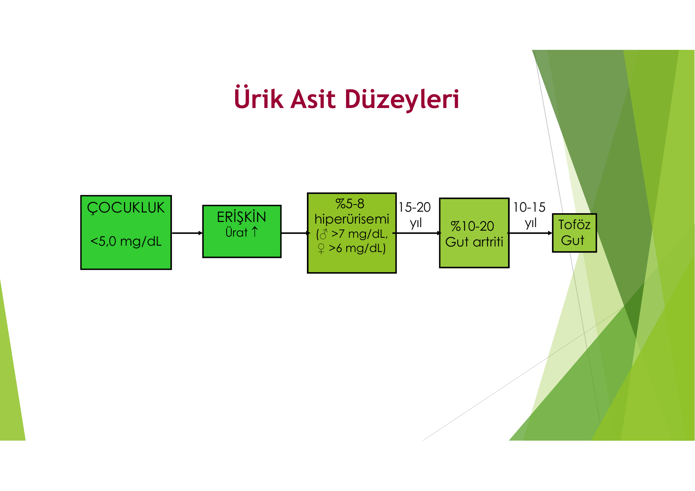

**Fizyolojik seyir (şema):**

```
ÇOCUKLUK           ERİŞKİN         HİPERÜRİSEMİ         GUT ARTRİTİ        TOFÖZ GUT
<5,0 mg/dL   ──→   Ürat ↑    ──→  %5-8 hasta     ──→  %10-20           ──→  Kronik
                                  (♂>7, ♀>6)      15-20 yıl             10-15 yıl
                                   mg/dL
```

> **Hiperürisemi tanımı:**
> - Erkek: ÜA > **7,0 mg/dL**
> - Kadın: ÜA > **6,0 mg/dL**

**Serum ürik asit düzeyine göre yıllık gut insidansı:**

| Serum ÜA (mg/dL) | Yıllık gut gelişme riski |
|---|---|
| **≥ 9,0** | **%4,9** |
| 7,0 -- 8,9 | %0,5 |
| < 7,0 | %0,1 |

> 💡 **Akılda kalıcı:** ÜA ≥ 9 mg/dL → risk katlanır (~10× ile 50× arası). Hiperürisemi ne kadar yüksek ve ne kadar uzunsa, gut olasılığı o kadar yüksektir.

---

## HİPERÜRİSEMİ ETYOLOJİSİ

Hiperürisemi mekanistik olarak **üç ana yola** ayrılır. Karşılaştırmalı özet:

| Mekanizma | Oran | Alt gruplar |
|---|---|---|
| **Ürik asit yapım fazlalığı** | **%10** | Primer: İdiyopatik, **HGPRT eksikliği** (Lesch-Nyhan), **PRPP sentetaz hiperaktifliği** <br> Sekonder: Diyet |
| **Dokularda yıkım artışı** (yapıma dahil) | -- | Hücre yıkımı (hematolojik hastalıklar, tümör lizisi) <br> Artmış ATP yıkımı <br> Glikojen depo hastalıkları <br> Fruktoz alımı <br> Doku hipoperfüzyonu <br> Ağır egzersiz <br> Alkol |
| **Ürik asit atılım azlığı** | **%90** | Primer: İdiyopatik <br> Sekonder: <br>-- Azalmış renal fonksiyon <br>-- Tübüler ürat sekresyon inhibisyonu (**laktik asidoz** -- alkol dahil) <br>-- Artmış tübüler ürat reabsorpsiyonu (**dehidratasyon, diüretikler**) <br>-- Mekanizması tam bilinmeyen: HT, hiperparatiroidi, **siklosporin, pirazinamid, etambutol, düşük doz aspirin**, kurşun zehirlenmesi |

> ⭐ **Kritik oran:** Hiperürisemik hastaların **~%90'ı** ürik asidi **az atıyordur** (underexcretor); yalnızca **%10'u** aşırı üretimden (overproducer) kaynaklıdır. Bu nedenle tedavide ürikozürik (atılımı artıran) ve KO inhibitörü (yapımı azaltan) ayrımı önemlidir.

> 💡 **Mnemonik -- "Aspirin, Diüretik, Siklosporin, Pirazinamid, Etambutol" → "ADSPE":** Üratı yükselten en sık ilaçlar. Kurşun ve alkolü de ekleyin.

> 💡 **Mnemonik -- Gut tetikleyicilerinin "4P + 2A"sı:** **P**ürin (et, sakatat), **P**ivo (bira -- Slavca "bira"), **P**asta/**Fruktoz** (şeker), **P**iyade (travma/yürüyüş), **A**lkol (sert), **A**spirin/diüretik. Akut atak öncesi bu 6 tetikleyiciyi sorgula.

### Yapım Fazlalığı vs Atılım Azlığı -- Ayrım

| Ayırıcı Özellik | **Yapım Fazlalığı (overproducer)** %10 | **Atılım Azlığı (underexcretor)** %90 |
|---|---|---|
| **İdrar ÜA atılımı** (24 saat) | **> 800--1100 mg/gün** | < 600 mg/gün |
| **İdrar ÜA/kreatinin oranı** | > 1,0 | < 0,7 |
| **Fraksiyonel ÜA atılımı (FEUA)** | Normal veya ↑ | **↓ (< %5)** |
| **Tipik profil** | Genç, enzim defekti, hematolojik yıkım, tümör lizisi | Orta-yaşlı erkek, KBY, diüretik, alkol, dehidratasyon |
| **Ek bulgular** | Ürolitiyaz riski ↑↑ | HT, obezite, metabolik sendrom sık |
| **Tedavi tercihi** | **Allopürinol / Febuksostat** (KO inh) | Allopürinol veya **ürikozürik (probenesid)** |
| **Ürikozürik uygun mu?** | ❌ **Hayır** (taş riski artar) | ✅ Evet (taş öyküsü yoksa) |

> ⭐ **Sınav pearl:** 24 saatlik idrar ÜA ayırımı için kullanılan klasik eşik: **> 800 mg/gün → overproducer.** > 1100 mg/gün ise **asemptomatik hiperürisemide bile** ilaç tedavisi gerektirir (taş riski nedeniyle).

**Özel durum -- Lesch-Nyhan sendromu:**

- X'e bağlı resesif, **HGPRT eksikliği**
- Çocuklukta hiperürisemi, gut, ürolitiyaz
- SSS bulguları: mental retardasyon, koreoatetoz, **otomutilasyon (dudak/parmak ısırma)**
- **30 yaşından erken gut atağı varsa → enzim defekti araştırılmalı!**

---

## EPİDEMİYOLOJİ

| Parametre | Değer |
|---|---|
| Erkek/kadın oranı (≤65 yaş) | **4/1** |
| Erkek/kadın oranı (>65 yaş) | **3/1** (yaşla cinsiyet farkı azalır) |
| Hiperürisemi prevalansı | %2,3 -- 17,6 |
| Gut insidansı | 0,22 -- 0,35 / 1000 kişi / yıl |
| Gut prevalansı | 1,6 -- 13,6 / 1000 kişi |
| En sık yaş | Erkek: 40--50, Kadın: >60 (postmenopozal) |

> 💡 **Neden kadınlarda geç?** Östrojen ürikozürik etkiyle ürik asidi düşürür. Menopozla birlikte kadınların ürik asit seviyesi erkeklerinkine yaklaşır; kadınlarda ilk gut atağı tipik olarak **>50 yaş**tadır.

---

## GUT SIKLIĞINI ARTIRAN NEDENLER

Son yıllarda gut prevalansının artmasının nedenleri:

1. **Uzun yaşam** (yaşlı nüfusun artması)
2. **Hipertansiyon prevalansında artış**
3. **Diyet değişiklikleri** (batılı tip, fruktoz, et)
4. **Obezite ve metabolik sendromda artış**
5. **Kronik böbrek yetmezliği (KBY) sıklığının artması**
6. **Kalp yetmezliği** hastalarının daha uzun yaşaması
7. **Diüretik ve düşük doz aspirin** kullanımında artış
8. **Kanserli hastalar** (tümör lizisi, ileri yaş)
9. **Östrojen kullanımında azalma** (osteoporoz tedavisindeki değişim → postmenopozal kadınlarda koruyucu etki azalır)

---

## GUT ARTRİTİ OLUŞUM MEKANİZMASI

> **Temel kural:** Sinoviyal sıvıda (SS) ürat süpersatürasyonu presipitasyon için **gereklidir ama yeterli değildir.**

**Eklemde kristal presipitasyonunu kolaylaştıran faktörler:**

| Faktör | Açıklama |
|---|---|
| Eklem sıcaklığının düşmesi | Periferik soğuk eklemler (özellikle **1. MTF, ayak bilek**) -- MSU soğukta az çözünür |
| SS'da pH'nin düşmesi | Asidoz → kristal çökmesi |
| SS'da proteoglikan, gammaglobülin, tip I kollajen | Kristal büyümesini kolaylaştırır |
| **Travma** | Lokal hasar → kristal salınımı ve depolanma |
| Yaşlılık | Dejeneratif eklem değişiklikleri |
| ÜA'in proteinlere bağlanmasının azalması | Serbest ürat artar |
| Katyon konsantrasyonu | Na⁺ varlığında MSU oluşumu artar |

> 💡 **Neden 1. metatarsofalangeal eklem (podagra)?** En perifer, en soğuk, günlük yükün en çok bindiği ve mikrotravma riskinin en yüksek olduğu eklemdir → MSU presipitasyonu için ideal mikroçevre.

---

## İNFLAMATUAR YANIT

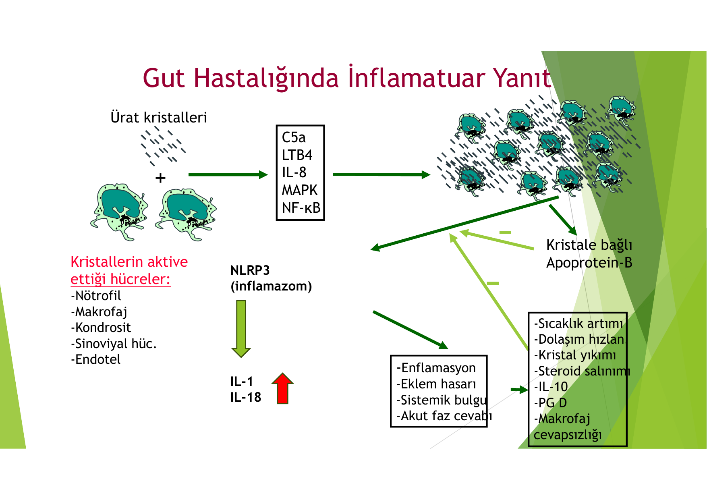

**Olay zinciri:**

```
           MSU kristalleri
                 │
      ┌──────────┼──────────┐
      ▼          ▼          ▼
   C5a ↑       LTB4 ↑     IL-8 ↑       → Nötrofil kemotaksisi
   MAPK aktivasyonu, NF-κB aktivasyonu
                 │
                 ▼
      NLRP3 inflamazomu aktivasyonu
                 │
                 ▼
         IL-1β ↑↑, IL-18 ↑↑
                 │
                 ▼
  Enflamasyon, eklem hasarı, sistemik bulgu, akut faz cevabı
```

**Kristallerin aktive ettiği hücreler:**

- Nötrofil
- Makrofaj
- Kondrosit
- Sinoviyal hücreler
- Endotel

**Atağı sonlandıran (oto-limitleyen) mekanizmalar:**

- Sıcaklık artımı, dolaşım hızlanması
- Kristal yıkımı
- **Steroid salınımı** (endojen)
- **IL-10** (anti-inflamatuar sitokin)
- **PG-D₂** (prostaglandin D₂)
- Makrofajların kristal fagositozu
- Apolipoprotein-B'nin kristale bağlanması (MSU'yu inaktive eder)

> ⭐ **Kritik:** Gut artritinin temel inflamatuar motoru **IL-1β**'dır. Bu nedenle dirençli hastalarda **IL-1 antagonistleri (anakinra, kanakinumab)** kullanılabilir. NLRP3 inflamazomu, gutu romatolojik hastalıklar arasındaki "klasik otoinflamatuar" grupla akraba yapar.

> 💡 **Mnemonik -- "3N klasiği":** **N**LRP3 inflamazomu → **N**ötrofil → **N**ekroze eklem. IL-1'siz gut olmaz.

---

## ASEMPTOMATİK HİPERÜRİSEMİ

> **Tanım:** Gut artriti veya ürolitiyaz olmaksızın serum ürik asit düzeyinin yüksek olması.

**Özellikler:**

- Yaşla birlikte hiperürisemi sıklığı artar
- **Kalıtımın hiperürisemiye etkisi ~%40** (aile öyküsü önemli)
- Kadınlarda **östrojen etkisi** nedeniyle menopoz öncesi nadirdir
- Hiperürisemik bireylerin yalnızca küçük bir kısmında gut gelişir

**Tedavi yaklaşımı:** Rutin olarak ilaçla tedavi **önerilmez**. (Ayrıntı için "Tedavi" bölümünde "Asemptomatik hiperürisemi tedavisi" başlığına bakınız.)

---

## ÜRİK ASİTE BAĞLI PATOLOJİLER

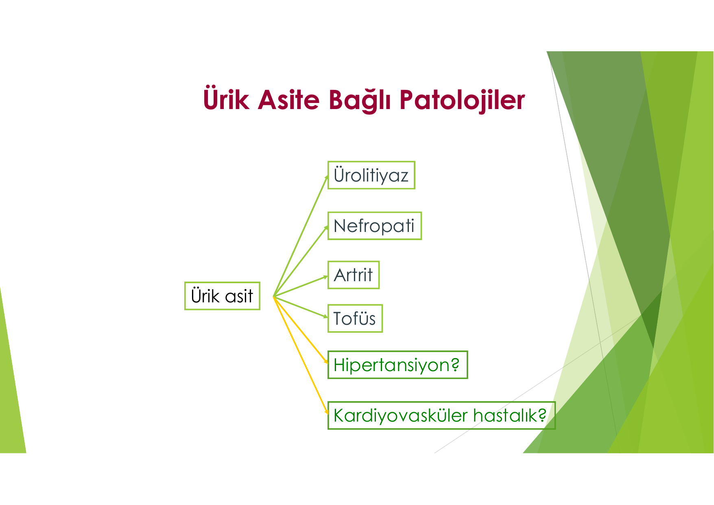

**Kanıtlanmış ilişkiler (kesin):**

| Patoloji | Mekanizma |
|---|---|
| **Ürolitiyaz** | Ürik asit taşı (asid idrarda çöker), ayrıca Ca-oksalat taşı zeminini oluşturur |
| **Nefropati** | Akut ürat nefropatisi (tümör lizisi) veya kronik intersitisyel nefrit |
| **Artrit** | Akut ve kronik gut artriti |
| **Tofüs** | Yumuşak dokuda MSU birikimi |

**Tartışmalı ilişkiler (bağımsız risk faktörü olup olmadığı net değil):**

| Patoloji | Not |
|---|---|
| Hipertansiyon? | Epidemiyolojik ilişki var, nedensellik tartışmalı |
| Kardiyovasküler hastalık? | Metabolik sendromla iç içe; bağımsız etki araştırılıyor |

---

## GUT HASTALIĞININ KLİNİK EVRELERİ

Gut dört klinik evrede incelenir:

```
     Asemptomatik             Akut gut         İnterkritik          Kronik tofoz
     hiperürisemi    ────→    artriti    ────→    dönem    ────→    gut
```

### Tofüs Evrimi -- Mikroskoptan Deformiteye

```
 Asemptomatik       Kristal mikro-      SS'a kristal       SS'a nötrofil     Submikroskopik
 hiperürisemi  ──→  birikimi (SS,  ──→  dökülmesi     ──→  göçü          ──→ tofüs (tophi)
 (ÜA ↑, kristal    sinovya, kartilaj)   (atağı        (IL-1β ↑↑,             Sinovya ve 
  yok)                                   tetikler)     NLRP3)                 kartilajda
                                                                              MSU kümeleri
                       │
                       ▼
   Makroskopik tofüs  ◄──  Kronik inflamasyon  ◄──  Tekrarlayan ataklar
   - Kulak heliksi                (10-15 yıl)         (interkritik dönem
   - Dirsek bursası                                    kristal birikimi
   - MTF, DİF eklem                                    devam eder!)
   - Aşil tendonu
                       │
                       ▼
   Kemik erozyonu  ──→  "Punched-out" lezyon  ──→  Deformite + fonksiyon kaybı
```

> 💡 **Akılda kalıcı:** İnterkritik dönem "sessiz" ama **ASLA boş değildir**. Her atak aralığı yeni kristal tortusu demektir. Tofüs, bunun **makroskopik buzdağı ucu**dur.

---

### 1. Akut Gut Artriti

**Temel özellikler:**

- Birinci atak: **erkekte >30 yaş, kadında >50 yaş**
- **⚠️ 30 yaşından önce gut atağı → enzim defekti düşün!** (HGPRT eksikliği, PRPP sentetaz hiperaktifliği)
- Birinci atak **>%80 tek eklemde** ve genellikle **1. metatarsofalangeal (MTF) eklemde → "podagra"**
- Diğer sık tutulan eklemler: ayak bilekleri, topuk, diz, el bilekleri, parmaklar, dirsek

**Atağın klasik klinik tablosu:**

- Genellikle **sabah / gece-sabah** başlar
- Eklem kızarık, sıcak, şiş, **çok duyarlı** ("çarşaf bile değse ağrır" -- exquisite tenderness)
- Tedavisiz 1--2 günde hafiflemeye başlar, genellikle **7--10 gün**, en geç **3 hafta** içinde geçer
- Atak sırasında ÜA düzeyi normal bile olabilir (düşer, eklemde biriktiği için)

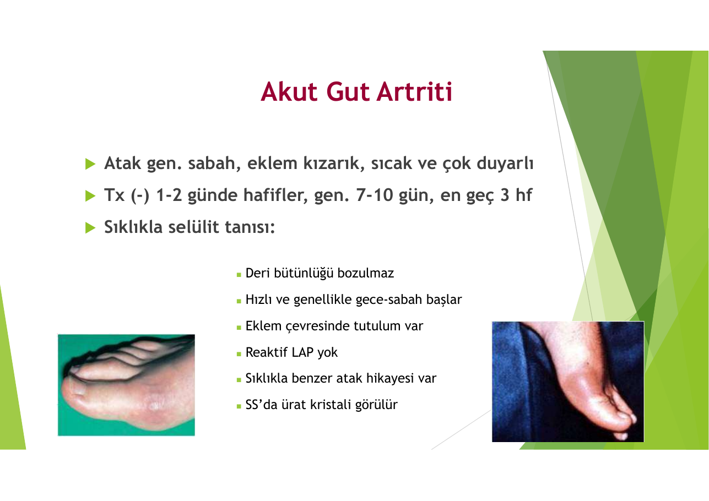

**Selülitle ayırıcı tanı (gut hastaları sıklıkla selülit tanısı ile başvurur!):**

| Bulgu | Gut | Selülit |
|---|---|---|
| Deri bütünlüğü bozulması | ❌ Yok | ✅ Sık |
| Başlama zamanı | **Hızlı, gece-sabah** | Daha sinsi |
| Tutulum sınırı | Eklem **çevresinde** | Yaygın cilt |
| Reaktif LAP | ❌ Yok | ✅ Olabilir |
| Benzer atak hikayesi | ✅ Sıklıkla var | ❌ Yok |
| SS'da kristal | ✅ MSU kristali görülür | ❌ Yok |

> 💡 **Kritik nokta:** "Podagralı ve selülit tanısıyla antibiyotik başlanmış" hasta çok klasik bir sınav sorusudur. Eklem çevresinde başlayıp eklemi tutan, deri bütünlüğü korunmuş, sabaha karşı başlayan akut inflamasyon → **gut artritini düşün.**

---

### 2. İnterkritik Gut

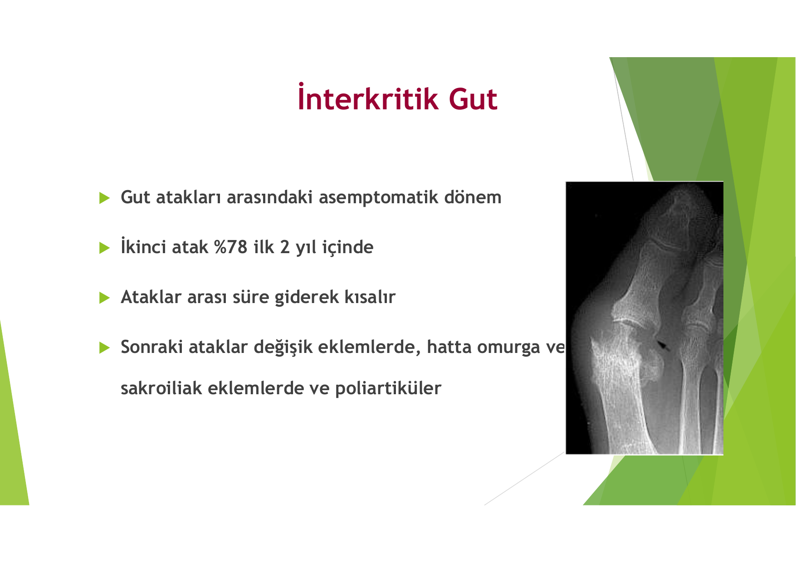

- Ataklar arasındaki **asemptomatik dönem**
- ⭐ **İkinci atak %78 ilk 2 yıl içinde** gelir
- Ataklar arası süre **giderek kısalır**
- Sonraki ataklar **değişik eklemlerde**, hatta **omurga ve sakroiliak eklemlerde**, ve **poliartiküler** olabilir
- Dönem sessiz de olsa **kristal birikimi devam eder** (subklinik)

> ⭐ **Sınav ipucu:** "İlk ataktan sonra %78 hastada 2 yıl içinde ikinci atak olur" cümlesi akılda tutulmalıdır. Bu nedenle ikinci atak veya tofüs geldiğinde **ÜA düşürücü tedavi (ULT)** başlanmalıdır.

---

### 3. Poliartiküler Gut Artriti

**Başlangıçta nadir, tekrarlayan ataklarla artar.**

**Poliartiküler formun sık görüldüğü hasta grupları:**

- **Miyelo- ve lenfoproliferatif hastalıklara sekonder gut** (hücre yıkımı fazla)
- **Siklosporin** alan hastalar (transplant alıcıları)
- **Diüretik kullanan osteoartritli yaşlı** hastalar

**Özellikler:**

- **Gezici poliartiküler tutulum** olabilir (RA'yı taklit eder)
- Tedavi edilmeyenlerde **10-15 yıl içinde kronik tofoz gut** gelişir

---

### 4. Kronik Tofoz Gut

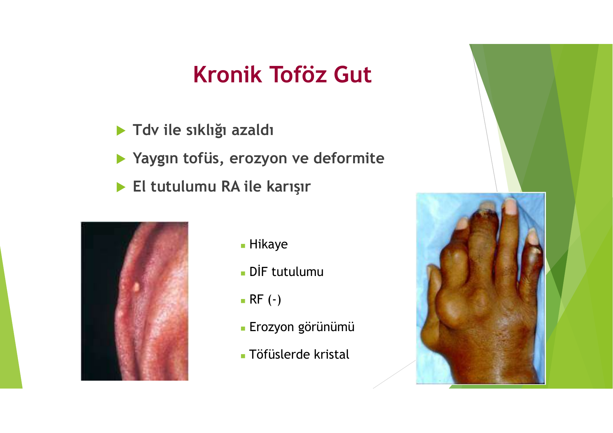

- Tedavinin yaygınlaşmasıyla **sıklığı azaldı**
- Yaygın **tofüs**, **erozyon** ve **deformite**
- **El tutulumu RA (Romatoid Artrit) ile karışır**

#### Kronik Tofoz Gut vs Romatoid Artrit -- Ayrım

| Özellik | Kronik Tofoz Gut | Romatoid Artrit |
|---|---|---|
| Hikaye | Tekrarlayan akut atak öyküsü | Sinsi, simetrik başlayan artrit |
| **DİF tutulumu** | ✅ **Olabilir** (osteoartrit zeminli tofüslerde sık) | ❌ Karakteristik olarak tutmaz |
| RF | ❌ (-) | ✅ (+) olabilir |
| Radyografi | **"Punched-out" (delinmiş) erozyonlar**, sklerotik kenar, tofüs gölgesi | Marjinal erozyon, osteopeni |
| Tofüs | ✅ Cilt altında sert kitleler (MSU) | ❌ Yok (romatoid nodül farklıdır) |
| Tofüslerde kristal | ✅ MSU gösterilir | ❌ |

> 💡 **Akılda kalıcı:** Gut → **DİF + erozyon + tofüs + akut atak hikayesi**. RA → **PIF/MKP + simetri + sabah sertliği + RF/anti-CCP**. İkisinin ortasında kaldığında **SS aspirasyonu + polarize mikroskop** belirleyicidir.

**Tofüs yerleşim yerleri:**

- Kulak helixi (klasik)
- Olekranon bursa, dirsek
- Aşil tendonu
- Parmak uçları, tırnak kenarı, DİF eklemler
- Bursa ve tendon kılıfları

---

## KRİSTAL TANIMLAMA -- MİKROSKOPİ

Gut tanısının **altın standardı**: SS veya tofüs aspirasyonunda **polarize ışık mikroskobunda MSU kristalinin gösterilmesi**.

### Polarize Işık Mikroskobu Prensibi

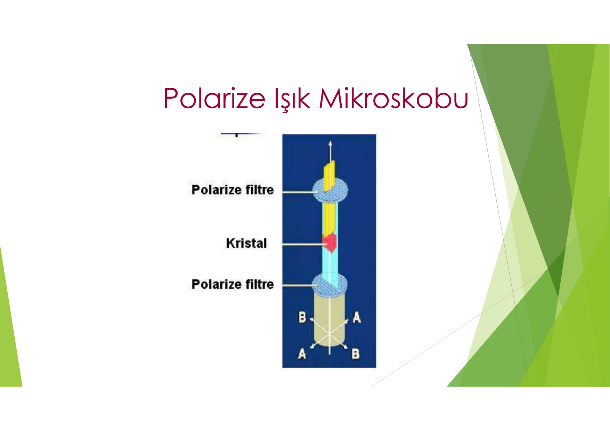

İki polarize filtre çapraz konumda; kristalin aradaki ışığı kırma özelliğine göre (**çift kırıcılık -- birefringence**) renk ve aks alır.

### MSU vs CPPD -- Temel Ayrım

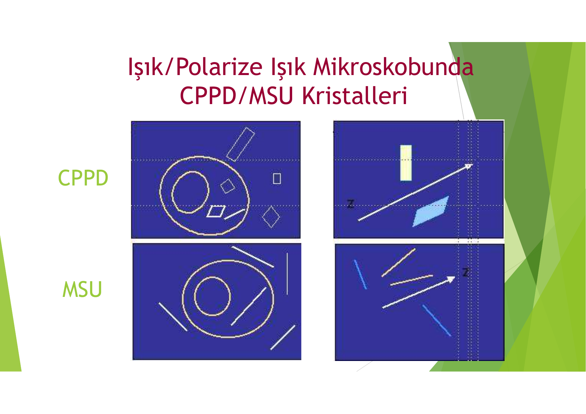

| Özellik | **MSU (Gut)** | **CPPD (Psödogut)** |
|---|---|---|
| Şekil | **İğne şeklinde**, uzun | **Rhomboid (baklava)** / kısa çubuk |
| Çift kırıcılık (birefringence) | **Kuvvetli negatif** | **Zayıf pozitif** |
| Kompansatörle (λ aksına) paralel rengi | **Sarı** | Mavi |
| Kompansatöre dik rengi | Mavi | Sarı |
| Tipik eklem | 1. MTF (podagra) | Diz (kondrokalsinoz) |
| Hastalık adı | Gut | Psödogut / CPPD hastalığı |

> 💡 **Mnemonik -- "Sarı paralel = Gut":** Kompansatör ekseni ile paralel uzanan kristal **sarı** görünüyorsa **MSU / gut**; kompansatör eksenine paralel uzanan kristal **mavi** görünüyorsa **CPPD / psödogut**. "Sarı = Urat" (U---Y, yellow).

> 💡 **Analoji -- "İğne mi, Baklava mı?":** MSU → **"örgü şişi"** gibi uzun, sivri, **kırılmaz** (kuvvetli negatif). CPPD → **"baklava dilimi"** gibi kısa, dörtgen, tatlı ama **cılız** refle verir (zayıf pozitif). Ağzına mideye inen "iğne"yi hayal et → **G**ut = **G**erçek acı = **G**üçlü **N**egatif; **P**södogut = **P**asta (baklava) = **P**ozitif ama **zayıf**.

> 💡 **Klinik ipucu -- "İntraselüler kristal = aktif atak":** Nötrofilin **içinde** MSU görürsen atak canlıdır (aktif fagositoz). Kristal **dışarıda**, serbest ise, interkritik/hafif inflamasyonu düşündürür. Atak sırasında aspirasyon her zaman mümkünse yapılmalıdır.

---

### MSU Kristalleri

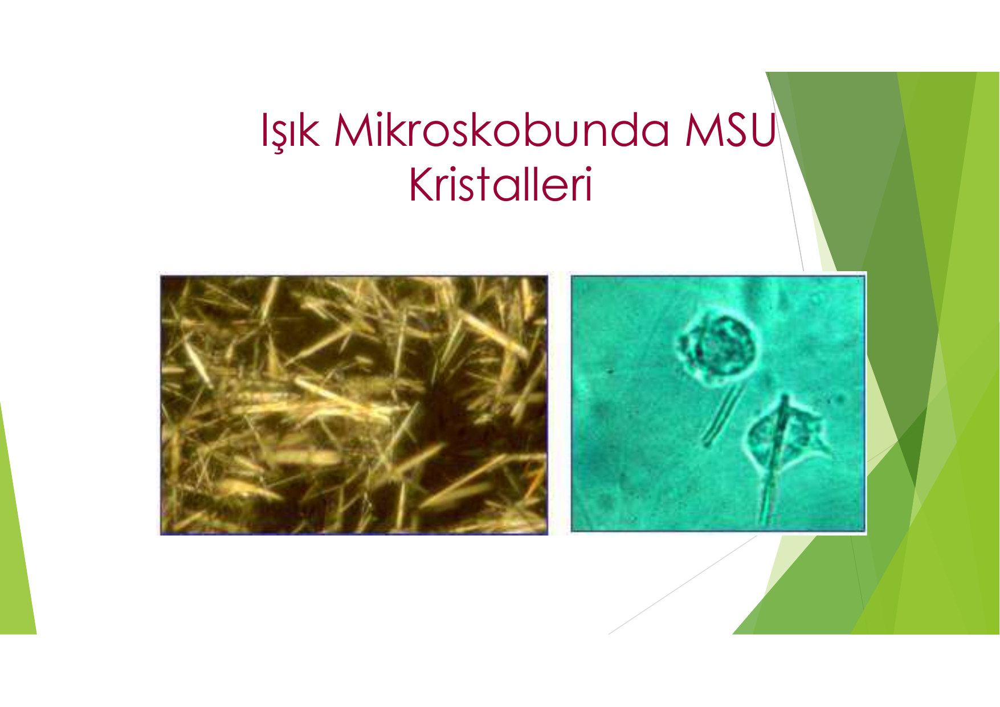

- **İğne (ince uzun) şekilli**, keskin uçlu
- Polarize ışıkta **kuvvetli negatif** çift kırıcılık
- Kompansatöre paralelken sarı, dike döndürüldüğünde mavi renk alır
- Genelde hücre **içinde (intraselüler)** görülmesi akut atağı destekler

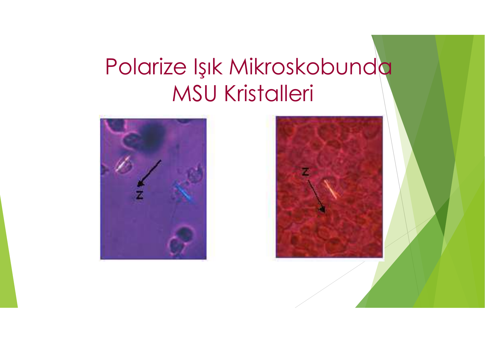

---

### CPPD Kristalleri

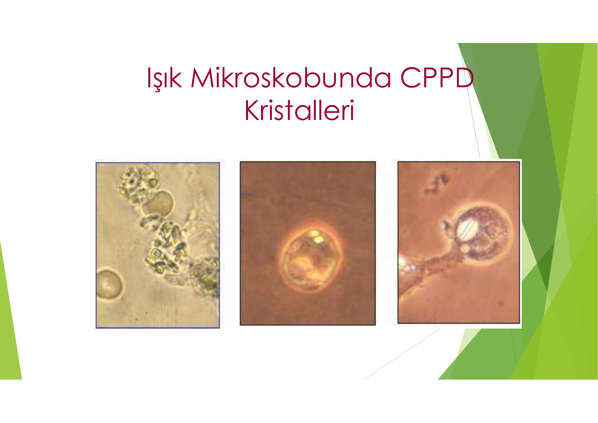

- **Rhomboid / baklava dilimi** şeklinde, kısa çubuk
- Polarize ışıkta **zayıf pozitif** çift kırıcılık
- **Kondrokalsinoz** (diz menisküsünde radyografik kalsifikasyon) ile birliktelik

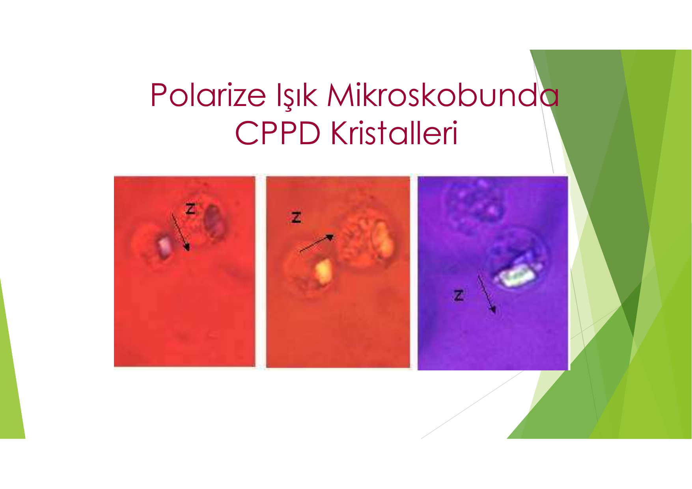

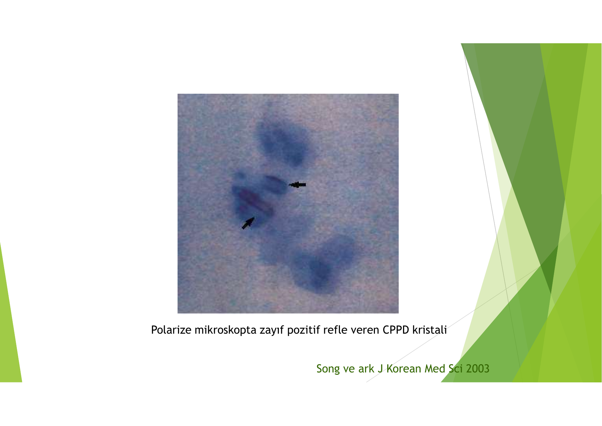

---

### Kalsiyum Oksalat Kristalleri

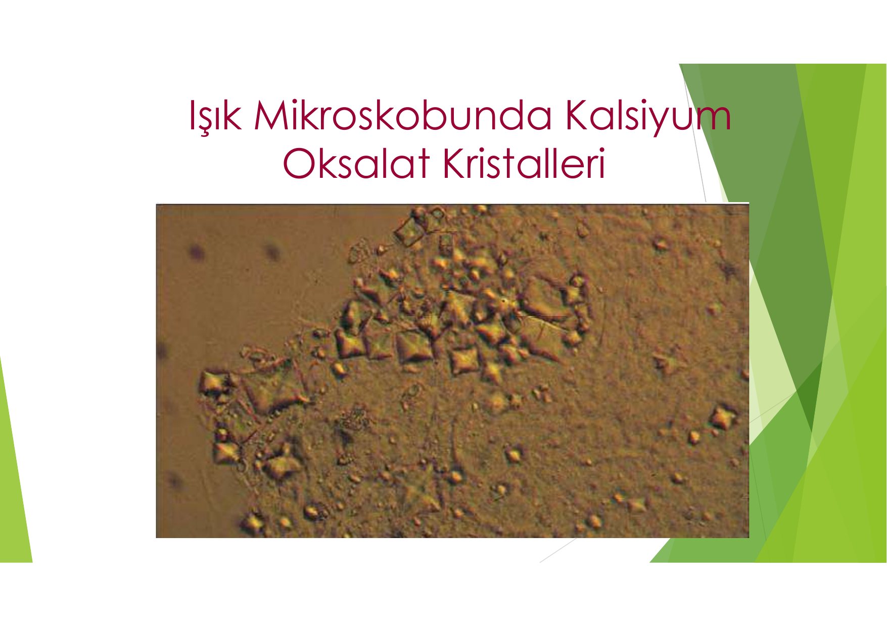

- **"Zarf" (envelope, bipiramidal)** görünümlü
- Özellikle **diyaliz hastalarında** eklem/yumuşak dokuda birikir
- Primer hiperokzalüride de görülür

---

## TEDAVİ

Gut tedavisi **beş eksen** üzerinde kurgulanır:

```
  ┌───────────────── GUT TEDAVİSİ ─────────────────┐
  │                                                 │
  1. Asemptomatik hiperürisemi    2. Akut atak      │
  3. İnterkritik -- profilaksi    4. Diyet/yaşam    │
  5. Komorbiditeler                                  │
  └─────────────────────────────────────────────────┘
```

---

### 1. Asemptomatik Hiperürisemi Tedavisi

**Rutin olarak ilaçla tedavi önerilmez.** Önce diyet ve tetikleyen ilaçlardan kaçınma.

**İlaçla tedavi gerektiren durumlar:**

| Endikasyon | Eşik |
|---|---|
| Ağır hiperürisemi | ♂ > **13 mg/dL**, ♀ > **10 mg/dL** |
| Belirgin hiperürikozüri | İdrar ürik asit atılımı > **1100 mg/gün** |
| Tümör lizisine yol açabilecek RT/KT | Hematoloji-onkoloji hastalarında proflaktik |

---

### 2. İlaç Dışı Öneriler (Tüm Hastalara)

**Diyet:**

- **Pürinden fakir diyet** (kırmızı et, sakatat, deniz ürünleri **kısıtla**)
- Diyetle serum ÜA ~**1 mg/dL azalır** (ilaç kadar güçlü değildir!)
- **Düşük yağlı süt ve süt ürünleri** (koruyucu -- ürik asidi azaltır)
- **Bitkisel proteinler** artrit riskini **artırmıyor** (güvenli)
- **Yüksek fruktozlu mısır şurubundan kaçın** (üratı yükseltir)

**Alkol:**

- **Bira → en riskli** (pürinden zengin)
- **Likör → orta risk**
- Önceki 24 saatte >1--2 porsiyon alkol, atak riskini **%40** artırır; doz-cevap ilişkisi vardır

**Kilo ve yaşam:**

- **Zayıflama:** Uygun diyetle 7,7 kg kilo kaybı ÜA seviyesini **%17 azaltır**
- **Travmadan kaçınma**
- **Dehidratasyondan kaçınma** (bol sıvı -- özellikle alkalen idrar)

**Kullanılmayacak ilaçlar:**

- Aspirin (düşük doz), tiazid/loop diüretikler, etambutol, pirazinamid, siklosporin (mümkünse değiştirilmeli)

> 💡 **Mnemonik -- "Bira, Et, Sakatat, Deniz, Fruktoz":** Gut hastasının beş baş düşmanı.

---

### 3. Akut Atak Tedavisi

**Üç seçenek** (mümkün olduğunca erken başla!):

| İlaç | Doz ve Uygulama | Notlar |
|---|---|---|
| **NSAİİ** | Naproksen, indometazin, etoricoxib -- maksimum anti-inflamatuar doz | En sık seçim; GİS/renal/KV risk göz önünde |
| **Kolşisin** | Düşük doz: 1 mg, 1 saat sonra 0,5 mg (ilk 12 saatte) | GİS intoleransı (ishal); KBY ve karaciğer yetmezliğinde doz ayarı |
| **Kortikosteroid** | Oral prednizolon 30--40 mg/gün, azaltarak; ya da intraartiküler enjeksiyon | NSAİİ ve kolşisinin kontrendike olduğu hastalarda seçilir |

> ⚠️ **ÖNEMLİ:** Akut atak sırasında **ÜA düşürücü (allopürinol vb.) başlanmaz**; zaten kullanıyorsa **kesilmez, sürdürülür**. Allopürinolün akut başlangıcı atağı tetikleyebilir ya da uzatabilir.

#### Akut Gut Atağı -- Tedavi Akış Şeması

```
              Akut monoartrit + 1. MTF + gece başlayan ağrı
                              │
                              ▼
                ┌─────────────────────────────┐
                │  Eklem aspirasyonu mümkünse │
                │  → polarize mikroskopi      │
                └─────────────────────────────┘
                              │
          ┌───────────────────┼───────────────────┐
          ▼                   ▼                   ▼
  MSU kristali gösterildi   Septik artrit      Kristal yok
    → GUT ONAYI            şüphesi? Kültür        İzlem +
                           + ampirik AB            klinik
                              │
                              ▼
                     TEDAVİ SEÇİMİ
                              │
        ┌─────────────────────┼─────────────────────┐
        ▼                     ▼                     ▼
   NSAİİ (1. seçim)       Kolşisin             Kortikosteroid
   Naproksen 500 mg        1 mg + 1 saat        Oral prednizolon
   x2, indometazin         sonra 0,5 mg         30-40 mg/gün
   50 mg x3               (ilk 12 saatte)       VEYA intraartiküler
        │                     │                     │
        ▼                     ▼                     ▼
   KV/GİS/renal        Ciddi KBY                NSAİİ ve kolşisin
   kontrendike mi?     (GFR<30) veya             kontrendike
                       ciddi karaciğer           olduğunda seç
                       yetmezliği?
                              │
                              ▼
              Dirençli / rekürren / polartiküler
                              │
                              ▼
                  IL-1 antagonisti (anakinra,
                   kanakinumab) -- son basamak
```

#### Akut Atak İlaçlarının Karşılaştırmalı Özellikleri

| Özellik | **NSAİİ** | **Kolşisin** | **Kortikosteroid** |
|---|---|---|---|
| **İlk seçim** | ✅ Genç, komorbiditesi yok | KBY yoksa düşük doz | NSAİİ/kolşisin kontrendike |
| **Doz** | Naproksen 500 mg x2, indometazin 50 mg x3 | 1 mg + 1 saat sonra 0,5 mg (ilk 12 saatte) | Prednizolon 30--40 mg → azaltarak |
| **KBY'de** | ⚠️ Kullanılmaz | Doz azaltılır (GFR<30 kontrendike) | ✅ Güvenli |
| **KV risk** | ⚠️ Yüksek | Düşük | Orta |
| **GİS** | Ülser, kanama riski ↑ | İshal, bulantı (çok sık) | Dispepsi, ülser |
| **İlaç etkileşimi** | Warfarin, ACE-i | **Makrolid, statin, siklosporin** (CYP3A4/P-gp) -- kolşisin toksisitesi ↑↑ | Az |
| **Kontrendikasyon** | Aktif ülser, GFR<30, kalp yetmezliği | Ciddi KBY/KC, sitokrom etkileşimi | Sepsis, kontrolsüz DM |

> ⚠️ **KOLŞİSİN TOKSİSİTESİ:** İlk bulgu **ishal ve bulantı**. Ağır toksisite → **pansitopeni, miyopati, nöropati**. **Klaritromisin + kolşisin** kombinasyonu ölümcül olabilir -- hasta sorgulamasında mutlaka ilaç listesini gör.

---

### İlaç Yan Etki Tablosu (ULT ve Profilakside)

| İlaç | Sınıf | Tipik Doz | Başlıca Yan Etki | Özel Uyarı |
|---|---|---|---|---|
| **Allopürinol** | KO inhibitörü | 100--300 mg/gün (KBY'de 50--100) | Deri döküntüsü, dispepsi, karaciğer enzim ↑, **AHS (%25 mortalite)** | **HLA-B*5801** (Asyalılarda tara); azatiopurin + allopürinol → ölümcül miyelosupresyon |
| **Febuksostat** | Non-pürin KO inhibitörü | 40--80 mg/gün | Karaciğer fonksiyon bozukluğu, döküntü | **KV olay riski ↑** (FDA uyarısı -- iskemik KH olana dikkat) |
| **Kolşisin (profilaksi)** | Anti-inflamatuar | 0,5 mg x1--2/gün | İshal, miyopati | Statin, makrolid etkileşimi; KBY'de doz azalt |
| **Probenesid** | Ürikozürik | 500 mg x2 | Döküntü, **ürolitiyaz** | Taş/hiperürikozüri varsa **kontrendike**; GFR<50 ise etkisiz |
| **Benzbromaron** | Güçlü ürikozürik | 50--100 mg/gün | **Fulminan hepatit** (Türkiye'de ruhsat yok) | Ağır karaciğer hasarı -- yakın izlem |
| **Pegloticase** | Rekombinant ürikaz | 8 mg IV 2 haftada bir | İnfüzyon reaksiyonu, **antikor gelişimi → etkinlik kaybı**, G6PD def. kontrendike | Refrakter tofoz gutta son çare |
| **Losartan** | ARB (yan-etkisiyle ürikozürik) | 50--100 mg/gün | Hiperkalemi | HT + gut birlikteliğinde tercih |

> 💡 **Klinik incelik -- Febuksostat seçimi:** Allopürinol AHS öyküsü, HLA-B*5801 (+), orta-düzey KBY'de iyi bir alternatif; **ancak yerleşik KV hastalık** varsa dikkat. AB-i bir KO inhibitörü alternatifi olduğunu unutmayın.

---

### 4. Proflaktik / Ürat Düşürücü Tedavi (ULT)

**Endikasyonlar:**

- ≥ 2 atak / yıl
- Tofüs varlığı
- Erozyon olan radyografi
- KBY veya ürolitiyaz birlikteliği

**İlaç sınıfları:**

| Sınıf | İlaçlar | Etki mekanizması |
|---|---|---|
| **Anti-inflamatuar** (başlangıçta atak önleme) | NSAİİ, **kolşisin**, kortikosteroid | ÜLT başlarken ilk ≥3 ay |
| **Ürikozürik** | **Probenesid, sülfinpirazon, benzbromaron** | Tübüler reabsorpsiyonu inhibe eder → ürik asit atılımını artırır |
| **Ürik asit yapımını azaltan** | **Allopürinol** (ayrıca febuksostat) | Ksantin oksidaz inhibisyonu |

> ⭐ **Kritik:** Ürikozürikler, **zaten ürik asidi az atan (underexcretor)** hastada etkilidir; **taş öyküsü ya da hiperürikozüri** varsa kullanılmaz (taş riskini artırır).

---

### 4a. Allopürinol -- Profilaksinin Ana Oyuncusu

**Özellikler:**

- **En sık kullanılan** profilaksi ilacı
- Genel doz: **300 mg/gün**
- Bu dozda hastaların **%85'inde ÜA normalleşir**
- Başlangıçta (**en az 3 ay**) **kolşisin ile birlikte** kullan → akut atak riskini azaltır (rebound flare önleme)
- **Tofüs varsa hedef:** ÜA **< 5,0 mg/dL** tercih edilir
- **Yaşlılarda ve KBY hastalarında:** 50--100 mg/gün ile başlanmalı, kreatinin klirensine göre titre edilmeli

**Yan etkileri:**

- Dispepsi, başağrısı, ishal
- **Deri lezyonları** (hafif döküntüden ağır AHS'ye)
- ⚠️ **Allopürinole bağlı aşırı duyarlık reaksiyonu (AHS) → %25 ölüm**

#### Allopürinole Bağlı Aşırı Duyarlık Reaksiyonu (AHS)

- Stevens-Johnson / TEN benzeri ağır deri + sistemik tutulum
- **HLA-B*5801** pozitifliği ile yüksek risk (özellikle Asya kökenlilerde taranmalı)

**Yönetim seçenekleri:**

| Yaklaşım | Ayrıntı |
|---|---|
| **Desensitizasyon** (ağır olmayan AHS) | **%50 başarı**; Allopürinol **10 mg/gün**'den başlanıp kademeli artırılır |
| **Oksipürinol** (biyoaktif metabolit) | Hastaların **%50'si tolere eder**; ⚠️ **Türkiye'de yoktur** |
| Febuksostat | Non-purin KO inhibitörü; AHS hastasında alternatif (Türkiye'de mevcut) |

> ⚠️ **ÖNEMLİ:**
> - Ağır AHS (SJS, TEN, DRESS) varsa **desensitizasyon denenmez**; allopürinol kalıcı olarak yasaktır
> - Alternatifler: febuksostat (KO inh), ürikozürikler (probenesid vb.)

---

### 4b. Losartan, Fenofibrat ve Ürik Asit

Gut hastasının sık birlikte görülen komorbiditeleri (HT, dislipidemi) için tedavi seçerken ürik asidi de düşüren ajanlar tercih edilmelidir:

| İlaç | Ürik Asite Etki |
|---|---|
| **Losartan (Cozaar®)** | Ürikozürik etkili -- 1×50 mg/gün → ÜA **%9,1 ↓**; 2×50 mg/gün → **%10,6 ↓** |
| **Losartan + Fenofibrat (Lipofen®)** | 200 mg/gün fenofibrat + 50 mg/gün losartan → ÜA **%12,5 ↓** |
| Losartan ek fayda | İdrar pH ↑ → **taş oluşumu ↓** |

> 💡 **Klinik incelik:** Gutlu hipertansif hastada ilk tercih ARB olarak **losartan**; gutlu dislipidemik hastada fibrat olarak **fenofibrat**. Diüretik ve tiazid kaçın.

---

### 5. Gut ve Komorbiditeler

> ⚠️ **ÖNEMLİ:** Gut hastalığı olan her birey, ilişkili komorbiditeler ve kardiyovasküler risk faktörleri açısından **sistematik olarak taranmalı** ve bunlar gut tedavisinin **ayrılmaz bir parçası** olarak ele alınmalıdır!

Her gut hastası şunlar için taranmalı:

- **Böbrek yetmezliği**
- **Koroner kalp hastalığı, kalp yetmezliği**
- **Felç, periferik arter hastalığı**
- **Obezite, hiperlipidemi, hipertansiyon, diyabet**
- **Sigara kullanımı**

> 💡 **Akılda kalıcı:** Gut, metabolik sendromun "beşinci üyesi" gibi davranır. Hastanın eklem ağrısı için başvurduğunu unutup **damar/böbrek tablosunu kaçırmamak** gerekir.

---

## YAŞLILARDA GUT HASTALIĞI

Yaşlılarda klasik orta-yaş erkek profilinden farklı bir tablo görülür:

| Özellik | Yaşlıda Gut |
|---|---|
| **Cinsiyet farkı** | **Az** (kadın-erkek yaklaşır) |
| **Risk faktörleri** | **Diüretik, alkol, düşük doz aspirin, renal yetmezlik** |
| Yapım fazlalığına bağlı hiperürisemi | **Çok nadir** (neredeyse her zaman atılım azlığı) |
| Akut klasik atak | **Daha az** belirgin |
| Tipik seyir | **Poliartiküler, subakut-kronik artrit** |
| Tutulan eklemler | **Üst ekstremite sık**, **erozyon sık**, **el ve dirsekte tofüs fazla** |
| Ayırıcı tanı | **Osteoartrit, romatoid artrit ile karışır** (Heberden nodüllerine tofüs eklenebilir) |

> 💡 **Klinik püf nokta:** Yaşlı bir kadın hastada **el parmaklarında (DİF), simetriye yakın**, erozyonlu bir artrit varsa RA ile birlikte **kronik tofoz gut** da ayırıcı tanıda olmalı. Diüretik + OA + yaşlı kadın → gut riski yüksek. Aspirasyon/polarize mikroskopi çözücüdür.

---

## AYIRICI TANI -- GUT VS RA VS CPPD

Monoartrit/oligoartritle başvuran bir hastada en sık üç aday: **Gut, Romatoid Artrit, Psödogut (CPPD)**. Sistematik ayırım:

| Özellik | **Gut (MSU)** | **Romatoid Artrit** | **Psödogut (CPPD)** |
|---|---|---|---|
| **Tipik yaş/cinsiyet** | Erkek 40--50, kadın >60 | Kadın 30--50 | Yaşlı (>60), cinsiyet farkı az |
| **Başlangıç** | **Akut**, gece-sabah, saatler içinde zirve | Sinsi, haftalar-aylar | Akut veya subakut, saat-gün |
| **İlk tutulan eklem** | **1. MTF (podagra)**, ayak bilek | MKP, PİF, el bileği (**simetrik**) | **Diz** (kondrokalsinoz), el bileği |
| **Sabah sertliği** | Kısa (<30 dk) | **Uzun (>1 saat)** | Değişken |
| **Kızarıklık/ısı** | Belirgin | Orta | Orta-belirgin |
| **Atak süresi** | 7--10 gün | Persistan | 7--14 gün |
| **Tetikleyici** | Alkol, et, travma, ilaç | Yok (idyopatik) | Cerrahi, hastane yatışı, travma |
| **Laboratuvar** | ÜA ↑ (atakta normal olabilir), CRP ↑ | **RF (+), anti-CCP (+)**, CRP ↑ | ÜA normal; CRP ↑; kalsiyum/fosfor normal |
| **Eşlik eden** | HT, MS, KBY, ürolitiyaz | Sabah sertliği, simetrik poliartrit, romatoid nodül | **Hemokromatoz, hiperparatiroidi, hipomagnezemi, hipofosfatazya** (tarama!) |
| **Radyografi** | **Punched-out erozyon**, tofüs gölgesi, "oversized" kenar | Marjinal erozyon, periartiküler osteopeni, deformite | **Kondrokalsinoz** (menisküs, triangüler fibrokartilaj) |
| **SS aspirasyonu** | **İğne, negatif bifrenjans, sarı paralel** | Bulanık, kristal yok, RF + | **Romboid, pozitif bifrenjans, mavi paralel** |
| **Temel tedavi** | Akut: NSAİİ/kolşisin/steroid; ULT: allopürinol | DMARD (MTX), biyolojikler | Akut: NSAİİ/kolşisin/steroid (atak yönetimi benzer); ULT yok |

> 💡 **Hızlı klinik ipucu:** **"Diz + yaşlı + akut kızarıklık + hemokromatoz/hiperparatiroidi taraması"** = CPPD düşün. **"1. MTF + alkol + et + gece"** = Gut. **"MKP + simetri + sabah sertliği"** = RA. Üçünde de tanı **SS aspirasyonu + polarize mikroskop** ile kesinleşir.

> ⭐ **Sınav tuzağı:** CPPD hiperparatiroidi, hemokromatoz, hipomagnezemi, hipofosfatazya ile ilişkilidir ("**4H**" kuralı). Genç bir hastada CPPD → bu sekonder nedenleri **mutlaka** tara.

---

## KLİNİK VAKA ÖRNEKLERİ

**📋 VAKA ÖRNEĞİ 1: Klasik Akut Podagra**

**Hasta:** 47 yaş, erkek, obez (BMI 32), mühendis
**Öykü:** Önceki akşam arkadaşlarıyla **ızgara et + bira** yedikten sonra yatmış; gece saat 03:00'te sağ ayak başparmağında şiddetli, zonklayıcı ağrıyla uyanmış. "Çarşaf bile değse dayanamıyorum" diyor. 12 saat içinde ayaktan yürüyemez hale gelmiş.
**Özgeçmiş:** HT (hidroklorotiazid), hiperlipidemi (atorvastatin)
**Fizik Muayene:** Ateş 37,8 °C, Nabız 96/dk, TA 145/90 mmHg. Sağ 1. MTF'de belirgin **kızarıklık, sıcaklık artışı, hassasiyet**; deri bütünlüğü korunmuş, yayılan selülit yok; **reaktif LAP yok**.
**Laboratuvar:** Serum ÜA 8,9 mg/dL, Kreatinin 1,1, CRP 72 mg/L, lökosit 12.400/µL.
**Eklem aspirasyonu (polarize ışık):** SS'da **iğne şekilli, kuvvetli negatif bifrenjans veren kristaller**, nötrofil içinde (fagosite edilmiş) → **MSU**.
**Tanı:** **Akut gut artriti (podagra)** -- klasik tetikleyicilerle.
**Tedavi:**
- NSAİİ → **Naproksen 500 mg 2x1** başlandı
- Hidroklorotiazid → **Losartan 50 mg** ile değiştirildi (HT + gut → ARB+ürikozürik etki)
- Alkol/et diyet önerisi, kilo kaybı
- 48 saatte ataklar hafifledi, 7 günde tamamen geçti
**İzlem Planı:**
- İkinci atak veya 2 yıl içinde ULT başla
- Metabolik sendrom taraması (HbA1c, lipid)

**Öğretici Notlar:**
1. Tipik sınav profili: **orta yaşlı erkek + alkol/et + gece başlayan 1. MTF ağrısı**.
2. Atakta ÜA yüksek olmayabilir (eklemde birikmiş olabilir) -- tanı SS ile yapılır.
3. Tiazid → losartan değişimi hem kan basıncı hem ürat için avantajlıdır.
4. ULT için ikinci atağı beklemek ESRE önerisi ile uyumludur; ancak tofüs/erozyon/KBY varsa ilk ataktan sonra başlanabilir.

---

**📋 VAKA ÖRNEĞİ 2: CPPD/Gut Ayırıcı Tanısı Gerektiren Yaşlı Hasta**

**Hasta:** 74 yaş, kadın, emekli hemşire
**Öykü:** **3 gündür sağ dizde** şiddetli ağrı, şişme, sıcaklık. Benzer tablo 2 yıl önce sol dizde olmuş, 10 günde kendiliğinden geçmiş. Sabah sertliği ~20 dakika. Ellerinde de ağrı var ama kronik, "OA olarak takipte."
**Özgeçmiş:** Osteoartrit, HT (furosemid), kalp yetmezliği (EF %40), hafif KBY (GFR 48). **Yakın zamanda kalça protezi ameliyatı.**
**Fizik Muayene:** Sağ dizde belirgin efüzyon, sıcaklık artışı, ısı, baloton (+). El 2. ve 3. DİF'lerde Heberden nodülü; sağ kulak heliksinde **beyaz nodül** palpe edildi (?tofüs).
**Laboratuvar:** ÜA 7,8 mg/dL, Kreatinin 1,4, kalsiyum 10,4, fosfor 3,2, PTH 88 (üst sınır 65), CRP 48, lökosit 9.800.
**Görüntüleme:** Diz grafisi → **menisküste kondrokalsinoz** (+). Ayrıca medial femoral kondilde "punched-out" lezyon.
**Eklem aspirasyonu:** Bulanık SS. Polarize mikroskopi:
- **Hem rhomboid şekilli, zayıf pozitif bifrenjans (CPPD)**
- **Hem de iğne şekilli, kuvvetli negatif bifrenjans (MSU)** görüldü!

**Tanı:** **"Mixed crystal" artriti** -- CPPD + Gut birlikteliği. Sekonder CPPD: **hafif hiperparatiroidi + cerrahi tetikleyici**. Ek olarak gut: **diüretik + KBY + yaşlı kadın** tipik profili.

**Tedavi:**
- Akut atak: **İntraartiküler steroid** (NSAİİ kontrendike -- KY+KBY; kolşisin doz düşürerek verilebilir ama riskli) → 24 saatte dramatik rahatlama
- Furosemid gözden geçirildi; losartan eklendi
- Parathormon ileri tetkik (primer hiperparatiroidi düşünülerek endokrinoloji)
- Allopürinol 50 mg/gün başlandı (KBY doz ayarı), ilk 3 ay kolşisin 0,5 mg/gün profilaksi
- Kulak helixi tofüs -- aspirasyon: MSU (+)

**Öğretici Notlar:**
1. **Yaşlıda gut çoğu zaman "tipik" değildir:** kadın, poli/oligoartiküler, üst ekstremite, Heberden üzerinde tofüs.
2. **CPPD ve Gut birlikte olabilir** -- bir kristal bulmak diğerini dışlamaz! SS'ı her zaman iki kez sorgula.
3. **CPPD'de 4H taraması** zorunlu: **H**iperparatiroidi (Ca, PTH), **H**emokromatoz (ferritin, transferrin sat.), **H**ipomagnezemi, **H**ipofosfatazya (ALP).
4. Cerrahi/hastane yatışı CPPD için klasik tetikleyicidir.
5. KBY + KY'li yaşlıda akut atak tedavisi: **intraartiküler veya sistemik steroid** çoğu zaman en güvenli seçimdir.

---

## ÖZET VE AKILDA KALICI BİLGİLER

### Tek Sayfada Gut

```
NEDEN?  MSU kristali → NLRP3 inflamazomu → IL-1β → inflamasyon
KİMDE?  Erkek 40-50, kadın >60 (postmenopozal)
NEREDE? 1. MTF (podagra) > ayak bilek > diz > dirsek
NASIL?  Gece-sabah, kızarık, sıcak, çok duyarlı eklem
TANI?   SS'da polarize mikroskopta iğne şekilli,
        KUVVETLİ NEGATİF birefringent MSU kristali
TEDAVİ: 
  Akut → NSAİİ / Kolşisin / Steroid
  Profilaksi → Allopürinol + ilk 3 ay kolşisin
  Ürikozürik (taş/hiperürikozüri YOKSA) → Probenesid
```

### Top 10 Sınav Bilgisi

1. **Hiperürisemik hastaların %90'ı** ürik asidi **az atar** (underexcretor)
2. **30 yaşından önce gut → enzim defekti** (HGPRT eksikliği -- Lesch-Nyhan)
3. İnsanda **ürikaz enzimi yoktur**, ÜA son üründür
4. **İlk ataktan sonra 2 yıl içinde %78 hastada ikinci atak** olur
5. MSU: **iğne, kuvvetli negatif**; CPPD: **rhomboid, zayıf pozitif** birefringence
6. Podagra = **1. MTF'de akut artrit** (%80 ilk atakta)
7. Allopürinol başlarken **ilk 3 ay kolşisin ile kombine** (flare önleme)
8. Allopürinol AHS → **%25 mortalite**; ağırsa ilaç kalıcı yasak
9. **Bira** -- gut için en riskli alkol; **düşük yağlı süt** koruyucu
10. Gutlu hipertansif hastada ilk tercih ARB → **losartan** (ek ürikozürik etki)

---

## TEST SORULARI

**Soru 1.** 52 yaşında erkek hasta, acile gece yarısı sağ ayak başparmağında başlayan şiddetli ağrı, kızarıklık ve şişlikle başvuruyor. Bir gün önce arkadaşlarıyla yemekte kırmızı et yiyip bira içtiğini söylüyor. Özgeçmişinde hipertansiyon nedeniyle **hidroklorotiazid** ve kalp yetmezliği için **furosemid** kullanımı mevcut. Fizik muayenede 1. metatarsofalangeal eklemde belirgin hassasiyet, kızarıklık, sıcaklık artışı saptanıyor; vücut sıcaklığı 37,6 °C. Laboratuvarda serum ürik asit 8,4 mg/dL, kreatinin 1,2 mg/dL, GFR 58 mL/dk. Eklem aspirasyonunda nötrofil içinde iğne şekilli, kuvvetli negatif bifrenjans veren kristaller görülüyor.

**Bu hasta için en uygun akut atak tedavisi seçeneği aşağıdakilerden hangisidir?**

A) Allopürinol 300 mg/gün, tek başına hemen başlanmalı
B) İndometazin 50 mg 3x1 oral, 5 gün
C) Kolşisin 1 mg başlangıç + 1 saat sonra 0,5 mg; ardından günlük 0,5 mg x2
D) Oral prednizolon 30--40 mg/gün, azaltarak 10 gün
E) IV sefazolin + vankomisin ampirik antibiyotik

<details>
<summary><b>Cevap ve Açıklama</b></summary>

**Doğru cevap: D**

Hasta tipik akut gut atağı ile başvurmuştur (alkol-et tetikli podagra, SS'da MSU kristali gösterilmiş). Tedavi seçeneklerinden **NSAİİ (B)**, **kolşisin (C)** ve **steroid (D)** akut atakta kullanılır; ancak bu hastada **kalp yetmezliği + diüretik kullanımı + orta-ağır böbrek fonksiyon bozukluğu (GFR 58, üstelik kreatinin yükselme eğiliminde)** nedeniyle NSAİİ kontrendikedir. Kolşisin de KBY'de dikkatli kullanılır; özellikle hasta furosemid gibi sitokrom etkileşimine yatkın ilaç alıyorsa risk artar. En güvenli seçenek **sistemik (veya intraartiküler) kortikosteroid**dir.

(A) Akut atakta **ULT asla başlanmaz** -- atağı uzatabilir. (E) MSU kristali gösterildiği için septik artrit dışlanmıştır; ampirik antibiyotik uygun değildir.

</details>

---

**Soru 2.** 45 yaşında erkek hasta, 3 yıldır **tekrarlayan gut atakları** nedeniyle takiptedir. Son 1 yılda 4 atak geçirmiş, son muayenesinde sağ ve sol olekranon bursalarında **tofüs** palpe edilmiş. Ayak grafisinde 1. MTF'de "punched-out" erozyon izleniyor. Serum ürik asit 9,2 mg/dL, kreatinin 0,9 mg/dL. Hasta Asya kökenli (Han Çinlisi). Probenesid denenmiş ancak öyküde **böbrek taşı** olduğu için kesilmiş.

**Bu hastanın ürat düşürücü tedavi (ULT) başlangıcında en uygun yaklaşım aşağıdakilerden hangisidir?**

A) Allopürinol 300 mg/gün tek başına hemen başlat, hedef ÜA < 7 mg/dL
B) HLA-B*5801 taramasından sonra allopürinol 100 mg/gün + kolşisin 0,5 mg/gün profilaksi, kademeli titrasyonla hedef ÜA < 5 mg/dL
C) Benzbromaron 100 mg/gün, tek ajan
D) Pegloticase 8 mg IV 2 haftada bir, birinci basamak
E) Febuksostat 80 mg/gün + aspirin 100 mg/gün profilaksi

<details>
<summary><b>Cevap ve Açıklama</b></summary>

**Doğru cevap: B**

Hasta **tofüs + erozyon + tekrarlayan atak** ile belirgin ULT endikasyonu taşımaktadır ve tofüs varlığında hedef ürik asit **< 5 mg/dL**'dir (standart hedef < 6). Asya kökeni (özellikle Han Çinli, Koreli, Tayvanlı) olması nedeniyle **HLA-B*5801 taraması** zorunludur; pozitif çıkarsa allopürinole bağlı AHS (SJS/TEN/DRESS, %25 mortalite) riski nedeniyle **febuksostat** tercih edilir. Allopürinol, düşük dozda (100 mg/gün) başlanıp kademeli titre edilmeli; **ilk en az 3 ay kolşisin** (veya düşük doz NSAİİ) profilaksi eklenmeli -- aksi halde ULT başlangıcında "rebound flare" atağı gelişir.

(A) Profilaksisiz ve titrasyonsuz 300 mg başlatmak rebound atağı ve AHS riskini artırır. (C) Benzbromaron güçlü ürikozüriktir ama **ürolitiyaz öyküsünde kontrendike** ve fulminan hepatit riski taşır, Türkiye'de de ruhsatlı değildir. (D) Pegloticase ancak **refrakter kronik tofoz gutta** son basamak tedavidir. (E) **Aspirin (düşük doz) üratı yükseltir** ve profilakside kullanılmaz -- kolşisin veya düşük doz NSAİİ tercih edilir.

</details>

---

## KISALTMALAR

| Kısaltma | Açılım (Türkçe / İngilizce) |
|---|---|
| **MSU** | Monosodyum Ürat (Monosodium Urate) |
| **CPPD** | Kalsiyum Pirofosfat Dihidrat (Calcium Pyrophosphate Dihydrate) |
| **BCP** | Bazik Kalsiyum Fosfat (Basic Calcium Phosphate) |
| **HA** | Hidroksiapatit (Hydroxyapatite) |
| **ÜA** | Ürik Asit (Uric Acid) |
| **PRPP** | Fosforibozil Pirofosfat (Phosphoribosyl Pyrophosphate) |
| **PRPPS** | Fosforibozil Pirofosfat Sentetaz |
| **HGPRT** | Hipoksantin-Guanin Fosforibozil Transferaz |
| **KO** | Ksantin Oksidaz (Xanthine Oxidase) |
| **NLRP3** | NOD-like receptor family pyrin domain containing 3 (inflamazom kompleksi) |
| **IL-1β / IL-8 / IL-10 / IL-18** | İnterlökin-1 beta / 8 / 10 / 18 |
| **LTB4** | Lökotrien B4 |
| **MAPK** | Mitojenle Aktive Olan Protein Kinaz |
| **NF-κB** | Nükleer Faktör kappa-B |
| **PG-D₂** | Prostaglandin D₂ |
| **C5a** | Kompleman 5a fragmanı |
| **SS** | Sinoviyal Sıvı |
| **MTF** | Metatarsofalangeal (eklem) |
| **DİF / PIF / MKP** | Distal / Proksimal İnterfalangeal / Metakarpofalangeal eklem |
| **RA** | Romatoid Artrit |
| **RF** | Romatoid Faktör |
| **OA** | Osteoartrit |
| **KBY** | Kronik Böbrek Yetmezliği |
| **HT / TA** | Hipertansiyon / Tansiyon Arteryel |
| **KV** | Kardiyovasküler |
| **GİS** | Gastrointestinal Sistem |
| **SSS** | Santral Sinir Sistemi |
| **LAP** | Lenfadenopati |
| **NSAİİ** | Non-Steroid Anti-İnflamatuar İlaç |
| **ULT** | Ürat Düşürücü Tedavi (Urate Lowering Therapy) |
| **AHS** | Allopurinol Hipersensitivite Sendromu |
| **SJS / TEN** | Stevens-Johnson Sendromu / Toksik Epidermal Nekroliz |
| **DRESS** | Drug Reaction with Eosinophilia and Systemic Symptoms |
| **RT / KT** | Radyoterapi / Kemoterapi |
| **ARB** | Anjiyotensin Reseptör Blokeri |
| **HLA** | İnsan Lökosit Antijeni (Human Leukocyte Antigen) |

---
