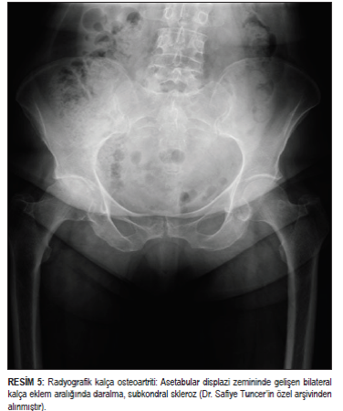

# OSTEOARTRİT

**Hazırlayan:** Doç. Dr. Gökhan Sargın
**Bölüm:** ADÜ Tıp Fakültesi - İç Hastalıkları Anabilim Dalı, Romatoloji Bilim Dalı

---

## İÇİNDEKİLER

1. [Tanım](#tanım)
2. [Epidemiyoloji](#epidemiyoloji)
3. [Etiyoloji ve Risk Faktörleri](#etiyoloji-ve-risk-faktörleri)
4. [Tutulan Eklemler ve Etkilenen Alanlar](#tutulan-eklemler-ve-etkilenen-alanlar)
5. [Sınıflama](#sınıflama)
6. [Klinik Bulgular](#klinik-bulgular)
7. [Tanı](#tanı)
8. [Tedavi](#tedavi)

---

## TANIM

* Dünyada **en sık görülen eklem hastalığıdır**
* **Dejeneratif** bir romatizmal hastalık
* Eklem kıkırdağında harabiyet ile karakterize
* Yeni kemik oluşumları (osteofitler) ile seyreder

---

## EPİDEMİYOLOJİ

* Yaşla birlikte sıklığı belirgin şekilde artar:
  - 30 yaş altı bireylerde: **%1**
  - 40 yaş civarında ve obez bireylerde sıklık artar
  - 65 yaş üstü bireylerde: **%70-80**
* Tüm ırkları ve her iki cinsi değişik oranlarda etkiler
* ⭐ **Morbidite nedenlerinin en önemlilerinden biridir**

---

## ETİYOLOJİ VE RİSK FAKTÖRLERİ

### Genetik Yapı

* OA yatkınlık geni: **2q**
* Mutasyon saptanan genler:
  - IGF-1 gen lokusu
  - Tip II, IV, V, VI kollajen genleri
  - **Kartilaj oligomerik matriks proteini (COMP)** kodlayan genler
* **Heberden nodülleri** ve diz osteoartritini içeren jeneralize nodal OA, primer akrabalarda **iki kat fazla** görülür
* Yaygın klinik heterojenite nedeniyle genetik katkının analizi güçtür

### Mekanik Travma

* Tekrarlayan mekanik yüklenme ve travma, kıkırdak harabiyetini hızlandırır
* Mesleki ve sportif aktiviteler risk faktörüdür

---

## TUTULAN EKLEMLER VE ETKİLENEN ALANLAR

* Her eklemi etkileyebilir, özellikle **yük binen eklemler**
* En sık tutulan eklemler:
  - **Diz**
  - **Kalça**
  - **Omurga**
  - **Ayak**
  - **El eklemleri**

* Etkilenen yapılar:
  - Eklem kıkırdağı, subkondral kemik
  - Ligamanlar
  - Eklem kapsülü
  - Sinovyal membran ve periartiküler kaslar

---

## SINIFLAMA

En kapsamlı sınıflandırma **ACR (American College of Rheumatology)** tarafından yapılmıştır:

### İdiyopatik OA (Primer OA)

* En sık görülen tip
* **Lokalize** ve **jeneralize** olarak 2 gruba ayrılır

### Sekonder OA

* Altta yatan bir neden vardır (travma, metabolik hastalık, inflamatuar artrit vb.)
* Patolojik olarak primer OA ile ayrımı yapılamaz

**⚠️ ÖNEMLİ:**

* OA yerine, tipine ya da etiyolojiye göre değişik şekillerde sınıflandırılabilir

---

## KLİNİK BULGULAR

### Yakınmalar

* **Ağrı** - en önemli yakınma
  - İntra-artiküler ve periartiküler kaynaklı olabilir
* **Tutukluk** - genellikle kısa süreli (<30 dakika), sabah tutukluğu
* Hareket kısıtlılığı
* Şişlik
* Şekil bozukluğu (deformite)
* Eklemden ses gelmesi (krepitasyon)
* Güçsüzlük ve engellilik
* Fonksiyon kaybı
* Günlük yaşam aktivitelerinde kayıp
* Yaşam kalitesinde bozulma

### Muayene Bulguları

* **Hassasiyet**
* **Hareket kısıtlılığı**
  - Kapsüler kalınlaşma
  - Osteofit oluşumu
  - Eklem yüzeylerinin düzensizliği
  - Eklem fareleri (serbest cisimler)
* **Genişleme-kabalaşma**
  - ⭐ **Heberden nodülleri** - DİP (distal interfalangeal) eklemlerde
  - ⭐ **Bouchard nodülleri** - PİP (proksimal interfalangeal) eklemlerde
* **Deformite**
* **Krepitasyon** - hareketle eklemden gelen çıtırtı hissi
* İnstabilite
* Kas atrofisi
* Fonksiyon bozukluğu

### İlişkili Durumlar

* Tendinit
* Bursit

---

## TANI

* **Yaş** - ileri yaş önemli ipucu
* **Öykü** - mekanik karakterde ağrı, aktiviteyle artan
* **Eklem anormalliklerinin lokalizasyonu**
* **Radyografik bulgular:**
  - Çoğu zaman sadece görüntüleme yöntemleri yeterli olur
  - **Direkt grafi** tanıda temel yöntemdir
  - Eklem aralığında daralma
  - Subkondral skleroz
  - Osteofitler
  - Subkondral kistler

---

## TEDAVİ

### Farmakolojik Olmayan Tedavi Yöntemleri

* ⭐ Tüm hastalara **bilgilendirme ve eğitim** verilmeli
  - Ağrıyı azaltır
  - Eklemlerdeki ilerleyici hasarı önler
  - Günlük yaşam aktiviteleri sırasında eklemlerin korunmasını sağlar
* **Düzenli egzersizler** yapılmalı (özellikle kalça ve diz OA)
* **Kilo verme** - özellikle diz OA'da çok etkili
* Termal uygulamalar

### Farmakolojik Tedavi Yöntemleri

* **Analjezikler:**
  - **Asetaminofen** - hafif-orta ağrılı diz OA'da ilk tercih
* **NSAİİ (Non-steroid Antiinflamatuar İlaçlar)**
* **İntra-artiküler (İA) enjeksiyonlar:**
  - Hyaluronik asit
  - Glukozamin ve/veya kondroitin

### Cerrahi Tedaviler

* Ağrı ve fonksiyon kaybı olan hastalarda **eklem replasman cerrahisi** (artroplasti)
