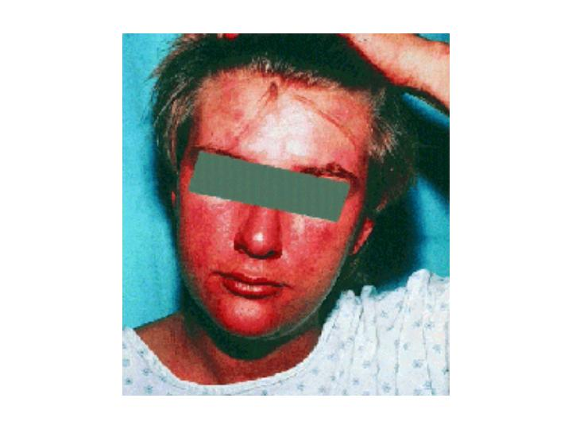
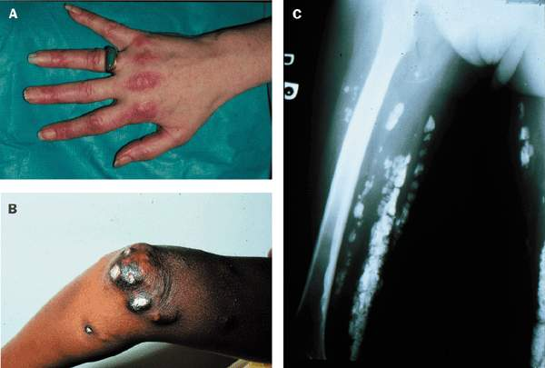
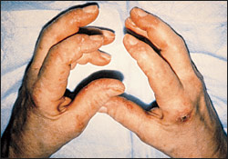

# POLİMİYOZİT VE DERMATOMİYOZİT

**Hazırlayan:** Doç. Dr. Gökhan Sargın
**Bölüm:** ADÜ Tıp Fakültesi - İç Hastalıkları Anabilim Dalı, Romatoloji Bilim Dalı

---

## İÇİNDEKİLER

1. [Tanım ve Epidemiyoloji](#tanım-ve-epidemiyoloji)
2. [Sınıflama](#sınıflama)
3. [Etyopatogenez](#etyopatogenez)
4. [Patoloji](#patoloji)
5. [Klinik Bulgular](#klinik-bulgular)
6. [Laboratuvar](#laboratuvar)
7. [Tanı Kriterleri](#tanı-kriterleri)
8. [Ayırıcı Tanı](#ayırıcı-tanı)
9. [Tedavi ve Prognoz](#tedavi-ve-prognoz)

---

## TANIM VE EPİDEMİYOLOJİ

* İskelet kasının nedeni bilinmeyen, **otoimmün, kronik inflamatuar** hastalıklarıdır
* **Dermatomiyozit (DM):** Tabloya deri bulguları eşlik eder
* **Polimiyozit (PM):** Deri bulgusu yoktur
* **K/E oranı:** 2.5 / 1
* En sık **40-60 yaş** arasında görülür

---

## SINIFLAMA

| Tip | Sıklık |
|---|---|
| 1) Primer idiyopatik PM | %50 |
| 2) Primer idiyopatik DM | %20 |
| 3) Maligniteyle birlikte görülen DM/PM | %10 |
| 4) Çocukluk çağında görülen jüvenil DM/PM | %10 |
| 5) Diğer bağ dokusu hastalıklarıyla birlikte görülen DM/PM | %10 |
| 6) İnklüzyon body myozit | - |

**⚠️ İnklüzyon body myozit:**

* 50 yaş üstü erkeklerde görülür
* Sinsi başlangıçlı
* Tedaviye dirençli
* Proksimal **ve distal** kas tutulumu (diğerlerinden farklı olarak)

---

## ETYOPATOGENEZ

Etiyolojide suçlanan mekanizmalar:

1. Persistan virüs enfeksiyonu
2. Virüs ile kas proteinlerinin çapraz reaksiyonuna neden olan **moleküler benzerlik**
3. Virüslerle indüklenen kas antijenlerinin sunumu
4. Virüslerin immün sisteme etki etmeleri

---

## PATOLOJİ

* Kas liflerinde lenfositten zengin mononükleer hücre (MNH) infiltrasyonu, nekroz, rejenerasyon ve kronik dönemde atrofi

### PM ve DM Arasındaki Patolojik Farklar

| Özellik | PM | DM |
|---|---|---|
| İnflamasyon yeri | Kas liflerinin etrafında (**endomisyum**) | Kas fasikülleri ve küçük damarların çevresinde (**perimisyum**) |
| Perifasiküler atrofi | ❌ Yok | ✅ Var |

⭐ **Perifasiküler atrofi DM'ye özgü** bir patolojik bulgudur ve PM'den ayırıcı tanıda önemlidir.

---

## KLİNİK BULGULAR

### Kas Bulguları

* ⭐ **Proksimal kas güçsüzlüğü** - en önemli bulgu
  - Omuz ve kalça kuşağı kasları
  - Merdiven çıkma, kolları kaldırma güçlüğü
  - Simetrik tutulum

### Deri Bulguları (DM'de)

* **DM raşı:** Yüz, boyun ve göğsün üst bölümünde (**V rash**), omuz ve sırtta (**şal şeklinde rash**) veya el ve dizin ekstansör yüzünde
* **Heliotropik rash:** Göz etrafında, erguvani/leylak rengi eritem - DM'ye patognomonik

* **Gottron papülleri:** El sırtında, MCP ve PİP eklemleri üzerinde eritemli, papüler lezyonlar - DM'ye patognomonik
* **Kalsinozis:** Cilt altı kalsiyum birikimleri

* **Periungal eritem ve telenjiektazi**
* **Mekanik el:** Parmak uçlarında çatlamış, kırışık, kirli görünüm

---

### Solunum Sistemi Bulguları

* Solunum kasları tutulursa **efor dispnesi, öksürük**
* Farinks tutulursa **aspirasyon pnömonisi**
* Diffüz alveolit
* **İnterstisyel akciğer hastalığı** (özellikle anti-Jo-1 pozitif hastalarda)

### KVS Bulguları

* İletim bozuklukları
* Aritmiler
* Miyokardit

### GİS Bulguları

* **Faringial disfaji** ve nazal regürjitasyonlar
* Karın ağrısı
* Ülser ve kanamalar (vaskülite bağlı)

### Diğer Bulgular

* Artralji ve artrit (%20-40)
* Ateş, kilo kaybı, halsizlik

---

## LABORATUVAR

* Hafif anemi, ESH artar
* ⭐ **Kas enzimleri artar:**
  - **CK (kreatin kinaz)** - en duyarlı
  - Aldolaz
  - AST
  - LDH
  - ALT

### Otoantikor Profili

| Otoantikor | Sıklık | Özellik |
|---|---|---|
| ANA | %60-80 | Non-spesifik |
| **Anti-Jo-1** (anti-sentetaz) | %20 | İnterstisyel akciğer hastalığı, artrit, mekanik el, Raynaud ile ilişkili (**anti-sentetaz sendromu**) |
| Anti-Mi-2 | %10 | Klasik DM ile ilişkili, iyi prognoz |

### EMG Bulguları

İnflamatuar miyopati bulguları:
* **Polifazik**, düşük amplitüdlü motor aksiyon potansiyelleri
* **Kısa süreli** motor aksiyon potansiyelleri
* **Fibrilasyonlar**

### Kas Biyopsisi

* Miyozite ait bulgular (kesin tanı için altın standart)

---

## TANI KRİTERLERİ

| No | Kriter |
|---|---|
| 1 | Simetrik ve proksimal kas güçsüzlüğü |
| 2 | Kas biyopsisinde miyozit bulguları |
| 3 | Kas enzimleri yüksekliği |
| 4 | EMG'de DM/PM'e uyan bulgular |
| 5 | DM'nin deri bulguları |

**⚠️ ÖNEMLİ:**

* **PM tanısı:** 4 kriterden en az **3'ü** karşılanmalı (1-4 arası)
* **DM tanısı:** 4 kriterden en az **3'ü** + **5. kriter** (deri bulguları) karşılanmalı

---

## AYIRICI TANI

1. **Müsküler distrofiler:** Aile anamnezi vardır, yavaş ilerler
2. **Nöromusküler kavşak hastalıkları:** Miyastenia gravis gibi; ekstraoküler kas tutulumu, EMG bulguları farklı, kas enzimleri normal
3. **Kalıtsal enzim defektlerine bağlı metabolik miyopatiler**
4. **Glikojen depo hastalıkları**
5. **Lipit depo hastalıkları**
6. **Toksik miyopatiler:** Alkol, klorokin, steroid
7. **Enfeksiyonlar:** Virüs, bakteri, parazit

💡 3, 4 ve 5 numaralı durumların ayırımı **biyopsi** ile yapılır.

---

## TEDAVİ VE PROGNOZ

### Tedavi

* **Kortikosteroidler** - ilk basamak tedavi
* **Metotreksat** - steroid koruyucu ajan
* **DM raşı için:** Klorokin / hidroksiklorokin
* **Dirençli vakalarda:**
  - Azatiyoprin
  - Siklofosfamid
  - İV immünoglobülin (İVİG)
  - Siklosporin

### Prognoz

* **5 yıllık yaşam:** %80-90
* Kötü prognoz faktörleri:
  - İleri yaş
  - Malignite birlikteliği
  - Pulmoner tutulum
  - Kardiyak tutulum
  - Tedaviye geç yanıt
