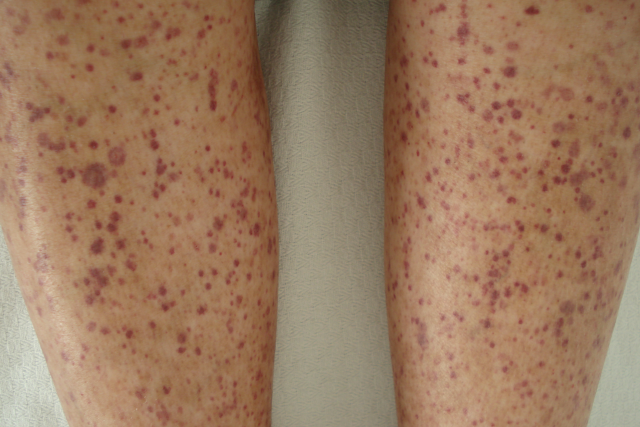
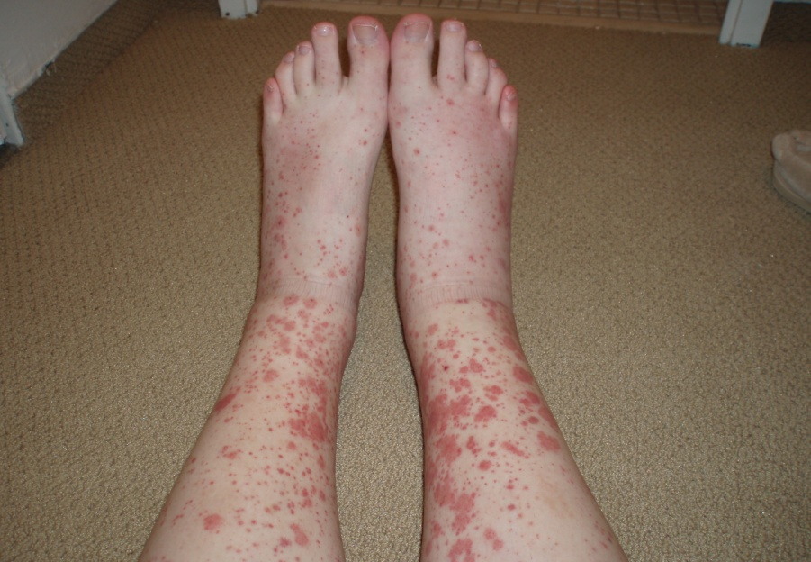
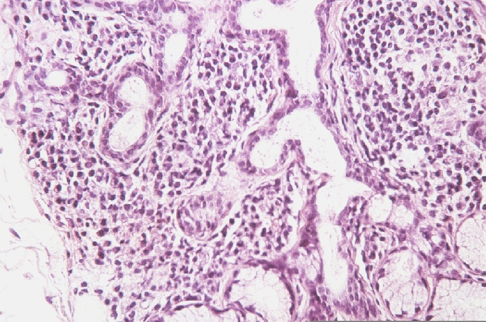

# SJÖGREN SENDROMU VE ÇAKIŞMA SENDROMLARI

**Hazırlayan:** Prof. Dr. Gökhan Sargın
**Bölüm:** ADÜ Tıp Fakültesi - İç Hastalıkları Anabilim Dalı, Romatoloji Bilim Dalı

---

## İÇİNDEKİLER

1. [Tanım](#tanim)
2. [Epidemiyoloji](#epidemiyoloji)
3. [Etyopatogenez](#etyopatogenez)
4. [Histopatoloji](#histopatoloji)
5. [Klinik Bulgular](#klinik-bulgular)
6. [Lenfoma Riski](#lenfoma-riski)
7. [Laboratuvar](#laboratuvar)
8. [Tanısal Testler](#tanisal-testler)
9. [Ayırıcı Tanı](#ayirici-tani)
10. [Tedavi](#tedavi)
11. [Overlap Sendromları ve MCTD](#overlap-sendromlari-ve-mctd)
12. [Undiferansiye Bağ Doku Hastalığı](#undiferansiye-bag-doku-hastaligi)

---

## TANIM

Sjögren sendromu (SjS), **ekzokrin bez tutulumu** ile karakterize kronik, otoimmün, inflamatuar bir bağ doku hastalığıdır.

Tutulan ekzokrin bezler:
* Gözyaşı bezleri
* Tükürük bezleri
* Özofagus bezleri
* Solunum yolu bezleri
* Duodenum bezleri
* Pankreas bezleri

### Sınıflama

* **Primer Sjögren sendromu (pSjS):** Altta yatan başka bir otoimmün hastalık olmaksızın görülür. Hastaların yaklaşık **%50**'si primer SjS'dir.
* **Sekonder Sjögren sendromu:** RA, SLE gibi diğer otoimmün hastalıklarla birlikte görülür.

---

## EPİDEMİYOLOJİ

| Parametre | Değer |
|---|---|
| Kadın/Erkek oranı | **9/1 - 20/1** |
| Prevalans | **%0.5 - 4.8** |
| Pik yaş | **40-50 yaş**, genellikle orta yaş kadınlarda |

---

## ETYOPATOGENEZ

Sjögren sendromunda hastalık gelişiminde birden fazla faktör rol oynar:

```
    Çevresel Faktörler + Genetik Yatkınlık + Hormonlar
                          ↓
              Otoimmünitenin Başlaması
                          ↓
              Otoantikorlar Oluşumu
                          ↓
                Patolojik Hasar
                          ↓
                Klinik Belirtiler
                          ↓
              Sjögren Sendromu (Klinik Hastalık)
```

---

## HİSTOPATOLOJİ

Etkilenen organlarda temel histopatolojik bulgu **progresif lenfosit infiltrasyonu**dur.

### Minör Tükürük Bezi Histolojisi

İnfiltre eden hücreler:
* **Lenfositler:**
  - **%80 T lenfosit** (CD4+/CD8+ oranı > 2)
  - **%20 B lenfosit**
* Plazmositoid dendritik hücreler
* Makrofajlar

Sonuçta **hücre atrofisi** ve **fibrozis** gelişir.

⚠️ Progresif lenfosit infiltrasyonu --> doku ve organ hasarı

---

## KLİNİK BULGULAR

SjS'ye özgü bulgular iki ana grupta incelenir:
* **Glandüler bulgular** (ekzokrinopati)
* **Ekstraglandüler bulgular** (ekzokrin olmayan)

Yaşla uyumsuz **yorgunluk ve halsizlik** hastaların **%70**'inde görülür:
- Kronik inflamasyon (IL-1, IL-6)
- Yüksek IFN-alfa
- Yüksek akut faz reaktanları
- Hipotiroidizm

### Raynaud Fenomeni

* Kuruluk belirtilerinden **yıllar önce** başlayabilir
* Genellikle ekstraglandüler bulgularla birlikte görülür

---

### Glandüler Bulgular

#### Göz Kuruluğu (Keratokonjunktivitis Sikka)

Belirtiler:
* Gözde yabancı cisim duyusu, kum batması hissi
* Yanma, kaşınma, kızarma
* Işığa duyarlılık
* Göz yorgunluğu
* Gözde bir perde duygusu

#### Ağız Kuruluğu (Kserostomi)

Belirtiler:
* Kuru yiyecekleri yutma zorluğu
* Devamlı konuşamama
* Tat veya koku anormallikleri
* Yanma hissi
* Diş çürükleri

#### Parotis Şişmesi

* Primer Sjögren'li hastalarda **%60** oranında görülür
* Tekrarlayıcı, simetrik
* Bazen ateş, duyarlılık veya eritem eşlik edebilir
* Değerlendirme: parotis USG, parotis sintigrafisi

---

### Ekstraglandüler Bulgular

Ekstraglandüler tutuluş hastaların **%20-40**'ında görülür.

#### Lokomotor Sistem Bulguları

* **Artralji** (%50)
* **İntermitan non-eroziv poliartrit** (%30)
  - USG ile el ve el bilek eklemlerinde subklinik sinovit saptanabilir
  - Eklem tutuluşu sessiz olabilir
* Myalji, fibromiyalji benzeri bulgular

#### Deri Döküntüleri

* **Eritema anulare:** Halka şeklinde, perifere doğru asimetrik olarak genişleyen eritematöz lezyonlar
* **Palpabl purpura**





#### Solunum Sistemi

**Trakeobronşial hastalık:**
* Kuruluğa bağlı öksürük
* Ses kalınlaşması
* Sık enfeksiyonlar
* Bronş hiperreaktivitesi
* Bronşektazi
* Bronşiolit

**İnterstisyel akciğer hastalığı (İAH)** de görülebilir.

---

### Tutulum Paternleri

| Tutulum Tipi | Örnekler | Mekanizma |
|---|---|---|
| **Glandüler tutulum** | Ağız, göz, deri, vagina kuruluğu | Anti-muskarinik antikorlar |
| **Periepitelyal tutulum** | Trakea kuruluğu, bronşiolit, kolanjit, renal tübüler asidoz (karbonik anhidraz II antikoru), atrofik gastrit | Lenfosit infiltrasyonu |
| **Lenfosit infiltrasyonu ve proliferasyonu** | İnterstisyel nefrit, interstisyel sistit, interstisyel pnömoni, otoimmün hepatit, lenf bezi/dalak büyümesi, MALT lenfoma | Lenfosit infiltrasyonu |
| **Ekstraepitelyal belirtiler** | Glomerülonefrit, deri vasküliti, Raynaud fenomeni, sitopeniler, periferik nöropatiler, SSS tutulumu | Otoantikorlar, immün kompleksler veya vaskülit |

**⚠️ ÖNEMLİ:** B lenfosit hiperreaktivitesi, SjS'nin ekstraepitelyal belirtilerinde anahtar rol oynar.

---

## LENFOMA RİSKİ

### Lenfoma Gelişimini Düşündüren Bulgular

* Kalıcı parotis büyüklüğü
* Lenfadenopati, splenomegali
* Bacak ülserleri
* Palpabl purpura
* Periferik nöropati

### pSjS'de Görülen Lenfoma Tipleri

* **Marginal zon B hücreli lenfoma (en sık)**
  - MALT (mukoza ile ilişkili lenfoid doku) tipi ekstranodal MZL
  - Splenik MZL
  - Nodal MZL
* Diffüz büyük hücreli lenfoma
* Folliküler lenfoma

---

## LABORATUVAR

### Hematolojik ve Biyokimyasal Bulgular

* Anemi
* Lökopeni / lenfositopeni
* Trombositopeni
* Sedimantasyon artışı
* CRP artışı
* Hipergamaglobulinemi
* KCFT / ALP-GGT yüksekliği
  - Otoimmün hepatit
  - Primer biliyer siroz

### Otoantikor Profili

| Otoantikor | Açıklama |
|---|---|
| **ANA** | **%55-97** oranında pozitif |
| **Anti-Ro (SSA)** | SjS'ye özgü |
| **Anti-La (SSB)** | SjS'ye özgü |
| **Romatoid faktör (RF)** | Sıklıkla pozitif |
| Gastrik parietal hücre antikoru | Atrofik gastrit ilişkili |
| Anti-Tg, anti-TPO | Tiroid otoimmünitesi |
| Anti-mitokondrial antikor | Primer biliyer siroz ilişkili |
| Tükürük kanalı antikoru | - |

---

## TANISAL TESTLER

### Göz Kuruluğunu Değerlendirme

#### Schirmer Testi

* Alt göz kapağının 1/3 dış kısmına **5 mm Whatman kurutma kağıdı** konulur
* **5 dakika** beklenir
* Sonuç: ıslanma miktarı ölçülür

#### Göz Yüzeyi Boyama

* **Floressein** boyama
* **Lissamine green** boyama

### Ağız Kuruluğunu Değerlendirme

#### Siyalometri

* Tükürük miktarını ölçer
* Unstimulated / stimulated olarak yapılır
* Unstimulated flow rate **≤0.1 mL/dk** patolojik kabul edilir

### Minör Tükürük Bezi Biyopsisi

* Ağız kuruluğunu değerlendirmede **önemli test**
* Normal görünümlü dudak mukozasından alınır
* **Lenfositik siyaloadenit** saptanır



---

## AYIRICI TANI

### Kuru Ağız Nedenleri

* Viral enfeksiyonlar
* İlaçlar
* Psikojenik nedenler
* Radyasyon tedavisi
* Diabetes mellitus
* Travma
* Dehidratasyon
* Aldosteronizm
* Cushing hastalığı
* Yaşlılık

### Kuru Göz Nedenleri

* Kronik konjonktivit
* Kronik blefarit
* Yanıklar
* İlaçlar

### Bilateral Parotis Şişmesi Nedenleri

* Kabakulak, influenza
* EBV, CMV, HIV
* Sarkoidoz, amiloidoz
* Akromegali
* Cushing sendromu
* Gebelik

---

## TEDAVİ

Tedavi yaklaşımları dört ana başlıkta ele alınır:

1. **Genel önlemler**
2. **Topikal tedaviler** (suni gözyaşı, ağız nemlendirici)
3. **Salgıyı arttırmaya yönelik ajanlar** (pilokarpin, sevimelin)
4. **İmmünsüpresif ajanlar** (sistemik tutulumda)

---

## OVERLAP SENDROMLARI VE MCTD

> Aynı hastada birden fazla bağ doku hastalığının bir arada bulunmasıdır. Her bir hastalık ayrı ayrı sınıflama kriterlerini karşılamalıdır.

### Overlap Sendromu Örnekleri

* Sjögren sendromu + bir başka BDH
* **RA + SLE (Rhupus)**
* Skleroderma + polimiyozit
* Skleroderma + SLE + polimiyozit
* Primer biliyer siroz + Sjögren sendromu

### Miks Konnektif Doku Hastalığı (MCTD)

MCTD, SLE, skleroderma ve polimiyozitin özelliklerini bir arada taşıyan bir overlap sendromudur.

Tedavide baskın olan hastalığa yönelik yaklaşım uygulanır:
* SLE baskın ise --> SLE tedavisi
* Skleroderma baskın ise --> SSc tedavisi
* Polimiyozit baskın ise --> PM tedavisi

---

## UNDİFERANSİYE BAĞ DOKU HASTALIĞI

Herhangi bir spesifik bağ doku hastalığının sınıflama kriterlerini tam olarak karşılamayan, ancak otoimmün bağ doku hastalığı düşündüren bulguları olan hastalar bu gruba dahil edilir.

---

## KAYNAKLAR

* Bijlsma JWJ (editor). EULAR Textbook on Rheumatic Diseases, Third Edition. BMJ Publishing Group, 2018.
* Jameson JL, Fauci AS, Kasper DL, et al. Harrison's Principles of Internal Medicine, 20th Edition. McGraw-Hill Professional, 2018.
* Ramos-Casals M, Brito-Zerón P, Sisó-Almirall A, Bosch X. Primary Sjogren syndrome. BMJ. 2012;344:3821.
