# SİSTEMİK LUPUS ERİTEMATOZUS (SLE)

**Hazırlayan:** Dr. Öğr. Üyesi Reyhan Köse Çobanoğlu
**Bölüm:** Romatoloji

---

## İÇİNDEKİLER

1. [Tanım ve Tarihçe](#tanım-ve-tarihçe)
2. [Epidemiyoloji](#epidemiyoloji)
3. [Etyopatogenez](#etyopatogenez)
4. [Klinik Bulgular](#klinik-bulgular)
5. [Laboratuvar](#laboratuvar)
6. [Tanı Kriterleri](#tanı-kriterleri)
7. [Ayırıcı Tanı](#ayırıcı-tanı)
8. [Tedavi](#tedavi)
9. [Prognoz](#prognoz)

---

## TANIM VE TARİHÇE

>  Nedeni tam olarak bilinmeyen; deri, eklemler, böbrek, beyin, akciğer gibi organları etkileyerek çeşitli klinik belirtilere ve organ hasarına yol açabilen **kronik otoimmün bir hastalıktır.**

**Tarihsel Notlar:**

- 15. yy — "lupus" terimi yüz lezyonları için kullanıldı
- 1872 — Kaposi, hastalığın sistemik tutulum yapabileceğini bildirdi
- 1946 — Hargraves, LE hücrelerini kemik iliğinde tespit etti

---

## EPİDEMİYOLOJİ

| Parametre | Değer |
|---|---|
| Prevalans | 20–150 vaka / 100.000 (max 1:2000) |
| İnsidans | 15–20 / 100.000 |
| Pik yaş | **15–40** (doğurganlık dönemi) |
| Cinsiyet | ⭐ **%90 kadın** (K/E ≈ 9/1) |
| Irk farkı | Siyah > Beyaz (1:250'e karşı 1:1000) |
| HLA birlikteliği | HLA-DR3 |

> 💡 **Akılda kalması:** SLE = **"S**adece **L**ady **E**tkilenir" — kadınlarda 9 kat daha sık; üstelik pik dönem doğurganlık çağıdır (östrojen bağlantısı!).

---

## ETYOPATOGENEz

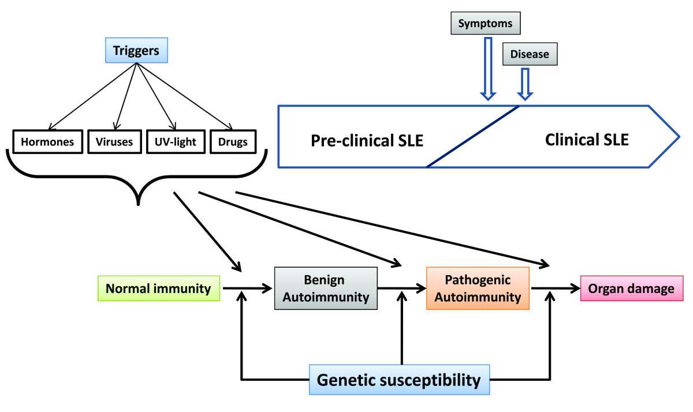

### 4 Temel Risk Faktörü

```
        Genetik
           +
        Çevresel   →  Otoimmünite  →  Organ Hasarı
           +
        Hormonal
           +
        İmmünolojik
```

### 1. Genetik Faktörler

- Aile öyküsü: %12 (1. derece akrabada 15–20 kat risk ↑)
- Monozigot ikizlerde konkordans: **%24–56**
- Dizigot ikizlerde: %2–5
- **HLA-DR2 ve DR3** varlığında relatif risk artmış
- "Multifaktöriyel kalıtım paterni"

### 2. Çevresel Faktörler

| Faktör | Etki |
|---|---|
| ⭐ **UV ışık (güneş)** | En belirgin çevresel tetikleyici — alevlendirme yapar |
| Epstein-Barr virüsü | Olası tetikleyici |
| İlaçlar (demetile ediciler) | Drug-induced lupus'a yol açabilir |

### 3. Hormonal Faktörler

- **Östrojen / prolaktin ↑** → otoreaktif B hücrelerinde artış → otoimmün fenotip
- **Testosteron** → humoral immüniteyi azaltır (erkekte koruyucu)
- Hamilelik → alevlenme riski

> 💡 Östrojen ilişkisi, SLE'nin neden doğurganlık çağındaki kadınlarda pik yaptığını açıklar.

### 4. İmmünolojik Faktörler

- Th fonksiyonu ↑, Ts fonksiyonu ↓
- **B hücre hiperaktivitesi**
- Apoptotik / nekrotik hücrelerden salınan **otoantijenlerin klirensinde bozukluk**
- Bu otoantijenlerin T ve B lenfositlere gereğinden fazla sunulması → kontrolsüz immün yanıt
- Otoantikorlar klinik belirtilerden **yıllar önce** belirmeye başlar

---

## KLİNİK BULGULAR

> SLE neredeyse her organı tutabilir. Aşağıda sistem sistem ele alınmıştır.

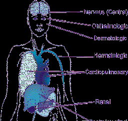

### 1. Mukokutanöz Tutulum (%80)

**Spesifik Lezyonlar:**

| Tip | Lezyon |
|---|---|
| **Akut** | ⭐ Malar (butterfly) raş (%50), generalize eritem (%30), büllöz LE |
| **Subakut kutanöz** | Anüler-polisiklik, papüllosquamöz |
| **Kronik** | Lokalize / generalize diskoid, lupus profundus |

**Non-spesifik Lezyonlar:** Pannikülit, ürtikeryal lezyonlar, vaskülit, livedo retikülaris, oral lezyonlar, alopesi, Raynaud fenomeni

---

#### Malar (Kelebek) Raş

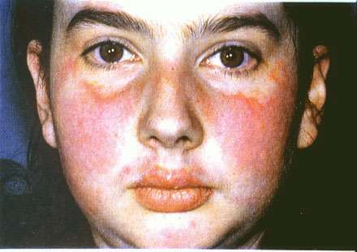

- **Fix eritem**, düz veya kabarık
- Malar çıkıntılar üzerinde
- ⭐ **Nasolabial oluklar korunur** (ayırt edici özellik)

---

#### Diskoid Raş

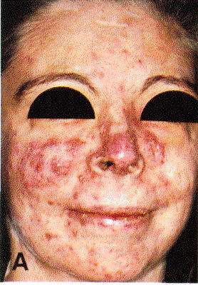

- Deriden kabarık **eritematöz plaklar**
- Folliküler tıkaçlar + keratotik skarlaşma
- Eski lezyonlarda: hiperpigmente kenar + hipopigmente merkez + atrofik skar

---

#### Subakut Kutanöz Lupus

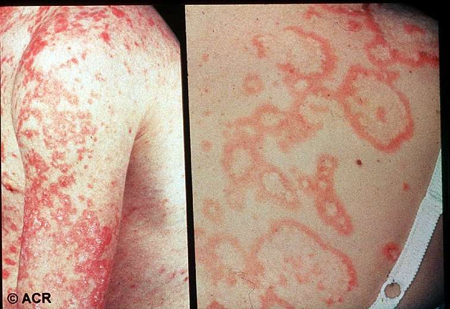

---

#### Diskoid Lupus — Histoloji

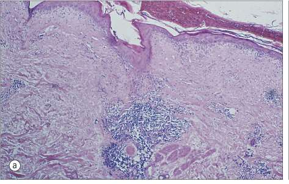

---

#### Alopesi

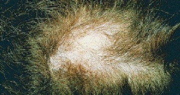

---

#### Oral Ülserler

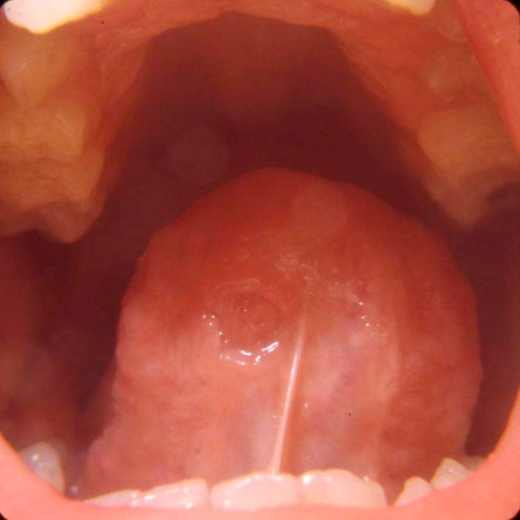

- Oral veya nasofarengeal ülserler
- ⭐ **Genellikle ağrısız**

---

#### Raynaud Fenomeni

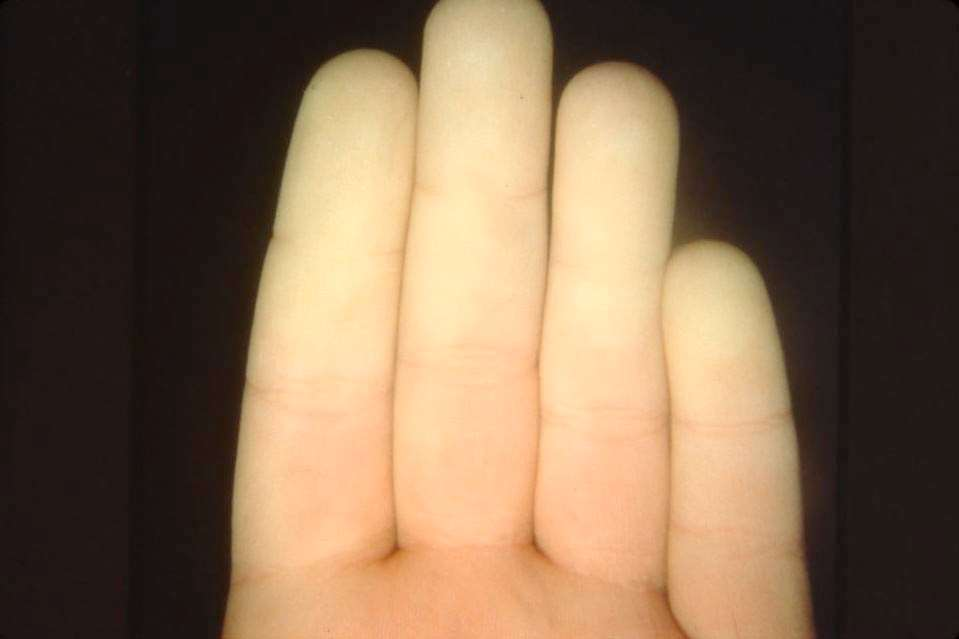

---

#### Periungual Vaskülit / Nekroz

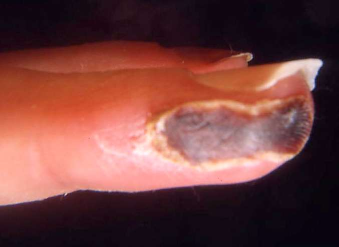

---

#### Livedo Retikülaris

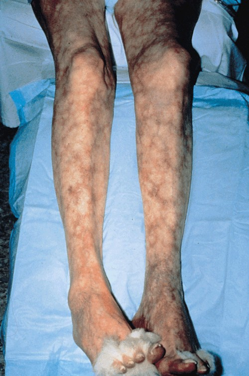

---

### 2. Seröz Zar Tutulumu

| Tutulum | Notlar |
|---|---|
| **Plevrit** | Tesadüfen veya semptomatik (frotman, efüzyon) |
| **Perikardit** | En sık KVS lezyonu; konstriktif perikardit nadir |
| **Peritonit** | Diğer nedenlerden ayırt etmek güç; steroid maskeleyebilir |

---

### 3. Kas-İskelet Sistemi Tutulumu

- **Artralji / artrit (%90–95)** — en sık başvuru yakınması
  - Noneroziv, nadiren deforme edici
  - Geçici, simetrik, küçük eklemler
  - RA'dan **daha hafif** seyirli
- **Jaccoud artropatisi:** noneroziv, düzeltilebilir deformiteler
- Miyalji sık, miyozit seyrek
- **Avasküler nekroz** (steroidle veya steroid olmaksızın): kalça, diz, omuz

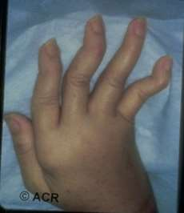

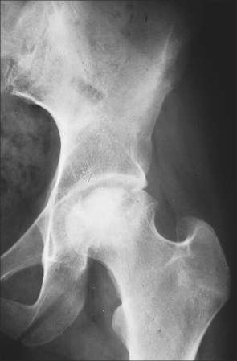

---

### 4. Solunum Sistemi Tutulumu

| Tutulum | Sıklık | Özellik |
|---|---|---|
| Plörit / plevral efüzyon | %30–60 | En sık |
| Akut lupus pnömonisi | %5–12 | Ateş, öksürük, dispne, hemoptizi; AC grafisinde diffüz infiltrasyon; **mortalite %50** |
| Pulmoner hemoraji | Nadir | Ağır |
| Büzüşen AC (Shrinking lung) sendromu | — | AC grafisinde diyafram yüksek; SFT'de restriktif patern; diyafram kas disfonksiyonu |
| Kronik lupus pnömonisi | %10 | Diffüz interstisyel hastalık; prognoz kötü |

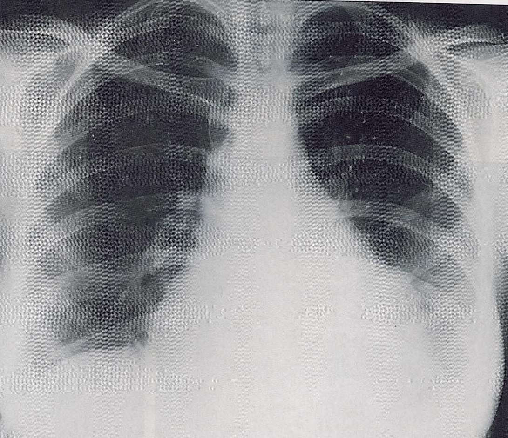

---

### 5. Kardiyovasküler Sistem Tutulumu

| Tutulum | Sıklık | Notlar |
|---|---|---|
| **Perikardit** | %20–30 | ⭐ En sık KVS lezyonu |
| Miyokardit | Nadir | Taşikardi, kardiyomegali, KKY |
| **Libman-Sacks endokarditi** | Otopside %15–60 | Non-bakteriyel verrüköz endokardit |
| MVP | %25–30 | |
| Konjenital kalp bloğu | — | Neonatal lupusta |
| Koroner arter hastalığı | — | Sıklıkla steroide bağlı hızlanmış ASKH |

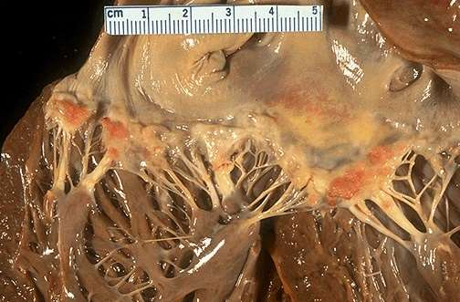

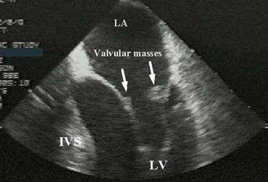

**Libman-Sacks Endokarditi:**
- Otopside %15–60; en sık **mitral > aort > triküspit**
- ACA (+) olabilir
- ⭐ En önemli komplikasyon: akut veya subakut **bakteriyel endokardit**

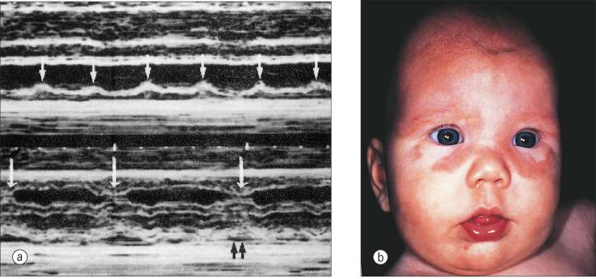

---

### 6. Böbrek Tutulumu (Lupus Nefriti)

- Hastaların **>%50**'sinde gelişir
- %10 kadarı diyaliz veya transplantasyon gerektirir
- ⭐ **En belirgin klinik bulgu: proteinüri** (hematüri, silendir de görülür)
- İlk 5 yılda sık tutulum
- **Nefrit, hastalıkla ilişkili ölümün en sık nedenidir**

**Risk Faktörleri:** Hipertansiyon, aktif nefritin süresi, siyah ırk

#### WHO / ISN-RPS Lupus Nefriti Sınıflaması

| Klas | Tanım | Sıklık | Klinik |
|---|---|---|---|
| **I** | Normal | %1–5 | Asemptomatik |
| **II** | Mesangial | %20 | İdrar tahlili ve RF normal; prognoz iyi |
| **III** | Fokal proliferatif GNF | %25 | Proteinüri + hematüri; 1/3'ü klas IV'e döner |
| **IV** | ⭐ Diffüz proliferatif GNF | **%37–50** | Proteinüri, aktif sediment, RF azalması; **en ağır, en sık** |
| **V** | Membranöz GNF | %13 | Belirgin proteinüri; nefrotik sendrom |
| **VI** | Kronik sklerozan | — | İleri evre; tübülointerstisyel tutulum |

> 💡 **Klas IV** = En sık + En kötü prognoz. "4 en ağırdır" diye hatırla.

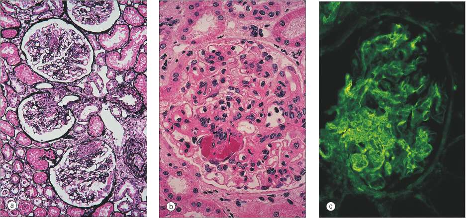

**Aktivite ve Kronisite İndeksi:**

| İndeks        | Parametreler                                                                                                                               | Max Skor |
| ------------- | ------------------------------------------------------------------------------------------------------------------------------------------ | -------- |
| **Aktivite**  | Hücresel proliferasyon, fibrinoid nekroz*, hücresel kresentler*, hyalin trombüsler, lökosit infiltrasyonu, mononükleer hücre infiltrasyonu | 24       |
| **Kronisite** | Glomerüler skleroz, fibröz kresentler, tübüler atrofi, interstisyel fibrozis                                                               | 12       |
|               |                                                                                                                                            |          |

-  Fibrinoid nekroz ve hücresel kresentlere **2 ağırlık puanı** verilir
-  Pauci immun glomerulonefrit

---

### 7. Santral Sinir Sistemi Tutulumu

| Presentasyon | Özellikler |
|---|---|
| **Diffüz** (otoantikorlar) | Başağrısı, psikoz, depresyon, ensefalopati, kognitif bozukluklar |
| **Fokal** (vaskülopati: APS, vaskülit) | Epilepsi, felç, korea, myelit, aseptik menenjit |
| **Psikiyatrik** | Depresyon, anksiyete, paranoya, şizofreni |

> ⚠️ **Önemli:** SSS bulgusu SLE'nin aktif veya inaktif döneminde çıkabilir. Ayırıcı tanıda enfeksiyon, hipertansiyon, metabolik bozukluklar ve ilaçlar ekarte edilmelidir.

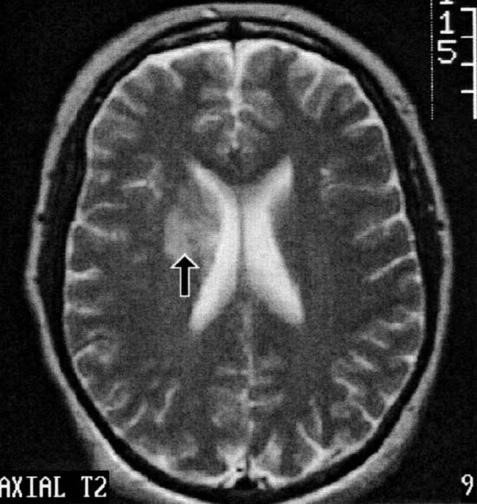

---

### 8. Göz Tutulumu

- Konjunktivit ve episklerit
- Santral retinal arter tıkanması ve aktif retinal arterit
- ⭐ **Cytoid body (retinal eksuda):** SLE'ye spesifik

---

### 9. Gastrointestinal Sistem Tutulumu

Sık görülmez:
- Hazımsızlık, bulantı, kusma
- Asemptomatik peritonit
- Mezenter vaskülit
- Hepatomegali ve splenomegali
- KCFT ve ALP yüksekliği (ilaca veya aktif hastalığa bağlı)

---

### 10. Hematolojik Tutulum

> En az biri gereklidir:

| Bulgu | Eşik |
|---|---|
| Hemolitik anemi | Retikülositozla birlikte |
| Lökopeni | < 4.000 / mm³ |
| Lenfopeni | < 1.500 / mm³ |
| Trombositopeni | **< 100.000 / mm³** |

---

## LABORATUVAR

### Non-spesifik Bulgular

- ESR ve CRP yüksekliği
- Kompleman seviyeleri **↓** (C3, C4) — aktif hastalıkta tüketim ↑
- Hipergamaglobulinemi
- LE hücresi: bir nötrofilin, antikorla kaplı nükleusu fagosite etmesi

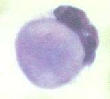

### Otoantikor Profili

| Antikor | Duyarlılık | Özgüllük | Klinik Önemi |
|---|---|---|---|
| ⭐ **ANA** | **%95–100** | Düşük | Tarama testi; negatifse SLE dışla |
| **Anti-dsDNA** | %60 | ⭐ Yüksek | Hastalık aktivitesiyle korele; nefrit riski |
| **Anti-Sm** | Düşük | ⭐ **SLE'ye spesifik** | |
| Anti-Ro/SSA | — | — | Neonatal lupus, subakut kutanöz LE |
| Anti-La/SSB | — | — | Genellikle Anti-Ro ile birlikte |
| Anti-RNP | — | — | Mikst bağ doku hastalığıyla örtüşme |
| **Anti-histon** | — | — | ⭐ Drug-induced lupus'ta karakteristik |
| **Antifosfolipid antikorları** | — | — | Tromboz, düşük; uzamış aPTT; yalancı (+) VDRL |

> 💡 **Antikor özeti:**
> - **Tarama:** ANA (%95–100 sensitif)
> - **Spesifik:** Anti-dsDNA + Anti-Sm (her ikisi pozitifse SLE tanısı güçlü)
> - **Drug-induced:** Anti-histon
> - **Neonatal lupus:** Anti-Ro/SSA

### ANA Boyanma Paternleri

| Patern | İlgili Antikor |
|---|---|
| Periferal (rim / lineer) | Anti-dsDNA |
| Homojen (diffüz) | Anti-histon |
| Granüler (speckled) | ENA'lar (Sm, Ro, La, RNP) |
| Nükleoler | Anti-nükleoler antikorlar |

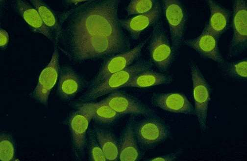

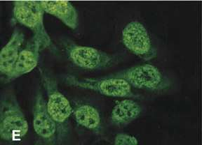

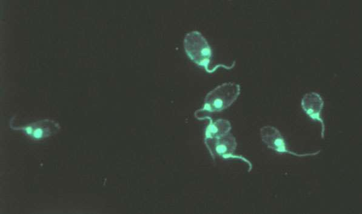

---

## TANI KRİTERLERİ

### 1997 ACR Revize Kriterleri — "4/11 = SLE Tanısı"

**Sensitivite ve spesifite %96**

| # | Kriter |
|---|---|
| 1 | **Malar raş** |
| 2 | **Diskoid raş** |
| 3 | **Fotosensitivite** |
| 4 | **Oral ülserler** |
| 5 | **Artrit** |
| 6 | **Serozit** (plörit veya perikardit) |
| 7 | **Renal hastalık** (proteinüri >0.5 g/gün veya hücresel silendirler) |
| 8 | **Nörolojik** (konvülzyon veya psikoz) |
| 9 | **Hematolojik** (hemolitik anemi / lökopeni / lenfopeni / trombositopeni) |
| 10 | **İmmünolojik** (anti-dsDNA, anti-Sm, antifosfolipid, LE hücresi) |
| 11 | **Pozitif ANA** |

> 💡 **Mnemonik — "MD SOAP BRAIN":**
> **M**alar raş, **D**iskoid, **S**erozit, **O**ral ülser, **A**rtrit, **P**roteinüri (renal), **B**eyin (nöro), **R**aş (foto), **A**NA, **I**mmünolojik, **N**ötropeni/hematolojik

### 2012 SLICC Kriterleri

≥ 4 kriter (en az 1 klinik + 1 lab) **VEYA** biyopsiyle kanıtlanmış lupus nefriti + ANA/anti-DNA (+)

### 2019 ACR/EULAR Kriterleri

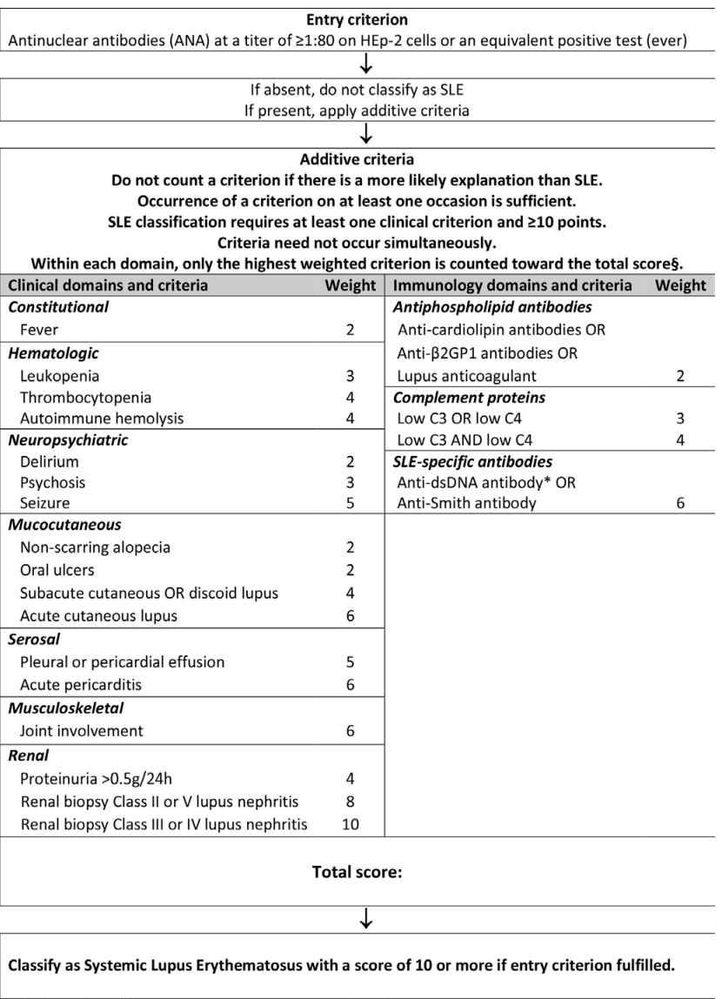

- **Giriş kriteri:** ANA ≥ 1:80 (HEp-2 hücreleri veya eşdeğeri)
- Klinik ve immünolojik domainler üzerinden **ağırlıklı puanlama**
- **Total skor ≥ 10** → SLE sınıflaması

---

## AYIRICI TANI

| Grup                | Hastalıklar                                                                                                                           |
| ------------------- | ------------------------------------------------------------------------------------------------------------------------------------- |
| Romatizmal          | Sjögren sendromu, sistemik skleroz, dermatomyozit                                                                                     |
| Non-romatizmal      | HIV, endokardit, viral infeksiyonlar, hematolojik maligniteler, vaskülit, ITP, diğer nefrit nedenleri (özellikle viral enfeksiyonlar) |
| Örtüşme sendromları | UCTD, Mikst Konnektif Doku Hastalığı (MKDH)                                                                                           |

---

## TEDAVİ

### Genel Prensipler

- Hedef organın türü ve tutulum şiddeti belirleyicidir
- Tedavi toksisitesi minimal tutulmalı
- Her hastada agresif tedavi gerekmez
- Tedavi öncesi **enfeksiyon ekarte** edilmeli
- Eşlik eden durumlar (HT, hiperlipidemi, osteopeni) unutulmamalı

### Şiddete Göre Tedavi

| Şiddet | Klinik | Tedavi |
|---|---|---|
| **Hafif** | Deri, eklem tutulumu | NSAİİ, lokal tedaviler, **hidroksiklorokin** |
| **Orta** | Serozit, sitopeni, belirgin deri/eklem | Orta-yüksek doz kortikosteroid + azatioprin veya metotreksaf |
| **Ciddi** (yaşamı tehdit) | Kardit, nefrit, sistemik vaskülit, serebral bulgular | ⭐ Yüksek doz İV kortikosteroid + **İV siklofosfamid** |
| **Özel durumlar** | Nefrit (membranöz), miyozit, trombositopeni | Siklosporin; bazı nefritlerde Mikofenolat mofetil |
| **Kurtarma** | Yanıtsız ciddi vakalar | Plazmaferez veya İV immünoglobulin |

> 💡 **Hidroksiklorokin:** Hafif-orta SLE'de temel ilaç; hastalık alevlenmelerini önler, mortaliteyi azaltır.

---

## PROGNOZ

- Tahmin edilemeyen dalgalı seyir
- Mortalite son dekatlarda belirgin azalmıştır:
  - 1955 öncesi: 5 yıllık sağkalım < %50
  - Günümüz: 10 yıllık sağkalım **>%90**, 15 yıllık **~%80**

| Ölüm Zamanı | Başlıca Nedenler |
|---|---|
| **Erken** | Hastalık aktivitesi (nefrit, SSS, enfeksiyon) |
| **Geç** | ⭐ Koroner arter hastalığı (steroid → hiperlipidemi, hipertansiyon, obezite) |

---

## ÖZET: AKILDA KALMASI GEREKENLER

| Konu | Anahtar Bilgi |
|---|---|
| Epidemiyoloji | %90 kadın; pik 15–40 yaş; HLA-DR3 |
| En iyi tarama testi | ANA (%95–100 sensitif; negatifse SLE dışla) |
| En spesifik antikorlar | Anti-dsDNA + Anti-Sm |
| Drug-induced lupus | Anti-histon antikor (+) |
| Neonatal lupus | Anti-Ro/SSA → konjenital kalp bloğu |
| En sık başvuru | Artralji/artrit (%90–95) |
| En spesifik deri bulgusu | Malar raş (nasolabial oluk korunur) |
| En sık ölüm nedeni (erken) | Aktif nefrit / enfeksiyon |
| En sık ölüm nedeni (geç) | Koroner arter hastalığı |
| En ağır renal klas | Klas IV (diffüz proliferatif) |
| Libman-Sacks | Non-bakteriyel verrüköz endokardit; en sık mitral |
| Cytoid body | Retinal eksuda — SLE'ye spesifik |
| Oral ülser özelliği | Genellikle **ağrısız** |
| Artrit özelliği | Nonerozif; RA'dan daha hafif |
