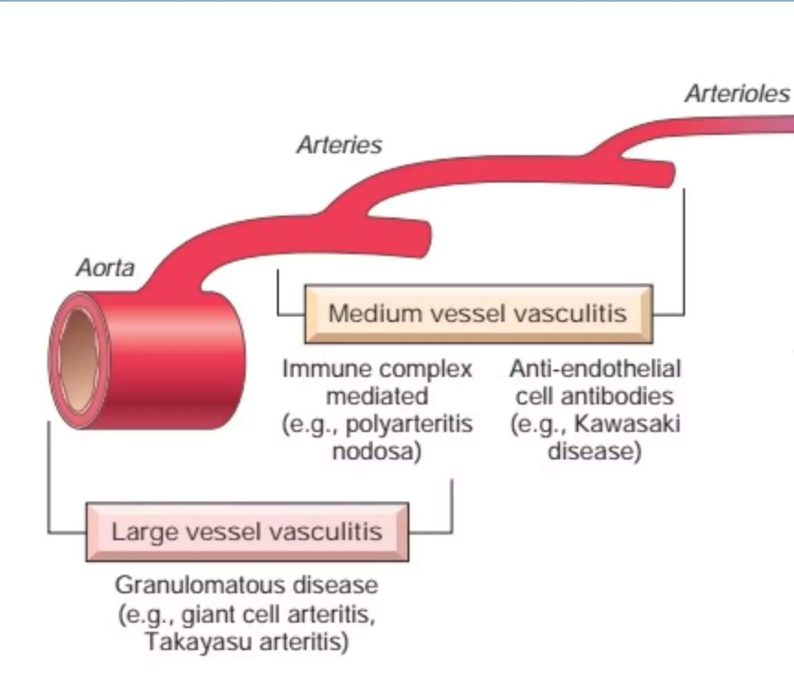
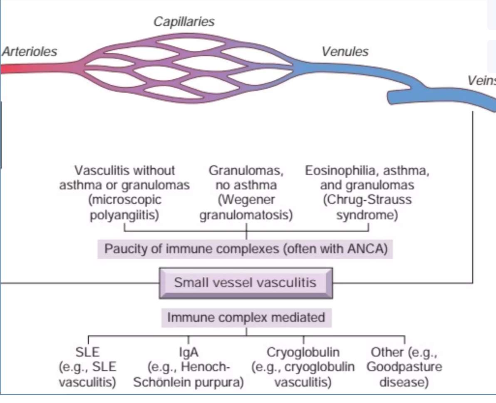
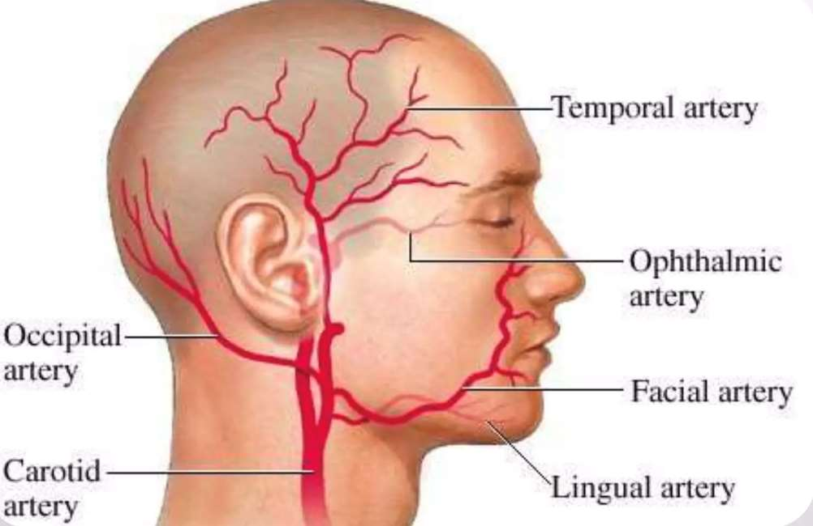
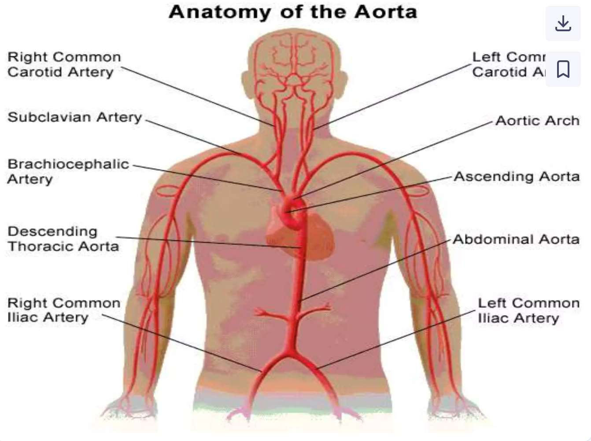
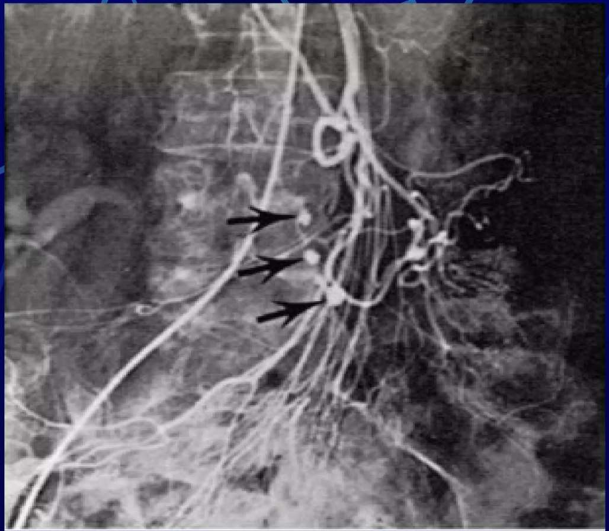
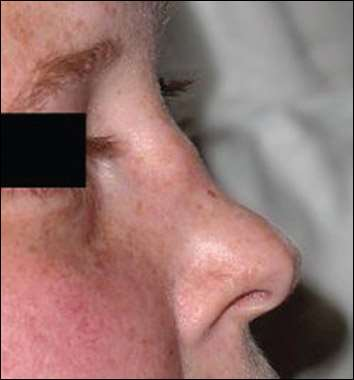
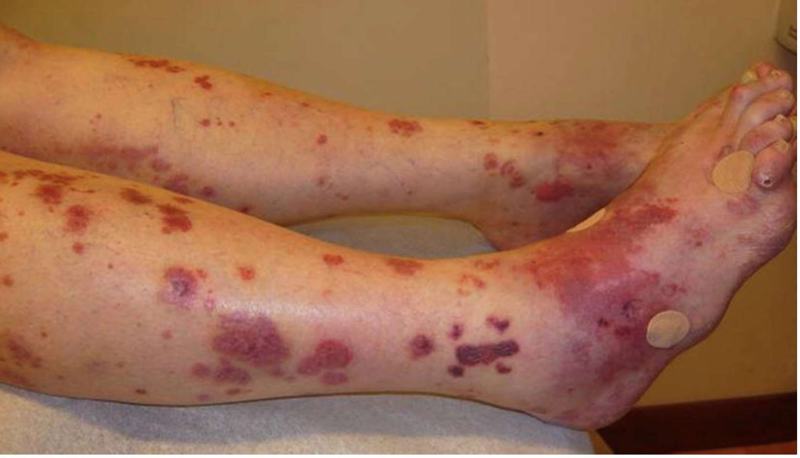

# VASKÜLİTLER

**Hazırlayan:** Dr. Öğr. Üyesi Reyhan Köse Çobanoğlu
**Bölüm:** Romatoloji

---

## İÇİNDEKİLER

1. [Tanım ve Genel Bakış](#tanım-ve-genel-bakış)
2. [Patogenez](#patogenez)
3. [Sınıflandırma](#sınıflandırma-chapel-hill-2012)
4. [Büyük Damar Vaskülitleri](#büyük-damar-vaskülitleri)
5. [Orta Damar Vaskülitleri](#orta-damar-vaskülitleri)
6. [Küçük Damar Vaskülitleri](#küçük-damar-vaskülitleri)
7. [Klinik Yaklaşım](#klinik-yaklaşım)
8. [Tanı](#tanı)
9. [Tedavi](#tedavi)

---

## TANIM VE GENEL BAKIŞ

> **Vaskülit:** Damar duvarının inflamasyonudur.

Temel mekanizma:

- Damar duvarına lökosit göçü → **doku hasarı**
- Damar duvar bütünlüğü bozulursa → **kanama**
- Lümende akım kısıtlanırsa → **iskemi ve nekroz**

**Etkilenebilecek damarlar:** Aorta'dan kapillere kadar her çaptaki damar

**Etkilenebilecek organlar:** Her organ (akciğer, karaciğer, böbrek, cilt, SSS...)

| Etki Şekli | Açıklama |
|---|---|
| Tek organ | Örn. yalnızca deri |
| Çok organ | Aynı anda birkaç organ |

**Primer mi, Sekonder mi?**

- **Primer:** Altta yatan hastalık yok
- **Sekonder:** Başka hastalığa bağlı / ilaca bağlı / enfeksiyöz

---

## PATOGENEz

### Non-infeksiyöz Vaskülit Mekanizmaları

| Mekanizma | Örnek |
|---|---|
| İmmün kompleks depolanması | HSP, Kriyoglobülinemik vaskülit |
| Anti-nötrofil sitoplazmik antikorlar (ANCA) | GPA, Mikroskopik polianjitis, EGPA |
| Anti-endotelyal hücre antikorları | Kawasaki |
| Otoreaktif T hücreleri | Dev hücreli arterit |

### İmmün Kompleks Yolağı

```
Antijen-antikor kompleksi → damar duvarında birikim
        ↓
C5a aktivasyonu → kemoatraktanlar
        ↓
Vazoaktif aminler + lökotrienler → damar permeabilite ↑
        ↓
Nötrofil infiltrasyonu → damar duvarı hasarı
        ↓
Subakut-kronik: Mononükleer hücre infiltrasyonu
```

### Granülomatöz Vaskülit Yolağı

```
IFN-γ → Endotel aktivasyonu → HLA-II ekspresyonu
        ↓
CD4+ T hücrelerine antijen sunumu
        ↓
Endotelden IL-1 salınımı → T hücre aktivasyonu → Granülom
```

---

## SINIFLANDIRMA (Chapel Hill 2012)





| Damar Boyutu | Hastalıklar |
|---|---|
| **Büyük damar** | Dev Hücreli Arterit, Takayasu Arteriti |
| **Orta damar** | Kawasaki Hastalığı, Poliarteritis Nodosa |
| **Küçük damar** | GPA (Wegener), Mikroskopik Polianjitis, EGPA (Churg-Strauss), HSP, Kriyoglobülinemik Vaskülit, Kütanöz Lökositoklastik Anjiitis |

> 💡 **Akılda kalması için:** "Büyük-Orta-Küçük" hiyerarşisi boyutu ifade eder, ağırlığı değil — küçük damar vaskülitleri ciddi sistemik tutulum yapabilir.

---

## BÜYÜK DAMAR VASKÜLİTLERİ

### Dev Hücreli (Temporal) Arterit



**Kimlerde?**
- ⭐ **50 yaş üzeri** (altında görülmez)
- Kadın/Erkek = **3/1**
- Polimiyaljiya romatika ile %40-60 birliktelik

**Histopatoloji:** Dev hücreli granülomatöz inflamasyon

**Polimiyaljiya Romatika ile farkı:**

| Özellik | Temporal Arterit | Polimiyaljia Romatika |
|---|---|---|
| Baş ağrısı | ✅ Belirgin | ❌ |
| Omuz/kalça ağrısı | Olabilir | ✅ Belirgin |
| Temporal arterit birlikteliği | — | %15-30 |
| Görme kaybı riski | ✅ Yüksek | ❌ |

#### Tanı Kriterleri (5 kriterden ≥3 → tanı)

| # | Kriter |
|---|---|
| 1 | Başlama yaşı **≥50** |
| 2 | **Yeni** başlayan lokalize baş ağrısı |
| 3 | Temporal arterde anormallik (hassasiyet veya nabız alınamaz) |
| 4 | Sedimantasyon **≥50 mm/sa** |
| 5 | Arter biyopsisinde **tipik bulgular** (granülomatöz inflamasyon) |

> 💡 **Mnemonik — "50'ler kuralı":** Yaş ≥50, Sedim ≥50 mm/sa — ikisi de 50 üzeri.

---

### Takayasu Arteriti (Nabızsızlık Hastalığı)



**Kimlerde?**
- ⭐ **50 yaş altı** (temporal arteritin tam tersi!)
- Kadın > Erkek
- İnsidans: 2.6/1.000.000

**Tutulum:** Aorta + aortanın tüm büyük dalları (torasik ve abdominal aorta dahil)

**Histopatoloji:** Transmural inflamasyon → ciddi lüminal daralma; dev hücreli granülomatöz vaskülit

**Klinik Seyir:**

```
Erken evre (sistemik)          Geç evre (iskemik)
- Ateş, kilo kaybı          → - Ekstremite klodikasyonu
- Halsizlik                  → - Nabız alınamaz
- Artralji                   → - Hipertansiyon
- Vizüel dengesizlikler       → - Üfürüm
```

#### Tanı Kriterleri (≥3 → tanı)

| # | Kriter |
|---|---|
| 1 | Ekstremite **klaudikasyonu** |
| 2 | Brakiyal arter nabzının **zayıflaması veya alınamaması** |
| 3 | İki kol sistolik KB'ı arasında **belirgin fark** |
| 4 | **Üfürüm** (subklaviyen veya abdominal arter üzerinde) |
| 5 | Arteriografide: damar duvarı irregülaritesi, stenoz, anevrizma, kollateraller |

> 💡 **Temporal arterit vs Takayasu:** Her ikisi de büyük damar, dev hücreli granülomatöz — **tek fark yaş**: Temporal ≥50, Takayasu <50.

---

## ORTA DAMAR VASKÜLİTLERİ

### Kawasaki Hastalığı

**Kimlerde?**
- ⭐ **Çocuklar** — %80'i 4 yaş altı
- Gecikmiş tip hipersensitivite reaksiyonu
- Anti-endotel hücre ve düz kas antikorları

**Seyir:** Kendini sınırlayıcı (10-12 gün) **ancak** tedavisiz kalırsa %20 kardiyak komplikasyon

#### Klinik — "CRASH + Ateş" Mnemoniki

| Harf | Bulgu |
|---|---|
| **C** | **C**onjunctivitis (konjunktivit) |
| **R** | **R**ash (döküntü) |
| **A** | **A**denopathy (servikal lenfadenopati) |
| **S** | **S**trawberry tongue — çilek dili, dudak çatlakları, oral mukoza değişiklikleri |
| **H** | **H**and/foot — palmar eritem ve ödem |

#### Kardiyak Komplikasyonlar (tedavisiz)

* Koroner arterit
* Miyokard infarktüsü
* Kalp yetmezliği
* Aritmiler
* Periferik arter oklüzyonu

---

### Poliarteritis Nodosa (PAN)

**Kimlerde?**
- Multisistemik, küçük ve orta büyüklükteki arterler
- Nekrotizan vaskülit
- E > K (2/1), 4.-5. dekad
- ⭐ **%20-30 HBsAg (+)**

**Önemli özellikler:**

| Özellik | PAN |
|---|---|
| Pulmoner tutulum | ❌ **Yapmaz** (ayırt edici!) |
| Renal/viseral arter | ✅ Sık |
| ANCA | ❌ Negatif |
| HBsAg | ✅ Pozitif olabilir |

**Klinik:**
- Nonspesifik konstitüsyonel belirtiler
- Hipertansiyon, karın ağrısı, kanlı diyare
- Yaygın kas ağrısı
- Periferik nöropati (motor)
- Cilt: raş, purpura, nodül, kutanöz enfarktlar



**Tanı:** Anjiografide **multiple anevrizmalar** veya tutulan organ biyopsisi

---

## KÜÇÜK DAMAR VASKÜLİTLERİ

### ANCA İlişkili Vaskülitler — Genel Bakış

> **ANCA = Antinötrofil Sitoplazmik Antikor**

| ANCA Tipi | Boyanma | Major Antijen | Hangi Hastalık |
|---|---|---|---|
| **c-ANCA** | Sitoplazmik | Proteinaz-3 (PR-3) | GPA (Wegener) — %70-90 (+) |
| **p-ANCA** | Perinükleer | Myeloperoksidaz (MPO) | Mikroskopik PAN, EGPA — değişken |

> 💡 **Akılda kalması:** **c**-ANCA → **G**ranülomatöz (G harfi, sitoplazmik=geniş boyanma); **p**-ANCA → **p**eri-nükleer, mikro-PAN ve EGPA.

---

### Granülomatöz Polianjitis — GPA (Wegener Granülomatozu)

**Tanım:** Üst ve alt solunum yollarının + glomerülonefritin granülomatöz nekrotizan vasküliti

**⚠️ ÖNEMLİ:**
* **c-ANCA** pozitifliği karakteristik
* Tedavi edilmezse **aylar içinde fatal**
* Renal tutulum **hızlı progresyon** gösterir

#### Organ Tutulumu

| Organ | Sıklık | Bulgular |
|---|---|---|
| Üst solunum yolu | %90 | Mukoza ülserasyonu, pürülan burun akıntısı, sinüzit |
| Akciğer | %85-90 | Öksürük, hemoptizi, dispne |
| Böbrek | %80 | Kresentik GN (hızlı ilerleyen) |
| Göz | %52 | Konjunktivit, sklerit, dakriyosistit |
| Cilt | %40 | Papül, vezikül, purpura, ülser, nodül |
| MSS | %23 | Mononöritis multipleks |
| Kalp | %8 | Perikardit, koroner vaskülit |



> 💡 **Akılda kalması — "BUNS":** **B**urun (%90), **U**ST solunum yolu, **N**efrit (%80), **S**oluk (akciğer %85-90)

---

### Mikroskopik Polianjitis

**Tutulum:** Kapillerler, venüller, arterioller → sistemik nekrotizan vaskülit

**PAN ile farkı — kritik tablo:**

| Özellik | Mikroskopik Polianjitis | PAN |
|---|---|---|
| Pulmoner kapiller | ✅ Sık tutulur | ❌ Tutulmaz |
| Glomerülonefrit | ✅ %90 | GN olmaksızın böbrek tutulumu |
| ANCA | ✅ %50-80 (+) | ❌ Negatif |
| HBsAg | ❌ Negatif | ✅ Pozitif olabilir |
| Mikroanevrizma | ❌ Yok | ✅ Var |
| Granülom | ❌ Yok | ❌ Yok |

> 💡 **PAN vs Mikro PAN farkını hatırla:** PAN = Pulmoner tutulum **yok**, ANCA **yok**, HBsAg **var**. Mikro PAN = bunların tam tersi.

---

### Eozinofilik Granülomatöz Polianjitis — EGPA (Churg-Strauss Sendromu)

**Klasik Triad:**

```
    Rinit
      +
    Astım       → EGPA düşün!
      +
  Eozinofili
```

**Histopatoloji:** Damar ve dokularda ezinofilik infiltrasyon + granülomatöz inflamasyon

**p-ANCA** pozitif (değişken oranda)

#### Organ Tutulumu

| Organ | Sıklık |
|---|---|
| Akciğerler | %70 |
| Sinir sistemi (mononöritis multipleks) | %70 |
| Kalp (perikardit, miyokardit, KY) | %62 |
| Cilt (peteşi, purpura, infarkt) | %60 |
| GIS | %50 |
| Kas-iskelet (artralji/artrit) | %50 |
| Böbrek | %45 |

> 💡 **EGPA vs GPA farkı:** EGPA'da **astım + eozinofili** var, GPA'da yok. Her ikisi granülomatöz ama EGPA'nın akciğer tutulumu astım zeminli.

---

### Henoch-Schönlein Purpurası (HSP)

**Klasik Tetrad:**

| Bulgu |
|---|
| 1. Purpura (palpabl) |
| 2. Artralji |
| 3. Glomerülonefrit |
| 4. GIS semptomları |

**Kimlerde?**
- Genellikle **çocuklar** — erişkinlerde **daha şiddetli**
- Sıklıkla **ÜSYE sonrası** başlar

**Patoloji:** Postkapiller venüllerde inflamasyon + **IgA immün kompleks birikimi**

> ⭐ **Hipersensitivite vaskülitinden farkı: IgA birikimi**

**Prognoz:** Çok iyi

---

### Kriyoglobülinemik Vaskülit

- Kriyoglobülinler = ısı ile çöken immünglobulin + kompleman karışımı
- ⭐ **En sık neden: Hepatit C infeksiyonu**
- İmmünkompleksler kapiller, venül ve arteriollerde depolanır

---

### Hipersensitivite Vasküliti (Kütanöz Lökositoklastik)

**En önemli bulgu:** Palpabl peteşi veya purpura

**Biyopsi:** Lökositoklastik vaskülit

**Deri dışı organ tutulumu seyrektir**

**Sık nedenler:**

| Grup | Örnekler |
|---|---|
| İlaçlar | Penisilin, sefalosporinler, sulfonamidler, fenitoin, allopurinol |
| Enfeksiyonlar | Hepatit B/C, kronik bakteriyemi (endokardit), HIV |

---

### Goodpasture Sendromu (Anti-GBM Hastalığı)

**Tanım:** Pulmoner-renal sendrom

**Mekanizma:** Anti-GBM antikorlar → glomerüler ve/veya alveolar bazal membranda tip IV kollajen alfa-3'e bağlanma

**Tanı:**
- Pulmoner hemoraji + hızlı ilerleyici GN klinik tablosu
- Serumda **anti-GBM antikor** (+)
- Tipik renal biyopsi bulguları

---

## KLİNİK YAKLAŞIM

### Kimlerde Vaskülit Düşünelim?

* Odağı bilinmeyen **ateş, kilo kaybı, yorgunluk**
* **Cilt lezyonları:** ürtiker, livedo retikülaris, palpabl purpura, nodül, ülser, nekroz
* **Raynaud fenomeni**
* Nedeni açıklanamayan **miyalji**
* **Artrit ya da artralji**
* **Hipertansiyon**
* **Nörolojik bozukluklar**

### Yüksek Özgüllüklü Klinik Bulgular



**1. Mononöritis multipleks (asimetrik polinöropati)**
- Yüksek olasılıkla vaskülit (özellikle PAN)
- Diğer yaygın neden: diabetes mellitus

**2. Palpabl purpura**

| Durum | Düşün |
|---|---|
| Yalnız purpura | Kütanöz vaskülit, Hipersensitivite vasküliti |
| Purpura + sistemik organ tutulumu | HSP, Mikroskopik polianjitis |

**3. Pulmoner-renal tutulum (hemoptizi + renal hastalık)**
- GPA (Wegener)
- Mikroskopik polianjitis

---

## TANI

### Laboratuvar

| Test | Anlam |
|---|---|
| ESH **>100 mm/sa** 🆘 | Aktif inflamasyon |
| Lökositoz, anemi, trombositoz | Sistemik inflamasyon |
| Hematüri, proteinüri | Renal tutulum |
| ANCA (c/p) | GPA, mikro-PAN, EGPA |
| Kriyoglobülinler | Kriyoglobülinemik vaskülit |
| HBsAg | PAN |
| anti-HCV | Kriyoglobülinemik vaskülit |
| Anti-GBM antikor | Goodpasture sendromu |

### Tanı Algoritması

| Katagori | Testler |
|---|---|
| **Non-spesifik** | Tam kan, sedim, CRP |
| **Organ tutulumu** | Kreatinin, tam idrar, EKG, CK, akciğer-sinüs grafisi, BT, arteriografi, EMG |
| **Etyopatogenez** | HBsAg, anti-HCV, kan kültürü, RF, kriyoglobülinler, serum kompleman, anti-GBM, ANA, anti-dsDNA, ENA, antifosfolipid antikor, ANCA |

> ⭐ **En önemli tanı yöntemi: Tutulan organ biyopsisi**

---

## TEDAVİ

### İndüksiyon

* **İV pulse steroid:** 250-1000 mg (3-5 gün) → ardından idame yüksek doz steroid (1 mg/kg/gün)
* **İmmünsüpresif ajan:** Siklofosfamid (CYC), Siklosporin (CYP), Metotreksat (MTX), Rituksimab (RTX)

### İdame

* Orta-yüksek doz steroid + immünsüpresif ajan
* Remisyonda steroid **kademeli azaltılır**
* Cevap vermeyen hastalarda immünsüpresif **değişimi veya kombinasyonu**

> 💡 **Organa ve tutulum şiddetine göre bireysel tedavi planlanır.**

---

## ÖZET KARŞILAŞTIRMA TABLOSU

| Hastalık | Damar | Yaş/Cins | ANCA | HBsAg | Pulmoner | Özellik |
|---|---|---|---|---|---|---|
| Temporal Arterit | Büyük | >50, K>E | ❌ | ❌ | — | Granülom, dev hücre; PMR birlikteliği |
| Takayasu | Büyük | <50, K>E | ❌ | ❌ | — | Nabıpsızlık, aorta+dalları |
| Kawasaki | Orta | Çocuk | ❌ | ❌ | — | CRASH; koroner komplikasyon |
| PAN | Orta | 4-5. dekad, E>K | ❌ | ✅ | ❌ | Anevrizma; pulmoner tutum yok |
| GPA | Küçük | — | c-ANCA ✅ | ❌ | ✅ | Semer burun; kresentik GN |
| Mikro PAN | Küçük | — | p-ANCA ✅ | ❌ | ✅ | GN %90; PAN'dan pulmoner (+) ile ayrılır |
| EGPA | Küçük | — | p-ANCA ✅ | ❌ | ✅ | Astım + Rinit + Eozinofili triadı |
| HSP | Küçük | Çocuk | ❌ | ❌ | ❌ | IgA birikimi; 4'lü tablo |
| Goodpasture | Küçük | — | ❌ | ❌ | ✅ | Anti-GBM; pulmoner-renal sendrom |
