# ÇOCUK ACİL HASTASINA YAKLAŞIM

**Hazırlayan:** Dr. Öğr. Üyesi Şule Demir
**Bölüm:** Çocuk Acil

---

## İÇİNDEKİLER

1. [Amaç ve Giriş](#amaç-ve-giriş)
2. [Acil Durum Tanımı](#acil-durum-tanımı)
3. [Yüksek Riskli Hasta Grupları](#yüksek-riskli-hasta-grupları)
4. [Acil Hastaya Sistematik Yaklaşım](#acil-hastaya-sistematik-yaklaşım)
5. [Çocuk Değerlendirme Üçgeni (ÇDÜ)](#çocuk-değerlendirme-üçgeni-çdü)
6. [Birincil Değerlendirme (ABCDE)](#birincil-değerlendirme-abcde)
7. [İkincil Değerlendirme](#ikincil-değerlendirme)
8. [Üçüncül Değerlendirme](#üçüncül-değerlendirme)
9. [Klinik Vaka Örneği](#klinik-vaka-örneği)

---

## AMAÇ VE GİRİŞ

✅ Doğru bir şekilde **hızlı ve sistematik değerlendirme** yapabilmek

✅ **Kritik hasta çocukları** erken tanıyabilmek

✅ **İlk müdahalenin** yapılması

✅ **Uygun yönlendirmenin** sağlanması

---

## ACİL DURUM TANIMI

> **Acil durumlar:** Aniden ortaya çıkan, yaşamsal fonksiyonları bozan ve hayatı tehdit eden durumlardır.

> **Acil vakanın en temel özelliği:** Yaşamsal bulguların gerçek ya da potansiyel olarak güvencede olmamasıdır.

> **Acil hastaya yaklaşımda en önemli özellik:** Zamana karşı yapılması ve **önceliklerin belirlenmesidir**.

---

## YÜKSEK RİSKLİ HASTA GRUPLARI

- Yenidoğan
- Motor-mental gerilik
- Anatomik / genetik hastalık
- Kronik hastalık
- İmmün sistemi baskılanmış hastalar
- Ağır malnütrisyon
- Metabolik hastalık
- Düşük sosyo-ekonomik düzey

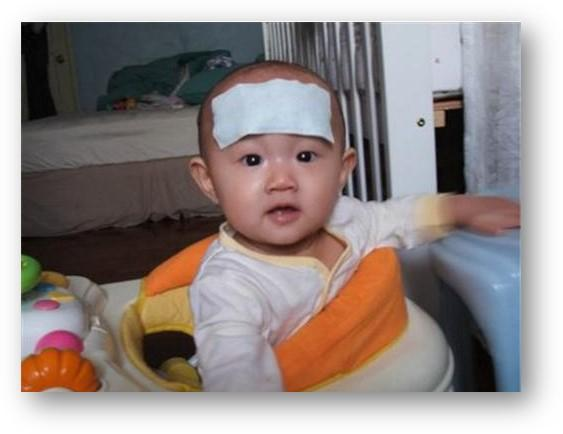

---

## ACİL HASTAYA SİSTEMATİK YAKLAŞIM

### Genel Görünüm Değerlendirmesi

| İyi Görünüm | Hasta Görünüm | Toksik Görünüm |
|-------------|---------------|-----------------|
| Gülümseme | Flu-like (grip benzeri) | Letarji / çevreye ilgisinin azalması |
| Neşeli | | Hipo / hiperventilasyon |
| Çevreyle ilgili | | Kötü perfüzyon |
| Göz teması kuruyor | | Siyanoz |
| | | Hidrasyon bozukluğu |

### Sistematik Yaklaşım Basamakları

```
          DEĞERLENDİR
               ↓
          SINIFLANDIR
               ↓
           KARAR VER
               ↓
            UYGULA
```

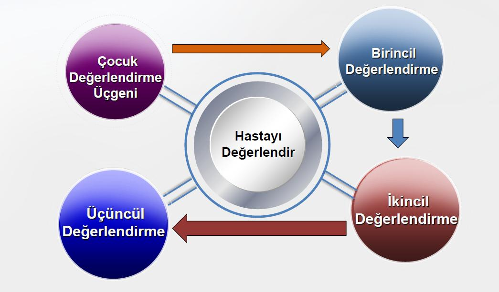

### Genel Yaklaşım Algoritması

```
   Hayatı tehdit edici bir durum VAR MI?
          ↙                ↘
        VAR                YOK
         ↓                  ↓
  Nabız ve solunum     Birincil Değerlendirme
  değerlendir →          A - Havayolu
  Müdahale et            B - Solunum
                         C - Dolaşım
                         D - Nörolojik
                         E - Tüm vücut muayene
                              ↓
                     İkincil Değerlendirme
                       Fizik muayene, Öykü
                              ↓
                     Üçüncül Değerlendirme
                     Laboratuvar, Görüntüleme
```

---

## ÇOCUK DEĞERLENDİRME ÜÇGENİ (ÇDÜ)

- Hasta ile karşılaşıldığı anda başlar
- **Saniyeler içinde** karar vermenize yarar sağlar
- Hayatı tehdit edici bir durum var mı? sorusuna yanıt arar

### A. Görünüm (Appearance)

| Harf | Değerlendirme |
|------|--------------|
| **Ç** | Çevreyle etkileşim |
| **A** | Avutulabilirlik |
| **B** | Bakış / Gözle ilişki kurma |
| **U** | Uygun konuşma / Ağlama |
| **K** | Kas tonusu |

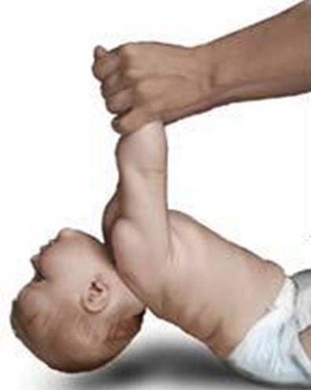

### B. Solunum Çabası (Breathing)

Oksijenizasyon ve ventilasyon yeterliliğini değerlendirir:

- **Retraksiyonlar**
- **Anormal solunum sesleri**
- **Anormal pozisyon**
- **Burun kanadı solunumu**
- **Kafa sallama** (solunumla)

#### Anormal Solunum Sesleri

| Ses | Patoloji |
|-----|----------|
| **Horlama** | Tonsil ve adenoid hipertrofi, mikrognati, obezite |
| **Stridor** | Üst havayolu tıkanıklığı |
| **Hışıltı** | Alt havayolu tıkanıklığı |
| **İnleme** | Yetersiz oksijenizasyon/ventilasyona neden olan parankim hastalıkları |

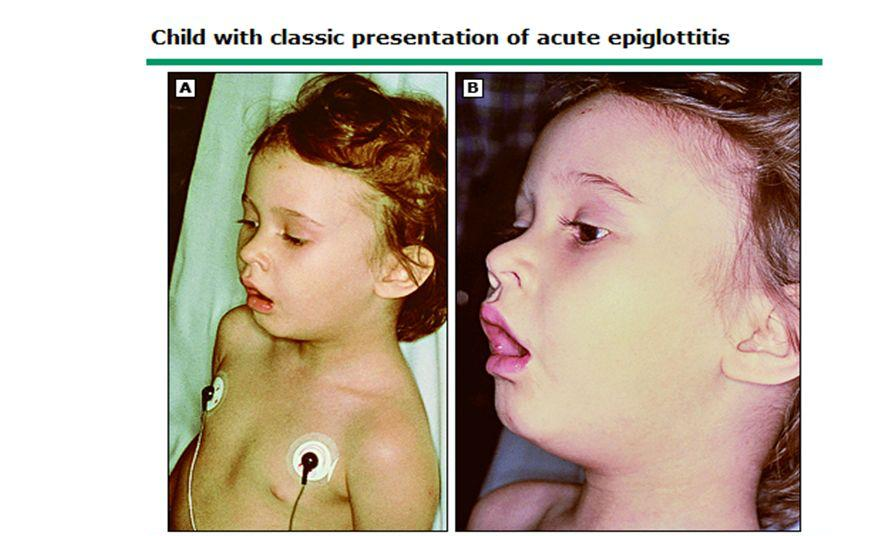

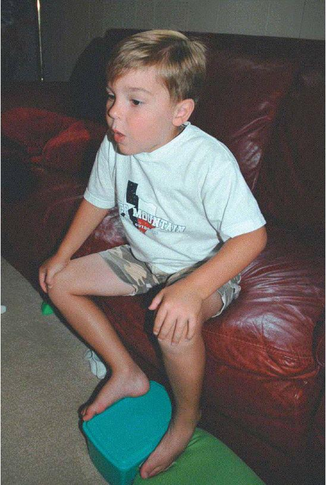

### C. Cildin Dolaşımı (Circulation/Color)

Perfüzyon hakkında hızlı bilgi verir:

- **Solukluk, soğukluk**
- **Benekli veya alacalı görünüm** (mottling)
- **Siyanoz**

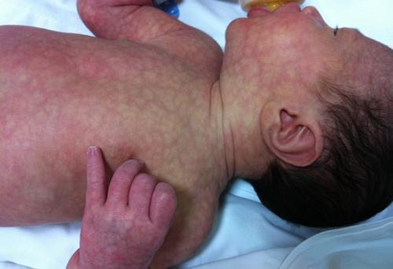

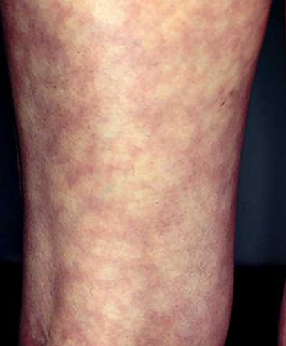

---

### ÇDÜ Bulgularına Göre Olası Patolojiler

| Görünüm | Solunum | Dolaşım | Olası Patoloji |
|:-------:|:-------:|:-------:|----------------|
| Anormal | Normal | Normal | **Beyin işlev bozukluğu** |
| Normal | Anormal | Normal | **Solunum sıkıntısı** |
| Anormal | Anormal | Normal | **Solunum yetersizliği** |
| Normal | Normal | Anormal | **Kompanse şok** |
| Anormal | Normal | Anormal | **Dekompanse şok** |
| Anormal | Anormal | Anormal | **Kalp-solunum yetersizliği** |
| NORMAL | NORMAL | NORMAL | **STABİL HASTA** |

---

## BİRİNCİL DEĞERLENDİRME (ABCDE)

### Genel Bakış

| Basamak | Alan | Hayatı Tehdit Eden Durum Varsa | Yoksa |
|---------|------|------|------|
| **A** | Havayolu | Acil müdahale: havayolu açma, oksijen, solunum desteği | İkincil ve üçüncül değerlendirmeye geç |
| **B** | Solunum | Damar yolu, sıvı desteği | Tam ve eksiksiz muayene |
| **C** | Dolaşım | Vital bulgu izlemi, monitorizasyon | Öykü |
| **D** | Nörolojik | Mesane kateteri, NG tüp | Laboratuvar / radyoloji |
| **E** | Tüm vücut | | Konsültasyonlar |
| **F** | Aile bilgilendirme | | Yeniden değerlendirme |

---

### A. Havayolu (Airway)

| Değerlendir | Uygula |
|-------------|--------|
| Açık mı? | Hava yolu açık ve bilinç açıksa → rahat-uygun pozisyon ver |
| Açıklık sürdürülebilir mi? | Hava yolu tehlikede ise → pozisyon ver, aspire et, hava yolu açma manevraları |
| Hastanın aldığı postür? | Bilinç kapalı ise → oral airway |
| Duyulan solunum sesleri var mı? | Hava yolu açıklığı sürdürülemiyorsa → **entübe et** |
| | Yabancı cisim ise → yaşa uygun manevra uygula |

---

### B. Solunum (Breathing)

| Değerlendir | Uygula |
|-------------|--------|
| Solunum var mı? Yeterli mi? | Solunum eforu yeterli ise → **yüksek akımlı oksijen** ver |
| Solunum hızı ve yapısı? | Solunum eforu yetersizse → **balon-maske ile pozitif basınçlı ventilasyon** yap |
| Yardımcı solunum kasları kullanılıyor mu? | Gerekirse **entübe et** |
| Burun kanadı solunumu? | |
| Göğüs hareketleri? | |
| Solunum sesleri? | |
| Nabız oksimetre? | |

#### Oksijen Satürasyonu

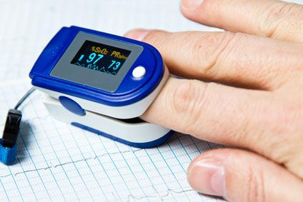

| Değer | Yorum |
|-------|-------|
| **%94-100** | Normal |
| **%90-93** | Hafif hipoksemi |
| **<%90** | **Ağır hipoksemi** |

> ⚠️ Basit maske ile %100 O₂ alırken satürasyon **<%90** ise → bir başka yardımlı solutma desteği verme endikasyonu vardır!

#### Nabız Oksimetrenin Yanıltıcı Sonuç Verdiği Durumlar

| Durum | Etki |
|-------|------|
| Zayıf perfüzyon | Normalden **daha düşük** değer |
| Hastanın hareket etmesi | Normalden daha düşük değer |
| Hastaya uygun olmayan prob | Normalden daha düşük değer |
| **Methemoglobinemi** | Normalden **daha yüksek** değer |
| Siyanotik kalp hastalığı | Normalden daha düşük değer |
| **Karboksihemoglobin yüksekliği** (CO zehirlenmesi) | Normalden **daha yüksek** değer |

---

### C. Dolaşım (Circulation)

| Değerlendir | Uygula |
|-------------|--------|
| Kalp atım hızı yeterli mi? | Perfüzyon yeterli ise → **monitorize et, damar yolu aç** |
| Santral ve periferik nabızlar? | Şok belirtileri varsa → vasküler yol (İV veya İO) aç |
| Atım hacmi normal mi? | **İzotonik sıvı bolusu** yap |
| Kapiller dolum zamanı? | Bazal laboratuvar incelemeleri yap |
| Kan basıncı normal mi? | İdrar sondası uygula |
| Deri ısısı ve rengi? | |
| Hipotermi, siyanoz var mı? | |
| Bilinç değişikliği? | |
| İdrar miktarı? | |

#### Kalp Hızı Hakkında Önemli Notlar

- Yenidoğanlarda nabız sayısının **<100/dk** olması → **bradikardi** (en sık sebebi **hipoksi**)
- **Taşikardi**: hipoksi ve perfüzyon bozukluğunun (şok) erken bulgusu olabilir; ama yüksek ateş, stres, ağrı ve heyecan gibi durumlarda da görülebilir
- Çok ağır solunum ve kalp yetmezliğinde veya şok kritik noktaya ulaştığında → kalp hızı taşikardiden **normale**, ardından **bradikardiye** döner

#### Kapiller Dolum Zamanı

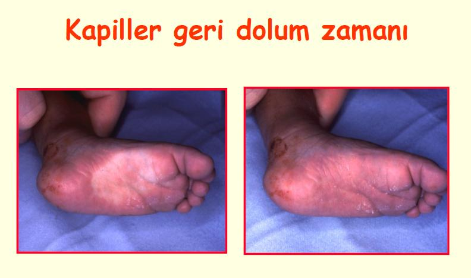

> Normal kapiller dolum zamanı: **2 saniye**

#### Nabız Palpasyonu

- Kritik hastalarda ilk nabız sayısı **nabız palpasyonu** ile ölçülmeli
- **Süt çocuğu:** Brakial veya femoral nabız
- **Büyük çocuk:** Karotis nabzı
- **Santral ve periferik nabızlar birlikte** palpe edilmeli

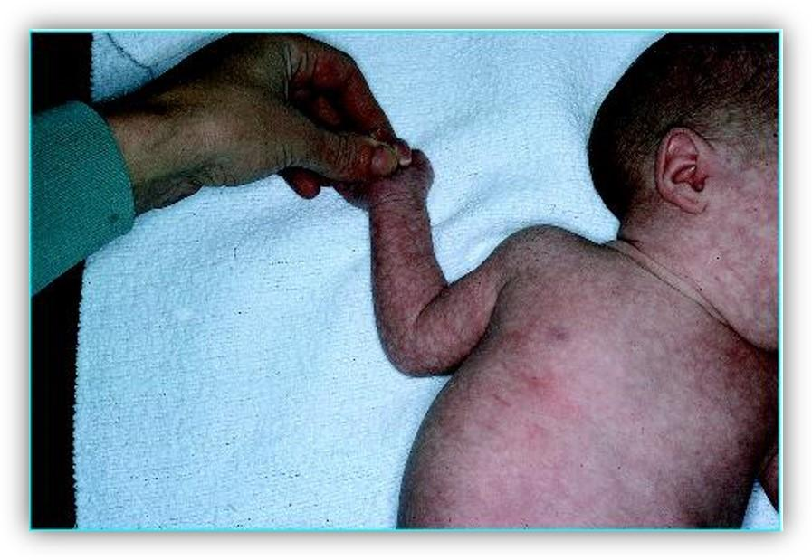

> ⚠️ Santral/periferik nabız arasında fark olması **şok belirtisi** olabilir!

> **Periferik nabızların** (radial, dorsalis pedis, posterior tibial) zayıf alınması → **kompanse şok**
> **Santral nabızların** (brakial, karotis, femoral, aksiller) zayıflığı → **dekompanse şok**

#### Hipotansiyon Sınırları

| Yaş | Sistolik KB'ye göre hipotansiyon (mmHg) |
|-----|----------------------------------------|
| **Term yenidoğan** | <60 |
| **1 ay - 1 yaş** | <70 |
| **1 - 10 yaş** | <70 + (2 x yaş) |
| **>10 yaş** | <90 |

**⚠️ ÖNEMLİ:**
- Şok hastaları erken dönemde **normal kan basıncı** ile gelirler (**kompanse şok**)
- Şok ilerlediğinde (damar içi sıvının yaklaşık **>%30 kaybı**) → **hipotansiyon** gelişir (**dekompanse şok**)
- Bu şokun ilerlemiş halidir
- **Şok tanısında hipotansiyon kullanılmaz!**

---

### D. Nörolojik Durum (Disability)

| Değerlendir | Uygula |
|-------------|--------|
| Bilinç düzeyi (USAY) | Havayolunu aç |
| Duruş: hipoton/hiperton? | Oksijen ver |
| Fontanel? | Ventilasyon desteği |
| Konvülziyon? | Dolaşım desteği |
| Pupil (ışık yanıtı, simetri)? | |
| Kapiller kan şekeri? | |

#### USAY Bilinç Skalası

| Kategori | Uyarı | Yanıt | GKS Karşılığı |
|----------|-------|-------|:---:|
| **U** - Uyanık | Uyaran yok | Uyanık | 15 |
| **S** - Sözel | Sözel uyarı | Yanıt var | 13 |
| **A** - Ağrılı | Ağrılı uyarı | Yanıt var | 8 |
| **Y** - Yanıtsız | Sözel ve ağrılı uyaran | Yanıtsız | 3 |

> Kapiller kan şekeri: YD **<40 mg/dL**, Çocuk **<60 mg/dL** → hipoglisemi

#### Glasgow Koma Skalası (GKS)

| Parametre | Skor | Çocuk | Bebek |
|-----------|:----:|-------|-------|
| **Göz Yanıtı** | 4 | Kendiliğinden göz açma | Kendiliğinden göz açma |
| | 3 | Sözel uyarıyla göz açma | Sözel uyarıyla göz açma |
| | 2 | Ağrılı uyaranla göz açma | Ağrılı uyaranla göz açma |
| | 1 | Yanıt yok | Yanıt yok |
| **Motor Yanıt** | 6 | Emirlere uyma | Spontan hareketler |
| | 5 | Uyarıyı lokalize etme | Dokunmaya çekme yanıtı |
| | 4 | Ağrılı uyarana çekme yanıtı | Ağrıya çekme yanıtı |
| | 3 | Ağrılı uyarana fleksiyon | Fleksiyon (dekortike) |
| | 2 | Ağrılı uyarana ekstansiyon | Ekstansiyon (deserebre) |
| | 1 | Yanıt yok | Yanıt yok |
| **Sözel Yanıt** | 5 | Oryante | Yaşına uygun ses çıkarma |
| | 4 | Konfüze | Huzursuz ağlama |
| | 3 | Uygunsuz sözler | Ağrı ile ağlama |
| | 2 | Anlamsız sözler | Ağrı ile inleme |
| | 1 | Yanıt yok | Yanıt yok |

---

### E. Vücut Sıcaklığı ve Tüm Vücut Bakısı (Exposure)

- Tam değerlendirme yapmak için **hastayı soy** (travma izi, döküntü, aktif kanama)
- **Hipotermi ya da hipertermiyi** önle

---

## İKİNCİL DEĞERLENDİRME

### BASİT Öykü

| Harf | Alan | Açıklama |
|------|------|----------|
| **B** | Bulgular | Hastanın başvuru şikayetleri |
| **A** | Alerji | Alerjisi var mı? |
| **S** | Son yemek | En son ne zaman/ne kadar yedi? Özellikle küçük çocuk ve bebeklerde **iştahta ani azalma ciddi hastalık belirtisi** olabilir |
| **İ** | İlaç | Kullandığı kronik veya akut ilaç var mı? |
| **T** | Tıbbi özgeçmiş | Doğum ağırlığı, kronik hastalık, benzer yakınmalar, hastaneye yatış/ameliyat öyküsü, aşılar, soy geçmiş |
| **Öykü** | Olayın tıbbi öyküsü | Başvuru şikayetine odaklanmış tıbbi öykü |

---

## ÜÇÜNCÜL DEĞERLENDİRME

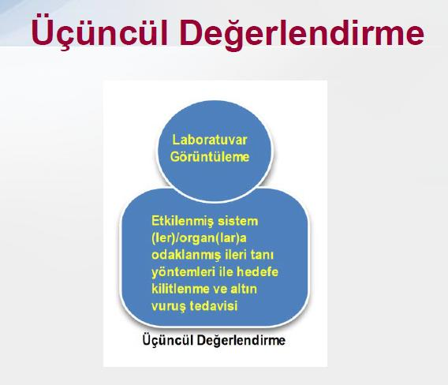

- Etkilenmiş sistem/organlara odaklanmış ileri tanı yöntemleri
- **Laboratuvar** ve **görüntüleme** tetkikleri
- Hedefe kilitlenme ve altın vuruş tedavisi

---

## KLİNİK VAKA ÖRNEĞİ

**📋 VAKA ÖRNEĞİ 1: Hipovolemik Şok**

**Hasta:** 15 aylık, erkek
**Öykü:** İki gündür kusma ve ishal. İshal sulu ve sarı. Annenin ağızdan sıvı verme çabaları başarısız. Çocuk iyice halsiz hale gelince ve ağızdan almayı reddetmeye başlayınca acil servise getirilmiş.

**ÇDÜ Değerlendirmesi:**
- **Görünüm:** Dehidrate, çevreden gelen uyarılara yetersiz yanıt → ❌ Anormal
- **Solunum:** Hafif taşipne var, çekilme yok → Normal (sessiz taşipne)
- **Dolaşım:** Gövde ve yüz soluk, ekstremitelerde benekli/alacalı görünüm → ❌ Anormal
- **ÇDÜ Sonucu:** → **ŞOK**

**Birincil Değerlendirme:**

| Basamak | Bulgu |
|---------|-------|
| **A** | Havayolu temiz, açık |
| **B** | SS 45/dk, derin solunum var, SpO₂ %100 |
| **C** | KTA 160/dk, periferik nabızlar zayıf, KDZ 5 sn, TA 90/58 mmHg |
| **D** | Letarjik, sözlü komutları uygulamıyor |
| **E** | Normotermik, döküntü ya da travma izi yok |

**Tanı:** Şok (**hipovolemik**)

**Tedavi:**
1. Monitorize et
2. Hızla damar yolunu aç (İV/İO)
3. **20 mL/kg'dan SF bolus** ver
4. Devamlı olarak hastayı yeniden değerlendir
5. İkincil değerlendirme (fizik bakıyı tamamla, öykü al)

---

## ÖZET - SON SÖZ

1. Acil bakı, ayaktan başvuran hastalarda **triyaj** ile başlar
2. **ÇDÜ** ile hastanın fizyolojik durumunu belirle, acil tedavi/girişim gerekliliğine karar ver ve başlat
3. **ABCDE** ile devam et
4. Hayati tehdit eden durum varsa **acil müdahale** et
5. İkincil değerlendirme ile **öykü ve ayrıntılı fizik bakıyı** tamamla
6. Gerekli ise üçüncül bakı (laboratuvar/radyoloji) kullan
7. İzlemde hasta **tekrarlayan defalar** değerlendirilmeli
8. **Acil serviste tetkikler öncelikli değildir**
9. Her tedavi ve girişimin sonuçlarını **yeniden değerlendir**
10. Hasta kayıtlarını tutmak çok önemlidir

> ⚠️ **"Yazılmamışsa Yapılmamıştır"**

---

**Son Güncelleme:** 2025
**Kaynak:** Çocuk Acil Ders Notları, Aydın Adnan Menderes Üniversitesi Tıp Fakültesi
